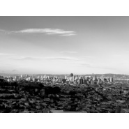

Chilling Moment in San FranciscoA Zhuocheng Wei Soundtrack Collection
============================

|  |  |
| :--: | :-- |
| [ Chilling Moment in San FranciscoA Zhuocheng Wei Soundtrack Collection](https://emumo.xiami.com/album/2102655785) | **艺人**: [韦卓成](../index.md) **语种**: 其他 **唱片公司**: 独立发行 **发行时间**: 2016年11月22日 **专辑类别**: 原声带, 影视音乐 **专辑风格**:  **播放数**: 1018 **收藏数**: 13 **评论数**: 0  |

## 简介

A collection from my score projects in 2015-2016. These tracks are mostly in same style and mood, so I put them together. In the past three years, I ba<x>sed on San Francisco in California to work and study. So much pleasure to share my tracks to everybody. Hope you enjoy and good luck. I don't want to let people download them without permit, so if you had any question and project collaboration, please contact me: <a href="mailto:cheukshingwai@gmail.com">cheukshingwai@gmail.com</a> or <a href="mailto:377642760@qq.com.">377642760@qq.com.</a> I glad to hear your opinion. Thanks. </x>
 

 
 

Zhuocheng
 

Nov.22.2016 in SF
 

 
 

 
 

 
 

这张配乐合集是选自2015年-2016年的部分作品，所有作曲、编曲、录音等均为本人创作和版权所有。如有需要使用或配乐项目合作，请联<a href="mailto:cheukshingwai@gmail.com">cheukshingwai@gmail.com</a> 或 <a href="mailto:377642760@qq.com">377642760@qq.com</a>。谢谢。
 

 
 

韦卓成
 

Nov. 22. 2016
 

 in San Francisco

## 曲目

## 评论

