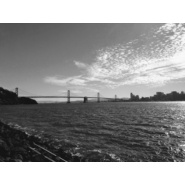

Mix A LotA Zhuocheng Wei Sountrack Collection
============================

|  |  |
| :--: | :-- |
| [ Mix A LotA Zhuocheng Wei Sountrack Collection](https://emumo.xiami.com/album/2102655800) | **艺人**: [韦卓成](../index.md) **语种**: 其他 **唱片公司**: 独立发行 **发行时间**: 2016年11月22日 **专辑类别**: 原声带, 影视音乐 **专辑风格**: 电影原声 Film Score, 原声 Soundtrack, 民族融合新世纪 Ethnic Fusion New Age **播放数**: 2050 **收藏数**: 12 **评论数**: 0  |

## 简介

Another my soundtrack collection. All music/arranging/recording by myself. In these collection, you will hear different genres in this collection. I like to explore different areas and culture, so I also try to cover middle eastern in my work. Also, there are some commercial music tracks from different purposes, such as wrote for children. Thanks for listening. Any question and needed, please contact me via: <a href="mailto:cheukshingwai@gmail.com">cheukshingwai@gmail.com</a> or <a href="mailto:377642760@qq.com.">377642760@qq.com.</a> It's my pleasure to hear from you. Good luck. 
 

 
 

 
 

这是我另一张配乐合集，这张合集的风格多样化，包含中东，动作场面，儿童片段等等。希望大家会喜欢以及能够了解到我写作的多样性。谢谢。任何需要或合作请联系邮箱。
 

 
 

韦卓成
 

Nov. 22. 2016 in San Francisco

## 曲目

## 评论

