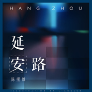

延安路
============================

|  |  |
| :--: | :-- |
| [ 延安路](https://emumo.xiami.com/album/2103722159) | **艺人**: [韦卓成](../index.md) **语种**: 国语 **唱片公司**: 独立发行 **发行时间**: 2018年05月28日 **专辑类别**: EP, 单曲 **专辑风格**: 民谣流行 Folk Pop **播放数**: 763909 **收藏数**: 4 **评论数**: 1  |

## 简介

 

想写首杭州，有了，
 

想写首西湖，也有了，
 

那就写首《延安路》吧！
 

它贯通西湖，河坊街，形形色色的故事和传说在这里上演。
 

 

词曲编曲录音：韦卓成演唱：陈摆摊
 
  

## 曲目

## 评论

|  |  |  |
| :-- | :-- | :-- |
|  [虾米用户](https://emumo.xiami.com/u/52687964)   2018-10-31 01:46 赞(0) 踩(0) | 
62.
 |
