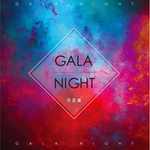

GALA NIGHT
============================

|  |  |
| :--: | :-- |
| [ GALA NIGHT](https://emumo.xiami.com/album/2102970883) | **艺人**: [许亚童](../index.md) **语种**: 国语 **唱片公司**: 研雅文化 **发行时间**: 2017年12月08日 **专辑类别**: EP, 单曲 **专辑风格**:  **播放数**: 7738 **收藏数**: 2 **评论数**: 0  |

## 简介

她的爱在细微末节处凸显「真挚的细腻」  
她的歌声有着抚慰心灵的「魔力」  
她对音乐的执着始终「竭尽全力」  
她的专辑保留自己对生活中一抹阳光的热爱  
紧随她的声音，在这个寒冬的夜晚与她一起在音乐的怀抱中「沉溺」！  
  
国内首位EDM和R&amp;B的发声女孩，“治愈系女神”许亚童最新演绎由超豪华制作团队打造别样的“许式情歌”———《Gala Night》、《沉溺》  
这两首暖心歌曲《Gala Night》、《沉溺》定于12月10日正式发行，从“心”蜕变，感悟生活，用音乐去回忆心底珍藏的故事。  
褪去繁琐的修饰和一丝不苟，许亚童以最本真的形象出现，就像一位老友，穿着舒适的家居服，和你一起感受最朴实的生活。  
  
出道多年，许亚童大大小小曾经誓下的梦想都已实现。而她坦言，音乐才是她从来没有后悔过的选择。她也是幸运的，把握住了每一次机遇，用自己珍爱的音符连接着生活中的每一帧画面，记录着前行路上的起起伏伏坎坷崎岖，用不懈的努力迎接着更好的自己。  
  
在《Gala Night》中，许亚童与词曲人Mermaidry、石天天无缝合作，由音乐人吕研熙监制护航，用柔情的嗓音诉说着现实生活中反反复复的今天和明天，释怀那些因爱而变成遗憾的遗憾！柔和的嗓音更是唱出了那份撕心的痛楚。许亚童在第一次听到这首歌的demo时，就被这个旋律所打动，她也希望这首歌曲能够去让更多的人听过之后，有自己的独特的感受。

## 曲目

## 评论

|  |  |  |  |
| :-- | :-- | :-- | :-- |
