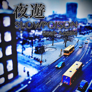

夜游SLOWPOISON说唱团体
============================

|  |  |
| :--: | :-- |
| [ 夜游SLOWPOISON说唱团体](https://emumo.xiami.com/album/1324944287) | **艺人**: [SLOWPOISON说唱团体](../index.md) **语种**: 国语 **唱片公司**: 独立发行 **发行时间**: 2015年02月26日 **专辑类别**: EP, 单曲 **专辑风格**: 爵士说唱 Jazz Rap **播放数**: 495714 **收藏数**: 82 **评论数**: 19  |

## 简介

<strong>《夜游》这首单曲由我和Mg.修能还有曾婕JoeyZ完成，整首歌非常有意境，慢节奏的伴奏搭配空灵飘渺的副歌可以给听众们带来非常强烈的画面感，是您居家旅行，睡前循环播放的一首歌曲！推荐指数：☆ ☆ ☆ ☆ ☆ 封面供图：川口君 </strong>

## 曲目

## 评论

|  |  |  |
| :-- | :-- | :-- |
|  [虾米用户](https://emumo.xiami.com/u/37840483) 再說吧 2015-08-25 23:03 赞(0) 踩(0) | 

 |
|  [虾米用户](https://emumo.xiami.com/u/49265774) hold me tigh... 2015-04-16 15:07 赞(0) 踩(0) | 
棒
 |
|  [虾米用户](https://emumo.xiami.com/u/49217977)   2015-04-15 13:50 赞(0) 踩(0) | 
好棒哒
 |
|  [虾米用户](https://emumo.xiami.com/u/47769615)  2015-04-15 09:33 赞(0) 踩(0) | 
一直支持
 |
|  [虾米用户](https://emumo.xiami.com/u/43966867)  2015-04-14 23:27 赞(0) 踩(0) | 
男神加油
 |
|  [虾米用户](https://emumo.xiami.com/u/36217096)   2015-04-14 22:50 赞(0) 踩(0) | 
坤叔 加油
 |
|  [虾米用户](https://emumo.xiami.com/u/49218103) 厚德载物！ 2015-04-14 22:29 赞(0) 踩(0) | 
加油江西
 |
|  [虾米用户](https://emumo.xiami.com/u/48179117)  2015-04-14 22:28 赞(0) 踩(0) | 
加油
 |
|  [虾米用户](https://emumo.xiami.com/u/49217977)   2015-04-14 22:26 赞(0) 踩(0) | 
真棒 赞赞哒。
 |
|  [虾米用户](https://emumo.xiami.com/u/48179117)  2015-04-14 22:26 赞(0) 踩(0) | 
帅气
 |
|  [虾米用户](https://emumo.xiami.com/u/48472002)   2015-04-14 09:24 赞(0) 踩(0) | 
高端大气上档次
 |
|  [虾米用户](https://emumo.xiami.com/u/48080895)  2015-04-14 06:48 赞(0) 踩(0) | 
加油加油  
 |
|  [虾米用户](https://emumo.xiami.com/u/48080895)  2015-04-14 06:47 赞(0) 踩(0) | 
好听好听 不愧是九江唯一说唱团体 
 |
|  [虾米用户](https://emumo.xiami.com/u/49193765)  2015-04-14 06:46 赞(0) 踩(0) | 
越来越棒
 |
|  [虾米用户](https://emumo.xiami.com/u/49193765)  2015-04-14 06:45 赞(0) 踩(0) | 
赞
 |
|  [虾米用户](https://emumo.xiami.com/u/47749801) 暂无签名~ 2015-03-02 11:46 赞(0) 踩(0) | 
歌词不错
 |
|  [虾米用户](https://emumo.xiami.com/u/40898186)   2015-02-28 06:31 赞(0) 踩(0) | 
不错
 |
|  [虾米用户](https://emumo.xiami.com/u/8626025) 将头发梳成大人模样，换上... 2015-02-26 23:14 赞(0) 踩(0) | 
微博观光团
 |
|  [虾米用户](https://emumo.xiami.com/u/35251651) 人生何处不青山 2015-02-26 20:37 赞(0) 踩(0) | 
好听
 |
