SLOWPOISON说唱团体
============================

|  |  |
| :--: | :-- |
| [ SLOWPOISON说唱团体](https://i.xiami.com/yoken) | **地区**: China 中国大陆 **风格**: 爵士说唱 Jazz Rap, 流行说唱 Pop Rap, 雷鬼流行 Reggae Pop, 陷阱舞曲 Trap **播放数**: 6330370 **粉丝数**: 5056 **评论数**: 134  |

## 档案

Yoken，音乐制作人；说唱歌手，代表作《夜游》《陪你过冬天》《你还是一个人吗》《平凡之路 说唱版》《大鱼 说唱版》说唱家app 年度最佳制作人2016年9月正式加入上海Flame Music唱片公司

## 专辑

| 名称 | 语种 | 唱片公司 | 发行时间 | 专辑类别 | 专辑风格 |
| :--: | :-- | :-- | :-- | :-- | :-- |
| [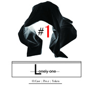 Lonely One11.11](./albums/2102653506.md) | 国语 | 独立发行 | 2016年11月16日 | EP, 单曲 |  |
| [ 大鱼RemixBig Fish & Begonia (Yoken Remix)](./albums/2100368959.md) | 国语 |  | 2016年07月18日 | EP, 单曲 |  |
| [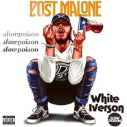 White Iverson RemixProd by.Yoken](./albums/2100366619.md) | 英语 |  | 2016年07月13日 | EP, 单曲 |  |
| [ Love Youself (Yoken remix)Prod by.Yoken SLOWPOISON](./albums/2100359824.md) | 英语 |  | 2016年06月28日 | EP, 单曲 |  |
| [ 2Pac - Fuck All Yall  (Yoken remix)Prod by.Yoken](./albums/2100358807.md) | 英语 | 独立发行 | 2016年06月26日 | EP, 单曲 |  |
| [ Lost Boy RemixYoken Production](./albums/2100354252.md) | 英语 |  | 2016年06月15日 | EP, 单曲 | 欧美流行 Western Pop |
| [ 7Years RemixProd by.Yoken](./albums/2100352823.md) | 国语 |  | 2016年06月12日 | EP, 单曲 | 流行说唱 Pop Rap |
| [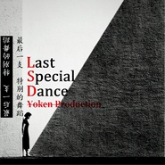 Last Special Dance 纯音乐Yoken Production](./albums/2100341582.md) | 其他 | 独立发行 | 2016年05月21日 | EP, 单曲 |  |
| [ Try Remix-Prod by.Yoken <男生版>Cover by.廖英臣](./albums/2100318130.md) | 英语 |  | 2016年04月20日 | EP, 单曲 | 欧美流行 Western Pop |
| [ Hello (Yoken Remix)](./albums/2100303502.md) | 英语 |  | 2016年03月31日 | EP, 单曲 | 回响贝斯 Dubstep |
| [ SLOWPOISON BEAT Vol.2Prod by.Yoken](./albums/2100276402.md) | 其他 | 独立发行 | 2016年02月17日 | 合集, 杂锦 |  |
| [ 照骗Prod by.Small New](./albums/2100269032.md) | 国语 |  | 2016年01月31日 | EP, 单曲 | 流行说唱 Pop Rap |
| [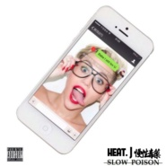 宁缺毋滥 feat.Heat J](./albums/2100250212.md) | 国语 |  | 2015年12月24日 | EP, 单曲 | 灵魂布鲁斯 Soul Blues, 流行说唱 Pop Rap, 致幻流行 Hypnagogic Pop |
| [ Look at me](./albums/2100249288.md) | 国语 |  | 2015年12月21日 | EP, 单曲 |  |
| [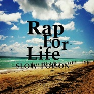 Rap For Life](./albums/2100246256.md) | 国语 | SLOWPOISON说唱团体 | 2015年12月13日 | EP, 单曲 |  |
| [ 大主宰DISSBACK](./albums/2100244616.md) | 国语 | SLOWPOISON说唱团体 | 2015年12月07日 | EP, 单曲 | 放克电子 Electro (Electro-Funk) |
| [ Morning Night异国恋即视感](./albums/2100244620.md) | 国语 | SLOWPOISON | 2015年12月07日 | EP, 单曲 | 流行说唱 Pop Rap |
| [ SLOWPOISON BEAT Vol.1Yoken Production](./albums/2100240558.md) | 其他 | SLOWPOISON说唱团体 | 2015年11月23日 | 录音室专辑 |  |
| [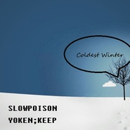 Coldest Winter](./albums/2100235834.md) | 国语 | SLOWPOISON说唱团体 | 2015年11月11日 | EP, 单曲 | 流行说唱 Pop Rap |
| [ DO YOU BETTER](./albums/2100231676.md) | 国语 | SLOWPOISON说唱团体;UP GANG | 2015年11月03日 | EP, 单曲 | 流行说唱 Pop Rap |
| [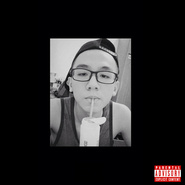 谁是玻璃娃娃俊升Diss back](./albums/2100227578.md) | 国语 | SLOWPOISON说唱团体 | 2015年10月26日 | EP, 单曲 |  |
| [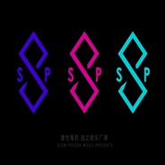 SLOWPOISON POPPOP RAP 合辑](./albums/2100206320.md) | 国语 |  | 2015年09月23日 | 合集, 杂锦 | 流行说唱 Pop Rap |
| [ SLOWPOISON TRAP音乐暴徒](./albums/2100193204.md) | 国语 | SLOWPOISON | 2015年09月07日 | 合集, 杂锦 |  |
| [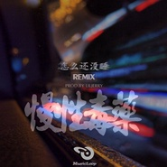 怎么还没睡RemixProd.by LilJerry;](./albums/2100186920.md) | 国语 | SLOWPOISON | 2015年08月30日 | EP, 单曲 | 流行说唱 Pop Rap |
| [ 澡堂Clan 江西分舵作品合集](./albums/2100181716.md) | 国语 | 澡堂Clan | 2015年08月23日 | 合集, 杂锦 | 爵士说唱 Jazz Rap, 流行说唱 Pop Rap |
| [ 别议论](./albums/2100179167.md) | 国语 | SLOWPOISON说唱团体 | 2015年08月17日 | EP, 单曲 |  |
| [ 天黑Nightfall](./albums/2100175662.md) | 其他 | SLOWPOISON说唱团体 | 2015年08月06日 | EP, 单曲 | 流行说唱 Pop Rap |
| [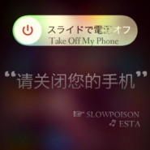 Take Off My Phone“请关闭您的手机”](./albums/537210663.md) | 国语 | SLOWPOISON说唱团体 | 2015年07月18日 | EP, 单曲 | 放克电子 Electro (Electro-Funk), 流行说唱 Pop Rap |
| [ 《Fight For Myself》](./albums/636514549.md) | 国语 | 独立发行 | 2015年07月10日 | EP, 单曲 | 东岸说唱 East Coast Hip Hop |
| [ Baby u Got it](./albums/33730536.md) | 国语 | SLOWPOISON说唱团体 | 2015年06月08日 | 录音室专辑 | 流行说唱 Pop Rap |
| [ Maybe You Don't Know可能你还是不明白(Special Edit)](./albums/331667886.md) | 国语 | SLOWPOISON说唱团体 | 2015年05月15日 | EP, 单曲 | 流行灵魂乐 Pop Soul |
| [ Laugh Away](./albums/31510024.md) | 国语 | SLOWPOISON说唱团体 | 2015年05月13日 | EP, 单曲 | 流行说唱 Pop Rap |
| [ Back to the street回归](./albums/1330473372.md) | 国语 | SLOWPOISON说唱团体 | 2015年05月01日 | EP, 单曲 | 东岸说唱 East Coast Hip Hop |
| [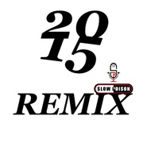 15REMIX](./albums/1525302725.md) | 国语 | 独立发行 | 2015年03月02日 | 合集, 杂锦 | 爵士说唱 Jazz Rap, 南方说唱 Southern Hip Hop, 西岸说唱 West Coast Hip Hop |
| [ 夜游SLOWPOISON说唱团体](./albums/1324944287.md) | 国语 | 独立发行 | 2015年02月26日 | EP, 单曲 | 爵士说唱 Jazz Rap |
| [ Yoken Solo](./albums/808735805.md) | 国语 | SLOWPOISON说唱团体 | 2015年01月12日 | 合集, 杂锦 | 爵士说唱 Jazz Rap, 流行说唱 Pop Rap |
| [ Mg.修能 Solo修能个人Solo](./albums/121056217.md) | 国语 | SLOWPOISON说唱团体 | 2015年01月12日 | 合集, 杂锦 | 爵士说唱 Jazz Rap, 南方说唱 Southern Hip Hop, 流行说唱 Pop Rap |
| [ Keep Solo柯鹏个人Solo](./albums/121036427.md) | 国语 | SLOWPOISON说唱团体 | 2015年01月12日 | 合集, 杂锦 | 爵士说唱 Jazz Rap, 南方说唱 Southern Hip Hop, 流行说唱 Pop Rap |
| [ JoeyZ Solo曾婕个人Solo](./albums/1620994188.md) | 国语 | SLOWPOISON说唱团体 | 2015年01月12日 | 合集, 杂锦 | 国语流行 Mandarin Pop |
| [ 15年合作](./albums/420711915.md) | 国语 | SLOWPOISON说唱团体 | 2015年01月08日 | 合集, 杂锦 | 地下说唱 Underground Hip Hop |
| [ 14年合作](./albums/202839066.md) | 国语 | SLOWPOISON说唱团体 | 2015年01月01日 | 合集, 杂锦 | 爵士说唱 Jazz Rap |
| [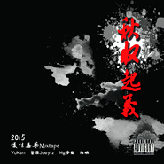 秋收起义Mixtape慢性毒药说唱团体](./albums/1813634418.md) | 国语 | SLOWPOISON说唱团体 | 2014年10月18日 | EP, 单曲 | 流行说唱 Pop Rap, 地下说唱 Underground Hip Hop |
| [ 慢性毒药Mixtape](./albums/609518584.md) | 国语 | SLOWPOISON说唱团体 | 2014年09月01日 | 合集, 杂锦 | 流行说唱 Pop Rap, 地下说唱 Underground Hip Hop |
| [ Old Beat I Made](./albums/900824147.md) | 其他 | SLOWPOISON说唱团体 | 2014年05月23日 | 合集, 杂锦 | 爵士说唱 Jazz Rap, 流行说唱 Pop Rap, 国语流行 Mandarin Pop |

## 评论

|  |  |  |
| :-- | :-- | :-- |
|  [虾米用户](https://emumo.xiami.com/u/336141926) 生活怎能缺了，音乐～酒。 2020-07-22 19:18 赞(1) 踩(0) | 
毒药，作一首  从没长大。
 |
| ⇒ |  [虾米用户](https://emumo.xiami.com/u/336141926) 生活怎能缺了，音乐～酒。 2020-07-22 19:19 赞(0) 踩(0) | 
城市之间， 是毒药，真的毒药
 |
|  [虾米用户](https://emumo.xiami.com/u/78505736)  2019-05-26 19:48 赞(1) 踩(0) | 
希望快点出专辑
 |
|  [虾米用户](https://emumo.xiami.com/u/9062060) 此生没拿一个亿来爱虾米是... 2018-10-21 16:48 赞(0) 踩(0) | 
马
 |
|  [虾米用户](https://emumo.xiami.com/u/312912968)  2018-08-19 17:54 赞(0) 踩(0) | 
你们怎么不去参加中国新说唱？
 |
|  [虾米用户](https://emumo.xiami.com/u/282040810) 我还没想好要写什么... 2018-03-01 15:11 赞(1) 踩(0) | 
我想要你们的一个伴奏
 |
|  [虾米用户](https://emumo.xiami.com/u/339829628)  2017-12-13 21:53 赞(0) 踩(0) | 
有try的伴奏么 你们唱的这个
 |
|  [虾米用户](https://emumo.xiami.com/u/309746328)  2017-12-12 11:55 赞(1) 踩(0) | 
我好像 看到了参劈
 |
|  [虾米用户](https://emumo.xiami.com/u/50746444) 我还没想好要写什么... 2017-10-28 00:26 赞(0) 踩(0) | 
寒暑假江西赣州   平时南京或者扬州
 |
|  [虾米用户](https://emumo.xiami.com/u/42912927)  2017-10-27 23:27 赞(0) 踩(0) | 
微信号多少(≧▽≦)
 |
|  [虾米用户](https://emumo.xiami.com/u/278635274)  2017-04-30 21:59 赞(0) 踩(0) | 
新疆
 |
|  [虾米用户](https://emumo.xiami.com/u/85501218)   2017-04-16 03:38 赞(0) 踩(0) | 

 |
|  [虾米用户](https://emumo.xiami.com/u/73769360)  2017-04-15 21:01 赞(0) 踩(0) | 
爱你们，棒棒哒
 |
|  [虾米用户](https://emumo.xiami.com/u/280138133)  2017-03-19 01:15 赞(0) 踩(0) | 
不错，非常棒
 |
|  [虾米用户](https://emumo.xiami.com/u/12844857) 及时行乐 2016-12-06 00:10 赞(1) 踩(0) | 
快来上海开趴！上海mao在等你们呀！
 |
| ⇒ |  [虾米用户](https://emumo.xiami.com/u/29348485)   2016-12-13 11:15 赞(0) 踩(0) | 
我们在上海
 |
|  [虾米用户](https://emumo.xiami.com/u/246777215)  2016-11-17 12:49 赞(0) 踩(0) | 
很喜欢你们的声音，每次都感觉有一种能量   
 |
|  [虾米用户](https://emumo.xiami.com/u/185953480) balabala 2016-10-17 13:06 赞(0) 踩(0) | 
很啊
 |
|  [虾米用户](https://emumo.xiami.com/u/586100)   2016-07-10 23:37 赞(0) 踩(0) | 
为骂人而骂人
 |
|  [虾米用户](https://emumo.xiami.com/u/32260062) 我还没想好要写什么... 2016-06-15 13:57 赞(0) 踩(0) | 
jiujiang
 |
|  [虾米用户](https://emumo.xiami.com/u/127262990) 噢，菜的扣脚 2016-05-28 08:18 赞(0) 踩(0) | 
可以的
 |
|  [虾米用户](https://emumo.xiami.com/u/94534030)   2016-05-21 23:29 赞(2) 踩(0) | 
江西南昌 挺你们。
 |
| ⇒ |  [虾米用户](https://emumo.xiami.com/u/155284906)   2016-10-28 20:43 赞(0) 踩(0) | 
同南昌
 |
|  [虾米用户](https://emumo.xiami.com/u/59505342) 我还没想好要写什么... 2016-05-12 16:09 赞(0) 踩(0) | 
重庆
 |
|  [虾米用户](https://emumo.xiami.com/u/110074282)   2016-05-09 00:16 赞(0) 踩(0) | 
西安
 |
| ⇒ |  [虾米用户](https://emumo.xiami.com/u/29348485)   2016-05-14 21:58 赞(0) 踩(0) | 
6.4 西安 Yoken 和 柯鹏 有演出 光音16见
 |
|  [虾米用户](https://emumo.xiami.com/u/42540823) @江西 SLOWPOIS... 2016-04-28 22:01 赞(0) 踩(0) | 
深圳            
 |
|  [虾米用户](https://emumo.xiami.com/u/43443614) 微信M7-Bonnie，... 2016-04-24 03:20 赞(0) 踩(0) | 
不错不错，jazz rap,风格不错，但感觉还差点什么，不知道是力量还是什么的，差点狠劲？期待更多fresh song 
 |
|  [虾米用户](https://emumo.xiami.com/u/90901626) 我还没想好要写什么... 2016-04-17 05:20 赞(0) 踩(0) | 
兰州
 |
|  [虾米用户](https://emumo.xiami.com/u/12000448)   2016-04-16 12:08 赞(0) 踩(0) | 
歌不错啊，就是封面设计差了点，哈哈
 |
|  [虾米用户](https://emumo.xiami.com/u/64862390)   2016-04-15 19:06 赞(2) 踩(0) | 
昆明昆明昆明！
 |
|  [虾米用户](https://emumo.xiami.com/u/577953)  2016-04-11 15:04 赞(1) 踩(0) | 
广州！
 |
|  [虾米用户](https://emumo.xiami.com/u/31854471) turn up 2016-03-21 16:32 赞(0) 踩(0) | 
南京
 |
|  [虾米用户](https://emumo.xiami.com/u/5772058)   2016-03-21 08:17 赞(0) 踩(0) | 
天津
 |
|  [虾米用户](https://emumo.xiami.com/u/13525770)  2016-03-21 08:14 赞(1) 踩(0) | 
巡演來廣州啊！！！
 |
|  [虾米用户](https://emumo.xiami.com/u/112950684)   2016-02-12 11:32 赞(0) 踩(0) | 
加油
 |
|  [虾米用户](https://emumo.xiami.com/u/5744650) 我还没想好要写什么... 2016-01-27 11:45 赞(0) 踩(0) | 
话说九江还有独立音乐人呢 我也是九江的
 |
| ⇒ |  [虾米用户](https://emumo.xiami.com/u/44123164) 这家伙很想和你睡一觉～ 2016-02-03 02:13 赞(0) 踩(0) | 
哈哈，很意外
 |
| ⇒ |  [虾米用户](https://emumo.xiami.com/u/5744650) 我还没想好要写什么... 2016-02-03 08:00 赞(0) 踩(0) | 
<q><b>老清新说：</b></q>
 |
|  [虾米用户](https://emumo.xiami.com/u/367837) 活该倒霉恶心臭屎混 2016-01-26 01:48 赞(0) 踩(0) | 
我有救了
 |
|  [虾米用户](https://emumo.xiami.com/u/18174732) 请多关照 2016-01-23 22:38 赞(0) 踩(0) | 
几首歌走心向
 |
|  [虾米用户](https://emumo.xiami.com/u/50773147)   2016-01-19 15:42 赞(0) 踩(0) | 
蛮不错的，赞一个
 |
|  [虾米用户](https://emumo.xiami.com/u/47865923)   2015-12-30 03:07 赞(0) 踩(0) | 
不错哦！
 |
|  [虾米用户](https://emumo.xiami.com/u/69324878)  2015-12-29 19:58 赞(0) 踩(0) | 
我觉得这首歌是我的写照
 |
|  [虾米用户](https://emumo.xiami.com/u/13228266) 国破山河在 2015-12-28 03:18 赞(0) 踩(0) | 
bbb
 |
|  [虾米用户](https://emumo.xiami.com/u/44858319) 永远是我最爱的虾米 2015-12-16 09:34 赞(0) 踩(0) | 
///
 |
|  [虾米用户](https://emumo.xiami.com/u/50869110) IG：77richiee... 2015-12-09 23:15 赞(0) 踩(0) | 
❤️
 |
|  [虾米用户](https://emumo.xiami.com/u/80687224) 假的 2015-11-30 22:19 赞(0) 踩(0) | 
在草莓听到 赞到
 |
|  [虾米用户](https://emumo.xiami.com/u/12809702)   2015-11-27 18:14 赞(0) 踩(0) | 
好
 |
|  [虾米用户](https://emumo.xiami.com/u/71411098)  2015-10-30 04:48 赞(1) 踩(0) | 
diss陈俊生那首棒！
 |
|  [虾米用户](https://emumo.xiami.com/u/77747530)  2015-10-29 22:21 赞(0) 踩(0) | 
嗯们七友市扣已
 |
|  [虾米用户](https://emumo.xiami.com/u/77747530)  2015-10-29 22:20 赞(0) 踩(0) | 
特么我九江人听了真激动，真给九江人长脸！！！！
 |
|  [虾米用户](https://emumo.xiami.com/u/47762458) 随便驾驭你的想象 2015-09-26 12:46 赞(0) 踩(0) | 
﹋﹋
 |
|  [虾米用户](https://emumo.xiami.com/u/22433347)  2015-09-26 12:21 赞(0) 踩(0) | 
诶哟不错哦
 |
|  [虾米用户](https://emumo.xiami.com/u/34357899) 我不觉得自己很屌啊你也别... 2015-09-23 19:49 赞(0) 踩(0) | 
96年的那个孩子我要了。
 |
|  [虾米用户](https://emumo.xiami.com/u/50744146)   2015-09-10 18:13 赞(0) 踩(0) | 

 |
|  [虾米用户](https://emumo.xiami.com/u/26166944) 游走在社会边缘的神秘者 2015-09-10 09:01 赞(0) 踩(0) | 
yoken你有75kg？  
 |
| ⇒ |  [虾米用户](https://emumo.xiami.com/u/29348485)   2015-09-10 10:20 赞(0) 踩(0) | 
对现在77KG  但是我 185cm
 |
| ⇒ |  [虾米用户](https://emumo.xiami.com/u/26166944) 游走在社会边缘的神秘者 2015-09-10 16:27 赞(0) 踩(0) | 
<q><b>SLOWPOISON说唱说：</b></q>
 |
| ⇒ |  [虾米用户](https://emumo.xiami.com/u/58402040)   2015-11-29 02:44 赞(0) 踩(0) | 
<q><b>SLOWPOISON说唱说：</b></q>
 |
|  [虾米用户](https://emumo.xiami.com/u/21285309) 我真的不会啊 2015-09-08 09:29 赞(0) 踩(0) | 
我是xt的江西老乡~~
 |
|  [虾米用户](https://emumo.xiami.com/u/37840483) 再說吧 2015-08-25 23:05 赞(0) 踩(0) | 
 
 |
|  [虾米用户](https://emumo.xiami.com/u/1528891)  2015-08-24 13:36 赞(0) 踩(0) | 
aosaki那边过来，看了一眼档案，年纪好小，真是人才辈出~
 |
|  [虾米用户](https://emumo.xiami.com/u/49030947) 一个好人 2015-08-20 01:30 赞(0) 踩(0) | 
Alex Hepburn - 《Under》 Remix这首伴奏卖吗？
 |
| ⇒ |  [虾米用户](https://emumo.xiami.com/u/29348485)   2015-08-22 18:02 赞(0) 踩(0) | 
卖的价格太高，所以我们不开放。
 |
|  [虾米用户](https://emumo.xiami.com/u/16396509)  2015-08-19 10:49 赞(0) 踩(0) | 
❤
 |
| ⇒ |  [虾米用户](https://emumo.xiami.com/u/26166944) 游走在社会边缘的神秘者 2015-09-10 08:48 赞(0) 踩(0) | 
口我
 |
|  [虾米用户](https://emumo.xiami.com/u/23544968) 流行、摇滚、轻音乐 2015-08-14 14:00 赞(0) 踩(0) | 
节奏好~
 |
|  [虾米用户](https://emumo.xiami.com/u/54972763) Being stupid... 2015-08-10 22:22 赞(0) 踩(0) | 
That&amp;#039;s good.
 |
|  [虾米用户](https://emumo.xiami.com/u/45385073) 爱虾米期待再相遇为新：t... 2015-08-10 20:51 赞(0) 踩(0) | 
在哪听过 不错
 |
|  [虾米用户](https://emumo.xiami.com/u/32690432) 我还没想好要写什么... 2015-08-08 02:18 赞(0) 踩(0) | 
支持中文说唱 期待新作品
 |
|  [虾米用户](https://emumo.xiami.com/u/38567311)  2015-08-01 15:20 赞(0) 踩(0) | 
。
 |
|  [虾米用户](https://emumo.xiami.com/u/5133491) 其他音乐平台用户名依旧叫... 2015-07-30 13:47 赞(0) 踩(0) | 
不错的团体
 |
| ⇒ |  [虾米用户](https://emumo.xiami.com/u/32690432) 我还没想好要写什么... 2015-08-08 02:18 赞(0) 踩(0) | 
诶哟碰到你了
 |
|  [虾米用户](https://emumo.xiami.com/u/39788841)  . 2015-07-19 08:19 赞(0) 踩(0) | 
Lium
 |
|  [虾米用户](https://emumo.xiami.com/u/1675350)  2015-07-15 19:27 赞(0) 踩(0) | 
老家的说唱团
 |
|  [虾米用户](https://emumo.xiami.com/u/3500108) .. 2015-06-23 08:06 赞(0) 踩(0) | 
卧槽竟然是四个同龄人
 |
| ⇒ |  [虾米用户](https://emumo.xiami.com/u/29348485)   2015-06-29 22:39 赞(0) 踩(0) | 
谢谢啦
 |
|  [虾米用户](https://emumo.xiami.com/u/3500108) .. 2015-06-23 08:04 赞(0) 踩(0) | 
爱你们
 |
|  [虾米用户](https://emumo.xiami.com/u/11763865)  2015-05-21 08:50 赞(0) 踩(0) | 

 |
|  [虾米用户](https://emumo.xiami.com/u/39788841)  . 2015-05-14 17:39 赞(0) 踩(0) | 
lium
 |
|  [虾米用户](https://emumo.xiami.com/u/11157355) 榕树长青 2015-04-17 07:27 赞(1) 踩(0) | 
喜欢
 |
|  [虾米用户](https://emumo.xiami.com/u/49046287)   2015-04-14 00:08 赞(0) 踩(0) | 
词很好 真的
 |
|  [虾米用户](https://emumo.xiami.com/u/5498488) monster 2015-03-30 21:49 赞(0) 踩(0) | 
挺好的 顶一个
 |
|  [虾米用户](https://emumo.xiami.com/u/48080895)  2015-03-13 00:44 赞(0) 踩(0) | 
词 写的真好
 |
|  [虾米用户](https://emumo.xiami.com/u/48080895)  2015-03-13 00:43 赞(0) 踩(0) | 
单曲循环。活着 好听
 |
|  [虾米用户](https://emumo.xiami.com/u/45240561) 怎样嘛 2015-03-02 23:42 赞(0) 踩(0) | 
加油！
 |
|  [虾米用户](https://emumo.xiami.com/u/18829561) 暂无签名~ 2015-02-28 19:40 赞(0) 踩(0) | 
喜欢中国合伙人，mg修能加油
 |
|  [虾米用户](https://emumo.xiami.com/u/23433579) 私は私になる 2015-02-26 19:24 赞(0) 踩(0) | 
也算是老乡过来顶下，感觉音乐可以再丰富点，加油~
 |
|  [虾米用户](https://emumo.xiami.com/u/35251651) 人生何处不青山 2015-02-15 00:55 赞(0) 踩(0) | 
beat稍微有点平庸了，词还不够硬flow蛮好
 |
| ⇒ |  [虾米用户](https://emumo.xiami.com/u/29348485)   2015-02-18 20:12 赞(0) 踩(0) | 
哪一首呢~
 |
| ⇒ |  [虾米用户](https://emumo.xiami.com/u/35251651) 人生何处不青山 2015-02-20 01:26 赞(0) 踩(0) | 
<q><b>SLOWPOISON说唱说：</b></q>
 |
|  [虾米用户](https://emumo.xiami.com/u/17205094) 真的很奇怪，没错了 2015-02-02 15:43 赞(0) 踩(0) | 
加油
 |
|  [虾米用户](https://emumo.xiami.com/u/12184260) 你好 2015-01-21 17:47 赞(1) 踩(0) | 
.............................. .............................. .....
 |
| ⇒ |  [虾米用户](https://emumo.xiami.com/u/29348485)   2015-01-22 02:39 赞(0) 踩(0) | 
？？？
 |
|  [虾米用户](https://emumo.xiami.com/u/18977923)  2015-01-20 12:26 赞(0) 踩(0) | 
哎呦    外瑞古德呀。
 |
|  [虾米用户](https://emumo.xiami.com/u/10867131)  2015-01-19 19:47 赞(0) 踩(0) | 
伴奏咱能再饱满点吗。。
 |
|  [虾米用户](https://emumo.xiami.com/u/46235278)  2015-01-19 16:51 赞(0) 踩(0) | 
好听加油
 |
|  [虾米用户](https://emumo.xiami.com/u/43900201) 你猜啊 2015-01-18 09:15 赞(0) 踩(0) | 
超棒的，很喜欢这里的音乐。
 |
|  [虾米用户](https://emumo.xiami.com/u/13376282)   2015-01-06 01:08 赞(0) 踩(0) | 
啦啦啦(≧▽≦)
 |
|  [虾米用户](https://emumo.xiami.com/u/8833102) 伟❤️375882267 2014-12-25 01:32 赞(0) 踩(0) | 
这里的歌真好听                       圣诞快乐  ！！！
 |
|  [虾米用户](https://emumo.xiami.com/u/4485514) 共勉 2014-11-24 11:48 赞(0) 踩(0) | 
rap 部分不错啊！  加油
 |
|  [虾米用户](https://emumo.xiami.com/u/32395666) Never 2014-11-15 13:21 赞(0) 踩(0) | 
hop
 |
|  [虾米用户](https://emumo.xiami.com/u/37424396)  2014-11-09 18:04 赞(1) 踩(0) | 
高水准，歌词押韵有感情，绝对赞赞
 |
|  [虾米用户](https://emumo.xiami.com/u/27793105)  2014-11-03 21:17 赞(0) 踩(0) | 
我去，女声简直了！！！好带感的
 |
|  [虾米用户](https://emumo.xiami.com/u/29389476) meh 2014-10-25 16:33 赞(0) 踩(0) | 
微博什么？副歌有点low，后期欠佳，其他都很赞
 |
|  [虾米用户](https://emumo.xiami.com/u/29389476) meh 2014-10-25 16:31 赞(0) 踩(0) | 
挺牛逼的，是听你的平凡之路remix认识你的，flow真的很喜欢
 |
|  [虾米用户](https://emumo.xiami.com/u/42912927)  2014-10-23 09:36 赞(0) 踩(0) | 
加油，老乡挺你！！！
 |
|  [虾米用户](https://emumo.xiami.com/u/42824118)  2014-10-21 09:36 赞(0) 踩(0) | 
超好听哈～加油加油
 |
|  [虾米用户](https://emumo.xiami.com/u/12551401) 暂无签名~ 2014-10-10 18:05 赞(0) 踩(0) | 
好像我北京高中同学
 |
| ⇒ |  [虾米用户](https://emumo.xiami.com/u/29348485)   2014-10-11 11:23 赞(0) 踩(0) | 
是吗? 我现在还没去过北京呢
 |
|  [虾米用户](https://emumo.xiami.com/u/1667797)  2014-10-08 19:30 赞(0) 踩(0) | 
女声是谁？是谁
 |
| ⇒ |  [虾米用户](https://emumo.xiami.com/u/29348485)   2014-10-09 15:39 赞(0) 踩(0) | 
高中同学呢。。。。
 |
| ⇒ |  [虾米用户](https://emumo.xiami.com/u/1667797)  2014-10-10 16:52 赞(0) 踩(0) | 
<q><b>SLOWPOISON说唱说：</b></q>
 |
| ⇒ |  [虾米用户](https://emumo.xiami.com/u/29348485)   2014-10-11 11:24 赞(0) 踩(0) | 
<q><b>limbless666说：</b></q>
 |
|  [虾米用户](https://emumo.xiami.com/u/39470207) 我还没想好要写什么... 2014-10-03 23:16 赞(0) 踩(0) | 
这个flow还好，词的韵差了一点啊，基本上都是单字压。还有这个副歌是唱的，我的天，太吓人了吧。 加油！
 |
| ⇒ |  [虾米用户](https://emumo.xiami.com/u/29348485)   2014-10-05 03:34 赞(0) 踩(0) | 
哪一首呢?亲
 |
| ⇒ |  [虾米用户](https://emumo.xiami.com/u/39470207) 我还没想好要写什么... 2014-10-05 22:18 赞(0) 踩(0) | 
<q><b>SLOWPOISON说唱说：</b></q>
 |
|  [虾米用户](https://emumo.xiami.com/u/29820357)  2014-10-02 00:36 赞(0) 踩(0) | 
哥们 支持你 喜欢听你的曲子
 |
|  [虾米用户](https://emumo.xiami.com/u/41240990)  2014-09-14 23:48 赞(1) 踩(0) | 
平凡之路rap的太吊。 佩服！加油。希望在更大的舞台看到你们。
 |
| ⇒ |  [虾米用户](https://emumo.xiami.com/u/29348485)   2014-09-15 12:51 赞(0) 踩(0) | 
感谢
 |
|  [虾米用户](https://emumo.xiami.com/u/38491089)  2014-09-12 23:58 赞(0) 踩(0) | 
棒
 |
|  [虾米用户](https://emumo.xiami.com/u/40282861)  2014-08-30 20:00 赞(0) 踩(0) | 
我们微博有互粉 哈哈说唱棒棒哒 可是好像没歌词
 |
|  [虾米用户](https://emumo.xiami.com/u/36365917)  2014-08-22 13:56 赞(0) 踩(0) | 
词不错
 |
|  [虾米用户](https://emumo.xiami.com/u/7308846)   2014-08-19 13:57 赞(0) 踩(0) | 
wow，加油，rapper～
 |
|  [虾米用户](https://emumo.xiami.com/u/448099)  2014-08-11 21:28 赞(0) 踩(0) | 
九江人?
 |
| ⇒ |  [虾米用户](https://emumo.xiami.com/u/29348485)   2014-08-11 22:35 赞(0) 踩(0) | 
对的
 |
|  [虾米用户](https://emumo.xiami.com/u/448099)  2014-08-11 21:25 赞(0) 踩(0) | 
发现好歌很多   支持个
 |
|  [虾米用户](https://emumo.xiami.com/u/32336577)  2014-07-31 15:52 赞(0) 踩(0) | 
歌很舒服，加油
 |
| ⇒ |  [虾米用户](https://emumo.xiami.com/u/29348485)   2014-08-01 01:31 赞(0) 踩(0) | 
谢谢
 |
|  [虾米用户](https://emumo.xiami.com/u/12669290) No Music No ... 2014-07-09 16:06 赞(11) 踩(0) | 
听了你混的sound of my dream，开头我还有点小激动，第31秒开始，我艹………
 |
| ⇒ |  [虾米用户](https://emumo.xiami.com/u/648020)  2014-10-11 17:52 赞(0) 踩(0) | 
在哪能找到呀？
 |
| ⇒ |  [虾米用户](https://emumo.xiami.com/u/57095398)   2015-10-11 21:18 赞(0) 踩(0) | 

 |
|  [虾米用户](https://emumo.xiami.com/u/29348485)   2014-03-11 20:42 赞(0) 踩(0) | 
我刚入驻了虾米音乐人，欢迎大家来我的个人主页，收听我的最新音乐
 |
