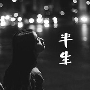
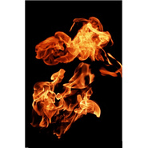

安可儿
============================

|  |  |
| :--: | :-- |
| [ 安可儿](https://i.xiami.com/ankeer) | **播放数**: 8106399 **粉丝数**: 968 **评论数**: 39 **地区**: China 中国大陆 **风格**: 流行摇滚 Pop Rock, 国语流行 Mandarin Pop  |

## 档案

## 专辑

| 名称 | 语种 | 唱片公司 | 发行时间 | 专辑类别 | 专辑风格 |
| :--: | :-- | :-- | :-- | :-- | :-- |
| [ 半生](./albums/2102859273.md) | 国语 | 果然乐动 | 2017年09月19日 | EP, 单曲 |  |
| [ 勉为其难](./albums/2102683528.md) | 国语 | 星辉文化 | 2017年01月20日 | 精选集 | 嘻哈 Hip-Hop |
| [ 神雕侠侣](./albums/2102775573.md) | 国语 | 看见文娱 | 2017年01月01日 | EP, 单曲 |  |
| [ 安爷](./albums/2102770531.md) | 国语 | 看见文娱 | 2017年01月01日 | EP, 单曲 |  |
| [ 二月红](./albums/2102401979.md) | 国语 |  | 2016年09月20日 | 精选集 |  |
| [ 华灯初上](./albums/2100385572.md) | 国语 | 独立发行 | 2016年09月01日 | 精选集 |  |
| [ 探戈1](./albums/2100375040.md) | 国语 | 独立发行 | 2016年08月02日 | 精选集 |  |
| [ 泪](./albums/2100374652.md) | 国语 | 独立发行 | 2016年08月01日 | 精选集 |  |
| [ 重来。](./albums/2100373275.md) | 国语 | 独立发行 | 2016年07月28日 | 精选集 |  |
| [ 重新来过](./albums/2100373103.md) | 国语 | 独立发行 | 2016年07月28日 | 精选集 |  |
| [ 老九门1](./albums/2100372769.md) | 国语 | 独立发行 | 2016年07月26日 | 精选集 |  |
| [ 惊雷。](./albums/2100372271.md) | 国语 | 独立发行 | 2016年07月25日 | 精选集 |  |
| [ 风雨同行、](./albums/2100371901.md) | 国语 | 独立发行 | 2016年07月24日 | 现场专辑 |  |
| [ 安家情](./albums/2100366390.md) | 国语 | 独立发行 | 2016年07月13日 | 精选集 |  |
| [ 中国南海](./albums/2100366824.md) | 国语 | 独立发行 | 2016年07月13日 | 精选集 |  |
| [ 殇](./albums/2100363603.md) | 国语 | 独立发行 | 2016年07月07日 | 精选集 |  |
| [ 。。。](./albums/2100363601.md) | 国语 | 独立发行 | 2016年07月07日 | 精选集 |  |
| [ 剑殇](./albums/2100361959.md) | 国语 | 独立发行 | 2016年07月03日 | EP, 单曲 |  |
| [ 七跪父母恩](./albums/2100361955.md) | 国语 | 独立发行 | 2016年07月03日 | 精选集 |  |
| [ 姑娘回家吧](./albums/2100361772.md) | 国语 | 独立发行 | 2016年07月02日 | 精选集 |  |
| [ 好先生](./albums/2100361769.md) | 国语 | 独立发行 | 2016年07月02日 | 精选集 |  |
| [ 好先生纯伴奏](./albums/2100361774.md) | 国语 | 独立发行 | 2016年07月02日 | 精选集 |  |
| [ 剑鞘](./albums/2100361168.md) | 国语 | 独立发行 | 2016年07月01日 | EP, 单曲 |  |
| [ 陌路AK](./albums/2100358494.md) | 国语 | 独立发行 | 2016年06月25日 | 精选集 |  |
| [ 画心之小唯](./albums/2100358349.md) | 国语 | 独立发行 | 2016年06月24日 | 精选集 |  |
| [ 红颜墓](./albums/2100358355.md) | 国语 | 独立发行 | 2016年06月24日 | 精选集 |  |
| [ 几度梦回大唐](./albums/2100358353.md) | 国语 | 独立发行 | 2016年06月24日 | 精选集 |  |
| [ 几度梦回大唐](./albums/2100357381.md) | 国语 | 独立发行 | 2016年06月22日 | 精选集 | 另类说唱 Alternative Hip Hop |
| [ 红颜墓](./albums/2100357380.md) | 国语 | 独立发行 | 2016年06月22日 | 精选集 | 另类说唱 Alternative Hip Hop |
| [ 七夜](./albums/2100356452.md) | 国语 | 独立发行 | 2016年06月21日 | 精选集 | 另类说唱 Alternative Hip Hop |
| [ 余罪](./albums/2100355934.md) | 国语 | 独立发行 | 2016年06月18日 | 精选集 | 另类说唱 Alternative Hip Hop |
| [ 三国叹](./albums/2100355936.md) | 国语 | 独立发行 | 2016年06月18日 | 精选集 | 另类说唱 Alternative Hip Hop |
| [ 遮天](./albums/2100355938.md) | 国语 | 独立发行 | 2016年06月18日 | 精选集 | 另类说唱 Alternative Hip Hop |
| [ 没错你说的对](./albums/2100355372.md) | 国语 | 独立发行 | 2016年06月17日 | 精选集 | 另类说唱 Alternative Hip Hop |
| [ 三生一梦](./albums/2100355369.md) | 国语 | 独立发行 | 2016年06月17日 | 精选集 | 另类说唱 Alternative Hip Hop |
| [ 君念](./albums/2100355360.md) | 国语 | 独立发行 | 2016年06月17日 | 精选集 | 另类说唱 Alternative Hip Hop |
| [ 帝王妻AK](./albums/2100355364.md) | 国语 | 独立发行 | 2016年06月17日 | 精选集 | 另类说唱 Alternative Hip Hop |
| [ 四皈依](./albums/2100355367.md) | 国语 | 独立发行 | 2016年06月17日 | 精选集 | 另类说唱 Alternative Hip Hop |
| [ 三生一梦空拍AK](./albums/2100355373.md) | 国语 | 独立发行 | 2016年06月17日 | 精选集 | 另类说唱 Alternative Hip Hop |
| [ 帝王妻](./albums/2100354022.md) | 国语 | 独立发行 | 2016年06月14日 | 精选集 | 另类说唱 Alternative Hip Hop |
| [ 空拍](./albums/2100354028.md) | 国语 | 独立发行 | 2016年06月14日 | 精选集 | 另类说唱 Alternative Hip Hop |
| [ 轮回](./albums/2100353789.md) | 国语 | 独立发行 | 2016年06月13日 | 精选集 | 另类说唱 Alternative Hip Hop |
| [ 佛秀](./albums/2100353773.md) | 国语 | 独立发行 | 2016年06月13日 | 精选集 | 另类说唱 Alternative Hip Hop |
| [ 深爱过后AK](./albums/2100352233.md) | 国语 | 独立发行 | 2016年06月09日 | 精选集 | 国语流行 Mandarin Pop |
| [ 旧爱珍重](./albums/2100350349.md) | 国语 | 独立发行 | 2016年06月03日 | 精选集 | 另类说唱 Alternative Hip Hop |
| [ 深爱过后](./albums/2100348920.md) | 国语 | 独立发行 | 2016年05月31日 | 精选集 | 另类说唱 Alternative Hip Hop |
| [ 三生烟火](./albums/2100347982.md) | 国语 | 独立发行 | 2016年05月30日 | 精选集 | 另类说唱 Alternative Hip Hop |
| [ 九世轮回篇](./albums/2100346558.md) | 国语 | 独立发行 | 2016年05月28日 | 精选集 | 另类说唱 Alternative Hip Hop |
| [ 曾经年少](./albums/2100346200.md) | 国语 | 独立发行 | 2016年05月27日 | 精选集 | 另类说唱 Alternative Hip Hop |
| [ 千杯烈酒一醉](./albums/2100346206.md) | 国语 | 独立发行 | 2016年05月27日 | 精选集 | 另类说唱 Alternative Hip Hop |
| [ 灵魂](./albums/2100343770.md) | 国语 | 独立发行 | 2016年05月24日 | 精选集 | 另类说唱 Alternative Hip Hop |
| [ 安可儿](./albums/2100342984.md) | 国语 | 独立发行 | 2016年05月23日 | 精选集 | 另类说唱 Alternative Hip Hop |
| [ 让我做你的眼睛](./albums/2100332398.md) | 国语 | 独立发行 | 2016年05月09日 | 精选集 | 另类说唱 Alternative Hip Hop, 国语流行 Mandarin Pop |
| [ 可儿](./albums/2100326358.md) | 国语 | 星辉文化 | 2016年04月30日 | 精选集 | 另类说唱 Alternative Hip Hop |
| [ 再见](./albums/2100314932.md) | 国语 | 星辉文化 | 2016年04月16日 | 精选集 | 另类说唱 Alternative Hip Hop |
| [ 安爷](./albums/2100312452.md) | 国语 | 独立发行 | 2016年04月13日 | 精选集 | 另类说唱 Alternative Hip Hop |
| [ 转身你是谁](./albums/737990839.md) | 国语 | 中林文化 | 2015年07月26日 | EP, 单曲 |  |
| [ 东北大姑娘](./albums/1402033905.md) | 国语 | 唯声素音乐 | 2014年05月15日 | 录音室专辑 |  |

## 评论

|  |  |  |  |
| :-- | :-- | :-- | :-- |
|  [虾米用户](https://emumo.xiami.com/u/423201821)  2019-04-27 20:41 赞(0) 踩(0) | 

 |
|  [虾米用户](https://emumo.xiami.com/u/352617935)  2018-09-14 06:30 赞(2) 踩(0) | 
戒烟了么
 |
|  [虾米用户](https://emumo.xiami.com/u/352617935)  2018-09-14 06:29 赞(2) 踩(0) | 
现在还开直播么想你
 |
|  [虾米用户](https://emumo.xiami.com/u/221574920)   2018-07-30 19:55 赞(2) 踩(0) | 
安爷
 |
|  [虾米用户](https://emumo.xiami.com/u/355676657) 我是一个帅气的美男子。 2018-07-15 16:53 赞(1) 踩(0) | 
不客气。
 |
|  [虾米用户](https://emumo.xiami.com/u/357444304)  2018-04-14 16:02 赞(1) 踩(0) | 
前面的路
 |
|  [虾米用户](https://emumo.xiami.com/u/344497605) 姜东兴 2018-03-06 15:37 赞(1) 踩(0) | 
歌声很好
 |
|  [虾米用户](https://emumo.xiami.com/u/347745272)  2018-02-05 07:58 赞(1) 踩(0) | 
老当益壮列千古三国争霸悍疆土是什么歌？
 |
|  [虾米用户](https://emumo.xiami.com/u/300057982) 回忆是殇 2018-01-31 12:18 赞(1) 踩(0) | 
666
 |
|  [虾米用户](https://emumo.xiami.com/u/340429132)  2018-01-26 04:15 赞(1) 踩(0) | 
在国外的日子是你的歌陪我度过。谢谢
 |
| ⇒ |  [虾米用户](https://emumo.xiami.com/u/103977312) 我还没想好要写什么... 2020-04-13 19:17 赞(0) 踩(0) | 
你去朝鲜了？
 |
|  [虾米用户](https://emumo.xiami.com/u/39242493)  2018-01-18 00:47 赞(1) 踩(0) | 
可以好听
 |
|  [虾米用户](https://emumo.xiami.com/u/291483528)  唯有虾米可以跨国 2017-12-06 14:33 赞(1) 踩(0) | 
我弱弱问一句斗破苍穹你看完没
 |
|  [虾米用户](https://emumo.xiami.com/u/298948030) 中國詩音樂電影创始人作曲... 2017-10-17 22:07 赞(1) 踩(0) | 
你好
 |
|  [虾米用户](https://emumo.xiami.com/u/329047985)  2017-10-08 08:50 赞(1) 踩(0) | 
支持可儿姐
 |
|  [虾米用户](https://emumo.xiami.com/u/329047985)  2017-10-08 08:50 赞(1) 踩(0) | 
不错
 |
|  [虾米用户](https://emumo.xiami.com/u/325586542)  2017-10-05 03:17 赞(1) 踩(0) | 
路过
 |
|  [虾米用户](https://emumo.xiami.com/u/231844371)  2017-09-10 07:37 赞(1) 踩(0) | 
我猜着都有柯镇恶
 |
|  [虾米用户](https://emumo.xiami.com/u/297912239)  2017-05-20 23:00 赞(1) 踩(0) | 
有快手啊？
 |
|  [虾米用户](https://emumo.xiami.com/u/85960274)  2017-04-19 15:08 赞(1) 踩(0) | 
不错
 |
|  [虾米用户](https://emumo.xiami.com/u/283828044) 九曲黄河浪里沙，人生前途... 2017-04-01 17:10 赞(1) 踩(0) | 
佛在心中
 |
|  [虾米用户](https://emumo.xiami.com/u/256205318)  2017-02-09 00:52 赞(1) 踩(0) | 
可姐好   你在快手喊的那个诸葛亮点四十九盏灯那个麦啊？能上传一下吗？
 |
| ⇒ |  [虾米用户](https://emumo.xiami.com/u/122461776)  2017-02-13 17:39 赞(0) 踩(0) | 
..........
 |
|  [虾米用户](https://emumo.xiami.com/u/252593602)  2017-02-04 13:25 赞(1) 踩(0) | 
江郎才尽?
 |
|  [虾米用户](https://emumo.xiami.com/u/252593602)  2017-02-04 13:20 赞(1) 踩(0) | 
沒有新歌了?
 |
|  [虾米用户](https://emumo.xiami.com/u/227687199)  2016-10-31 11:10 赞(3) 踩(0) | 
喜欢你没道理
 |
|  [虾米用户](https://emumo.xiami.com/u/198619199)  2016-07-08 11:16 赞(1) 踩(0) | 
MC
 |
|  [虾米用户](https://emumo.xiami.com/u/193506315)  2016-06-25 16:59 赞(1) 踩(0) | 
你QQ多少？
 |
|  [虾米用户](https://emumo.xiami.com/u/193506315)  2016-06-25 16:59 赞(1) 踩(0) | 
喜欢你
 |
|  [虾米用户](https://emumo.xiami.com/u/156046782)  2016-06-02 22:40 赞(1) 踩(0) | 

 |
|  [虾米用户](https://emumo.xiami.com/u/118671032)  2016-04-13 13:47 赞(20) 踩(0) | 
我刚入驻了虾米音乐人，欢迎大家来我的个人主页，收听我的最新音乐
 |
| ⇒ |  [虾米用户](https://emumo.xiami.com/u/260901704) 安可儿 2017-01-18 20:36 赞(0) 踩(0) | 
在？
 |
| ⇒ |  [虾米用户](https://emumo.xiami.com/u/260901704) 安可儿 2017-02-13 07:56 赞(0) 踩(0) | 
新歌出了没
 |
| ⇒ |  [虾米用户](https://emumo.xiami.com/u/124856328)  2017-04-10 18:18 赞(0) 踩(0) | 
给力！加油
 |
| ⇒ |  [虾米用户](https://emumo.xiami.com/u/85960274)  2017-04-20 21:58 赞(0) 踩(0) | 
给个快手号
 |
| ⇒ |  [虾米用户](https://emumo.xiami.com/u/339320357) 当没人懂我时，     ... 2017-12-24 09:16 赞(0) 踩(0) | 
安爷 
 |
|  [虾米用户](https://emumo.xiami.com/u/28828923) 用生命谱写音乐 2016-04-13 08:54 赞(1) 踩(0) | 
关注你咯
 |
| ⇒ |  [虾米用户](https://emumo.xiami.com/u/182902430) 唯一扣扣23667728... 2016-05-30 09:16 赞(0) 踩(0) | 

 |
|  [虾米用户](https://emumo.xiami.com/u/48256022)  2015-09-10 23:56 赞(1) 踩(0) | 
好听
 |
