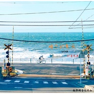

Thyrsus
============================

|  |  |
| :--: | :-- |
| [ Thyrsus](https://i.xiami.com/marijuana) | **地区**: China 中国大陆 **风格**: 阳光流行 Sunshine Pop, 国语流行 Mandarin Pop **播放数**: 1119537 **粉丝数**: 662 **评论数**: 27  |

## 档案

不懂乐理，只会弹琴 
良善的民间吉他爱好者 
身边美好的回忆我会帮你们慢慢找回

## 专辑

| 名称 | 语种 | 唱片公司 | 发行时间 | 专辑类别 | 专辑风格 |
| :--: | :-- | :-- | :-- | :-- | :-- |
| [ 器皿爱人](./albums/2105288799.md) | 国语 | 独立发行 | 2019年09月27日 | 录音室专辑 | 古典跨界 Classical Crossover, 古典主义 Classical period |
| [ 暗恋的夏天](./albums/2105156057.md) | 国语 | 独立发行 | 2019年08月15日 | 录音室专辑 | 阳光流行 Sunshine Pop |
| [ 去见女网友](./albums/2104974825.md) | 纯音乐 | 独立发行 | 2019年07月07日 | 录音室专辑 | 爵士放克 Jazz Funk |
| [ 随心所欲](./albums/2104962556.md) | 国语 | 独立发行 | 2019年06月25日 | 录音室专辑 | 鼓打贝斯 Drum & Bass |
| [ 小城大事](./albums/2104857585.md) | 粤语 |  | 2019年05月12日 | 录音室专辑 | 流行 Pop |
| [ Echo](./albums/2104412417.md) | 国语 |  | 2018年12月25日 | 录音室专辑 | 轻音乐流行 Light Pop |
| [ 岳小姐的店](./albums/2104371247.md) | 国语 | 独立发行 | 2018年12月14日 | 录音室专辑 | 放松新世纪 Relaxation New Age |
| [ 月山](./albums/2104369776.md) | 国语 | 独立发行 | 2018年12月13日 | 录音室专辑 | 校园民谣 Campus Folk |
| [ 下雨天我想为你撑把伞](./albums/2104133852.md) | 国语 | 独立发行 | 2018年10月23日 | 录音室专辑 | 都市流行 City Pop |
| [ 我对吉他浅薄拙劣的理解](./albums/2103605708.md) | 国语 | 独立发行 | 2018年03月14日 | 录音室专辑 | 流行 Pop |
| [ 我对吉他浅薄拙劣的理解 补完](./albums/2103608330.md) | 国语 | 独立发行 | 2018年03月14日 | 录音室专辑 | 流行 Pop |
| [ 直播弹的那些曲儿](./albums/2102864164.md) | 其他 | 独立发行 | 2017年09月26日 | 录音室专辑 | 器乐独奏 Solo Instrumental, 日本流行 J-Pop |
| [ MAriJuANa與他的好朋友們朋友 吉他 我](./albums/2100247300.md) | 国语 | 独立发行 | 2015年12月15日 | 合集, 杂锦 | 国语流行 Mandarin Pop |

## 评论

|  |  |  |
| :-- | :-- | :-- |
|  [虾米用户](https://emumo.xiami.com/u/8349209)  2021-01-06 08:03 赞(1) 踩(0) | 
虾米要离开啦，请问有b站账号嘛？
 |
|  [虾米用户](https://emumo.xiami.com/u/356515068)  2020-02-16 14:54 赞(1) 踩(0) | 
麻麻爹，吉他什么型号？
 |
|  [虾米用户](https://emumo.xiami.com/u/46399232) 爱生活，爱自然。 2019-11-03 22:19 赞(1) 踩(0) | 

 |
|  [虾米用户](https://emumo.xiami.com/u/113867) 抵达自己，远比抵达成功困... 2019-06-26 12:56 赞(1) 踩(0) | 
 
 |
|  [虾米用户](https://emumo.xiami.com/u/10477614) ♚KEEP CALM A... 2019-03-24 19:51 赞(1) 踩(0) | 

 |
|  [虾米用户](https://emumo.xiami.com/u/199692112)  2018-12-31 13:54 赞(1) 踩(0) | 
是不是都忘了B站密码了啊
 |
|  [虾米用户](https://emumo.xiami.com/u/349339882) 后荣迷。努力学习中。 2018-10-09 19:17 赞(1) 踩(0) | 
很棒诶*罒▽罒*
 |
|  [虾米用户](https://emumo.xiami.com/u/260970105)  2018-03-20 08:04 赞(1) 踩(0) | 
来啦
 |
|  [虾米用户](https://emumo.xiami.com/u/351794813)  2018-03-01 08:07 赞(2) 踩(0) | 
斗鱼经常看你直播
 |
| ⇒ |  [虾米用户](https://emumo.xiami.com/u/195953403)  2018-03-15 10:34 赞(0) 踩(0) | 
直播上经常看到熊猫吧 
 |
|  [虾米用户](https://emumo.xiami.com/u/267923738)   2017-10-30 10:08 赞(0) 踩(0) | 
麻哥你qq多少！
 |
|  [虾米用户](https://emumo.xiami.com/u/245041427) 往哪里找安慰会简单一些 2017-10-18 11:59 赞(0) 踩(0) | 
(ง •̀灬•́)ง
 |
|  [虾米用户](https://emumo.xiami.com/u/330442719)  2017-10-17 10:25 赞(0) 踩(0) | 
我的麻
 |
|  [虾米用户](https://emumo.xiami.com/u/291472940)  2017-07-06 18:52 赞(0) 踩(0) | 
屌炸天
 |
|  [虾米用户](https://emumo.xiami.com/u/296428713)  2017-06-25 10:46 赞(0) 踩(0) | 
已分享，谢谢。
 |
|  [虾米用户](https://emumo.xiami.com/u/127620762) $HIT THE FUC... 2017-04-20 20:11 赞(0) 踩(0) | 
这么名字跟歌曲不配啊
 |
|  [虾米用户](https://emumo.xiami.com/u/12491332)   2016-12-16 13:03 赞(0) 踩(0) | 
很棒哦！
 |
|  [虾米用户](https://emumo.xiami.com/u/109019164) 徒然求索，不如思止。 2016-05-14 22:01 赞(0) 踩(0) | 
搜未闻花名，竟然看到了麻哥，惊喜呀！
 |
|  [虾米用户](https://emumo.xiami.com/u/10964416) 永遠活在音樂國度，伴著月... 2016-04-06 06:00 赞(0) 踩(0) | 
能要谱么？
 |
|  [虾米用户](https://emumo.xiami.com/u/51696680) 我还没想好要写什么... 2016-01-14 01:21 赞(0) 踩(0) | 
麻哥一定支持你，听你好长时间了哈哈哈哈
 |
|  [虾米用户](https://emumo.xiami.com/u/97543830)  2016-01-10 22:49 赞(0) 踩(0) | 
野生君 好棒的 从b站过来的 因为小埋
 |
|  [虾米用户](https://emumo.xiami.com/u/380654) 笨拙的纯情BOY 2015-12-25 14:45 赞(1) 踩(0) | 
麻哥 录一首unravel 吧！！！！
 |
|  [虾米用户](https://emumo.xiami.com/u/92036118)  2015-12-16 12:55 赞(0) 踩(0) | 
终于能听到“杀人”的单曲了
 |
|  [虾米用户](https://emumo.xiami.com/u/51585193)   2015-12-15 22:02 赞(0) 踩(0) | 
2
 |
|  [虾米用户](https://emumo.xiami.com/u/42022669)  2015-12-01 22:08 赞(0) 踩(0) | 
1
 |
|  [虾米用户](https://emumo.xiami.com/u/20297234) 我还没想好要写什么... 2014-07-03 19:44 赞(27) 踩(0) | 
我刚入驻了虾米音乐人，欢迎大家来我的个人主页，收听我的最新音乐
 |
| ⇒ |  [虾米用户](https://emumo.xiami.com/u/2443865) 流过记忆的河 2019-10-17 17:15 赞(0) 踩(0) | 
弹的很有味道！！！很有感情！！！听着听着就融入情感氛围中了！！！   
 |
