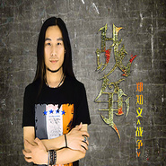

战争
============================

|  |  |
| :--: | :-- |
| [ 战争](https://emumo.xiami.com/album/2102739582) | **艺人**: [郑知文](../index.md) **语种**: 国语 **唱片公司**: 上海天空唱片（天空音乐工作室） **发行时间**: 2017年04月28日 **专辑类别**: 录音室专辑 **专辑风格**: 流行 Pop, 国语流行 Mandarin Pop **播放数**: 2043 **收藏数**: 2 **评论数**: 0  |

## 简介

 
《战争》歌手郑知文2017年发行的单曲，也是湖南电视台签约艺人，词曲唱作人张希词曲，这首歌里不仅表达了对残酷战争的厌恶和唾弃，还唱出了人们对和平的无限渴望与向往，更是对战友之间的兄弟情义进行礼赞。有人在和平的蓝天下歌颂美与爱；有人在战争的烟火中追求生与义。一起反思战争与动乱、追求和平与希望。 

## 曲目

## 评论

|  |  |  |  |
| :-- | :-- | :-- | :-- |
