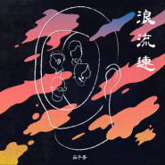

浪流连
============================

|  |  |
| :--: | :-- |
| [ 浪流连](https://emumo.xiami.com/album/2104034635) | **艺人**: [茄子蛋](../index.md) **语种**: 闽南语 **唱片公司**: KKFARM **发行时间**: 2018年09月17日 **专辑类别**: EP, 单曲 **专辑风格**: 闽南语流行 Bân-lâm-gú Pop **播放数**: 992000 **收藏数**: 252 **评论数**: 43  |

## 简介

## 曲目

## 评论

|  |  |  |  |
| :-- | :-- | :-- | :-- |
|  [虾米用户](https://emumo.xiami.com/u/6054046)  2021-01-21 14:05 赞(0) 踩(0) | 
MV里面简直就是天意弄人，浪子回头了还是一无所有。相比现实我们努力了也是一无所有，不是房奴就是车奴，活着没意思，一辈子的努力付出到头来真的一无所有了，开心更多都是累没爱
 |
|  [虾米用户](https://emumo.xiami.com/u/445172210)  2020-11-10 13:29 赞(1) 踩(0) | 
《这款自作多情》、《浪流连》、《浪子回头》，MV观看时这样的顺序，一个完整的故事啊
 |
|  [虾米用户](https://emumo.xiami.com/u/362083809) 尘归尘 2020-08-11 14:44 赞(0) 踩(0) | 

 |
|  [虾米用户](https://emumo.xiami.com/u/427208425) 听歌而已 2020-08-08 14:39 赞(0) 踩(0) | 
好
 |
|  [虾米用户](https://emumo.xiami.com/u/263402364) 终于体会到了，听什么歌都... 2019-12-20 16:14 赞(0) 踩(0) | 
我已经决定欲做一个善良的歹囝
 |
|  [虾米用户](https://emumo.xiami.com/u/256678452)  2019-10-04 19:44 赞(0) 踩(0) | 
很久没有听到这么走心的歌啦
 |
|  [虾米用户](https://emumo.xiami.com/u/309713003) 人生的路，自己走，开心就... 2019-04-25 00:05 赞(1) 踩(0) | 
好听
 |
|  [虾米用户](https://emumo.xiami.com/u/98132996) 给岁月以文明，而不是给文... 2019-04-22 21:56 赞(1) 踩(0) | 
歌好听，mv好看。
 |
|  [虾米用户](https://emumo.xiami.com/u/420653228) 不遠不近 不糾纏 不熱不... 2019-04-06 18:04 赞(1) 踩(0) | 
feel 100%
 |
|  [虾米用户](https://emumo.xiami.com/u/346165752)  2019-04-02 21:41 赞(0) 踩(0) | 
鲁邦三世的头像
 |
|  [虾米用户](https://emumo.xiami.com/u/352308850)  2019-03-12 14:12 赞(2) 踩(0) | 
今天连续听“浪子”“留连”，棒极了，最好看MV，拍的到位，一个怀念朋友，一个讲述朋友，
 |
|  [虾米用户](https://emumo.xiami.com/u/32697312) 也许..这就是江湖吧 2019-02-14 19:00 赞(3) 踩(0) | 
最近听过的闽南话歌曲，这只乐队是最棒的 
 |
|  [虾米用户](https://emumo.xiami.com/u/303229558) 我还没想好要写什么... 2019-02-14 11:26 赞(1) 踩(0) | 
这歌不仅仅是这个时代的经典。再过20年依然不退色。
 |
|  [虾米用户](https://emumo.xiami.com/u/270252508)  2019-02-05 21:44 赞(0) 踩(0) | 
与现在方言说唱相比，我感觉茄子蛋的味道像老酒样醇长
 |
|  [虾米用户](https://emumo.xiami.com/u/223546283) 「希望生活常有新意」 2019-02-04 02:02 赞(0) 踩(0) | 
最怕流连于你
 |
|  [虾米用户](https://emumo.xiami.com/u/93855488) 别忘初心！ 2019-01-24 17:09 赞(0) 踩(0) | 
好歌
 |
|  [虾米用户](https://emumo.xiami.com/u/96296322)  2019-01-14 04:24 赞(0) 踩(0) | 
.
 |
|  [虾米用户](https://emumo.xiami.com/u/594090) 饮鸠片刻 片刻安慰 2018-12-27 16:26 赞(0) 踩(0) | 
&amp;ldquo;浪子回头，却仍一无所有&amp;rdquo;
 |
|  [虾米用户](https://emumo.xiami.com/u/5755)  2018-12-27 14:41 赞(0) 踩(0) | 
不象 玖壹壹 那样 充满各种台客尬迪~  这歌真绝。。
 |
|  [虾米用户](https://emumo.xiami.com/u/19956849) 我还没想好要写什么... 2018-12-22 22:51 赞(1) 踩(0) | 
期待你有天到内地演出
 |
| ⇒ |  [虾米用户](https://emumo.xiami.com/u/6160395)  2018-12-26 09:59 赞(0) 踩(0) | 
已经巡演结束了
 |
|  [虾米用户](https://emumo.xiami.com/u/42963872) 我还没想好要写什么... 2018-12-12 23:29 赞(0) 踩(0) | 
-
 |
|  [虾米用户](https://emumo.xiami.com/u/20101136) 音樂是意志的本身 2018-12-03 21:55 赞(0) 踩(0) | 
台灣大哥大..
 |
|  [虾米用户](https://emumo.xiami.com/u/41284147) 我就是你要找的贱人 2018-12-03 09:58 赞(0) 踩(0) | 
杭州见！
 |
|  [虾米用户](https://emumo.xiami.com/u/42725114) ThistheshitI... 2018-12-02 23:47 赞(0) 踩(0) | 

 |
|  [虾米用户](https://emumo.xiami.com/u/23980164) 星星说月亮最寂寞。 2018-11-27 23:14 赞(0) 踩(0) | 
爱情的流浪连
 |
|  [虾米用户](https://emumo.xiami.com/u/130784200) 愿时代仍为我留了座. 2018-11-14 23:43 赞(1) 踩(0) | 
作品直击人心  力挺出色唱作人
 |
|  [虾米用户](https://emumo.xiami.com/u/58717110) burdening 2018-11-10 01:59 赞(0) 踩(0) | 
大概是对未来的惧怕和将逝美好的惋惜，让人弄榴槤
 |
|  [虾米用户](https://emumo.xiami.com/u/262316086)  2018-10-23 12:56 赞(0) 踩(0) | 
很好听，yb的mv很有感。
 |
|  [虾米用户](https://emumo.xiami.com/u/1867517) I tried my b... 2018-10-15 08:50 赞(2) 踩(0) | 
讲真 期待小巨蛋见啦
 |
|  [虾米用户](https://emumo.xiami.com/u/4796225)   2018-10-07 12:24 赞(0) 踩(0) | 
酷&amp;hellip;
 |
|  [虾米用户](https://emumo.xiami.com/u/405568066)  2018-10-06 03:17 赞(0) 踩(0) | 
超好聽
 |
|  [虾米用户](https://emumo.xiami.com/u/93129636)   2018-09-30 07:18 赞(0) 踩(0) | 
我就想知道为什么语种是英语&amp;hellip;&amp;hellip;
 |
|  [虾米用户](https://emumo.xiami.com/u/20264980)  2018-09-28 10:59 赞(1) 踩(0) | 
似乎是跟《浪子回头》呼应的一首歌，一首讲兄弟，一首讲情人。
 |
| ⇒ |  [虾米用户](https://emumo.xiami.com/u/16846904) 我还没想好要写什么... 2018-09-28 20:26 赞(0) 踩(0) | 
看MV是前傳的意思
 |
| ⇒ |  [虾米用户](https://emumo.xiami.com/u/71342234) 隔壁鄰居的貓叫做查理 2018-10-03 12:12 赞(0) 踩(0) | 
下一首該不會就是講兄弟的情人情人了
 |
| ⇒ |  [虾米用户](https://emumo.xiami.com/u/20264980)  2018-10-06 19:12 赞(0) 踩(0) | 
<q><b>Dr.张说：</b></q>
 |
| ⇒ |  [虾米用户](https://emumo.xiami.com/u/20264980)  2018-10-06 19:13 赞(0) 踩(0) | 
<q><b>Howard Sun说：</b></q>
 |
|  [虾米用户](https://emumo.xiami.com/u/2248155) 音樂來淋浴。 2018-09-27 16:06 赞(0) 踩(0) | 
真的很棒！
 |
|  [虾米用户](https://emumo.xiami.com/u/21314192) 不值一提 2018-09-27 13:27 赞(1) 踩(0) | 
mv好看！
 |
|  [虾米用户](https://emumo.xiami.com/u/40936242) 我还没想好要写什么... 2018-09-17 13:23 赞(1) 踩(0) | 
快来内地巡回！
 |
|  [虾米用户](https://emumo.xiami.com/u/6531780) 想要变成你 2018-09-17 10:22 赞(0) 踩(0) | 

 |
