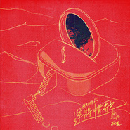

Happy!!! 运将情歌
============================

|  |  |
| :--: | :-- |
| [ Happy!!! 运将情歌](https://emumo.xiami.com/album/2104968718) | **艺人**: [茄子蛋](../index.md) **语种**: 国语 **唱片公司**:  **发行时间**: 2019年07月02日 **专辑类别**: EP, 单曲 **专辑风格**: 闽南语流行 Bân-lâm-gú Pop **播放数**: 102170 **收藏数**: 30 **评论数**: 29  |

## 简介

-茄子蛋EggPlantEgg 2019 全新专辑《我们以后要结婚》首波主打单曲〈Happy!!! 运将情歌〉-  
如果没有爱人的陪伴，  
日子该如何过。  
我一定会背着我们的家继续往前走，  
放心交给我，  
一切都好。

## 曲目

## 评论

|  |  |  |
| :-- | :-- | :-- |
|  [虾米用户](https://emumo.xiami.com/u/13043233) 覕月 2019-11-05 11:13 赞(0) 踩(0) | 
運ちゃん 日語詞
 |
|  [虾米用户](https://emumo.xiami.com/u/321802469) 547349826962... 2019-10-03 19:04 赞(0) 踩(0) | 
我喜欢
 |
|  [虾米用户](https://emumo.xiami.com/u/360560248)  2019-09-20 16:38 赞(0) 踩(0) | 
从前，佣人被分为近身、洗熨、煮饭和打杂，请不齐四种工人的，就只能找个“一脚踢”一人做齐，于是被称作“阿四”。一段关系的长久靠的不是一味地忍让、迁就、和付出，没有平等谈不上爱的交流，单方面的付出不是爱，而是一种自我压抑小心翼翼地讨好。这种不被珍惜的感觉日积月累，叠加到无法忍受终于爆发时，结果往往是毁灭性的。心智成熟的人才有完整的自我，拥有完整的自我才可能真正关注“我们”，才会在关系中做到很好的平衡。
 |
|  [虾米用户](https://emumo.xiami.com/u/11751010) 感謝 人生無常 這回事。 2019-09-04 05:34 赞(0) 踩(0) | 
推薦大家可以先看一下這首歌的MV，很觸動人心，就是因為他在社會某些角落都真實上演，未必全然皆同，但就是能引起共鳴，比起一些轟轟烈烈的故事，這種對於市井小民討生活的日常，才是真的最令人有所感觸的地方。感謝這些努力創作，把社會努力生活的小人物心情表達出來的音樂人。  茄子蛋厲害的地方在於他們在創作上真的很用心，浪子回頭和浪流連分別講了友情和愛情，這一首是親情，不僅選材很好，編曲上也是很令人激賞，以及他們把閩南語唱出了溫度。從這幾年感覺得出，純華語流行樂進入停滯期，沒什麼太大的變化，但有在寫台語流行樂的，卻意外的各種異軍突起。而且曲風還在不停的進化創新，台灣新一代的音樂人真的有夠猛。
 |
|  [虾米用户](https://emumo.xiami.com/u/424886360)  2019-08-09 06:09 赞(0) 踩(0) | 
每一首歌都有灵魂
 |
|  [虾米用户](https://emumo.xiami.com/u/99573990) ....... 2019-08-06 15:30 赞(1) 踩(0) | 
超级赞，10分给他按下去
 |
|  [虾米用户](https://emumo.xiami.com/u/350459243)  2019-07-25 17:55 赞(1) 踩(0) | 
非常非常棒，接地气 
 |
|  [虾米用户](https://emumo.xiami.com/u/11018219)  2019-07-23 21:30 赞(1) 踩(0) | 
牛逼,好听.
 |
|  [虾米用户](https://emumo.xiami.com/u/427484175)  2019-07-19 12:24 赞(0) 踩(0) | 
厂 ▽必/。薄cu 甘些\1
 |
|  [虾米用户](https://emumo.xiami.com/u/427484175)  2019-07-19 12:23 赞(0) 踩(0) | 
xydxx27579217(&amp;.。 决
 |
|  [虾米用户](https://emumo.xiami.com/u/67964378) 我还没想好要写什么... 2019-07-11 09:38 赞(0) 踩(0) | 
哈哈哈哈哈、茄子蛋又来了、发个新专吧
 |
|  [虾米用户](https://emumo.xiami.com/u/198976286) 最大的怀疑总有最小的自己 2019-07-07 18:48 赞(0) 踩(0) | 
温暖又深沉
 |
|  [虾米用户](https://emumo.xiami.com/u/11116912) 我还没想好要写什么... 2019-07-06 16:13 赞(0) 踩(0) | 
不错哈
 |
|  [虾米用户](https://emumo.xiami.com/u/17834749) 飞蛾扑火. 2019-07-05 21:09 赞(0) 踩(0) | 
台灣的出租車司機叫運將
 |
|  [虾米用户](https://emumo.xiami.com/u/267266265) Timo 2019-07-05 19:33 赞(0) 踩(0) | 
嘿嘿
 |
|  [虾米用户](https://emumo.xiami.com/u/16846904) 我还没想好要写什么... 2019-07-05 19:14 赞(0) 踩(0) | 
唱到我心裡了
 |
|  [虾米用户](https://emumo.xiami.com/u/47638025)  2019-07-04 23:04 赞(0) 踩(0) | 
茄子蛋的这首新歌有寂寞感
 |
|  [虾米用户](https://emumo.xiami.com/u/265935714) 没有人能抢走我的耳机！！ 2019-07-04 10:50 赞(1) 踩(0) | 
总是有北京冬夜冷风的味道，想来明明是南岛的歌啊 啧
 |
|  [虾米用户](https://emumo.xiami.com/u/4386436) 摇滚，青春，时光。 2019-07-04 07:46 赞(1) 踩(0) | 
只听完一遍，感觉副歌部分比较单一的重复，效果还是出来了！感觉如“想你的彼暗”几句一样有点变化应该会有不一样的感觉；段落的唱法不落俗套，这点做得很棒！一首完成得很棒的茄子蛋作品～有新的ENCORE靓曲啦～加油
 |
|  [虾米用户](https://emumo.xiami.com/u/16773772) 简单爱你心所爱 2019-07-03 12:37 赞(0) 踩(0) | 
喜欢伍佰就对了
 |
|  [虾米用户](https://emumo.xiami.com/u/437780) 幸福難不難﹏ 2019-07-03 09:49 赞(0) 踩(0) | 
好聽
 |
|  [虾米用户](https://emumo.xiami.com/u/9541413) 很幸运，比起回忆，我更爱... 2019-07-03 06:08 赞(0) 踩(0) | 
好听
 |
|  [虾米用户](https://emumo.xiami.com/u/28784806)  2019-07-03 00:03 赞(2) 踩(0) | 
我是山东人，听不懂歌词的意思，我感受了一种真实的感情，很细腻的感动。声音低沉带着真心，喜欢茄子蛋。
 |
|  [虾米用户](https://emumo.xiami.com/u/243247087) 冬阴功的汤里不能没有虾米 2019-07-02 23:09 赞(0) 踩(0) | 
歌里爱很多
 |
|  [虾米用户](https://emumo.xiami.com/u/263833216)  2019-07-02 22:44 赞(0) 踩(0) | 
这歌绝不亚＂浪子回头＂。
 |
|  [虾米用户](https://emumo.xiami.com/u/42963872) 我还没想好要写什么... 2019-07-02 19:23 赞(2) 踩(0) | 
.
 |
|  [虾米用户](https://emumo.xiami.com/u/31531934) 恋の道に近道はない 2019-07-02 17:30 赞(2) 踩(0) | 
請大家多多支持茄子蛋新曲聆聽收藏感謝
 |
|  [虾米用户](https://emumo.xiami.com/u/44025838) Sweet soul w... 2019-07-02 17:29 赞(1) 踩(0) | 
听着真舒服嘿（还没细看歌词
 |
|  [虾米用户](https://emumo.xiami.com/u/22443747) 网易 危险de熊猫 2019-07-02 16:48 赞(2) 踩(0) | 
对于一个乐队来说  情怀比什么都重要  
 |
