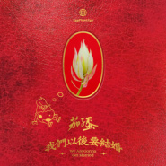
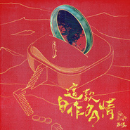
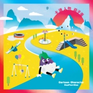
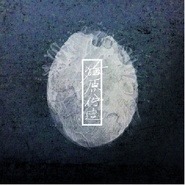

茄子蛋
============================

|  |  |
| :--: | :-- |
| [ 茄子蛋](https://i.xiami.com/eggplantegg) | **地区**: Taiwan, PRC 中国台湾 **风格**: 前卫摇滚 Progressive Rock, 自由即兴 Free Improvisation, 另类摇滚 Alternative Rock, 闽南语流行 Bân-lâm-gú Pop **播放数**: 24604546 **粉丝数**: 8244 **评论数**: 140  |

## 档案

喜欢用戏谑自由的文字来谈论人生，谈论爱情。 
人生其实没什么坏事，至少我还活着， 
而且还拥有着音乐。 
--- 
第  29  届金曲奖 
最佳新人奖　茄子蛋《卡通人物》获奖 
最佳台语专辑奖《卡通人物》获奖

## 专辑

| 名称 | 语种 | 唱片公司 | 发行时间 | 专辑类别 | 专辑风格 |
| :--: | :-- | :-- | :-- | :-- | :-- |
| [ 新年恭喜薯来堡](./albums/5022620057.md) | 国语 | KKFARM | 2021年01月28日 | EP, 单曲 | 流行 Pop |
| [ 我们以后要结婚](./albums/2105206215.md) | 闽南语 | 艾格普兰特艾格 | 2019年09月03日 | 录音室专辑 |  |
| [ 这款自作多情](./albums/2105155450.md) | 闽南语 | KKFARM | 2019年08月13日 | EP, 单曲 | 闽南语流行 Bân-lâm-gú Pop |
| [ Happy!!! 运将情歌](./albums/2104968718.md) | 国语 |  | 2019年07月02日 | EP, 单曲 | 闽南语流行 Bân-lâm-gú Pop |
| [ 浪流连](./albums/2104034635.md) | 闽南语 | KKFARM | 2018年09月17日 | EP, 单曲 | 闽南语流行 Bân-lâm-gú Pop |
| [ 卡通人物](./albums/2103710978.md) | 闽南语 | KKFARM | 2017年07月28日 | 录音室专辑 | 另类摇滚 Alternative Rock, 独立摇滚 Indie Rock, 闽南语流行 Bân-lâm-gú Pop |
| [ 猶原佇這](./albums/915725563.md) | 国语 | 独立发行 | 2013年07月25日 | EP, 单曲 | 另类摇滚 Alternative Rock |

## 评论

|  |  |  |
| :-- | :-- | :-- |
|  [虾米用户](https://emumo.xiami.com/u/283411712) 无 2021-01-09 04:51 赞(1) 踩(0) | 
我已经决定，做一个善良的恶人 -浪流连
 |
|  [虾米用户](https://emumo.xiami.com/u/8550608) 我还没想好要写什么... 2021-01-05 17:30 赞(0) 踩(0) | 
你是我在虾米最钟情的人&amp;hellip;。
 |
|  [虾米用户](https://emumo.xiami.com/u/256005842)  2020-12-18 22:57 赞(1) 踩(0) | 
台湾金马奖高光时刻。
 |
|  [虾米用户](https://emumo.xiami.com/u/445989676) 如果音乐足够动人 2020-11-26 22:48 赞(0) 踩(0) | 
蛋，我来看你了
 |
|  [虾米用户](https://emumo.xiami.com/u/362083809) 尘归尘 2020-09-07 14:07 赞(0) 踩(0) | 
蛋，什么时候现场，我在广东
 |
|  [虾米用户](https://emumo.xiami.com/u/326165803) 我还没想好要写什么... 2020-08-07 18:21 赞(0) 踩(0) | 

 |
|  [虾米用户](https://emumo.xiami.com/u/317454205) 不妄粗心 2020-07-20 10:03 赞(0) 踩(0) | 
想在虾米听到你独唱的你啊你啊
 |
|  [虾米用户](https://emumo.xiami.com/u/11018219)  2020-05-16 11:16 赞(0) 踩(0) | 
出了新版广告曲.才发现主唱唱得也很好.
 |
|  [虾米用户](https://emumo.xiami.com/u/478527) 好想跟衣服在洗衣机里滚 2020-02-26 21:13 赞(0) 踩(0) | 
听完，最喜欢《闻道有先后，术业有专攻》真的是一本正经的装一本正经
 |
|  [虾米用户](https://emumo.xiami.com/u/42893985) 硪似一条闲鱼 2019-11-14 22:13 赞(1) 踩(0) | 
宝藏乐队，茄子蛋是最大的惊喜！
 |
|  [虾米用户](https://emumo.xiami.com/u/3576595) 。SHMILY ~~ 2019-11-07 22:11 赞(1) 踩(0) | 
听不懂怎么办，音ok
 |
|  [虾米用户](https://emumo.xiami.com/u/354632741) 夜貓DJ 2019-11-02 12:11 赞(3) 踩(0) | 
發現自己閩南語都聽的懂，超親切的也有一種驕傲的感覺，閩南語因為生活中長輩們真的都還是講閩南語佔大多數，不想讓這個語言消失從小也會跟著講跟學希望能永遠傳承下去，有趣的是北中南、海線和內陸腔調也會有很大差異，閩南語用在學唐詩判斷平仄也很好用，因為比起比較接近古音。
 |
| ⇒ |  [虾米用户](https://emumo.xiami.com/u/401053467)  2020-04-07 00:02 赞(0) 踩(0) | 
不会丢的，闽南人很多，晋江人更多
 |
|  [虾米用户](https://emumo.xiami.com/u/19071940) 我情愿和你化作一团火焰 2019-09-16 14:45 赞(0) 踩(0) | 
比心
 |
|  [虾米用户](https://emumo.xiami.com/u/123246788) Music is my ... 2019-09-14 20:54 赞(1) 踩(0) | 
好听，喜欢！ 
 |
|  [虾米用户](https://emumo.xiami.com/u/5853535)  2019-09-10 00:58 赞(0) 踩(0) | 
创作、编曲、演奏、嗓音、颜值都那么好。求国语专辑
 |
|  [虾米用户](https://emumo.xiami.com/u/5853535)  2019-09-10 00:48 赞(0) 踩(0) | 
这编曲转为普通话也无敌啊
 |
|  [虾米用户](https://emumo.xiami.com/u/17691156) あなたに出会えて よかっ... 2019-09-08 23:09 赞(1) 踩(0) | 
茄子蛋前鼓手小赖xd被抓………
 |
|  [虾米用户](https://emumo.xiami.com/u/426020501) 我还没想好要写什么... 2019-09-06 19:00 赞(1) 踩(0) | 
剛刷到新聞，鼓手賴XD了，不過好像已經退了
 |
|  [虾米用户](https://emumo.xiami.com/u/345529)  2019-09-05 23:58 赞(0) 踩(0) | 
茄子蛋和伍佰的区别在哪？
 |
|  [虾米用户](https://emumo.xiami.com/u/332498160)  You'll Love... 2019-09-05 19:59 赞(0) 踩(0) | 
今天家人在市区听了你们的现场，羡慕死了
 |
|  [虾米用户](https://emumo.xiami.com/u/145902426) 自在如风。 2019-09-05 02:58 赞(0) 踩(0) | 
闽南语听着比国语更有感觉。
 |
|  [虾米用户](https://emumo.xiami.com/u/36308113)  2019-08-27 19:09 赞(1) 踩(0) | 
主唱光头的样子好像唐僧
 |
|  [虾米用户](https://emumo.xiami.com/u/40932624) comfortably ... 2019-08-07 00:07 赞(0) 踩(0) | 
把你的女朋友送给我好不好 我怎么记得有这首
 |
|  [虾米用户](https://emumo.xiami.com/u/1622688)   2019-06-01 08:18 赞(1) 踩(0) | 
有点早期五月天唱闽南语歌的样子 加油
 |
|  [虾米用户](https://emumo.xiami.com/u/246295085)  2019-05-19 01:03 赞(0) 踩(0) | 
期待你们的演唱会和新专辑！
 |
|  [虾米用户](https://emumo.xiami.com/u/279984716)   2019-05-17 22:55 赞(0) 踩(0) | 
啥时候，再正式发专辑？
 |
|  [虾米用户](https://emumo.xiami.com/u/110248488) 有问题私信  看到就回复... 2019-05-15 01:29 赞(1) 踩(0) | 
何妨
 |
|  [虾米用户](https://emumo.xiami.com/u/17025271)  2019-05-11 11:25 赞(0) 踩(0) | 
不错继续加油
 |
|  [虾米用户](https://emumo.xiami.com/u/98132996) 给岁月以文明，而不是给文... 2019-04-22 21:54 赞(0) 踩(0) | 
发现宝藏了，好听好听！
 |
|  [虾米用户](https://emumo.xiami.com/u/257036009)  2019-04-15 21:06 赞(3) 踩(0) | 
超级爱你们呢，一把年纪了，突然发现自己还活着
 |
|  [虾米用户](https://emumo.xiami.com/u/4771536) I like the v... 2019-04-12 13:41 赞(0) 踩(0) | 
eggplantegg
 |
|  [虾米用户](https://emumo.xiami.com/u/243361098) 少少情歌 2019-04-03 19:56 赞(0) 踩(0) | 
宝藏乐队啊 爱上了
 |
|  [虾米用户](https://emumo.xiami.com/u/346165752)  2019-04-02 21:40 赞(0) 踩(0) | 

 |
|  [虾米用户](https://emumo.xiami.com/u/96775922) 天真有邪 2019-03-29 02:48 赞(0) 踩(0) | 
第一百
 |
|  [虾米用户](https://emumo.xiami.com/u/45141855)   2019-03-26 20:01 赞(0) 踩(0) | 
浪子回头很牛B
 |
|  [虾米用户](https://emumo.xiami.com/u/412686329)  2019-03-23 12:43 赞(0) 踩(0) | 
好听同时激励我重新站起来
 |
|  [虾米用户](https://emumo.xiami.com/u/5489003) YUY. 2019-03-23 12:14 赞(0) 踩(0) | 
干了这杯
 |
|  [虾米用户](https://emumo.xiami.com/u/3422483)  2019-03-23 09:59 赞(0) 踩(0) | 
不做过多评论，干就对了
 |
|  [虾米用户](https://emumo.xiami.com/u/47555314)   2019-02-21 23:16 赞(2) 踩(0) | 
盛世才多
 |
|  [虾米用户](https://emumo.xiami.com/u/186178048) 超爱Latin/电音/雷... 2019-02-04 09:26 赞(2) 踩(0) | 
以前听闽南语一听就听出来是台湾那边歌手的，第一次听茄子的浪子回头还以为是韩语混合闽南语呢 之后的每次听茄子唱的每一首歌都很像韩语的感觉，很有自己的特色哦～赞 
 |
|  [虾米用户](https://emumo.xiami.com/u/38537665) 昏一支一支得点，酒一杯一... 2019-02-04 02:44 赞(1) 踩(0) | 
加油！
 |
|  [虾米用户](https://emumo.xiami.com/u/48640880) 你是我不急的梦 2019-01-28 13:25 赞(0) 踩(0) | 
哈哈哈哈简介什么时候悄摸改了？
 |
| ⇒ |  [虾米用户](https://emumo.xiami.com/u/9459789)  2019-02-06 21:40 赞(0) 踩(0) | 
以前的简介是啥？好好奇喔
 |
|  [虾米用户](https://emumo.xiami.com/u/39439691) agony 2019-01-24 01:18 赞(1) 踩(0) | 
谢谢你让我听见这么好的歌
 |
|  [虾米用户](https://emumo.xiami.com/u/303229558) 我还没想好要写什么... 2019-01-19 16:02 赞(0) 踩(0) | 
什么时候能听到浪流连完整专辑啊
 |
|  [虾米用户](https://emumo.xiami.com/u/49625656) 人似秋鸿来有信，事如春梦... 2019-01-16 23:19 赞(1) 踩(0) | 
坚持用方言来歌唱...... 
 |
|  [虾米用户](https://emumo.xiami.com/u/412349427)  2019-01-14 21:09 赞(0) 踩(0) | 
无情的亲爱的  去哪儿 不会回来了 反复问着 是吗  走哪儿 出去走走吧 抽几根烟 走吧 哭了 浪费时间了 那就别哭 笑吧  那就笑吧 假装已经遗忘 反正原谅 本来 就是想想 那就笑吧 就笑得可怕笑得发狂 不愿见到你哭 所以假装  不会回来吧 我会哭泣吗 反正结果本来就这样长这样 就算再后悔 深深后悔 那就笑 在哭之前  那就笑吧 假装已经遗忘 反正原谅 本来 就是想想 那就笑吧 就笑得可怕笑得发狂 不愿见到你哭 所以假装  我会哭泣吗 反正结果本来就这样 就算再后悔 那就笑 在哭之前  那就笑吧 假装已经遗忘 反正原谅 本来 就是想想 那就笑吧 就笑得可怕笑得发狂 不愿见到你哭 所以假装
 |
| ⇒ |  [虾米用户](https://emumo.xiami.com/u/258377086) 我还没想好要写什么... 2019-02-02 11:26 赞(0) 踩(0) | 
这是那首？
 |
| ⇒ |  [虾米用户](https://emumo.xiami.com/u/445989676) 如果音乐足够动人 2020-11-26 22:56 赞(0) 踩(0) | 
<q><b>帅到无朋友8说：</b></q>
 |
|  [虾米用户](https://emumo.xiami.com/u/37623296) 无常逐一幻灭升起，我对你... 2019-01-14 16:49 赞(0) 踩(0) | 
蛋蛋，什么时候再来成都啊！喜欢你们，主唱的大耳环好迷人啊！我的天啊
 |
|  [虾米用户](https://emumo.xiami.com/u/773393) GALAXY 2019-01-08 14:18 赞(0) 踩(0) | 
12.23广州精彩之夜 what a wonderful night~
 |
|  [虾米用户](https://emumo.xiami.com/u/52619413) 活着就要忠于自己 2019-01-08 09:16 赞(0) 踩(0) | 
加油！
 |
|  [虾米用户](https://emumo.xiami.com/u/5449132) 我还没想好要写什么... 2019-01-08 00:03 赞(0) 踩(0) | 
唱下去哟，加油
 |
|  [虾米用户](https://emumo.xiami.com/u/42955376) 花 2019-01-06 17:47 赞(0) 踩(0) | 
mv很动人
 |
|  [虾米用户](https://emumo.xiami.com/u/47570236)  　⠀ 2019-01-03 05:28 赞(0) 踩(0) | 
好吧
 |
|  [虾米用户](https://emumo.xiami.com/u/306397541) 我不配得到自由 2018-12-30 00:35 赞(0) 踩(0) | 
希望会有更多人和我一起认识你们，喜欢你们啊
 |
|  [虾米用户](https://emumo.xiami.com/u/174211924) 阿里巴巴 2018-12-28 23:09 赞(0) 踩(0) | 
很喜欢这首歌
 |
|  [虾米用户](https://emumo.xiami.com/u/5755)  2018-12-27 14:40 赞(0) 踩(0) | 
这么牛的乐队~ 评论这么少 。。不应该啊！
 |
|  [虾米用户](https://emumo.xiami.com/u/39900088) 信自我者得永生 2018-12-24 13:19 赞(26) 踩(0) | 
昨天广州的现场稳得一匹～期望继续加油！再出好歌～2019大红大紫！
 |
|  [虾米用户](https://emumo.xiami.com/u/12930904) 月亮与六便士 2018-12-20 00:22 赞(1) 踩(0) | 
后面真的唱的很狂
 |
|  [虾米用户](https://emumo.xiami.com/u/42963872) 我还没想好要写什么... 2018-12-12 23:29 赞(0) 踩(0) | 
-
 |
|  [虾米用户](https://emumo.xiami.com/u/211950581) 你是我立在日头下，藏在心... 2018-12-07 22:58 赞(2) 踩(0) | 
希望波克比的爱，是Miss Doremi，在他还在浪子的路上把他拉回来，浪子回头，不赴一场浪流连，日后有着平淡而温馨的日常。茄子蛋，我这个世间上独一无二的人，大爱您！
 |
|  [虾米用户](https://emumo.xiami.com/u/114458052) 吞下无意义想法 2018-12-06 23:02 赞(57) 踩(0) | 
现场太厉害了 今年最棒绝不为过 主唱很会玩 吉他手超厉害! 最后大蹦迪让主唱心满意足 现在还在回味之中
 |
| ⇒ |  [虾米用户](https://emumo.xiami.com/u/193415384)  2019-08-13 21:30 赞(0) 踩(0) | 
又相遇了
 |
|  [虾米用户](https://emumo.xiami.com/u/45587595) 挺迷茫的 2018-12-05 15:13 赞(3) 踩(0) | 
日子过得再烂，蛋蛋还在！
 |
|  [虾米用户](https://emumo.xiami.com/u/38729910)   2018-11-30 21:16 赞(0) 踩(0) | 
啥时候出新歌啊
 |
|  [虾米用户](https://emumo.xiami.com/u/707855)   2018-11-23 14:07 赞(0) 踩(0) | 
我喜欢这简介
 |
|  [虾米用户](https://emumo.xiami.com/u/42725114) ThistheshitI... 2018-11-18 12:36 赞(0) 踩(0) | 

 |
|  [虾米用户](https://emumo.xiami.com/u/49748006) Fly me to th... 2018-11-17 23:39 赞(0) 踩(0) | 
ww
 |
|  [虾米用户](https://emumo.xiami.com/u/49845739) Hill song yo... 2018-11-10 23:34 赞(0) 踩(0) | 
成都见！！！
 |
|  [虾米用户](https://emumo.xiami.com/u/10926339) 点击编辑 2018-11-10 00:57 赞(0) 踩(0) | 
真的要来巡演了！QAQQQQ
 |
|  [虾米用户](https://emumo.xiami.com/u/8192862) 诗人和先知。vchat:... 2018-11-08 14:37 赞(24) 踩(0) | 
总觉得沈玉琳在唱歌
 |
| ⇒ |  [虾米用户](https://emumo.xiami.com/u/40779703) 头像不是我 2019-02-08 23:15 赞(0) 踩(0) | 
哈哈哈别这样
 |
|  [虾米用户](https://emumo.xiami.com/u/122670826) 我还没想好要写什么... 2018-11-07 22:44 赞(0) 踩(0) | 
嗯
 |
|  [虾米用户](https://emumo.xiami.com/u/3585771) 世间迂回 我若赤诚 便已... 2018-11-07 13:25 赞(1) 踩(0) | 
声如其名 荷尔蒙爆棚
 |
|  [虾米用户](https://emumo.xiami.com/u/288013826) 请大家一起养小虾米帮助听... 2018-11-03 16:27 赞(0) 踩(0) | 
）
 |
|  [虾米用户](https://emumo.xiami.com/u/17691156) あなたに出会えて よかっ... 2018-10-27 13:49 赞(0) 踩(0) | 
w
 |
|  [虾米用户](https://emumo.xiami.com/u/188196406) 喜歡獨單 2018-10-22 18:00 赞(0) 踩(0) | 
蛋蛋还在
 |
|  [虾米用户](https://emumo.xiami.com/u/51693771) 所爱市井。来碗老酒 2018-10-21 08:55 赞(0) 踩(0) | 
谢谢你们
 |
|  [虾米用户](https://emumo.xiami.com/u/47494497) 李志、陈升，“虾米也没有... 2018-10-20 19:01 赞(0) 踩(0) | 
他们的MV很好看
 |
|  [虾米用户](https://emumo.xiami.com/u/13691875) 谁的感叹 偶然合拍 2018-10-03 17:33 赞(0) 踩(0) | 
我在云游音乐节现场，粉你们了
 |
|  [虾米用户](https://emumo.xiami.com/u/21314192) 不值一提 2018-09-27 13:03 赞(0) 踩(0) | 
一个让我因为mv制作精良而产生兴趣的台团 
 |
|  [虾米用户](https://emumo.xiami.com/u/67964378) 我还没想好要写什么... 2018-09-24 09:07 赞(35) 踩(0) | 
昨天春浪最后一首说浪子回头时，周围就我一个人在狂激动，有点尴尬 但还是很开心了看到你们的现场，毕竟这是我买票的原因之一，希望你们越来越好，被更多人知道
 |
|  [虾米用户](https://emumo.xiami.com/u/380022304) 飘风不终朝，骤雨不终日。 2018-09-17 01:22 赞(2) 踩(0) | 
网易云那边新歌已经上架，虾米啥时候来啊
 |
|  [虾米用户](https://emumo.xiami.com/u/4098694) ɪ ғᴇᴇʟ ᴘᴀɪɴғ... 2018-09-13 13:09 赞(0) 踩(0) | 
.
 |
|  [虾米用户](https://emumo.xiami.com/u/329993223)  2018-07-24 08:33 赞(3) 踩(0) | 
茄子，浪子回头能不能出个国语版本呀，好期待呢，闽南语不太理解词的意思呢
 |
| ⇒ |  [虾米用户](https://emumo.xiami.com/u/260392212) 我还没想好要写什么... 2018-08-16 19:17 赞(0) 踩(0) | 
哪句不了解 我来给你翻译
 |
| ⇒ |  [虾米用户](https://emumo.xiami.com/u/404781393)  2018-11-08 09:49 赞(0) 踩(0) | 
多听就知道意思了啊
 |
|  [虾米用户](https://emumo.xiami.com/u/186437644) 任他们多漂亮 未及你矜贵... 2018-07-15 21:46 赞(0) 踩(0) | 
帅气
 |
|  [虾米用户](https://emumo.xiami.com/u/320387) 赐我爱上你的力量 2018-07-12 20:27 赞(0) 踩(0) | 
来恭喜的~~
 |
|  [虾米用户](https://emumo.xiami.com/u/12947529) 人生无悔/白走一回 2018-07-11 07:00 赞(0) 踩(0) | 
为什么只有一张专 而且卡通人物里不是十首歌吗？这里怎么就九首...
 |
|  [虾米用户](https://emumo.xiami.com/u/9972139) -Welcome to ... 2018-07-09 20:26 赞(0) 踩(0) | 

 |
|  [虾米用户](https://emumo.xiami.com/u/3612332)   2018-07-02 22:05 赞(0) 踩(0) | 
最愛
 |
|  [虾米用户](https://emumo.xiami.com/u/301677527)  2018-06-29 23:21 赞(0) 踩(0) | 
恭喜得金曲獎 
 |
|  [虾米用户](https://emumo.xiami.com/u/66880994) 如果你在前方回頭，而我不... 2018-06-27 18:06 赞(0) 踩(0) | 
太好玩
 |
|  [虾米用户](https://emumo.xiami.com/u/11751010) 感謝 人生無常 這回事。 2018-06-25 18:18 赞(0) 踩(0) | 
恭喜獲獎:）
 |
|  [虾米用户](https://emumo.xiami.com/u/45621221) 卸载状态。 2018-06-25 11:33 赞(0) 踩(0) | 
37
 |
|  [虾米用户](https://emumo.xiami.com/u/194956718) 走成了一片殘影 2018-06-24 21:06 赞(0) 踩(0) | 
感覺蛋被洗過一樣   
 |
|  [虾米用户](https://emumo.xiami.com/u/259303128) 我喜歡早上出門  深呼吸... 2018-06-23 21:41 赞(0) 踩(0) | 
恭喜啊！~\(≧▽≦)/~
 |
|  [虾米用户](https://emumo.xiami.com/u/166118996) 五月 2018-06-23 20:32 赞(0) 踩(0) | 
恭喜贺喜
 |
|  [虾米用户](https://emumo.xiami.com/u/2737024) 不是僵尸号，台湾流行乐爱... 2018-06-23 20:09 赞(25) 踩(0) | 
茄子蛋斩获第29届金曲奖最佳新人奖，恭喜恭喜！金曲奖连续两年最佳新人奖都颁给了乐团！
 |
| ⇒ |  [虾米用户](https://emumo.xiami.com/u/166118996) 五月 2018-06-23 20:33 赞(0) 踩(0) | 
乐团时代 
 |
|  [虾米用户](https://emumo.xiami.com/u/67964378) 我还没想好要写什么... 2018-06-23 19:50 赞(0) 踩(0) | 
一下子就被吸引了，恭喜了、最佳新人！翻纸稿，紧张激动的你们好可爱！
 |
|  [虾米用户](https://emumo.xiami.com/u/229490650) 就像他在游戏中所追求的排... 2018-06-16 23:12 赞(0) 踩(0) | 
突然觉得闽南语好好听啊！
 |
|  [虾米用户](https://emumo.xiami.com/u/47026156) I am not a m... 2018-06-15 07:58 赞(0) 踩(0) | 

 |
|  [虾米用户](https://emumo.xiami.com/u/36471014) oi to the wo... 2018-06-14 11:12 赞(0) 踩(0) | 
闽南语太赞了
 |
|  [虾米用户](https://emumo.xiami.com/u/63852218) 盗爱，盗谢，盗歉，盗别。 2018-05-26 20:50 赞(0) 踩(0) | 
赞呀
 |
|  [虾米用户](https://emumo.xiami.com/u/286236461) ㄌㄧㄡㄏㄠㄩ 2018-05-18 17:50 赞(0) 踩(0) | 
恭喜
 |
|  [虾米用户](https://emumo.xiami.com/u/322699195) 尊師：小苦瓜（双击评论有... 2018-05-18 15:18 赞(0) 踩(0) | 
台好聽了
 |
|  [虾米用户](https://emumo.xiami.com/u/53605150) 从小就听了很多大道理，可... 2018-05-17 12:49 赞(0) 踩(0) | 
好音乐
 |
|  [虾米用户](https://emumo.xiami.com/u/2615992) shoot the co... 2018-05-16 15:49 赞(1) 踩(0) | 
金曲观光团 但是没看到新专...
 |
|  [虾米用户](https://emumo.xiami.com/u/9404659)  2018-05-06 12:45 赞(0) 踩(0) | 
蝦米不打算上新專嗎Q_Q
 |
|  [虾米用户](https://emumo.xiami.com/u/2847661) 我爱摇滚乐 2018-04-08 21:29 赞(0) 踩(0) | 
台湾的乐队吗？
 |
|  [虾米用户](https://emumo.xiami.com/u/6176688) 你比巴甜少一甜 2018-03-18 00:37 赞(0) 踩(0) | 
有趣
 |
|  [虾米用户](https://emumo.xiami.com/u/322098890) 感谢你我时代  有个五月... 2018-02-17 21:10 赞(3) 踩(0) | 
五位大爷推荐的《日常》没有呀！
 |
| ⇒ |  [虾米用户](https://emumo.xiami.com/u/293205286)  2018-02-18 00:51 赞(0) 踩(0) | 
我也专门来听 
 |
| ⇒ |  [虾米用户](https://emumo.xiami.com/u/65595414)  2018-03-30 23:57 赞(0) 踩(0) | 
网易云有
 |
| ⇒ |  [虾米用户](https://emumo.xiami.com/u/65595414)  2018-03-30 23:58 赞(0) 踩(0) | 
<q><b>Bang_LeeYH说：</b></q>
 |
|  [虾米用户](https://emumo.xiami.com/u/54427408) . 2018-02-07 18:46 赞(0) 踩(0) | 
挺有意思的
 |
|  [虾米用户](https://emumo.xiami.com/u/492360) 失恋不是自杀的借口 继续... 2018-01-15 12:24 赞(0) 踩(0) | 
卡通人物何在？
 |
|  [虾米用户](https://emumo.xiami.com/u/223188554) 。 2018-01-07 21:58 赞(0) 踩(0) | 
好听诶
 |
|  [虾米用户](https://emumo.xiami.com/u/57632514) 我还没想好要写什么... 2018-01-04 23:28 赞(0) 踩(0) | 

 |
|  [虾米用户](https://emumo.xiami.com/u/164704)   2017-12-19 00:17 赞(0) 踩(0) | 
求上新专辑
 |
|  [虾米用户](https://emumo.xiami.com/u/16255463) @Revolution9... 2017-12-07 19:50 赞(0) 踩(0) | 
要来珠海了
 |
| ⇒ |  [虾米用户](https://emumo.xiami.com/u/38616721) 平凡女子一枚 2018-01-05 09:48 赞(0) 踩(0) | 
好像出了变故。
 |
|  [虾米用户](https://emumo.xiami.com/u/221453330) 吞了太阳 2017-11-19 19:34 赞(1) 踩(0) | 
哇！捡到宝了！ 
 |
|  [虾米用户](https://emumo.xiami.com/u/50677231) 听力受损 2017-06-29 09:38 赞(0) 踩(0) | 

 |
|  [虾米用户](https://emumo.xiami.com/u/11769946) ‍ 2017-05-04 09:37 赞(0) 踩(0) | 
我擦？竟然搜得到哈哈哈
 |
|  [虾米用户](https://emumo.xiami.com/u/762113) 我还没想好要写什么... 2017-04-02 17:49 赞(0) 踩(0) | 
在街声网上听到新歌 很赞！
 |
|  [虾米用户](https://emumo.xiami.com/u/16135450)  2017-04-01 22:23 赞(0) 踩(0) | 
9323
 |
|  [虾米用户](https://emumo.xiami.com/u/546800)  2015-06-29 21:33 赞(1) 踩(0) | 
沙发，机缘巧合在花莲第一届日出音乐节上看到他们，觉得非常有范，成员配合默契，主唱有伍佰的感觉，很赞
 |
|  [虾米用户](https://emumo.xiami.com/u/42929548)  2014-11-11 23:23 赞(207) 踩(0) | 
我刚入驻了虾米音乐人，欢迎大家来我的个人主页，收听我的最新音乐
 |
| ⇒ |  [虾米用户](https://emumo.xiami.com/u/164704)   2017-12-19 00:17 赞(0) 踩(0) | 
求上传新专辑啊
 |
| ⇒ |  [虾米用户](https://emumo.xiami.com/u/261366733)  2018-08-16 23:20 赞(0) 踩(0) | 
你们的介绍是真的骚，我喜欢，加油
 |
| ⇒ |  [虾米用户](https://emumo.xiami.com/u/405803673)  2018-12-15 00:16 赞(0) 踩(0) | 
浪子回头好听，说出我的心事
 |
| ⇒ |  [虾米用户](https://emumo.xiami.com/u/1499751)  2019-07-14 19:28 赞(0) 踩(0) | 
正在成都看仙人掌音乐节。  干摇滚的确是体力活。  几位四五十岁的人物，唱得毫无旋律，音准全无，像朗诵，光剩了情怀，听得人好尴尬。  最恐怖是一个摇头男，全程狮吼，不知道还以为来到了塞伦盖帝大草原。  茄子蛋全场赛高！！！  音色带感，以情驭声，旋律好听，歌词动人。  路转粉。
 |
| ⇒ |  [虾米用户](https://emumo.xiami.com/u/348209605)  2019-07-15 10:48 赞(0) 踩(0) | 
现场比专辑好听，棒棒哒
 |
| ⇒ |  [虾米用户](https://emumo.xiami.com/u/6617318) 喜欢心理学的摄影爱好者 2019-09-05 23:33 赞(0) 踩(0) | 
请问会参加乐队的夏天第二季吗
 |
| ⇒ |  [虾米用户](https://emumo.xiami.com/u/355952661)  2020-09-30 12:21 赞(0) 踩(0) | 
希望你能创造奇迹，好歌加油哦
 |
