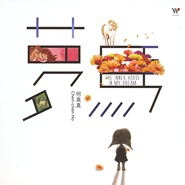

梦。马
============================

|  |  |
| :--: | :-- |
| [<br>梦。马](https://emumo.xiami.com/album/1894692999) | **艺人**: [何真真](../index.md)<br>**语种**: 其他<br>**唱片公司**: 风潮音乐<br>**发行时间**: 2014年02月20日<br>**专辑类别**: 录音室专辑<br>**专辑风格**: 轻音乐 Easy Listening<br>**播放数**: 827546<br>**收藏数**: 2111<br>**评论数**: 108<br> |

## 简介

<div>
<div>音乐才女 何真真继《三颗猫饼干》《遇见小王子》后，2014全新力作 </div><br>
<div>赤子之心系列第三部曲，甜美乐风再造华人钢琴音乐新风貌</div><br>
<br><br>
<div>何真真第三张结合音乐、绘图和文字的钢琴专辑</div><br>
<div>一个关于小女孩与马的梦境，一个亲身经历所编创的真实故事</div><br>
<div>更丰富的音乐情感，更深刻的文字力量</div><br>
<div>在音乐中探索心灵，寻找你的内在小孩</div>
</div>

## 曲目

- [楔子 - 梦马](./1894692999/xL3Hhwb28bf.md)
- [我们](./1894692999/U5KD9h6b10d.md)
- [若无其事的幻想](./1894692999/mQIIsO7a4fa.md)
- [什麽是远方](./1894692999/U5KD9j2cbdd.md)
- [彩虹在地上](./1894692999/mQIIsQ8c7fe.md)
- [未知最美丽](./1894692999/xL3Hh1c81d8.md)
- [野性的呼唤](./1894692999/b1qbAaW40323.md)
- [内在小孩](./1894692999/8GoFWdeb73a.md)
- [当爱来临](./1894692999/xL3Hh4cf43a.md)
- [五个梦](./1894692999/U5KD9p28b2a.md)
- [当天使离去](./1894692999/JAZEKG2277e.md)
- [你是我的灿烂](./1894692999/xL3Hh7b9963.md)

## 评论

|  |  |  |
| :-- | :-- | :-- |
| <br>[虾米用户](https://emumo.xiami.com/u/444904197)<br><br>2021-01-17 22:58<br>赞(1) 踩(0) | <div>大爱风潮</div> |
| <br>[虾米用户](https://emumo.xiami.com/u/409054743)<br><br>2020-04-20 21:45<br>赞(3) 踩(0) | <div>很喜欢啊  </div> |
| <br>[虾米用户](https://emumo.xiami.com/u/409054743)<br><br>2020-04-20 21:44<br>赞(2) 踩(0) | <div>悲伤又快乐的孩子</div> |
| <br>[虾米用户](https://emumo.xiami.com/u/12366731)<br><br>2019-10-30 20:47<br>赞(2) 踩(0) | <div>很棒很棒，天真可爱的音乐风格(^ ^)</div> |
| <br>[虾米用户](https://emumo.xiami.com/u/12366731)<br><br>2019-10-30 20:46<br>赞(2) 踩(0) | <div>珍藏，喜欢这种音乐</div> |
| <br>[虾米用户](https://emumo.xiami.com/u/411724146)<br><br>2019-08-14 19:21<br>赞(2) 踩(0) | <div>太美妙了。</div> |
| <br>[虾米用户](https://emumo.xiami.com/u/343027752)<br>我不想谋生，我想生活。<br>2019-03-07 22:12<br>赞(1) 踩(0) | <div>除了喜欢还能说什么……只是想到几米的漫画书，想到一部电影——穿梭少女梦</div> |
| <br>[虾米用户](https://emumo.xiami.com/u/334817420)<br>万般皆生活<br>2019-03-05 13:02<br>赞(1) 踩(0) | <div>马儿马儿跑起来～</div> |
| <br>[虾米用户](https://emumo.xiami.com/u/951829)<br>孤鴻寄語·血色琉璃<br>2018-11-04 22:29<br>赞(3) 踩(0) | <div>第100评！<br>不知道什么时候才能有新专辑呢<br>好期待！</div> |
| <br>[虾米用户](https://emumo.xiami.com/u/341910501)<br>纯音乐永远是我的最爱(●...<br>2018-08-23 10:07<br>赞(2) 踩(0) | <div>当天使离去 太好听了！！</div> |
| <br>[虾米用户](https://emumo.xiami.com/u/341910501)<br>纯音乐永远是我的最爱(●...<br>2018-08-23 09:52<br>赞(2) 踩(0) | <div>个个都是精曲！！太好听了吧</div> |
| <br>[虾米用户](https://emumo.xiami.com/u/36863837)<br><br>2018-07-06 12:04<br>赞(2) 踩(0) | <div>感恩音乐艺术家!</div> |
| <br>[虾米用户](https://emumo.xiami.com/u/126850740)<br>去教堂或者去寺庙都不会有...<br>2018-06-02 16:47<br>赞(2) 踩(0) | <div>真的不由地眼前就浮现出了一幕幕的故乡的夏天的午后 那是最后一个儿童节的夏天</div> |
| <br>[虾米用户](https://emumo.xiami.com/u/1867832)<br>喜听~<br>2018-05-29 16:02<br>赞(2) 踩(0) | <div>满满童真，感动，非常好听！</div> |
| <br>[虾米用户](https://emumo.xiami.com/u/53535)<br>走在陌生的道路上，修行！<br>2017-10-27 23:25<br>赞(3) 踩(0) | <div>永远都是童年！清新的音乐让人静下心来欣赏，回味童年的梦想。给那些还在匆忙奔波，浮躁的心灵的人们一次抚慰和洗礼！</div> |
| <br>[虾米用户](https://emumo.xiami.com/u/36160983)<br><br>2017-10-27 23:03<br>赞(2) 踩(0) | <div>瞬间平息浮躁，</div> |
| <br>[虾米用户](https://emumo.xiami.com/u/324903609)<br><br>2017-09-16 22:24<br>赞(2) 踩(0) | <div>身临其境的感觉。</div> |
| <br>[虾米用户](https://emumo.xiami.com/u/323876675)<br><br>2017-09-07 22:08<br>赞(2) 踩(0) | <div>一种心境。。。。好像会听着上瘾</div> |
| <br>[虾米用户](https://emumo.xiami.com/u/302995139)<br>来或者不来，我都在。<br>2017-08-30 10:45<br>赞(1) 踩(0) | <div>似梦亦梦</div> |
| <br>[虾米用户](https://emumo.xiami.com/u/317807706)<br><br>2017-08-07 10:02<br>赞(2) 踩(0) | <div>听着何真真的曲子，波澜云诡，白云苍狗，感觉内心复归纯净。读万卷书，复兮旦兮。</div> |
| <br>[虾米用户](https://emumo.xiami.com/u/2390560)<br><br>2017-07-06 09:43<br>赞(8) 踩(0) | <div>因为《三颗猫饼干》认识了何真真，她的音乐好像在缓缓讲述的童话，灵动而纯净~</div> |
| <br>[虾米用户](https://emumo.xiami.com/u/2390560)<br><br>2017-07-06 09:36<br>赞(3) 踩(0) | <div>因为风潮唱片寻到了好多音乐与人~因为《三颗猫饼干》记住了何真真~她的音乐好像童话，灵动而纯净~</div> |
| <br>[虾米用户](https://emumo.xiami.com/u/2390560)<br><br>2017-07-06 09:36<br>赞(1) 踩(0) | <div>因为风潮唱片寻到了好多音乐与人~因为《三颗猫饼干》记住了何真真~她的音乐好像童话，灵动而纯净~</div> |
| <br>[虾米用户](https://emumo.xiami.com/u/209893308)<br>你听～<br>2017-07-05 03:01<br>赞(2) 踩(0) | <div>在大众娱乐唱片城支持了您的专辑《梦马》，在我最迷茫的日子是您的音乐陪伴着我，感恩 </div> |
| ⇒ | <br>[虾米用户](https://emumo.xiami.com/u/78482626)<br>chenchenho<br>2017-07-05 19:26<br>赞(0) 踩(0) | <div>也謝謝您的實質支持!</div> |
| <br>[虾米用户](https://emumo.xiami.com/u/82721192)<br><br>2017-06-01 23:17<br>赞(1) 踩(0) | <div>听着心里好舒服~ 感觉能量慢慢聚集</div> |
| <br>[虾米用户](https://emumo.xiami.com/u/124797998)<br><br>2017-05-27 21:22<br>赞(1) 踩(0) | <div>纯净</div> |
| <br>[虾米用户](https://emumo.xiami.com/u/2022341)<br>懶似精靈。。。。<br>2017-01-12 08:49<br>赞(2) 踩(0) | <div>以梦为马，是否能骑着奔跑</div> |
| <br>[虾米用户](https://emumo.xiami.com/u/252408646)<br><br>2016-12-06 13:23<br>赞(1) 踩(0) | <div>何老师的音乐非常棒，超级喜欢的，每一首都很走心，听着舒服，给孩子胎教也是放何老师的音乐</div> |
| <br>[虾米用户](https://emumo.xiami.com/u/246995108)<br><br>2016-11-19 02:55<br>赞(1) 踩(0) | <div>真的好喜欢</div> |
| <br>[虾米用户](https://emumo.xiami.com/u/7783778)<br> <br>2016-10-04 17:05<br>赞(2) 踩(0) | <div>同样的是未知 小时候就很美好的向往，长大了就畏手畏脚惧怕未知<br>童心真的很美好</div> |
| <br>[虾米用户](https://emumo.xiami.com/u/213046255)<br><br>2016-08-14 22:43<br>赞(1) 踩(0) | <div>《梦马》钢琴曲部分好评，听完后感觉都是慢慢的回忆满满的童年啊，童年很长如果硬要问是哪一段的话，那大概是林海的《城南旧事》之前了吧。</div> |
| <br>[虾米用户](https://emumo.xiami.com/u/188499882)<br><br>2016-07-07 21:12<br>赞(16) 踩(0) | <div>长大不可怕，老去也不可怕，失去一颗童真的心最可怕</div> |
| <br>[虾米用户](https://emumo.xiami.com/u/45576682)<br><br>2016-06-20 11:39<br>赞(1) 踩(0) | <div>当天天使离去个人还是非常喜欢听的，旋律上很有节奏，音节上很动听。</div> |
| <br>[虾米用户](https://emumo.xiami.com/u/9365428)<br><br>2016-05-19 18:18<br>赞(2) 踩(0) | <div>真的超级喜欢，每天工作累了，睡前，开车，都会拿出整块的时间认认真真的享受静谧的时光。静候才女来回复我的留言，非常期待！ </div> |
| ⇒ | <br>[虾米用户](https://emumo.xiami.com/u/78482626)<br>chenchenho<br>2016-05-20 00:01<br>赞(0) 踩(0) | <div>謝謝你的支持~祝你天天有好夢喔!享受寧靜~~<br><br>真真</div> |
| <br>[虾米用户](https://emumo.xiami.com/u/49591102)<br><br>2016-05-19 00:14<br>赞(1) 踩(0) | <div>能不能把歌曲编成故事呢？</div> |
| ⇒ | <br>[虾米用户](https://emumo.xiami.com/u/78482626)<br>chenchenho<br>2016-05-20 00:01<br>赞(0) 踩(0) | <div>夢馬就是一個故事!</div> |
| ⇒ | <br>[虾米用户](https://emumo.xiami.com/u/181080542)<br>赏花赏月赏公子<br>2016-10-01 11:35<br>赞(0) 踩(0) | <div><q><b>何真真说：</b></q></div> |
| <br>[虾米用户](https://emumo.xiami.com/u/49591102)<br><br>2016-05-19 00:11<br>赞(1) 踩(0) | <div>我最喜欢贝壳里的心事了，脑海中浮现的是夏夜，星空，赤脚的少年或少女，海螺与倾听。感觉每首歌曲里都蕴藏一个世界，简单纯粹而轻柔温暖。</div> |
| <br>[虾米用户](https://emumo.xiami.com/u/7989574)<br><br>2016-05-15 15:58<br>赞(2) 踩(0) | <div>高中第一次听何真真，曲子是《橘色温度》，每晚必听着睡觉。</div> |
| ⇒ | <br>[虾米用户](https://emumo.xiami.com/u/78482626)<br>chenchenho<br>2016-05-15 19:21<br>赞(0) 踩(0) | <div>祝你天天好夢!</div> |
| <br>[虾米用户](https://emumo.xiami.com/u/951829)<br>孤鴻寄語·血色琉璃<br>2016-04-19 21:17<br>赞(1) 踩(0) | <div>有人声与和声的曲子也都很好听的，星球语配上曲子很和谐，虽然听不懂是在唱什么，但是感觉很好。未知最美丽！哈，用心去感受才最重要！</div> |
| ⇒ | <br>[虾米用户](https://emumo.xiami.com/u/78482626)<br>chenchenho<br>2016-04-22 22:14<br>赞(0) 踩(0) | <div>沒錯~謝謝留言!</div> |
| ⇒ | <br>[虾米用户](https://emumo.xiami.com/u/78482626)<br>chenchenho<br>2016-04-28 23:55<br>赞(0) 踩(0) | <div>謝謝!用心去感受才最重要！</div> |
| <br>[虾米用户](https://emumo.xiami.com/u/59477)<br> <br>2016-04-09 05:25<br>赞(1) 踩(0) | <div>没有人声的纯音乐部分都很好听。</div> |
| ⇒ | <br>[虾米用户](https://emumo.xiami.com/u/78482626)<br>chenchenho<br>2016-04-13 23:15<br>赞(0) 踩(0) | <div>謝謝欣賞!</div> |
| <br>[虾米用户](https://emumo.xiami.com/u/44161162)<br>音乐人生<br>2016-01-28 16:41<br>赞(1) 踩(0) | <div>恩施来开演奏会吧，可是我估计会亏本的。我最多也只能承受1000元左右的门票。工资少的可怜！</div> |
| <br>[虾米用户](https://emumo.xiami.com/u/44161162)<br>音乐人生<br>2016-01-28 16:27<br>赞(1) 踩(0) | <div>这只旋律包涵了，生命很多醉人的情感！是一次丰富生命的旅行！</div> |
| <br>[虾米用户](https://emumo.xiami.com/u/44161162)<br>音乐人生<br>2016-01-28 16:23<br>赞(0) 踩(0) | <div>国内最好的音乐才女！哈哈哈最好的！优雅如女王！彰显贵族气质！</div> |
| <br>[虾米用户](https://emumo.xiami.com/u/44161162)<br>音乐人生<br>2016-01-28 16:20<br>赞(0) 踩(0) | <div>高质量的作曲家！音乐家！音乐女王！草民当叩拜！哈哈哈</div> |
| <br>[虾米用户](https://emumo.xiami.com/u/44161162)<br>音乐人生<br>2016-01-28 15:51<br>赞(0) 踩(0) | <div>我很喜欢这首旋律！</div> |
| <br>[虾米用户](https://emumo.xiami.com/u/44161162)<br>音乐人生<br>2016-01-28 15:39<br>赞(0) 踩(0) | <div>舒缓的步履，云淡风轻，是淡淡孤独忧郁，随着钢琴的节奏渐渐的沉浸在如梦幻的蝶舞，优雅，温馨，浪漫，似水。可是我怎么也幸福不起来，我感觉到了，真真姐的忧伤。</div> |
| <br>[虾米用户](https://emumo.xiami.com/u/12382572)<br><br>2015-11-02 00:20<br>赞(0) 踩(0) | <div>家有小马</div> |
| <br>[虾米用户](https://emumo.xiami.com/u/68963720)<br>有愛就可以飛翔<br>2015-10-12 08:24<br>赞(0) 踩(0) | <div>有空間</div> |
| <br>[虾米用户](https://emumo.xiami.com/u/14616530)<br>dodolynn<br>2015-08-18 08:47<br>赞(0) 踩(0) | <div>快乐</div> |
| <br>[虾米用户](https://emumo.xiami.com/u/3502219)<br>爷做事，一为名，二为利，...<br>2015-06-17 09:01<br>赞(0) 踩(0) | <div>特别好听，贴合心境。</div> |
| <br>[虾米用户](https://emumo.xiami.com/u/3524909)<br><br>2015-04-22 15:17<br>赞(0) 踩(0) | <div>遇见美好~</div> |
| <br>[虾米用户](https://emumo.xiami.com/u/32226689)<br>神仙舞，凡人歌，庸人望。<br>2015-04-08 19:12<br>赞(0) 踩(0) | <div>听了好想做梦</div> |
| <br>[虾米用户](https://emumo.xiami.com/u/5767461)<br>乐享人生，耳有所闻，眼有...<br>2015-03-28 21:23<br>赞(0) 踩(0) | <div>心境平缓</div> |
| <br>[虾米用户](https://emumo.xiami.com/u/5983325)<br><br>2015-01-20 14:46<br>赞(0) 踩(0) | <div>钢琴，小提琴，天籁女声，组合成童话般浪漫的旋律，扣人心扉</div> |
| <br>[虾米用户](https://emumo.xiami.com/u/32031632)<br><br>2015-01-11 09:41<br>赞(0) 踩(0) | <div>永远的 何真真 ！</div> |
| <br>[虾米用户](https://emumo.xiami.com/u/6591864)<br><br>2014-12-29 18:27<br>赞(0) 踩(0) | <div>小女孩与马的梦境</div> |
| <br>[虾米用户](https://emumo.xiami.com/u/1698053)<br><br>2014-10-23 22:25<br>赞(0) 踩(0) | <div>又是新新的休闲好甜点</div> |
| <br>[虾米用户](https://emumo.xiami.com/u/33571333)<br>奋斗，不断的前行！<br>2014-10-21 10:36<br>赞(0) 踩(0) | <div>爱。纯净</div> |
| <br>[虾米用户](https://emumo.xiami.com/u/33571333)<br>奋斗，不断的前行！<br>2014-10-21 10:36<br>赞(0) 踩(0) | <div>爱。纯净</div> |
| <br>[虾米用户](https://emumo.xiami.com/u/36160983)<br><br>2014-09-06 16:15<br>赞(0) 踩(0) | <div>纯净  无杂质的歌已经不多见了</div> |
| <br>[虾米用户](https://emumo.xiami.com/u/1984349)<br><br>2014-08-11 21:15<br>赞(0) 踩(0) | <div>好听，但没有惊喜</div> |
| <br>[虾米用户](https://emumo.xiami.com/u/4252939)<br>123456789987<br>2014-07-21 07:45<br>赞(0) 踩(0) | <div>都是唱赞歌的，这样好，也不好</div> |
| <br>[虾米用户](https://emumo.xiami.com/u/20676639)<br>casablanca<br>2014-07-15 19:46<br>赞(0) 踩(0) | <div>``````````</div> |
| <br>[虾米用户](https://emumo.xiami.com/u/15359784)<br><br>2014-07-01 23:06<br>赞(1) 踩(0) | <div>何真真的最新专辑咯</div> |
| <br>[虾米用户](https://emumo.xiami.com/u/36036302)<br>我还没想好要写什么...<br>2014-06-21 20:31<br>赞(0) 踩(0) | <div>很喜欢何真真的音乐！这张也不错，感觉蛮俏皮的！</div> |
| <br>[虾米用户](https://emumo.xiami.com/u/14693821)<br>且借声遁<br>2014-06-19 21:56<br>赞(0) 踩(0) | <div>听音吧，去想</div> |
| <br>[虾米用户](https://emumo.xiami.com/u/6654966)<br>。。<br>2014-05-19 13:12<br>赞(1) 踩(0) | <div>。。</div> |
| <br>[虾米用户](https://emumo.xiami.com/u/9379826)<br><br>2014-05-14 20:18<br>赞(1) 踩(0) | <div>何真真的音乐总是那么美好,喜欢的旋律。</div> |
| <br>[虾米用户](https://emumo.xiami.com/u/13194363)<br>沒有音樂我會死<br>2014-05-09 15:04<br>赞(1) 踩(0) | <div>梦</div> |
| <br>[虾米用户](https://emumo.xiami.com/u/35863550)<br>出门转左<br>2014-04-26 10:11<br>赞(1) 踩(0) | <div>童真，自然，纯净，何真真的音乐总是那么美好</div> |
| ⇒ | <br>[虾米用户](https://emumo.xiami.com/u/34476322)<br>我还没想好要写什么...<br>2014-04-28 14:35<br>赞(0) 踩(0) | <div></div> |
| <br>[虾米用户](https://emumo.xiami.com/u/718419)<br>笑傲江湖<br>2014-04-25 19:51<br>赞(1) 踩(0) | <div>何真真打开了我的世界</div> |
| <br>[虾米用户](https://emumo.xiami.com/u/9436375)<br>我还没想好要写什么...<br>2014-04-21 20:49<br>赞(1) 踩(0) | <div>一如既往的童真满溢，赞～</div> |
| <br>[虾米用户](https://emumo.xiami.com/u/35483721)<br>听在心情上<br>2014-04-21 13:00<br>赞(1) 踩(0) | <div>等新专好久了，很好奇和音唱的是哪国的语言</div> |
| ⇒ | <br>[虾米用户](https://emumo.xiami.com/u/299438)<br><br>2014-04-30 17:16<br>赞(0) 踩(0) | <div>同好奇。。她专辑里面所有人声的部分，我都听不出是在唱神马。。</div> |
| ⇒ | <br>[虾米用户](https://emumo.xiami.com/u/13870564)<br><br>2014-05-01 01:15<br>赞(0) 踩(0) | <div><q><b>yofi说：</b></q></div> |
| ⇒ | <br>[虾米用户](https://emumo.xiami.com/u/299438)<br><br>2014-05-02 14:56<br>赞(0) 踩(0) | <div><q><b>说：</b></q></div> |
| <br>[虾米用户](https://emumo.xiami.com/u/1116083)<br><br>2014-04-21 02:37<br>赞(0) 踩(0) | <div>听这个，会不会好睡一点…</div> |
| <br>[虾米用户](https://emumo.xiami.com/u/1272599)<br>o_OL.pinme<br>2014-04-19 12:08<br>赞(1) 踩(0) | <div>前两天从何真真吧里知道，虾米上还没有发布~忙了两周登陆上来第一条就是发布消息~赞~</div> |
| <br>[虾米用户](https://emumo.xiami.com/u/3244743)<br><br>2014-04-19 04:25<br>赞(0) 踩(0) | <div>COOL</div> |
| <br>[虾米用户](https://emumo.xiami.com/u/1396206)<br>聆听月升<br>2014-04-18 22:39<br>赞(0) 踩(0) | <div>在此回归童真，聆听何真真<br>以梦为马，穿越现实的潮涌</div> |
| <br>[虾米用户](https://emumo.xiami.com/u/15828193)<br><br>2014-04-18 20:01<br>赞(0) 踩(0) | <div>~</div> |
| <br>[虾米用户](https://emumo.xiami.com/u/53535)<br>走在陌生的道路上，修行！<br>2014-04-18 19:56<br>赞(0) 踩(0) | <div>浮躁的心灵需要安静，回到那美好的童年，童年的梦想，幻想。。。。</div> |
| <br>[虾米用户](https://emumo.xiami.com/u/13030860)<br><br>2014-04-18 16:21<br>赞(1) 踩(0) | <div>心境达到这样的地步，一辈子都是童年</div> |
| <br>[虾米用户](https://emumo.xiami.com/u/7093141)<br>心香一瓣<br>2014-04-18 16:15<br>赞(0) 踩(0) | <div>~</div> |
| <br>[虾米用户](https://emumo.xiami.com/u/2447280)<br>如果后悔 不能后退 是不...<br>2014-04-18 12:52<br>赞(0) 踩(0) | <div>以梦为马</div> |
| <br>[虾米用户](https://emumo.xiami.com/u/4485514)<br>共勉<br>2014-04-18 12:14<br>赞(0) 踩(0) | <div>先收藏</div> |
| <br>[虾米用户](https://emumo.xiami.com/u/11957460)<br>歌う 光るなら<br>2014-04-18 10:34<br>赞(0) 踩(0) | <div>~</div> |
| <br>[虾米用户](https://emumo.xiami.com/u/231797)<br>活着真好 好好活着<br>2014-04-18 10:11<br>赞(0) 踩(0) | <div>~</div> |
| <br>[虾米用户](https://emumo.xiami.com/u/1462762)<br>常常 …失眠<br>2014-04-18 08:53<br>赞(0) 踩(0) | <div>听听看</div> |
| <br>[虾米用户](https://emumo.xiami.com/u/812392)<br>q音网易搜央央小月，酷g...<br>2014-04-17 21:29<br>赞(0) 踩(0) | <div>内在小孩 φ(≧ω≦*)♪</div> |
| <br>[虾米用户](https://emumo.xiami.com/u/10073813)<br>如人饮水。<br>2014-04-17 21:18<br>赞(0) 踩(0) | <div>~</div> |
| <br>[虾米用户](https://emumo.xiami.com/u/812392)<br>q音网易搜央央小月，酷g...<br>2014-04-17 21:02<br>赞(0) 踩(0) | <div>以梦为马！</div> |
| <br>[虾米用户](https://emumo.xiami.com/u/1700002)<br>V5_ORZZZZZ<br>2014-04-17 20:25<br>赞(1) 踩(0) | <div>03.若无其事的幻想<br>12.你是我的灿烂</div> |
| <br>[虾米用户](https://emumo.xiami.com/u/9741887)<br><br>2014-04-17 19:37<br>赞(0) 踩(0) | <div>.</div> |
| <br>[虾米用户](https://emumo.xiami.com/u/990478)<br>「但愿人长久」<br>2014-04-17 19:18<br>赞(0) 踩(0) | <div>封面～⊙▽⊙</div> |
| <br>[虾米用户](https://emumo.xiami.com/u/16827799)<br>Sometimes<br>2014-04-17 19:13<br>赞(0) 踩(0) | <div>一如往常的清新与平静</div> |
| <br>[虾米用户](https://emumo.xiami.com/u/9234171)<br>电音才是男人的浪漫～<br>2014-04-17 19:12<br>赞(0) 踩(0) | <div>- -!</div> |
| <br>[虾米用户](https://emumo.xiami.com/u/6892945)<br>Voltka<br>2014-04-15 16:48<br>赞(0) 踩(0) | <div>来了</div> |
| <br>[虾米用户](https://emumo.xiami.com/u/7812867)<br><br>2014-03-29 22:13<br>赞(0) 踩(0) | <div>期待</div> |
| <br>[虾米用户](https://emumo.xiami.com/u/9589928)<br><br>2014-03-13 20:33<br>赞(0) 踩(0) | <div>期待ing~</div> |
