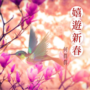

嬉游新春 - 气质系新年喜庆轻音乐
============================

|  |  |
| :--: | :-- |
| [ 嬉游新春 - 气质系新年喜庆轻音乐](https://emumo.xiami.com/album/2103552131) | **艺人**: [何真真](../index.md) **语种**: 纯音乐 **唱片公司**: 风潮音乐 **发行时间**: 2018年01月12日 **专辑类别**: EP, 单曲 **专辑风格**: 轻音乐 Easy Listening **播放数**: 369749 **收藏数**: 570 **评论数**: 64  |

## 简介

以《三颗猫饼干》、《遇见小王子》独特的甜美纯真系轻音乐风靡全球  
音乐创作才女何真真 首次融合东方雅韵和当代曲风  
重新诠释中国新年音乐清新质地的一面  
展现嬉游新春、喜气洋洋的新年新景象  
  
With her unique, sweet, and pure musical style in the albums "Three Cat Cookies" and "An Encounter with Le Petit Prince", the talented composer, Ho Chen-Chen, has garnered popularity around the world.  For the first time, this gifted musician has integrated Eastern melodies with the contemporary spirit to reinterpret Chinese New Year music with the fresh texture that demonstrates the joy of traveling in springtime and the delight of celebrating a new year.  
  
 

## 曲目

- [年Chinese New Year](./2103552131/8IopBpe4f0b.md)
- [年兽贺岁派对Zodiac Animals’ New Year Party](./2103552131/mSIrYg54c9e.md)
- [嬉游新春趣Merrily Roaming in Springtime](./2103552131/xN3qMHaa807.md)
- [花舞漫小城Dancing Flowers Permeate A Small Town](./2103552131/bqxqkRC357bb.md)
- [春日朝阳添好运Attracting Good Fortune with the Spring Sunrise](./2103552131/8IopBte9d8b.md)

## 评论

|  |  |  |  |
| :-- | :-- | :-- | :-- |
|  [虾米用户](https://emumo.xiami.com/u/229714094)  2020-09-29 01:39 赞(0) 踩(0) | 
两年了再回来听一听，过两天就要国庆和中秋一起过了。
 |
|  [虾米用户](https://emumo.xiami.com/u/279156570) 常烦常乐—— 2020-05-20 19:36 赞(1) 踩(0) | 
从喜庆中听出了一丝俏皮，欢乐夹杂回忆脑壳又回忆起了过去。。
 |
|  [虾米用户](https://emumo.xiami.com/u/106027242)  2019-11-24 23:19 赞(2) 踩(0) | 
优美的旋律，意境的你我。
 |
|  [虾米用户](https://emumo.xiami.com/u/405465919)  2019-10-20 17:31 赞(1) 踩(0) | 
特别有年味
 |
|  [虾米用户](https://emumo.xiami.com/u/419232908)  2019-08-23 08:01 赞(1) 踩(0) | 
努力轻松点
 |
|  [虾米用户](https://emumo.xiami.com/u/407102614) 能閒世人之所忙者 方能忙... 2019-07-03 12:29 赞(1) 踩(0) | 
樂而不淫，一團和氣
 |
|  [虾米用户](https://emumo.xiami.com/u/407102614) 能閒世人之所忙者 方能忙... 2019-06-21 11:24 赞(1) 踩(0) | 
:-)
 |
|  [虾米用户](https://emumo.xiami.com/u/420351408)  2019-05-10 20:06 赞(1) 踩(0) | 
愉快
 |
|  [虾米用户](https://emumo.xiami.com/u/302705753)  2019-03-24 23:02 赞(1) 踩(0) | 
6666
 |
|  [虾米用户](https://emumo.xiami.com/u/369012320)  2019-02-17 13:14 赞(1) 踩(0) | 
喜庆
 |
|  [虾米用户](https://emumo.xiami.com/u/40935203)  2019-02-10 23:33 赞(1) 踩(0) | 
我也是太喜欢这张专辑了ｸﾞｯ!(๑•̀ㅂ•́)و✧正好应景应节，又有一些脱俗，一些古意
 |
|  [虾米用户](https://emumo.xiami.com/u/94347874) 绝望的声音是寂静 2019-02-09 12:46 赞(0) 踩(0) | 
比较喜庆，但歌单内个别曲目链接得比较突兀
 |
|  [虾米用户](https://emumo.xiami.com/u/310558) We chat:kink... 2019-02-04 15:07 赞(1) 踩(0) | 
Nice
 |
|  [虾米用户](https://emumo.xiami.com/u/336820619)  2018-12-08 14:27 赞(1) 踩(0) | 
我国马来西亚每年的农历新年前一到两个月唱片公司都会发行贺岁专辑，每一年我都会购买这些贺岁专辑来听，而且还是买正版的，以支持国货，当然在过年的时候我不止会听热热闹闹的贺岁歌曲，我还会听喜庆音乐，当然，我也是不会错过聆听这张专辑的。
 |
| ⇒ |  [虾米用户](https://emumo.xiami.com/u/354221) Break me out 2019-01-21 16:13 赞(0) 踩(0) | 
真好！今年的是怎么样的呢？
 |
|  [虾米用户](https://emumo.xiami.com/u/251705074)  2018-10-24 12:46 赞(1) 踩(0) | 
好听
 |
|  [虾米用户](https://emumo.xiami.com/u/256688537) 神的记事本 2018-06-13 15:05 赞(3) 踩(0) | 
现在这位音乐家鲜为人知有点遗憾，这种能量传的太少了
 |
|  [虾米用户](https://emumo.xiami.com/u/308137869)  2018-04-25 08:04 赞(6) 踩(0) | 
真真老师的每次出现总会带给我们惊喜，充满时尚中国风的新专辑真是越听越好听，心情无比舒畅！
 |
|  [虾米用户](https://emumo.xiami.com/u/178660510)  2018-04-15 20:40 赞(2) 踩(0) | 
新年和真真姐的音乐，双倍的喜悦啊！
 |
|  [虾米用户](https://emumo.xiami.com/u/2349) 看不到星星.. 2018-03-09 17:33 赞(1) 踩(0) | 
要死不那么MIDI就好了。。
 |
|  [虾米用户](https://emumo.xiami.com/u/48922840) 大侠 2018-03-02 22:31 赞(1) 踩(0) | 
天啦噜，真真姐居然出新专了，感动
 |
|  [虾米用户](https://emumo.xiami.com/u/229714094)  2018-02-26 23:30 赞(6) 踩(0) | 
如果听过真真姐的其他作品，应该一开始就能听出来，整张专辑有我熟悉的真真姐，也有我意想不到的真真姐。如果你是因为舌尖上的中国认识真真姐的话，第一首年，应该会让你熟悉的。还是觉得真真姐有那种孩子气和童心❤❤
 |
|  [虾米用户](https://emumo.xiami.com/u/108661028)  2018-02-25 22:34 赞(2) 踩(0) | 
这一年该有的好兆头。
 |
|  [虾米用户](https://emumo.xiami.com/u/2683066) 在动物园散步才是正经事～ 2018-02-25 18:06 赞(1) 踩(0) | 
听了感觉内心富足的专辑。
 |
|  [虾米用户](https://emumo.xiami.com/u/1761507)  2018-02-25 17:16 赞(0) 踩(0) | 
请开放购买please，不知道该怎么吹只想购买拥有
 |
| ⇒ |  [虾米用户](https://emumo.xiami.com/u/78482626) chenchenho 2018-02-25 21:38 赞(0) 踩(0) | 
您是指實體專輯？數位專輯蝦米可以購買啊
 |
| ⇒ |  [虾米用户](https://emumo.xiami.com/u/1761507)  2018-02-25 21:52 赞(0) 踩(0) | 
<q><b>何真真说：</b></q>
 |
| ⇒ |  [虾米用户](https://emumo.xiami.com/u/78482626) chenchenho 2018-02-25 22:54 赞(0) 踩(0) | 
<q><b>Wennie说：</b></q>
 |
| ⇒ |  [虾米用户](https://emumo.xiami.com/u/78482626) chenchenho 2018-02-25 23:03 赞(0) 踩(0) | 
<q><b>Wennie说：</b></q>
 |
| ⇒ |  [虾米用户](https://emumo.xiami.com/u/1761507)  2018-02-26 00:49 赞(0) 踩(0) | 
<q><b>何真真说：</b></q>
 |
| ⇒ |  [虾米用户](https://emumo.xiami.com/u/52868849) 风潮音乐 2018-02-26 09:33 赞(0) 踩(0) | 
Wennie您好，蝦米下載可購買，另外也可以上AppleMusic上購買試試這個鏈結<a href="https://itunes.apple.com/tw/album/%E5%AC%89%E9%81%8A%E6%96%B0%E6%98%A5-%E6%B0%A3%E8%B3%AA%E7%B3%BB%E6%96%B0%E5%B9%B4%E5%96%9C%E6%85%B6%E8%BC%95%E9%9F%B3%E6%A8%82-ep/1346501235" target="_blank" rel="nofollow noreferrer noopener">https://itunes.apple.com/tw/album/%E5%AC%89%E9%81%8A%E6%96%B0%E6%98%A5-%E6%B0%A3%E8%B3%AA%E7%B3%BB%E6%96%B0%E5%B9%B4%E5%96%9C%E6%85%B6%E8%BC%95%E9%9F%B3%E6%A8%82-ep/1346501235</a>
 |
| ⇒ |  [虾米用户](https://emumo.xiami.com/u/1761507)  2018-02-26 18:50 赞(0) 踩(0) | 
<q><b>风潮音乐说：</b></q>
 |
| ⇒ |  [虾米用户](https://emumo.xiami.com/u/52868849) 风潮音乐 2018-02-26 18:56 赞(0) 踩(0) | 
<q><b>Wennie说：</b></q>
 |
| ⇒ |  [虾米用户](https://emumo.xiami.com/u/1761507)  2018-02-26 19:42 赞(0) 踩(0) | 
<q><b>风潮音乐说：</b></q>
 |
| ⇒ |  [虾米用户](https://emumo.xiami.com/u/3598790)  2018-08-31 21:53 赞(0) 踩(0) | 
<q><b>何真真说：</b></q>
 |
|  [虾米用户](https://emumo.xiami.com/u/110632350) 我还没想好要写什么... 2018-02-25 14:25 赞(1) 踩(0) | 
欢愉
 |
|  [虾米用户](https://emumo.xiami.com/u/270222776)  2018-02-25 09:01 赞(1) 踩(0) | 
太太太太好啦 真真阿姨总算出新专辑啦
 |
|  [虾米用户](https://emumo.xiami.com/u/306811599) 我尝试努力抓住身边的一切... 2018-02-24 19:53 赞(2) 踩(0) | 
太太太太好啦 真真姐总算出新专辑啦    
 |
|  [虾米用户](https://emumo.xiami.com/u/43248227)  2018-02-24 17:00 赞(2) 踩(0) | 
新春滋味，沁土香甜。
 |
|  [虾米用户](https://emumo.xiami.com/u/43248227)  2018-02-24 16:59 赞(4) 踩(0) | 
一别多年，深感万千
 |
|  [虾米用户](https://emumo.xiami.com/u/3592527)  2018-02-24 14:13 赞(3) 踩(0) | 
过年就是要有这种甜甜的喜庆味道。
 |
|  [虾米用户](https://emumo.xiami.com/u/37698023)  2018-02-24 11:42 赞(0) 踩(0) | 
开心
 |
|  [虾米用户](https://emumo.xiami.com/u/39883468) ~！！~     ！！ ... 2018-02-24 09:48 赞(0) 踩(0) | 
哇新曲儿！
 |
|  [虾米用户](https://emumo.xiami.com/u/198036178)  2018-02-24 08:06 赞(0) 踩(0) | 
真真老师，加油
 |
|  [虾米用户](https://emumo.xiami.com/u/198036178)  2018-02-24 08:06 赞(1) 踩(0) | 
厉害厉害
 |
|  [虾米用户](https://emumo.xiami.com/u/229714094)  2018-02-23 22:47 赞(1) 踩(0) | 
没想到啊没想到
 |
|  [虾米用户](https://emumo.xiami.com/u/1418202)  江山共老 2018-02-23 20:29 赞(1) 踩(0) | 
好啊
 |
|  [虾米用户](https://emumo.xiami.com/u/68725360) 诗词 / 绘画 2018-02-23 20:17 赞(1) 踩(0) | 
质地轻盈可爱
 |
|  [虾米用户](https://emumo.xiami.com/u/68725360) 诗词 / 绘画 2018-02-23 20:15 赞(1) 踩(0) | 
好轻盈愉悦的感觉～～
 |
|  [虾米用户](https://emumo.xiami.com/u/951829) 孤鴻寄語·血色琉璃 2018-02-23 19:57 赞(2) 踩(0) | 
发新专辑了？什么时候的作品啊，太后知后觉了，先听听看！真真老师加油！！！
 |
| ⇒ |  [虾米用户](https://emumo.xiami.com/u/78482626) chenchenho 2018-02-23 22:45 赞(0) 踩(0) | 
今天蝦米上架 ，你搶先了
 |
| ⇒ |  [虾米用户](https://emumo.xiami.com/u/78567) тоска, одино 2018-02-24 09:33 赞(0) 踩(0) | 
<q><b>何真真说：</b></q>
 |
| ⇒ |  [虾米用户](https://emumo.xiami.com/u/29) 耍中偶得 2018-02-24 16:14 赞(0) 踩(0) | 
<q><b>何真真说：</b></q>
 |
| ⇒ |  [虾米用户](https://emumo.xiami.com/u/951829) 孤鴻寄語·血色琉璃 2018-02-24 23:54 赞(0) 踩(0) | 
<q><b>何真真说：</b></q>
 |
|  [虾米用户](https://emumo.xiami.com/u/274340505) 感谢虾米这些年来的陪伴！ 2018-02-23 17:29 赞(2) 踩(0) | 
新专辑满分
 |
|  [虾米用户](https://emumo.xiami.com/u/8326332) 后来，即便是音乐，也无法... 2018-02-23 17:24 赞(2) 踩(0) | 
感谢真真姐 
 |
|  [虾米用户](https://emumo.xiami.com/u/267182540) 如果想布施，何妨赠我 2018-02-23 16:07 赞(2) 踩(0) | 
前排，坐等完整版
 |
|  [虾米用户](https://emumo.xiami.com/u/52868849) 风潮音乐 2018-02-23 16:01 赞(14) 踩(0) | 
真真老師真厲害，傳統新春音樂都變得不甜膩好輕盈，反而有一種時尚感～
 |
|  [虾米用户](https://emumo.xiami.com/u/53565) 更多武侠音乐，请关注武聆... 2018-02-23 15:48 赞(1) 踩(0) | 
只有两首？
 |
|  [虾米用户](https://emumo.xiami.com/u/18721758) 很久以前 2018-02-23 15:25 赞(1) 踩(0) | 
前排
 |
|  [虾米用户](https://emumo.xiami.com/u/47564249) Alles. 2018-02-23 15:19 赞(1) 踩(0) | 
终于发布了！
 |
|  [虾米用户](https://emumo.xiami.com/u/652330)  2018-02-23 14:45 赞(3) 踩(0) | 
好听
 |
|  [虾米用户](https://emumo.xiami.com/u/207629879) 爱童声&音乐剧。 2018-02-23 14:44 赞(1) 踩(0) | 
虾米也有何真真老师的新专辑了耶
 |
|  [虾米用户](https://emumo.xiami.com/u/7010916)  孤独的爵士钢琴手～ 2018-02-23 14:43 赞(1) 踩(0) | 
厉害了
 |
