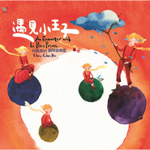

遇见小王子An Encounter with Le Petit Prince
============================

|  |  |
| :--: | :-- |
| [ 遇见小王子An Encounter with Le Petit Prince](https://emumo.xiami.com/album/450587) | **艺人**: [何真真](../index.md) **语种**: 其他 **唱片公司**: 风潮音乐 **发行时间**: 2011年06月30日 **专辑类别**: 录音室专辑 **专辑风格**: 轻音乐 Easy Listening **播放数**: 4742184 **收藏数**: 5511 **评论数**: 302  |

## 简介

华人世界第一部小王子灵感音乐  
音乐创作才女 何真真 与小王子的私密对话  
  
小王子降落地球的那一刹那  
每个大人的心裡都住进了一份纯真  
那是属于自己的小宇宙  
是最初的童心与梦想  是追求不凡的勇气与执着  
  
自1943年出版以来，《小王子》已被翻译超过180种语言，作者圣艾修伯裏写给大人看的这个童话，静悄悄地打开每个人心中的音乐盒。  
  
以《三颗猫饼干》甜美乐风风靡华人世界的创作才女何真真，在属于自己的音乐盒裡，与小王子进行了一场场钢琴对话。所有关于爱恋、梦想、流浪、朋友的欢乐与悲伤，所有看得见或看不见的眼泪、所有听得到或听不到的笑声…都融化于琴声满溢的小宇宙间。每个人的心裡，都住着一位小王子；每个大人，都值得拥有一份纯真。  
  
以音乐说故事．以声音演角色  
  
很高兴有机会再次以「音乐说故事，声音演角色」的创作概念，透过音乐解读法国世界名着「小王子」的故事，以此延续我2004年「三颗猫饼干」专辑的创作精神--无论大人或小孩，都值得保有那份最纯粹、最初衷的纯真。  
  
每个人都是自己的小宇宙，世界就是你，你就是世界。我的音乐小宇宙这次带来的，除了以钢琴娓娓道来以外，创作与编曲格局都比「三颗猫饼干」更加宽广庞大，不但加入大规模絃乐器编曲，还有台湾少见的爱尔兰笛演出，希望带来小王子遨游星际间，那种丰富的宽度与哲理的深度。  
  
这次受邀参与制作的，都是我最喜爱的器乐演奏家(也是我的好朋友们)，感谢他们的完美演出与诠释，让我的创作充满诚挚与感动。文明脚步虽然一日千里，人心却如沙漠般荒芜、疏离与孤寂，希望我的音乐可以带来一些温暖与慰藉，同时带领大家一同感受，作者圣艾修伯裏以丰富想像力建构的小王子哲思世界，是如何丰润、甜美。~何真真

## 曲目

- [小宇宙](./450587/xLucfmd0747.md)
- [遇见小王子MV](./450587/xLucfnacd6b.md)
- [第四十四次落日](./450587/mQ9dqEd2b22.md)
- [那朵骄傲的玫瑰MV](./450587/xLucfpaa8d7.md)
- [画笔的幻想](./450587/xLucfqd258b.md)
- [星际流浪](./450587/mQ9dqH7b423.md)
- [寂寞, 无边无际](./450587/mQ9dqI53a32.md)
- [独一无二的朋友](./450587/8GfaTTfb7d6.md)
- [愈遥远愈美丽](./450587/8GfaTU16a40.md)
- [悲伤沙漠](./450587/xLucfva9a80.md)
- [爱的微笑](./450587/mQ9dqM5fbd1.md)

## 评论

|  |  |  |  |
| :-- | :-- | :-- | :-- |
|  [虾米用户](https://emumo.xiami.com/u/445814545) R.I.P 2020-11-09 14:31 赞(2) 踩(0) | 

 |
|  [虾米用户](https://emumo.xiami.com/u/319174409) 我还没想好要写什么... 2020-06-23 21:06 赞(1) 踩(0) | 
太棒了吧耳朵怀孕了！！！！！
 |
|  [虾米用户](https://emumo.xiami.com/u/520302) 孤独之中依然绽放 绽放之... 2020-04-03 01:12 赞(2) 踩(0) | 
有人声的几首都很好听，即使那可能只是啦啦啦（像《画笔的幻想》），声线纯净童真的缘故吧，《遇见小王子》、《爱的微笑》不知道是什么少数语种，是不是率性烂漫所致？《星际流浪》也很不错，不同乐器叠加纷呈，如同烟花璀璨。最喜欢的是《愈遥远愈美丽》，遗世独立的荒凉悲壮，这圣咏如夹在Libera合唱团里，还真不好分辨出来。《悲伤沙漠》渲染的情感也让人沉浸其中，一时想起高梨康治的《五月雨》。其他几首也很耐听，一张专辑有这么多让人喜欢的曲子，含金量真的很足，很用心，想必背后也很努力和辛苦。 
 |
|  [虾米用户](https://emumo.xiami.com/u/440306739) 我是一个没得感情的刺客。 2020-02-26 08:03 赞(2) 踩(0) | 
我突然觉得我和小王子很像。
 |
|  [虾米用户](https://emumo.xiami.com/u/72534340)  2019-11-20 14:47 赞(1) 踩(0) | 
小王子
 |
|  [虾米用户](https://emumo.xiami.com/u/426783409)  2019-07-07 22:02 赞(0) 踩(0) | 
有购买专辑的链接吗？查询到很多网站都没有售卖
 |
|  [虾米用户](https://emumo.xiami.com/u/342012483) 大道至简，悟在天成。 2019-06-25 09:13 赞(1) 踩(0) | 
我爱小王子！我爱真真姐！
 |
|  [虾米用户](https://emumo.xiami.com/u/19168327) 我还没想好要写什么... 2019-06-06 20:24 赞(2) 踩(0) | 
听了好似心里开了花^___^
 |
|  [虾米用户](https://emumo.xiami.com/u/74202980)  2019-05-18 19:22 赞(2) 踩(0) | 
太美好了
 |
|  [虾米用户](https://emumo.xiami.com/u/286585457)  2019-04-06 17:45 赞(3) 踩(0) | 
马来西亚的虾友都听不到 
 |
|  [虾米用户](https://emumo.xiami.com/u/334817420) 万般皆生活 2019-03-05 13:01 赞(1) 踩(0) | 
我遇见美丽的公主
 |
|  [虾米用户](https://emumo.xiami.com/u/15235655)  2019-01-07 02:38 赞(4) 踩(0) | 
2012年到台湾读大学，在诚品买的第一张CD就是《遇见小王子》，大一一整年都在循环听这张CD，以至于我现在一听到这些曲子，眼睛里都是大学时的景象，情窦初开，为了理想挑灯夜读，大家一起熬夜做模型，好多的回忆全部翻涌而来。时空错乱的感觉～
 |
|  [虾米用户](https://emumo.xiami.com/u/8326332) 后来，即便是音乐，也无法... 2019-01-03 21:45 赞(1) 踩(0) | 
如果真有小王子，我会变成毒蛇吗。
 |
|  [虾米用户](https://emumo.xiami.com/u/6752430) 井盖被偷了 2018-12-19 22:20 赞(0) 踩(0) | 
不知道这么久，还有正版的实体版唱片不。这是最想买的专辑了。
 |
| ⇒ |  [虾米用户](https://emumo.xiami.com/u/78482626) chenchenho 2018-12-21 12:02 赞(0) 踩(0) | 
有喔~目前還是有實體CD，若你想買我可以幫你簽名。請私訊我~謝謝支持
 |
| ⇒ |  [虾米用户](https://emumo.xiami.com/u/19349410)  2019-05-10 20:32 赞(0) 踩(0) | 
<q><b>何真真说：</b></q>
 |
| ⇒ |  [虾米用户](https://emumo.xiami.com/u/78482626) chenchenho 2019-05-10 22:44 赞(0) 踩(0) | 
<q><b>小颖来了哦说：</b></q>
 |
| ⇒ |  [虾米用户](https://emumo.xiami.com/u/426783409)  2019-07-07 22:11 赞(0) 踩(0) | 
<q><b>何真真说：</b></q>
 |
| ⇒ |  [虾米用户](https://emumo.xiami.com/u/78482626) chenchenho 2019-07-07 23:40 赞(0) 踩(0) | 
<q><b>小心说：</b></q>
 |
|  [虾米用户](https://emumo.xiami.com/u/39004216)  2018-11-13 06:57 赞(1) 踩(0) | 
遇见惊喜。小时候看过的书，听着音乐又一次融入到故事里 
 |
|  [虾米用户](https://emumo.xiami.com/u/403486224)  2018-10-12 08:57 赞(0) 踩(0) | 
超喜欢 
 |
|  [虾米用户](https://emumo.xiami.com/u/75357578) 我还没想好要写什么... 2018-10-09 08:29 赞(2) 踩(0) | 
听xzgg读书就想起这张专辑
 |
|  [虾米用户](https://emumo.xiami.com/u/9154037) 到水星散心去了。 2018-08-19 23:44 赞(1) 踩(0) | 
真可爱。
 |
|  [虾米用户](https://emumo.xiami.com/u/14747594) 大音希声 2018-07-03 12:40 赞(1) 踩(0) | 
小王子的粉丝
 |
|  [虾米用户](https://emumo.xiami.com/u/172864574)   2018-05-14 15:27 赞(4) 踩(0) | 
说真的，这张专辑真是让我难忘啊！用音乐的方式来解读或演绎小王子的故事，真真应当属于做的最好的一个。其中有些乐段常受到电视综艺节目的引用作为BGM。这说明了这张专辑的成功及曲目的优秀。
 |
|  [虾米用户](https://emumo.xiami.com/u/351379643)  2018-04-20 23:44 赞(2) 踩(0) | 
童话
 |
|  [虾米用户](https://emumo.xiami.com/u/1885851)  2018-03-30 09:59 赞(2) 踩(0) | 
遇见小王子里轻盈的哼唱，把心都融化了。
 |
|  [虾米用户](https://emumo.xiami.com/u/273131482) 清心悦目 2017-12-13 16:18 赞(2) 踩(0) | 
好聽的音樂
 |
|  [虾米用户](https://emumo.xiami.com/u/280165446) 音乐是美妙生活的调和剂。 2017-11-27 06:15 赞(2) 踩(0) | 
像是一个在回放的童话故事。
 |
|  [虾米用户](https://emumo.xiami.com/u/10902240)  2017-10-30 10:20 赞(2) 踩(0) | 
很有特色~确实是有“遇见的感觉~制作上比《喵饼干》要成熟的多~但是味道差了点
 |
|  [虾米用户](https://emumo.xiami.com/u/1673461)  2017-10-28 00:14 赞(1) 踩(0) | 
最近虾米的歌怎么都不能试听？？？？管理员还没修复好吗
 |
|  [虾米用户](https://emumo.xiami.com/u/44665380)  2017-10-28 00:00 赞(3) 踩(0) | 
无意中听到三颗猫饼干，每个音符都正中我心，寻过来，竟遇见了我最爱的小王子，就冲这两张专辑，必须是何真真的脑残粉啊脑残粉啊
 |
| ⇒ |  [虾米用户](https://emumo.xiami.com/u/951829) 孤鴻寄語·血色琉璃 2017-11-27 10:40 赞(0) 踩(0) | 
还有张《梦，马》哦，演唱专辑的话个人不太喜欢，还是喜欢纯乐多！
 |
|  [虾米用户](https://emumo.xiami.com/u/253005633)  2017-10-27 23:54 赞(1) 踩(0) | 
也是最近才发现这些美好纯真的音乐的！好喜欢
 |
|  [虾米用户](https://emumo.xiami.com/u/3864707)  2017-10-27 23:18 赞(4) 踩(0) | 
我始终无法忘记这本书最后对小王子倒下的描写：在他的脚踝骨附近，一道黄光闪了一下.刹那间他一动也不动了.他没有叫喊.他轻轻地像一棵树一样倒在地上，大概由于沙地的缘故，连一点响声都没有.不知道别人是怎么理解像一棵树一样倒下，反正我是每每想像小王子倒下对样子都觉得特别难过.
 |
|  [虾米用户](https://emumo.xiami.com/u/241848122)  2017-10-08 11:15 赞(0) 踩(0) | 
好听的轻音乐
 |
|  [虾米用户](https://emumo.xiami.com/u/316928417)  2017-08-10 17:40 赞(1) 踩(0) | 
嗯没毛病
 |
|  [虾米用户](https://emumo.xiami.com/u/308280944)  2017-07-31 14:27 赞(2) 踩(0) | 
就喜欢星际流浪和爱的微笑就凭这两首给满分！
 |
|  [虾米用户](https://emumo.xiami.com/u/309754459)  2017-07-04 22:15 赞(2) 踩(0) | 
我就是喜欢纯音乐
 |
|  [虾米用户](https://emumo.xiami.com/u/245310512)  2017-06-10 16:28 赞(3) 踩(0) | 
很符合小王子。
 |
|  [虾米用户](https://emumo.xiami.com/u/302665287)  2017-06-07 21:23 赞(1) 踩(0) | 
从我初中第一次听，直到现在，还是觉得非常美好
 |
|  [虾米用户](https://emumo.xiami.com/u/245310512)  2017-06-05 21:16 赞(1) 踩(0) | 
好喜欢阿！网易上没有，才找来虾米。
 |
| ⇒ |  [虾米用户](https://emumo.xiami.com/u/285348539) Love for you 2017-06-30 15:22 赞(0) 踩(0) | 
好像有吧
 |
|  [虾米用户](https://emumo.xiami.com/u/82721192)  2017-06-01 23:21 赞(2) 踩(0) | 
被带入童话的感觉...不错。尽管是暂时的
 |
|  [虾米用户](https://emumo.xiami.com/u/1418202)  江山共老 2017-05-27 17:19 赞(1) 踩(0) | 
真的棒极了
 |
|  [虾米用户](https://emumo.xiami.com/u/2542071)  2017-05-21 14:48 赞(3) 踩(0) | 
读小王子之前会觉得很好听，读过书再来听会哭
 |
|  [虾米用户](https://emumo.xiami.com/u/288291356) 多听五月天，必成好青年。 2017-04-20 22:42 赞(2) 踩(0) | 
2013年大学演讲比赛时我小宇宙做背景音乐，燃爆全场  比心
 |
|  [虾米用户](https://emumo.xiami.com/u/37172153)  2017-04-20 00:11 赞(1) 踩(0) | 
好棒好棒
 |
|  [虾米用户](https://emumo.xiami.com/u/12221090) 逍遥于天地而心意自得 2017-03-04 15:40 赞(1) 踩(0) | 
赞
 |
|  [虾米用户](https://emumo.xiami.com/u/1698053)  2016-10-22 11:16 赞(1) 踩(0) | 
多么美好
 |
|  [虾米用户](https://emumo.xiami.com/u/208027398)   2016-10-06 15:09 赞(3) 踩(0) | 
见到偶像何真真本人呵，像和她对话.因为音乐太好听了,            
 |
|  [虾米用户](https://emumo.xiami.com/u/54662247)  2016-08-26 09:00 赞(3) 踩(0) | 
很喜欢真真的钢琴曲
 |
|  [虾米用户](https://emumo.xiami.com/u/15204218)  2016-08-17 16:47 赞(2) 踩(0) | 
确实适合孩子听！大人听了都好
 |
|  [虾米用户](https://emumo.xiami.com/u/28355348)  2016-08-11 20:40 赞(3) 踩(0) | 
炒鸡喜欢真真姐的音乐~《遇见小王子》带我们走进小王子的世界，《那朵骄傲的玫瑰》里的玫瑰听着是有多傲娇啊，好可爱~《星际流浪》感觉像是开着小飞碟与小伙伴们在星际间嬉戏~《画笔的幻想》本来无聊的小女孩拿着画笔画啊画，结果画出了自己的世界，沉醉其中无法自拔~《独一无二的朋友》无论你是人是物，你都是我永远的朋友，永远~
 |
| ⇒ |  [虾米用户](https://emumo.xiami.com/u/78482626) chenchenho 2016-08-11 23:42 赞(0) 踩(0) | 
謝謝你好棒的留言分享!很開心你喜歡它們!
 |
| ⇒ |  [虾米用户](https://emumo.xiami.com/u/78482626) chenchenho 2016-08-14 22:17 赞(0) 踩(0) | 
謝謝~
 |
|  [虾米用户](https://emumo.xiami.com/u/28355348)  2016-08-11 20:15 赞(1) 踩(0) | 
炒鸡喜欢，小王子的世界也可以通过音乐隧道进入~那朵骄傲的玫瑰，你等着我~~~
 |
|  [虾米用户](https://emumo.xiami.com/u/4051155)  2016-08-10 23:51 赞(2) 踩(0) | 
很舒服，安静，调皮
 |
|  [虾米用户](https://emumo.xiami.com/u/44161162) 音乐人生 2016-07-19 15:00 赞(1) 踩(0) | 
真真娘娘的曲风自始至终都有少女的奔放优雅，浪漫纯真多情气质！
 |
|  [虾米用户](https://emumo.xiami.com/u/44161162) 音乐人生 2016-07-19 14:46 赞(1) 踩(0) | 
四十四次落日，最能窃取心灵的就是2.07秒苏格兰锡口笛美妙音符，无限美妙和感动。又像一声孤独惆怅于生命的叹息。美极了。当然整个曲子流畅精彩，炫舞优雅如风。
 |
|  [虾米用户](https://emumo.xiami.com/u/44161162) 音乐人生 2016-07-18 19:47 赞(0) 踩(0) | 
真真娘娘不愧是后宫之主。中国最有音乐才华的女子。温柔，典雅，浪漫，纯真，还有那么一丝丝蓝色的忧郁。
 |
| ⇒ |  [虾米用户](https://emumo.xiami.com/u/78482626) chenchenho 2016-07-19 01:29 赞(0) 踩(0) | 
哈哈~謝謝~我可不是后宮之主!皇宮不適合我~~
 |
| ⇒ |  [虾米用户](https://emumo.xiami.com/u/78482626) chenchenho 2016-07-22 00:06 赞(0) 踩(0) | 
<q><b>秋水无痕说：</b></q>
 |
| ⇒ |  [虾米用户](https://emumo.xiami.com/u/208027398)   2016-10-16 20:55 赞(0) 踩(0) | 
<q><b>何真真说：</b></q>
 |
| ⇒ |  [虾米用户](https://emumo.xiami.com/u/78482626) chenchenho 2016-10-17 23:33 赞(0) 踩(0) | 
<q><b>yuheng说：</b></q>
 |
| ⇒ |  [虾米用户](https://emumo.xiami.com/u/78482626) chenchenho 2016-10-19 00:14 赞(0) 踩(0) | 
<q><b>yuheng说：</b></q>
 |
| ⇒ |  [虾米用户](https://emumo.xiami.com/u/44161162) 音乐人生 2017-10-27 23:52 赞(0) 踩(0) | 
<q><b>何真真说：</b></q>
 |
|  [虾米用户](https://emumo.xiami.com/u/44161162) 音乐人生 2016-07-18 19:33 赞(0) 踩(0) | 
四十四次落日的吹奏乐器是苏格兰哨笛吗？真真娘娘。好好听。
 |
| ⇒ |  [虾米用户](https://emumo.xiami.com/u/78482626) chenchenho 2016-07-19 01:28 赞(0) 踩(0) | 
是蘇格蘭錫口笛
 |
| ⇒ |  [虾米用户](https://emumo.xiami.com/u/44161162) 音乐人生 2016-07-19 08:12 赞(0) 踩(0) | 
<q><b>何真真说：</b></q>
 |
| ⇒ |  [虾米用户](https://emumo.xiami.com/u/78482626) chenchenho 2016-07-22 00:08 赞(0) 踩(0) | 
<q><b>秋水无痕说：</b></q>
 |
|  [虾米用户](https://emumo.xiami.com/u/197101226)  2016-07-03 23:00 赞(1) 踩(0) | 
最喜欢钢琴+小提琴的曲子啦
 |
|  [虾米用户](https://emumo.xiami.com/u/45576682)  2016-06-20 11:36 赞(1) 踩(0) | 
好！赞！赞！
 |
|  [虾米用户](https://emumo.xiami.com/u/5755513) 时间就是最巨大的谎 2016-05-17 16:22 赞(1) 踩(0) | 
spring in pink
 |
|  [虾米用户](https://emumo.xiami.com/u/17733529)   2016-05-15 20:56 赞(1) 踩(0) | 
还有梦和木马。
 |
|  [虾米用户](https://emumo.xiami.com/u/9378816)  2016-05-09 17:58 赞(1) 踩(0) | 
好可爱
 |
|  [虾米用户](https://emumo.xiami.com/u/84815726)  2016-03-30 15:19 赞(4) 踩(0) | 
从猫饼干的春开始知道并喜欢上了这一切
 |
|  [虾米用户](https://emumo.xiami.com/u/4115221)  2015-12-15 16:28 赞(0) 踩(0) | 
很不错的音乐集合
 |
|  [虾米用户](https://emumo.xiami.com/u/37826009)  2015-12-02 22:54 赞(2) 踩(0) | 
最近在听这份专辑…你为你的玫瑰付出了时间精力所以使你的玫瑰变得珍贵。曾经读的小王子现在才真正明白，玫瑰只是载体，难忘的是你付出的过程  
 |
|  [虾米用户](https://emumo.xiami.com/u/13578062)  2015-11-16 11:23 赞(0) 踩(0) | 
好听！
 |
|  [虾米用户](https://emumo.xiami.com/u/2371163)  ^-^)ﾉ☆.｡･:*... 2015-10-31 22:26 赞(0) 踩(0) | 
快来听 come on~
 |
|  [虾米用户](https://emumo.xiami.com/u/2640323)   2015-10-19 21:51 赞(0) 踩(0) | 
真爱。
 |
|  [虾米用户](https://emumo.xiami.com/u/7861174)  2015-10-16 16:23 赞(0) 踩(0) | 
这是个我们都想要的世界。不忘初心。
 |
|  [虾米用户](https://emumo.xiami.com/u/6752430) 井盖被偷了 2015-10-15 21:04 赞(0) 踩(0) | 
小王子明天大陆上映，喜欢小王子的亲们，你们懂的！
 |
|  [虾米用户](https://emumo.xiami.com/u/49065131)  2015-10-11 16:45 赞(0) 踩(0) | 
刚刚伴着这张专辑重读了一遍小王子。也许这真的是一本值得不定期重新回味的书。每读一遍都能感悟到新的东西，也防止自己忘记了那些重要的事情，变成无聊的大人。
 |
|  [虾米用户](https://emumo.xiami.com/u/8341400)  2015-09-06 20:52 赞(0) 踩(0) | 
好听
 |
|  [虾米用户](https://emumo.xiami.com/u/43010260) a dreamer in... 2015-08-27 07:35 赞(0) 踩(0) | 
静静听
 |
|  [虾米用户](https://emumo.xiami.com/u/39100565) this is my d... 2015-08-02 22:15 赞(0) 踩(0) | 
夏夜进行曲
 |
|  [虾米用户](https://emumo.xiami.com/u/6752430) 井盖被偷了 2015-08-02 08:57 赞(0) 踩(0) | 
收藏只有2000不正常啊，，起码打10分的专辑。
 |
|  [虾米用户](https://emumo.xiami.com/u/15851834) 广播爱好者，随性听歌 2015-07-18 22:44 赞(0) 踩(0) | 
小王子
 |
|  [虾米用户](https://emumo.xiami.com/u/5571251) Final Fantas... 2015-06-28 10:40 赞(4) 踩(0) | 
里面的童声竟然是真真本人唱的！
 |
|  [虾米用户](https://emumo.xiami.com/u/38688632) 暂无签名~ 2015-06-18 23:05 赞(1) 踩(0) | 
强迫症，成为了第2000个收藏。收藏所有小王子相关。 
 |
|  [虾米用户](https://emumo.xiami.com/u/50560111) 来找电台背景音乐的~ 2015-06-04 16:14 赞(0) 踩(0) | 
谢谢你，拯救了找电台背景音乐的我
 |
|  [虾米用户](https://emumo.xiami.com/u/50560111) 来找电台背景音乐的~ 2015-06-04 16:13 赞(0) 踩(0) | 
很棒！让我一个没看过小王子的人，都被其中的美好打动了！非常棒啊！我做电台总算是不愁背景音乐了 ！谢谢真真！
 |
|  [虾米用户](https://emumo.xiami.com/u/43117356)  2015-05-13 08:48 赞(0) 踩(0) | 
小王子，你回到你的星球，见到那枝独一无二的玫瑰了吗？
 |
|  [虾米用户](https://emumo.xiami.com/u/2243300)  2015-05-06 10:31 赞(0) 踩(0) | 
可以做胎教音乐吗 
 |
|  [虾米用户](https://emumo.xiami.com/u/844974) 谁道飘零不可怜 2015-04-20 19:57 赞(0) 踩(0) | 
诉你所诉
 |
|  [虾米用户](https://emumo.xiami.com/u/3524909)  2015-04-11 10:02 赞(0) 踩(0) | 
很美好~
 |
|  [虾米用户](https://emumo.xiami.com/u/784607)   2015-04-06 23:10 赞(0) 踩(0) | 
很高兴遇见你。
 |
|  [虾米用户](https://emumo.xiami.com/u/44833341) 春风十里 2015-02-06 21:34 赞(0) 踩(0) | 
很舒服···
 |
|  [虾米用户](https://emumo.xiami.com/u/928156)  2015-01-27 15:32 赞(0) 踩(0) | 
喜欢~
 |
|  [虾米用户](https://emumo.xiami.com/u/32031632)  2015-01-11 09:41 赞(0) 踩(0) | 
精彩的 何真真 ！
 |
| ⇒ |  [虾米用户](https://emumo.xiami.com/u/6752430) 井盖被偷了 2015-10-15 22:55 赞(0) 踩(0) | 
膜拜大神，100万怎么出来的？
 |
| ⇒ |  [虾米用户](https://emumo.xiami.com/u/32031632)  2015-10-16 17:02 赞(0) 踩(0) | 
<q><b>Refrain 说：</b></q>
 |
| ⇒ |  [虾米用户](https://emumo.xiami.com/u/2640323)   2015-10-19 21:49 赞(0) 踩(0) | 
<q><b>&nbsp;&nbsp;Geweida说：</b></q>
 |
| ⇒ |  [虾米用户](https://emumo.xiami.com/u/32031632)  2015-10-20 08:06 赞(0) 踩(0) | 
<q><b>BAKA说：</b></q>
 |
| ⇒ |  [虾米用户](https://emumo.xiami.com/u/2640323)   2015-10-20 08:49 赞(0) 踩(0) | 
<q><b>&nbsp;&nbsp;Geweida说：</b></q>
 |
| ⇒ |  [虾米用户](https://emumo.xiami.com/u/32031632)  2015-10-20 09:05 赞(0) 踩(0) | 
<q><b>BAKA说：</b></q>
 |
| ⇒ |  [虾米用户](https://emumo.xiami.com/u/2640323)   2015-10-20 09:06 赞(0) 踩(0) | 
<q><b>&nbsp;&nbsp;Geweida说：</b></q>
 |
| ⇒ |  [虾米用户](https://emumo.xiami.com/u/32031632)  2015-10-20 09:07 赞(0) 踩(0) | 
<q><b>BAKA说：</b></q>
 |
| ⇒ |  [虾米用户](https://emumo.xiami.com/u/2640323)   2015-10-20 09:35 赞(0) 踩(0) | 
<q><b>&nbsp;&nbsp;Geweida说：</b></q>
 |
| ⇒ |  [虾米用户](https://emumo.xiami.com/u/32031632)  2015-10-20 10:12 赞(0) 踩(0) | 
<q><b>BAKA说：</b></q>
 |
| ⇒ |  [虾米用户](https://emumo.xiami.com/u/2640323)   2015-10-20 10:37 赞(0) 踩(0) | 
<q><b>&nbsp;&nbsp;Geweida说：</b></q>
 |
| ⇒ |  [虾米用户](https://emumo.xiami.com/u/32031632)  2015-10-21 08:10 赞(0) 踩(0) | 
<q><b>BAKA说：</b></q>
 |
|  [虾米用户](https://emumo.xiami.com/u/155947) 一期一会 2014-12-30 00:25 赞(0) 踩(0) | 
周末去芳草地看了小王子展
 |
|  [虾米用户](https://emumo.xiami.com/u/6591864)  2014-12-29 18:28 赞(0) 踩(0) | 
世界就是你，你就是世界
 |
|  [虾米用户](https://emumo.xiami.com/u/41738334)  2014-12-18 15:13 赞(0) 踩(0) | 
好轻快，舒服
 |
|  [虾米用户](https://emumo.xiami.com/u/4817624)  2014-11-16 10:46 赞(0) 踩(0) | 
小王子
 |
|  [虾米用户](https://emumo.xiami.com/u/4817624)  2014-11-16 10:45 赞(0) 踩(0) | 
愉快的心情 轻快的旋律 夏天的味道
 |
|  [虾米用户](https://emumo.xiami.com/u/36160983)  2014-09-06 16:36 赞(0) 踩(0) | 
星际流浪  没想到还真能找到这个歌。。
 |
|  [虾米用户](https://emumo.xiami.com/u/7489540) Dream is Mov... 2014-08-11 15:41 赞(0) 踩(0) | 
梦幻童趣
 |
|  [虾米用户](https://emumo.xiami.com/u/14620955) 叫我短笛大魔王 2014-07-07 12:40 赞(2) 踩(0) | 
没有比午睡听更合适的了
 |
|  [虾米用户](https://emumo.xiami.com/u/15359784)  2014-07-01 22:23 赞(0) 踩(0) | 
美丽的旋律。
 |
|  [虾米用户](https://emumo.xiami.com/u/4759576)  2014-07-01 20:42 赞(0) 踩(0) | 
是一场梦吧
 |
|  [虾米用户](https://emumo.xiami.com/u/13517538)  2014-06-18 19:43 赞(0) 踩(0) | 
好听
 |
|  [虾米用户](https://emumo.xiami.com/u/7366120) 一切皆有可能 2014-05-17 14:49 赞(0) 踩(0) | 
童话世界   可以给孩子胎教
 |
| ⇒ |  [虾米用户](https://emumo.xiami.com/u/2243300)  2015-05-06 10:32 赞(0) 踩(0) | 
哈哈，正在做的事
 |
|  [虾米用户](https://emumo.xiami.com/u/13194363) 沒有音樂我會死 2014-05-09 14:54 赞(0) 踩(0) | 
大爱
 |
|  [虾米用户](https://emumo.xiami.com/u/932648) 眼睛小到睁不开来。 2014-05-04 23:47 赞(0) 踩(0) | 
我想做一只被驯服的狐狸。
 |
|  [虾米用户](https://emumo.xiami.com/u/36036302) 我还没想好要写什么... 2014-04-30 13:58 赞(0) 踩(0) | 
相当喜欢！适合晚上静静地听。
 |
|  [虾米用户](https://emumo.xiami.com/u/299438)  2014-04-29 19:58 赞(0) 踩(0) | 
因为是何真真~~
 |
|  [虾米用户](https://emumo.xiami.com/u/1609946) 一即一切 2014-04-20 15:12 赞(0) 踩(0) | 
心 境不二
 |
|  [虾米用户](https://emumo.xiami.com/u/1240072)  2014-04-09 08:53 赞(0) 踩(0) | 
背景音乐
 |
|  [虾米用户](https://emumo.xiami.com/u/7901764)  2014-04-03 14:40 赞(0) 踩(0) | 
听完了还有什么资格不开心呢？
 |
|  [虾米用户](https://emumo.xiami.com/u/15417311) 爱自己，爱那个爱自己的人 2014-03-24 18:58 赞(0) 踩(0) | 
喜欢小王子
 |
|  [虾米用户](https://emumo.xiami.com/u/13210269) 想把我唱给你听··· 2014-03-14 12:48 赞(0) 踩(0) | 
遇见小王子,温磬、梦幻、温暖、安静、舒服,
 |
|  [虾米用户](https://emumo.xiami.com/u/9861024)  2014-03-13 18:32 赞(0) 踩(0) | 
没有读小王子之前就非常喜欢这张专辑，读完小王子，似乎明白了一点点。大概还没有完全明白吧！
 |
|  [虾米用户](https://emumo.xiami.com/u/30805958)  2014-02-28 15:25 赞(0) 踩(0) | 
好听到哭
 |
|  [虾米用户](https://emumo.xiami.com/u/32744363)  2014-02-14 09:31 赞(0) 踩(0) | 
很舒服輕快
 |
|  [虾米用户](https://emumo.xiami.com/u/859938)  2014-01-25 23:41 赞(0) 踩(0) | 
爸爸去哪儿~里的神背景配乐~！~
 |
|  [虾米用户](https://emumo.xiami.com/u/2278109)  2014-01-23 22:43 赞(0) 踩(0) | 
好喜欢这个专辑~听后心情变得非常美妙
 |
|  [虾米用户](https://emumo.xiami.com/u/12668973) 深河之际，深心之渊 2014-01-18 13:26 赞(0) 踩(0) | 
他回来了
 |
|  [虾米用户](https://emumo.xiami.com/u/3732464)  2014-01-13 14:18 赞(0) 踩(0) | 
书是那么滴好看，同名专辑也很棒哦！
 |
|  [虾米用户](https://emumo.xiami.com/u/3272543) 迷星脑残粉 2014-01-10 23:16 赞(0) 踩(0) | 
haomenga!!!!!!!
 |
|  [虾米用户](https://emumo.xiami.com/u/25012603) 先爱己  再爱你 2014-01-05 14:57 赞(0) 踩(0) | 
第一次听她的音乐是第四十四次日落，感觉好棒啊
 |
|  [虾米用户](https://emumo.xiami.com/u/525628)  2014-01-02 17:26 赞(0) 踩(0) | 
遇见小王子~好美噻
 |
|  [虾米用户](https://emumo.xiami.com/u/8354275)  2013-12-30 23:33 赞(0) 踩(0) | 
小王子
 |
|  [虾米用户](https://emumo.xiami.com/u/1179877)  2013-12-27 23:58 赞(0) 踩(0) | 
******
 |
|  [虾米用户](https://emumo.xiami.com/u/20576148) 西瓜轻轻 2013-12-19 15:33 赞(0) 踩(0) | 
小王子 纯音乐 编作曲才女
 |
|  [虾米用户](https://emumo.xiami.com/u/13673086) (｡･ω･｡)ﾉ♡ 2013-12-11 15:24 赞(0) 踩(0) | 
即使有一天你离开了，我也还拥有麦田的颜色。
 |
|  [虾米用户](https://emumo.xiami.com/u/4306729) 不敢收新歌，往往是怕丢掉... 2013-12-09 21:56 赞(0) 踩(0) | 
温馨派力荐，各种适合有声小说阅读的背景音乐~
 |
|  [虾米用户](https://emumo.xiami.com/u/6358932)  2013-12-09 09:24 赞(0) 踩(0) | 
每个大人心中都住着一个孩子
 |
|  [虾米用户](https://emumo.xiami.com/u/7135609) 如果漫长的孤独之后，终会... 2013-12-08 09:44 赞(0) 踩(0) | 
遇见小王子
 |
|  [虾米用户](https://emumo.xiami.com/u/1856389)  2013-11-06 14:02 赞(0) 踩(0) | 
小王子
 |
|  [虾米用户](https://emumo.xiami.com/u/1856389)  2013-11-06 13:59 赞(1) 踩(0) | 
原来还有人为他创作了一张专辑，那个再也不见的小王子！
 |
|  [虾米用户](https://emumo.xiami.com/u/9522648)  2013-11-03 07:09 赞(0) 踩(0) | 
无可挑剔
 |
|  [虾米用户](https://emumo.xiami.com/u/9134017)  2013-11-02 09:39 赞(0) 踩(0) | 
好听
 |
|  [虾米用户](https://emumo.xiami.com/u/6034218)  2013-10-24 10:02 赞(0) 踩(0) | 
《遇见小王子》 ♪♪♪♪♪♪♪♪♪♪♪-I like the album♪♪♪♪♪♪♪♪♪♪♪-♪♪♪♪♪♪♪♪♪♪♪-~~~
 |
|  [虾米用户](https://emumo.xiami.com/u/7812867)  2013-09-24 23:46 赞(0) 踩(0) | 
那张三颗猫饼干听过一遍，有种不舍得听的感觉，过来听这个，发现也是一样，有种不舍得听的冲动，美，呃呃呃。。。《小王子》看过了，呵呵。
 |
|  [虾米用户](https://emumo.xiami.com/u/1030263) 躲个猫猫笑破肚 2013-09-04 23:52 赞(0) 踩(0) | 
从三颗猫饼干到遇见小王子，寻找那份童真
 |
|  [虾米用户](https://emumo.xiami.com/u/705022)  2013-08-31 13:03 赞(0) 踩(0) | 
GOOD
 |
|  [虾米用户](https://emumo.xiami.com/u/2896943)  2013-08-26 08:19 赞(0) 踩(0) | 
纯净的轻音乐 会让人整个安静下来
 |
|  [虾米用户](https://emumo.xiami.com/u/19056108) 我还没想好要写什么... 2013-08-19 19:27 赞(0) 踩(0) | 
安抚人心的小王子
 |
|  [虾米用户](https://emumo.xiami.com/u/17961808) Do the next ... 2013-08-15 05:52 赞(0) 踩(0) | 
感觉真的好像遇见小王子，喜悦洋溢在音乐里。
 |
|  [虾米用户](https://emumo.xiami.com/u/4389868)  2013-07-25 12:47 赞(0) 踩(0) | 
遇见 小王子。。。在美吉姆听这样纸的音乐最适合不过啦 呼呼呼 cathy老师要去觉觉咯 么么哒  下午美食课做南瓜饼 去看看 吼吼
 |
|  [虾米用户](https://emumo.xiami.com/u/15279982) 喵三 2013-07-23 11:03 赞(0) 踩(0) | 
遇见
 |
|  [虾米用户](https://emumo.xiami.com/u/11684580) 一半的灵魂给音乐 2013-07-14 22:58 赞(0) 踩(0) | 
收了
 |
|  [虾米用户](https://emumo.xiami.com/u/5977197) 虾米，再见！谢谢你陪伴了... 2013-07-08 20:21 赞(0) 踩(0) | 
适合雨后听的音乐，唯美！
 |
|  [虾米用户](https://emumo.xiami.com/u/11871673)  2013-07-02 20:51 赞(0) 踩(0) | 
跟着三颗猫饼干找过来哒
 |
|  [虾米用户](https://emumo.xiami.com/u/8976098)  2013-06-27 13:43 赞(0) 踩(0) | 
大赞
 |
|  [虾米用户](https://emumo.xiami.com/u/10097844)   2013-06-22 08:40 赞(0) 踩(0) | 

 |
|  [虾米用户](https://emumo.xiami.com/u/15981453) 一开始知道要写签名，其实... 2013-06-12 14:58 赞(0) 踩(0) | 
治愈
 |
|  [虾米用户](https://emumo.xiami.com/u/13993985)  2013-05-24 16:37 赞(0) 踩(0) | 
轻松舒缓治愈系
 |
|  [虾米用户](https://emumo.xiami.com/u/3527720) 暂无签名~ 2013-05-19 10:22 赞(0) 踩(0) | 
好棒的专辑！！
 |
|  [虾米用户](https://emumo.xiami.com/u/9527965) ——我要笑遍世界. 2013-05-19 04:10 赞(0) 踩(0) | 
安静却骄傲开着的玫瑰，不断降落的惊喜，还有风吹过心灵的声音。很舒服，被清洗，被放松~
 |
|  [虾米用户](https://emumo.xiami.com/u/9527965) ——我要笑遍世界. 2013-05-19 04:07 赞(0) 踩(0) | 
感觉心灵吹过了清风
 |
|  [虾米用户](https://emumo.xiami.com/u/12461301) 就是蝦 2013-03-22 13:40 赞(0) 踩(0) | 
讚
 |
|  [虾米用户](https://emumo.xiami.com/u/1794170) 偶然 2013-02-20 20:21 赞(0) 踩(0) | 
听来感觉不错，罕见的音乐
 |
|  [虾米用户](https://emumo.xiami.com/u/11699681)  2013-02-14 15:12 赞(0) 踩(0) | 
收收看
 |
|  [虾米用户](https://emumo.xiami.com/u/98307)  2013-02-08 11:59 赞(1) 踩(0) | 
花了一个小时听完的，一部音乐剧一样，带给我很多感动。
 |
|  [虾米用户](https://emumo.xiami.com/u/2938100)  2013-02-07 15:28 赞(0) 踩(0) | 
台北多雨的冬天。
 |
|  [虾米用户](https://emumo.xiami.com/u/12743378)  2013-01-28 13:21 赞(0) 踩(0) | 
每个大人的心中，都住着一个小孩。小王子的柔情与悲悯，心中的那份纯真，是否还在？
 |
|  [虾米用户](https://emumo.xiami.com/u/5624787) 时光如梭，生命如歌。 2013-01-27 12:41 赞(1) 踩(0) | 
我不刻意说道理，小孩子，你爱飞，你应该飞到天边去，忘记一朵花儿，忘记远方的孤寂。我不刻意说道理，小王子，你从遥远的星星上来，你的流浪那么随意......
 |
|  [虾米用户](https://emumo.xiami.com/u/9541329)  2013-01-22 11:16 赞(0) 踩(0) | 
你遇见你的小王子了吗？
 |
|  [虾米用户](https://emumo.xiami.com/u/54071) (*/ω＼*)(´･ᆺ･... 2013-01-04 22:53 赞(0) 踩(0) | 
= =
 |
|  [虾米用户](https://emumo.xiami.com/u/11761114)  2012-12-29 17:08 赞(0) 踩(0) | 
喜欢这种动人的音乐
 |
|  [虾米用户](https://emumo.xiami.com/u/12148967) 爱音乐，爱生活！ 2012-12-28 23:50 赞(0) 踩(0) | 
好享受。。好享福。。
 |
|  [虾米用户](https://emumo.xiami.com/u/12148967) 爱音乐，爱生活！ 2012-12-28 23:50 赞(0) 踩(0) | 
好享受。。好享福。。
 |
|  [虾米用户](https://emumo.xiami.com/u/358396)   2012-12-18 14:50 赞(0) 踩(0) | 
偶是何真真的超级粉，所有轻音乐里面真的只有她的听不腻，听不腻啊。用作唤醒铃声很好很好
 |
|  [虾米用户](https://emumo.xiami.com/u/6260381) 汪(*ˊᵕˋ*)੭ ੈ 2012-12-13 20:01 赞(0) 踩(0) | 
我的小王子。
 |
|  [虾米用户](https://emumo.xiami.com/u/10902240)  2012-11-30 23:15 赞(0) 踩(0) | 
一开声极具即视感~
 |
|  [虾米用户](https://emumo.xiami.com/u/9627963)  2012-11-30 15:28 赞(0) 踩(0) | 
让我想起了那个纯真年代~
 |
|  [虾米用户](https://emumo.xiami.com/u/231797) 活着真好 好好活着 2012-11-20 13:32 赞(0) 踩(0) | 
~~
 |
|  [虾米用户](https://emumo.xiami.com/u/906749) 我在星空下迷了路…… 2012-11-11 17:11 赞(0) 踩(0) | 
为了小王子而来的，为了那只等待被驯养的狐狸，为了那朵骄傲的玫瑰，为了心中一直期待的结局。
 |
|  [虾米用户](https://emumo.xiami.com/u/11402588)  2012-11-08 15:02 赞(0) 踩(0) | 
喜欢
 |
|  [虾米用户](https://emumo.xiami.com/u/10457216) 暂无签名~ 2012-11-07 11:56 赞(0) 踩(0) | 
暖暖的 纯纯的
 |
|  [虾米用户](https://emumo.xiami.com/u/10462390) 那些你不懂的情绪，我说给 2012-11-03 17:13 赞(0) 踩(0) | 
再见吧，小王子，再见吧。我童年的梦
 |
|  [虾米用户](https://emumo.xiami.com/u/4960065)  2012-10-31 21:25 赞(0) 踩(0) | 
喜欢何真真的音乐~~~喜欢她美好的心境
 |
|  [虾米用户](https://emumo.xiami.com/u/1479875) 微信：eesolo369 2012-10-30 14:30 赞(0) 踩(0) | 
一包猫饼干
 |
|  [虾米用户](https://emumo.xiami.com/u/4808069) アキラ 2012-10-20 10:11 赞(0) 踩(0) | 
心中的小王子绽放开了美丽的笑容
 |
|  [虾米用户](https://emumo.xiami.com/u/10979499)  2012-10-17 20:17 赞(0) 踩(0) | 
童话故事，生活里的一抹暖色
 |
|  [虾米用户](https://emumo.xiami.com/u/4548965)  2012-10-02 22:40 赞(0) 踩(0) | 
最大的遗憾是没有猫饼干那么美的封面
 |
|  [虾米用户](https://emumo.xiami.com/u/6515158) weibo：杯砸_aer... 2012-09-24 16:00 赞(0) 踩(0) | 
像做了一个甜美的梦。
 |
|  [虾米用户](https://emumo.xiami.com/u/3307582)  2012-09-14 12:51 赞(0) 踩(0) | 
何真真
 |
|  [虾米用户](https://emumo.xiami.com/u/9389361) 我还没想好要写什么. 2012-08-08 16:31 赞(0) 踩(0) | 
最喜欢的是星际流浪，让人可以平静下来安静享受的音乐
 |
|  [虾米用户](https://emumo.xiami.com/u/7640154)  2012-08-05 15:45 赞(0) 踩(0) | 
遇见小王子，是彼得潘吗！！？
 |
|  [虾米用户](https://emumo.xiami.com/u/8349839)  2012-07-28 19:28 赞(0) 踩(0) | 
爱之淑 及其淑善之书
 |
|  [虾米用户](https://emumo.xiami.com/u/1530339) 把时间浪费在有意义的事上 2012-07-24 22:41 赞(0) 踩(0) | 
安静地听
 |
|  [虾米用户](https://emumo.xiami.com/u/9713156)  2012-07-06 17:22 赞(0) 踩(0) | 
怎麼會有如此好聽的音樂....讓我念念不忘
 |
|  [虾米用户](https://emumo.xiami.com/u/8964699)   2012-06-22 20:00 赞(0) 踩(0) | 
因为小王子，曲子也不错、
 |
|  [虾米用户](https://emumo.xiami.com/u/1372290)  2012-06-15 15:33 赞(0) 踩(0) | 
非常喜欢，快乐无忧的音乐，带着翅膀在空中自由飞舞
 |
|  [虾米用户](https://emumo.xiami.com/u/6900574) 一切都是刚刚好 2012-06-13 00:12 赞(0) 踩(0) | 
挺好听的
 |
|  [虾米用户](https://emumo.xiami.com/u/4426181) 不酷不温柔 2012-06-08 23:31 赞(0) 踩(0) | 
很赞
 |
|  [虾米用户](https://emumo.xiami.com/u/9358455)  2012-06-03 12:28 赞(0) 踩(0) | 
讚
 |
|  [虾米用户](https://emumo.xiami.com/u/1864133) 2112 2012-05-27 02:26 赞(0) 踩(0) | 
好听
 |
|  [虾米用户](https://emumo.xiami.com/u/5425473)  2012-05-26 18:16 赞(0) 踩(0) | 
为了听懂，重温了小王子
 |
|  [虾米用户](https://emumo.xiami.com/u/1946755)  2012-05-23 08:40 赞(0) 踩(0) | 
很清新，很适合夏天的早上听
 |
|  [虾米用户](https://emumo.xiami.com/u/5459858)  2012-05-17 20:00 赞(0) 踩(0) | 
很舒服 很干净的歌
 |
|  [虾米用户](https://emumo.xiami.com/u/7432615)  2012-05-17 01:07 赞(0) 踩(0) | 
提醒我们都有个充满遐想的曾经
 |
|  [虾米用户](https://emumo.xiami.com/u/7432615)  2012-05-17 00:43 赞(0) 踩(0) | 
大赞！反复听！
 |
|  [虾米用户](https://emumo.xiami.com/u/8981428) 风后面是风 2012-05-14 14:17 赞(0) 踩(0) | 
很喜欢小王子
 |
|  [虾米用户](https://emumo.xiami.com/u/2823116)  2012-04-19 02:50 赞(0) 踩(0) | 
静听
 |
|  [虾米用户](https://emumo.xiami.com/u/8845452)  2012-04-13 12:25 赞(0) 踩(0) | 
愛上1朵玫瑰花愛上1蕊當紅青春在心底深處慫恿妳去愛的就是純真
 |
|  [虾米用户](https://emumo.xiami.com/u/1321555) 暂无签名~ 2012-04-04 00:36 赞(0) 踩(0) | 
与小王子爱的邂逅。。。
 |
|  [虾米用户](https://emumo.xiami.com/u/3844769) 暂无签名~ 2012-03-12 23:22 赞(0) 踩(0) | 
因为是小王子：）
 |
|  [虾米用户](https://emumo.xiami.com/u/1351775) 会发光的虫子。 2012-03-01 22:17 赞(0) 踩(0) | 
一如既往的好。
 |
|  [虾米用户](https://emumo.xiami.com/u/8233487)  2012-03-01 11:13 赞(0) 踩(0) | 
宁静
 |
|  [虾米用户](https://emumo.xiami.com/u/5696465)  2012-02-26 23:00 赞(0) 踩(0) | 
找到了那朵属于你的玫瑰花了么？
 |
|  [虾米用户](https://emumo.xiami.com/u/830894)  2012-02-20 20:07 赞(0) 踩(0) | 
清新可爱
 |
|  [虾米用户](https://emumo.xiami.com/u/5800282) 无常逐一升起与熄灭。 2012-02-18 18:33 赞(0) 踩(0) | 
遇见小王子。何用自己独特的音乐理念来诠释《小王子》这部法国著名作品。她通过音乐来讲述这个故事。
 |
|  [虾米用户](https://emumo.xiami.com/u/7752322) 新世纪+古典音乐爱好者 2012-02-04 16:38 赞(0) 踩(0) | 
纯真干净的音乐！！！
 |
|  [虾米用户](https://emumo.xiami.com/u/1396206) 聆听月升 2012-01-27 16:55 赞(0) 踩(0) | 
确实适合做胎教音乐，从新生开始怀抱着童真与憧憬，让何真真帮助我们开启这个世界最美好的一面
 |
|  [虾米用户](https://emumo.xiami.com/u/7755161)  2012-01-24 16:32 赞(0) 踩(0) | 
小王子
 |
|  [虾米用户](https://emumo.xiami.com/u/7328229)  2012-01-10 15:48 赞(0) 踩(0) | 
不敢相信这是她的声音哦！！好棒哦！！喜欢
 |
|  [虾米用户](https://emumo.xiami.com/u/6181749)  2011-12-31 16:52 赞(0) 踩(0) | 
很喜欢
 |
|  [虾米用户](https://emumo.xiami.com/u/7293920)   2011-12-27 12:32 赞(0) 踩(0) | 
下宇宙真好听~
 |
|  [虾米用户](https://emumo.xiami.com/u/7419766)  2011-12-27 09:23 赞(0) 踩(0) | 
纯真，自然
 |
|  [虾米用户](https://emumo.xiami.com/u/3236632) 暂无签名~ 2011-12-15 01:54 赞(0) 踩(0) | 
谁能告诉我她的发声有仅仅是发声呢，还是一种语言？
 |
| ⇒ |  [虾米用户](https://emumo.xiami.com/u/2164262)  2012-01-18 21:35 赞(0) 踩(0) | 
没听出来有什么词意···听不懂是外文还是音乐···
 |
| ⇒ |  [虾米用户](https://emumo.xiami.com/u/2164262)  2012-01-18 21:36 赞(0) 踩(0) | 
听说是日语歌
 |
| ⇒ |  [虾米用户](https://emumo.xiami.com/u/2627860) zZZ 2012-01-29 17:53 赞(0) 踩(0) | 
<q><b>小勒勒说：</b></q>
 |
|  [虾米用户](https://emumo.xiami.com/u/7132614) 我就是我 2011-12-13 00:10 赞(0) 踩(0) | 
总喜欢深夜听这样舒缓的音乐，触及心底最纯净的地方，谢谢你
 |
| ⇒ |  [虾米用户](https://emumo.xiami.com/u/2164262)  2012-01-18 21:34 赞(0) 踩(0) | 
是外文歌么？
 |
|  [虾米用户](https://emumo.xiami.com/u/1530684)  2011-12-11 13:59 赞(0) 踩(0) | 
甚至等不及想要生一个宝宝，让他陪我听这些曲子
 |
|  [虾米用户](https://emumo.xiami.com/u/576657) 暂无签名~ 2011-11-29 20:03 赞(0) 踩(0) | 
从三颗猫饼干开始就喜欢何真真的音乐，带点童趣的跳跃感，给人内心无比的欢愉。小王子，是我最喜欢的童话之一，以纯真看透一切的小王子，和他守护的那朵有点骄傲的玫瑰花，还有拥有无穷智慧的小狐狸，告诉了我什么是驯养和爱....
 |
| ⇒ |  [虾米用户](https://emumo.xiami.com/u/2164262)  2012-01-18 21:31 赞(0) 踩(0) | 
是属于纯音乐吧？
 |
|  [虾米用户](https://emumo.xiami.com/u/576657) 暂无签名~ 2011-11-29 19:58 赞(0) 踩(0) | 
从三颗猫饼干开始就喜欢何真真的音乐，带点童趣的跳跃感，给人内心无比的欢愉。小王子，是我最喜欢的童话之一，以纯真看透一切的小王子，和他守护的那朵有点骄傲的玫瑰花，还有拥有无穷智慧的小狐狸，告诉了我什么是驯养和爱....
 |
|  [虾米用户](https://emumo.xiami.com/u/6989082)  2011-11-27 17:40 赞(0) 踩(0) | 
很可愛的音樂
 |
|  [虾米用户](https://emumo.xiami.com/u/6864751)  2011-11-25 15:04 赞(0) 踩(0) | 
我要做梦中的小王子
 |
|  [虾米用户](https://emumo.xiami.com/u/6876264)  2011-11-21 22:47 赞(0) 踩(0) | 
童话般的音乐
 |
|  [虾米用户](https://emumo.xiami.com/u/3549394)  2011-11-15 09:37 赞(0) 踩(0) | 
安静，感动
 |
|  [虾米用户](https://emumo.xiami.com/u/6664687)  2011-11-09 00:57 赞(0) 踩(0) | 
何真真~志咧哇嘎一
 |
|  [虾米用户](https://emumo.xiami.com/u/6396286)  2011-11-08 21:14 赞(0) 踩(0) | 
心情随着音乐舒畅，看paper背景音乐首选
 |
|  [虾米用户](https://emumo.xiami.com/u/2958216) 春风再美也比不上你的笑 2011-11-08 16:50 赞(0) 踩(0) | 
小王子~
 |
|  [虾米用户](https://emumo.xiami.com/u/6325880)  2011-11-01 14:13 赞(0) 踩(0) | 
虾米
 |
|  [虾米用户](https://emumo.xiami.com/u/2747950)  2011-10-29 10:46 赞(0) 踩(0) | 
一直很喜欢何真真的安静
 |
|  [虾米用户](https://emumo.xiami.com/u/3076078)  2011-10-24 21:17 赞(0) 踩(0) | 
很安静，很好听
 |
|  [虾米用户](https://emumo.xiami.com/u/6396286)  2011-10-23 17:23 赞(0) 踩(0) | 
很舒服……
 |
|  [虾米用户](https://emumo.xiami.com/u/713877)  2011-10-22 16:52 赞(0) 踩(0) | 
这张专辑的某些曲子让我联想yann tiersen 他可是很久没有好专了啊
 |
|  [虾米用户](https://emumo.xiami.com/u/713877)  2011-10-22 16:34 赞(0) 踩(0) | 
三颗猫饼干的后续来啦！
 |
|  [虾米用户](https://emumo.xiami.com/u/6278475)  2011-10-22 15:13 赞(0) 踩(0) | 
喜欢何真真
 |
|  [虾米用户](https://emumo.xiami.com/u/1596325)  2011-09-24 17:17 赞(0) 踩(0) | 
一百个人心中有一百个小王子，美妙的音符触到了名著深处的纯真和孤独。唉，那只让人心心念念的小狐狸啊~~
 |
|  [虾米用户](https://emumo.xiami.com/u/2792791)  2011-09-23 19:49 赞(0) 踩(0) | 
喜欢边听边画画，适合的是油彩
 |
|  [虾米用户](https://emumo.xiami.com/u/5739325) 看学长笑得多开心呀 2011-09-07 22:24 赞(0) 踩(0) | 
我愿被你驯服王子
 |
|  [虾米用户](https://emumo.xiami.com/u/209250) 我还没想好要写什么... 2011-09-07 00:47 赞(0) 踩(0) | 
治愈系 平静 深夜边画画边听这张砖真是一件幸福的事情
 |
|  [虾米用户](https://emumo.xiami.com/u/3713838) 拥有的都是侥幸，失去的才... 2011-09-03 19:55 赞(0) 踩(0) | 
“这就象花一样。如果你爱上了一朵生长在一颗星星上的花，那么夜间，你看着天空就感到甜蜜愉快。所有的星星上都好象开着花。”
 |
|  [虾米用户](https://emumo.xiami.com/u/5611548)  2011-08-28 19:10 赞(0) 踩(0) | 
前一张一样的绘本风，大爱~
 |
|  [虾米用户](https://emumo.xiami.com/u/4987106) 不敢多说一句话，不敢多走... 2011-08-24 16:28 赞(0) 踩(0) | 
喜欢
 |
|  [虾米用户](https://emumo.xiami.com/u/4349692)  2011-08-22 11:55 赞(0) 踩(0) | 
小王子~
 |
|  [虾米用户](https://emumo.xiami.com/u/2326772)  2011-08-21 20:18 赞(0) 踩(0) | 
被遗忘但是很悦耳
 |
|  [虾米用户](https://emumo.xiami.com/u/2326772)  2011-08-21 20:16 赞(0) 踩(0) | 
这是找了好久的什么..是音乐，不是噪音...
 |
|  [虾米用户](https://emumo.xiami.com/u/111880)  2011-08-16 22:16 赞(0) 踩(0) | 
Because of Three cat\'s cookies
 |
|  [虾米用户](https://emumo.xiami.com/u/2845579)  2011-08-05 10:38 赞(0) 踩(0) | 
清新. 悅耳. LOVE IT。　！
 |
|  [虾米用户](https://emumo.xiami.com/u/1850667)  2011-08-01 09:56 赞(0) 踩(0) | 
听着舒服~
 |
|  [虾米用户](https://emumo.xiami.com/u/4716607)  2011-07-25 16:06 赞(0) 踩(0) | 
治愈系宝典！
 |
|  [虾米用户](https://emumo.xiami.com/u/3340365) 我还没想好要写什么... 2011-07-23 22:07 赞(0) 踩(0) | 
很温馨~
 |
|  [虾米用户](https://emumo.xiami.com/u/3704744) Believe that... 2011-07-20 08:27 赞(0) 踩(0) | 
心水的治愈音~。~
 |
|  [虾米用户](https://emumo.xiami.com/u/978390)  2011-07-19 23:18 赞(0) 踩(0) | 
真好听啊！！！~~~！~~~！~~！~！~！~！·
 |
|  [虾米用户](https://emumo.xiami.com/u/4882147)  2011-07-18 18:36 赞(0) 踩(0) | 
从《三颗猫饼干》开始喜欢上这样的声音
 |
|  [虾米用户](https://emumo.xiami.com/u/685374) 题叶 2011-07-17 18:06 赞(0) 踩(0) | 
喜欢风格
 |
|  [虾米用户](https://emumo.xiami.com/u/3482408)  2011-07-12 16:15 赞(0) 踩(0) | 
nice
 |
|  [虾米用户](https://emumo.xiami.com/u/641765)  2011-07-09 15:08 赞(0) 踩(0) | 
一如三颗猫饼干时心里暖暖的温度 治愈系
 |
|  [虾米用户](https://emumo.xiami.com/u/2627860) zZZ 2011-07-09 15:08 赞(0) 踩(0) | 
很好听啊,何真真所有专辑我都喜欢~
 |
|  [虾米用户](https://emumo.xiami.com/u/1703881)  2011-07-09 13:20 赞(0) 踩(0) | 
不会后悔的 听过前两首就会爱上她
 |
|  [虾米用户](https://emumo.xiami.com/u/1703881)  2011-07-09 13:12 赞(0) 踩(0) | 
何真真是华人中的才女！支持她！
 |
|  [虾米用户](https://emumo.xiami.com/u/1703881)  2011-07-09 13:02 赞(0) 踩(0) | 
终于看见新专辑了！！！！！！！！！！！！！！！！何真真 支持你 ！ 一定要多出专辑！ 我们大家都买！
 |
|  [虾米用户](https://emumo.xiami.com/u/2599673) 安定能扼杀爱 2011-07-09 11:29 赞(0) 踩(0) | 
=U=
 |
|  [虾米用户](https://emumo.xiami.com/u/1436621)  2011-07-08 23:15 赞(0) 踩(0) | 
好爱呀，谢谢美妙的音乐给我带来美丽的时光，美好的幻想
 |
|  [虾米用户](https://emumo.xiami.com/u/72218)  2011-07-08 22:07 赞(0) 踩(0) | 
还是听不了
 |
|  [虾米用户](https://emumo.xiami.com/u/106909)  2011-07-08 20:52 赞(0) 踩(0) | 
弱弱的問，歌詞是日語嘎。。。
 |
| ⇒ |  [虾米用户](https://emumo.xiami.com/u/1703881)  2011-07-09 13:04 赞(0) 踩(0) | 
何姐的歌词 基本都是自己创作的发音 就像 音乐里面的 “dao ruai mi fa sao la ”
 |
| ⇒ |  [虾米用户](https://emumo.xiami.com/u/106909)  2011-07-10 20:06 赞(0) 踩(0) | 
<q><b>小义说：</b></q>
 |
| ⇒ |  [虾米用户](https://emumo.xiami.com/u/1703881)  2011-07-12 04:16 赞(0) 踩(0) | 
<q><b>深海の呼吸说：</b></q>
 |
| ⇒ |  [虾米用户](https://emumo.xiami.com/u/106909)  2011-07-12 15:39 赞(0) 踩(0) | 
<q><b>小义说：</b></q>
 |
| ⇒ |  [虾米用户](https://emumo.xiami.com/u/2344213)  2011-07-12 21:02 赞(0) 踩(0) | 
<q><b>深海の呼吸说：</b></q>
 |
|  [虾米用户](https://emumo.xiami.com/u/1012869)  2011-07-08 19:38 赞(0) 踩(0) | 
捂脸，好萌的歌曲
 |
|  [虾米用户](https://emumo.xiami.com/u/14065) 人生并不甜~ 2011-07-08 18:42 赞(0) 踩(0) | 
依旧美好的童话书。
 |
|  [虾米用户](https://emumo.xiami.com/u/521562)   2011-07-08 16:48 赞(0) 踩(0) | 
终于等到何真真的新音乐作品了~~
 |
|  [虾米用户](https://emumo.xiami.com/u/73) 等风景都看透 谁陪我看细... 2011-07-08 16:16 赞(0) 踩(0) | 
最爱小王子了！
 |
|  [虾米用户](https://emumo.xiami.com/u/1704201)  2011-07-08 12:55 赞(0) 踩(0) | 
啦啦啦啦啦~~~
 |
|  [虾米用户](https://emumo.xiami.com/u/155947) 一期一会 2011-07-08 12:09 赞(0) 踩(0) | 
听着这张，不禁想把中法英版的小王子再看一遍
 |
|  [虾米用户](https://emumo.xiami.com/u/36029) ½ 2011-07-08 11:16 赞(0) 踩(0) | 
o
 |
