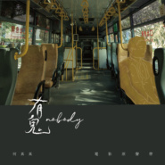
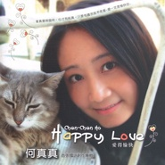
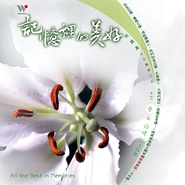
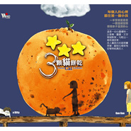
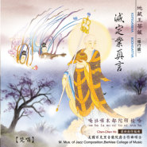

何真真
============================

|  |  |
| :--: | :-- |
| [<br>何真真](https://i.xiami.com/chenchenho) | **地区**: Taiwan, PRC 中国台湾<br>**风格**: 放松新世纪 Relaxation New Age, 精神新世纪 Spiritual New Age, 轻音乐 Easy Listening, 新世纪音乐 New Age<br>**播放数**: 21856747<br>**粉丝数**: 16091<br>**评论数**: 754<br> |

## 档案

<div>
个人简介<br>
美国百克里音乐院“爵士作曲硕士”<br>
美国百克里音乐院“商业编曲学士”文凭第一名：昆西·琼斯奖<br>
个人经历<br>
2000年9月 文建会爵士音乐媒体欣赏视听教材统筹主持人<br>
1997年6月 指挥西雅图知名爵士乐团Earshot Jazz Band，在西雅图歌剧院等三大城市参演”台湾艺术节”，演出所有个人爵士乐作品，此演出获选自行政院文建会<br>
1997年3月 得到国际荣誉音乐组织Pi Kappa Lambda 音乐成就奖。<br>
1995年4月 昆西琼斯奖，Quincy Jones Award<br>
1995年6月 百克里音乐院硕士奖学金，Berklee College of Music, Jazz Masters Scholarship<br>
1996年 迈阿密大学奖学金与硕士候选人，University of Maimi College Scholarship<br>
1994年 百克里音乐院国际补助金， Berklee College of Music International Grant<br>
钢琴演奏，指挥：作品发表于美国西雅图，伯明顿，波士顿等，在台湾有国家音乐厅及各地文化中心<br>
电视广告配乐：中国信托，健酪含钙饮料，阿雅的大自然内衣，大陆百事可乐等<br>
电视配乐：台视八点档"白法魔女"，九点档"逆女"，华视"欢喜住台湾"，三立"超级挑战者"等<br>
流行音乐词曲创作，CD制作，演唱，编曲，作曲<br>
乐理书籍著作：爵士和声乐理1，乐理练习(I)<br>
音乐教材制作：爵士猫弹钢琴，爵士猫吹中音笛<br>
文建会爵士音乐媒体欣赏视听教材统筹主持人，脚本．剧中配乐与学习手册撰写人
</div>

## 专辑

| 名称 | 语种 | 唱片公司 | 发行时间 | 专辑类别 | 专辑风格 |
| :--: | :-- | :-- | :-- | :-- | :-- |
| [<br>有鬼（电影原声带）](./albums/2108263517.md) | 国语 | 风潮音乐 | 2020年03月31日 | 原声带, 影视音乐 | 电影原声 Film Score |
| [<br>嬉游新春 - 气质系新年喜庆轻音乐](./albums/2103552131.md) | 纯音乐 | 风潮音乐 | 2018年01月12日 | EP, 单曲 | 轻音乐 Easy Listening |
| [<br>梦。马](./albums/1894692999.md) | 其他 | 风潮音乐 | 2014年02月20日 | 录音室专辑 | 轻音乐 Easy Listening |
| [<br>遇见小王子An Encounter with Le Petit Prince](./albums/450587.md) | 其他 | 风潮音乐 | 2011年06月30日 | 录音室专辑 | 轻音乐 Easy Listening |
| [<br>爱得愉快](./albums/8938.md) | 国语 | 喜玛拉雅 | 2007年07月04日 | 录音室专辑 | 轻音乐 Easy Listening |
| [<br>记忆里的美好](./albums/8939.md) | 其他 | 风潮音乐 | 2006年03月28日 | 录音室专辑 | 轻音乐 Easy Listening |
| [<br>3颗猫饼干Three Cat Cookies](./albums/8940.md) | 其他 | 风潮音乐 | 2004年04月26日 | 录音室专辑 | 轻音乐 Easy Listening |
| [<br>逆女 影集原声带FarbiddenLove](./albums/489597.md) | 国语 | 台视 | 2001年05月17日 | 原声带, 影视音乐 | 电影原声 Film Score |
| [<br>灭定业真言](./albums/5020430540.md) | 其他 | 新韵传音 | 2001年04月18日 | EP, 单曲 | 世界音乐 World Music |

## 评论

|  |  |  |
| :-- | :-- | :-- |
| <br>[虾米用户](https://emumo.xiami.com/u/4864918)<br>给人奋起催人前进达到意境...<br>2021-01-11 16:28<br>赞(0) 踩(0) | <div>虾米音乐加油</div> |
| <br>[虾米用户](https://emumo.xiami.com/u/46107860)<br>待秋风初起，随落叶黯然凋...<br>2020-07-18 16:47<br>赞(1) 踩(0) | <div>钢琴&amp;amp;何真真</div> |
| <br>[虾米用户](https://emumo.xiami.com/u/286167204)<br>灵魂需要音乐沐浴思想<br>2020-07-12 03:48<br>赞(1) 踩(0) | <div>希望能听到你更多的好歌曲 </div> |
| <br>[虾米用户](https://emumo.xiami.com/u/423026609)<br><br>2020-06-23 15:25<br>赞(1) 踩(0) | <div></div> |
| <br>[虾米用户](https://emumo.xiami.com/u/246120404)<br>只有空皮囊在大陆 我的心...<br>2020-06-21 10:31<br>赞(1) 踩(0) | <div>Miss u 真真</div> |
| <br>[虾米用户](https://emumo.xiami.com/u/520302)<br>孤独之中依然绽放 绽放之...<br>2020-04-03 01:28<br>赞(4) 踩(0) | <div>从2014年听到《3颗猫饼干》才开始知道何真真，到昨晚才听到的《有鬼》里的《我住你梦里》，到今晚听《遇见小王子》（这么多年我也才听了这三张专辑，虽然印象很好，但没有意全找来听），我惊讶女神旺盛的创作力，也纳闷这作曲和歌唱真都出自这样一个心灵如水晶般的才女吗？很喜欢何真真这童话般的音乐风格，流行大卖貌似不太可能，但岁月沉淀，绝对会成为经典流传！</div> |
| <br>[虾米用户](https://emumo.xiami.com/u/440306739)<br>我是一个没得感情的刺客。<br>2020-02-25 15:37<br>赞(3) 踩(0) | <div>欢迎进入虾米大家庭。(◍•ᴗ•◍)</div> |
| <br>[虾米用户](https://emumo.xiami.com/u/36030778)<br><br>2020-02-23 20:33<br>赞(1) 踩(0) | <div>很喜欢您的彩蝶舞夏，京城四季已是我的收藏专辑</div> |
| ⇒ | <br>[虾米用户](https://emumo.xiami.com/u/36030778)<br><br>2020-03-05 06:05<br>赞(0) 踩(0) | <div>何老师，您知道央视新闻频道，天气预报背景音乐的名字吗？我找了好久不得。</div> |
| ⇒ | <br>[虾米用户](https://emumo.xiami.com/u/38327434)<br><br>2020-05-25 14:01<br>赞(0) 踩(0) | <div><q><b>zycjwyz1说：</b></q></div> |
| <br>[虾米用户](https://emumo.xiami.com/u/11757705)<br><br>2020-02-22 11:07<br>赞(1) 踩(0) | <div>好听！</div> |
| <br>[虾米用户](https://emumo.xiami.com/u/8192902)<br> <br>2019-12-31 21:28<br>赞(1) 踩(0) | <div>一般般，没写的那么好 </div> |
| <br>[虾米用户](https://emumo.xiami.com/u/135861860)<br>你是光／你是电／你是人间...<br>2019-12-15 14:14<br>赞(1) 踩(0) | <div>人美音乐美的真真姐！</div> |
| <br>[虾米用户](https://emumo.xiami.com/u/135663442)<br> 电音，迷幻，新世纪<br>2019-12-14 22:51<br>赞(2) 踩(0) | <div>07年大学时 不同的季节，听着三颗猫饼干四首不同季节的曲子，现在十余年过去了，只要听到这些曲子，那年不同时段的往事就会浮现，我也姓何，谢谢何老师的音乐，见证我的心路，也祝福何老师。</div> |
| <br>[虾米用户](https://emumo.xiami.com/u/44161162)<br>音乐人生<br>2019-12-04 21:52<br>赞(1) 踩(0) | <div>今生如果能娶一个何真真一样美丽得音乐家，也不枉此生，哈哈哈</div> |
| <br>[虾米用户](https://emumo.xiami.com/u/433022596)<br><br>2019-12-03 00:18<br>赞(1) 踩(0) | <div>是从一首诗歌朗诵视频顾城的《门前》里第一次听到大姐姐的歌 起风前的相遇<br>第一印象词汇就是 幸福和宁静  </div> |
| <br>[虾米用户](https://emumo.xiami.com/u/2761156)<br>活着就要尽兴<br>2019-10-27 19:26<br>赞(1) 踩(0) | <div>真好听 不懂音乐但是超喜欢    </div> |
| <br>[虾米用户](https://emumo.xiami.com/u/401226974)<br>我还没想好要写什么...<br>2019-10-24 22:51<br>赞(2) 踩(0) | <div>啥时候有新DEMO(笑)</div> |
| <br>[虾米用户](https://emumo.xiami.com/u/307258421)<br><br>2019-10-10 13:04<br>赞(1) 踩(0) | <div>人美，歌美，性格美，史称三顾茅庐之美</div> |
| <br>[虾米用户](https://emumo.xiami.com/u/327352464)<br><br>2019-09-22 22:07<br>赞(0) 踩(0) | <div>很喜欢您的作品！总是给人的心灵带来触动</div> |
| <br>[虾米用户](https://emumo.xiami.com/u/409161762)<br><br>2019-08-23 00:00<br>赞(3) 踩(0) | <div>何真真霸占了沈阳铁路局担当的列车音乐</div> |
| ⇒ | <br>[虾米用户](https://emumo.xiami.com/u/78482626)<br>chenchenho<br>2019-08-24 00:39<br>赞(0) 踩(0) | <div>都沒付我版權費用耶</div> |
| <br>[虾米用户](https://emumo.xiami.com/u/404334922)<br><br>2019-06-06 12:32<br>赞(1) 踩(0) | <div>谢谢真真</div> |
| <br>[虾米用户](https://emumo.xiami.com/u/321859706)<br><br>2019-05-27 00:08<br>赞(1) 踩(0) | <div>在德芬老师的课程里，听到过，就想找来听，没想到虾米里面好多真真老师的作品，发现宝藏了 </div> |
| <br>[虾米用户](https://emumo.xiami.com/u/405787998)<br>把手放在我能看到的地方，...<br>2019-05-16 00:32<br>赞(2) 踩(0) | <div>大爱你，大爱大爱大爱！     </div> |
| <br>[虾米用户](https://emumo.xiami.com/u/411938666)<br><br>2019-05-08 21:33<br>赞(1) 踩(0) | <div>图片集第一张吓到我了 </div> |
| <br>[虾米用户](https://emumo.xiami.com/u/413551)<br>我还没想好要写什么...<br>2019-05-08 08:15<br>赞(1) 踩(0) | <div>早起，我听你的歌，我体验到了幸福的感觉，我觉得我在此刻跟自己遇见了。谢谢你带给我们这么美好的音乐。</div> |
| <br>[虾米用户](https://emumo.xiami.com/u/358104299)<br>悲观的唯心存在现实解构虚...<br>2019-05-03 23:03<br>赞(0) 踩(0) | <div>10963</div> |
| <br>[虾米用户](https://emumo.xiami.com/u/12413098)<br>你要如何让缘分就是缘分<br>2019-04-25 23:32<br>赞(1) 踩(0) | <div>第一次听到传统乐器可以被这样活泼地再现，我想本来它们就不仅是悲情一面，而有节日一面，杂糅着为生命庆贺的欢腾，洋溢着为自然供奉的活力，调皮，生动，把中华文化里好奇那一面毫无遗留地展现出来，太棒了！</div> |
| <br>[虾米用户](https://emumo.xiami.com/u/52323406)<br><br>2019-03-19 12:56<br>赞(1) 踩(0) | <div>加油 </div> |
| <br>[虾米用户](https://emumo.xiami.com/u/239068589)<br>愿你眼中总有光芒。<br>2019-03-12 14:03<br>赞(2) 踩(0) | <div>喜欢音乐带来的平静的力量～</div> |
| <br>[虾米用户](https://emumo.xiami.com/u/343027752)<br>我不想谋生，我想生活。<br>2019-03-06 21:26<br>赞(3) 踩(0) | <div>一直感觉她的音乐好配几米<br>(｡･ω･｡)ﾉ♡</div> |
| <br>[虾米用户](https://emumo.xiami.com/u/5499555)<br>花有重开日，人无再少年。<br>2019-03-03 23:36<br>赞(0) 踩(0) | <div></div> |
| <br>[虾米用户](https://emumo.xiami.com/u/250164178)<br><br>2019-02-23 09:15<br>赞(0) 踩(0) | <div>喜欢什么哪个男人是正常的，喜欢就说是自己的老公，有点不太正常吧？</div> |
| <br>[虾米用户](https://emumo.xiami.com/u/408603235)<br>。群人的走行前眼滤过乐音...<br>2019-02-20 22:26<br>赞(2) 踩(0) | <div>听的时候永远是童真的心态。</div> |
| <br>[虾米用户](https://emumo.xiami.com/u/356565757)<br><br>2019-02-19 22:10<br>赞(1) 踩(0) | <div>请问大家在哪里可以买到何老师正版《三颗猫饼干》的专辑呀？没事想收藏一张 </div> |
| ⇒ | <br>[虾米用户](https://emumo.xiami.com/u/78482626)<br>chenchenho<br>2019-02-22 15:04<br>赞(0) 踩(0) | <div>您可以直接跟我購買，我可以幫你簽名，請私訊謝謝</div> |
| <br>[虾米用户](https://emumo.xiami.com/u/65988992)<br><br>2019-02-19 20:57<br>赞(1) 踩(0) | <div>很久没听，过年的时候听到了那张关于过年的唱片，真真的喜欢。要继续听呀。</div> |
| <br>[虾米用户](https://emumo.xiami.com/u/418485607)<br><br>2019-02-06 23:43<br>赞(1) 踩(0) | <div>古德</div> |
| <br>[虾米用户](https://emumo.xiami.com/u/33647943)<br>听世界<br>2019-02-06 09:59<br>赞(2) 踩(0) | <div>很赞，很喜欢</div> |
| <br>[虾米用户](https://emumo.xiami.com/u/417963128)<br><br>2019-02-05 00:45<br>赞(1) 踩(0) | <div>谢谢(*°∀°)=3</div> |
| <br>[虾米用户](https://emumo.xiami.com/u/34225302)<br>喜好乐色趋同的人都有着相...<br>2019-01-31 14:46<br>赞(2) 踩(0) | <div>喜欢真真的音乐，真的美</div> |
| <br>[虾米用户](https://emumo.xiami.com/u/122475520)<br>一路向南<br>2018-12-28 12:43<br>赞(1) 踩(0) | <div>听《三颗猫饼干》入睡快一年了 谢谢何真真老师 让我在城市喧嚣的夜晚找到一种安宁</div> |
| <br>[虾米用户](https://emumo.xiami.com/u/402199735)<br><br>2018-11-26 23:41<br>赞(1) 踩(0) | <div>  </div> |
| <br>[虾米用户](https://emumo.xiami.com/u/402199735)<br><br>2018-11-26 23:41<br>赞(2) 踩(0) | <div>好喜欢</div> |
| <br>[虾米用户](https://emumo.xiami.com/u/192335227)<br><br>2018-11-17 14:56<br>赞(2) 踩(0) | <div>何真真的音乐听着感觉很舒服，安静，心情愉快</div> |
| <br>[虾米用户](https://emumo.xiami.com/u/354168766)<br><br>2018-11-04 23:26<br>赞(2) 踩(0) | <div>听您的三颗猫饼干长大的<br>又知道舌尖上的中国也是您配乐，曾经真的这个细节吸引到。原来我们在同一个世界。真好，也祝您幸福</div> |
| <br>[虾米用户](https://emumo.xiami.com/u/333842613)<br><br>2018-11-02 22:59<br>赞(1) 踩(0) | <div>十年后又回来听啦！谢谢你的音乐让我度过了快乐的时光！</div> |
| <br>[虾米用户](https://emumo.xiami.com/u/40273038)<br><br>2018-10-29 08:18<br>赞(1) 踩(0) | <div>彩蝶舞夏</div> |
| <br>[虾米用户](https://emumo.xiami.com/u/24920640)<br>我还没想好要写什么...<br>2018-10-23 10:00<br>赞(1) 踩(0) | <div>好喜欢你哦</div> |
| <br>[虾米用户](https://emumo.xiami.com/u/404868260)<br><br>2018-10-15 22:02<br>赞(2) 踩(0) | <div>很喜欢你的一些作品。从12年到现在。你的作品耳前一亮。让我找到回忆和故事的方向。</div> |
| <br>[虾米用户](https://emumo.xiami.com/u/405472415)<br><br>2018-10-04 20:29<br>赞(1) 踩(0) | <div></div> |
| <br>[虾米用户](https://emumo.xiami.com/u/157621436)<br>我还没想好要写什么...<br>2018-09-28 21:20<br>赞(1) 踩(0) | <div>每次听微笑的弧度，嘴角也会跟着上扬 </div> |
| ⇒ | <br>[虾米用户](https://emumo.xiami.com/u/157621436)<br>我还没想好要写什么...<br>2018-12-22 15:37<br>赞(0) 踩(0) | <div>哇塞，何真真老师给我点赞了 </div> |
| <br>[虾米用户](https://emumo.xiami.com/u/334907354)<br><br>2018-09-18 18:39<br>赞(1) 踩(0) | <div>最先喜欢上的是橘色温度，然后是微笑的弧度，粉红色的旋舞，真的都很好听(๑&amp;bull;̀ㅂ&amp;bull;́)و✧您真的太棒了</div> |
| <br>[虾米用户](https://emumo.xiami.com/u/378202071)<br><br>2018-09-16 16:43<br>赞(1) 踩(0) | <div>你来啦，歌都挺好的</div> |
| <br>[虾米用户](https://emumo.xiami.com/u/52056952)<br>人生即是到來、相遇、陪伴...<br>2018-08-17 08:41<br>赞(1) 踩(0) | <div></div> |
| <br>[虾米用户](https://emumo.xiami.com/u/401245982)<br><br>2018-08-12 08:35<br>赞(2) 踩(0) | <div>因为《橘色温度》，喜欢你的音乐。</div> |
| <br>[虾米用户](https://emumo.xiami.com/u/70407236)<br>何以解忧，唯有音乐<br>2018-08-12 08:34<br>赞(2) 踩(0) | <div>何真真创作的纯音乐，是久违的一种属于童心的旋律，音符敲在心里就像春天跳舞的精灵，夏日里未融化的雪糕，秋日里森林烤的番薯，还有冬日雪花纷飞的水晶球。[爱心]</div> |
| <br>[虾米用户](https://emumo.xiami.com/u/259761138)<br>世间纷飞，心静如水。<br>2018-08-11 00:01<br>赞(1) 踩(0) | <div>绝对有趣的灵魂 </div> |
| <br>[虾米用户](https://emumo.xiami.com/u/259761138)<br>世间纷飞，心静如水。<br>2018-08-10 23:57<br>赞(1) 踩(0) | <div>名字很真，人很真，音乐很真。</div> |
| <br>[虾米用户](https://emumo.xiami.com/u/247146249)<br> <br>2018-08-05 13:23<br>赞(1) 踩(0) | <div>从这首《彩蝶舞夏》知道了何真真，看了介绍才知道真正的才女是什么样。佩服！</div> |
| <br>[虾米用户](https://emumo.xiami.com/u/375402890)<br><br>2018-07-22 12:53<br>赞(1) 踩(0) | <div>好喜欢，好喜欢的，那么好听，那么可爱的音乐。</div> |
| <br>[虾米用户](https://emumo.xiami.com/u/202668328)<br>天涯到海角，不觉得有点孤...<br>2018-07-15 23:35<br>赞(1) 踩(0) | <div>因为爱逛书店相识，书店永远轻轻的放着你的歌，很美好，当踏入店内，轻松宁静的氛围就治愈了每一个人。常常在那儿一待就是一下午，现在觉得没有一个书城能比得上那里&amp;hellip;&amp;hellip;不知是因为音乐还是书</div> |
| <br>[虾米用户](https://emumo.xiami.com/u/11914042)<br><br>2018-07-09 13:37<br>赞(0) 踩(0) | <div>好好去学校再学学吧。。。就算按流行歌的编曲，都一塌糊涂。。跟久石让比？逗我吗？</div> |
| ⇒ | <br>[虾米用户](https://emumo.xiami.com/u/44161162)<br>音乐人生<br>2018-07-27 05:16<br>赞(0) 踩(0) | <div>弱智</div> |
| ⇒ | <br>[虾米用户](https://emumo.xiami.com/u/100248386)<br>等虾米把版权们抢回来再说...<br>2019-01-02 01:05<br>赞(0) 踩(0) | <div>期待你的作品，加油哦</div> |
| <br>[虾米用户](https://emumo.xiami.com/u/37336848)<br><br>2018-06-14 20:40<br>赞(8) 踩(0) | <div>我很喜欢你的音乐 </div> |
| <br>[虾米用户](https://emumo.xiami.com/u/324229155)<br>听歌基因有些怪<br>2018-06-07 20:05<br>赞(3) 踩(0) | <div>橘色温度这个曲子刚开始听还觉得没什么呢，越听越好听啊，单曲循环没话说！何老师的音乐能给人一种放松的感觉，感觉回到了童年(*^▽^)/★*☆</div> |
| <br>[虾米用户](https://emumo.xiami.com/u/258203078)<br>好好做人<br>2018-06-05 22:10<br>赞(1) 踩(0) | <div>因为你的一个赞 你是唯一我关注的人 </div> |
| <br>[虾米用户](https://emumo.xiami.com/u/355730520)<br><br>2018-05-17 14:46<br>赞(1) 踩(0) | <div>音乐很舒服 </div> |
| <br>[虾米用户](https://emumo.xiami.com/u/120675902)<br><br>2018-05-09 20:59<br>赞(2) 踩(0) | <div>很喜欢你的&amp;ndash;微笑的弧度</div> |
| <br>[虾米用户](https://emumo.xiami.com/u/272089308)<br><br>2018-05-05 23:27<br>赞(19) 踩(0) | <div>我觉得能更何老师比的，只有日本一个久石壤，韩国一个全素研，其他都比不上!</div> |
| ⇒ | <br>[虾米用户](https://emumo.xiami.com/u/404131214)<br>为了我的收藏夹来的虾米<br>2018-10-13 15:49<br>赞(0) 踩(0) | <div>莫ky，会招黑。</div> |
| ⇒ | <br>[虾米用户](https://emumo.xiami.com/u/415028615)<br><br>2019-04-14 13:29<br>赞(0) 踩(0) | <div>好你就说好，说出哪里好；不要去比较。比较只能说明你见的听的确实少。</div> |
| ⇒ | <br>[虾米用户](https://emumo.xiami.com/u/272089308)<br><br>2019-04-30 17:40<br>赞(0) 踩(0) | <div>看到一年前我的回复，我承认的确有些言辞不当。的确不能和别人比。<br>那这么说吧，是何老师的歌让我喜欢纯音乐的，但我听的纯音乐越多，我越喜欢何老师的纯音乐 </div> |
| <br>[虾米用户](https://emumo.xiami.com/u/125089920)<br>找到北方啦<br>2018-04-30 17:35<br>赞(2) 踩(0) | <div></div> |
| <br>[虾米用户](https://emumo.xiami.com/u/358443675)<br><br>2018-04-25 23:22<br>赞(3) 踩(0) | <div>其实，我就想找个和何真真一样的夫人，当然，我也希望我能配得起。</div> |
| <br>[虾米用户](https://emumo.xiami.com/u/172864574)<br> <br>2018-03-31 18:52<br>赞(2) 踩(0) | <div>遇见小王子是我最爱的专辑之一！<br>真真姐太有才华了！</div> |
| <br>[虾米用户](https://emumo.xiami.com/u/1390293)<br>想找一个一起看书一起听歌...<br>2018-03-28 22:34<br>赞(1) 踩(0) | <div>有才</div> |
| <br>[虾米用户](https://emumo.xiami.com/u/341910501)<br>纯音乐永远是我的最爱(●...<br>2018-03-10 00:22<br>赞(2) 踩(0) | <div>喜欢的音乐，很有灵气。   </div> |
| <br>[虾米用户](https://emumo.xiami.com/u/353005033)<br><br>2018-03-02 22:47<br>赞(4) 踩(0) | <div>本来在看书，然后就听到了碰撞灵魂的声音，遇见小王子，很好听，也喜欢每一首音乐的名字，有趣有故事 希望小姐姐一直都能沉醉其中 </div> |
| <br>[虾米用户](https://emumo.xiami.com/u/346370374)<br><br>2018-02-28 11:50<br>赞(2) 踩(0) | <div>从3颗猫饼干开始，一直很喜欢你。希望你多写些歌！</div> |
| <br>[虾米用户](https://emumo.xiami.com/u/82505178)<br><br>2018-02-19 10:56<br>赞(2) 踩(0) | <div>真真美女，梦。马专辑可以发下无损音质吗，谢谢，您的听友敬上！</div> |
| ⇒ | <br>[虾米用户](https://emumo.xiami.com/u/78482626)<br>chenchenho<br>2018-02-20 23:13<br>赞(0) 踩(0) | <div>蝦米下載應該是無損的吧??您應該請問蝦米工作人員~謝謝您的支持</div> |
| <br>[虾米用户](https://emumo.xiami.com/u/9762448)<br><br>2018-01-19 14:16<br>赞(20) 踩(0) | <div>何真真是永远的少女啊，她演奏了各种的曲子从不重复，却都有式样相通的轻盈灵动和梦幻，偶尔还会有小小的不见世俗的天真愁绪包含在内。你能看见阳光下绿树旁打开的落地窗，也能看见穿白色舞衣面上带笑的芭蕾女孩</div> |
| <br>[虾米用户](https://emumo.xiami.com/u/139829976)<br>我还没想好要写什么...<br>2018-01-17 16:36<br>赞(2) 踩(0) | <div>喜欢了很多年了，支持真真姐~</div> |
| <br>[虾米用户](https://emumo.xiami.com/u/30342924)<br><br>2018-01-12 23:32<br>赞(1) 踩(0) | <div>******</div> |
| <br>[虾米用户](https://emumo.xiami.com/u/196313833)<br><br>2018-01-11 06:17<br>赞(0) 踩(0) | <div>Tom barabas、Cliff Carpenter、Bill Douglas和何真真，我的四位New Age之神。</div> |
| <br>[虾米用户](https://emumo.xiami.com/u/343955658)<br><br>2018-01-09 13:48<br>赞(1) 踩(0) | <div>我以前的女朋友从形象上感觉和何老师一个类型 是武汉音乐学院钢琴系的</div> |
| <br>[虾米用户](https://emumo.xiami.com/u/343955658)<br><br>2018-01-09 13:47<br>赞(0) 踩(0) | <div>何真真是华人吗？这首粉红色的旋舞找了半天才找到 最初是在兴业银行的广告词里听到的！我想用中间部分做铃声 不知道怎么制作！有会的吗 指教一下 感谢</div> |
| <br>[虾米用户](https://emumo.xiami.com/u/71960916)<br>我是小虾米<br>2018-01-07 12:18<br>赞(0) 踩(0) | <div>非常好听</div> |
| <br>[虾米用户](https://emumo.xiami.com/u/340888342)<br><br>2017-12-28 23:17<br>赞(1) 踩(0) | <div>希望真真老师可以永远把创作坚持下去，您的歌词是第一首把我听哭的，感动至极</div> |
| <br>[虾米用户](https://emumo.xiami.com/u/9842933)<br><br>2017-12-13 23:34<br>赞(1) 踩(0) | <div>美国百克里音乐院“爵士作曲硕士” 美国百克里音乐院“商业编曲学士”文凭第一名：昆西·琼斯奖 个人经历 2000年9月 文建会爵士音乐媒体欣赏视听教材统筹主持人 1997年6月 指挥西雅图知名爵士乐团Earshot Jazz Band，在西雅图歌剧院等三大城市参演</div> |
| <br>[虾米用户](https://emumo.xiami.com/u/27243452)<br><br>2017-12-09 07:20<br>赞(1) 踩(0) | <div>真真为什么不去网易？</div> |
| <br>[虾米用户](https://emumo.xiami.com/u/244776006)<br>愿我还是我……<br>2017-12-04 17:08<br>赞(1) 踩(0) | <div>喜欢你的音乐世界</div> |
| <br>[虾米用户](https://emumo.xiami.com/u/205320910)<br><br>2017-12-01 11:11<br>赞(3) 踩(0) | <div>听您的音乐是我用虾米音乐的唯一原因</div> |
| <br>[虾米用户](https://emumo.xiami.com/u/199403934)<br><br>2017-11-21 22:18<br>赞(2) 踩(0) | <div>开车，很清爽的悲哀。</div> |
| <br>[虾米用户](https://emumo.xiami.com/u/334173776)<br><br>2017-11-09 23:57<br>赞(1) 踩(0) | <div>哇塞誒，星際流浪太好聽了</div> |
| <br>[虾米用户](https://emumo.xiami.com/u/7497510)<br><br>2017-10-27 23:50<br>赞(3) 踩(0) | <div>高中的时候第一次听三颗猫饼干，特别喜欢微笑的弧度，贝壳里的心事和橘色温度，现在大学毕业了，喜欢的歌曲增加了五个梦和星际流浪 没想到在这儿还能看到女神和大家交流，希望我们一直保有一颗未泯的童心 </div> |
| <br>[虾米用户](https://emumo.xiami.com/u/298948030)<br>中國詩音樂電影创始人作曲...<br>2017-10-17 22:08<br>赞(1) 踩(0) | <div>你好</div> |
| <br>[虾米用户](https://emumo.xiami.com/u/329812111)<br><br>2017-10-15 10:30<br>赞(1) 踩(0) | <div>不知道为什么，随便听一整个歌单，并不知道有你的音乐，但是，听到一首歌曲，想看看是哪一首，总会发现是你的音乐，这就很奇妙了，我也不知道你的音乐到底触动了我的哪里，但这样的感觉很棒，所以呢，我认为你是一个可以触动别人心灵的音乐人 </div> |
| <br>[虾米用户](https://emumo.xiami.com/u/288369750)<br> <br>2017-10-09 20:11<br>赞(1) 踩(0) | <div>优美的旋律，淡淡的忧伤，令人沉醉</div> |
| <br>[虾米用户](https://emumo.xiami.com/u/323492091)<br>我是牛排，如果你有空的话...<br>2017-09-20 12:39<br>赞(3) 踩(0) | <div>真真老师，我第一首听你的歌是星际流浪，非常喜欢！希望您能继续加油！</div> |
| <br>[虾米用户](https://emumo.xiami.com/u/325499082)<br><br>2017-09-17 15:26<br>赞(0) 踩(0) | <div>ok</div> |
| <br>[虾米用户](https://emumo.xiami.com/u/53008228)<br>尝试用旋律纪念我成长的一...<br>2017-09-16 10:27<br>赞(0) 踩(0) | <div>微笑的弧度实在是太棒了</div> |
| <br>[虾米用户](https://emumo.xiami.com/u/253574577)<br><br>2017-09-10 14:59<br>赞(0) 踩(0) | <div>不知道为什么真真姐的曲子下载要会员了（虽然虾米春节活动送了两年会员），但是一定是真真姐越来越好了，祝真真姐加油，每首曲子都是童话。</div> |
| <br>[虾米用户](https://emumo.xiami.com/u/319292791)<br>宠辱不惊，看庭前花开花落...<br>2017-08-16 22:11<br>赞(1) 踩(0) | <div>希望真真姐继续保持本心，始终保持一种谦卑的态度。</div> |
| <br>[虾米用户](https://emumo.xiami.com/u/319292791)<br>宠辱不惊，看庭前花开花落...<br>2017-08-16 22:00<br>赞(1) 踩(0) | <div>集才华，气质，美貌于一身的音乐季。 对我来说世界上最好听的专辑就是真真姐的下一张专辑。</div> |
| <br>[虾米用户](https://emumo.xiami.com/u/15967407)<br>我是主角，我不能死！<br>2017-08-12 23:57<br>赞(1) 踩(0) | <div>感动，感谢，能听到这么好的音乐，是一种幸运</div> |
| <br>[虾米用户](https://emumo.xiami.com/u/317725637)<br><br>2017-08-06 20:52<br>赞(4) 踩(0) | <div>从三颗饼干就开喜欢上了你的音乐。梦马这张专辑等 了好久，爱你@何真真</div> |
| ⇒ | <br>[虾米用户](https://emumo.xiami.com/u/78482626)<br>chenchenho<br>2017-08-06 22:06<br>赞(0) 踩(0) | <div>謝謝您的喜愛與支持~真真</div> |
| <br>[虾米用户](https://emumo.xiami.com/u/1113319)<br> <br>2017-08-05 10:17<br>赞(0) 踩(0) | <div>感谢虾米，让我们听到这么多美好的音乐。感谢音乐艺术家给我们带来这么美妙的享受</div> |
| <br>[虾米用户](https://emumo.xiami.com/u/277914084)<br>青松碎云蹁跹，饮风共醉月...<br>2017-07-23 16:54<br>赞(0) 踩(0) | <div>歌声动人心弦！</div> |
| <br>[虾米用户](https://emumo.xiami.com/u/277914084)<br>青松碎云蹁跹，饮风共醉月...<br>2017-07-23 16:53<br>赞(1) 踩(0) | <div>哇塞！真是奇才！才华横溢！</div> |
| <br>[虾米用户](https://emumo.xiami.com/u/277914084)<br>青松碎云蹁跹，饮风共醉月...<br>2017-07-23 16:51<br>赞(1) 踩(0) | <div>认识恨晚～</div> |
| <br>[虾米用户](https://emumo.xiami.com/u/297052358)<br> <br>2017-07-16 12:07<br>赞(4) 踩(0) | <div>轻松愉快的一天由何真真的《遇见小王子》开始啦～努力工作学习，生活美美哒！！</div> |
| <br>[虾米用户](https://emumo.xiami.com/u/18066206)<br>我还没想好要写什么...<br>2017-07-15 14:59<br>赞(1) 踩(0) | <div>微笑的弧度</div> |
| <br>[虾米用户](https://emumo.xiami.com/u/10506864)<br><br>2017-07-12 10:20<br>赞(1) 踩(0) | <div>真的是非常棒的音乐</div> |
| <br>[虾米用户](https://emumo.xiami.com/u/295859630)<br>真的<br>2017-07-10 22:18<br>赞(1) 踩(0) | <div>她居然赞了我的评论(谢谢你真真姐!)</div> |
| <br>[虾米用户](https://emumo.xiami.com/u/54367807)<br>666次的轮回<br>2017-07-10 01:58<br>赞(2) 踩(0) | <div>何真真的《四季》.....听了一半我就想说：约嘛？<br><br>如果还不理解就上诗：春无百花秋无月，夏无凉风冬无雪。</div> |
| <br>[虾米用户](https://emumo.xiami.com/u/208690998)<br>永远不要把你最爱的歌设置...<br>2017-07-08 05:07<br>赞(2) 踩(0) | <div>喜欢《独一无二的朋友》*^_^*</div> |
| <br>[虾米用户](https://emumo.xiami.com/u/198036178)<br><br>2017-07-07 21:55<br>赞(2) 踩(0) | <div>独家了</div> |
| <br>[虾米用户](https://emumo.xiami.com/u/245249479)<br>张盛渔<br>2017-07-07 13:46<br>赞(1) 踩(0) | <div>so nice  </div> |
| <br>[虾米用户](https://emumo.xiami.com/u/5523541)<br><br>2017-06-18 15:39<br>赞(2) 踩(0) | <div>暗恋何真真是我这个夏天的主题</div> |
| <br>[虾米用户](https://emumo.xiami.com/u/5523541)<br><br>2017-06-18 15:09<br>赞(1) 踩(0) | <div>我喜欢人更甚于音乐。</div> |
| <br>[虾米用户](https://emumo.xiami.com/u/305224062)<br><br>2017-06-17 15:19<br>赞(1) 踩(0) | <div>因为你所以才又把虾米音乐安装了的，现在找不到，果断卸载。</div> |
| ⇒ | <br>[虾米用户](https://emumo.xiami.com/u/78482626)<br>chenchenho<br>2017-06-17 23:41<br>赞(0) 踩(0) | <div>找不到什麼呢?</div> |
| ⇒ | <br>[虾米用户](https://emumo.xiami.com/u/305224062)<br><br>2017-06-18 03:42<br>赞(0) 踩(0) | <div><q><b>何真真说：</b></q></div> |
| <br>[虾米用户](https://emumo.xiami.com/u/13106207)<br>优秀如你<br>2017-06-16 15:41<br>赞(1) 踩(0) | <div>出新啊，何教主</div> |
| ⇒ | <br>[虾米用户](https://emumo.xiami.com/u/78482626)<br>chenchenho<br>2017-06-16 16:37<br>赞(0) 踩(0) | <div>哈哈~何時我變成教主，可以看看我微博，有一首新曲喔~在這裡聽不到</div> |
| ⇒ | <br>[虾米用户](https://emumo.xiami.com/u/13106207)<br>优秀如你<br>2017-06-16 16:40<br>赞(0) 踩(0) | <div><q><b>何真真说：</b></q></div> |
| ⇒ | <br>[虾米用户](https://emumo.xiami.com/u/305224062)<br><br>2017-06-17 15:17<br>赞(0) 踩(0) | <div><q><b>何真真说：</b></q></div> |
| <br>[虾米用户](https://emumo.xiami.com/u/301341986)<br><br>2017-06-06 18:19<br>赞(1) 踩(0) | <div>爱到不行</div> |
| <br>[虾米用户](https://emumo.xiami.com/u/43248227)<br><br>2017-06-04 04:59<br>赞(1) 踩(0) | <div>真真姐求粉</div> |
| <br>[虾米用户](https://emumo.xiami.com/u/1418202)<br> 江山共老<br>2017-05-29 18:04<br>赞(1) 踩(0) | <div>哈哈妳真的很特別呀</div> |
| <br>[虾米用户](https://emumo.xiami.com/u/297974687)<br>We.    are. ...<br>2017-05-21 09:22<br>赞(1) 踩(0) | <div>棒极了</div> |
| <br>[虾米用户](https://emumo.xiami.com/u/48092331)<br><br>2017-05-12 10:29<br>赞(2) 踩(0) | <div>唯美</div> |
| <br>[虾米用户](https://emumo.xiami.com/u/11257043)<br><br>2017-05-10 13:02<br>赞(3) 踩(0) | <div>像童话一样单纯美好！</div> |
| <br>[虾米用户](https://emumo.xiami.com/u/520302)<br>孤独之中依然绽放 绽放之...<br>2017-05-07 20:40<br>赞(2) 踩(0) | <div>像绘本一样精美的音乐！</div> |
| ⇒ | <br>[虾米用户](https://emumo.xiami.com/u/78482626)<br>chenchenho<br>2017-05-07 21:47<br>赞(0) 踩(0) | <div>謝謝讚美</div> |
| ⇒ | <br>[虾米用户](https://emumo.xiami.com/u/2925823)<br> <br>2017-06-13 17:43<br>赞(0) 踩(0) | <div><q><b>何真真说：</b></q></div> |
| <br>[虾米用户](https://emumo.xiami.com/u/1230762)<br>什么声音动听<br>2017-05-05 17:32<br>赞(0) 踩(0) | <div>灵魂发声</div> |
| <br>[虾米用户](https://emumo.xiami.com/u/882081)<br><br>2017-05-05 15:26<br>赞(1) 踩(0) | <div>微笑的弧度 赞</div> |
| <br>[虾米用户](https://emumo.xiami.com/u/264473339)<br><br>2017-05-02 13:03<br>赞(0) 踩(0) | <div>喜欢</div> |
| <br>[虾米用户](https://emumo.xiami.com/u/50631810)<br><br>2017-04-20 00:04<br>赞(2) 踩(0) | <div>感謝創作出這麼多沁人心肺的音樂，太美了！！</div> |
| <br>[虾米用户](https://emumo.xiami.com/u/42394733)<br>aches and wi...<br>2017-04-19 19:42<br>赞(1) 踩(0) | <div>这位音乐人真的超棒啊。</div> |
| <br>[虾米用户](https://emumo.xiami.com/u/12221090)<br>逍遥于天地而心意自得<br>2017-04-13 14:48<br>赞(0) 踩(0) | <div>赞</div> |
| <br>[虾米用户](https://emumo.xiami.com/u/287309522)<br><br>2017-04-09 03:14<br>赞(0) 踩(0) | <div></div> |
| <br>[虾米用户](https://emumo.xiami.com/u/287309522)<br><br>2017-04-09 03:14<br>赞(0) 踩(0) | <div>好听</div> |
| <br>[虾米用户](https://emumo.xiami.com/u/287309522)<br><br>2017-04-09 03:14<br>赞(0) 踩(0) | <div>嗯</div> |
| <br>[虾米用户](https://emumo.xiami.com/u/279826)<br>有音乐，一个人，整个世界<br>2017-04-08 04:02<br>赞(1) 踩(0) | <div>逐条看了下评论，发现好多条都有回复，好像是我见过的回复最多的大神了，呀，好勤快好接地气又好大神啊  ：）</div> |
| ⇒ | <br>[虾米用户](https://emumo.xiami.com/u/78482626)<br>chenchenho<br>2017-04-08 19:36<br>赞(0) 踩(0) | <div>哈哈哈~當然也要回復你一下!既然你這麼說~~</div> |
| ⇒ | <br>[虾米用户](https://emumo.xiami.com/u/279826)<br>有音乐，一个人，整个世界<br>2017-04-08 21:00<br>赞(0) 踩(0) | <div><q><b>何真真说：</b></q></div> |
| <br>[虾米用户](https://emumo.xiami.com/u/279826)<br>有音乐，一个人，整个世界<br>2017-04-08 03:55<br>赞(1) 踩(0) | <div>每隔一段时间就要听一听《3颗猫饼干》和《遇见小王子》，就像和一个相识已久的老友不定期约会，好美妙的感觉</div> |
| <br>[虾米用户](https://emumo.xiami.com/u/228684881)<br><br>2017-04-06 20:24<br>赞(1) 踩(0) | <div>希望你能再出几首像星际流浪一样的歌曲</div> |
| <br>[虾米用户](https://emumo.xiami.com/u/20821470)<br><br>2017-04-05 20:43<br>赞(1) 踩(0) | <div>在sontaste初次接触《微笑的弧度》就深深的爱上你了&amp;hellip;</div> |
| <br>[虾米用户](https://emumo.xiami.com/u/285615880)<br><br>2017-04-03 11:23<br>赞(1) 踩(0) | <div>专门来听星际流浪的</div> |
| <br>[虾米用户](https://emumo.xiami.com/u/285615880)<br><br>2017-04-03 11:19<br>赞(1) 踩(0) | <div>特别好听，支持何真真姐姐</div> |
| <br>[虾米用户](https://emumo.xiami.com/u/284694388)<br><br>2017-04-01 11:19<br>赞(1) 踩(0) | <div>喜欢</div> |
| <br>[虾米用户](https://emumo.xiami.com/u/13070103)<br><br>2017-03-31 11:21<br>赞(1) 踩(0) | <div>也是为了你转过来的～</div> |
| ⇒ | <br>[虾米用户](https://emumo.xiami.com/u/78482626)<br>chenchenho<br>2017-03-31 12:11<br>赞(0) 踩(0) | <div>謝謝到來</div> |
| <br>[虾米用户](https://emumo.xiami.com/u/100248386)<br>等虾米把版权们抢回来再说...<br>2017-03-29 04:22<br>赞(4) 踩(0) | <div>为了你专门从网易云转战虾米了哈哈哈！</div> |
| ⇒ | <br>[虾米用户](https://emumo.xiami.com/u/78482626)<br>chenchenho<br>2017-03-29 23:24<br>赞(0) 踩(0) | <div>謝謝~蝦米這裡是合法授權~希望大家多多支持!</div> |
| ⇒ | <br>[虾米用户](https://emumo.xiami.com/u/100248386)<br>等虾米把版权们抢回来再说...<br>2017-03-30 02:44<br>赞(0) 踩(0) | <div><q><b>何真真说：</b></q></div> |
| ⇒ | <br>[虾米用户](https://emumo.xiami.com/u/20821470)<br><br>2017-04-05 20:52<br>赞(0) 踩(0) | <div><q><b>何真真说：</b></q></div> |
| <br>[虾米用户](https://emumo.xiami.com/u/204681443)<br>眼中自带小星星！！<br>2017-03-27 13:25<br>赞(1) 踩(0) | <div>看《舌尖上的中国》，真是被你的纯音乐吸引了</div> |
| ⇒ | <br>[虾米用户](https://emumo.xiami.com/u/244015597)<br>就想安静的听着音乐，做自...<br>2018-02-20 03:47<br>赞(0) 踩(0) | <div>你也是醉了</div> |
| <br>[虾米用户](https://emumo.xiami.com/u/242687431)<br><br>2017-03-27 09:27<br>赞(1) 踩(0) | <div>纯真</div> |
| <br>[虾米用户](https://emumo.xiami.com/u/168183020)<br><br>2017-03-20 08:50<br>赞(2) 踩(0) | <div>华人最杰出的作曲家，向经典致敬！</div> |
| ⇒ | <br>[虾米用户](https://emumo.xiami.com/u/78482626)<br>chenchenho<br>2017-03-20 17:09<br>赞(0) 踩(0) | <div>不敢當，大家都很優秀。謝謝您的留言讚美~</div> |
| ⇒ | <br>[虾米用户](https://emumo.xiami.com/u/168183020)<br><br>2017-03-20 17:39<br>赞(0) 踩(0) | <div><q><b>何真真说：</b></q></div> |
| ⇒ | <br>[虾米用户](https://emumo.xiami.com/u/7902409)<br>山河大海 星辰湖泊 愿爱...<br>2017-06-08 16:40<br>赞(0) 踩(0) | <div>别这么说，人家最不想看到的就是&amp;ldquo;华人&amp;rdquo;二字</div> |
| <br>[虾米用户](https://emumo.xiami.com/u/278835665)<br> <br>2017-03-08 22:53<br>赞(0) 踩(0) | <div>遇见小王子的纯音乐怎么没有啦，还是我记错了 ，寂寞无边无际也只有虾米能听了</div> |
| <br>[虾米用户](https://emumo.xiami.com/u/275301320)<br><br>2017-02-26 20:09<br>赞(1) 踩(0) | <div>混搭新古典，很特别</div> |
| <br>[虾米用户](https://emumo.xiami.com/u/275553537)<br> <br>2017-02-23 16:30<br>赞(2) 踩(0) | <div>你的音乐陪我度过了我最焦躁的时期，听着你的曲子仿佛有种魔力使我感到轻松愉快，让我能平复下心情来面对生活，在你的乐符中我也体会到了更多生命的美好，谢谢你何真真</div> |
| ⇒ | <br>[虾米用户](https://emumo.xiami.com/u/78482626)<br>chenchenho<br>2017-02-24 01:46<br>赞(0) 踩(0) | <div>謝謝你的分享與支持~~</div> |
| ⇒ | <br>[虾米用户](https://emumo.xiami.com/u/198036178)<br><br>2017-02-25 09:01<br>赞(0) 踩(0) | <div><q><b>何真真说：</b></q></div> |
| ⇒ | <br>[虾米用户](https://emumo.xiami.com/u/78482626)<br>chenchenho<br>2017-02-25 22:19<br>赞(0) 踩(0) | <div><q><b>——情绪 泛滥说：</b></q></div> |
| <br>[虾米用户](https://emumo.xiami.com/u/8670491)<br><br>2017-02-22 20:42<br>赞(1) 踩(0) | <div>已关注 </div> |
| <br>[虾米用户](https://emumo.xiami.com/u/275110428)<br><br>2017-02-21 16:54<br>赞(1) 踩(0) | <div>为了你下载了虾米</div> |
| <br>[虾米用户](https://emumo.xiami.com/u/50629196)<br>音之妙，撒于心<br>2017-02-12 19:28<br>赞(1) 踩(0) | <div>能以这么年轻做出这样的作品  是一个人完成的心血吗？  我服  天才</div> |
| <br>[虾米用户](https://emumo.xiami.com/u/272814195)<br>有时候我会想，普普通通的...<br>2017-02-12 03:36<br>赞(1) 踩(0) | <div>感觉贝壳里的心事是一首年纪越大听起来越想哭的曲子，高中时期不知在哪听到这曲调便被深深吸引，推荐给很多朋友，当时还一直以为中间那感觉一弹一弹的一段描述的是麦浪...之后另一个人理解的是海浪...也是，贝壳边哪有麦田，蠢哭了。现在大学马上就要毕业了，再听这首感觉好难受都快受不但是每次都停不下来   这里就没有哭得在厉害点的图标么?!好喜欢好难受,但放不下了...</div> |
| ⇒ | <br>[虾米用户](https://emumo.xiami.com/u/78482626)<br>chenchenho<br>2017-02-13 00:10<br>赞(0) 踩(0) | <div>別哭了~涵著淚水也要勇敢出發~</div> |
| ⇒ | <br>[虾米用户](https://emumo.xiami.com/u/272814195)<br>有时候我会想，普普通通的...<br>2017-02-16 21:30<br>赞(0) 踩(0) | <div><q><b>何真真说：</b></q></div> |
| <br>[虾米用户](https://emumo.xiami.com/u/229714094)<br><br>2017-02-01 00:33<br>赞(2) 踩(0) | <div>我听星际流浪认识你的</div> |
| <br>[虾米用户](https://emumo.xiami.com/u/258818324)<br><br>2017-01-02 08:08<br>赞(1) 踩(0) | <div>真爱怎么只是纯乐，没有唱的吗？</div> |
| ⇒ | <br>[虾米用户](https://emumo.xiami.com/u/13007165)<br> <br>2017-02-20 10:37<br>赞(0) 踩(0) | <div>要学会欣赏</div> |
| <br>[虾米用户](https://emumo.xiami.com/u/248313614)<br><br>2016-12-30 19:53<br>赞(1) 踩(0) | <div>很不错，很想认识你 </div> |
| <br>[虾米用户](https://emumo.xiami.com/u/255053757)<br><br>2016-12-27 22:30<br>赞(1) 踩(0) | <div>期待真真姐的新作品 </div> |
| <br>[虾米用户](https://emumo.xiami.com/u/180506772)<br><br>2016-11-25 22:38<br>赞(1) 踩(0) | <div>无法言喻的美妙</div> |
| <br>[虾米用户](https://emumo.xiami.com/u/5991194)<br><br>2016-11-25 22:06<br>赞(1) 踩(0) | <div>就是喜欢</div> |
| <br>[虾米用户](https://emumo.xiami.com/u/2770326)<br><br>2016-11-18 16:02<br>赞(1) 踩(0) | <div>不错，支持原创</div> |
| <br>[虾米用户](https://emumo.xiami.com/u/19409755)<br>什么都听点儿<br>2016-11-08 01:08<br>赞(1) 踩(0) | <div>这么好的音乐 直到今天才听到 真是遗憾</div> |
| <br>[虾米用户](https://emumo.xiami.com/u/9277436)<br>你说风景好，好不过你的微...<br>2016-10-31 21:21<br>赞(1) 踩(0) | <div>非常喜欢星际流浪，感觉很自由很欢快～ </div> |
| <br>[虾米用户](https://emumo.xiami.com/u/241472659)<br>如可分身饰演自己？<br>2016-10-30 03:05<br>赞(1) 踩(0) | <div>好好听</div> |
| <br>[虾米用户](https://emumo.xiami.com/u/53535)<br>走在陌生的道路上，修行！<br>2016-10-28 22:16<br>赞(0) 踩(0) | <div>有些人仿佛一直生长在梦幻的精灵国度，岁月绕指而过留不下一丝痕迹！眨眼多年，你的音乐还是那么真，听着那么令人愉悦，放松，你还是当年的你。我没有学过音乐，不知道音乐是怎么编曲弹奏的，我听音乐只会跟着心走，令我心里感觉温暖，美好，放松的，有共鸣的我才会去追，去享受！而你的音乐多年来一直陪伴我！</div> |
| <br>[虾米用户](https://emumo.xiami.com/u/240842855)<br><br>2016-10-28 00:45<br>赞(2) 踩(0) | <div>小时候家里经济并不好，但是《三颗猫饼干》是我第一个存钱买的正版光碟，拿到光碟激动了好几天....<br>《三颗猫饼干》伴我走完了童年的最后阶段，从那时起感受到了音乐的情感和一种不可说不可说的故事。<br>十几年的旋律、情感、记忆似清晰似模糊，十几年的人生太长亦太短。感谢生命里遇见《三颗猫饼干》，遇见音乐的感情世界，正如故事里孤独的女孩遇见流浪的猫，谢谢何老师！！</div> |
| ⇒ | <br>[虾米用户](https://emumo.xiami.com/u/78482626)<br>chenchenho<br>2016-10-29 23:46<br>赞(0) 踩(0) | <div>謝謝妳分享你的感受與認同~很開心音樂能陪你成長!<br><br>真真</div> |
| <br>[虾米用户](https://emumo.xiami.com/u/48922840)<br>大侠<br>2016-10-27 22:23<br>赞(2) 踩(0) | <div>何姐，您写的歌真的很棒，我是直到听到您的歌才知道音乐还可以诉说美妙的故事，第一次接触您的歌曲时真的有被震到，旋律就像血液一样流入心里。希望您坚守本心，让您的作品和风潮公司一起经久不衰。 </div> |
| <br>[虾米用户](https://emumo.xiami.com/u/52018579)<br><br>2016-10-22 22:19<br>赞(0) 踩(0) | <div>歌真的好好听啊✧*。٩(ˊωˋ*)و✧*。好喜欢</div> |
| ⇒ | <br>[虾米用户](https://emumo.xiami.com/u/78482626)<br>chenchenho<br>2016-10-23 15:33<br>赞(0) 踩(0) | <div>謝謝您的喜愛~<br><br>真真</div> |
| <br>[虾米用户](https://emumo.xiami.com/u/239129725)<br><br>2016-10-22 13:46<br>赞(1) 踩(0) | <div>您好有才，真心喜欢您的作品，一直听您的作评却很少关注您，惭愧~</div> |
| ⇒ | <br>[虾米用户](https://emumo.xiami.com/u/78482626)<br>chenchenho<br>2016-10-23 15:33<br>赞(0) 踩(0) | <div>謝謝~您的實際支持就是對我們最大的鼓勵!</div> |
| <br>[虾米用户](https://emumo.xiami.com/u/238982283)<br><br>2016-10-22 00:14<br>赞(0) 踩(0) | <div>特地来支持一下</div> |
| <br>[虾米用户](https://emumo.xiami.com/u/237819660)<br>记忆的小黄花<br>2016-10-18 10:09<br>赞(2) 踩(0) | <div>微笑的弧度 太好听了 我上班时候都是单曲循环的 让我的内心很平静</div> |
| ⇒ | <br>[虾米用户](https://emumo.xiami.com/u/78482626)<br>chenchenho<br>2016-10-19 23:35<br>赞(0) 踩(0) | <div>謝謝肯定與支持</div> |
| <br>[虾米用户](https://emumo.xiami.com/u/8614701)<br><br>2016-10-03 13:51<br>赞(0) 踩(0) | <div>民乐</div> |
| <br>[虾米用户](https://emumo.xiami.com/u/16135450)<br><br>2016-09-25 15:17<br>赞(0) 踩(0) | <div>4062</div> |
| <br>[虾米用户](https://emumo.xiami.com/u/224759557)<br><br>2016-09-10 11:18<br>赞(1) 踩(0) | <div>         非常棒的音乐人 小宇宙赞赞赞</div> |
| <br>[虾米用户](https://emumo.xiami.com/u/1351775)<br>会发光的虫子。<br>2016-08-30 01:44<br>赞(1) 踩(0) | <div>记得当时大学还没毕业，为了听一首《夏至》来虾米。但是《三颗猫饼干》却是第一张收藏的专辑，而今过去将六年时间，专辑我听了无数次，每一次隔了一段时间经历不同的事情后听，总能让我感到愉悦和平静，我想它们是让我不忘初心的标记。偶然看到作者在虾米，想说：加油，感谢！</div> |
| ⇒ | <br>[虾米用户](https://emumo.xiami.com/u/105156334)<br> <br>2016-09-07 10:24<br>赞(0) 踩(0) | <div>有的音乐作品像难忘的朋友一样，时常让人惦念着，时光在流动，几年，十几年，相逢时那份情感再次涌上心头宛如昨日，也映出了岁月的变迁。</div> |
| <br>[虾米用户](https://emumo.xiami.com/u/217692868)<br><br>2016-08-24 23:49<br>赞(0) 踩(0) | <div>还没发布逆女原声</div> |
| <br>[虾米用户](https://emumo.xiami.com/u/2220599)<br><br>2016-08-11 10:10<br>赞(0) 踩(0) | <div>请问淘宝上哪个店铺卖的cd是正版的啊？</div> |
| ⇒ | <br>[虾米用户](https://emumo.xiami.com/u/78482626)<br>chenchenho<br>2016-08-11 23:44<br>赞(0) 踩(0) | <div>蝦米網上的連結應該就是正版喔!</div> |
| ⇒ | <br>[虾米用户](https://emumo.xiami.com/u/213046255)<br><br>2016-08-14 22:54<br>赞(0) 踩(0) | <div>我怎么搜都搜不到，想找个无损音源转制Apple Lossless Audio Codec，结果就是找不到啊。</div> |
| ⇒ | <br>[虾米用户](https://emumo.xiami.com/u/78482626)<br>chenchenho<br>2016-08-20 19:06<br>赞(0) 踩(0) | <div><q><b>芯片总工程师说：</b></q></div> |
| <br>[虾米用户](https://emumo.xiami.com/u/97347836)<br><br>2016-08-09 19:29<br>赞(1) 踩(0) | <div>想问一下，逆女影集原声带要怎么才能听到呢</div> |
| ⇒ | <br>[虾米用户](https://emumo.xiami.com/u/78482626)<br>chenchenho<br>2016-08-10 22:10<br>赞(0) 踩(0) | <div>謝謝提醒~這部分我已經請合作的宋紳平老師與唱片公司接洽。已經過很久了，我來追問看看!</div> |
| ⇒ | <br>[虾米用户](https://emumo.xiami.com/u/799041)<br>我就是来秀资源的<br>2016-08-16 09:36<br>赞(0) 踩(0) | <div><q><b>何真真说：</b></q></div> |
| <br>[虾米用户](https://emumo.xiami.com/u/35577075)<br>再见<br>2016-08-04 12:20<br>赞(1) 踩(0) | <div>天哪 真真老师在虾米！   才女</div> |
| ⇒ | <br>[虾米用户](https://emumo.xiami.com/u/78482626)<br>chenchenho<br>2016-08-04 23:44<br>赞(0) 踩(0) | <div>謝謝喔～我在這裡！</div> |
| <br>[虾米用户](https://emumo.xiami.com/u/50167409)<br><br>2016-07-26 16:09<br>赞(0) 踩(0) | <div>我家的小宝宝最喜欢你的音乐，一放他就能变得平静，音乐真神奇</div> |
| ⇒ | <br>[虾米用户](https://emumo.xiami.com/u/78482626)<br>chenchenho<br>2016-08-04 23:46<br>赞(0) 踩(0) | <div>真的～有很多粉絲也這麼說～謝謝寶寶們的喜愛～希望大家晚上乖乖睡覺～健康長大！！</div> |
| <br>[虾米用户](https://emumo.xiami.com/u/7795058)<br>弦如字画，或空月过鸟<br>2016-07-11 22:24<br>赞(1) 踩(0) | <div>好啊！！！！！</div> |
| <br>[虾米用户](https://emumo.xiami.com/u/1150537)<br><br>2016-06-29 00:01<br>赞(4) 踩(0) | <div>我相信存在许多小世界，他让我们相信真善美，让我们保持童真。</div> |
| <br>[虾米用户](https://emumo.xiami.com/u/43248227)<br><br>2016-06-25 20:55<br>赞(2) 踩(0) | <div>在音乐的林海中细数落叶，不经意间拾起一片童真。<br>乐随心动，趣味无穷。<br>聆听着小王子与一个叫真真的女孩。嘴角上微笑的弧度，贝壳里藏着的心事，洒上橙色的温度，以那晶冻的眼泪诉说起那起风前的相遇。</div> |
| <br>[虾米用户](https://emumo.xiami.com/u/159046522)<br><br>2016-06-21 09:52<br>赞(1) 踩(0) | <div>真的好好听，好喜欢你的歌曲</div> |
| <br>[虾米用户](https://emumo.xiami.com/u/187552534)<br>90<br>2016-06-11 22:17<br>赞(2) 踩(0) | <div>您的精灵般的音质能一直保持就好了</div> |
| <br>[虾米用户](https://emumo.xiami.com/u/187552534)<br>90<br>2016-06-11 22:13<br>赞(1) 踩(0) | <div>终于又在虾米找到了你 </div> |
| <br>[虾米用户](https://emumo.xiami.com/u/10802309)<br>应无所住而生其心<br>2016-06-10 22:54<br>赞(1) 踩(0) | <div>我每天睡觉定时关闭放的就是您的音乐 </div> |
| ⇒ | <br>[虾米用户](https://emumo.xiami.com/u/78482626)<br>chenchenho<br>2016-06-15 17:31<br>赞(0) 踩(0) | <div>祝您天天好夢!</div> |
| <br>[虾米用户](https://emumo.xiami.com/u/10425590)<br><br>2016-05-29 15:20<br>赞(1) 踩(0) | <div>纯真 干净 儿童</div> |
| <br>[虾米用户](https://emumo.xiami.com/u/51989105)<br>只愿大家安好，我也乐在其...<br>2016-05-26 20:24<br>赞(1) 踩(0) | <div>很喜欢 「永不停止的愿望」 每次都能感受到温和的力量 怀着满心的期待去努力 ～</div> |
| <br>[虾米用户](https://emumo.xiami.com/u/6432134)<br><br>2016-05-26 17:28<br>赞(1) 踩(0) | <div>心如止水。</div> |
| <br>[虾米用户](https://emumo.xiami.com/u/7824614)<br>我还没想好要写什么...<br>2016-05-24 00:49<br>赞(3) 踩(0) | <div>听了何老师的音乐觉得好幸福 全身散发着快乐的气息</div> |
| <br>[虾米用户](https://emumo.xiami.com/u/6965782)<br><br>2016-05-22 18:53<br>赞(2) 踩(0) | <div>虽然排名比较后```但是,最喜欢的还是微笑的弧度,在收到专辑听了之后,立刻去找谱子,然后练.<br><br>听到有人声版本的微笑的弧度,当时就是感觉想哭</div> |
| <br>[虾米用户](https://emumo.xiami.com/u/6965782)<br><br>2016-05-22 18:44<br>赞(0) 踩(0) | <div>三颗猫饼干当年简直如明灯一般驱散我的迷雾</div> |
| <br>[虾米用户](https://emumo.xiami.com/u/48785911)<br><br>2016-05-15 15:43<br>赞(1) 踩(0) | <div>遇见小王子</div> |
| <br>[虾米用户](https://emumo.xiami.com/u/105156334)<br> <br>2016-05-14 18:45<br>赞(1) 踩(0) | <div>大家都几岁？发现不少人都老大不小得了。。</div> |
| ⇒ | <br>[虾米用户](https://emumo.xiami.com/u/78482626)<br>chenchenho<br>2016-05-20 22:27<br>赞(0) 踩(0) | <div>不管大家多老!要永保純真與赤子之心~</div> |
| ⇒ | <br>[虾米用户](https://emumo.xiami.com/u/105156334)<br> <br>2016-05-22 09:21<br>赞(0) 踩(0) | <div><q><b>何真真说：</b></q></div> |
| <br>[虾米用户](https://emumo.xiami.com/u/92639882)<br><br>2016-05-14 15:02<br>赞(1) 踩(0) | <div>3颗猫饼干真的太好听歌</div> |
| <br>[虾米用户](https://emumo.xiami.com/u/1271736)<br>Kanade<br>2016-05-09 22:24<br>赞(2) 踩(0) | <div>...貌似被翻牌了？从了不起的挑战找到虾米来，觉得好听留了个评论就被翻牌了233是真的么，是真的么，是真的么？重要的事情说三次！0 0<br>囧，是真的被翻牌了？又被赞一次233 5/12</div> |
| <br>[虾米用户](https://emumo.xiami.com/u/16709853)<br>摇滚金属电混<br>2016-05-09 14:00<br>赞(1) 踩(0) | <div>真庆幸我点了虾米猜，才让我听到了你的音乐</div> |
| <br>[虾米用户](https://emumo.xiami.com/u/8135330)<br>浓尽必枯  淡者屡深<br>2016-05-08 19:35<br>赞(1) 踩(0) | <div>好听，</div> |
| <br>[虾米用户](https://emumo.xiami.com/u/13769028)<br>多多少少<br>2016-04-24 13:07<br>赞(1) 踩(0) | <div>放松新世纪</div> |
| <br>[虾米用户](https://emumo.xiami.com/u/2375714)<br><br>2016-04-17 11:48<br>赞(4) 踩(0) | <div>最近才听到您的作品，感觉就像小时候姐姐给我念过的那些童话一样，和姐姐的声音一起封存在我记忆的一角。今天拿出来再听那些童话，居然还蕴藏着我现在才能明白的道理。。。</div> |
| ⇒ | <br>[虾米用户](https://emumo.xiami.com/u/2375714)<br><br>2016-04-17 18:20<br>赞(0) 踩(0) | <div><q><b>说：</b></q></div> |
| <br>[虾米用户](https://emumo.xiami.com/u/50172462)<br> <br>2016-04-12 22:41<br>赞(2) 踩(0) | <div>特别喜欢你的秋诗，加油</div> |
| <br>[虾米用户](https://emumo.xiami.com/u/355865)<br>Let it go, l...<br>2016-04-10 21:36<br>赞(1) 踩(0) | <div>《彩蝶舞夏》：<a href="http://www.xiami.com/song/1771712206" target="_blank" rel="nofollow noreferrer noopener">http://www.xiami.com/song/1771712206</a><br>近几年听到的最美中国风BGM之一~</div> |
| <br>[虾米用户](https://emumo.xiami.com/u/2805952)<br>听，是谁在唱歌<br>2016-04-10 17:40<br>赞(2) 踩(0) | <div>好好听   秒关注</div> |
| <br>[虾米用户](https://emumo.xiami.com/u/84815726)<br><br>2016-03-30 15:21<br>赞(0) 踩(0) | <div>静静地就喜欢上了</div> |
| <br>[虾米用户](https://emumo.xiami.com/u/951829)<br>孤鴻寄語·血色琉璃<br>2016-03-23 17:30<br>赞(4) 踩(0) | <div>没想到在这里可以遇到真真老师！说起来，这张专辑刚发行就仔细聆听过了，很喜欢，自己留了一张，还曾经买过2张送朋友！记得当时还在风潮的官方论坛和老师聊过2句，不过感觉那里实在太冷清了。时隔多年，其实好久没听这张专辑了，有时感觉自己心蒙尘埃，但是还是很开心听到这张专辑的时候，可以令我想到好多好多，真心感谢，希望以后可以聆听到老师更多更好的作品！</div> |
| ⇒ | <br>[虾米用户](https://emumo.xiami.com/u/78482626)<br>chenchenho<br>2016-04-02 00:14<br>赞(0) 踩(0) | <div>謝謝你的支持與鼓勵~我會繼續加油的~真真</div> |
| <br>[虾米用户](https://emumo.xiami.com/u/126035794)<br><br>2016-03-23 00:57<br>赞(2) 踩(0) | <div>很高兴老师的音乐版权在虾米得到了尊重。一直喜欢老师的音乐，充满着纯净与童真，希望老师能一直健康快乐~</div> |
| <br>[虾米用户](https://emumo.xiami.com/u/117316526)<br>忆梦语<br>2016-03-18 10:03<br>赞(1) 踩(0) | <div>纯真干净的治愈之音。</div> |
| <br>[虾米用户](https://emumo.xiami.com/u/7862476)<br>此去经年，应是良辰好景虚...<br>2016-03-10 18:54<br>赞(1) 踩(0) | <div>何真真</div> |
| <br>[虾米用户](https://emumo.xiami.com/u/7862476)<br>此去经年，应是良辰好景虚...<br>2016-03-10 18:53<br>赞(2) 踩(0) | <div>真真娘娘，粉丝+1 ~(^-^)~</div> |
| ⇒ | <br>[虾米用户](https://emumo.xiami.com/u/78482626)<br>chenchenho<br>2016-03-19 00:08<br>赞(0) 踩(0) | <div>你們後宮甄環傳~看太多了~哈哈</div> |
| ⇒ | <br>[虾米用户](https://emumo.xiami.com/u/105156334)<br> <br>2016-04-04 02:11<br>赞(0) 踩(0) | <div><q><b>说：</b></q></div> |
| ⇒ | <br>[虾米用户](https://emumo.xiami.com/u/44161162)<br>音乐人生<br>2016-04-04 17:35<br>赞(0) 踩(0) | <div><q><b>何真真说：</b></q></div> |
| ⇒ | <br>[虾米用户](https://emumo.xiami.com/u/78482626)<br>chenchenho<br>2016-04-04 22:14<br>赞(0) 踩(0) | <div><q><b>秋水无痕说：</b></q></div> |
| ⇒ | <br>[虾米用户](https://emumo.xiami.com/u/355865)<br>Let it go, l...<br>2016-04-10 21:34<br>赞(0) 踩(0) | <div><q><b>何真真说：</b></q></div> |
| ⇒ | <br>[虾米用户](https://emumo.xiami.com/u/78482626)<br>chenchenho<br>2016-04-10 21:41<br>赞(0) 踩(0) | <div><q><b>Desperado说：</b></q></div> |
| ⇒ | <br>[虾米用户](https://emumo.xiami.com/u/355865)<br>Let it go, l...<br>2016-04-10 21:47<br>赞(0) 踩(0) | <div><q><b>何真真说：</b></q></div> |
| ⇒ | <br>[虾米用户](https://emumo.xiami.com/u/13052379)<br><br>2016-07-20 14:41<br>赞(0) 踩(0) | <div><q><b>何真真说：</b></q></div> |
| ⇒ | <br>[虾米用户](https://emumo.xiami.com/u/78482626)<br>chenchenho<br>2016-07-22 00:04<br>赞(0) 踩(0) | <div><q><b>庭院深梨花落说：</b></q></div> |
| ⇒ | <br>[虾米用户](https://emumo.xiami.com/u/78482626)<br>chenchenho<br>2016-07-22 00:05<br>赞(0) 踩(0) | <div><q><b>庭院深梨花落说：</b></q></div> |
| ⇒ | <br>[虾米用户](https://emumo.xiami.com/u/71021666)<br> <br>2016-08-01 14:23<br>赞(0) 踩(0) | <div><q><b>何真真说：</b></q></div> |
| ⇒ | <br>[虾米用户](https://emumo.xiami.com/u/78482626)<br>chenchenho<br>2016-08-02 21:52<br>赞(0) 踩(0) | <div><q><b>Blackwitch 说：</b></q></div> |
| ⇒ | <br>[虾米用户](https://emumo.xiami.com/u/78482626)<br>chenchenho<br>2016-08-02 21:52<br>赞(0) 踩(0) | <div><q><b>Blackwitch 说：</b></q></div> |
| ⇒ | <br>[虾米用户](https://emumo.xiami.com/u/71021666)<br> <br>2016-08-03 21:03<br>赞(0) 踩(0) | <div><q><b>何真真说：</b></q></div> |
| <br>[虾米用户](https://emumo.xiami.com/u/31983378)<br><br>2016-03-05 18:14<br>赞(1) 踩(0) | <div>微笑的弧度这首歌。我一听就会想起一个女生，希望有一天可以发生我们的专属故事。</div> |
| <br>[虾米用户](https://emumo.xiami.com/u/22597181)<br>☺<br>2016-02-19 11:53<br>赞(0) 踩(0) | <div>天使入凡尘辣</div> |
| <br>[虾米用户](https://emumo.xiami.com/u/44161162)<br>音乐人生<br>2016-02-06 14:14<br>赞(4) 踩(0) | <div>真真娘娘，台湾地震了，你还好吗，希望您安好！要不您搬过来住吧。我们这里，好像不是地震带。</div> |
| ⇒ | <br>[虾米用户](https://emumo.xiami.com/u/78482626)<br>chenchenho<br>2016-02-07 23:37<br>赞(0) 踩(0) | <div>我人在台北一切安好~地震在台南~謝謝關心~<br>祝福大家猴年平安順心!!<br>真真</div> |
| <br>[虾米用户](https://emumo.xiami.com/u/8403010)<br>随心而作<br>2016-02-04 14:19<br>赞(3) 踩(0) | <div>很高兴在这里看到真真老师，还是一直支持老师的音乐!!</div> |
| ⇒ | <br>[虾米用户](https://emumo.xiami.com/u/78482626)<br>chenchenho<br>2016-02-07 23:38<br>赞(0) 踩(0) | <div>萬古好久不見~<br>新年快樂!猴年大吉利~<br>真真</div> |
| ⇒ | <br>[虾米用户](https://emumo.xiami.com/u/8403010)<br>随心而作<br>2016-02-08 06:14<br>赞(0) 踩(0) | <div><q><b>何真真说：</b></q></div> |
| <br>[虾米用户](https://emumo.xiami.com/u/44161162)<br>音乐人生<br>2016-01-29 08:28<br>赞(1) 踩(0) | <div>草民希望能够买到您钢琴五线谱，自己假期能够弹奏！微笑的弧度，当天使离去，暧昧，贝壳的心事，等等。还有您的签名哦！谢谢娘娘！哈哈哈哈</div> |
| ⇒ | <br>[虾米用户](https://emumo.xiami.com/u/78482626)<br>chenchenho<br>2016-01-31 01:57<br>赞(0) 踩(0) | <div>目前都貓餅乾與小王子有實體樂譜~但只有在台灣可買到~這二本也有電子樂譜(+夢馬專輯)~但只能在Google play購買~如果你想得到我簽名~我可以直接賣給你~但需要你的支付寶~詳情你可以聯絡我<a href="mailto:chenchenho2002@yahoo.com.tw">chenchenho2002@yahoo.com.tw</a>~</div> |
| <br>[虾米用户](https://emumo.xiami.com/u/44161162)<br>音乐人生<br>2016-01-29 08:21<br>赞(0) 踩(0) | <div>草民给娘娘请晨安，恭候娘娘千岁千岁千千岁！  </div> |
| ⇒ | <br>[虾米用户](https://emumo.xiami.com/u/78482626)<br>chenchenho<br>2016-01-31 01:58<br>赞(0) 踩(0) | <div>不敢當~不敢當~哈哈</div> |
| <br>[虾米用户](https://emumo.xiami.com/u/44161162)<br>音乐人生<br>2016-01-25 20:36<br>赞(2) 踩(0) | <div>当天使离去，出乎我的意料，以为会很忧伤，可是行云流水的旋律中，【不言的另一种美】。。。钢琴弹奏的真不错。非常好听。天使并没有离去哦，在你落寞清冷岁月中，她永远在你的心里，奔放，明媚，灿烂如水流淌，徜徉，欢畅。。。</div> |
| <br>[虾米用户](https://emumo.xiami.com/u/44161162)<br>音乐人生<br>2016-01-25 20:12<br>赞(0) 踩(0) | <div>晶东的眼泪，音律感觉是那么的不协调。难道没有感觉到？1,04秒左右。看来，珍珍姐是不善于流鼻子，哈哈哈哈哈的。以后就不哭了。哈哈哈。不过珍珍姐身边应嘎有很多音乐家，应该看得出来，或许是我的不好，但我还是信我自己鉴赏力。这丝毫不会影响您的魅力，与实力。</div> |
| ⇒ | <br>[虾米用户](https://emumo.xiami.com/u/78482626)<br>chenchenho<br>2016-01-25 23:14<br>赞(0) 踩(0) | <div>這是我最得意的一首創作~有別於其他歌曲的&amp;quot;織體&amp;quot;(texture)或是脈絡~因為別人很少做到~我非常驕傲呢!!</div> |
| ⇒ | <br>[虾米用户](https://emumo.xiami.com/u/44161162)<br>音乐人生<br>2016-01-26 14:37<br>赞(0) 踩(0) | <div><q><b>何真真说：</b></q></div> |
| ⇒ | <br>[虾米用户](https://emumo.xiami.com/u/2988521)<br><br>2016-01-27 04:03<br>赞(0) 踩(0) | <div><q><b>秋水无痕说：</b></q></div> |
| ⇒ | <br>[虾米用户](https://emumo.xiami.com/u/44161162)<br>音乐人生<br>2016-01-27 08:10<br>赞(0) 踩(0) | <div><q><b>Lucerna说：</b></q></div> |
| ⇒ | <br>[虾米用户](https://emumo.xiami.com/u/78482626)<br>chenchenho<br>2016-01-29 01:36<br>赞(0) 踩(0) | <div><q><b>Lucerna说：</b></q></div> |
| <br>[虾米用户](https://emumo.xiami.com/u/44161162)<br>音乐人生<br>2016-01-25 05:00<br>赞(0) 踩(0) | <div>爱原来是如此淳朴。当小提琴和钢琴的旋律走到一起的时候，所有爱的感动都在那时候泪奔了！</div> |
| <br>[虾米用户](https://emumo.xiami.com/u/44161162)<br>音乐人生<br>2016-01-25 04:45<br>赞(1) 踩(0) | <div>我好喜欢你们，你们是人间传播爱的使者，是人间精灵。我爱你们。  </div> |
| <br>[虾米用户](https://emumo.xiami.com/u/44161162)<br>音乐人生<br>2016-01-25 04:17<br>赞(2) 踩(0) | <div>拥有真真旋律，就拥有了珍珍快乐。想要告诉自己，原来，国内音乐家也是这么好，每天上下班，连走路都有了情窦初开的那些青春年华。跳跃式的步伐是不是。我好像永远长不大。哈哈哈哈。</div> |
| <br>[虾米用户](https://emumo.xiami.com/u/44161162)<br>音乐人生<br>2016-01-24 02:20<br>赞(2) 踩(0) | <div>音乐加入女生和声影响了你的音乐魅力！恕我直言。除非有一种声音可以。就是空灵美！纯音乐更有魅力。</div> |
| ⇒ | <br>[虾米用户](https://emumo.xiami.com/u/78482626)<br>chenchenho<br>2016-01-29 01:34<br>赞(0) 踩(0) | <div>10年前的數位音色確實沒有現在的好~~</div> |
| <br>[虾米用户](https://emumo.xiami.com/u/44161162)<br>音乐人生<br>2016-01-24 01:55<br>赞(2) 踩(0) | <div>好幸福。哈哈哈哈</div> |
| <br>[虾米用户](https://emumo.xiami.com/u/44161162)<br>音乐人生<br>2016-01-24 01:30<br>赞(2) 踩(0) | <div>微笑的弧度，作品因为温馨，浪漫，优雅，洁白，灵动，透着可爱，还不时撅着小嘴，炫舞着优雅的舞姿。所以是栀子花开，开的那么深情。</div> |
| <br>[虾米用户](https://emumo.xiami.com/u/44161162)<br>音乐人生<br>2016-01-24 01:18<br>赞(2) 踩(0) | <div>淡淡的栀子香！</div> |
| <br>[虾米用户](https://emumo.xiami.com/u/44161162)<br>音乐人生<br>2016-01-24 01:17<br>赞(2) 踩(0) | <div>您的作品有种情窦初开的少女情怀！！</div> |
| <br>[虾米用户](https://emumo.xiami.com/u/44161162)<br>音乐人生<br>2016-01-24 00:33<br>赞(0) 踩(0) | <div>中国的古筝古琴，我觉得能和西方的钢琴媲美，各有千秋。而且我们的音乐文化远胜过他们，因为我们的文化五千年。历史沉淀过得，外国人不懂。我们的音乐魅力。</div> |
| <br>[虾米用户](https://emumo.xiami.com/u/44161162)<br>音乐人生<br>2016-01-24 00:25<br>赞(0) 踩(0) | <div>愿您作品多多，福泰安康。永葆青春靓丽。那就是乐迷的福音。</div> |
| <br>[虾米用户](https://emumo.xiami.com/u/44161162)<br>音乐人生<br>2016-01-24 00:22<br>赞(0) 踩(0) | <div>一只旋律不能用简单的快乐和忧伤来描述！音乐家生活在音乐中，那他所有的情感都会在旋律间！甚至连他的性格也会在旋律。生活是那样的多姿多彩！那旋律自然会是！不光是情感，自然界万物都会在音乐家旋律中！我说的是不是？</div> |
| <br>[虾米用户](https://emumo.xiami.com/u/44161162)<br>音乐人生<br>2016-01-24 00:10<br>赞(0) 踩(0) | <div>我特喜欢钢琴，至少听过上百位钢琴家几千首作品。西方的钢琴家人才济济。好可怕。可我们的音乐家人才好少。大师级更少。我喜欢原创作曲家演奏家。不像那些临摹的所谓大师。都是艺术的赝品。</div> |
| <br>[虾米用户](https://emumo.xiami.com/u/44161162)<br>音乐人生<br>2016-01-24 00:06<br>赞(1) 踩(0) | <div>送您我闲暇时写的一首旋律诗吧。              希望您喜欢生命之树<br>心怀一阙玲珑<br>写满深爱的信笺<br>等待微风拂过的清芬<br>沉淀于甘露瓶的每一寸柔情<br>会在寂寞江南烟雨<br>氤氲着古朴而如水的清韵<br><br>果然的淡雅如约<br>那一声声清脆空灵的鸟鸣<br>那一片片晶莹浪漫的雪白<br>叩响那瘦弱的琼枝孤影<br>明媚那一世的流浪飘摇<br>原来生命是如此寂静<br>忧伤与欢喜<br><br>（tree of life）<br><br>乐诗，秋水梅影<br>2016,1,2<br>钢琴家george skaroulis</div> |
| <br>[虾米用户](https://emumo.xiami.com/u/44161162)<br>音乐人生<br>2016-01-23 23:50<br>赞(1) 踩(0) | <div>贝壳里的心事。真好听。灵动，喜悦，翩翩起舞，气质优雅。像一个芭蕾演员。钢琴如雨露般润泽优雅的心。大提琴诉说的心事，有时间写写这首旋律诗。</div> |
| <br>[虾米用户](https://emumo.xiami.com/u/44161162)<br>音乐人生<br>2016-01-23 23:37<br>赞(1) 踩(0) | <div>感谢中国遇见这样的才女。平身有幸。因为，中国作曲家女性几乎空白。</div> |
| ⇒ | <br>[虾米用户](https://emumo.xiami.com/u/78482626)<br>chenchenho<br>2016-01-25 23:17<br>赞(0) 踩(0) | <div>我是來自台灣....在美國受到很多音樂滋養~無論地域如何~很高興在宇宙間與大家分享音樂語言........</div> |
| ⇒ | <br>[虾米用户](https://emumo.xiami.com/u/44161162)<br>音乐人生<br>2017-10-27 23:42<br>赞(0) 踩(0) | <div><q><b>何真真说：</b></q></div> |
| <br>[虾米用户](https://emumo.xiami.com/u/44161162)<br>音乐人生<br>2016-01-23 23:35<br>赞(0) 踩(0) | <div>都舍不得赞美你是吧，提升一个高度的赞美，就是中国音乐女王。没有人可以和你媲美。</div> |
| <br>[虾米用户](https://emumo.xiami.com/u/44161162)<br>音乐人生<br>2016-01-23 23:26<br>赞(0) 踩(0) | <div>曲风怎会是爵士？没感觉到。亲切，优雅，优美，宁静的气质</div> |
| <br>[虾米用户](https://emumo.xiami.com/u/44161162)<br>音乐人生<br>2016-01-23 23:23<br>赞(0) 踩(0) | <div>美才女！</div> |
| <br>[虾米用户](https://emumo.xiami.com/u/36292561)<br><br>2016-01-19 14:53<br>赞(1) 踩(0) | <div>何老师好， 何老师辛苦了。     -  koko</div> |
| <br>[虾米用户](https://emumo.xiami.com/u/100098662)<br><br>2016-01-18 23:10<br>赞(1) 踩(0) | <div>听音乐后，觉得我要很努力很认真地生活</div> |
| <br>[虾米用户](https://emumo.xiami.com/u/5854459)<br>潮牌https://dw...<br>2016-01-08 09:39<br>赞(2) 踩(0) | <div>听着音乐，看这名字，总以为作者是一位18岁少女！——这感觉10年了！</div> |
| ⇒ | <br>[虾米用户](https://emumo.xiami.com/u/44161162)<br>音乐人生<br>2016-01-24 01:57<br>赞(0) 踩(0) | <div>哪来的18岁，情窦初开16岁。</div> |
| <br>[虾米用户](https://emumo.xiami.com/u/2487947)<br><br>2016-01-07 20:51<br>赞(0) 踩(0) | <div>真快活</div> |
| <br>[虾米用户](https://emumo.xiami.com/u/17817626)<br>一响贪欢<br>2015-12-25 19:09<br>赞(1) 踩(0) | <div>看《人物》杂志视频的时候听到的:）的弧度，一下子就被撞击到心脏</div> |
| <br>[虾米用户](https://emumo.xiami.com/u/13140690)<br>I‘m dreaming<br>2015-12-19 16:14<br>赞(1) 踩(0) | <div>真真的音乐不能在写作业的时候听，一不留神就开始做梦了，期待新作品！O(∩_∩)O</div> |
| <br>[虾米用户](https://emumo.xiami.com/u/76151732)<br>烈风如刀匕。<br>2015-12-16 08:58<br>赞(1) 踩(0) | <div>第一次听到真真老师的作品是《遇见小王子》，歌词大意虽然不懂，但是那轻快的旋律是连做梦都会感到愉快的呀，</div> |
| ⇒ | <br>[虾米用户](https://emumo.xiami.com/u/78482626)<br>chenchenho<br>2015-12-18 23:33<br>赞(0) 踩(0) | <div>歌詞是我發明的星球語~哈哈~當然你聽不懂</div> |
| <br>[虾米用户](https://emumo.xiami.com/u/2502128)<br><br>2015-12-11 13:32<br>赞(1) 踩(0) | <div>很走心的音乐</div> |
| ⇒ | <br>[虾米用户](https://emumo.xiami.com/u/78482626)<br>chenchenho<br>2015-12-18 23:34<br>赞(0) 踩(0) | <div>謝謝簡簡</div> |
| <br>[虾米用户](https://emumo.xiami.com/u/2502128)<br><br>2015-12-11 13:32<br>赞(1) 踩(0) | <div>很走心的音乐</div> |
| <br>[虾米用户](https://emumo.xiami.com/u/2502128)<br><br>2015-12-11 13:32<br>赞(1) 踩(0) | <div>很走心的音乐</div> |
| <br>[虾米用户](https://emumo.xiami.com/u/2264358)<br>人は優しき獣なんだねぇ。<br>2015-12-08 14:50<br>赞(0) 踩(0) | <div>何老师好~</div> |
| ⇒ | <br>[虾米用户](https://emumo.xiami.com/u/78482626)<br>chenchenho<br>2015-12-10 23:59<br>赞(0) 踩(0) | <div>你好~雨果</div> |
| <br>[虾米用户](https://emumo.xiami.com/u/98914)<br>耳朵具有自动过滤歌词功能<br>2015-12-05 19:50<br>赞(2) 踩(0) | <div>编曲颇具才气，超凡脱俗</div> |
| <br>[虾米用户](https://emumo.xiami.com/u/1794170)<br>偶然<br>2015-12-05 01:43<br>赞(1) 踩(0) | <div>这是真的入驻啦？</div> |
| ⇒ | <br>[虾米用户](https://emumo.xiami.com/u/78482626)<br>chenchenho<br>2015-12-07 23:39<br>赞(0) 踩(0) | <div>是的~我偶爾來看看大家~真真</div> |
| ⇒ | <br>[虾米用户](https://emumo.xiami.com/u/3023196)<br>暂无签名~<br>2015-12-13 20:17<br>赞(0) 踩(0) | <div><q><b>何真真说：</b></q></div> |
| <br>[虾米用户](https://emumo.xiami.com/u/1394088)<br>世间智障合集<br>2015-12-04 21:07<br>赞(1) 踩(0) | <div>看到最早的一张未发布专辑。。。。吓得我立马滚去看了下范宗沛老师的《孽子》。。。</div> |
| ⇒ | <br>[虾米用户](https://emumo.xiami.com/u/1394088)<br>世间智障合集<br>2015-12-19 22:59<br>赞(0) 踩(0) | <div><q><b>何真真说：</b></q></div> |
| ⇒ | <br>[虾米用户](https://emumo.xiami.com/u/78482626)<br>chenchenho<br>2017-10-28 00:01<br>赞(0) 踩(0) | <div>希望近期就可以發布第一章"逆女"專輯</div> |
| <br>[虾米用户](https://emumo.xiami.com/u/4416831)<br><br>2015-12-04 19:56<br>赞(1) 踩(0) | <div>最爱橘色温度</div> |
| <br>[虾米用户](https://emumo.xiami.com/u/6905418)<br><br>2015-12-04 14:06<br>赞(1) 踩(0) | <div>唤起自己心中的那个小女孩</div> |
| ⇒ | <br>[虾米用户](https://emumo.xiami.com/u/78482626)<br>chenchenho<br>2015-12-18 23:35<br>赞(0) 踩(0) | <div>恭喜妳找回純真!</div> |
| <br>[虾米用户](https://emumo.xiami.com/u/4261281)<br><br>2015-12-04 05:49<br>赞(1) 踩(0) | <div>透明的linhun<br>透明的灵魂~~何真真</div> |
| <br>[虾米用户](https://emumo.xiami.com/u/8038938)<br><br>2015-12-04 02:13<br>赞(1) 踩(0) | <div>你终于来啦</div> |
| <br>[虾米用户](https://emumo.xiami.com/u/25371371)<br>平淡简单，接近生活<br>2015-12-04 00:16<br>赞(1) 踩(0) | <div>这消息吓我一跳</div> |
| <br>[虾米用户](https://emumo.xiami.com/u/53565)<br>更多武侠音乐，请关注武聆...<br>2015-12-03 23:32<br>赞(2) 踩(0) | <div>弹得一手好琴 谱的一首好曲 欢迎何真真老师入住虾米~</div> |
| <br>[虾米用户](https://emumo.xiami.com/u/78482626)<br>chenchenho<br>2015-12-03 22:40<br>赞(492) 踩(0) | <div>我刚入驻了虾米音乐人，欢迎大家来我的个人主页，收听我的最新音乐</div> |
| ⇒ | <br>[虾米用户](https://emumo.xiami.com/u/8326332)<br>后来，即便是音乐，也无法...<br>2015-12-04 00:10<br>赞(0) 踩(0) | <div>欢迎真真加入，很喜欢你的音乐，也一直支持风潮音乐。</div> |
| ⇒ | <br>[虾米用户](https://emumo.xiami.com/u/45036685)<br>Be a better ...<br>2015-12-04 19:20<br>赞(0) 踩(0) | <div>欢迎 </div> |
| ⇒ | <br>[虾米用户](https://emumo.xiami.com/u/53935029)<br>May the drea...<br>2015-12-15 07:01<br>赞(0) 踩(0) | <div>10年前就超级喜欢silent love，到现在还会弹~期待你更多作品~</div> |
| ⇒ | <br>[虾米用户](https://emumo.xiami.com/u/78482626)<br>chenchenho<br>2015-12-15 22:37<br>赞(0) 踩(0) | <div><q><b>galatea1202说：</b></q></div> |
| ⇒ | <br>[虾米用户](https://emumo.xiami.com/u/32187676)<br><br>2016-05-16 01:17<br>赞(0) 踩(0) | <div>好喜欢！加油！</div> |
| ⇒ | <br>[虾米用户](https://emumo.xiami.com/u/78482626)<br>chenchenho<br>2016-05-17 23:14<br>赞(0) 踩(0) | <div><q><b>林雲啊强强滚说：</b></q></div> |
| ⇒ | <br>[虾米用户](https://emumo.xiami.com/u/32729911)<br>哔哩哔哩同名<br>2016-07-28 23:05<br>赞(0) 踩(0) | <div>真真老师，说实话，我最喜欢《永不停止的愿望》了 ，我的愿望的确是永不停止的。不止是我，列车上的旅客也很喜欢的</div> |
| ⇒ | <br>[虾米用户](https://emumo.xiami.com/u/24967506)<br>Music is fun<br>2016-07-29 23:14<br>赞(0) 踩(0) | <div>太喜欢彩蝶飞舞了！太棒的曲子  </div> |
| ⇒ | <br>[虾米用户](https://emumo.xiami.com/u/151104674)<br>谁来继承我的这两个粉丝<br>2016-10-20 08:38<br>赞(0) 踩(0) | <div>长大之后才知道优秀的非商业娱乐艺人还是很多的，所以知名度不能和大众明星一概而论，但我常常想如果鸡蛋好吃，那么下蛋的母鸡一定也非常棒，为你喝彩，愿你一直不忘初心，永远美丽，动听！</div> |
| ⇒ | <br>[虾米用户](https://emumo.xiami.com/u/78482626)<br>chenchenho<br>2016-10-20 18:58<br>赞(0) 踩(0) | <div><q><b>Ace 王非说：</b></q></div> |
| ⇒ | <br>[虾米用户](https://emumo.xiami.com/u/53535)<br>走在陌生的道路上，修行！<br>2016-10-28 21:50<br>赞(0) 踩(0) | <div>喜欢你！！</div> |
| ⇒ | <br>[虾米用户](https://emumo.xiami.com/u/78482626)<br>chenchenho<br>2016-10-29 23:45<br>赞(0) 踩(0) | <div><q><b>田陌修说：</b></q></div> |
| ⇒ | <br>[虾米用户](https://emumo.xiami.com/u/47533266)<br>暂无签名~<br>2016-10-31 14:16<br>赞(0) 踩(0) | <div>加油女神厉害</div> |
| ⇒ | <br>[虾米用户](https://emumo.xiami.com/u/78482626)<br>chenchenho<br>2016-11-01 22:48<br>赞(0) 踩(0) | <div><q><b>内存不足说：</b></q></div> |
| ⇒ | <br>[虾米用户](https://emumo.xiami.com/u/248313614)<br><br>2017-01-05 18:36<br>赞(0) 踩(0) | <div>我也在练钢琴，听你弹的非常有感觉</div> |
| ⇒ | <br>[虾米用户](https://emumo.xiami.com/u/245241447)<br><br>2017-02-26 05:59<br>赞(0) 踩(0) | <div>因为音乐而美丽的女子</div> |
| ⇒ | <br>[虾米用户](https://emumo.xiami.com/u/100248386)<br>等虾米把版权们抢回来再说...<br>2017-03-29 04:20<br>赞(0) 踩(0) | <div>棒！</div> |
| ⇒ | <br>[虾米用户](https://emumo.xiami.com/u/6654061)<br>Cosmic Wave<br>2017-04-10 18:48<br>赞(0) 踩(0) | <div>真真女神，我是从吴金黛那边摸过来的，真对不起我以前没听过你的专辑，可是真的好想谢谢你们一起做了那么美的音乐。太美了，谢谢，谢谢你！</div> |
| ⇒ | <br>[虾米用户](https://emumo.xiami.com/u/78482626)<br>chenchenho<br>2017-04-10 23:56<br>赞(0) 踩(0) | <div><q><b>其實我想起名叫軒然的说：</b></q></div> |
| ⇒ | <br>[虾米用户](https://emumo.xiami.com/u/287908030)<br>woshi tianca...<br>2017-04-12 11:47<br>赞(0) 踩(0) | <div>你的音乐太好听了!爱你❤</div> |
| ⇒ | <br>[虾米用户](https://emumo.xiami.com/u/244015597)<br>就想安静的听着音乐，做自...<br>2017-05-23 09:03<br>赞(0) 踩(0) | <div>感谢你创造了这么沁人心脾的音乐，仿佛像看到了心爱的女儿在乐曲中翩翩起舞，无比的欢快，衷心谢谢你</div> |
| ⇒ | <br>[虾米用户](https://emumo.xiami.com/u/251780414)<br>蓝调,爵士,电子,咽嗓,...<br>2017-06-08 08:34<br>赞(0) 踩(0) | <div>希望你继续努力在創作的路上分享好作品给大家，谢谢加油。</div> |
| ⇒ | <br>[虾米用户](https://emumo.xiami.com/u/78482626)<br>chenchenho<br>2017-06-08 21:28<br>赞(0) 踩(0) | <div><q><b>四月是您的谎言说：</b></q></div> |
| ⇒ | <br>[虾米用户](https://emumo.xiami.com/u/48644610)<br><br>2017-06-14 13:19<br>赞(0) 踩(0) | <div>起风前的相遇，每次听都会有种跟周围的事物很接近的感觉。很舒服。加油！</div> |
| ⇒ | <br>[虾米用户](https://emumo.xiami.com/u/267867533)<br><br>2017-07-01 20:00<br>赞(0) 踩(0) | <div>能遇到真真姐真的很幸运 </div> |
| ⇒ | <br>[虾米用户](https://emumo.xiami.com/u/306811599)<br>我尝试努力抓住身边的一切...<br>2017-08-03 16:06<br>赞(0) 踩(0) | <div>加油哦，真真姐 </div> |
| ⇒ | <br>[虾米用户](https://emumo.xiami.com/u/251436286)<br>淡淡地，很有力量<br>2017-09-27 21:16<br>赞(0) 踩(0) | <div>加油    </div> |
| ⇒ | <br>[虾米用户](https://emumo.xiami.com/u/9685301)<br>我拒绝更好更圆的月亮。<br>2017-10-02 09:09<br>赞(0) 踩(0) | <div>这才是真正的音乐。</div> |
| ⇒ | <br>[虾米用户](https://emumo.xiami.com/u/245422470)<br><br>2017-10-10 23:32<br>赞(0) 踩(0) | <div>很早就听你的音乐，只不过之前不是用虾米，喜欢</div> |
| ⇒ | <br>[虾米用户](https://emumo.xiami.com/u/332818064)<br><br>2017-11-02 15:23<br>赞(0) 踩(0) | <div>谢谢你的歌，很好听。</div> |
| ⇒ | <br>[虾米用户](https://emumo.xiami.com/u/10481734)<br>Music is not...<br>2017-11-12 19:00<br>赞(0) 踩(0) | <div>从初中听到现在，我都是个大学生了，您的歌给了我太多动力了 </div> |
| ⇒ | <br>[虾米用户](https://emumo.xiami.com/u/10056324)<br>Kyo小非<br>2017-11-21 23:56<br>赞(0) 踩(0) | <div>爱你</div> |
| ⇒ | <br>[虾米用户](https://emumo.xiami.com/u/305131547)<br><br>2017-12-04 10:30<br>赞(0) 踩(0) | <div>今天是第一次听你的音乐，就被深深的吸引住了</div> |
| ⇒ | <br>[虾米用户](https://emumo.xiami.com/u/305131547)<br><br>2017-12-04 10:31<br>赞(0) 踩(0) | <div>你能看到这些评论吗</div> |
| ⇒ | <br>[虾米用户](https://emumo.xiami.com/u/238286898)<br> 我希望有一天我能成名在...<br>2017-12-14 18:03<br>赞(0) 踩(0) | <div>真真姐，内心的故事想说给你听，你能写成歌嘛</div> |
| ⇒ | <br>[虾米用户](https://emumo.xiami.com/u/10056324)<br>Kyo小非<br>2017-12-29 01:26<br>赞(0) 踩(0) | <div>棒棒哒</div> |
| ⇒ | <br>[虾米用户](https://emumo.xiami.com/u/10056324)<br>Kyo小非<br>2017-12-29 01:26<br>赞(0) 踩(0) | <div>喜欢你的作品 希望有机会可以交流</div> |
| ⇒ | <br>[虾米用户](https://emumo.xiami.com/u/229714094)<br><br>2017-12-31 01:31<br>赞(0) 踩(0) | <div>在我不知道的角落构建了一个我不知道的温暖城堡，我从未来过，又如此熟悉，以至于，我想象不出你儿时经历是什么，有没有见过千亩麦野，有没有因为零吃和姐妹争吵，小学时有没有零花钱，高中过的如何，很多很多&amp;hellip;我很想知道，在我听你的作品时，我恨不得，给你分享我童年的一切，包括对那边的幻想，想补完我们之间陌生而又熟悉的距离。</div> |
| ⇒ | <br>[虾米用户](https://emumo.xiami.com/u/71960916)<br>我是小虾米<br>2018-01-07 12:18<br>赞(0) 踩(0) | <div>很好听</div> |
| ⇒ | <br>[虾米用户](https://emumo.xiami.com/u/39803662)<br><br>2018-01-17 18:30<br>赞(0) 踩(0) | <div>太棒了，这个梦。马的专辑~~！</div> |
| ⇒ | <br>[虾米用户](https://emumo.xiami.com/u/3529403)<br>好好听音乐，在这里寻找心...<br>2018-02-21 22:48<br>赞(0) 踩(0) | <div>很喜欢你的音乐，希望要一直创作下去。我会一直支持</div> |
| ⇒ | <br>[虾米用户](https://emumo.xiami.com/u/43037824)<br>王京<br>2018-04-22 23:12<br>赞(0) 踩(0) | <div>不知为何&amp;hellip;&amp;hellip;网易云还是资源太少了&amp;hellip;&amp;hellip;专门下载了虾米听 春</div> |
| ⇒ | <br>[虾米用户](https://emumo.xiami.com/u/317008257)<br><br>2018-04-29 16:20<br>赞(0) 踩(0) | <div>以前无意间听到你的音乐，很是触动，添加了好多后来都要版权。撵转到了虾米音乐还是很爱很爱  </div> |
| ⇒ | <br>[虾米用户](https://emumo.xiami.com/u/32850362)<br>A peaceful w...<br>2018-08-03 14:41<br>赞(0) 踩(0) | <div>好美的音乐。</div> |
| ⇒ | <br>[虾米用户](https://emumo.xiami.com/u/351379643)<br><br>2018-08-20 00:09<br>赞(0) 踩(0) | <div>真真姐我超级喜欢你的音乐，尤其是那首星际流浪，它陪伴了我中考前的日子。</div> |
| ⇒ | <br>[虾米用户](https://emumo.xiami.com/u/357402956)<br><br>2018-09-12 06:37<br>赞(0) 踩(0) | <div>美</div> |
| ⇒ | <br>[虾米用户](https://emumo.xiami.com/u/334907354)<br><br>2018-09-18 18:37<br>赞(0) 踩(0) | <div>喜欢您的音乐(๑&amp;bull;̀ㅂ&amp;bull;́)و✧</div> |
| ⇒ | <br>[虾米用户](https://emumo.xiami.com/u/425738365)<br><br>2019-06-09 03:05<br>赞(0) 踩(0) | <div>真真老師的音樂，陪伴了我很長一段時間，而且每次閉上眼睛聽的時候，腦海裡會跳出許多的畫面，老師是我第一個聽純音樂的音樂家，同時也是啟蒙我原來音樂能夠說故事的第一個人！我會向朋友大力推薦老師的專輯~</div> |
| ⇒ | <br>[虾米用户](https://emumo.xiami.com/u/78482626)<br>chenchenho<br>2019-06-10 17:11<br>赞(0) 踩(0) | <div><q><b>岳頲说：</b></q></div> |
| ⇒ | <br>[虾米用户](https://emumo.xiami.com/u/375736512)<br>起风了，唯有努力生存！<br>2019-08-14 22:31<br>赞(0) 踩(0) | <div><q><b>何真真说：</b></q></div> |
| ⇒ | <br>[虾米用户](https://emumo.xiami.com/u/150085806)<br>妳是我關了燈後才能擁有的...<br>2020-10-20 10:03<br>赞(0) 踩(0) | <div>優秀</div> |
| <br>[虾米用户](https://emumo.xiami.com/u/73)<br>等风景都看透 谁陪我看细...<br>2015-12-03 22:31<br>赞(0) 踩(0) | <div>耶！真真老师入驻音乐人啦！</div> |
| ⇒ | <br>[虾米用户](https://emumo.xiami.com/u/78482626)<br>chenchenho<br>2015-12-03 22:59<br>赞(0) 踩(0) | <div>一衣你好!感謝開通~真真</div> |
| <br>[虾米用户](https://emumo.xiami.com/u/52528752)<br><br>2015-11-07 22:46<br>赞(1) 踩(0) | <div>我觉得真正让她红遍中国的是舌尖上的中国</div> |
| <br>[虾米用户](https://emumo.xiami.com/u/2640323)<br> <br>2015-10-19 21:46<br>赞(1) 踩(0) | <div>三言两语说不清 反正爱你很多年</div> |
| <br>[虾米用户](https://emumo.xiami.com/u/47680736)<br>️<br>2015-10-06 21:17<br>赞(1) 踩(0) | <div></div> |
| <br>[虾米用户](https://emumo.xiami.com/u/34891485)<br>滴水，，<br>2015-09-15 05:23<br>赞(0) 踩(0) | <div>-----美------</div> |
| <br>[虾米用户](https://emumo.xiami.com/u/43010260)<br>a dreamer in...<br>2015-08-27 12:18<br>赞(0) 踩(0) | <div>这是一发良心安利，《遇见小王子》、《三颗猫饼干》都是用心专辑啊，这样的音乐只适合适合一个人带着耳机静静听 </div> |
| ⇒ | <br>[虾米用户](https://emumo.xiami.com/u/78482626)<br>chenchenho<br>2015-12-03 23:00<br>赞(0) 踩(0) | <div>謝謝你的留言~很開心!<br>~真真</div> |
| ⇒ | <br>[虾米用户](https://emumo.xiami.com/u/43010260)<br>a dreamer in...<br>2015-12-13 20:22<br>赞(0) 踩(0) | <div><q><b>何真真说：</b></q></div> |
| <br>[虾米用户](https://emumo.xiami.com/u/19567848)<br><br>2015-08-23 17:09<br>赞(0) 踩(0) | <div>很喜欢你的音乐，轻柔中透着韵味</div> |
| <br>[虾米用户](https://emumo.xiami.com/u/14616530)<br>dodolynn<br>2015-08-18 08:49<br>赞(0) 踩(0) | <div>从第一张专辑开始留意她，感激遇上你的音乐</div> |
| <br>[虾米用户](https://emumo.xiami.com/u/49065131)<br><br>2015-08-13 11:52<br>赞(0) 踩(0) | <div>也许幸福就是对此刻温暖的珍惜，所以难免有转瞬即逝的忧伤情绪夹杂在其中吧。所以人才会微笑着湿了眼眶。</div> |
| <br>[虾米用户](https://emumo.xiami.com/u/11893543)<br>と·む<br>2015-08-11 16:55<br>赞(0) 踩(0) | <div>三颗 猫饼干❤</div> |
| <br>[虾米用户](https://emumo.xiami.com/u/51747131)<br><br>2015-08-10 00:39<br>赞(0) 踩(0) | <div>心里说不出的激动</div> |
| <br>[虾米用户](https://emumo.xiami.com/u/38974282)<br><br>2015-07-23 11:32<br>赞(0) 踩(0) | <div>喜欢(*/ω＼*)</div> |
| <br>[虾米用户](https://emumo.xiami.com/u/48068917)<br>AmazingGrace<br>2015-07-16 10:55<br>赞(0) 踩(0) | <div>图片里为啥有周冬雨 </div> |
| <br>[虾米用户](https://emumo.xiami.com/u/5571251)<br>Final Fantas...<br>2015-06-28 10:37<br>赞(0) 踩(0) | <div>治愈系</div> |
| <br>[虾米用户](https://emumo.xiami.com/u/50519364)<br><br>2015-06-25 20:07<br>赞(1) 踩(0) | <div>才女与猫</div> |
| <br>[虾米用户](https://emumo.xiami.com/u/7769980)<br>horseman, pa...<br>2015-06-24 16:58<br>赞(0) 踩(0) | <div>竟然是个才女噻~</div> |
| <br>[虾米用户](https://emumo.xiami.com/u/3502219)<br>爷做事，一为名，二为利，...<br>2015-06-17 12:34<br>赞(0) 踩(0) | <div>好听</div> |
| <br>[虾米用户](https://emumo.xiami.com/u/21216195)<br>我还没想好要写什么...<br>2015-05-20 14:04<br>赞(1) 踩(0) | <div>曾经有个人推荐了何真真给我听。后来跟这个人很不愉快的断了联系，但是还是那么喜欢何真真的音乐。可能那个人出现在我生命中的意义就是带给我那些音乐和影像吧。</div> |
| ⇒ | <br>[虾米用户](https://emumo.xiami.com/u/2627860)<br>zZZ<br>2015-06-12 13:07<br>赞(0) 踩(0) | <div>_(:з」∠)_也许他还给了你其他的东西，只不过你没有发现而已WW</div> |
| <br>[虾米用户](https://emumo.xiami.com/u/1673322)<br><br>2015-04-12 10:41<br>赞(0) 踩(0) | <div>爵士乐出身的作曲，商业配乐的佼佼者</div> |
| <br>[虾米用户](https://emumo.xiami.com/u/17091637)<br>自從up了之後你就變卡了<br>2015-03-12 20:32<br>赞(0) 踩(0) | <div>为什么她的音乐都好忧伤</div> |
| ⇒ | <br>[虾米用户](https://emumo.xiami.com/u/2627860)<br>zZZ<br>2015-06-12 13:09<br>赞(0) 踩(0) | <div>怀着怎样的心境听就会感受到怎样的情感_(:з」∠)_</div> |
| <br>[虾米用户](https://emumo.xiami.com/u/3707931)<br>Punk拯救世界！<br>2015-02-20 09:29<br>赞(115) 踩(0) | <div>这才叫真正的美女，从内而外的散发着正能量和令人感到幸福的气息。</div> |
| ⇒ | <br>[虾米用户](https://emumo.xiami.com/u/78482626)<br>chenchenho<br>2015-12-03 23:04<br>赞(0) 踩(0) | <div>謝謝您的在讚美~我進駐蝦米了!很開心~真真</div> |
| ⇒ | <br>[虾米用户](https://emumo.xiami.com/u/3707931)<br>Punk拯救世界！<br>2015-12-05 20:51<br>赞(0) 踩(0) | <div><q><b>何真真说：</b></q></div> |
| ⇒ | <br>[虾米用户](https://emumo.xiami.com/u/419516322)<br><br>2019-02-19 08:01<br>赞(0) 踩(0) | <div><q><b>何真真说：</b></q></div> |
| <br>[虾米用户](https://emumo.xiami.com/u/4409357)<br><br>2015-02-15 04:59<br>赞(0) 踩(0) | <div>很<br>美</div> |
| <br>[虾米用户](https://emumo.xiami.com/u/11870259)<br>暂无签名~<br>2015-02-04 08:35<br>赞(0) 踩(0) | <div>听了想让人转行搞音乐有没有</div> |
| <br>[虾米用户](https://emumo.xiami.com/u/11870259)<br>暂无签名~<br>2015-02-04 08:34<br>赞(1) 踩(0) | <div>太喜欢了 听了很温暖</div> |
| <br>[虾米用户](https://emumo.xiami.com/u/34167561)<br>傻兔丫头我的心头爱<br>2015-01-31 10:06<br>赞(0) 踩(0) | <div>听了多少歌。才发现。这是我想要的。</div> |
| <br>[虾米用户](https://emumo.xiami.com/u/46259122)<br><br>2015-01-28 11:02<br>赞(0) 踩(0) | <div>音乐感觉很到位，可能比较能共鸣吧</div> |
| <br>[虾米用户](https://emumo.xiami.com/u/5983325)<br><br>2015-01-26 14:40<br>赞(0) 踩(0) | <div>喜欢永不停止的愿望里面的口琴啊，</div> |
| <br>[虾米用户](https://emumo.xiami.com/u/6293759)<br>愛真善美  审视欲望  ...<br>2014-11-25 13:30<br>赞(0) 踩(0) | <div>美~</div> |
| <br>[虾米用户](https://emumo.xiami.com/u/17682703)<br>茸茸霧蘇，清清暮影。河畔...<br>2014-11-22 11:42<br>赞(0) 踩(0) | <div>轻盈柔软的琴声</div> |
| <br>[虾米用户](https://emumo.xiami.com/u/18148730)<br>会更好的<br>2014-11-19 20:08<br>赞(0) 踩(0) | <div>好可爱的声音</div> |
| <br>[虾米用户](https://emumo.xiami.com/u/6187290)<br><br>2014-10-24 14:39<br>赞(0) 踩(0) | <div>抒情</div> |
| <br>[虾米用户](https://emumo.xiami.com/u/6801494)<br><br>2014-10-24 10:50<br>赞(0) 踩(0) | <div>真正好听的真真</div> |
| <br>[虾米用户](https://emumo.xiami.com/u/4252939)<br>123456789987<br>2014-10-18 21:14<br>赞(0) 踩(0) | <div>彩蝶舞夏竟然没有！</div> |
| <br>[虾米用户](https://emumo.xiami.com/u/29795828)<br> <br>2014-10-11 12:42<br>赞(0) 踩(0) | <div>音乐中藏着回忆</div> |
| <br>[虾米用户](https://emumo.xiami.com/u/42289946)<br>夜深了  我灭了  梦亮...<br>2014-10-11 00:54<br>赞(0) 踩(0) | <div>可以去搜下《三颗猫饼干》的视频  美妙的歌曲  舒适的画面  柔和的组词  看着很喜欢</div> |
| <br>[虾米用户](https://emumo.xiami.com/u/13552)<br><br>2014-10-08 10:49<br>赞(0) 踩(0) | <div>粉红色的旋舞、微笑的弧度、贝壳里的心事</div> |
| <br>[虾米用户](https://emumo.xiami.com/u/40793097)<br><br>2014-09-08 22:47<br>赞(0) 踩(0) | <div>三颗猫饼干，有意思</div> |
| <br>[虾米用户](https://emumo.xiami.com/u/1204078)<br><br>2014-08-27 22:36<br>赞(0) 踩(0) | <div>好的不能再好了</div> |
| <br>[虾米用户](https://emumo.xiami.com/u/12603095)<br>Xfree<br>2014-08-21 23:06<br>赞(0) 踩(0) | <div>淡淡的沁入心扉...</div> |
| <br>[虾米用户](https://emumo.xiami.com/u/6714123)<br>雨清透，凉心后。<br>2014-08-20 21:26<br>赞(0) 踩(0) | <div>是喜欢微笑的弧度。</div> |
| <br>[虾米用户](https://emumo.xiami.com/u/2799759)<br><br>2014-08-18 09:20<br>赞(0) 踩(0) | <div>晴空万里下的歌声</div> |
| <br>[虾米用户](https://emumo.xiami.com/u/1984349)<br><br>2014-08-11 20:57<br>赞(0) 踩(0) | <div>不知道诶~</div> |
| <br>[虾米用户](https://emumo.xiami.com/u/39096855)<br><br>2014-08-10 23:43<br>赞(0) 踩(0) | <div>彩蝶舞夏~</div> |
| <br>[虾米用户](https://emumo.xiami.com/u/32320260)<br>kiss me<br>2014-08-03 01:59<br>赞(0) 踩(0) | <div>微笑的弧度</div> |
| <br>[虾米用户](https://emumo.xiami.com/u/3530854)<br><br>2014-07-25 12:46<br>赞(0) 踩(0) | <div>跳动的音符</div> |
| <br>[虾米用户](https://emumo.xiami.com/u/1272599)<br>o_OL.pinme<br>2014-07-19 10:34<br>赞(0) 踩(0) | <div>真真换头像啦？~</div> |
| <br>[虾米用户](https://emumo.xiami.com/u/1203638)<br>风吹下花瓣，pia在鼻尖<br>2014-07-16 15:55<br>赞(0) 踩(0) | <div>童真、跳跃</div> |
| <br>[虾米用户](https://emumo.xiami.com/u/6786297)<br>思念我的父亲<br>2014-06-26 15:26<br>赞(0) 踩(0) | <div>很多经典</div> |
| <br>[虾米用户](https://emumo.xiami.com/u/596964)<br><br>2014-06-11 09:54<br>赞(30) 踩(0) | <div>从《三颗猫饼干》开始，这个名字印在深深的脑海里。当温文尔雅的音符中飘出那么点东方味道，魅力之独特真令人过耳难忘。让我眼前一亮的轻音乐才女，音乐原来可以写成这样，真棒。</div> |
| <br>[虾米用户](https://emumo.xiami.com/u/11232764)<br>好想快乐的玩耍╯_╰<br>2014-06-09 16:48<br>赞(0) 踩(0) | <div>真有气质~</div> |
| <br>[虾米用户](https://emumo.xiami.com/u/3959859)<br> <br>2014-06-08 00:01<br>赞(0) 踩(0) | <div>很适合读书的时候听！</div> |
| <br>[虾米用户](https://emumo.xiami.com/u/13330525)<br><br>2014-06-06 08:19<br>赞(0) 踩(0) | <div>轻音乐 好心情</div> |
| <br>[虾米用户](https://emumo.xiami.com/u/13617745)<br><br>2014-05-22 21:26<br>赞(0) 踩(0) | <div>小清新阿姨？</div> |
| <br>[虾米用户](https://emumo.xiami.com/u/4935021)<br>没有音乐不能呼吸、<br>2014-05-03 15:04<br>赞(1) 踩(0) | <div>微笑的弧度~<br><a href="http://emumo.xiami.com/u/614257" target="_blank" rel="nofollow" name_card="614257">@蓝橘子</a></div> |
| <br>[虾米用户](https://emumo.xiami.com/u/9850446)<br>心有猛虎，细嗅蔷薇。<br>2014-05-01 19:41<br>赞(0) 踩(0) | <div>叮铃铃~回忆的时间到</div> |
| <br>[虾米用户](https://emumo.xiami.com/u/34476322)<br>我还没想好要写什么...<br>2014-04-26 23:51<br>赞(0) 踩(0) | <div>何真真吧欢迎喜欢真真的粉丝们哦</div> |
| <br>[虾米用户](https://emumo.xiami.com/u/9007475)<br>风掣高柳，且劲且韧<br>2014-04-23 11:00<br>赞(0) 踩(0) | <div>清新而有力度</div> |
| <br>[虾米用户](https://emumo.xiami.com/u/21096487)<br> <br>2014-04-20 19:04<br>赞(0) 踩(0) | <div>单纯的美好</div> |
| <br>[虾米用户](https://emumo.xiami.com/u/1225951)<br><br>2014-04-19 13:48<br>赞(0) 踩(0) | <div>绝对的才女</div> |
| <br>[虾米用户](https://emumo.xiami.com/u/8599575)<br><br>2014-04-18 11:21<br>赞(0) 踩(0) | <div>easy and cute</div> |
| <br>[虾米用户](https://emumo.xiami.com/u/2817437)<br><br>2014-04-06 13:22<br>赞(0) 踩(0) | <div>BGM</div> |
| <br>[虾米用户](https://emumo.xiami.com/u/13902825)<br>唇语也绽放似昙花一现<br>2014-04-06 12:13<br>赞(0) 踩(0) | <div>我怎么记得超女里面也有个叫啥真真的，搞混了</div> |
| <br>[虾米用户](https://emumo.xiami.com/u/10547530)<br>生于白昼，隐与黑夜。<br>2014-04-01 00:18<br>赞(1) 踩(0) | <div>虽然人们的少年一生只有一次，听上去比植物更惨烈不堪。但我们却会用余下的所有时光去回忆那些有点二、有些甜、有更多笑与泪的记忆。</div> |
| <br>[虾米用户](https://emumo.xiami.com/u/15804851)<br>ygl5979<br>2014-03-25 16:50<br>赞(0) 踩(0) | <div>good</div> |
| <br>[虾米用户](https://emumo.xiami.com/u/1997665)<br>angry kid<br>2014-03-23 12:44<br>赞(0) 踩(0) | <div>彩蝶舞夏。。。。舌尖上的中国选的曲啊！！！口水。。。</div> |
| <br>[虾米用户](https://emumo.xiami.com/u/26266131)<br><br>2014-03-12 23:52<br>赞(0) 踩(0) | <div>好可爱的风格</div> |
| <br>[虾米用户](https://emumo.xiami.com/u/32628032)<br><br>2014-02-11 14:04<br>赞(0) 踩(0) | <div>喜欢她纯净的声音</div> |
| <br>[虾米用户](https://emumo.xiami.com/u/1029310)<br><br>2014-02-01 02:22<br>赞(0) 踩(0) | <div>喜歡她的音樂</div> |
| <br>[虾米用户](https://emumo.xiami.com/u/11141975)<br>我还没想好要写什么...<br>2014-01-27 15:01<br>赞(0) 踩(0) | <div>好喜欢</div> |
| <br>[虾米用户](https://emumo.xiami.com/u/9567469)<br><br>2014-01-26 23:12<br>赞(0) 踩(0) | <div>喜欢 你 没道理</div> |
| <br>[虾米用户](https://emumo.xiami.com/u/859938)<br><br>2014-01-25 23:42<br>赞(1) 踩(0) | <div>星际流浪“爸爸去哪儿”里的神背景配乐~！~</div> |
| <br>[虾米用户](https://emumo.xiami.com/u/31111741)<br>Dombrovskiy<br>2014-01-21 19:09<br>赞(1) 踩(0) | <div>Xiami不能下载我的音乐<br>我的iTunes音乐<br><a href="http://phobos.apple.com/WebObjects/MZStore.woa/wa/viewAlbum?id=798976887" target="_blank" rel="nofollow noreferrer noopener">http://phobos.apple.com/WebObjects/MZStore.woa/wa/viewAlbum?id=798976887</a><br>Alexandr Dombrovskiy - 月亮(The Moon)<br>Dance/Electronica</div> |
| <br>[虾米用户](https://emumo.xiami.com/u/2527832)<br>超越生命 解放自由<br>2014-01-20 21:32<br>赞(1) 踩(0) | <div>哪首是爵士了?</div> |
| <br>[虾米用户](https://emumo.xiami.com/u/2307526)<br>连接比特与像素的造梦师！<br>2014-01-15 14:30<br>赞(1) 踩(0) | <div>微笑的弧度！</div> |
| <br>[虾米用户](https://emumo.xiami.com/u/7501001)<br><br>2014-01-15 02:18<br>赞(0) 踩(0) | <div>她好学院派啊</div> |
| <br>[虾米用户](https://emumo.xiami.com/u/13585953)<br>善护念<br>2014-01-14 18:55<br>赞(0) 踩(0) | <div>好耶！劲啊！</div> |
| <br>[虾米用户](https://emumo.xiami.com/u/21836082)<br>我还没想好要写什么...<br>2014-01-14 13:22<br>赞(0) 踩(0) | <div>美好清新的童稚之心</div> |
| <br>[虾米用户](https://emumo.xiami.com/u/2598594)<br>Miss you, GB...<br>2014-01-13 14:22<br>赞(69) 踩(0) | <div>微笑的弧度听很多次依然大爱~</div> |
| <br>[虾米用户](https://emumo.xiami.com/u/31509548)<br>茶叶爱好者<br>2014-01-12 12:36<br>赞(0) 踩(0) | <div>喜欢</div> |
| <br>[虾米用户](https://emumo.xiami.com/u/18773012)<br>卫道东升<br>2014-01-11 13:24<br>赞(1) 踩(0) | <div>非常喜欢</div> |
| <br>[虾米用户](https://emumo.xiami.com/u/8540685)<br> <br>2014-01-06 15:04<br>赞(0) 踩(0) | <div>小小清新 类童声</div> |
| <br>[虾米用户](https://emumo.xiami.com/u/9102421)<br>为后摇而来。<br>2013-12-30 10:43<br>赞(0) 踩(0) | <div>下辈子能给我个机会去创造音乐吗！！</div> |
| <br>[虾米用户](https://emumo.xiami.com/u/53535)<br>走在陌生的道路上，修行！<br>2013-12-25 17:13<br>赞(0) 踩(0) | <div>第一次听以为是以为年轻的只有十几岁的音乐家，现在才知道是为大姐姐。很有才华保养保护真的真好，这份童音，童情难得！</div> |
| <br>[虾米用户](https://emumo.xiami.com/u/10891984)<br><br>2013-12-18 22:07<br>赞(0) 踩(0) | <div>安静</div> |
| <br>[虾米用户](https://emumo.xiami.com/u/14002941)<br>我已变得疯狂，间或恐惧地<br>2013-12-14 14:08<br>赞(0) 踩(0) | <div>小王子~~</div> |
| <br>[虾米用户](https://emumo.xiami.com/u/4306729)<br>不敢收新歌，往往是怕丢掉...<br>2013-12-09 21:44<br>赞(0) 踩(0) | <div>星际流浪！祝愿这个菇凉心中永远住着她的小王子</div> |
| <br>[虾米用户](https://emumo.xiami.com/u/12232756)<br>my lady blue<br>2013-12-05 20:45<br>赞(0) 踩(0) | <div>总是陷入无尽的回忆</div> |
| <br>[虾米用户](https://emumo.xiami.com/u/24163235)<br><br>2013-12-05 20:26<br>赞(0) 踩(0) | <div>第一次听到她的曲子，很轻灵美妙，《遇见小王子》《星际流浪》都很不错~~</div> |
| <br>[虾米用户](https://emumo.xiami.com/u/28590495)<br><br>2013-12-05 18:31<br>赞(0) 踩(0) | <div>星际流浪</div> |
| <br>[虾米用户](https://emumo.xiami.com/u/16060069)<br>世间的善，心中的恶。。。<br>2013-12-05 14:35<br>赞(0) 踩(0) | <div>何为真，内心最初的、最直接的、无所修饰的就是真。她用这简单的旋律演绎着不简单地爱，阐释简简单单的纯真，让心灵净化。</div> |
| <br>[虾米用户](https://emumo.xiami.com/u/8759181)<br>生非容易死非甘<br>2013-11-25 00:11<br>赞(0) 踩(0) | <div>这得多少年才可以修炼成一个精灵?!</div> |
| <br>[虾米用户](https://emumo.xiami.com/u/393018)<br><br>2013-11-07 17:07<br>赞(0) 踩(0) | <div>舌尖上的中国.彩蝶舞夏~</div> |
| <br>[虾米用户](https://emumo.xiami.com/u/4201380)<br>我在我的世界里发狂而安静<br>2013-11-06 00:59<br>赞(0) 踩(0) | <div>遇见小王子，和他的狐狸。澄澈到耀眼。</div> |
| <br>[虾米用户](https://emumo.xiami.com/u/9379826)<br><br>2013-11-03 19:51<br>赞(0) 踩(0) | <div>简单，清纯干净。喜欢！</div> |
| <br>[虾米用户](https://emumo.xiami.com/u/9379826)<br><br>2013-11-03 19:47<br>赞(0) 踩(0) | <div>简单，清纯干净。喜欢！</div> |
| <br>[虾米用户](https://emumo.xiami.com/u/9379826)<br><br>2013-11-03 19:47<br>赞(0) 踩(0) | <div>简单，清纯干净。喜欢！</div> |
| <br>[虾米用户](https://emumo.xiami.com/u/4051655)<br>音乐的陪伴! 静。。。<br>2013-10-30 11:11<br>赞(0) 踩(0) | <div>清新、唯美</div> |
| <br>[虾米用户](https://emumo.xiami.com/u/3535620)<br>只听歌不说话<br>2013-10-27 10:43<br>赞(0) 踩(0) | <div>听到一首就知道会很喜欢</div> |
| <br>[虾米用户](https://emumo.xiami.com/u/18566621)<br>我是无肉不欢的素食主义者<br>2013-10-24 21:29<br>赞(0) 踩(0) | <div>真真</div> |
| <br>[虾米用户](https://emumo.xiami.com/u/3085477)<br><br>2013-10-21 15:55<br>赞(0) 踩(0) | <div>简单 纯粹</div> |
| <br>[虾米用户](https://emumo.xiami.com/u/4228090)<br><br>2013-10-19 21:38<br>赞(0) 踩(0) | <div>从“3颗猫饼干”开始</div> |
| <br>[虾米用户](https://emumo.xiami.com/u/8148592)<br><br>2013-10-19 20:50<br>赞(0) 踩(0) | <div>因为喜欢，所以喜欢喽</div> |
| <br>[虾米用户](https://emumo.xiami.com/u/2478048)<br><br>2013-10-17 15:14<br>赞(0) 踩(0) | <div>一直很喜欢看着绘本听她的音乐</div> |
| <br>[虾米用户](https://emumo.xiami.com/u/14276370)<br><br>2013-10-17 00:40<br>赞(0) 踩(0) | <div>治愈系</div> |
| <br>[虾米用户](https://emumo.xiami.com/u/19335419)<br>闲时听听歌，陶冶贞操。。<br>2013-10-12 07:17<br>赞(0) 踩(0) | <div>纯音乐</div> |
| <br>[虾米用户](https://emumo.xiami.com/u/6820451)<br><br>2013-09-30 19:34<br>赞(0) 踩(0) | <div>治愈系</div> |
| <br>[虾米用户](https://emumo.xiami.com/u/3874940)<br><br>2013-09-23 21:50<br>赞(0) 踩(0) | <div>感觉有点kokia的味道！</div> |
| <br>[虾米用户](https://emumo.xiami.com/u/22061629)<br><br>2013-09-22 13:55<br>赞(0) 踩(0) | <div>好聽</div> |
| <br>[虾米用户](https://emumo.xiami.com/u/3668748)<br><br>2013-09-19 11:28<br>赞(0) 踩(0) | <div>喜欢她的调调</div> |
| <br>[虾米用户](https://emumo.xiami.com/u/1351526)<br>偶尔听听有感觉的<br>2013-09-18 23:06<br>赞(0) 踩(0) | <div>jazz</div> |
| <br>[虾米用户](https://emumo.xiami.com/u/6213011)<br><br>2013-09-18 14:17<br>赞(0) 踩(0) | <div>纯净</div> |
| <br>[虾米用户](https://emumo.xiami.com/u/4128266)<br> <br>2013-09-12 12:52<br>赞(0) 踩(0) | <div>爱吃饼干</div> |
| <br>[虾米用户](https://emumo.xiami.com/u/4810872)<br>whatever<br>2013-09-10 22:16<br>赞(1) 踩(0) | <div>听了微笑的弧度 继续搜寻其他的歌 发现她的音乐挺不错的</div> |
| <br>[虾米用户](https://emumo.xiami.com/u/98914)<br>耳朵具有自动过滤歌词功能<br>2013-09-05 23:37<br>赞(0) 踩(0) | <div>充满了灵性</div> |
| <br>[虾米用户](https://emumo.xiami.com/u/705022)<br><br>2013-08-31 13:25<br>赞(0) 踩(0) | <div>因为三颗猫饼干而喜欢</div> |
| <br>[虾米用户](https://emumo.xiami.com/u/8337431)<br>以乐会友<br>2013-08-31 08:18<br>赞(0) 踩(0) | <div>台湾爵士新世纪音乐才女<br>1129638,4423,240</div> |
| <br>[虾米用户](https://emumo.xiami.com/u/500339)<br><br>2013-08-24 16:45<br>赞(0) 踩(0) | <div>好听～～</div> |
| <br>[虾米用户](https://emumo.xiami.com/u/18665882)<br><br>2013-08-18 18:33<br>赞(0) 踩(0) | <div>粉红色的旋律</div> |
| <br>[虾米用户](https://emumo.xiami.com/u/5918082)<br><br>2013-08-14 16:06<br>赞(0) 踩(0) | <div>治愈</div> |
| <br>[虾米用户](https://emumo.xiami.com/u/5114450)<br><br>2013-08-11 00:41<br>赞(0) 踩(0) | <div>非常棒！</div> |
| <br>[虾米用户](https://emumo.xiami.com/u/5114450)<br><br>2013-08-11 00:41<br>赞(0) 踩(0) | <div>非常棒！</div> |
| <br>[虾米用户](https://emumo.xiami.com/u/13952912)<br>暂无签名~<br>2013-08-10 23:28<br>赞(0) 踩(0) | <div>可爱 动漫</div> |
| <br>[虾米用户](https://emumo.xiami.com/u/11289166)<br><br>2013-08-09 19:44<br>赞(0) 踩(0) | <div>好童趣！</div> |
| <br>[虾米用户](https://emumo.xiami.com/u/11289166)<br><br>2013-08-09 19:44<br>赞(0) 踩(0) | <div>好童趣！</div> |
| <br>[虾米用户](https://emumo.xiami.com/u/9404986)<br><br>2013-08-08 19:16<br>赞(0) 踩(0) | <div>很好的曲子，配乐</div> |
| <br>[虾米用户](https://emumo.xiami.com/u/53535)<br>走在陌生的道路上，修行！<br>2013-07-29 11:47<br>赞(0) 踩(0) | <div>才女</div> |
| <br>[虾米用户](https://emumo.xiami.com/u/4167649)<br>暂无签名~<br>2013-07-28 13:20<br>赞(0) 踩(0) | <div>piano~</div> |
| <br>[虾米用户](https://emumo.xiami.com/u/14425286)<br><br>2013-07-27 04:30<br>赞(0) 踩(0) | <div>惊喜</div> |
| <br>[虾米用户](https://emumo.xiami.com/u/17864136)<br><br>2013-07-23 00:08<br>赞(0) 踩(0) | <div>ema11w0a1n1253406862qqc0m</div> |
| <br>[虾米用户](https://emumo.xiami.com/u/9436375)<br>我还没想好要写什么...<br>2013-07-19 14:05<br>赞(0) 踩(0) | <div>充满童趣的音乐</div> |
| <br>[虾米用户](https://emumo.xiami.com/u/1462762)<br>常常 …失眠<br>2013-07-16 22:41<br>赞(0) 踩(0) | <div>她的音乐都好棒！</div> |
| <br>[虾米用户](https://emumo.xiami.com/u/17214514)<br>横看云岭家何在？<br>2013-07-13 17:06<br>赞(0) 踩(0) | <div>清兴愉快</div> |
| <br>[虾米用户](https://emumo.xiami.com/u/10392414)<br><br>2013-07-05 22:41<br>赞(0) 踩(0) | <div>喜欢</div> |
| <br>[虾米用户](https://emumo.xiami.com/u/4858312)<br>兽人永不为奴(●´ω｀●...<br>2013-07-02 01:49<br>赞(0) 踩(0) | <div>好听呢~</div> |
| <br>[虾米用户](https://emumo.xiami.com/u/9093711)<br>音韵千寻觅知己<br>2013-06-29 20:07<br>赞(0) 踩(0) | <div>原来京城四季是她创作的！</div> |
| <br>[虾米用户](https://emumo.xiami.com/u/10547530)<br>生于白昼，隐与黑夜。<br>2013-06-23 11:00<br>赞(1) 踩(0) | <div>往返于现实和月光梦境中的一段童话——睡着时，是懵懂欢乐的孩子。醒来时，却是孑然一身的孤独者。诚然如此，仍然乐意听到它的奏响。</div> |
| <br>[虾米用户](https://emumo.xiami.com/u/4716101)<br><br>2013-06-19 16:35<br>赞(0) 踩(0) | <div>我说怎么那么一听如故的感觉呢，原来是这样，好吧！</div> |
| <br>[虾米用户](https://emumo.xiami.com/u/15473899)<br><br>2013-06-18 20:48<br>赞(0) 踩(0) | <div>适合一个人关上了灯静静的聆听的音乐</div> |
| <br>[虾米用户](https://emumo.xiami.com/u/1102958)<br><br>2013-06-05 09:49<br>赞(0) 踩(0) | <div>清新美妙的音乐</div> |
| <br>[虾米用户](https://emumo.xiami.com/u/9219879)<br> <br>2013-05-27 19:00<br>赞(0) 踩(0) | <div>才女</div> |
| <br>[虾米用户](https://emumo.xiami.com/u/10133277)<br><br>2013-05-27 16:27<br>赞(0) 踩(0) | <div>慕名已久</div> |
| <br>[虾米用户](https://emumo.xiami.com/u/8525780)<br><br>2013-05-27 10:15<br>赞(0) 踩(0) | <div>很有感觉</div> |
| <br>[虾米用户](https://emumo.xiami.com/u/6733239)<br><br>2013-05-26 09:55<br>赞(0) 踩(0) | <div>适合安静的时候听，一本书，一杯茶。</div> |
| <br>[虾米用户](https://emumo.xiami.com/u/13130556)<br>Starseeker<br>2013-05-25 22:39<br>赞(0) 踩(0) | <div>很温暖的钢琴</div> |
| <br>[虾米用户](https://emumo.xiami.com/u/15417311)<br>爱自己，爱那个爱自己的人<br>2013-05-24 23:33<br>赞(0) 踩(0) | <div>音乐很让我靠近</div> |
| <br>[虾米用户](https://emumo.xiami.com/u/9502905)<br><br>2013-05-19 23:25<br>赞(0) 踩(0) | <div>神人啊！！！！</div> |
| <br>[虾米用户](https://emumo.xiami.com/u/9502905)<br><br>2013-05-19 23:25<br>赞(0) 踩(0) | <div>太喜欢她的曲子了 。。。无限膜拜啊！！！</div> |
| <br>[虾米用户](https://emumo.xiami.com/u/3722521)<br>能打马赛克吗？<br>2013-05-09 16:22<br>赞(0) 踩(0) | <div>恬静的自然气息</div> |
| <br>[虾米用户](https://emumo.xiami.com/u/7059600)<br>爱摇滚的孩子不会坏..<br>2013-05-02 14:54<br>赞(0) 踩(0) | <div>3颗猫饼干</div> |
| <br>[虾米用户](https://emumo.xiami.com/u/14217088)<br> <br>2013-04-28 15:42<br>赞(0) 踩(0) | <div>轻松惬意随想</div> |
| <br>[虾米用户](https://emumo.xiami.com/u/542207)<br><br>2013-04-27 15:37<br>赞(0) 踩(0) | <div>台湾的才女真多！</div> |
| <br>[虾米用户](https://emumo.xiami.com/u/14091472)<br><br>2013-04-25 20:34<br>赞(0) 踩(0) | <div>喜欢她的音乐</div> |
| <br>[虾米用户](https://emumo.xiami.com/u/3650645)<br><br>2013-04-25 15:49<br>赞(0) 踩(0) | <div>hao</div> |
| <br>[虾米用户](https://emumo.xiami.com/u/9150294)<br><br>2013-04-21 20:57<br>赞(0) 踩(0) | <div>so pure</div> |
| <br>[虾米用户](https://emumo.xiami.com/u/9524635)<br><br>2013-04-12 16:10<br>赞(0) 踩(0) | <div>跟人一樣清新.</div> |
| <br>[虾米用户](https://emumo.xiami.com/u/9545631)<br><br>2013-04-11 09:19<br>赞(0) 踩(0) | <div>難得（美女）+（美樂）</div> |
| <br>[虾米用户](https://emumo.xiami.com/u/5071138)<br>去忧莫若乐<br>2013-04-02 10:55<br>赞(0) 踩(0) | <div>挺安静的</div> |
| <br>[虾米用户](https://emumo.xiami.com/u/1420577)<br><br>2013-03-17 08:10<br>赞(0) 踩(0) | <div>清晨第一曲~</div> |
| <br>[虾米用户](https://emumo.xiami.com/u/2174863)<br>无想<br>2013-03-14 13:16<br>赞(0) 踩(0) | <div>好美</div> |
| <br>[虾米用户](https://emumo.xiami.com/u/13414935)<br>Angel<br>2013-03-11 22:37<br>赞(0) 踩(0) | <div>good</div> |
| <br>[虾米用户](https://emumo.xiami.com/u/10203735)<br>音乐伴我行<br>2013-03-10 18:19<br>赞(0) 踩(0) | <div>从三颗猫饼干 开始~~</div> |
| <br>[虾米用户](https://emumo.xiami.com/u/1416823)<br><br>2013-03-06 12:19<br>赞(0) 踩(0) | <div>三颗猫饼干~~</div> |
| <br>[虾米用户](https://emumo.xiami.com/u/7791885)<br>暂无签名~<br>2013-02-25 15:56<br>赞(0) 踩(0) | <div>清新,</div> |
| <br>[虾米用户](https://emumo.xiami.com/u/7530095)<br><br>2013-02-22 16:43<br>赞(0) 踩(0) | <div>三颗猫饼干~~~让每个人都没法拒绝的好音乐</div> |
| <br>[虾米用户](https://emumo.xiami.com/u/9595996)<br><br>2013-02-21 13:16<br>赞(0) 踩(0) | <div>new age</div> |
| <br>[虾米用户](https://emumo.xiami.com/u/4936219)<br><br>2013-02-15 21:20<br>赞(0) 踩(0) | <div>11111111111111</div> |
| <br>[虾米用户](https://emumo.xiami.com/u/11563246)<br>Che vuoi?<br>2013-02-06 06:51<br>赞(0) 踩(0) | <div>很厉害的女子呢</div> |
| <br>[虾米用户](https://emumo.xiami.com/u/12890828)<br>大胆去干，一定要成功<br>2013-02-05 15:45<br>赞(0) 踩(0) | <div>换口味</div> |
| <br>[虾米用户](https://emumo.xiami.com/u/1150599)<br><br>2013-01-28 09:39<br>赞(0) 踩(0) | <div>听你的歌很快乐</div> |
| <br>[虾米用户](https://emumo.xiami.com/u/11350226)<br> <br>2013-01-22 21:55<br>赞(0) 踩(0) | <div>微笑的弧度，近似梶浦由记的爵士轻音乐风格，印象不错。</div> |
| <br>[虾米用户](https://emumo.xiami.com/u/12199664)<br>痴迷自己喜爱的<br>2013-01-17 22:57<br>赞(0) 踩(0) | <div>她的音乐很治愈</div> |
| <br>[虾米用户](https://emumo.xiami.com/u/10425590)<br><br>2013-01-15 10:51<br>赞(0) 踩(0) | <div>微笑的弧度 三颗猫饼干</div> |
| <br>[虾米用户](https://emumo.xiami.com/u/1583986)<br><br>2013-01-08 18:11<br>赞(0) 踩(0) | <div>很厉害的钢琴师，编曲很棒~</div> |
| <br>[虾米用户](https://emumo.xiami.com/u/3864707)<br><br>2012-12-30 20:58<br>赞(0) 踩(0) | <div>很喜欢这么有才的美女~</div> |
| <br>[虾米用户](https://emumo.xiami.com/u/11890533)<br><br>2012-12-29 11:15<br>赞(0) 踩(0) | <div>清澈的声音</div> |
| <br>[虾米用户](https://emumo.xiami.com/u/1949345)<br>Skong(司空)<br>2012-12-28 14:17<br>赞(0) 踩(0) | <div>求彩蝶舞夏</div> |
| <br>[虾米用户](https://emumo.xiami.com/u/1550193)<br>夏至未至<br>2012-12-27 16:22<br>赞(0) 踩(0) | <div>就是喜欢</div> |
| <br>[虾米用户](https://emumo.xiami.com/u/765276)<br><br>2012-12-24 14:55<br>赞(0) 踩(0) | <div>十分喜欢《记忆里的美好》</div> |
| <br>[虾米用户](https://emumo.xiami.com/u/8530134)<br><br>2012-12-14 09:49<br>赞(0) 踩(0) | <div>好喜欢</div> |
| <br>[虾米用户](https://emumo.xiami.com/u/6260381)<br>汪(*ˊᵕˋ*)੭ ੈ<br>2012-12-13 19:59<br>赞(0) 踩(0) | <div>你说她像我</div> |
| <br>[虾米用户](https://emumo.xiami.com/u/11161211)<br>遗忘在时光的角落<br>2012-12-08 10:45<br>赞(0) 踩(0) | <div>nice 用语言来修饰这样梦幻般的音乐是如此的苍白乏力</div> |
| <br>[虾米用户](https://emumo.xiami.com/u/10902240)<br><br>2012-11-30 23:05<br>赞(0) 踩(0) | <div>三颗喵饼干~</div> |
| <br>[虾米用户](https://emumo.xiami.com/u/1416849)<br><br>2012-11-27 21:25<br>赞(0) 踩(0) | <div>求彩蝶舞夏！</div> |
| <br>[虾米用户](https://emumo.xiami.com/u/234978)<br>水底有明月，水上明月浮。...<br>2012-11-24 17:05<br>赞(0) 踩(0) | <div>三颗猫饼干</div> |
| <br>[虾米用户](https://emumo.xiami.com/u/11630935)<br><br>2012-11-24 11:04<br>赞(0) 踩(0) | <div>微笑的弧度 几米</div> |
| <br>[虾米用户](https://emumo.xiami.com/u/11622910)<br><br>2012-11-23 20:56<br>赞(0) 踩(0) | <div>很喜欢的风格</div> |
| <br>[虾米用户](https://emumo.xiami.com/u/9411112)<br><br>2012-11-15 21:43<br>赞(0) 踩(0) | <div>好喜欢三颗猫饼干</div> |
| <br>[虾米用户](https://emumo.xiami.com/u/2580336)<br><br>2012-11-13 20:10<br>赞(0) 踩(0) | <div>听着高兴</div> |
| <br>[虾米用户](https://emumo.xiami.com/u/3208473)<br><br>2012-11-06 22:55<br>赞(0) 踩(0) | <div>宁静</div> |
| <br>[虾米用户](https://emumo.xiami.com/u/9661758)<br>音乐是灵魂的味道<br>2012-11-03 20:35<br>赞(0) 踩(0) | <div>让人安静！</div> |
| <br>[虾米用户](https://emumo.xiami.com/u/5599150)<br>平凡的幸福<br>2012-11-02 21:57<br>赞(0) 踩(0) | <div>第一次聽到這片專輯就愛上她的弦律 不管是哪一首都很愛:)<br>夢幻童話故事的弦律 可以在裡面遇見</div> |
| <br>[虾米用户](https://emumo.xiami.com/u/6053953)<br><br>2012-11-02 10:31<br>赞(0) 踩(0) | <div>靠 我想说清楚话</div> |
| <br>[虾米用户](https://emumo.xiami.com/u/10231881)<br>天天UP~~!~~<br>2012-10-31 00:47<br>赞(0) 踩(0) | <div>虽~然有技巧！有功底！但确实没被那些格式和套路所阻拦！真心有zj的风格！up！！！！</div> |
| <br>[虾米用户](https://emumo.xiami.com/u/11193222)<br>虾米真的太棒了。。。<br>2012-10-25 14:30<br>赞(0) 踩(0) | <div>真的很好听，让人心灵得到放松和感动的好音乐！！</div> |
| <br>[虾米用户](https://emumo.xiami.com/u/9819528)<br><br>2012-10-22 09:31<br>赞(0) 踩(0) | <div>难道没有人和我一样最最喜欢橘色温度咩＝v＝</div> |
| ⇒ | <br>[虾米用户](https://emumo.xiami.com/u/1143048)<br><br>2012-11-03 17:05<br>赞(0) 踩(0) | <div>bingo~~~果然是橘色~</div> |
| <br>[虾米用户](https://emumo.xiami.com/u/11097201)<br><br>2012-10-20 09:12<br>赞(0) 踩(0) | <div>纯洁动听</div> |
| <br>[虾米用户](https://emumo.xiami.com/u/9076669)<br><br>2012-10-19 20:22<br>赞(0) 踩(0) | <div>像童话一样美好。</div> |
| <br>[虾米用户](https://emumo.xiami.com/u/2170988)<br>人在道中，道在人中。<br>2012-10-14 17:37<br>赞(0) 踩(0) | <div>不错</div> |
| <br>[虾米用户](https://emumo.xiami.com/u/1702477)<br><br>2012-10-10 22:13<br>赞(0) 踩(0) | <div>可爱但不失典雅</div> |
| <br>[虾米用户](https://emumo.xiami.com/u/10624259)<br><br>2012-10-09 17:45<br>赞(0) 踩(0) | <div>jazz</div> |
| <br>[虾米用户](https://emumo.xiami.com/u/6826796)<br><br>2012-10-07 21:46<br>赞(0) 踩(0) | <div>遇见一个睡在肥皂泡里的小王子……</div> |
| <br>[虾米用户](https://emumo.xiami.com/u/3385618)<br>仔细看，阳光也会让皮肤变...<br>2012-10-04 23:17<br>赞(0) 踩(0) | <div>new age</div> |
| <br>[虾米用户](https://emumo.xiami.com/u/1303639)<br> <br>2012-10-03 11:06<br>赞(0) 踩(0) | <div>很高兴认识你,可以用音乐编织童话,</div> |
| <br>[虾米用户](https://emumo.xiami.com/u/4821002)<br><br>2012-10-02 21:39<br>赞(0) 踩(0) | <div>彩蝶舞夏&amp;amp;橘色温度，oh my god</div> |
| <br>[虾米用户](https://emumo.xiami.com/u/4849408)<br><br>2012-09-27 17:48<br>赞(0) 踩(0) | <div>音乐童话</div> |
| <br>[虾米用户](https://emumo.xiami.com/u/8803991)<br>lingw115<br>2012-09-14 10:21<br>赞(0) 踩(0) | <div>童话般的音乐，但是不幼稚，在可爱中有一种领悟。就像漫画《小王子》</div> |
| <br>[虾米用户](https://emumo.xiami.com/u/9097276)<br>见贤思齐<br>2012-09-13 16:32<br>赞(0) 踩(0) | <div>嗓音不錯</div> |
| <br>[虾米用户](https://emumo.xiami.com/u/9522098)<br>贴心贴肺，开心开胃。<br>2012-09-04 11:11<br>赞(0) 踩(0) | <div>清新</div> |
| <br>[虾米用户](https://emumo.xiami.com/u/5497743)<br><br>2012-09-01 07:40<br>赞(0) 踩(0) | <div>能平静我的灵魂，听了整个暑假都不腻。</div> |
| <br>[虾米用户](https://emumo.xiami.com/u/3156207)<br><br>2012-08-25 20:12<br>赞(0) 踩(0) | <div>因为遇见，所以选择</div> |
| <br>[虾米用户](https://emumo.xiami.com/u/9199206)<br><br>2012-08-25 08:35<br>赞(0) 踩(0) | <div>很安静的音乐</div> |
| <br>[虾米用户](https://emumo.xiami.com/u/8626639)<br><br>2012-08-24 20:47<br>赞(0) 踩(0) | <div>一个简单纯净的世界多难的，小王子做得到的，我也要努力做到。</div> |
| <br>[虾米用户](https://emumo.xiami.com/u/159188)<br>拜托啦虾米，振作一点啦，...<br>2012-08-21 14:47<br>赞(0) 踩(0) | <div>因为三颗猫饼干</div> |
| <br>[虾米用户](https://emumo.xiami.com/u/10152018)<br><br>2012-08-15 10:12<br>赞(0) 踩(0) | <div>精彩！</div> |
| <br>[虾米用户](https://emumo.xiami.com/u/8492964)<br><br>2012-08-12 14:04<br>赞(0) 踩(0) | <div>一种难以明媚的淡淡忧伤</div> |
| <br>[虾米用户](https://emumo.xiami.com/u/422522)<br><br>2012-08-12 00:22<br>赞(0) 踩(0) | <div>哪有卖的猫饼干，我要吃！！！</div> |
| <br>[虾米用户](https://emumo.xiami.com/u/7899204)<br><br>2012-08-11 14:23<br>赞(0) 踩(0) | <div>微笑的弧度很不错</div> |
| <br>[虾米用户](https://emumo.xiami.com/u/205801)<br><br>2012-08-10 10:53<br>赞(0) 踩(0) | <div>感觉风潮音乐的都是精品</div> |
| <br>[虾米用户](https://emumo.xiami.com/u/1954418)<br>Steady<br>2012-08-09 23:26<br>赞(0) 踩(0) | <div>不知道</div> |
| <br>[虾米用户](https://emumo.xiami.com/u/2234849)<br>灵魂居无定所。<br>2012-08-05 01:09<br>赞(0) 踩(0) | <div>音乐的童话。听了好多年都不会腻。</div> |
| <br>[虾米用户](https://emumo.xiami.com/u/9953094)<br>一切都好好的！<br>2012-07-30 14:12<br>赞(0) 踩(0) | <div>很甜美</div> |
| <br>[虾米用户](https://emumo.xiami.com/u/1189650)<br><br>2012-07-23 08:18<br>赞(0) 踩(0) | <div>纯真</div> |
| <br>[虾米用户](https://emumo.xiami.com/u/687193)<br>自由<br>2012-07-21 23:54<br>赞(0) 踩(0) | <div>何真真,</div> |
| <br>[虾米用户](https://emumo.xiami.com/u/2117762)<br><br>2012-07-17 21:41<br>赞(0) 踩(0) | <div>喜欢安静</div> |
| <br>[虾米用户](https://emumo.xiami.com/u/2876570)<br><br>2012-07-17 15:46<br>赞(0) 踩(0) | <div>舒服~~有才</div> |
| <br>[虾米用户](https://emumo.xiami.com/u/9475393)<br><br>2012-07-11 20:59<br>赞(0) 踩(0) | <div>听小王子，像回到了童年的感觉</div> |
| <br>[虾米用户](https://emumo.xiami.com/u/4757632)<br><br>2012-07-08 22:12<br>赞(0) 踩(0) | <div>纯净，清新</div> |
| <br>[虾米用户](https://emumo.xiami.com/u/8497693)<br><br>2012-07-04 12:46<br>赞(0) 踩(0) | <div>淡淡的，想要巡音而舞</div> |
| <br>[虾米用户](https://emumo.xiami.com/u/7261757)<br><br>2012-06-25 10:41<br>赞(0) 踩(0) | <div>舒缓的弦乐，好听。沉稳</div> |
| <br>[虾米用户](https://emumo.xiami.com/u/1228280)<br><br>2012-06-22 16:08<br>赞(0) 踩(0) | <div>原来这个曲子是她写的。很喜欢。</div> |
| <br>[虾米用户](https://emumo.xiami.com/u/2598594)<br>Miss you, GB...<br>2012-06-22 15:38<br>赞(0) 踩(0) | <div>喜欢。</div> |
| <br>[虾米用户](https://emumo.xiami.com/u/2627860)<br>zZZ<br>2012-06-20 23:49<br>赞(0) 踩(0) | <div>喜欢何真真的童鞋可以加入百度贴吧的何真真吧喔~欢迎和真真一起互动=W=</div> |
| <br>[虾米用户](https://emumo.xiami.com/u/6744967)<br>音乐无国界，你爱我也爱。<br>2012-06-13 10:51<br>赞(0) 踩(0) | <div>喜欢 谢谢</div> |
| <br>[虾米用户](https://emumo.xiami.com/u/3960443)<br><br>2012-06-12 17:56<br>赞(0) 踩(0) | <div>piano</div> |
| <br>[虾米用户](https://emumo.xiami.com/u/7333635)<br><br>2012-05-31 21:50<br>赞(0) 踩(0) | <div>清新</div> |
| <br>[虾米用户](https://emumo.xiami.com/u/9338872)<br>。。。<br>2012-05-31 16:30<br>赞(0) 踩(0) | <div>喜欢很久了才知道</div> |
| <br>[虾米用户](https://emumo.xiami.com/u/8197379)<br><br>2012-05-30 17:39<br>赞(0) 踩(0) | <div>喜欢不需理由</div> |
| <br>[虾米用户](https://emumo.xiami.com/u/3308742)<br><br>2012-05-28 18:58<br>赞(1) 踩(0) | <div>喜欢她是因为《三颗猫饼干》 没想到因为《舌尖上的中国》她火了啊 原来配乐是她 话说虾米这里的照片看起来有点像桂纶镁唷</div> |
| <br>[虾米用户](https://emumo.xiami.com/u/6876316)<br>在某地<br>2012-05-28 13:10<br>赞(0) 踩(0) | <div>舌尖啊，期待的京城四季还没有</div> |
| <br>[虾米用户](https://emumo.xiami.com/u/2283405)<br>我还没想好要写什么...<br>2012-05-27 23:25<br>赞(0) 踩(0) | <div>搜不到《舌尖上的中国》主题曲之一《彩蝶舞夏》，也找不到所属专辑《京城四季》的CD。</div> |
| ⇒ | <br>[虾米用户](https://emumo.xiami.com/u/2627860)<br>zZZ<br>2012-06-20 23:47<br>赞(0) 踩(0) | <div>现在这个专辑还没发布，所以还搜不到呢</div> |
| <br>[虾米用户](https://emumo.xiami.com/u/665773)<br> <br>2012-05-27 09:43<br>赞(0) 踩(0) | <div>第一次被音乐感动，就是真真，用音乐让我落泪了。</div> |
| <br>[虾米用户](https://emumo.xiami.com/u/769751)<br><br>2012-05-25 20:15<br>赞(0) 踩(0) | <div>舌尖上的中国中 彩蝶舞夏 的作者</div> |
| <br>[虾米用户](https://emumo.xiami.com/u/6666360)<br>NS_FC{3449-5...<br>2012-05-24 19:49<br>赞(0) 踩(0) | <div>舌尖上的中国啊啊啊啊~~！！！</div> |
| <br>[虾米用户](https://emumo.xiami.com/u/313938)<br><br>2012-05-23 13:32<br>赞(0) 踩(0) | <div>钢琴很给力，清新欢快，舌尖中国里的配乐让我知道的</div> |
| <br>[虾米用户](https://emumo.xiami.com/u/1759718)<br>吃别人的药让别人无药可吃...<br>2012-05-23 00:33<br>赞(0) 踩(0) | <div>舌尖上的中国</div> |
| <br>[虾米用户](https://emumo.xiami.com/u/4491403)<br><br>2012-05-22 22:05<br>赞(0) 踩(0) | <div>=  =看来。。。我萌的都是自编自弹的女艺人……</div> |
| <br>[虾米用户](https://emumo.xiami.com/u/1628298)<br>我还没想好要写什么...<br>2012-05-21 22:17<br>赞(0) 踩(0) | <div>听着她优美的旋律，总是能回忆起一起朦胧的画面！</div> |
| <br>[虾米用户](https://emumo.xiami.com/u/998987)<br>有志青年<br>2012-05-21 20:11<br>赞(0) 踩(0) | <div>从三颗猫饼干到京城四季~~~</div> |
| <br>[虾米用户](https://emumo.xiami.com/u/998987)<br>有志青年<br>2012-05-21 20:08<br>赞(0) 踩(0) | <div>京城四季有木有人发上来！！！！！！</div> |
| <br>[虾米用户](https://emumo.xiami.com/u/7757825)<br><br>2012-05-20 16:02<br>赞(0) 踩(0) | <div>沒想到葉子是她做的曲</div> |
| <br>[虾米用户](https://emumo.xiami.com/u/5459858)<br><br>2012-05-17 20:06<br>赞(0) 踩(0) | <div>从三颗猫饼干追起的超强女艺人</div> |
| <br>[虾米用户](https://emumo.xiami.com/u/4910658)<br>揺れる想い<br>2012-05-17 11:51<br>赞(0) 踩(0) | <div>找了很久·····致敬！</div> |
| <br>[虾米用户](https://emumo.xiami.com/u/9047975)<br><br>2012-05-01 17:26<br>赞(0) 踩(0) | <div>10ve1sasp1endedth1ng</div> |
| <br>[虾米用户](https://emumo.xiami.com/u/1944735)<br>come on<br>2012-04-21 10:57<br>赞(0) 踩(0) | <div>第一次听到国人作出这么好听的曲子，虽然一听上去还以为是宫崎骏的。</div> |
| <br>[虾米用户](https://emumo.xiami.com/u/3665254)<br>你好<br>2012-04-15 20:22<br>赞(0) 踩(0) | <div>我喜欢</div> |
| <br>[虾米用户](https://emumo.xiami.com/u/8754631)<br><br>2012-04-15 18:48<br>赞(0) 踩(0) | <div>台湾艺人。</div> |
| <br>[虾米用户](https://emumo.xiami.com/u/5582224)<br><br>2012-04-11 17:52<br>赞(0) 踩(0) | <div>gangqingqu</div> |
| <br>[虾米用户](https://emumo.xiami.com/u/6249580)<br>如果世界太危险只有音乐最...<br>2012-04-08 22:10<br>赞(0) 踩(0) | <div>还好还好</div> |
| <br>[虾米用户](https://emumo.xiami.com/u/8717657)<br><br>2012-04-06 22:30<br>赞(0) 踩(0) | <div>优美动听我喜欢</div> |
| <br>[虾米用户](https://emumo.xiami.com/u/8668303)<br><br>2012-04-01 02:55<br>赞(0) 踩(0) | <div>讚</div> |
| <br>[虾米用户](https://emumo.xiami.com/u/3382128)<br><br>2012-03-24 10:55<br>赞(0) 踩(0) | <div>好听的纯音乐，偶然之间听到她的《三颗猫饼干》，后来发现何真真的其它音乐同样赞</div> |
| <br>[虾米用户](https://emumo.xiami.com/u/8483822)<br><br>2012-03-18 15:12<br>赞(0) 踩(0) | <div>hao</div> |
| <br>[虾米用户](https://emumo.xiami.com/u/5414630)<br><br>2012-03-15 21:40<br>赞(1) 踩(0) | <div>悲伤可以有，但不能没完没了。</div> |
| <br>[虾米用户](https://emumo.xiami.com/u/8182200)<br><br>2012-03-06 01:32<br>赞(0) 踩(0) | <div>好活泼的曲调</div> |
| <br>[虾米用户](https://emumo.xiami.com/u/6812879)<br><br>2012-03-02 15:50<br>赞(0) 踩(0) | <div>爵士中的小童趣味</div> |
| <br>[虾米用户](https://emumo.xiami.com/u/1351775)<br>会发光的虫子。<br>2012-03-01 22:16<br>赞(0) 踩(0) | <div>微笑的弧度</div> |
| <br>[虾米用户](https://emumo.xiami.com/u/994368)<br><br>2012-03-01 21:23<br>赞(0) 踩(0) | <div>喜欢没有理由</div> |
| <br>[虾米用户](https://emumo.xiami.com/u/4998222)<br><br>2012-02-27 13:58<br>赞(0) 踩(0) | <div>原来是艺人- -</div> |
| <br>[虾米用户](https://emumo.xiami.com/u/8117716)<br><br>2012-02-23 23:19<br>赞(0) 踩(0) | <div>1111111111</div> |
| <br>[虾米用户](https://emumo.xiami.com/u/7946981)<br><br>2012-02-20 12:55<br>赞(0) 踩(0) | <div>like the feel!</div> |
| <br>[虾米用户](https://emumo.xiami.com/u/3338347)<br>心在动<br>2012-02-18 23:31<br>赞(0) 踩(0) | <div>三颗猫饼干很不错啊</div> |
| <br>[虾米用户](https://emumo.xiami.com/u/7768554)<br><br>2012-02-18 22:33<br>赞(0) 踩(0) | <div>look forward to next special</div> |
| <br>[虾米用户](https://emumo.xiami.com/u/7768554)<br><br>2012-02-18 22:32<br>赞(0) 踩(0) | <div>流年中的风格……会趋于更安静吧应该……</div> |
| <br>[虾米用户](https://emumo.xiami.com/u/4413905)<br><br>2012-02-18 14:16<br>赞(0) 踩(0) | <div>何真真</div> |
| <br>[虾米用户](https://emumo.xiami.com/u/8061949)<br><br>2012-02-17 13:58<br>赞(0) 踩(0) | <div>安宁的独处。慢静的欢心。</div> |
| <br>[虾米用户](https://emumo.xiami.com/u/5800282)<br>无常逐一升起与熄灭。<br>2012-02-14 15:57<br>赞(0) 踩(0) | <div>少有的好专辑。</div> |
| <br>[虾米用户](https://emumo.xiami.com/u/5800282)<br>无常逐一升起与熄灭。<br>2012-02-14 15:56<br>赞(0) 踩(0) | <div>少有的好专辑。</div> |
| <br>[虾米用户](https://emumo.xiami.com/u/8042311)<br><br>2012-02-14 14:50<br>赞(0) 踩(0) | <div>让心很平静····舒服</div> |
| <br>[虾米用户](https://emumo.xiami.com/u/7768554)<br><br>2012-02-14 01:12<br>赞(0) 踩(0) | <div>8错</div> |
| <br>[虾米用户](https://emumo.xiami.com/u/8030545)<br><br>2012-02-13 17:25<br>赞(0) 踩(0) | <div>好听</div> |
| <br>[虾米用户](https://emumo.xiami.com/u/2746057)<br><br>2012-02-12 19:25<br>赞(0) 踩(0) | <div>夏天</div> |
| <br>[虾米用户](https://emumo.xiami.com/u/7937068)<br>要介个套啊。<br>2012-02-06 13:58<br>赞(0) 踩(0) | <div>超级喜欢那首.if.you.were.by.de.</div> |
| <br>[虾米用户](https://emumo.xiami.com/u/7739919)<br><br>2012-02-03 16:18<br>赞(0) 踩(0) | <div>好听不需要理由</div> |
| <br>[虾米用户](https://emumo.xiami.com/u/2712069)<br><br>2012-01-30 16:06<br>赞(0) 踩(0) | <div>三颗猫饼干。</div> |
| <br>[虾米用户](https://emumo.xiami.com/u/7715728)<br><br>2012-01-20 12:17<br>赞(0) 踩(0) | <div>清新，昆西琼斯，牛！</div> |
| <br>[虾米用户](https://emumo.xiami.com/u/5689027)<br><br>2012-01-16 16:13<br>赞(0) 踩(0) | <div>干净舒缓的音乐</div> |
| <br>[虾米用户](https://emumo.xiami.com/u/3858774)<br><br>2012-01-16 11:32<br>赞(0) 踩(0) | <div>三颗猫饼干，永远难忘的好音乐</div> |
| <br>[虾米用户](https://emumo.xiami.com/u/1394182)<br><br>2012-01-09 23:02<br>赞(0) 踩(0) | <div>纯净之美</div> |
| <br>[虾米用户](https://emumo.xiami.com/u/7120861)<br><br>2011-12-26 09:56<br>赞(0) 踩(0) | <div>好听</div> |
| <br>[虾米用户](https://emumo.xiami.com/u/7234370)<br><br>2011-12-21 08:45<br>赞(0) 踩(0) | <div>微笑的弧度</div> |
| <br>[虾米用户](https://emumo.xiami.com/u/3607626)<br><br>2011-12-16 21:38<br>赞(0) 踩(0) | <div>哀婉，忧伤的感觉~~~~~~</div> |
| <br>[虾米用户](https://emumo.xiami.com/u/6360929)<br>音乐是生活的色彩和味道<br>2011-12-14 21:15<br>赞(0) 踩(0) | <div>似乎能被她的钢琴看穿，在忧愁中却说出安慰的话，在痛苦中却伸出安慰的手，或许自己也充满疲惫，自己也充满了疑问，但却始终停不下给出温暖的初衷...。</div> |
| <br>[虾米用户](https://emumo.xiami.com/u/1530684)<br><br>2011-12-11 13:07<br>赞(0) 踩(0) | <div>再让自己哀婉干净得睡去</div> |
| <br>[虾米用户](https://emumo.xiami.com/u/2263075)<br><br>2011-12-01 02:37<br>赞(0) 踩(0) | <div>有种童话般的感觉~</div> |
| <br>[虾米用户](https://emumo.xiami.com/u/812392)<br>【封面控】毛驴牌❤小众好...<br>2011-11-30 20:00<br>赞(0) 踩(0) | <div>赞</div> |
| <br>[虾米用户](https://emumo.xiami.com/u/172643)<br><br>2011-11-30 19:17<br>赞(0) 踩(0) | <div>Silent love</div> |
| <br>[虾米用户](https://emumo.xiami.com/u/6876454)<br>静而圣，动而王<br>2011-11-20 18:06<br>赞(0) 踩(0) | <div>她用音符为世人展示了一场纯美的梦......</div> |
| <br>[虾米用户](https://emumo.xiami.com/u/6876698)<br><br>2011-11-20 15:04<br>赞(0) 踩(0) | <div>够宁静</div> |
| <br>[虾米用户](https://emumo.xiami.com/u/6712991)<br><br>2011-11-15 20:49<br>赞(0) 踩(0) | <div>喜欢</div> |
| <br>[虾米用户](https://emumo.xiami.com/u/354777)<br><br>2011-11-12 15:49<br>赞(0) 踩(0) | <div>难道就没有人觉得她的声音做作么,好吧,不是我的菜</div> |
| <br>[虾米用户](https://emumo.xiami.com/u/3334525)<br><br>2011-11-10 16:19<br>赞(0) 踩(0) | <div>纯真可爱</div> |
| <br>[虾米用户](https://emumo.xiami.com/u/6191453)<br>你若安好，便是晴天<br>2011-11-08 09:47<br>赞(0) 踩(0) | <div>安静与美好希望从这里开始</div> |
| <br>[虾米用户](https://emumo.xiami.com/u/1908642)<br>TH呆死机▔▽▔<br>2011-10-23 14:25<br>赞(0) 踩(0) | <div>治愈系纯音乐啊……从三颗猫饼干开始~</div> |
| <br>[虾米用户](https://emumo.xiami.com/u/5774412)<br><br>2011-10-23 12:23<br>赞(0) 踩(0) | <div>喜欢</div> |
| <br>[虾米用户](https://emumo.xiami.com/u/6308205)<br><br>2011-10-18 10:22<br>赞(0) 踩(0) | <div>好美，天籁</div> |
| <br>[虾米用户](https://emumo.xiami.com/u/3666443)<br> <br>2011-10-06 15:36<br>赞(0) 踩(0) | <div>干净 清新 在这个世界就是足够的理由</div> |
| <br>[虾米用户](https://emumo.xiami.com/u/5506449)<br><br>2011-09-18 23:06<br>赞(0) 踩(0) | <div>真的好喜欢真真。音乐和名字一样。透澈舒服。</div> |
| <br>[虾米用户](https://emumo.xiami.com/u/3643491)<br>我还没想好要写什么...<br>2011-09-17 19:28<br>赞(0) 踩(0) | <div>纯音乐  干净</div> |
| <br>[虾米用户](https://emumo.xiami.com/u/4729834)<br><br>2011-09-13 19:26<br>赞(0) 踩(0) | <div>心灵的平静</div> |
| <br>[虾米用户](https://emumo.xiami.com/u/4631)<br><br>2011-09-08 10:25<br>赞(0) 踩(0) | <div>治愈系</div> |
| <br>[虾米用户](https://emumo.xiami.com/u/5660949)<br>Let it go<br>2011-09-02 00:16<br>赞(0) 踩(0) | <div>清新淡雅的音乐，能让人心情平静</div> |
| <br>[虾米用户](https://emumo.xiami.com/u/1232275)<br><br>2011-08-21 17:42<br>赞(0) 踩(0) | <div>relaxing</div> |
| <br>[虾米用户](https://emumo.xiami.com/u/4349692)<br><br>2011-08-21 14:41<br>赞(0) 踩(0) | <div>好治愈啊</div> |
| <br>[虾米用户](https://emumo.xiami.com/u/4349692)<br><br>2011-08-21 14:40<br>赞(0) 踩(0) | <div>好治愈啊</div> |
| <br>[虾米用户](https://emumo.xiami.com/u/4730707)<br><br>2011-08-16 18:09<br>赞(0) 踩(0) | <div>喜欢jazz，就这么简单...</div> |
| <br>[虾米用户](https://emumo.xiami.com/u/2524119)<br><br>2011-08-06 15:33<br>赞(0) 踩(0) | <div>才女</div> |
| <br>[虾米用户](https://emumo.xiami.com/u/3772944)<br>我还没想好要写什么...<br>2011-07-30 16:18<br>赞(0) 踩(0) | <div>才女~！</div> |
| <br>[虾米用户](https://emumo.xiami.com/u/3650684)<br><br>2011-07-30 12:03<br>赞(1) 踩(0) | <div>脆弱而又坚定</div> |
| <br>[虾米用户](https://emumo.xiami.com/u/23395)<br><br>2011-07-13 17:49<br>赞(0) 踩(0) | <div>想管住自己的心的时候，可以听她的东西。</div> |
| ⇒ | <br>[虾米用户](https://emumo.xiami.com/u/2321471)<br><br>2011-07-20 14:38<br>赞(0) 踩(0) | <div>嗯。想管住自己的时候，确实可以听她。</div> |
| <br>[虾米用户](https://emumo.xiami.com/u/1051849)<br><br>2011-07-08 16:59<br>赞(0) 踩(0) | <div>才女啊~~才女~~~</div> |
| <br>[虾米用户](https://emumo.xiami.com/u/155947)<br>一期一会<br>2011-07-08 12:01<br>赞(0) 踩(0) | <div>音乐才女，档案里的百克里原来说的是伯克利音乐学院啊</div> |
| <br>[虾米用户](https://emumo.xiami.com/u/4293128)<br><br>2011-06-15 16:31<br>赞(0) 踩(0) | <div>跳跃，明快，舒服。</div> |
| <br>[虾米用户](https://emumo.xiami.com/u/817384)<br><br>2011-05-24 19:10<br>赞(0) 踩(0) | <div>饼干真真好吃~</div> |
| <br>[虾米用户](https://emumo.xiami.com/u/2459356)<br><br>2011-05-24 14:37<br>赞(0) 踩(0) | <div>微笑的弧度</div> |
| <br>[虾米用户](https://emumo.xiami.com/u/3507195)<br><br>2011-05-21 20:25<br>赞(0) 踩(0) | <div>123</div> |
| <br>[虾米用户](https://emumo.xiami.com/u/3964532)<br><br>2011-05-20 13:25<br>赞(0) 踩(0) | <div>从lalala开始听到她，是有点晚了，不过好饭不怕晚，呵呵</div> |
| <br>[虾米用户](https://emumo.xiami.com/u/1564799)<br>爱音乐<br>2011-05-11 11:05<br>赞(0) 踩(0) | <div>纯色温度</div> |
| <br>[虾米用户](https://emumo.xiami.com/u/978390)<br><br>2011-05-06 12:35<br>赞(0) 踩(0) | <div>就是好听  没理由</div> |
| <br>[虾米用户](https://emumo.xiami.com/u/283289)<br>暂无签名~<br>2011-04-28 10:15<br>赞(0) 踩(0) | <div>好听</div> |
| <br>[虾米用户](https://emumo.xiami.com/u/3395113)<br> <br>2011-04-26 07:31<br>赞(0) 踩(0) | <div>支持</div> |
| <br>[虾米用户](https://emumo.xiami.com/u/2882341)<br><br>2011-04-16 15:10<br>赞(0) 踩(0) | <div>喜欢她纯净的音乐世界。</div> |
| <br>[虾米用户](https://emumo.xiami.com/u/2882341)<br><br>2011-04-16 15:06<br>赞(0) 踩(0) | <div>喜欢她纯净的音乐世界。</div> |
| <br>[虾米用户](https://emumo.xiami.com/u/3135232)<br><br>2011-04-01 14:41<br>赞(0) 踩(0) | <div>音乐无国界，听到了中国女孩对音乐的执着和热爱</div> |
| <br>[虾米用户](https://emumo.xiami.com/u/2781453)<br>我还没想好要写什么...<br>2011-03-31 18:12<br>赞(0) 踩(0) | <div>好贴近心情和生活的轻音乐。。</div> |
| <br>[虾米用户](https://emumo.xiami.com/u/2149680)<br><br>2011-03-28 21:57<br>赞(0) 踩(0) | <div>简单的纯音乐</div> |
| <br>[虾米用户](https://emumo.xiami.com/u/1475354)<br><br>2011-03-12 05:45<br>赞(0) 踩(0) | <div>何真真 单纯的声音</div> |
| <br>[虾米用户](https://emumo.xiami.com/u/3054265)<br> <br>2011-03-03 19:56<br>赞(0) 踩(0) | <div>清新</div> |
| <br>[虾米用户](https://emumo.xiami.com/u/2803693)<br> <br>2011-03-03 17:09<br>赞(0) 踩(0) | <div>动人的女声</div> |
| <br>[虾米用户](https://emumo.xiami.com/u/2923080)<br>聆听东方无限美妙。<br>2011-03-01 19:20<br>赞(0) 踩(0) | <div>纯音乐，读书的时候可以选择这个。</div> |
| <br>[虾米用户](https://emumo.xiami.com/u/179280)<br><br>2011-02-10 15:34<br>赞(0) 踩(0) | <div>她是谁？旁观的活泼。偷偷的安静。</div> |
| <br>[虾米用户](https://emumo.xiami.com/u/131116)<br><br>2011-02-06 12:08<br>赞(0) 踩(0) | <div>跟羽田裕美同样干净的女孩子，而且比她更加调皮。</div> |
| <br>[虾米用户](https://emumo.xiami.com/u/2564656)<br><br>2011-01-27 15:43<br>赞(0) 踩(0) | <div>每个人心中都住着一个小王子，现在也在听别人心中的小王子，用这种方式去看待大人真好~</div> |
| <br>[虾米用户](https://emumo.xiami.com/u/1642903)<br>看心情听音乐~<br>2011-01-20 12:58<br>赞(0) 踩(0) | <div>我在听。。。</div> |
| <br>[虾米用户](https://emumo.xiami.com/u/2478268)<br>暂无签名~<br>2011-01-19 16:04<br>赞(0) 踩(0) | <div>舒服...</div> |
| <br>[虾米用户](https://emumo.xiami.com/u/2337234)<br><br>2011-01-16 17:38<br>赞(0) 踩(0) | <div>用心去聆听，你就会喜欢</div> |
| <br>[虾米用户](https://emumo.xiami.com/u/1520608)<br><br>2011-01-11 22:20<br>赞(0) 踩(0) | <div>爱是绚烂的事~</div> |
| <br>[虾米用户](https://emumo.xiami.com/u/1012869)<br><br>2010-11-20 22:00<br>赞(0) 踩(0) | <div>很纯洁美好的音乐啊</div> |
| <br>[虾米用户](https://emumo.xiami.com/u/1669087)<br>暂无签名~<br>2010-10-15 20:04<br>赞(0) 踩(0) | <div>好姑娘~</div> |
| <br>[虾米用户](https://emumo.xiami.com/u/834990)<br><br>2010-05-29 16:10<br>赞(0) 踩(0) | <div>有的曲子有点伤感的<br>这么美的女生<br>怎么会呢</div> |
| <br>[虾米用户](https://emumo.xiami.com/u/368605)<br>我想设计时间本身<br>2010-01-28 15:09<br>赞(0) 踩(0) | <div>哇晒晒~~burklee的~~~</div> |
