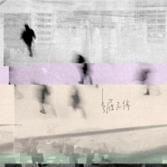
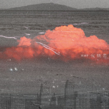
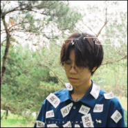
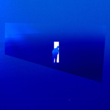
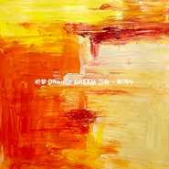
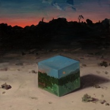
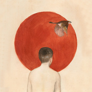
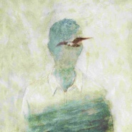

陈鸿宇
============================

|  |  |
| :--: | :-- |
| [ 陈鸿宇](https://i.xiami.com/chenhongyu) | **地区**: China 中国大陆 **风格**: 独立民谣 Indie Folk **播放数**: 104732894 **粉丝数**: 122744 **评论数**: 1784  |

## 档案

陈鸿宇，独立音乐人，众乐纪创始人。2015年创办音乐社群众乐纪，以固定每年的音乐合辑和每月的音乐演出为主，聚集喜欢音乐的人一起做跟音乐有关的事，2015出版了第一张合辑《众乐纪壹•迷城行歌》。2015年7月正式开始筹划制作首张个人专辑《浓烟下的诗歌电台》，是由陈鸿宇作曲，唐映枫作词，孙鹏吉他编曲的一张独立专辑，共七首歌，前后呼应，每首词中都容纳有下首的歌名，每首曲唱都在讲长故事的一章。 
三旬尚远浓烟散，一如年少迟夏归。 
感性与理性时常交融，收敛与放纵并行发生，我是陈鸿宇，很高兴认识你。 
--------------------------------------------- 
小档案 
中文名：陈鸿宇 
国籍：中国 
出生地：内蒙古呼伦贝尔 
出生日期：1989年1月18日 
职业：歌手 
代表作品：《浓烟下的诗歌电台》、《一如年少模样》、《理想三旬》、《行歌》、《早春的树》、《船子》 
毕业院校：内蒙古师范大学 
主要成就：2017年首届唱工委CMA音乐颁奖盛典年度最佳新人奖 
经纪：15160005011 
微博： http://www.weibo.com/hongyumao 
官淘： http://zhongyueji.taobao.com/ 
公号：陈鸿宇 
校园合作：pr@zhongyueji.com 
事务联络：c@zhongyueji.com 
从艺历程 
2015年，陈鸿宇创办了音乐组织“众乐纪”；之后，他开始征集歌词，并与唐映枫成为搭档，共同打造出了民谣歌曲《理想三旬》；同年，推出个人单曲《行歌》、《理想三旬》，收录于《众乐纪壹·迷城行歌》合辑中；同年7月7日，陈鸿宇正式开始在乐童网筹划制作首张个人专辑《浓烟下的诗歌电台》，这是一张全部由其作曲的独立专辑，而专辑全部曲目的歌词则由唐映枫负责创作 
2016年3月1日，推出首张个人音乐专辑《浓烟下的诗歌电台》，收录了包括《早春的树》、《理想三旬》等在内的7首歌曲以及2首吉他指弹曲；之后，与马雨阳举行“折腾”全国Live House搭车巡演；同年4月，凭借专辑《浓烟下的诗歌电台》入围“华语音乐传媒大奖”春季选优秀专辑奖；同年5月，受邀参加老狼在西安举办的专场演出，他也该演唱唯一受邀的表演嘉宾；同年6月，参加在扬州举办的“瓜洲音乐节”；同年6月10日，推出个人原创民谣单曲《船子》，收录于《民谣地图·拾众而歌》合辑中；同年7月9日，参加在黄山黟县举办的“首届西递音乐节”；同年10月8日，推出个人原创民谣单曲《额尔古纳》；同年10月18日，参加在天津举行的“草莓音乐节” 
2017年3月6日，推出第二张个人音乐专辑《一如年少模样》，收录了包括《还乡去》、《食味》等在内的7首歌曲；7月20日，获得首届唱工委CMA音乐颁奖盛典年度最佳新人奖，而专辑《浓烟下的诗歌电台》则获得最佳民谣专辑奖 
2018年，推出第3张个人原创专辑《与荒野》 
荣誉记录 
个人奖项 
2018年1月17日，其演唱的歌曲《一如年少模样》获得硬地围炉夜·2017云音乐原创盛典年度十大热门单曲奖。 
2017年7月20日，首届唱工委CMA音乐颁奖盛典年度最佳新人奖。 
2017年7月20日，首届唱工委CMA音乐颁奖盛典最佳民谣专辑奖。 
华语音乐传媒大奖 
2016-04 “华语音乐传媒大奖”春季选优秀专辑奖 浓烟下的诗歌电台 (提名)

## 专辑

| 名称 | 语种 | 唱片公司 | 发行时间 | 专辑类别 | 专辑风格 |
| :--: | :-- | :-- | :-- | :-- | :-- |
| [ 步履不停](./albums/5022379032.md) | 国语 | 众乐纪 | 2021年01月08日 | EP, 单曲 | 国语流行 Mandarin Pop |
| [ 火烧云](./albums/5022019241.md) | 国语 | 众乐纪 | 2020年11月30日 | EP, 单曲 | 国语流行 Mandarin Pop, 城市民谣 Urban Folk |
| [ 放空](./albums/5021228529.md) | 国语 | 众乐纪 | 2020年08月06日 | EP, 单曲 | 国语流行 Mandarin Pop, 民谣流行 Folk Pop |
| [ 理想三旬2019](./albums/2105714145.md) | 国语 | 众乐纪 | 2019年12月30日 | EP, 单曲 | 国语流行 Mandarin Pop |
| [ 三旬](./albums/2104823740.md) | 国语 | 夫吹万不同 | 2019年08月30日 | EP, 单曲 | 国语流行 Mandarin Pop |
| [ 众乐纪肆·光怪陆离](./albums/2104317515.md) | 国语 | 众乐纪 | 2018年12月04日 | 合集, 杂锦 |  |
| [ 橙梦](./albums/2104173583.md) | 国语 | 易柏文化 | 2018年11月03日 | EP, 单曲 | 国语流行 Mandarin Pop, 华语唱作人 Chinese Singer-Songwriter |
| [ 与荒野](./albums/2103603621.md) | 国语 | 众乐纪 | 2018年03月12日 | EP, 单曲 | 独立民谣 Indie Folk, 民谣流行 Folk Pop |
| [ 归还](./albums/2103615165.md) | 英语 | 看见音乐 (上海) | 2018年03月12日 | EP, 单曲 | 民谣 Folk |
| [ 鱼书](./albums/2102970371.md) | 国语 | 众乐纪 | 2017年12月07日 | EP, 单曲 | 民谣流行 Folk Pop |
| [ 一如年少模样](./albums/2102404596.md) | 国语 | 众乐纪 | 2017年03月06日 | 录音室专辑 | 当代民谣 Contemporary Folk, 独立民谣 Indie Folk |
| [ 别送我](./albums/2102688759.md) | 国语 | 亭东影业 | 2017年02月05日 | EP, 单曲 | 民谣流行 Folk Pop |
| [ 浓烟下的诗歌电台](./albums/1527526201.md) | 国语 | 众乐纪 | 2016年03月01日 | 录音室专辑 | 独立民谣 Indie Folk, 民谣流行 Folk Pop, 当代民谣 Contemporary Folk |

## 评论

|  |  |  |
| :-- | :-- | :-- |
|  [虾米用户](https://emumo.xiami.com/u/43065773) music and su... 2021-01-30 12:32 赞(0) 踩(0) | 
加油
 |
|  [虾米用户](https://emumo.xiami.com/u/18343501)  2021-01-18 20:51 赞(0) 踩(0) | 
生日快乐
 |
|  [虾米用户](https://emumo.xiami.com/u/607846) my way or th... 2021-01-18 13:27 赞(0) 踩(0) | 
生日快乐会在其他平台继续关注着你
 |
|  [虾米用户](https://emumo.xiami.com/u/188213706)  2021-01-18 12:04 赞(0) 踩(0) | 
祝你生日快乐  From虾米用户
 |
|  [虾米用户](https://emumo.xiami.com/u/342799965)  2021-01-18 11:31 赞(0) 踩(0) | 
生日快乐！多唱点好歌非常爱听(⑉&amp;deg;з&amp;deg;)-♡
 |
|  [虾米用户](https://emumo.xiami.com/u/25823498) 音乐不停，生命不止。 2021-01-18 11:30 赞(0) 踩(0) | 
陈叔生日快乐鸭！
 |
|  [虾米用户](https://emumo.xiami.com/u/49568487) 终 2021-01-18 10:32 赞(0) 踩(0) | 
生日快乐 6天后是我生日 摩羯座♑️
 |
|  [虾米用户](https://emumo.xiami.com/u/307889505)  2021-01-18 10:28 赞(0) 踩(0) | 
陈叔 生日快乐！
 |
|  [虾米用户](https://emumo.xiami.com/u/46850208) 暂无签名~ 2021-01-18 10:26 赞(1) 踩(0) | 
生日快乐 愿你三旬过后 仍遇到相似的灵魂
 |
|  [虾米用户](https://emumo.xiami.com/u/365919133) 未来可期 2021-01-18 10:22 赞(0) 踩(0) | 
今天是生日吗？祝你生日快乐，每天快乐；远离喧嚣，保持初心。那些直击人心的温柔曲调，娓娓道来的独特嗓音，单曲循环的一首歌，就是一路陪伴的那个人。虾米不再有，可是陈鸿宇会陪伴我们一直走下去，对吗？
 |
|  [虾米用户](https://emumo.xiami.com/u/245476570)  2021-01-18 10:21 赞(0) 踩(0) | 
陈叔生快
 |
|  [虾米用户](https://emumo.xiami.com/u/412056614) ٩(ˊ〇ˋ*)و 2021-01-18 10:20 赞(0) 踩(0) | 
生日快乐
 |
|  [虾米用户](https://emumo.xiami.com/u/41360741) 更高处见 2021-01-18 10:19 赞(0) 踩(0) | 
生日快乐
 |
|  [虾米用户](https://emumo.xiami.com/u/446547935)  2021-01-18 10:18 赞(1) 踩(0) | 
喜欢你的第6年，麻烦您抓紧时间找一个女朋友。
 |
|  [虾米用户](https://emumo.xiami.com/u/227663154) 保持追求 2021-01-18 10:18 赞(0) 踩(0) | 
！！！生日快乐！！！
 |
|  [虾米用户](https://emumo.xiami.com/u/100032950)  2021-01-18 10:17 赞(1) 踩(0) | 
生日快乐
 |
|  [虾米用户](https://emumo.xiami.com/u/356571593) enn~ 2021-01-18 10:16 赞(0) 踩(0) | 
很高兴认识你
 |
|  [虾米用户](https://emumo.xiami.com/u/446547935)  2021-01-18 10:16 赞(0) 踩(0) | 
老陈生日快乐呀
 |
|  [虾米用户](https://emumo.xiami.com/u/356571593) enn~ 2021-01-18 10:15 赞(1) 踩(0) | 
阿陈，生日快乐
 |
|  [虾米用户](https://emumo.xiami.com/u/43119545) 继续前行 2021-01-18 10:11 赞(1) 踩(0) | 
感谢有你，愿你安好，佳作不断，常伴吾身  触及这段时光的灵魂
 |
|  [虾米用户](https://emumo.xiami.com/u/277441050)  2021-01-18 10:11 赞(0) 踩(0) | 
生日快乐，我最喜欢的陈叔，永远二十赶朝暮
 |
|  [虾米用户](https://emumo.xiami.com/u/49651710) I"m OK 2021-01-18 10:10 赞(0) 踩(0) | 
简简单单的一句生日快乐呀！！
 |
|  [虾米用户](https://emumo.xiami.com/u/266083919)  2021-01-18 10:09 赞(0) 踩(0) | 
生日快乐啊，希望你可以多多发专辑，多多开演唱会，总之，希望你开心，快乐，什么都是多多益善
 |
|  [虾米用户](https://emumo.xiami.com/u/290798502) 理智与克制让人着迷 2021-01-18 10:07 赞(1) 踩(0) | 
嘿  喜欢你好久了，也会一直喜欢你。前几天在虾米看见了你的公告，怅然与失落，但你还在做你的音乐，我依然爱你的歌，无论在哪，山水有相逢。生日快乐
 |
|  [虾米用户](https://emumo.xiami.com/u/31817800)  2021-01-18 10:07 赞(1) 踩(0) | 
生日快乐呀
 |
|  [虾米用户](https://emumo.xiami.com/u/30458975)  2021-01-18 10:05 赞(0) 踩(0) | 
来了
 |
|  [虾米用户](https://emumo.xiami.com/u/328705263) 我还没想好要写什么... 2021-01-18 07:58 赞(0) 踩(0) | 
今天因你而特别
 |
|  [虾米用户](https://emumo.xiami.com/u/36500485)  2021-01-13 23:30 赞(0) 踩(0) | 
曲调有石家庄人的感觉
 |
|  [虾米用户](https://emumo.xiami.com/u/335099015) 梧桐吹散我的四月。 2021-01-09 23:47 赞(0) 踩(0) | 
收到啦
 |
|  [虾米用户](https://emumo.xiami.com/u/826005) 念念不忘，必有回响 2021-01-07 01:18 赞(0) 踩(0) | 
公告栏在哪里
 |
| ⇒ |  [虾米用户](https://emumo.xiami.com/u/441496157) 小豆豆加油鸭。 2021-01-07 12:46 赞(0) 踩(0) | 
哈哈哈，果然大家都是从微博来找的。
 |
|  [虾米用户](https://emumo.xiami.com/u/365919133) 未来可期 2021-01-06 18:45 赞(2) 踩(0) | 
昨天收到了陈鸿宇的私信，虽然知道不是专门给我写的，但是却感觉他离我那么近。虾米的离开，不仅仅是音乐人的失落，更是我们的自由音乐时代落幕。好难过，不知道说什么好，希望大家一切都好吧
 |
|  [虾米用户](https://emumo.xiami.com/u/446533212)  2021-01-06 18:06 赞(0) 踩(0) | 
很爱这首歌啊籍籍无名的怀
 |
|  [虾米用户](https://emumo.xiami.com/u/45742112) 哎呦哎呦喂 2021-01-06 00:51 赞(1) 踩(0) | 
你好，我在虾米最钟情的人。我和你一样感伤。
 |
|  [虾米用户](https://emumo.xiami.com/u/5421244) 爱音乐的人不会老 2021-01-06 00:14 赞(2) 踩(0) | 
再不见那夜里 听歌的小孩
 |
|  [虾米用户](https://emumo.xiami.com/u/3898407) 签名在背上 2021-01-06 00:12 赞(0) 踩(0) | 
再见 
 |
|  [虾米用户](https://emumo.xiami.com/u/40062493) I just want ... 2021-01-06 00:01 赞(3) 踩(0) | 
再见，理想三旬。
 |
| ⇒ |  [虾米用户](https://emumo.xiami.com/u/10291196)  2021-01-06 00:02 赞(0) 踩(0) | 
不说再见
 |
|  [虾米用户](https://emumo.xiami.com/u/245280261) 要能做到:不以物喜不以己... 2021-01-05 23:59 赞(39) 踩(0) | 
大家有收到他发的信息吗
 |
| ⇒ |  [虾米用户](https://emumo.xiami.com/u/10291196)  2021-01-06 00:00 赞(0) 踩(0) | 
没有，公告栏在哪里查看
 |
| ⇒ |  [虾米用户](https://emumo.xiami.com/u/42893985) 硪似一条闲鱼 2021-01-06 00:04 赞(0) 踩(0) | 
我以为只发给了我 
 |
| ⇒ |  [虾米用户](https://emumo.xiami.com/u/338668) 意识流 2021-01-06 00:31 赞(0) 踩(0) | 
收到了，百感交集
 |
| ⇒ |  [虾米用户](https://emumo.xiami.com/u/223354) 一天不听。。浑身不舒坦。... 2021-01-06 01:16 赞(0) 踩(0) | 
收到了
 |
| ⇒ |  [虾米用户](https://emumo.xiami.com/u/45258865)   2021-01-06 01:36 赞(0) 踩(0) | 
有弹幕，没看到详情
 |
| ⇒ |  [虾米用户](https://emumo.xiami.com/u/272222124) 哈哈哈哈哈哈哈哈哈哈哈 2021-01-06 01:50 赞(0) 踩(0) | 
说了什么啊，我不清楚在哪里看
 |
| ⇒ |  [虾米用户](https://emumo.xiami.com/u/248553719)   2021-01-06 07:49 赞(0) 踩(0) | 
<q><b>花生酱猎鹰说：</b></q>
 |
| ⇒ |  [虾米用户](https://emumo.xiami.com/u/245280261) 要能做到:不以物喜不以己... 2021-01-06 09:26 赞(0) 踩(0) | 
<q><b>大鲨鱼说：</b></q>
 |
| ⇒ |  [虾米用户](https://emumo.xiami.com/u/245280261) 要能做到:不以物喜不以己... 2021-01-06 09:26 赞(0) 踩(0) | 
<q><b>K说：</b></q>
 |
| ⇒ |  [虾米用户](https://emumo.xiami.com/u/26708040) 不听歌会死 2021-01-06 20:50 赞(0) 踩(0) | 
没有了虾米感觉像是没了净土
 |
| ⇒ |  [虾米用户](https://emumo.xiami.com/u/1567446) 谁跟我听歌？ 2021-01-12 14:18 赞(0) 踩(0) | 
是公告信息
 |
|  [虾米用户](https://emumo.xiami.com/u/343607023)  2020-11-22 23:59 赞(0) 踩(0) | 
百听不厌
 |
|  [虾米用户](https://emumo.xiami.com/u/443969188) 我还没想好要写什么... 2020-11-20 09:54 赞(0) 踩(0) | 
歌神
 |
|  [虾米用户](https://emumo.xiami.com/u/276944698) 不要自我设限..... 2020-09-03 13:06 赞(0) 踩(0) | 
✔️✔️✔️
 |
|  [虾米用户](https://emumo.xiami.com/u/405956664) 从此，我也是个大山里的一... 2020-07-16 22:10 赞(0) 踩(0) | 
因为喜欢一个女生，我开始婷你的歌了
 |
|  [虾米用户](https://emumo.xiami.com/u/441486649)  2020-07-15 07:58 赞(0) 踩(0) | 
多些原创！！！
 |
|  [虾米用户](https://emumo.xiami.com/u/420006938)  2020-05-30 22:37 赞(1) 踩(0) | 
陈先生竟然听自己的歌
 |
|  [虾米用户](https://emumo.xiami.com/u/441508110) love，我很爱你，喊我... 2020-05-04 10:32 赞(1) 踩(0) | 
快快快告诉我怎么嫁给他
 |
|  [虾米用户](https://emumo.xiami.com/u/300002591)  2020-03-21 17:00 赞(0) 踩(0) | 
理想三旬的死忠粉
 |
|  [虾米用户](https://emumo.xiami.com/u/48043458)  2020-03-13 18:48 赞(0) 踩(0) | 
很喜欢你的音乐，加油，希望以后多为我们带来这么棒的音乐
 |
|  [虾米用户](https://emumo.xiami.com/u/49574663) 你 愛 了 整 個 宇 ... 2020-03-13 01:14 赞(2) 踩(0) | 
我高一的时候陈鸿宇还没火 给当时的自诩喜欢民谣的好朋友安利理想三旬 他说：难听。高三陈鸿宇火了 理想三旬火了 他每天嘴里就是唱理想三旬 网名都改成理想三旬。我就把他删了再也没联系过。我欢喜喜欢的唱作者有成就 但我不喜欢不带思考不带欣赏只一味跟风的人。最后说一句 今年我一定要看live
 |
|  [虾米用户](https://emumo.xiami.com/u/1004132) 比较挑食的杂食党 2020-03-09 21:20 赞(1) 踩(0) | 
我一个最讨厌民谣的人居然会觉得他的歌超好听！！！不，准确说喜欢的不是他的歌，而是他的嗓音。更准确的说不止是嗓音，而是外貌和声音形成的反差萌！！！
 |
|  [虾米用户](https://emumo.xiami.com/u/332113500) 矫情的儒雅小孩 2020-03-04 13:43 赞(2) 踩(0) | 
我喜欢陈老师的歌曲，细腻理性。为陈老师打call    o(^o^)o
 |
|  [虾米用户](https://emumo.xiami.com/u/330514264) 痴迷音乐 2020-01-19 23:03 赞(1) 踩(0) | 
太喜欢啦
 |
|  [虾米用户](https://emumo.xiami.com/u/321273074) 努力朝着有你的方向前进 2020-01-18 22:39 赞(1) 踩(0) | 
谢谢你的理想三旬带给我的力量
 |
|  [虾米用户](https://emumo.xiami.com/u/40572679)  2020-01-18 21:08 赞(0) 踩(0) | 
陈叔生日快乐
 |
|  [虾米用户](https://emumo.xiami.com/u/334597385) 情不知所起，一往而情深。 2020-01-18 12:12 赞(0) 踩(0) | 
hi老陈，听你的歌俩年了，关注你一年多了，我很喜欢听你唱歌，谢谢你带来如此动听的歌声，生日快乐。
 |
|  [虾米用户](https://emumo.xiami.com/u/271197607) 你要爱荒野上的风声，胜过... 2020-01-18 10:40 赞(1) 踩(0) | 
愿三旬过，实现理想。
 |
|  [虾米用户](https://emumo.xiami.com/u/337196587)   2020-01-18 10:11 赞(0) 踩(0) | 
生日粗卡思密达 
 |
|  [虾米用户](https://emumo.xiami.com/u/316261284) 到最后…… 2020-01-18 10:06 赞(3) 踩(0) | 
昨天有人告诉我今天是周杰伦的生日。 收到虾米通知才知道竟然也是陈鸿宇的生日。  忘了从哪里看的，陈鸿宇+唐映枫就像周杰伦+方文山。  还蛮巧的。
 |
|  [虾米用户](https://emumo.xiami.com/u/330538643) 不要回头，回头是土 2019-11-17 18:05 赞(0) 踩(0) | 
而已嘛 泌尿
 |
|  [虾米用户](https://emumo.xiami.com/u/177840360)  2019-11-13 22:10 赞(0) 踩(0) | 
低音更适合独白述说 自己也是32的大叔了 喜欢这种沧桑点的歌声 
 |
|  [虾米用户](https://emumo.xiami.com/u/9478491) 舌尖紋了瑪利亞 2019-11-01 00:28 赞(0) 踩(0) | 

 |
|  [虾米用户](https://emumo.xiami.com/u/38363099)  2019-10-28 13:43 赞(0) 踩(0) | 
非常喜欢
 |
|  [虾米用户](https://emumo.xiami.com/u/29867480)   2019-10-24 17:54 赞(1) 踩(0) | 
听了快四年，爱死了这把嗓子
 |
|  [虾米用户](https://emumo.xiami.com/u/429115683) 你是我患得患失的梦   ... 2019-09-17 21:28 赞(0) 踩(0) | 
觉得陈叔长的像只小熊猫☺☺☺☺☺☺(๑•ั็ω•็ั๑)贼可爱
 |
|  [虾米用户](https://emumo.xiami.com/u/327044849) 虾迷 2019-09-01 21:59 赞(1) 踩(0) | 
有经历有沧桑
 |
|  [虾米用户](https://emumo.xiami.com/u/104395674) 我还没想好要写什么... 2019-08-23 17:30 赞(3) 踩(0) | 
陈鸿宇请立刻跟我发生关系
 |
|  [虾米用户](https://emumo.xiami.com/u/41234711)  2019-07-30 12:55 赞(2) 踩(0) | 
喜欢的声音，可以让人心平气和
 |
|  [虾米用户](https://emumo.xiami.com/u/247220286) 恋什么爱 你高山 我深海 2019-07-12 10:36 赞(0) 踩(0) | 
al ，  n'monwanmo babwawwom
 |
|  [虾米用户](https://emumo.xiami.com/u/426768063)  2019-07-01 14:35 赞(2) 踩(0) | 
语言那么简单，却很容易得走进心里，不知道是我们长大了，还是民谣强大了 
 |
|  [虾米用户](https://emumo.xiami.com/u/31698261) 幸好有音乐… 2019-06-30 08:02 赞(3) 踩(0) | 
不经意间听到你的歌，就猛然理解什么叫做遇见相似的灵魂了
 |
|  [虾米用户](https://emumo.xiami.com/u/426093925)  2019-06-29 14:39 赞(0) 踩(0) | 
喜欢陈鸿宇因为是他最喜欢的歌手
 |
|  [虾米用户](https://emumo.xiami.com/u/27703188)  2019-06-01 12:22 赞(0) 踩(0) | 
很好很有才
 |
|  [虾米用户](https://emumo.xiami.com/u/123246788) Music is my ... 2019-04-29 20:23 赞(2) 踩(0) | 
真好听！  
 |
|  [虾米用户](https://emumo.xiami.com/u/4162264) ch3.red/mp3 2019-04-29 17:51 赞(0) 踩(0) | 
和公司名一样 好奇进来一看 质量还不错 有点慵懒风 可以尝试换下风格  &amp;ldquo;努力 奋斗&amp;rdquo;
 |
|  [虾米用户](https://emumo.xiami.com/u/5045815) 终有一天猫狗双全 2019-04-01 16:19 赞(0) 踩(0) | 
对这种声音一点儿免疫都没有
 |
|  [虾米用户](https://emumo.xiami.com/u/49608367) 风再大都绕过我的灵魂 2019-03-25 13:09 赞(1) 踩(0) | 
2015年，高三的我在美术集训，知道了陈鸿宇。现在再来听三年前的听的歌，还是喜欢。
 |
|  [虾米用户](https://emumo.xiami.com/u/218977293)  2019-03-24 10:31 赞(4) 踩(0) | 
听声音以为是大叔，看模样竟是少年，这反差太大了，不过我喜欢  希望陈叔能一直唱自己喜欢的歌，能一直唱给喜欢的人听 
 |
| ⇒ |  [虾米用户](https://emumo.xiami.com/u/419760642) 虽然我地理不好，但我知道... 2019-04-06 10:29 赞(0) 踩(0) | 

 |
| ⇒ |  [虾米用户](https://emumo.xiami.com/u/419760642) 虽然我地理不好，但我知道... 2019-04-06 10:29 赞(0) 踩(0) | 

 |
|  [虾米用户](https://emumo.xiami.com/u/420972472)  2019-03-22 21:10 赞(0) 踩(0) | 
不像是本尊留言，还是过来看看吧。最近粮食是民谣。
 |
|  [虾米用户](https://emumo.xiami.com/u/420636495) 在路上 2019-03-08 12:19 赞(0) 踩(0) | 
车里一直听你的歌
 |
|  [虾米用户](https://emumo.xiami.com/u/417416956)  2019-03-05 06:10 赞(0) 踩(0) | 
喜欢
 |
|  [虾米用户](https://emumo.xiami.com/u/322099473) 嗯哼我很好 2019-02-23 22:48 赞(2) 踩(0) | 
他的低音炮嗓音真的好苏！！ 明明长着一张小奶狗般的脸，却有霸道总裁音，惹~我受不了了，好喜欢啊怎么办
 |
|  [虾米用户](https://emumo.xiami.com/u/273834246) 哈哈哈哈啊哈哈 2019-02-14 12:24 赞(0) 踩(0) | 
有颜值，会唱歌 
 |
|  [虾米用户](https://emumo.xiami.com/u/408889070) 往来都擦肩 2019-02-10 15:41 赞(0) 踩(0) | 
有才华有颜值
 |
|  [虾米用户](https://emumo.xiami.com/u/303506160) 因为我对你爱的深沉 2019-01-30 00:02 赞(1) 踩(0) | 
嘿呦
 |
|  [虾米用户](https://emumo.xiami.com/u/413533619)  2019-01-27 18:53 赞(0) 踩(0) | 
觉得我们是相似的人
 |
|  [虾米用户](https://emumo.xiami.com/u/269283902) 人的迷茫很锋利   但坚... 2019-01-18 22:57 赞(0) 踩(0) | 
生日快乐 万事顺意
 |
|  [虾米用户](https://emumo.xiami.com/u/30877419)  2019-01-18 22:45 赞(1) 踩(0) | 
你的歌很好听，多出专辑呀  生日快乐
 |
|  [虾米用户](https://emumo.xiami.com/u/26035664) 我要的自由，我要的爱…… 2019-01-18 22:20 赞(1) 踩(0) | 
三生有幸，此声有你！
 |
|  [虾米用户](https://emumo.xiami.com/u/26035664) 我要的自由，我要的爱…… 2019-01-18 22:19 赞(0) 踩(0) | 
你让我体会到什么是真正的开口跪。 这辈子听到这个声音，真是三生有幸。 更幸运的是，这个声音唱的竟然都是我喜欢的！ 生日快乐！
 |
|  [虾米用户](https://emumo.xiami.com/u/52756663)  但行好事 莫问前程 2019-01-18 18:29 赞(0) 踩(0) | 
能休息就休息 能喝就多喝点 吃吃睡睡 惬意就好
 |
|  [虾米用户](https://emumo.xiami.com/u/248853009)  2019-01-18 16:05 赞(0) 踩(0) | 
这样的男生挺好看的，声音也好听
 |
|  [虾米用户](https://emumo.xiami.com/u/204564350) 别靠近 靠近就别轻易走 2019-01-18 12:16 赞(0) 踩(0) | 
生日快乐呜呜 希望自己以后能碰见跟你一样呀优秀的人
 |
|  [虾米用户](https://emumo.xiami.com/u/120918630) 在百转柔肠间，一天天地冷... 2019-01-18 11:13 赞(0) 踩(0) | 
生日快乐 ♡
 |
|  [虾米用户](https://emumo.xiami.com/u/23263830) 我还没想好要写什么... 2019-01-18 10:41 赞(0) 踩(0) | 
陈叔，生日快乐！
 |
|  [虾米用户](https://emumo.xiami.com/u/255113433) 做个温暖的人 2019-01-18 10:17 赞(0) 踩(0) | 
生日快乐鸭叔
 |
|  [虾米用户](https://emumo.xiami.com/u/18042974)  2019-01-18 10:15 赞(0) 踩(0) | 
哟哟哟哟生快
 |
|  [虾米用户](https://emumo.xiami.com/u/55470787) 要不要跟我一起改变世界？ 2019-01-18 10:10 赞(0) 踩(0) | 
生日快乐
 |
|  [虾米用户](https://emumo.xiami.com/u/407636409)  2019-01-18 10:08 赞(0) 踩(0) | 
生日快乐
 |
|  [虾米用户](https://emumo.xiami.com/u/3129884) 一别两宽，各生欢喜 2019-01-18 10:07 赞(0) 踩(0) | 
生快。那个、歌曲质量有些下降啊。请加油 
 |
|  [虾米用户](https://emumo.xiami.com/u/309005403) 么得脾气，是个杀手 2019-01-18 10:04 赞(0) 踩(0) | 
生日快乐呀！！！！
 |
|  [虾米用户](https://emumo.xiami.com/u/70968854) The nobodies... 2019-01-18 10:03 赞(0) 踩(0) | 
生日快乐！
 |
|  [虾米用户](https://emumo.xiami.com/u/40812290) 简单快乐 2019-01-18 10:02 赞(0) 踩(0) | 
生日快乐
 |
|  [虾米用户](https://emumo.xiami.com/u/11090297) 暂无签名~ 2019-01-18 10:02 赞(0) 踩(0) | 
生日快乐 你是1月18号，我是1月8号 哈哈～
 |
|  [虾米用户](https://emumo.xiami.com/u/269221008)  2019-01-18 10:01 赞(0) 踩(0) | 
陈叔生日快乐 来年会更好
 |
|  [虾米用户](https://emumo.xiami.com/u/411809949) 我还没想好要写什么... 2019-01-16 11:06 赞(0) 踩(0) | 
非常喜欢你 加油！~~
 |
|  [虾米用户](https://emumo.xiami.com/u/10303763)  2019-01-07 14:43 赞(0) 踩(0) | 
陈鸿宇做小团伙想学马頔，可一不小心学成了薛之谦 
 |
|  [虾米用户](https://emumo.xiami.com/u/252559323)  2019-01-04 10:53 赞(0) 踩(0) | 
听哭了，《行歌》……
 |
|  [虾米用户](https://emumo.xiami.com/u/409750994)  2019-01-03 01:57 赞(1) 踩(0) | 
我是外国人。可能我看不懂全歌词的意思，可是我超喜欢理想三旬。感谢你的音乐，感谢你。让我在那么热闹的生活找到了非常平安的地方。
 |
|  [虾米用户](https://emumo.xiami.com/u/316261284) 到最后…… 2019-01-02 09:43 赞(0) 踩(0) | 
一年 又来听你。或许骨子里喜欢的东西不会轻易改变吧。
 |
|  [虾米用户](https://emumo.xiami.com/u/411474652)  2018-12-30 15:34 赞(0) 踩(0) | 
不咋地呀
 |
|  [虾米用户](https://emumo.xiami.com/u/269705026)  2018-12-28 17:02 赞(0) 踩(0) | 
旋律，歌词，配音，人声~~都恰好
 |
|  [虾米用户](https://emumo.xiami.com/u/304044531) 最美好的期待留给自己 2018-12-28 11:39 赞(1) 踩(0) | 
真好真好
 |
|  [虾米用户](https://emumo.xiami.com/u/409464215)  2018-12-07 12:33 赞(1) 踩(0) | 
偶然听到理想三旬，然后就循环了，嗓音和歌词有毒，毒已渗进血液了
 |
|  [虾米用户](https://emumo.xiami.com/u/380337360)  2018-12-05 20:43 赞(0) 踩(0) | 
陈哥声音太好听
 |
|  [虾米用户](https://emumo.xiami.com/u/364650226) 自先沉稳  而后爱人 2018-12-05 00:16 赞(0) 踩(0) | 
放纵改成发散
 |
|  [虾米用户](https://emumo.xiami.com/u/46280636) 生活中快乐的事还有很多，... 2018-11-26 19:26 赞(1) 踩(0) | 
来自内蒙古的CH先生推荐的歌者，CH先生是我很欣赏的类型，他推荐的歌者也深得我心。CH先生生日是8月11号，我的生日是11月8号，歌者生日是1月18号。我想哪一天，或许我们，可以，在一起。
 |
|  [虾米用户](https://emumo.xiami.com/u/404489098)  2018-11-26 08:04 赞(0) 踩(0) | 
理想三旬
 |
| ⇒ |  [虾米用户](https://emumo.xiami.com/u/409013315)  2018-12-01 15:49 赞(0) 踩(0) | 
方云 
 |
|  [虾米用户](https://emumo.xiami.com/u/3309841)  2018-11-02 17:18 赞(0) 踩(0) | 
什么时候来深圳开演唱会啊 
 |
|  [虾米用户](https://emumo.xiami.com/u/357036933) 我还没想好要写什么... 2018-10-25 16:19 赞(0) 踩(0) | 
喜欢你
 |
|  [虾米用户](https://emumo.xiami.com/u/403579817) 我还没想好要写什么...... 2018-10-22 00:02 赞(1) 踩(0) | 
还没想好写什么，但是很喜欢你的音乐。
 |
|  [虾米用户](https://emumo.xiami.com/u/280508091)  2018-10-13 20:38 赞(1) 踩(0) | 
我喜欢
 |
|  [虾米用户](https://emumo.xiami.com/u/325640649)  2018-10-07 16:05 赞(4) 踩(0) | 
好听到打字发抖
 |
|  [虾米用户](https://emumo.xiami.com/u/335243292) 心远地自偏 2018-10-02 20:32 赞(3) 踩(0) | 
(ง &amp;bull;̀_&amp;bull;́)ง
 |
|  [虾米用户](https://emumo.xiami.com/u/353401725)  2018-10-01 02:35 赞(3) 踩(0) | 
10.3我去南京见你
 |
|  [虾米用户](https://emumo.xiami.com/u/289040873)  2018-09-27 05:02 赞(6) 踩(0) | 
虽然还没到30，但是经历不少 好听，就是一首歌最少4根烟
 |
|  [虾米用户](https://emumo.xiami.com/u/763369)  2018-09-27 00:12 赞(2) 踩(0) | 
女友推荐的 
 |
|  [虾米用户](https://emumo.xiami.com/u/404700969)  2018-09-23 10:11 赞(2) 踩(0) | 
唱得很好听，继续加油，有空来江西唱啊，会去捧场的。
 |
|  [虾米用户](https://emumo.xiami.com/u/113208140)  2018-09-16 10:14 赞(2) 踩(0) | 
他们都不希望你火，但我希望
 |
|  [虾米用户](https://emumo.xiami.com/u/167244920) 愿你出走半生，归来还是少... 2018-09-14 13:59 赞(2) 踩(0) | 
愿你出走半生，归来还是少年。愿你即便风沙漫天，荆棘缠身，却仍有繁花相拥，耀眼星辰。愿你知世故，而不世故
 |
|  [虾米用户](https://emumo.xiami.com/u/167244920) 愿你出走半生，归来还是少... 2018-09-14 13:59 赞(2) 踩(0) | 
因为嗓音而停下听歌，因为歌曲而深入知人。幸运。沉迷。不知道未来怎么样，来的多么晚，了解多么少，就歌而言，我很喜欢
 |
|  [虾米用户](https://emumo.xiami.com/u/7408939) 活着可真麻烦。 2018-09-13 16:11 赞(2) 踩(0) | 
我不敢去听陈叔现场，怕自己蜷缩在深沉的创口贴中心再爬不起来，因为对那种刻意的押韵既讨厌又欢喜，更因为自己的穷和懒。
 |
|  [虾米用户](https://emumo.xiami.com/u/325960302)  2018-09-09 20:12 赞(2) 踩(0) | 
我是印尼華僑，從小被爸爸逼學華語，現在真的很感謝爸爸的教育，你的這首歌真的真的很喜歡
 |
|  [虾米用户](https://emumo.xiami.com/u/343221220)  2018-09-08 01:24 赞(1) 踩(0) | 
來台灣巡演好嗎，算我求你了
 |
|  [虾米用户](https://emumo.xiami.com/u/196495718)  2018-09-05 15:40 赞(1) 踩(0) | 
这嗓音很迷人。就是不看真人照片。我只想在脑袋里天马行空这么迷人的声音和我所绘的绝世美颜。
 |
|  [虾米用户](https://emumo.xiami.com/u/303506160) 因为我对你爱的深沉 2018-08-29 02:03 赞(1) 踩(0) | 
嘿呦
 |
|  [虾米用户](https://emumo.xiami.com/u/49574663) 你 愛 了 整 個 宇 ... 2018-08-28 19:37 赞(2) 踩(0) | 
从您两千粉开始喜欢您 现在十一万粉了呜呜呜我好开心 我那会儿疯狂向身边人安利您 因为那时候小众 所以身边人都不太听 现在火了 一个个个签都挂您的理想三旬 不爽但是 好开心 真的！呜呜呜太开心了 
 |
|  [虾米用户](https://emumo.xiami.com/u/311087958)  2018-08-16 21:30 赞(0) 踩(0) | 
加油带哥 你是粉丝的骄傲
 |
|  [虾米用户](https://emumo.xiami.com/u/292015691)   2018-08-11 16:08 赞(0) 踩(0) | 
偶遇到的歌，居然这么好听'！关注这个人了！
 |
|  [虾米用户](https://emumo.xiami.com/u/20807070)  2018-08-09 16:52 赞(0) 踩(0) | 
声音惊艳，太好听
 |
|  [虾米用户](https://emumo.xiami.com/u/272360683) 我走不到那个我曾想去的远... 2018-08-08 10:46 赞(2) 踩(0) | 
三旬到了 一生也到了
 |
|  [虾米用户](https://emumo.xiami.com/u/346886060)  2018-08-06 21:34 赞(0) 踩(0) | 
广告做的不行呀！
 |
|  [虾米用户](https://emumo.xiami.com/u/54499485)  2018-06-26 13:09 赞(0) 踩(0) | 
百听不厌
 |
|  [虾米用户](https://emumo.xiami.com/u/38168812) 他人即是地狱 2018-06-24 22:11 赞(0) 踩(0) | 
太有磁性的声音让人心动 感动 激动 然后沉浸在你的音乐里
 |
|  [虾米用户](https://emumo.xiami.com/u/355674326)  2018-06-14 17:18 赞(0) 踩(0) | 
a亲
 |
|  [虾米用户](https://emumo.xiami.com/u/265690440) 人走茶凉，故事还长。 2018-06-13 12:11 赞(0) 踩(0) | 
是我喜欢的声音，是我喜欢的旋律，还好遇见你，鸿宇大叔。
 |
|  [虾米用户](https://emumo.xiami.com/u/54820229) 两年了 2018-06-12 13:50 赞(1) 踩(0) | 
我为什么以为他是个粤语歌手
 |
|  [虾米用户](https://emumo.xiami.com/u/47042129)   2018-06-12 11:25 赞(1) 踩(0) | 
特别喜欢他 怎么粉丝才11万
 |
|  [虾米用户](https://emumo.xiami.com/u/351416293) 我还没想好要写什么... 2018-06-11 03:04 赞(0) 踩(0) | 
词很动人
 |
|  [虾米用户](https://emumo.xiami.com/u/298385760)  2018-06-07 19:29 赞(0) 踩(0) | 
还是更喜欢你在网易云。虾米这边&amp;hellip;&amp;hellip;心疼我叔
 |
|  [虾米用户](https://emumo.xiami.com/u/5980403) 安康 2018-06-07 16:53 赞(0) 踩(0) | 
听声音那么低沉，一看相片竟然是小生。 
 |
|  [虾米用户](https://emumo.xiami.com/u/285049473) 剛拿起酒杯想和你碰杯 才... 2018-06-06 19:41 赞(0) 踩(0) | 
性感
 |
|  [虾米用户](https://emumo.xiami.com/u/252936654) Oh,please Mr... 2018-06-02 17:47 赞(0) 踩(0) | 
想知道你的曲子用口琴吹出来是什么样的感觉 ，立马试试 
 |
|  [虾米用户](https://emumo.xiami.com/u/291468673)  神经质。 2018-05-30 12:14 赞(2) 踩(0) | 
天啊！先生竟然这么文静书生啊！！不然一丝纤尘的气质！爱上了！！
 |
|  [虾米用户](https://emumo.xiami.com/u/347892676)  2018-05-19 19:59 赞(1) 踩(0) | 
16年夏至今，而后一如既往，毕竟能劝住烦心的嗓音不多 
 |
|  [虾米用户](https://emumo.xiami.com/u/332584829)  2018-05-18 23:37 赞(0) 踩(0) | 
居然长这个样子？！和声音不合啊
 |
|  [虾米用户](https://emumo.xiami.com/u/328931081) 在“爱与成长”至死方休的... 2018-05-10 19:21 赞(0) 踩(0) | 
同岁，来自同一个故乡额尔古纳，听音乐也有一种感同身受，我如今在你上大学的城市在工作。
 |
|  [虾米用户](https://emumo.xiami.com/u/43838497) 陈奕迅神经研究所 2018-05-01 13:03 赞(0) 踩(0) | 
上海草莓音乐节见 
 |
|  [虾米用户](https://emumo.xiami.com/u/6750080)  2018-04-29 23:18 赞(0) 踩(0) | 
3月份有幸目睹这位哥的现场，让我知道什么是民谣。恩，回家耳朵痛，有 毒。。
 |
|  [虾米用户](https://emumo.xiami.com/u/354305100)  2018-04-28 13:09 赞(0) 踩(0) | 
长得像个小哥哥，听声音像大叔  好喜欢你啊偷偷亲一个
 |
|  [虾米用户](https://emumo.xiami.com/u/266466132)  2018-04-26 20:48 赞(0) 踩(0) | 
网易跑来的
 |
|  [虾米用户](https://emumo.xiami.com/u/359701457)  2018-04-24 12:12 赞(0) 踩(0) | 
陈叔。陈叔
 |
|  [虾米用户](https://emumo.xiami.com/u/288075661)  2018-04-23 01:57 赞(0) 踩(0) | 
陈叔什么时候再来杭州呀 钱包又管不住了 
 |
|  [虾米用户](https://emumo.xiami.com/u/308103217) 多识草木不识人。 2018-04-21 12:23 赞(0) 踩(0) | 
感谢有你，世上还有一方净土。
 |
|  [虾米用户](https://emumo.xiami.com/u/349440869)  2018-04-15 23:27 赞(0) 踩(0) | 
他结婚了吗
 |
| ⇒ |  [虾米用户](https://emumo.xiami.com/u/344632326)  2018-04-26 14:11 赞(0) 踩(0) | 
没有，还单着呢
 |
|  [虾米用户](https://emumo.xiami.com/u/349784622)  2018-04-14 09:07 赞(0) 踩(0) | 
因为她 所以喜欢你
 |
|  [虾米用户](https://emumo.xiami.com/u/64785274) 爱听重型，走阿美咔叽风的... 2018-04-13 17:58 赞(0) 踩(0) | 
1600
 |
|  [虾米用户](https://emumo.xiami.com/u/89261502)  总会不经意间就感觉到离... 2018-04-10 19:27 赞(1) 踩(0) | 
论嗓音对民谣的重要性
 |
| ⇒ |  [虾米用户](https://emumo.xiami.com/u/318567853)  2018-08-06 17:13 赞(0) 踩(0) | 
逼歌表示不服
 |
| ⇒ |  [虾米用户](https://emumo.xiami.com/u/89261502)  总会不经意间就感觉到离... 2018-08-06 20:45 赞(0) 踩(0) | 
<q><b>@说：</b></q>
 |
| ⇒ |  [虾米用户](https://emumo.xiami.com/u/318567853)  2018-08-06 20:48 赞(0) 踩(0) | 
<q><b>孤渊说：</b></q>
 |
| ⇒ |  [虾米用户](https://emumo.xiami.com/u/89261502)  总会不经意间就感觉到离... 2018-08-06 23:06 赞(0) 踩(0) | 
<q><b>@说：</b></q>
 |
| ⇒ |  [虾米用户](https://emumo.xiami.com/u/318567853)  2018-08-07 00:02 赞(0) 踩(0) | 
<q><b>孤渊说：</b></q>
 |
|  [虾米用户](https://emumo.xiami.com/u/342956225)  2018-04-09 14:08 赞(1) 踩(0) | 
******
 |
|  [虾米用户](https://emumo.xiami.com/u/652297)  2018-04-08 22:31 赞(4) 踩(0) | 
哈哈哈！今天在厦门听了现场！感觉陈鸿宇会呼麦！
 |
| ⇒ |  [虾米用户](https://emumo.xiami.com/u/344632326)  2018-04-26 14:12 赞(0) 踩(0) | 
第一次建他是4月8号
 |
| ⇒ |  [虾米用户](https://emumo.xiami.com/u/344632326)  2018-04-26 14:12 赞(0) 踩(0) | 
<q><b>招招说：</b></q>
 |
| ⇒ |  [虾米用户](https://emumo.xiami.com/u/652297)  2018-04-26 23:35 赞(0) 踩(0) | 
<q><b>招招说：</b></q>
 |
|  [虾米用户](https://emumo.xiami.com/u/243334217) 虾米 与我常在 2018-04-08 12:56 赞(0) 踩(0) | 
趟过这片土地就趟过生长
 |
|  [虾米用户](https://emumo.xiami.com/u/712925) 别扯有的没的 2018-04-06 20:06 赞(0) 踩(0) | 
正在杭州听演唱会
 |
|  [虾米用户](https://emumo.xiami.com/u/120207386)  2018-04-05 22:59 赞(0) 踩(0) | 
因为他  所以喜欢你
 |
|  [虾米用户](https://emumo.xiami.com/u/120207386)  2018-04-05 22:59 赞(1) 踩(0) | 
喜欢
 |
|  [虾米用户](https://emumo.xiami.com/u/356853010)  2018-04-04 23:52 赞(1) 踩(0) | 
你是摩羯座的人，这对我的经历来说是很神奇的，喜欢你是我的缘分
 |
|  [虾米用户](https://emumo.xiami.com/u/32108480) 要开心٩( *´﹀`* ... 2018-04-02 14:09 赞(0) 踩(0) | 
今天收到了《与荒野》的实体CD 
 |
|  [虾米用户](https://emumo.xiami.com/u/1988912) morning :)* 2018-04-02 03:00 赞(0) 踩(0) | 
从 与荒野 苏州场回来 前两年的搭车计划 花式错过 总算得尝所愿  我手机语言是英文 朋友圈这里叫 Moments，这翻译可爱极了，刷屏无压力&amp;hellip;&amp;hellip;于是过程中我发了三个带视频的状态  1. 开场视频 演唱会，不是邪教。  2. 两首歌后的talk视频 文艺工作者标配 暖水杯。  3. 叔着白衬衫时  叔穿了三件衣服， 白衬衫 黑色立领西装 白色长袍外套。  开场大概3首歌的时候 他说 &amp;quot;我想在我换衣服之前再唱一首歌&amp;quot;  唱完 他把白袍子脱了。 所以现在 已经换到第三套衣服了！ 了不起  酒店离场馆2.5km，结束后很有心情的选择走回去。恰好十六月圆，好日子。 明天返杭，周五再见
 |
| ⇒ |  [虾米用户](https://emumo.xiami.com/u/1988912) morning :)* 2018-04-02 03:20 赞(0) 踩(0) | 
今天还有一个点，叔提到的 服装赞助 无限不循环 开店的时候我就很喜欢，那时候(7, 8年前)他还是有女装的!所以说，为什么关掉!  当时 他有一个看图猜电影的互动区，区区不才靠着罪恶之城中奖啦，寄了我一份礼物 很有心意，有一张海报 以梦为马，现在还收着。  残念的是，衣服设计真的很好看，而女装已经关掉了，我没办法买东西，后来还想 如果有男友，我会给他买这里的 至少白衬衫 要的。 现在贫道已经想通啦，我就给我自家弟弟买好了，不过老弟啊，你能不能长高点，码子太特殊 难度太高啦！
 |
|  [虾米用户](https://emumo.xiami.com/u/295117795)  就当一只来自宇宙的虾米... 2018-03-30 23:53 赞(0) 踩(0) | 
醒来总是少年！少年总有数不尽的奔头 
 |
|  [虾米用户](https://emumo.xiami.com/u/331217334) 顺其自然吧 2018-03-29 16:20 赞(0) 踩(0) | 
《浓烟下的诗歌电台》这张专辑好喜欢
 |
|  [虾米用户](https://emumo.xiami.com/u/303506160) 因为我对你爱的深沉 2018-03-25 00:38 赞(2) 踩(0) | 
嘿呦
 |
|  [虾米用户](https://emumo.xiami.com/u/330358033)  2018-03-19 13:30 赞(1) 踩(0) | 
嗯，日常表白陈叔来了
 |
|  [虾米用户](https://emumo.xiami.com/u/316358572) 我还没想好 2018-03-18 22:42 赞(0) 踩(0) | 
陈鸿宇的歌唱出我们的心声,也照亮了我们日益幽暗的内心
 |
|  [虾米用户](https://emumo.xiami.com/u/6750080)  2018-03-18 17:51 赞(0) 踩(0) | 
现场难听。。唱来唱去，就一个调 
 |
| ⇒ |  [虾米用户](https://emumo.xiami.com/u/319225125)  2018-04-21 21:12 赞(0) 踩(0) | 
我去看了现场 我感觉很好啊
 |
|  [虾米用户](https://emumo.xiami.com/u/276866059)  2018-03-18 15:21 赞(0) 踩(0) | 
现在听陈鸿宇的歌养成了一个习惯：出新歌了，先收藏，因为知道不会失望
 |
|  [虾米用户](https://emumo.xiami.com/u/349042403)  2018-03-15 22:47 赞(0) 踩(0) | 
简简单单的  就是喜欢你❤
 |
|  [虾米用户](https://emumo.xiami.com/u/342551149) 只有音乐陪我度过漫长岁月... 2018-03-14 23:47 赞(3) 踩(0) | 
第一次听你的歌是理想三旬，发现低音如此的好听，有种耳朵要怀孕的感觉。后来循环无数遍，还设置成了闹铃，一听到就超有精神。陈鸿宇啊，你是我追逐的梦。 愿我能如你一般优秀 
 |
| ⇒ |  [虾米用户](https://emumo.xiami.com/u/342956225)  2018-04-09 14:05 赞(0) 踩(0) | 
******
 |
|  [虾米用户](https://emumo.xiami.com/u/166302128) 冷冷清清的风风火火. 2018-03-13 18:01 赞(3) 踩(0) | 
忽然发现一句很恰当的话来形容喜欢的音乐人   终于有一日，他真的变得红遍大江南北，当初那份小心翼翼珍藏起来的心情顿时变得欢喜又苦涩&amp;mdash;&amp;mdash;欢喜的是好多人都喜欢上了我喜欢的人，苦涩的是在人海茫茫之中，离喜欢的大大大概又变得远了些
 |
|  [虾米用户](https://emumo.xiami.com/u/154092414)  2018-03-13 00:49 赞(0) 踩(0) | 

 |
|  [虾米用户](https://emumo.xiami.com/u/353921757)  2018-03-10 21:12 赞(1) 踩(0) | 
还是喜欢叫你陈哥 支持给你 
 |
|  [虾米用户](https://emumo.xiami.com/u/4147698)  2018-03-05 14:59 赞(0) 踩(0) | 
多嘴不错
 |
|  [虾米用户](https://emumo.xiami.com/u/102540560) 诗与远方 2018-03-04 23:32 赞(0) 踩(0) | 
你的声音。。。没法不喜欢
 |
|  [虾米用户](https://emumo.xiami.com/u/34488690) 莫非 2018-03-03 23:48 赞(0) 踩(0) | 
3.16与荒野郑州，有同去的吗
 |
|  [虾米用户](https://emumo.xiami.com/u/44792633) 野花过草原 2018-03-03 00:22 赞(2) 踩(0) | 
我喜欢你的每一首歌啊 等我今年高考完找到机会就去听你的演唱会！
 |
|  [虾米用户](https://emumo.xiami.com/u/349321437)  2018-03-02 21:21 赞(1) 踩(0) | 
超喜欢他的嗓音
 |
|  [虾米用户](https://emumo.xiami.com/u/352981268)  2018-03-02 20:18 赞(0) 踩(0) | 
    
 |
|  [虾米用户](https://emumo.xiami.com/u/339432907)  2018-03-02 04:46 赞(1) 踩(0) | 
民谣份儿足还比较立体，整体音乐，词都比不上&amp;ldquo;份儿&amp;rdquo;之足，律动和词太露怯，入定不出定！！缺点诗人天份，民谣就是小酌，不敢喝大酒，说胡话。搞不好成了汪峰，王菲流的伪文艺还不如！
 |
|  [虾米用户](https://emumo.xiami.com/u/339432907)  2018-03-02 04:46 赞(0) 踩(0) | 
民谣份儿足还比较立体，整体音乐，词都比不上&amp;ldquo;份儿&amp;rdquo;之足，律动和词太露怯，入定不出定！！缺点诗人天份，民谣就是小酌，不敢喝大酒，说胡话。搞不好成了汪峰，王菲流的伪文艺还不如。
 |
|  [虾米用户](https://emumo.xiami.com/u/342581545)  2018-03-01 01:00 赞(0) 踩(0) | 
太喜欢陈叔
 |
|  [虾米用户](https://emumo.xiami.com/u/352438346) 元莱 我们会相见 2018-02-28 19:45 赞(1) 踩(0) | 
&lt;再等我两年，虽然三月的巡演我们只有几十里相隔，可能这是我们相距最近的一次。 可，我还困在应试里，等我毕业，我一定不负每一次能与你相见的机会。 年少困住的只有自己，可你的光芒让我深陷围城。 记得，只有不到两年了，等我，一定要。[url=/u/5008006]@陈鸿宇 [/url]&gt;&lt;5008006&gt;
 |
|  [虾米用户](https://emumo.xiami.com/u/155600944)  2018-02-28 13:17 赞(0) 踩(0) | 
我在网易云单曲了一夜的新歌了，虾米竟然还没出
 |
|  [虾米用户](https://emumo.xiami.com/u/342551149) 只有音乐陪我度过漫长岁月... 2018-02-27 23:34 赞(1) 踩(0) | 
陈鸿宇，你的歌声陪伴着我许多个难眠的夜，你的声音给人一种归属感。 喜欢你 &amp;ldquo;立刻 有&amp;rdquo;
 |
|  [虾米用户](https://emumo.xiami.com/u/28198497) 即便听很酷的歌，也无法让... 2018-02-22 13:48 赞(1) 踩(0) | 
像周云蓬的声音，都是民谣
 |
|  [虾米用户](https://emumo.xiami.com/u/53817424) 当音乐响起，世界都安静了 2018-02-21 22:35 赞(0) 踩(0) | 
这样的声音，唱什么歌都会很好听！
 |
| ⇒ |  [虾米用户](https://emumo.xiami.com/u/155600944)  2018-02-25 14:29 赞(0) 踩(0) | 
是的！！！！！
 |
|  [虾米用户](https://emumo.xiami.com/u/155600944)  2018-02-21 19:06 赞(3) 踩(0) | 
是时候嫁给陈鸿宇了
 |
|  [虾米用户](https://emumo.xiami.com/u/330375938) 我还没想好啊 2018-02-20 12:46 赞(3) 踩(0) | 
你他妈咋长的和我同桌似的！
 |
|  [虾米用户](https://emumo.xiami.com/u/226487538) 又是一株蒲公英 2018-02-19 09:54 赞(0) 踩(0) | 
日子和我都很孤独
 |
|  [虾米用户](https://emumo.xiami.com/u/226487538) 又是一株蒲公英 2018-02-19 09:50 赞(1) 踩(0) | 
一旦饭上一个人的性格基本是很难脱饭了 ​ ​​​
 |
|  [虾米用户](https://emumo.xiami.com/u/351053720) 我在路的尽头 等你 2018-02-17 17:19 赞(1) 踩(0) | 
&lt;[url=/u/5008006]@陈鸿宇 [/url]喜欢你 的声音 &gt;&lt;5008006&gt;
 |
|  [虾米用户](https://emumo.xiami.com/u/141385908)   2018-02-14 17:56 赞(3) 踩(0) | 
陈叔陈叔～
 |
|  [虾米用户](https://emumo.xiami.com/u/287071568)   2018-02-13 15:50 赞(0) 踩(0) | 
很失落没有来深圳
 |
|  [虾米用户](https://emumo.xiami.com/u/349022200)  2018-02-10 13:59 赞(1) 踩(0) | 
望你到哪那！荒野是易的
 |
|  [虾米用户](https://emumo.xiami.com/u/324062535) 我的生命是电影，眼睛有你... 2018-02-10 12:39 赞(3) 踩(0) | 
陈往，惊鸿，不宇。
 |
|  [虾米用户](https://emumo.xiami.com/u/277999959) 纵有疾风起，人生不言弃 2018-02-10 12:18 赞(3) 踩(0) | 
高冷的面庞，醉人的嗓音，唱诗式的独白，&amp;ldquo;清冽途上不远望&amp;rdquo; 大家一起去看陈叔演唱会啊！
 |
|  [虾米用户](https://emumo.xiami.com/u/114021190)  2018-02-09 21:20 赞(0) 踩(0) | 
民谣带哥upup 6324upup
 |
|  [虾米用户](https://emumo.xiami.com/u/348873603) 过来一下 滚 2018-02-09 10:41 赞(1) 踩(0) | 
很喜欢陈叔啦。
 |
|  [虾米用户](https://emumo.xiami.com/u/310264934)  2018-02-07 11:10 赞(2) 踩(0) | 
始于声音，陷于颜值，忠于人品。
 |
|  [虾米用户](https://emumo.xiami.com/u/342551149) 只有音乐陪我度过漫长岁月... 2018-02-04 23:52 赞(3) 踩(0) | 
最近一次考试文综选择题错一半，很怀疑自己&amp;hellip;
 |
| ⇒ |  [虾米用户](https://emumo.xiami.com/u/337338205) 健身，音乐，学习，高考 2018-02-09 23:24 赞(0) 踩(0) | 
加油
 |
|  [虾米用户](https://emumo.xiami.com/u/49574663) 你 愛 了 整 個 宇 ... 2018-01-28 13:29 赞(3) 踩(0) | 
你要快点红 追求梦想的道路会更顺利
 |
|  [虾米用户](https://emumo.xiami.com/u/275609722) 走着走着又到了下一个回头... 2018-01-25 23:51 赞(1) 踩(0) | 
你变了，那么帅怎么相信是绿绿的你？
 |
|  [虾米用户](https://emumo.xiami.com/u/328492964)  2018-01-25 21:30 赞(1) 踩(0) | 
慢慢喜欢起来这个声音
 |
|  [虾米用户](https://emumo.xiami.com/u/323731303)  2018-01-24 20:23 赞(4) 踩(0) | 
一身瘦骨，一双冷眼，一张快嘴，一颗热心   ----陈鸿宇
 |
|  [虾米用户](https://emumo.xiami.com/u/338823109)  2018-01-24 09:08 赞(0) 踩(0) | 
很喜欢
 |
|  [虾米用户](https://emumo.xiami.com/u/53096975) 来来来哼一个 2018-01-23 22:17 赞(4) 踩(0) | 
看完折腾巡游纪录片，听了全部歌，站队站稳了！！
 |
|  [虾米用户](https://emumo.xiami.com/u/177988508) 我会很乖的  麻烦别丢下... 2018-01-23 04:52 赞(1) 踩(0) | 
默默相伴  无论是好是坏 是喜是悲  当然啦  更希望的是你的好(˶&amp;oline;᷄⁻̫&amp;oline;᷅˵)
 |
|  [虾米用户](https://emumo.xiami.com/u/166302128) 冷冷清清的风风火火. 2018-01-20 20:30 赞(6) 踩(0) | 
忽然发现陈叔出现在热门搜索上，好难受啊。
 |
| ⇒ |  [虾米用户](https://emumo.xiami.com/u/347519514)  2018-02-03 16:09 赞(0) 踩(0) | 
因为他的新歌吗？
 |
| ⇒ |  [虾米用户](https://emumo.xiami.com/u/166302128) 冷冷清清的风风火火. 2018-02-09 12:23 赞(0) 踩(0) | 
<q><b>简说：</b></q>
 |
|  [虾米用户](https://emumo.xiami.com/u/337648043)  2018-01-17 09:35 赞(4) 踩(0) | 
陈叔，你真的和别人不一样，真的很容易让人上瘾
 |
|  [虾米用户](https://emumo.xiami.com/u/281595593) 长江以北 木木最美 2018-01-15 13:02 赞(1) 踩(0) | 
被陈叔叔圈粉
 |
|  [虾米用户](https://emumo.xiami.com/u/268776599) Nobody is pe... 2018-01-13 17:28 赞(3) 踩(0) | 
声音相当不错，歌词也是难得的入耳。感觉这是一曲一曲对一段生命的感慨。 陈先生，支持您。
 |
|  [虾米用户](https://emumo.xiami.com/u/343935162)  2018-01-13 17:14 赞(0) 踩(0) | 
陈先生的声音就是一首最美的歌 
 |
|  [虾米用户](https://emumo.xiami.com/u/35509231) 提灯天后  策马小僧 2018-01-13 11:37 赞(10) 踩(0) | 
陈奕迅那么火，是不是说喜欢陈奕迅很丢人？我希望他火到西伯利亚都知道这个让人感动的来自草原的声音。
 |
| ⇒ |  [虾米用户](https://emumo.xiami.com/u/35509231) 提灯天后  策马小僧 2018-02-07 11:21 赞(0) 踩(0) | 
<q><b>说：</b></q>
 |
|  [虾米用户](https://emumo.xiami.com/u/331920217) 2019高考胜利！！ 2018-01-12 22:46 赞(1) 踩(0) | 
就老去吧......
 |
|  [虾米用户](https://emumo.xiami.com/u/5755)  2018-01-12 17:34 赞(1) 踩(0) | 
这声音。。听了会怀孕。。
 |
|  [虾米用户](https://emumo.xiami.com/u/329418070)  2018-01-11 23:04 赞(0) 踩(0) | 
加油加油(ง &amp;bull;̀_&amp;bull;́)ง
 |
|  [虾米用户](https://emumo.xiami.com/u/277384607) 天长地久金茶蛋，有两个小... 2018-01-10 07:42 赞(0) 踩(0) | 
突然很喜欢你，陈先生你的声音真的很好听
 |
|  [虾米用户](https://emumo.xiami.com/u/9152977) 不合群的音谋者。 2018-01-09 16:14 赞(1) 踩(0) | 
這風格 像後搖 又像...謎一樣的男人
 |
|  [虾米用户](https://emumo.xiami.com/u/342551149) 只有音乐陪我度过漫长岁月... 2018-01-08 00:11 赞(2) 踩(0) | 
毕业后会去听现场 
 |
|  [虾米用户](https://emumo.xiami.com/u/342551149) 只有音乐陪我度过漫长岁月... 2018-01-08 00:08 赞(4) 踩(0) | 
喜欢陈鸿宇慵懒的、有磁性的声音。  不管你红没红，只要是你用心，总会有人支持你
 |
|  [虾米用户](https://emumo.xiami.com/u/293416713)   2018-01-07 14:20 赞(0) 踩(0) | 
《與荒野》
 |
|  [虾米用户](https://emumo.xiami.com/u/292225434)  2018-01-07 01:40 赞(2) 踩(0) | 
喜欢  深沉的  男低音   喜欢  你的 声音 
 |
|  [虾米用户](https://emumo.xiami.com/u/202253417)  2018-01-07 01:38 赞(0) 踩(0) | 
请问你有多绿。
 |
|  [虾米用户](https://emumo.xiami.com/u/15699586) 我还没想好要写什么... 2018-01-06 23:39 赞(0) 踩(0) | 
没喜欢过什么艺人。陈鸿宇算是个例外。
 |
|  [虾米用户](https://emumo.xiami.com/u/259937247)  2018-01-06 17:47 赞(2) 踩(0) | 
你，我，不会，没关系。
 |
|  [虾米用户](https://emumo.xiami.com/u/343215740) 一个人更应该活得自我和漂... 2018-01-06 15:02 赞(2) 踩(0) | 
总觉得当个酷酷的人很难，后来发现当个普通人最难
 |
| ⇒ |  [虾米用户](https://emumo.xiami.com/u/268776599) Nobody is pe... 2018-01-13 17:24 赞(0) 踩(0) | 
不刻意。
 |
|  [虾米用户](https://emumo.xiami.com/u/133895452) 林深时见鹿 2018-01-04 22:08 赞(0) 踩(0) | 
加油，喜欢你 
 |
|  [虾米用户](https://emumo.xiami.com/u/276583307) 不过是孤独…… 2018-01-04 10:10 赞(1) 踩(0) | 
在满是沧桑的岁月里，你的歌给予了无穷的力量&amp;hellip;&amp;hellip;
 |
|  [虾米用户](https://emumo.xiami.com/u/302289008) 我还没想好要写什么... 2018-01-01 23:07 赞(1) 踩(0) | 
心中的那份单纯在生活中慢慢埋没，没有办法，我们必须长大，必须变得聪明
 |
|  [虾米用户](https://emumo.xiami.com/u/335323550)  2017-12-29 22:14 赞(0) 踩(0) | 
你还是火了～这是注定的事，只不过比我想的要早
 |
|  [虾米用户](https://emumo.xiami.com/u/334677452)  2017-12-27 16:10 赞(1) 踩(0) | 
悲怆的嗓音
 |
|  [虾米用户](https://emumo.xiami.com/u/185601529) 你要爱荒野上的风声 2017-12-27 11:46 赞(1) 踩(0) | 
什么时候才来福建&amp;hellip;什么时候才能见到你啊
 |
|  [虾米用户](https://emumo.xiami.com/u/330252020)   2017-12-26 20:09 赞(2) 踩(0) | 
真的怕喜欢的歌手红，又希望他红的矛盾。
 |
|  [虾米用户](https://emumo.xiami.com/u/38948) 凡尘如烟 日月可鉴 2017-12-25 13:16 赞(1) 踩(0) | 
这么好听&amp;hellip;好想分享给大家听！还是我自己听吧 自己听就好&amp;hellip;
 |
|  [虾米用户](https://emumo.xiami.com/u/338282834) ——多想留在你身边。 2017-12-24 20:37 赞(3) 踩(0) | 
愿你三旬时， 理想依然在， 孤独别醒来， 醒来不孤独。 
 |
|  [虾米用户](https://emumo.xiami.com/u/289936911)  等风来 2017-12-20 19:54 赞(0) 踩(0) | 
喜欢你的声音
 |
|  [虾米用户](https://emumo.xiami.com/u/244945504) 这家伙很聪明什么也没留下... 2017-12-19 11:41 赞(2) 踩(0) | 
一把年纪又开始追星了。
 |
|  [虾米用户](https://emumo.xiami.com/u/267812086)  2017-12-14 11:12 赞(1) 踩(0) | 
孤独民谣，
 |
|  [虾米用户](https://emumo.xiami.com/u/295104909)  2017-12-12 13:42 赞(1) 踩(0) | 
每次听到这首歌，都想加倍地去珍惜她
 |
|  [虾米用户](https://emumo.xiami.com/u/100658300) 对自己的心灵招兵买马：不... 2017-12-08 00:49 赞(2) 踩(0) | 
晚上12.46 这个声音 很有力量 一下被抓起来 酥了 好舒服 正襟端坐的慵懒 弹簧一样的声线 我听到了每首歌的故事 关于我自己的故事。
 |
|  [虾米用户](https://emumo.xiami.com/u/330261291)  2017-12-06 17:21 赞(2) 踩(0) | 
理想不灭，三旬不老
 |
|  [虾米用户](https://emumo.xiami.com/u/167906076)   2017-12-06 04:14 赞(0) 踩(0) | 
这也许是你最好的状态，不温不火，依然保持着你的不妥协，也时常饥饿，但火焰不曾熄灭
 |
|  [虾米用户](https://emumo.xiami.com/u/330813743)  2017-12-01 19:26 赞(1) 踩(0) | 
就是他！ 每次打开电脑准备学习，放上他的歌&amp;hellip;&amp;hellip; 就沉浸下去 学不了了。为我可怜的自制力哀悼
 |
|  [虾米用户](https://emumo.xiami.com/u/327961958)  2017-12-01 14:26 赞(2) 踩(0) | 
很久之前在微博看到有人推荐陈鸿宇的理想三旬，听了听，觉得一般，最近听却惊到了。很适合一个人静静听啊
 |
|  [虾米用户](https://emumo.xiami.com/u/336997160) 执行力 牵引力 2017-11-29 14:55 赞(1) 踩(0) | 
嘿。
 |
|  [虾米用户](https://emumo.xiami.com/u/261932120) 故事都充满惊喜 2017-11-28 15:34 赞(0) 踩(0) | 
幸会老陈 
 |
|  [虾米用户](https://emumo.xiami.com/u/305683927)  2017-11-27 17:05 赞(0) 踩(0) | 
听着你的歌，想着我的三询要怎么过，如何过，哭了。
 |
|  [虾米用户](https://emumo.xiami.com/u/277548261)  2017-11-25 23:17 赞(0) 踩(0) | 
今天第一次听鸿宇的歌，很喜欢他的嗓音，听他的歌是一种享受
 |
|  [虾米用户](https://emumo.xiami.com/u/20587664)   2017-11-18 10:56 赞(1) 踩(0) | 
茶酒伴 虾米会上吗哥
 |
| ⇒ |  [虾米用户](https://emumo.xiami.com/u/257200847)   2017-11-27 13:38 赞(0) 踩(0) | 
一样的lD
 |
| ⇒ |  [虾米用户](https://emumo.xiami.com/u/20587664)   2017-12-14 11:11 赞(0) 踩(0) | 
咦 是耶
 |
|  [虾米用户](https://emumo.xiami.com/u/260038035)  2017-11-17 15:21 赞(0) 踩(0) | 
午后的阳光洒在工作室的窗上，不知不觉沉醉在这首歌里，怎么办，快要爱上这把魔性的声音了~
 |
|  [虾米用户](https://emumo.xiami.com/u/332177390) 人呢 2017-11-13 14:48 赞(1) 踩(0) | 
今年11月27号，我正好年满24周岁。算当是正好两旬吧。我想起来曾经的一个公益广告，叫做二十四岁还一无是处的你。可能此时此刻，深有体会吧
 |
| ⇒ |  [虾米用户](https://emumo.xiami.com/u/97406238)  2017-11-27 23:31 赞(0) 踩(0) | 
刚好今天听到这首歌，刚好点开评论，祝生日快乐。
 |
|  [虾米用户](https://emumo.xiami.com/u/361056) 保持敏感，保持激情，保持... 2017-11-12 21:43 赞(0) 踩(0) | 
咬字再清脆些更好
 |
|  [虾米用户](https://emumo.xiami.com/u/125034230) 。 2017-11-07 23:00 赞(1) 踩(0) | 
三旬尚远浓烟散，一如年少迟夏归。
 |
|  [虾米用户](https://emumo.xiami.com/u/206659961) 你去你的未来，我去我的未... 2017-11-07 10:09 赞(1) 踩(0) | 
都经历过怎么样的生活，或者看到怎么样的生活，才能理想三旬。半夜听到这样的声音，起来倒了杯酒，等日出，想心爱的人你何时归来，和我一起颠沛痛快。
 |
|  [虾米用户](https://emumo.xiami.com/u/245526570) 终其一生孤独一生 2017-11-06 15:47 赞(0) 踩(0) | 
今天开始听陈鸿宇
 |
|  [虾米用户](https://emumo.xiami.com/u/333339240) 要努力阿！ 2017-11-05 16:03 赞(0) 踩(0) | 
那时你在这里说的，做到了吧。
 |
|  [虾米用户](https://emumo.xiami.com/u/226976935)  2017-11-04 17:49 赞(0) 踩(0) | 
那么淡然，面对人生的种种，轻轻有过
 |
|  [虾米用户](https://emumo.xiami.com/u/49574663) 你 愛 了 整 個 宇 ... 2017-11-04 17:17 赞(1) 踩(0) | 
祝你一直特别下去
 |
|  [虾米用户](https://emumo.xiami.com/u/326560885)  2017-11-02 19:23 赞(0) 踩(0) | 
跟你有同样的名字，最喜欢你的声音 
 |
|  [虾米用户](https://emumo.xiami.com/u/91970540)   2017-10-28 00:41 赞(3) 踩(0) | 
声音有毒，不希望你大火，火了以后往往味道就变了，又知道金子不可能不发光。所以，众筹是怎么弄？！我要筹！
 |
|  [虾米用户](https://emumo.xiami.com/u/61579966) 因为有光啊 2017-10-28 00:39 赞(87) 踩(0) | 
我来表白！翻过微博之后发现印象中的温柔大叔长着一张三好学生的脸！但是并不妨碍我继续喜欢你！加油啊鸿宇先生！
 |
| ⇒ |  [虾米用户](https://emumo.xiami.com/u/339432907)  2018-03-02 04:49 赞(0) 踩(0) | 
民谣份儿足还比较立体，整体音乐，词都比不上&amp;ldquo;份儿&amp;rdquo;之足，律动和词太露怯，入定不出定！！缺点诗人天份，民谣就是小酌，不敢喝大酒，说胡话。搞不好成了汪峰，王菲流的伪文艺还不如，！
 |
| ⇒ |  [虾米用户](https://emumo.xiami.com/u/339432907)  2018-03-02 04:49 赞(0) 踩(0) | 
民谣份儿足还比较立体，整体音乐，词都比不上&amp;ldquo;份儿&amp;rdquo;之足，律动和词太露怯，入定不出定！！缺点诗人天份，民谣就是小酌，不敢喝大酒，说胡话。搞不好成了汪峰，王菲流的伪文艺还不如～～～
 |
|  [虾米用户](https://emumo.xiami.com/u/106277892)  2017-10-28 00:37 赞(3) 踩(0) | 
与众不同的民谣，淡淡的自由，淡淡不羁，淡淡舒卷，淡淡唯美，我喜欢这样儿的味道，这样的声音在耳边围绕的心动
 |
|  [虾米用户](https://emumo.xiami.com/u/2537684)  2017-10-28 00:23 赞(2) 踩(0) | 
成长是一首无调的歌。勇敢的人总是扛起虚无，用自己丈量天地。
 |
|  [虾米用户](https://emumo.xiami.com/u/49266649)  2017-10-27 23:47 赞(3) 踩(0) | 
大爱行歌，不知道行歌的含义，上网一搜，明白了，更喜欢了。喜欢民谣，让那些不想你红的人去死吧，我祝贺你要大红啊。我希望所有的摇滚和民谣都大红，最好流行的变成小众的。哈哈。
 |
|  [虾米用户](https://emumo.xiami.com/u/24090678)   2017-10-27 23:41 赞(9) 踩(0) | 
想分享又不敢分享你的歌， 每次推荐给朋友 都会被 赞叹声音简直好听到怀孕…    但又害怕 你真红了以后 满大街都会放你的歌， 公交车上， 商店里…  哎 那种感觉肯定很哔狗…   循环了大半个晚上 理想三旬，  大概又要听着入睡了 晚安
 |
|  [虾米用户](https://emumo.xiami.com/u/42833293)   2017-10-27 23:40 赞(1) 踩(0) | 
中毒好久了，竟然毒性只增不减。。。在北京错过了现场。
 |
|  [虾米用户](https://emumo.xiami.com/u/36823319)  2017-10-27 23:38 赞(3) 踩(0) | 
我说不出别的  我只能说你的歌太牛逼了  听了理想三旬后一拍大腿  卧槽牛逼啊  而听了途中后喜欢的啥也说不出了 加油  非常非常喜欢你的作品  在说一句  唐映枫大哥的词太美了
 |
|  [虾米用户](https://emumo.xiami.com/u/43734801) 诗酒人生，无歌不醉。 2017-10-27 23:32 赞(1) 踩(0) | 
喜欢你的歌声，没有波澜壮阔的喧嚣，平实得如同听老朋友娓娓道来的诉说故事。
 |
|  [虾米用户](https://emumo.xiami.com/u/58703382)  2017-10-27 22:59 赞(2) 踩(0) | 
某一天闲来无事的我用乐流听歌，无意之中听到你的途中，一瞬间恍如天人，好长时间没有遇到过入心的歌，兴奋知心无以言表，遂上网苦苦搜索到奈何搜索不到，于是下了虾米和网易，又因此结缘理想三旬，行歌，发现真的好喜欢，加油，会一直支持你的，啰嗦了好久也不知道自己到底想说什么了。
 |
|  [虾米用户](https://emumo.xiami.com/u/299399456)  2017-10-27 01:51 赞(0) 踩(0) | 
很好的音乐 
 |
|  [虾米用户](https://emumo.xiami.com/u/280227467)  2017-10-26 23:37 赞(0) 踩(0) | 
什么时候出新歌啊~～
 |
|  [虾米用户](https://emumo.xiami.com/u/17449055) 风和音乐哪个更自由？ 2017-10-25 10:53 赞(0) 踩(0) | 
声音唱法都很特别
 |
|  [虾米用户](https://emumo.xiami.com/u/284344282) 声为嘉人 2017-10-22 14:08 赞(0) 踩(0) | 
今天关注
 |
|  [虾米用户](https://emumo.xiami.com/u/112143592) 路还很长～ 2017-10-22 11:00 赞(3) 踩(0) | 
我要疯了   声音  120分 不怕你骄傲
 |
|  [虾米用户](https://emumo.xiami.com/u/330181096)  2017-10-14 21:32 赞(4) 踩(0) | 
长筒袜阔腿裤是陈叔出场的标配，上次去看你的现场还是二月份的时候，只要你来到我的城市巡演，我一定会到场 
 |
|  [虾米用户](https://emumo.xiami.com/u/269824937)  2017-10-14 15:25 赞(58) 踩(0) | 
可能某一天我也会遇到一个想让我安稳下来的人，会活到那个长大的年纪，会走上一条通向死亡的直道。 但不是今天
 |
| ⇒ |  [虾米用户](https://emumo.xiami.com/u/339729150)  2017-12-25 17:01 赞(0) 踩(0) | 
了
 |
| ⇒ |  [虾米用户](https://emumo.xiami.com/u/333606487) 我还没想好要写什么... 2018-01-02 00:50 赞(0) 踩(0) | 
我也在等那个人。
 |
|  [虾米用户](https://emumo.xiami.com/u/4131849) 网易云：非人類兔子Agy... 2017-10-11 23:37 赞(3) 踩(0) | 
不希望火的我也是醉了，好音乐让更多人听到。
 |
|  [虾米用户](https://emumo.xiami.com/u/296517923) 音乐人辑《春塔》《夏集》 2017-10-10 15:17 赞(6) 踩(0) | 
我是你路上最后的一个过客，最后的一个春天，最后的一场雪，最后的一次求生的战争。
 |
|  [虾米用户](https://emumo.xiami.com/u/323913743)  2017-10-05 08:14 赞(4) 踩(0) | 
你在追梦而我在追逐你
 |
|  [虾米用户](https://emumo.xiami.com/u/327863520)  2017-10-02 00:08 赞(202) 踩(0) | 
愿你三旬时，理想依然在，孤独别醒来。
 |
| ⇒ |  [虾米用户](https://emumo.xiami.com/u/245623600)  2017-12-13 15:21 赞(0) 踩(0) | 
醒来不孤独
 |
|  [虾米用户](https://emumo.xiami.com/u/223437553) 惦念某个城市的一切，海，... 2017-09-29 18:37 赞(45) 踩(0) | 
你可知道你的声音在夜里，像是弥漫整个卧室的青草地柠檬冷空气的香调，我用力抱紧被子，掩盖孤独。
 |
|  [虾米用户](https://emumo.xiami.com/u/4157344)  2017-09-27 09:48 赞(2) 踩(0) | 
好听啊
 |
|  [虾米用户](https://emumo.xiami.com/u/17090289) 不该停留 2017-09-23 18:42 赞(2) 踩(0) | 
陈鸿宇
 |
|  [虾米用户](https://emumo.xiami.com/u/278762048)  2017-09-23 17:01 赞(2) 踩(0) | 
理想不止三旬
 |
|  [虾米用户](https://emumo.xiami.com/u/29851394) 音乐之于我的生命像呼吸一... 2017-09-10 09:09 赞(0) 踩(0) | 
有点窦仙儿    又自然得特别
 |
|  [虾米用户](https://emumo.xiami.com/u/691853)  2017-09-07 18:44 赞(0) 踩(0) | 
今年有巡演么？
 |
|  [虾米用户](https://emumo.xiami.com/u/254335517)  2017-09-06 18:40 赞(2) 踩(0) | 
陈叔，虽然存了藏着这么美好声音的私心，但真的希望你能超火挣超多钱！和很多朋友都推荐过你～加油哦
 |
|  [虾米用户](https://emumo.xiami.com/u/9623461)  2017-09-06 16:56 赞(2) 踩(0) | 
红不红都不重要,重要的是歌一直那么好~~在此基础上,我却希望你能爆红到全世界都喜欢你,因为你值得..
 |
|  [虾米用户](https://emumo.xiami.com/u/52448758)   2017-09-06 07:32 赞(1) 踩(0) | 
声音结合形象，想入非非
 |
|  [虾米用户](https://emumo.xiami.com/u/46355808)  2017-09-05 15:11 赞(1) 踩(0) | 
行歌，眼泪一颗一颗的掉。循环了好几日。 
 |
|  [虾米用户](https://emumo.xiami.com/u/5824746) 我还没想好要写什么... 2017-08-30 08:01 赞(4) 踩(0) | 
真的，怎么听都听不烂
 |
|  [虾米用户](https://emumo.xiami.com/u/276513844)  2017-08-29 23:50 赞(2) 踩(0) | 
听行歌，迷爱上了这个声音
 |
|  [虾米用户](https://emumo.xiami.com/u/2255079) 靡不有初，鲜克有终。 2017-08-29 09:07 赞(2) 踩(0) | 
怎么会那么好听呢，那么好听呢
 |
|  [虾米用户](https://emumo.xiami.com/u/278089771)  2017-08-27 11:42 赞(1) 踩(0) | 
声音好听
 |
|  [虾米用户](https://emumo.xiami.com/u/3740157)  2017-08-26 23:29 赞(0) 踩(0) | 
好好聽. 很舒服
 |
|  [虾米用户](https://emumo.xiami.com/u/256041646)  2017-08-26 19:54 赞(0) 踩(0) | 
喜欢你的理想三旬 
 |
|  [虾米用户](https://emumo.xiami.com/u/321568831) 静悄悄做人。 2017-08-25 23:50 赞(0) 踩(0) | 
陈叔！你火不火我都爱你！当然我希望你赚大钱，更开心更随性地做音乐！
 |
|  [虾米用户](https://emumo.xiami.com/u/259326694)  2017-08-25 06:28 赞(1) 踩(0) | 
喜欢陈鸿宇纯净的声音！
 |
|  [虾米用户](https://emumo.xiami.com/u/320549750)  2017-08-23 13:50 赞(7) 踩(0) | 
陈鸿宇，你千万不要烂大街。你是我最喜欢的歌手之一 
 |
|  [虾米用户](https://emumo.xiami.com/u/103337498)  2017-08-18 14:34 赞(3) 踩(0) | 
希望陈鸿宇早日回老家盖好自己的房子。
 |
|  [虾米用户](https://emumo.xiami.com/u/319332958)  2017-08-17 09:34 赞(1) 踩(0) | 
有故事的歌声   有故事的歌手
 |
|  [虾米用户](https://emumo.xiami.com/u/51643114) 最穷不过要饭 不死终会出... 2017-08-16 18:03 赞(2) 踩(0) | 
好听，歌词直击人心
 |
|  [虾米用户](https://emumo.xiami.com/u/202153566)  分享 陈鸿宇 的专辑《... 2017-08-09 22:33 赞(0) 踩(0) | 
来往得失守着喜欢的事做你是一阵风薄而淡从不停留从不依靠从不寻找
 |
|  [虾米用户](https://emumo.xiami.com/u/289392177)  2017-08-08 13:20 赞(0) 踩(0) | 
陈叔，我也叫你一句陈叔。你的歌我男朋友推荐给我的
 |
|  [虾米用户](https://emumo.xiami.com/u/317816823)          深意 2017-08-07 10:54 赞(3) 踩(0) | 
陈叔，喜欢的少年是你！
 |
|  [虾米用户](https://emumo.xiami.com/u/219438377) 风来疏竹 风过而竹不留声 2017-08-04 10:19 赞(1) 踩(0) | 
从前轻狂绕过时光 
 |
|  [虾米用户](https://emumo.xiami.com/u/5763622)  2017-08-03 15:27 赞(0) 踩(0) | 
声音
 |
|  [虾米用户](https://emumo.xiami.com/u/21939199) 不会骑扫把的胖女巫 2017-08-03 12:46 赞(1) 踩(0) | 
怎么会有唱歌这么好听的蓝孩纸 
 |
|  [虾米用户](https://emumo.xiami.com/u/87169304) 这个人有点奇怪，什么都没... 2017-08-02 09:11 赞(1) 踩(0) | 
《为你读诗》有一期他读的诗《今日小雪》 声控福利(//&amp;nabla;//)
 |
|  [虾米用户](https://emumo.xiami.com/u/16019527) 向日葵是长在土里的太阳。 2017-08-01 12:02 赞(1) 踩(0) | 
这音色音调唱歌剧都会特别美。
 |
|  [虾米用户](https://emumo.xiami.com/u/49532153) 喜欢宥嘉戳爷，陈鸿宇 2017-07-28 10:39 赞(0) 踩(0) | 
明明是少年啊。
 |
|  [虾米用户](https://emumo.xiami.com/u/49532153) 喜欢宥嘉戳爷，陈鸿宇 2017-07-28 10:38 赞(0) 踩(0) | 
陈叔
 |
|  [虾米用户](https://emumo.xiami.com/u/42877766) 暂无签名~ 2017-07-26 11:18 赞(1) 踩(0) | 
《行歌》的开头片段曲调跟法国歌《D&amp;eacute;sol&amp;eacute;》某些曲调类似。有听出来的嘛？
 |
|  [虾米用户](https://emumo.xiami.com/u/253456875) 葡藤因幻想 而延伸的触丝 2017-07-25 23:21 赞(0) 踩(0) | 
先把我老公抱走 然后你们聊
 |
|  [虾米用户](https://emumo.xiami.com/u/1299415) 独行傍身。 2017-07-25 00:00 赞(0) 踩(0) | 
歌不错
 |
|  [虾米用户](https://emumo.xiami.com/u/53842158) 这个签名无法显示。 2017-07-22 16:49 赞(0) 踩(0) | 
想嫁
 |
|  [虾米用户](https://emumo.xiami.com/u/251278675)  2017-07-22 14:49 赞(3) 踩(0) | 
淡淡的声音，有凉薄、有孤独、有伤感，还有些温暖
 |
|  [虾米用户](https://emumo.xiami.com/u/313787932)  2017-07-21 09:00 赞(0) 踩(0) | 
1420
 |
|  [虾米用户](https://emumo.xiami.com/u/296444122)  2017-07-19 14:43 赞(2) 踩(0) | 
哇，长得很帅啊，倒是与我想象的低音炮的大叔有些不一样。
 |
|  [虾米用户](https://emumo.xiami.com/u/40166248) stonerfucker 2017-07-19 13:33 赞(0) 踩(0) | 
你的头像是一坨人型大便
 |
|  [虾米用户](https://emumo.xiami.com/u/312859406)  2017-07-17 13:55 赞(0) 踩(0) | 
打卡
 |
|  [虾米用户](https://emumo.xiami.com/u/37833931)  2017-07-16 15:21 赞(0) 踩(0) | 
一首歌而已  傻逼小雨
 |
|  [虾米用户](https://emumo.xiami.com/u/4732188)  2017-07-10 16:33 赞(0) 踩(0) | 
好像找到了原来的自己
 |
|  [虾米用户](https://emumo.xiami.com/u/32011549) no faith 2017-07-09 23:43 赞(0) 踩(0) | 
舒服了谢谢带哥
 |
|  [虾米用户](https://emumo.xiami.com/u/181861256)  2017-07-03 09:05 赞(1) 踩(0) | 
声音好酥 
 |
|  [虾米用户](https://emumo.xiami.com/u/44934824) 音乐是一种无国界的语言 2017-07-01 13:11 赞(1) 踩(0) | 
心声
 |
|  [虾米用户](https://emumo.xiami.com/u/307512423)  2017-06-29 16:27 赞(0) 踩(0) | 
陈叔么么哒！！～
 |
|  [虾米用户](https://emumo.xiami.com/u/97100588) 愿你所愿，终能实现 2017-06-29 16:17 赞(1) 踩(0) | 
一听他唱歌就想嫁给他，哈哈，我是认真的
 |
|  [虾米用户](https://emumo.xiami.com/u/243838745)   2017-06-26 17:06 赞(4) 踩(0) | 
我不知道在哪里看到一句话,睡不到陈鸿宇的人生还有什么意义
 |
|  [虾米用户](https://emumo.xiami.com/u/243838745)   2017-06-26 17:05 赞(0) 踩(0) | 
听到你的声音，我想嫁给你
 |
|  [虾米用户](https://emumo.xiami.com/u/251092624)  2017-06-25 22:34 赞(0) 踩(0) | 
喜欢的声音(◍ &amp;acute;꒳` ◍)
 |
|  [虾米用户](https://emumo.xiami.com/u/88975078)  2017-06-22 17:37 赞(0) 踩(0) | 
就是喜欢  没道理
 |
|  [虾米用户](https://emumo.xiami.com/u/268398743)  2017-06-21 09:54 赞(194) 踩(0) | 
真的希望不要火，希望他能挣刚刚好的钱，希望我能一直喜欢他，希望他一直能笑得超好看。陈鸿宇    
 |
| ⇒ |  [虾米用户](https://emumo.xiami.com/u/14071976) 城乡结合抖腿部部长 2017-08-14 16:21 赞(0) 踩(0) | 
钱这东西，怎么说呢？刚刚好、不存在的！只有需要更多的时候
 |
| ⇒ |  [虾米用户](https://emumo.xiami.com/u/9152977) 不合群的音谋者。 2017-09-02 09:13 赞(0) 踩(0) | 
對阿 一火就跟什麼趙雷一樣 商業化 變得不那麼快樂 歌也變味了
 |
| ⇒ |  [虾米用户](https://emumo.xiami.com/u/51989815) 心满意足地去生活。 2017-09-20 22:27 赞(0) 踩(0) | 
火了就装不了逼了吧。别把网易云那套拿过来，好音乐就是要分享。
 |
| ⇒ |  [虾米用户](https://emumo.xiami.com/u/123102722) 真诚 善良 隐忍 2017-11-07 13:57 赞(0) 踩(0) | 
你省省吧
 |
| ⇒ |  [虾米用户](https://emumo.xiami.com/u/347519514)  2018-02-03 16:07 赞(0) 踩(0) | 
为什么不要他火
 |
| ⇒ |  [虾米用户](https://emumo.xiami.com/u/652297)  2018-04-09 01:44 赞(0) 踩(0) | 
<q><b>简说：</b></q>
 |
|  [虾米用户](https://emumo.xiami.com/u/305347234) 雨后有车驶来 驶过暮色苍... 2017-06-17 22:10 赞(2) 踩(0) | 
老陈
 |
|  [虾米用户](https://emumo.xiami.com/u/7593264)  2017-06-13 11:26 赞(2) 踩(0) | 
好安静好自在的感觉
 |
|  [虾米用户](https://emumo.xiami.com/u/1024746) 灵魂不该屈服 2017-06-11 22:27 赞(2) 踩(0) | 
可以和jam结成一对
 |
|  [虾米用户](https://emumo.xiami.com/u/303324173)  2017-06-10 12:52 赞(1) 踩(0) | 
牛
 |
|  [虾米用户](https://emumo.xiami.com/u/207782262)  2017-06-08 17:23 赞(0) 踩(0) | 
。。。没有一点陈叔的样子啊。。。倒像个大男孩啊。。
 |
|  [虾米用户](https://emumo.xiami.com/u/14496182)  2017-06-06 12:26 赞(2) 踩(0) | 
怎么改词了&amp;hellip;&amp;hellip;之前的版本呢&amp;hellip;&amp;hellip;  
 |
|  [虾米用户](https://emumo.xiami.com/u/81035004)  2017-06-06 01:03 赞(3) 踩(0) | 
感觉像个大叔胖子那种
 |
|  [虾米用户](https://emumo.xiami.com/u/12832061) 行善沒有條件 2017-06-05 23:39 赞(0) 踩(0) | 
性格上感覺是個善良老實人
 |
|  [虾米用户](https://emumo.xiami.com/u/221705527)   2017-06-05 15:30 赞(2) 踩(0) | 
听着这些歌，脑中出现了故事里下一个男主的模样。
 |
|  [虾米用户](https://emumo.xiami.com/u/26106642) 我有的 是你的 2017-06-05 13:27 赞(1) 踩(0) | 
加油兄弟
 |
|  [虾米用户](https://emumo.xiami.com/u/117527814) 没有更多内容了。 2017-06-02 23:06 赞(1) 踩(0) | 
喜欢他的词。
 |
| ⇒ |  [虾米用户](https://emumo.xiami.com/u/302852075)  2017-07-02 13:16 赞(0) 踩(0) | 
<q><b>说：</b></q>
 |
|  [虾米用户](https://emumo.xiami.com/u/246426592)   2017-06-01 14:27 赞(4) 踩(0) | 
我都要把他的歌听烂了，莫名很喜欢这种感觉
 |
|  [虾米用户](https://emumo.xiami.com/u/119687934)  随心 2017-05-30 01:07 赞(1) 踩(0) | 
大叔嗓的舒服
 |
|  [虾米用户](https://emumo.xiami.com/u/300299808)  2017-05-29 22:29 赞(3) 踩(0) | 
鸿宇哥哥声音那么好听  ，像个大叔，长相却是个少年。而且那么有才
 |
|  [虾米用户](https://emumo.xiami.com/u/175016050)   2017-05-29 21:28 赞(2) 踩(0) | 
嗓音太棒 
 |
|  [虾米用户](https://emumo.xiami.com/u/257764624) 幸福是一种感受...不可... 2017-05-28 15:32 赞(3) 踩(0) | 
音色虐炸音响..  只等独处，只求一杯咖啡～  足矣
 |
|  [虾米用户](https://emumo.xiami.com/u/59758580) 百年三万六千日，蝴蝶梦中... 2017-05-28 11:42 赞(20) 踩(0) | 
播音主持专业的诗人
 |
|  [虾米用户](https://emumo.xiami.com/u/198441727) 如鱼饮水，冷暖自知。 2017-05-26 21:39 赞(2) 踩(0) | 
一首陪我度过无数夜晚的歌
 |
|  [虾米用户](https://emumo.xiami.com/u/290109427) 笑出泪痕 2017-05-25 21:16 赞(1) 踩(0) | 
第一次听
 |
|  [虾米用户](https://emumo.xiami.com/u/207782262)  2017-05-25 15:45 赞(0) 踩(0) | 
斗鱼寅子和他的声音一模一样。。。 
 |
|  [虾米用户](https://emumo.xiami.com/u/96812512) 看得见的看不见的都是我的 2017-05-21 09:21 赞(1) 踩(0) | 
好听
 |
|  [虾米用户](https://emumo.xiami.com/u/183330044) 太浓了吧 2017-05-19 15:04 赞(0) 踩(0) | 
陈叔，你真的是嗨粉吗？我也是，今天群里人说你以前在我们群里过，是真的吗？回来好不好，我们一起做一个低俗的嗨粉，陈叔嘴臭吗？
 |
|  [虾米用户](https://emumo.xiami.com/u/38872724) 要摇滚，要人生。 2017-05-19 10:34 赞(2) 踩(0) | 
难得了迷人的声音，词也牛逼
 |
|  [虾米用户](https://emumo.xiami.com/u/72837708) 我还没想好要写什么... 2017-05-18 13:24 赞(1) 踩(0) | 
陈叔  嫁给我
 |
|  [虾米用户](https://emumo.xiami.com/u/205347284)  MAYDAY     ... 2017-05-18 01:20 赞(1) 踩(0) | 
一秒套头 
 |
|  [虾米用户](https://emumo.xiami.com/u/38567299)  2017-05-14 00:29 赞(2) 踩(0) | 
好性感的僧音 
 |
|  [虾米用户](https://emumo.xiami.com/u/259423877) No conscienc... 2017-05-13 15:33 赞(0) 踩(0) | 
我爱你，你这大帅比
 |
|  [虾米用户](https://emumo.xiami.com/u/287673902) 钟情Lesliechue... 2017-05-12 20:46 赞(1) 踩(0) | 
已经每首歌都熟悉
 |
|  [虾米用户](https://emumo.xiami.com/u/56953666)   2017-05-12 19:38 赞(2) 踩(0) | 
很喜欢他的曲风
 |
|  [虾米用户](https://emumo.xiami.com/u/246886934)  2017-05-09 09:20 赞(1) 踩(0) | 
民谣
 |
|  [虾米用户](https://emumo.xiami.com/u/10051229)  2017-05-08 22:53 赞(0) 踩(0) | 
第一次听
 |
|  [虾米用户](https://emumo.xiami.com/u/280935591)  2017-05-07 11:27 赞(2) 踩(0) | 
真的很喜欢声音哦   
 |
|  [虾米用户](https://emumo.xiami.com/u/20772768) 温暖而坚定的生活 2017-05-06 23:04 赞(3) 踩(0) | 
单曲循环听行歌，从起点哭到终点，第一次听到一首，前奏一开始就让我想落泪的歌
 |
|  [虾米用户](https://emumo.xiami.com/u/246101285)  2017-05-06 14:45 赞(0) 踩(0) | 
我想要这张背景图
 |
| ⇒ |  [虾米用户](https://emumo.xiami.com/u/265218815)  2017-05-07 00:28 赞(0) 踩(0) | 
我也想要
 |
|  [虾米用户](https://emumo.xiami.com/u/36792730) xxx 2017-05-02 22:15 赞(107) 踩(0) | 
低音炮还以为是个沧桑老男人 可出场的是个白衣翩翩的骚年 啊 喜欢
 |
|  [虾米用户](https://emumo.xiami.com/u/288598997)   2017-05-01 12:42 赞(0) 踩(0) | 
还挺好听的
 |
|  [虾米用户](https://emumo.xiami.com/u/215308098) 今生已到不了乌斯怀亚 2017-05-01 10:20 赞(0) 踩(0) | 
爱你
 |
|  [虾米用户](https://emumo.xiami.com/u/193993715)  2017-05-01 00:36 赞(0) 踩(0) | 
不是
 |
|  [虾米用户](https://emumo.xiami.com/u/292164017)  2017-04-29 23:30 赞(3) 踩(0) | 
有个性的人，有情怀有勇气有实力
 |
|  [虾米用户](https://emumo.xiami.com/u/289915917)  2017-04-29 14:01 赞(0) 踩(0) | 
好听
 |
|  [虾米用户](https://emumo.xiami.com/u/9513620)  2017-04-27 03:50 赞(0) 踩(0) | 
有故事的人
 |
|  [虾米用户](https://emumo.xiami.com/u/229478682) 想见不能见的人就好好放在... 2017-04-26 23:02 赞(0) 踩(0) | 
喜欢
 |
|  [虾米用户](https://emumo.xiami.com/u/44515718) 暂无签名~ 2017-04-26 14:12 赞(1) 踩(0) | 
耳朵要怀孕！
 |
|  [虾米用户](https://emumo.xiami.com/u/288511602)  2017-04-25 12:32 赞(2) 踩(0) | 
好喜欢他的声音
 |
|  [虾米用户](https://emumo.xiami.com/u/5157948) 我还没想好要写什么... 2017-04-23 18:51 赞(0) 踩(0) | 
被一位美妆博主种草的音乐人
 |
|  [虾米用户](https://emumo.xiami.com/u/256502726)  2017-04-23 08:26 赞(0) 踩(0) | 
♡
 |
|  [虾米用户](https://emumo.xiami.com/u/42021985) 生命力内流之人的轻诉 2017-04-23 07:44 赞(0) 踩(0) | 
转草莓票
 |
|  [虾米用户](https://emumo.xiami.com/u/4810825) 我还没想好要写什么... 2017-04-23 07:03 赞(1) 踩(0) | 
这个声音能听怀孕了！
 |
|  [虾米用户](https://emumo.xiami.com/u/1443415) 暂无签名~ 2017-04-21 18:58 赞(0) 踩(0) | 
嗓音在一些人看来很喜欢有特点，另一些人看就是咬字有些刻意。
 |
|  [虾米用户](https://emumo.xiami.com/u/47309261)  2017-04-21 09:49 赞(0) 踩(0) | 
你好
 |
|  [虾米用户](https://emumo.xiami.com/u/30319579) 暂无签名~ 2017-04-18 10:20 赞(0) 踩(0) | 
好听，喜欢。
 |
|  [虾米用户](https://emumo.xiami.com/u/2421624) 最近都没怎么在听歌 2017-04-17 20:57 赞(0) 踩(0) | 
终于等到你
 |
|  [虾米用户](https://emumo.xiami.com/u/2351903) 你可知我从此居无定所。 2017-04-17 16:38 赞(0) 踩(0) | 
第一次听成大冰了，原来是你
 |
|  [虾米用户](https://emumo.xiami.com/u/5815280)  2017-04-16 21:54 赞(0) 踩(0) | 
陈泓宇
 |
|  [虾米用户](https://emumo.xiami.com/u/227844644) 别的世界一定比这个好 2017-04-15 01:03 赞(0) 踩(0) | 
我喜欢你。在武汉见到你了 就在我面前走过去。好开心好满足
 |
|  [虾米用户](https://emumo.xiami.com/u/200310402) ？ 2017-04-12 15:44 赞(0) 踩(0) | 
为什么我看到的是&amp;lsquo;暂无任何类容&amp;rsquo;？
 |
|  [虾米用户](https://emumo.xiami.com/u/50752785)   2017-04-12 12:43 赞(0) 踩(0) | 
声音老好听
 |
|  [虾米用户](https://emumo.xiami.com/u/245034021)  2017-04-11 14:06 赞(0) 踩(0) | 
听哭了&amp;hellip;一如年少模样
 |
|  [虾米用户](https://emumo.xiami.com/u/84316668)  2017-04-10 23:31 赞(0) 踩(0) | 
好听 
 |
|  [虾米用户](https://emumo.xiami.com/u/259819273) 简简单单的我 2017-04-09 21:53 赞(2) 踩(0) | 
听声音、听曲调、听出了静静流淌的画面感，一个人的心穿梭在这个世界，不论怎样，有音乐陪伴在自己的耳边真好。
 |
|  [虾米用户](https://emumo.xiami.com/u/43774277)   2017-04-09 20:03 赞(0) 踩(0) | 
啊啊啊入坑啊 每首歌做的都好认真啊
 |
|  [虾米用户](https://emumo.xiami.com/u/18642287)   2017-04-08 23:54 赞(0) 踩(0) | 
耳朵要怀孕了！
 |
|  [虾米用户](https://emumo.xiami.com/u/9315833) （ˉ﹃ˉ） 2017-04-08 22:11 赞(0) 踩(0) | 
什么时候来长沙啊  
 |
| ⇒ |  [虾米用户](https://emumo.xiami.com/u/278702668)  2017-04-14 19:54 赞(0) 踩(0) | 
明天明天 
 |
| ⇒ |  [虾米用户](https://emumo.xiami.com/u/9315833) （ˉ﹃ˉ） 2017-04-14 23:05 赞(0) 踩(0) | 
<q><b>黑乔姐姐说：</b></q>
 |
|  [虾米用户](https://emumo.xiami.com/u/287095255)   2017-04-08 12:25 赞(0) 踩(0) | 
求陈叔杭州站门票 
 |
|  [虾米用户](https://emumo.xiami.com/u/282223252)  2017-04-08 08:38 赞(0) 踩(0) | 
循环，听不腻
 |
|  [虾米用户](https://emumo.xiami.com/u/280520346)  2017-04-07 19:24 赞(0) 踩(0) | 
陈叔的声音巨爱。
 |
|  [虾米用户](https://emumo.xiami.com/u/286358198)   2017-04-05 16:28 赞(0) 踩(0) | 
666
 |
|  [虾米用户](https://emumo.xiami.com/u/285211961)  2017-04-02 10:01 赞(0) 踩(0) | 
好好听
 |
|  [虾米用户](https://emumo.xiami.com/u/2199751) 聪明如你，却习惯欺骗自己 2017-03-31 22:59 赞(2) 踩(0) | 
连专辑封面都这么好看
 |
|  [虾米用户](https://emumo.xiami.com/u/284804960) 别找我麻烦～ 2017-03-31 15:40 赞(1) 踩(0) | 
爱陈叔  
 |
|  [虾米用户](https://emumo.xiami.com/u/258218032)  2017-03-31 10:20 赞(0) 踩(0) | 
好听
 |
|  [虾米用户](https://emumo.xiami.com/u/284667285) Hey  2017-03-30 22:33 赞(4) 踩(0) | 
卧槽 去年的校十佳第一 这学期还一起上了网球课 上了虾米才知道这么厉害 不说了下次网球课我要去要签名了
 |
| ⇒ |  [虾米用户](https://emumo.xiami.com/u/25471400) 只活一次的话才没理由随波... 2017-04-02 14:44 赞(0) 踩(0) | 
咦？？
 |
| ⇒ |  [虾米用户](https://emumo.xiami.com/u/5053050) 小朋友假日里~去郊游~~ 2017-04-04 01:00 赞(0) 踩(0) | 
好羡慕！！
 |
| ⇒ |  [虾米用户](https://emumo.xiami.com/u/41022991)   2017-04-11 02:37 赞(0) 踩(0) | 
80后现在和你一个学校，逗我呢？
 |
| ⇒ |  [虾米用户](https://emumo.xiami.com/u/284667285) Hey  2017-06-06 08:55 赞(0) 踩(0) | 
<q><b>三寸光阴一个鑫说：</b></q>
 |
| ⇒ |  [虾米用户](https://emumo.xiami.com/u/284667285) Hey  2017-06-06 08:57 赞(0) 踩(0) | 
<q><b>几两仁义说：</b></q>
 |
| ⇒ |  [虾米用户](https://emumo.xiami.com/u/287782509)  2017-10-12 15:31 赞(0) 踩(0) | 
老铁有点懵逼，他是89年生人。他大学毕业没接着读。你说的这些老铁不太懂
 |
|  [虾米用户](https://emumo.xiami.com/u/259046932)  2017-03-30 12:29 赞(3) 踩(0) | 
天天单曲循环，沉迷其中，无法自拔 
 |
|  [虾米用户](https://emumo.xiami.com/u/283020998)  2017-03-30 08:24 赞(0) 踩(0) | 
喜欢你
 |
|  [虾米用户](https://emumo.xiami.com/u/267131907)  2017-03-29 22:46 赞(0) 踩(0) | 
听到声音 迷上颜值
 |
|  [虾米用户](https://emumo.xiami.com/u/34610893)  2017-03-29 13:11 赞(0) 踩(0) | 
好听
 |
|  [虾米用户](https://emumo.xiami.com/u/10223494) 再见了。 2017-03-28 17:43 赞(4) 踩(0) | 
我居然是1314条   
 |
|  [虾米用户](https://emumo.xiami.com/u/10223494) 再见了。 2017-03-28 17:42 赞(0) 踩(0) | 
陈鸿宇我要给你生猴子！！！   
 |
| ⇒ |  [虾米用户](https://emumo.xiami.com/u/229391205)  2017-03-30 00:38 赞(0) 踩(0) | 
你居然  
 |
|  [虾米用户](https://emumo.xiami.com/u/254443634)   2017-03-28 16:54 赞(0) 踩(0) | 
百听不厌！
 |
|  [虾米用户](https://emumo.xiami.com/u/94905944) *+4@ 2017-03-27 14:44 赞(1) 踩(0) | 
非常喜欢听
 |
|  [虾米用户](https://emumo.xiami.com/u/48313483) 困 2017-03-26 15:12 赞(1) 踩(0) | 
6324 upup
 |
|  [虾米用户](https://emumo.xiami.com/u/69307508) 雀跃的人在河边骑脚踏车，... 2017-03-26 12:06 赞(1) 踩(0) | 
陈鸿宇你啥时候才去玩重型呢，我快等不及了啊啊啊，这么好的作曲能力别浪费喽
 |
|  [虾米用户](https://emumo.xiami.com/u/1318034)  2017-03-24 17:24 赞(1) 踩(0) | 
看好陈鸿宇
 |
|  [虾米用户](https://emumo.xiami.com/u/282955925)  2017-03-24 16:49 赞(1) 踩(0) | 
好听
 |
|  [虾米用户](https://emumo.xiami.com/u/5129537)   2017-03-23 17:10 赞(0) 踩(0) | 
讓人想醉的嗓音，想哭的歌詞
 |
|  [虾米用户](https://emumo.xiami.com/u/5129537)   2017-03-23 17:10 赞(1) 踩(0) | 
讓人想醉的嗓音，想哭的歌詞
 |
|  [虾米用户](https://emumo.xiami.com/u/251969102)   2017-03-22 22:33 赞(0) 踩(0) | 
声音听了要怀孕   
 |
|  [虾米用户](https://emumo.xiami.com/u/282273796)  2017-03-22 21:26 赞(0) 踩(0) | 
听不腻，希望多出经典 
 |
|  [虾米用户](https://emumo.xiami.com/u/282303533)  2017-03-22 17:27 赞(0) 踩(0) | 
真的陈叔嗓音绝了
 |
|  [虾米用户](https://emumo.xiami.com/u/281475365)  2017-03-22 13:00 赞(0) 踩(0) | 
陈叔迷妹+1
 |
|  [虾米用户](https://emumo.xiami.com/u/241041741) 他伫立在落叶纷飞中 2017-03-21 23:09 赞(0) 踩(0) | 
以后一定要去见你
 |
|  [虾米用户](https://emumo.xiami.com/u/4771470) 暂无签名~ 2017-03-21 21:38 赞(1) 踩(0) | 
为什么他才有三万粉，还以为他已经很火了呢 说真的他算是唱民谣里比较良心的了，真实的乡愁可以在曲调里很明显地感受到。
 |
|  [虾米用户](https://emumo.xiami.com/u/281377022)  2017-03-21 09:47 赞(1) 踩(0) | 
你唱歌真的特别有味道
 |
|  [虾米用户](https://emumo.xiami.com/u/188128960)  2017-03-21 02:43 赞(0) 踩(0) | 
很有特点的声音，很用心的歌词
 |
|  [虾米用户](https://emumo.xiami.com/u/4132998)  2017-03-19 23:30 赞(0) 踩(0) | 
词写得真好
 |
|  [虾米用户](https://emumo.xiami.com/u/276442183) 我还没想好要写什么... 2017-03-19 21:48 赞(1) 踩(0) | 
一如善忘一如年少时模样
 |
|  [虾米用户](https://emumo.xiami.com/u/278815410) 啊啊啊啊啊啊啊啊！！！！ 2017-03-19 17:29 赞(0) 踩(0) | 
很喜欢他的声音，沧桑的感觉。
 |
|  [虾米用户](https://emumo.xiami.com/u/281634779) 斯人若彩虹，遇上方知有-... 2017-03-19 13:48 赞(0) 踩(0) | 
好听，喜欢陈鸿宇
 |
|  [虾米用户](https://emumo.xiami.com/u/71842508)  - 2017-03-19 09:58 赞(0) 踩(0) | 
理想三旬 
 |
|  [虾米用户](https://emumo.xiami.com/u/275004337) 我还没想好要写什么... 2017-03-19 05:50 赞(0) 踩(0) | 
真正的民谣
 |
|  [虾米用户](https://emumo.xiami.com/u/18611171)  2017-03-18 19:59 赞(0) 踩(0) | 
一直听了好久，根本停不下来
 |
|  [虾米用户](https://emumo.xiami.com/u/279792132)  2017-03-18 16:35 赞(0) 踩(0) | 
单曲循环！
 |
|  [虾米用户](https://emumo.xiami.com/u/263113229)  2017-03-18 13:57 赞(0) 踩(0) | 
单曲循环阿阿阿阿阿 
 |
|  [虾米用户](https://emumo.xiami.com/u/9812364) Love life. 2017-03-18 11:50 赞(0) 踩(0) | 
一首歌还过半眼泪就出来
 |
|  [虾米用户](https://emumo.xiami.com/u/271675376)  2017-03-18 09:26 赞(0) 踩(0) | 
好喜欢啊！我的新晋男神 
 |
|  [虾米用户](https://emumo.xiami.com/u/279237984) 眸卿一笑，必恋一生。 2017-03-17 22:54 赞(1) 踩(0) | 
加油！我已经路转粉
 |
|  [虾米用户](https://emumo.xiami.com/u/211270609) 再吃一颗苹果吧！西瓜也可... 2017-03-17 13:07 赞(1) 踩(0) | 
嗓音听的我抓心挠肺，太惊艳了。
 |
|  [虾米用户](https://emumo.xiami.com/u/200568600)  2017-03-17 10:03 赞(0) 踩(0) | 
原来别送我也是你的歌啊，哇塞，那首歌我单曲循环，加油！
 |
|  [虾米用户](https://emumo.xiami.com/u/200568600)  2017-03-17 10:02 赞(0) 踩(0) | 
一听竟然转不了台
 |
|  [虾米用户](https://emumo.xiami.com/u/280917811)  2017-03-16 23:59 赞(0) 踩(0) | 
我喜欢
 |
|  [虾米用户](https://emumo.xiami.com/u/280902824)  2017-03-16 22:57 赞(1) 踩(0) | 
从理想三旬喜欢上他的声音 
 |
|  [虾米用户](https://emumo.xiami.com/u/272130349) 我还没想好要写什么... 2017-03-16 18:03 赞(0) 踩(0) | 
真的很好听 支持
 |
|  [虾米用户](https://emumo.xiami.com/u/10026252)  2017-03-16 16:35 赞(1) 踩(0) | 
我只觉得理想三旬好听。
 |
|  [虾米用户](https://emumo.xiami.com/u/272674399) 就算摔倒也不许愁眉苦脸 2017-03-15 23:09 赞(0) 踩(0) | 
好喜欢
 |
|  [虾米用户](https://emumo.xiami.com/u/5499555) 花有重开日，人无再少年。 2017-03-15 22:27 赞(0) 踩(0) | 
很喜欢这个封面
 |
|  [虾米用户](https://emumo.xiami.com/u/36543771) 我还没想好要写什么... 2017-03-15 13:09 赞(2) 踩(0) | 
没想到民谣也有 一个人写词 一个人写曲 的生产线 厉害了    
 |
|  [虾米用户](https://emumo.xiami.com/u/280381063)  2017-03-14 20:10 赞(2) 踩(0) | 
真是为了押韵什么都干的出来
 |
|  [虾米用户](https://emumo.xiami.com/u/9445406) 瑞典H.E.A.T.QQ... 2017-03-14 02:30 赞(0) 踩(0) | 
2017.05.06太原boolivehouse
 |
|  [虾米用户](https://emumo.xiami.com/u/9445406) 瑞典H.E.A.T.QQ... 2017-03-14 02:28 赞(0) 踩(0) | 
山高水远，行歌不止｜2017 陈鸿宇&amp;ldquo;行歌&amp;bull;年轻人&amp;rdquo;巴士巡演太原BOO站 与五月天已撞到一天 BOO livehouse 500张预售票 并不打算有现场票出售
 |
|  [虾米用户](https://emumo.xiami.com/u/9445406) 瑞典H.E.A.T.QQ... 2017-03-14 02:27 赞(0) 踩(0) | 
无名贰demo 怎么没有了
 |
|  [虾米用户](https://emumo.xiami.com/u/278872005)  2017-03-12 20:17 赞(1) 踩(0) | 
很不错，听了你的歌曲好久。不求量大，但求精品，祝早日能火。
 |
|  [虾米用户](https://emumo.xiami.com/u/46590738)  2017-03-12 11:46 赞(1) 踩(0) | 
陈鸿宇我爱你！
 |
|  [虾米用户](https://emumo.xiami.com/u/260686400)  2017-03-11 00:03 赞(3) 踩(0) | 
好喜欢他的歌和嗓音
 |
|  [虾米用户](https://emumo.xiami.com/u/119498938) 萬物並作，吾以觀復 2017-03-08 22:40 赞(2) 踩(0) | 
额尔古纳和行歌循环了两天。 怎么说，虽然是民谣，但曲风及歌词、和声、提琴伴奏，综合起来，有一种古典意味。比普遍的民谣歌曲要大气文雅&amp;hellip;&amp;hellip;嗯&amp;hellip;&amp;hellip;希望陈鸿宇和他的团队能做出更多&amp;ldquo;离骚民谣&amp;rdquo;。支持年青人！
 |
|  [虾米用户](https://emumo.xiami.com/u/203433163) 我还没想好要写什么... 2017-03-07 18:46 赞(1) 踩(0) | 
喜欢！
 |
|  [虾米用户](https://emumo.xiami.com/u/245042) Thanks for b... 2017-03-07 11:18 赞(4) 踩(0) | 
实在无法将声音与其人匹配起来。。。。
 |
| ⇒ |  [虾米用户](https://emumo.xiami.com/u/137766820) 第一次见面就感受到分离的... 2017-03-13 13:40 赞(0) 踩(0) | 
非常赞同
 |
| ⇒ |  [虾米用户](https://emumo.xiami.com/u/268013273) 千万董小姐，一个莉莉安 2017-03-13 14:28 赞(0) 踩(0) | 
<q><b>詭意说：</b></q>
 |
|  [虾米用户](https://emumo.xiami.com/u/53807482) 时间只是经过，刚好停在这... 2017-03-07 00:48 赞(3) 踩(0) | 
《一如年少时模样》1:21的间奏令人动容，时间打磨，不再流伤，水润心田，守心自暖。 《雨好》与大理有关的歌，雨中骑车慢摇，随性自在悠游被治愈。 《食味》日常点滴小幸福，最难得最满足。 《蜜》当初看到词的时候，就在想，曲会是怎样的～终于听到，循环停不下来！华丽又诡异，像一场荒野上盛大的蒙面剧，闭着眼想跟着起舞的冲动～而最后，攀上半空的旋梯直冲云霄！（果真有毒，抽象的碎片闪过，语言抓不住～）
 |
|  [虾米用户](https://emumo.xiami.com/u/2527523)   2017-03-06 23:49 赞(0) 踩(0) | 
《雨好》泪流，莫名。
 |
|  [虾米用户](https://emumo.xiami.com/u/168827844) 爱过的那些歌曲 有一天再... 2017-03-06 16:02 赞(4) 踩(0) | 
三旬尚远浓烟散。 一如年少迟夏归。
 |
|  [虾米用户](https://emumo.xiami.com/u/261031381)   2017-03-06 15:20 赞(0) 踩(0) | 
一如年少模样 
 |
|  [虾米用户](https://emumo.xiami.com/u/278188923) 有些走累了呢 2017-03-06 12:34 赞(2) 踩(0) | 
晓看天色暮看云，行也思君，坐也思君。
 |
|  [虾米用户](https://emumo.xiami.com/u/17741928) 五月的天开始要鲜艳 2017-03-06 12:30 赞(0) 踩(0) | 
叔
 |
|  [虾米用户](https://emumo.xiami.com/u/263147276) 立刻有 2017-03-06 09:27 赞(0) 踩(0) | 
3/6 等专辑中
 |
|  [虾米用户](https://emumo.xiami.com/u/116153624)  2017-03-03 22:39 赞(0) 踩(0) | 
声音好懒
 |
|  [虾米用户](https://emumo.xiami.com/u/55721156) 偌大个世界，肯定有个爱你... 2017-03-02 21:37 赞(1) 踩(0) | 
我只想说，请把原版行歌还给我们。。 
 |
|  [虾米用户](https://emumo.xiami.com/u/245007307) 最好的一天是五月天 2017-03-02 09:00 赞(0) 踩(0) | 
超适合古装剧的感觉。填的词很有诗意。
 |
|  [虾米用户](https://emumo.xiami.com/u/276744088)  2017-02-28 12:29 赞(0) 踩(0) | 
爱
 |
|  [虾米用户](https://emumo.xiami.com/u/18865625) 囍 2017-02-28 12:22 赞(1) 踩(0) | 
聽了會升天
 |
|  [虾米用户](https://emumo.xiami.com/u/120280844) 风过处！竟显流年！！！ 2017-02-26 23:59 赞(0) 踩(0) | 
他的样子不对呀
 |
|  [虾米用户](https://emumo.xiami.com/u/120280844) 风过处！竟显流年！！！ 2017-02-26 23:58 赞(0) 踩(0) | 
求联系方式，我要让他来把我接走，天天听他唱。
 |
|  [虾米用户](https://emumo.xiami.com/u/3496718) idle space 2017-02-26 16:34 赞(0) 踩(0) | 
能不能换个封面~~~~
 |
|  [虾米用户](https://emumo.xiami.com/u/54476802) 人若浮尘，生如草芥 2017-02-25 23:14 赞(0) 踩(0) | 
我还是喜欢陈鸿宇
 |
|  [虾米用户](https://emumo.xiami.com/u/275642999)  2017-02-23 22:35 赞(0) 踩(0) | 
最喜欢的男声
 |
|  [虾米用户](https://emumo.xiami.com/u/7869131)  2017-02-23 10:31 赞(1) 踩(0) | 
谢谢给我们带来这么优美 歌词如此有意境的歌曲。
 |
|  [虾米用户](https://emumo.xiami.com/u/196267957) 这世间所有的相遇都是久别... 2017-02-20 08:31 赞(24) 踩(0) | 
那些从小众走向烂大街的歌不是不好听了，那些写小众歌苦逼度日的歌手不是红了就变了。是你，是你感觉到自己独特的品位和私密的心事，一夜之间成了众人茶余饭后的谈资，所以慌张了，并且把责任推卸给了无辜的人。不要许愿这些歌不要红，有这样的私心，你就不是真的在爱。
 |
| ⇒ |  [虾米用户](https://emumo.xiami.com/u/9420957) 七 2017-03-06 12:39 赞(0) 踩(0) | 
我挺期待有人翻唱他的作品,不知为什么总感觉有点错位.b哥声线如此但是和他歌特匹配
 |
| ⇒ |  [虾米用户](https://emumo.xiami.com/u/192659738)  2017-03-12 12:35 赞(0) 踩(0) | 
不能更同意了！
 |
|  [虾米用户](https://emumo.xiami.com/u/177068090) I believe i ... 2017-02-19 15:54 赞(1) 踩(0) | 
超好听的，让我爱上了听民谣
 |
|  [虾米用户](https://emumo.xiami.com/u/48313483) 困 2017-02-18 00:08 赞(0) 踩(0) | 
6324
 |
|  [虾米用户](https://emumo.xiami.com/u/37430456) 死亡不是终点，遗忘才是。... 2017-02-13 10:23 赞(2) 踩(0) | 
最喜欢《途中》
 |
|  [虾米用户](https://emumo.xiami.com/u/41162892) 听听回忆的声音 2017-02-13 01:06 赞(0) 踩(0) | 
第二个钟力风   
 |
|  [虾米用户](https://emumo.xiami.com/u/111217020) 1351. 2017-02-12 15:25 赞(4) 踩(0) | 
你长得很像我喜欢了四年的男孩 听到《理想三旬》时我本想切掉 无意看到了歌手头像 一下子就呆掉 然后立刻下载了下来 越听越觉得好听 我在想 什么时候和他再有联系了 一定要和他说
 |
|  [虾米用户](https://emumo.xiami.com/u/44096574) 将风光入殓 多甘愿 2017-02-10 06:11 赞(0) 踩(0) | 

 |
|  [虾米用户](https://emumo.xiami.com/u/1933423) 人生如戏，入戏太深 2017-02-09 03:26 赞(0) 踩(0) | 
mark
 |
|  [虾米用户](https://emumo.xiami.com/u/261666141) 一百里，一百里，渐行渐远 2017-02-08 00:21 赞(0) 踩(0) | 
什么时候有演唱会，想去静静的听
 |
|  [虾米用户](https://emumo.xiami.com/u/13211311) 公安喊你坐后排的中间 2017-02-07 17:53 赞(2) 踩(0) | 
民谣的下一个上大台面的就是你。
 |
|  [虾米用户](https://emumo.xiami.com/u/12832061) 行善沒有條件 2017-02-07 12:27 赞(2) 踩(0) | 
是詩歌！是詩人吟歌！！！
 |
|  [虾米用户](https://emumo.xiami.com/u/261031381)   2017-02-06 22:26 赞(2) 踩(0) | 
希望你的歌能陪我在没她的时候
 |
|  [虾米用户](https://emumo.xiami.com/u/85928852) 穷极一生 追求快乐 2017-02-06 19:19 赞(0) 踩(0) | 
  
 |
|  [虾米用户](https://emumo.xiami.com/u/151715300)  2017-02-06 18:52 赞(1) 踩(0) | 
嗓音低沉，歌词句句入骨，
 |
|  [虾米用户](https://emumo.xiami.com/u/113519286)   2017-02-05 23:02 赞(0) 踩(0) | 
别送我
 |
|  [虾米用户](https://emumo.xiami.com/u/49709556) 足迹22083040 2017-02-05 11:18 赞(0) 踩(0) | 
陈叔你啥时候出新歌aaaaaaaaa      
 |
|  [虾米用户](https://emumo.xiami.com/u/204040484)   2017-02-02 22:12 赞(1) 踩(0) | 
理想三旬，会让人特别安静，静。
 |
|  [虾米用户](https://emumo.xiami.com/u/49678409) stay hungry ... 2017-02-01 21:42 赞(0) 踩(0) | 
喜欢你，希望能像你一样认真的做音乐。
 |
|  [虾米用户](https://emumo.xiami.com/u/49085293) 暂无签名~ 2017-02-01 12:04 赞(0) 踩(0) | 
声音超好听啊啊啊啊啊啊
 |
|  [虾米用户](https://emumo.xiami.com/u/49108678) 岁月既往 一去不回 2017-01-29 22:00 赞(0) 踩(0) | 
❤
 |
|  [虾米用户](https://emumo.xiami.com/u/203108350) 永远做个少女，永远眼中带... 2017-01-26 23:12 赞(0) 踩(0) | 
喜欢声音 
 |
|  [虾米用户](https://emumo.xiami.com/u/254869648) 在烟雨之中成长。 2017-01-24 22:01 赞(1) 踩(0) | 
最爱陈叔！   因为遇见你，我的世界变得绚烂无比。
 |
|  [虾米用户](https://emumo.xiami.com/u/103631192)  2017-01-24 15:14 赞(0) 踩(0) | 
理想三旬，很好听，听了几遍发现超像蔡依林的老歌《快有爱》啊。。。。666666
 |
| ⇒ |  [虾米用户](https://emumo.xiami.com/u/113519286)   2017-02-05 22:47 赞(0) 踩(0) | 
你牛逼了
 |
| ⇒ |  [虾米用户](https://emumo.xiami.com/u/177068090) I believe i ... 2017-02-19 15:56 赞(0) 踩(0) | 
来打广告的吧！
 |
|  [虾米用户](https://emumo.xiami.com/u/248423684) 黄粱一梦二十年。 2017-01-19 16:09 赞(0) 踩(0) | 
祝你昨天生日快乐
 |
|  [虾米用户](https://emumo.xiami.com/u/72666568)  2017-01-18 23:38 赞(0) 踩(0) | 
人山人海。
 |
|  [虾米用户](https://emumo.xiami.com/u/13141446) 门 2017-01-18 08:06 赞(0) 踩(0) | 
哈
 |
|  [虾米用户](https://emumo.xiami.com/u/113242270) 心有猛虎 细嗅蔷薇 2017-01-14 22:36 赞(0) 踩(0) | 
陈叔我喜欢你
 |
|  [虾米用户](https://emumo.xiami.com/u/85928852) 穷极一生 追求快乐 2017-01-13 23:40 赞(0) 踩(0) | 
老陈
 |
|  [虾米用户](https://emumo.xiami.com/u/250661852)  2017-01-13 14:27 赞(1) 踩(0) | 
怎么会有这么孤独的嗓音...
 |
|  [虾米用户](https://emumo.xiami.com/u/110310166)  2017-01-10 20:07 赞(3) 踩(0) | 
你怎么就火了啊，不要火啊。我是不是太自私了啊？
 |
| ⇒ |  [虾米用户](https://emumo.xiami.com/u/177068090) I believe i ... 2017-02-19 15:57 赞(0) 踩(0) | 
是挺自私的
 |
|  [虾米用户](https://emumo.xiami.com/u/6175481)   2017-01-10 11:14 赞(0) 踩(0) | 
好久没有抄录歌词了，这首歌让我动了笔，然后写了一遍又一遍
 |
|  [虾米用户](https://emumo.xiami.com/u/24838376) ++++++++++++ 2017-01-09 12:04 赞(0) 踩(0) | 
连这个也变成红色了!!!   
 |
|  [虾米用户](https://emumo.xiami.com/u/97174024)  空。 2017-01-09 10:11 赞(0) 踩(0) | 
装逼
 |
|  [虾米用户](https://emumo.xiami.com/u/56927074)  2017-01-07 23:51 赞(0) 踩(0) | 
诶诶诶诶诶？封面怎么变成红色了？   喜感
 |
|  [虾米用户](https://emumo.xiami.com/u/25398465) 夜夜梦魂牵绕……未能眠… 2017-01-06 10:33 赞(0) 踩(0) | 
新版行歌不好听  不要那要啊
 |
|  [虾米用户](https://emumo.xiami.com/u/4264517) 人生短短几十载，做有趣的... 2017-01-05 21:24 赞(0) 踩(0) | 
为什么要把老版的行歌下架，新的真的无爱
 |
|  [虾米用户](https://emumo.xiami.com/u/106193570) 音乐的温度是回忆 2017-01-03 18:49 赞(1) 踩(0) | 
一个调调早晚会完的
 |
| ⇒ |  [虾米用户](https://emumo.xiami.com/u/257728725)  2017-01-04 19:19 赞(0) 踩(0) | 
不过我还是听不厌呢:）
 |
|  [虾米用户](https://emumo.xiami.com/u/49178748) 向前去吧，趁风高月朗，趁... 2017-01-03 11:21 赞(0) 踩(0) | 
唐映枫的词
 |
|  [虾米用户](https://emumo.xiami.com/u/258677144) ❤ 2017-01-01 23:07 赞(0) 踩(0) | 
感同身受
 |
|  [虾米用户](https://emumo.xiami.com/u/18569672)  2016-12-31 22:57 赞(0) 踩(0) | 
从去年的理想三旬，到现在，一直有陈叔歌声的陪伴。 新年快乐
 |
|  [虾米用户](https://emumo.xiami.com/u/54546226)   2016-12-31 17:51 赞(0) 踩(0) | 
20161231
 |
|  [虾米用户](https://emumo.xiami.com/u/6869784) 豐平川日落 2016-12-29 18:03 赞(0) 踩(0) | 
老版，行歌再留给我 好吗
 |
|  [虾米用户](https://emumo.xiami.com/u/54775385)  2016-12-29 18:00 赞(0) 踩(0) | 
嗯。。。只有我一个人是为了孙十七而来的么
 |
| ⇒ |  [虾米用户](https://emumo.xiami.com/u/33071402) I do not car... 2017-01-07 16:19 赞(0) 踩(0) | 
+1
 |
|  [虾米用户](https://emumo.xiami.com/u/115169470)  2016-12-28 22:10 赞(0) 踩(0) | 
爱你的歌
 |
|  [虾米用户](https://emumo.xiami.com/u/3187139) 哦？ 2016-12-28 00:48 赞(0) 踩(0) | 
太会唱歌
 |
|  [虾米用户](https://emumo.xiami.com/u/3043764)  2016-12-27 15:26 赞(10) 踩(0) | 
写100首歌，能做到全都同一种调调，也是很厉害的，你国民谣药丸
 |
| ⇒ |  [虾米用户](https://emumo.xiami.com/u/10416047)  2017-01-01 23:22 赞(0) 踩(0) | 
完就完吧 不知道你哪国想听下你国的民谣
 |
| ⇒ |  [虾米用户](https://emumo.xiami.com/u/70411212)   2017-02-13 11:32 赞(0) 踩(0) | 
是怎样的耳力才可以听成一个调调
 |
| ⇒ |  [虾米用户](https://emumo.xiami.com/u/177068090) I believe i ... 2017-02-19 15:58 赞(0) 踩(0) | 
对你的听力我也只能呵呵了！
 |
| ⇒ |  [虾米用户](https://emumo.xiami.com/u/268013273) 千万董小姐，一个莉莉安 2017-03-12 12:45 赞(0) 踩(0) | 
<q><b>克里斯埃及说：</b></q>
 |
| ⇒ |  [虾米用户](https://emumo.xiami.com/u/268013273) 千万董小姐，一个莉莉安 2017-03-13 22:34 赞(0) 踩(0) | 
<q><b>克里斯埃及说：</b></q>
 |
| ⇒ |  [虾米用户](https://emumo.xiami.com/u/315761159) 缘分出招滑手 2017-08-01 16:43 赞(0) 踩(0) | 
<q><b>克里斯埃及说：</b></q>
 |
| ⇒ |  [虾米用户](https://emumo.xiami.com/u/50403967) 河两岸，永隔一江水 2017-08-02 08:46 赞(0) 踩(0) | 
<q><b>深蓝说：</b></q>
 |
| ⇒ |  [虾米用户](https://emumo.xiami.com/u/50403967) 河两岸，永隔一江水 2017-10-28 00:03 赞(0) 踩(0) | 
<q><b>怎么可以吃兔兔说：</b></q>
 |
| ⇒ |  [虾米用户](https://emumo.xiami.com/u/50403967) 河两岸，永隔一江水 2017-10-28 00:15 赞(0) 踩(0) | 
<q><b>常书莞说：</b></q>
 |
|  [虾米用户](https://emumo.xiami.com/u/51937904)  2016-12-26 15:51 赞(0) 踩(0) | 
。。。。。。。。。。
 |
|  [虾米用户](https://emumo.xiami.com/u/8376951) 你们爱的和爱你们的阿汤 2016-12-26 15:07 赞(2) 踩(0) | 
好好好，天朝民谣总算有好听的了【】【】【】
 |
|  [虾米用户](https://emumo.xiami.com/u/166302128) 冷冷清清的风风火火. 2016-12-24 17:03 赞(0) 踩(0) | 
一片红
 |
|  [虾米用户](https://emumo.xiami.com/u/5429478) 唯有音乐和亲情不可遗落！ 2016-12-23 11:18 赞(0) 踩(0) | 
好喜欢~
 |
| ⇒ |  [虾米用户](https://emumo.xiami.com/u/7674936) 我还没想好要写什么... 2016-12-23 11:19 赞(0) 踩(0) | 
是啊，是啊
 |
|  [虾米用户](https://emumo.xiami.com/u/1961181)   2016-12-19 15:34 赞(15) 踩(0) | 
惊叹国内的民谣又上升到一个新境界了！
 |
|  [虾米用户](https://emumo.xiami.com/u/97252196) 冬眠中 2016-12-17 21:49 赞(1) 踩(0) | 
词好曲好唱的好
 |
|  [虾米用户](https://emumo.xiami.com/u/254624050)  2016-12-15 21:56 赞(1) 踩(0) | 
在这里也能听到陈叔叔
 |
|  [虾米用户](https://emumo.xiami.com/u/32295718)  2016-12-15 14:16 赞(1) 踩(0) | 
嗓音和曲调很配，很喜欢这种感觉
 |
|  [虾米用户](https://emumo.xiami.com/u/13769039)  2016-12-14 10:14 赞(1) 踩(0) | 
第一耳朵被旋律吸引，第二句就开始看歌词，这就是好歌
 |
|  [虾米用户](https://emumo.xiami.com/u/14560861) 大白兔&小奶糖 2016-12-12 04:19 赞(0) 踩(0) | 
认识
 |
|  [虾米用户](https://emumo.xiami.com/u/164986412)  千fa的小迷弟 2016-12-11 19:49 赞(3) 踩(0) | 
虾米 别捧他了 再捧就火了
 |
|  [虾米用户](https://emumo.xiami.com/u/246524826)  2016-12-11 16:04 赞(0) 踩(0) | 
喜欢
 |
|  [虾米用户](https://emumo.xiami.com/u/49574663) 你 愛 了 整 個 宇 ... 2016-12-09 23:23 赞(3) 踩(0) | 
一年多前才知道你，就很喜欢
 |
|  [虾米用户](https://emumo.xiami.com/u/37041739) 你们还有旺盛的生活欲望吧... 2016-12-06 13:06 赞(0) 踩(0) | 
雨好呢
 |
|  [虾米用户](https://emumo.xiami.com/u/35822739) 猫控 2016-12-06 10:30 赞(0) 踩(0) | 
第二张新专辑，这次不会错过啦~！
 |
|  [虾米用户](https://emumo.xiami.com/u/44565735) 人生是一方通行 2016-12-06 10:25 赞(1) 踩(0) | 
就老去吧
 |
|  [虾米用户](https://emumo.xiami.com/u/26035664) 我要的自由，我要的爱…… 2016-12-06 09:41 赞(1) 踩(0) | 
说好的新歌快了，咋还没出来呢
 |
|  [虾米用户](https://emumo.xiami.com/u/40895457) 一个听着 2016-12-06 09:35 赞(1) 踩(0) | 
昨天搜索没有雨好。今天还没有。。
 |
| ⇒ |  [虾米用户](https://emumo.xiami.com/u/40895457) 一个听着 2016-12-06 13:36 赞(0) 踩(0) | 
<q><b>说：</b></q>
 |
| ⇒ |  [虾米用户](https://emumo.xiami.com/u/257728725)  2016-12-30 15:56 赞(0) 踩(0) | 
到顶真去买就能听到啦
 |
| ⇒ |  [虾米用户](https://emumo.xiami.com/u/40895457) 一个听着 2016-12-31 00:55 赞(0) 踩(0) | 
<q><b>北之萤说：</b></q>
 |
|  [虾米用户](https://emumo.xiami.com/u/7901381) 额尔古纳 2016-12-03 21:41 赞(1) 踩(0) | 
不想分享 想自私点 希望你火 也喜欢你别火
 |
| ⇒ |  [虾米用户](https://emumo.xiami.com/u/42799966) 两棵朝圣的树。 2016-12-05 12:28 赞(0) 踩(0) | 
我喜欢一个歌手也是
 |
| ⇒ |  [虾米用户](https://emumo.xiami.com/u/42799966) 两棵朝圣的树。 2016-12-05 12:28 赞(0) 踩(0) | 
还是火吧，他们需要火需要生活，但是，我希望别染上了习气
 |
| ⇒ |  [虾米用户](https://emumo.xiami.com/u/7901381) 额尔古纳 2016-12-05 16:52 赞(0) 踩(0) | 
<q><b>妄断之说：</b></q>
 |
| ⇒ |  [虾米用户](https://emumo.xiami.com/u/177068090) I believe i ... 2017-02-19 15:59 赞(0) 踩(0) | 
<q><b>Mercy说：</b></q>
 |
| ⇒ |  [虾米用户](https://emumo.xiami.com/u/177068090) I believe i ... 2017-02-19 16:01 赞(0) 踩(0) | 
希望他红遍天！
 |
|  [虾米用户](https://emumo.xiami.com/u/251426598) 途中... 2016-12-02 01:04 赞(0) 踩(0) | 
大爱陈叔
 |
|  [虾米用户](https://emumo.xiami.com/u/42438033)  2016-11-29 16:48 赞(0) 踩(0) | 
zuixihuanzaochundeshu
 |
|  [虾米用户](https://emumo.xiami.com/u/241163)  2016-11-29 09:57 赞(1) 踩(0) | 
看了照片，我想说，跟我想象的沧桑样子一点也不像，哈哈
 |
| ⇒ |  [虾米用户](https://emumo.xiami.com/u/257728725)  2016-12-31 11:37 赞(0) 踩(0) | 
感觉是标准文艺青年...
 |
|  [虾米用户](https://emumo.xiami.com/u/147877430)  2016-11-27 13:12 赞(0) 踩(0) | 
沧桑的吐槽，吐完继续上路。
 |
|  [虾米用户](https://emumo.xiami.com/u/15812499) 我还没想好要写什么... 2016-11-24 12:15 赞(0) 踩(0) | 
转基因
 |
|  [虾米用户](https://emumo.xiami.com/u/77452894) . 2016-11-20 23:33 赞(0) 踩(0) | 
一听就沉迷了~
 |
|  [虾米用户](https://emumo.xiami.com/u/8175043)   2016-11-20 11:54 赞(0) 踩(0) | 
行歌，感触最深...
 |
|  [虾米用户](https://emumo.xiami.com/u/116708102)  2016-11-19 19:14 赞(0) 踩(0) | 
很不错的
 |
|  [虾米用户](https://emumo.xiami.com/u/53554663)  2016-11-18 01:05 赞(2) 踩(0) | 
理想三旬  一世为这首歌！
 |
|  [虾米用户](https://emumo.xiami.com/u/7071727)  2016-11-17 23:20 赞(1) 踩(0) | 
额尔古纳和理想三旬每日循环播放入睡
 |
|  [虾米用户](https://emumo.xiami.com/u/6820570) 这是语言的变调，承接醒来... 2016-11-17 20:27 赞(0) 踩(0) | 
然而翻完18首歌也没想起来。算了随缘
 |
|  [虾米用户](https://emumo.xiami.com/u/6820570) 这是语言的变调，承接醒来... 2016-11-17 20:25 赞(0) 踩(0) | 
这个声音我曾听过的，但是哪一支呢？
 |
|  [虾米用户](https://emumo.xiami.com/u/15986466) 你长大了，学会不说话了。 2016-11-17 10:40 赞(2) 踩(0) | 
男朋友，你的低音我学不来
 |
|  [虾米用户](https://emumo.xiami.com/u/242760869)  2016-11-17 01:31 赞(2) 踩(0) | 
这感觉用语言形容有些苍白无力
 |
|  [虾米用户](https://emumo.xiami.com/u/242760869)  2016-11-16 12:15 赞(0) 踩(0) | 
心中的明月
 |
|  [虾米用户](https://emumo.xiami.com/u/245513626) 途中 2016-11-14 13:14 赞(0) 踩(0) | 
做一个有趣的人
 |
|  [虾米用户](https://emumo.xiami.com/u/47233310) 我还没想好要写什么... 2016-11-14 00:11 赞(0) 踩(0) | 
音色与脸色？
 |
|  [虾米用户](https://emumo.xiami.com/u/54508594) 音乐常使死亡迟延. 2016-11-13 21:09 赞(1) 踩(0) | 
男朋友你好
 |
|  [虾米用户](https://emumo.xiami.com/u/112138860) 想为一首寂寞的歌打破一片... 2016-11-10 00:48 赞(0) 踩(0) | 
想为一首寂寞的歌打破一片寂寞
 |
|  [虾米用户](https://emumo.xiami.com/u/112138860) 想为一首寂寞的歌打破一片... 2016-11-10 00:41 赞(1) 踩(0) | 
就如你所说 不卑不亢 有条不紊 你的眼神 你的忧伤 你的歌
 |
|  [虾米用户](https://emumo.xiami.com/u/19696105) 暂无签名~ 2016-11-05 09:28 赞(0) 踩(0) | 
男朋友的声音
 |
|  [虾米用户](https://emumo.xiami.com/u/1096655) Hi 2016-11-03 15:57 赞(3) 踩(0) | 
曲子比声音好听 声音有点周云蓬+万晓利？
 |
|  [虾米用户](https://emumo.xiami.com/u/35302682) 一个阳光漂亮的girl～ 2016-11-01 23:10 赞(0) 踩(0) | 
…
 |
|  [虾米用户](https://emumo.xiami.com/u/15440818)  2016-11-01 07:28 赞(0) 踩(0) | 
好听
 |
|  [虾米用户](https://emumo.xiami.com/u/241770391) Music 2016-10-31 00:07 赞(1) 踩(0) | 
春天恋夏天倦秋天困住冬天
 |
|  [虾米用户](https://emumo.xiami.com/u/233492892)   2016-10-30 14:43 赞(0) 踩(0) | 
桑
 |
|  [虾米用户](https://emumo.xiami.com/u/241393913) 我还没想好要写什么... 2016-10-29 22:07 赞(0) 踩(0) | 
因为一个人，爱上了陈鸿宇的声音，就是爱了
 |
|  [虾米用户](https://emumo.xiami.com/u/4913905) 盛开，你从虚空里走来 2016-10-28 18:27 赞(0) 踩(0) | 
如何进入无明？
 |
|  [虾米用户](https://emumo.xiami.com/u/1308967) 虾米听重型极端音乐这块的... 2016-10-27 11:44 赞(0) 踩(0) | 
我就想问问陈鸿宇和杨猛是什么关系！ 知道的请回答。
 |
| ⇒ |  [虾米用户](https://emumo.xiami.com/u/1308967) 虾米听重型极端音乐这块的... 2016-11-18 22:39 赞(0) 踩(0) | 
<q><b>七说：</b></q>
 |
| ⇒ |  [虾米用户](https://emumo.xiami.com/u/42983218) 。 2017-10-28 00:42 赞(0) 踩(0) | 
杨猛是鸿宇年少时候喜欢的音乐人。两人最近有合作，就是额尔古纳这首歌，之后杨猛老师的蓝色元年鸿宇也有参与。
 |
|  [虾米用户](https://emumo.xiami.com/u/39217827) 我还没想好要写什么... 2016-10-26 18:56 赞(0) 踩(0) | 
大摩羯
 |
|  [虾米用户](https://emumo.xiami.com/u/240388338)  2016-10-26 17:43 赞(0) 踩(0) | 
我真的好喜欢这个声音！！！可是歌好少！！！
 |
|  [虾米用户](https://emumo.xiami.com/u/6460254)  2016-10-24 08:19 赞(1) 踩(0) | 
听声音以为是个大叔呢
 |
|  [虾米用户](https://emumo.xiami.com/u/63630036)  2016-10-24 00:46 赞(0) 踩(0) | 
你值得最好的舞台
 |
|  [虾米用户](https://emumo.xiami.com/u/45976900) 我还没想好要写什么... 2016-10-22 01:25 赞(0) 踩(0) | 
唱歌的感觉很棒
 |
|  [虾米用户](https://emumo.xiami.com/u/81170578) 曾经沧海难为水 2016-10-21 08:02 赞(0) 踩(0) | 
梦想中的声音
 |
|  [虾米用户](https://emumo.xiami.com/u/42035873) ✨ 2016-10-21 07:39 赞(3) 踩(0) | 
萝莉的外表 大叔的内心
 |
|  [虾米用户](https://emumo.xiami.com/u/180962606)  你总是要很努力  2016-10-20 22:02 赞(0) 踩(0) | 
 
 |
|  [虾米用户](https://emumo.xiami.com/u/49356581) 不要我听什么都记录成音乐... 2016-10-20 21:42 赞(2) 踩(0) | 
声音和外表好不相符啊哈哈哈
 |
|  [虾米用户](https://emumo.xiami.com/u/61298574) 难解风情 2016-10-20 21:33 赞(0) 踩(0) | 
给脑公跪了
 |
|  [虾米用户](https://emumo.xiami.com/u/190753913) 不可能就不可能吧。我无所... 2016-10-20 21:31 赞(1) 踩(0) | 
这声音...是一种很熟悉的好听，也是一段很可惜的遗憾和一颗昼行闪耀的流星 许过愿却被遗忘的孤独的星星 
 |
|  [虾米用户](https://emumo.xiami.com/u/160656172)   2016-10-18 17:27 赞(4) 踩(0) | 
原来你竟然长这样啊啊啊啊，以为是个大叔
 |
|  [虾米用户](https://emumo.xiami.com/u/48239849)  2016-10-17 16:59 赞(3) 踩(0) | 
妹妹高中英语老师的弟弟
 |
|  [虾米用户](https://emumo.xiami.com/u/47939465)  2016-10-16 23:25 赞(3) 踩(0) | 
中国需要你的声音！你不是小众是大众！感动到的空旷！期待你新的感触和空旷.
 |
|  [虾米用户](https://emumo.xiami.com/u/49862478)  2016-10-16 00:20 赞(1) 踩(0) | 
爱上这声音
 |
|  [虾米用户](https://emumo.xiami.com/u/236069118)  2016-10-15 21:53 赞(1) 踩(0) | 
爱你爱你爱你     
 |
|  [虾米用户](https://emumo.xiami.com/u/236801273)  2016-10-15 11:26 赞(1) 踩(0) | 
我怎么那么爱你的声音 
 |
|  [虾米用户](https://emumo.xiami.com/u/236687978)  2016-10-14 23:17 赞(0) 踩(0) | 
爱你❤❤
 |
|  [虾米用户](https://emumo.xiami.com/u/188586117)  2016-10-14 19:49 赞(1) 踩(0) | 
今天会唱新歌吗？
 |
|  [虾米用户](https://emumo.xiami.com/u/50121403) 世界上的一队小小的漂泊者... 2016-10-14 13:13 赞(0) 踩(0) | 
留名
 |
|  [虾米用户](https://emumo.xiami.com/u/56262677) 无限定的感 2016-10-13 23:04 赞(3) 踩(0) | 
忧郁少年，你好
 |
|  [虾米用户](https://emumo.xiami.com/u/4188551) 暂无签名~ 2016-10-13 15:21 赞(2) 踩(0) | 
翩翩少年的沧桑之音
 |
|  [虾米用户](https://emumo.xiami.com/u/236119876)  2016-10-13 08:52 赞(0) 踩(0) | 
望你好
 |
|  [虾米用户](https://emumo.xiami.com/u/48494633) 暂无签名~ 2016-10-13 00:15 赞(0) 踩(0) | 
  
 |
|  [虾米用户](https://emumo.xiami.com/u/88196226)  2016-10-12 20:15 赞(0) 踩(0) | 
怎么下载啊
 |
|  [虾米用户](https://emumo.xiami.com/u/43425416)  2016-10-12 18:58 赞(10) 踩(0) | 
听声音是一沧桑大叔，看长相竟然是翩翩美少年 
 |
|  [虾米用户](https://emumo.xiami.com/u/224034044)  2016-10-11 21:57 赞(0) 踩(0) | 
嬉皮的青年哟
 |
|  [虾米用户](https://emumo.xiami.com/u/201395645)  2016-10-11 14:59 赞(1) 踩(0) | 
一直听歌还不知道长啥样，，，，，帅！
 |
|  [虾米用户](https://emumo.xiami.com/u/191062268)  2016-10-10 16:44 赞(0) 踩(0) | 
我都哭了 特别爱你爱你
 |
|  [虾米用户](https://emumo.xiami.com/u/234515321) 时而文艺，时而逗比的95... 2016-10-10 16:11 赞(0) 踩(0) | 
还在给你打榜呢 
 |
|  [虾米用户](https://emumo.xiami.com/u/235176167)  2016-10-09 23:13 赞(2) 踩(0) | 
曾经的留下，如今的额尔古纳
 |
|  [虾米用户](https://emumo.xiami.com/u/235013519)  2016-10-09 15:03 赞(1) 踩(0) | 
爱你一如既往。
 |
|  [虾米用户](https://emumo.xiami.com/u/234864569) 北辙到南辕 来时路远 2016-10-09 10:39 赞(0) 踩(0) | 
 
 |
|  [虾米用户](https://emumo.xiami.com/u/234696531)  2016-10-09 10:19 赞(4) 踩(0) | 
陈叔 待我考上那啥的研究生就来给你做经纪人啊 
 |
|  [虾米用户](https://emumo.xiami.com/u/234914095)  2016-10-09 08:13 赞(2) 踩(0) | 
陈叔啊真的好喜欢你的歌，也喜欢你的人
 |
|  [虾米用户](https://emumo.xiami.com/u/99035334)  2016-10-09 02:42 赞(0) 踩(0) | 
饮过了春深又别过时年
 |
|  [虾米用户](https://emumo.xiami.com/u/234786120) ～～～ 2016-10-08 21:11 赞(0) 踩(0) | 
 
 |
|  [虾米用户](https://emumo.xiami.com/u/175668434)  2016-10-08 21:01 赞(0) 踩(0) | 
静静听
 |
|  [虾米用户](https://emumo.xiami.com/u/23519831)  2016-10-08 20:07 赞(0) 踩(0) | 
陈叔新歌。
 |
|  [虾米用户](https://emumo.xiami.com/u/234793183) 从人群中走过一个女子。 2016-10-08 20:03 赞(1) 踩(0) | 
我很贪心喜欢额尔古纳，想留下
 |
| ⇒ |  [虾米用户](https://emumo.xiami.com/u/8531373)  2016-10-08 21:39 赞(0) 踩(0) | 
额尔古纳我的家乡。唱出了不一样的味道
 |
|  [虾米用户](https://emumo.xiami.com/u/234382001) 一如既往 2016-10-08 18:19 赞(0) 踩(0) | 
陈叔
 |
|  [虾米用户](https://emumo.xiami.com/u/234339897)  2016-10-08 17:50 赞(0) 踩(0) | 
烟嗓太好听了！ 
 |
|  [虾米用户](https://emumo.xiami.com/u/8966517)  2016-10-08 17:36 赞(0) 踩(0) | 
一如年少模样
 |
|  [虾米用户](https://emumo.xiami.com/u/234360352)  2016-10-08 16:37 赞(0) 踩(0) | 
一如少年模样
 |
|  [虾米用户](https://emumo.xiami.com/u/234515321) 时而文艺，时而逗比的95... 2016-10-08 15:58 赞(0) 踩(0) | 
  
 |
|  [虾米用户](https://emumo.xiami.com/u/212715074) 一起溜走！ 2016-10-08 15:49 赞(1) 踩(0) | 
新歌很棒
 |
|  [虾米用户](https://emumo.xiami.com/u/234344895) 夹竹桃掉落在青草上，是刚... 2016-10-08 14:28 赞(0) 踩(0) | 
再多看一眼。那我在多听一遍
 |
|  [虾米用户](https://emumo.xiami.com/u/6672074)   2016-10-08 14:08 赞(0) 踩(0) | 
想给你写歌词
 |
|  [虾米用户](https://emumo.xiami.com/u/43625076) 一期一会，不见不念 2016-10-08 13:23 赞(286) 踩(0) | 
竟然有人说陈叔嗓音不好听……难得难遇的低音炮，嗓音给122分，就让你骄傲！
 |
| ⇒ |  [虾米用户](https://emumo.xiami.com/u/288792819)   2018-08-14 12:28 赞(0) 踩(0) | 
同意啊，其实大家觉得高音很炫，但是低音更难唱！
 |
| ⇒ |  [虾米用户](https://emumo.xiami.com/u/167244920) 愿你出走半生，归来还是少... 2018-09-14 13:59 赞(0) 踩(0) | 
个人更喜欢这种低音
 |
| ⇒ |  [虾米用户](https://emumo.xiami.com/u/2534046) 我已经想好了我很确定我不... 2020-09-28 17:29 赞(0) 踩(0) | 
这个年纪居然是陈叔，唉，我果然是老了，来，叫爷爷。
 |
|  [虾米用户](https://emumo.xiami.com/u/234670987)  2016-10-08 13:03 赞(3) 踩(0) | 
额尔古纳 好听
 |
|  [虾米用户](https://emumo.xiami.com/u/32409514) 所以我说我在看风景 2016-10-08 12:50 赞(0) 踩(0) | 
[文字cool]
 |
|  [虾米用户](https://emumo.xiami.com/u/233927649) 深情不及久伴，厚爱无需多... 2016-10-08 12:40 赞(0) 踩(0) | 

 |
|  [虾米用户](https://emumo.xiami.com/u/234541269) 小迷妹 2016-10-08 12:26 赞(1) 踩(0) | 
离开家才惊觉已经长大，才发觉人生总不过是不停的离开，从一个地方到另一个地方，很多事终究是来不及的。 新歌好棒好棒。
 |
|  [虾米用户](https://emumo.xiami.com/u/234543564) 做一晚上春秋大梦只为与你... 2016-10-08 12:07 赞(2) 踩(0) | 
你太棒了
 |
|  [虾米用户](https://emumo.xiami.com/u/234628210) 愿，想要的都拥有，得不到... 2016-10-08 11:01 赞(0) 踩(0) | 

 |
|  [虾米用户](https://emumo.xiami.com/u/35487125)  2016-10-08 10:41 赞(2) 踩(0) | 
新歌真好听， 
 |
|  [虾米用户](https://emumo.xiami.com/u/75995920) 虾米？谷！ 2016-10-08 10:12 赞(1) 踩(0) | 
我等得花儿都谢了 
 |
|  [虾米用户](https://emumo.xiami.com/u/234369346) 一边走一边唱一边回头张望 2016-10-08 10:11 赞(0) 踩(0) | 
等的我好捉急   陈叔陈叔快发吧
 |
|  [虾米用户](https://emumo.xiami.com/u/233604178) 如果能快乐，不要等 2016-10-08 10:11 赞(1) 踩(0) | 
大哥 到底几点发歌哦
 |
|  [虾米用户](https://emumo.xiami.com/u/73760140)  2016-10-08 10:08 赞(0) 踩(0) | 
每一个时间节点都来看一眼发没发
 |
|  [虾米用户](https://emumo.xiami.com/u/42622780)  2016-10-08 09:56 赞(2) 踩(0) | 
等新歌。
 |
|  [虾米用户](https://emumo.xiami.com/u/234608621)   2016-10-08 09:56 赞(3) 踩(0) | 
还发不发了啦
 |
|  [虾米用户](https://emumo.xiami.com/u/54981825) 吃西瓜吃出一个西瓜子。 2016-10-08 09:49 赞(1) 踩(0) | 
哈哈哈哈哈 就知道这里有一群人在等新歌。
 |
|  [虾米用户](https://emumo.xiami.com/u/233156470) 陈一丁之迷妹 2016-10-08 09:33 赞(4) 踩(0) | 
你就说，十点之前发不发
 |
|  [虾米用户](https://emumo.xiami.com/u/234098544) 说一句 是一句 2016-10-08 09:27 赞(4) 踩(0) | 
额尔古纳❤️
 |
|  [虾米用户](https://emumo.xiami.com/u/234613498) 看头像是不是个英俊潇洒帅... 2016-10-08 09:20 赞(13) 踩(0) | 
额尔古纳是陈鸿宇的故乡，是内蒙古东北部的一座小城，隶属于呼伦贝尔管辖，那里夏天有草原繁星牛羊成群，冬天是山川冰冻白雪满城，陈鸿宇在额尔古纳生活十五载，而后便一直离家在外求学追梦，新歌《额尔古纳》是叔对故乡情愫的凝练表达。 在草原里成长的陈叔，连声音都有草原的辽阔，更带着马奶的醇厚。  喜欢你 一如年少模样
 |
|  [虾米用户](https://emumo.xiami.com/u/234562177)  2016-10-08 09:17 赞(2) 踩(0) | 
啊啊啊啊啊陈叔！！！迫不及待了！！！快发快发！！！
 |
|  [虾米用户](https://emumo.xiami.com/u/234613498) 看头像是不是个英俊潇洒帅... 2016-10-08 09:16 赞(0) 踩(0) | 
期待额尔古纳。
 |
| ⇒ |  [虾米用户](https://emumo.xiami.com/u/38787780)  2016-10-08 09:26 赞(0) 踩(0) | 
九点半了
 |
|  [虾米用户](https://emumo.xiami.com/u/94698814)  2016-10-08 09:12 赞(0) 踩(0) | 
什么时候发啊
 |
|  [虾米用户](https://emumo.xiami.com/u/38787780)  2016-10-08 08:59 赞(1) 踩(0) | 
两周没见，想你。
 |
|  [虾米用户](https://emumo.xiami.com/u/38787780)  2016-10-08 08:58 赞(1) 踩(0) | 
九点。
 |
| ⇒ |  [虾米用户](https://emumo.xiami.com/u/234613498) 看头像是不是个英俊潇洒帅... 2016-10-08 09:14 赞(0) 踩(0) | 
九点过了还没发  嘤嘤嘤
 |
|  [虾米用户](https://emumo.xiami.com/u/234610194) 我就是陈叔陈叔陈叔的小迷... 2016-10-08 08:57 赞(0) 踩(0) | 
秒变小迷妹
 |
|  [虾米用户](https://emumo.xiami.com/u/234610194) 我就是陈叔陈叔陈叔的小迷... 2016-10-08 08:57 赞(0) 踩(0) | 
爱生活 爱陈叔啊
 |
|  [虾米用户](https://emumo.xiami.com/u/234610194) 我就是陈叔陈叔陈叔的小迷... 2016-10-08 08:57 赞(1) 踩(0) | 
坐等额尔古纳
 |
|  [虾米用户](https://emumo.xiami.com/u/159225626)  2016-10-08 08:55 赞(2) 踩(0) | 
为迷妹同学顶一发   
 |
|  [虾米用户](https://emumo.xiami.com/u/234608621)   2016-10-08 08:53 赞(1) 踩(0) | 
在上海 深圳圣诞演唱会求组队！！
 |
|  [虾米用户](https://emumo.xiami.com/u/234608621)   2016-10-08 08:49 赞(1) 踩(0) | 
圣诞节演唱会要去的我们约呀 在上海
 |
|  [虾米用户](https://emumo.xiami.com/u/234607201) 就是一筒柴 2016-10-08 08:43 赞(0) 踩(0) | 
额尔古纳几点上呀，呀呀呀
 |
|  [虾米用户](https://emumo.xiami.com/u/234606998) 但凡是过去，总是最登对。 2016-10-08 08:41 赞(1) 踩(0) | 
爱你，等额尔古纳。
 |
|  [虾米用户](https://emumo.xiami.com/u/234540232)  2016-10-08 08:35 赞(0) 踩(0) | 
几点出啊？
 |
|  [虾米用户](https://emumo.xiami.com/u/202231492)  2016-10-08 08:29 赞(0) 踩(0) | 
快点发呀，等了好多天啦 
 |
|  [虾米用户](https://emumo.xiami.com/u/44619960)   2016-10-08 08:20 赞(1) 踩(0) | 
坐等额尔古纳上线。
 |
|  [虾米用户](https://emumo.xiami.com/u/122128740)   2016-10-08 08:07 赞(0) 踩(0) | 
焦急地等待 
 |
|  [虾米用户](https://emumo.xiami.com/u/186559555) 行到水穷处，坐看云起时。 2016-10-08 08:00 赞(0) 踩(0) | 
为什么不是八点
 |
|  [虾米用户](https://emumo.xiami.com/u/186559555) 行到水穷处，坐看云起时。 2016-10-08 07:53 赞(0) 踩(0) | 
要准点发吗？
 |
|  [虾米用户](https://emumo.xiami.com/u/186559555) 行到水穷处，坐看云起时。 2016-10-08 07:52 赞(0) 踩(0) | 
快啊！！！
 |
|  [虾米用户](https://emumo.xiami.com/u/234591291) 全为你背影逼我步步向前 2016-10-08 07:41 赞(1) 踩(0) | 
第一次用虾米 为了老陈 多多指教
 |
|  [虾米用户](https://emumo.xiami.com/u/234475923)  2016-10-08 07:30 赞(0) 踩(0) | 
怎么还没有发…
 |
|  [虾米用户](https://emumo.xiami.com/u/234582552)  2016-10-08 07:25 赞(1) 踩(0) | 
焦急的等待 
 |
|  [虾米用户](https://emumo.xiami.com/u/69307508) 雀跃的人在河边骑脚踏车，... 2016-10-08 06:53 赞(1) 踩(0) | 
新歌 编曲 非常 牛逼
 |
|  [虾米用户](https://emumo.xiami.com/u/234583399)  2016-10-08 06:33 赞(0) 踩(0) | 
大概9点多发吧 
 |
|  [虾米用户](https://emumo.xiami.com/u/73760140)  2016-10-08 00:29 赞(1) 踩(0) | 
等！
 |
|  [虾米用户](https://emumo.xiami.com/u/234562177)  2016-10-08 00:23 赞(0) 踩(0) | 
原来新歌就是之前的留下！！超级无敌巨好听啊！！！不过说改动了很多！！！等等等等
 |
| ⇒ |  [虾米用户](https://emumo.xiami.com/u/202253417)  2016-10-08 06:17 赞(0) 踩(0) | 
等
 |
| ⇒ |  [虾米用户](https://emumo.xiami.com/u/234562177)  2016-10-08 06:51 赞(0) 踩(0) | 
<q><b>鍾喜说：</b></q>
 |
|  [虾米用户](https://emumo.xiami.com/u/234562177)  2016-10-08 00:17 赞(0) 踩(0) | 
啊啊啊啊啊啥时候发啊
 |
|  [虾米用户](https://emumo.xiami.com/u/234562177)  2016-10-08 00:17 赞(0) 踩(0) | 
啥时候发啊啊啊啊啊
 |
|  [虾米用户](https://emumo.xiami.com/u/50782209)  2016-10-08 00:15 赞(0) 踩(0) | 
唔
 |
|  [虾米用户](https://emumo.xiami.com/u/234561080) 遗情处 2016-10-08 00:11 赞(0) 踩(0) | 

 |
|  [虾米用户](https://emumo.xiami.com/u/234561080) 遗情处 2016-10-08 00:10 赞(0) 踩(0) | 
喂
 |
|  [虾米用户](https://emumo.xiami.com/u/234561080) 遗情处 2016-10-08 00:10 赞(0) 踩(0) | 
新歌呢...... 
 |
|  [虾米用户](https://emumo.xiami.com/u/75995920) 虾米？谷！ 2016-10-08 00:04 赞(0) 踩(0) | 
没发？
 |
|  [虾米用户](https://emumo.xiami.com/u/234318132) 遇见陈一丁- 2016-10-08 00:00 赞(0) 踩(0) | 
这就尴尬了
 |
| ⇒ |  [虾米用户](https://emumo.xiami.com/u/124458390) 总说自己老了的人，会真的... 2016-10-08 00:01 赞(0) 踩(0) | 
在等什么啊
 |
| ⇒ |  [虾米用户](https://emumo.xiami.com/u/234318132) 遇见陈一丁- 2016-10-08 00:05 赞(0) 踩(0) | 
<q><b>蚊子不咬我说：</b></q>
 |
|  [虾米用户](https://emumo.xiami.com/u/234318132) 遇见陈一丁- 2016-10-07 23:58 赞(0) 踩(0) | 
我擦…居然不是凌晨发
 |
|  [虾米用户](https://emumo.xiami.com/u/234318132) 遇见陈一丁- 2016-10-07 23:57 赞(0) 踩(0) | 
三分钟
 |
|  [虾米用户](https://emumo.xiami.com/u/234318132) 遇见陈一丁- 2016-10-07 23:56 赞(0) 踩(0) | 
额尔古纳，还有四分钟
 |
|  [虾米用户](https://emumo.xiami.com/u/234318132) 遇见陈一丁- 2016-10-07 23:54 赞(0) 踩(0) | 
等额尔古纳，还有六分钟
 |
|  [虾米用户](https://emumo.xiami.com/u/231439860) 别靠近我 2016-10-07 23:50 赞(0) 踩(0) | 
等额尔古纳。
 |
|  [虾米用户](https://emumo.xiami.com/u/234541269) 小迷妹 2016-10-07 22:53 赞(0) 踩(0) | 
为了新歌 ！
 |
|  [虾米用户](https://emumo.xiami.com/u/234539030) 陈鸿宇。 2016-10-07 22:51 赞(0) 踩(0) | 
刚下的虾米，坐等十二点。
 |
|  [虾米用户](https://emumo.xiami.com/u/8357262) 何必管一片海，有多么澎湃 2016-10-07 22:25 赞(0) 踩(0) | 
1001
 |
|  [虾米用户](https://emumo.xiami.com/u/73760140)  2016-10-07 21:55 赞(0) 踩(0) | 
为了额尔古纳下了虾米
 |
|  [虾米用户](https://emumo.xiami.com/u/234515321) 时而文艺，时而逗比的95... 2016-10-07 21:47 赞(1) 踩(0) | 
坐等额尔古纳
 |
|  [虾米用户](https://emumo.xiami.com/u/94698814)  2016-10-07 19:30 赞(0) 踩(0) | 
等~
 |
|  [虾米用户](https://emumo.xiami.com/u/73278360) 节操和肥膘总有一个在路上... 2016-10-07 18:09 赞(3) 踩(0) | 
额尔古纳…终于要出新歌…不过担心脑子里都是《留下》…
 |
|  [虾米用户](https://emumo.xiami.com/u/234410515)  2016-10-07 18:00 赞(0) 踩(0) | 
坐等打榜
 |
|  [虾米用户](https://emumo.xiami.com/u/234375833) 我爱学习，学习使我快乐。 2016-10-07 16:31 赞(0) 踩(0) | 
等新歌，等等等
 |
|  [虾米用户](https://emumo.xiami.com/u/234314696) 一晃又一眼 往来都擦肩 2016-10-07 16:17 赞(2) 踩(0) | 
额尔古纳额尔古纳额尔古纳
 |
|  [虾米用户](https://emumo.xiami.com/u/202754091) 我还没想好要写什么... 2016-10-07 15:56 赞(1) 踩(0) | 
原来额尔古纳还没开始
 |
|  [虾米用户](https://emumo.xiami.com/u/234356957)  2016-10-07 15:46 赞(2) 踩(0) | 
等额尔古纳， 
 |
|  [虾米用户](https://emumo.xiami.com/u/234359639) 啦啦啦开心的事要专心记起 2016-10-07 15:39 赞(2) 踩(0) | 
坐等打榜额尔古纳的朋友让我看到你们的双手～ 
 |
|  [虾米用户](https://emumo.xiami.com/u/214705701) 孤独是个节拍 2016-10-07 14:02 赞(1) 踩(0) | 
等额尔古纳。陈叔我爱你，支持你到永远 
 |
|  [虾米用户](https://emumo.xiami.com/u/40977867)   2016-10-07 13:39 赞(0) 踩(0) | 
新歌要来了～～～～
 |
|  [虾米用户](https://emumo.xiami.com/u/234311947) 你面无表情的样子真好看 2016-10-07 13:18 赞(0) 踩(0) | 
我来了 在这等你
 |
|  [虾米用户](https://emumo.xiami.com/u/11304264) 爱民谣也爱摇滚、喜欢疯狂... 2016-10-07 12:53 赞(1) 踩(0) | 
预告！明天要发新歌了！
 |
| ⇒ |  [虾米用户](https://emumo.xiami.com/u/44420194)  2016-10-07 13:08 赞(0) 踩(0) | 
真的？
 |
| ⇒ |  [虾米用户](https://emumo.xiami.com/u/11304264) 爱民谣也爱摇滚、喜欢疯狂... 2016-10-07 13:09 赞(0) 踩(0) | 
<q><b>ζั͡ޓއއއ夏小白。说：</b></q>
 |
|  [虾米用户](https://emumo.xiami.com/u/234298417) 盲目平淡喜欢. 2016-10-07 12:41 赞(0) 踩(0) | 

 |
|  [虾米用户](https://emumo.xiami.com/u/189449922)  2016-10-07 09:08 赞(0) 踩(0) | 
刚开始听到他的理想三旬，好喜欢，后来搜了他的歌，挨个听了好几遍，每一首歌都很用心很好听。这首早春的树听着听着好想哭
 |
|  [虾米用户](https://emumo.xiami.com/u/131092458)  2016-10-05 22:42 赞(0) 踩(0) | 
那天遇上正巧过敏，通红通红的脸看到你下来就显得更害羞了，看着你就会笑，“哇，陈鸿宇欸，那个唱世界名曲的陈鸿宇欸，那个内蒙的小伙子欸，朝我走过来了诶，好紧张好高兴” 
 |
|  [虾米用户](https://emumo.xiami.com/u/131092458)  2016-10-05 22:40 赞(0) 踩(0) | 
距离上一次见面已经有近三个月了，想那你遇上的少年，端着酒杯朝我这儿走来 挨个挨个跟我们签名合照 还让搂着靠着 真的超级幸运，在刚刚好的时间里遇上了你 哪天有机会我们在额尔古纳见面吧，也可以约好唐一起，毕竟约定好的斗地主不能二缺一。
 |
| ⇒ |  [虾米用户](https://emumo.xiami.com/u/122128740)   2016-10-08 08:08 赞(0) 踩(0) | 
西递音乐节吗
 |
|  [虾米用户](https://emumo.xiami.com/u/131092458)  2016-10-05 22:36 赞(0) 踩(0) | 
等 额尔古纳 
 |
|  [虾米用户](https://emumo.xiami.com/u/233547070)  2016-10-05 13:16 赞(0) 踩(0) | 
快发新歌吧 拜托
 |
|  [虾米用户](https://emumo.xiami.com/u/85928852) 穷极一生 追求快乐 2016-10-01 14:35 赞(2) 踩(0) | 
关注你的时候评论还不过100条
 |
|  [虾米用户](https://emumo.xiami.com/u/49587731) Black beauti... 2016-09-29 15:43 赞(1) 踩(0) | 
又有感人的力量
 |
|  [虾米用户](https://emumo.xiami.com/u/49587731) Black beauti... 2016-09-29 15:43 赞(0) 踩(0) | 
温柔
 |
|  [虾米用户](https://emumo.xiami.com/u/213355763) 所爱隔山海 2016-09-27 07:32 赞(0) 踩(0) | 
很好听很好听很好听，就是很难学啊！我要学吉他！！！！
 |
|  [虾米用户](https://emumo.xiami.com/u/16868435)  2016-09-26 18:46 赞(3) 踩(0) | 
把额尔古纳的首演放在昆明，很感动
 |
|  [虾米用户](https://emumo.xiami.com/u/116325738)    承认我为你的热情不... 2016-09-24 23:21 赞(0) 踩(0) | 
不发新歌 差评！！！
 |
|  [虾米用户](https://emumo.xiami.com/u/41656173)  2016-09-24 17:57 赞(0) 踩(0) | 
再
 |
|  [虾米用户](https://emumo.xiami.com/u/7579366)  2016-09-23 21:25 赞(0) 踩(0) | 
让我沦陷
 |
|  [虾米用户](https://emumo.xiami.com/u/3757158)  2016-09-18 11:39 赞(0) 踩(0) | 
为什么鼻子会酸
 |
|  [虾米用户](https://emumo.xiami.com/u/227548133) 不管以后是什么样子，都不... 2016-09-18 10:20 赞(0) 踩(0) | 
好帅啊啊啊啊! 
 |
|  [虾米用户](https://emumo.xiami.com/u/170364690)  2016-09-11 21:51 赞(0) 踩(0) | 
爱你
 |
|  [虾米用户](https://emumo.xiami.com/u/205481985)   2016-09-11 14:30 赞(1) 踩(0) | 
快来成都 好喜欢～ 以前光听歌 原来长这么清秀像徐志摩  好想撩
 |
| ⇒ |  [虾米用户](https://emumo.xiami.com/u/116325738)    承认我为你的热情不... 2016-09-24 23:21 赞(0) 踩(0) | 
很了不起→_→
 |
|  [虾米用户](https://emumo.xiami.com/u/95500084) 或许你从来没有听说过我。 2016-09-11 10:12 赞(0) 踩(0) | 
here
 |
|  [虾米用户](https://emumo.xiami.com/u/49805513)  2016-09-10 12:31 赞(2) 踩(0) | 
听你的歌像读泰戈尔的诗，抚慰了疲倦的灵魂
 |
|  [虾米用户](https://emumo.xiami.com/u/4117065)  2016-09-10 05:42 赞(0) 踩(0) | 
喜欢! xD
 |
|  [虾米用户](https://emumo.xiami.com/u/211545626)   2016-09-09 23:53 赞(1) 踩(0) | 
听完音乐节回来，重新听你的歌，完全不一样的感觉了……
 |
| ⇒ |  [虾米用户](https://emumo.xiami.com/u/52534126) don't let me... 2016-09-11 15:43 赞(0) 踩(0) | 
东海音乐节吧
 |
|  [虾米用户](https://emumo.xiami.com/u/49336815)  2016-09-09 22:21 赞(1) 踩(0) | 
话说陈鸿宇的歌只能陈鸿宇来唱
 |
| ⇒ |  [虾米用户](https://emumo.xiami.com/u/116325738)    承认我为你的热情不... 2016-09-24 23:21 赞(0) 踩(0) | 
是这样
 |
|  [虾米用户](https://emumo.xiami.com/u/37430015) 暂无签名~ 2016-09-07 12:07 赞(0) 踩(0) | 
这嗓音听着就舒服
 |
|  [虾米用户](https://emumo.xiami.com/u/1032029) 我还没想好要写什么... 2016-09-06 17:04 赞(1) 踩(0) | 
咦？那个demo呢？
 |
|  [虾米用户](https://emumo.xiami.com/u/15986005)  2016-09-04 19:23 赞(0) 踩(0) | 
我在去逼哥的南京  却在路途里听你的歌
 |
|  [虾米用户](https://emumo.xiami.com/u/5666662)  2016-09-03 10:58 赞(0) 踩(0) | 
像在讲一个故事，不急不躁，娓娓道来~声音好动人，干净~
 |
|  [虾米用户](https://emumo.xiami.com/u/27388363)   2016-09-02 11:44 赞(1) 踩(0) | 
这声音简直想嫁
 |
|  [虾米用户](https://emumo.xiami.com/u/26246185)  2016-08-31 09:48 赞(0) 踩(0) | 
爱上这声音了~~
 |
|  [虾米用户](https://emumo.xiami.com/u/220900035) 至共你觉得苦也不太差 2016-08-30 22:54 赞(0) 踩(0) | 
9.9东海音乐节有一起的吗 
 |
|  [虾米用户](https://emumo.xiami.com/u/204781000) 夏天的风儿轻轻吹过 2016-08-27 13:46 赞(1) 踩(0) | 
你知道 我完全不能将你的脸和你的声音联系起来 可哪一个你我都喜欢啊
 |
|  [虾米用户](https://emumo.xiami.com/u/193989873)  2016-08-27 10:16 赞(0) 踩(0) | 
我并不希望出歌很快，我只希望每首歌都有它的意义
 |
|  [虾米用户](https://emumo.xiami.com/u/168843102)  2016-08-25 20:28 赞(1) 踩(0) | 
就喜欢这种声音 
 |
|  [虾米用户](https://emumo.xiami.com/u/18213759)  2016-08-17 13:45 赞(0) 踩(0) | 
9.16参加 上海魔马音乐节
 |
|  [虾米用户](https://emumo.xiami.com/u/49574663) 你 愛 了 整 個 宇 ... 2016-08-17 08:41 赞(1) 踩(0) | 
你好像偏爱飞鸟
 |
|  [虾米用户](https://emumo.xiami.com/u/56262677) 无限定的感 2016-08-16 09:36 赞(0) 踩(0) | 
期待新歌
 |
|  [虾米用户](https://emumo.xiami.com/u/186575502)  2016-08-13 10:05 赞(0) 踩(0) | 
好听
 |
|  [虾米用户](https://emumo.xiami.com/u/3469857) 站在枝头看你妹 2016-08-12 23:51 赞(0) 踩(0) | 
QVQ 太爱你和唐映枫了
 |
|  [虾米用户](https://emumo.xiami.com/u/171894620) 靜心 2016-08-11 23:12 赞(0) 踩(0) | 
get√
 |
|  [虾米用户](https://emumo.xiami.com/u/62044854)  2016-08-11 09:46 赞(0) 踩(0) | 
可是小米音乐没有版权思想吗
 |
|  [虾米用户](https://emumo.xiami.com/u/62044854)  2016-08-11 09:37 赞(0) 踩(0) | 
小米音乐有他的专访～
 |
|  [虾米用户](https://emumo.xiami.com/u/193390442)  2016-08-10 21:17 赞(0) 踩(0) | 
完全好听
 |
|  [虾米用户](https://emumo.xiami.com/u/138845522)  2016-08-02 00:26 赞(0) 踩(0) | 
小朋友她很喜欢你，我喜欢过她
 |
|  [虾米用户](https://emumo.xiami.com/u/197598491)  2016-08-01 19:37 赞(0) 踩(0) | 
听了这么多人的歌，最爱还是陈鸿宇，听了这么多张专辑，还不如循环播放《浓烟下的诗歌电台》。
 |
|  [虾米用户](https://emumo.xiami.com/u/51741479)   2016-07-31 22:54 赞(0) 踩(0) | 
你很帅
 |
|  [虾米用户](https://emumo.xiami.com/u/113519286)   2016-07-31 00:11 赞(1) 踩(0) | 
每晚都听
 |
|  [虾米用户](https://emumo.xiami.com/u/364654)  2016-07-28 21:23 赞(2) 踩(0) | 
这迷人的烟嗓，跟脸蛋，完全不匹配。
 |
| ⇒ |  [虾米用户](https://emumo.xiami.com/u/62044854)  2016-07-31 14:34 赞(0) 踩(0) | 
与高桥一生一样呐
 |
|  [虾米用户](https://emumo.xiami.com/u/204966282)   2016-07-26 17:04 赞(1) 踩(0) | 
听声音以为是大叔 看歌词也以为是大叔
 |
|  [虾米用户](https://emumo.xiami.com/u/145894062)   2016-07-25 14:56 赞(1) 踩(0) | 
爱
 |
|  [虾米用户](https://emumo.xiami.com/u/34912983)   2016-07-25 13:38 赞(0) 踩(0) | 
让我安静
 |
|  [虾米用户](https://emumo.xiami.com/u/204434349)  2016-07-25 13:23 赞(0) 踩(0) | 
表白陈叔
 |
|  [虾米用户](https://emumo.xiami.com/u/204434349)  2016-07-25 13:15 赞(2) 踩(0) | 
终生唯一梦想睡陈叔
 |
|  [虾米用户](https://emumo.xiami.com/u/189575309) 蓝色是宇宙之爱 2016-07-23 13:11 赞(3) 踩(0) | 
脸和声音没办法匹配
 |
|  [虾米用户](https://emumo.xiami.com/u/460669)   2016-07-23 01:20 赞(0) 踩(0) | 
留爪～～多触点歌
 |
|  [虾米用户](https://emumo.xiami.com/u/113145124) 是啊，我还在等待 2016-07-23 00:57 赞(0) 踩(0) | 
该怎么办呢，看着你从一棵树变成了陈鸿宇
 |
|  [虾米用户](https://emumo.xiami.com/u/3536526) Hey...音乐，一直在 2016-07-22 20:27 赞(0) 踩(0) | 
，，。。。
 |
|  [虾米用户](https://emumo.xiami.com/u/54506758)  2016-07-20 17:47 赞(2) 踩(0) | 
真的不错，嗓音一击致命
 |
|  [虾米用户](https://emumo.xiami.com/u/202899297) 我是为陈泓宇来的…… 2016-07-20 00:21 赞(1) 踩(0) | 
我是为陈泓宇而下载的虾米，鸿宇弟弟的嗓音真是让人着魔 
 |
|  [虾米用户](https://emumo.xiami.com/u/202673702) 我还没想好要写什么... 2016-07-19 13:50 赞(0) 踩(0) | 
为什么喜欢，随便说点什么？
 |
|  [虾米用户](https://emumo.xiami.com/u/96153238)  2016-07-16 11:35 赞(0) 踩(0) | 
看到行走的力量的推荐，居然很好听啊
 |
|  [虾米用户](https://emumo.xiami.com/u/48090365) 救世主的死亡，即为天启！ 2016-07-16 02:05 赞(0) 踩(0) | 
“我被说服了”
 |
|  [虾米用户](https://emumo.xiami.com/u/49973762)  2016-07-14 21:28 赞(1) 踩(0) | 
每一首都是绝唱
 |
|  [虾米用户](https://emumo.xiami.com/u/49973762)  2016-07-14 21:23 赞(1) 踩(0) | 
风暴里吟唱
 |
|  [虾米用户](https://emumo.xiami.com/u/200665496)  2016-07-13 22:46 赞(0) 踩(0) | 
不是能接受歌者的情怀，也拒绝接受并且逃避了因为害怕
 |
|  [虾米用户](https://emumo.xiami.com/u/44565735) 人生是一方通行 2016-07-09 14:57 赞(2) 踩(0) | 
( ´•̥̥̥ω•̥̥̥` ) 妈妈问我怎么突然流泪
 |
|  [虾米用户](https://emumo.xiami.com/u/12767991)  2016-07-06 16:06 赞(0) 踩(0) | 
仿佛回到了大学刚毕业时有泪水  有欢笑  好想放空自己 回到那个时候
 |
|  [虾米用户](https://emumo.xiami.com/u/182043512) 一个很酷的les 2016-07-01 07:40 赞(1) 踩(0) | 
和前任同名同姓伤害不浅果断关注
 |
|  [虾米用户](https://emumo.xiami.com/u/3708232) live half at... 2016-06-24 12:48 赞(1) 踩(0) | 
在这个梦想被烂大街的年代，遇见你，就如当头一棒，你的折腾是我一直梦想的流浪，青岛青旅外下雨，看到你的时候，我想起了王小波，在我二十岁，什么也锤不了我！人生不可以要求太多，做好一件事就好，坚守本心就好。
 |
| ⇒ |  [虾米用户](https://emumo.xiami.com/u/3708232) live half at... 2016-06-28 12:52 赞(0) 踩(0) | 
<q><b>说：</b></q>
 |
|  [虾米用户](https://emumo.xiami.com/u/68775714)   2016-06-24 00:48 赞(0) 踩(0) | 
oh oh……
 |
|  [虾米用户](https://emumo.xiami.com/u/193340222) Beiong  is  ... 2016-06-23 22:35 赞(0) 踩(0) | 
陈叔
 |
|  [虾米用户](https://emumo.xiami.com/u/82649036)   2016-06-23 14:22 赞(1) 踩(0) | 
很舒服的声音，很舒服的歌，百听不腻
 |
|  [虾米用户](https://emumo.xiami.com/u/161654634) 玻璃晴朗，橘子辉煌。 2016-06-22 15:33 赞(1) 踩(0) | 
歌词极好
 |
|  [虾米用户](https://emumo.xiami.com/u/50766885) hard work 2016-06-22 12:40 赞(0) 踩(0) | 
欣赏你这样的音乐人
 |
|  [虾米用户](https://emumo.xiami.com/u/78003052) 还有宇宙浪漫不止 2016-06-18 10:45 赞(2) 踩(0) | 
付费也会听
 |
|  [虾米用户](https://emumo.xiami.com/u/190973544)  2016-06-17 17:18 赞(0) 踩(0) | 
让时光飞逝，那些事儿该从记忆中消除，就让它永远永远的消失在记忆中吧。
 |
|  [虾米用户](https://emumo.xiami.com/u/5429478) 唯有音乐和亲情不可遗落！ 2016-06-16 09:52 赞(0) 踩(0) | 
歌都去哪儿了？
 |
|  [虾米用户](https://emumo.xiami.com/u/47019460) go make it b... 2016-06-15 23:23 赞(0) 踩(0) | 
雨下得刚刚好 风也正是舒服的力度 听一段吉他 好像心灵也收获了在途中的寂静
 |
|  [虾米用户](https://emumo.xiami.com/u/190306630) 很酷 不聊天 2016-06-15 18:56 赞(0) 踩(0) | 
陈叔
 |
|  [虾米用户](https://emumo.xiami.com/u/10312958) 无远不近，心有所动 2016-06-14 10:54 赞(0) 踩(0) | 
青年人的心声
 |
|  [虾米用户](https://emumo.xiami.com/u/43208154)   2016-06-13 22:14 赞(2) 踩(0) | 
第一次付费因为陈鸿宇
 |
| ⇒ |  [虾米用户](https://emumo.xiami.com/u/10312958) 无远不近，心有所动 2016-06-14 10:54 赞(0) 踩(0) | 
第一次就没了
 |
| ⇒ |  [虾米用户](https://emumo.xiami.com/u/43208154)   2016-06-14 11:17 赞(0) 踩(0) | 
<q><b>布衣上校说：</b></q>
 |
|  [虾米用户](https://emumo.xiami.com/u/7201849)   2016-06-13 14:39 赞(0) 踩(0) | 
好有质感的声音。
 |
|  [虾米用户](https://emumo.xiami.com/u/7201849)   2016-06-13 14:39 赞(0) 踩(0) | 
好有质感的声音。
 |
|  [虾米用户](https://emumo.xiami.com/u/189482776)  2016-06-13 12:58 赞(1) 踩(0) | 
网易云可以免费听的 
 |
|  [虾米用户](https://emumo.xiami.com/u/5848249) 暂无签名~ 2016-06-10 12:06 赞(2) 踩(0) | 
昨天在瓜洲音乐节听到了现场版的陈鸿宇了，我要念念不忘了
 |
|  [虾米用户](https://emumo.xiami.com/u/14607672) 哦 2016-06-09 11:33 赞(4) 踩(0) | 
本来以为这种嗓音至少要配备一个宋冬野的形象，居然一袭少年。
 |
|  [虾米用户](https://emumo.xiami.com/u/50612846) 暫無介紹 2016-06-07 13:23 赞(0) 踩(0) | 

 |
|  [虾米用户](https://emumo.xiami.com/u/94184624) 哈哈哈哈哈哈哈恍恍惚惚红... 2016-06-07 00:27 赞(1) 踩(0) | 
就老去吧，孤独别醒来。
 |
|  [虾米用户](https://emumo.xiami.com/u/186551112) 不入流的民谣爱好者 2016-06-06 20:32 赞(0) 踩(0) | 
为了他的歌付费，我心甘情愿！
 |
|  [虾米用户](https://emumo.xiami.com/u/37725261) 活的灵魂难以安眠 2016-06-05 20:54 赞(1) 踩(0) | 
试了下填词...写了一半，抓狂了 现在心里充满了对写歌的人的崇拜，加油！
 |
|  [虾米用户](https://emumo.xiami.com/u/113519286)   2016-06-05 13:26 赞(0) 踩(0) | 
喜欢理想三旬之后就听完了其他的歌 耳朵生了好几次茧 新歌还不来
 |
|  [虾米用户](https://emumo.xiami.com/u/115032504)  2016-06-05 00:47 赞(0) 踩(0) | 
男神
 |
|  [虾米用户](https://emumo.xiami.com/u/18640349)  2016-06-04 10:42 赞(0) 踩(0) | 
陈叔陈叔
 |
|  [虾米用户](https://emumo.xiami.com/u/184502530) 怕永不再见 也怕再次重逢 2016-06-01 17:08 赞(0) 踩(0) | 
早春不过 一棵树
 |
|  [虾米用户](https://emumo.xiami.com/u/116829228) 当我和世界不一样，那就让... 2016-06-01 09:38 赞(3) 踩(0) | 
因为  理想三旬 入坑，太喜欢他的声音和他的歌
 |
|  [虾米用户](https://emumo.xiami.com/u/34272197) 点我头像干嘛？要结婚吗？ 2016-05-31 10:59 赞(0) 踩(0) | 
哈哈哈哈哈哈哈哈
 |
|  [虾米用户](https://emumo.xiami.com/u/85928852) 穷极一生 追求快乐 2016-05-31 00:07 赞(0) 踩(0) | 
Love
 |
|  [虾米用户](https://emumo.xiami.com/u/9586943) 穿过骨头 2016-05-30 19:51 赞(0) 踩(0) | 
是不是无形扣费？…
 |
| ⇒ |  [虾米用户](https://emumo.xiami.com/u/48977488)   2016-05-31 10:45 赞(0) 踩(0) | 
下载收费
 |
|  [虾米用户](https://emumo.xiami.com/u/9586943) 穿过骨头 2016-05-30 19:51 赞(0) 踩(0) | 
不付费怎么也能听？
 |
|  [虾米用户](https://emumo.xiami.com/u/45121168)   2016-05-30 11:17 赞(0) 踩(0) | 
还是喜欢上上个封皮
 |
| ⇒ |  [虾米用户](https://emumo.xiami.com/u/11769028) 最后她选择了cp。 2016-05-30 14:24 赞(0) 踩(0) | 
+1
 |
|  [虾米用户](https://emumo.xiami.com/u/72458818)  2016-05-29 10:57 赞(0) 踩(0) | 
歌词也很好
 |
|  [虾米用户](https://emumo.xiami.com/u/72458818)  2016-05-29 10:56 赞(1) 踩(0) | 
喜欢这样子的声音
 |
|  [虾米用户](https://emumo.xiami.com/u/72458818)  2016-05-29 10:56 赞(0) 踩(0) | 
很喜欢很喜欢
 |
|  [虾米用户](https://emumo.xiami.com/u/12730895) 不要离开！ 2016-05-28 00:02 赞(1) 踩(0) | 
无名二，写了一点，两个词，不同的两个故事，刚才又写了了一点，结果一看已经27号了，就放弃了。陈鸿宇气质太浓了啊，这首曲子气质更浓，太文艺了，感觉和我的糙的气质不符，所以写的时候既要顾及陈叔音乐的隽永又不想丢掉自己词的直截了当的特点，所以就写成了四不像，唉，也没投稿。还是自己造诣不够吧。其中一个故事自我感觉挺好的，写的我身边一个16岁的小姑娘勇敢的爱情故事。
 |
|  [虾米用户](https://emumo.xiami.com/u/145145298) 身在何处为哪般 2016-05-24 18:36 赞(0) 踩(0) | 
伴奏带在哪里 我来填词试试
 |
|  [虾米用户](https://emumo.xiami.com/u/7252584) 新的梦想 2016-05-24 00:16 赞(1) 踩(0) | 
众筹了专辑没有CD机，狗带 
 |
|  [虾米用户](https://emumo.xiami.com/u/44694389)  2016-05-23 13:55 赞(0) 踩(0) | 
嗓音很一般，不怎么好听。歌曲还是很有意境。我觉得应该换一个来唱。
 |
|  [虾米用户](https://emumo.xiami.com/u/28471727) 在音乐里找寻自我…… 2016-05-23 11:51 赞(1) 踩(0) | 
温暖的声音，陈叔！ 
 |
|  [虾米用户](https://emumo.xiami.com/u/11644764) 我还没想好要写什么... 2016-05-23 11:16 赞(1) 踩(0) | 
开始收费了？不过我早就下载了 
 |
|  [虾米用户](https://emumo.xiami.com/u/9483566) 我还没想好要写什么... 2016-05-23 03:01 赞(0) 踩(0) | 
性感
 |
|  [虾米用户](https://emumo.xiami.com/u/55196547)   2016-05-22 08:58 赞(0) 踩(0) | 
大叔 小清新 我喜欢 
 |
|  [虾米用户](https://emumo.xiami.com/u/33075711)   2016-05-22 08:58 赞(0) 踩(0) | 
歌词写的真好！
 |
|  [虾米用户](https://emumo.xiami.com/u/52560577)  2016-05-22 00:37 赞(0) 踩(0) | 
看到一片橙啊…全下完了哈哈啊哈…有新歌付费还是会支持你啊…每首都爱
 |
|  [虾米用户](https://emumo.xiami.com/u/47312994) 这家伙一点都不聪明... 2016-05-21 22:47 赞(0) 踩(0) | 
你的歌每天都能循环几百遍
 |
|  [虾米用户](https://emumo.xiami.com/u/143264948)  2016-05-21 21:38 赞(0) 踩(0) | 
    
 |
|  [虾米用户](https://emumo.xiami.com/u/8966437) @orsons 2016-05-21 11:33 赞(0) 踩(0) | 
我要长春的票！
 |
|  [虾米用户](https://emumo.xiami.com/u/50766885) hard work 2016-05-21 11:24 赞(0) 踩(0) | 
为什么开始付费了？
 |
|  [虾米用户](https://emumo.xiami.com/u/48276337) 22世纪不道德 2016-05-20 12:42 赞(0) 踩(0) | 

 |
|  [虾米用户](https://emumo.xiami.com/u/44561281)  2016-05-20 07:03 赞(0) 踩(0) | 
请问征集歌词活动应该发到到哪个邮箱？(发现之前的活动页面找不到了&amp;gt;.&amp;lt;)
 |
| ⇒ |  [虾米用户](https://emumo.xiami.com/u/39212044)   2016-05-20 11:56 赞(0) 踩(0) | 
陈叔微博主页有链接
 |
| ⇒ |  [虾米用户](https://emumo.xiami.com/u/44561281)  2016-05-20 23:47 赞(0) 踩(0) | 
<q><b>muw木木说：</b></q>
 |
|  [虾米用户](https://emumo.xiami.com/u/51813635)   2016-05-19 18:26 赞(1) 踩(0) | 
要做果儿
 |
| ⇒ |  [虾米用户](https://emumo.xiami.com/u/8468754) @ddazedconfu... 2016-05-19 19:31 赞(0) 踩(0) | 
姑娘我可以睡你吗哈哈哈
 |
| ⇒ |  [虾米用户](https://emumo.xiami.com/u/51813635)   2016-05-19 19:43 赞(0) 踩(0) | 
<q><b>…说：</b></q>
 |
| ⇒ |  [虾米用户](https://emumo.xiami.com/u/9586943) 穿过骨头 2016-05-30 19:50 赞(0) 踩(0) | 
<q><b>୧(๑•̀⌄•́๑)૭说：</b></q>
 |
| ⇒ |  [虾米用户](https://emumo.xiami.com/u/51813635)   2016-05-31 14:20 赞(0) 踩(0) | 
<q><b>小二郎说：</b></q>
 |
|  [虾米用户](https://emumo.xiami.com/u/2713854) 静置 2016-05-19 10:40 赞(0) 踩(0) | 
请问怎么才能睡到你
 |
|  [虾米用户](https://emumo.xiami.com/u/172657346) 妙龄童 2016-05-18 13:57 赞(0) 踩(0) | 
      7个
 |
|  [虾米用户](https://emumo.xiami.com/u/45912193) 暂无签名~ 2016-05-18 02:25 赞(1) 踩(0) | 
别火！
 |
|  [虾米用户](https://emumo.xiami.com/u/641198)   2016-05-17 20:12 赞(0) 踩(0) | 
好像很帅的样子 
 |
|  [虾米用户](https://emumo.xiami.com/u/90033) 樂园 2016-05-17 12:42 赞(0) 踩(0) | 
悠长低沉的哼鸣
 |
|  [虾米用户](https://emumo.xiami.com/u/3640177) 说神马好呢 2016-05-17 11:18 赞(0) 踩(0) | 
去年就听了，觉得不火太可惜了……听声音以为是个糙大汉，没想到还是个清秀小伙儿
 |
|  [虾米用户](https://emumo.xiami.com/u/6133839) always miss! 2016-05-17 09:44 赞(0) 踩(0) | 
这些歌赵鹏来唱是不是会更好？
 |
| ⇒ |  [虾米用户](https://emumo.xiami.com/u/8337431) 以乐会友 2016-05-22 07:00 赞(0) 踩(0) | 
不好，估计他唱不出这种感觉！
 |
|  [虾米用户](https://emumo.xiami.com/u/9876584) 我还没想好要写什么... 2016-05-17 01:50 赞(1) 踩(0) | 
每首歌的词格式跟味道不免太作，这里的作就是给人感觉太故意去迎合某一种风格，作为一个各方面都在探索阶段的歌手，应该尝试不同的方式，这次征集歌词的活动挺好的，希望你得到更多好的作品从而给你带来不同的创作感受。
 |
|  [虾米用户](https://emumo.xiami.com/u/154007618) 听的歌，都是想唱的 2016-05-17 01:17 赞(2) 踩(0) | 
唱歌的徐志摩，写诗的陈鸿宇，每首歌都反反复复听，以为自己已经过了追星的年龄，其实只是还没遇到那个把歌曲唱到你心里的人，你的歌是所有人的情绪，无关悲喜
 |
|  [虾米用户](https://emumo.xiami.com/u/45398295) love U 2016-05-17 00:04 赞(0) 踩(0) | 
雨湿了烟尘
 |
|  [虾米用户](https://emumo.xiami.com/u/1908348) 音乐就是绳命 2016-05-16 22:08 赞(0) 踩(0) | 
声音好舒服
 |
|  [虾米用户](https://emumo.xiami.com/u/49967983) 我要璀璨 2016-05-16 22:06 赞(1) 踩(0) | 
陈鸿宇居然长的那么小清新，这嗓音是经历了什么啊！
 |
|  [虾米用户](https://emumo.xiami.com/u/116947186) 万 万 没 想 到  2016-05-16 21:41 赞(0) 踩(0) | 
只恨自己太无知，明明可以靠脸吃饭，却偏偏要靠才华
 |
|  [虾米用户](https://emumo.xiami.com/u/743598)   2016-05-16 20:36 赞(0) 踩(0) | 
哈哈 死人脸
 |
|  [虾米用户](https://emumo.xiami.com/u/117134522)  2016-05-16 14:51 赞(0) 踩(0) | 
很不错 听起来很舒服
 |
|  [虾米用户](https://emumo.xiami.com/u/8468754) @ddazedconfu... 2016-05-16 14:50 赞(2) 踩(0) | 
请问怎样才能睡到你？？？
 |
| ⇒ |  [虾米用户](https://emumo.xiami.com/u/4869044) 朋友们再见啦：），祝你们... 2016-05-16 23:55 赞(0) 踩(0) | 
挺容易的
 |
| ⇒ |  [虾米用户](https://emumo.xiami.com/u/8468754) @ddazedconfu... 2016-05-17 00:10 赞(0) 踩(0) | 
<q><b>脑体倒挂说：</b></q>
 |
| ⇒ |  [虾米用户](https://emumo.xiami.com/u/4869044) 朋友们再见啦：），祝你们... 2016-05-17 00:14 赞(0) 踩(0) | 
<q><b>…说：</b></q>
 |
| ⇒ |  [虾米用户](https://emumo.xiami.com/u/8468754) @ddazedconfu... 2016-05-17 00:16 赞(0) 踩(0) | 
<q><b>脑体倒挂说：</b></q>
 |
| ⇒ |  [虾米用户](https://emumo.xiami.com/u/4869044) 朋友们再见啦：），祝你们... 2016-05-17 00:18 赞(0) 踩(0) | 
<q><b>…说：</b></q>
 |
|  [虾米用户](https://emumo.xiami.com/u/9445406) 瑞典H.E.A.T.QQ... 2016-05-16 14:47 赞(0) 踩(0) | 
昨晚太原音乐房子爆了！
 |
|  [虾米用户](https://emumo.xiami.com/u/46284980) 谢谢你让我成为了我 2016-05-16 13:39 赞(0) 踩(0) | 
长这么帅搞啥民谣？
 |
|  [虾米用户](https://emumo.xiami.com/u/45385073) 爱虾米期待再相遇为新：t... 2016-05-16 10:45 赞(1) 踩(0) | 
唱歌的徐志摩……
 |
|  [虾米用户](https://emumo.xiami.com/u/1000497) 貓笑了，笑的很悲傷~ 2016-05-16 10:41 赞(0) 踩(0) | 
目前爱陈鸿宇爱到不行。
 |
|  [虾米用户](https://emumo.xiami.com/u/168547284)  2016-05-16 09:57 赞(0) 踩(0) | 
巡演见 
 |
|  [虾米用户](https://emumo.xiami.com/u/2654694)  2016-05-15 12:29 赞(0) 踩(0) | 
棒！
 |
|  [虾米用户](https://emumo.xiami.com/u/169677376)   2016-05-14 21:46 赞(0) 踩(0) | 
这是故事吧？也许是。
 |
|  [虾米用户](https://emumo.xiami.com/u/44153167) 上山下海躲忧愁。 2016-05-14 15:54 赞(0) 踩(0) | 
天哪，太喜欢。
 |
|  [虾米用户](https://emumo.xiami.com/u/132057712)  2016-05-12 19:16 赞(0) 踩(0) | 
最爱！ 
 |
|  [虾米用户](https://emumo.xiami.com/u/167491118) 忍住顷刻回望就忍过恓惶 2016-05-12 09:34 赞(0) 踩(0) | 
就这样出了我也超级爱听
 |
|  [虾米用户](https://emumo.xiami.com/u/31932274) 今儿个真高兴…… 2016-05-11 18:58 赞(0) 踩(0) | 
声音好喜欢呀
 |
|  [虾米用户](https://emumo.xiami.com/u/45298985) Wechat:dqx19... 2016-05-11 14:14 赞(0) 踩(0) | 
+
 |
|  [虾米用户](https://emumo.xiami.com/u/166795582)  2016-05-11 11:15 赞(0) 踩(0) | 
有感觉
 |
|  [虾米用户](https://emumo.xiami.com/u/3857402)  2016-05-10 22:26 赞(0) 踩(0) | 
没想到这么一个身材瘦小的人能有这样性感这样磁性的嗓音，赞！
 |
| ⇒ |  [虾米用户](https://emumo.xiami.com/u/18539220)  2016-05-13 20:04 赞(0) 踩(0) | 
瘦是瘦 但是他184
 |
|  [虾米用户](https://emumo.xiami.com/u/9077266)  2016-05-10 21:00 赞(0) 踩(0) | 
demo怎么下载呢
 |
| ⇒ |  [虾米用户](https://emumo.xiami.com/u/165342032) 我们与时间相守，做一生鸿... 2016-05-10 22:40 赞(0) 踩(0) | 
可以下载啊，刚刚下载了《无名贰》
 |
| ⇒ |  [虾米用户](https://emumo.xiami.com/u/9077266)  2016-05-11 06:36 赞(0) 踩(0) | 
<q><b>酱宝说：</b></q>
 |
| ⇒ |  [虾米用户](https://emumo.xiami.com/u/165342032) 我们与时间相守，做一生鸿... 2016-05-11 09:23 赞(0) 踩(0) | 
<q><b>RyanHoward说：</b></q>
 |
|  [虾米用户](https://emumo.xiami.com/u/165342032) 我们与时间相守，做一生鸿... 2016-05-09 19:51 赞(0) 踩(0) | 
(●♡∀♡)每一首都好好听，耳朵要怀孕，第一梦想睡陈叔，第二梦想睡秦昊
 |
|  [虾米用户](https://emumo.xiami.com/u/133395116)  2016-05-09 18:14 赞(0) 踩(0) | 
超喜欢行歌
 |
|  [虾米用户](https://emumo.xiami.com/u/131469198) 对于我来说，没有什么都不... 2016-05-09 14:53 赞(0) 踩(0) | 
喜欢你
 |
|  [虾米用户](https://emumo.xiami.com/u/82340076)  2016-05-08 11:20 赞(1) 踩(0) | 
陈叔！爱你呦！ 
 |
|  [虾米用户](https://emumo.xiami.com/u/7459624) Fun for me 2016-05-05 22:03 赞(0) 踩(0) | 
:G
 |
|  [虾米用户](https://emumo.xiami.com/u/143996724) 活在诗里，活在梦里，活在... 2016-05-05 14:15 赞(0) 踩(0) | 
等新歌
 |
|  [虾米用户](https://emumo.xiami.com/u/50670228) 没有得你的允许我都会爱下... 2016-05-05 13:00 赞(0) 踩(0) | 
陈鸿宇我爱你
 |
|  [虾米用户](https://emumo.xiami.com/u/50670228) 没有得你的允许我都会爱下... 2016-05-05 12:59 赞(0) 踩(0) | 
好喜欢你
 |
|  [虾米用户](https://emumo.xiami.com/u/47033602) 走 2016-05-03 21:24 赞(0) 踩(0) | 
简直迷醉在你声音里
 |
|  [虾米用户](https://emumo.xiami.com/u/125366346) 也没有事情好消遣 2016-05-03 00:16 赞(0) 踩(0) | 
喜欢你
 |
|  [虾米用户](https://emumo.xiami.com/u/46108291)  2016-05-02 12:33 赞(0) 踩(0) | 
陈鸿宇
 |
|  [虾米用户](https://emumo.xiami.com/u/18261610)  2016-05-02 04:36 赞(0) 踩(0) | 
咦  请问之前的日记怎么没有了呢
 |
|  [虾米用户](https://emumo.xiami.com/u/156970606) 我不够透明 2016-05-01 10:38 赞(0) 踩(0) | 
喜欢
 |
|  [虾米用户](https://emumo.xiami.com/u/10914849)  2016-04-30 20:35 赞(0) 踩(0) | 
吼吼吼
 |
|  [虾米用户](https://emumo.xiami.com/u/9659390)  2016-04-30 16:57 赞(0) 踩(0) | 
诗人
 |
|  [虾米用户](https://emumo.xiami.com/u/57657934) 持有宇宙房产证的唯一地球... 2016-04-30 12:26 赞(0) 踩(0) | 
 
 |
|  [虾米用户](https://emumo.xiami.com/u/120050754) Interesting 2016-04-27 13:29 赞(0) 踩(0) | 
声控喜欢听声音歌曲每天循环播放 
 |
|  [虾米用户](https://emumo.xiami.com/u/52989312)  2016-04-27 11:39 赞(0) 踩(0) | 
声音很好听，歌词很感人
 |
|  [虾米用户](https://emumo.xiami.com/u/17572161) ____________... 2016-04-25 11:42 赞(1) 踩(0) | 
求途中的吉他谱
 |
|  [虾米用户](https://emumo.xiami.com/u/127603364)  2016-04-23 22:08 赞(3) 踩(0) | 
到丽江转机  在大冰的小屋听义工唱了一首理想三旬   突然感觉  这首歌是年假最大的收获
 |
|  [虾米用户](https://emumo.xiami.com/u/8174995) 我还没想好要写什么... 2016-04-23 12:43 赞(0) 踩(0) | 
嘛达买个票咋这么难。。。大连的谁有票啊
 |
|  [虾米用户](https://emumo.xiami.com/u/50766885) hard work 2016-04-23 09:42 赞(0) 踩(0) | 
调调
 |
|  [虾米用户](https://emumo.xiami.com/u/50766885) hard work 2016-04-23 09:41 赞(0) 踩(0) | 
想去听你的现场
 |
|  [虾米用户](https://emumo.xiami.com/u/37192179) 爱旋律多过歌词。我好不舍... 2016-04-21 22:00 赞(0) 踩(0) | 
好的东西要共享~~~
 |
|  [虾米用户](https://emumo.xiami.com/u/6082125) Standing and... 2016-04-21 07:02 赞(0) 踩(0) | 
嗓音很好 但词总是喜欢不起来
 |
|  [虾米用户](https://emumo.xiami.com/u/56337972) 冷暖自知 2016-04-21 00:03 赞(0) 踩(0) | 
歌词写的超好，适合秋天的晚上静静的听。
 |
|  [虾米用户](https://emumo.xiami.com/u/52431310)   2016-04-20 23:48 赞(1) 踩(0) | 
刚从现场回来留个爪，欧拉的现场效果太棒了！陈先生还是那么高冷
 |
|  [虾米用户](https://emumo.xiami.com/u/13235517) 暂无签名~ 2016-04-20 22:35 赞(0) 踩(0) | 
嗯我是小聪明
 |
|  [虾米用户](https://emumo.xiami.com/u/138320018)  2016-04-20 21:50 赞(0) 踩(0) | 
喜欢
 |
|  [虾米用户](https://emumo.xiami.com/u/85036066)  2016-04-16 20:53 赞(3) 踩(0) | 
被理想三旬惊艳了，进来发现还有好多不错的作品，期待更多新歌
 |
|  [虾米用户](https://emumo.xiami.com/u/22809499)  2016-04-16 14:53 赞(2) 踩(0) | 
声音真好听
 |
|  [虾米用户](https://emumo.xiami.com/u/33231775)  2016-04-15 18:33 赞(1) 踩(0) | 
歌好听人也帅
 |
|  [虾米用户](https://emumo.xiami.com/u/43450796)   2016-04-15 00:22 赞(3) 踩(0) | 
今天刚在杭州听完你的演出，人很多很多，站在台球桌上和人山人海一起听你唱完每一首歌
 |
|  [虾米用户](https://emumo.xiami.com/u/3758430) 。 2016-04-14 18:38 赞(0) 踩(0) | 
。
 |
|  [虾米用户](https://emumo.xiami.com/u/33396916) 愿有所得，平凡或不凡。 2016-04-13 09:02 赞(2) 踩(0) | 
昨日的巡回朋友去了，突生羡慕。我偶尔疑惑，为什么我最喜欢你的行歌而大家刷的都是你的理想三旬。大概是我不懂理想三旬，却更喜欢青春的代价，一如年少模样
 |
|  [虾米用户](https://emumo.xiami.com/u/123296984)  2016-04-12 19:25 赞(1) 踩(0) | 
可以说，一不小心就爱上你了吗？
 |
|  [虾米用户](https://emumo.xiami.com/u/33832870) 在我的FAL面前都毫无意... 2016-04-10 23:45 赞(2) 踩(0) | 
理想三旬太屌了
 |
|  [虾米用户](https://emumo.xiami.com/u/132125698)  2016-04-10 22:57 赞(1) 踩(0) | 
是能使人沉迷的嗓音和曲调 
 |
|  [虾米用户](https://emumo.xiami.com/u/43749830) 陈鸿宇 2016-04-09 21:15 赞(0) 踩(0) | 
喜欢他的声音
 |
|  [虾米用户](https://emumo.xiami.com/u/1521055)  2016-04-09 01:40 赞(1) 踩(0) | 
低沉，孤独，悠哉
 |
|  [虾米用户](https://emumo.xiami.com/u/47197006)  2016-04-08 12:25 赞(0) 踩(0) | 
好好听啊 真的醉了。想买专辑噜
 |
|  [虾米用户](https://emumo.xiami.com/u/34593513)  2016-04-07 12:48 赞(2) 踩(0) | 
声音这样 没想到长这样
 |
|  [虾米用户](https://emumo.xiami.com/u/82695104) ❤不称职娃妈❤️业余手工... 2016-04-07 02:49 赞(0) 踩(0) | 
无限循环都不会腻的歌 初次听旋律不是最奇妙的 嗓音不是最动人的 但是曲词音又是非常适合 就该是这样子 说不出有好喜欢
 |
|  [虾米用户](https://emumo.xiami.com/u/38643847) 我执意追逐那一见钟情的爱... 2016-04-07 00:21 赞(1) 踩(0) | 
希望被更多人知道
 |
|  [虾米用户](https://emumo.xiami.com/u/85928852) 穷极一生 追求快乐 2016-04-06 00:43 赞(1) 踩(0) | 
爱你！！！
 |
|  [虾米用户](https://emumo.xiami.com/u/9077266)  2016-04-05 23:04 赞(0) 踩(0) | 
期待新歌。
 |
|  [虾米用户](https://emumo.xiami.com/u/33515490)   2016-04-05 00:43 赞(0) 踩(0) | 
要来郑州了好开心啊！！！！
 |
|  [虾米用户](https://emumo.xiami.com/u/133199056)  2016-04-04 17:03 赞(0) 踩(0) | 
直到遇见你
 |
|  [虾米用户](https://emumo.xiami.com/u/8706909) 心烦意躁的时候别说话 2016-04-04 03:05 赞(1) 踩(0) | 
突然就火了起来 
 |
|  [虾米用户](https://emumo.xiami.com/u/3857402)  2016-04-03 23:55 赞(0) 踩(0) | 
超喜欢（行歌）这首歌
 |
|  [虾米用户](https://emumo.xiami.com/u/7435428)  2016-04-03 17:11 赞(0) 踩(0) | 
刚刚发现，喜欢嗓音还有写的歌词！准备去合肥哈=^_^=
 |
|  [虾米用户](https://emumo.xiami.com/u/8529959) 你看起来不错 2016-04-03 08:49 赞(0) 踩(0) | 
来武汉吧
 |
|  [虾米用户](https://emumo.xiami.com/u/54596892)   2016-04-01 16:18 赞(3) 踩(0) | 
音乐是少不了商业的推动的，这也是将来的趋势。其实里面的核心还是没有变的，音乐还在、精神还在、灵魂还在！音乐人只要更用心的做好音乐就好！为用心的音乐呐喊，为用心的音乐人感动！
 |
|  [虾米用户](https://emumo.xiami.com/u/5611659) 安静在沸腾 2016-04-01 13:55 赞(0) 踩(0) | 
什么是商业化？什么是小众？我只希望你不忘初心，一直做自己。
 |
|  [虾米用户](https://emumo.xiami.com/u/10257895) O(∩_∩)O~ 2016-03-31 17:16 赞(0) 踩(0) | 
歌者还是音乐工作者
 |
|  [虾米用户](https://emumo.xiami.com/u/45298985) Wechat:dqx19... 2016-03-30 13:04 赞(0) 踩(0) | 
+
 |
|  [虾米用户](https://emumo.xiami.com/u/35509231) 提灯天后  策马小僧 2016-03-28 12:00 赞(0) 踩(0) | 
收到专辑了。
 |
|  [虾米用户](https://emumo.xiami.com/u/76151732) 烈风如刀匕。 2016-03-28 08:25 赞(2) 踩(0) | 
希望鸿宇可以来湖南第一师范开演唱会
 |
| ⇒ |  [虾米用户](https://emumo.xiami.com/u/10048689) 我还没想好要写什么... 2016-03-31 22:29 赞(0) 踩(0) | 
既然在这里遇到校友，哈哈
 |
| ⇒ |  [虾米用户](https://emumo.xiami.com/u/76151732) 烈风如刀匕。 2016-04-01 07:15 赞(0) 踩(0) | 
<q><b>rhythm说：</b></q>
 |
|  [虾米用户](https://emumo.xiami.com/u/9846988) 沅有芷兮澧有兰 2016-03-27 20:31 赞(0) 踩(0) | 
来霾都吧
 |
|  [虾米用户](https://emumo.xiami.com/u/2152213)  2016-03-27 19:50 赞(2) 踩(0) | 
这黑白照片文艺气息爆棚啊～
 |
|  [虾米用户](https://emumo.xiami.com/u/121746188) 十七八岁的少年，立志做个... 2016-03-27 16:09 赞(1) 踩(0) | 
愿漂泊的人都有酒喝，愿孤独的人都会唱歌。
 |
|  [虾米用户](https://emumo.xiami.com/u/93611826)   2016-03-27 13:19 赞(0) 踩(0) | 
老公！！
 |
|  [虾米用户](https://emumo.xiami.com/u/127085088)      2016-03-27 09:05 赞(0) 踩(0) | 
快来重庆吧
 |
|  [虾米用户](https://emumo.xiami.com/u/76151732) 烈风如刀匕。 2016-03-27 08:12 赞(0) 踩(0) | 
望来长沙。
 |
|  [虾米用户](https://emumo.xiami.com/u/127460792)   2016-03-26 23:08 赞(4) 踩(0) | 
第一个遇到现场比电子版还好听的歌者。真的是能好听到流泪呀。重庆那场，我是个矮姑娘，踮了两小时的脚。 心都跟着你走远了。
 |
| ⇒ |  [虾米用户](https://emumo.xiami.com/u/641875) dumb pill 2016-04-04 05:28 赞(0) 踩(0) | 
哈哈哈哈妹子真可爱
 |
| ⇒ |  [虾米用户](https://emumo.xiami.com/u/127460792)   2016-04-04 09:03 赞(0) 踩(0) | 
<q><b>farewellxxx说：</b></q>
 |
|  [虾米用户](https://emumo.xiami.com/u/62885336)   2016-03-26 15:48 赞(0) 踩(0) | 
什么时候来云南啊。  
 |
|  [虾米用户](https://emumo.xiami.com/u/46095113) 微博:楊少侠_Yt 2016-03-25 15:18 赞(0) 踩(0) | 
不想被商业化
 |
|  [虾米用户](https://emumo.xiami.com/u/97494894)  2016-03-25 00:21 赞(0) 踩(0) | 
慵懒的状态
 |
|  [虾米用户](https://emumo.xiami.com/u/33570603)  2016-03-23 21:34 赞(0) 踩(0) | 
喜欢
 |
|  [虾米用户](https://emumo.xiami.com/u/22182441) hi，it's been... 2016-03-22 16:33 赞(0) 踩(0) | 
那些故事就留在那里
 |
|  [虾米用户](https://emumo.xiami.com/u/125310076)  2016-03-20 21:45 赞(0) 踩(0) | 
因为喜欢，词好
 |
|  [虾米用户](https://emumo.xiami.com/u/11304264) 爱民谣也爱摇滚、喜欢疯狂... 2016-03-19 22:54 赞(1) 踩(0) | 
我终于搞到宇哥上海场的票了！ 
 |
| ⇒ |  [虾米用户](https://emumo.xiami.com/u/1490113) 我已回到乡下。 2016-03-22 17:45 赞(0) 踩(0) | 
北京有吗
 |
|  [虾米用户](https://emumo.xiami.com/u/11433148)  2016-03-19 19:26 赞(0) 踩(0) | 
歌词太美啦
 |
|  [虾米用户](https://emumo.xiami.com/u/1076592) 纯粹的梦想 荒唐的日子 2016-03-19 17:07 赞(0) 踩(0) | 
不想让他被商业化，不想让他的歌变成口水歌
 |
|  [虾米用户](https://emumo.xiami.com/u/38881454)  2016-03-19 11:11 赞(0) 踩(0) | 
民谣
 |
|  [虾米用户](https://emumo.xiami.com/u/3091841) 收集封面 2016-03-17 22:14 赞(2) 踩(0) | 
最喜欢的是早春的树
 |
|  [虾米用户](https://emumo.xiami.com/u/550021)  2016-03-17 18:49 赞(1) 踩(0) | 
我搞起笑来 鸡鸡就无名的坏了～
 |
|  [虾米用户](https://emumo.xiami.com/u/3230266)  2016-03-17 13:52 赞(0) 踩(0) | 
已中毒
 |
|  [虾米用户](https://emumo.xiami.com/u/94254228)  2016-03-16 23:32 赞(1) 踩(0) | 
听到他的声音心莫名地就会静下来，所有的困倦和浮躁都消失了，真的很喜欢他的嗓音和歌曲能让人安静也能让人振奋
 |
|  [虾米用户](https://emumo.xiami.com/u/3156473)  2016-03-16 12:32 赞(0) 踩(0) | 
偶尔听到，被惊艳到了，好好听
 |
|  [虾米用户](https://emumo.xiami.com/u/116942972) 没什么事我就先挂了 2016-03-15 01:25 赞(0) 踩(0) | 
他的歌好有自己特色，惊艳到了，还喜欢这种感觉
 |
|  [虾米用户](https://emumo.xiami.com/u/1156476) 四体不勤，五谷不分 2016-03-14 09:18 赞(0) 踩(0) | 
喜欢大叔款嗓音
 |
|  [虾米用户](https://emumo.xiami.com/u/18056127) 我当然相信你就是其中最正... 2016-03-13 13:41 赞(0) 踩(0) | 
妈呀 每一首都好听
 |
|  [虾米用户](https://emumo.xiami.com/u/15900078)   2016-03-12 11:43 赞(0) 踩(0) | 
棒
 |
|  [虾米用户](https://emumo.xiami.com/u/37148161)   2016-03-11 19:59 赞(0) 踩(0) | 
来南京吧 
 |
|  [虾米用户](https://emumo.xiami.com/u/50401472)  2016-03-10 16:53 赞(0) 踩(0) | 
怎么不来重庆  
 |
| ⇒ |  [虾米用户](https://emumo.xiami.com/u/4467038) 骑虎南下 2016-03-10 19:33 赞(0) 踩(0) | 
有重庆，320 Mao
 |
|  [虾米用户](https://emumo.xiami.com/u/114734162)  2016-03-10 16:49 赞(0) 踩(0) | 
帅哥来成都 
 |
|  [虾米用户](https://emumo.xiami.com/u/47463790) 紙片劃傷皮膚 2016-03-10 13:32 赞(0) 踩(0) | 
这才算是歌
 |
|  [虾米用户](https://emumo.xiami.com/u/57184990) 隐忍于世 ！明心净性！ 2016-03-10 03:56 赞(1) 踩(0) | 
很难得听些民谣。无意半年前一首"行歌"旋律和歌词在我脑海久久回放。但一直没好好关注音乐作者。连名字都老想不起来。今天终于关注了音乐作者。而且其他的一些歌曲也好好听了一遍！很难得听些民谣。无意半年前一首"行歌"旋律和歌词在我脑海久久回放。但一直没好好关注音乐作者。连名字都老想不起来。今天终于关注了音乐作者。而且其他的一些歌曲也好好听了一遍！都7挺不错。半年后才第一次关注音乐的作者！特此向优秀的音乐人致敬！都很不错。特此向优秀的音乐人致敬！       
 |
|  [虾米用户](https://emumo.xiami.com/u/80317874) 周山起铁塔怒海落白城 2016-03-09 00:22 赞(0) 踩(0) | 
无辜的被小众了
 |
|  [虾米用户](https://emumo.xiami.com/u/52431310)   2016-03-08 19:18 赞(1) 踩(0) | 
陈先生，专辑拿到了，哈哈很喜欢
 |
| ⇒ |  [虾米用户](https://emumo.xiami.com/u/40062493) I just want ... 2016-03-09 12:56 赞(0) 踩(0) | 
1697号，你的呢？
 |
| ⇒ |  [虾米用户](https://emumo.xiami.com/u/52431310)   2016-03-09 21:31 赞(0) 踩(0) | 
<q><b>morn glory说：</b></q>
 |
|  [虾米用户](https://emumo.xiami.com/u/32522701) 音乐就像呼吸一样自然 2016-03-08 17:22 赞(0) 踩(0) | 
要来武汉了要来武汉了
 |
| ⇒ |  [虾米用户](https://emumo.xiami.com/u/2331976) 像命中注定一般~ 2016-03-11 23:11 赞(0) 踩(0) | 
啥时候来武汉？
 |
| ⇒ |  [虾米用户](https://emumo.xiami.com/u/32522701) 音乐就像呼吸一样自然 2016-03-12 22:14 赞(0) 踩(0) | 
<q><b>bitethedust说：</b></q>
 |
|  [虾米用户](https://emumo.xiami.com/u/121177520)  2016-03-08 13:04 赞(0) 踩(0) | 
词太美，爱上你的嗓音
 |
|  [虾米用户](https://emumo.xiami.com/u/35509231) 提灯天后  策马小僧 2016-03-08 10:05 赞(2) 踩(0) | 
不能理解不想让他火的人的心态。陈奕迅周杰伦Adele火死了你别听。。。他不火你给他钱让他开演唱会啊。。
 |
| ⇒ |  [虾米用户](https://emumo.xiami.com/u/79460986)  2016-03-12 15:32 赞(0) 踩(0) | 
民谣不是有些人假装清高的标签
 |
|  [虾米用户](https://emumo.xiami.com/u/5432118) 我还没想好要写什么... 2016-03-08 09:31 赞(0) 踩(0) | 
好听的不要不要的
 |
|  [虾米用户](https://emumo.xiami.com/u/47434225)  be in silen... 2016-03-07 21:53 赞(0) 踩(0) | 
每一首歌都想循环一万遍
 |
|  [虾米用户](https://emumo.xiami.com/u/8943891) 你咋那么可爱？ 2016-03-07 06:56 赞(0) 踩(0) | 

 |
|  [虾米用户](https://emumo.xiami.com/u/12200732) 暂无签名~ 2016-03-06 22:23 赞(0) 踩(0) | 
等4.1广州
 |
| ⇒ |  [虾米用户](https://emumo.xiami.com/u/17806314) 以梦为马 以己为光 2016-03-07 00:39 赞(0) 踩(0) | 
_(:з」∠)_
 |
| ⇒ |  [虾米用户](https://emumo.xiami.com/u/12200732) 暂无签名~ 2016-03-07 12:17 赞(0) 踩(0) | 
<q><b>Bursao说：</b></q>
 |
|  [虾米用户](https://emumo.xiami.com/u/1076592) 纯粹的梦想 荒唐的日子 2016-03-06 18:24 赞(2) 踩(0) | 
不要火 不要火  不要火
 |
| ⇒ |  [虾米用户](https://emumo.xiami.com/u/69855390) 最后的岁月，最后的梦想书... 2016-03-06 22:52 赞(0) 踩(0) | 
什么心态！
 |
| ⇒ |  [虾米用户](https://emumo.xiami.com/u/1076592) 纯粹的梦想 荒唐的日子 2016-03-19 17:30 赞(0) 踩(0) | 
<q><b>说：</b></q>
 |
|  [虾米用户](https://emumo.xiami.com/u/21832728) 代表作：《暖色系》 2016-03-06 17:06 赞(0) 踩(0) | 
去听听《七月底的歌》<a href="http://i.xiami.com/chayel/demo?spm=a1z1s.7775822.350708669.3.00ocgp" target="_blank" rel="nofollow noreferrer noopener">http://i.xiami.com/chayel/demo?spm=a1z1s.7775822.350708669.3.00ocgp</a>
 |
|  [虾米用户](https://emumo.xiami.com/u/49485979) 我还没想好要写什么... 2016-03-05 23:46 赞(0) 踩(0) | 
你只是经过，带来风却绕过我的灵魂，声音在我耳边缠绵。晚安，陈鸿宇。
 |
|  [虾米用户](https://emumo.xiami.com/u/36105244) 少年不知愁滋味其实是件挺... 2016-03-05 21:47 赞(0) 踩(0) | 
好爱的声音
 |
|  [虾米用户](https://emumo.xiami.com/u/32980856)  2016-03-05 20:08 赞(0) 踩(0) | 
很自然，不做作
 |
|  [虾米用户](https://emumo.xiami.com/u/39452300) ♥西非厚♥  你是一朵花 2016-03-05 17:15 赞(1) 踩(0) | 
调子都喜欢，然后声音简直棒无敌了！！ 
 |
|  [虾米用户](https://emumo.xiami.com/u/3333823)  2016-03-04 16:32 赞(0) 踩(0) | 
理想三旬那么像布兰妮的《Everytime》
 |
|  [虾米用户](https://emumo.xiami.com/u/7815067) 就这样听着音乐 只有音乐 2016-03-04 11:11 赞(0) 踩(0) | 
声音竟然觉得莫名的舒服，耳朵已怀孕，哈哈~
 |
| ⇒ |  [虾米用户](https://emumo.xiami.com/u/3454691) 平静,泰山,牛顿,前行 2016-03-06 20:48 赞(0) 踩(0) | 
傻妞
 |
| ⇒ |  [虾米用户](https://emumo.xiami.com/u/7815067) 就这样听着音乐 只有音乐 2016-03-07 21:42 赞(0) 踩(0) | 
<q><b>天涯说：</b></q>
 |
|  [虾米用户](https://emumo.xiami.com/u/44008091) 再见明天 2016-03-04 01:04 赞(0) 踩(0) | 
好久没听到这么惊喜的歌
 |
|  [虾米用户](https://emumo.xiami.com/u/45385073) 爱虾米期待再相遇为新：t... 2016-03-03 23:52 赞(0) 踩(0) | 
热门歌曲不太爱 还是 行歌 有感……
 |
|  [虾米用户](https://emumo.xiami.com/u/14565894) 一起去远方吧~ 2016-03-03 10:19 赞(1) 踩(0) | 
这男声，醉了。
 |
|  [虾米用户](https://emumo.xiami.com/u/35509231) 提灯天后  策马小僧 2016-03-03 09:57 赞(1) 踩(0) | 
每天首页推荐都有你的歌。真好。
 |
|  [虾米用户](https://emumo.xiami.com/u/44008091) 再见明天 2016-03-03 01:05 赞(0) 踩(0) | 
有点意思
 |
|  [虾米用户](https://emumo.xiami.com/u/44008091) 再见明天 2016-03-03 01:05 赞(0) 踩(0) | 
好喜欢你 马頔之后
 |
|  [虾米用户](https://emumo.xiami.com/u/2279444) 爱在左，同情在右。 2016-03-03 00:04 赞(1) 踩(0) | 
自己不会写词呀，赚到的钱给唐映枫一半
 |
|  [虾米用户](https://emumo.xiami.com/u/1786175) 岁月无痕，且行且珍惜。 2016-03-02 22:34 赞(0) 踩(0) | 
无处停摆，听过词曲最好一个
 |
|  [虾米用户](https://emumo.xiami.com/u/9325469) 埜 2016-03-02 17:54 赞(0) 踩(0) | 
无限循环中
 |
|  [虾米用户](https://emumo.xiami.com/u/9599904)  2016-03-02 17:32 赞(0) 踩(0) | 
陈鸿宇
 |
|  [虾米用户](https://emumo.xiami.com/u/46054162) xback麻辣鸡共和梦龙... 2016-03-02 15:40 赞(0) 踩(0) | 
循环好久了
 |
|  [虾米用户](https://emumo.xiami.com/u/50135593)  2016-03-02 14:39 赞(1) 踩(0) | 
趟出这片枯寂，就趟过生长 遇见风起水浪，就遇过虚妄 忍住顷刻回望，就忍过恓惶 一如年少模样 日升抑或潮涨 痛彻抑或善忘  无法形容的触动
 |
|  [虾米用户](https://emumo.xiami.com/u/50337476) 开心电话－－窦唯 2016-03-02 12:29 赞(0) 踩(0) | 
好。希望你被更多的人喜欢，但又怕他们盲目追求。 
 |
|  [虾米用户](https://emumo.xiami.com/u/47434225)  be in silen... 2016-03-01 23:22 赞(0) 踩(0) | 
喜欢声音和词呢
 |
|  [虾米用户](https://emumo.xiami.com/u/3082498)  2016-03-01 21:37 赞(1) 踩(0) | 
有故事的声音有故事的歌
 |
|  [虾米用户](https://emumo.xiami.com/u/5929696) 冷 2016-03-01 21:25 赞(0) 踩(0) | 
盲目，平淡，喜欢。
 |
|  [虾米用户](https://emumo.xiami.com/u/14467429) 带上耳机世界与我无关 2016-03-01 21:06 赞(0) 踩(0) | 
喜欢的声音，有故事的歌
 |
|  [虾米用户](https://emumo.xiami.com/u/100702354)  2016-03-01 20:13 赞(0) 踩(0) | 
特别喜欢你 
 |
|  [虾米用户](https://emumo.xiami.com/u/100702354)  2016-03-01 20:13 赞(0) 踩(0) | 
特别的人
 |
|  [虾米用户](https://emumo.xiami.com/u/100702354)  2016-03-01 20:12 赞(0) 踩(0) | 
好听
 |
|  [虾米用户](https://emumo.xiami.com/u/995974)  2016-03-01 16:42 赞(3) 踩(0) | 
第一次听到行歌，感动的快哭
 |
|  [虾米用户](https://emumo.xiami.com/u/6316021) 爱自己，爱音乐。 2016-03-01 15:59 赞(1) 踩(0) | 
喜欢他的转音，直击心灵
 |
|  [虾米用户](https://emumo.xiami.com/u/35509231) 提灯天后  策马小僧 2016-03-01 14:30 赞(2) 踩(0) | 
完了。。火得不像样子了。广美的广播都在放你的歌。
 |
|  [虾米用户](https://emumo.xiami.com/u/6052983) 我还没想好要写什么... 2016-03-01 13:33 赞(2) 踩(0) | 
来上海来上海！！
 |
|  [虾米用户](https://emumo.xiami.com/u/35509231) 提灯天后  策马小僧 2016-02-29 15:40 赞(1) 踩(0) | 
从你我都不成熟时开始陪伴。这种共同成长。
 |
|  [虾米用户](https://emumo.xiami.com/u/35509231) 提灯天后  策马小僧 2016-02-29 15:39 赞(0) 踩(0) | 
早在2015年就开始了。2016-2-29.要3月了。
 |
|  [虾米用户](https://emumo.xiami.com/u/39410608) 暂无签名~ 2016-02-29 14:00 赞(0) 踩(0) | 
不够听
 |
|  [虾米用户](https://emumo.xiami.com/u/15468843) 我偏爱格林童话胜过报纸头... 2016-02-29 09:37 赞(1) 踩(0) | 
就爱这么帅的你
 |
|  [虾米用户](https://emumo.xiami.com/u/50529052) 一喵一狗一花园，四双鞋子... 2016-02-28 20:47 赞(0) 踩(0) | 
想躺进你的声音里
 |
|  [虾米用户](https://emumo.xiami.com/u/50529052) 一喵一狗一花园，四双鞋子... 2016-02-28 20:46 赞(0) 踩(0) | 
大叔，我喜欢你
 |
|  [虾米用户](https://emumo.xiami.com/u/8991415) 以为奋力的奔向远方，其实... 2016-02-27 09:29 赞(1) 踩(0) | 
要是你来南昌该有多好啊 
 |
|  [虾米用户](https://emumo.xiami.com/u/49091284)   2016-02-26 20:46 赞(0) 踩(0) | 
318成都刷一发
 |
|  [虾米用户](https://emumo.xiami.com/u/49118522) 我是，我是小可爱至上主义... 2016-02-25 19:06 赞(0) 踩(0) | 
大叔就不能拍个MV吗
 |
|  [虾米用户](https://emumo.xiami.com/u/50297574)  2016-02-24 23:39 赞(0) 踩(0) | 
已买4.3深圳场，约
 |
|  [虾米用户](https://emumo.xiami.com/u/49086299) 语虚，何以言知 2016-02-24 16:03 赞(0) 踩(0) | 
成都小酒馆见
 |
|  [虾米用户](https://emumo.xiami.com/u/50448720) 听听音乐 赏赏娱乐 写写... 2016-02-24 01:51 赞(1) 踩(0) | 
突然喜欢上民谣了 怎么办
 |
|  [虾米用户](https://emumo.xiami.com/u/59445170) I am a norma... 2016-02-23 21:04 赞(0) 踩(0) | 
真他妈好听。
 |
|  [虾米用户](https://emumo.xiami.com/u/43944833)  2016-02-23 17:55 赞(0) 踩(0) | 
对于你的歌，你的声音，已经到了无法自拔的程度，求更新快点，哈哈，永远支持你哦
 |
|  [虾米用户](https://emumo.xiami.com/u/2540897)  2016-02-22 17:52 赞(0) 踩(0) | 
陈鸿宇
 |
|  [虾米用户](https://emumo.xiami.com/u/97174296) 我还没想好要写什么... 2016-02-22 14:13 赞(1) 踩(0) | 
炒鸡喜欢！
 |
|  [虾米用户](https://emumo.xiami.com/u/41763690) 生活是这样子啊 2016-02-21 23:46 赞(0) 踩(0) | 
听着真棒
 |
|  [虾米用户](https://emumo.xiami.com/u/41763690) 生活是这样子啊 2016-02-21 23:46 赞(0) 踩(0) | 
听着真棒
 |
|  [虾米用户](https://emumo.xiami.com/u/3245816)   2016-02-20 12:54 赞(0) 踩(0) | 
听了这么久还是觉得唐映枫的词应该做做减法。
 |
|  [虾米用户](https://emumo.xiami.com/u/70839982) 嗨老墨，好久不见 2016-02-18 16:26 赞(0) 踩(0) | 
又是我最爱的民谣，暖心，好听，忘不掉的浓茶
 |
|  [虾米用户](https://emumo.xiami.com/u/70839982) 嗨老墨，好久不见 2016-02-18 16:26 赞(0) 踩(0) | 
又是我最爱的民谣，暖心，好听，忘不掉的浓茶
 |
|  [虾米用户](https://emumo.xiami.com/u/1386534)  2016-02-18 00:15 赞(2) 踩(0) | 
耳朵怀孕+中央12普法栏目剧的压抑气质
 |
|  [虾米用户](https://emumo.xiami.com/u/5419635) 他之所以会飞，是因为他把... 2016-02-16 22:43 赞(1) 踩(0) | 
3.18成都 乐童售票 赶紧的
 |
|  [虾米用户](https://emumo.xiami.com/u/6988484)  2016-02-16 12:33 赞(0) 踩(0) | 
因为理想三旬
 |
|  [虾米用户](https://emumo.xiami.com/u/13926147)  2016-02-16 10:42 赞(1) 踩(0) | 
02
 |
|  [虾米用户](https://emumo.xiami.com/u/79944738)  2016-02-15 00:02 赞(0) 踩(0) | 
有巡回是吗
 |
|  [虾米用户](https://emumo.xiami.com/u/79944738)  2016-02-15 00:02 赞(0) 踩(0) | 
好诗人
 |
|  [虾米用户](https://emumo.xiami.com/u/2491956) 我还没想好要写什么... 2016-02-14 22:28 赞(0) 踩(0) | 
看好他的未来，比那个马什么强
 |
|  [虾米用户](https://emumo.xiami.com/u/51690777) 解忧 2016-02-13 10:43 赞(0) 踩(0) | 
蛮年轻
 |
|  [虾米用户](https://emumo.xiami.com/u/18261610)  2016-02-12 03:21 赞(0) 踩(0) | 
加油↖(^ω^)↗
 |
|  [虾米用户](https://emumo.xiami.com/u/1786175) 岁月无痕，且行且珍惜。 2016-02-09 20:54 赞(0) 踩(0) | 
时光的雕刻
 |
|  [虾米用户](https://emumo.xiami.com/u/93518378)  2016-02-06 19:26 赞(0) 踩(0) | 
不火天理难容
 |
|  [虾米用户](https://emumo.xiami.com/u/243306)   2016-02-04 22:02 赞(0) 踩(0) | 
5.25天津见～
 |
|  [虾米用户](https://emumo.xiami.com/u/42726134) 如果再也见不到你 祝你早... 2016-02-03 14:25 赞(0) 踩(0) | 
喜欢你呀
 |
|  [虾米用户](https://emumo.xiami.com/u/9558060) ▼へ▼メ 2016-01-31 21:21 赞(1) 踩(0) | 
为啥把《理想三旬》的demo删除了…… 对于我而言还是demo好一些，实在是不觉得后来加的这个歌词有什么可取之处……
 |
|  [虾米用户](https://emumo.xiami.com/u/10405588) 听一首歌享一种生活 2016-01-31 03:38 赞(0) 踩(0) | 
陈鸿宇！耳朵已怀孕，你要负责！
 |
|  [虾米用户](https://emumo.xiami.com/u/45588946)   2016-01-30 14:04 赞(15) 踩(0) | 
我觉得陈鸿宇的歌就像早春的料峭冷风，寒凉却裹挟着温暖与情意。就好像，每首歌走到末尾便是春光明媚，落眸处尽是好景。
 |
|  [虾米用户](https://emumo.xiami.com/u/99615722) 你连自己要干什么都不知道... 2016-01-30 00:02 赞(0) 踩(0) | 
每晚都靠这声音和旋律入睡
 |
|  [虾米用户](https://emumo.xiami.com/u/3315406) 这个世界上没有什么智者，... 2016-01-29 19:34 赞(1) 踩(0) | 
很老成的声音，厚重，是时光沉淀的味道。如果不看歌手照片，会意为是个大叔级的哦
 |
| ⇒ |  [虾米用户](https://emumo.xiami.com/u/5611659) 安静在沸腾 2016-02-15 22:21 赞(0) 踩(0) | 
我也一直是这么以为的！
 |
|  [虾米用户](https://emumo.xiami.com/u/1913746)  2016-01-29 14:24 赞(0) 踩(0) | 
又捡到好听的歌手了
 |
|  [虾米用户](https://emumo.xiami.com/u/162625)  2016-01-28 14:34 赞(0) 踩(0) | 
男神
 |
|  [虾米用户](https://emumo.xiami.com/u/1508207) 开到荼蘼花事了 2016-01-28 12:07 赞(0) 踩(0) | 

 |
|  [虾米用户](https://emumo.xiami.com/u/43733739)   2016-01-28 07:55 赞(1) 踩(0) | 
喜欢这声音。
 |
|  [虾米用户](https://emumo.xiami.com/u/5053050) 小朋友假日里~去郊游~~ 2016-01-27 01:12 赞(1) 踩(0) | 
嗓音很适合这样的歌和歌词
 |
|  [虾米用户](https://emumo.xiami.com/u/95020478) 做一个温暖的人 自由的人... 2016-01-24 11:08 赞(0) 踩(0) | 
 
 |
|  [虾米用户](https://emumo.xiami.com/u/82224190)  2016-01-23 23:42 赞(0) 踩(0) | 
一听到就没办法放弃了，支持你，最好的诗人和歌手
 |
|  [虾米用户](https://emumo.xiami.com/u/12683417) 谢谢虾米，再见。 2016-01-23 22:08 赞(0) 踩(0) | 
巡演有理由不去吗 戳右边不谢musikid.hulianxk.com/index_show.html?showId=3123&amp;amp;agentId=12
 |
|  [虾米用户](https://emumo.xiami.com/u/102614884) 路直路弯   有勇气错的... 2016-01-23 21:15 赞(0) 踩(0) | 
速出新品
 |
|  [虾米用户](https://emumo.xiami.com/u/40420906)  2016-01-23 10:40 赞(0) 踩(0) | 
希望被更多的人听见，也希望初衷不改情怀不变
 |
|  [虾米用户](https://emumo.xiami.com/u/57818886)  2016-01-22 09:34 赞(1) 踩(0) | 
映枫大大的词写得真棒
 |
| ⇒ |  [虾米用户](https://emumo.xiami.com/u/4096374)  2016-02-15 18:42 赞(0) 踩(0) | 
他在唐宁《度日》里的词也很棒。
 |
|  [虾米用户](https://emumo.xiami.com/u/102074020)  2016-01-22 00:38 赞(1) 踩(0) | 
鸿宇老师的声音是2015年末最大的惊喜
 |
|  [虾米用户](https://emumo.xiami.com/u/12143889) 我还没想好要写什么... 2016-01-21 17:41 赞(0) 踩(0) | 
好听！！加油！！
 |
|  [虾米用户](https://emumo.xiami.com/u/1618810) 毙 2016-01-20 17:33 赞(0) 踩(0) | 
声音 很好听啊
 |
|  [虾米用户](https://emumo.xiami.com/u/1618810) 毙 2016-01-20 17:33 赞(0) 踩(0) | 
竟然才知道，真是遗憾没早听到啊。
 |
|  [虾米用户](https://emumo.xiami.com/u/11879295)  2016-01-20 15:23 赞(0) 踩(0) | 
歌词棒棒的，声音也有喜欢
 |
|  [虾米用户](https://emumo.xiami.com/u/49574663) 你 愛 了 整 個 宇 ... 2016-01-20 00:44 赞(0) 踩(0) | 
迟到的生日快乐
 |
|  [虾米用户](https://emumo.xiami.com/u/3697267) 廿七 2016-01-19 09:53 赞(0) 踩(0) | 
快来上海 ~~~~~~
 |
|  [虾米用户](https://emumo.xiami.com/u/96733686)  2016-01-18 14:06 赞(0) 踩(0) | 
喜欢你只是经过
 |
|  [虾米用户](https://emumo.xiami.com/u/83083976) 我 2016-01-18 12:26 赞(0) 踩(0) | 
生快，新歌好听，事实证明拉屎是是灵感的来源 
 |
|  [虾米用户](https://emumo.xiami.com/u/88464426)  2016-01-18 11:04 赞(0) 踩(0) | 
你发的歌都听过了，也下载了，第一次下载歌曲因为不收费而觉得过意不去，留个言好了，期待新作
 |
|  [虾米用户](https://emumo.xiami.com/u/82790738)  2016-01-18 10:52 赞(0) 踩(0) | 
是你的生日，其实我也觉得生日可能也只不过是我们过的每一天里最平常不过的一天，不用被围坐在中心，和知心的朋友能在一起聊一聊，开心就好。话说你的创作笔记的比喻很有意思啊，此处应有doge脸 好啦，与三旬只差三岁的你，继续吧，没人能阻止你前行的脚步，除了你自己。不折腾不成活
 |
|  [虾米用户](https://emumo.xiami.com/u/8337431) 以乐会友 2016-01-18 10:16 赞(0) 踩(0) | 
生快！霓虹深处也一如既往的动听，期望多出佳作。588
 |
|  [虾米用户](https://emumo.xiami.com/u/36736925) 我还没想好要写什么... 2016-01-18 10:06 赞(0) 踩(0) | 
生快！因為現在喜歡的人喜歡了你的作品，給他買的第一份禮物就是濃煙下的詩歌電台，嘖雖然還沒有收到。新的一年里祝靈感迸發，有更多好的作品。期待來杭州的巡演，希望可以和他一起來聽你吟唱。
 |
|  [虾米用户](https://emumo.xiami.com/u/3726934) ✨ 2016-01-17 17:14 赞(1) 踩(0) | 
声音超好听好吗！低音炮简直抵挡不住，之前又听到张学友的如果这都不算爱整个人都酥了。
 |
|  [虾米用户](https://emumo.xiami.com/u/43888514)  2016-01-17 13:29 赞(0) 踩(0) | 
第一次留言，我要参加众筹，加油
 |
|  [虾米用户](https://emumo.xiami.com/u/37880704) 不想安静的活着 2016-01-16 23:49 赞(0) 踩(0) | 
深爱  久伴  期待大哥新歌 
 |
|  [虾米用户](https://emumo.xiami.com/u/52443306) 我看的到一切却看不到你向... 2016-01-16 15:42 赞(0) 踩(0) | 
竟只能用好听两字来形容。
 |
|  [虾米用户](https://emumo.xiami.com/u/37644379)   2016-01-15 22:13 赞(0) 踩(0) | 
诗人歌者
 |
|  [虾米用户](https://emumo.xiami.com/u/16876753) 食草 2016-01-15 17:23 赞(0) 踩(0) | 
.
 |
|  [虾米用户](https://emumo.xiami.com/u/8991415) 以为奋力的奔向远方，其实... 2016-01-15 10:01 赞(1) 踩(0) | 
这歌唱成这样，词写成这样，深情不泛滥，喜欢的不行
 |
|  [虾米用户](https://emumo.xiami.com/u/8550961) 一梦五六七八年。 2016-01-14 23:59 赞(0) 踩(0) | 
词作者是大牛逼啊
 |
| ⇒ |  [虾米用户](https://emumo.xiami.com/u/8991415) 以为奋力的奔向远方，其实... 2016-01-15 10:02 赞(0) 踩(0) | 
同意，喜欢的不行
 |
|  [虾米用户](https://emumo.xiami.com/u/8550961) 一梦五六七八年。 2016-01-14 23:58 赞(0) 踩(0) | 
播音的嗓子来唱歌了，也是好听
 |
|  [虾米用户](https://emumo.xiami.com/u/72820296) 祝你方寸永不乱 2016-01-14 22:54 赞(0) 踩(0) | 
中毒中
 |
|  [虾米用户](https://emumo.xiami.com/u/8991415) 以为奋力的奔向远方，其实... 2016-01-13 23:09 赞(0) 踩(0) | 
我倒是觉得很好听的嗓音
 |
|  [虾米用户](https://emumo.xiami.com/u/19269711)  2016-01-13 22:19 赞(0) 踩(0) | 
喜你❤️
 |
|  [虾米用户](https://emumo.xiami.com/u/36607290) 为什么要去掉百分比 2016-01-13 09:19 赞(0) 踩(0) | 
加油 理想三旬
 |
|  [虾米用户](https://emumo.xiami.com/u/25533520)  2016-01-12 23:03 赞(0) 踩(0) | 
城市里，难得听到一些自由的声音
 |
|  [虾米用户](https://emumo.xiami.com/u/41288567)  2016-01-12 15:19 赞(0) 踩(0) | 
超喜欢你的歌，加油↖(^ω^)↗
 |
|  [虾米用户](https://emumo.xiami.com/u/6986758) 女。 2016-01-12 04:00 赞(0) 踩(0) | 
慢慢写，好好唱。 
 |
|  [虾米用户](https://emumo.xiami.com/u/7847996)   2016-01-11 23:09 赞(0) 踩(0) | 
循环专辑一晚上了，根本停不下来。每首歌都写成了诗，每首诗都唱成了歌。
 |
|  [虾米用户](https://emumo.xiami.com/u/74503210)  2016-01-11 19:28 赞(0) 踩(0) | 
陈叔叔快生日啦
 |
|  [虾米用户](https://emumo.xiami.com/u/74503210)  2016-01-11 19:27 赞(0) 踩(0) | 
陈叔叔新歌超爱
 |
|  [虾米用户](https://emumo.xiami.com/u/43742353) 电影和音乐是我的爱与慈悲... 2016-01-11 02:29 赞(0) 踩(0) | 
没想到年末了居然又遇到一个诗人歌者 真是幸运
 |
|  [虾米用户](https://emumo.xiami.com/u/49485498)  2016-01-10 22:35 赞(0) 踩(0) | 
听着听着就静下来了
 |
|  [虾米用户](https://emumo.xiami.com/u/99033640)  2016-01-10 18:00 赞(0) 踩(0) | 
第一次听，瞬间就喜欢了
 |
|  [虾米用户](https://emumo.xiami.com/u/54358197) SURE 2016-01-09 10:09 赞(0) 踩(0) | 
POET
 |
|  [虾米用户](https://emumo.xiami.com/u/94832308) 愿有人陪你颠沛流离。 2016-01-09 00:15 赞(1) 踩(0) | 
我大陈鸿宇！
 |
|  [虾米用户](https://emumo.xiami.com/u/57694040)  2016-01-08 13:10 赞(0) 踩(0) | 
陈叔叔 
 |
|  [虾米用户](https://emumo.xiami.com/u/96721704)  2016-01-06 13:27 赞(0) 踩(0) | 
喜欢的调调，诗歌一样美得歌词！
 |
|  [虾米用户](https://emumo.xiami.com/u/42972028) 我还没想好要写什么... 2016-01-05 23:13 赞(0) 踩(0) | 
好喜欢好舒服_( :⁍ 」 )_
 |
|  [虾米用户](https://emumo.xiami.com/u/58941790) 一路向前！加油！ 2016-01-05 13:10 赞(0) 踩(0) | 
太棒了，没话说，
 |
|  [虾米用户](https://emumo.xiami.com/u/47779040)   2016-01-05 10:51 赞(0) 踩(0) | 
有次上课时我把途中的歌词拿出来给学生看，我说这简直是诗，学生们也很赞同。你的声音也很好听，好喜欢你，加油！
 |
|  [虾米用户](https://emumo.xiami.com/u/32536879)  2016-01-05 06:45 赞(0) 踩(0) | 
一开口就循环了。循环了一个礼拜了一直停不下来 
 |
|  [虾米用户](https://emumo.xiami.com/u/1706643) 音乐才是我的解药！ 2016-01-05 01:04 赞(0) 踩(0) | 
我觉得比马邮的歌好，马油的歌词故作高深，很不自然
 |
| ⇒ |  [虾米用户](https://emumo.xiami.com/u/7252584) 新的梦想 2016-01-07 00:35 赞(0) 踩(0) | 
不能再赞同了，完全不是一个级别的
 |
| ⇒ |  [虾米用户](https://emumo.xiami.com/u/35509231) 提灯天后  策马小僧 2016-01-08 10:13 赞(0) 踩(0) | 
<q><b>弦小君说：</b></q>
 |
| ⇒ |  [虾米用户](https://emumo.xiami.com/u/87851828)  2016-01-13 15:49 赞(0) 踩(0) | 
那是马頔，读di 
 |
| ⇒ |  [虾米用户](https://emumo.xiami.com/u/4096374)  2016-02-15 18:46 赞(0) 踩(0) | 
相较于因好声音红的南山南，马頔的《傲寒》和《时间里的》反而动听很多。先入为主的喜欢问题罢了。马頔的作词能力也挺强的。
 |
|  [虾米用户](https://emumo.xiami.com/u/4360408)  2016-01-04 15:47 赞(0) 踩(0) | 
有意境
 |
|  [虾米用户](https://emumo.xiami.com/u/3998815)  2016-01-04 09:22 赞(0) 踩(0) | 
东极岛来信 观光团。
 |
|  [虾米用户](https://emumo.xiami.com/u/35776192) お休み 2016-01-04 04:45 赞(0) 踩(0) | 
每一首都被我听烂了 ，大爱
 |
|  [虾米用户](https://emumo.xiami.com/u/97189076)  2016-01-03 19:00 赞(0) 踩(0) | 
无意间听到你的一首来信，很喜欢你的风格和嗓音，希望你能一直做出打动人灵魂的音乐
 |
|  [虾米用户](https://emumo.xiami.com/u/14033288) 微笑面对生活给你的任何遭 2016-01-03 12:01 赞(0) 踩(0) | 
好舒服 循环
 |
|  [虾米用户](https://emumo.xiami.com/u/7580637)  2016-01-02 22:20 赞(0) 踩(0) | 
诗意 低沉的嗓音
 |
|  [虾米用户](https://emumo.xiami.com/u/5109032) 看情况吧 2016-01-02 20:38 赞(0) 踩(0) | 
你是个诗人
 |
|  [虾米用户](https://emumo.xiami.com/u/96099108)  2016-01-02 10:59 赞(0) 踩(0) | 
超棒！！！声音有种让人安静的魔力
 |
|  [虾米用户](https://emumo.xiami.com/u/91116804) 我愿用一辈子的桃花运，来... 2016-01-02 01:59 赞(0) 踩(0) | 
在北京哪个地方能看到你的演出？
 |
| ⇒ |  [虾米用户](https://emumo.xiami.com/u/49091284)   2016-01-05 16:15 赞(0) 踩(0) | 
9号和15号都在北京有演出哦
 |
| ⇒ |  [虾米用户](https://emumo.xiami.com/u/91116804) 我愿用一辈子的桃花运，来... 2016-01-06 09:28 赞(0) 踩(0) | 
<q><b>天然小阿呆说：</b></q>
 |
| ⇒ |  [虾米用户](https://emumo.xiami.com/u/49091284)   2016-01-06 14:58 赞(0) 踩(0) | 
<q><b>黑貓zyd说：</b></q>
 |
| ⇒ |  [虾米用户](https://emumo.xiami.com/u/12683417) 谢谢虾米，再见。 2016-01-23 22:08 赞(0) 踩(0) | 
3.11巡演北京站
 |
|  [虾米用户](https://emumo.xiami.com/u/47749371)   2016-01-02 00:04 赞(0) 踩(0) | 
真的好听。好温暖的嗓音。
 |
|  [虾米用户](https://emumo.xiami.com/u/12878826) 谢谢陪伴 再见哦！ 2016-01-01 16:42 赞(0) 踩(0) | 
新专辑是不是该出了
 |
|  [虾米用户](https://emumo.xiami.com/u/3778029) 想要去北方 2016-01-01 08:59 赞(0) 踩(0) | 
嗓音满足了我对未来男票的期待...
 |
|  [虾米用户](https://emumo.xiami.com/u/25587726)   2016-01-01 08:02 赞(0) 踩(0) | 
嗯很久都没听到惊艳到我的旋律了 很久没有这么喜欢一个歌手了
 |
|  [虾米用户](https://emumo.xiami.com/u/41824757)   2016-01-01 02:21 赞(0) 踩(0) | 
现在已经成为我最喜欢的歌曲和声音了   简直听不腻
 |
|  [虾米用户](https://emumo.xiami.com/u/43363026)  2015-12-31 19:31 赞(0) 踩(0) | 
2015年的最后一天。因为别人的推荐听到了陈叔好听的歌。 
 |
|  [虾米用户](https://emumo.xiami.com/u/96014214)  2015-12-31 00:33 赞(0) 踩(0) | 
听得我耳朵都怀孕了
 |
|  [虾米用户](https://emumo.xiami.com/u/49091284)   2015-12-30 19:11 赞(0) 踩(0) | 
有陈叔的地方就有我～
 |
|  [虾米用户](https://emumo.xiami.com/u/48212674) 绝对占有。 2015-12-29 20:24 赞(2) 踩(0) | 
很久没有听到过这样绝妙的歌词了，很久没有人用这样的方式吟唱过青春、生活了。如果只能用两个字形容听到《途中》的感受，那么就是“恓惶”。
 |
|  [虾米用户](https://emumo.xiami.com/u/48212674) 绝对占有。 2015-12-29 20:21 赞(0) 踩(0) | 
依然还是那么的热爱陈鸿宇！
 |
|  [虾米用户](https://emumo.xiami.com/u/45006389)  2015-12-29 17:23 赞(1) 踩(0) | 
期末复习容易走神系列。
 |
|  [虾米用户](https://emumo.xiami.com/u/50194409)   2015-12-29 11:14 赞(0) 踩(0) | 
好听！陷入循环中
 |
|  [虾米用户](https://emumo.xiami.com/u/3907946) 唯好音樂不能辜負。 2015-12-29 07:10 赞(0) 踩(0) | 
不够听啊啊啊啊啊啊啊啊啊
 |
|  [虾米用户](https://emumo.xiami.com/u/83614986)  2015-12-29 02:39 赞(1) 踩(0) | 
太喜欢了，从未如此喜欢一个歌手，声音和作品简直是我本命
 |
|  [虾米用户](https://emumo.xiami.com/u/89830658)  2015-12-28 22:10 赞(0) 踩(0) | 
先是被声音吸引，然后你会发现不知不觉会陷入停不下来的循环播放怪圈……很棒
 |
|  [虾米用户](https://emumo.xiami.com/u/47276546)  我要 带你私奔 2015-12-28 20:58 赞(1) 踩(0) | 
从行歌开始喜欢 不唠了 有空来趟贵阳 live house啥的一起嗨 
 |
| ⇒ |  [虾米用户](https://emumo.xiami.com/u/49091284)   2015-12-30 19:10 赞(0) 踩(0) | 
买众筹吧
 |
|  [虾米用户](https://emumo.xiami.com/u/89802946) =_=(⊙o⊙) 2015-12-28 10:54 赞(0) 踩(0) | 
好听
 |
|  [虾米用户](https://emumo.xiami.com/u/24347040) 清冷后的繁华，并独自行走 2015-12-28 00:39 赞(0) 踩(0) | 
难得听到这么深邃的男声～为这样的独立音乐创作者点赞！ 
 |
|  [虾米用户](https://emumo.xiami.com/u/48897783)   2015-12-28 00:25 赞(0) 踩(0) | 
完美
 |
|  [虾米用户](https://emumo.xiami.com/u/36996366)   2015-12-27 20:45 赞(0) 踩(0) | 
把你的歌刻了一张CD，喜欢这样的声音，还有这样带着故事的歌，很走心，谢谢.
 |
|  [虾米用户](https://emumo.xiami.com/u/37145779)  2015-12-27 16:09 赞(0) 踩(0) | 
留个印
 |
|  [虾米用户](https://emumo.xiami.com/u/48155336) 与谁同坐，明月清风我 2015-12-27 10:36 赞(0) 踩(0) | 
加油！找到一首单曲循环不容易
 |
|  [虾米用户](https://emumo.xiami.com/u/5635394) 音乐透露着内心的波动 2015-12-27 09:35 赞(0) 踩(0) | 
喜欢这声音 有种让人安静的听完的力量，歌词也不错
 |
|  [虾米用户](https://emumo.xiami.com/u/69810230)   2015-12-27 09:08 赞(0) 踩(0) | 
声音真的好好听  
 |
|  [虾米用户](https://emumo.xiami.com/u/3119861)  2015-12-27 05:58 赞(0) 踩(0) | 
在安静中大放异彩……
 |
|  [虾米用户](https://emumo.xiami.com/u/1626495)  2015-12-27 05:54 赞(0) 踩(0) | 
好有味道，期待您的现场！
 |
|  [虾米用户](https://emumo.xiami.com/u/52363444)  2015-12-27 00:13 赞(0) 踩(0) | 
有微博吗？好听啊！
 |
| ⇒ |  [虾米用户](https://emumo.xiami.com/u/49091284)   2015-12-30 19:10 赞(0) 踩(0) | 
微博是 众乐纪陈鸿宇
 |
|  [虾米用户](https://emumo.xiami.com/u/71792478) 我樂苦多。 2015-12-26 23:45 赞(1) 踩(0) | 
着魔似的喜欢上你
 |
|  [虾米用户](https://emumo.xiami.com/u/11702655)  2015-12-26 17:06 赞(0) 踩(0) | 
新上的《来信》也很赞！！！
 |
|  [虾米用户](https://emumo.xiami.com/u/3887297)  2015-12-26 14:25 赞(0) 踩(0) | 
好听，好听，好听。诗歌范
 |
|  [虾米用户](https://emumo.xiami.com/u/69796120) 病人一个幻想成为独立音乐... 2015-12-26 00:24 赞(0) 踩(0) | 
@陈鸿宇 三个字 你会火…
 |
|  [虾米用户](https://emumo.xiami.com/u/45639735) 我还没想好要写什么...... 2015-12-25 20:06 赞(0) 踩(0) | 
表白大叔
 |
|  [虾米用户](https://emumo.xiami.com/u/11942989) Your hair is... 2015-12-25 16:26 赞(0) 踩(0) | 
成熟温柔，慵懒刚好。
 |
|  [虾米用户](https://emumo.xiami.com/u/44036004) 走走停停 音乐不停 2015-12-25 16:15 赞(0) 踩(0) | 
第一首听到的是早春的树... 当时觉得挺特别的民谣.直到这次眼睛做完小手术，视力还没完全恢复，每天不能看电视对电脑玩手机..听了所有的歌，可以说听着这沧桑的声音入睡啊. 声音太好听了！就是作品太少了！ 希望有更多的好作品. 加油
 |
|  [虾米用户](https://emumo.xiami.com/u/20399083)   2015-12-24 22:29 赞(0) 踩(0) | 
我能理解为是种不服输的音质么
 |
|  [虾米用户](https://emumo.xiami.com/u/69892104) 心远地自偏 2015-12-24 21:09 赞(0) 踩(0) | 
宇哥的声音很好听
 |
|  [虾米用户](https://emumo.xiami.com/u/10023931) 假的 2015-12-24 19:41 赞(1) 踩(0) | 
宇哥现在在我前方8米处
 |
|  [虾米用户](https://emumo.xiami.com/u/32920017)  2015-12-24 10:53 赞(0) 踩(0) | 
只有第一个好听
 |
|  [虾米用户](https://emumo.xiami.com/u/69852272)  2015-12-23 20:24 赞(0) 踩(0) | 

 |
|  [虾米用户](https://emumo.xiami.com/u/38470551)   2015-12-23 02:24 赞(0) 踩(0) | 
等你来信
 |
|  [虾米用户](https://emumo.xiami.com/u/7252584) 新的梦想 2015-12-23 01:55 赞(0) 踩(0) | 
终于众筹了张专辑啦，来南京一起玩吧，我们经常在街头唱歌
 |
|  [虾米用户](https://emumo.xiami.com/u/41985211)   2015-12-23 01:02 赞(0) 踩(0) | 
喜欢声音
 |
|  [虾米用户](https://emumo.xiami.com/u/7813555) fukc you. 2015-12-22 22:58 赞(0) 踩(0) | 
你好棒，怎麽沒早點認識你。
 |
|  [虾米用户](https://emumo.xiami.com/u/7252584) 新的梦想 2015-12-22 19:39 赞(0) 踩(0) | 
众筹的那个怎么登不上去的，发红包给你算了
 |
|  [虾米用户](https://emumo.xiami.com/u/15920660) 今年欢笑复明年 2015-12-22 01:39 赞(0) 踩(0) | 
等你来信
 |
|  [虾米用户](https://emumo.xiami.com/u/12128984) 我讨厌一切不押韵的歌，感... 2015-12-21 16:38 赞(0) 踩(0) | 
简单中有深味，可细细品味
 |
|  [虾米用户](https://emumo.xiami.com/u/598077)  2015-12-21 10:14 赞(0) 踩(0) | 
你是自带电音吗？
 |
|  [虾米用户](https://emumo.xiami.com/u/41985457)  2015-12-21 00:30 赞(0) 踩(0) | 
非常非常非常好听
 |
|  [虾米用户](https://emumo.xiami.com/u/72286720) 雨中山果落，灯下草虫鸣。 2015-12-20 18:33 赞(0) 踩(0) | 
不忘初心哟～爱我陈叔
 |
|  [虾米用户](https://emumo.xiami.com/u/13615377) 苟且许多年 2015-12-20 17:16 赞(0) 踩(0) | 
嗓音很棒  加油吧  亲
 |
|  [虾米用户](https://emumo.xiami.com/u/45424563) 暂无签名~ 2015-12-19 23:24 赞(0) 踩(0) | 
好听
 |
|  [虾米用户](https://emumo.xiami.com/u/91198862) 生活，生存以及愁苦 2015-12-19 19:26 赞(0) 踩(0) | 
你的歌儿听不厌！告诉我！你有什么魔力！
 |
|  [虾米用户](https://emumo.xiami.com/u/42856188)  2015-12-18 23:13 赞(0) 踩(0) | 
每天单曲循环六首歌，不能自拔
 |
|  [虾米用户](https://emumo.xiami.com/u/34261834)  2015-12-18 20:00 赞(0) 踩(0) | 
深深沉醉   时间会给你所有  加油
 |
|  [虾米用户](https://emumo.xiami.com/u/40432398)  2015-12-18 16:46 赞(0) 踩(0) | 
这么瘦，嗓音这么厚，很好听
 |
|  [虾米用户](https://emumo.xiami.com/u/22225463)   2015-12-17 22:54 赞(1) 踩(0) | 
也是属于听声音绝对想不到长这样的这么一位歌手
 |
|  [虾米用户](https://emumo.xiami.com/u/86772236) 总有一首歌，能让我泪流满... 2015-12-17 20:18 赞(0) 踩(0) | 
曲调清新，歌词动人
 |
|  [虾米用户](https://emumo.xiami.com/u/54083681) 或许西藏真的可以让我放下... 2015-12-17 15:14 赞(0) 踩(0) | 
我要听新歌我要听新歌我要听新歌！   我想我一定是疯了
 |
|  [虾米用户](https://emumo.xiami.com/u/22569681) 奈何。 2015-12-17 08:49 赞(1) 踩(0) | 
有时候我就想，本宫听逼格这么高的民谣，怎么特么就找不到对象呢？！这不科学啊！！ 
 |
| ⇒ |  [虾米用户](https://emumo.xiami.com/u/60028814)  2015-12-18 21:16 赞(0) 踩(0) | 
哈哈
 |
|  [虾米用户](https://emumo.xiami.com/u/40062493) I just want ... 2015-12-16 23:24 赞(4) 踩(0) | 
深邃的男嗓，创作型歌手。不火都难，只是时间问题。陈鸿宇希望你三年之后不忘初心，依旧写着你的好音乐。
 |
|  [虾米用户](https://emumo.xiami.com/u/68143470) 因为懂得所以慈悲 2015-12-16 12:28 赞(0) 踩(0) | 
多少年没有，一听就拍大腿说，卧槽真特么好听，一根烟一首歌
 |
|  [虾米用户](https://emumo.xiami.com/u/15815319)   2015-12-16 08:57 赞(0) 踩(0) | 
听了，就不会忘记的歌声~ 歌词也好棒，好有意境 特别特别喜欢，加油！！
 |
|  [虾米用户](https://emumo.xiami.com/u/33098829) 我还没想好要写什么... 2015-12-15 23:35 赞(0) 踩(0) | 
没想到你这么瘦 
 |
|  [虾米用户](https://emumo.xiami.com/u/63072896) 有梦为马 2015-12-14 22:33 赞(0) 踩(0) | 
声音好好听！
 |
|  [虾米用户](https://emumo.xiami.com/u/4338846)  2015-12-14 12:38 赞(1) 踩(0) | 
你的声音太磁性了！尤其理想三旬，配乐也好。希望有更多的类似理想三旬这种类型的就好了。好听到哭！
 |
|  [虾米用户](https://emumo.xiami.com/u/12996076) 我还没想好要写什么... 2015-12-14 10:18 赞(0) 踩(0) | 
好词好曲 哪天总会火的 
 |
|  [虾米用户](https://emumo.xiami.com/u/43538131) 杭州姑娘  90后   2015-12-13 15:39 赞(0) 踩(0) | 
我已经深深中毒了
 |
|  [虾米用户](https://emumo.xiami.com/u/50447316) 灵魂 2015-12-12 22:41 赞(0) 踩(0) | 
词要反复斟酌
 |
|  [虾米用户](https://emumo.xiami.com/u/90049094) 一位孤独的女神     ... 2015-12-11 20:53 赞(0) 踩(0) | 
有点蓝色生死恋的赶脚 
 |
|  [虾米用户](https://emumo.xiami.com/u/2604752) 理论乃灰色，生命之树长青 2015-12-10 15:42 赞(0) 踩(0) | 
MN-每次听都有新感觉
 |
|  [虾米用户](https://emumo.xiami.com/u/54809611)  2015-12-10 11:21 赞(0) 踩(0) | 
聚散总得慷慨 
 |
|  [虾米用户](https://emumo.xiami.com/u/12832061) 行善沒有條件 2015-12-10 11:06 赞(0) 踩(0) | 
哎呀，這嗓音讓人直叫：驚豔！
 |
|  [虾米用户](https://emumo.xiami.com/u/21810909)  2015-12-10 10:26 赞(0) 踩(0) | 
有点像董小姐
 |
|  [虾米用户](https://emumo.xiami.com/u/49810443) 都是怪物 2015-12-09 20:35 赞(0) 踩(0) | 
不急，我们等的是业界良心
 |
|  [虾米用户](https://emumo.xiami.com/u/48328936) 音乐在飞 2015-12-09 18:54 赞(0) 踩(0) | 
加油加油！
 |
|  [虾米用户](https://emumo.xiami.com/u/40207405) 我还没想好要写什么... 2015-12-09 17:57 赞(0) 踩(0) | 
声音好喜欢。加油呢。☺
 |
|  [虾米用户](https://emumo.xiami.com/u/14265718) wx:osakarock... 2015-12-08 21:58 赞(0) 踩(0) | 
声音我喜！
 |
|  [虾米用户](https://emumo.xiami.com/u/58840150)  2015-12-08 20:25 赞(0) 踩(0) | 
理想三旬好听！
 |
|  [虾米用户](https://emumo.xiami.com/u/32066383)  2015-12-07 20:53 赞(0) 踩(0) | 
祝好
 |
|  [虾米用户](https://emumo.xiami.com/u/32066383)  2015-12-07 20:53 赞(0) 踩(0) | 
惊喜
 |
|  [虾米用户](https://emumo.xiami.com/u/49461518)  2015-12-07 19:55 赞(0) 踩(0) | 
等你，祝好。
 |
|  [虾米用户](https://emumo.xiami.com/u/85295698) 破落的灵魂 不死的涅磐 2015-12-06 19:59 赞(0) 踩(0) | 
怎么说呢 听起来有感觉啊有感觉
 |
|  [虾米用户](https://emumo.xiami.com/u/85295698) 破落的灵魂 不死的涅磐 2015-12-06 19:59 赞(0) 踩(0) | 
怎么说呢 听起来有感觉啊有感觉
 |
|  [虾米用户](https://emumo.xiami.com/u/42786610)  2015-12-06 15:21 赞(0) 踩(0) | 
真是惊喜的发现
 |
|  [虾米用户](https://emumo.xiami.com/u/89190246) 达芬奇调色师 2015-12-06 14:58 赞(0) 踩(0) | 
陈叔！嫁给我
 |
|  [虾米用户](https://emumo.xiami.com/u/89038830)  2015-12-05 22:56 赞(0) 踩(0) | 
。词真好。让我有伤感的温暖的感觉。做自己让喜欢的事。。
 |
|  [虾米用户](https://emumo.xiami.com/u/82222738) 纵情恣意—认真过活 2015-12-05 21:23 赞(1) 踩(0) | 
声音有毒！因为《理想三旬》盯上了你
 |
|  [虾米用户](https://emumo.xiami.com/u/88999580)  2015-12-05 20:54 赞(0) 踩(0) | 
能让忙碌的心静下来
 |
|  [虾米用户](https://emumo.xiami.com/u/30408042) ⁽⁽◝( ˙ ꒳ ˙ )... 2015-12-05 20:54 赞(1) 踩(0) | 
说不清是诗歌成就了你，还是你成就了诗歌，我只知道自十三年前爱上杰伦之后，就没有再像这样爱上过一个歌手了。大二才对民谣有感觉的，感谢在大四听到了你，才让这份感情蒸腾了起来。希望你能不忘初心，爱你的人会越来越多 
 |
|  [虾米用户](https://emumo.xiami.com/u/8226204) ≡ 2015-12-05 19:15 赞(0) 踩(0) | 
ai
 |
|  [虾米用户](https://emumo.xiami.com/u/50413616)  2015-12-04 16:57 赞(1) 踩(0) | 
《早春的树》听了很多遍很多遍很多遍，越听越着迷
 |
|  [虾米用户](https://emumo.xiami.com/u/50597516)  2015-12-04 11:38 赞(1) 踩(0) | 
卷着自己的心，等晴空时去舒展。
 |
|  [虾米用户](https://emumo.xiami.com/u/75829080) 荒野没有词，空白之页向四... 2015-12-04 11:27 赞(1) 踩(0) | 
声音很赞
 |
|  [虾米用户](https://emumo.xiami.com/u/46892674)  2015-12-03 12:44 赞(0) 踩(0) | 
好久没有听到这种声音了，赞
 |
|  [虾米用户](https://emumo.xiami.com/u/88142952)   2015-12-03 01:27 赞(1) 踩(0) | 
明明不是一听就迷上的声音 却单曲循环一遍遍回味不愿意换歌(捂脸)
 |
|  [虾米用户](https://emumo.xiami.com/u/37470325) 不愿多说 2015-12-02 17:00 赞(0) 踩(0) | 
赞
 |
|  [虾米用户](https://emumo.xiami.com/u/88111126)  2015-12-02 10:17 赞(0) 踩(0) | 
傻白甜陈叔跟你老公好好的啊
 |
|  [虾米用户](https://emumo.xiami.com/u/8593959)  2015-12-01 17:16 赞(1) 踩(0) | 
去了陈叔老家，跟声音一样廖廓。
 |
|  [虾米用户](https://emumo.xiami.com/u/7011377)  2015-12-01 13:06 赞(2) 踩(0) | 
浅吟清唱时光的痕迹，回头望，身已老。
 |
|  [虾米用户](https://emumo.xiami.com/u/2423280) 许旅程 2015-12-01 09:24 赞(0) 踩(0) | 
棒！
 |
|  [虾米用户](https://emumo.xiami.com/u/31241477) 暂无签名~ 2015-11-30 23:35 赞(0) 踩(0) | 
陈叔陈叔
 |
|  [虾米用户](https://emumo.xiami.com/u/49461518)  2015-11-30 21:54 赞(0) 踩(0) | 
棒！
 |
|  [虾米用户](https://emumo.xiami.com/u/2987526) no Romeo 2015-11-30 12:45 赞(0) 踩(0) | 
听到的跟看到的差距好大呀！！！！
 |
|  [虾米用户](https://emumo.xiami.com/u/77657406) 我得到的都是侥幸，失去的... 2015-11-29 16:58 赞(0) 踩(0) | 
宇哥，see you soon~  
 |
|  [虾米用户](https://emumo.xiami.com/u/18940951) 上个月说的话这个月看了就... 2015-11-29 11:38 赞(0) 踩(0) | 
遇见你 很开心
 |
|  [虾米用户](https://emumo.xiami.com/u/10729006) 莲的相思 2015-11-28 23:57 赞(0) 踩(0) | 
爱你呐
 |
|  [虾米用户](https://emumo.xiami.com/u/87107750)   2015-11-28 17:08 赞(0) 踩(0) | 
在冬天的午后听  光线  雪   舒服死掉了
 |
|  [虾米用户](https://emumo.xiami.com/u/87107750)   2015-11-28 17:06 赞(0) 踩(0) | 
好喜欢  耳机带上就摘不下来  早春的树太可爱了   
 |
|  [虾米用户](https://emumo.xiami.com/u/13315066) 天生痴人是勤奋不可得 2015-11-27 23:34 赞(0) 踩(0) | 
除了宋雨喆之外就是他了 
 |
|  [虾米用户](https://emumo.xiami.com/u/49091284)   2015-11-27 18:51 赞(0) 踩(0) | 
叔叔加油～期待来信
 |
|  [虾米用户](https://emumo.xiami.com/u/81303206)  2015-11-27 16:17 赞(0) 踩(0) | 
心欢
 |
|  [虾米用户](https://emumo.xiami.com/u/8975818)  2015-11-27 13:37 赞(0) 踩(0) | 
听声音，发现跟他年纪简直不是一个跨度的。 
 |
|  [虾米用户](https://emumo.xiami.com/u/32750533) 暂无签名~ 2015-11-27 13:14 赞(0) 踩(0) | 
喜欢你的声音 你的感觉 不要遗失
 |
|  [虾米用户](https://emumo.xiami.com/u/11423119) 一首唱不完的歌~ 2015-11-26 17:11 赞(0) 踩(0) | 
好听！！
 |
|  [虾米用户](https://emumo.xiami.com/u/51862407)   2015-11-26 11:18 赞(0) 踩(0) | 
中了你的毒。
 |
|  [虾米用户](https://emumo.xiami.com/u/62540356)  2015-11-25 23:09 赞(0) 踩(0) | 
很棒 太喜欢了 听了你的歌才开始听民谣
 |
|  [虾米用户](https://emumo.xiami.com/u/42057262)  2015-11-25 21:49 赞(0) 踩(0) | 
词真的太美啊！
 |
|  [虾米用户](https://emumo.xiami.com/u/42300595) 我还没想好要写什么... 2015-11-25 01:07 赞(0) 踩(0) | 
陈叔永远爱你！！！特别幸运能在你出第一张专辑的这年就听到你！啊啊啊！！！太美的一年了！！！
 |
|  [虾米用户](https://emumo.xiami.com/u/3953331) 偶尔平静 偶尔会荡漾 偶... 2015-11-24 21:54 赞(0) 踩(0) | 
很喜欢这音色
 |
|  [虾米用户](https://emumo.xiami.com/u/84575724)  2015-11-23 14:57 赞(1) 踩(0) | 
忧伤诗人,声音棒
 |
|  [虾米用户](https://emumo.xiami.com/u/49461518)  2015-11-23 13:23 赞(1) 踩(0) | 
希望有一天我也有能力为你画封面。
 |
|  [虾米用户](https://emumo.xiami.com/u/81169392)  2015-11-23 13:21 赞(0) 踩(0) | 
插画真不错 月底是不是可以听来信了 期待ing
 |
|  [虾米用户](https://emumo.xiami.com/u/18023500)  2015-11-23 13:06 赞(0) 踩(0) | 
好听可以让人平静下来。
 |
|  [虾米用户](https://emumo.xiami.com/u/49461518)  2015-11-23 07:54 赞(0) 踩(0) | 
大清早下着雨忽然无意中听到，不想按暂停。
 |
|  [虾米用户](https://emumo.xiami.com/u/85638436)  2015-11-23 01:43 赞(0) 踩(0) | 
心都安静了 
 |
|  [虾米用户](https://emumo.xiami.com/u/40789682) 原味宇宙 2015-11-22 23:37 赞(0) 踩(0) | 

 |
|  [虾米用户](https://emumo.xiami.com/u/49091284)   2015-11-22 22:11 赞(0) 踩(0) | 
每晚签到
 |
|  [虾米用户](https://emumo.xiami.com/u/75615440)  2015-11-22 08:32 赞(0) 踩(0) | 
哈哈哈从微薄到虾米再到网易豆瓣， 就是要送给苹果
 |
|  [虾米用户](https://emumo.xiami.com/u/75615440)  2015-11-22 08:31 赞(0) 踩(0) | 
猜猜我是谁
 |
|  [虾米用户](https://emumo.xiami.com/u/15986322)  2015-11-21 21:06 赞(0) 踩(0) | 
觉得最近会只听他的歌了～～
 |
|  [虾米用户](https://emumo.xiami.com/u/168368) 原谅我渐渐少去的问候 2015-11-21 21:01 赞(0) 踩(0) | 
喜欢，估计希望能走的更远！
 |
|  [虾米用户](https://emumo.xiami.com/u/6718240)  2015-11-21 20:44 赞(0) 踩(0) | 
众歌芸芸，有一首能忽然打动你，还说什么...
 |
|  [虾米用户](https://emumo.xiami.com/u/2911960)  2015-11-21 11:59 赞(0) 踩(0) | 
耳朵会怀孕系列
 |
|  [虾米用户](https://emumo.xiami.com/u/84970102)  2015-11-20 22:25 赞(0) 踩(0) | 
一直在关注
 |
|  [虾米用户](https://emumo.xiami.com/u/84970102)  2015-11-20 22:24 赞(0) 踩(0) | 
一直会关注。
 |
|  [虾米用户](https://emumo.xiami.com/u/3091841) 收集封面 2015-11-20 16:37 赞(0) 踩(0) | 
我喜欢你呀
 |
|  [虾米用户](https://emumo.xiami.com/u/3091841) 收集封面 2015-11-20 16:37 赞(0) 踩(0) | 
HOLA
 |
|  [虾米用户](https://emumo.xiami.com/u/47607065)   2015-11-20 01:39 赞(0) 踩(0) | 
喜欢
 |
|  [虾米用户](https://emumo.xiami.com/u/39080960)  2015-11-20 00:53 赞(0) 踩(0) | 
我记得我下了留下的demo的 好久没用虾米回来找找看 结果并没有 再来找也没有了啊啊啊哭！！
 |
|  [虾米用户](https://emumo.xiami.com/u/3066523)  2015-11-20 00:11 赞(0) 踩(0) | 
难得词曲声都很赞，难得的民谣诗人，去参加好歌曲或好声音啥的应该就能火了，看好你哦~
 |
|  [虾米用户](https://emumo.xiami.com/u/722784) Bite me！Baby 2015-11-19 20:52 赞(0) 踩(0) | 
我很喜歡陳鴻宇的音樂 太有人文氣質了  恩，是的
 |
|  [虾米用户](https://emumo.xiami.com/u/47670597) 与其后悔 莫若无成 2015-11-19 00:12 赞(0) 踩(0) | 
  太喜欢
 |
|  [虾米用户](https://emumo.xiami.com/u/72286720) 雨中山果落，灯下草虫鸣。 2015-11-18 14:00 赞(0) 踩(0) | 
不愛民謠 我只喜歡你
 |
|  [虾米用户](https://emumo.xiami.com/u/49091284)   2015-11-18 00:31 赞(0) 踩(0) | 
又来了～～～时隔几个月～～刚刚加了叔叔的粉丝群和看到叔叔微博都有9000粉丝了～以后也会越来越红吧～加油嗯
 |
|  [虾米用户](https://emumo.xiami.com/u/3358127)  2015-11-17 22:54 赞(0) 踩(0) | 
第一句就很惊艳了，很浑厚的声音。
 |
|  [虾米用户](https://emumo.xiami.com/u/63287638)  2015-11-17 21:03 赞(0) 踩(0) | 
爱上你
 |
|  [虾米用户](https://emumo.xiami.com/u/1219018) 你好，我叫谢有君。估计大... 2015-11-17 11:53 赞(0) 踩(0) | 
很喜欢你的声音啊·········太tm暖人了
 |
|  [虾米用户](https://emumo.xiami.com/u/81169392)  2015-11-17 10:02 赞(0) 踩(0) | 
加油加油  祝选专辑封面顺利
 |
|  [虾米用户](https://emumo.xiami.com/u/2171224)  2015-11-17 09:54 赞(0) 踩(0) | 
基本上没推荐过，推荐的第一位，首首好听，有分量、有冲击。
 |
|  [虾米用户](https://emumo.xiami.com/u/83782790) 当你悄悄看我微博的时候，... 2015-11-17 00:30 赞(0) 踩(0) | 
为你下了这个app
 |
|  [虾米用户](https://emumo.xiami.com/u/44172964) 岁月那么长，我们各自安好... 2015-11-14 15:01 赞(0) 踩(0) | 
我已深深爱上了民谣，就素因为你！静候佳音！ 
 |
|  [虾米用户](https://emumo.xiami.com/u/51986468) 才华配不上梦想。 2015-11-14 11:04 赞(1) 踩(0) | 
我要爱上你了
 |
|  [虾米用户](https://emumo.xiami.com/u/81169392)  2015-11-14 01:41 赞(2) 踩(0) | 
一遍理想三旬我就对号入座了 ，加油  越走越远 ！！
 |
|  [虾米用户](https://emumo.xiami.com/u/73278360) 节操和肥膘总有一个在路上... 2015-11-13 10:07 赞(0) 踩(0) | 
超级期待来信！！！
 |
|  [虾米用户](https://emumo.xiami.com/u/5843371)   2015-11-13 08:44 赞(0) 踩(0) | 
求新歌 虽然你一首歌够我玩一年。。。
 |
|  [虾米用户](https://emumo.xiami.com/u/28181409)  2015-11-12 16:19 赞(0) 踩(0) | 
喜欢这个声音~
 |
|  [虾米用户](https://emumo.xiami.com/u/52758752) 怎么回事 2015-11-11 00:09 赞(0) 踩(0) | 
嗓音好喜欢
 |
|  [虾米用户](https://emumo.xiami.com/u/54923202) 最后是你就好了 2015-11-10 20:32 赞(0) 踩(0) | 
很有感觉
 |
|  [虾米用户](https://emumo.xiami.com/u/35010098) 看，袜子总会找到的 2015-11-09 23:01 赞(1) 踩(0) | 
老娘粉了你的邪！
 |
|  [虾米用户](https://emumo.xiami.com/u/7988796) / 2015-11-09 18:52 赞(0) 踩(0) | 
厚度正好美的声音
 |
|  [虾米用户](https://emumo.xiami.com/u/41164688) 河边的野花记不住 那些窃... 2015-11-08 23:21 赞(1) 踩(0) | 
反正我全下载了，听到浑身大汗 
 |
|  [虾米用户](https://emumo.xiami.com/u/74184202) 种种取舍，皆是轮回。 2015-11-07 09:27 赞(0) 踩(0) | 
陈叔叔
 |
|  [虾米用户](https://emumo.xiami.com/u/80456582)  2015-11-06 09:08 赞(3) 踩(0) | 
好想跟听你歌的人做朋友，我想把你的歌作为讯号发送给全世界，这样找到的人就是一类人 
 |
|  [虾米用户](https://emumo.xiami.com/u/36166915) 一半是你 一天是我 2015-11-04 23:08 赞(0) 踩(0) | 
是我最喜欢的歌手，喜欢声音，作品。永远挺你。
 |
|  [虾米用户](https://emumo.xiami.com/u/35673081) 岁月不留痕。 2015-11-04 19:45 赞(0) 踩(0) | 
写诗如何。诗言志，歌咏怀。 
 |
|  [虾米用户](https://emumo.xiami.com/u/61272760) Little Monst... 2015-11-04 13:51 赞(0) 踩(0) | 
每一首都听了一遍又一遍，歌词看了一遍又一遍
 |
|  [虾米用户](https://emumo.xiami.com/u/61272760) Little Monst... 2015-11-04 13:51 赞(0) 踩(0) | 
回来南京吗？
 |
|  [虾米用户](https://emumo.xiami.com/u/3023721) Shhhhh 2015-11-04 01:09 赞(0) 踩(0) | 
歌词 曲调 声音 都深深地砸到了心底
 |
|  [虾米用户](https://emumo.xiami.com/u/3023721) Shhhhh 2015-11-04 01:09 赞(0) 踩(0) | 
歌词 曲调 声音 都深深地砸到了心底
 |
|  [虾米用户](https://emumo.xiami.com/u/32128378) 不知道你 2015-11-04 00:47 赞(0) 踩(0) | 
新歌快出  
 |
|  [虾米用户](https://emumo.xiami.com/u/32736466)  2015-11-03 20:26 赞(0) 踩(0) | 
民谣控，太有感觉了
 |
|  [虾米用户](https://emumo.xiami.com/u/78136026) 人生如逆旅 我亦是行人 2015-11-03 17:24 赞(1) 踩(0) | 
來成都好嗎？趁著我還愛得動你。
 |
|  [虾米用户](https://emumo.xiami.com/u/6960729) 庭前花木满，院外小径芳。... 2015-11-03 02:00 赞(0) 踩(0) | 
新歌快快在虾米上线哟，别只偏爱网易云，虽然那儿的评论多
 |
|  [虾米用户](https://emumo.xiami.com/u/47736332)  2015-11-02 23:42 赞(0) 踩(0) | 
今天说的新歌呢   
 |
|  [虾米用户](https://emumo.xiami.com/u/40083508)   2015-11-02 22:47 赞(0) 踩(0) | 
啊啊啊啊啊啊   
 |
|  [虾米用户](https://emumo.xiami.com/u/43097759) 暂无签名~ 2015-11-02 17:03 赞(0) 踩(0) | 
我爱你，就像你不认识我一样。
 |
|  [虾米用户](https://emumo.xiami.com/u/46905787)   2015-11-02 14:30 赞(0) 踩(0) | 

 |
| ⇒ |  [虾米用户](https://emumo.xiami.com/u/12636942)  2015-11-02 23:28 赞(0) 踩(0) | 
哈哈
 |
|  [虾米用户](https://emumo.xiami.com/u/69691506) Simple man 2015-11-02 14:12 赞(0) 踩(0) | 
看你写的创作笔记说《你只是经过》今天就会发布 好开心！期待！！！
 |
|  [虾米用户](https://emumo.xiami.com/u/48468510) … 2015-11-02 12:19 赞(0) 踩(0) | 
真的太喜欢了！！！
 |
|  [虾米用户](https://emumo.xiami.com/u/47736332)  2015-11-02 11:45 赞(0) 踩(0) | 
这嗓音，简直能让耳朵怀孕   
 |
|  [虾米用户](https://emumo.xiami.com/u/33246301) 世间万物，向心公转。 2015-11-02 08:11 赞(1) 踩(0) | 
北鼻 什么时候来成都？
 |
|  [虾米用户](https://emumo.xiami.com/u/78491222) 雨人是孤独的灵魂 2015-11-02 00:22 赞(0) 踩(0) | 
总想说希望你能更好 
 |
|  [虾米用户](https://emumo.xiami.com/u/4339705)   2015-11-01 21:19 赞(0) 踩(0) | 
好喜欢你的声音还有歌曲，词也有意境
 |
|  [虾米用户](https://emumo.xiami.com/u/54739477) 总有一天我会望着oppa... 2015-11-01 01:28 赞(1) 踩(0) | 
太太太喜欢你啦！不想你很红哎
 |
|  [虾米用户](https://emumo.xiami.com/u/37172538)  2015-10-31 23:26 赞(0) 踩(0) | 
求吉他谱…
 |
|  [虾米用户](https://emumo.xiami.com/u/34221730) 暂无签名~ 2015-10-31 21:06 赞(0) 踩(0) | 
每首都很好听
 |
|  [虾米用户](https://emumo.xiami.com/u/51580374)   2015-10-31 14:54 赞(0) 踩(0) | 
理想三旬根本就听不厌
 |
|  [虾米用户](https://emumo.xiami.com/u/13504770)   2015-10-30 19:28 赞(0) 踩(0) | 
在车里最喜欢放你的歌(′～`●)
 |
|  [虾米用户](https://emumo.xiami.com/u/73278360) 节操和肥膘总有一个在路上... 2015-10-30 17:57 赞(0) 踩(0) | 
期待《来信》  
 |
|  [虾米用户](https://emumo.xiami.com/u/76391244)  2015-10-30 16:44 赞(0) 踩(0) | 
男神 爱你呦
 |
|  [虾米用户](https://emumo.xiami.com/u/9654401)  2015-10-28 23:15 赞(0) 踩(0) | 
几乎每天都听一遍那两首歌，从不厌倦
 |
|  [虾米用户](https://emumo.xiami.com/u/46178753)   2015-10-28 19:51 赞(0) 踩(0) | 
越听越好听
 |
|  [虾米用户](https://emumo.xiami.com/u/8434006) 啊？ 2015-10-28 19:35 赞(0) 踩(0) | 
卧槽 声音太好了
 |
|  [虾米用户](https://emumo.xiami.com/u/12827560) 一片白徘徊 2015-10-28 17:07 赞(0) 踩(0) | 
予欲无言
 |
|  [虾米用户](https://emumo.xiami.com/u/4190358)   2015-10-28 15:07 赞(0) 踩(0) | 
喜欢这个声音 不一样
 |
|  [虾米用户](https://emumo.xiami.com/u/677094) 再见虾米 2015-10-28 13:03 赞(0) 踩(0) | 
怎么还会有这样的声音！！我不知道该怎样说才能表达我不可思议又欣喜的心情，只能说，遇到你真幸运，弹吉他的古人（这样形容会不会太过分了？）～
 |
|  [虾米用户](https://emumo.xiami.com/u/5727940)  2015-10-27 21:04 赞(0) 踩(0) | 
一下停下来，听歌读歌词，途中，自己也即将路上
 |
|  [虾米用户](https://emumo.xiami.com/u/5727940)  2015-10-27 21:04 赞(0) 踩(0) | 
一下停下来，听歌读歌词，途中，自己也即将路上
 |
|  [虾米用户](https://emumo.xiami.com/u/49086299) 语虚，何以言知 2015-10-27 13:03 赞(0) 踩(0) | 
行歌，在草长莺飞的季节里喃喃低唱 到处人潮汹涌还会孤独 怎么，在灯火阑珊处竟然会觉得荒芜 从前轻狂绕过时光 写得真好，唱得真好
 |
|  [虾米用户](https://emumo.xiami.com/u/53714986)  2015-10-26 10:40 赞(0) 踩(0) | 
我一听见嗓音就喜欢的不得了！！！
 |
|  [虾米用户](https://emumo.xiami.com/u/50846301)   2015-10-25 23:39 赞(0) 踩(0) | 
越听越带感
 |
|  [虾米用户](https://emumo.xiami.com/u/49535057) 我，一个人就是一支队伍。 2015-10-23 21:12 赞(0) 踩(0) | 
“抱着仓皇，抱着理想，抱着飞逝的时光。  曾经哭泣，曾经忘记，希望现实人成回忆。”什么时候才会在虾米上听到 
 |
|  [虾米用户](https://emumo.xiami.com/u/49535057) 我，一个人就是一支队伍。 2015-10-23 21:09 赞(0) 踩(0) | 
流伤，会出么
 |
|  [虾米用户](https://emumo.xiami.com/u/54822929) 吃喝玩乐醉生梦死 2015-10-23 20:32 赞(0) 踩(0) | 
喜欢你的声音你的歌，加油
 |
|  [虾米用户](https://emumo.xiami.com/u/46168907)  2015-10-23 19:56 赞(0) 踩(0) | 
好喜欢你的歌
 |
|  [虾米用户](https://emumo.xiami.com/u/4188551) 暂无签名~ 2015-10-23 17:25 赞(1) 踩(0) | 
幸好那么多人还不知道你、你还是属于我们的心头爱
 |
|  [虾米用户](https://emumo.xiami.com/u/53919027) 水岸聆音||用心做剧||... 2015-10-23 12:44 赞(0) 踩(0) | 
听着听着眼泪就下来…
 |
|  [虾米用户](https://emumo.xiami.com/u/54321857) 我还没想好要写什么... 2015-10-22 23:01 赞(0) 踩(0) | 
听着 理想三旬 看着歌词，就哭了
 |
|  [虾米用户](https://emumo.xiami.com/u/68703384)  2015-10-22 22:40 赞(0) 踩(0) | 
快点发歌
 |
|  [虾米用户](https://emumo.xiami.com/u/49742721) 穷极一生做不完一场梦 2015-10-22 12:42 赞(0) 踩(0) | 
好听啊加油
 |
|  [虾米用户](https://emumo.xiami.com/u/43957407) 见到你很高兴 2015-10-21 19:41 赞(0) 踩(0) | 
声音好好听哦~加油呐
 |
|  [虾米用户](https://emumo.xiami.com/u/44837625) 我想四大皆空我还想大闹天... 2015-10-21 17:23 赞(0) 踩(0) | 
快点出新歌啦。好听死了。不要烂大街啊 
 |
|  [虾米用户](https://emumo.xiami.com/u/75353728)  2015-10-21 11:49 赞(0) 踩(0) | 
我也是听了你才下载虾米的
 |
|  [虾米用户](https://emumo.xiami.com/u/43157528)  2015-10-20 00:39 赞(0) 踩(0) | 
老实交待吧，你到底是不是逗比
 |
|  [虾米用户](https://emumo.xiami.com/u/73740676) 不要让我失望。一次次的失... 2015-10-20 00:27 赞(0) 踩(0) | 
行歌太好听 歌词太好  超级喜欢你
 |
|  [虾米用户](https://emumo.xiami.com/u/45659447) 暂无签名~ 2015-10-19 14:33 赞(0) 踩(0) | 
支持鸿宇！很好听
 |
|  [虾米用户](https://emumo.xiami.com/u/35509231) 提灯天后  策马小僧 2015-10-19 09:48 赞(0) 踩(0) | 
哎呀妈呀人还长得帅！看见咋就恁舒服！
 |
|  [虾米用户](https://emumo.xiami.com/u/33839345) 看远 看细 看透 看淡 2015-10-19 03:57 赞(0) 踩(0) | 
诗人
 |
|  [虾米用户](https://emumo.xiami.com/u/36660276)   2015-10-18 09:50 赞(0) 踩(0) | 
大赞，感觉不必张磊差
 |
| ⇒ |  [虾米用户](https://emumo.xiami.com/u/48233289) 就这样孤独地记着你，直到... 2015-10-19 20:41 赞(0) 踩(0) | 
能和翻唱*比较吗？
 |
|  [虾米用户](https://emumo.xiami.com/u/74528816) 只能慢慢慢慢慢慢等，只有... 2015-10-18 00:49 赞(2) 踩(0) | 
就是为了听你的歌才下的虾米，不管是歌词旋律还是嗓音都是让我一瞬间就爱上的 
 |
|  [虾米用户](https://emumo.xiami.com/u/71292546) 伴左立，要很久很久。 2015-10-17 22:03 赞(0) 踩(0) | 
喜欢你的声音，为了你才来的虾米，期待更多风格。
 |
|  [虾米用户](https://emumo.xiami.com/u/42988038)  2015-10-17 12:00 赞(1) 踩(0) | 
歌词好棒！
 |
|  [虾米用户](https://emumo.xiami.com/u/4312743)   2015-10-17 09:04 赞(0) 踩(0) | 
弹指版听起来简直棒
 |
|  [虾米用户](https://emumo.xiami.com/u/4851642) 她只望了我一眼 万般柔情... 2015-10-16 21:00 赞(1) 踩(0) | 
表白！要加油 你真的真的可以！
 |
|  [虾米用户](https://emumo.xiami.com/u/4312743)   2015-10-16 20:28 赞(0) 踩(0) | 
不能评论你的笔记不开心
 |
|  [虾米用户](https://emumo.xiami.com/u/3242946)  2015-10-16 19:42 赞(0) 踩(0) | 
希望快点听到你的新歌 ，也快点把歌摆上echoapp
 |
|  [虾米用户](https://emumo.xiami.com/u/47578719)   2015-10-16 19:00 赞(0) 踩(0) | 
不说别的。 
 |
|  [虾米用户](https://emumo.xiami.com/u/74125480)  2015-10-16 09:37 赞(2) 踩(0) | 
等以后你的歌烂大街  我可以很骄傲的说我很早就听过啦～～
 |
|  [虾米用户](https://emumo.xiami.com/u/39956590) 风和海绘成我的爱人 2015-10-15 20:43 赞(0) 踩(0) | 
后排表白！
 |
|  [虾米用户](https://emumo.xiami.com/u/50680511)  2015-10-15 18:10 赞(0) 踩(0) | 
很喜欢_(:з」∠)_
 |
|  [虾米用户](https://emumo.xiami.com/u/10919227)  2015-10-15 07:42 赞(0) 踩(0) | 
单曲循环了两天啦、理想三旬   
 |
|  [虾米用户](https://emumo.xiami.com/u/29785640) 我还没想好要写什么... 2015-10-14 22:08 赞(0) 踩(0) | 
暮春烤雪 夏写长信
 |
|  [虾米用户](https://emumo.xiami.com/u/52668449) 发克我的青春 2015-10-14 10:45 赞(0) 踩(0) | 
不错，比较温暖
 |
|  [虾米用户](https://emumo.xiami.com/u/49977188)   2015-10-14 10:44 赞(0) 踩(0) | 
声音真的太棒了。唱的也好的不能行
 |
|  [虾米用户](https://emumo.xiami.com/u/52668449) 发克我的青春 2015-10-14 10:33 赞(0) 踩(0) | 
这么像陈奕迅~~虽然我都不熟
 |
|  [虾米用户](https://emumo.xiami.com/u/73625848) 还没弄清被什么吸引就拥抱... 2015-10-14 09:54 赞(0) 踩(0) | 

 |
|  [虾米用户](https://emumo.xiami.com/u/49030733) 。 2015-10-13 20:19 赞(0) 踩(0) | 
就老去吧  孤独别醒来  
 |
|  [虾米用户](https://emumo.xiami.com/u/44304345)  2015-10-13 19:44 赞(0) 踩(0) | 
每首歌都很棒。一听便爱上。心都给软坏了。支持你。加油 
 |
|  [虾米用户](https://emumo.xiami.com/u/4312743)   2015-10-13 19:08 赞(0) 踩(0) | 
好听的简直忍不了。声音格外舒服
 |
|  [虾米用户](https://emumo.xiami.com/u/50529154)  2015-10-13 15:51 赞(0) 踩(0) | 
声音超棒！耳朵怀孕了
 |
|  [虾米用户](https://emumo.xiami.com/u/49574663) 你 愛 了 整 個 宇 ... 2015-10-13 13:34 赞(0) 踩(0) | 
耳朵已怀孕 
 |
|  [虾米用户](https://emumo.xiami.com/u/44248670) 我还没想好要写什么... 2015-10-13 12:47 赞(0) 踩(0) | 
都好好听,词也好,久听不腻 
 |
|  [虾米用户](https://emumo.xiami.com/u/5946273) 回归虾米 2015-10-13 02:34 赞(0) 踩(0) | 
太感谢虾米推荐了 
 |
|  [虾米用户](https://emumo.xiami.com/u/10786505) 为了更好地生活 2015-10-11 23:53 赞(0) 踩(0) | 
声音
 |
|  [虾米用户](https://emumo.xiami.com/u/43049444) 卖乐器的搬运工 2015-10-11 15:51 赞(0) 踩(0) | 
超级不错
 |
|  [虾米用户](https://emumo.xiami.com/u/47260437)  2015-10-10 19:30 赞(0) 踩(0) | 
一听就爱上，期待更多的作品！
 |
|  [虾米用户](https://emumo.xiami.com/u/33144699) 愿我一生有梦可依，有树可... 2015-10-10 09:26 赞(0) 踩(0) | 
你是歌手还是诗人。❤
 |
|  [虾米用户](https://emumo.xiami.com/u/41999531) 刚好配上我的八块肌 2015-10-09 23:10 赞(0) 踩(0) | 
太喜欢你了
 |
|  [虾米用户](https://emumo.xiami.com/u/70924054) 听见心灵的歌唱 2015-10-09 13:26 赞(0) 踩(0) | 
听了途中觉得很棒！！！加油！声音很好听！
 |
|  [虾米用户](https://emumo.xiami.com/u/72573944) 不好的一天 2015-10-09 00:00 赞(0) 踩(0) | 
好好生活好好休息  
 |
|  [虾米用户](https://emumo.xiami.com/u/72573944) 不好的一天 2015-10-09 00:00 赞(0) 踩(0) | 
加油~
 |
|  [虾米用户](https://emumo.xiami.com/u/72573944) 不好的一天 2015-10-08 17:20 赞(0) 踩(0) | 
啵啵啵啵啵
 |
|  [虾米用户](https://emumo.xiami.com/u/39080960)  2015-10-08 16:18 赞(0) 踩(0) | 
现在是下半年了 我还在等专辑 
 |
|  [虾米用户](https://emumo.xiami.com/u/39080960)  2015-10-08 16:11 赞(0) 踩(0) | 
网易云和虾米换着找你的歌 等啊等 
 |
|  [虾米用户](https://emumo.xiami.com/u/39080960)  2015-10-08 16:10 赞(0) 踩(0) | 
期待！加油！
 |
|  [虾米用户](https://emumo.xiami.com/u/71320774) 故乡下落不明 2015-10-08 11:25 赞(0) 踩(0) | 

 |
|  [虾米用户](https://emumo.xiami.com/u/50886684) 就老去吧 孤独别醒来 2015-10-08 08:49 赞(2) 踩(0) | 
声音太有安全感 行歌和理想三旬旋律也太赞 渴求专辑 加油 祝好
 |
|  [虾米用户](https://emumo.xiami.com/u/10960502) Is there any... 2015-10-08 07:32 赞(0) 踩(0) | 
马夫人 加油
 |
|  [虾米用户](https://emumo.xiami.com/u/64269626)  2015-10-07 20:21 赞(0) 踩(0) | 
很喜欢
 |
|  [虾米用户](https://emumo.xiami.com/u/63786528) 不要问我为什么叫这个辣看... 2015-10-07 18:54 赞(1) 踩(0) | 
声音棒呆 听理想三月 喜欢这种讲故事的歌声
 |
|  [虾米用户](https://emumo.xiami.com/u/54960692)   2015-10-06 22:25 赞(1) 踩(0) | 
喜欢你的途中，继续加油
 |
|  [虾米用户](https://emumo.xiami.com/u/712925) 别扯有的没的 2015-10-06 17:54 赞(0) 踩(0) | 
他的声音让我想到赵鹏
 |
|  [虾米用户](https://emumo.xiami.com/u/20596714) 哀矜而勿喜。 2015-10-05 16:29 赞(0) 踩(0) | 
耳朵已怀孕
 |
|  [虾米用户](https://emumo.xiami.com/u/15320412)  2015-10-04 17:50 赞(0) 踩(0) | 
太喜欢了，声音很帅瞬间心动了。好多民谣都流于表面情感，空洞，很久没心动。支持你，陈鸿宇。
 |
|  [虾米用户](https://emumo.xiami.com/u/7550491) 蜀黍 2015-10-04 12:45 赞(0) 踩(0) | 
喜欢。
 |
|  [虾米用户](https://emumo.xiami.com/u/46405862) 我还没想好要写什么... 2015-10-04 00:00 赞(0) 踩(0) | 
我小学同学有个和你同名
 |
|  [虾米用户](https://emumo.xiami.com/u/46405862) 我还没想好要写什么... 2015-10-04 00:00 赞(0) 踩(0) | 
耳朵已怀孕
 |
|  [虾米用户](https://emumo.xiami.com/u/70137722)  2015-10-03 09:04 赞(0) 踩(0) | 
陈鸿宇! 听你的能产生共鸣! 支持!
 |
|  [虾米用户](https://emumo.xiami.com/u/39478941) 关我high事 2015-10-01 00:32 赞(0) 踩(0) | 
你的歌真是有诈
 |
|  [虾米用户](https://emumo.xiami.com/u/11604271) 大大世界,小小的我. 2015-09-30 10:59 赞(0) 踩(0) | 
从《理想三旬》听到你的声音，马上泪流满面。
 |
|  [虾米用户](https://emumo.xiami.com/u/11604271) 大大世界,小小的我. 2015-09-30 10:43 赞(0) 踩(0) | 
理想三旬唱哭我。
 |
|  [虾米用户](https://emumo.xiami.com/u/43449395) 我还没想好要写什么... 2015-09-29 21:59 赞(0) 踩(0) | 
很喜欢，期待新歌出炉
 |
|  [虾米用户](https://emumo.xiami.com/u/52681730)  2015-09-29 07:26 赞(0) 踩(0) | 
'/！*；  2
 |
|  [虾米用户](https://emumo.xiami.com/u/52771106)   2015-09-28 22:31 赞(0) 踩(0) | 
途中真不错
 |
|  [虾米用户](https://emumo.xiami.com/u/68627912) 无所贪爱，每一刻却贯注深... 2015-09-28 10:25 赞(1) 踩(0) | 
时光易虚度，不如早相逢。
 |
|  [虾米用户](https://emumo.xiami.com/u/49091284)   2015-09-27 23:54 赞(0) 踩(0) | 
晚安
 |
|  [虾米用户](https://emumo.xiami.com/u/52448083) 祝你生日快乐 2015-09-27 21:51 赞(0) 踩(0) | 
很喜欢理想三旬 期待更多您写更多好歌
 |
|  [虾米用户](https://emumo.xiami.com/u/69788428)  2015-09-27 10:56 赞(0) 踩(0) | 
特别喜欢行歌 
 |
|  [虾米用户](https://emumo.xiami.com/u/1005904) 呔！！！！！！ 2015-09-27 00:38 赞(0) 踩(0) | 
一首《途中》，让我觉得离开北京前必须要想办法请你喝杯酒。
 |
|  [虾米用户](https://emumo.xiami.com/u/36387962)  2015-09-26 23:42 赞(0) 踩(0) | 
歌词谁写的，太有诗意了，太少了哥，坐等更新@陈鸿宇
 |
|  [虾米用户](https://emumo.xiami.com/u/9046285)  2015-09-26 21:35 赞(3) 踩(0) | 
一听钟情 马上参与了众筹 期待cd 好爱你的声音
 |
|  [虾米用户](https://emumo.xiami.com/u/49089231)  2015-09-26 20:04 赞(0) 踩(0) | 
喜欢！真的好好听！！
 |
|  [虾米用户](https://emumo.xiami.com/u/1095311) 夜幕让城市模糊而完美 2015-09-26 19:52 赞(0) 踩(0) | 
很棒~！支持你，一定要坚持下去~！！！不要被淹没，淹没了，呵呵我捞你~！
 |
|  [虾米用户](https://emumo.xiami.com/u/12636942)  2015-09-26 18:06 赞(0) 踩(0) | 
我醉倒在你的诗歌里
 |
|  [虾米用户](https://emumo.xiami.com/u/36405040)   2015-09-26 10:37 赞(0) 踩(0) | 
棒！
 |
|  [虾米用户](https://emumo.xiami.com/u/36405040)   2015-09-26 10:37 赞(0) 踩(0) | 
秒爱。
 |
|  [虾米用户](https://emumo.xiami.com/u/33956169)  2015-09-26 08:23 赞(0) 踩(0) | 
喜欢
 |
|  [虾米用户](https://emumo.xiami.com/u/5792223)   2015-09-25 23:44 赞(0) 踩(0) | 
心静静的，听得时候连书都看不进去，思路全被歌带走了。
 |
|  [虾米用户](https://emumo.xiami.com/u/38685530) 桃葡 2015-09-25 14:53 赞(0) 踩(0) | 
喜欢声音和歌词
 |
|  [虾米用户](https://emumo.xiami.com/u/4339705)   2015-09-25 12:46 赞(0) 踩(0) | 
很喜欢你的歌啊，加油
 |
|  [虾米用户](https://emumo.xiami.com/u/27381560)  2015-09-22 15:45 赞(0) 踩(0) | 
超级喜欢你的歌啊~
 |
|  [虾米用户](https://emumo.xiami.com/u/4353208)   2015-09-22 11:38 赞(0) 踩(0) | 
哇。新demo
 |
|  [虾米用户](https://emumo.xiami.com/u/48643780) 坐那水中影，无喜亦无悲。 2015-09-21 20:03 赞(0) 踩(0) | 
喜欢这种嗓音，犹如智者。歌曲同样喜欢。
 |
|  [虾米用户](https://emumo.xiami.com/u/48452923) 是阿嘎塞呀 2015-09-20 15:41 赞(0) 踩(0) | 
对于我这个唱歌会走调的人来说
 |
|  [虾米用户](https://emumo.xiami.com/u/43674588) WHO is who 2015-09-18 16:17 赞(0) 踩(0) | 
像一首悲凉的诗带着些许乐观 听第一遍就爱上
 |
|  [虾米用户](https://emumo.xiami.com/u/50036321)  2015-09-18 15:55 赞(0) 踩(0) | 
❤️
 |
|  [虾米用户](https://emumo.xiami.com/u/610064)   2015-09-17 20:56 赞(0) 踩(0) | 
歌词大赞！！！
 |
|  [虾米用户](https://emumo.xiami.com/u/49939756) 谁在二堂喧哗 2015-09-17 09:44 赞(0) 踩(0) | 
期待新歌，尽管循环播放现有的几首已经让我停不下来 
 |
|  [虾米用户](https://emumo.xiami.com/u/1577426)  2015-09-15 23:18 赞(0) 踩(0) | 
ok
 |
|  [虾米用户](https://emumo.xiami.com/u/304672)  2015-09-15 17:28 赞(0) 踩(0) | 
独特浑厚的嗓音，我喜欢。
 |
|  [虾米用户](https://emumo.xiami.com/u/39868476) 再见～ 2015-09-14 17:06 赞(0) 踩(0) | 
途中   写的很赞。
 |
|  [虾米用户](https://emumo.xiami.com/u/2527469)  2015-09-13 13:34 赞(0) 踩(0) | 
叔，不知不觉竟然多了那么多关注了。
 |
|  [虾米用户](https://emumo.xiami.com/u/10253438) 此非彼 2015-09-12 13:11 赞(1) 踩(0) | 
舍不得分享但又忍不住
 |
|  [虾米用户](https://emumo.xiami.com/u/7539621)  2015-09-12 09:14 赞(0) 踩(0) | 
因为喜欢你的歌，让我觉得自己还算个好人。
 |
|  [虾米用户](https://emumo.xiami.com/u/48025309) 以后再见。 2015-09-11 21:33 赞(3) 踩(0) | 
每出一首歌都兴奋到要死 想告诉全天下的人 又怕他开始流传在全天下人的口中。怪我无大爱 仍旧舍不得。愿你流传于世 又想独自珍藏。
 |
|  [虾米用户](https://emumo.xiami.com/u/18105259)  2015-09-11 11:43 赞(0) 踩(0) | 
加油！会继续关注！
 |
|  [虾米用户](https://emumo.xiami.com/u/4353208)   2015-09-10 23:14 赞(0) 踩(0) | 
这么多收听量，这是要红的节奏嘛
 |
|  [虾米用户](https://emumo.xiami.com/u/2457748)   2015-09-09 23:18 赞(0) 踩(0) | 
途中一出来歌词抄了五遍呐
 |
|  [虾米用户](https://emumo.xiami.com/u/24090678)   2015-09-09 10:31 赞(0) 踩(0) | 
老陈～  能不能出首欢快一点的歌
 |
|  [虾米用户](https://emumo.xiami.com/u/37832341)  2015-09-07 21:38 赞(0) 踩(0) | 
听得如痴如醉。
 |
|  [虾米用户](https://emumo.xiami.com/u/41354595) 极度无耻自私狂妄自大 2015-09-07 00:54 赞(0) 踩(0) | 
好听
 |
|  [虾米用户](https://emumo.xiami.com/u/13416134) 蝴蝶夫人。 2015-09-06 23:48 赞(0) 踩(0) | 
喜欢你的歌。
 |
|  [虾米用户](https://emumo.xiami.com/u/4978878) 又共谁，自然散去，茶凉掉... 2015-09-05 21:18 赞(0) 踩(0) | 
可以产生共鸣的歌曲
 |
|  [虾米用户](https://emumo.xiami.com/u/37894129)  2015-09-05 16:22 赞(0) 踩(0) | 
开口 跪！
 |
|  [虾米用户](https://emumo.xiami.com/u/51826703)  2015-09-05 14:59 赞(0) 踩(0) | 
加油！
 |
|  [虾米用户](https://emumo.xiami.com/u/51826703)  2015-09-05 14:59 赞(0) 踩(0) | 
加油！
 |
|  [虾米用户](https://emumo.xiami.com/u/45999118)  2015-09-05 11:02 赞(0) 踩(0) | 
宣你！！！！！
 |
|  [虾米用户](https://emumo.xiami.com/u/45999118)  2015-09-05 11:02 赞(0) 踩(0) | 
宣你！！！！！
 |
|  [虾米用户](https://emumo.xiami.com/u/45999118)  2015-09-05 11:02 赞(1) 踩(0) | 
宣你！！！！！
 |
|  [虾米用户](https://emumo.xiami.com/u/32171141) 著名自我剧场表演者 2015-09-04 22:10 赞(0) 踩(0) | 
嗓音 曲子 词都喜欢
 |
|  [虾米用户](https://emumo.xiami.com/u/32171141) 著名自我剧场表演者 2015-09-04 22:10 赞(0) 踩(0) | 
嗓音 曲子 词都喜欢
 |
|  [虾米用户](https://emumo.xiami.com/u/32171141) 著名自我剧场表演者 2015-09-04 22:10 赞(0) 踩(0) | 
嗓音 曲子 词都喜欢
 |
|  [虾米用户](https://emumo.xiami.com/u/39985009) 终点亦是起点 2015-09-04 20:39 赞(3) 踩(0) | 
理想三旬，第一声出来心已碎。听到这个声音，感觉已经跟歌声的主人恋爱了半辈子
 |
|  [虾米用户](https://emumo.xiami.com/u/47616835) 121岁了。 2015-09-04 19:13 赞(0) 踩(0) | 
liu
 |
|  [虾米用户](https://emumo.xiami.com/u/36344210)  2015-09-03 17:32 赞(0) 踩(0) | 
挺喜欢这个声音的。
 |
|  [虾米用户](https://emumo.xiami.com/u/58703382)  2015-09-03 15:34 赞(0) 踩(0) | 
捂脸，手癌不能好了，兴奋之心，但奈何搜索不到， 
 |
|  [虾米用户](https://emumo.xiami.com/u/58703382)  2015-09-03 15:34 赞(0) 踩(0) | 
捂脸，手癌不能好了，兴奋之心，但奈何搜索不到， 
 |
|  [虾米用户](https://emumo.xiami.com/u/11722017) 福士桑太太 2015-09-02 11:10 赞(0) 踩(0) | 
听完 我死了……
 |
|  [虾米用户](https://emumo.xiami.com/u/8341292)  2015-09-01 03:24 赞(0) 踩(0) | 
简直了 和Britney 的 everytime有什么区别 就不能把调改改再用吗
 |
| ⇒ |  [虾米用户](https://emumo.xiami.com/u/44447321)  2015-09-13 00:47 赞(0) 踩(0) | 
像吗，，为什么我没感觉，，
 |
|  [虾米用户](https://emumo.xiami.com/u/47725846) 一如年少模样 2015-09-01 00:14 赞(0) 踩(0) | 
好听~
 |
|  [虾米用户](https://emumo.xiami.com/u/6374836)  2015-08-31 23:03 赞(0) 踩(0) | 
助我睡个好觉 助我路上不寂寞
 |
|  [虾米用户](https://emumo.xiami.com/u/6374836)  2015-08-31 23:03 赞(0) 踩(0) | 
助我睡个好觉 助我路上不寂寞
 |
|  [虾米用户](https://emumo.xiami.com/u/9840697)   2015-08-31 14:14 赞(0) 踩(0) | 
喜欢你
 |
|  [虾米用户](https://emumo.xiami.com/u/15885589) 在平淡中享受生活所给与的 2015-08-31 12:47 赞(0) 踩(0) | 
好歌曲。。。好声音。。。有发展潜力，保持自信吧，少年。。。
 |
|  [虾米用户](https://emumo.xiami.com/u/49229961) 暂无签名~ 2015-08-31 11:56 赞(0) 踩(0) | 
不错！！！我喜欢的感觉
 |
|  [虾米用户](https://emumo.xiami.com/u/49229961) 暂无签名~ 2015-08-31 11:56 赞(0) 踩(0) | 
不错！！！我喜欢的感觉
 |
|  [虾米用户](https://emumo.xiami.com/u/7290390) *´∀`* 2015-08-30 23:53 赞(0) 踩(0) | 
声音好听到把我紧紧抓住了。。。忍不住希望他不要太红不要太红
 |
|  [虾米用户](https://emumo.xiami.com/u/38998935)   2015-08-30 22:25 赞(0) 踩(0) | 
是听到就忍不住想像这个人在唱歌样子的声音
 |
|  [虾米用户](https://emumo.xiami.com/u/10003889) 暂无签名~ 2015-08-30 21:39 赞(0) 踩(0) | 
声音好听炸了
 |
|  [虾米用户](https://emumo.xiami.com/u/55156729)   2015-08-30 12:54 赞(0) 踩(0) | 
牛B
 |
|  [虾米用户](https://emumo.xiami.com/u/15920660) 今年欢笑复明年 2015-08-30 12:02 赞(0) 踩(0) | 
想了下还是来表个白，以前没这么做过(笑。歌很好听，加油。
 |
|  [虾米用户](https://emumo.xiami.com/u/2523233) 太热 2015-08-30 00:16 赞(1) 踩(0) | 
声音很直。
 |
|  [虾米用户](https://emumo.xiami.com/u/17155427)   2015-08-29 23:28 赞(0) 踩(0) | 
听了两个多月了算老粉儿麽
 |
|  [虾米用户](https://emumo.xiami.com/u/49446800) 每个人遇见所爱的人，都心... 2015-08-29 23:27 赞(0) 踩(0) | 
真好听啊  
 |
|  [虾米用户](https://emumo.xiami.com/u/17155427)   2015-08-29 23:26 赞(0) 踩(0) | 
好好好喜欢你   
 |
|  [虾米用户](https://emumo.xiami.com/u/35768467)  2015-08-29 23:09 赞(0) 踩(0) | 
我喜欢你的发音！啥时候出专辑 正好这段时间准备把自己饿死买碟机
 |
|  [虾米用户](https://emumo.xiami.com/u/56302697) 暮东时烤雪，迟夏写长信 2015-08-29 19:11 赞(0) 踩(0) | 
陈陈鸿鸿宇宇你真棒！加油！
 |
|  [虾米用户](https://emumo.xiami.com/u/28299938) 我还没想好要写什么... 2015-08-28 16:29 赞(0) 踩(0) | 
声音太好听
 |
|  [虾米用户](https://emumo.xiami.com/u/28299938) 我还没想好要写什么... 2015-08-28 16:29 赞(0) 踩(0) | 
声音太好听
 |
|  [虾米用户](https://emumo.xiami.com/u/58575686) 乖，摸摸头 2015-08-28 09:59 赞(0) 踩(0) | 
好听哭了
 |
|  [虾米用户](https://emumo.xiami.com/u/1960984)   2015-08-27 22:35 赞(0) 踩(0) | 
不要停 不要停
 |
|  [虾米用户](https://emumo.xiami.com/u/9718504)  2015-08-27 21:58 赞(1) 踩(0) | 
赞
 |
|  [虾米用户](https://emumo.xiami.com/u/3854815) 不是我不明白 2015-08-27 20:08 赞(0) 踩(0) | 
词写的太好。
 |
|  [虾米用户](https://emumo.xiami.com/u/3854815) 不是我不明白 2015-08-27 20:06 赞(0) 踩(0) | 
无意中听到一首《理想三旬》，对不上脸的声线，但真的爱这低吟的声音。娓娓道来间，真的有诗有远方。预感会是发展不错的singer。
 |
|  [虾米用户](https://emumo.xiami.com/u/8865162) Freedom 2015-08-27 13:07 赞(0) 踩(0) | 
没想到人这么年轻 这嗓音难得
 |
|  [虾米用户](https://emumo.xiami.com/u/427712) 安心 2015-08-27 10:09 赞(0) 踩(0) | 
好听
 |
|  [虾米用户](https://emumo.xiami.com/u/56461466)  2015-08-27 09:36 赞(0) 踩(0) | 
狗氓报道
 |
|  [虾米用户](https://emumo.xiami.com/u/48025309) 以后再见。 2015-08-27 06:37 赞(0) 踩(0) | 
太爱
 |
|  [虾米用户](https://emumo.xiami.com/u/27508316)  2015-08-26 21:30 赞(0) 踩(0) | 
好听
 |
|  [虾米用户](https://emumo.xiami.com/u/27508316)  2015-08-26 21:30 赞(0) 踩(0) | 
好听
 |
|  [虾米用户](https://emumo.xiami.com/u/4451813) 我还没想好要写什么... 2015-08-26 18:45 赞(0) 踩(0) | 
为什么没人觉途中好听呢
 |
|  [虾米用户](https://emumo.xiami.com/u/48730005)  2015-08-26 16:04 赞(0) 踩(0) | 
超爱的嗓音！
 |
|  [虾米用户](https://emumo.xiami.com/u/40155826) 耳朵里住了一个挑剔的孩子... 2015-08-26 12:24 赞(0) 踩(0) | 
喜欢沉淀的声音，单曲循环一天，有一种身处异乡漂流不定的痛感。
 |
|  [虾米用户](https://emumo.xiami.com/u/49717872) 锦瑟无端五十弦， 一弦一... 2015-08-26 11:51 赞(2) 踩(0) | 
总感觉声音和脸不搭
 |
| ⇒ |  [虾米用户](https://emumo.xiami.com/u/4451813) 我还没想好要写什么... 2015-08-26 18:47 赞(0) 踩(0) | 
我也是觉得怎么也得是个沧桑旅人的模样
 |
|  [虾米用户](https://emumo.xiami.com/u/10250709)  2015-08-26 10:26 赞(0) 踩(0) | 
词曲唱义都耐得起体味，难得，加油！
 |
|  [虾米用户](https://emumo.xiami.com/u/47826001)  2015-08-26 03:32 赞(1) 踩(0) | 
走在去三十岁的路上，一直无法描述这种又难过又坦然的感觉，找出路，还是找旅伴，怎么说都是一声叹息。
 |
|  [虾米用户](https://emumo.xiami.com/u/53996261)  2015-08-26 00:47 赞(0) 踩(0) | 
@陈鸿宇  人生的空白是什么样的？老年痴呆算吗？
 |
|  [虾米用户](https://emumo.xiami.com/u/1964389)  2015-08-25 23:24 赞(0) 踩(0) | 
期待这样好的音乐作品，慢慢来，陈鸿宇，无论多久出新，希望都能这样走心！期待！
 |
|  [虾米用户](https://emumo.xiami.com/u/1964389)  2015-08-25 23:24 赞(0) 踩(0) | 
期待这样好的音乐作品，慢慢来，陈鸿宇，无论多久出新，希望都能这样走心！期待！
 |
|  [虾米用户](https://emumo.xiami.com/u/1317191) 暂无签名~ 2015-08-25 22:26 赞(0) 踩(0) | 
理想三旬和行歌，要循环听到几时，才有新歌听？
 |
|  [虾米用户](https://emumo.xiami.com/u/47013196) 我还没想好要写什么... 2015-08-25 22:05 赞(0) 踩(0) | 
嗓音是我喜欢的 歌竟然更好听
 |
|  [虾米用户](https://emumo.xiami.com/u/45065729) 哈喽 2015-08-25 20:26 赞(0) 踩(0) | 
有吉他谱不…
 |
|  [虾米用户](https://emumo.xiami.com/u/40812290) 简单快乐 2015-08-25 10:33 赞(0) 踩(0) | 
微博众筹，大家加油啊
 |
|  [虾米用户](https://emumo.xiami.com/u/40812290) 简单快乐 2015-08-25 10:33 赞(0) 踩(0) | 
微博众筹，大家加油啊
 |
|  [虾米用户](https://emumo.xiami.com/u/57471370) 你的梦想要配得上你的青春... 2015-08-24 21:54 赞(0) 踩(0) | 
为了听你的歌下了虾米，加油啊大叔
 |
|  [虾米用户](https://emumo.xiami.com/u/57471370) 你的梦想要配得上你的青春... 2015-08-24 21:54 赞(1) 踩(0) | 
为了听你的歌下了虾米，加油啊大叔
 |
| ⇒ |  [虾米用户](https://emumo.xiami.com/u/4451813) 我还没想好要写什么... 2015-08-26 18:44 赞(0) 踩(0) | 
虾米本来就是最好的平台
 |
| ⇒ |  [虾米用户](https://emumo.xiami.com/u/57471370) 你的梦想要配得上你的青春... 2015-08-26 20:11 赞(0) 踩(0) | 
<q><b>猎人小屋说：</b></q>
 |
|  [虾米用户](https://emumo.xiami.com/u/56801206)  2015-08-24 17:30 赞(0) 踩(0) | 
声音太好听不能忍 
 |
|  [虾米用户](https://emumo.xiami.com/u/56801206)  2015-08-24 17:30 赞(0) 踩(0) | 
声音太好听不能忍 
 |
|  [虾米用户](https://emumo.xiami.com/u/56801206)  2015-08-24 17:30 赞(0) 踩(0) | 
声音太好听不能忍 
 |
|  [虾米用户](https://emumo.xiami.com/u/5140401) 无可摧毁的纯真～ 2015-08-24 14:13 赞(0) 踩(0) | 
最近最爱的声音就是燕池和你。好的旋律能和心率的节奏一样同频，好的人声和血液一样能在身体里顺畅流动。对深情的男低音从无抵抗力，赵鹏呀，你呀～更好的是，他们一般都是瘦子呐～
 |
|  [虾米用户](https://emumo.xiami.com/u/1947662) 这个世界太危险，只有音乐... 2015-08-21 22:23 赞(0) 踩(0) | 
坚持下去  断句很有特点 歌词像诗歌  与其说是独立民谣 感觉更像是我们这个环境所缺少的城市民谣 提点意见  感觉情绪是否可以有些起伏 内敛的起伏 就像背上突然很痒 这首歌像个痒痒挠  抓到了点 还可以力度更强些  哈哈  大概这个意思  不管怎么样 加油！
 |
|  [虾米用户](https://emumo.xiami.com/u/47486229)   2015-08-20 18:11 赞(0) 踩(0) | 
很好听 加油～
 |
|  [虾米用户](https://emumo.xiami.com/u/2152213)  2015-08-19 09:18 赞(0) 踩(0) | 
这是词曲咬合吧~~~
 |
|  [虾米用户](https://emumo.xiami.com/u/2152213)  2015-08-19 09:17 赞(0) 踩(0) | 
为什么照片里有一只鸟→_→
 |
|  [虾米用户](https://emumo.xiami.com/u/4601213) 从来没有过…… 2015-08-17 11:31 赞(0) 踩(0) | 
声音太好听了
 |
|  [虾米用户](https://emumo.xiami.com/u/3825543) 爱意散漫 2015-08-16 19:13 赞(0) 踩(0) | 
上新歌上新歌 加油加油
 |
|  [虾米用户](https://emumo.xiami.com/u/9723179) Will be 2015-08-16 10:24 赞(0) 踩(0) | 
谢谢你写诗。
 |
|  [虾米用户](https://emumo.xiami.com/u/44517212) 暂无签名~ 2015-08-15 22:51 赞(0) 踩(0) | 
加油 很棒 有性格
 |
|  [虾米用户](https://emumo.xiami.com/u/5611659) 安静在沸腾 2015-08-15 21:06 赞(0) 踩(0) | 
只要一听理想三旬就会脑内循环一天
 |
|  [虾米用户](https://emumo.xiami.com/u/52869782) 总是容易被往事打动 2015-08-14 16:38 赞(0) 踩(0) | 
快点出新歌
 |
|  [虾米用户](https://emumo.xiami.com/u/2877835)  2015-08-13 23:23 赞(0) 踩(0) | 
理想三旬 本来不怎么喜欢这种类型的歌 但嗓音真的好暖，看了亲的照片和我想象的不是一样呢~不过也挺搭的~嘻嘻 加油出歌!
 |
|  [虾米用户](https://emumo.xiami.com/u/2232023)  2015-08-11 23:43 赞(0) 踩(0) | 
天啊 歌真的太棒了
 |
|  [虾米用户](https://emumo.xiami.com/u/44145064) 暂无签名~ 2015-08-11 15:46 赞(0) 踩(0) | 
无限单曲循环
 |
|  [虾米用户](https://emumo.xiami.com/u/39133808) 这家伙很白烂什么也没留下... 2015-08-11 15:21 赞(1) 踩(0) | 
一听就中毒了
 |
|  [虾米用户](https://emumo.xiami.com/u/3425354) 不在放荡中变坏，就在沉默... 2015-08-11 08:30 赞(0) 踩(0) | 
不错 不错
 |
|  [虾米用户](https://emumo.xiami.com/u/50195039) 旅行 2015-08-10 22:53 赞(0) 踩(0) | 
很棒的音乐
 |
|  [虾米用户](https://emumo.xiami.com/u/13797658) 啊哈哈哈哈 2015-08-10 16:15 赞(0) 踩(0) | 
听一遍就喜欢的无法自拔
 |
|  [虾米用户](https://emumo.xiami.com/u/41981203) 乐神音域 2015-08-09 23:03 赞(0) 踩(0) | 
声音一听就怀上了，额不是，爱上了，旋律不错，支持你！ 
 |
|  [虾米用户](https://emumo.xiami.com/u/50617540)  2015-08-09 22:19 赞(0) 踩(0) | 
牛逼。。。。。。火钳刘明
 |
|  [虾米用户](https://emumo.xiami.com/u/13065834)  2015-08-09 11:18 赞(0) 踩(0) | 
非常好！质量最重要！千万别赶量！
 |
|  [虾米用户](https://emumo.xiami.com/u/10405588) 听一首歌享一种生活 2015-08-07 13:19 赞(0) 踩(0) | 
单曲循环很久，唱哭一片人
 |
|  [虾米用户](https://emumo.xiami.com/u/10405588) 听一首歌享一种生活 2015-08-07 13:19 赞(0) 踩(0) | 
单曲循环很久，唱哭一片人
 |
|  [虾米用户](https://emumo.xiami.com/u/48515398) 勇敢的人先上路 2015-08-07 01:09 赞(0) 踩(0) | 
非常棒啊你！
 |
|  [虾米用户](https://emumo.xiami.com/u/10055628) 眉目流转 沉默时凝望 2015-08-06 21:42 赞(0) 踩(0) | 
虾米提醒我你更新了“公告栏”，我就来看看，可是公告栏在哪啊……
 |
|  [虾米用户](https://emumo.xiami.com/u/52791227)  2015-08-06 12:47 赞(0) 踩(0) | 
哎呦我去 第100条评论 是我的
 |
|  [虾米用户](https://emumo.xiami.com/u/15874467) 虾米更懂我 ☁ 2015-08-06 11:59 赞(0) 踩(0) | 
每天都要循环几遍你的歌  陪我渡过孤独的时刻
 |
|  [虾米用户](https://emumo.xiami.com/u/2384443)  2015-08-05 02:11 赞(1) 踩(0) | 
失眠良曲
 |
|  [虾米用户](https://emumo.xiami.com/u/39236084) 我还没想好要写什么... 2015-08-04 18:03 赞(1) 踩(0) | 
等理想三旬火的那一天
 |
|  [虾米用户](https://emumo.xiami.com/u/43598554) 耳机千万不能坏 2015-08-04 17:20 赞(1) 踩(0) | 
低吟浅唱
 |
|  [虾米用户](https://emumo.xiami.com/u/53979810) 炉火 2015-08-03 13:41 赞(1) 踩(0) | 
理想三旬，爱。
 |
|  [虾米用户](https://emumo.xiami.com/u/8057116)  2015-08-02 23:05 赞(1) 踩(0) | 
听听听听听
 |
|  [虾米用户](https://emumo.xiami.com/u/50891878) 纵情豁达 2015-08-02 22:41 赞(1) 踩(0) | 
好棒啊
 |
|  [虾米用户](https://emumo.xiami.com/u/50891878) 纵情豁达 2015-08-02 22:41 赞(1) 踩(0) | 
好棒啊
 |
|  [虾米用户](https://emumo.xiami.com/u/990395)   2015-07-30 21:10 赞(1) 踩(0) | 
偶然听到你的理想三旬，鬼使神差就不断单曲循环到热泪盈眶...大爱。期待更多好作品！加油！
 |
|  [虾米用户](https://emumo.xiami.com/u/62898)  2015-07-28 11:43 赞(1) 踩(0) | 
竟然这么好听！
 |
|  [虾米用户](https://emumo.xiami.com/u/658470) 孤帆远影碧空尽 2015-07-27 01:35 赞(1) 踩(0) | 
-。-我貌似看到了B哥刚粗道的样子。 如果在放荡一点，在粗犷一点就完美了。凹~ 必然会火。时间问题。火钳刘明。 -.-我不确定我到底评论过木有，，，但是比较懒就没翻。评论就略过。。没评也略了。。
 |
|  [虾米用户](https://emumo.xiami.com/u/24395688)   2015-07-25 20:23 赞(0) 踩(0) | 
最近听的最好听的  mark    词也很特别
 |
|  [虾米用户](https://emumo.xiami.com/u/5674132)  2015-07-23 14:25 赞(0) 踩(0) | 
声音很有魅力！乐曲氛围渲染的很棒！简约而不简单 理想三旬的吉他音色很甜！
 |
|  [虾米用户](https://emumo.xiami.com/u/52869782) 总是容易被往事打动 2015-07-23 11:49 赞(1) 踩(0) | 
为了你，下载了虾米音乐，本来只听QQ音乐的
 |
|  [虾米用户](https://emumo.xiami.com/u/52869782) 总是容易被往事打动 2015-07-23 11:49 赞(0) 踩(0) | 
为了你，下载了虾米音乐，本来只听QQ音乐的
 |
|  [虾米用户](https://emumo.xiami.com/u/9941656)  2015-07-20 18:12 赞(0) 踩(0) | 
声音好听
 |
|  [虾米用户](https://emumo.xiami.com/u/42113982) 长长长长地，想念、追忆一... 2015-07-20 02:20 赞(0) 踩(0) | 
留爪 很喜欢你 加油嗷嗷嗷（≧∇≦）
 |
|  [虾米用户](https://emumo.xiami.com/u/10299831)  2015-07-19 16:13 赞(0) 踩(0) | 
很棒！！快出新歌！！！
 |
|  [虾米用户](https://emumo.xiami.com/u/10299831)  2015-07-19 16:13 赞(0) 踩(0) | 
很棒！！快出新歌！！！
 |
|  [虾米用户](https://emumo.xiami.com/u/4341830)   2015-07-18 11:27 赞(0) 踩(0) | 
听声音以为是个大叔哈哈
 |
|  [虾米用户](https://emumo.xiami.com/u/46122400) 一别如斯 落尽梨花月又西 2015-07-16 00:18 赞(0) 踩(0) | 
好久之前听到 行歌  嗓音我喜欢 晚上静静听
 |
|  [虾米用户](https://emumo.xiami.com/u/8337431) 以乐会友 2015-07-14 02:20 赞(0) 踩(0) | 
国产独立民谣吉他魅力男低音，《行歌》。 62860,398,74,4
 |
|  [虾米用户](https://emumo.xiami.com/u/8337431) 以乐会友 2015-07-14 02:20 赞(0) 踩(0) | 
国产独立民谣吉他魅力男低音，《行歌》。 62860,398,74,4
 |
|  [虾米用户](https://emumo.xiami.com/u/8282689) 孤独是一种颜色 2015-07-11 22:51 赞(0) 踩(0) | 
很有感觉的创作，努力做得更好。
 |
|  [虾米用户](https://emumo.xiami.com/u/47276546)  我要 带你私奔 2015-07-11 16:06 赞(0) 踩(0) | 
很厚实很舒服的嗓音 加油加油出新歌！！
 |
|  [虾米用户](https://emumo.xiami.com/u/33208756) 暂无签名~ 2015-07-11 01:47 赞(1) 踩(0) | 
作为一个还在为理想拼搏的傻大粗，哥们，想敬你一杯
 |
|  [虾米用户](https://emumo.xiami.com/u/22770603) 疯 2015-07-10 19:26 赞(0) 踩(0) | 
到处都有我
 |
|  [虾米用户](https://emumo.xiami.com/u/5766059) 暂无签名~ 2015-07-07 23:15 赞(0) 踩(0) | 
喜欢这个声音和旋律
 |
|  [虾米用户](https://emumo.xiami.com/u/1388196) 为何在雨伞外独行 2015-07-07 17:44 赞(0) 踩(0) | 
新出的民谣，不错
 |
|  [虾米用户](https://emumo.xiami.com/u/7871523) 歪星扔 2015-07-07 14:28 赞(0) 踩(0) | 
haoting cry
 |
|  [虾米用户](https://emumo.xiami.com/u/39849558) 听音乐控制心情 2015-07-03 13:39 赞(1) 踩(0) | 
好听
 |
|  [虾米用户](https://emumo.xiami.com/u/50709286)  2015-06-29 20:32 赞(0) 踩(0) | 
好听！触动了内心！
 |
|  [虾米用户](https://emumo.xiami.com/u/34076171) 暂无签名~ 2015-06-24 20:56 赞(1) 踩(0) | 
求和冯佳界一起来重庆！！！ 
 |
| ⇒ |  [虾米用户](https://emumo.xiami.com/u/5008006) 我还没想好要写什么... 2015-06-26 00:07 赞(0) 踩(0) | 
明年后年大后年吧
 |
|  [虾米用户](https://emumo.xiami.com/u/47750957)  2015-06-20 21:55 赞(0) 踩(0) | 
真好听，赶紧多来几首。天呐
 |
|  [虾米用户](https://emumo.xiami.com/u/40128320)  2015-06-18 10:30 赞(1) 踩(0) | 
声音也太好听了吧！喜欢这种行云流水的感觉
 |
|  [虾米用户](https://emumo.xiami.com/u/39655628)   2015-06-14 11:15 赞(2) 踩(0) | 
昨晚现场的歌什么时候上 
 |
| ⇒ |  [虾米用户](https://emumo.xiami.com/u/40403224) das beste   ... 2015-06-17 16:23 赞(0) 踩(0) | 
<q><b>说：</b></q>
 |
| ⇒ |  [虾米用户](https://emumo.xiami.com/u/35524538)  2015-07-29 11:21 赞(0) 踩(0) | 
<q><b>说：</b></q>
 |
| ⇒ |  [虾米用户](https://emumo.xiami.com/u/52692090)  2015-08-04 17:40 赞(0) 踩(0) | 
<q><b>说：</b></q>
 |
| ⇒ |  [虾米用户](https://emumo.xiami.com/u/52692090)  2015-08-04 17:43 赞(0) 踩(0) | 
<q><b>说：</b></q>
 |
| ⇒ |  [虾米用户](https://emumo.xiami.com/u/41961502)  2015-08-21 18:50 赞(0) 踩(0) | 
<q><b>说：</b></q>
 |
| ⇒ |  [虾米用户](https://emumo.xiami.com/u/46533653) 这里有民谣 2015-08-27 20:24 赞(0) 踩(0) | 
<q><b>说：</b></q>
 |
| ⇒ |  [虾米用户](https://emumo.xiami.com/u/1021397)   2015-09-04 01:44 赞(0) 踩(0) | 
<q><b>说：</b></q>
 |
| ⇒ |  [虾米用户](https://emumo.xiami.com/u/37832341)  2015-09-10 21:13 赞(0) 踩(0) | 
<q><b>说：</b></q>
 |
| ⇒ |  [虾米用户](https://emumo.xiami.com/u/37832341)  2015-09-10 21:13 赞(0) 踩(0) | 
<q><b>说：</b></q>
 |
| ⇒ |  [虾米用户](https://emumo.xiami.com/u/37832341)  2015-09-10 21:13 赞(0) 踩(0) | 
<q><b>说：</b></q>
 |
| ⇒ |  [虾米用户](https://emumo.xiami.com/u/50550086) 生无所恋。 2015-09-12 00:52 赞(0) 踩(0) | 
<q><b>说：</b></q>
 |
| ⇒ |  [虾米用户](https://emumo.xiami.com/u/67989248)  2015-09-19 15:42 赞(0) 踩(0) | 
<q><b>说：</b></q>
 |
| ⇒ |  [虾米用户](https://emumo.xiami.com/u/37172538)  2015-09-19 21:57 赞(0) 踩(0) | 
<q><b>说：</b></q>
 |
| ⇒ |  [虾米用户](https://emumo.xiami.com/u/8178908)   2015-09-26 19:42 赞(0) 踩(0) | 
<q><b>说：</b></q>
 |
| ⇒ |  [虾米用户](https://emumo.xiami.com/u/44186763) 相爱的人都像吗  她能懂... 2015-10-22 15:46 赞(0) 踩(0) | 
<q><b>说：</b></q>
 |
| ⇒ |  [虾米用户](https://emumo.xiami.com/u/36166915) 一半是你 一天是我 2015-11-16 22:02 赞(0) 踩(0) | 
<q><b>说：</b></q>
 |
| ⇒ |  [虾米用户](https://emumo.xiami.com/u/36166915) 一半是你 一天是我 2015-11-16 22:17 赞(0) 踩(0) | 
<q><b>说：</b></q>
 |
| ⇒ |  [虾米用户](https://emumo.xiami.com/u/82917420)  2015-11-17 12:38 赞(0) 踩(0) | 
<q><b>说：</b></q>
 |
| ⇒ |  [虾米用户](https://emumo.xiami.com/u/53704340)  2015-11-30 21:55 赞(0) 踩(0) | 
<q><b>说：</b></q>
 |
| ⇒ |  [虾米用户](https://emumo.xiami.com/u/51637734) ：） 2015-12-19 15:50 赞(0) 踩(0) | 
<q><b>说：</b></q>
 |
| ⇒ |  [虾米用户](https://emumo.xiami.com/u/48879942) 我还没想好要写什么... 2015-12-25 01:06 赞(0) 踩(0) | 
<q><b>说：</b></q>
 |
| ⇒ |  [虾米用户](https://emumo.xiami.com/u/671107)   2015-12-31 13:10 赞(0) 踩(0) | 
<q><b>说：</b></q>
 |
|  [虾米用户](https://emumo.xiami.com/u/2194503)  2015-06-10 11:37 赞(1) 踩(0) | 
遇到你很开心，好喜欢你唱的歌。
 |
|  [虾米用户](https://emumo.xiami.com/u/28810281) 明天太远   今天太短 2015-06-09 17:10 赞(1) 踩(0) | 
很高兴认识你
 |
|  [虾米用户](https://emumo.xiami.com/u/8675881) Quid pro quo... 2015-06-08 20:05 赞(1) 踩(0) | 
噢你们为什么都在北京。。
 |
|  [虾米用户](https://emumo.xiami.com/u/9612662) 说话好听 很照顾别人感受 2015-06-08 15:37 赞(1) 踩(0) | 
好听的一塌糊涂
 |
|  [虾米用户](https://emumo.xiami.com/u/48680815) 从虚无里发现万有 2015-06-06 00:29 赞(1) 踩(0) | 
如果耳朵可以上瘾 你已经做到了
 |
| ⇒ |  [虾米用户](https://emumo.xiami.com/u/45452251)  2015-06-06 13:28 赞(0) 踩(0) | 
嘿呦
 |
| ⇒ |  [虾米用户](https://emumo.xiami.com/u/48680815) 从虚无里发现万有 2015-06-12 19:59 赞(0) 踩(0) | 
<q><b>未知生物说：</b></q>
 |
| ⇒ |  [虾米用户](https://emumo.xiami.com/u/45452251)  2015-06-12 23:37 赞(0) 踩(0) | 
<q><b>密友说：</b></q>
 |
|  [虾米用户](https://emumo.xiami.com/u/4189102) 我是我。 2015-06-05 09:14 赞(0) 踩(0) | 

 |
|  [虾米用户](https://emumo.xiami.com/u/44837360)  2015-06-05 08:02 赞(0) 踩(0) | 
繁星润湿窗台，好词！
 |
|  [虾米用户](https://emumo.xiami.com/u/1292165)  2015-06-02 20:52 赞(125) 踩(0) | 
留爪……两首快听烂了，啥时候有新歌……
 |
| ⇒ |  [虾米用户](https://emumo.xiami.com/u/32391659) 爱若Chenlee 2016-03-14 15:02 赞(0) 踩(0) | 
你行你上
 |
| ⇒ |  [虾米用户](https://emumo.xiami.com/u/39212044)   2016-06-03 12:20 赞(0) 踩(0) | 
今天  网易云  船子出了
 |
| ⇒ |  [虾米用户](https://emumo.xiami.com/u/42799966) 两棵朝圣的树。 2016-12-05 12:27 赞(0) 踩(0) | 
现在有很多啦
 |
|  [虾米用户](https://emumo.xiami.com/u/2527469)  2015-06-01 21:37 赞(0) 踩(0) | 
你的歌太好听～～～你的声音要让我的耳朵怀孕了！！拜托拜托一定要继续写下去，唱下去
 |
|  [虾米用户](https://emumo.xiami.com/u/44674302)   2015-05-27 21:45 赞(0) 踩(0) | 
好喜欢《理想三旬》
 |
|  [虾米用户](https://emumo.xiami.com/u/33106630) 小学毕业的那个夏天第一次... 2015-05-27 09:20 赞(0) 踩(0) | 
爱上了！求吉他谱
 |
| ⇒ |  [虾米用户](https://emumo.xiami.com/u/2527469)  2015-06-01 21:36 赞(0) 踩(0) | 
学会了我要唱！.
 |
|  [虾米用户](https://emumo.xiami.com/u/45208455)  2015-05-20 18:56 赞(0) 踩(0) | 
好听，一听就有感觉了，希望你可以坚持下去，期待你更多的作品
 |
|  [虾米用户](https://emumo.xiami.com/u/45208455)  2015-05-20 18:56 赞(0) 踩(0) | 
好听，一听就有感觉了，希望你可以坚持下去，期待你更多的作品
 |
|  [虾米用户](https://emumo.xiami.com/u/10892426) 暂无签名~ 2015-05-20 15:47 赞(0) 踩(0) | 
就沉浸在这声音里吧
 |
|  [虾米用户](https://emumo.xiami.com/u/39622302) 心在跳丶 2015-05-08 15:54 赞(0) 踩(0) | 
成长是一场游戏。勇敢的人先行
 |
|  [虾米用户](https://emumo.xiami.com/u/45792663) 银行狗 2015-05-05 19:40 赞(0) 踩(0) | 
写的好棒 很触动心灵 一直期待 下去
 |
|  [虾米用户](https://emumo.xiami.com/u/907748)  2015-05-04 11:13 赞(1) 踩(0) | 
请一定继续唱下去写下去，听的一直流泪 直到最后 梦倒塌的地方布满青苔  大概还会有勇气希望
 |
|  [虾米用户](https://emumo.xiami.com/u/42818062)  2015-04-29 21:40 赞(0) 踩(0) | 
实在太喜欢，请继续下去，一直支持，尤其在上周五的麻雀瓦舍后。
 |
|  [虾米用户](https://emumo.xiami.com/u/42077424) 安 2015-04-29 01:01 赞(0) 踩(0) | 
helpless
 |
|  [虾米用户](https://emumo.xiami.com/u/49241330)  2015-04-24 13:57 赞(0) 踩(0) | 
加油！期待新歌！
 |
|  [虾米用户](https://emumo.xiami.com/u/14565894) 一起去远方吧~ 2015-04-21 22:22 赞(0) 踩(0) | 
好喜欢这声音。收下我的膝盖~
 |
|  [虾米用户](https://emumo.xiami.com/u/2164476) 傲寒我们离婚！ 2015-04-18 23:35 赞(161) 踩(0) | 
嗓音不是我喜欢的 歌竟然很好听
 |
| ⇒ |  [虾米用户](https://emumo.xiami.com/u/53704340)  2015-11-30 21:53 赞(0) 踩(0) | 
ggubjnb_vjvhvhhhbbbbbbgickffuu$bvvjbjugsjdhsvgvhgxhcvvbxjfct sbav
 |
| ⇒ |  [虾米用户](https://emumo.xiami.com/u/30408042) ⁽⁽◝( ˙ ꒳ ˙ )... 2015-12-05 20:46 赞(0) 踩(0) | 
没有这把嗓子我怕就没那么喜欢这些歌了
 |
| ⇒ |  [虾米用户](https://emumo.xiami.com/u/46175804) du bist mein 2016-01-27 12:59 赞(0) 踩(0) | 
sophie和陈鸿宇其实有共通之处嗓音只是物事的外形和皮相
 |
| ⇒ |  [虾米用户](https://emumo.xiami.com/u/6323308) 念念不忘，必有回响。 2016-01-27 18:24 赞(0) 踩(0) | 
嗓音好听，歌也好听！
 |
| ⇒ |  [虾米用户](https://emumo.xiami.com/u/42799966) 两棵朝圣的树。 2016-12-05 12:27 赞(0) 踩(0) | 
嗓音我也喜欢
 |
| ⇒ |  [虾米用户](https://emumo.xiami.com/u/27737836)  2019-05-29 11:23 赞(0) 踩(0) | 
标准男性声
 |
|  [虾米用户](https://emumo.xiami.com/u/45985238) life 2015-04-17 18:16 赞(0) 踩(0) | 
好听，大赞，能不能求一份《理想三旬》的吉他谱，跪谢，发给<a href="mailto:1031652808@qq.com">1031652808@qq.com</a>邮箱，谢谢！！
 |
|  [虾米用户](https://emumo.xiami.com/u/989658) 爱自己，爱生活！ 2015-04-17 12:47 赞(0) 踩(0) | 
声音好温柔
 |
|  [虾米用户](https://emumo.xiami.com/u/7875506) 如果没有音乐，生活是一场... 2015-04-16 09:28 赞(0) 踩(0) | 
我喜欢你的音乐，请继续创作吧！     
 |
|  [虾米用户](https://emumo.xiami.com/u/47964869) 暂无签名~ 2015-04-16 00:57 赞(2) 踩(0) | 
词曲沿心径行至情深处，正是三旬滋味。
 |
|  [虾米用户](https://emumo.xiami.com/u/2212940)  2015-04-15 20:14 赞(0) 踩(0) | 
一听就喜欢的声音，有点像刘东明，更磁性些
 |
|  [虾米用户](https://emumo.xiami.com/u/3092079) 晚安 2015-04-15 14:58 赞(0) 踩(0) | 
不怕腻 不会腻
 |
|  [虾米用户](https://emumo.xiami.com/u/3092079) 晚安 2015-04-15 14:57 赞(1) 踩(0) | 
很喜欢很喜欢。可是其他地方 陈鸿宇的神马信息都找不到。 最近在复习...理想三旬和行歌 单曲循环三百遍了吧。。。
 |
|  [虾米用户](https://emumo.xiami.com/u/28810281) 明天太远   今天太短 2015-04-14 22:40 赞(0) 踩(0) | 
第一次听就爱上了这声音还有这曲调
 |
|  [虾米用户](https://emumo.xiami.com/u/1104339) 最多12个字 2015-04-14 16:14 赞(0) 踩(0) | 
原来词都已经选好 歌也录好了~祝演出顺利
 |
|  [虾米用户](https://emumo.xiami.com/u/6623363)   2015-04-14 15:24 赞(0) 踩(0) | 
最开始听过《理想三旬》曲子的demo，简单的哼唱觉得很棒，今天听到了填词后的成品，词虽然写的很不错，但是觉得好满，听起来有点呼吸不过来的感觉。准备再去听听demo，结果发现demo被删除了，有没有办法再把demo发上来？
 |
|  [虾米用户](https://emumo.xiami.com/u/26544715) 一曲～当耳朵遇上倾心 2015-04-14 13:03 赞(0) 踩(0) | 
喜欢你的声音，持续期待中
 |
|  [虾米用户](https://emumo.xiami.com/u/5021575) 如你所愿，已无岁月可回头... 2015-04-14 11:50 赞(0) 踩(0) | 
好爱这声音
 |
|  [虾米用户](https://emumo.xiami.com/u/9372715) 孤独的人听后摇。 2015-04-14 11:42 赞(0) 踩(0) | 
太棒！
 |
|  [虾米用户](https://emumo.xiami.com/u/42145294) 从前有座山 山里有座庙 ... 2015-04-13 22:42 赞(0) 踩(0) | 
名字和它就差一个字 声音听着安心
 |
|  [虾米用户](https://emumo.xiami.com/u/14363593)  2015-04-13 21:25 赞(0) 踩(0) | 
就2首歌，句句经典
 |
|  [虾米用户](https://emumo.xiami.com/u/14363593)  2015-04-13 21:24 赞(0) 踩(0) | 
非常棒，很喜欢。
 |
|  [虾米用户](https://emumo.xiami.com/u/5429478) 唯有音乐和亲情不可遗落！ 2015-04-13 16:27 赞(0) 踩(0) | 
能不能勤快一点把个人档案写上呢？
 |
| ⇒ |  [虾米用户](https://emumo.xiami.com/u/5008006) 我还没想好要写什么... 2015-04-13 21:55 赞(0) 踩(0) | 
还没什么可写的，先听歌 - -
 |
|  [虾米用户](https://emumo.xiami.com/u/34832840) 十万嬉皮 2015-04-07 14:40 赞(0) 踩(0) | 
么么
 |
|  [虾米用户](https://emumo.xiami.com/u/34832840) 十万嬉皮 2015-04-07 14:39 赞(0) 踩(0) | 

 |
|  [虾米用户](https://emumo.xiami.com/u/30648067) 聪明的家伙是我偏不留下 2015-04-01 22:43 赞(1) 踩(0) | 
2015.03.30 北京交通广播 蓝调北京 22:25起听到这首歌 第二晚回放只为找到这首歌 现在觉得没有白费功夫 一切值得 持续关注 
 |
|  [虾米用户](https://emumo.xiami.com/u/45873458) 暂无签名~ 2015-03-30 22:37 赞(0) 踩(0) | 
很喜欢你的嗓音
 |
|  [虾米用户](https://emumo.xiami.com/u/13236635)  2015-03-30 17:10 赞(0) 踩(0) | 
听了很有感触，很久心里没有那种感动了，谢谢你的音乐
 |
|  [虾米用户](https://emumo.xiami.com/u/11312818)  2015-03-29 12:28 赞(0) 踩(0) | 
很好听，词也不错，要继续加油哦～
 |
|  [虾米用户](https://emumo.xiami.com/u/8543266)  2015-03-28 11:58 赞(0) 踩(0) | 
很好听，很喜欢，感觉上比有些已经出了名的民谣歌者更让我能够感受到音乐上的共鸣，音乐和词都很不错，我通过智慧知道的你，希望你能够继续努力，坚持下去，我觉得你有这方面的天赋，希望能够听到你更多的作品。
 |
|  [虾米用户](https://emumo.xiami.com/u/32363218) Rong er 2015-03-21 22:06 赞(0) 踩(0) | 
很喜歡，期待您的更多作品！：）
 |
|  [虾米用户](https://emumo.xiami.com/u/1239084) 心之所向，微微芬芳。 2015-03-01 20:21 赞(0) 踩(0) | 
原来就是那首无名。。。。。。。。。
 |
|  [虾米用户](https://emumo.xiami.com/u/46209782) 抖音：y861028 2015-02-28 12:08 赞(0) 踩(0) | 
加油哈
 |
|  [虾米用户](https://emumo.xiami.com/u/1239084) 心之所向，微微芬芳。 2015-02-15 20:24 赞(0) 踩(0) | 
因为DEMO的感觉跟我曾经写的东西有点对味，根据你的曲子我稍作了改变。
 |
|  [虾米用户](https://emumo.xiami.com/u/1239084) 心之所向，微微芬芳。 2015-02-15 20:23 赞(1) 踩(0) | 
想私信给你我填的词。
 |
