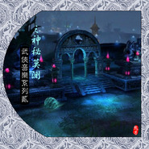

武侠音乐系列第二部之鬼景篇武侠音乐系列二之神秘莫测
============================

|  |  |
| :--: | :-- |
| [ 武侠音乐系列第二部之鬼景篇武侠音乐系列二之神秘莫测](https://emumo.xiami.com/album/1463595015) | **艺人**: [武聆音雄](../index.md) **语种**: 国语 **唱片公司**: 武聆音雄 **发行时间**: 2013年03月03日 **专辑类别**: 合集, 杂锦 **专辑风格**: 电视原声 Television Music, 游戏配乐 Video Game Music, 电影原声 Film Score **播放数**: 395633 **收藏数**: 922 **评论数**: 31  |

## 简介

一.简介 此专辑与《武侠音乐系列》中的紧张专辑、《仙侠游戏音乐系列》中的紧张篇是一脉相承。 关于武侠豪情之音乐特点等等介绍，请参见《07.武侠音乐系列之危机四伏（紧张）》与《6.仙侠游戏音乐系列之紧张篇》。 目前，仅以此专辑曲目为例来说明武侠鬼景音乐之常用乐器以及应用场景。 此专辑从主要收录描绘神秘诡异、危机四伏场景的武侠音乐。 二.常用乐器 1.打击乐或敲击乐式的，以节奏明显而强劲的打击乐作为音乐的基调，并辅以拉弦乐（尤其是低沉的提琴）、管乐，表现出那种紧张的状态，例如：EASTERN_ADVENTURE、波折、浓情、Dm03紧张、wind-02、临危、Dm17危机、The_Cli<x>nk_Gavin、Dark Rider、原来如此呀、死而复生(赤龙惊悚曲)、与冯道德的对决。 2.合成弹拨乐在几个音之间不断回荡，并辅以时隐时现的拉弦乐、打击乐，营造出一种玄机悬疑的气氛，例如：Haunted_Rogers_Shaw、Panoramas (a)、Hypnotic、Black Widow、瀑布、Tales of Paper Moons (a)、寒声碎、In_the_Shadows、Terminal_Munro、夜半妖音。 3.拉弦乐在几个音之间不断震荡回旋，或者每个音持续很久的拉弦乐，辅以弱弱的管乐、打击乐，营造出一种紧张之氛围。例如：Release、五岳盟主、Danger In Waiting、阴谋、张根失踪。 4.空灵辽远之合成管乐，例如：Dark Fear、误入迷失森林、独入逍遥岛。 5.直接利用琵琶或类似琵琶等等弹拨乐器来演绎紧张音乐，将弹拨乐独有的颤音发挥得淋漓尽致。例如：危机重重、月読。 三.应用场景 1.作为诡异神秘的场景，比如：地府、古墓、迷宫、妖魔出没之地等等，例如：Dark Fear（古墓）、Tales of Paper Moons（无量玉洞）、寒声碎、独入逍遥岛、误入迷失森林、夜半妖音。 2. 寻找线索、追查真相的悬疑类音乐，例如：Haunted_Rogers_Shaw、Panoramas (a)、Hypnotic、瀑布、Terminal_Munro、Breathtaking Moment、Anxiety Ayala、张根失踪、原来如此。 3.施展阴谋，策划事件，例如：Black Widow、In_the_Shadows、阴谋、邪恶。 4.邪派人士主题音乐，与人物篇中相似，例如：浓情、五岳盟主。 5.逃命，被追杀，命悬一线，例如：波折、Dm03紧张、wind-02、临危、Fatal Trap、杨戬擒悟空、The_Cli<x>nk_Gavin、Dark Rider、危机重重、与冯道德的对决。 6.恐怖惊悚类场景，例如：EASTERN_ADVENTURE、Release、丧胆亡魂、死而复生(赤龙惊悚曲)。 四.曲目列表 原版音乐 01.Haunted Rogers Shaw ①专辑中文名：Atmos 96 ②艺术家： ③发行时间： ④音律分析：一阵阵抖动不止的弦乐，将那种紧绷的神经表露了出来，似乎有哪里还不对劲。而远处时有时无的拉弦乐颤抖着，更是将音乐推入了一阵阵的诡异之中。 ⑤音画分析：经典的武侠悬疑音乐，俞岱岩听到殷素素之语气，更觉得此人便是曾经迫害他之人。这首音乐便将俞岱岩心中那首悬疑彻底表露了出来。 ⑥被引用记录：tvb倚天屠龙记等 02.Eastern Adventure ①专辑中文名:Carlin309 Eastern Europe / Middle East ②艺术家：Ben Lasker ③发行时间：神秘恐怖之男声，辅以猛烈式的敲击，回旋间断式的打击，更有鬼风式的弦乐在远处盘旋着，顿时产生一种不寒而栗之感，似乎已经被眼前所见吓呆了。 ④音律分析：乌廷芳被连晋出卖，受嫪毐侮辱，此乐响起，尽显一切的恐怖与邪恶。剑圣曹秋道生前心狠手辣，与项少龙的对决之中，却因一木材落下而为项少龙所杀，音乐之中似乎是一种惊险与恐怖，更有一丝的沉重。“多情不义，必遭天谴”。 ⑤音画分析： ⑥被引用记录：tvb寻秦记 03.波折 ①专辑中文名：水浒传之梁山好汉 ②艺术家：蔡志展 ③发行时间：1999年 ④音律分析：低沉的提琴便是一种沉重危机之氛围，数声筝所奏之鸟鸣，更让人响起蔡志展在《武林群侠传》中的一曲《空山鸣涧》，几声飞涧之中，更显得危机四伏。 ⑤音画分析：龙啸云搞阴谋,以及剧情发展时都出现的音乐,渲染著危急的气氛。（友为薛禅 评） ⑥被引用记录：小李飞刀 04.Dark Fear ①专辑中文名： ②艺术家：BRIAN BENNETT ③发行时间： ④音律分析：合成管乐持续而又有淡淡的波动，弦乐震荡之中更显得一片神秘，一片诡异。 ⑤音画分析：常常出现在神雕之中神秘的场景，比如：古墓、情花丛等等。 ⑥被引用记录：95神雕侠侣 05.浓情 ①专辑中文名：东方不败-林青霞 电影音乐纪实 ②艺术家：袁卓凡 ③发行时间：1992年 ④音律分析：开头那步步推进式的旋律，让人感受到似乎妖邪正在慢慢靠近？而后阵阵节奏的猛烈敲击，令这妖邪终于到来，于是一片片的，皆是逃命之声！ ⑤音画分析：这首音乐，也往往令人想起东方不败，那诡异之身手、深不可测之魔功，真的是令人不寒而栗呀。 ⑥被引用记录： 06. Panoramas (A) ①专辑中文名：Kpm 257 - Japan Old And New - Part 2 ②艺术家：Morita Makoto ③发行时间： ④音律分析：一声锣声一下的阵阵鸣涧，管乐之断续，铃声也是在摇摆不定之中，一切都是那么的神秘，似乎没有一件事情是确定的，线索是不是就这样断了呢？ ⑤音画分析：马大元有一天突然来到密室，拆了那汪剑通密函，令密函里所言者何呢？一切都充满着玄机。而这首音乐，正是将在一旁窥望的马夫人的心理刻画了出来。 ⑥被引用记录：97天龙八部 07.Dm03紧张 ①专辑中文名：天龙八部单机版 ②艺术家：蔡志展 ③发行时间：2002年 ④音律分析：鼓声急促而起，配合着弹拨乐的回荡，形势已经十分危急了；辅以低沉之提琴，沉重之气氛产生。 ⑤音画分析：危急时刻，追兵在后，强敌在前。 ⑥被引用记录： 08.Hypnotic ①专辑中文名：Steve Warr--Kpm 313 - Drama 2 ②艺术家：Nick Bardoni ③发行时间： ④音律分析：空灵之弹拨乐在几个音之间游荡，似乎想尽力逃脱这几个音的魔爪，却始终都无法逃脱，悬疑之中怎么也没有想通各种玄机。 ⑤音画分析：与Haunted Rogers Shaw相同，也是经典的武侠悬疑音乐，俞岱岩刚见到殷素素之时，殷素素不敢说话，而这首音乐，便将她心中那种胆怯之情尽表。 ⑥被引用记录：tvb倚天屠龙记 09.wind-02 ①专辑中文名：网路三国 ②艺术家：蔡志展 ③发行时间：2000年 ④音律分析：与Dm03紧张类似，鼓声时缓时急，敲击乐来得猛烈急促，弦乐稍稍点缀，便将那种形势刻不容缓的氛围刻画了出来。 ⑤音画分析：这似乎也是一首疲于逃命的曲子。 ⑥被引用记录： 10.Release ①专辑中文名： ②艺术家：BRIAN BENNETT ③发行时间： ④音律分析：这首音乐中间流露出一种魔幻、一种真气的外泄。 ⑤音画分析：杨过与小龙女一起修炼玉女心经内功走火入魔，太湖归云庄英雄大会之上，杨过使出移魂大法，使达尔巴跳舞都用了这首音乐。 ⑥被引用记录：95神雕侠侣 11.临危 ①专辑中文名：仙剑奇侠传三 ②艺术家：吕圣斐 ③发行时间：2003年 ④音律分析：开头那几声滚动的琵琶，便将一切的危急表明。 ⑤音画分析：这首用于迷宫ＢＯＳＳ战。表现危机四伏，艰难的战斗，节奏感强烈。适用于紧张艰苦的战斗场合和部分强大而邪恶的BOSS战。 ⑥被引用记录： 12.Black Widow ①专辑中文名：MEG_MX__061 ②艺术家：Mendelsohn (ASCAP) , Dwyer ③发行时间： ④音律分析：提琴低沉迷幻之中，拨弦乐演绎着回荡回旋的旋律，是一种悬疑的氛围。 ⑤音画分析：悬疑类音乐，倚天之中施展计谋、查找线索，常常使用此曲。 ⑥被引用记录：tvb倚天屠龙记 13.瀑布 ①专辑中文名：黄飞鸿之西域雄狮 ②艺术家：卢冠廷 ③发行时间：1996年 ④音律分析：似乎是那水在流动与滚动，与生生不息的鼓声更将这水赋予了更多的活力。 ⑤音画分析：天龙中悬疑音乐，查找线索，常常使用此曲。 ⑥被引用记录：97天龙八部 14.五岳盟主 ①专辑中文名：笑傲江湖 电影原声音乐辑 ②艺术家：黄霑&amp;戴乐民 ③发行时间：1990年 ④音律分析：紧张音乐的第三种风格，典型的戴乐民风格，以琵琶的不断弹拨，营造追杀与逃跑的紧张感觉。 ⑤音画分析：五岳盟主左冷禅，一个极度毒辣阴险之人物。 ⑥被引用记录： 15.Tales Of Paper Moons (A) ①专辑中文名：Japan Old And New - Part 2 ②艺术家：Morita Makoto--Kpm 257 ③发行时间： ④音律分析：紧张音乐第三风格表现方法。筝之回荡与颤抖，加之管乐之断续，营造出神秘。 ⑤音画分析：段誉落入无量山底，偶然见到无量玉洞，来到洞中，却见被一把剑指着，加之此乐响起，更是心惊胆寒。 ⑥被引用记录：97天龙八部 16.Terminal_Munro线索 ①专辑中文名：Atmos 96 ②艺术家： ③发行时间： ④音律分析：合成弦乐在几个音之间来回穿梭，拨动着心弦，提琴来远处低沉着，令人有种身临其境之神秘危机感。 ⑤音画分析：项少龙来到战国时期，便遇到善柔。善柔使用手枪指着项少龙，更是命悬一线，随时都会因此毙命，音乐便表露了项少龙心中那种恐慌。 ⑥被引用记录：tvb寻秦记 17.Fatal Trap ①专辑中文名： ②艺术家：BRIAN BENNETT ③发行时间： ④音律分析：时缓时急的鼓声，断断续续之弦乐摇荡着，刻画出形势之危急。 ⑤音画分析：一首神雕中的追击与逃命的音乐，武侠之中，强者甚多，不敌之时，唯有逃之。无论是杨过与陆无双在李莫愁手下逃命，还是杨过逃命于金轮法王，均出现这首形势危急之音乐。 ⑥被引用记录：95神雕侠侣 18.Dm17危机 ①专辑中文名：天龙八部单机版 ②艺术家：蔡志展 ③发行时间：2002年 ④音律分析：与Dm03类似，鼓声急促而起，配合着弹拨乐的回荡，形势已经十分危急了；辅以低沉之提琴，沉重之气氛产生。 ⑤音画分析：与Dm03相比，更多了一份危机。 ⑥被引用记录： 19.In The Shadows ①专辑中文名：Atmos106 Hard Drama 2 ②艺术家：Andrew Blythe, Marten Joustra ③发行时间： ④音律分析：音乐之中仍然流露出一种紧张与悬疑。 ⑤音画分析：倚天之中一首追击，追查线索常用的一首音乐。 ⑥被引用记录：tvb倚天屠龙记 20.Breathtaking Moment ①专辑中文名：SEL5235 ②艺术家： ③发行时间： ④音律分析： ⑤音画分析： ⑥被引用记录：2001倚天屠龙记 21.杨戬擒悟空 ①专辑中文名：西游记 ②艺术家：许镜清 ③发行时间：1986年 ④音律分析：一首动感十足的音乐，使用各种电子乐表现出来的紧张，似乎有那种追击敌军的感觉。 ⑤音画分析：二郎神、哮天犬追击孙悟空，音乐之中呈现出一丝的紧张，却又有更多的是那种动感与活力。 ⑥被引用记录： 22.月読 ①专辑中文名：紫式部 源氏物語 ②艺术家：細野晴臣 ③发行时间：1987年 ④音律分析：明显的紧张音乐第三风格表现方法。琵琶在用于表现紧诡异气氛上，真是绝妙。 ⑤音画分析：97天龙《神秘婆婆的打火石》原曲。段誉等人回国途中误入小木屋，晚上睡觉之时，一个神秘婆婆一直用打火石打火，场景比较紧张诡异。而音乐的加入更是绝妙。 ⑥被引用记录：97天龙八部 23.双姝汤池换皮 ①专辑中文名：画皮2原声大碟 ②艺术家：石田胜范 ③发行时间：2012年 ④音乐赏析：在前半部分，三音的重复节奏型奠定了一种性感与妖媚的基调。此时的小唯内心是窃自欣喜的，因为她的第二步计划已经在实施中，而铺垫在低音区的每次鼓声则渲染了她这种悸动与兴奋。而马头琴的上下翻转起伏则带出了一种远古的野性，三度音程的快速流动仿佛是一种无比的炫耀与满足，在古筝的华彩刮奏中让我们渐渐读懂小唯的内心。乐曲的后半段，一直蜷缩在前半段的弦乐渐渐凸显，带着难以言说的无奈与哀伤，就像是靖公主的心情一般。清丽的钢琴勾勒出公主为爱执着而单纯的内心。此时，马头琴的野性消失，反而流转出一番怜惜之音，倾诉出小唯对公主的另一番复杂心情，小提琴娓娓诉来公主看到自己“新面孔”的女人心事。 (《舌尖上的中国》作曲家阿鲲评) ⑤被引用记录：2001倚天屠龙记 24.梦中大侠 ①专辑中文名：仙剑奇侠传98柔情版原声碟 ②艺术家：林坤信 ③发行时间：1998年 ④音律分析：开头弹拨弦乐于诡异之间回荡不息，几声敲击之下，提琴却又不规则重复几个音，将梦中那种神秘与危机刻画了出来。 ⑤音画分析：李逍遥做梦，在梦中是为行侠仗义之大侠，音乐便将梦境之中的那种诡异与危机表现了出来。 ⑥被引用记录： 25.Danger In Waiting ①专辑中文名： ②艺术家：BRIAN BENNETT ③发行时间： ④音律分析：鼓声配合下的声声拉弦乐，持续而长久不息，似乎形势之中有一丝的沉重与玄机。而后合成弦乐的阵阵翻滚更显得形势之诡异与危机。 ⑤音画分析：神雕和碧血剑之中常常出来的一首音乐，往往用来刻画人物心中的那种紧张，敌人就在附近，藏身于此，屏住呼吸。 ⑥被引用记录：95神雕侠侣、2000碧血剑 26.Dark Rider ①专辑中文名：Steve Warr--Kpm 313 - Drama 2 ②艺术家：Nick Bardoni ③发行时间： ④音律分析：一声敲击之中，阵阵响铃之下，更是盘旋着各种诡异之男声。轻巧却又节奏性之鼓声在慢慢靠近，形势似乎已经不容乐观，而敲击乐陪伴下的提琴又悄然作响，烘托出内心的紧张与形式的危险。 ⑤音画分析：受玄冥二老为得知屠龙刀之下落，挟持张无忌，更是令张无忌中玄冥神掌，这首音乐便在此时响起，张无忌命悬一线之中，体内寒冰真气随时可以令其毙命。这首音乐便将那种紧张与不安表现了出来。 ⑥被引用记录：tvb倚天屠龙记 27. Anxiety_Ayala ①专辑中文名：FC_-D6 ②艺术家： ③发行时间： ④音律分析： ⑤音画分析：复仇的子弹 原曲 ⑥被引用记录：2001倚天屠龙记、tvb布衣神相 28.Tek War ①专辑中文名：DRONES ②艺术家：Ian Boddy ③发行时间：1999年 ④音律分析：戏剧性的，邪恶的威胁，时钟滴答。曲子前奏开始便于人一种如坠深渊的恐惧感，中间不时穿插各种顿挫打击乐，令人毛骨悚,如入万劫不复之地。（武聆音雄--夕下袂舞） ⑤音画分析：在电视剧应用中，通常用作人物突然出现以及突发事件之类的画面。 ⑥被引用记录：愤怒的蝴蝶 截取曲目: 01.丧胆亡魂 ①专辑中文名：聊斋志异&amp;聊斋奇女子 ②艺术家：麦振鸿 ③发行时间：2004年 ④音律分析： ⑤音画分析：配合着聊斋之中个鬼怪妖魔，产生了一批能够带来神秘诡异氛围的音乐。诡异音乐一直以来都难以受大家的青睐，可能是有的时候听着不太舒服吧，也有乐友听诡异音乐而感到害怕的。记得麦大曾经在贴吧里说到过，当年独自一人在制作室里制作诡异音乐时的心境，确实是令人毛骨悚然的。 ⑥被引用记录： 02.独入逍遥岛 ①专辑中文名：少年包青天2 ②艺术家：韦启良 ③发行时间：2001年 ④音律分析：弦乐铛铛之中，一片杂乱之声轰然而起，而后的管乐空灵辽远，不断的回旋着，显得是那么的诡异。 ⑤音画分析：展昭一人独自前往逍遥岛，一个传说中的岛，没有人知道它的所在，一切都是那么的神秘。 ⑥被引用记录： 03.死而复生(赤龙惊悚曲) ①专辑中文名：洪熙官 ②艺术家：黄邦贤 ③发行时间：1994年 ④音律分析： ⑤音画分析： ⑥被引用记录： 04.七虫七花膏 ①专辑中文名：倚天屠龙记 ②艺术家：tvb ③发行时间：2001年 ④音律分析： ⑤音画分析： ⑥被引用记录：封神榜 05.与冯道德的对决 ①专辑中文名：洪熙官 ②艺术家：黄邦贤 ③发行时间：1994年 ④音律分析： ⑤音画分析： ⑥被引用记录： 06.暗藏杀机 ①专辑中文名：聊斋志异&amp;聊斋奇女子 ②艺术家：麦振鸿 ③发行时间：2004年 ④音律分析： ⑤音画分析： ⑥被引用记录 07.误入迷失森林 ①专辑中文名：少年包青天 ②艺术家：韦启良 ③发行时间：2000年 ④音律分析：吹管乐回荡着，回旋之中却显得格外的神秘与诡异。 ⑤音画分析：少年包青天中经典的诡异音乐，常常用于神秘诡异之场景，例如：：百鬼竹林、雁不归迷失森林、知返林、逍遥岛等等。 ⑥被引用记录： 08.危机重重 ①专辑中文名：风云 ②艺术家：(凌波鱼儿截取) ③发行时间：2002年 ④音律分析：开头一声便低回不绝，弹拨弦乐断断续续却又阵阵回荡，令人想起喜多郎的《大蛇》，铃声渐行渐远，轻灵之曲风之中又呈现出一丝丝的不安与躁动。打击乐的的节奏性敲击令这首音乐也开始活力了起来，而后时隐时现之弦乐回荡之中更显神秘与危机。 ⑤音画分析：慢慢进入一片静谧之深林，开始便是毫无活力，却又带有一丝的神秘。 ⑥被引用记录： 09.原来如此呀 ①专辑中文名：少年包青天 ②艺术家：韦启良 ③发行时间：2000年 ④音律分析：突然性猛烈的敲击，于神秘迷幻的合成管乐中将一切的谜团终于解开了。 ⑤音画分析：少年包青天中一首很常用的音乐，刻画了脑海中那么一下子的灵光一闪。原来事情是这样的呀，原来如此呀。 ⑥被引用记录： 10.邪恶 ①专辑中文名：寻秦记 ②艺术家：tvb ③发行时间：2001年 ④音律分析：提琴低回，男声“哎哎”之下，却将一切之丑陋尽表。 ⑤音画分析：一首比较特别的曲子，在寻秦记中，常常用于阴谋诡计得逞之时，所有人性之邪恶便在此时完全显露了出来。 ⑥被引用记录： 11.张根失踪 ①专辑中文名：少年包青天2 ②艺术家：韦启良 ③发行时间：2001年 ④音律分析：密集的弦乐显得有点紧张，似有似无远处的敲击却显得“似乎还有什么东西没有想到的，事情应该不是这么简单的，到底问题出来哪里呢”。 ⑤音画分析：少年包青天中经典的悬疑玄机音乐，一个个的突然失踪事件、密室杀人事件等等，一切都是充满着那么多的玄机。 ⑥被引用记录： 12.夜半妖音 ①专辑中文名：聊斋志异&amp;聊斋奇女子 ②艺术家：麦振鸿 ③发行时间：2004年 ④音律分析： ⑤音画分析：夜晚之中,不远处便是妖魔。 ⑥被引用记录: 13.阴谋 ①专辑中文名：上错花轿嫁对郎 ②艺术家：(凌波鱼儿截取) ③发行时间：2000年 ④音律分析：持续低迷之提琴声下，铃声骤然响起，弦乐之震动将一切的阴谋诡计显露。 ⑤音画分析：往往用于剧中柯世昭使用各种毒计之时。 ⑥被引用记录： 14.风筝杀手 ①专辑中文名：战神传说 ②艺术家：黄沾&amp;雷颂德 ③发行时间：1993年 ④音律分析：提琴持续的低沉,琴声时缓时急,显得一阵阵的诡异,似乎杀机暗藏. ⑤音画分析：兰陵公主一个放风筝玩耍的伙伴转眼间被杀,而又来了一批乔装放风筝的杀手。危急的气氛、紧张的眼神，而在这音乐之中显得更加显著了。 ⑥被引用记录： 15.百鬼竹林 高丽太子 ①专辑中文名：少年包青天 ②艺术家：韦启良 ③发行时间：2000年 ④音律分析： ⑤音画分析： ⑥被引用记录： 五.配乐视频 02.本部视频 (0 folders, 14 files, 105.11 MB, 105.11 MB in total.) 01.传授步法-倚天屠龙记-Hypnotic&amp;Haunted Rogers Shaw.mkv 13.20 MB 02.古墓-神雕侠侣-Dark Fear.mkv 7.74 MB 03.曹秋道之死-寻秦记-Eastern Adventure-Ben Lasker.mkv 7.32 MB 04.移魂大法-神雕侠侣-Release.mkv 10.80 MB 05.杀机暗藏-聊斋之小倩-麦振鸿.mkv 3.54 MB 06.五岳盟主-笑傲江湖-戴乐民.rmvb 13.41 MB 07.危急-寻秦记-Terminal_Munro.mkv 5.23 MB 08.吕不韦之奸诈-寻秦记.mkv 4.28 MB 09.张无忌中玄冥神掌-倚天屠龙记-Dark Rider.mkv 5.86 MB 10.逍遥岛-少年包青天2-韦启良.rmvb 4.38 MB 11.金轮法王追击-神雕侠侣-Fatal Trap.mkv 6.89 MB 12.汪剑通密函-天龙八部-Panoramas.mkv 8.94 MB 13.无量玉洞-天龙八部-Tales of Paper Moons.mkv 7.45 MB 14.杨戬擒悟空-西游记-许镜清.mkv 6.07 MB 03.未知视频 (0 folders, 1 files, 3.44 MB, 3.44 MB in total.) 01.柳焚余对战李布衣-布衣神相.flv 3.44 MB ①作者：丘九天 ②出处：武聆音雄论坛 ③原文链接：<a href="http://www.wlyxmusic.com/thread-3541-1-1.html" target="_blank" rel="nofollow noreferrer noopener">http://www.wlyxmusic.com/thread-3541-1-1.html</a>  </x></x>

## 曲目

- [五岳盟主](./1463595015/xL0cZEaac43.md)

## 评论

|  |  |  |  |
| :-- | :-- | :-- | :-- |
|  [虾米用户](https://emumo.xiami.com/u/18236235) 我还没想好要写什么... 2018-04-15 23:57 赞(0) 踩(0) | 

 |
|  [虾米用户](https://emumo.xiami.com/u/2307526) 连接比特与像素的造梦师！ 2017-08-14 20:19 赞(0) 踩(0) | 
武侠音乐系列第二部之鬼景篇
 |
|  [虾米用户](https://emumo.xiami.com/u/2307526) 连接比特与像素的造梦师！ 2017-08-14 20:19 赞(0) 踩(0) | 
武侠音乐系列第二部之鬼景篇
 |
|  [虾米用户](https://emumo.xiami.com/u/762181)   2017-04-06 03:42 赞(0) 踩(0) | 
.
 |
|  [虾米用户](https://emumo.xiami.com/u/1671923)  2017-02-16 17:27 赞(0) 踩(0) | 
好
 |
|  [虾米用户](https://emumo.xiami.com/u/8139748)  2016-01-25 15:00 赞(0) 踩(0) | 
很好的配乐！
 |
|  [虾米用户](https://emumo.xiami.com/u/47854293)   2015-11-16 12:34 赞(0) 踩(0) | 
很喜欢的配乐
 |
|  [虾米用户](https://emumo.xiami.com/u/52493901) 精雕飞起的乌兰察布 2015-07-13 12:50 赞(0) 踩(0) | 
请问英雄广东十虎里黄澄可杀荣寿标时的背景音乐哪里有？
 |
|  [虾米用户](https://emumo.xiami.com/u/52279975)   2015-07-10 00:45 赞(1) 踩(0) | 
感动
 |
|  [虾米用户](https://emumo.xiami.com/u/8592720)  2015-06-16 14:39 赞(0) 踩(0) | 
鬼景篇
 |
|  [虾米用户](https://emumo.xiami.com/u/14081203) 习惯孤独。 2015-04-22 12:47 赞(0) 踩(0) | 
神雕里的古墓配乐~~回忆啊啊啊啊
 |
|  [虾米用户](https://emumo.xiami.com/u/40001760)  2014-12-26 16:53 赞(0) 踩(0) | 
回忆
 |
|  [虾米用户](https://emumo.xiami.com/u/19256136)  2014-11-20 20:53 赞(0) 踩(0) | 
此专辑从主要收录描绘神秘诡异、危机四伏场景的武侠音乐。
 |
|  [虾米用户](https://emumo.xiami.com/u/1963727) 纯音乐爱好者 2014-08-08 20:26 赞(0) 踩(0) | 
电视剧里面的紧张音乐
 |
|  [虾米用户](https://emumo.xiami.com/u/5788405) 欢迎使用高德地图。 2014-07-08 15:13 赞(0) 踩(0) | 
牛逼得要哭出来
 |
|  [虾米用户](https://emumo.xiami.com/u/5989165) 我还没想好要写什么... 2014-04-30 01:32 赞(0) 踩(0) | 
真心希望有一天能出一张寻秦记原声带
 |
|  [虾米用户](https://emumo.xiami.com/u/8123521) 一人慎独，众人观心 2014-01-27 16:33 赞(0) 踩(0) | 
江湖中，勿相忘
 |
|  [虾米用户](https://emumo.xiami.com/u/28443189)  2013-11-30 18:24 赞(0) 踩(0) | 
武侠世界
 |
|  [虾米用户](https://emumo.xiami.com/u/22139020)  2013-10-28 12:04 赞(0) 踩(0) | 
鬼景篇——武侠音乐
 |
|  [虾米用户](https://emumo.xiami.com/u/11354192) 云在青天水在瓶 2013-10-16 09:31 赞(0) 踩(0) | 
好棒！
 |
|  [虾米用户](https://emumo.xiami.com/u/8121372)  2013-10-10 10:15 赞(0) 踩(0) | 
吓哭我了
 |
|  [虾米用户](https://emumo.xiami.com/u/24001071)  2013-10-09 23:43 赞(0) 踩(0) | 
不错
 |
|  [虾米用户](https://emumo.xiami.com/u/12676255) 人世间，何曾有永生不灭的... 2013-10-09 13:04 赞(0) 踩(0) | 
武侠风BGM
 |
|  [虾米用户](https://emumo.xiami.com/u/5827372) 最勇敢的胆小鬼 2013-10-05 18:54 赞(0) 踩(0) | 
听着这个打战场~~啦啦啦啦~
 |
|  [虾米用户](https://emumo.xiami.com/u/10640160)  2013-09-28 23:10 赞(0) 踩(0) | 
提起鬼魅之处，更多的是想到《倩女幽魂》里的鬼狼出没的境地——兰若寺，那座森然的古刹令人印象深刻，毛骨悚然，几乎成了鬼域的代名词，其中更是阴暗诡异，神秘莫测。武侠江湖变幻莫测，或误入神秘之境地，魑魅魍魉、亦真亦幻，寻找线索、查明真相；或陷入阴谋陷害、阴险险恶，不得不逃避追杀、亡命天涯。
 |
|  [虾米用户](https://emumo.xiami.com/u/21916115)  2013-09-22 10:31 赞(0) 踩(0) | 
武侠音乐之鬼景
 |
|  [虾米用户](https://emumo.xiami.com/u/9330088)  2013-09-21 19:45 赞(0) 踩(0) | 
TVB
 |
|  [虾米用户](https://emumo.xiami.com/u/14081203) 习惯孤独。 2013-06-08 14:55 赞(0) 踩(0) | 
谢谢分享！
 |
|  [虾米用户](https://emumo.xiami.com/u/12068445) · 2013-03-18 21:05 赞(0) 踩(0) | 
谢谢分享！
 |
|  [虾米用户](https://emumo.xiami.com/u/12068445) · 2013-03-18 21:05 赞(0) 踩(0) | 
悬疑 惊锁
 |
|  [虾米用户](https://emumo.xiami.com/u/8797833)  2013-03-18 17:01 赞(1) 踩(0) | 
<a href="http://www.wlyxmusic.com/thread-3541-1-1.html" target="_blank" rel="nofollow noreferrer noopener">http://www.wlyxmusic.com/thread-3541-1-1.html</a>
 |
