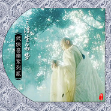

武侠音乐系列第二部之悟道篇武侠音乐系列二之浮生若梦
============================

|  |  |
| :--: | :-- |
| [ 武侠音乐系列第二部之悟道篇武侠音乐系列二之浮生若梦](https://emumo.xiami.com/album/163595245) | **艺人**: [武聆音雄](../index.md) **语种**: 国语 **唱片公司**: 武聆音雄 **发行时间**: 2013年03月08日 **专辑类别**: 合集, 杂锦 **专辑风格**: 中国风 China-Wave **播放数**: 511908 **收藏数**: 586 **评论数**: 24  |

## 简介

一.简介  
  
此专辑与《武侠音乐系列》中的悔悟专辑是一脉相承。  
关于武侠豪情之音乐特点等等介绍，请参见《09.武侠音乐系列之后悔莫及（悔悟）》。  
目前，仅以此专辑曲目为例来说明武侠悟道音乐之常用乐器以及应用场景。  
此专辑音乐主要表现武侠中那种沧桑过后的感悟，一种大彻大悟，或者说是一种结局。  
  
二.常用乐器  
  
1.女声幽怨，有种回首之后的淡然，恰好也有种感悟的感觉，例如：无悔、醉红颜、念、睡莲、魂引。  
2.悠远空灵之笛箫，尽表心中的惆怅，一种物是人非之感，例如：提起老乡亲、金庸群侠传、红尘破、慈禧秘密生活主题、成全、亘古忧思。  
3.拨弦乐沉稳清新、回旋起伏，却所有所悟。例如：淡泊之心、哪里的风、镜中花水中月、真正爱之人、真相、镜湖、一声佛号一声心、莲花不灭、青史无尽。  
4.低沉拉弦乐，沉郁之中却又一线生机，哀怨过后便是劫后重生。例如：风吹沙、红楼梦（二胡）、万法归一、余生恨更多、真爱之剑。  
  
三.应用场景  
  
1.结局处，所有的一切如镜花水月，例如：提起老乡亲、镜中花水中月、莲花不灭。  
2.佛性超然，领悟到佛家或道家之智慧，以佛道之心性引渡世人，例如：淡泊之心、一声佛号一声心、万法归一、庄子心中的故事、乐山大佛。  
3.物是人非，回首过往之物，今朝也皆消散，心生感伤，突感人生如戏一场，例如：慈禧秘密生活主题、悲欢离合戏一场、无悔。  
4.反复思量，最终领悟各种玄机，幡然醒悟，例如：枯禅林中 真正爱之人、风吹沙、真相、红尘破、醉红颜。  
5.真爱之剑，以真爱作为剑意，例如：余生恨更多、真爱之剑。  
6.触景伤情，由观景而始，最后却伤情，例如：睡莲、期待花香、镜湖。  
  
四.曲目列表  
  
原版音乐  
  
01.淡泊之心  
  
①专辑中文名：金庸群侠传 Online 2  
②艺术家：蔡志展  
③发行时间：2005年  
④音律分析：开头在点点回旋的弦乐之下，一阵阵风声萦绕耳边，一种寂静，佳人似乎近在眼前，倩影随风飘摇，却又虚无飘渺，令人捉摸不透，有种“所谓伊人，在水一方”的感觉。而后风声渐渐消失，迷雾慢慢消散，弦乐在打击乐之下演绎着回旋动人的旋律，怀着一阵阵欢喜而找寻，却始终看不清佳人身影。风声迷雾再度弥漫，佳人似乎越走越远。打击乐下弹拨弦乐坚持不懈的继续找寻着，终于渐渐地迎来了提琴的猛烈拉动，似乎佳人猛回头，终于迎来了佳人之面容。  
⑤音画分析：这是《武侠群英传》《网金2》中的曲目，旋律与《武林群侠传》中《华山》相同，曾被填词演唱成了歌曲《落花时节又逢君 》。这首曲子忽快忽慢，忽明忽暗，时而迷离，时而大白，时而温情，时而惆怅，似乎蔡老师将心中很多真情在这首音乐中流露了出来。正如歌词所言：“人生难得一知己，知己难得才珍惜。”  
⑥被引用记录：武侠群英传  
  
02.无悔  
  
①专辑中文名：枭焸赏悉  
②艺术家：   
③发行时间：  
④音律分析：这是首舒缓心灵的音乐，而且是中国曲乐极致作品，采用现代编曲手法，技巧性的运用二胡、水晶、古筝、排萧、洞萧、琵琶、扬琴、中音笙…等乐器，将每一乐器特色发挥得淋漓尽致，搭配得恰到好处，旋律清幽抒情，很自然地把听者带入清新宁静的心境，又很容易使听者产生凄凉忧伤的情绪………   
⑤音画分析：夜凉如水，清秋乍临，在这繁华未裉的季节，缱绻着一份愁绪、一丝怅然，酌一杯清茶，点上一支烟独坐这夜里倾听在这《无悔》的夜色里，随音符缱绻难开，看人世纷繁、几度春雨、几度畅，任千石激浪，冰未解，心已逝……人生戏一场、梦一场……不应有恨！（来自网络）  
⑥被引用记录：  
  
03.提起老乡亲  
  
①专辑中文名：望乡  
②艺术家：黄石  
③发行时间：1989年  
④音律分析：空灵辽阔之琴音持续回荡着，便奠定了低沉忧郁之基调。阵阵清脆敲击式弦乐，更是敲尽了心中那样的悲愤与哀愁。悠远辽阔之笛音却也因此总算有一丝丝的温情，一丝丝的感动。  
⑤音画分析：“江湖争霸，换回来的只不过是一排排的墓碑。”配合着莲花争霸结局之中的这句话，这首音乐也显得更加的沉闷与悲痛，似乎也是一种对于江湖的领悟。  
⑥被引用记录：新加坡莲花争霸、鹤啸九天  
  
04.春华之曲  
  
①专辑中文名：后宫电视剧原声  
②艺术家：林海  
③发行时间：2011年  
④音律分析：开头便是一阵阵的灵动与辽阔，有种流水行云之面貌。随后箫声动，一阵婉转，添加了一丝的哀愁。笛声随之起，一派悠扬，派生出那样的儒雅。古筝柔柔辉映，却是那样的柔情蜜意。随着女声的淡淡而终，心中所想、心中所思，似乎也都渐渐放开了。  
⑤音画分析：在《后宫》中，春华父亲所创作的这首曲子，伴随着春华走过了那么多的曲折那么的欢笑。而最终有情人终成眷属，却也是那样的美好。  
⑥被引用记录：  
  
05.风飞沙  
  
①专辑中文名：窃窃私语  
②艺术家：陈百潭作曲，温金龙二胡演奏  
③发行时间：1993年  
④音律分析：开头那打击乐下悠扬回荡的笛声，似乎就已经将解开了心中所有的迷惑，也更有一种幡然醒悟的感觉。随后的二胡沉稳之中，却也显示出醒悟之后的悔恨与懊恼，只可惜往事已不可追，过去的也只好让他过去了。  
⑤音画分析：原曲为陈百潭作曲、陈盈洁所演唱的闽南语歌曲《风飞沙》。这首改编的曲子并更加表现出那种醒悟，似乎同时也呈现出一丝丝的乡愁。大漠之中，风吹沙飞，如今家国又在何方？  
⑥被引用记录：96笑傲江湖  
  
06.金庸群侠传-竹箫版  
  
①专辑中文名：金庸群侠传  
②艺术家：蔡志展  
③发行时间：1996年  
④音律分析：不远处以合成弹拨弦乐点缀着，悠扬婉转之箫声，演绎出安宁、美妙的旋律，回旋之中，却也有种遥望旧事物、领悟新事物的感觉。  
⑤音画分析：这首经典的箫声，熟悉的旋律，更是令我们一下子回到了童年那段玩金庸群侠传的日子里。曲子之中流露出的那种武侠江湖的情怀，更是令人久久不能忘怀！  
⑥被引用记录：  
  
07.哪里的风  
  
①专辑中文名：新还珠格格  
②艺术家：  
③发行时间：2011年  
④音律分析：钢琴的片片流淌，便带来了那样的离愁。回旋、起伏、美妙的旋律，更是显示出一阵阵的思索与忧愁，仍然有许多的放不下与解不开。远处空灵的提琴在回荡，一种低吟。几声二胡的呐喊，更是将心中那样的不解尽数倾诉了出来。哀愁过后，也终于趋于平静，趋于安宁，或许这一切也都渐渐放下了。  
⑤音画分析：这首曲子整体上静谧，却又流露出深深的思绪，一片片的拿不起放不下，而后终于在二胡的宣泄之中将一切事情想通，也渐渐超脱，渐渐醒悟。  
⑥被引用记录：  
  
08.镜中花水中月  
  
①专辑中文名：霹雳奇象原声带  
②艺术家：张乃仁  
③发行时间：2006年  
④音律分析：听着这特制的弹拨音色，便想起了曾经的《云涛梦笔》。筝一方面沉稳有力，另一方面有弹出了一种清新飘逸的妙感与往事难寻感慨。镜中花、水中月，世上最真的虚假世界。在人世间，有些情爱，就如同镜花水月一般虚幻，摸不着、碰不得，却是隐藏在内心中最真的渴望，但同时也是最美、最梦幻的一面。  
⑤音画分析：这首音乐是许久未与无非文化合作的张乃仁老师０２年底的一首作品，尘封多年后被选用作为霹雳奇象片尾曲，是一首值得让人再三回味的优美乐曲，搭配上镜花水月主题的诸多无奈感情场景，更让人充满感伤。  
⑥被引用记录：  
  
09.枯禅林中 真正爱之人  
  
①专辑中文名：真倚天屠龙记  
②艺术家：蔡志展  
③发行时间：2004年：  
④音律分析：《武侠音乐系列》重逢篇里曾收录了一首无名音乐Dm08，也是因为这首音乐，令很多人开始感受到蔡志展古风音乐的神韵，而如今的这首旋律与Dm08相同，乐器上由二胡改成了笛子和提琴，那样的柔情于高潮时期的重逢感觉确实是令人无比动容呀！  
⑤音画分析：在《真倚天屠龙记》的最后一段剧情里，张无忌来到了少林寺的枯禅林找到了赵敏，并终于当着周芷若和赵敏的面说出了自己真正爱的人。而后更有蛛儿明白了张无忌就是曾阿牛，却只喜欢曾经在蝴蝶谷咬伤她的张无忌，之后更是疯疯癫癫而离开。配合着这样的场景，这首音乐似乎也描绘着张无忌心中的那份不舍的情丝以及蛛儿对想象与现实差距的不理解，除了爱情，更是一种感悟呀！  
⑥被引用记录：  
  
10.庄子心中的故事  
  
①专辑中文名：太极  
②艺术家：奧立佛．香提  
③发行时间：1996年  
④音律分析：开头那清脆如敲击般的弦乐便带来了所有的儒雅与逍遥，几声鸟鸣之下，那温婉之合成弦乐却也显露出那样的柔情。而这旋律之回躺与起伏，却也将心中那样无尽的思虑、无尽的不解尽情表露了出来。音乐之中不断回旋荡漾更似乎是那种所思之事物来来去去，亦犹如太极之元转。  
⑤音画分析：这首音乐深具冥想之元素，亦颇有东方之气息。中间那种思虑与婉转圆润，更是有那别样的逍遥、仙风道骨。这首音乐也被用作太极音乐，更被用作金瓶梅之配乐。  
⑥被引用记录：金瓶梅  
  
11.真相  
  
①专辑中文名：梅花三弄之鬼丈夫电视原声带  
②艺术家：  
③发行时间：1993年  
④音律分析：大提琴深情地演绎着《鸳鸯锦》之旋律，一切都显得那么的温情与柔和，似乎追忆曾经在一起的各种生活片段。尔后琴之铮铮作响，是那么的猛烈，却又是那么的沉稳，在鼓声之中，似乎忽然领悟到了一切事情的真相，是一种对于一切事情的大彻大悟。或者这所有的一切似乎都是一种执念，一种虚幻。在2分44秒处仍然有一丝对于尘世的不舍，而道尽这最后一丝的不舍后，便终于将一切都放下了，也放下了自己。  
⑤音画分析：这首一首能够打动心灵的音乐，听着这首音乐，似乎一切所有的烦恼都忘之，一切的执念都放下了。  
⑥被引用记录：1996笑傲江湖等  
  
12.红尘破  
①专辑中文名：真倚天屠龙记  
②艺术家：蔡志展  
③发行时间：2004年  
④音律分析：吉他陪伴的笛声吹奏出忧郁的旋律，而阵阵由慢而快的敲击更是敲尽了心中的悔恨、无奈、绝望与失落。更有种凡尘已无可恋，看破红尘的意味。  
⑤音画分析：真倚天屠龙记中，张无忌帮忙将昆仑派何太冲的小妾医治好了，却反遭何太冲陷害而中毒，此时这首音乐响起，便将张无忌心中那种绝望、愤慨表露了出来。  
⑥被引用记录：  
  
13.红楼梦(二胡)  
  
①专辑中文名：柔情VOL.6 民族风情浪漫曲  
②艺术家：王立平作曲   
③发行时间：1994年  
④音律分析：筝配合着电吉他，悄然婉转地回荡着，似乎便有了一种猛然回首之感。二胡幽怨地拉动着这《枉凝眉》《葬花吟》等等旋律，更有各种敲击乐在深处摇荡着， 更显得是一种有那么的愁思与怅然。钢琴与古筝的柔情婉转对话，却将心中的另一种领悟渲染了出来，似乎这二胡营造的愁思都找到了归宿，得到了解脱。  
⑤音画分析：全曲音域广阔，《枉凝眉》《葬花吟》之二胡时刻都呈现出那么的哀怨、那么的动人。不远处电吉他、鼓声的敲击，低吟之提琴更添加了一丝的沉重。钢琴与古筝演绎着《红楼梦序曲》，对话式的回旋，却在不断的思虑之中得到了答案，若有所悟，与其活在以往的伤痛之中，不如好好把握当前所拥有的，不致于将来再留下遗憾，徒生哀怨。  
⑥被引用记录：  
  
14.慈禧秘密生活主题  
  
①专辑中文名：慈禧秘密生活  
②艺术家：胡伟立  
③发行时间：1994年  
④音律分析：远处有持续低吟之提琴，亦有回旋不尽之琴声，显得有些忧郁低迷。悠扬婉转之笛声回躺之中尽显惆怅与思绪。  
⑤音画分析：封神榜结局处，苏妲己大势已去，回想起曾经的还是天真无邪的姑娘，如今经历了各种磨难，走到了今天的位置，如今却突然发现自己什么也得到。这首音乐忧郁与惆怅之处，便将妲己心中的那种“物是人非，往日之日不可惜，成败转头成空”的思绪表露了出来。  
⑥被引用记录：封神榜  
  
15.镜湖  
①专辑中文名：谛听中国（二）：禅松  
②艺术家：王俊雄  
③发行时间：2002年  
④音律分析：开头那钢琴回旋起伏之中，便显得那样的静谧与安详，更有种佛家的意境。提琴的突然加入，缓和之中带有一丝的温情，柔动之中又显得仍然有一丝的思绪。  
⑤音画分析：一片片的思绪沉思之中，蓦然回首，却有百般之无奈。昨日之物，今日已非。醒一醒，过眼云烟，转眼成空。这便是这样一首回首之后一切都看淡的曲子。  
⑥被引用记录：香帅传奇  
  
16.醉红颜  
  
①专辑中文名：新水浒传  
②艺术家：周志勇  
③发行时间：2011年  
④音律分析：这首曲子算得上是新水浒传里最动人最感人的曲子了，其中蕴涵着爱情、思念、感悟、悲愤、无奈、悔恨、悲凉等等多种情感，更是与仙剑奇侠传中的《莫失莫忘》有相通之处。  
⑤音画分析：“众生渡尽，方证菩提，地狱未空，誓不成佛”，对芸芸众生的深切同情，对人间苦难的真切感受。其中最迷人之处，当数林冲被逼上梁山、鲁智深“地狱未空，誓不成佛”之感叹。林冲被高俅一再迫害，来照看大军草料场，风雪山神庙，发现了陆谦火烧草料场，欲杀死自己，终于按捺不住心头的怒火，将仇人一个个杀掉，走上了反抗宋朝的道路。这首曲子将他心中那种无奈、悲愤之情感完美地渲染了出来。  
⑥被引用记录：  
  
17.悲欢离合戏一场（问天谴悲曲）  
  
①专辑中文名：霹靂英雄音乐精选《十三》  
②艺术家：浩旭  
③发行时间：2007年  
④音律分析：低沉的气氛中，那琵琶之阵阵，更有种思绪满腹难收之感。随后那节奏性的敲击之中，一种沉重油然而生。琵琶滚动之下，箫声也渐渐起伏，悠扬之下，却也有种回首过往之感。笛声随着这猛烈之锣声而起，便再也按捺不住心中的那份哀思。  
⑤音画分析：这首音乐始终是那样的沉闷与深重，中间更是流露出一阵阵的怀念与思绪。前尘往事，已归于尘土，人生无常，悲欢离合，不过戏剧一场。  
⑥被引用记录：  
  
18.乐山大佛  
①专辑中文名：武林群侠传  
②艺术家：蔡志展  
③发行时间：2001年  
④音律分析：用节奏性的鼓和铃来刻画寺庙之中的木鱼和诵经之声，而近乎男声的乐器以及笙等乐器，流露出一种祥和与威严，而后回旋式的弦乐更是点睛之笔，似乎是种泰然与宁静。  
⑤音画分析：来自《武林群侠传》的曲子，也是智冠里典型的描绘佛家的音乐，和其他几首音乐一道，常常出现在智冠武侠游戏中的少林寺、嵩山、天龙寺等等佛家的场景里。  
⑥被引用记录：  
  
19.念  
①专辑中文名：风云雄霸天下  
②艺术家：陈光荣  
③发行时间：1998年  
④音律分析：开头那风声环绕之中，显得格外的凄凉与沉郁。配合着笛声、弦乐，女声的“呜呜”“啦啦”声下，更是如泣如诉，道尽一切之劳苦与辛酸。  
⑤音画分析：这首音乐仍然是那么的一种怀念，感伤世事。  
⑥被引用记录：  
  
20.睡莲  
  
①专辑中文名：对话Ⅵ-王蕾与二胡的细语  
②艺术家：作曲：贾鹏芳，女声：王蕾  
③发行时间：2006年  
④音律分析：《睡莲》取莲花素雅高洁的形象，以二胡、古筝为载体加上女声的吟唱，似一种对话，抒发对恋人、爱人或是友人的思念之情。曲调舒缓深沉，缠绵而不悱恻，哀宛而不消沉，让人在沉醉之余有一种脱俗和豁然开朗的感觉。  
⑤音画分析：莲花那种抛弃世俗、不计得失、对爱忠贞不渝的境界，在物欲充斥的现实生活中更显得弥足珍贵。（来自网络）  
⑥被引用记录：  
  
21.一声佛号一声心  
①专辑中文名：妙莲华唱片 达摩配乐精选(音乐版)  
②艺术家：黎小田作曲  
③发行时间：2011年  
④音律分析：提琴于不远处相映相行，响铃、鼓声等乐器也有种佛家的节奏感，柔柔的古筝演绎着这回荡安宁的主旋律。整首音乐呈现出种种的超脱与宁静，似乎将一切的烦恼一切的荣辱都忘却。  
⑤音画分析：此曲原曲为黎小田作曲的电视剧《天蚕变》主题曲《换到千般恨》，后由新加坡净宗学会重新制作发行，由妙莲华唱片改编成一首佛教音乐，便是这首《一声佛号一声心》。改编之后的这首音乐，静谧、安详、安宁，也似乎有了荡涤心灵尘埃之功效。  
⑥被引用记录：  
  
22.万法归一 王隐  
  
①专辑中文名：霹雳刀锋贰  
②艺术家：阿轮  
③发行时间：2003年  
④音律分析：动感打击乐下，那有些诡异似人声的拉弦乐，有种呐喊之势。随后登场的特制弹拨筝乐，其沉郁顿挫之处，显得沉稳有力，其颤抖滚动之处，却也显得清新飘逸。整首音乐也显得一丝丝的感动与感悟，那铮铮之筝音，似乎也有一种佛性。  
⑤音画分析：万法归一是王隐的武学，也是一个佛教用语，八万四千法门，最终都要回归自性，回归真我，回归自然。听着这首万法归一之音，其清新超脱之处，尽显佛性之超然。  
⑥被引用记录：  
  
23.莲华不灭  
  
①专辑中文名：霹雳谜诚原声带  
②艺术家：吴骏毅  
③发行时间：2006年  
④音律分析：竖琴与吉他搭配演奏编织起迷离的气氛，琵琶琴声响起似乎是离别的时刻，多年的情感寄托，在这告别的时刻交织出淡淡的离愁，鼻头微酸却仍需强掩悲伤，但是离别却也是再见的开始，在告别的那一瞬间就已开始期待再相聚的时刻到来。那几声敲击之中，配合着莲华之绽放，也真的是迷人极了。  
⑤音画分析：这是吴骏毅老师创作於06年初的作品，当时吴老师正犹豫於是否延後回美国念研究所的求学计划，在离情依依的气氛下反映当时心境的一首精采作品，凑巧呼应编剧编写谜城片尾的莲华不灭主题而被选用作为片尾曲。（来自网络）  
⑥被引用记录：  
  
24.期待花香  
①专辑中文名：芳香疗法心灵音乐-茉莉花  
②艺术家：  
③发行时间：2004年  
④音律分析：琴声悠悠，似乎也洋溢着一种花香。二胡的缓和拉动，却也显得有种触景伤情之感。  
⑤音画分析：这首音乐，中间流露出一阵阵的柔情与伤感，于是在天下第一中也常常被用作抒情音乐。  
⑥被引用记录：天下第一  
  
25.青史无尽  
①专辑中文名：轩辕剑黄金纪念版cd  
②艺术家：  
③发行时间：1998年  
④音律分析：弦乐弹拨之中，似乎在对话，缓慢的旋律之中，却也显得有种不舍与回首。  
⑤音画分析：  
⑥被引用记录：  
  
截取曲目  
  
01.江湖路琴箫合奏  
  
①专辑中文名：新加坡莲花争霸  
②艺术家：徐日勤作曲  
③发行时间：1993年  
④音律分析：一首经典的琴箫合奏曲，颤动回旋而又柔美的古筝，配合着悠扬婉转而又动听的笛箫之声，便将武侠江湖的那种侠骨柔情表露无遗。  
⑤音画分析：当年这部《莲花争霸》风靡一时，而这首江湖路也被传唱一时，而这首琴箫合奏版的江湖路，更是武侠江湖之意味十足。  
⑥被引用记录：  
  
02.魂引  
  
①专辑中文名：大宋提刑官  
②艺术家：程池（遥听千里截取）  
③发行时间：2005年  
④音律分析：阵阵响铃之中，尽显一片安详。低吟提起之下，女声深情呜咽，道尽人间沧桑。古筝柔和美妙，笛声辽远空灵，似乎回首这坎坷经历之后，若有所悟。  
⑤音画分析：一首很经典很悠远的曲子，或者人生本来就是多灾多难的。这首音乐也被用作了刘心武评红楼之中，妙玉为救人屈从枯骨，配合着这首音乐，其伟大的牺牲精神令人感动  
⑥被引用记录：  
  
03.余生恨更多  
  
①专辑中文名：剑啸江湖  
②艺术家：黄邦贤  
③发行时间：1996年  
④音律分析：鼓声之中有种侠气，合成管乐的起伏更显示出大侠风范，笛箫之回荡悠悠之中，也显得是那样的回肠荡气，将江湖之中那种侠义情怀完全表露。后一段的提琴却将音乐陷入到一片片的低沉与思绪之中，或许每位侠士到最后都会看淡一切，退出江湖吧。  
⑤音画分析：剑啸江湖中最常用的一首音乐，让人想起那随心所欲、无剑无我的燕北飞。正如燕北飞所言：“我的一切就是我的妻儿，为的东西越重要，就会越珍惜，于是战意也就越强”。这首音乐勇猛之中流露出一丝丝的柔情，正如信奉有情剑而又天下无敌手的燕北飞相合。  
⑥被引用记录：  
  
04.真爱之剑  
  
①专辑中文名：任贤齐版楚留香  
②艺术家：小虫  
③发行时间：2001年  
④音律分析：花太香的伴奏版本，也是一首颇具侠气的音乐。笛声、二胡、提琴相交辉映，尽情书写着这江湖儿女的侠骨柔情。  
⑤音画分析：薛可人与楚留香练习真爱之剑，其剑意与燕北飞之有情剑相类似，都是使用真爱作为剑意。  
⑥被引用记录：  
  
05.成全  
①专辑中文名：女娲传说之灵珠  
②艺术家：林海（蜻蜓截取）  
③发行时间：2011年  
④音律分析：悠悠笛箫，辅以寂寥之琵琶、淡淡的女声，整首音乐也似乎是一种别样的思绪与忧愁。  
⑤音画分析：慕莲为无道和雨蝶所救，回想起当初被无道拒绝爱情，而如今也被雨蝶所救。思绪过后，终于想通这一切，成全雨蝶，放弃这一切。音乐之中流露出的那种愁思与忧郁，也正好将慕莲心中的那种感悟与放手相合。  
⑥被引用记录：  
  
06.怪侠一枝梅  
  
①专辑中文名：怪侠一枝梅  
②艺术家：  
③发行时间：2010年  
④音律分析：钢琴点点滴滴，笛声悠悠而来，静谧安宁，陷入一片沉思之中，似乎回首这过去。二胡的加入，显得有一些揪心，有一丝丝的哀怨，似乎仍有一些心结没有打开。古筝的柔柔波动之中，令气氛稍微缓和，似乎已经将一切的事情就这样想通了。明心见性之后，心性更见超然，也或者一切事情都放下了。  
⑤音画分析：这也是一首很别致很细腻的音乐，其中钢琴的点点，笛声的悠悠，二胡的忧愁，再加上古筝的柔柔，似乎便将那丰富的心理活动刻画了出来。  
⑥被引用记录：  
  
07.悲愤填膺  
①专辑中文名：布衣神相  
②艺术家：tvb  
③发行时间：2005年  
④音律分析：沉重的鼓声步伐渐渐而来，唢呐的忽然而起，显示出心中无限的悲愤与悔恨。  
⑤音画分析：  
⑥被引用记录：  
  
08.劫后重逢  
  
①专辑中文名：中华英雄电视剧  
②艺术家：黄邦贤（追乐人截取）  
③发行时间：2005年  
④音律分析：管乐的不断呐喊，钢琴的阵阵颤抖，那心中埋藏已久的欣喜，终于得到了表露。  
⑤音画分析：华英雄与洁瑜历经磨难，终于重逢。  
⑥被引用记录：  
  
09.亘古忧思  
①专辑中文名：封神榜配乐合集  
②艺术家：李斌 刘沙  
③发行时间：2006年  
④音律分析：箫声的独奏显得有一种种的沧桑，一种繁华落尽的伤感。  
⑤音画分析：与《慈禧秘密生活主题》一曲相似，一种昨日繁华亦尽逝之意境。商纣王眼见大势已去，且妲己已死，回想起曾经与妲己一起的点点滴滴，如今却物是人非，忧思之下，不禁感伤之极呀！  
⑥被引用记录：  
  
10.浔阳楼里 宋江题诗  
  
①专辑中文名：新水浒传  
②艺术家：周志勇  
③发行时间：2011年  
④音律分析：   
⑤音画分析：宋江被刺配江州，来到浔阳楼独自饮酒。饮酒之中，逐渐回想起坎坷的遭遇。自己赤诚的报国之心与现实的不公待遇形成强烈的反差，一时难以释怀，便写下了反诗。提琴与琵琶相交辉映，心中之沉重与苦闷油然而生。  
⑥被引用记录：  
  
11.波若密心经  
  
①专辑中文名：TVB西游记  
②艺术家：陈国梁  
③发行时间：1996年  
④音律分析：   
⑤音画分析：   
⑥被引用记录：  
  
五.配乐视频  
  
01.上部视频 (0 folders, 3 files, 49.92 MB, 49.92 MB in total.)  
  
01.真正的放开-聊斋之小谢与秋容-思念重重-麦振鸿.mkv 17.01 MB  
02.李莫愁的请求-TVB神雕侠侣-永远的爱 丽花之死-横山菁儿.mkv 12.85 MB  
03.不是一路人-红拂女-悲思连绵II-张定元等.mkv 20.06 MB  
  
02.本部视频 (0 folders, 12 files, 169.81 MB, 169.81 MB in total.)  
  
01.地狱未空 誓不成佛-新水浒传-醉红颜-周志勇.flv 15.74 MB  
02.莲华不灭-霹雳迷城片尾曲-吴骏毅.rmvb 20.83 MB  
03.燕北飞之死-剑啸江湖-黄邦贤.mkv 9.34 MB  
04.妲己的回忆-封神榜-慈禧秘密生活-胡伟立.mkv 23.98 MB  
05.春华之曲-柏含香之死-后宫-林海.flv 13.26 MB  
06.成全-女娲传说之灵珠-林海.flv 13.14 MB  
07.一梦朝露-辛十四娘mv-淡泊之心-蔡志展.mkv 26.83 MB  
08.恍然大悟-笑傲江湖-风吹沙-陈百潭&amp;温金龙.mkv 4.38 MB  
09.镜湖-王俊雄.flv 26.52 MB  
10.镜中花水中月-霹雳奇象片尾-张乃仁.flv 6.33 MB  
11.真爱之剑-新楚留香(任贤齐版)-小虫.flv 3.96 MB  
12.莲花争霸结局-提起老乡亲-黄石.flv 5.50 MB  
  
  
①作者：丘九天  
②出处：武聆音雄论坛  
③原文链接：<a href="http://www.wlyxmusic.com/thread-3695-1-1.html" target="_blank" rel="nofollow noreferrer noopener">http://www.wlyxmusic.com/thread-3695-1-1.html</a> 

## 曲目

## 评论

|  |  |  |  |
| :-- | :-- | :-- | :-- |
|  [虾米用户](https://emumo.xiami.com/u/358110267)  2018-11-15 10:57 赞(0) 踩(0) | 
全部都下载下来了  全部是文化遗产类的经典  感谢作者
 |
|  [虾米用户](https://emumo.xiami.com/u/2307526) 连接比特与像素的造梦师！ 2017-08-14 21:03 赞(0) 踩(0) | 
武侠音乐系列第二部之悟道篇
 |
|  [虾米用户](https://emumo.xiami.com/u/2307526) 连接比特与像素的造梦师！ 2017-08-14 21:03 赞(0) 踩(0) | 
武侠音乐系列第二部之悟道篇
 |
|  [虾米用户](https://emumo.xiami.com/u/5828782) 一眼可载几多剑 2017-06-14 22:02 赞(1) 踩(0) | 
风飞沙 开头部分，吕颂贤版笑傲江湖，每次剧情转到好处时&amp;hellip;&amp;hellip; 
 |
|  [虾米用户](https://emumo.xiami.com/u/128718470) 我还没想好要写什么... 2017-01-10 23:00 赞(0) 踩(0) | 
都听过，
 |
|  [虾米用户](https://emumo.xiami.com/u/34027805) 阿文 2016-03-31 19:00 赞(0) 踩(0) | 
胡伟立-慈禧秘密生活
 |
|  [虾米用户](https://emumo.xiami.com/u/44613128) 唯有爱可超越时间空间 2016-01-23 17:29 赞(0) 踩(0) | 
期待发布
 |
|  [虾米用户](https://emumo.xiami.com/u/4417769) 暂无签名~ 2015-10-08 22:27 赞(0) 踩(0) | 
停了？！想听莲华不灭……
 |
|  [虾米用户](https://emumo.xiami.com/u/49125150) 一念心清净 2015-08-06 16:17 赞(0) 踩(0) | 
为什么不发布啊！好期待发布啊
 |
|  [虾米用户](https://emumo.xiami.com/u/20538124)  2015-04-19 21:59 赞(0) 踩(0) | 
终于知道了名字了，原来是地老天荒，太感谢了，万分感谢，找了一年多了，在诛仙广播剧偶然听到，好喜欢，就是不知道名字
 |
|  [虾米用户](https://emumo.xiami.com/u/7326175) 芈二 2015-01-16 20:57 赞(0) 踩(0) | 
因为喜欢，所以.....
 |
|  [虾米用户](https://emumo.xiami.com/u/224122) 为自己的梦想囤积资本in 2015-01-02 13:29 赞(0) 踩(0) | 
为什么停不了了啊！
 |
|  [虾米用户](https://emumo.xiami.com/u/19256136)  2014-11-20 20:49 赞(0) 踩(0) | 
此专辑音乐主要表现武侠中那种沧桑过后的感悟，一种大彻大悟，或者说是一种结局。
 |
|  [虾米用户](https://emumo.xiami.com/u/1878720)  2014-07-24 14:28 赞(0) 踩(0) | 
为嘛听不了呢
 |
|  [虾米用户](https://emumo.xiami.com/u/12685533)  2013-10-03 11:54 赞(0) 踩(0) | 
好听
 |
|  [虾米用户](https://emumo.xiami.com/u/10640160)  2013-09-28 22:04 赞(0) 踩(0) | 
“你我皆凡人，生在人世间，终日奔波苦，一刻不得闲。”“笑你我枉花光心计，爱竞逐镜花那美丽，怕幸运会转眼远逝，为贪嗔喜恶怒着迷。责你我太贪功恋势，怪大地众生太美丽，悔旧日太执信约誓，为悲欢哀怨妒着迷，舍不得璀灿俗世，躲不开痴恋的欣慰。”历经千山万水，终于，你醒悟了，人生其实是梦的延长，好梦易醒，人生种种留不住，情仇爱恨，转眼成烟云。萧远山与慕容博在扫地高僧的点化下终于归道；西毒欧阳锋与北丐洪七公在生命的最后终于清醒，一笑泯恩仇、人生何其短，何必执迷不悟，放下贪嗔痴，将内心归于平静，原来眼中婆娑世界不过是空空如也。
 |
|  [虾米用户](https://emumo.xiami.com/u/21916115)  2013-09-22 10:26 赞(0) 踩(0) | 
武侠
 |
|  [虾米用户](https://emumo.xiami.com/u/13909000) 暂无签名~ 2013-09-19 22:40 赞(0) 踩(0) | 
突然很怀念小时候看的武侠片
 |
|  [虾米用户](https://emumo.xiami.com/u/2599501) 用音乐聆听彼此的心声 2013-07-21 13:48 赞(0) 踩(0) | 
怎么是未发布状态？求歌
 |
|  [虾米用户](https://emumo.xiami.com/u/14081203) 习惯孤独。 2013-06-09 14:28 赞(0) 踩(0) | 
感谢整理!
 |
|  [虾米用户](https://emumo.xiami.com/u/1449747)  2013-04-24 16:15 赞(0) 踩(0) | 
第二曲无悔有192K级以上比特率请提供源，这首只有128K，我是用软件转成192K的。总不能因为缺少一曲让大家听不到其他24曲吧。谁有的话我会及时通知小编更正
 |
| ⇒ |  [虾米用户](https://emumo.xiami.com/u/20361050)  2013-08-26 23:15 赞(0) 踩(0) | 
留下个邮箱吧，我把320K版本的无悔发给你，这里没法贴上下载地址
 |
|  [虾米用户](https://emumo.xiami.com/u/8028660)  2013-03-21 14:22 赞(0) 踩(0) | 
哎
 |
|  [虾米用户](https://emumo.xiami.com/u/8797833)  2013-03-18 17:03 赞(1) 踩(0) | 
<a href="http://www.wlyxmusic.com/thread-3695-1-1.html" target="_blank" rel="nofollow noreferrer noopener">http://www.wlyxmusic.com/thread-3695-1-1.html</a>
 |
