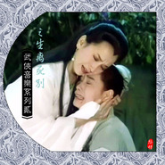

武侠音乐系列第二部之悲情篇武侠音乐系列二之生离死别
============================

|  |  |
| :--: | :-- |
| [ 武侠音乐系列第二部之悲情篇武侠音乐系列二之生离死别](https://emumo.xiami.com/album/1663576619) | **艺人**: [武聆音雄](../index.md) **语种**: 国语 **唱片公司**: 武聆音雄 **发行时间**: 2013年02月26日 **专辑类别**: 合集, 杂锦 **专辑风格**: 电影原声 Film Score, 电视原声 Television Music, 游戏配乐 Video Game Music **播放数**: 309522 **收藏数**: 487 **评论数**: 22  |

## 简介

一.简介  
此专辑与《武侠音乐系列》中的震惊专辑、悲伤专辑以及《仙侠游戏音乐系列》中的悲伤篇是一脉相承的。  
关于武侠豪情之音乐特点等等介绍，请参见《03.武侠音乐系列之晴天霹雳（震惊）》与《04.武侠音乐系列之黯然销魂（悲伤）》《4.仙侠游戏音乐系列之悲伤篇》。  
目前，仅以此专辑曲目为例来说明武侠悲情音乐之常用乐器以及应用场景。  
  
二.常用乐器  
1.拉弦乐器（主要为提琴和二胡）在打击乐下忽然猛烈之拉动，而后便趋近平静，是为武侠震惊音乐之特点，例如：Dr.Moreau、凤霞之死、江湖、太始、灭绝师太之死。  
2.笛声多重奏、弦乐多重奏，例如：Sad_Shakuhachi、Trevor Jones - Top Of The World、THE_PROMISED_LAND、悲情身世、此恨綿綿、心系江山 忧国忧民、利秀公主忧国  
3.二胡板胡主奏，例如：sadslow、英雄之情怀、史菁菁、武当大事、张进酒吟诗、努尔哈赤临死、超渡楊母、张进酒吟诗、blue。  
4.埚、箫、笛主奏，例如：江月、泣别、苍茫、I Miss You。  
5.提琴马头琴主奏，例如：兄弟情、The Serum、梅妃失落曲。  
  
三.应用场景  
1.震惊式悲伤。目睹人物惨死而不能为力，或者忽听噩耗，例如：凤霞之死、灭绝师太之死、Dr.Moreau、方世玉之死、素英之死、铁桥三之死、努尔哈赤临死、朱元璋发丧、江湖、太始、史菁菁、武当大事。  
2.震惊式悲伤。希望破灭之时，悲愤悔恨，例如：Trio、众叛亲离、萧氏遗孤、幻海梦萦、  
3.感叹世事，心系百姓，忧国忧民之感，例如：心系江山 忧国忧民、张进酒吟诗、利秀公主忧国、千里寻情。  
4.迷茫、悔恨、痛苦回忆等等，例如：Sad_Shakuhachi、I Miss You、爱得深痛更深、兄弟情、悲情身世、萧氏遗孤、  
  
四.曲目列表  
  
原版音乐  
  
01.Sad Shakuhachi迷茫  
  
①专辑中文名: ATMOS44（atmosphere音乐库）  
②艺术家：Joji Hirota  
③发行时间：  
④音律分析：开头便是持续低吟的提琴的苍凉，而后吹管乐的似乎撞在心灵上，令人心中颤动，有种惆怅，更有种迷茫。1分45秒时，尺八的响起，更是有种心灰意冷的感受。最后又回到了低沉提琴下的管乐，仍然无法挣脱残酷的命运，哎！   
⑤音画分析：   
⑥被引用记录：寻秦记、tvb碧血剑等  
  
02. I Miss You  
  
①专辑中文名: 绝地双尊  
②艺术家：Arthur Kempel  
③发行时间：1991年  
④音律分析：此乐以一声低沉的长笛与提琴刻画出一种心情沉重的感觉，更有一种忧国忧民，心系国仇家恨的感觉，是武侠音乐中的精品呀。  
⑤音画分析：丐帮长老被后继帮主庄聚贤所杀，临死之前回想当年乔帮主在位的时候丐帮如何强盛，而如今却是跪拜于星宿老怪旗下，回想之中黯然伤神，大呼大声“乔帮主”，之后便气绝身亡了。另外一段，乔峰感慨“你骂我辽狗，我骂你宋猪”，一种心系天下苍生的情怀。  
⑥被引用记录：tvb天龙八部  
  
03. Dr.Moreau  
  
①专辑中文名: The Island Of Dr.Moreau  
②艺术家：Gary Chang  
③发行时间：1996年  
④音律分析：一种似有似无之声却有一种低沉，之后，一声打击乐下提琴之升华，是那么的悲壮、那么令人震惊。   
⑤音画分析：这也是雪花神剑中最常用的武侠震惊音乐了。尹天相之死。   
⑥被引用记录：atv雪花神剑  
  
04.凤霞之死  
  
①专辑中文名:活着  
②艺术家：赵季平  
③发行时间：1995年  
④音律分析：提琴低沉，鼓声断断续续，一种大风暴前夕的感觉。而后猛烈一声打击乐，二胡也是强力猛烈之拉动，一种震撼，更是一种晴天霹雳。   
⑤音画分析：经典的武侠震惊音乐，洪熙官中日月会总舵主赤龙进宫刺杀乾隆失败被杀，临死前仍然屹立，而在被推倒之时，此曲响起，一种英雄气短令人震惊。  
⑥被引用记录：洪熙官、天师钟馗新加坡版  
  
05.江湖  
  
①专辑中文名:卧虎藏龙 电视剧音乐全纪录  
②艺术家：周志华  
③发行时间：2000年  
④音律分析：提琴下的二胡却是异常悲恸，中间忽来的唢呐几声呐喊之下，最后仍然是放弃了，却也是非常无奈呀！  
⑤音画分析：武侠震惊音乐，有种噩耗来到，心中震惊的感觉。  
⑥被引用记录：  
  
06.情爱几多哀（音乐）  
  
①专辑中文名: 1982TVB天龙八部  
②艺术家：顾嘉辉  
③发行时间：1982年  
④音律分析：首先，它有着不折不扣的古典韵味，伴奏的选择很关键，顾嘉辉先生将中国的扬琴和西洋的吉他配合得天衣无缝，两种乐音缠绕难解，间中以木鱼打点做节拍，长笛如泣如诉牵引思绪，尾声部分又饰以古筝划出一抹流水，清冽冷然。（七重影评）  
⑤音画分析：似乎是看破红尘前的追忆，却在木鱼与青灯的声影交替中洗尽俗世中每一段恩怨情仇。流光飞舞，唏嘘不已。（七重影评）  
⑥被引用记录：   
  
07.别儿赴雷峰  
  
①专辑中文名：新白娘子传奇  
②艺术家：左宏元 (夜心醉 重新合成)  
③发行时间：1992年  
④音律分析：  
⑤音画分析：白素贞被押往雷峰塔时所奏之乐.  
⑥被引用记录：香帅传奇等台剧  
  
08.太始  
  
①专辑中文名: 古事记  
②艺术家：喜多郎  
③发行时间：1990年  
④音律分析：开头便是一种水在左右耳间分别流淌，心在颤动，偶尔会有几声闪电，似乎这是大风暴之前夕。在2分钟时，一种悲壮终于爆发了，一种气动山河的震撼，这震撼之中却又隐藏不了他本身的哀伤。   
⑤音画分析：许多武侠剧中会常常出现的一种震惊音乐。例如，笑傲江湖之中日月神教史长老自尽之时也用了这首，英雄气短，蒙冤而死，令人愤慨令人无奈。  
⑥被引用记录：tvb笑傲江湖  
  
09. Main Titles The Hunting  
  
①专辑中文名: The Last Of The Mohicans  
②艺术家：Trevor Jones  
③发行时间：1992年  
④音律分析：多重提琴带来的苍凉与沉重，阵阵回旋与呐喊之中更显得惆怅与迷茫。   
⑤音画分析：杨排风认出了当年的杀害全家的仇人，却是如今救了杨延昭性命的人。杨排风偶然听到杨延昭谈论此事，知道杨延昭为以身犯险，手刃仇人。杨排风此时陷入两难， 回忆起当年杨家对她的关爱，她未免杨延昭为自己报仇，触犯律法，于是决定掩藏起这段家仇。这首音乐之间的那种的两难的沉重，真是令人感触颇深呀！  
⑥被引用记录：atv穆桂英大破天门阵，关礼杰版小李飞刀  
  
10.兄弟情  
  
①专辑中文名:太极张三丰  
②艺术家：胡伟立  
③发行时间：1993年  
④音律分析：开头钟声下的提琴便是一种沉重与惆怅，而后一种富含侠气之弦乐点缀下，提琴之低吟却也显得有情有义了。  
⑤音画分析：天师钟馗那段场景中，王富曲看到大哥之尸首，配合着这首音乐，产生出一种沉重无奈却又带有一丝豪情的兄弟之情。  
⑥被引用记录：无数港台新加坡武侠剧  
  
11.江月  
①专辑中文名: 电视剧西游记原声  
②艺术家：许镜清  
③发行时间：1986年  
④音律分析：埙这种乐器演奏着西游记这主题旋律，却也有满腹的迷茫与无奈。  
⑤音画分析：抛绣球之后，二人携手共游，琵琶之中尽显一种温情，而其中仍然不乏一种迷幻，也预示着这噩梦即将到来。   
⑥被引用记录：  
  
12.Sadslow  
①专辑中文名:天龙八部单机版  
②艺术家：蔡志展  
③发行时间：2002年  
④音乐赏析：二胡版的英雄梦，尽显一片哀伤。   
⑤被引用记录：  
  
13.A Place Of Light And Song  
  
①专辑中文名: 功夫：续写传奇  
②艺术家：Jeff Danna  
③发行时间：1996年  
④音乐赏析：长笛勾勒下的二胡，心生愁绪。琵琶滚滚而来，徒添惆怅。旋律始终如一，无奈之心境始终没有改变。  
⑤被引用记录：tvb笑傲江湖  
  
14.英雄之情怀  
①专辑中文名:水浒传  
②艺术家：周志勇/宋飞  
③发行时间：2011年  
④音乐赏析：鲁达三拳打死镇关西，被官府追捕，逃到五台山削发为僧，改名鲁智深。剃度之时，回忆起自己如何打死镇关西，保留胡须而不得时更是落泪。此时清脆响亮而又奔放的板胡演绎出一种悲凉凄美之曲，中间更是透露着一种不得已而出家的悲愤。  
⑤被引用记录：  
  
15. For The Love Of A Princess  
  
①专辑中文名:勇敢的心  
②艺术家：James Horner  
③发行时间：1993年  
④音律分析：开头笛子之颤音，便有一种无尽的迷茫。提琴之合奏更有大气式的无奈，一种壮阔式的悲伤。   
⑤音画分析：这段配乐主要用在小林子家破人亡时，此后每次他感慨父母双亡，命运多舛，这段悲壮大气的苏格兰风笛总会响起。  
⑥被引用记录：tvb笑傲江湖、atv穆桂英大破天门阵  
  
16.史菁菁   
  
①专辑中文名:霹靂天闕 下  
②艺术家：  
③发行时间：  
④音乐赏析：武侠震惊音乐之典型，一声打击乐之后，马上便是回旋之弦乐，营造出一种震撼。经过了一阵阵震惊之后，心情也慢慢平静了一些，响起了一阵阵低沉的二胡之音，展示出别样的悲伤与无奈。  
⑤被引用记录：  
  
17.試拂鐵衣如雪衣(黄飛鴻戲棚顯身手)  
  
①专辑中文名：黄飞鸿系列电影原声精装版  
②艺术家：古曲《将军令》改编而来  
③发行时间：1997年  
④音律分析：   
⑤音画分析：   
⑥被引用记录：黄飞鸿新传之八大天王  
  
18.The Serum  
①专辑中文名: The Island Of Dr.Moreau  
②艺术家：Gary Chang  
③发行时间：1996年  
④音律分析：遥远之铃声慢慢靠近，有些迷幻有些低沉；笛声慢慢道来，提琴更是一片深情，却也迷茫。整首曲目听起来异常平静，却仍然隐藏不了那种泪水静静地流淌。  
⑤音画分析：雪花神剑中聂媚娘之死，似乎已经在预料之中了，一种平静，更是一种愤慨。  
⑥被引用记录：tvb碧血剑、atv雪花神剑  
  
19.The Promised Land Farnon昔影  
①专辑中文名:  
②艺术家：  
③发行时间：  
④音乐赏析：交响乐式的大气与悲痛，更是一种悲壮。  
⑤被引用记录：tvb寻秦记  
  
20.Linc's Death  
①专辑中文名: Noble House  
②艺术家：Paul Chihara  
③发行时间：1988年  
④音律分析：   
⑤音画分析：莫言之死,司空摘星之死时的音乐.  
⑥被引用记录：香帅传奇  
  
21.此恨绵绵  
  
①专辑中文名:青蛇  
②艺术家：黄沾&amp;雷颂德  
③发行时间：1992年  
④音律分析：多重提琴下，一声二胡，便深感沉重。女声哀怨之中，渐渐鼓声四起，令音乐之中带来一种动力，也带来了悲痛。  
⑤音画分析：常用于剧中心生感慨，或者心中后悔时。  
⑥被引用记录：无数港台新加坡武侠剧  
  
22.泣别  
①专辑中文名:后宫  
②艺术家：林海  
③发行时间：2001年  
④音律分析：笛箫之音升起，却似乎又回落，或许心中仍然有许多的放不下。中间的一段琵琶或者令人进入另一段沉思，或许还有解救之法。然而最后仍然是笛箫之回归。  
⑤音画分析：杨永吹奏一曲，却在吹奏之中回忆起曾经与兄长的片段，最后却是兄长之惨死。  
⑥被引用记录：  
  
23.闻悲  
①专辑中文名:水月洞天  
②艺术家：  
③发行时间：2004年  
④音乐赏析：淡淡的鼓声下，拉弦乐在颤抖，便开始展现出那种低沉。高亢而又转为低沉的女声仍然显示出万般的无奈。  
⑤被引用记录：  
  
24. Bule  
①专辑中文名：天龙八部单机版  
②艺术家：蔡志展  
③发行时间：2002年  
④音乐赏析：清澈的弹拨弦乐点点而上，似有似无；笛声婉转苍凉，紧随的二胡在提琴相伴下道尽了心中那种悲愤、无奈与哀怨。  
⑤被引用记录：  
  
25.Trio  
①专辑中文名: The Quiet Earth  
②艺术家：John Charles  
③发行时间：1985年  
④音律分析：持续之提起之下，一声清脆而又钟磬之音却显得异常悲痛。   
⑤音画分析：李莫愁一生只为陆展元，用情可谓专一，却最终遭到抛弃，实在是悲愤。而这首音乐，就是用在李莫愁将曾经寄托着他对陆郎思念的手帕捏为粉碎，其中之无奈与悲痛，在这音乐中就已经得到了很好的体现。  
⑥被引用记录：tvb神雕侠侣  
  
26.爱得深通更深  
  
①专辑中文名:聊斋志异  
②艺术家：麦振鸿  
③发行时间：2004年  
④音律分析：低沉而又持续的提琴在节奏性的弹拨弦乐下烘托出一种沉重之感，而后一种似男声之乐器中有种呐喊与行动，似乎预示着形势之危急。   
⑤音画分析：曾经的《六指大夫》。   
⑥被引用记录：  
  
27.爱难全  
①专辑中文名:花木兰电影原声带  
②艺术家：谭盾  
③发行时间：2009年  
④音律分析：   
⑤音画分析：   
⑥被引用记录：  
  
28. Over The Summits  
  
①专辑中文名: SEL5138   
②艺术家：  
③发行时间：  
④音律分析：   
⑤音画分析：心灰 原曲  
⑥被引用记录：寻秦记  
  
截取曲目:  
  
01.素英之死（生离死别曲）  
  
①专辑中文名:金枝欲孽  
②艺术家：陈国梁  
③发行时间：2004年  
④音律分析：提琴合奏下便带来一种震撼式的悲痛，而后提琴下的女声更是哀怨动天，最后的二胡似乎也告诉我们，一切皆是命中注定，实在是令人心灰意冷，心如死灰。  
⑤音画分析：在金枝欲孽中出现的地方比较多，每次都是在死别之时，例如：素英之死、安茜的奶奶死、如妃的小格格去世、沅琪之死、常永禄（小禄子）之死等等。其中最令人感伤的应该是素英之死， 素英是个普通的宫女，因为被指为“打翻送子观音”而死。而事实上观音是被乌鸦打翻的，无奈在那个时代，人命又如何比得上乌鸦呢？安茜深明宫中规矩，只求能 保素英全尸回乡，于是给素英毒药。这时这首音乐的响起，素英的死亡就不言而喻了。神鸦无人追究，人命如此被看贱。  
在楚汉骄雄的第一集里，刘邦晚年来到乌江，回忆当年楚汉相争之情形，不禁感慨万千。  
⑥被引用记录：楚汉骄雄  
  
02.悲情身世  
  
①专辑中文名:97天龙八部  
②艺术家：陈国梁  
③发行时间：1997年  
④音律分析：多重提琴之回旋下，奠定了曲目沉重悲痛之基调。而后面，无论是二胡，还是提琴，始终在几处旋律中徘徊犹豫，一直在寻找出路寻找一种解脱，却始终都没有走出来，似乎在诉说心中那种永远都无法解开的哀愁。  
⑤音画分析：这首音乐堪称是武侠音乐中不可多得之奇葩，自从97天龙中出现这首音乐后，后面的很多tvb武侠剧中都有再现。  
在97天龙中，这首音乐始终与乔峰之身世联系在一起。无论是乔峰知道身世后回忆当年的养父母，还是乔峰在结局时来到雁门关回忆起当年雁门关放生的一切，这首音乐都一直相随。似乎乔峰每次都在这种悲情之身世中挣扎，寻找解脱，却始终难逃无情命运之摆布。  
在碧血剑中，袁承志终于明白了内奸便是自己深爱的阿九，曾经的一切希望就在此时彻底破灭，与阿九竟然是对头人。这首曲子之响起，道尽了袁承志心中的那种无奈与悲痛。碧血剑结局处，袁承志终于明白了阿九便是长平公主，也是用了这首音乐，或者，此生便是有缘无分了。  
⑥被引用记录：2000碧血剑、2001倚天屠龙记等无数tvb武侠剧  
  
03.心系江山 忧国忧民  
  
①专辑中文名:天师钟馗新加坡版  
②艺术家：John Kuek  
③发行时间：1994年  
④音乐赏析：一种对人间苦难的同情与感悟。小时候看这部剧的时候，对这首提琴演奏的沉重音乐就已经印象深刻了，也常常在人前人后哼这首音乐。如今花了两个多小时终于将这首完整的音乐拼接出来了。《天师钟馗》是以钟馗受封为“伏魔大将军”以及斩妖除魔，除金阴阳不平之事为主线的。  
这首音乐从头到尾都是一种提琴的演绎，其中却流露着一种非常真挚的感情。在这部剧中，这首音乐出现过很多次，但是每一次都以一种烘托情感的目的出现的。钟天师对人间苦难的同情与感慨，对善者受难恶人横行的悲愤，一种忧国忧民的情怀。也用于表现那种毫无功利性的亲情友情爱情等等美好的情感，相濡以沫、同甘共苦。钟馗一路走来，从唐玄宗年间走到明世宗年间，几百年来，斩尽妖魔，也目睹了人间真挚的情感，人民深深的苦难，对世间逐渐有了深深的感悟。而这首音乐，似乎就是一种大彻大悟的代表。  
⑤被引用记录：  
  
04.萧氏遗孤  
  
①专辑中文名:97天龙八部  
②艺术家：陈国梁  
③发行时间：1997年  
④音律分析：琵琶在若隐若现中滚动，增添一丝沉重。提琴在几个旋律中不断回旋，将一种悲愤、愤慨与悔恨表露无遗。  
⑤音画分析：五台山智光大师讲述曾经的故事，雁门关之役后，中原人士深表愧疚，于是将乔峰交给乔三槐夫妇收养。音乐之中将智光大师心中那种悔恨与愧疚重逢表达。另外，当乔峰错手杀死阿朱后，段正淳说明并非带头大哥时，方知自己错上加错，看来一切都是天意，天要亡乔峰，音乐更是尽显悲愤。  
⑥被引用记录：tvb倚天屠龙记等  
  
05.张进酒吟诗  
  
①专辑中文名:天下第一  
②艺术家：麦振鸿 翁之探  
③发行时间：2005年  
④音律分析：提琴下的长笛便是那样迷茫，弹拨弦乐点缀下的二胡更是一种哀伤。笛声的步步逼近与追问之下，最后仍然是趋于放弃。  
⑤音画分析：神探张进酒吟诗那段，配合着这首苍凉的曲子，可谓是神来之笔。或者正如张进酒所言“天下的事，我不想知道的太多。知道的越多，对这个世界也许就会越失望”。另外，段天涯看到海棠被杀后，仍然是这首痛彻心扉的音乐。  
⑥被引用记录：小鱼儿与花无缺  
  
06.梅妃失落曲  
  
①专辑中文名:杨贵妃秘史  
②艺术家：张宏光(蜻蜓截取)  
③发行时间：2010年  
④音乐赏析：马头琴那特有的沙哑声，点点深入心间，之后音乐忽然遁入高潮，与杨贵妃的得意之时相对比，剩下的，便只有梅妃那孤独的身影与无言的清泪……（武聆音雄--宇雯复苏）  
⑤被引用记录：  
  
07.朱元璋发丧  
①专辑中文名: 洪武三十二  
②艺术家：陈国梁(潇湘子截取)  
③发行时间：2011年  
④音律分析：悲情身世的另一版本，也是洪武三十二中对曾经97天龙音乐的重新演绎。此曲相比而言，更多是那种节奏性的打击乐，在悲情之中添加了更多的浩然之气。  
⑤音画分析：洪武三十二中，朱元璋发丧之时，众皇子披麻戴孝，便用此曲。此旋律更是用于无数tvb武侠剧中。  
⑥被引用记录：  
  
08.利秀公主忧国  
  
①专辑中文名：天下第一  
②艺术家：麦振鸿 翁之探  
③发行时间：2005年  
④音律分析：低沉的提琴，远方似乎还映照着来回摇摇摆摆下的琵琶，勾勒出一种惆怅与忧虑。  
⑤音画分析：这首音乐用在了利秀公主吟诗的这段“风景不殊，举目有河山之异，故国不堪回首明月中。”表现出一种强烈的“国破山河在，城春草木深”的忧国忧民之感。   
⑥被引用记录：  
  
09.灭绝师太之死  
①专辑中文名:倚天屠龙记  
②艺术家：tvb  
③发行时间：2001年  
④音律分析：提琴猛然拉动，便一发不可收拾，营造出那种忽听噩耗的震惊。笛声趋于平静，却仍然逃脱不了悲痛之情。  
⑤音画分析：灭绝师太亦正亦邪，“为保清誉”不惜自尽，死之片刻，也尽显震惊。另外，此曲在张翠山自杀时也有所出现。  
⑥被引用记录：  
  
10.千里寻情  
  
①专辑中文名: 聊斋志异&amp;聊斋奇女子  
②艺术家：麦振鸿  
③发行时间：2005年  
④音乐赏析：对于千里寻情，最感怀的还是辛十四娘，曾经救济过无数村民后来却遭到了村民的围攻险些丧命，最后她仍然牺牲了自己保全了村民。而这首千里寻情就出现在辛十四娘即将灰飞烟灭的时候，感人至深呀！  
⑤被引用记录：  
  
11.方世玉之死  
①专辑中文名:洪熙官  
②艺术家：黄邦贤  
③发行时间：1994年  
④音律分析：几声敲打下，昔日之英雄终于倒下了。低吟之笛声婉转悠扬，却又是那么的令人悲伤惆怅，陷入沉思之中。  
⑤音画分析：方世玉为奸人所害，三德洪熙官赶到之时已经奄奄一息了。  
⑥被引用记录：杀人者唐斩  
  
12.努尔哈赤临死  
①专辑中文名:孝庄秘史原声配乐全纪录  
②艺术家：张宏光(中华雄鹰截取)  
③发行时间：2002年  
④音律分析：单薄的二胡拉奏着主题曲旋律，显得低沉；提琴的加入更是带来了更多的沉重。  
⑤音画分析：努尔哈赤临死之时，欲将汗位传于多尔衮，却最终仍然难以支撑。  
⑥被引用记录：  
  
13.众叛亲离  
  
①专辑中文名:97天龙八部  
②艺术家：陈国梁  
③发行时间：1997年  
④音律分析：琵琶滚动之中，一阵悔恨与绝望。曾经的希望就此彻底破灭。  
⑤音画分析：此曲使用非常频繁，天龙中少林寺大会上，庄聚贤为乔峰所败，一句质问“你怎么配做丐帮帮主”，庄聚贤那种众叛亲离之感顿生。  
⑥被引用记录：tvb倚天屠龙记  
  
14.陆阿采之死  
①专辑中文名: 英雄-广东十虎配乐集  
②艺术家：黄邦贤(夕下袂舞截取)  
③发行时间：1999  
④音律分析：曲子前段音调非常少，有种迷惘的悬疑感觉，节奏很的紧密。中间包含主题所呈现的悲壮，主要由二胡叙述，由意生恨，其形神堪比“祭祀乐队”主乐。作为主题所表现的恨、无奈、竭斯底里的悲伤，二胡的弦上音色，强烈的震撼人心。   
⑤音画分析：根据第38集看陆阿才之死时，坟墓前的场景配合着这首音乐的这些章节，随着主题音乐的高低起伏，前后承载，音乐情景搭配得可谓天衣无缝。再看第40集铁桥三死时倒下的一瞬间，前奏猛烈震撼，很凄凉，在这格外凄凉的森林里，结合几声大雁的叫声，我们也不难想象到一句“风萧萧兮易水寒，壮士一去兮不复还！”，深深的沉思，悲叹。之后在主题音乐无声的画面下，所有的人只有哭泣，悲伤，音乐的起始与情节配合的完美无瑕，将人物内心的所有情感都一一托出了。（武聆音雄--夕下袂舞）  
⑥被引用记录：  
  
16.满江红（配乐版）  
  
①专辑中文名:大宋提刑官  
②艺术家：程池(遥听千里截取)  
③发行时间：2005年  
④音乐赏析：鸟鸣之中，钟声骤响，笛声于步步回旋之中质问，一片迷茫与苍凉。  
⑤被引用记录：  
  
17.媚娘之死  
  
①专辑中文名:武林外史  
②艺术家：杨奇昌(凌波鱼儿截取)  
③发行时间：  
④音乐赏析：  
⑤被引用记录：寻秦记  
  
18.痛心疾首  
  
①专辑中文名: 布衣神相  
②艺术家：tvb(追乐人截取)  
③发行时间：2005年  
④音律分析：   
⑤音画分析：   
⑥被引用记录：  
  
19.能医不自医  
①专辑中文名: 布衣神相  
②艺术家：tvb(追乐人截取)  
③发行时间：2005年  
④音律分析：   
⑤音画分析：李布衣偶尔遇见故人,感慨能医不自医.  
⑥被引用记录：  
  
20.圆明园背景音乐   
①专辑中文名: 圆明园纪录片  
②艺术家：  
③发行时间：2006年  
④音律分析：   
⑤音画分析：   
⑥被引用记录：  
  
21.强剑配乐  
  
①专辑中文名: 《强剑》未知插曲配乐  
②艺术家：黄邦贤  
③发行时间：2004年  
④音律分析：钢琴加和声，相映相融的表现了出一种久违的感动，同时中间处缓缓平升，融和唢呐的悲壮，有种诉不完的心酸，并且节奏感又有一种豪情的启示。  
⑤音画分析：电视剧《强剑》第一集介绍“苍鹰”托儿的片段时，一种瞬间的感动于脑海中砰然幻化，当其二人双双坠崖的画面也油然心碎了。(夕下袂舞 评)  
⑥被引用记录：镖行天下之七星端砚  
  
22.英雄悔  
  
①专辑中文名: 《英雄本色》未知插曲配乐  
②艺术家：周思贤(夕下袂舞截取)  
③发行时间：2003年  
④音律分析：根据主题编曲的另一版。前奏沉重的打击，强烈的震撼人心，曲子缓慢，婉转回旋，萧中所带的的依依不舍之情加上和声的铿锵决声，垫定了誓死不渝的英雄气概。  
⑤音画分析：剧中常用于悲情画面以及离别时的情景。(夕下袂舞 评)  
⑥被引用记录：风云争霸  
  
五.配乐视频  
  
01.上部视频 (0 folders, 4 files, 36.64 MB, 36.64 MB in total.)  
  
01.萧远山-天龙八部-陈国梁.mkv 6.31 MB  
02.萨哈多之死-洪熙官-雨夜诀别-赵季平.flv 8.23 MB  
03.张无忌救苍生-倚天屠龙记-温馨.mkv 7.74 MB  
04.李岩之死-碧血剑-悲愤-胡伟立.mkv 14.37 MB  
  
02.本部视频 (0 folders, 27 files, 288.08 MB, 288.08 MB in total.)  
  
01.雁门关-天龙八部-悲情身世-陈国梁.mkv 16.08 MB  
02.项少龙命悬一线-寻秦记-Sad_Shakuhachi.mkv 18.90 MB  
03.利秀公主忧国-天下第一-麦振鸿&amp;翁之探.mkv 4.57 MB  
04.以往之事-寻秦记-周容安&amp;杨奇昌.mkv 14.14 MB  
05.赤龙之死-洪熙官-凤霞之死-赵季平.flv 1.85 MB  
06.聂媚娘之死-雪花神剑-The Serum-Gary Chang.flv 8.07 MB  
07.张进酒吟诗-天下第一-麦振鸿&amp;翁之探.mkv 8.08 MB  
08.祭拜钟馗-天师钟馗之杨贵妃-John Kuek.mkv 10.96 MB  
09.打草谷-天龙八部-I Miss You-Arthur Kempel.mkv 10.52 MB  
10.杀父仇人-碧血剑-Sad_Shakuhachi.mkv 14.55 MB  
11.赵雅之死-寻秦记-The Promised Land Farnon.mkv 10.46 MB  
12.梅妃失落曲-杨贵妃秘史-张宏光.flv 4.00 MB  
13.杨排风两难-穆桂英大破天门阵-The Hunting-Trevor Jones.flv 5.75 MB  
  
4.伤心的李莫愁-神雕侠侣-Trio-John Charles.mkv 7.59 MB  
5.阿九断臂-碧血剑-悲愤&amp;悲情身世-胡伟立&amp;陈国梁.mkv 44.39 MB  
6.十四娘的归宿-聊斋奇女子-千里寻情-麦振鸿.flv 5.25 MB  
7.兄弟情-天师钟馗之杨贵妃-兄弟情-胡伟立.mkv 11.35 MB  
8.莫言之死-香帅传奇-Linc's Death-Paul Chihara.mkv 12.54 MB  
9.萧氏遗孤-天龙八部-陈国梁.mkv 10.14 MB  
20.师太之死-笑傲江湖-For The Love Of A Princess-James Horner.mkv 13.04 MB  
21.陆阿采之死-英雄广东十虎-黄邦贤.flv 16.73 MB  
22.史长老之死-笑傲江湖-太始-喜多郎.mkv 6.21 MB  
23.陈天相之死-雪花神剑-Dr.Moreau-Gary Chang.flv 4.08 MB  
24.回忆兄长-后宫-泣别-林海.flv 4.23 MB  
25.辛十四娘逝世-聊斋奇女子之辛十四娘-爱得深痛更深-麦振鸿.flv 8.52 MB  
26.一刀的两难-天下第一-麦振鸿&amp;翁之探.mkv 12.75 MB  
27.方世玉之死-洪熙官-黄邦贤.flv 3.34 MB  
  
03.未知视频 (0 folders, 2 files, 20.04 MB, 20.04 MB in total.)  
01.了空之死 天下第一-麦振鸿&amp;翁之探.mkv 6.92 MB  
  
①作者：丘九天  
②出处：武聆音雄论坛  
③原文链接：<a href="http://www.wlyxmusic.com/thread-3537-1-1.html" target="_blank" rel="nofollow noreferrer noopener">http://www.wlyxmusic.com/thread-3537-1-1.html</a> 

## 曲目

## 评论

|  |  |  |  |
| :-- | :-- | :-- | :-- |
|  [虾米用户](https://emumo.xiami.com/u/2231133)  2018-12-19 02:29 赞(1) 踩(0) | 
(இωஇ )老大！我来听歌助睡！
 |
| ⇒ |  [虾米用户](https://emumo.xiami.com/u/53565) 更多武侠音乐，请关注武聆... 2018-12-19 17:24 赞(0) 踩(0) | 
大晚上的不睡觉呀？
 |
|  [虾米用户](https://emumo.xiami.com/u/311959866) 我还没想好要写什么... 2018-01-21 13:09 赞(0) 踩(0) | 
太伤感了~
 |
|  [虾米用户](https://emumo.xiami.com/u/2307526) 连接比特与像素的造梦师！ 2017-08-14 20:21 赞(0) 踩(0) | 
武侠音乐系列第二部之悲情篇!
 |
|  [虾米用户](https://emumo.xiami.com/u/2307526) 连接比特与像素的造梦师！ 2017-08-14 20:21 赞(0) 踩(0) | 
武侠音乐系列第二部之悲情篇!
 |
|  [虾米用户](https://emumo.xiami.com/u/12876004) ` 2017-06-21 08:12 赞(0) 踩(0) | 
。，。
 |
|  [虾米用户](https://emumo.xiami.com/u/39909066) 闲看庭前花开花落，漫随天... 2017-06-20 08:21 赞(1) 踩(0) | 
我记得这个专辑里 原本有《金枝欲孽》的插曲＜素英之死＞来着？
 |
| ⇒ |  [虾米用户](https://emumo.xiami.com/u/53565) 更多武侠音乐，请关注武聆... 2017-06-20 09:48 赞(0) 踩(0) | 
在第一部的视频里面
 |
| ⇒ |  [虾米用户](https://emumo.xiami.com/u/39909066) 闲看庭前花开花落，漫随天... 2017-06-20 09:56 赞(0) 踩(0) | 
<q><b>武聆音雄说：</b></q>
 |
|  [虾米用户](https://emumo.xiami.com/u/19256136)  2014-11-20 20:57 赞(1) 踩(0) | 
此专辑用以表现悲情伤情的专辑。1.震惊式悲伤。目睹人物惨死而不能为力，或者忽听噩耗，2.震惊式悲伤。希望破灭之时，悲愤悔恨，3.感叹世事，心系百姓，忧国忧民之感，4.迷茫、悔恨、痛苦回忆等等，
 |
|  [虾米用户](https://emumo.xiami.com/u/34185973)  2014-06-04 20:45 赞(0) 踩(0) | 
人生自古多离别~
 |
|  [虾米用户](https://emumo.xiami.com/u/5989165) 我还没想好要写什么... 2014-04-30 01:33 赞(0) 踩(0) | 
寻秦记原声带 什么时候能出来
 |
|  [虾米用户](https://emumo.xiami.com/u/28445083)  2013-11-26 18:32 赞(0) 踩(0) | 
辛苦了，音乐都很好
 |
|  [虾米用户](https://emumo.xiami.com/u/10542973) 简单生活 2013-11-04 22:31 赞(2) 踩(0) | 
武侠音乐系列第二部之悲情篇.doc102.00 KB曲目列表.txt1.05 KB01.原版音乐(0 folders, 39 files, 138.90 MB, 138.90 MB in total.)01.Sad_Shakuhachi.mp38.79 MB02.I Miss You.mp31.78 MB03.Dr.Moreau.mp34.34 MB04.凤霞之死.mp31.92 MB05.江湖.mp32.27 MB06.情爱几多哀（音乐）.mp33.22 MB07.别儿赴雷峰.mp33.18 MB08.太始.mp38.18 MB09.Main Titles  The Hunting.mp34.93 MB10.兄弟情.mp32.72 MB11.江月.mp33.87 MB12.sadslow.mp32.12 MB13.A Place Of Light And Song.mp37.76 MB14.英雄之情怀.mp313.27 MB15.for the love of a princess.mp39.43 MB16.史菁菁.mp33.55 MB17.試拂鐵衣如雪衣(黄飛鴻戲棚顯身手).mp37.44 MB18.The Serum.mp36.04 MB19.The Promised Land Farnon.mp35.92 MB20.Linc&amp;#039;s Death.mp34.55 MB21.此恨綿綿.mp33.71 MB22.泣别.mp32.65 MB23.闻悲.mp32.80 MB24.blue.mp35.37 MB25.Trio.mp34.02 MB26.爱得深痛更深.mp32.84 MB27.爱难全.mp34.01 MB28.Over The Summits.mp38.12 MB02.截取音乐(0 folders, 19 files, 33.37 MB, 33.37 MB in total.)01.素英之死（生离死别曲）.mp31.75 MB02.悲情身世.mp33.05 MB03.心系江山 忧国忧民.mp31.78 MB04.萧氏遗孤.mp31.10 MB05.张进酒吟诗.mp31.82 MB06.梅妃失落曲.mp31.26 MB07.朱元璋發喪.mp3760.39 KB08.利秀公主忧国.mp3549.49 KB09.灭绝师太之死.mp3285.48 KB10.千里寻情.mp31.74 MB11.方世玉之死.mp31.53 MB12.努尔哈赤临死.mp32.07 MB13.众叛亲离.mp3372.70 KB14.陆阿采之死.mp38.19 MB16.满江红（配乐版）.mp33.32 MB17.媚娘之死.mp31.38 MB18.痛心疾首.mp3361.68 KB19.能医不自医.mp3194.53 KB20.圆明园背景音乐.mp31.91 MB21.强剑配乐22.英雄悔03.配乐视频(3 folders, 0 files, 0 bytes, 344.76 MB in total.)01.上部视频(0 folders, 4 files, 36.64 MB, 36.64 MB in total.)01.萧远山-天龙八部-陈国梁.mkv6.31 MB02.萨哈多之死-洪熙官-雨夜诀别-赵季平.flv8.23 MB03.张无忌救苍生-倚天屠龙记-温馨.mkv7.74 MB04.李岩之死-碧血剑-悲愤-胡伟立.mkv14.37 MB02.本部视频(0 folders, 27 files, 288.08 MB, 288.08 MB in total.)01.雁门关-天龙八部-悲情身世-陈国梁.mkv16.08 MB02.项少龙命悬一线-寻秦记-Sad_Shakuhachi.mkv18.90 MB03.利秀公主忧国-天下第一-麦振鸿&amp;amp;翁之探.mkv4.57 MB04.以往之事-寻秦记-周容安&amp;amp;杨奇昌.mkv14.14 MB05.赤龙之死-洪熙官-凤霞之死-赵季平.flv1.85 MB06.聂媚娘之死-雪花神剑-The Serum-Gary Chang.flv8.07 MB07.张进酒吟诗-天下第一-麦振鸿&amp;amp;翁之探.mkv8.08 MB08.祭拜钟馗-天师钟馗之杨贵妃-John Kuek.mkv10.96 MB09.打草谷-天龙八部-I Miss You-Arthur Kempel.mkv10.52 MB10.杀父仇人-碧血剑-Sad_Shakuhachi.mkv14.55 MB11.赵雅之死-寻秦记-The Promised Land Farnon.mkv10.46 MB12.梅妃失落曲-杨贵妃秘史-张宏光.flv4.00 MB13.杨排风两难-穆桂英大破天门阵-The Hunting-Trevor Jones.flv5.75 MB4.伤心的李莫愁-神雕侠侣-Trio-John Charles.mkv7.59 MB5.阿九断臂-碧血剑-悲愤&amp;amp;悲情身世-胡伟立&amp;amp;陈国梁.mkv44.39 MB6.十四娘的归宿-聊斋奇女子-千里寻情-麦振鸿.flv5.25 MB7.兄弟情-天师钟馗之杨贵妃-兄弟情-胡伟立.mkv11.35 MB8.莫言之死-香帅传奇-Linc&amp;#039;s Death-Paul Chihara.mkv12.54 MB9.萧氏遗孤-天龙八部-陈国梁.mkv10.14 MB20.师太之死-笑傲江湖-For The Love Of A Princess-James Horner.mkv13.04 MB21.陆阿采之死-英雄广东十虎-黄邦贤.flv16.73 MB22.史长老之死-笑傲江湖-太始-喜多郎.mkv6.21 MB23.陈天相之死-雪花神剑-Dr.Moreau-Gary Chang.flv4.08 MB24.回忆兄长-后宫-泣别-林海.flv4.23 MB25.辛十四娘逝世-聊斋奇女子之辛十四娘-爱得深痛更深-麦振鸿.flv8.52 MB26.一刀的两难-天下第一-麦振鸿&amp;amp;翁之探.mkv12.75 MB27.方世玉之死-洪熙官-黄邦贤.flv3.34 MB03.未知视频(0 folders, 2 files, 20.04 MB, 20.04 MB in total.)01.了空之死 天下第一-麦振鸿&amp;amp;翁之探.mkv6.92 MB
 |
| ⇒ |  [虾米用户](https://emumo.xiami.com/u/343886390)  2018-02-02 09:15 赞(0) 踩(0) | 

 |
|  [虾米用户](https://emumo.xiami.com/u/10804031) 音乐史一部电影的灵魂。 2013-10-09 19:33 赞(0) 踩(0) | 
武侠背景（悲情）
 |
|  [虾米用户](https://emumo.xiami.com/u/10640160)  2013-09-28 22:35 赞(3) 踩(0) | 
为了救魔王爪下命悬一线的儿子，心急如焚的白素贞打伤天兵、冲出囚塔，这却是20年骨肉分离后的第一次相见，无奈法海不懂爱，怒令白蛇归塔。许士林才见母亲，又得得而复失，内心的理智堤坝奔溃，感情如洪水喷涌，紧紧拥住亲人，一声“娘”叫碎了多少观众的心！生离死别，是人间最痛的悲哀。人生八苦，生老病死，爱别离，怨长久，求不得，放不下，这时候音乐的配合是切合的，深刻地渲染了人生命运中的悲情。。。。
 |
|  [虾米用户](https://emumo.xiami.com/u/21916115)  2013-09-22 10:29 赞(0) 踩(0) | 
武侠音乐之悲情
 |
|  [虾米用户](https://emumo.xiami.com/u/14081203) 习惯孤独。 2013-06-09 14:20 赞(0) 踩(0) | 
谢谢整理，好好听哦
 |
|  [虾米用户](https://emumo.xiami.com/u/10976744) 爱音乐 爱生活 2013-03-22 14:07 赞(0) 踩(0) | 
很有中国味道的配乐
 |
|  [虾米用户](https://emumo.xiami.com/u/355865) Let it go, l... 2013-03-18 15:20 赞(0) 踩(0) | 
真的很感谢整理～这些配乐有很多从未收录在正式专辑或原声带中。
 |
|  [虾米用户](https://emumo.xiami.com/u/8797833)  2013-03-18 14:51 赞(1) 踩(0) | 
<a href="http://www.wlyxmusic.com/thread-3537-1-1.html" target="_blank" rel="nofollow noreferrer noopener">http://www.wlyxmusic.com/thread-3537-1-1.html</a>
 |
