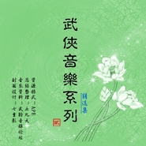

武侠音乐第二部精选集武侠音乐系列贰精选集
============================

|  |  |
| :--: | :-- |
| [ 武侠音乐第二部精选集武侠音乐系列贰精选集](https://emumo.xiami.com/album/1880270494) | **艺人**: [武聆音雄](../index.md) **语种**: 国语 **唱片公司**: 武聆音雄 **发行时间**: 2013年09月23日 **专辑类别**: 精选集 **专辑风格**: 电视原声 Television Music, 电影原声 Film Score, 中国风 China-Wave **播放数**: 3048251 **收藏数**: 3304 **评论数**: 61  |

## 简介

《武侠音乐系列》于2009年发布已有四年，《仙侠游戏音乐系列》发布于2010年12月，《武侠音乐系列第二部》也在今年3月完全发布。由于武侠音乐的来源甚广，例如：音色库、乐友截取版、乐友重新制作、音乐原作者发布、绝版音乐专辑等，“六经注我”，令发布的“音乐系列”难以统一音质。因此特别挑选整理，制作出一张“无损”专辑，算是这些系列里的首张“无损”专辑了，以满足武侠音乐发烧友们对“无损”的高音质追求，也让初识《武侠音乐系列》的乐友们有一个大概的了解。  
  
这张《无损版精选集》的曲子主要选自《武侠音乐系列第二部》。为了阐述《武侠音乐系列》与《武侠音乐系列第二部》承前启后的紧密联系，也选取了部分《武侠音乐系列》中的曲子，也增加了几首目前《音乐系列》没有出现过的新曲子。  
  
如果你喜欢这张《无损版精选集》，想要聆听更多的武侠音乐，查看相关曲目的更多介绍，请查找《武侠音乐系列第二部》慢慢欣赏~  
  
①作者：丘九天  
②出处：武聆音雄论坛  
③原文链接：<a href="http://www.wlyxmusic.com/thread-4354-1-1.html" target="_blank" rel="nofollow noreferrer noopener">http://www.wlyxmusic.com/thread-4354-1-1.html</a> 

## 曲目

## 评论

|  |  |  |  |
| :-- | :-- | :-- | :-- |
|  [虾米用户](https://emumo.xiami.com/u/355314628)  2019-07-16 23:32 赞(0) 踩(0) | 
童年的回忆，经典就是经典。百听不厌
 |
|  [虾米用户](https://emumo.xiami.com/u/345374036) 我还没想好要写什么... 2019-03-24 17:01 赞(0) 踩(0) | 
sad shakuhachi真是神作啊
 |
|  [虾米用户](https://emumo.xiami.com/u/406291548)  2019-03-16 20:48 赞(0) 踩(0) | 
经典系列，很带感
 |
|  [虾米用户](https://emumo.xiami.com/u/266291544)  2018-02-09 20:39 赞(0) 踩(0) | 
为啥叫第二部啊，第一部哪去了
 |
| ⇒ |  [虾米用户](https://emumo.xiami.com/u/354634609)  2018-08-01 16:37 赞(0) 踩(0) | 
第一部在网易云音乐有
 |
|  [虾米用户](https://emumo.xiami.com/u/251992971)  2017-08-31 11:51 赞(0) 踩(0) | 
love it
 |
|  [虾米用户](https://emumo.xiami.com/u/762181)   2017-04-06 03:55 赞(0) 踩(0) | 
.
 |
|  [虾米用户](https://emumo.xiami.com/u/45934021) 当你不去在乎的那一刻，你... 2017-01-24 00:06 赞(0) 踩(0) | 
武侠
 |
|  [虾米用户](https://emumo.xiami.com/u/17873182)   2017-01-12 17:40 赞(0) 踩(0) | 
跪求电视剧《天下第一》和《小鱼儿与华无缺》的配乐！
 |
|  [虾米用户](https://emumo.xiami.com/u/9605962)  2017-01-11 22:28 赞(0) 踩(0) | 
大爱武侠
 |
|  [虾米用户](https://emumo.xiami.com/u/207111678)  2016-07-31 00:54 赞(0) 踩(0) | 
真的是太经典了      不好找啊
 |
|  [虾米用户](https://emumo.xiami.com/u/10576792)  2016-06-05 10:36 赞(0) 踩(0) | 
喜欢喜欢超喜欢
 |
|  [虾米用户](https://emumo.xiami.com/u/153921928)  2016-04-27 23:15 赞(0) 踩(0) | 
武侠
 |
|  [虾米用户](https://emumo.xiami.com/u/446630)  2016-04-06 09:02 赞(0) 踩(0) | 
好听，喜欢中国的武侠风。
 |
|  [虾米用户](https://emumo.xiami.com/u/20894084) 静海 2016-03-01 06:49 赞(0) 踩(0) | 
好听，有回忆，喜欢。
 |
|  [虾米用户](https://emumo.xiami.com/u/48171880)  2016-01-23 22:00 赞(0) 踩(0) | 
武侠
 |
|  [虾米用户](https://emumo.xiami.com/u/780603) 单曲 ：背起行囊找寻你 2015-12-03 18:47 赞(0) 踩(0) | 
有仙鹤神针的曲子
 |
|  [虾米用户](https://emumo.xiami.com/u/83836748)  2015-11-17 10:44 赞(0) 踩(0) | 
只是想找一些音乐
 |
|  [虾米用户](https://emumo.xiami.com/u/10585490) rui 2015-09-29 13:50 赞(0) 踩(0) | 
武侠系列
 |
|  [虾米用户](https://emumo.xiami.com/u/40207170) ʕ• •ʔ 2015-06-24 23:22 赞(3) 踩(0) | 
寻秦记里那个插曲。。当年找了好久都没找到。Lady Of The Loch
 |
|  [虾米用户](https://emumo.xiami.com/u/10108021)   2015-03-31 01:05 赞(0) 踩(0) | 
ok
 |
|  [虾米用户](https://emumo.xiami.com/u/47013807) 己所不欲勿施于人。。。 2015-03-14 23:54 赞(0) 踩(0) | 
+1
 |
|  [虾米用户](https://emumo.xiami.com/u/2307526) 连接比特与像素的造梦师！ 2015-03-13 22:56 赞(0) 踩(0) | 
武侠音乐系列贰精选集
 |
|  [虾米用户](https://emumo.xiami.com/u/33514172) 我还没想好要写什么... 2015-01-13 13:29 赞(0) 踩(0) | 
精品！！！
 |
|  [虾米用户](https://emumo.xiami.com/u/41070837)  2015-01-09 10:26 赞(0) 踩(0) | 
身是中国人，难忘武侠梦。
 |
|  [虾米用户](https://emumo.xiami.com/u/40001760)  2014-12-26 16:53 赞(0) 踩(0) | 
回忆
 |
|  [虾米用户](https://emumo.xiami.com/u/29870347)  2014-12-12 14:25 赞(0) 踩(0) | 
够仙气
 |
|  [虾米用户](https://emumo.xiami.com/u/19256136)  2014-11-20 20:44 赞(0) 踩(0) | 
武侠音乐第二部精选集（值得收藏的无损专辑）
 |
|  [虾米用户](https://emumo.xiami.com/u/4730380)  2014-10-01 15:49 赞(0) 踩(0) | 
******
 |
|  [虾米用户](https://emumo.xiami.com/u/18142764)  2014-08-22 21:23 赞(0) 踩(0) | 
很好听，好喜欢。
 |
|  [虾米用户](https://emumo.xiami.com/u/24409443) yoyo 2014-07-24 15:30 赞(0) 踩(0) | 
每当音乐飘来，总是不自觉的忆起过往
 |
|  [虾米用户](https://emumo.xiami.com/u/34185973)  2014-06-04 20:42 赞(0) 踩(0) | 
喜欢~
 |
|  [虾米用户](https://emumo.xiami.com/u/590223)  2014-05-22 09:44 赞(0) 踩(0) | 
en
 |
|  [虾米用户](https://emumo.xiami.com/u/5989165) 我还没想好要写什么... 2014-04-30 01:32 赞(0) 踩(0) | 
如果能出一张寻秦记原声带 真好
 |
|  [虾米用户](https://emumo.xiami.com/u/17171774) 气球飞 2014-03-17 23:02 赞(0) 踩(0) | 
不错的BGM
 |
|  [虾米用户](https://emumo.xiami.com/u/28443189)  2014-02-27 13:37 赞(0) 踩(0) | 
Tosa No Haru 姬神 也是吕颂贤版笑傲江湖的插曲
 |
|  [虾米用户](https://emumo.xiami.com/u/8123521) 一人慎独，众人观心 2014-01-27 16:33 赞(0) 踩(0) | 
江湖中，勿相忘
 |
|  [虾米用户](https://emumo.xiami.com/u/7324864) 我还没想好要写什么... 2014-01-24 14:34 赞(0) 踩(0) | 
大爱
 |
|  [虾米用户](https://emumo.xiami.com/u/6750224)  2013-12-25 16:13 赞(0) 踩(0) | 
好听！
 |
|  [虾米用户](https://emumo.xiami.com/u/9814710) 这家伙超懒，什么都没留下 2013-12-17 23:33 赞(0) 踩(0) | 
武侠音乐
 |
|  [虾米用户](https://emumo.xiami.com/u/23244996)  2013-10-25 18:27 赞(1) 踩(0) | 
其实《甘十九妹》的背景音乐也很好听，大爱武侠。
 |
|  [虾米用户](https://emumo.xiami.com/u/25196985) 小虾哈哈 2013-10-23 20:13 赞(0) 踩(0) | 
经典 好歌曲
 |
|  [虾米用户](https://emumo.xiami.com/u/9103773)  2013-10-20 10:53 赞(0) 踩(0) | 
好听，经典
 |
|  [虾米用户](https://emumo.xiami.com/u/6204612)  2013-10-05 21:54 赞(0) 踩(0) | 
很好
 |
|  [虾米用户](https://emumo.xiami.com/u/10640160)  2013-09-28 21:16 赞(1) 踩(0) | 
好棒！！！o(≧v≦)o~~支持！楼下朋友写得真好，在那些年代，很多配乐没有得到关注，但又深深地影响了一代代人的情感与审美，希望通过这样的平台，让这些经典流传，向音乐人致敬！
 |
| ⇒ |  [虾米用户](https://emumo.xiami.com/u/20361050)  2013-09-28 21:24 赞(0) 踩(0) | 
恩呢，我们要尽力让这些曾经深深影响了我们的经典流传下去。
 |
| ⇒ |  [虾米用户](https://emumo.xiami.com/u/10640160)  2013-09-28 21:25 赞(0) 踩(0) | 
<q><b>丘九天说：</b></q>
 |
|  [虾米用户](https://emumo.xiami.com/u/355865) Let it go, l... 2013-09-27 21:22 赞(41) 踩(0) | 
武侠音乐的来源甚广，例如：音色库、乐友截取版、乐友重新制作、音乐原作者发布、绝版音乐专辑等。确实是如此。如果是最后两种，音乐原作者发布或绝版音乐专辑的话，虾米是允许添加资料发布的，因为这些配乐属于正式发行的范畴，音乐的音质也基本上不用担心，因为迟早会找到CD音源的。但如果配乐没有正式发行过，乐友从电视剧、电影的视频中截取，再进行加工这种，虽然目前看来没有别的办法，但我还是希望“武聆音雄”这样的组织能继续发展壮大，多多联系配乐的制作人，鼓励制作人把自己的作品独立、正式地发布出来。这样一能保证音质，二也能更完整地了解配乐家创作的作品。其实我一直想不通为什么很多优秀的配乐作者宁愿将自己的作品烂在手里，也不去出版、公布。我目前所理解的是，可能如果出版CD的话也许不赚钱反而亏，而多数配乐家目前也不是很能接受网络传播这种模式，因为网络传播必然会涉及到版权方面的限制。所以，说来说去，还是衷心的许下一个愿望，希望未来有一天，那些一直禁闭在配乐制作人工作室里的母盘、母带能重见天日被我们聆听到。载体或许不是CD或黑胶，但没关系。并且，在这些配乐被我们听到的同时，配乐家们也会收到相应的版权费用。虾米和武聆音雄，虽然看似两个不同的组织，但其实都正在这个方向上做自己的努力。虾米有虾米音乐人的独立版权费支付系统，武聆音雄有他们丰富的资源、制作和交流团队。所以，我上面的愿望，或许真的有一天会实现呢。加油！
 |
| ⇒ |  [虾米用户](https://emumo.xiami.com/u/20361050)  2013-09-28 21:22 赞(0) 踩(0) | 
是呀，有些原声难以发行也是有多方面的原因了。常听说，这年头，发原声就是不赚钱反而烧钱，而且很多音乐版权都不在音乐家手上，像陈国梁为TVB剧做的配乐，版权都在TVB，麦振鸿为唐人剧做的音乐，也都掌握在唐人手里。不过渐渐地，相信这些音乐会慢慢冲出江湖，或许是十年，或者是二十年。终有一天会实现的。
 |
| ⇒ |  [虾米用户](https://emumo.xiami.com/u/355865) Let it go, l... 2013-09-28 21:28 赞(0) 踩(0) | 
<q><b>丘九天说：</b></q>
 |
| ⇒ |  [虾米用户](https://emumo.xiami.com/u/1612404) 我有时看不了你们的回复 2014-01-13 00:26 赞(0) 踩(0) | 
路过纠错顺手点个赞……最近发现香港电影配乐也广泛存在这个问题……不出ost纯粹盗版太猖獗……
 |
| ⇒ |  [虾米用户](https://emumo.xiami.com/u/28443189)  2014-02-27 13:38 赞(0) 踩(0) | 
<q><b>丘九天说：</b></q>
 |
| ⇒ |  [虾米用户](https://emumo.xiami.com/u/8395195) 何必呢 2014-09-20 12:53 赞(0) 踩(0) | 
不甚了解。但能体会其意，赞^_^
 |
| ⇒ |  [虾米用户](https://emumo.xiami.com/u/1402431)  2014-12-03 09:59 赞(0) 踩(0) | 
好吧，只能说感谢整理，但是，“Cy Jack Duncan Aran”貌似应该写成两个人的形式…
 |
| ⇒ |  [虾米用户](https://emumo.xiami.com/u/355865) Let it go, l... 2014-12-03 10:20 赞(0) 踩(0) | 
<q><b>虾虾虾虾虾说：</b></q>
 |
| ⇒ |  [虾米用户](https://emumo.xiami.com/u/6630660) 猜赢涂口红… 2014-12-03 10:46 赞(0) 踩(0) | 
<q><b>Desperado说：</b></q>
 |
| ⇒ |  [虾米用户](https://emumo.xiami.com/u/266291544)  2018-02-09 20:43 赞(0) 踩(0) | 
有的人觉得好的作品就像自己的孩子一样吧，不愿意和别人共享，也正因为不同艺术家的性格才造就了不同！的作品
 |
|  [虾米用户](https://emumo.xiami.com/u/20361050)  2013-09-27 21:03 赞(0) 踩(0) | 
武侠音乐
 |
| ⇒ |  [虾米用户](https://emumo.xiami.com/u/8414812)  2014-05-27 21:25 赞(0) 踩(0) | 
赞一个！听你之前整理的系列音乐获益很多！致敬！
 |
| ⇒ |  [虾米用户](https://emumo.xiami.com/u/20361050)  2014-07-21 23:09 赞(0) 踩(0) | 
<q><b>cleverley说：</b></q>
 |
