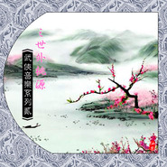

武侠音乐系列第二部之仙景篇武侠音乐系列二之世外桃源
============================

|  |  |
| :--: | :-- |
| [ 武侠音乐系列第二部之仙景篇武侠音乐系列二之世外桃源](https://emumo.xiami.com/album/2063595087) | **艺人**: [武聆音雄](../index.md) **语种**: 国语 **唱片公司**: 武聆音雄 **发行时间**: 2013年03月04日 **专辑类别**: 合集, 杂锦 **专辑风格**: 中国风 China-Wave, 新世纪音乐 New Age, 原声 Soundtrack **播放数**: 2673961 **收藏数**: 1154 **评论数**: 19  |

## 简介

一.简介  
此专辑与《武侠音乐系列》中的疗养专辑是一脉相承。  
关于武侠仙景音乐之特点等等介绍，请参见《10.武侠音乐系列之疗伤神法（疗养）》  
《1.仙侠游戏音乐系列之仙风篇》  
目前，仅以此专辑曲目为例来说明仙景音乐之常用乐器以及应用场景。  
此专辑从主要收录描绘如诗如画、人间仙境的场景的武侠音乐。  
  
二.常用乐器  
1.琴箫合奏式。大部分是“琴箫合奏”的再发展再创作，沿用了武侠之中一直以来的“琴箫”合奏的风格。也显示了武侠伴侣的理想归宿，一人吹箫，一人抚琴，显然一对神仙伴侣。这里的琴已经泛指弹拨乐器，而箫泛指吹管乐器。例如：赵国草原、ks64、梦回月宫、春回大地、雅湖小筑、织梦行云。  
2.柔和清脆的琴筝等弹拨乐器，辅以低吟的拉弦乐器、时有时无的打击乐。例如：废墟怪客、冰火岛仙境、艺妓之梦、寒空、剑庐、picking flower、水岸风堤、月亮谷、清香落、流水人家、福琅嬛地、七秀坊。  
3.婉转的吹管乐器，辅以低沉的拉弦乐器、柔美的弹拨乐器。例如：轻云、凤尾丝竹、茶树林的夕阳余晕晖。  
  
三．应用场景  
1.化外之地，犹如蓬莱仙境，例如：桃源仙境、福琅嬛地、picking flower、  
2.以音乐描绘美景，例如：寒空、清香落、赵国草原、雅湖小筑。  
3.描绘自然，描绘天宫，例如：梦回月宫、春回大地、茶树林的夕阳余晕晖、轻云、天府乐。  
4.隐居之地、清幽之地。例如：剑庐、月亮谷、流水人家、七秀坊、艺妓之梦、冰火岛。  
5.舞曲，例如：天宫舞曲、玉漱成人舞。  
  
四.曲目列表  
  
原版音乐  
  
01.废墟怪客  
  
①专辑中文名：梅花三弄之鬼丈夫电视原声带  
②艺术家：  
③发行时间：1993年  
④音律分析：开始便是一种弦乐的低沉回旋，中间流露出一种迷幻与仙气，似乎更是一种大风暴的前夕。而后的一声猛烈、清新、旷达，似乎人间仙境忽然映入眼前。  
⑤音画分析：天师钟馗中，以此曲与绝色佳人相交辉映。  
⑥被引用记录：天师钟馗新加坡版等  
  
02.织梦行云  
  
①专辑中文名：仙剑奇侠传四精选音乐辑cd   
②艺术家：骆集益  
③发行时间：2007年  
④音律分析：   
⑤音画分析：这首乐曲是柳梦璃主题音乐。游戏中该乐曲第一次响起是在寿阳城柳府初遇柳梦璃之时。刚开始之似女声之乐，已经筝的回旋，就似乎蕴含着那种优雅与仙风，令人回望起古之宫殿。这温婉舒缓的乐风也带着一丝凄艳，更带有一丝的柔情与仙风。可谓“古之遗风尚存”。  
⑥被引用记录：  
  
03.赵国草原  
  
①专辑中文名：寻秦记单机版   
②艺术家：蔡志展  
③发行时间：2001年  
④音律分析：此曲用来描绘游戏《寻秦记》的赵国草原场景，悠扬悠远而又舒缓空灵的笛声似乎描绘着草原的寂静与广阔。而时出时没的弹拨乐清新自然，中间透露着一丝的灵性，似乎是在描绘草原上的羊群，与描绘草原的笛声一唱一和，完美相融。然而一阵阵的强烈的提琴打破了草原的宁静，打击乐一跃而起，似乎是草原上的人们在马上奔跑着，一阵阵的强烈之后，最终草原又回复到了当初的平静。   
⑤音画分析： 在流水鸟鸣之中婉转悠远的笛声与铮铮的弦乐完美合一，描绘出赵国草原上一片辽阔悠远的样貌。  
⑥被引用记录：武侠群英传  
  
04.OM_WOR1_9_Forgotten_Hearth_Hardiman_134105（倚天 冰火岛原曲）  
  
①专辑中文名：  
②艺术家：  
③发行时间：  
④音律分析：使用清脆清澈的弹拨乐来演绎主旋律，并辅以时有时无之提琴。正是用音乐之中的那种清新自然，勾勒出一种世外桃源式的仙境。  
⑤音画分析：张翠山、殷素素、谢逊来到冰火岛，一个一边是冰山、一边是火山的化外之境，正如故人所言的那种蓬莱仙境一般，这首曲子便是用来刻画那冰火岛仙境的。  
⑥被引用记录：2001倚天屠龙记  
  
05.艺妓之梦  
  
①专辑中文名：东方遇见西方   
②艺术家：John Beckenham &amp; Steve Wickford  
③发行时间：  
④音律分析：开头那轻柔而又优雅的弹拨乐，更是一种忽然性的清新，似乎有感于大自然之美丽。而那颤动的拉弦乐，更是营造出一丝的神秘与渺茫。旋律回归到弹拨弦乐之上，更是显得那种道法自然式的清新自然。  
⑤音画分析：这首曲子被无数新加坡、港台武侠剧引用，常常用于表现那种心情上的喜悦以及美妙动人的自然风光。  
⑥被引用记录：莲花争霸等等无数武侠剧  
  
06.Evening Poem  
  
①专辑中文名：水月  
②艺术家：姬神  
③发行时间：1989年  
④音律分析：   
⑤音画分析：  
⑥被引用记录：圆月弯刀等  
  
07.Ks64  
  
①专辑中文名：剑侠情缘贰   
②艺术家：罗晓音  
③发行时间：2000年  
④音律分析：那种节奏性的鼓声，引来了筝的点缀，原来更有仙境式的迷幻，而后的箫声更是一种古色古香。  
⑤音画分析：这是一首很具有江湖气息的曲子，正是那种如沐春风，闯荡江湖的感觉。这其中更是蕴含着那种古风、仙风，不经意间，便将人带到了古之江湖。  
⑥被引用记录：剑侠情缘之藏剑山庄  
  
08.剑庐  
  
①专辑中文名：武林群侠传   
②艺术家：蔡志展  
③发行时间：2001年  
④音律分析：   
⑤音画分析：剑庐地处成都以南，是个培育花卉的地方。而这首音乐幽静深邃，清脆空灵的弦乐在主旋律回荡，悠远的笛声似有似无， 其中隐约可以听到流水和鸟鸣，有一种深山丛林，古老村庄的意境。  
⑥被引用记录：新倚天屠龙记  
  
09.Picking Flower（97天龙 琅嬛福地原曲）  
  
①专辑中文名：Flower Of Evening   
②艺术家：Aron  
③发行时间：  
④音律分析：开头便是一种水在静静地流淌，而后弦乐的加入，增添了一丝的仙气。  
⑤音画分析：琅嬛福地位于大理国无量山中一深谷石洞中，内里收藏有逍遥派掌门人无崖子与师妹李秋水搜集的大量武学典籍。而正是用这首音乐来表现琅嬛福地的那种幽深与世外。  
⑥被引用记录：1997天龙八部  
  
10.水岸风堤  
  
①专辑中文名：仙剑奇侠传未 Iii 音乐珍藏集   
②艺术家：曾志豪  
③发行时间：2004年  
④音律分析：   
⑤音画分析：这首乐曲是《仙剑奇侠传三》中镇江、安溪以及《仙剑奇侠传四》中柳府等游戏场景的背景音乐，同时还是《仙剑Online》中地图太湖船坞与桂林的背景音乐。该曲以轻快悠扬的曲调，体现温婉和谐的气氛，小桥流水人家的江南市井生活画卷。春风里，杨柳、舟楫与流水的相逢与错过……  
⑥被引用记录：  
  
11.轻云  
  
①专辑中文名：浣花洗剑录   
②艺术家：蔡志展  
③发行时间：2001年  
④音律分析：开头便是舒缓迷幻而又优柔的笛声，着笛声中似乎有一种飘扬流淌的感觉，或许轻巧的云朵正在在空中飘荡着。而后点点敲击式的弦乐加入了，打破了自在的云朵，似乎是一点点雨滴穿过云彩滴入大地。提琴也开始随着猛烈的拉动，雨滴之后，更有阵阵清风拂过，轻云因此四处飘泊，直至消散。  
⑤音画分析：《浣花洗剑录》中的一首曲子，同旋律曲子还有《武林群侠传》中的《逍遥谷第三季》。音乐清新飘逸、婉转留恋，似乎由一片轻轻流淌的云朵贯穿全曲。  
⑥被引用记录：武林群侠传  
  
12.凤尾丝竹  
  
①专辑中文名：《古剑奇谭》精选音乐CD  
②艺术家：骆集益  
③发行时间：2010年  
④音律分析：回旋婉转而又轻柔细腻的葫芦丝声在悠闲的钢琴之下悠然响起，一切都是那么宁静那么有诗意。而后提琴和笛子的加入，似乎一阵阵清风徐来，给这静谧之画面一种动态之美。  
⑤音画分析：这是红叶湖背景音乐，表现秋高气爽，顽皮的孩子走在高耸的山林，枫叶林层层叠叠被风吹过，犹如一片波涛翻滚的海洋，有鸟鸣、还有树叶的声音，晴朗、舒适。   
⑥被引用记录：  
  
13.月亮谷  
  
①专辑中文名：飘邈之旅online   
②艺术家：蔡志展  
③发行时间：2009年  
④音律分析：特制的合成弹拨乐器中富含古筝，琵琶之韵，却又显得更清脆柔美。在清晰自然中逐步变换，在不断对比中步步回旋，营造出一种月光忽明忽暗，朦胧之中清风拂过，给人以清新朴素的感觉。 终于，在宁静中爆发了，这种寂寥之后的突然爆发，显得更有力量。而后提琴的力量性拉动更是可以表现出风雨的暴力性。 然而，天下风云变幻，我自岿然不动。经过一阵提琴的摧残，又回归于寂寥宁静的心境，月光仍然忽明忽暗，清风仍然缓缓拂过。  
⑤音画分析：这首曲子中所蕴含的“天下风云变幻，我自岿然不动”，令我更想到了庄子。任由世间如何变幻，任由诸侯如何邀请，我自有坚定的信念，我自有宁静的追求。不滞于物，不制于人，逍遥浮动于人世间而不受外境影响。  
⑥被引用记录：  
  
14.圣山  
  
①专辑中文名：欧亚地平线  
②艺术家：  
③发行时间：  
④音律分析：  
⑤音画分析：很经典的一首清新自然的曲子。  
⑥被引用记录：tvb西游记、tvb金装四大才子、tvb锦绣良缘、tvb布衣神相  
  
15.清香落  
  
①专辑中文名：风潮唱片心灵音乐馆《清香落》   
②艺术家：范宗沛、林海  
③发行时间：1994年  
④音律分析：旋律舒服而荡漾，仿佛曲子从一开始的第一个音符的坠落，就开始逐步向四周荡漾开去，笼罩了我们的情绪引诱着我们的感触。  
⑤音画分析：清远如诗的风格，得以带领所有美丽的生命，深入性灵醇美处，一飨清香。呈现兰花的绝俗情境与心灵的出尘之美。静静的聆听，从一开始的琴音，轻轻的叩击心灵的门环，开启内心之门。风潮唱片心灵音乐馆也很擅长创作这种描绘景致的音乐。  
⑥被引用记录：此曲改编自陈大伟作曲「寒山僧踪」  
  
16.流水人家  
  
①专辑中文名：江南才子唐伯虎   
②艺术家：蔡志展  
③发行时间：2002年  
④音律分析：   
⑤音画分析：来自《江南才子唐伯虎》的神韵，音乐本身不长，柔柔的弦乐回荡在在阵阵流水声中，二胡之声也姗姗来迟，一片江南小桥流水的风情油然而生。  
⑥被引用记录：  
  
17.梦回月宫  
  
①专辑中文名：封神榜   
②艺术家：罗晓音  
③发行时间：2004年  
④音律分析：清脆而又轻柔的古筝在回荡着，却也令人心中产生出那种清风明月之美景。月宫之下，一阵阵清风徐来，顿时荣辱皆忘，波澜不兴。好一个梦回月宫图。  
⑤音画分析：  
⑥被引用记录：  
  
18.寒空  
①专辑中文名：和平之月Breathing Spaces 悠  
②艺术家：姜小青  
③发行时间：2001  
④音律分析：使用古筝、提琴、长笛三种乐器演绎出一种寒空之自然景象。提琴于似有似无之中低沉着，勾勒出那种寒冷之轮廓。而柔柔的古筝演绎着那回旋、柔美的旋律，演绎着空灵、辽远之天空。  
⑤音画分析：以音乐来描绘画面的方式古而有之，《平湖秋月》《春江花月夜》等等皆是如此，如今的和平之月更是一绝。而这首曲子，用音乐描绘着一个空灵、辽阔之天空，其仙风、寂静、幽雅之声，令人动容。  
⑥被引用记录：  
  
19.春回大地  
  
①专辑中文名：Kpm 305 - The Asia Experience   
②艺术家：Richard Harvey  
③发行时间：  
④音律分析：在回旋渐变的弹拨弦乐中，笛声显得悠扬而又活泼，显示出一种自然的活力。  
⑤音画分析：这是一首描绘春回大地，万木欣欣向荣画面的曲子。  
⑥被引用记录：2001倚天屠龙记  
  
20.雅湖小筑  
  
①专辑中文名：寻秦记单机版   
②艺术家：蔡志展  
③发行时间：2001年  
④音律分析：初听此曲，便被这轻快、优美的旋律所打动，笛筝的合奏，演绎着那种优雅，似乎身处世外桃源的那种宁静与自然。  
⑤音画分析：这轻快、悠闲、优美的旋律，作为“石才女”纪嫣然居住的雅湖小筑的背景音乐，意境上搭配的不错。另外，这首音乐也是武林群侠传ol的登陆音乐。  
⑥被引用记录：武林群侠传ol  
  
21.天若有情  
①专辑中文名：东游记原声带   
②艺术家：  
③发行时间：1998年  
④音律分析：古筝的回荡便营造出那种天宫的宏伟，而后笛声的流淌更是显示出那种仙境一般，提琴悄然的低沉点缀，将那种道家之洒脱表露无遗。  
⑤音画分析：逍遥游的纯音乐版本，全曲体现出一种八仙道家的豁达与逍遥，正如“划一叶扁舟，谁愿与我共逍游，天若有情天亦老，不如与天竞自由”所言。  
⑥被引用记录：  
  
22.天宫舞曲  
  
①专辑中文名：西游记   
②艺术家：许镜清  
③发行时间：1986年  
④音律分析：一首具有浓厚古典风味的舞曲，鼓声之下，辅以古筝的点缀，笛声显得尤为悠扬悦耳，而后琵琶的声声滚动，更将那种中国古代那种宫廷式的感觉表达无遗。  
⑤音画分析：天宫之上，玉帝王母宴请众仙参加蟠桃盛会，并令嫦娥跳舞，而这首曲子就在此时悄然响起，古典、宫廷、仙境等等感觉便油然而生。  
⑥被引用记录：  
  
23.Night_Bird  
  
①专辑中文名：欧亚地平线  
②艺术家：  
③发行时间：  
④音律分析：  
⑤音画分析：  
⑥被引用记录：tvb西游记、tvb金装四大才子、tvb锦绣良缘、tvb布衣神相  
  
24.七秀坊  
  
①专辑中文名：剑侠情缘三   
②艺术家：月之门配乐工作室  
③发行时间：2009年  
④音律分析：开头琵琶回旋之中道尽了那种秀丽，而后琵琶的多重奏也显得柔情似水，表露出无尽的魅力。  
⑤音画分析：这首便是剑网三中七秀坊的门派音乐，七秀坊乃大唐三大风雅地之一，为公孙大娘所创，门人皆为绝色女子，而这首柔情秀丽之乐，恰好将这门派之特点表现了出来。这首音乐在《剑侠情缘之藏剑山庄》中也被用作爱情音乐。  
⑥被引用记录：剑侠情缘之藏剑山庄  
  
25.天府乐  
①专辑中文名：西游记   
②艺术家：许镜清  
③发行时间：1986年  
④音律分析：   
⑤音画分析：经常会想起西游记里那种虚无缥缈般的感觉，音乐与天宫的气氛合二为一，既有祥和庄严的意象，又有一种超然脱俗的感悟，闻之不禁心平气和，烦恼尽消。（宇雯复苏 评）  
⑥被引用记录：  
  
26.火烧摘星楼（云渡山）  
①专辑中文名：封神榜弦乐集  
②艺术家：陈云山  
③发行时间：1999年  
④音律分析：开头的琵琶为场景添加一丝的仙气，而后提琴与笛声带来许久的优柔，更有一种仙风道骨之江湖气息。  
⑤音画分析：这首曲子被用作霹雳英雄榜中云渡山的场景音乐，云渡山是一页书的根据地。“渡云渡山，渡一切众生，有名无名，名不入闲云”，也是一片退隐之地。  
⑥被引用记录：霹雳英雄榜-上  
  
27.澳门 京都  
  
①专辑中文名：太极   
②艺术家：奧立佛．香提  
③发行时间：1996年   
④音律分析：开始便是那种仙乐飘渺萦绕于耳边，琴声轻柔之中，悠然悠扬的管乐悄然而至，中间还带来阵阵回旋与回荡。女声在远处悠荡，更是显得一阵阵的仙气，似乎用音乐精妙地描绘着一个化外之地。  
⑤音画分析：这也是少见的德国音乐家创作的东方风格音乐，全曲轻柔之中带有一丝的沉郁，仙风之下更有一丝的神秘。  
⑥被引用记录：小李飞刀等  
  
  
截取曲目：  
  
01.书院礼乐  
①专辑中文名：少年包青天   
②艺术家：韦启良 (丘九天截取)  
③发行时间：2000年  
④音律分析：弹拨乐器下的一种优雅脱俗，这首曲子是包拯在天鸿书院所学的曲子。  
⑤音画分析：正如天鸿书院的蒙放老师所言：“人生在世，一定要活着精彩。除了功名之外，我们还遗漏了什么，一个可以丰富人生，打开自己胸怀的东西”。清幽之乐或许正好打开自己的胸怀”。  
⑥被引用记录：  
  
02.金瓶梅片头  
  
①专辑中文名：金瓶梅   
②艺术家：罗坚 (时代华菁截取)  
③发行时间：2008年  
④音律分析：   
⑤音画分析：   
⑥被引用记录：  
  
03.玉漱成人舞  
  
①专辑中文名：神话电视剧版   
②艺术家：  
③发行时间：2009年  
④音律分析：开头断续的笛声与女声，在鼓声之中便营造出一种仙女式的氛围。而后急促回旋之提琴却将一切拉向高潮。  
⑤音画分析：玉漱成人所跳之舞，配合着这音乐，犹如仙女下凡。  
⑥被引用记录：  
  
04.片尾  
  
①专辑中文名：金瓶梅   
②艺术家：罗坚(时代华菁截取)  
③发行时间：2008年  
④音律分析：   
⑤音画分析：   
⑥被引用记录：  
  
05.公孙策对四杰  
①专辑中文名：少年包青天2   
②艺术家：韦启良 (丘九天截取)  
③发行时间：2001年  
④音律分析：一首清新的曲子，节奏性强烈的筝，营造着一种对弈的那种紧迫，也筝的回旋，却也显示出另一种的古典风味。  
⑤音画分析：公孙策一个与“琴棋诗书”四俊杰时所演奏之乐。  
⑥被引用记录：  
  
06.细水长流  
  
①专辑中文名：《大唐双龙传》未知插曲配乐   
②艺术家：邓少林(夕下袂舞截取)  
③发行时间：2008年  
④音律分析：曲子前奏飘渺空旷，如入世外桃源一般，令人浮想联翩，欢快的敲击音符如同行云流水般高低起伏，溪水潺潺行与不止。  
⑤音画分析：电视剧《天之骄子》第7集中，丽君救香梅后走向溪水的那一段配合画面中的潺潺溪水，完美的奏出了一种不食人间烟火的世外桃源意境。（夕下袂舞评）  
⑥被引用记录：天之骄子（新再生缘）  
  
07.萧十一郎风景配乐   
  
①专辑中文名： 萧十一郎  
②艺术家：周志华、江建谊、周思贤 (夕下袂舞截取)  
③发行时间：2002年  
④音律分析：  
⑤音画分析：  
⑥被引用记录：  
  
五.配乐视频  
  
01.柳含烟之死-天师钟馗之杨贵妃-废墟怪客.mkv 8.75 MB  
02.天宫舞曲-西游记-许镜清.mkv 14.72 MB  
03.琅嬛福地-天龙八部-picking flower.mkv 12.81 MB  
04.七秀坊马提琴版-剑侠情缘之藏剑山庄-月之门.rmvb 5.18 MB  
05.书院礼乐-少年包青天-韦启良.rmvb 6.77 MB  
06.织梦行云-箜篌演奏版本.f4v  
  
①作者：丘九天  
②出处：武聆音雄论坛  
③原文链接：<a href="http://www.wlyxmusic.com/thread-3592-1-1.html" target="_blank" rel="nofollow noreferrer noopener">http://www.wlyxmusic.com/thread-3592-1-1.html</a> 

## 曲目

## 评论

|  |  |  |  |
| :-- | :-- | :-- | :-- |
|  [虾米用户](https://emumo.xiami.com/u/357502657)  2021-01-18 15:24 赞(0) 踩(0) | 
仙剑4的音乐
 |
|  [虾米用户](https://emumo.xiami.com/u/48935681) 樓閣新晨花欲語，夢中誰是... 2018-12-24 11:11 赞(1) 踩(0) | 
不错
 |
|  [虾米用户](https://emumo.xiami.com/u/43492923) 行到水穷我才开始害怕，夕... 2018-03-15 16:21 赞(0) 踩(0) | 
&amp;phi;
 |
|  [虾米用户](https://emumo.xiami.com/u/2008838) 随意吧 2018-03-03 21:49 赞(1) 踩(0) | 
西游记
 |
|  [虾米用户](https://emumo.xiami.com/u/10418785)  2018-02-26 21:33 赞(2) 踩(0) | 
天府乐让我想起了曾经的童年
 |
|  [虾米用户](https://emumo.xiami.com/u/2307526) 连接比特与像素的造梦师！ 2017-08-14 21:03 赞(0) 踩(0) | 
武侠音乐系列第二部之仙景篇
 |
|  [虾米用户](https://emumo.xiami.com/u/2307526) 连接比特与像素的造梦师！ 2017-08-14 21:03 赞(0) 踩(0) | 
武侠音乐系列第二部之仙景篇
 |
|  [虾米用户](https://emumo.xiami.com/u/79734124)  2017-08-14 16:28 赞(2) 踩(0) | 
这个适合看书，休息的时候听听！舒服！
 |
|  [虾米用户](https://emumo.xiami.com/u/39042239)  2017-06-28 11:26 赞(0) 踩(0) | 
听着很舒服。享受宁静
 |
|  [虾米用户](https://emumo.xiami.com/u/112311046) happy 2016-02-11 13:56 赞(0) 踩(0) | 
自找
 |
|  [虾米用户](https://emumo.xiami.com/u/49125150) 一念心清净 2015-08-06 16:16 赞(0) 踩(0) | 
为什么不发布啊！好期待发布啊
 |
|  [虾米用户](https://emumo.xiami.com/u/14048741)  2015-01-22 13:41 赞(0) 踩(0) | 
背景音乐
 |
|  [虾米用户](https://emumo.xiami.com/u/19256136)  2014-11-20 20:52 赞(0) 踩(0) | 
此专辑从主要收录描绘如诗如画、人间仙境的场景的武侠音乐。
 |
|  [虾米用户](https://emumo.xiami.com/u/5989165) 我还没想好要写什么... 2014-05-02 09:59 赞(1) 踩(0) | 
也可以制作一张 甄子丹-精武门原声大碟 很强大的团队
 |
|  [虾米用户](https://emumo.xiami.com/u/5989165) 我还没想好要写什么... 2014-04-30 01:35 赞(0) 踩(0) | 
很期待寻秦记原声大碟
 |
|  [虾米用户](https://emumo.xiami.com/u/10640160)  2013-09-28 23:09 赞(15) 踩(0) | 
“名缰利锁如重枷，铜臭堆中逝韶华。愿泛扁舟江海去，朝沐清风晚浴霞。天籁妙，山水雅，聚露为酒霜为花，若人问我归何处，彩云深处是吾家！”离开浊世繁琐，寻一片幽雅境地，融入宽广的天地中，让纯净的自然洗去心灵的尘埃，与日月相伴，不再过问红尘俗事，有如此心怀，人间何处不为仙！
 |
|  [虾米用户](https://emumo.xiami.com/u/21916115)  2013-09-22 10:28 赞(0) 踩(0) | 
武侠音乐之仙境
 |
|  [虾米用户](https://emumo.xiami.com/u/13909000) 暂无签名~ 2013-09-19 22:41 赞(0) 踩(0) | 
怀念啊
 |
|  [虾米用户](https://emumo.xiami.com/u/8797833)  2013-03-18 17:02 赞(1) 踩(0) | 
<a href="http://www.wlyxmusic.com/thread-3592-1-1.html" target="_blank" rel="nofollow noreferrer noopener">http://www.wlyxmusic.com/thread-3592-1-1.html</a>
 |
