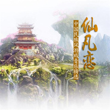

仙凡恋
============================

|  |  |
| :--: | :-- |
| [ 仙凡恋](https://emumo.xiami.com/album/2102767712) | **艺人**: [武聆音雄](../index.md) **语种**: 纯音乐 **唱片公司**: 武聆音雄 **发行时间**: 2017年06月18日 **专辑类别**: 精选集 **专辑风格**: 游戏配乐 Video Game Music, 古风 GuFeng Music, 中国风 China-Wave **播放数**: 102330 **收藏数**: 172 **评论数**: 3  |

## 简介

 桃呼呼原创中国民族风游戏音乐精选

## 曲目

## 评论

|  |  |  |
| :-- | :-- | :-- |
|  [虾米用户](https://emumo.xiami.com/u/2231133)  2017-08-04 09:51 赞(0) 踩(0) | 
整盘专辑都好清新，小家碧玉的赶脚(⊙o⊙)哦！厉害！
 |
|  [虾米用户](https://emumo.xiami.com/u/2231133)  2017-08-04 09:50 赞(0) 踩(0) | 
苍空之月是天空之城的变奏么？
 |
|  [虾米用户](https://emumo.xiami.com/u/287339816) 古岂无人，孤标凌云谁与朋... 2017-06-18 16:26 赞(1) 踩(0) | 
就像置身于天地之间，心灵平静
 |
