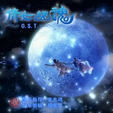

倩女幽魂 O.S.T.倩女幽魂 电视剧原声配乐集
============================

|  |  |
| :--: | :-- |
| [ 倩女幽魂 O.S.T.倩女幽魂 电视剧原声配乐集](https://emumo.xiami.com/album/2104946394) | **艺人**: [武聆音雄](../index.md) **语种**: 纯音乐 **唱片公司**: 武聆音雄 **发行时间**: 2019年06月16日 **专辑类别**: 原声带, 影视音乐 **专辑风格**: 电视原声 Television Music, 原声 Soundtrack, 中国风 China-Wave **播放数**: 126372 **收藏数**: 174 **评论数**: 36  |

## 简介

配乐指导：张兆鸿&nbsp;&nbsp;&nbsp;&nbsp;配乐剪辑：曼荼罗  
浪漫的爱情故事，动听的电视配乐，完美的女声哼唱！  
蓝魔之泪&nbsp;阴世幽泉&nbsp;七世怨侣&nbsp;无泪之城&nbsp;玄心奥妙

## 曲目

- [命在旦夕](./2104946394/mTx0Pv8267f.md)

## 评论

|  |  |  |
| :-- | :-- | :-- |
|  [虾米用户](https://emumo.xiami.com/u/42589111)  2020-10-06 00:31 赞(0) 踩(0) | 
听到了太多太多熟悉的旋律，一部好的剧除了剧情和演员演技用心，还有幕后太多人的付出，满满的感动，也谢谢up主这么用心的剪辑，以前自己也剪过，深知拼凑剪辑真的很不容易！！！辛苦了！      
 |
|  [虾米用户](https://emumo.xiami.com/u/434027196)  2020-02-11 12:39 赞(1) 踩(0) | 
感谢制作，音质已经很好了。这部剧音乐太经典，可惜很多好听的音乐没有发布原声，真的好爱好爱好爱七夜啊啊啊啊啊
 |
|  [虾米用户](https://emumo.xiami.com/u/432716739)  2019-11-27 13:24 赞(1) 踩(0) | 
up真的太感激您了！看到您说拼了十个月才拼出来，倩女这些ost我找了很多年，真的太感激您了！！！
 |
|  [虾米用户](https://emumo.xiami.com/u/431923192)  2019-11-09 18:53 赞(0) 踩(0) | 
专门来虾米听的，谢谢！这么多年一直没找到剧里比较完整的bgm
 |
|  [虾米用户](https://emumo.xiami.com/u/282426835)  2019-10-28 20:48 赞(1) 踩(0) | 
英雄      能不能找到宁采臣在兰若寺收拾的那一段曲子
 |
|  [虾米用户](https://emumo.xiami.com/u/260354828) 放情天地不周山 2019-10-15 23:17 赞(0) 踩(0) | 
吹爆雯姑的素天心，还有蓝魔   
 |
|  [虾米用户](https://emumo.xiami.com/u/360331066)  2019-10-05 21:25 赞(0) 踩(0) | 
很多曲子别的地方都没有，真是找的不容易
 |
|  [虾米用户](https://emumo.xiami.com/u/430064600)  2019-09-23 01:22 赞(2) 踩(0) | 
20年后，书生还是书生，但小倩不再是小倩。因为天剑堂点燃的红烛已经证明七世怨侣的生生世世。
 |
|  [虾米用户](https://emumo.xiami.com/u/430064600)  2019-09-23 01:10 赞(1) 踩(0) | 
居然有吻下去爱上你，纯音乐版  
 |
|  [虾米用户](https://emumo.xiami.com/u/428130607) 我还没想好要写什么... 2019-09-02 21:39 赞(0) 踩(0) | 
有没有六道圣君和魔宫四贤跳劈地上符咒那段的bgm啊~~
 |
| ⇒ |  [虾米用户](https://emumo.xiami.com/u/11807144) 一生治爱 2019-09-05 00:38 赞(0) 踩(0) | 
具体位置？
 |
| ⇒ |  [虾米用户](https://emumo.xiami.com/u/428130607) 我还没想好要写什么... 2019-09-07 11:17 赞(0) 踩(0) | 
<q><b>六月飘雪说：</b></q>
 |
| ⇒ |  [虾米用户](https://emumo.xiami.com/u/429599553) 我还没想好要写什么... 2019-09-08 23:52 赞(0) 踩(0) | 
<q><b>P.Chu说：</b></q>
 |
| ⇒ |  [虾米用户](https://emumo.xiami.com/u/428130607) 我还没想好要写什么... 2019-09-09 00:03 赞(0) 踩(0) | 
<q><b>不大的柜柜说：</b></q>
 |
| ⇒ |  [虾米用户](https://emumo.xiami.com/u/11807144) 一生治爱 2019-09-12 00:57 赞(0) 踩(0) | 
<q><b>P.Chu说：</b></q>
 |
| ⇒ |  [虾米用户](https://emumo.xiami.com/u/428130607) 我还没想好要写什么... 2019-09-12 08:57 赞(0) 踩(0) | 
<q><b>六月飘雪说：</b></q>
 |
|  [虾米用户](https://emumo.xiami.com/u/45037191)  2019-08-27 19:32 赞(0) 踩(0) | 
找了很久
 |
|  [虾米用户](https://emumo.xiami.com/u/8374904)  2019-08-10 22:22 赞(0) 踩(0) | 
这专辑从哪里来的啊？从电视里截取，里面不是还混了其他声音吗。如果真是截取后处理成这样，那也太神奇了！
 |
|  [虾米用户](https://emumo.xiami.com/u/302204360)  2019-07-18 21:56 赞(1) 踩(0) | 
超喜欢的电视剧，配乐一直在找，只是还差了开场，油菜花田里那一段。还有兰若寺采臣收拾的那一段。还是在此拜谢。太厉害了
 |
|  [虾米用户](https://emumo.xiami.com/u/9943562) 多数盗版碟在02年发行 2019-07-09 21:34 赞(0) 踩(0) | 
但是为了尊重作曲家 应该更改专辑归属吧
 |
| ⇒ |  [虾米用户](https://emumo.xiami.com/u/11807144) 一生治爱 2019-07-15 02:39 赞(0) 踩(0) | 
更改啥归属？唱片公司那里是不能修改的，更何况并未发行。封面也写了配乐指导的。
 |
| ⇒ |  [虾米用户](https://emumo.xiami.com/u/9943562) 多数盗版碟在02年发行 2019-10-29 22:13 赞(0) 踩(0) | 
<q><b>六月飘雪说：</b></q>
 |
|  [虾米用户](https://emumo.xiami.com/u/228250673)  2019-07-09 19:12 赞(0) 踩(0) | 
辛苦了，感谢分享，赞！
 |
|  [虾米用户](https://emumo.xiami.com/u/2792776) 怎么开心怎么来… 2019-07-01 07:23 赞(0) 踩(0) | 
之前就很喜欢这个专辑，现在终于找到了
 |
|  [虾米用户](https://emumo.xiami.com/u/5201229) 我还没想好要写什么... 2019-06-29 00:50 赞(0) 踩(0) | 
感谢分享！！
 |
|  [虾米用户](https://emumo.xiami.com/u/260354828) 放情天地不周山 2019-06-28 17:28 赞(0) 踩(0) | 
这些原声好难找 感谢 
 |
|  [虾米用户](https://emumo.xiami.com/u/411752190) 我还没想好要写什么... 2019-06-25 03:39 赞(0) 踩(0) | 
终于等到了，好人一生平安
 |
|  [虾米用户](https://emumo.xiami.com/u/4857630) 配乐专业户 2019-06-16 22:11 赞(0) 踩(0) | 
费心思了
 |
|  [虾米用户](https://emumo.xiami.com/u/11807144) 一生治爱 2019-06-16 18:14 赞(12) 踩(0) | 
10个月的拼接，终于圆了16年的配乐梦！
 |
| ⇒ |  [虾米用户](https://emumo.xiami.com/u/46717441) 喜欢聆听 2019-06-16 18:30 赞(0) 踩(0) | 
感谢制作分享，武聆有你而精彩
 |
| ⇒ |  [虾米用户](https://emumo.xiami.com/u/302204360)  2019-08-15 21:31 赞(0) 踩(0) | 
最近在贴吧还找到一首，搜索一下final showdown
 |
| ⇒ |  [虾米用户](https://emumo.xiami.com/u/11807144) 一生治爱 2019-08-18 23:00 赞(0) 踩(0) | 
<q><b>红色石头说：</b></q>
 |
| ⇒ |  [虾米用户](https://emumo.xiami.com/u/335843381) 醉心集 5-2 2019-09-03 11:11 赞(0) 踩(0) | 
辛苦了大神
 |
| ⇒ |  [虾米用户](https://emumo.xiami.com/u/432372857)  2020-02-27 22:58 赞(0) 踩(0) | 
大佬，诸葛青天跳崖的时候有个插曲 找了好久 调子跟太多一样 乐器不一样 那个插曲有没有啊 
 |
| ⇒ |  [虾米用户](https://emumo.xiami.com/u/11807144) 一生治爱 2020-03-01 05:28 赞(0) 踩(0) | 
<q><b>林尚润说：</b></q>
 |
| ⇒ |  [虾米用户](https://emumo.xiami.com/u/344576422) 人也许不认识人，但灵魂认... 2021-01-05 18:28 赞(0) 踩(0) | 
虾米音乐要关停了，大佬快转移阵地
 |
