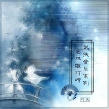

武侠音乐系列之双雄对峙
============================

|  |  |
| :--: | :-- |
| [ 武侠音乐系列之双雄对峙](https://emumo.xiami.com/album/479311486) | **艺人**: [武聆音雄](../index.md) **语种**: 国语 **唱片公司**: 武聆音雄 **发行时间**: 2009年09月20日 **专辑类别**: 合集, 杂锦 **专辑风格**: 中国风 China-Wave **播放数**: 1007092 **收藏数**: 553 **评论数**: 13  |

## 简介

武侠剧中，对决之场景是必不可少，江湖之中，切磋武艺﹑苦练神功﹑甚至报仇雪恨，无一能免对决之场景。一首优秀的武侠对决音乐可以将一个完全不会武功、演技一般的演员在音乐的烘托下成为一个绝世高手！武侠对决音乐是武侠音乐的最主要部分，也是武侠音乐的精髓，在表现人物武功之变化莫测﹑杀敌之时气势磅礴等方面表现出巨大的艺术感染力！脱离了对决音乐的武侠剧是不完整的，甚至是失败。  
  
音乐特点  
1.以强劲的打击乐为基调，音乐的旋律性有时不是很强，但是却变化多端，每个音符的音长很短。  
2.最常用的乐器是：唢呐、二胡、管子、琵琶。中国大鼓、锣成为很常见的打击乐器其中的唢呐可能是最受欢迎的对决乐器。  
3.音乐一般都气势磅礴、刚劲有力，一听就令人振奋、精神抖擞，产生一种用之不尽的力量与豪情。  
4.对决音乐与豪气音乐有相同之处，甚至由于对决时的紧张，也令其与紧张音乐也有所关联。  
  
应用场景  
1.英雄人物因救人而出场，以神功击败敌人，其气势必然磅礴，也是武林高手的主题音乐。如：天龙八部间奏曲﹑男儿当自强(主题音乐)﹑比剑。  
2.武侠之中战争少有，但无法避免。混战音乐也归入此类。如：少林雄风。  
3.练功时用于表现神功之精妙莫测时的音乐，由于还产生了特定武功的音乐，如：熊熊圣火﹑六脉神剑﹑独孤九剑﹑醉起步云宵﹑太极拳﹑墨子剑法。  
4.宝剑出鞘，天下风云变色。描绘宝剑之神奇与绝妙之场景。如：灵光宝剑﹑彩剑竹水琉。  
5.排兵布阵，阵法亦是非常重要的武学。如：罗汉阵﹑阵法--卧江子第九阵。  
6.其他对决时的场合，包括普通对决﹑绝技对决。如：野霸王﹑挟枪试刀﹑过馆人生﹑仙剑奇缘﹑偷功。  
  
代表曲目  
⑴．已发行曲目：  
1.熊熊圣火  
①专辑中文名：倚天屠龙记原声大碟（TVB2001年）  
②专辑类别：原声大碟  
③艺术家：TVB  
④发行时间：2001年  
⑤音律分析：逐渐增强的鼓声拉开了战斗的序幕，而从此不断地响铃声则制造了战斗紧张的气氛，提琴过后的管子与博大精深的神功合二为一。接着就是以鼓和响铃为伴奏，以《风起云涌》为主旋律的战斗音乐了。  
⑥音画分析：一听到这首音乐，必然会想起张无忌在光明顶单挑六大派时，以一招乾坤大挪移力压群雄。特别是从第35秒到第52秒的音乐，气势磅礴，变化多端，与乾坤大挪移融合得完美无缺，实在是中国武侠音乐中的极品！  
⑦被引用记录：  
  
2.罗汉阵   
①专辑中文名：太极张三丰原声大碟  
②专辑类别：原声大碟  
③艺术家：胡伟立  
④发行时间：1993年  
⑤音律分析：这同样是一首气势磅礴的音乐，强劲有力的打击乐拉开了音乐，然后就是以小  
提琴为主旋律乐器，最后变为节奏感很强的打击乐。这首音乐的精髓在于开头的一系列的打击乐，她给音乐拉开了一个气势磅礴的序幕。  
⑥音画分析：在电影《太极张三丰》之中，君宝（张三丰）、天宝被少林寺用罗汉阵对付，而此时的音乐就很好的与少林罗汉阵相融合。音乐气势宏大，常用于英雄人物的出场﹑绝妙武功的使用等场景。  
⑦被引用记录：另外，这首音乐自1993年发行以来，被无数香港、台湾、新加坡的武侠剧集所引用，可见其影响之大！  
  
3.太极拳  
①专辑中文名：太极张三丰原声大碟  
②专辑类别：原声大碟  
③艺术家：胡伟立  
④发行时间：1993年  
⑤音律分析：音乐以危机的曲调开头，之后就转为强劲而有节奏感的打击乐，中间的太极拳主旋律（也是这部电影音乐的主旋律）起到了画龙点睛的作用。值得注意的是鼓声的节奏始终没有改变，但是与鼓声融合在一起的提琴声一方面避免了鼓声的单调，又显得很有旋律感，最终是节奏强劲、而旋律不失！  
⑥音画分析：影片最后，在天宝与君宝对决的时候，君宝在使用太极拳的时候就用的这首音乐，音乐和武功达到了完美的融合！  
⑦被引用记录：无数香港、台湾、新加坡的武侠剧集  
  
4.偷功  
①专辑中文名：太极张三丰原声大碟  
②专辑类别：原声大碟  
③艺术家：胡伟立  
④发行时间：1993年  
⑤音律分析：在这首音乐中，胡大师以强劲的打击乐为后盾，将二胡和琵琶显得力道十足，  
将此曲推到了武侠音乐的顶峰！  
⑥音画分析：在电影《太极张三丰》之中，似乎没有出现这首音乐，但在原声带中却有收录。  
⑦被引用记录：自发行以来，这首音乐被广泛的引用，几乎成了武侠音乐的代名词，而引用的最成功的就是何家劲版《保镖之情人保镖》的开头曲了。  
  
5.傲气傲笑万重浪  
①专辑中文名：黄飞鸿系列电影原声精装版  
②专辑类别：原声大碟  
③艺术家：古曲《将军令》改编而来  
④发行时间：1997年  
⑤音律分析：大家对这首曲目是再熟悉不过了。这是根据一首名叫《将军令》的古曲改编而成的，他的歌曲版本就是众所周知的《男儿当自强》。在这首音乐中，之前是以刚劲而又有节奏的打击乐开头的，而后就是在打击乐的衬托下的唢呐声，听到了唢呐声，似乎就有用不完的力气，用不完的精神，实在是令人振奋！  
⑥音画分析：不用多说，一听到此曲，就想到了黄飞鸿；一看到黄飞鸿，也一定能想到此曲，早已到达了“人乐合一”的艺术效果。  
⑦被引用记录：基本上在所有黄飞鸿系列的电影里都有这首曲子的踪迹.  
  
6.仙剑奇缘  
①专辑中文名：仙剑奇侠传插曲辑•庆功版   
②专辑类别：原声大碟  
③艺术家：麦振鸿  
④发行时间：2005-2-26  
⑤音律分析：以打击乐为基调，而出奇地分别以笛子、二胡、小提琴、人声为主旋律乐器，却同样给人以奋发图强、气势磅礴的感觉，实在是难得！  
⑥音画分析：几乎看过仙剑的人，都会记得这首音乐。剑仙上蜀山学艺、剑圣满怀信心下山，均以此首音乐表现豪气、神功。  
⑦被引用记录：  
  
7.少林雄风  
①专辑中文名：情定少林寺  
②专辑类别：原声大碟  
③艺术家：黄沾、鲍比达  
④发行时间：1996年  
⑤音律分析：这首曲子用连续的打击乐来拉开战斗之序幕，接着就是高亢的号角声，而最后的打击乐有着强烈的节奏。  
⑥音画分析：在95神雕的最后一集中，襄阳大战之际，杨过和小龙女乘着神雕飘然而来，所用的曲子就是这首。高亢的号角声拉开了宋蒙之战，刚劲的打击乐令人有无穷的力量来打赢战争。  
⑦被引用记录：TVB1995年《神雕侠侣》里多次引用。  
  
8.阵法--卧江子第九阵  
①专辑中文名: 万里征途II  
②专辑类别：原声大碟  
③艺术家: 张乃仁 （专辑音乐为多人创作，此首为张乃仁创作）  
④发行时间: 2003-11-04  
⑤音律分析：前夕的合成器构成了战争的对决局面，而随后高昂的号角声调逐渐升高，就将我们完全引入倒了这场战争之中。  
⑥音画分析：  
⑦被引用记录：  
  
9.过馆人生  
①专辑中文名: 戏梦人生  
②专辑类别：原声大碟  
③艺术家: 詹宏达（专辑音乐为多人创作，此首为詹宏达创作）  
④发行时间: 1993年  
⑤音律分析：这首音乐是《戏梦人生》原声带中詹宏达的作品。音乐出奇的基本没有用打击乐，但是小提琴的多重奏却很有气势。相信大家知道这首音乐应该是从95神雕开始的吧！  
⑥音画分析：在95神雕里面，大家很容易发现：用普通武功的时候，音乐基本上时胡伟立《醉拳2》里的《野霸王》，而发绝招的时候用的就是《过馆人生》，在华山绝顶，杨过受教于欧阳锋而使出最后一招破解“天下无狗”时就用的这首音乐，音乐的变化，直接就令人感到了招术的精妙！  
⑦被引用记录：TVB1995年《神雕侠侣》  
  
10.蝶舞天涯片首曲  
①专辑中文名: 蝶舞天涯(吕布与貂蝉)  
②专辑类别：原声大碟  
③艺术家:未知  
④发行时间: 2006-12-7  
⑤音律分析：音乐之中，中国风味的锣始终不断，而高亢的号角声就拉开了战斗的帷幕。与众多武侠对决音乐一样，这首音乐选用的主旋律乐器是唢呐和管子，而其中的打击乐也同样很有特色。  
⑥音画分析：作为《蝶舞天涯》的片头音乐，果然名至实归，号角声拉开了一段群雄争锋的新时代。在三英战吕布时，用的就是这首音乐，吕布结果方天画戟就开始了与刘关张的对决。  
⑦被引用记录：  
  
11..主旋律音乐（一）  
①专辑中文名: 精武门-电视剧原声大碟（网友杜撰）  
②专辑类别：未发行  
③艺术家: 梁邦彦  
④发行时间:   
⑤音律分析：以提琴和合成器为主旋律乐器，众多打击乐不断变换，中国锣也在里面大显身手，气势非凡。  
⑥音画分析：甄子丹《精武门》常常出现的音乐。每次出现必定比人异常振奋，产生了无穷的力量来抗击日本人。  
⑦被引用记录：  
  
12.醉起步云宵  
①专辑中文名:醉拳II   
②专辑类别：原声大碟  
③艺术家：胡伟立  
④发行时间: 1994  
⑤音律分析：以鼓声为打击乐器来作为伴奏，以琵琶、提琴等等乐器产生主旋律，显示出一种不可侵犯的威严与气势。  
⑥音画分析：在《醉拳II》中，成龙使用醉拳时就用的这首音乐，画面与音乐有着完美的结合。即为醉拳专用音乐。  
⑦被引用记录：  
  
13.比剑  
①专辑中文名: 东方不败-林青霞 电影音乐纪实   
②专辑类别：原声大碟  
③艺术家：袁卓凡  
④发行时间: 1992  
⑤音律分析：在节奏性强烈的打击乐下，“啊”之声却也更显得强劲。  
⑥音画分析：这首音乐构成了东方不败的人物主题音乐。  
⑦被引用记录：东方不败之风云再起  
  
14.挟枪试刀  
①专辑中文名:醉拳II   
②专辑类别：原声大碟  
③艺术家：胡伟立  
④发行时间: 1994  
⑤音律分析：众打击乐齐响，二胡猛烈而豪放，再稍微加上琵琶的连续滚动，构成这首描绘刀剑比拼的音乐。  
⑥音画分析：快速流畅的音乐节奏，与高手用刀剑较量时的那种洒脱豪放融合。《神雕侠侣》中，全真教里教众比武切磋，与其说是剑法流畅纯熟，倒不如说是洒脱流畅的音乐而产生了流畅纯熟的剑法。可见音乐在表现武术时候的巨大魅力。此首音乐即为舞剑专用音乐。  
⑦被引用记录：TVB1995年《神雕侠侣》  
  
15.男儿当自强(主题音乐)  
①专辑中文名：黄飞鸿系列电影原声精装版  
②专辑类别：原声大碟  
③艺术家：古曲《将军令》改编而来  
④发行时间：1997年  
⑤音律分析：在打击乐的衬托下的唢呐声，听到了唢呐声，似乎就有用不完的力气，用不完的精神，实在是令人振奋！  
⑥音画分析：不用多说，一听到此曲，就想到了黄飞鸿；一看到黄飞鸿，也一定能想到此曲，早已到达了“人乐合一”的艺术效果。这首曲子与《偷功》一样，达到了武侠音乐的最高峰！  
⑦被引用记录：基本上在所有黄飞鸿系列的电影里都有这首曲子的踪迹.  
  
16.野霸王  
①专辑中文名:醉拳II   
②专辑类别：原声大碟  
③艺术家：胡伟立  
④发行时间: 1994  
⑤音律分析：鼓声节奏强烈，铃声四起，多声道的提琴更是蠢蠢欲动，起伏不定，此曲在平和之中却暗藏杀机。  
⑥音画分析：在《神雕侠侣》中，用是这首曲子表现普通角色的对决，与《过馆人生》相互映照构成其中的多层次对决音乐。  
⑦被引用记录：TVB1995年《神雕侠侣》  
  
17.洗衣练功  
①专辑中文名：太极张三丰原声大碟  
②专辑类别：原声大碟  
③艺术家：胡伟立  
④发行时间：1993年  
⑤音律分析：声声强劲而节奏强烈的打击乐下，笛声变幻莫测。  
⑥音画分析：君宝，天宝洗衣练功时的音乐。  
⑦被引用记录：  
  
18.初识太极  
①专辑中文名：太极张三丰原声大碟  
②专辑类别：原声大碟  
③艺术家：胡伟立  
④发行时间：1993年  
⑤音律分析：首先就用节奏强烈的打击乐打下对决之基础，阵阵琵琶声更是勾勒出一种大战在即的画面。接下来就是二胡主旋律的武功对决音乐了。  
⑥音画分析：在秋雪与刘公公的那场对决之中，二胡在快速而流利的拉动之中表现出一种洒脱﹑招式之迅速与变化多端，杀人也杀得干净利落﹑不留痕迹。  
⑦被引用记录：TVB1995年《神雕侠侣》等无数武侠剧集。  
  
19.灵光宝剑  
①专辑中文名：戏梦十三乐章  
②专辑类别：纯音乐专辑  
③艺术家：阿轮  
④发行时间：2005年  
⑤音律分析：阵阵鼓声之中，男女声豪气作响，笛子﹑琵琶﹑二胡﹑提琴也轮番登场，而断断续续的鼓声始终营造大气之势，表现出宝剑之神秘与精妙。  
⑥音画分析：  
  
20.彩剑竹水琉   
①专辑中文名：阇城血印  
②专辑类别：原声大碟  
③艺术家：张乃仁   
④发行时间：2004年  
⑤音律分析：开头就以管乐器营造出大气，而后即在阵阵打击乐下，管乐器于旋律感强烈，节奏强劲之中显示出宝剑的绝妙。  
⑥音画分析：  
⑦被引用记录：  
  
⑵．截取曲目：  
1.六脉神剑  
①专辑中文名：天龙八部  
②专辑类别：未发行（willyzhao截取）  
③艺术家：TVB   
④发行时间：1997  
⑤音律分析：打击乐节奏强烈，音乐旨在表现武功之精妙。  
⑥音画分析：这首即为六脉神剑﹑凌波微步的武功场景音乐。  
⑦被引用记录：TVB2001年《倚天屠龙记》  
  
2.天龙八部间奏曲  
①专辑中文名：天龙八部  
②专辑类别：未发行（willyzhao截取）  
③艺术家：TVB   
④发行时间：1997  
⑤音律分析：旋律变化迅速流畅，与变化莫测之神功相辉映。  
⑥音画分析：乔峰出场曲，其每次出场，必发出绝技，拯救万民苍生于水火之中，也是帝释天的永恒使命。  
⑦被引用记录：  
  
3.墨子剑法  
①专辑中文名：寻秦记  
②专辑类别：未发行  
③艺术家：TVB  
④发行时间：2001年  
⑤音律分析：男声，笛声轮番登场，产生出一种豪气。  
⑥音画分析：墨子剑法，重在防守，只守不攻，却以守为攻。其中绝妙之处，更是寄予此乐之中。  
⑦被引用记录： 

## 曲目

## 评论

|  |  |  |  |
| :-- | :-- | :-- | :-- |
|  [虾米用户](https://emumo.xiami.com/u/287271669) 逆流而战，方显男儿本色！ 2019-09-25 19:48 赞(0) 踩(0) | 
气势磅礴
 |
|  [虾米用户](https://emumo.xiami.com/u/427599950)  2019-08-21 12:23 赞(1) 踩(0) | 
气中刚柔，回味无穷！
 |
|  [虾米用户](https://emumo.xiami.com/u/2307526) 连接比特与像素的造梦师！ 2017-08-14 21:05 赞(0) 踩(0) | 
武侠音乐系列之双雄对峙
 |
|  [虾米用户](https://emumo.xiami.com/u/2307526) 连接比特与像素的造梦师！ 2017-08-14 21:05 赞(0) 踩(0) | 
武侠音乐系列之双雄对峙
 |
|  [虾米用户](https://emumo.xiami.com/u/5458662) 怎样才能做到没心没肺 2017-06-11 18:47 赞(0) 踩(0) | 
少林雄风这首太帅气了，感觉救世主登场
 |
|  [虾米用户](https://emumo.xiami.com/u/1671923)  2017-02-20 17:04 赞(0) 踩(0) | 
好
 |
|  [虾米用户](https://emumo.xiami.com/u/1708435) What’s up？ 2016-11-26 21:56 赞(0) 踩(0) | 
收录了一些挺经典的武侠BGM
 |
|  [虾米用户](https://emumo.xiami.com/u/53565) 更多武侠音乐，请关注武聆... 2016-09-19 14:53 赞(0) 踩(0) | 
第五首和第19首好像听不了额
 |
|  [虾米用户](https://emumo.xiami.com/u/51614634)  2015-06-25 14:53 赞(0) 踩(0) | 
快点发布吧
 |
|  [虾米用户](https://emumo.xiami.com/u/3335410)  2015-04-13 18:27 赞(0) 踩(0) | 
音雄武林
 |
|  [虾米用户](https://emumo.xiami.com/u/19256136)  2014-11-20 21:06 赞(0) 踩(0) | 
1.英雄人物因救人而出场，以神功击败敌人。2.武侠之中战争少有，但无法避免。3.练功时用于表现神功之精妙莫测时的音乐，4.宝剑出鞘，天下风云变色。描绘宝剑之神奇与绝妙之场景。5.排兵布阵，阵法亦是非常重要的武学。6.其他对决时的场合，包括普通对决﹑绝技对决。
 |
|  [虾米用户](https://emumo.xiami.com/u/5989165) 我还没想好要写什么... 2014-04-30 01:34 赞(0) 踩(0) | 
什么时候能制作一张寻秦记原声带
 |
| ⇒ |  [虾米用户](https://emumo.xiami.com/u/401706668)  2019-04-03 18:22 赞(0) 踩(0) | 
艺人分享 | Wolfgang Mürmann <a href="https://www.xiami.com/artist/1469806451" target="_blank" rel="nofollow noreferrer noopener">https://www.xiami.com/artist/1469806451</a> (分享自@虾米音乐)寻秦记很多配音都是他的，最近刚听到
 |
