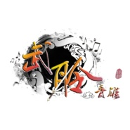
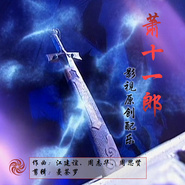

武聆音雄
============================

|  |  |
| :--: | :-- |
| [ 武聆音雄](https://i.xiami.com/wlyxmusic) | **播放数**: 15079875 **粉丝数**: 3262 **评论数**: 108 **地区**: China 中国大陆 **风格**: 古风 GuFeng Music, 电视原声 Television Music, 电影原声 Film Score  |

## 档案

一个整理与介绍武侠音乐的主体团队，成立于2010年3月13日，聚集了一大批对武侠音乐有着相同爱好与理念的朋友，成员在武侠音乐专辑制作，武侠音乐重新演绎，音画分析，音乐原创，mv制作，美工，宣传上各展所能，为武侠音乐、影视配乐的普及做出了重要贡献。

## 专辑

| 名称 | 语种 | 唱片公司 | 发行时间 | 专辑类别 | 专辑风格 |
| :--: | :-- | :-- | :-- | :-- | :-- |
| [ 梦回四季你留下的四季](./albums/5022245702.md) | 国语 | 独立发行 | 2020年12月20日 | EP, 单曲 | 古风 GuFeng Music, 中国风 China-Wave, 国语流行 Mandarin Pop |
| [ 倩女幽魂 O.S.T.倩女幽魂 电视剧原声配乐集](./albums/2104946394.md) | 纯音乐 | 武聆音雄 | 2019年06月16日 | 原声带, 影视音乐 | 电视原声 Television Music, 原声 Soundtrack, 中国风 China-Wave |
| [ 武侠音乐系列之浩然正气](./albums/2104424181.md) | 纯音乐 | 武聆音雄 | 2018年12月28日 | 合集, 杂锦 | 电视原声 Television Music, 电影原声 Film Score, 中国风 China-Wave |
| [ 萧十一郎 影视原创配乐](./albums/2103826759.md) | 纯音乐 | 武聆音雄 | 2018年07月19日 | 原声带, 影视音乐 | 电视原声 Television Music, 中国风 China-Wave |
| [ 聊斋贰 影视原声配乐集聊斋贰 电视原声带](./albums/2103752423.md) | 纯音乐 | 武聆音雄 | 2018年06月19日 | 原声带, 影视音乐 | 电视原声 Television Music, 原声 Soundtrack |
| [ 仙凡恋](./albums/2102767712.md) | 纯音乐 | 武聆音雄 | 2017年06月18日 | 精选集 | 游戏配乐 Video Game Music, 古风 GuFeng Music, 中国风 China-Wave |
| [ 夜空下的思念](./albums/2102747962.md) | 纯音乐 | 武聆音雄 | 2017年05月15日 | EP, 单曲 | 游戏配乐 Video Game Music, 古风 GuFeng Music, 中国风 China-Wave |
| [ 陆小凤传奇 电影原声音乐集 (剧场版)](./albums/1102301152.md) | 其他 | 武聆音雄 | 2014年05月18日 | 原声带, 影视音乐 | 原声 Soundtrack, 电影原声 Film Score |
| [ 武侠音乐第二部精选集武侠音乐系列贰精选集](./albums/1880270494.md) | 国语 | 武聆音雄 | 2013年09月23日 | 精选集 | 电视原声 Television Music, 电影原声 Film Score, 中国风 China-Wave |
| [ 武侠音乐系列第二部之悟道篇武侠音乐系列二之浮生若梦](./albums/163595245.md) | 国语 | 武聆音雄 | 2013年03月08日 | 合集, 杂锦 | 中国风 China-Wave |
| [ 武侠音乐系列第二部之人物篇武侠音乐系列二之人乐合一](./albums/63595174.md) | 国语 | 武聆音雄 | 2013年03月06日 | 合集, 杂锦 | 电视原声 Television Music, 电影原声 Film Score, 中国风 China-Wave |
| [ 武侠音乐系列第二部之仙景篇武侠音乐系列二之世外桃源](./albums/2063595087.md) | 国语 | 武聆音雄 | 2013年03月04日 | 合集, 杂锦 | 中国风 China-Wave, 新世纪音乐 New Age, 原声 Soundtrack |
| [ 武侠音乐系列第二部之鬼景篇武侠音乐系列二之神秘莫测](./albums/1463595015.md) | 国语 | 武聆音雄 | 2013年03月03日 | 合集, 杂锦 | 电视原声 Television Music, 游戏配乐 Video Game Music, 电影原声 Film Score |
| [ 武侠音乐系列第二部之豪情篇武侠音乐系列二之大展宏图](./albums/1162453136.md) | 国语 | 武聆音雄 | 2013年02月26日 | 合集, 杂锦 | 电视原声 Television Music, 电影原声 Film Score, 游戏配乐 Video Game Music |
| [ 武侠音乐系列第二部之爱情篇武侠音乐系列二之柔情似水](./albums/1762984639.md) | 国语 | 武聆音雄 | 2013年02月26日 | 合集, 杂锦 | 电视原声 Television Music, 电影原声 Film Score, 游戏配乐 Video Game Music, 中国风 China-Wave |
| [ 武侠音乐系列第二部之思情篇武侠音乐系列二之余情幽梦](./albums/963576407.md) | 国语 | 武聆音雄 | 2013年02月26日 | 合集, 杂锦 | 电视原声 Television Music, 电影原声 Film Score, 游戏配乐 Video Game Music, 中国风 China-Wave |
| [ 武侠音乐系列第二部之悲情篇武侠音乐系列二之生离死别](./albums/1663576619.md) | 国语 | 武聆音雄 | 2013年02月26日 | 合集, 杂锦 | 电影原声 Film Score, 电视原声 Television Music, 游戏配乐 Video Game Music |
| [ 武侠音乐系列第二部之欢情篇武侠音乐系列二之欢歌曼舞](./albums/1163576476.md) | 国语 | 武聆音雄 | 2013年02月26日 | 合集, 杂锦 | 中国风 China-Wave |
| [ 武侠音乐系列之双雄对峙](./albums/479311486.md) | 国语 | 武聆音雄 | 2009年09月20日 | 合集, 杂锦 | 中国风 China-Wave |

## 评论

|  |  |  |  |
| :-- | :-- | :-- | :-- |
|  [虾米用户](https://emumo.xiami.com/u/1365948)  2020-12-16 10:11 赞(0) 踩(0) | 
给你们点赞，非常感谢，能看到武侠文化的传承
 |
|  [虾米用户](https://emumo.xiami.com/u/3873306)  2020-12-10 00:41 赞(0) 踩(0) | 
支持  
 |
|  [虾米用户](https://emumo.xiami.com/u/1985500)  2020-09-06 00:48 赞(0) 踩(0) | 
求出更多的专辑！
 |
|  [虾米用户](https://emumo.xiami.com/u/423586668)  2020-01-30 20:12 赞(0) 踩(0) | 
黎真吾的《圈》能给咱们弄出来吗？
 |
|  [虾米用户](https://emumo.xiami.com/u/353673034) 哪里有山崖，哪里有山洞 2019-11-14 13:28 赞(2) 踩(0) | 
武聆音雄论坛好久没看了，不知经营的怎么样了？零几年经常去找tvb配乐，也传过几个自己截取的配乐，后来一几年改版过，再后来15年左右逛了几次，好多回忆在里面。
 |
| ⇒ |  [虾米用户](https://emumo.xiami.com/u/4789322) 等闲却过一年春 2020-04-27 00:40 赞(0) 踩(0) | 
活着，还好
 |
|  [虾米用户](https://emumo.xiami.com/u/335843381) 醉心集 5-2 2019-09-03 19:25 赞(1) 踩(0) | 
看来乌龙闯情关配乐只能靠你了 舍你其谁
 |
|  [虾米用户](https://emumo.xiami.com/u/401972579)  2019-08-31 05:39 赞(0) 踩(0) | 
有没有雪花神剑最后一集打斗的背景音乐？谢谢
 |
|  [虾米用户](https://emumo.xiami.com/u/328657369) 风格随心而变、 2019-08-13 01:53 赞(1) 踩(0) | 

 |
|  [虾米用户](https://emumo.xiami.com/u/187651870)  2019-03-25 17:39 赞(0) 踩(0) | 
感谢你们！！
 |
|  [虾米用户](https://emumo.xiami.com/u/37968982)  2019-03-24 22:21 赞(0) 踩(0) | 
求天地传说之宝莲灯中，最后一集救三圣母场景中，母子俩对话的时候的BGM！
 |
|  [虾米用户](https://emumo.xiami.com/u/1240537) 音乐不死 2019-03-10 10:27 赞(0) 踩(0) | 
武聆音雄 大神老大  有生之年希望听到  电视剧天下第一  原声大碟
 |
|  [虾米用户](https://emumo.xiami.com/u/11501477) 喵喵喵喵汪汪汪 2019-03-09 00:16 赞(0) 踩(0) | 
希望有生之年能在这里听到张卫健版《少年张三丰》的配乐！
 |
|  [虾米用户](https://emumo.xiami.com/u/342624672)  2018-12-18 16:40 赞(0) 踩(0) | 
求七虫七花膏完整版
 |
|  [虾米用户](https://emumo.xiami.com/u/12047177)  2018-11-21 19:03 赞(0) 踩(0) | 
喜欢  
 |
|  [虾米用户](https://emumo.xiami.com/u/333349263)  2018-11-15 10:21 赞(0) 踩(0) | 
看到好多大霹雳的配乐，好感动
 |
|  [虾米用户](https://emumo.xiami.com/u/201670712)  2018-09-15 03:25 赞(1) 踩(0) | 
你们才是真正的武侠音雄！
 |
|  [虾米用户](https://emumo.xiami.com/u/8192902)   2018-08-31 11:51 赞(0) 踩(0) | 
没有《疗伤神法》这张专辑
 |
|  [虾米用户](https://emumo.xiami.com/u/18236235) 我还没想好要写什么... 2018-04-15 23:58 赞(0) 踩(0) | 
∿
 |
|  [虾米用户](https://emumo.xiami.com/u/241151566)  2018-04-13 21:59 赞(2) 踩(0) | 
求吕版笑傲，思过崖和小师妹一起的背景音乐！我想只有你们能找到了，太经典了，网上的都是不太清晰的录制的
 |
|  [虾米用户](https://emumo.xiami.com/u/117547220)   2018-03-06 15:15 赞(3) 踩(0) | 
哭唧唧，感谢武聆音雄大大。我找到了我找了快半辈子的，楚留香新传原声碟&amp;hellip;&amp;hellip;实在太难找了&amp;hellip;&amp;hellip;
 |
|  [虾米用户](https://emumo.xiami.com/u/8176271)  2018-01-17 08:25 赞(3) 踩(0) | 
老多年前在武聆音雄的论坛上听武侠配乐，没想到今天虾米上又碰到 
 |
|  [虾米用户](https://emumo.xiami.com/u/248840045)  2018-01-06 13:33 赞(1) 踩(0) | 
求火云传奇二胡配乐完整版
 |
|  [虾米用户](https://emumo.xiami.com/u/253825065)  2017-11-30 11:56 赞(1) 踩(0) | 
武林英雄
 |
|  [虾米用户](https://emumo.xiami.com/u/97273870)  2017-11-04 21:11 赞(1) 踩(0) | 
侠客行唐代：李白赵客缦胡缨，吴钩霜雪明。银鞍照白马，飒沓如流星。十步杀一人，千里不留行。事了拂衣去，深藏身与名。闲过信陵饮，脱剑膝前横。将炙啖朱亥，持觞劝侯嬴。三杯吐然诺，五岳倒为轻。眼花耳热后，意气素霓生。救赵挥金槌，邯郸先震惊。千秋二壮士，烜赫大梁城。纵死侠骨香，不惭世上英。谁能书阁下，白首太玄经。
 |
|  [虾米用户](https://emumo.xiami.com/u/287841394) 过程就是生活 2017-10-05 04:24 赞(1) 踩(0) | 
那些有关于武侠的记忆，一直深深的封存在记忆里
 |
|  [虾米用户](https://emumo.xiami.com/u/19730339)  2017-09-29 12:54 赞(0) 踩(0) | 
早在2010
 |
|  [虾米用户](https://emumo.xiami.com/u/153013324) 粤语经典，古风禅乐new... 2017-09-27 07:43 赞(1) 踩(0) | 
感谢音乐人
 |
|  [虾米用户](https://emumo.xiami.com/u/269313941) 我还没想好要写什么... 2017-08-17 23:04 赞(0) 踩(0) | 
87版的大运河主题曲，总在剧中出现那段纯音乐版，真希望能截出来！
 |
|  [虾米用户](https://emumo.xiami.com/u/2307526) 连接比特与像素的造梦师！ 2017-08-16 11:15 赞(0) 踩(0) | 
寻秦记里有一首像时钟滴答的声音找不到，不知道哪里能找到？
 |
|  [虾米用户](https://emumo.xiami.com/u/288698052)  2017-08-14 11:04 赞(0) 踩(0) | 
求问有没有东游记的配乐～
 |
|  [虾米用户](https://emumo.xiami.com/u/2231133)  2017-08-04 09:53 赞(0) 踩(0) | 
我从论坛来，论坛请搜百度武聆音雄，无奇不有，欢迎来坐
 |
|  [虾米用户](https://emumo.xiami.com/u/2231133)  2017-08-04 09:53 赞(0) 踩(0) | 
我从论坛来，论坛请搜百度武聆音雄，无奇不有，欢迎来坐
 |
|  [虾米用户](https://emumo.xiami.com/u/5828782) 一眼可载几多剑 2017-06-09 09:56 赞(0) 踩(0) | 
能不能 把天龙八部 向日华版的 发布出来？
 |
| ⇒ |  [虾米用户](https://emumo.xiami.com/u/53565) 更多武侠音乐，请关注武聆... 2017-06-16 19:28 赞(0) 踩(0) | 
可以去官网首页的电台听 有不少
 |
| ⇒ |  [虾米用户](https://emumo.xiami.com/u/5828782) 一眼可载几多剑 2017-06-16 20:14 赞(0) 踩(0) | 
<q><b>武聆音雄说：</b></q>
 |
|  [虾米用户](https://emumo.xiami.com/u/14638405)  2017-05-06 17:45 赞(1) 踩(0) | 
感谢整理，非常喜欢
 |
|  [虾米用户](https://emumo.xiami.com/u/12136332) 意大利音乐学院在读研究生 2017-03-29 14:56 赞(1) 踩(0) | 
感谢整理，希望赶紧全部发布完
 |
| ⇒ |  [虾米用户](https://emumo.xiami.com/u/53565) 更多武侠音乐，请关注武聆... 2017-04-21 22:42 赞(0) 踩(0) | 
音质问题，其他的无法补全了，可以到我们官网去下载
 |
|  [虾米用户](https://emumo.xiami.com/u/2065585)  2017-03-19 10:58 赞(0) 踩(0) | 
喜欢霹雳原声带
 |
|  [虾米用户](https://emumo.xiami.com/u/138138510) 聽 2016-12-29 22:21 赞(0) 踩(0) | 
赞，一股清流
 |
|  [虾米用户](https://emumo.xiami.com/u/5106725) 我还没想好要写什么... 2016-10-23 14:43 赞(0) 踩(0) | 
好想听黄日华版《天龙八部》的原声合集
 |
| ⇒ |  [虾米用户](https://emumo.xiami.com/u/18385919)  2017-05-01 22:23 赞(0) 踩(0) | 
网上有不少，基本上都是整理版本，有些经典配乐片段还是会有杂声，至今没听过完全纯净版的
 |
| ⇒ |  [虾米用户](https://emumo.xiami.com/u/5106725) 我还没想好要写什么... 2017-05-02 15:14 赞(0) 踩(0) | 
<q><b>石蛟龙99说：</b></q>
 |
|  [虾米用户](https://emumo.xiami.com/u/208799272) 每一座孤岛，都被深海拥抱... 2016-09-26 21:27 赞(0) 踩(0) | 
真心希望出一张大唐双龙传与寻秦记结合的原声带 
 |
| ⇒ |  [虾米用户](https://emumo.xiami.com/u/53565) 更多武侠音乐，请关注武聆... 2016-09-27 00:37 赞(0) 踩(0) | 
- -  虾米不让发布此类专辑了
 |
|  [虾米用户](https://emumo.xiami.com/u/12876004) ` 2016-09-12 19:11 赞(0) 踩(0) | 
！！ = =
 |
| ⇒ |  [虾米用户](https://emumo.xiami.com/u/53565) 更多武侠音乐，请关注武聆... 2016-09-12 21:01 赞(0) 踩(0) | 
？？= =
 |
|  [虾米用户](https://emumo.xiami.com/u/12876004) ` 2016-09-08 18:20 赞(0) 踩(0) | 
= =
 |
|  [虾米用户](https://emumo.xiami.com/u/6479300)  2016-07-13 18:10 赞(1) 踩(0) | 
好厉害，感谢团队的整理！
 |
|  [虾米用户](https://emumo.xiami.com/u/172328)   2016-07-06 22:38 赞(1) 踩(0) | 
大赞，武侠迷的福音啊，加油
 |
|  [虾米用户](https://emumo.xiami.com/u/34482490)   2016-06-28 06:31 赞(0) 踩(0) | 
能不能吧还珠1和2部的大部分引用配乐给找出来
 |
| ⇒ |  [虾米用户](https://emumo.xiami.com/u/12136332) 意大利音乐学院在读研究生 2017-10-28 00:38 赞(0) 踩(0) | 
有还珠格格1的配乐，还珠格格2的目前没有。由于虾米有限制，可以到网易云音乐的歌单中搜索，那里比较全，先发给你链接   分享 还珠格格第一部原版配... 的歌单《还珠格格第一部原版配...》<a href="https://www.xiami.com/collect/279949784" target="_blank" rel="nofollow noreferrer noopener">https://www.xiami.com/collect/279949784</a> (分享自@虾米音乐)
 |
|  [虾米用户](https://emumo.xiami.com/u/4116797)  2016-06-26 12:24 赞(0) 踩(0) | 
武侠迷
 |
|  [虾米用户](https://emumo.xiami.com/u/748637)  2016-05-24 21:04 赞(0) 踩(0) | 
武侠音乐
 |
|  [虾米用户](https://emumo.xiami.com/u/1240537) 音乐不死 2016-04-18 23:02 赞(0) 踩(0) | 
武侠最权威的发布地方  但就是缺罗坚的天下第一原声大碟 希望有缘听到
 |
|  [虾米用户](https://emumo.xiami.com/u/1240537) 音乐不死 2016-04-18 23:02 赞(0) 踩(0) | 
武侠最权威的发布地方  但就是缺罗坚的天下第一原声大碟 希望有缘听到
 |
|  [虾米用户](https://emumo.xiami.com/u/1240537) 音乐不死 2016-04-18 22:58 赞(0) 踩(0) | 
急求 神枪手原声大碟
 |
|  [虾米用户](https://emumo.xiami.com/u/71073000)  2015-10-02 23:20 赞(0) 踩(0) | 
很多男孩儿的心中都曾有一个武侠梦！
 |
|  [虾米用户](https://emumo.xiami.com/u/71073000)  2015-10-02 23:20 赞(1) 踩(0) | 
很多男孩儿的心中都曾有一个武侠梦！
 |
|  [虾米用户](https://emumo.xiami.com/u/52279975)   2015-07-08 15:03 赞(0) 踩(0) | 
赞一个～
 |
|  [虾米用户](https://emumo.xiami.com/u/51614634)  2015-06-21 19:13 赞(0) 踩(0) | 
希望快点上传
 |
|  [虾米用户](https://emumo.xiami.com/u/8395195) 何必呢 2015-05-29 13:16 赞(1) 踩(0) | 
那么多经典的曲目居然是外国人作的，以前都不知道啊
 |
|  [虾米用户](https://emumo.xiami.com/u/12955524)  2015-05-17 17:35 赞(0) 踩(0) | 
挺好听的
 |
|  [虾米用户](https://emumo.xiami.com/u/12955524)  2015-05-17 17:35 赞(0) 踩(0) | 
挺好听的
 |
|  [虾米用户](https://emumo.xiami.com/u/2307526) 连接比特与像素的造梦师！ 2015-03-13 22:47 赞(0) 踩(0) | 
牛逼！
 |
|  [虾米用户](https://emumo.xiami.com/u/26363620) 六代风影 2014-12-17 18:21 赞(0) 踩(0) | 
不可多得
 |
|  [虾米用户](https://emumo.xiami.com/u/26105866)  2014-11-16 13:08 赞(0) 踩(0) | 
牛逼
 |
|  [虾米用户](https://emumo.xiami.com/u/856237) 曲风~ 2014-10-11 21:07 赞(0) 踩(0) | 
*
 |
|  [虾米用户](https://emumo.xiami.com/u/13536897) 凡胎恰登对 2014-07-28 12:50 赞(0) 踩(0) | 
武侠 怀旧 影视
 |
|  [虾米用户](https://emumo.xiami.com/u/178528) hehehe 2014-07-23 16:47 赞(0) 踩(0) | 
武聆的大侠！拜过！
 |
|  [虾米用户](https://emumo.xiami.com/u/5656865)  2014-07-14 21:28 赞(0) 踩(0) | 
还不错哦！有点大师风范了
 |
|  [虾米用户](https://emumo.xiami.com/u/500933)  2014-07-12 11:57 赞(0) 踩(0) | 
经典中的经典
 |
|  [虾米用户](https://emumo.xiami.com/u/10819314) 细细打磨耳朵。 2014-06-16 12:04 赞(1) 踩(0) | 
哈罗~你在我的求助精选集上添加了歌曲，可以写一下评价或者添加原因吗？3Q~
 |
|  [虾米用户](https://emumo.xiami.com/u/176371) 我还没想好要写什么... 2014-05-03 09:18 赞(0) 踩(0) | 
来坐坐，也欢迎来我这听听歌~~
 |
|  [虾米用户](https://emumo.xiami.com/u/5989165) 我还没想好要写什么... 2014-05-02 09:56 赞(0) 踩(0) | 
你们真厉害 一下就找到了 就是这首 寻秦记原声大碟和甄子丹-精武门原声大碟 有希望在虾米下载到了
 |
|  [虾米用户](https://emumo.xiami.com/u/5989165) 我还没想好要写什么... 2014-04-30 01:30 赞(16) 踩(0) | 
真心希望能出一张寻秦记原声带
 |
| ⇒ |  [虾米用户](https://emumo.xiami.com/u/53565) 更多武侠音乐，请关注武聆... 2014-04-30 17:37 赞(0) 踩(0) | 
一张寻秦记引用音乐原声还是有望的  哈哈
 |
| ⇒ |  [虾米用户](https://emumo.xiami.com/u/5989165) 我还没想好要写什么... 2014-05-01 07:59 赞(0) 踩(0) | 
<q><b>武聆音雄说：</b></q>
 |
| ⇒ |  [虾米用户](https://emumo.xiami.com/u/5989165) 我还没想好要写什么... 2014-05-01 08:02 赞(0) 踩(0) | 
<q><b>武聆音雄说：</b></q>
 |
| ⇒ |  [虾米用户](https://emumo.xiami.com/u/53565) 更多武侠音乐，请关注武聆... 2014-05-01 21:53 赞(0) 踩(0) | 
<q><b>小冲是个野孩纸说：</b></q>
 |
| ⇒ |  [虾米用户](https://emumo.xiami.com/u/53565) 更多武侠音乐，请关注武聆... 2017-06-16 19:29 赞(0) 踩(0) | 
不远的将来，确切的说未来的几个月将在官网发布
 |
| ⇒ |  [虾米用户](https://emumo.xiami.com/u/5989165) 我还没想好要写什么... 2017-06-16 22:33 赞(0) 踩(0) | 
<q><b>武聆音雄说：</b></q>
 |
| ⇒ |  [虾米用户](https://emumo.xiami.com/u/53565) 更多武侠音乐，请关注武聆... 2017-06-16 23:09 赞(0) 踩(0) | 
<q><b>小冲是个野孩纸说：</b></q>
 |
| ⇒ |  [虾米用户](https://emumo.xiami.com/u/5989165) 我还没想好要写什么... 2017-06-20 14:35 赞(0) 踩(0) | 
<q><b>武聆音雄说：</b></q>
 |
| ⇒ |  [虾米用户](https://emumo.xiami.com/u/33231771) 存在是因为价值创造！爱音... 2017-06-22 00:31 赞(0) 踩(0) | 
已经有了！ 
 |
| ⇒ |  [虾米用户](https://emumo.xiami.com/u/5989165) 我还没想好要写什么... 2017-06-23 18:14 赞(0) 踩(0) | 
<q><b>Rachel大城小事说：</b></q>
 |
| ⇒ |  [虾米用户](https://emumo.xiami.com/u/5989165) 我还没想好要写什么... 2017-08-19 10:48 赞(0) 踩(0) | 
<q><b>Rachel大城小事说：</b></q>
 |
| ⇒ |  [虾米用户](https://emumo.xiami.com/u/1871583) 听最新粤语歌，欢迎加入8... 2018-11-14 00:08 赞(0) 踩(0) | 
我收藏了4.7G的配乐光盘
 |
| ⇒ |  [虾米用户](https://emumo.xiami.com/u/5989165) 我还没想好要写什么... 2018-12-02 19:50 赞(0) 踩(0) | 
<q><b>分享无损音乐说：</b></q>
 |
| ⇒ |  [虾米用户](https://emumo.xiami.com/u/5989165) 我还没想好要写什么... 2018-12-02 19:50 赞(0) 踩(0) | 
<q><b>Rachel大城小事说：</b></q>
 |
|  [虾米用户](https://emumo.xiami.com/u/34474018)  2014-03-26 21:53 赞(0) 踩(0) | 
very good
 |
|  [虾米用户](https://emumo.xiami.com/u/2864515)  2014-03-09 20:19 赞(0) 踩(0) | 
挺期待第一系列也放在虾米上，谢谢楼主，很精致。
 |
|  [虾米用户](https://emumo.xiami.com/u/11031075)  Md网易云zz怎么那么... 2014-02-09 19:31 赞(2) 踩(0) | 
你们有授权么？怎么这么山寨，封面难看死了。
 |
|  [虾米用户](https://emumo.xiami.com/u/4126362) w_e_chat : y... 2014-01-09 11:58 赞(3) 踩(0) | 
传一曲天荒地老共一生水远山高正义不倒会盟天下英豪无招胜有招英雄肝胆两相照江湖儿女日见少心还在人去了回首一片风雨飘摇心还在 人去了回首一片(回首一片)风雨飘摇传一曲天荒地老共一生水远山高正义不倒会盟天下英豪无招胜有招
 |
|  [虾米用户](https://emumo.xiami.com/u/4126362) w_e_chat : y... 2014-01-09 11:57 赞(1) 踩(0) | 
惩强扶弱，劫富济贫。侠之大者，为国为民。南拳北腿，少林武当。天下武功，唯快不破。天之道，损有余而不足，是故虚胜实，不足胜有余。琴箫合奏，知心者几人？沧海一声笑，愿把酒当歌，醉饮江湖！问世间情为何物，直教人生死相许！相濡以沫不如相忘于江湖！
 |
|  [虾米用户](https://emumo.xiami.com/u/5904049)  2013-12-31 22:49 赞(0) 踩(0) | 
骆集益担当音乐制作的《古剑奇谭》是游戏，不是电视剧，谢谢
 |
| ⇒ |  [虾米用户](https://emumo.xiami.com/u/20361050)  2014-01-01 19:54 赞(0) 踩(0) | 
原本的资料不是这样的，跟虾米小编纠正过，没有后文了。
 |
| ⇒ |  [虾米用户](https://emumo.xiami.com/u/1612404) 我有时看不了你们的回复 2014-04-27 02:31 赞(0) 踩(0) | 
<q><b>丘九天说：</b></q>
 |
| ⇒ |  [虾米用户](https://emumo.xiami.com/u/1612404) 我有时看不了你们的回复 2014-04-27 02:32 赞(0) 踩(0) | 
层主这个我叫小编改好了。
 |
| ⇒ |  [虾米用户](https://emumo.xiami.com/u/5904049)  2014-04-28 10:10 赞(0) 踩(0) | 
<q><b>管子说：</b></q>
 |
|  [虾米用户](https://emumo.xiami.com/u/2670015)  2013-12-17 21:58 赞(0) 踩(0) | 
侠之大者
 |
|  [虾米用户](https://emumo.xiami.com/u/10509420)  2013-12-15 19:26 赞(1) 踩(0) | 
全力支持。希望一直做下去，有什么想法多和粉丝们分享。我们一定会支持的。
 |
|  [虾米用户](https://emumo.xiami.com/u/14081203) 习惯孤独。 2013-12-04 15:29 赞(1) 踩(0) | 
以前的武侠音乐真美，居然在这里找到了好多，好开心！！！感谢感谢！！！
 |
|  [虾米用户](https://emumo.xiami.com/u/8128176) 好好活着 2013-10-06 21:44 赞(1) 踩(0) | 
怎么不把系列1也发上来
 |
|  [虾米用户](https://emumo.xiami.com/u/5398540) 民歌警察出警中 2013-09-30 18:39 赞(1) 踩(0) | 
都是很好的音乐，万分感谢！！！！
 |
|  [虾米用户](https://emumo.xiami.com/u/4808069) アキラ 2013-09-28 13:55 赞(1) 踩(0) | 
跪求大神来补全这里的砖啊！！！
 |
| ⇒ |  [虾米用户](https://emumo.xiami.com/u/10640160)  2013-09-28 21:21 赞(0) 踩(0) | 
因为音质问题，没有达到320K，所以虾米无法通过，如果亲有意，可以百度 武聆音雄论坛，下载哦
 |
