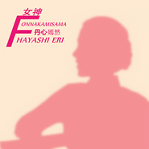

女神FONNAKAMISAMA F
============================

|  |  |
| :--: | :-- |
| [ 女神FONNAKAMISAMA F](https://emumo.xiami.com/album/2032419598) | **艺人**: [丹心嫣然](../index.md) **语种**: 国语 **唱片公司**: 独立发行 **发行时间**: 2015年05月29日 **专辑类别**: 录音室专辑 **专辑风格**:  **播放数**: 56982 **收藏数**: 12 **评论数**: 2  |

## 简介

 
 

刚爱上女神那会儿就想着一定要为女神做一张专辑，里面有歌曲，还有纯音乐，而且以后还要有第二张、第三张……原本想着慢慢来，等女神今年生日再送给女神，后来想着正好十佳就唱给女神的歌吧，就赶紧做吧，然后听说……看来必须赶快了！
 

希望女神可以好好听听我的音乐，看看灵感介绍，我做音乐这么久没有一下子出过含这么多首歌的专辑。不过我知道女神很忙啦，所以很多纯音乐在平常忙碌的时候也是很好的伴侣噢！
 

（嘻嘻嘻嘻…私自用了女神的照片剪影当封面很忐忑，实在是喜欢呀~女神别打我~）
 

创作灵感如下：
 

 
 

01原创歌曲《自从那天起》
 

作词/作曲/编曲/演唱：丹心嫣然
 

第一次为女神写歌，灵感的话就说来话长了，让我边回忆边对着歌词解释吧。“初次见你，我就被你吸引，你笑着，我的心加速跳动着。你的声音那么柔和动听，你的身影那么优雅那么美丽。”刚来二中新生教育的时候，我第一次走进篮球馆，本能地抢了前排，坐下，看台上的老师，对美丽的女神一见倾心，然后女神上台为我们讲福州二中校史，声音更是深深吸引了我，正如歌词所写的那样。后来有一段时间，我跟女神没什么交集，但是我记得貌似是高二高三奖学金颁奖那次女神有发言，当时说“有请方颖副校长”致辞的时候我整个人都很嗨。后来合唱比赛那天我才跟女神第一次搭讪，大家排队走的时候我跟在后面，女神正好在台边，我先问女神她教什么科目（其实我是知道的），然后女神说教历史，然后问我是不是叫嫣然，我说老师你知道我啊，她说有听说过我，我的声音很有特色。当时很开心哦，然后大家坐车走的时候女神还挥手致意，我当时也狂挥手，后来我还跟段长说起来“方颖校长好美啊~~~！”段长说“方颖校长当然很美啦~女神级人物~”我还记得那天女神应该是穿了紫色外套，特别有范儿！“偶然碰面，在那匆忙的课间，一瞬间，我迎上你美丽的脸”是比赛过后的周一，第三节课后我把照片拷到德育处去，完了着急上课就乘电梯下楼，刚到二楼，电梯门一打开就看到了美丽的女神，巨开心！后来嘛~就是一步再一步的搭讪啦，告诉了女神我喜欢她，开始了女神超级忠实粉丝的漫漫征途。为了女神可以注意我，从来对主持人避而不谈只干幕后的我拼命争取到了元旦晚会的主持人，因为太喜欢了，急于了解女神，所以就有了某次主持排练后的悲剧：“我鼓起勇气去找你，可结果却令我伤心，我知道是我太鲁莽，我不懂怎样含蓄。”那次事情我很介怀，好一段时间不敢见女神，后来班主任跟我说女神才不会介意呢，我的心就放开了。“她们说在那见到你，可那时我已经离去，原本我可以见到你，只怪我不够坚定。”这句写的是元旦审节目的时候，我们高一那天，女神没来，第二天是高二的，我本来打算过去看想会不会遇见女神，然后觉得不会就走了，结果第二天就听高二的学姐说昨天女神出现了，那个悔恨啊！不过后来想想都是小事啦~真的要说起这样的情况太多了。所以我大概就是在元旦晚会之前那段完成了这首歌，编曲在寒假就完成了，后来呢，就在女神超级忠实粉丝的征途上顺利走下去啦~这征途没有终点，随时都在努力！希望女神可以喜欢我这首歌！（后来还改编成了双排键曲~请听第13首）
 

 
 

02原创纯音乐《静想》
 

作曲/编曲：丹心嫣然
 

第一次为女神即兴创作的纯音乐，于5月3日首发。发完马上转到了朋友圈，有特意注明是给女神的，不过等了半个小时，女神有了新的动态，却没有给我任何评论或者点赞，大概是忽略了吧，我想。然后心里难受了一会儿，直接把链接发给了女神，这是加女神微信这么长时间头一次给女神发消息，很忐忑，很激动。一会儿，收到了女神的回复：“太美好！宁静优雅，飘渺空灵，静静的，暖暖的~[玫瑰][玫瑰][玫瑰]谢谢！我的孩子！”得到了女神的赞美，之后整个人就嗨起来了。
 

创作灵感：昨天下午在漫猫咖啡的时候有了灵感，九点多走到安泰附近的时候，朋友说我今天哼这首曲子哼了好几遍，我本来想拿本子记下来，但后来觉得反正是纯音乐，录的和谱上记的肯定会有差别，干脆就不记了，结果后来真的忘记了，走到六一环岛附近的时候，我又想到把音乐做成爵士风，但是后来也忘了。回到家虽然已经十一二点了，但是还是马上打开了琴，伴着夜色，想着女神F录下了这首曲子。以前录音都是用音频线转接到电脑，但是因为电流声太大，所以降噪完失真非常严重。正好琴上有直接保存录音文件到U盘的功能，开台式又特别麻烦，于是我就直接用U盘录完直接打开本本编辑。真的是一点噪音都没有！雅马哈的S950音色是众所周知的好，不过演唱会钢琴音色的振幅太弱，如果直接增益的话会有很明显的噪音，那样还不如转接录完降噪，所以我使用了20段图形滤波器增加了中低频。音质提高了，而且完全没噪音，效果好到没话说。第一次听可能会觉得这钢琴声音比较闷，都已经接近另一个原本就很闷的钢琴音色了，但是我要的就是这种感觉，暧昧、神秘，就像柔光的照片。那我为什么不直接用闷声钢琴？因为我要演唱会钢琴出彩的高音，高音很亮很实在，这就像照片里人物灿烂的笑颜。弹曲子的时候，我脑子里浮现的画面全都是美丽的女神，也许我永远没有机会专门为女神拍一组美美哒写真，可是在音乐的世界里早已为女神画了无数张肖像。可惜画画不好，否则一定专门为女神做一部PV来表达我的心意。希望女神听到可以喜欢。
 

 
 

03原创纯音乐《晨曦》
 

作曲/编曲：丹心嫣然
 

某天晚上想着女神，即兴弹了一首曲子，名字是后来才取的。曲如其名，晨曦。
 

女神发过一条动态：“晨曦中校园！宁静，明亮，温暖！”就是那种感觉。
 

 
 

04原创纯音乐《期许》
 

作曲/编曲：丹心嫣然
 

这首曲子是在录完《静想》之后灵感突发顺带录的，名字也是后来想的。大概是一种急切、期待的心情，喜欢电钢琴的灵巧活泼。
 

 
 

05原创纯音乐《热情》（Pasodoble 斗牛舞）
 

作曲/编曲：丹心嫣然
 

从小时候用卡西欧CT-588起一直很喜欢“帕索道布莱”这个节奏，也在现在用的雅马哈PSR-S950上看到“Pasodoble”很久，却一直不知道它就是我们熟知的斗牛舞（我一直以为斗牛舞是弗朗明哥）。想着女神，我就即兴来了一曲《热情》，真想跟女神共舞。
 

 
 

06原创纯音乐《回忆》
 

作曲/编曲：丹心嫣然
 

这首曲子是跟《热情》在同一晚录的，选了琴上唯一“Free Play”的一款MOVIE组的自由节奏，音色是OTS单触键直接给的，我甚至都没有提前去听OTS的音色，就是凭感觉切变奏然后音色就自己换了，但是问题就在于这款节奏本来就是“Free Play”，只有C、D变奏跟速度有关系，因为没看拍子，所以切换时机不准造成了一些小错误，本来打算废了，不过听了一遍感觉还可以就留了。名字是后来想的，就像是在回想和女神在一起的欢乐时光。
 

 
 

07原创歌曲《随缘》
 

作词/作曲/编曲/演唱：丹心嫣然
 

这首歌的歌词女神可以忽略啦，是在讲一个很虐心的故事，故事的灵感嘛~女神就不要问了哈。可是如果和女神没有关系的话为什么要放到给女神的专辑里来呢？这首歌的歌名来源于女神的“随缘随心，喜乐自在！”（其实本来我是有想也写一首《随心》的），看看歌词讲的故事呢，也确实是缘分吧，一对很好很好很好的闺蜜，十几年前分开了，后来又走到了一起。值得一提的是这首歌的编曲，是电子工业风实验音乐，“实验音乐”有很多种概念，做这首歌的时候我刚换Hy2音源，有很多音色都非常喜欢，就都丢进来了，就像做实验一样慢慢摸索做出了我第一首电子风的的音乐，可以说是我编曲道路上的一个里程碑。一开始听前奏可能会觉得像《Let it go》，确实有受到这曲子的影响，但是马上又会发现不一样。歌曲框架我模仿了水树奈奈的《迷宫蝴蝶》，就是太喜欢了但是因为版权问题又不能直接填，所以就模仿做了一个，但是差别还是很大的，就说和弦的话很多都不一样，整体编曲也差很大，所以别说我抄袭啦，我如果不说的话可能很多人还发现不了。另外这首歌真的是很难唱，因为音域很高并不是我的常用音域，所以唱起来特别费劲（双排键演奏版请听第11首，这是我第一次把自己的原创改编成双排键曲）。
 

 
 

08即兴翻弹凤凰传奇《嗨！Mrs Leta》
 

——《共舞》
 

女神听这首曲子一定会发现特别熟悉。这曲子是福州市第26届耕耘杯教师广场舞比赛咱二中天后舞蹈团参赛的舞蹈音乐！第一次在静静那里看指导老师的示范视频听到这首曲子感觉完全不能接受，后来又在CC那边看到排练的视频，多看几遍就被音乐洗脑了，然后就把这首歌下到了手机上，连着一整周上学放学都在单曲循环这首歌。5月29日比赛当天我来当后勤和跟拍，舞蹈抓拍一定要熟悉音乐和动作才能抓准镜头，否则都是一片糊。虽然之前看过排练视频不过都是不完整的。赛前彩排，我也抓拍彩排，练习了一下，后来出来了许多好照片（很幸运可以抓到一张角度光线都超棒的女神特写，巨美）。那天之后这首曲子又单曲循环了一周，满满的回忆，于是弹曲子就顺便弹了这首。（虽然怕版权问题但是实在是很喜欢很喜欢还是发了，毕竟也是和女神的美好回忆，所以特此注明是翻弹，并且这首曲子下载不收费！仅供学习分享！）
 

 
 

09原创纯音乐《不舍》
 

作曲/编曲：丹心嫣然
 

那天中午放学本来在校门口和展鸿儿聊的正嗨，王菁主任骑车出来，跟我说“你的女神要被调走了。”我整个人都不好了，又说了几句，展鸿让我赶紧去吃午饭。我一个人走出去，可想而知听到这消息后我的状态，特别虚。然后当时脑子里就浮现出来一段C调旋律，晚上录没有刻意还原，因为心情还带着。想着女神，曲子自然就成了。
 

 
 

10原创纯音乐《到点》
 

作曲/编曲：丹心嫣然
 

曲如其名，就是到离别的时候了。不过即兴录完听一遍感觉太low了因为听起来特别像矫情的韩国纯音乐，但是旋律还可以，认真听也确实会思绪万千。太快了。
 

 
 

11原创双排键《随缘》
 

（灵感如上同名歌曲）
 

 
 

12原创双排键《自从那天起》
 

（灵感如上同名歌曲）
 

 
 

13原创歌曲《未完待续》
 

作词/作曲/编曲/演唱：丹心嫣然
 

这首歌是在知道女神要被调走的消息那天晚上有的灵感，然后第二天马上就完稿了，编曲可以听得出来是用《自从那天起》改的，但是要的就是前后呼应的效果。灵感就是我不舍的心情，尽在歌词中。最后的“さようならだけじゃ何も終わらない……（虽说再见，但一切都未完结）”来源于明菜的歌曲《さようならじゃ終わらない》，因为这首歌整体的风格我本来就是想做成像那首歌那样。虽然这首歌完稿后没多久我就找了女神问，她说其实还没定，而且要调也就是调到对面教育学院去，以后还会有机会见到的。可我真是舍不得，正如我歌词所写“再也见不到你在校门口值勤，早会上见不到你身影，吃午饭再也无法碰见你，想你时跑上楼找不到你，楼道间再也无法偶遇”，比起将来我毕业离开女神，女神升职调走明显要更难接受，我这才跟女神相处了一年，好不容易和女神处熟了呢。璇儿说我这么想自私，确实，升职是好事，女神升职我应该高兴才对。虽然现在还不知道女神会不会调走，不过就算离开了女神，我也一定会更好地学习生活！不辜负女神对我的期望！也祝愿女神工作顺利，越来越好！
 

 
 

 
 

 
 

 

## 曲目

## 评论

|  |  |  |  |
| :-- | :-- | :-- | :-- |
|  [虾米用户](https://emumo.xiami.com/u/7029024) 唯爱朱丹戚薇今日子明菜 2015-07-19 20:21 赞(0) 踩(0) | 
我错了是 01 07 13
 |
|  [虾米用户](https://emumo.xiami.com/u/43461014) 工作账号 2015-07-11 20:07 赞(0) 踩(0) | 
除了 01、03、07 其他都是纯音乐
 |
