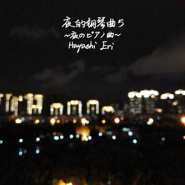

夜的钢琴曲5~夜のピアノ曲~Hayashi Eri Op.1-5
============================

|  |  |
| :--: | :-- |
| [ 夜的钢琴曲5~夜のピアノ曲~Hayashi Eri Op.1-5](https://emumo.xiami.com/album/2100364659) | **艺人**: [丹心嫣然](../index.md) **语种**: 国语 **唱片公司**: 独立发行 **发行时间**: 2016年07月08日 **专辑类别**: 录音室专辑 **专辑风格**: 器乐独奏 Solo Instrumental, 键盘音乐 Keyboard **播放数**: 19181 **收藏数**: 49 **评论数**: 5  |

## 简介

 前五首于前晚（20160706）所录，后两首于今天所录，都是临时来的灵感。《夜的钢琴曲七十二 ~茉莉~》献给今天0708生日的叶儿，生日快乐！《夜的钢琴曲七十三 ~放心~》献给下学期不再教我们的荷儿。“好好念喔最后一年”——谢谢你的鼓励！

## 曲目

## 评论

|  |  |  |  |
| :-- | :-- | :-- | :-- |
|  [虾米用户](https://emumo.xiami.com/u/111120844) 向往心灵的宁静。 2017-03-29 22:47 赞(0) 踩(0) | 
最近在虾米看到你音乐，出于好奇几乎把你的夜钢都听了一遍，即兴能有这样的曲子我觉得已经非常棒，你和石的音乐是两个类型，你的夜钢更具有随意性，他的更具有故事性，你们都有自己特色，也别害怕什么撕逼问题，我很喜欢石的音乐，有时候也想着和你一样写些即兴的曲子，我和你年龄差不多，不知道能不能和你产生些共鸣？
 |
| ⇒ |  [虾米用户](https://emumo.xiami.com/u/43461014) 工作账号 2017-03-29 23:26 赞(0) 踩(0) | 
其实我做这个系列没那么多情怀，初衷只是想如果通俗的钢琴曲有很多人可以喜欢的话那可以捞点零花钱。夜1基本是随便弹+炒冷饭。夜2是为了喜欢的人做的，是一晚上一次性出的即兴，最满意的。夜3也是随便弹。夜4夜5也都是为了喜欢的人。本身我做音乐就是为了喜欢的人，肯定还是有故事的，如果没有一些经历是随意不出来的。我觉得我能即兴是客观上听得多+主观上爱得多，所以灵感也就多了。
 |
| ⇒ |  [虾米用户](https://emumo.xiami.com/u/43461014) 工作账号 2017-03-29 23:33 赞(0) 踩(0) | 
我觉得最讽刺的就是正经写的曲子往往没人听，随便乱弹的被一堆人说好，但是不能总由着别人的意思来啊，当我把音乐发给我的创作对象、她们听到了之后，我的目的就已经达到了。没有更多的想法，也没那么担心撕逼，恰如你说，我们都有自己的特色。如果说故事性的话，你有兴趣可以听听我别的纯音乐。
 |
| ⇒ |  [虾米用户](https://emumo.xiami.com/u/111120844) 向往心灵的宁静。 2017-04-04 21:01 赞(0) 踩(0) | 
<q><b>丹心嫣然说：</b></q>
 |
| ⇒ |  [虾米用户](https://emumo.xiami.com/u/43461014) 工作账号 2017-10-27 23:41 赞(0) 踩(0) | 
<q><b>被时光移动的残骸说：</b></q>
 |
|  [虾米用户](https://emumo.xiami.com/u/43461014) 工作账号 2016-07-09 15:30 赞(0) 踩(0) | 
因为U盘的问题，这张专辑反反复复传了三遍才成功，但是其中的《碎片》还是很不幸真的像曲名一样变成了“碎片”，因原录音U盘的损坏，这首曲子的原文件也找不到了，所以无奈只能这样。
 |
