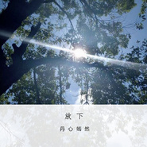

放下
============================

|  |  |
| :--: | :-- |
| [ 放下](https://emumo.xiami.com/album/2103584546) | **艺人**: [丹心嫣然](../index.md) **语种**: 国语 **唱片公司**: 独立发行 **发行时间**: 2018年03月06日 **专辑类别**: EP, 单曲 **专辑风格**: 国语流行 Mandarin Pop, 华语唱作人 Chinese Singer-Songwriter, 轻音乐 Easy Listening **播放数**: 8902 **收藏数**: 4 **评论数**: 5  |

## 简介

 

哈哈哈哈，是不是很惊讶，效率超低的我居然在《夏末秋初》发行后五天又发了新歌。我自己都有点不习惯，一开始也完全没有这么着急做这首歌的，然而，天有不测风云，明明前一天还在说《夏末秋初》可圈可点，结果后来还是做不成朋友。他说，互删吧，各自安好。好啊，各不相扰。他说，不要再为他做任何事了，好啊，那我就直接清算，做个了结。 
 

我承认歌曲录得很随便，瑕疵很多，但我已经没有心情一遍又一遍慢慢录了。这个成品平均每句都录了三遍吧，真是我认真做原创以来最少的，但每一次录都是带着感情，毕竟正在兴头上。就是因为正在兴头上，再深入下去，我可能真的会崩掉，所以打住了。 
 

摩羯长情也绝情。你对我绝情，我当然也绝情。 
 

还记得录《夏末秋初》有天晚上发了条朋友圈，“写的是别人的故事 扎的是自己的心”，他评论“难过就哭出来”，我回复“我泪点高 再说有些人不值得我的眼泪”。是啊，录《夏末秋初》那会儿我们已经陷入僵局了，所以才扎我的心。初恋我早就抛之脑后了，所以这话我是说给你听的。 
 

讲真，初恋那会儿我是根本骂不出来，我也不知为何，明明已经渣出天际了。可是他啊，我还是能在跟朋友聊天吐槽时骂几句。他人品比我初恋好，但给我的伤害也很大，性质不同而已，比起我初恋有过之而无不及。别怪我骂你啊，我在骂你的时候心里都是矛盾的，但我也许只有把你想得坏一点才能说服自己别再想你了吧……其实有些事我早该发现的，怪我没有怀疑你，如果之前说清楚，也许后来会不一样。 
 

但无所谓了，事情已经到了这个地步，那就这样吧。 
 

一首《本能》，加上1月13日那天送你的曲子，再加上为你而写遇到瓶颈跟你赌气否认是写给你的未完成。 
 

都发了吧，就当是扔垃圾。你的所有照片我也从手机里删了，毫不犹豫。别再总让我想起了。 
 

——原本还是想从感恩的角度写简介，但如果写得太暖，我自己会更舍不得，心里还是很难过的。犹豫了半天，《本能》还是选择了破罐子破摔，而不是像给初恋的一切力求完美。加了那么多随口白我自己也觉得矫情，但怕我不说清楚你会误会我做这首歌的态度。我知道你一定不会主动听这首歌，但万一中的万一系统推给你呢？ 
 

最后，为我的打扰和冒犯表示非常抱歉，今后不会了。 
 

我看你微博有点赞过一条：原来忍住一段时间不联系一个人，真的就不想联系了。可以，这很摩羯。 
 

再见，祝你幸福。相信我会放下你的，很快。 
 

私自用了你打算放下我之后的新头像当封面，算时刻给自己提个醒吧。 
 

如有侵权，请联系我。 
 

## 曲目

## 评论

|  |  |  |  |
| :-- | :-- | :-- | :-- |
|  [虾米用户](https://emumo.xiami.com/u/248267745) 你走出千万人群独行…… 2020-08-07 23:33 赞(0) 踩(0) | 
对得起彼此，不辜负时光
 |
|  [虾米用户](https://emumo.xiami.com/u/113941394)  2018-03-15 19:46 赞(0) 踩(0) | 
希望你能放下。祝你的下一步会更好。
 |
| ⇒ |  [虾米用户](https://emumo.xiami.com/u/43461014) 工作账号 2018-03-15 23:33 赞(0) 踩(0) | 
会的，谢谢。
 |
|  [虾米用户](https://emumo.xiami.com/u/286478887) 开心就好 2018-03-13 22:34 赞(2) 踩(0) | 
唉！为什么，情越深，伤越深？究竟是什么，让一个人，由爱生恨？
 |
| ⇒ |  [虾米用户](https://emumo.xiami.com/u/43461014) 工作账号 2018-03-14 21:11 赞(0) 踩(0) | 
分情况吧 我不恨我的初恋 但是前任我会 不过本着感恩的心吧 多去想想自己的收获 就没什么好恨的了
 |
