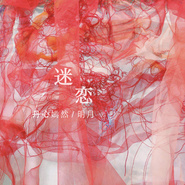

迷恋迷恋 with 明月
============================

|  |  |
| :--: | :-- |
| [ 迷恋迷恋 with 明月](https://emumo.xiami.com/album/2103712081) | **艺人**: [丹心嫣然](../index.md) **语种**: 纯音乐 **唱片公司**: 独立发行 **发行时间**: 2018年05月20日 **专辑类别**: 录音室专辑 **专辑风格**: 轻音乐 Easy Listening, 新世纪音乐 New Age, 轻音乐流行 Light Pop **播放数**: 2269 **收藏数**: 6 **评论数**: 0  |

## 简介

  
 

视觉：明月 音乐：丹心嫣然 
 
  

 欢喜在发酵 
 
  

 暖流激荡着热腾腾的心 
 
  

 胡言乱语 
 
  

 浮想联翩 
 
  

 温柔，我溺入她的眼神 
 
  

 我感激一切赐予我此刻的美好 
 
  

 把我变成天下最幸福的人 
 
  

 我拥有一切权利去发狂 
 
  

 去大哭 
 
  

 去诉说 
 
  

 起舞，旋转，欢笑 
 
  

 不停歇 
 
  

 我否定性别，职业与年龄 
 
  

 我自豪地爱上了一个人 
 
  

 一个和我拥有平等权利去爱的人 
 
  

       ——明月 2018年5月 
 
  

 你觉得缘分是什么呢？ 
 
  

 我觉得，缘分，是命中注定。 
 
  

 命中注定，我们人生道路上会遇到一些人，这些人的到来，让生活有了不一样的色彩。 
 
  

 这张专辑的诞生很偶然，源于缘分，也可以说，是命中注定。 
 
  

 首先感谢我的专业老师班文林老师。因为跟随老师去安徽参加《共生》青年艺术家联展，认识了清华美院的明月小姐姐，与聊得很投机，这次合作的想法就源于她。 
 
  

 你是否有你所迷恋的事物、所日思夜想的那个人呢？其实我们都有。 
 
  

 产生共鸣的，是我们的内心。 
 
  

 我们这次合作，形式上，是纤维艺术与电子音乐的结合，根本上，是我们思想与性格的碰撞。 
 
  

 感谢明月小姐姐与她所迷恋的那个她，这是我们合作之源。 
 
  

 感谢我所迷恋的L小姐姐，也要感谢我身边的T小哥哥。 
 
  

 L小姐姐是我的第一灵感来源。 
 
  

 《相遇在暖春》是最早完成的作品，也许令人难以置信。创作时，与L小姐姐才认识一个月，甚至还素未谋面，因为偶然的一个梦，我一直以来思绪终于得以落成音符。 
 
  

 初稿给我老师听后，她说可以带去安徽的展览，很适合做我们作品《尚村神泉——生命之于时间》的背景音乐。于是，来自L小姐姐的灵感，就这么促成了我人生中第一次参展。很偶然，但也很成功。 
 
  

 之后见到了L小姐姐，又在越来越多的交流下更加相互了解。她真的很优秀，而且其实我们很像，也很容易懂对方。越来越觉得，能够遇到她，真的是命中注定，三生有幸！ 
 
  

 同样让我觉得命中注定的，还有T小哥哥。认识他，几乎与认识L小姐姐同时。追随小姐姐的路上，也是小哥哥一直在陪伴、支持我，陪我欢喜，为我分忧。希望在我的未来，一直有他的陪伴，互相支持！ 
 
  

 我曾对小姐姐说，“我愿陪你看未来最美的花开”，在小姐姐暂别我的那一段时间，小哥哥也借这句话安慰过我。真心，感谢你们！ 
 
  

 最后，用我做《重逢》时的一段感悟作为尾声。也是我想对明月说的： 
 
  

 暂别，是为了以更好的姿态回归。 
 
  

 我的她如此，我相信你的她也是。 
 
  

 人与人，如若有缘，兜兜转转，终会重逢。 
 
  

 一同努力吧，愿你们重逢之时一片美好光景！ 
 
  

 ——嫣然 2018年5月15日 于北京
 

 

## 曲目

## 评论

