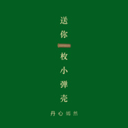

送你一枚小弹壳
============================

|  |  |
| :--: | :-- |
| [ 送你一枚小弹壳](https://emumo.xiami.com/album/2103858603) | **艺人**: [丹心嫣然](../index.md) **语种**: 国语 **唱片公司**: 独立发行 **发行时间**: 2018年08月01日 **专辑类别**: EP, 单曲 **专辑风格**: 国语流行 Mandarin Pop, 军旅歌曲 Military Songs **播放数**: 8480 **收藏数**: 4 **评论数**: 0  |

## 简介

 八一，这是一个我以前不曾太关注的日子， 今年，因你而不同。 
 

 【嫣然说】
 

六月初，我们在一起一个多月了，那晚，你突然给我发来了这首歌。 
 

 因为你说是你所喜欢的，再加上职业病，我认真聆听了很久，渐渐有了灵感。 
 

 刚跟你在一起时就想，何时也要接触一下军旅歌曲了！终于，难得有了这个机会。
 

当周主课，我就告诉老师，下周打算做这首歌，用我的理解、我的风格。 
 

 起初，只是想做一个伴奏，不知何时，有了自己顺便翻唱这首歌的想法。 说来，马上就是八一了！
 

暑假一回家，便立刻投入录音。封面是自己设计的，弹壳是自己手绘的。很久没有碰数位板了，画得不是太好，不过我的对象兵哥腾腾说还可以。 
 

 唱功以及录混技术长进不多，但真的用心了。 八一，这是一个我以前不曾太关注的日子， 今年，因你而不同。以后，也都将不同！ 
 

【腾腾说】
 

这是一首传唱率很高的军歌
 

也是我最感动的一首歌
 

每次听到熟悉的旋律
 

总会想起往昔的点点滴滴
 

忍不住在某一天分享给了你
 

 

没想到你居然提出
 

想重新改一下伴奏
 

当时还以为你随口一说
 

却不想很快就拿出了一个小样给我听
 

真的真的很佩服你
 

不愧是我的宝贝艺术家
 

 

暑假在家的你居然
 

又开始了翻唱
 

已经记不清多少个夜晚
 

你睡得比我还晚
 

就为了这首歌的录制
 

还拿出了多年未用的数位板
 

亲自手绘小弹壳设计封面
 

这首歌让我
 

听出了另一番味道
 

不一样的好听
 

却是格外的迷人和感动
 

 

8月1日
 

对我这个群体来言
 

是一个特殊的节日
 

对于你
 

本是一个平凡的日子
 

因为我
 

你选在了在这一天发布
 

今年的八一也变得格外的不一样了
 

 “四个绝对” 
 

 你懂的 
 

 
 

 【特别声明】
 

本作品尊重原作，个人的编曲及翻唱仅供学习分享交流，禁止商用。 该作品最终解释权归本人所有，如有任何问题请及时私信联系。 仅以此作品，向最可爱的人致敬！ 
 

 

## 曲目

## 评论

