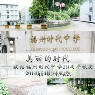

美丽的时代献给福州时代中学20周年校庆
============================

|  |  |
| :--: | :-- |
| [ 美丽的时代献给福州时代中学20周年校庆](https://emumo.xiami.com/album/517355187) | **艺人**: [丹心嫣然](../index.md) **语种**: 国语 **唱片公司**: 独立发行 **发行时间**: 2014年10月01日 **专辑类别**: EP, 单曲 **专辑风格**: 青少年流行 Teen Pop, 国语流行 Mandarin Pop, 华语唱作人 Chinese Singer-Songwriter **播放数**: 587 **收藏数**: 1 **评论数**: 1  |

## 简介

 虽然我在时代这三年生活得非常不开心，但是我还是很感谢时代。时代的老师们都很负责，让我养成了很多好习惯。我的成绩不好，不过分数从一检二检的455到中考的487.5也应该算是对得起老师们和我在这里付出的三年青春。明天的校庆我不会回去，一方面感冒人很难受，另一方面不想见到那些让我伤心的同班同学们。所以就发这首歌聊表心意吧，顺便向某些人证明我有时质疑时代的不足并不是在黑时代，越是爱得深才越是会去在意细节才会提建议，发现问题不说只会害了她。我只是说了我在时代三年的真实感受而已。我看得出别班的团结，别班人我认识的也不错，只是我曾经待的这个班确实让我心凉。只要不想我们班，时代就是很优秀的。感谢时代！感谢所有教过我的老师们！  
这首歌是今年五月份的时候写的，差不多词曲一起出来的，一开始是想给piko的《咲色リフレイン》填词，这个可以听出来尤其前几句很像，但是不知道为什么就写偏了，干脆自己重新写了个曲，不过还是有影子在里面。编曲是直接用PSR-S950来的。后来在初三参加十佳的初赛的时候唱过，不过立云老师说不适合我的音域就换成了我的另一首原创，也就是写给沪君老师的《记得我喜欢妳》。这首歌的编曲其实在那时候就已经完成了。

## 曲目

## 评论

|  |  |  |  |
| :-- | :-- | :-- | :-- |
|  [虾米用户](https://emumo.xiami.com/u/259781449)  2017-02-15 19:04 赞(0) 踩(0) | 
好听
 |
