丹心嫣然
============================

|  |  |
| :--: | :-- |
| [ 丹心嫣然](https://i.xiami.com/hayashi_eri) | **地区**: China 中国大陆 **风格**: 新世纪音乐 New Age, 当代唱作人 Contemporary Singer-Songwriter, 轻音乐 Easy Listening, 国语流行 Mandarin Pop **播放数**: 3358974 **粉丝数**: 732 **评论数**: 157  |

## 档案

本名林嫣然，就读于国音作曲系。 1999年1月14日出生于福建福州，毕业于福州二中。2017年考入国院音乐科技系电子音乐创作与制作专业（2018年并入作曲系）。

## 专辑

| 名称 | 语种 | 唱片公司 | 发行时间 | 专辑类别 | 专辑风格 |
| :--: | :-- | :-- | :-- | :-- | :-- |
| [ 最美逆行者](./albums/2106065116.md) | 国语 | 独立发行 | 2020年02月18日 | EP, 单曲 | 国语流行 Mandarin Pop, 华语唱作人 Chinese Singer-Songwriter |
| [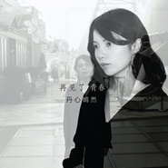 再见了青春](./albums/2105416580.md) | 国语 |  | 2019年11月07日 | EP, 单曲 |  |
| [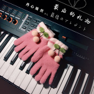 最后的礼物蝴蝶](./albums/2104480549.md) | 国语 |  | 2019年01月17日 | 录音室专辑 | 合成器流行 Synthpop, 国语流行 Mandarin Pop, 管弦乐流行 Orchestral Pop |
| [ 送你一枚小弹壳](./albums/2103858603.md) | 国语 | 独立发行 | 2018年08月01日 | EP, 单曲 | 国语流行 Mandarin Pop, 军旅歌曲 Military Songs |
| [ 迷恋迷恋 with 明月](./albums/2103712081.md) | 纯音乐 | 独立发行 | 2018年05月20日 | 录音室专辑 | 轻音乐 Easy Listening, 新世纪音乐 New Age, 轻音乐流行 Light Pop |
| [ 放下](./albums/2103584546.md) | 国语 | 独立发行 | 2018年03月06日 | EP, 单曲 | 国语流行 Mandarin Pop, 华语唱作人 Chinese Singer-Songwriter, 轻音乐 Easy Listening |
| [ 夏末秋初老醋坛子](./albums/2103577312.md) | 国语 | 独立发行 | 2018年03月01日 | EP, 单曲 | 国语流行 Mandarin Pop, 华语唱作人 Chinese Singer-Songwriter, 流行 Pop |
| [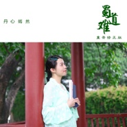 蜀道难（一周年重录修正版）](./albums/2103505925.md) | 国语 | 独立发行 | 2018年01月29日 | EP, 单曲 | 国语流行 Mandarin Pop |
| [ 天使的拥抱](./albums/2102905017.md) | 国语 | 独立发行 | 2017年10月23日 | EP, 单曲 | 国语流行 Mandarin Pop, 轻音乐 Easy Listening, 轻音乐流行 Light Pop |
| [ 福州二中的日子（新歌+精选）福州二中2017届林嫣然毕业献礼](./albums/2102851870.md) | 国语 | 独立发行 | 2017年09月10日 | 录音室专辑 | 国语流行 Mandarin Pop, 轻音乐 Easy Listening |
| [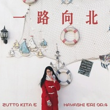 一路向北Hayashi Eri Op.4](./albums/2102806769.md) | 国语 | 独立发行 | 2017年08月02日 | 录音室专辑 | 轻音乐 Easy Listening, 中国风 China-Wave |
| [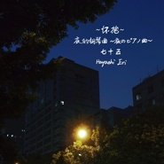 夜的钢琴曲七十五 ~怀抱~Hayashi Eri Op.1 No.75](./albums/2102736388.md) | 纯音乐 | 独立发行 | 2017年04月24日 | EP, 单曲 | 新世纪音乐 New Age, 轻音乐 Easy Listening, 器乐独奏 Solo Instrumental |
| [ 蜀道难](./albums/2102674789.md) | 国语 | 独立发行 | 2017年01月02日 | EP, 单曲 |  |
| [ '11~'16 KARAOKE COLLECTION丹心嫣然 2011-2016 原创音乐编曲作品集（伴奏集）](./albums/2102653056.md) | 国语 | 独立发行 | 2016年11月28日 | 录音室专辑 | 华语唱作人 Chinese Singer-Songwriter, 青少年流行 Teen Pop, 器乐独奏 Solo Instrumental |
| [ Canon in D 随想曲Hayashi Eri Op.3](./albums/2102651629.md) | 国语 |  | 2016年11月25日 | 录音室专辑 | 新世纪音乐 New Age, 民族融合新世纪 Ethnic Fusion New Age |
| [ 结局](./albums/2102777926.md) | 国语 | 独立发行 | 2016年10月24日 | EP, 单曲 | 流行 Pop, 国语流行 Mandarin Pop, 华语唱作人 Chinese Singer-Songwriter |
| [ 夜的钢琴曲5~夜のピアノ曲~Hayashi Eri Op.1-5](./albums/2100364659.md) | 国语 | 独立发行 | 2016年07月08日 | 录音室专辑 | 器乐独奏 Solo Instrumental, 键盘音乐 Keyboard |
| [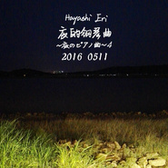 20160511~夜的钢琴曲4~Hayashi Eri Op.1-4](./albums/2100358794.md) | 国语 | 独立发行 | 2016年06月26日 | 录音室专辑 | 器乐独奏 Solo Instrumental, 键盘音乐 Keyboard |
| [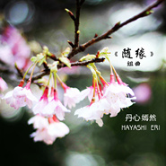 《随缘》组曲Hayashi Eri Op.2](./albums/2100331614.md) | 国语 | 独立发行 | 2016年05月08日 | 录音室专辑 | 新世纪音乐 New Age, 管弦乐 Orchestral |
| [ 夜的钢琴曲六十二 ~晚安~Hayashi Eri Op.1 No.62](./albums/2100321372.md) | 国语 | 独立发行 | 2016年04月24日 | EP, 单曲 |  |
| [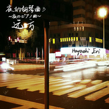 远方~夜的钢琴曲3~Hayashi Eri Op.1-3](./albums/2100305884.md) | 国语 | 独立发行 | 2016年04月04日 | 录音室专辑 | 新世纪音乐 New Age, 轻音乐 Easy Listening, 器乐独奏 Solo Instrumental |
| [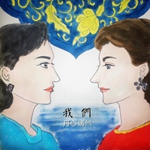 我们](./albums/2100292312.md) | 国语 | 独立发行 | 2016年03月23日 | EP, 单曲 |  |
| [ 人心](./albums/2100248524.md) | 国语 | 独立发行 | 2015年12月19日 | EP, 单曲 |  |
| [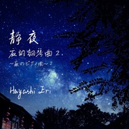 静夜~夜的钢琴曲2~Hayashi Eri Op.1-2](./albums/2100238956.md) | 纯音乐 | 独立发行 | 2015年11月17日 | 录音室专辑 | 新世纪音乐 New Age, 轻音乐 Easy Listening, 器乐独奏 Solo Instrumental |
| [ 羽翼老师我爱妳II 2015教师节](./albums/2100191034.md) | 国语 | 独立发行 | 2015年09月10日 | EP, 单曲 |  |
| [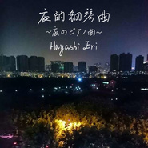 夜的钢琴曲~夜のピアノ曲~Hayashi Eri Op.1-1](./albums/1437540035.md) | 纯音乐 |  | 2015年07月22日 | 录音室专辑 | 轻音乐 Easy Listening, 器乐独奏 Solo Instrumental, 新世纪音乐 New Age |
| [ 女神FONNAKAMISAMA F](./albums/2032419598.md) | 国语 | 独立发行 | 2015年05月29日 | 录音室专辑 |  |
| [ 我们的九班福州二中2014级高一九班班歌](./albums/326434766.md) | 国语 | 独立发行 | 2015年03月16日 | EP, 单曲 | 国语流行 Mandarin Pop, 青少年流行 Teen Pop, 浩室舞曲 House |
| [ 做你的王子 2015情人节新版](./albums/623898005.md) | 国语 | 独立发行 | 2015年02月14日 | EP, 单曲 | 独立流行 Indie Pop, 管弦乐 Orchestral, 国语流行 Mandarin Pop |
| [ 陪在你身边](./albums/419735722.md) | 国语 | 独立发行 | 2014年12月28日 | EP, 单曲 | 国语流行 Mandarin Pop |
| [ 美丽的时代献给福州时代中学20周年校庆](./albums/517355187.md) | 国语 | 独立发行 | 2014年10月01日 | EP, 单曲 | 青少年流行 Teen Pop, 国语流行 Mandarin Pop, 华语唱作人 Chinese Singer-Songwriter |
| [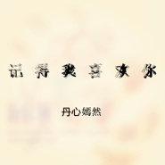 记得我喜欢你](./albums/1117939606.md) | 国语 | 独立发行 | 2014年05月24日 | EP, 单曲 | 国语流行 Mandarin Pop |
| [ 美梦](./albums/517876571.md) | 国语 | 独立发行 | 2013年11月08日 | 录音室专辑 | 华语唱作人 Chinese Singer-Songwriter, 轻音乐 Easy Listening |
| [ 老师我爱妳老师我爱你 2013教师节](./albums/1417949713.md) | 国语 | 独立发行 | 2013年09月10日 | 录音室专辑 | 国语流行 Mandarin Pop |
| [ 我的淑女范儿福州时代中学2014届4班政治课本剧](./albums/1517933928.md) | 国语 | 独立发行 | 2013年03月23日 | EP, 单曲 | 青少年流行 Teen Pop, 国语流行 Mandarin Pop, 广播剧 Radio Drama |
| [ 爱的承诺](./albums/617891023.md) | 国语 | 独立发行 | 2012年10月28日 | EP, 单曲 | 国语流行 Mandarin Pop, 中国风 China-Wave |
| [ 单纯月亮“丹晨月亮”队歌](./albums/1317887631.md) | 国语 | 独立发行 | 2012年07月18日 | EP, 单曲 | 青少年流行 Teen Pop, 国语流行 Mandarin Pop |
| [ 妳根本不爱我你根本不爱我](./albums/1517885609.md) | 国语 | 独立发行 | 2012年06月24日 | EP, 单曲 | 国语流行 Mandarin Pop |
| [ 烟火般的爱烟火](./albums/1617883479.md) | 国语 | 独立发行 | 2012年05月27日 | EP, 单曲 | 国语流行 Mandarin Pop |
| [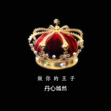 做你的王子](./albums/317878944.md) | 国语 | 独立发行 | 2012年05月06日 | EP, 单曲 | 国语流行 Mandarin Pop |
| [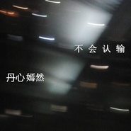 不会认输](./albums/517853368.md) | 国语 | 独立发行 | 2012年02月25日 | EP, 单曲 | 国语流行 Mandarin Pop |
| [ Love You爱你们](./albums/317356941.md) | 国语 | 独立发行 | 2012年02月07日 | EP, 单曲 | 国语流行 Mandarin Pop |
| [ Panda Baby 2012 Brithday Version熊猫宝贝 2012版](./albums/517361422.md) | 国语 | 独立发行 | 2012年01月09日 | EP, 单曲 | 国语流行 Mandarin Pop |
| [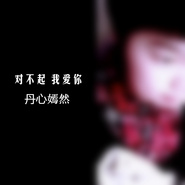 对不起我爱妳对不起我爱你](./albums/17352385.md) | 国语 | 独立发行 | 2011年11月28日 | EP, 单曲 |  |
| [ 爱之舞](./albums/1917340724.md) | 国语 | 独立发行 | 2011年09月17日 | EP, 单曲 | 世界融合 World Fusion, 国语流行 Mandarin Pop, 探戈 Tango |
| [ Panda Baby熊猫宝贝](./albums/717338976.md) | 国语 | 独立发行 | 2011年07月01日 | EP, 单曲 | 国语流行 Mandarin Pop, 华语唱作人 Chinese Singer-Songwriter |

## 评论

|  |  |  |
| :-- | :-- | :-- |
|  [虾米用户](https://emumo.xiami.com/u/76869222) 人生来便是为了探求无限。 2020-06-21 08:53 赞(3) 踩(0) | 
果然福州林家出才女！！
 |
|  [虾米用户](https://emumo.xiami.com/u/32461398) 曾在云上浮想联翩如今也终... 2020-05-10 00:00 赞(2) 踩(0) | 
还好是在这里
 |
|  [虾米用户](https://emumo.xiami.com/u/358104299) 悲观的唯心存在现实解构虚... 2020-03-16 08:47 赞(2) 踩(0) | 
40007
 |
|  [虾米用户](https://emumo.xiami.com/u/434152246) 聪明少一些大智慧多一些，... 2020-02-29 10:36 赞(2) 踩(0) | 

 |
|  [虾米用户](https://emumo.xiami.com/u/434152246) 聪明少一些大智慧多一些，... 2020-02-14 16:10 赞(3) 踩(0) | 
互相支持互相学习
 |
|  [虾米用户](https://emumo.xiami.com/u/439939105)  2020-01-29 23:59 赞(2) 踩(0) | 
我第一次听你的《本能》  就被它感动了，因为我听着听着都哭了，我很感动 ，也很伤感，更有一些感触。 这一定是发自内心的作品，一直循环听，我哭的稀里哗啦的，我分享了，我相信我的朋友也一定有感触。 我一定会支持你的，并且是永远的支持你，只为“好看的皮囊千篇一律，有趣的灵魂万里挑一”
 |
| ⇒ |  [虾米用户](https://emumo.xiami.com/u/43461014) 工作账号 2020-02-04 02:57 赞(0) 踩(0) | 
谢谢你！确实是发自内心的！
 |
|  [虾米用户](https://emumo.xiami.com/u/103123510) 今宵多珍重 2020-01-07 22:10 赞(2) 踩(0) | 
因为蜀道难认识的（那么多个版本的蜀道难我就听中了你的版本然后狂loop）结果没想到居然还是一个一样听昭和日音的小姐姐
 |
| ⇒ |  [虾米用户](https://emumo.xiami.com/u/43461014) 工作账号 2020-02-04 02:57 赞(0) 踩(0) | 
谢谢！我超爱昭和日音哈哈哈
 |
|  [虾米用户](https://emumo.xiami.com/u/325374787)  2019-12-28 10:07 赞(2) 踩(0) | 
，
 |
|  [虾米用户](https://emumo.xiami.com/u/431074698) 我还没想好要写什么... 2019-10-24 19:12 赞(3) 踩(0) | 
<a href="http://emumo.xiami.com/u/43461014" target="_blank" rel="nofollow" name_card="43461014">@丹心嫣然</a> 我在今年年初时听到您的单曲《泪雨》。很好听，当时听得特别感动。 

 <a href="https://emumo.xiami.com/u/43461014" title="丹心嫣然">丹心嫣然</a><a href="https://i.xiami.com" target="_blank" title="虾米音乐人" style="display:inline"><i class="icon musician"></i></a>(工作账号)2019-10-29 12:49  <a href="/commentlist/re/id/131590299/type/3" class="quotebox" rel="brief_131590299" title="">回复</a> <a onclick="detail_report(131590299,3)" href="javascript:;" class="reportbox" rel="brief_131590299" style="display:none">举报</a> 

 
可以的～  

 <a href="https://emumo.xiami.com/u/431074698" title="可爱的萤火虫管弦乐">可爱的萤火虫管弦乐</a>(我还没想好要写什么...)2019-10-29 20:39  <a href="/commentlist/re/id/131592714/type/3" class="quotebox" rel="brief_131592714" title="">回复</a> <a onclick="detail_report(131592714,3)" href="javascript:;" class="reportbox" rel="brief_131592714" style="display:none">举报</a> 

 
<q><b>丹心嫣然说：</b></q>

万分感谢！！！            

 <a href="https://emumo.xiami.com/u/431074698" title="可爱的萤火虫管弦乐">可爱的萤火虫管弦乐</a>(我还没想好要写什么...)2019-11-06 07:30  <a href="/commentlist/re/id/131779165/type/3" class="quotebox" rel="brief_131779165" title="">回复</a> <a onclick="detail_report(131779165,3)" href="javascript:;" class="reportbox" rel="brief_131779165" style="display:none">举报</a> 

 
<q><b>丹心嫣然说：</b></q>

制作完毕：<a href="https://www.bilibili.com/video/av74688414/?p=1" target="_blank" rel="nofollow noreferrer noopener">https://www.bilibili.com/video/av74688414/?p=1</a>

 |
|  [虾米用户](https://emumo.xiami.com/u/332502528)  2019-09-19 01:15 赞(3) 踩(0) | 
同一届的大学生，你为何如此优秀 
 |
| ⇒ |  [虾米用户](https://emumo.xiami.com/u/43461014) 工作账号 2019-10-10 19:38 赞(0) 踩(0) | 
没有啦真的 专业很一般的那种
 |
|  [虾米用户](https://emumo.xiami.com/u/283940226)  2019-04-16 08:40 赞(2) 踩(0) | 
虽然我是40岁的老大叔了，但是我要说妹子你才情了得、年轻有为 
 |
| ⇒ |  [虾米用户](https://emumo.xiami.com/u/43461014) 工作账号 2019-04-19 11:19 赞(0) 踩(0) | 
感谢支持！发现您也听昭和流行，同好
 |
|  [虾米用户](https://emumo.xiami.com/u/43025787) 若有知音见采   不辞遍... 2019-04-09 22:44 赞(2) 踩(0) | 
和那个人的夜的钢琴曲感觉特别像
 |
| ⇒ |  [虾米用户](https://emumo.xiami.com/u/43461014) 工作账号 2019-04-11 15:47 赞(0) 踩(0) | 
我那时候的水平就是那样子吧 个人特色不够鲜明 我的夜钢就停在2017年了 不会再继续了
 |
|  [虾米用户](https://emumo.xiami.com/u/14470167) 与人为善，和平共处。 2019-03-25 23:09 赞(2) 踩(0) | 
音乐如名，丹心嫣然，清心独到，嫣然在音乐的世界里
 |
|  [虾米用户](https://emumo.xiami.com/u/9003931) 千淘万漉虽辛苦 2019-02-10 12:34 赞(4) 踩(0) | 
春裳不共花争艳，翠袖今从别样裁。
 |
|  [虾米用户](https://emumo.xiami.com/u/9003931) 千淘万漉虽辛苦 2019-02-09 21:46 赞(4) 踩(0) | 
加油～看好你哦
 |
|  [虾米用户](https://emumo.xiami.com/u/96120950)  2019-02-01 19:32 赞(0) 踩(0) | 
内容已删除
 |
| ⇒ |  [虾米用户](https://emumo.xiami.com/u/43461014) 工作账号 2019-02-01 20:06 赞(0) 踩(0) | 
虾米音乐是我本人亲自上传授权的正版，Q音只有歌曲是我本人上传，其他纯音乐全部是从我的虾米盗用的，我也很无奈。
 |
|  [虾米用户](https://emumo.xiami.com/u/344431525)  2019-01-13 15:48 赞(4) 踩(0) | 
加油！ 
 |
|  [虾米用户](https://emumo.xiami.com/u/351907510)  2019-01-03 23:16 赞(4) 踩(0) | 
喜欢雨霖铃，古典之美，一直单曲循环，像是我内心的忧伤，
 |
|  [虾米用户](https://emumo.xiami.com/u/3578616)   2018-12-12 18:03 赞(1) 踩(0) | 
请问有夜的钢琴曲64心碎的谱子吗？好喜欢好喜欢好喜欢
 |
|  [虾米用户](https://emumo.xiami.com/u/8326332) 后来，即便是音乐，也无法... 2018-11-15 12:56 赞(3) 踩(0) | 
叫嫣然的，都这么有才情有气质么
 |
|  [虾米用户](https://emumo.xiami.com/u/337195718)  2018-08-22 20:35 赞(10) 踩(0) | 
轻柔的黑白键旋律，扶指间有理想更有付出
 |
|  [虾米用户](https://emumo.xiami.com/u/247913654)  2018-07-15 17:02 赞(2) 踩(0) | 
支持支持～
 |
|  [虾米用户](https://emumo.xiami.com/u/85173076) 我们含着泪 一读再读 青... 2018-07-04 21:27 赞(10) 踩(0) | 
加油呀 很喜欢你的曲子！ 两年前你的回复今天才看到..好开心也好遗憾喔.. 希望继续写出好曲子呀～即兴也好嘛都很棒（*/&amp;nabla;＼*） 支持～会一直听的～
 |
| ⇒ |  [虾米用户](https://emumo.xiami.com/u/43461014) 工作账号 2018-07-04 21:27 赞(0) 踩(0) | 
感谢支持！
 |
| ⇒ |  [虾米用户](https://emumo.xiami.com/u/10992632)  2018-12-07 20:35 赞(0) 踩(0) | 
<q><b>丹心嫣然说：</b></q>
 |
|  [虾米用户](https://emumo.xiami.com/u/326016687)  2018-06-06 01:07 赞(2) 踩(0) | 
给个建议哈，描写夜的钢琴曲应该比较忧伤和寂寞，调式多用小调式好点吧，个人见解，可以参考石进的曲子，小调式居多
 |
| ⇒ |  [虾米用户](https://emumo.xiami.com/u/43461014) 工作账号 2018-06-07 20:01 赞(0) 踩(0) | 
叫夜的钢琴曲，并不是描写夜，只不过灵感多数在晚上来。并且我个人认为，就算是写夜，夜也可以是甜蜜的，为什么都要是悲伤的？而且小调真的不少。顺便，夜钢系列是历史了，我的夜钢75后已经停更了，不会再出新。感谢支持。
 |
| ⇒ |  [虾米用户](https://emumo.xiami.com/u/326016687)  2018-06-08 00:29 赞(0) 踩(0) | 
<q><b>丹心嫣然说：</b></q>
 |
| ⇒ |  [虾米用户](https://emumo.xiami.com/u/43461014) 工作账号 2018-06-08 00:36 赞(0) 踩(0) | 
<q><b>晨星说：</b></q>
 |
| ⇒ |  [虾米用户](https://emumo.xiami.com/u/326016687)  2018-06-08 00:37 赞(0) 踩(0) | 
<q><b>丹心嫣然说：</b></q>
 |
| ⇒ |  [虾米用户](https://emumo.xiami.com/u/43461014) 工作账号 2018-06-20 15:10 赞(0) 踩(0) | 
<q><b>晨星说：</b></q>
 |
|  [虾米用户](https://emumo.xiami.com/u/326016687)  2018-06-04 01:40 赞(3) 踩(0) | 
是不是所有的钢琴曲都是即兴啊，好想要谱子啊
 |
| ⇒ |  [虾米用户](https://emumo.xiami.com/u/43461014) 工作账号 2018-06-07 20:01 赞(0) 踩(0) | 
是即兴，谱子一个都没有。
 |
| ⇒ |  [虾米用户](https://emumo.xiami.com/u/326016687)  2018-06-08 00:40 赞(0) 踩(0) | 
<q><b>丹心嫣然说：</b></q>
 |
| ⇒ |  [虾米用户](https://emumo.xiami.com/u/43461014) 工作账号 2018-06-08 00:45 赞(0) 踩(0) | 
<q><b>晨星说：</b></q>
 |
| ⇒ |  [虾米用户](https://emumo.xiami.com/u/326016687)  2018-06-08 00:50 赞(0) 踩(0) | 
<q><b>丹心嫣然说：</b></q>
 |
| ⇒ |  [虾米用户](https://emumo.xiami.com/u/43461014) 工作账号 2018-06-08 08:10 赞(0) 踩(0) | 
<q><b>晨星说：</b></q>
 |
| ⇒ |  [虾米用户](https://emumo.xiami.com/u/326016687)  2018-06-09 22:20 赞(0) 踩(0) | 
<q><b>丹心嫣然说：</b></q>
 |
| ⇒ |  [虾米用户](https://emumo.xiami.com/u/43461014) 工作账号 2018-06-09 22:21 赞(0) 踩(0) | 
<q><b>晨星说：</b></q>
 |
| ⇒ |  [虾米用户](https://emumo.xiami.com/u/347737054) 音乐-生命的海洋ID为本... 2019-04-13 22:49 赞(0) 踩(0) | 
<q><b>丹心嫣然说：</b></q>
 |
| ⇒ |  [虾米用户](https://emumo.xiami.com/u/43461014) 工作账号 2019-04-13 23:36 赞(0) 踩(0) | 
<q><b>Amy说：</b></q>
 |
| ⇒ |  [虾米用户](https://emumo.xiami.com/u/347737054) 音乐-生命的海洋ID为本... 2019-04-14 12:01 赞(0) 踩(0) | 
<q><b>丹心嫣然说：</b></q>
 |
| ⇒ |  [虾米用户](https://emumo.xiami.com/u/347737054) 音乐-生命的海洋ID为本... 2019-04-27 18:54 赞(0) 踩(0) | 
<q><b>丹心嫣然说：</b></q>
 |
|  [虾米用户](https://emumo.xiami.com/u/356847405)  2018-04-14 21:24 赞(1) 踩(0) | 
我听到了一个女孩子的心声，女孩女对于人生中遇到的那个他的质朴感情。真让我回忆起一些往事，感觉自己当时是那么幼稚，天真，可爱！      
 |
|  [虾米用户](https://emumo.xiami.com/u/357506951)  2018-04-09 20:05 赞(1) 踩(0) | 
你好特别哦！想像你一样认真 
 |
|  [虾米用户](https://emumo.xiami.com/u/326016687)  2018-03-19 00:49 赞(1) 踩(0) | 
额，可惜了，真的好听，好想学 
 |
|  [虾米用户](https://emumo.xiami.com/u/326016687)  2018-03-19 00:47 赞(1) 踩(0) | 
求个夜的钢琴曲25 二十五年前的谱子 
 |
| ⇒ |  [虾米用户](https://emumo.xiami.com/u/43461014) 工作账号 2018-03-19 00:48 赞(0) 踩(0) | 
不好意思 当年即兴 没有记谱
 |
|  [虾米用户](https://emumo.xiami.com/u/246586856) 是缘分让我们在宇宙中相遇... 2018-03-06 19:32 赞(2) 踩(0) | 
你唱的每首歌似乎嗓子都很紧，放不开真音，听着音调虽然好听但是有种别扭。
 |
| ⇒ |  [虾米用户](https://emumo.xiami.com/u/43461014) 工作账号 2018-03-06 19:36 赞(0) 踩(0) | 
也算我的特色吧有些是音域原因也是没办法的 我自己不觉得别扭
 |
| ⇒ |  [虾米用户](https://emumo.xiami.com/u/246586856) 是缘分让我们在宇宙中相遇... 2018-03-06 19:38 赞(0) 踩(0) | 
<q><b>丹心嫣然说：</b></q>
 |
| ⇒ |  [虾米用户](https://emumo.xiami.com/u/43461014) 工作账号 2018-03-06 19:39 赞(0) 踩(0) | 
<q><b>努力变优秀说：</b></q>
 |
|  [虾米用户](https://emumo.xiami.com/u/11401128)   2018-01-30 23:48 赞(2) 踩(0) | 
你写的曲子恰好是我很喜欢的一类。非常感谢你的创作。
 |
| ⇒ |  [虾米用户](https://emumo.xiami.com/u/43461014) 工作账号 2018-01-31 00:12 赞(0) 踩(0) | 
感谢你的支持！
 |
|  [虾米用户](https://emumo.xiami.com/u/246586856) 是缘分让我们在宇宙中相遇... 2018-01-11 22:09 赞(3) 踩(0) | 
我为什么感觉你写的那些歌比市面上好多流行歌还好听呢（虽然嗓音欠缺了）但是曲子写的很好，旋律很美妙，词也很打人。
 |
| ⇒ |  [虾米用户](https://emumo.xiami.com/u/43461014) 工作账号 2018-01-20 22:09 赞(0) 踩(0) | 
谢谢支持。因为都是发自内心写的吧。唱功硬伤。
 |
|  [虾米用户](https://emumo.xiami.com/u/13078120) 我还没想好要写什么... 2017-12-29 15:53 赞(1) 踩(0) | 
同一級的福州學生 加油喔
 |
|  [虾米用户](https://emumo.xiami.com/u/286478887) 开心就好 2017-12-28 11:29 赞(1) 踩(0) | 
爱好变成了专业，真幸运！
 |
|  [虾米用户](https://emumo.xiami.com/u/261867830) 刀递给你 护我杀我你随意 2017-12-26 21:14 赞(4) 踩(0) | 
你的曲子很让心放松下来，那些曲调勾起了我心里那个回忆，记忆像海浪一样翻滚！ 真的很喜欢你的曲子！   我会一直支持的！加油！
 |
| ⇒ |  [虾米用户](https://emumo.xiami.com/u/43461014) 工作账号 2017-12-28 20:41 赞(0) 踩(0) | 
谢谢你的支持！
 |
|  [虾米用户](https://emumo.xiami.com/u/123323182)  2017-08-30 20:47 赞(1) 踩(0) | 
超棒！
 |
|  [虾米用户](https://emumo.xiami.com/u/304723285) 念念不忘   必有回响 2017-07-19 23:12 赞(1) 踩(0) | 
钢琴曲也很好听，熬夜的标配啊
 |
|  [虾米用户](https://emumo.xiami.com/u/304723285) 念念不忘   必有回响 2017-07-19 23:11 赞(1) 踩(0) | 
第一首听到你的作品是蜀道难，那时候高考过去了两星期，丟书两星期。听歌的时候突然听到自己背的滚瓜烂熟蜀道难，那种震撼。。。真强烈，然后情不自禁回想着高中三年的点点滴滴，发呆了七八首单曲循环的时间。。。回神来就关注你了
 |
| ⇒ |  [虾米用户](https://emumo.xiami.com/u/43461014) 工作账号 2017-07-20 01:53 赞(0) 踩(0) | 
哈哈哈哈 我也刚高考完
 |
|  [虾米用户](https://emumo.xiami.com/u/61831122) Hello,world 2017-06-28 18:32 赞(1) 踩(0) | 
哈哈好有意思 
 |
|  [虾米用户](https://emumo.xiami.com/u/295912619)   2017-06-12 11:04 赞(2) 踩(0) | 
加油，曲子太棒了，不用理会别人怎么说，做自己就好，真的很好听，饱含情感，支持你，加油！
 |
| ⇒ |  [虾米用户](https://emumo.xiami.com/u/43461014) 工作账号 2017-06-13 13:18 赞(0) 踩(0) | 
谢谢！
 |
|  [虾米用户](https://emumo.xiami.com/u/286478887) 开心就好 2017-05-29 01:46 赞(1) 踩(0) | 
请问你是用的啥录的音啊？
 |
| ⇒ |  [虾米用户](https://emumo.xiami.com/u/43461014) 工作账号 2017-05-29 06:49 赞(0) 踩(0) | 
你说哪一首
 |
| ⇒ |  [虾米用户](https://emumo.xiami.com/u/286478887) 开心就好 2017-11-22 21:27 赞(0) 踩(0) | 
<q><b>丹心嫣然说：</b></q>
 |
|  [虾米用户](https://emumo.xiami.com/u/291678850) 能诞生于世太好了。 2017-05-12 22:12 赞(1) 踩(0) | 
哒哒哒哒哒
 |
|  [虾米用户](https://emumo.xiami.com/u/39034156) 暂无签名~ 2017-03-25 00:54 赞(1) 踩(0) | 
好年轻 加油~喜欢你的作品
 |
| ⇒ |  [虾米用户](https://emumo.xiami.com/u/43461014) 工作账号 2017-03-26 11:17 赞(0) 踩(0) | 
谢谢！
 |
|  [虾米用户](https://emumo.xiami.com/u/113941394)  2017-03-05 20:48 赞(1) 踩(0) | 
觉得总有一天作者会像石进一样火起来的！如果有演唱会我一定要去！
 |
| ⇒ |  [虾米用户](https://emumo.xiami.com/u/43461014) 工作账号 2017-03-07 20:41 赞(0) 踩(0) | 
哈哈哈其实无所谓 我就是为了自己喜欢的人才做了音乐 传达给人家就好 能被其他人喜欢我觉得已经很开心啦 谢谢
 |
|  [虾米用户](https://emumo.xiami.com/u/19033453)  2017-03-02 21:52 赞(2) 踩(0) | 
超喜欢这些曲子，作者我能要一下填词授权嘛，太喜欢了！
 |
| ⇒ |  [虾米用户](https://emumo.xiami.com/u/43461014) 工作账号 2017-03-04 18:03 赞(0) 踩(0) | 
私信回复你了
 |
|  [虾米用户](https://emumo.xiami.com/u/275066941)  2017-02-21 13:16 赞(1) 踩(0) | 
买不了怎么办
 |
| ⇒ |  [虾米用户](https://emumo.xiami.com/u/43461014) 工作账号 2017-02-21 21:37 赞(0) 踩(0) | 
什么买不了
 |
|  [虾米用户](https://emumo.xiami.com/u/269523103)  2017-01-31 13:28 赞(1) 踩(0) | 
是购买vip就可以了么？
 |
| ⇒ |  [虾米用户](https://emumo.xiami.com/u/43461014) 工作账号 2017-01-31 15:09 赞(0) 踩(0) | 
不是 直接付费下载 买了vip一样要付费
 |
| ⇒ |  [虾米用户](https://emumo.xiami.com/u/269523103)  2017-01-31 16:02 赞(0) 踩(0) | 
<q><b>丹心嫣然说：</b></q>
 |
|  [虾米用户](https://emumo.xiami.com/u/231001215)  2017-01-10 00:03 赞(2) 踩(0) | 
听嫣然的曲子也是无意间在酷狗里的事，这不挪窝了依旧喜欢。加油 
 |
| ⇒ |  [虾米用户](https://emumo.xiami.com/u/43461014) 工作账号 2017-01-10 11:57 赞(0) 踩(0) | 
谢谢！
 |
|  [虾米用户](https://emumo.xiami.com/u/257846903)   2017-01-02 23:15 赞(1) 踩(0) | 
看到空间上的转发过来的，第一首听的是蜀道难，通篇具有雄浑之气，又听雨霖铃，这时却突然放松下来，不禁为此而沉沦。音乐真的很好。希望学姐能越走越好。加油：）
 |
| ⇒ |  [虾米用户](https://emumo.xiami.com/u/43461014) 工作账号 2017-01-03 00:07 赞(0) 踩(0) | 
谢谢！
 |
|  [虾米用户](https://emumo.xiami.com/u/253203136)  2016-12-12 10:31 赞(1) 踩(0) | 
听着有一种只达心灵的感觉，很放松，不会带起任何疲倦的思考！若有若无，似水的平静。
 |
| ⇒ |  [虾米用户](https://emumo.xiami.com/u/43461014) 工作账号 2016-12-12 11:59 赞(0) 踩(0) | 
谢谢！
 |
|  [虾米用户](https://emumo.xiami.com/u/249810815)  2016-12-04 09:44 赞(2) 踩(0) | 
浮世清欢，以静安然。 烦躁世界，唯有音乐能使人安静 一直很喜欢听钢琴曲。 很多时候，它能让一颗狂躁的心得到片刻的宁静。
 |
| ⇒ |  [虾米用户](https://emumo.xiami.com/u/43461014) 工作账号 2016-12-05 16:03 赞(0) 踩(0) | 
谢谢忆霖
 |
|  [虾米用户](https://emumo.xiami.com/u/248666167)  2016-11-26 19:01 赞(1) 踩(0) | 
呵呵
 |
|  [虾米用户](https://emumo.xiami.com/u/248666167)  2016-11-23 19:51 赞(1) 踩(0) | 
像水似茶，般
 |
| ⇒ |  [虾米用户](https://emumo.xiami.com/u/43461014) 工作账号 2016-11-24 08:58 赞(0) 踩(0) | 
谢谢
 |
|  [虾米用户](https://emumo.xiami.com/u/526851) 听听音乐，好好生活。 2016-11-20 23:59 赞(1) 踩(0) | 
可爱的小姑娘，创作演绎都棒棒哒~ 我小时候（其实我才大你几岁哈哈）也喜欢瞎写有些也录下来编了下不成系统，你加油！
 |
| ⇒ |  [虾米用户](https://emumo.xiami.com/u/43461014) 工作账号 2016-11-22 13:39 赞(0) 踩(0) | 
谢谢支持～
 |
|  [虾米用户](https://emumo.xiami.com/u/389541)  2016-06-13 11:09 赞(1) 踩(0) | 
最近爱上的钢琴曲专辑，作曲者原来是个福州女生。惊讶之余，为福州出了这么个才女感到骄傲。她的曲子特别安静，工作时候、休息时候听着让人很放松，缓缓地，不会抓着你的某根神经不放，就仿佛轻纱拂过脑海，灵动又和缓。
 |
| ⇒ |  [虾米用户](https://emumo.xiami.com/u/43461014) 工作账号 2016-06-15 23:29 赞(0) 踩(0) | 
感动，谢谢支持 
 |
|  [虾米用户](https://emumo.xiami.com/u/12221090) 逍遥于天地而心意自得 2016-06-04 13:25 赞(1) 踩(0) | 
蛮好，支持
 |
| ⇒ |  [虾米用户](https://emumo.xiami.com/u/43461014) 工作账号 2016-06-05 09:48 赞(0) 踩(0) | 
谢谢支持 
 |
|  [虾米用户](https://emumo.xiami.com/u/31761506) 宁缺毋滥 2016-05-13 20:54 赞(1) 踩(0) | 
我曾经在虾米听过一个艺人的所以歌曲，虽然几乎是同人曲目但是他所以曲子都是由心而出。每一曲都能感受到背后的感情。曲子是别人的但是感情却是自己的，在我看来感情才是一首曲子的主题。
 |
| ⇒ |  [虾米用户](https://emumo.xiami.com/u/43461014) 工作账号 2016-05-13 21:35 赞(0) 踩(0) | 
赞同，是这样。对我来说，真正发自我内心的曲子就是我自己都会情不自禁认真听的。太多曲子里面都有太多故事。
 |
|  [虾米用户](https://emumo.xiami.com/u/127095706)  2016-05-12 10:23 赞(3) 踩(0) | 
希望不要有名利的浮躁之心，创作更多清新的心灵钢琴曲。
 |
| ⇒ |  [虾米用户](https://emumo.xiami.com/u/7029024) 唯爱朱丹戚薇今日子明菜 2016-05-12 13:00 赞(0) 踩(0) | 
谢谢！不过即兴钢琴曲并不是我的全部，多发自心灵浅层，灵感风格也都是不太固定的，随心情而已。如果你喜欢内心深处的音乐，并且不限于钢琴曲的话，推荐我的《随缘》组曲，每一首曲子都里都有故事，是我自己也喜欢反复听的专辑。
 |
| ⇒ |  [虾米用户](https://emumo.xiami.com/u/127095706)  2016-05-12 23:13 赞(0) 踩(0) | 
<q><b>丹心嫣然说：</b></q>
 |
|  [虾米用户](https://emumo.xiami.com/u/44143979) 对内心呈现的样子保持尊重... 2016-04-25 09:25 赞(1) 踩(0) | 
好有意思的小姑娘
 |
| ⇒ |  [虾米用户](https://emumo.xiami.com/u/7029024) 唯爱朱丹戚薇今日子明菜 2016-04-26 12:40 赞(0) 踩(0) | 

 |
|  [虾米用户](https://emumo.xiami.com/u/102176730)  2016-04-12 22:58 赞(2) 踩(0) | 
真的很不错。前途无量啊
 |
| ⇒ |  [虾米用户](https://emumo.xiami.com/u/43461014) 工作账号 2016-04-14 21:24 赞(0) 踩(0) | 
谢谢！
 |
|  [虾米用户](https://emumo.xiami.com/u/139210560)  2016-04-11 07:44 赞(2) 踩(0) | 
音乐很棒 加油 第一次听得时候真的好有感觉
 |
| ⇒ |  [虾米用户](https://emumo.xiami.com/u/43461014) 工作账号 2016-04-14 21:22 赞(0) 踩(0) | 
谢谢 
 |
|  [虾米用户](https://emumo.xiami.com/u/58953162)  2016-04-09 09:43 赞(1) 踩(0) | 
很不错哦，加油
 |
| ⇒ |  [虾米用户](https://emumo.xiami.com/u/43461014) 工作账号 2016-04-09 14:23 赞(0) 踩(0) | 
谢谢 
 |
|  [虾米用户](https://emumo.xiami.com/u/41473291) 朴 2016-04-06 10:26 赞(1) 踩(0) | 
 点个赞
 |
| ⇒ |  [虾米用户](https://emumo.xiami.com/u/43461014) 工作账号 2016-04-06 13:05 赞(0) 踩(0) | 
谢谢支持 
 |
|  [虾米用户](https://emumo.xiami.com/u/45140793)  2016-03-26 06:00 赞(1) 踩(0) | 
不错,虽然有些撞名了
 |
| ⇒ |  [虾米用户](https://emumo.xiami.com/u/43461014) 工作账号 2016-03-27 19:11 赞(0) 踩(0) | 
谢谢支持【名字没申请专利谁都可以用 我的夜钢有我的故事
 |
|  [虾米用户](https://emumo.xiami.com/u/122218250)  2016-03-11 16:05 赞(1) 踩(0) | 
曲子很好听
 |
|  [虾米用户](https://emumo.xiami.com/u/122218250)  2016-03-11 16:04 赞(1) 踩(0) | 
感觉很好听！加油！
 |
| ⇒ |  [虾米用户](https://emumo.xiami.com/u/43461014) 工作账号 2016-03-11 23:20 赞(0) 踩(0) | 
谢谢！
 |
|  [虾米用户](https://emumo.xiami.com/u/117576670)  2016-03-09 10:49 赞(1) 踩(0) | 
~~
 |
|  [虾米用户](https://emumo.xiami.com/u/5389010) 你二十多岁 活在体制内 2016-02-23 21:52 赞(1) 踩(0) | 
加油
 |
| ⇒ |  [虾米用户](https://emumo.xiami.com/u/43461014) 工作账号 2016-02-27 21:09 赞(0) 踩(0) | 
谢谢
 |
|  [虾米用户](https://emumo.xiami.com/u/52609852)  2016-02-19 00:23 赞(1) 踩(0) | 
本人高一新生一枚，也是艺术生
 |
|  [虾米用户](https://emumo.xiami.com/u/56694490)  2016-01-20 23:15 赞(1) 踩(0) | 
好听
 |
| ⇒ |  [虾米用户](https://emumo.xiami.com/u/7029024) 唯爱朱丹戚薇今日子明菜 2016-01-22 13:08 赞(0) 踩(0) | 
谢谢！
 |
|  [虾米用户](https://emumo.xiami.com/u/38700163)  2015-12-28 13:01 赞(1) 踩(0) | 
小嫣然，看了你得自评。 风格挺好。  我是石进的粉， 也是你的粉，  不是说拿你们做比较，这种夜晚静时能让人想起某些事的风格，我恰好都喜欢。  祝，更多的曲目更新。 不一定都听，如果某来的某一天，路过的某一条小巷，有某些旋律映入脑海，我还能猜出作者的话，那大概也就是你和石进了。
 |
| ⇒ |  [虾米用户](https://emumo.xiami.com/u/43461014) 工作账号 2015-12-28 21:42 赞(0) 踩(0) | 
谢谢。
 |
|  [虾米用户](https://emumo.xiami.com/u/89702862)  2015-12-19 03:57 赞(1) 踩(0) | 
挺好听的我喜欢
 |
| ⇒ |  [虾米用户](https://emumo.xiami.com/u/43461014) 工作账号 2015-12-19 10:05 赞(0) 踩(0) | 
谢谢支持！
 |
|  [虾米用户](https://emumo.xiami.com/u/10384607) 空山無人，水流花開。 2015-12-08 22:43 赞(1) 踩(0) | 
为什么都有电流声？
 |
| ⇒ |  [虾米用户](https://emumo.xiami.com/u/43461014) 工作账号 2015-12-11 20:21 赞(0) 踩(0) | 
歌曲还是纯音乐？歌曲是自己在家里录的，条件差，麦渣。纯音乐的话，要不是直接U盘插琴上录，要不就是直接MIDI录的，然后调调EQ，应该不会有问题。
 |
|  [虾米用户](https://emumo.xiami.com/u/74307982) 画画 2015-11-07 02:33 赞(1) 踩(0) | 
我编过吉他 
 |
| ⇒ |  [虾米用户](https://emumo.xiami.com/u/43461014) 工作账号 2015-11-11 14:07 赞(0) 踩(0) | 
吉他我苦手啊 学不来
 |
|  [虾米用户](https://emumo.xiami.com/u/74307982) 画画 2015-11-07 02:02 赞(1) 踩(0) | 
发现天才 
 |
| ⇒ |  [虾米用户](https://emumo.xiami.com/u/43461014) 工作账号 2015-11-11 14:07 赞(0) 踩(0) | 
谢谢鼓励
 |
|  [虾米用户](https://emumo.xiami.com/u/6770643) 谨言慎行，戒急用忍 2015-09-13 23:25 赞(1) 踩(0) | 
呵，年龄最小的90后。。。钢琴弹得不错，赞
 |
| ⇒ |  [虾米用户](https://emumo.xiami.com/u/7029024) 唯爱朱丹戚薇今日子明菜 2015-09-18 13:24 赞(0) 踩(0) | 
其实基础很差练琴懒，不过真的谢谢批评和鼓励！
 |
|  [虾米用户](https://emumo.xiami.com/u/58069722) 孤独有时候就是，无法分享... 2015-08-26 19:29 赞(1) 踩(0) | 
支持你
 |
| ⇒ |  [虾米用户](https://emumo.xiami.com/u/7029024) 唯爱朱丹戚薇今日子明菜 2015-08-27 15:40 赞(0) 踩(0) | 
谢谢支持！
 |
| ⇒ |  [虾米用户](https://emumo.xiami.com/u/58069722) 孤独有时候就是，无法分享... 2015-08-29 09:36 赞(0) 踩(0) | 
<q><b>丹心嫣然说：</b></q>
 |
|  [虾米用户](https://emumo.xiami.com/u/2706377) 有些旋律，永在心中。无论... 2015-04-01 18:06 赞(1) 踩(0) | 
之前没发现你的主页啊，什么时候来首 KyonKyon的搞怪歌啊？？(&amp;gt;﹏&amp;lt;)
 |
| ⇒ |  [虾米用户](https://emumo.xiami.com/u/7029024) 唯爱朱丹戚薇今日子明菜 2015-04-01 22:24 赞(0) 踩(0) | 
啊哈这里是我发原创的地方啦。听翻唱去5sing找我。不过kyon2的暂时还翻得不多。而且我搞怪不来哈。
 |
|  [虾米用户](https://emumo.xiami.com/u/12259586) 落霞与孤鹜齐飞 2015-02-24 01:31 赞(1) 踩(0) | 
路过~继续努力~
 |
| ⇒ |  [虾米用户](https://emumo.xiami.com/u/7029024) 唯爱朱丹戚薇今日子明菜 2015-02-26 18:19 赞(0) 踩(0) | 
谢谢！
 |
| ⇒ |  [虾米用户](https://emumo.xiami.com/u/12259586) 落霞与孤鹜齐飞 2015-02-27 03:10 赞(0) 踩(0) | 
<q><b>丹心嫣然说：</b></q>
 |
|  [虾米用户](https://emumo.xiami.com/u/44337041)  2014-12-29 20:54 赞(1) 踩(0) | 
下次传一支MV吧
 |
| ⇒ |  [虾米用户](https://emumo.xiami.com/u/43461014) 工作账号 2015-01-07 21:54 赞(0) 踩(0) | 
没办法弄啊
 |
|  [虾米用户](https://emumo.xiami.com/u/7029024) 唯爱朱丹戚薇今日子明菜 2014-11-30 17:56 赞(2) 踩(0) | 
终于入驻了虾米音乐人！嗯其实歌曲都是很早以前的，很多小六初一初二的黑历史都搬出来了，最早的制作水品肯定是很烂的，2013年之前的所有作品当时混音压的都是128k的，而且因为换了电脑很多音频工程都丢了，所以能找得到工程的就重新压，没找到的都有在编曲上多加音轨压成320的才传上来，《老师我爱妳》以前的专辑单曲封面也都是为了发布新做的，水平有限见谅！另外这个账号是我的个人账号！大家有什么想交流的可以来找我！一起学习共同进步！
 |
| ⇒ |  [虾米用户](https://emumo.xiami.com/u/294083722)  2017-05-05 19:32 赞(0) 踩(0) | 
嗨在吗
 |
