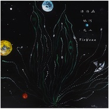
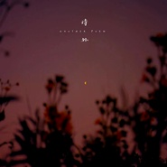
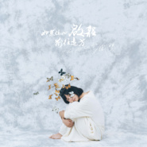
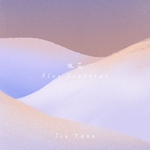
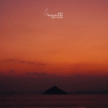
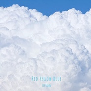

Tie Yann
============================

|  |  |
| :--: | :-- |
| [ Tie Yann](https://i.xiami.com/tieyang) | **播放数**: 39538746 **粉丝数**: 22108 **评论数**: 675 **地区**: China 中国大陆 **风格**: 根源唱作人 Singer-Songwriter, 轻音乐 Easy Listening, 电影原声 Film Score, 世界融合 World Fusion, 世界音乐 World Music  |

## 档案

新专辑《如果你也启程前往远方》海外已发行。大陆2020年1月10日腾讯发行首部曲。 
------【歌者 | 作曲人 | 世界音乐旅者】------ 
祖先来自孛儿只斤氏铁木真后人，生长于中国南方的雪山，探索自然与艺术，接触即兴舞蹈舞者，音乐创作活跃于舞蹈剧场、电影、动画等各个艺术领域， 配乐动画作品入围里斯本MONSTRA等多个欧洲国际动画节。热衷于通过音乐和声音探索多样的人类文化、人与自然与其他物种的互动，致力于传递地球上的所有生命都在共鸣连接的信念。 
2015发行首张全创音乐作品集《发光的海》，2016探索亚马逊雨林创作声音纪录片《A Letter of Sound》，2018风潮音乐全球范围发行音乐作品《十字海星》，电影作曲作品《萌宠入殓师》2018全中国影院上映。 
----------------------------- 
【《地球的声带》 创始人 】 
在世界各地用影音图文持续记录地球各地自然声响和人类族群音乐的多样化，发表文章《在我们的文明之外，在地球的文明之内》。参与南美、马来、印尼、台湾等地的音乐合创和艺术项目。曾前往玻利维亚高原、亚马逊雨林采风、短驻土著部落、在安第斯山脉南端、巴塔哥尼亚高原徒步、在印尼古老的托拉查人村落、中国西南山区探索… 
---------------------------------- 
【中国公益营地教育“种太阳”首席设计导师】 
每年为中国四个偏远贫困地区的孩子设计概念音乐工作坊及课程。 
------------------------- 
【北京接触即兴发展联盟成员】 
致力于帮助接触即兴在中国范围的发展与世界范围的交流。 
---------------------------------------- 
【Zero Waste零浪费生活实践者，环境关爱倡导者】

## 专辑

| 名称 | 语种 | 唱片公司 | 发行时间 | 专辑类别 | 专辑风格 |
| :--: | :-- | :-- | :-- | :-- | :-- |
| [ 漂浮在银河之上Floating Among The Stars](./albums/2108209408.md) | 国语 | 独立发行 | 2020年03月18日 | EP, 单曲 | 新世纪音乐 New Age, 爵士 Jazz |
| [ 诗·外Another Poem](./albums/2320309204.md) | 国语 | 独立发行 | 2020年02月26日 | 有声书 | 轻音乐 Easy Listening, 诵读音乐 Spoken Word |
| [ 如果你也启程前往远方-前往](./albums/2106059304.md) | 国语 | 风潮音乐 | 2020年02月14日 | EP, 单曲 |  |
| [ 如果你也启程前往远方-启程](./albums/2106059303.md) | 国语 | 风潮音乐 | 2020年01月10日 | EP, 单曲 |  |
| [ 槐花Flos Sophorae](./albums/2104087558.md) | 国语 | 独立发行 | 2018年10月09日 | EP, 单曲 | 国语流行 Mandarin Pop |
| [ Pet Departure萌宠入殓师 电影原声](./albums/2103963125.md) | 纯音乐 | 独立发行 | 2018年09月01日 | 原声带, 影视音乐 | 原声 Soundtrack, 电影原声 Film Score |
| [ Merry Marry](./albums/2102979699.md) | 英语 | 独立发行 | 2017年12月23日 | EP, 单曲 | 根源唱作人 Singer-Songwriter |
| [ 唱给孩子Red Yellow Blue](./albums/2102960363.md) | 国语 | 独立发行 | 2017年11月24日 | EP, 单曲 | 根源唱作人 Singer-Songwriter |
| [ Imagine](./albums/2100238802.md) | 英语 | 独立发行 | 2015年11月17日 | EP, 单曲 | 根源唱作人 Singer-Songwriter |
| [ 甲板上的星光Captain with Old Player](./albums/1037478885.md) | 国语 | 独立发行 | 2015年06月14日 | EP, 单曲 | 轻音乐 Easy Listening |
| [ 发光的海The Luminous Sea](./albums/1823733143.md) | 国语 | 虾米音乐人 | 2015年03月17日 | 录音室专辑 | 国语流行 Mandarin Pop, 华语唱作人 Chinese Singer-Songwriter |
| [ ListenYann's note](./albums/1020383954.md) | 其他 | 独立发行 | 2015年01月04日 | EP, 单曲 | 轻音乐 Easy Listening, 自由即兴 Free Improvisation |
| [ Moon RiverCover](./albums/715703167.md) | 英语 | 独立发行 | 2014年11月11日 | EP, 单曲 | 流行 Pop |

## 评论

|  |  |  |  |
| :-- | :-- | :-- | :-- |
|  [虾米用户](https://emumo.xiami.com/u/39114147)   2021-01-16 22:46 赞(0) 踩(0) | 
五年了，难忘的声音，一直希望你可以发光发热。留在本地文件夹听~ 
 |
|  [虾米用户](https://emumo.xiami.com/u/100489300)   2021-01-10 09:13 赞(1) 踩(0) | 
挺不舍的，虽然其他地方也能听到你的歌，但是对于我来说，这才是最初喜欢上你的地方。有那么一种情怀。最近两年挺不如意的。偶尔再回来听听你的歌放松一下。嘿，祝你一切安好
 |
|  [虾米用户](https://emumo.xiami.com/u/7539949) 隨心而活 2020-10-18 20:49 赞(0) 踩(0) | 
歌声挺好的～&amp;ldquo;种太阳&amp;rdquo;活动是什么？
 |
|  [虾米用户](https://emumo.xiami.com/u/290256884) 网易云同名 2020-08-02 09:34 赞(0) 踩(0) | 

 |
|  [虾米用户](https://emumo.xiami.com/u/69272968) （aaui te ame... 2020-08-02 00:15 赞(0) 踩(0) | 
初二的时候开始喜欢你，现在已经高考完啦，不太听虾米音乐了，但还是会因为你的歌来回来听
 |
| ⇒ |  [虾米用户](https://emumo.xiami.com/u/1685613) Original sin... 2020-08-21 16:31 赞(0) 踩(0) | 
谢谢你：）每个夏末我们还要一起唱歌
 |
|  [虾米用户](https://emumo.xiami.com/u/347786240)  2020-06-17 06:43 赞(0) 踩(0) | 
嘿！我来咯~
 |
|  [虾米用户](https://emumo.xiami.com/u/256671064)  2020-06-08 23:40 赞(1) 踩(0) | 
还记得第一次爱上你的歌是高二 一转眼就要大三了 听不腻
 |
| ⇒ |  [虾米用户](https://emumo.xiami.com/u/1685613) Original sin... 2020-08-21 16:31 赞(0) 踩(0) | 
5年时间也好快
 |
|  [虾米用户](https://emumo.xiami.com/u/358104299) 悲观的唯心存在现实解构虚... 2020-05-23 06:13 赞(1) 踩(0) | 
41236
 |
|  [虾米用户](https://emumo.xiami.com/u/374403402)  2020-04-21 18:14 赞(0) 踩(0) | 
爱了
 |
|  [虾米用户](https://emumo.xiami.com/u/1685613) Original sin... 2020-04-17 15:38 赞(2) 踩(0) | 
音乐日记专辑《Listen》又更新啦！四首：四月物语、海洋的女儿、自由的大坝、嘻吧吧最新世界音乐融合专辑《如果你也启程前往远方》在QQ音乐\Spotify\Apple music\iTunes\KKBox喔，有空去听：）春天快乐！
 |
|  [虾米用户](https://emumo.xiami.com/u/434152246) 聪明少一些大智慧多一些，... 2020-03-19 07:39 赞(0) 踩(0) | 
互相支持互相勉励互相学习互相帮助
 |
|  [虾米用户](https://emumo.xiami.com/u/413573653)  2020-03-11 00:50 赞(0) 踩(0) | 
好听
 |
|  [虾米用户](https://emumo.xiami.com/u/1685613) Original sin... 2020-03-06 22:13 赞(19) 踩(0) | 
《诗·外》更新：上次看到留言区的朋友留下了里尔克的诗，今日和德国朋友诵了里尔克，更新在第二个咯！昨天是惊蛰，万物复苏的日子。这首诗“在世间万物中我都发现了你”祝福所有生命。也祝福看到的你：）
 |
|  [虾米用户](https://emumo.xiami.com/u/98829382)  2020-02-19 20:31 赞(0) 踩(0) | 
这么优秀的音乐人才发现
 |
|  [虾米用户](https://emumo.xiami.com/u/434152246) 聪明少一些大智慧多一些，... 2020-02-05 14:08 赞(0) 踩(0) | 

 |
|  [虾米用户](https://emumo.xiami.com/u/204192659)  喜欢HP TBBT H... 2020-01-19 00:47 赞(0) 踩(0) | 
好喜欢你的歌声ઇଓ
 |
|  [虾米用户](https://emumo.xiami.com/u/37088255) 写不出感情色的文字了。太... 2019-12-09 01:04 赞(0) 踩(0) | 
谢谢你每晚的陪伴 自从评论里看见你要发新专 生活就变得有所期待 期待未知的某个晚上 打开虾米 就能听见你的新歌 
 |
| ⇒ |  [虾米用户](https://emumo.xiami.com/u/1685613) Original sin... 2019-12-19 15:16 赞(0) 踩(0) | 
谢谢dear！新的音乐会发在QQ音乐，希望可以把版权争取到虾米来，这里是我们最开始相遇的地方，很珍贵。但若没办法争取到过来，就需要麻烦大家移步到腾讯音乐去听，或者Spotify、Apple Music、iTunes。
 |
|  [虾米用户](https://emumo.xiami.com/u/347111151) 爱日漫，爱国漫 爱吃爱玩... 2019-11-14 11:41 赞(0) 踩(0) | 
老粉报道
 |
| ⇒ |  [虾米用户](https://emumo.xiami.com/u/1685613) Original sin... 2019-12-02 22:06 赞(0) 踩(0) | 
妍妍好，终于我也要用新专辑来跟你们报道啦！
 |
|  [虾米用户](https://emumo.xiami.com/u/355616318) : )大家都好好的 2019-10-22 18:37 赞(0) 踩(0) | 
谢谢！
 |
| ⇒ |  [虾米用户](https://emumo.xiami.com/u/1685613) Original sin... 2019-10-23 21:28 赞(0) 踩(0) | 
謝謝你：）
 |
|  [虾米用户](https://emumo.xiami.com/u/1685613) Original sin... 2019-10-22 17:40 赞(28) 踩(0) | 
大家好，转眼就到冬天啦！真高兴还有你们！我也经历了一整个制作新专辑的灿烂春夏，这次的专辑名为《如果你也启程前往远方》，是送给世界上每一个生机勃勃的生命、和此刻正在前往心中远方的你我：）是一张世界音乐融合的专辑，无比广阔也无比细腻，无比灵动也有沉静。很快这些美丽就要跟你们见面了！那是一份送给你们每个人的礼物，真是期待那一天的到来。发行暂时定在了12月中下旬。我会来更新讯息！也可在微博找到我@铁阳Ocean.  谢谢你！ Hug&amp;Love from Ocean.
 |
|  [虾米用户](https://emumo.xiami.com/u/47813589) 暂无签名~ 2019-10-08 00:51 赞(0) 踩(0) | 
好听
 |
|  [虾米用户](https://emumo.xiami.com/u/346275282) 深海有鲸鱼 少年无归期 2019-09-15 13:34 赞(1) 踩(0) | 
喜欢！！！很干净的声音，好爱，听了以后会感到世界都安静了
 |
| ⇒ |  [虾米用户](https://emumo.xiami.com/u/1685613) Original sin... 2019-09-16 05:12 赞(0) 踩(0) | 
Quiet mind
 |
|  [虾米用户](https://emumo.xiami.com/u/49879655) 成年人的感情，是不追问，... 2019-09-05 17:38 赞(0) 踩(0) | 
一听就会爱上的声音❤谢谢你
 |
| ⇒ |  [虾米用户](https://emumo.xiami.com/u/1685613) Original sin... 2019-09-16 05:12 赞(0) 踩(0) | 

 |
|  [虾米用户](https://emumo.xiami.com/u/1922170)  2019-08-03 10:50 赞(0) 踩(0) | 
真的很棒！！！超级喜欢你，愿一切顺利！！！
 |
| ⇒ |  [虾米用户](https://emumo.xiami.com/u/1685613) Original sin... 2019-09-16 05:13 赞(0) 踩(0) | 
谢谢你：）
 |
|  [虾米用户](https://emumo.xiami.com/u/344018512) 我还没想好要写什么... 2019-07-24 23:03 赞(0) 踩(0) | 

 |
|  [虾米用户](https://emumo.xiami.com/u/50093825) 。 2019-07-04 22:33 赞(0) 踩(0) | 
: )
 |
|  [虾米用户](https://emumo.xiami.com/u/40216606) 暂无签名~ 2019-06-07 21:54 赞(0) 踩(0) | 
四年了❤️
 |
| ⇒ |  [虾米用户](https://emumo.xiami.com/u/1685613) Original sin... 2019-09-16 05:13 赞(0) 踩(0) | 
四年了，真高兴还有你 
 |
|  [虾米用户](https://emumo.xiami.com/u/424403512) 我还没想好要写什么... 2019-05-12 10:52 赞(0) 踩(0) | 
Hi! Love your songs!
 |
| ⇒ |  [虾米用户](https://emumo.xiami.com/u/1685613) Original sin... 2019-09-16 05:14 赞(0) 踩(0) | 
Thank u Jose！I have a friend from South Africa named Jose as well :)
 |
|  [虾米用户](https://emumo.xiami.com/u/405979540) 和Red Velvet还... 2019-03-30 14:44 赞(0) 踩(0) | 
想买阳阳的实体专。
 |
|  [虾米用户](https://emumo.xiami.com/u/405979540) 和Red Velvet还... 2019-03-30 14:43 赞(0) 踩(0) | 
会唱会写的女生好有魅力。每首歌都是一个美得不行的小故事。是我喜欢的第一个华语歌手呢。
 |
|  [虾米用户](https://emumo.xiami.com/u/255359360) 全部感官按部就班地失常 2019-03-22 19:42 赞(0) 踩(0) | 
写满你
 |
| ⇒ |  [虾米用户](https://emumo.xiami.com/u/1685613) Original sin... 2019-09-16 05:15 赞(0) 踩(0) | 
写满你你你 。 
 |
|  [虾米用户](https://emumo.xiami.com/u/2526718)  2019-03-19 13:36 赞(0) 踩(0) | 
有陈绮贞的feel，吉他，干净的声音，低吟浅唱
 |
|  [虾米用户](https://emumo.xiami.com/u/360961604) 飞跃距离的考验，日子终会... 2019-03-18 18:05 赞(1) 踩(0) | 
因为你没有卸载虾米音乐  
 |
| ⇒ |  [虾米用户](https://emumo.xiami.com/u/1685613) Original sin... 2019-09-16 05:15 赞(0) 踩(0) | 
 谢谢你。
 |
|  [虾米用户](https://emumo.xiami.com/u/5868749) 纵有疾风起，人生不言弃 2019-03-12 10:23 赞(0) 踩(0) | 
声音好听呢  
 |
|  [虾米用户](https://emumo.xiami.com/u/272526002)  2019-02-22 17:02 赞(1) 踩(0) | 
铁木真的后人？叫铁阳～也挺说得过去
 |
| ⇒ |  [虾米用户](https://emumo.xiami.com/u/403395573)  2019-03-07 12:26 赞(0) 踩(0) | 
还真是的！祖上蒙古人！
 |
|  [虾米用户](https://emumo.xiami.com/u/195943195)  2019-01-29 22:58 赞(1) 踩(0) | 
很不錯的歌聲！！值得推薦聆聽的音樂。
 |
|  [虾米用户](https://emumo.xiami.com/u/201391232) 最快的方法是先抱抱 2019-01-14 04:19 赞(0) 踩(0) | 
彡
 |
|  [虾米用户](https://emumo.xiami.com/u/125110190) Focus on wha... 2019-01-11 23:29 赞(0) 踩(0) | 
喜欢你的温暖
 |
|  [虾米用户](https://emumo.xiami.com/u/72335696) 圆滑当道时代，我们棱角分... 2019-01-06 23:16 赞(0) 踩(0) | 
这首歌的旋律“借鉴”了爱德华的小提琴曲《爱的致意》、韩国七公主的《Love song》，呵呵
 |
|  [虾米用户](https://emumo.xiami.com/u/284740256) 我还没想好要写什么... 2018-12-20 10:06 赞(3) 踩(0) | 
是我喜欢了很久的宝藏女孩 
 |
|  [虾米用户](https://emumo.xiami.com/u/320547846) 梦行 2018-12-15 04:45 赞(0) 踩(0) | 
<a href="http://emumo.xiami.com/u/2174828" target="_blank" rel="nofollow" name_card="2174828">@寂小暄 </a>
 |
|  [虾米用户](https://emumo.xiami.com/u/253731921) 嘿. 2018-09-09 20:34 赞(1) 踩(0) | 
嗨 新专有没有出实体的计划？好想买一张owo
 |
|  [虾米用户](https://emumo.xiami.com/u/31602229) 我们永远在一起 2018-08-23 17:10 赞(0) 踩(0) | 
铁阳铁阳，快点让你的新专辑来虾米啊
 |
|  [虾米用户](https://emumo.xiami.com/u/59790452)   2018-08-15 19:37 赞(0) 踩(0) | 
南方的雪山？怒江？
 |
|  [虾米用户](https://emumo.xiami.com/u/279454512)  2018-08-02 16:58 赞(4) 踩(0) | 
高中同学，偶然间看到你的歌，当年的文科状元，选择了去走不一样的路，相信也是同样的优秀，，加油，要越来越好哦
 |
|  [虾米用户](https://emumo.xiami.com/u/288689257)  2018-07-31 16:03 赞(1) 踩(0) | 
原来你在这里呀，之前在网易云那里遇到了《鱼类》，听了好久好久，一直没有等到正式版出来，今天在虾米的电台上又重新遇到你。
 |
|  [虾米用户](https://emumo.xiami.com/u/319644734) 誓与世俗争高低 2018-06-27 12:30 赞(0) 踩(0) | 
要加油
 |
|  [虾米用户](https://emumo.xiami.com/u/8635478) 换个地方思考 2018-06-21 10:54 赞(0) 踩(0) | 
南方的雪山是什么鬼，好好说地名不好吗
 |
|  [虾米用户](https://emumo.xiami.com/u/2523233) 太热 2018-05-31 01:45 赞(1) 踩(0) | 
新专辑海外已上架。
 |
| ⇒ |  [虾米用户](https://emumo.xiami.com/u/334342575)  2018-06-09 12:48 赞(0) 踩(0) | 
可以私聊详细吗？
 |
|  [虾米用户](https://emumo.xiami.com/u/357159296)  2018-05-28 12:26 赞(0) 踩(0) | 
久仰大名
 |
|  [虾米用户](https://emumo.xiami.com/u/357159296)  2018-05-28 12:23 赞(0) 踩(0) | 
姐姐，虽然我们并不认识，但是我喜欢你的歌曲，如果能够见上一面就好了！娇羽
 |
|  [虾米用户](https://emumo.xiami.com/u/29334503) 我还没想好要写什么... 2018-05-14 18:18 赞(1) 踩(0) | 
这个歌手真的很棒
 |
|  [虾米用户](https://emumo.xiami.com/u/3065839)  2018-05-12 18:16 赞(0) 踩(0) | 
变英文了
 |
|  [虾米用户](https://emumo.xiami.com/u/351506518)  2018-05-11 01:38 赞(1) 踩(0) | 

 |
|  [虾米用户](https://emumo.xiami.com/u/339191478)   2018-05-09 00:12 赞(1) 踩(0) | 
:-)
 |
|  [虾米用户](https://emumo.xiami.com/u/3221349) Free！~~ 2018-05-01 17:17 赞(1) 踩(0) | 
666，电台难得那么干净的声音！！
 |
|  [虾米用户](https://emumo.xiami.com/u/5486166) 你好哇 2018-04-16 11:59 赞(1) 踩(0) | 
前10s旋律跟另一首纯音乐一样...但是不记得了
 |
|  [虾米用户](https://emumo.xiami.com/u/5521117) be tender 2018-04-14 14:13 赞(2) 踩(0) | 
太强了吧
 |
|  [虾米用户](https://emumo.xiami.com/u/114458052) 吞下无意义想法 2018-04-14 02:02 赞(2) 踩(0) | 
终于又来听你的歌了，还是那样让人感到舒适温暖～
 |
|  [虾米用户](https://emumo.xiami.com/u/47736446) 上传了最后一首 2018-04-11 04:19 赞(4) 踩(0) | 
謝謝你的音樂
 |
| ⇒ |  [虾米用户](https://emumo.xiami.com/u/1685613) Original sin... 2018-04-11 21:27 赞(0) 踩(0) | 
谢谢你听到我 ：）
 |
|  [虾米用户](https://emumo.xiami.com/u/47736446) 上传了最后一首 2018-04-11 04:18 赞(3) 踩(0) | 
美好
 |
|  [虾米用户](https://emumo.xiami.com/u/91730386) 风月难扯，离合不骚。 2018-04-08 17:01 赞(1) 踩(0) | 
有考虑过把《看穿》再发出来吗？只能在网易云听电台版的 
 |
| ⇒ |  [虾米用户](https://emumo.xiami.com/u/1685613) Original sin... 2018-04-11 21:28 赞(0) 踩(0) | 
我觉得每个作品会有它的时间，有的就让它凝固在过去，就是老样子，也挺好 ：）
 |
|  [虾米用户](https://emumo.xiami.com/u/3521378) 怪客歆蛮僵，我并不是怪物 2018-04-04 01:04 赞(1) 踩(0) | 
你的音乐给我的生活带来了很多温暖和安宁，谢谢你，自然的朋友
 |
| ⇒ |  [虾米用户](https://emumo.xiami.com/u/1685613) Original sin... 2018-04-11 21:27 赞(0) 踩(0) | 
^-^ 谢谢你 怪客大朋友：）hugs
 |
|  [虾米用户](https://emumo.xiami.com/u/9368301)  2018-03-22 20:13 赞(1) 踩(0) | 
喜欢又见他这首，安静，不做作，坚持下去，加油
 |
| ⇒ |  [虾米用户](https://emumo.xiami.com/u/1685613) Original sin... 2018-04-11 21:29 赞(0) 踩(0) | 
yummy 谢谢石头！5月会发新专，里面会有新的 又见他 ：）hugs
 |
|  [虾米用户](https://emumo.xiami.com/u/8354275)  2018-03-21 09:31 赞(1) 踩(0) | 
喜欢
 |
|  [虾米用户](https://emumo.xiami.com/u/314838722)  2018-03-21 09:00 赞(1) 踩(0) | 
喜欢
 |
|  [虾米用户](https://emumo.xiami.com/u/196511829)  2018-03-19 10:20 赞(2) 踩(0) | 
不知道说什么，爱您❤️
 |
|  [虾米用户](https://emumo.xiami.com/u/1685613) Original sin... 2018-03-15 18:28 赞(83) 踩(0) | 
春天好！感谢来到这里的每个大家，在常常更新的音乐日记《Listen》里面发布了新曲《Gone Star》，我很喜欢发展到后面的部分，歌词是写曲时候心中的画面和感受，跟大家分享！： ）新的Mini专辑准备中，5月底发行~Hugs from Yann, Love and best to your dear life.
 |
| ⇒ |  [虾米用户](https://emumo.xiami.com/u/359578636)  2018-04-23 19:49 赞(0) 踩(0) | 
支持
 |
| ⇒ |  [虾米用户](https://emumo.xiami.com/u/351883577)  2018-07-19 10:38 赞(0) 踩(0) | 
加油 
 |
| ⇒ |  [虾米用户](https://emumo.xiami.com/u/4289511)  2019-01-25 19:50 赞(0) 踩(0) | 
加油！
 |
|  [虾米用户](https://emumo.xiami.com/u/347983623)  2018-03-11 13:11 赞(2) 踩(0) | 
啊啊啊啊啊哇，喜欢你
 |
| ⇒ |  [虾米用户](https://emumo.xiami.com/u/1685613) Original sin... 2018-03-15 18:28 赞(0) 踩(0) | 
收到！
 |
|  [虾米用户](https://emumo.xiami.com/u/194279034)   2018-03-10 13:31 赞(1) 踩(0) | 
想求又见他的曲谱，简谱就行！！！！     
 |
| ⇒ |  [虾米用户](https://emumo.xiami.com/u/1685613) Original sin... 2018-03-15 18:29 赞(0) 踩(0) | 
哈哈哈可以计划一下之后实体专辑里附录一个谱子~
 |
| ⇒ |  [虾米用户](https://emumo.xiami.com/u/194279034)   2018-03-16 07:43 赞(0) 踩(0) | 
<q><b>Tie Yann说：</b></q>
 |
| ⇒ |  [虾米用户](https://emumo.xiami.com/u/194279034)   2018-03-17 08:39 赞(0) 踩(0) | 
<q><b>Tie Yann说：</b></q>
 |
|  [虾米用户](https://emumo.xiami.com/u/83010192) 我还没想好要写什么... 2018-02-12 08:24 赞(1) 踩(0) | 
鱼儿在水里游
 |
| ⇒ |  [虾米用户](https://emumo.xiami.com/u/1685613) Original sin... 2018-03-15 18:29 赞(0) 踩(0) | 
游游游：）
 |
|  [虾米用户](https://emumo.xiami.com/u/90422738)   2018-01-25 09:17 赞(1) 踩(0) | 
小可爱 
 |
|  [虾米用户](https://emumo.xiami.com/u/76457670)  嘻嘻。 2018-01-20 22:57 赞(3) 踩(0) | 
感谢这么温暖的你，陪我度过每一段难熬的日子:-)
 |
| ⇒ |  [虾米用户](https://emumo.xiami.com/u/1685613) Original sin... 2018-03-15 18:29 赞(0) 踩(0) | 
也感谢这么温暖的你，在音乐里和我相遇：）
 |
|  [虾米用户](https://emumo.xiami.com/u/2253831) 我还没想好要写什么... 2018-01-06 00:42 赞(1) 踩(0) | 
每一个惊喜的背后，都是开不了口的我爱你
 |
|  [虾米用户](https://emumo.xiami.com/u/342173752)  2017-12-31 15:28 赞(2) 踩(0) | 
好听
 |
|  [虾米用户](https://emumo.xiami.com/u/48940974)  2017-12-29 12:30 赞(3) 踩(0) | 
海的女儿
 |
| ⇒ |  [虾米用户](https://emumo.xiami.com/u/1685613) Original sin... 2018-03-15 18:30 赞(0) 踩(0) | 
嘿，身边的朋友也这么说
 |
|  [虾米用户](https://emumo.xiami.com/u/14478145) 喜欢miku殿 oc a... 2017-12-19 14:56 赞(1) 踩(0) | 
想听演唱会|&amp;bull;&amp;omega;&amp;bull;`)
 |
|  [虾米用户](https://emumo.xiami.com/u/234521833) (〃ﾉωﾉ) 2017-12-18 00:14 赞(2) 踩(0) | 
今天听小姐姐的歌一整天！！！考前的焦躁都被抚平啦⸜(&amp;acute; ˘ `&amp;lowast;)⸝&amp;bull;*
 |
|  [虾米用户](https://emumo.xiami.com/u/41190273) 你！到底，怎么肥四啊？！ 2017-12-17 12:29 赞(1) 踩(0) | 
圣诞EP要来啦
 |
| ⇒ |  [虾米用户](https://emumo.xiami.com/u/1685613) Original sin... 2017-12-17 18:28 赞(0) 踩(0) | 
: )
 |
|  [虾米用户](https://emumo.xiami.com/u/84010550)   2017-12-10 11:42 赞(1) 踩(0) | 
好好听
 |
|  [虾米用户](https://emumo.xiami.com/u/32336815) 一口一个一 2017-12-05 00:34 赞(4) 踩(0) | 
以前地理老师都和我们说女儿成绩好，听说现在老师都和学生说女儿歌好～
 |
|  [虾米用户](https://emumo.xiami.com/u/325325568)  2017-12-04 20:46 赞(1) 踩(0) | 
喜欢了好久了.......
 |
|  [虾米用户](https://emumo.xiami.com/u/42185440)  2017-12-03 08:55 赞(2) 踩(0) | 
幸运的看到了他者推送的文章，认识了作者，再又认识了52Hz声音馆，满心激动，你们都在从事着我一直想做但又未能做的事，祝愿越走越远，越来越好。
 |
| ⇒ |  [虾米用户](https://emumo.xiami.com/u/1685613) Original sin... 2017-12-04 16:56 赞(0) 踩(0) | 
谢谢！：）hug
 |
|  [虾米用户](https://emumo.xiami.com/u/43635231) 我还没想好要写什么... 2017-11-28 12:28 赞(3) 踩(0) | 
铁阳姐姐什么时候在北京开场演唱会呀
 |
| ⇒ |  [虾米用户](https://emumo.xiami.com/u/1685613) Original sin... 2017-12-04 16:57 赞(0) 踩(0) | 
目前还没有计划，不过圣诞节要发EP啦！
 |
|  [虾米用户](https://emumo.xiami.com/u/329376421)  2017-11-26 15:31 赞(1) 踩(0) | 
世界上温暖的存在，有你啊
 |
| ⇒ |  [虾米用户](https://emumo.xiami.com/u/1685613) Original sin... 2017-12-04 16:57 赞(0) 踩(0) | 
你也是：）
 |
|  [虾米用户](https://emumo.xiami.com/u/323602828)  2017-11-26 10:41 赞(1) 踩(0) | 

 |
|  [虾米用户](https://emumo.xiami.com/u/164914492)   2017-11-25 16:22 赞(9) 踩(0) | 
哇 你是外经贸的么 我记得我大学时候听过你来我们学校弹唱 当时可喜欢了 没想到今天在虾米直接看到推荐你的歌 好激动啊~
 |
| ⇒ |  [虾米用户](https://emumo.xiami.com/u/1685613) Original sin... 2017-12-04 16:57 赞(0) 踩(0) | 
谢谢：）
 |
|  [虾米用户](https://emumo.xiami.com/u/135661002) 只怕无法再有这种情怀，优... 2017-11-25 12:26 赞(1) 踩(0) | 
真棒
 |
|  [虾米用户](https://emumo.xiami.com/u/304407960) 沈以诚 2017-11-16 07:18 赞(2) 踩(0) | 
喜欢你能让我能安静的力量。
 |
| ⇒ |  [虾米用户](https://emumo.xiami.com/u/1685613) Original sin... 2017-12-04 16:57 赞(0) 踩(0) | 
^_^
 |
|  [虾米用户](https://emumo.xiami.com/u/10310498)   2017-11-15 02:05 赞(1) 踩(0) | 
～
 |
|  [虾米用户](https://emumo.xiami.com/u/3815293) baby Jesus s... 2017-11-13 14:41 赞(2) 踩(0) | 
&amp;ang;( ᐛ 」&amp;ang;)_
 |
|  [虾米用户](https://emumo.xiami.com/u/189010524)  2017-11-08 12:11 赞(2) 踩(0) | 
新专辑怎么还不出，
 |
| ⇒ |  [虾米用户](https://emumo.xiami.com/u/1685613) Original sin... 2017-12-04 16:58 赞(0) 踩(0) | 
圣诞发EP！
 |
|  [虾米用户](https://emumo.xiami.com/u/54206782)  2017-11-07 01:34 赞(1) 踩(0) | 
小姐姐说今年圣诞结会出新歌哈哈哈
 |
|  [虾米用户](https://emumo.xiami.com/u/35098124) 一段，流动的海洋，手中的... 2017-11-04 19:12 赞(1) 踩(0) | 
为 Moon  river  打call！！
 |
|  [虾米用户](https://emumo.xiami.com/u/41995506) 对生活过敏 2017-10-28 00:41 赞(1) 踩(0) | 
xiao xie de xi ni wen rou chun jing ……因为大写我怕惊了你 捂脸遁
 |
|  [虾米用户](https://emumo.xiami.com/u/50396558) 神马都是浮云 2017-10-27 23:40 赞(1) 踩(0) | 
为毛不出新歌
 |
|  [虾米用户](https://emumo.xiami.com/u/44310706)  2017-10-27 23:38 赞(1) 踩(0) | 
太棒了   昨晚睡梦中突然被你的困雨震撼醒   然后现在一首首听你的歌   声音不错   只不过更对你的制作团队表示膜拜
 |
|  [虾米用户](https://emumo.xiami.com/u/257610341)  2017-10-16 22:31 赞(1) 踩(0) | 
她的声音很动听，超好听，我第一次听她的就是这首歌，我最喜欢她这首歌了  
 |
|  [虾米用户](https://emumo.xiami.com/u/100489300)   2017-10-12 17:35 赞(2) 踩(0) | 
微博上问了铁阳，才继续为了听你的歌用虾米，要是网易云能有版权就好了，和demo抒发的是不一样的情绪，我个人还是比较喜欢demo比较轻松的感觉，哈哈哈一般demo都会比较有feel
 |
|  [虾米用户](https://emumo.xiami.com/u/247742975)  2017-10-08 19:57 赞(1) 踩(0) | 
听起这首歌，想起某人
 |
|  [虾米用户](https://emumo.xiami.com/u/317888630) 爱千玺 2017-10-01 20:40 赞(1) 踩(0) | 
第一次听你的歌，就爱上你的声音了  
 |
|  [虾米用户](https://emumo.xiami.com/u/3743598)  2017-09-27 20:42 赞(1) 踩(0) | 
隐于市
 |
|  [虾米用户](https://emumo.xiami.com/u/6522420) 我还没想好要写什么... 2017-09-19 09:29 赞(1) 踩(0) | 
双手比心 
 |
|  [虾米用户](https://emumo.xiami.com/u/317769063)  2017-09-13 01:05 赞(2) 踩(0) | 
这^_^^_^^_^
 |
|  [虾米用户](https://emumo.xiami.com/u/19249125) 动人的、难以寻觅的、追求 2017-09-08 14:12 赞(1) 踩(0) | 
声音太美了
 |
|  [虾米用户](https://emumo.xiami.com/u/123314516) 我还没想好要写什么... 2017-09-04 19:59 赞(1) 踩(0) | 
很好听。
 |
|  [虾米用户](https://emumo.xiami.com/u/13553644)  2017-08-21 01:42 赞(1) 踩(0) | 
想寧靜的時候都會來聽，很好聽   
 |
|  [虾米用户](https://emumo.xiami.com/u/50687663) I'll never b... 2017-08-15 20:06 赞(1) 踩(0) | 
不知道为什么会有人拿你跟程璧比，两个小姐姐我都喜欢啊。
 |
|  [虾米用户](https://emumo.xiami.com/u/2491956) 我还没想好要写什么... 2017-08-15 14:09 赞(2) 踩(0) | 
比起程璧 更喜欢铁阳
 |
|  [虾米用户](https://emumo.xiami.com/u/3583995) 一個人的戰爭 2017-07-24 00:43 赞(1) 踩(0) | 
.
 |
|  [虾米用户](https://emumo.xiami.com/u/953979)  2017-07-20 14:35 赞(1) 踩(0) | 
会发光的铁铁    
 |
|  [虾米用户](https://emumo.xiami.com/u/181633554) 愿执手白头 看芳华醉春风 2017-07-18 14:54 赞(2) 踩(0) | 
怎么都比程璧好啊！
 |
| ⇒ |  [虾米用户](https://emumo.xiami.com/u/306825169) 傻子♡ 2017-08-10 10:30 赞(0) 踩(0) | 
两个都很不错啊 不过我也更喜欢铁阳   
 |
|  [虾米用户](https://emumo.xiami.com/u/3936282) 要死一起死 2017-07-17 18:09 赞(1) 踩(0) | 
怕是以后听她都会想起某个人
 |
|  [虾米用户](https://emumo.xiami.com/u/3936282) 要死一起死 2017-07-17 18:09 赞(1) 踩(0) | 
怕是以后听她都会想起某个人
 |
|  [虾米用户](https://emumo.xiami.com/u/42520947) 或许只有你，懂得我，所以... 2017-07-13 00:38 赞(9) 踩(0) | 
记得那一年十佳，铁阳学姐是唯一一个原创歌手，在台上自弹自唱，虽然没有拿到冠军，但是给我印象特别深。
 |
|  [虾米用户](https://emumo.xiami.com/u/2606955) 没什么好说的 2017-07-08 09:07 赞(1) 踩(0) | 

 |
|  [虾米用户](https://emumo.xiami.com/u/37763279) ♡苏打绿¶对所有的好歌心... 2017-07-06 00:18 赞(1) 踩(0) | 
等你！！！！
 |
|  [虾米用户](https://emumo.xiami.com/u/52868849) 风潮音乐 2017-07-05 12:20 赞(2) 踩(0) | 
好喜歡鐵陽的聲音~~期待第二張專輯!!!
 |
|  [虾米用户](https://emumo.xiami.com/u/203558115) ヘ(_ _ヘ) 2017-07-05 10:59 赞(2) 踩(0) | 
话说认识你缘于《又见他》。最深刻的一首。
 |
| ⇒ |  [虾米用户](https://emumo.xiami.com/u/317888630) 爱千玺 2017-10-03 10:47 赞(0) 踩(0) | 
我也是，一听就没忘记
 |
|  [虾米用户](https://emumo.xiami.com/u/5612430) 假如生活欺騙了你，你仍然... 2017-06-16 18:11 赞(1) 踩(0) | 
鐵陽，愛妳
 |
|  [虾米用户](https://emumo.xiami.com/u/3883281) Reality 2017-06-16 17:38 赞(1) 踩(0) | 
棒棒棒
 |
|  [虾米用户](https://emumo.xiami.com/u/7409057) 万籁有声，天地无言！ 2017-05-24 16:34 赞(1) 踩(0) | 
铁阳
 |
|  [虾米用户](https://emumo.xiami.com/u/16045115) 不想说再见，虾米！ 2017-05-21 16:59 赞(1) 踩(0) | 
铁阳姑娘快发新歌吧
 |
|  [虾米用户](https://emumo.xiami.com/u/8211998)  2017-05-20 19:00 赞(1) 踩(0) | 
尾音很像陈绮贞啊
 |
|  [虾米用户](https://emumo.xiami.com/u/224059018)  2017-05-18 22:47 赞(1) 踩(0) | 
听了困雨 觉得好小女生呀~
 |
|  [虾米用户](https://emumo.xiami.com/u/2608518) 忙碌并快乐着。 2017-05-18 21:44 赞(1) 踩(0) | 
这就很皮很舒服。
 |
|  [虾米用户](https://emumo.xiami.com/u/45663704) 我还没想好要写什么... 2017-05-15 22:36 赞(1) 踩(0) | 
期待新专辑，加油 
 |
|  [虾米用户](https://emumo.xiami.com/u/12996076) 我还没想好要写什么... 2017-05-12 09:32 赞(1) 踩(0) | 
好可爱的姑娘呀
 |
|  [虾米用户](https://emumo.xiami.com/u/37763279) ♡苏打绿¶对所有的好歌心... 2017-05-08 20:36 赞(1) 踩(0) | 
爱你～
 |
|  [虾米用户](https://emumo.xiami.com/u/17817626) 一响贪欢 2017-05-07 09:28 赞(4) 踩(0) | 
心里一阵酥脆，然后赶紧点了收藏
 |
| ⇒ |  [虾米用户](https://emumo.xiami.com/u/317888630) 爱千玺 2017-10-03 10:48 赞(0) 踩(0) | 
一样一样
 |
|  [虾米用户](https://emumo.xiami.com/u/288715816)  2017-05-06 23:43 赞(2) 踩(0) | 
每次听你的歌  都有一种很舒服的感觉  多庆幸能听到你的歌
 |
|  [虾米用户](https://emumo.xiami.com/u/30815583) 谋生亦谋爱。 2017-05-06 07:57 赞(1) 踩(0) | 
铁阳~喜欢你
 |
|  [虾米用户](https://emumo.xiami.com/u/250049399)  2017-04-30 22:46 赞(3) 踩(0) | 
每当我听到你的歌曲，内心总被大自然的爱意所填满，包围。感谢可以与你的歌声相遇，铁阳。 
 |
|  [虾米用户](https://emumo.xiami.com/u/248121361) gccdjnndhhdh... 2017-04-28 11:49 赞(1) 踩(0) | 
ahsjw
 |
|  [虾米用户](https://emumo.xiami.com/u/291761302)  2017-04-27 11:20 赞(2) 踩(0) | 
大神有《又见他》的伴奏吗
 |
| ⇒ |  [虾米用户](https://emumo.xiami.com/u/83266426) 音乐疯子 2017-06-18 13:57 赞(0) 踩(0) | 
求吉他譜
 |
|  [虾米用户](https://emumo.xiami.com/u/12031448)   2017-04-26 22:58 赞(1) 踩(0) | 
希望铁阳早日发新音乐啊
 |
|  [虾米用户](https://emumo.xiami.com/u/69272968) （aaui te ame... 2017-04-22 21:42 赞(3) 踩(0) | 
太喜欢铁阳了 每首歌都在循环啊 终于一年了
 |
|  [虾米用户](https://emumo.xiami.com/u/48911542) 你要做個不動聲色的大人了 2017-04-19 18:38 赞(1) 踩(0) | 
加油加油，期待新專輯！
 |
|  [虾米用户](https://emumo.xiami.com/u/7987622) 暂无签名~ 2017-04-19 09:28 赞(2) 踩(0) | 
期待新砖～
 |
|  [虾米用户](https://emumo.xiami.com/u/15330163) 像神一样随心所欲。 2017-04-18 20:40 赞(2) 踩(0) | 
新专辑要出了？先放两支demo解解渴啊&amp;hellip;&amp;hellip;
 |
|  [虾米用户](https://emumo.xiami.com/u/287587436)  2017-04-12 04:18 赞(1) 踩(0) | 
多少个失眠的夜晚 是你 只有你
 |
|  [虾米用户](https://emumo.xiami.com/u/48230955) 忠纯良善，不卑不亢 2017-04-08 22:59 赞(1) 踩(0) | 
歌词千呼万唤不愿出来
 |
|  [虾米用户](https://emumo.xiami.com/u/283404834)  2017-03-26 01:52 赞(1) 踩(0) | 
好听
 |
|  [虾米用户](https://emumo.xiami.com/u/10507583) 我还没想好要写什么... 2017-03-23 12:12 赞(28) 踩(0) | 
会写会唱，旋律有让人瞬间平静的力量
 |
|  [虾米用户](https://emumo.xiami.com/u/51586444) ‍再見 2017-03-22 22:22 赞(1) 踩(0) | 
❤
 |
|  [虾米用户](https://emumo.xiami.com/u/50564823) 永远想念你 2017-03-19 19:02 赞(1) 踩(0) | 
想要听新歌
 |
|  [虾米用户](https://emumo.xiami.com/u/52627311) 一个现实的理想主义者。 2017-03-18 00:22 赞(1) 踩(0) | 
学姐，请继续加油～
 |
|  [虾米用户](https://emumo.xiami.com/u/83010192) 我还没想好要写什么... 2017-03-09 21:27 赞(1) 踩(0) | 
鱼
 |
|  [虾米用户](https://emumo.xiami.com/u/1766152) 什么样的风光可以留住你。 2017-03-06 16:28 赞(4) 踩(0) | 
换了好多次名字啊~
 |
|  [虾米用户](https://emumo.xiami.com/u/4216803)  2017-03-05 16:25 赞(1) 踩(0) | 
窗外现在下着雨，突然想听你的歌
 |
|  [虾米用户](https://emumo.xiami.com/u/276411650)  2017-02-26 22:36 赞(1) 踩(0) | 
铁阳姐姐，你肯定不知道我，大爹推荐你的歌，我来发现旋律很美，介绍给小伙伴，她们告诉我说你的歌刚恋爱的那种感觉，支持你
 |
|  [虾米用户](https://emumo.xiami.com/u/102734758) 关不掉的星空 2017-02-25 16:24 赞(4) 踩(0) | 
白天有月光，晚上有太阳。
 |
|  [虾米用户](https://emumo.xiami.com/u/96281868) 你的声音是我最不想失去的... 2017-02-06 22:05 赞(1) 踩(0) | 
阳光，海洋，游鱼
 |
|  [虾米用户](https://emumo.xiami.com/u/51627788) 根本就不知道吃什么 2017-01-26 13:41 赞(2) 踩(0) | 
我太爱这个姑娘了 我醉了
 |
|  [虾米用户](https://emumo.xiami.com/u/39471526) Sunny 2017-01-26 10:23 赞(1) 踩(0) | 
别样的感觉……喜欢的曲风，支持！
 |
|  [虾米用户](https://emumo.xiami.com/u/4239337) 我还没想好要写什么... 2017-01-15 19:13 赞(1) 踩(0) | 
今夜开始我是你的fan
 |
|  [虾米用户](https://emumo.xiami.com/u/69272968) （aaui te ame... 2017-01-14 08:21 赞(1) 踩(0) | 

 |
|  [虾米用户](https://emumo.xiami.com/u/261371238) 凌晨的巴士站台，只有我没... 2017-01-12 19:30 赞(2) 踩(0) | 
我好想爱上了一个在对着海洋唱歌的女孩
 |
|  [虾米用户](https://emumo.xiami.com/u/11245342) 斑驳。 2017-01-02 12:21 赞(3) 踩(0) | 
第一首听到你的歌，是一个和你很好的学姐给的，高中的你写的只有钢琴伴奏很青涩的demo，名字已经记不起来，如获至宝特别羡慕，从第一次在虾米看到你的名字的激动，到又见他已经999+，十多年以后看到那么优秀的你，真是感慨万千啊，有那么优秀的学姐真是太好了。
 |
|  [虾米用户](https://emumo.xiami.com/u/52261805)  2017-01-01 20:53 赞(1) 踩(0) | 
又见他，真的就像碰见一个许久不见的他
 |
|  [虾米用户](https://emumo.xiami.com/u/25843431) ┗|｀O′|┛ 嗷~~ 2016-12-27 00:57 赞(2) 踩(0) | 
上次李星宇演出看到铁小姐姐了
 |
|  [虾米用户](https://emumo.xiami.com/u/2491956) 我还没想好要写什么... 2016-12-20 16:24 赞(1) 踩(0) | 
听着又见他，确实幻想在某个阳光洒满的小巷子，遇到一个喜欢的人。很有画面感。
 |
|  [虾米用户](https://emumo.xiami.com/u/170211738) 上帝在开始爱着了 2016-12-16 17:55 赞(1) 踩(0) | 
喜欢
 |
|  [虾米用户](https://emumo.xiami.com/u/253775221) ，爱听风的声音 2016-12-11 23:10 赞(2) 踩(0) | 
我喜欢她的被困住的鲸，深有体会
 |
|  [虾米用户](https://emumo.xiami.com/u/25602429) 当我逆水行舟，你在我左右... 2016-12-02 15:51 赞(1) 踩(0) | 
喜欢你。
 |
|  [虾米用户](https://emumo.xiami.com/u/12876004) ` 2016-11-19 22:19 赞(1) 踩(0) | 
= =
 |
|  [虾米用户](https://emumo.xiami.com/u/240828439) _(:з」∠)_ 2016-11-14 19:19 赞(1) 踩(0) | 
听她的歌，感觉听到了心灵的声音 
 |
|  [虾米用户](https://emumo.xiami.com/u/980348)  2016-11-04 14:02 赞(1) 踩(0) | 
声音的吸引
 |
|  [虾米用户](https://emumo.xiami.com/u/116239848) 要方向，不要速度，要质量... 2016-10-30 20:08 赞(1) 踩(0) | 
发光的海这张听了好久。
 |
|  [虾米用户](https://emumo.xiami.com/u/35311963) 恩？ 2016-10-30 12:46 赞(1) 踩(0) | 
会被发现的啦
 |
|  [虾米用户](https://emumo.xiami.com/u/239153934)  2016-10-22 15:01 赞(1) 踩(0) | 
好听～～
 |
|  [虾米用户](https://emumo.xiami.com/u/3779740)  2016-09-28 01:10 赞(1) 踩(0) | 
经朋友推荐才知道，关注了，可以噶，243呢
 |
|  [虾米用户](https://emumo.xiami.com/u/39950563) 有问必答不知道ㄟ( ▔,... 2016-09-22 23:35 赞(47) 踩(0) | 
希望你能火，又不希望所有人都知道你，想让每个人都听你的歌，又不想所有人都听到你的声音
 |
|  [虾米用户](https://emumo.xiami.com/u/41473470) 万事可忘 2016-09-07 15:45 赞(7) 踩(0) | 
听了铁阳这么久，怎么还不火
 |
|  [虾米用户](https://emumo.xiami.com/u/8188149) 写写歌，唱唱歌，用音符和... 2016-08-30 00:09 赞(1) 踩(0) | 
已经不知道几次循环你的 困雨
 |
|  [虾米用户](https://emumo.xiami.com/u/31255532)  2016-08-25 23:22 赞(1) 踩(0) | 
keep
 |
|  [虾米用户](https://emumo.xiami.com/u/1357506) 舍不得，哭了好几天了，一... 2016-08-25 21:35 赞(1) 踩(0) | 
我又来了
 |
|  [虾米用户](https://emumo.xiami.com/u/6165047)  2016-08-20 23:45 赞(1) 踩(0) | 
迷上了你的moon river
 |
|  [虾米用户](https://emumo.xiami.com/u/101526616)  2016-08-20 13:00 赞(2) 踩(0) | 
像是夏日的冰矿泉水
 |
|  [虾米用户](https://emumo.xiami.com/u/214754525) 光。 2016-08-18 22:12 赞(1) 踩(0) | 
声音好美W
 |
|  [虾米用户](https://emumo.xiami.com/u/10914926) 我想要大眼睛 2016-08-02 17:47 赞(2) 踩(0) | 
听了《又见他》，“白天有月光，晚上有太阳”被句歌词感动到了。似乎时间的年轮在扩大，却不能影响我们的感情与思念。
 |
|  [虾米用户](https://emumo.xiami.com/u/11015370) 我还没想好要写什么... 2016-08-01 14:04 赞(1) 踩(0) | 
好听
 |
|  [虾米用户](https://emumo.xiami.com/u/169559312) 湫兮如风，凄兮如雨… 2016-07-25 17:44 赞(1) 踩(0) | 
歌声好好听，满满的暖意… 
 |
|  [虾米用户](https://emumo.xiami.com/u/194850992) 真爱邱比和他的声音 2016-07-23 13:51 赞(1) 踩(0) | 
好喜欢你 烈日祛暑
 |
|  [虾米用户](https://emumo.xiami.com/u/47562284) 该怎么去形容你最贴切 2016-07-23 00:03 赞(1) 踩(0) | 
治愈的感觉
 |
|  [虾米用户](https://emumo.xiami.com/u/474552)  2016-07-20 10:46 赞(1) 踩(0) | 
好喜欢你的歌曲，让人感觉好温暖，感觉被治愈了 
 |
|  [虾米用户](https://emumo.xiami.com/u/199367926) 请赐我勇气 2016-07-10 11:42 赞(1) 踩(0) | 
太温柔
 |
|  [虾米用户](https://emumo.xiami.com/u/196793952)  2016-07-03 09:42 赞(1) 踩(0) | 
好喜欢你，加油⊙▽⊙
 |
|  [虾米用户](https://emumo.xiami.com/u/195861822) 我爱你也愿意放弃你 2016-06-30 21:44 赞(1) 踩(0) | 
好烦好烦
 |
|  [虾米用户](https://emumo.xiami.com/u/27549107)   2016-06-28 05:05 赞(1) 踩(0) | 
希望你不要被发现，
 |
|  [虾米用户](https://emumo.xiami.com/u/125458680) 转战网易云 拜拜 2016-06-25 11:54 赞(1) 踩(0) | 
声音真的好棒
 |
|  [虾米用户](https://emumo.xiami.com/u/3815293) baby Jesus s... 2016-06-20 18:48 赞(1) 踩(0) | 
哼，ocean果然是和star私奔去了
 |
|  [虾米用户](https://emumo.xiami.com/u/38729910)   2016-06-18 11:48 赞(1) 踩(0) | 
赞
 |
|  [虾米用户](https://emumo.xiami.com/u/190949777)  2016-06-17 16:25 赞(2) 踩(0) | 
好歌手能唱出曲子的灵魂,像在讲述一个故事,而你正好就是这样存在，继续加油！！！
 |
|  [虾米用户](https://emumo.xiami.com/u/90704954)   2016-06-12 23:03 赞(1) 踩(0) | 
每一首歌都像是有春天的味道。   谢谢你的歌。
 |
|  [虾米用户](https://emumo.xiami.com/u/111417504) 乘着温润海风，寻着安静的... 2016-06-02 13:15 赞(3) 踩(0) | 
活了19年好像只是为听到静谧的歌声而活
 |
|  [虾米用户](https://emumo.xiami.com/u/111417504) 乘着温润海风，寻着安静的... 2016-06-02 11:07 赞(2) 踩(0) | 
像是静谧的月光撒在平静的湖面上
 |
|  [虾米用户](https://emumo.xiami.com/u/111417504) 乘着温润海风，寻着安静的... 2016-06-02 05:44 赞(3) 踩(0) | 
只觉得听着歌好像看到丛林深处蜿蜒的小溪潺潺的流，小雨星星点点，一阵微风起一切泛起波澜，树叶，水面，人的心......
 |
|  [虾米用户](https://emumo.xiami.com/u/35004644) 各种音乐都hi 2016-05-31 18:53 赞(1) 踩(0) | 
找了 全宇宙在这里找到你
 |
|  [虾米用户](https://emumo.xiami.com/u/34272197) 点我头像干嘛？要结婚吗？ 2016-05-31 09:40 赞(1) 踩(0) | 
   
 |
|  [虾米用户](https://emumo.xiami.com/u/46259521)  2016-05-27 22:53 赞(1) 踩(0) | 
可惜在希腊的路上没有听到你的歌声
 |
|  [虾米用户](https://emumo.xiami.com/u/91376534) 我还没想好要写什么... 2016-05-19 15:12 赞(1) 踩(0) | 
能不能唱一个我只在乎你的完全版？
 |
|  [虾米用户](https://emumo.xiami.com/u/54760384) 我们一起，造个天地 2016-05-16 21:07 赞(1) 踩(0) | 
要不要一个写词的
 |
|  [虾米用户](https://emumo.xiami.com/u/164337288)  2016-05-08 10:07 赞(1) 踩(0) | 
好听√
 |
|  [虾米用户](https://emumo.xiami.com/u/164337288)  2016-05-08 10:07 赞(2) 踩(0) | 
在一个里听到鱼类，于是在别的地方搜了好久，然而都搜不到是什么鬼，，还好有虾米
 |
|  [虾米用户](https://emumo.xiami.com/u/164337288)  2016-05-08 10:04 赞(1) 踩(0) | 
好听
 |
|  [虾米用户](https://emumo.xiami.com/u/16471015) 我是来和你分享银河的 2016-04-30 20:16 赞(11) 踩(0) | 
可以和梁晓雪换个名字hhhh
 |
|  [虾米用户](https://emumo.xiami.com/u/91347070) 诉说以前 安静以后 2016-04-30 12:07 赞(1) 踩(0) | 
女神   
 |
|  [虾米用户](https://emumo.xiami.com/u/118462630)  2016-04-30 09:48 赞(2) 踩(0) | 
燥热的世界，唯音宁静。
 |
|  [虾米用户](https://emumo.xiami.com/u/5978839) 我还没想好要写什么... 2016-04-24 22:05 赞(2) 踩(0) | 
听不腻的声音
 |
|  [虾米用户](https://emumo.xiami.com/u/7308784) 音乐 美食 运动 火车旅... 2016-04-10 08:30 赞(1) 踩(0) | 
好喜欢你的声音～～
 |
|  [虾米用户](https://emumo.xiami.com/u/54017523) Reggae  2016-04-07 22:14 赞(2) 踩(0) | 
学姐加油
 |
| ⇒ |  [虾米用户](https://emumo.xiami.com/u/16033584) 喵 2016-04-19 22:04 赞(0) 踩(0) | 
哪里的学校？
 |
|  [虾米用户](https://emumo.xiami.com/u/113710404)   2016-03-19 09:24 赞(1) 踩(0) | 
喜欢喜欢
 |
|  [虾米用户](https://emumo.xiami.com/u/54046601) 我还没想好要写什么... 2016-03-15 21:51 赞(1) 踩(0) | 
慢慢听
 |
|  [虾米用户](https://emumo.xiami.com/u/23443417) shit 2016-03-14 04:57 赞(2) 踩(0) | 
助眠
 |
|  [虾米用户](https://emumo.xiami.com/u/12580523) you 2016-03-03 21:44 赞(16) 踩(0) | 
她是我初中同学 你们信吗？
 |
| ⇒ |  [虾米用户](https://emumo.xiami.com/u/169835782)  2016-05-25 15:46 赞(0) 踩(0) | 
信啊，还是大学同学呢
 |
| ⇒ |  [虾米用户](https://emumo.xiami.com/u/111417504) 乘着温润海风，寻着安静的... 2016-06-02 13:16 赞(0) 踩(0) | 
只说666
 |
| ⇒ |  [虾米用户](https://emumo.xiami.com/u/93322502)  2016-06-17 17:16 赞(0) 踩(0) | 
<q><b>旧月说：</b></q>
 |
| ⇒ |  [虾米用户](https://emumo.xiami.com/u/12187517) 我还没想好要写什么... 2018-05-13 01:15 赞(0) 踩(0) | 
我不xw
 |
|  [虾米用户](https://emumo.xiami.com/u/7987622) 暂无签名~ 2016-02-28 08:38 赞(13) 踩(0) | 
还记得第一次看到铁阳这个名字以为是和糙汉
 |
|  [虾米用户](https://emumo.xiami.com/u/50792813) 爱你 虾米 2016-02-22 13:49 赞(1) 踩(0) | 
下次开音乐会提前通告吧 我要去
 |
|  [虾米用户](https://emumo.xiami.com/u/90422738)   2016-02-18 23:46 赞(2) 踩(0) | 
好好听！   有live一定去
 |
|  [虾米用户](https://emumo.xiami.com/u/13333827) 我不愿让你一个人 2016-02-18 16:55 赞(1) 踩(0) | 
爱你。
 |
|  [虾米用户](https://emumo.xiami.com/u/29022479)   2016-02-18 15:40 赞(1) 踩(0) | 
手表跟我同款哈哈！
 |
|  [虾米用户](https://emumo.xiami.com/u/7562991)  2016-02-04 18:20 赞(2) 踩(0) | 
这小娘们儿是中国的吗？怎么歌中拐着日本弯儿~~
 |
|  [虾米用户](https://emumo.xiami.com/u/3982667) 我还没想好要写什么... 2016-02-02 20:35 赞(1) 踩(0) | 
好喜欢 看穿！！！可是虾米没有   
 |
|  [虾米用户](https://emumo.xiami.com/u/314738)  2016-02-02 11:39 赞(3) 踩(0) | 
别在实验室里玩！！！
 |
|  [虾米用户](https://emumo.xiami.com/u/9608062) 我还没想好要写什么... 2016-02-01 19:24 赞(1) 踩(0) | 
你真好听
 |
|  [虾米用户](https://emumo.xiami.com/u/3089709)  2016-02-01 09:23 赞(1) 踩(0) | 
总觉得要被音乐吸进去了(￢︿̫̿￢☆)被别人推荐的，结果每首都喜欢QAQ专辑也好完整，加油加油加油！！！出实体碟的话想买！！！！！
 |
| ⇒ |  [虾米用户](https://emumo.xiami.com/u/50792813) 爱你 虾米 2016-02-02 20:23 赞(0) 踩(0) | 
有卖的
 |
|  [虾米用户](https://emumo.xiami.com/u/22978)  2016-01-31 00:08 赞(1) 踩(0) | 
人在青岛 每当加班到这个时间点专辑循环到发光的海 都会有冲出去的冲动 意境很足 歌词很美
 |
|  [虾米用户](https://emumo.xiami.com/u/61486720) 宇宙里有什么不是暂时的 2016-01-30 16:24 赞(1) 踩(0) | 
真的很喜欢这钟清丽的声音，比很多歌曲要素很多，大爱
 |
|  [虾米用户](https://emumo.xiami.com/u/10756820) 最爱樱音 2016-01-28 14:32 赞(3) 踩(0) | 
姑娘一开口我的内心就是一片哇哇哇哇哇哇哇哇!!!!!!!!!
 |
|  [虾米用户](https://emumo.xiami.com/u/9994418)   2016-01-26 21:04 赞(1) 踩(0) | 
你真棒!
 |
|  [虾米用户](https://emumo.xiami.com/u/87457304)   2016-01-26 12:50 赞(1) 踩(0) | 
喜欢你的歌嗷嗷嗷 加油QAQ
 |
|  [虾米用户](https://emumo.xiami.com/u/33121944) @ @ 2016-01-26 11:51 赞(3) 踩(0) | 
所以男票是鲸鱼么hh
 |
| ⇒ |  [虾米用户](https://emumo.xiami.com/u/50792813) 爱你 虾米 2016-02-02 20:23 赞(0) 踩(0) | 
李星宇的曲子和她的声音简直是绝配
 |
|  [虾米用户](https://emumo.xiami.com/u/13607554) 爱莫能助 2016-01-21 22:34 赞(1) 踩(0) | 
喜欢你！！！！！
 |
| ⇒ |  [虾米用户](https://emumo.xiami.com/u/1685613) Original sin... 2016-01-25 00:42 赞(0) 踩(0) | 
传说走着走着，发出五个叹号就能飞~
 |
|  [虾米用户](https://emumo.xiami.com/u/101790436)  2016-01-20 23:53 赞(1) 踩(0) | 
听了那么多所谓的音乐精灵，感觉这才像是音乐精灵，真干净，感觉真好，希望再有佳作。
 |
| ⇒ |  [虾米用户](https://emumo.xiami.com/u/1685613) Original sin... 2016-01-25 00:40 赞(0) 踩(0) | 
: ) 晚安精灵
 |
|  [虾米用户](https://emumo.xiami.com/u/95591118) 我还没想好要写什么... 2016-01-19 21:10 赞(1) 踩(0) | 
你开演唱会我回去看的 我喜欢钟汉良喜欢苏打绿 但我只会去看你的演唱会 因为感觉我们是同类人
 |
|  [虾米用户](https://emumo.xiami.com/u/95591118) 我还没想好要写什么... 2016-01-19 21:07 赞(1) 踩(0) | 
喜欢你的鱼类 真的很喜欢 因为这一首喜欢上了你这样的女孩 我想我的眼光不会错 是我这个小世界的人 我想你也是喜欢安静内心丰富的女孩 清澈 你给了我这样的感觉 不知道你能不能看到 加油！
 |
| ⇒ |  [虾米用户](https://emumo.xiami.com/u/1685613) Original sin... 2016-01-25 00:40 赞(0) 踩(0) | 
谢谢你: ） 今年演出上见!
 |
|  [虾米用户](https://emumo.xiami.com/u/100675346) 我还没想好要写什么... 2016-01-16 20:36 赞(2) 踩(0) | 
丽江一中学生 支持你
 |
| ⇒ |  [虾米用户](https://emumo.xiami.com/u/1685613) Original sin... 2016-01-25 00:42 赞(0) 踩(0) | 
学习加油！
 |
|  [虾米用户](https://emumo.xiami.com/u/20917163)  2016-01-13 10:27 赞(1) 踩(0) | 
好听收藏
 |
|  [虾米用户](https://emumo.xiami.com/u/96759000)  2016-01-12 23:49 赞(1) 踩(0) | 
很赞
 |
|  [虾米用户](https://emumo.xiami.com/u/87725800) 去听，去想，去做 2016-01-09 16:16 赞(4) 踩(0) | 
姐姐你知道我有多欣喜吗,为什么没有早点听到你的歌曲啊 在现在这么杂乱的音乐环境中，当我知道，还有你这样安心唱歌的人，是件多开心的事情吗？会一直支持你 
 |
| ⇒ |  [虾米用户](https://emumo.xiami.com/u/1685613) Original sin... 2016-01-25 00:42 赞(0) 踩(0) | 
因为有你安心听呀: )
 |
|  [虾米用户](https://emumo.xiami.com/u/1323958)  2016-01-08 16:29 赞(1) 踩(0) | 
有什么理由不喜欢这样的音乐呢？
 |
|  [虾米用户](https://emumo.xiami.com/u/6373063) 为爱而  2016-01-07 10:45 赞(2) 踩(0) | 
声音轻的姑娘。喜欢羡慕
 |
|  [虾米用户](https://emumo.xiami.com/u/11800741)   2015-12-28 11:21 赞(1) 踩(0) | 
最爱被困住的鲸。像溺在深海里
 |
|  [虾米用户](https://emumo.xiami.com/u/28218127) 重生无度 2015-12-25 15:49 赞(1) 踩(0) | 
困意全无
 |
|  [虾米用户](https://emumo.xiami.com/u/4385181)  2015-12-24 15:14 赞(1) 踩(0) | 
大爱~~~~~~
 |
|  [虾米用户](https://emumo.xiami.com/u/44624907)   2015-12-23 16:14 赞(1) 踩(0) | 
好喜欢你
 |
|  [虾米用户](https://emumo.xiami.com/u/2097922)  2015-12-22 23:38 赞(1) 踩(0) | 
这几句歌词我暂时没有想出来。。会不会太任性了点
 |
|  [虾米用户](https://emumo.xiami.com/u/92943610)  2015-12-19 21:20 赞(1) 踩(0) | 
清新
 |
|  [虾米用户](https://emumo.xiami.com/u/3189082) 我还没想好要写什么... 2015-12-16 21:02 赞(1) 踩(0) | 
虾米推荐里听到困雨。。很好听
 |
|  [虾米用户](https://emumo.xiami.com/u/88053750)  2015-12-11 20:56 赞(1) 踩(0) | 
我也是
 |
|  [虾米用户](https://emumo.xiami.com/u/7987622) 暂无签名~ 2015-12-10 16:11 赞(1) 踩(0) | 
天啊，太爱了
 |
|  [虾米用户](https://emumo.xiami.com/u/34946682)  2015-12-06 13:03 赞(2) 踩(0) | 
我为了你抛弃了网易云
 |
| ⇒ |  [虾米用户](https://emumo.xiami.com/u/1685613) Original sin... 2015-12-13 12:08 赞(0) 踩(0) | 
网易云失恋了，会不会不开心
 |
| ⇒ |  [虾米用户](https://emumo.xiami.com/u/34946682)  2015-12-13 15:24 赞(0) 踩(0) | 
<q><b>Tie Yann说：</b></q>
 |
|  [虾米用户](https://emumo.xiami.com/u/79602414) 感恩好音乐 2015-12-05 14:21 赞(2) 踩(0) | 
以为我会听不惯这种民谣小清新，结果发现听的停不下来，编曲到声音完全赞，歌词也完全不尴尬。感恩好音乐，感恩好声音。
 |
|  [虾米用户](https://emumo.xiami.com/u/3562785)  2015-12-01 10:18 赞(3) 踩(0) | 
虾米根据我听歌习惯推荐歌曲里的声音，第一次听到，很棒~
 |
| ⇒ |  [虾米用户](https://emumo.xiami.com/u/95591118) 我还没想好要写什么... 2016-01-19 21:10 赞(0) 踩(0) | 
我也是
 |
| ⇒ |  [虾米用户](https://emumo.xiami.com/u/9608062) 我还没想好要写什么... 2016-02-01 19:24 赞(0) 踩(0) | 
这儿都能碰到你！
 |
| ⇒ |  [虾米用户](https://emumo.xiami.com/u/3562785)  2016-02-01 20:49 赞(0) 踩(0) | 
<q><b>猪二二说：</b></q>
 |
| ⇒ |  [虾米用户](https://emumo.xiami.com/u/9608062) 我还没想好要写什么... 2016-02-01 20:50 赞(0) 踩(0) | 
<q><b>未知生物说：</b></q>
 |
| ⇒ |  [虾米用户](https://emumo.xiami.com/u/3562785)  2016-02-01 20:59 赞(0) 踩(0) | 
<q><b>猪二二说：</b></q>
 |
|  [虾米用户](https://emumo.xiami.com/u/1730251)  2015-11-28 00:55 赞(1) 踩(0) | 
喜欢
 |
|  [虾米用户](https://emumo.xiami.com/u/10504566) 音乐是通往天堂的桥梁 2015-11-26 14:33 赞(3) 踩(0) | 
她的声音就像一朵雪花轻轻淡淡，干净而坚定
 |
|  [虾米用户](https://emumo.xiami.com/u/82576580)  2015-11-25 14:48 赞(1) 踩(0) | 
好听
 |
|  [虾米用户](https://emumo.xiami.com/u/61579966) 因为有光啊 2015-11-22 14:24 赞(1) 踩(0) | 
真的很喜欢 请加油哦٩(❛ัᴗ❛ั⁎)
 |
|  [虾米用户](https://emumo.xiami.com/u/82295890)  2015-11-14 11:59 赞(1) 踩(0) | 

 |
|  [虾米用户](https://emumo.xiami.com/u/1357506) 舍不得，哭了好几天了，一... 2015-11-11 20:35 赞(2) 踩(0) | 
很棒~
 |
|  [虾米用户](https://emumo.xiami.com/u/50560566) 保持愉快 2015-11-10 13:27 赞(1) 踩(0) | 

 |
|  [虾米用户](https://emumo.xiami.com/u/8188149) 写写歌，唱唱歌，用音符和... 2015-11-08 19:34 赞(1) 踩(0) | 
瞬间喜欢上你，我也是唱作人，真希望能跟你认识和合作。
 |
|  [虾米用户](https://emumo.xiami.com/u/8188149) 写写歌，唱唱歌，用音符和... 2015-11-08 19:30 赞(1) 踩(0) | 
真好听
 |
|  [虾米用户](https://emumo.xiami.com/u/8702539)  2015-11-08 15:58 赞(2) 踩(0) | 
好听~近期听到的最清新的声音~
 |
|  [虾米用户](https://emumo.xiami.com/u/70893558) Thanks for a... 2015-11-08 08:47 赞(1) 踩(0) | 
在异国的孤独 在失眠的夜里 有你的歌声陪伴着 真的很幸运 你要加油 我也会
 |
| ⇒ |  [虾米用户](https://emumo.xiami.com/u/1685613) Original sin... 2015-12-13 12:09 赞(0) 踩(0) | 
感觉音乐在空间和时间里架起了一座高桥，我们在桥上相遇了: )
 |
|  [虾米用户](https://emumo.xiami.com/u/32267226) 我还没想好要写什么... 2015-11-04 11:29 赞(4) 踩(0) | 
被虾米推荐的 鱼类 标题吸引，然后就一发不可收拾地循环了她的所有歌。这种清爽 淡淡，有着大海阳光气息的旋律真的无法自拔，歌词简单但句句戳心。喜欢
 |
|  [虾米用户](https://emumo.xiami.com/u/48090365) 救世主的死亡，即为天启！ 2015-11-01 12:31 赞(1) 踩(0) | 
牛逼！！！
 |
|  [虾米用户](https://emumo.xiami.com/u/69705268) 三观极正 2015-10-24 18:10 赞(1) 踩(0) | 
6
 |
|  [虾米用户](https://emumo.xiami.com/u/43804647) 人生不如陶渊明 2015-10-21 23:45 赞(1) 踩(0) | 
好音乐
 |
|  [虾米用户](https://emumo.xiami.com/u/57688568) 这样也就这样 2015-10-15 22:13 赞(1) 踩(0) | 
晚安
 |
|  [虾米用户](https://emumo.xiami.com/u/41930258)  2015-10-05 19:44 赞(1) 踩(0) | 
起了一身鸡皮疙瘩  算是表达喜爱吧  上一次起鸡皮疙瘩是初听陈绮贞 加油～～～
 |
|  [虾米用户](https://emumo.xiami.com/u/11824157) 始终爱陈绮贞，走不出我的... 2015-10-01 18:58 赞(3) 踩(0) | 
几米的即视感。
 |
|  [虾米用户](https://emumo.xiami.com/u/47365062) windy 2015-09-27 11:10 赞(1) 踩(0) | 
终于换封面
 |
|  [虾米用户](https://emumo.xiami.com/u/52540609)   2015-09-26 01:35 赞(1) 踩(0) | 
发现你像发现宝贝了，声音太棒了
 |
|  [虾米用户](https://emumo.xiami.com/u/749315)  2015-09-20 13:48 赞(1) 踩(0) | 
发光的黑雾海子
 |
|  [虾米用户](https://emumo.xiami.com/u/57581726) 专业潜水十年,你值得信赖... 2015-09-19 21:46 赞(1) 踩(0) | 
可以给女朋友唱的歌又多了几首。
 |
|  [虾米用户](https://emumo.xiami.com/u/52520018) 听歌不批咵。 2015-09-03 21:37 赞(1) 踩(0) | 
我还以为是男生
 |
|  [虾米用户](https://emumo.xiami.com/u/60573584)   2015-09-03 20:24 赞(3) 踩(0) | 
为了你我从网易云叛逃过来
 |
| ⇒ |  [虾米用户](https://emumo.xiami.com/u/52540609)   2015-09-26 01:34 赞(0) 踩(0) | 
同！
 |
|  [虾米用户](https://emumo.xiami.com/u/5226812)   2015-09-03 07:39 赞(1) 踩(0) | 
做我女朋友吧
 |
|  [虾米用户](https://emumo.xiami.com/u/15998887)   2015-08-30 21:51 赞(1) 踩(0) | 
喜欢
 |
|  [虾米用户](https://emumo.xiami.com/u/15843617)  2015-08-29 15:50 赞(2) 踩(0) | 
好好聽的聲音~~
 |
|  [虾米用户](https://emumo.xiami.com/u/6788651) 歌咸池 2015-08-27 18:46 赞(1) 踩(0) | 
这么肛的名字唱这么受的歌，让那些因名字点进来的人情何以堪。
 |
|  [虾米用户](https://emumo.xiami.com/u/57800998)  2015-08-27 09:28 赞(1) 踩(0) | 
喜欢你文静的风格，希望能一直走下去，加油！
 |
|  [虾米用户](https://emumo.xiami.com/u/57800998)  2015-08-27 09:28 赞(1) 踩(0) | 
喜欢你文静的风格，希望能一直走下去，加油！
 |
|  [虾米用户](https://emumo.xiami.com/u/46821627) 繁华一梦醒时空，百转千回... 2015-08-26 09:54 赞(1) 踩(0) | 
❤️
 |
|  [虾米用户](https://emumo.xiami.com/u/54017523) Reggae  2015-08-20 10:54 赞(2) 踩(0) | 
市一中出来的就是不一样  
 |
| ⇒ |  [虾米用户](https://emumo.xiami.com/u/52141047) 爱音乐，爱阅读，幻想旅行... 2015-09-30 18:20 赞(0) 踩(0) | 
握爪，同市一中人~~~
 |
| ⇒ |  [虾米用户](https://emumo.xiami.com/u/52141047) 爱音乐，爱阅读，幻想旅行... 2015-09-30 18:20 赞(0) 踩(0) | 
握爪，同市一中人~~~
 |
|  [虾米用户](https://emumo.xiami.com/u/54017523) Reggae  2015-08-20 10:54 赞(2) 踩(0) | 
市一中出来的就是不一样  
 |
|  [虾米用户](https://emumo.xiami.com/u/47043861)  2015-08-19 19:01 赞(1) 踩(0) | 
真的会被吸引住
 |
|  [虾米用户](https://emumo.xiami.com/u/36072203) 你看得见吗 2015-08-19 13:05 赞(4) 踩(0) | 
希望你不要红 原谅我最近私心太重
 |
| ⇒ |  [虾米用户](https://emumo.xiami.com/u/13645559)   2015-11-13 10:45 赞(0) 踩(0) | 
现在这样蛮好
 |
|  [虾米用户](https://emumo.xiami.com/u/43658792) 不要将你的左手松开，我要... 2015-08-18 15:56 赞(1) 踩(0) | 
不多说，就是棒，耐听
 |
|  [虾米用户](https://emumo.xiami.com/u/36727328) 发光的海，深入心房 2015-08-18 01:45 赞(1) 踩(0) | 
tiang姐最近越来越棒了！
 |
|  [虾米用户](https://emumo.xiami.com/u/11428127) 可爱迷人的反派角色 2015-08-14 13:22 赞(2) 踩(0) | 
终于明白，她的歌最适合听的天气不是阳光洒落的清晨或是幽静无边的夜晚，而是滂沱大雨的某个下午
 |
|  [虾米用户](https://emumo.xiami.com/u/11428127) 可爱迷人的反派角色 2015-08-14 13:22 赞(2) 踩(0) | 
终于明白，她的歌最适合听的天气不是阳光洒落的清晨或是幽静无边的夜晚，而是滂沱大雨的某个下午
 |
|  [虾米用户](https://emumo.xiami.com/u/15651966)  2015-08-12 16:47 赞(1) 踩(0) | 
直接爱上你
 |
|  [虾米用户](https://emumo.xiami.com/u/34089759) 带上思考帽 2015-08-09 01:02 赞(1) 踩(0) | 
还是粉丝厉害
 |
|  [虾米用户](https://emumo.xiami.com/u/9951187)  2015-07-30 09:50 赞(3) 踩(0) | 
鱼类 好听。完爆其他小清新。希望铁阳大红大紫！
 |
| ⇒ |  [虾米用户](https://emumo.xiami.com/u/11428127) 可爱迷人的反派角色 2015-08-10 18:31 赞(0) 踩(0) | 
可是有时候反而会希望自己喜欢的音乐人不那么红，那么彼此都可以安静而单纯的去欣赏，原谅我有些自私的想发
 |
| ⇒ |  [虾米用户](https://emumo.xiami.com/u/13645559)   2015-11-13 10:46 赞(0) 踩(0) | 
<q><b>我会魔法哦！说：</b></q>
 |
|  [虾米用户](https://emumo.xiami.com/u/45267007) 停 止 想 象. 2015-07-29 08:59 赞(1) 踩(0) | 
早安铁阳 
 |
|  [虾米用户](https://emumo.xiami.com/u/44187756) 玩乐器的朋友来 2015-07-24 14:04 赞(2) 踩(0) | 
你热情粉丝的评论很牛逼 ，无意看到 恭喜你，哈哈哈，继续写和唱，世界需要纯洁的东西，会一直需要。 等新歌 别停下来 干巴爹
 |
|  [虾米用户](https://emumo.xiami.com/u/49470952)  2015-07-24 11:03 赞(2) 踩(0) | 
每首都很有共鸣，庆幸自己能点进来认识你
 |
|  [虾米用户](https://emumo.xiami.com/u/6079440)   2015-07-22 20:21 赞(1) 踩(0) | 
改名了啊
 |
|  [虾米用户](https://emumo.xiami.com/u/30983284) 会有一个绚烂的人    ... 2015-07-22 19:57 赞(2) 踩(0) | 
主页封面简直好美好萌。
 |
|  [虾米用户](https://emumo.xiami.com/u/7800081) 我还没想好要写什么... 2015-07-22 19:01 赞(2) 踩(0) | 
起初看到铁阳这个名字脑海里不知为什么浮现的宋小宝的脸…把所有的歌全部听完以后深深地感觉到我脑瞎
 |
|  [虾米用户](https://emumo.xiami.com/u/7818299) 這個世界很危險，只有音樂... 2015-07-19 13:41 赞(1) 踩(0) | 
每一首编曲都好棒，清新才女。
 |
|  [虾米用户](https://emumo.xiami.com/u/355865) Let it go, l... 2015-07-17 14:48 赞(36) 踩(0) | 
个人还是觉得铁阳这个名字不错～Ocean有点太大众化了= =
 |
| ⇒ |  [虾米用户](https://emumo.xiami.com/u/2523233) 太热 2015-07-22 00:28 赞(0) 踩(0) | 
我刚才还在想Ocean是谁呢。
 |
| ⇒ |  [虾米用户](https://emumo.xiami.com/u/16396825) do you ? 2015-07-22 19:51 赞(0) 踩(0) | 
<q><b>ROARRRRoyals说：</b></q>
 |
| ⇒ |  [虾米用户](https://emumo.xiami.com/u/478527) 好想跟衣服在洗衣机里滚 2015-07-26 23:59 赞(0) 踩(0) | 
铁阳＋1
 |
| ⇒ |  [虾米用户](https://emumo.xiami.com/u/3815293) baby Jesus s... 2017-03-30 14:32 赞(0) 踩(0) | 
现在变成了Tie Yann&amp;hellip;&amp;hellip;
 |
| ⇒ |  [虾米用户](https://emumo.xiami.com/u/199779) PSN:Aka6avi 2018-03-14 13:38 赞(0) 踩(0) | 
我还是觉得叫建国比较霸气
 |
|  [虾米用户](https://emumo.xiami.com/u/40277794)  2015-07-15 22:36 赞(3) 踩(0) | 
这姑娘的歌都好适合夏夜和男朋友手牵手散步时候听
 |
|  [虾米用户](https://emumo.xiami.com/u/38535198)  2015-07-15 00:13 赞(1) 踩(0) | 
哈哈哈～是啦
 |
|  [虾米用户](https://emumo.xiami.com/u/45821399) 我还没想好要写什么... 2015-07-07 21:48 赞(1) 踩(0) | 
很喜欢的声音，难得的是歌也好棒，全都爱
 |
|  [虾米用户](https://emumo.xiami.com/u/40035443) 暂无签名~ 2015-07-06 19:50 赞(1) 踩(0) | 
忽然忘记了你原来的名字 
 |
| ⇒ |  [虾米用户](https://emumo.xiami.com/u/11947076) let it be. 2015-07-15 09:23 赞(0) 踩(0) | 
+1
 |
|  [虾米用户](https://emumo.xiami.com/u/38535198)  2015-07-05 13:14 赞(1) 踩(0) | 

 |
| ⇒ |  [虾米用户](https://emumo.xiami.com/u/8290066) ″___喵呜。 2015-07-15 00:10 赞(0) 踩(0) | 
蔡妈咪也在
 |
|  [虾米用户](https://emumo.xiami.com/u/1251976)   2015-07-05 01:53 赞(1) 踩(0) | 
难得的是每首歌都很好听
 |
|  [虾米用户](https://emumo.xiami.com/u/33818110) 热爱死亡。 2015-07-04 00:35 赞(1) 踩(0) | 
又是一只处女座ORZ
 |
|  [虾米用户](https://emumo.xiami.com/u/372290)  2015-07-04 00:10 赞(1) 踩(0) | 
好听，支持！ 
 |
|  [虾米用户](https://emumo.xiami.com/u/32557984) Laus Deo. 2015-06-30 22:41 赞(1) 踩(0) | 
改名了？
 |
|  [虾米用户](https://emumo.xiami.com/u/51895008)  2015-06-30 03:47 赞(1) 踩(0) | 
听了～然后静了～带着心灵深处的小精灵回忆了一遍～嘿～女孩你好棒～
 |
|  [虾米用户](https://emumo.xiami.com/u/8946950) 灌不饱的耳朵 2015-06-27 08:39 赞(2) 踩(0) | 
喜欢，没理由。
 |
|  [虾米用户](https://emumo.xiami.com/u/46866018)   2015-06-25 19:03 赞(2) 踩(0) | 
第一那个热门的也是我想说的！ 
 |
|  [虾米用户](https://emumo.xiami.com/u/44621481)   2015-06-25 13:31 赞(2) 踩(0) | 
英文名？
 |
|  [虾米用户](https://emumo.xiami.com/u/13324427)   2015-06-24 06:33 赞(2) 踩(0) | 
与众不同的感觉，不俗套。加油
 |
|  [虾米用户](https://emumo.xiami.com/u/2825558) 彼岸繁花似瑾。 2015-06-22 16:36 赞(2) 踩(0) | 
其实很好听啊，来来回回听了个把月了。
 |
|  [虾米用户](https://emumo.xiami.com/u/34948338)  2015-06-08 21:44 赞(2) 踩(0) | 
赞个
 |
|  [虾米用户](https://emumo.xiami.com/u/6959352) 你头发湿了 2015-06-06 00:19 赞(2) 踩(0) | 
丽江人民支持你！
 |
|  [虾米用户](https://emumo.xiami.com/u/50564823) 永远想念你 2015-06-04 22:47 赞(1) 踩(0) | 
楼下太拼了
 |
|  [虾米用户](https://emumo.xiami.com/u/35225282)   2015-06-03 00:29 赞(1) 踩(0) | 
寻光计划里面最喜欢的一个~
 |
|  [虾米用户](https://emumo.xiami.com/u/11819757) 醉里挑灯看剑 2015-06-02 23:52 赞(1) 踩(0) | 
顶顶顶
 |
|  [虾米用户](https://emumo.xiami.com/u/11819757) 醉里挑灯看剑 2015-06-02 23:52 赞(1) 踩(0) | 
太有才华了
 |
|  [虾米用户](https://emumo.xiami.com/u/34696573) 您好 很高兴认识了你 2015-05-29 02:37 赞(1) 踩(0) | 
好喜欢这种音乐
 |
|  [虾米用户](https://emumo.xiami.com/u/18361635) dance dance ... 2015-05-28 22:05 赞(3) 踩(0) | 
丽江出来的人，没丢人，加油，喜欢这样的你，别商业化，为了一份纯真。
 |
|  [虾米用户](https://emumo.xiami.com/u/2298979)  2015-05-22 14:04 赞(1) 踩(0) | 
田馥甄的感觉乱入，难道没有人觉得吗？
 |
| ⇒ |  [虾米用户](https://emumo.xiami.com/u/11819757) 醉里挑灯看剑 2015-06-02 23:51 赞(0) 踩(0) | 
没觉得
 |
|  [虾米用户](https://emumo.xiami.com/u/20862728) 柯男 2015-05-18 15:33 赞(2) 踩(0) | 
d==(￣▽￣*)b
 |
|  [虾米用户](https://emumo.xiami.com/u/48052258) 找不到北斗星 我只看见月... 2015-05-17 00:44 赞(1) 踩(0) | 
听了你的歌 再烦躁的心情都能静下来 爱上你的歌了 黑夜里有我牵你的手 don't be afraid .
 |
|  [虾米用户](https://emumo.xiami.com/u/36727328) 发光的海，深入心房 2015-05-15 00:18 赞(1) 踩(0) | 
楼下的是跟我抢？
 |
|  [虾米用户](https://emumo.xiami.com/u/49863911)  2015-05-13 08:32 赞(1) 踩(0) | 
哗啦啦的感觉啊
 |
|  [虾米用户](https://emumo.xiami.com/u/19919194) 坐在沙滩看着大海与蓝天 2015-05-10 16:16 赞(1) 踩(0) | 
安静
 |
|  [虾米用户](https://emumo.xiami.com/u/37271803)   2015-05-09 21:30 赞(1) 踩(0) | 
听了几首就爱上这种感觉了
 |
|  [虾米用户](https://emumo.xiami.com/u/47198532)   2015-05-08 22:12 赞(1) 踩(0) | 
美好
 |
|  [虾米用户](https://emumo.xiami.com/u/49888753)  2015-05-07 18:57 赞(1) 踩(0) | 

 |
|  [虾米用户](https://emumo.xiami.com/u/42640080) 一把吉他，也可弹出时间的... 2015-05-05 00:06 赞(283) 踩(0) | 
废话不多说，你要是做我女朋友 ，我把你写的所有的歌全部学会，然后一首一首弹给你听，听完你会明白我有多喜欢你。
 |
| ⇒ |  [虾米用户](https://emumo.xiami.com/u/45501065) 基围虾 2015-11-14 16:36 赞(0) 踩(0) | 
所以你现在还没学会么
 |
| ⇒ |  [虾米用户](https://emumo.xiami.com/u/1873650)   2015-12-15 21:59 赞(0) 踩(0) | 
ang:
 |
| ⇒ |  [虾米用户](https://emumo.xiami.com/u/111870876) 我，爱这生活。 2016-04-05 02:06 赞(0) 踩(0) | 
 
 |
| ⇒ |  [虾米用户](https://emumo.xiami.com/u/138970574)  2016-04-10 20:39 赞(0) 踩(0) | 
牛
 |
| ⇒ |  [虾米用户](https://emumo.xiami.com/u/206707719)  2017-05-12 23:34 赞(0) 踩(0) | 
想知道结果
 |
| ⇒ |  [虾米用户](https://emumo.xiami.com/u/303823466)  2017-07-03 01:41 赞(0) 踩(0) | 
女人要的不是这个。
 |
| ⇒ |  [虾米用户](https://emumo.xiami.com/u/299806969)  2017-07-26 22:00 赞(0) 踩(0) | 
<q><b>未知生物说：</b></q>
 |
| ⇒ |  [虾米用户](https://emumo.xiami.com/u/45463966) 还好有耳朵 2017-10-10 14:56 赞(0) 踩(0) | 
<q><b>未知生物说：</b></q>
 |
| ⇒ |  [虾米用户](https://emumo.xiami.com/u/314985445) 白昼之光，岂知夜色之深。 2017-11-18 22:29 赞(0) 踩(0) | 
人家自己会弹也会唱，干嘛听你唱 
 |
| ⇒ |  [虾米用户](https://emumo.xiami.com/u/222226193)  2018-01-01 17:23 赞(0) 踩(0) | 
对啊，你学会了么
 |
| ⇒ |  [虾米用户](https://emumo.xiami.com/u/320868388) if. 2018-06-25 22:34 赞(0) 踩(0) | 
99
 |
| ⇒ |  [虾米用户](https://emumo.xiami.com/u/375784632)  2018-09-25 14:49 赞(0) 踩(0) | 
ヽ(￣д￣;)ノ她已经是我老婆了乀(ˉ&amp;epsilon;ˉ乀)
 |
| ⇒ |  [虾米用户](https://emumo.xiami.com/u/1685613) Original sin... 2020-08-21 16:30 赞(0) 踩(0) | 
<q><b>张狂说：</b></q>
 |
|  [虾米用户](https://emumo.xiami.com/u/923576)  2015-05-04 12:04 赞(1) 踩(0) | 
终于又能让人静下来的音乐
 |
|  [虾米用户](https://emumo.xiami.com/u/37160517) 我不是女神啦 2015-05-03 14:28 赞(1) 踩(0) | 
收放自如 恰到好处
 |
|  [虾米用户](https://emumo.xiami.com/u/1730251)  2015-05-02 17:55 赞(1) 踩(0) | 
酷酷嗒的女生
 |
|  [虾米用户](https://emumo.xiami.com/u/43863149) 我还没想好要写什么... 2015-04-28 12:07 赞(1) 踩(0) | 
安静 温暖 恬静  加油
 |
|  [虾米用户](https://emumo.xiami.com/u/36727328) 发光的海，深入心房 2015-04-27 15:53 赞(1) 踩(0) | 
加油加油
 |
|  [虾米用户](https://emumo.xiami.com/u/2138957) 我还没想好要写什么... 2015-04-25 22:37 赞(1) 踩(0) | 
刚刚和铁阳合照完，前来关注！太好听了！！！！
 |
|  [虾米用户](https://emumo.xiami.com/u/49536408) 不要对任何人抱有希望 2015-04-24 20:51 赞(1) 踩(0) | 
我老师的前闺蜜....*罒▽罒*
 |
|  [虾米用户](https://emumo.xiami.com/u/49483833)  2015-04-23 02:18 赞(0) 踩(0) | 
很有画面感，写剧本的时候听着非常有思维。
 |
|  [虾米用户](https://emumo.xiami.com/u/15270405) 牙满想着没牙 2015-04-22 20:00 赞(0) 踩(0) | 
歌词写得好好啊
 |
|  [虾米用户](https://emumo.xiami.com/u/914876) 爱已是负累 相爱似受罪 2015-04-20 01:28 赞(1) 踩(0) | 
加油！
 |
|  [虾米用户](https://emumo.xiami.com/u/914876) 爱已是负累 相爱似受罪 2015-04-20 01:27 赞(0) 踩(0) | 
喜欢你的这个封面。
 |
|  [虾米用户](https://emumo.xiami.com/u/36536789) 深锁广寒宫殿 2015-04-16 00:28 赞(0) 踩(0) | 
从此不必表
 |
|  [虾米用户](https://emumo.xiami.com/u/34570258) 其实走着想着就这样了 2015-04-15 22:57 赞(0) 踩(0) | 
喜欢这样的感觉，自己也在为能带给别人温暖而努力
 |
|  [虾米用户](https://emumo.xiami.com/u/43550466) 所有美好的事情我们都值得... 2015-04-15 17:06 赞(0) 踩(0) | 
防小四达人感觉好听喔 
 |
|  [虾米用户](https://emumo.xiami.com/u/13270381) 困得要死 2015-04-15 13:46 赞(0) 踩(0) | 
听了你的歌感觉生活更美好了 充满希望
 |
| ⇒ |  [虾米用户](https://emumo.xiami.com/u/1685613) Original sin... 2015-04-16 13:02 赞(0) 踩(0) | 
: ) 那你的心也一定很美好
 |
|  [虾米用户](https://emumo.xiami.com/u/33359223) 你在暮色中 2015-04-13 23:19 赞(0) 踩(0) | 
是不是自己创造的？看到了陈绮贞的影子
 |
|  [虾米用户](https://emumo.xiami.com/u/44073736)   2015-04-13 13:08 赞(0) 踩(0) | 
期待继续成长
 |
|  [虾米用户](https://emumo.xiami.com/u/11157355) 榕树长青 2015-04-10 20:46 赞(0) 踩(0) | 
喜欢
 |
|  [虾米用户](https://emumo.xiami.com/u/47718023) 我会用花填满你空缺的心 2015-04-10 10:38 赞(0) 踩(0) | 
阳阳～
 |
|  [虾米用户](https://emumo.xiami.com/u/48785649) 你好，再见！ 2015-04-09 17:33 赞(0) 踩(0) | 
好听，棒棒的
 |
|  [虾米用户](https://emumo.xiami.com/u/49042028) 小确幸 2015-04-09 15:10 赞(0) 踩(0) | 
好赞～坚持自己的路很不容易，加油！愿不忘初心！
 |
|  [虾米用户](https://emumo.xiami.com/u/45447884) 笑里融着甜 2015-04-08 12:03 赞(0) 踩(0) | 
铁阳的歌很温暖，给人安慰和力量  
 |
|  [虾米用户](https://emumo.xiami.com/u/48052258) 找不到北斗星 我只看见月... 2015-04-04 09:58 赞(0) 踩(0) | 
把你的歌分到治愈类应该不会错。 
 |
|  [虾米用户](https://emumo.xiami.com/u/48803219)  2015-04-02 19:06 赞(0) 踩(0) | 
你好棒 
 |
|  [虾米用户](https://emumo.xiami.com/u/48726820)  2015-03-31 22:36 赞(0) 踩(0) | 
我在丽江遇到过你，月光倾城，12年夏天
 |
|  [虾米用户](https://emumo.xiami.com/u/3601926) 到了独自行走的时候。 2015-03-29 22:25 赞(0) 踩(0) | 
切水果的样子很美。
 |
|  [虾米用户](https://emumo.xiami.com/u/2102200) When you wis... 2015-03-29 14:10 赞(0) 踩(0) | 
还不错 只是你为嘛叫这个名字
 |
|  [虾米用户](https://emumo.xiami.com/u/10326956)  2015-03-29 13:10 赞(0) 踩(0) | 
偶然在微博里听到别人分享一听难忘，舒服的声音
 |
|  [虾米用户](https://emumo.xiami.com/u/41280607)  2015-03-29 09:25 赞(0) 踩(0) | 
词还不错，曲能跟上就好了。
 |
|  [虾米用户](https://emumo.xiami.com/u/10368630)  2015-03-29 01:50 赞(0) 踩(0) | 
铁老师的学生来啦
 |
|  [虾米用户](https://emumo.xiami.com/u/43324593)  2015-03-26 21:25 赞(0) 踩(0) | 
好样的！
 |
|  [虾米用户](https://emumo.xiami.com/u/30090821) 我还没想好要写什么... 2015-03-26 17:15 赞(0) 踩(0) | 
！
 |
|  [虾米用户](https://emumo.xiami.com/u/33121944) @ @ 2015-03-26 16:27 赞(0) 踩(0) | 
女神铁阳姐 …
 |
|  [虾米用户](https://emumo.xiami.com/u/5926756)  2015-03-26 15:41 赞(0) 踩(0) | 
好听，声音很慵懒
 |
|  [虾米用户](https://emumo.xiami.com/u/47854354) 披着银河的姑娘捧起海里的... 2015-03-26 15:24 赞(0) 踩(0) | 
你是我第一个发现并喜欢的
 |
|  [虾米用户](https://emumo.xiami.com/u/47854354) 披着银河的姑娘捧起海里的... 2015-03-26 15:24 赞(0) 踩(0) | 
我终于变成了一条鱼
 |
|  [虾米用户](https://emumo.xiami.com/u/41152184)   2015-03-26 01:04 赞(0) 踩(0) | 
谢谢虾米发现了你
 |
|  [虾米用户](https://emumo.xiami.com/u/7873791) 我很聪明，什么也没留下。 2015-03-26 00:46 赞(0) 踩(0) | 
等我买了相机就买你的专辑
 |
|  [虾米用户](https://emumo.xiami.com/u/10931949) 一万个不理解也终归是因为... 2015-03-25 20:08 赞(0) 踩(0) | 
你的歌名有cheer的感觉一张口声音完全不一样然而我现在第一遍听你的专辑嗷
 |
|  [虾米用户](https://emumo.xiami.com/u/4286738)  2015-03-25 18:06 赞(0) 踩(0) | 
我不在国内，没办法买你的专辑，但是希望你能感受到我的支持。:)
 |
|  [虾米用户](https://emumo.xiami.com/u/4286738)  2015-03-25 18:04 赞(68) 踩(0) | 
刚刚完整地听完，&amp;lt;&amp;lt;发光的海&amp;gt;&amp;gt;。从intro开始的钢琴旋律，就像名字la luna一样，有月光静静穿过海面的感觉，就像开始一个故事一样打开整张专辑。我喜欢这样用心的，感动人的音乐，加油，铁阳！
 |
|  [虾米用户](https://emumo.xiami.com/u/4029126) Sun Umbrella 2015-03-25 17:34 赞(0) 踩(0) | 
唱的真好听~~~~期待更牛更好
 |
|  [虾米用户](https://emumo.xiami.com/u/4145454) 寂寞遁逃 2015-03-25 16:16 赞(0) 踩(0) | 
让你想听着虚度时光的好嗓音，好旋律。
 |
|  [虾米用户](https://emumo.xiami.com/u/32079634)   2015-03-25 12:31 赞(0) 踩(0) | 
随意听了一首你的歌，第一感觉让我想到了手岛葵，后来听到moon river时，我以为是我点错了，没想到真是你翻唱的，那种差异的感觉太神奇了。
 |
|  [虾米用户](https://emumo.xiami.com/u/12876004) ` 2015-03-25 10:31 赞(0) 踩(0) | 
~~
 |
|  [虾米用户](https://emumo.xiami.com/u/48226702)   2015-03-24 23:52 赞(0) 踩(0) | 
加油，看好你！！！
 |
|  [虾米用户](https://emumo.xiami.com/u/43991483)  2015-03-24 23:46 赞(0) 踩(0) | 
困雨的dalala 如果换成淅沥沥还是淅沥淅沥会不会更好听？（≧∇≦）在微博轻哼下嘛～
 |
|  [虾米用户](https://emumo.xiami.com/u/33121944) @ @ 2015-03-24 20:42 赞(0) 踩(0) | 
我终于变成了一条鱼 …
 |
|  [虾米用户](https://emumo.xiami.com/u/38636986) taste 2015-03-24 12:44 赞(1) 踩(0) | 
时间褪去，我们都不在原地
 |
|  [虾米用户](https://emumo.xiami.com/u/10790156) 人在胖，天在看 2015-03-23 21:30 赞(0) 踩(0) | 
加油 我想买你专辑
 |
|  [虾米用户](https://emumo.xiami.com/u/28589649)  2015-03-23 12:47 赞(1) 踩(0) | 
好听的~
 |
|  [虾米用户](https://emumo.xiami.com/u/10480945) 音乐的本质，不是无尽的孤... 2015-03-22 16:28 赞(0) 踩(0) | 
我是大乔，铁阳加油。我会买你的专辑的。
 |
|  [虾米用户](https://emumo.xiami.com/u/47147748)  2015-03-22 13:02 赞(0) 踩(0) | 
又见他
 |
|  [虾米用户](https://emumo.xiami.com/u/48161964) 暂无签名~ 2015-03-21 19:55 赞(0) 踩(0) | 
赞
 |
|  [虾米用户](https://emumo.xiami.com/u/19794200) 心有山海 2015-03-21 17:37 赞(0) 踩(0) | 
为喵没有关注按钮
 |
| ⇒ |  [虾米用户](https://emumo.xiami.com/u/141825) drowned. 2015-03-21 22:37 赞(0) 踩(0) | 
收藏就是关注
 |
| ⇒ |  [虾米用户](https://emumo.xiami.com/u/19794200) 心有山海 2015-03-22 15:52 赞(0) 踩(0) | 
<q><b>ophelia✿说：</b></q>
 |
| ⇒ |  [虾米用户](https://emumo.xiami.com/u/141825) drowned. 2015-03-22 16:05 赞(0) 踩(0) | 
<q><b>歌词不押韵说：</b></q>
 |
| ⇒ |  [虾米用户](https://emumo.xiami.com/u/1685613) Original sin... 2015-03-23 15:58 赞(0) 踩(0) | 
<q><b>ophelia✿说：</b></q>
 |
| ⇒ |  [虾米用户](https://emumo.xiami.com/u/141825) drowned. 2015-03-23 16:01 赞(0) 踩(0) | 
<q><b>Tie Yann说：</b></q>
 |
| ⇒ |  [虾米用户](https://emumo.xiami.com/u/1685613) Original sin... 2015-03-23 16:02 赞(0) 踩(0) | 
<q><b>ophelia✿说：</b></q>
 |
|  [虾米用户](https://emumo.xiami.com/u/11980672) 全世界在舞蹈  你躲在哪... 2015-03-21 09:28 赞(0) 踩(0) | 
声音还是很舒服的
 |
|  [虾米用户](https://emumo.xiami.com/u/48342609) 我开始正儿八经的生活了 2015-03-21 09:27 赞(0) 踩(0) | 
开头的水声很真实。
 |
|  [虾米用户](https://emumo.xiami.com/u/16383407) 在此之前 可以先忘记我 2015-03-20 22:24 赞(0) 踩(0) | 
好听好听 干净纯净的让人好舒服 得知是云南老乡后 更是好感倍增 加油！
 |
|  [虾米用户](https://emumo.xiami.com/u/620314)   2015-03-20 20:53 赞(0) 踩(0) | 
困雨 点赞！
 |
|  [虾米用户](https://emumo.xiami.com/u/4308674) (๑و•̀ㅂ•́๑)و✧... 2015-03-20 12:30 赞(1) 踩(0) | 
专辑好棒爱死啦！！一定要加油！！好喜欢你的声音和歌曲听了好舒服
 |
|  [虾米用户](https://emumo.xiami.com/u/1053741)  2015-03-20 11:37 赞(0) 踩(0) | 
简单的喜欢啊~！
 |
|  [虾米用户](https://emumo.xiami.com/u/44126271) I'll come ba... 2015-03-20 11:03 赞(1) 踩(0) | 
贸大学姐！
 |
| ⇒ |  [虾米用户](https://emumo.xiami.com/u/4308674) (๑و•̀ㅂ•́๑)و✧... 2015-03-20 12:30 赞(0) 踩(0) | 
贸大的？！！！天呐是学姐！！！
 |
|  [虾米用户](https://emumo.xiami.com/u/48116548)  2015-03-20 01:07 赞(0) 踩(0) | 
她的声音像精灵
 |
|  [虾米用户](https://emumo.xiami.com/u/16396825) do you ? 2015-03-19 23:04 赞(0) 踩(0) | 
天啊...好喜欢！感谢发光计划
 |
| ⇒ |  [虾米用户](https://emumo.xiami.com/u/16396825) do you ? 2015-03-19 23:04 赞(0) 踩(0) | 
寻光
 |
|  [虾米用户](https://emumo.xiami.com/u/687555)   2015-03-19 15:04 赞(0) 踩(0) | 
我竟然听哭了！！这是怎么回事？？
 |
| ⇒ |  [虾米用户](https://emumo.xiami.com/u/1685613) Original sin... 2015-03-23 15:58 赞(0) 踩(0) | 
是有那么难听嘛 : D
 |
|  [虾米用户](https://emumo.xiami.com/u/7914382) 下垂眼死胖子 2015-03-19 11:02 赞(0) 踩(0) | 
不知道你能不能看见，你的歌是我妈介绍我听的，市一中老师手机里都有你的歌，加油啊！
 |
|  [虾米用户](https://emumo.xiami.com/u/36490735) 我还没想好要写什么... 2015-03-19 07:36 赞(0) 踩(0) | 
'@喜欢
 |
|  [虾米用户](https://emumo.xiami.com/u/47823311)  2015-03-18 19:22 赞(0) 踩(0) | 
点个赞
 |
|  [虾米用户](https://emumo.xiami.com/u/2383925) 独音唱片 2015-03-18 18:43 赞(1) 踩(0) | 
[独音唱片四周年发行虾米音乐人寻光计划编号XA-009］预售：铁阳亲笔签名首张正式大碟《发光的海》 预计4月初发货！<a href="http://item.taobao.com/item.htm?spm=a1z10.1-c.w4004-10336016816.5.DVTjmD&amp;amp;id=44239745983" target="_blank" rel="nofollow noreferrer noopener">http://item.taobao.com/item.htm?spm=a1z10.1-c.w4004-10336016816.5.DVTjmD&amp;amp;id=44239745983</a>
 |
|  [虾米用户](https://emumo.xiami.com/u/48263054) 这么近，那么远！ 2015-03-18 18:17 赞(0) 踩(0) | 
让我想起了李霄云，壮我大永胜，阳加油
 |
|  [虾米用户](https://emumo.xiami.com/u/8961287)  2015-03-18 15:33 赞(0) 踩(0) | 
很安静的音乐，非常有感觉的音乐，会在散步的时候听！
 |
|  [虾米用户](https://emumo.xiami.com/u/48249682)  2015-03-18 10:58 赞(0) 踩(0) | 
加油加油！一定坚持音乐梦想，支持你噢！偶像
 |
|  [虾米用户](https://emumo.xiami.com/u/43324593)  2015-03-18 10:55 赞(0) 踩(0) | 
太美了！我仿佛看到一股涓涓细流静静地在翠绿的山中流淌；一群自由自在的鲸在蔚蓝的大海遨游；向着那梦中的地方潜行；一只美丽的小鸟在宁静的森林中婉转欢唱；一个美丽的情窦初开的小姑娘在向他钟爱的白马王子表达青涩的爱意！
 |
|  [虾米用户](https://emumo.xiami.com/u/1006409)  2015-03-18 10:13 赞(0) 踩(0) | 
铁阳去更新一下豆瓣吗
 |
| ⇒ |  [虾米用户](https://emumo.xiami.com/u/1685613) Original sin... 2015-03-23 15:59 赞(0) 踩(0) | 
好哒！
 |
|  [虾米用户](https://emumo.xiami.com/u/11739510) 不用开花 打个哈欠吧。 2015-03-18 09:17 赞(0) 踩(0) | 
好棒 一大早听到「发光的海」 感觉这一整天都会发光
 |
| ⇒ |  [虾米用户](https://emumo.xiami.com/u/1685613) Original sin... 2015-03-23 15:59 赞(0) 踩(0) | 
棒呆！
 |
|  [虾米用户](https://emumo.xiami.com/u/634749)  2015-03-18 05:42 赞(0) 踩(0) | 
Beautiful voice!
 |
|  [虾米用户](https://emumo.xiami.com/u/634749)  2015-03-18 05:39 赞(0) 踩(0) | 
great!
 |
|  [虾米用户](https://emumo.xiami.com/u/48241849)  2015-03-17 23:16 赞(0) 踩(0) | 
一中的学妹，姐看好你哦，点赞！
 |
|  [虾米用户](https://emumo.xiami.com/u/34012310) V: Jsong108 ... 2015-03-17 22:35 赞(1) 踩(0) | 
声音好听 吐字好听不做作
 |
|  [虾米用户](https://emumo.xiami.com/u/538255)  2015-03-17 22:10 赞(0) 踩(0) | 
支持学姐加油～贸大人为你骄傲
 |
|  [虾米用户](https://emumo.xiami.com/u/1467803) 置身于炎夏的乐园 2015-03-17 19:25 赞(0) 踩(0) | 
干净
 |
|  [虾米用户](https://emumo.xiami.com/u/13622814) 事无好坏、诠释在人 2015-03-17 18:47 赞(0) 踩(0) | 
要火！要火！
 |
|  [虾米用户](https://emumo.xiami.com/u/37478004)  2015-03-17 13:53 赞(0) 踩(0) | 
铁哥加油啊！今天看到你专辑首发赞赞赞！！！
 |
|  [虾米用户](https://emumo.xiami.com/u/36964673)  2015-03-17 13:15 赞(0) 踩(0) | 
很不错
 |
|  [虾米用户](https://emumo.xiami.com/u/11434231) 我爱故我在 2015-03-16 15:51 赞(0) 踩(0) | 
明天发新专，哦也！
 |
|  [虾米用户](https://emumo.xiami.com/u/36964673)  2015-03-16 15:33 赞(0) 踩(0) | 
很清新
 |
|  [虾米用户](https://emumo.xiami.com/u/1367480)  2015-03-15 17:40 赞(0) 踩(0) | 
好喜欢鱼类。
 |
|  [虾米用户](https://emumo.xiami.com/u/37572520) 坐在马桶上听歌真是最幸福... 2015-03-15 16:38 赞(0) 踩(0) | 
喜欢
 |
|  [虾米用户](https://emumo.xiami.com/u/33121944) @ @ 2015-03-15 15:58 赞(0) 踩(0) | 
好听
 |
|  [虾米用户](https://emumo.xiami.com/u/48163601)   2015-03-15 15:17 赞(0) 踩(0) | 
铁阳姐～真的很喜欢你的作品
 |
|  [虾米用户](https://emumo.xiami.com/u/48161964) 暂无签名~ 2015-03-15 14:34 赞(0) 踩(0) | 
这绝对不是一般的好评
 |
|  [虾米用户](https://emumo.xiami.com/u/48110941)  2015-03-14 00:43 赞(0) 踩(0) | 
学姐加油！期待你的专辑！好喜欢你！
 |
|  [虾米用户](https://emumo.xiami.com/u/45942228) 牙牙牙。疼~ 2015-03-13 20:42 赞(0) 踩(0) | 
很喜欢
 |
|  [虾米用户](https://emumo.xiami.com/u/11434231) 我爱故我在 2015-03-13 16:53 赞(0) 踩(0) | 
加油，期待你的首张专辑！
 |
|  [虾米用户](https://emumo.xiami.com/u/12085914) B面的第一首歌 2015-03-13 13:06 赞(0) 踩(0) | 
学姐好棒！加油！
 |
|  [虾米用户](https://emumo.xiami.com/u/19613949)  2015-03-12 22:11 赞(0) 踩(0) | 
该死的  走到我心里去了
 |
|  [虾米用户](https://emumo.xiami.com/u/23667720) 我还没想好要写什么... 2015-03-12 21:07 赞(0) 踩(0) | 
心情频率保持平缓的走着走着，突然就微妙的跳了一下，接着就好开心！你的音乐那么容易就走进内心，加油，期待更多优秀的作品。我觉得我家猫咪从此爱上鱼儿了，哈哈~！^_^
 |
| ⇒ |  [虾米用户](https://emumo.xiami.com/u/1685613) Original sin... 2015-03-23 16:01 赞(0) 踩(0) | 
:  )  猫咪爱上鱼，鱼好危险
 |
|  [虾米用户](https://emumo.xiami.com/u/1742487)  2015-03-12 15:24 赞(1) 踩(0) | 
这名字还以为是个铮铮铁汉子，没想到是唱dream pop的软妹子
 |
| ⇒ |  [虾米用户](https://emumo.xiami.com/u/1685613) Original sin... 2015-03-23 16:01 赞(0) 踩(0) | 
咩
 |
|  [虾米用户](https://emumo.xiami.com/u/6465089)  2015-03-12 10:53 赞(0) 踩(0) | 
哇噻居然真的是铁阳学姐！上次看到你还是商院的钢琴晚会。。。好厉害，加油！
 |
| ⇒ |  [虾米用户](https://emumo.xiami.com/u/18400278)  2015-03-14 23:05 赞(0) 踩(0) | 
她在哪个商校  学校的全名是什么
 |
| ⇒ |  [虾米用户](https://emumo.xiami.com/u/43324593)  2015-03-16 09:58 赞(0) 踩(0) | 
<q><b>            邻座的怪同学说：</b></q>
 |
|  [虾米用户](https://emumo.xiami.com/u/4771470) 暂无签名~ 2015-03-11 23:04 赞(0) 踩(0) | 
voice too softTAT
 |
|  [虾米用户](https://emumo.xiami.com/u/41482909) 别怪我贪心 只是不愿醒 2015-03-11 19:33 赞(0) 踩(0) | 
鸟力荐
 |
|  [虾米用户](https://emumo.xiami.com/u/48027031)  2015-03-11 10:20 赞(0) 踩(0) | 
小林俊杰，哈哈，唱歌越来越好听了啊。
 |
|  [虾米用户](https://emumo.xiami.com/u/3867195)  2015-03-11 04:41 赞(0) 踩(0) | 
雖然這樣說不好 但是 真的有陳老師的感覺！
 |
|  [虾米用户](https://emumo.xiami.com/u/9538005) 具島直子歌迷 2015-03-10 22:35 赞(0) 踩(0) | 
名字和声音是反差萌？
 |
|  [虾米用户](https://emumo.xiami.com/u/650450)  2015-03-10 20:59 赞(0) 踩(0) | 
好喜欢！！！
 |
|  [虾米用户](https://emumo.xiami.com/u/43324593)  2015-03-10 20:32 赞(0) 踩(0) | 
又是一首美丽清新的歌谣。太好听了！
 |
|  [虾米用户](https://emumo.xiami.com/u/1579310)  2015-03-10 17:33 赞(0) 踩(0) | 
又是一个治愈系的女声，不错，加油。
 |
|  [虾米用户](https://emumo.xiami.com/u/43324593)  2015-03-10 14:05 赞(0) 踩(0) | 
就是大自然的声音！太美了！
 |
|  [虾米用户](https://emumo.xiami.com/u/10029506)  2015-03-08 18:15 赞(0) 踩(0) | 
有陈绮贞的味道
 |
|  [虾米用户](https://emumo.xiami.com/u/45915047) 我饮泾水，你踱渭河。 2015-03-07 00:50 赞(0) 踩(0) | 
很喜欢你哦，大自然的声音。
 |
| ⇒ |  [虾米用户](https://emumo.xiami.com/u/43324593)  2015-03-10 14:08 赞(0) 踩(0) | 
是的，是的！
 |
|  [虾米用户](https://emumo.xiami.com/u/35783) 身体给雨，灵魂给风。 2015-03-06 15:53 赞(0) 踩(0) | 
一不小心就感动了。
 |
|  [虾米用户](https://emumo.xiami.com/u/982963) 喵呜～^_^ 2015-03-03 14:35 赞(0) 踩(0) | 
清新
 |
|  [虾米用户](https://emumo.xiami.com/u/43324593)  2015-03-01 07:33 赞(0) 踩(0) | 
好好听的歌！加油！
 |
|  [虾米用户](https://emumo.xiami.com/u/47100462)  2015-02-26 23:36 赞(0) 踩(0) | 
好喜欢啊
 |
|  [虾米用户](https://emumo.xiami.com/u/47615173) 只为吉他 2015-02-26 17:38 赞(0) 踩(0) | 
喜欢又见他，还有鱼类，是还没完整么？时长很短，声音嘎然而止总觉得意犹未尽
 |
|  [虾米用户](https://emumo.xiami.com/u/13237067) 一叶之灵，窥尽全秋 2015-02-24 11:41 赞(0) 踩(0) | 
声音很舒服
 |
|  [虾米用户](https://emumo.xiami.com/u/15323425) 你的沉默如同忧郁。 2015-02-23 10:26 赞(0) 踩(0) | 
喜欢Moon River还有又见他。加油，声音很清澈
 |
|  [虾米用户](https://emumo.xiami.com/u/3295568)  2015-02-22 23:22 赞(0) 踩(0) | 
喜欢鱼类，加油！
 |
| ⇒ |  [虾米用户](https://emumo.xiami.com/u/43324593)  2015-03-10 20:43 赞(0) 踩(0) | 
完整版出来了！
 |
|  [虾米用户](https://emumo.xiami.com/u/43360290)  2015-02-22 15:45 赞(0) 踩(0) | 
喜欢
 |
|  [虾米用户](https://emumo.xiami.com/u/16549852)  2015-02-22 08:44 赞(0) 踩(0) | 
和他一起的四季
 |
|  [虾米用户](https://emumo.xiami.com/u/1179809)   2015-02-22 01:12 赞(0) 踩(0) | 
好喜欢你声音，像泉水流淌般清澈的感觉
 |
|  [虾米用户](https://emumo.xiami.com/u/14046904) 死ね 2015-02-22 00:30 赞(0) 踩(0) | 
喜欢又见他啊啊啊
 |
|  [虾米用户](https://emumo.xiami.com/u/3601926) 到了独自行走的时候。 2015-02-21 18:00 赞(0) 踩(0) | 
歌曲被推到首页啦~恭喜哟~
 |
|  [虾米用户](https://emumo.xiami.com/u/37840934) 日光之下，并无新事。 2015-02-18 18:34 赞(0) 踩(0) | 
美好的音乐和可爱而且感性的妹纸，有种不希望你受到任何伤害的感受。
 |
|  [虾米用户](https://emumo.xiami.com/u/3365211)   2015-02-17 21:30 赞(0) 踩(0) | 
人格和音乐一样清新动人
 |
|  [虾米用户](https://emumo.xiami.com/u/3365211)   2015-02-17 21:26 赞(0) 踩(0) | 
感动于那句“张开双臂拥抱我”，感动于你的纯真和二萌。福慧市场的炸洋芋，你吃到了吗？
 |
| ⇒ |  [虾米用户](https://emumo.xiami.com/u/1685613) Original sin... 2015-02-18 10:37 赞(0) 踩(0) | 
噗
 |
|  [虾米用户](https://emumo.xiami.com/u/14326339)  2015-02-17 20:29 赞(0) 踩(0) | 
我是生活在海边的孩纸。听到《鱼类》真的好美好空灵。一层一层渲染开就像干净寒冷的冬夜看见海面上的光明清晰的星空。真美。
 |
| ⇒ |  [虾米用户](https://emumo.xiami.com/u/1685613) Original sin... 2015-02-18 10:36 赞(0) 踩(0) | 
^ 最羡慕生活在海边的孩纸
 |
|  [虾米用户](https://emumo.xiami.com/u/33060332) 静静生活 2015-02-17 16:56 赞(2) 踩(0) | 
听见灵气和爱心
 |
| ⇒ |  [虾米用户](https://emumo.xiami.com/u/33106821) 口口相传的爱情，真是荒谬... 2015-12-15 22:59 赞(0) 踩(0) | 
燕郎
 |
|  [虾米用户](https://emumo.xiami.com/u/46815699) 比水清，比酒淡 2015-02-17 11:40 赞(0) 踩(0) | 
好美呀
 |
|  [虾米用户](https://emumo.xiami.com/u/47347720) 暂无签名~ 2015-02-16 11:17 赞(0) 踩(0) | 
一中学姐
 |
|  [虾米用户](https://emumo.xiami.com/u/1813091)  2015-02-15 19:47 赞(0) 踩(0) | 
一年多了，唯一在手机循环记不得次数的歌，期待更好的音乐，感谢你！
 |
| ⇒ |  [虾米用户](https://emumo.xiami.com/u/1685613) Original sin... 2015-02-15 23:04 赞(0) 踩(0) | 
感谢你 : )
 |
|  [虾米用户](https://emumo.xiami.com/u/44147454) sunflower 2015-02-15 13:26 赞(0) 踩(0) | 
很亲切的感觉，暖心咩音
 |
|  [虾米用户](https://emumo.xiami.com/u/3527478)   2015-02-15 11:10 赞(0) 踩(0) | 
哇~~学姐的歌曲被推荐到虾米主页啦！！好牛逼。。。
 |
|  [虾米用户](https://emumo.xiami.com/u/15935025) 要和我一起殉情吗 2015-02-14 16:02 赞(0) 踩(0) | 
喜欢ww
 |
|  [虾米用户](https://emumo.xiami.com/u/15616241) 我在狂奔 2015-02-14 13:25 赞(0) 踩(0) | 
啊多打了个嘻嘻 好蠢 QAQ
 |
| ⇒ |  [虾米用户](https://emumo.xiami.com/u/6629817)   2015-02-14 13:29 赞(0) 踩(0) | 
哈哈哈哈哈萌萌的
 |
|  [虾米用户](https://emumo.xiami.com/u/15616241) 我在狂奔 2015-02-14 13:24 赞(0) 踩(0) | 
好安静 心情好到飞起 加油嘻嘻 ^^
 |
|  [虾米用户](https://emumo.xiami.com/u/44592497)  2015-02-14 10:32 赞(0) 踩(0) | 
看到名字好想念我的铁锤妹妹
 |
|  [虾米用户](https://emumo.xiami.com/u/2553174)  2015-02-14 01:08 赞(0) 踩(0) | 
好多人叫学姐    是不是uibe的呀？
 |
| ⇒ |  [虾米用户](https://emumo.xiami.com/u/44126271) I'll come ba... 2015-03-20 11:04 赞(0) 踩(0) | 
是uibe
 |
|  [虾米用户](https://emumo.xiami.com/u/36964673)  2015-02-13 22:13 赞(0) 踩(0) | 
太好听了，下次听现场
 |
|  [虾米用户](https://emumo.xiami.com/u/43136168) 你好，再见 2015-02-13 21:55 赞(0) 踩(0) | 
好听
 |
|  [虾米用户](https://emumo.xiami.com/u/34104899)  2015-02-13 19:13 赞(0) 踩(0) | 
如此温暖。
 |
|  [虾米用户](https://emumo.xiami.com/u/15813759) 笨蛋魚 (´⊙ω⊙`) 2015-02-13 18:19 赞(1) 踩(0) | 
柔和的歌聲~
 |
|  [虾米用户](https://emumo.xiami.com/u/4882999)   2015-02-13 13:54 赞(0) 踩(0) | 
加油
 |
|  [虾米用户](https://emumo.xiami.com/u/423150)  2015-02-13 13:54 赞(0) 踩(0) | 
舒服~
 |
|  [虾米用户](https://emumo.xiami.com/u/3601926) 到了独自行走的时候。 2015-02-13 12:24 赞(0) 踩(0) | 
快去跟李星宇结婚~（咳咳什么鬼）
 |
| ⇒ |  [虾米用户](https://emumo.xiami.com/u/1685613) Original sin... 2015-02-14 22:47 赞(0) 踩(0) | 
嘿，大椰子！
 |
| ⇒ |  [虾米用户](https://emumo.xiami.com/u/3601926) 到了独自行走的时候。 2015-02-14 23:41 赞(0) 踩(0) | 
<q><b>Tie Yann说：</b></q>
 |
| ⇒ |  [虾米用户](https://emumo.xiami.com/u/3601926) 到了独自行走的时候。 2015-02-14 23:42 赞(0) 踩(0) | 
<q><b>Tie Yann说：</b></q>
 |
| ⇒ |  [虾米用户](https://emumo.xiami.com/u/1685613) Original sin... 2015-02-15 22:44 赞(0) 踩(0) | 
<q><b>贾义秉说：</b></q>
 |
| ⇒ |  [虾米用户](https://emumo.xiami.com/u/3601926) 到了独自行走的时候。 2015-02-15 22:58 赞(0) 踩(0) | 
<q><b>Tie Yann说：</b></q>
 |
| ⇒ |  [虾米用户](https://emumo.xiami.com/u/1685613) Original sin... 2015-02-15 23:04 赞(0) 踩(0) | 
<q><b>贾义秉说：</b></q>
 |
| ⇒ |  [虾米用户](https://emumo.xiami.com/u/3601926) 到了独自行走的时候。 2015-02-16 08:20 赞(0) 踩(0) | 
<q><b>Tie Yann说：</b></q>
 |
| ⇒ |  [虾米用户](https://emumo.xiami.com/u/1685613) Original sin... 2015-02-16 10:30 赞(0) 踩(0) | 
<q><b>贾义秉说：</b></q>
 |
| ⇒ |  [虾米用户](https://emumo.xiami.com/u/3601926) 到了独自行走的时候。 2015-02-16 13:17 赞(0) 踩(0) | 
<q><b>Tie Yann说：</b></q>
 |
|  [虾米用户](https://emumo.xiami.com/u/31657880) Hiphop forev... 2015-02-13 12:08 赞(0) 踩(0) | 
静谧美好的声音
 |
|  [虾米用户](https://emumo.xiami.com/u/8231674) 与日俱在 和光同尘 2015-02-03 14:03 赞(0) 踩(0) | 
大海～～～雨水………
 |
|  [虾米用户](https://emumo.xiami.com/u/41116216)   2015-02-02 14:21 赞(0) 踩(0) | 
觉得鱼类超棒！
 |
|  [虾米用户](https://emumo.xiami.com/u/1266707) \'晚安\'是梦的保护伞 2015-02-01 21:48 赞(0) 踩(0) | 
清新 喜欢简简单单的调调 温暖~
 |
|  [虾米用户](https://emumo.xiami.com/u/1779450)  2015-01-11 14:21 赞(0) 踩(0) | 
很棒，继续加油！创造好音乐！
 |
|  [虾米用户](https://emumo.xiami.com/u/43841697) YOLO 2014-12-28 16:45 赞(0) 踩(0) | 
喜欢你 加油
 |
|  [虾米用户](https://emumo.xiami.com/u/36409049) 就让我们安静的听音乐 好... 2014-12-28 06:40 赞(0) 踩(0) | 
感谢你的声音陪我度过很多这样失眠的时候
 |
| ⇒ |  [虾米用户](https://emumo.xiami.com/u/1685613) Original sin... 2014-12-31 17:53 赞(0) 踩(0) | 
: ) 祝你新的一年 每天都好眠
 |
|  [虾米用户](https://emumo.xiami.com/u/7909265) 喜欢音乐 2014-12-27 23:46 赞(0) 踩(0) | 
声音很干净
 |
|  [虾米用户](https://emumo.xiami.com/u/868146)  2014-12-27 15:16 赞(0) 踩(0) | 
是不是艺术创作的都对鱼、大海情有独钟？
 |
| ⇒ |  [虾米用户](https://emumo.xiami.com/u/1685613) Original sin... 2014-12-31 17:55 赞(0) 踩(0) | 
我只是个没见过世面喜欢大海的村姑...哈哈。跨年快乐 : )
 |
|  [虾米用户](https://emumo.xiami.com/u/4486135) 暂无签名~ 2014-12-25 15:25 赞(0) 踩(0) | 
听到鱼类真的觉得很不错啊.......
 |
|  [虾米用户](https://emumo.xiami.com/u/45220153) 你妆都花了，要我怎么记得... 2014-12-23 20:54 赞(0) 踩(0) | 
我是你的粉丝！！
 |
|  [虾米用户](https://emumo.xiami.com/u/41336971) 阳光明媚，洗洗衣服，晒晒... 2014-12-18 21:52 赞(0) 踩(0) | 
好听。哈哈
 |
|  [虾米用户](https://emumo.xiami.com/u/1464051) 琴心剑魄今何在 2014-12-12 14:51 赞(0) 踩(0) | 
正在听don&amp;#039;t be afraid....很好听，加油！！很干净的声音~
 |
|  [虾米用户](https://emumo.xiami.com/u/23716049)  2014-12-10 17:00 赞(0) 踩(0) | 
好听，希望有新作
 |
|  [虾米用户](https://emumo.xiami.com/u/44249383)  2014-12-07 17:45 赞(0) 踩(0) | 
第一次听到就觉得声音好听立刻看谁的歌...
 |
|  [虾米用户](https://emumo.xiami.com/u/44156448) 暂无签名~ 2014-11-28 19:36 赞(0) 踩(0) | 
好听  第一次听到就被深深的吸引住了   期待有更多的作品   我喜欢你啊你聋啦呢  想听啊
 |
|  [虾米用户](https://emumo.xiami.com/u/44156448) 暂无签名~ 2014-11-27 19:56 赞(0) 踩(0) | 
就是喜欢   任性
 |
|  [虾米用户](https://emumo.xiami.com/u/30972288)  2014-11-27 09:53 赞(0) 踩(0) | 
为什么删了“我喜欢你啊你聋啦”那首歌？我特别特别喜欢的说，觉得很棒呢
 |
| ⇒ |  [虾米用户](https://emumo.xiami.com/u/1685613) Original sin... 2014-11-27 11:56 赞(0) 踩(0) | 
哇哈哈..谢谢你，之后可能会有新的版本 : D
 |
|  [虾米用户](https://emumo.xiami.com/u/43957309)  2014-11-21 19:38 赞(0) 踩(0) | 
学姐加油！我是小学妹
 |
|  [虾米用户](https://emumo.xiami.com/u/2104078)  2014-11-21 11:22 赞(0) 踩(0) | 
想起曹方。各有特色。
 |
|  [虾米用户](https://emumo.xiami.com/u/5022279)   2014-11-20 13:13 赞(0) 踩(0) | 
简直太好听
 |
|  [虾米用户](https://emumo.xiami.com/u/43324593)  2014-11-20 07:35 赞(0) 踩(0) | 
好好干。加油！
 |
|  [虾米用户](https://emumo.xiami.com/u/6054000) 懒得整理 2014-11-20 02:13 赞(0) 踩(0) | 
鱼很好听
 |
|  [虾米用户](https://emumo.xiami.com/u/13962380)  2014-11-20 00:15 赞(0) 踩(0) | 
好棒好棒
 |
|  [虾米用户](https://emumo.xiami.com/u/8519989)   2014-11-19 13:01 赞(0) 踩(0) | 
早就开始关注你啦，小才女加油
 |
| ⇒ |  [虾米用户](https://emumo.xiami.com/u/1685613) Original sin... 2014-11-19 17:07 赞(0) 踩(0) | 
谢谢！: )
 |
|  [虾米用户](https://emumo.xiami.com/u/10471420)  2014-11-18 13:08 赞(0) 踩(0) | 
无意间听到鱼类，歌很好听，声音也好听！赞一个
 |
|  [虾米用户](https://emumo.xiami.com/u/36157444) 是带给人希望的家伙是置之... 2014-11-15 21:46 赞(1) 踩(0) | 
你的海洋很美，你坚持的样子也很美，加油
 |
| ⇒ |  [虾米用户](https://emumo.xiami.com/u/1685613) Original sin... 2014-11-15 23:35 赞(0) 踩(0) | 
Thank u : )
 |
|  [虾米用户](https://emumo.xiami.com/u/6660038) 暂无签名~ 2014-11-15 17:12 赞(0) 踩(0) | 
成熟了，若加点经历？漂出未来的自己
 |
|  [虾米用户](https://emumo.xiami.com/u/43699064)  2014-11-15 00:12 赞(0) 踩(0) | 
很好听，，，加油
 |
|  [虾米用户](https://emumo.xiami.com/u/43699064)  2014-11-15 00:10 赞(0) 踩(0) | 
老铁的姑娘又是状元还会写歌，好厉害
 |
|  [虾米用户](https://emumo.xiami.com/u/28077505) 欢喜就好 2014-11-14 15:22 赞(0) 踩(0) | 
地理老师女儿！牛逼！法克牛逼！
 |
|  [虾米用户](https://emumo.xiami.com/u/43350141)  2014-11-12 10:41 赞(0) 踩(0) | 
点进来一看发现新歌好开心!实在好喜欢鱼类 期待呢
 |
|  [虾米用户](https://emumo.xiami.com/u/559177) 郑力健 2014-11-11 19:39 赞(0) 踩(0) | 
好听
 |
|  [虾米用户](https://emumo.xiami.com/u/43203530)  2014-11-05 18:40 赞(0) 踩(0) | 
用心的歌,加油!
 |
|  [虾米用户](https://emumo.xiami.com/u/1388341) 物是人非事事休 2014-11-03 00:56 赞(0) 踩(0) | 
加油加油
 |
|  [虾米用户](https://emumo.xiami.com/u/23135331)  2014-11-02 10:28 赞(0) 踩(0) | 
喜欢鱼类 听着很温暖
 |
|  [虾米用户](https://emumo.xiami.com/u/2627008) 再见了，朋友们 2014-10-31 19:08 赞(0) 踩(0) | 
鱼类 很喜欢，虽然有种熟悉的感觉...
 |
|  [虾米用户](https://emumo.xiami.com/u/36481779) THU宅 2014-10-28 14:07 赞(0) 踩(0) | 
好听哭了TAT 大爱don&amp;#039;t be afraid
 |
| ⇒ |  [虾米用户](https://emumo.xiami.com/u/1685613) Original sin... 2014-10-28 16:54 赞(0) 踩(0) | 
啊哈 ^
 |
|  [虾米用户](https://emumo.xiami.com/u/40881751) 我还没想好要写什么... 2014-10-28 11:10 赞(0) 踩(0) | 
hi！你的音乐真好！帮你投票了～你也帮我投一票好吗？～寻光计划第五页最后一个Moona Lee，谢谢～我们可以每天互投～如果有意向的话私信我吧！<a href="http://www.xiami.com/market/music/act/xunguangjihua201401.php?spm=a1z1s.6626025.1392350033.1.w7Hvk7" target="_blank" rel="nofollow noreferrer noopener">http://www.xiami.com/market/music/act/xunguangjihua201401.php?spm=a1z1s.6626025.1392350033.1.w7Hvk7</a>
 |
|  [虾米用户](https://emumo.xiami.com/u/43051775) Wanderer 2014-10-26 20:44 赞(0) 踩(0) | 
太好了！加油！
 |
|  [虾米用户](https://emumo.xiami.com/u/18433685) 飞得高的鸟儿不落在跑得慢... 2014-10-26 15:53 赞(0) 踩(0) | 
学姐 杠杠的，好听！
 |
|  [虾米用户](https://emumo.xiami.com/u/31442275) 音乐是羊 愿我游牧天涯 2014-10-26 15:28 赞(0) 踩(0) | 
学姐  牛逼
 |
|  [虾米用户](https://emumo.xiami.com/u/43040048) 暂无签名~ 2014-10-26 14:48 赞(1) 踩(0) | 
地理老师的女儿  学姐  你很棒  加油
 |
|  [虾米用户](https://emumo.xiami.com/u/28077505) 欢喜就好 2014-10-26 14:36 赞(1) 踩(0) | 
好像是学姐啊？？大丽江！  别担心真心赞！
 |
|  [虾米用户](https://emumo.xiami.com/u/4826663) 感谢您的这个浮躁的世界里... 2014-10-25 18:13 赞(0) 踩(0) | 
你好，我给你投票了，回投一个呗！【王磊】《三十年》现在项目人气榜14位
 |
|  [虾米用户](https://emumo.xiami.com/u/953975) Real 2014-10-23 10:24 赞(0) 踩(0) | 
好喜欢鲸鱼QAQ 声音好棒！！！！！！！！！！封面好棒！！！！！！
 |
|  [虾米用户](https://emumo.xiami.com/u/2344438) 我还没想好要写什么... 2014-10-21 10:11 赞(0) 踩(0) | 
喜欢
 |
|  [虾米用户](https://emumo.xiami.com/u/5138304) edm, jazz, p... 2014-10-18 18:37 赞(0) 踩(0) | 
好喜欢鱼类！
 |
|  [虾米用户](https://emumo.xiami.com/u/42694435)  2014-10-18 14:03 赞(0) 踩(0) | 
铁阳你好棒！！！
 |
|  [虾米用户](https://emumo.xiami.com/u/8788206)  2014-10-18 09:48 赞(0) 踩(0) | 
加油。之前听到你对音乐的执着不甚理解。今天无意中听到你的声音，一定要坚持下去，路长且阻，寂寞与坚韧乃进身之阶。
 |
| ⇒ |  [虾米用户](https://emumo.xiami.com/u/1685613) Original sin... 2014-10-18 11:09 赞(0) 踩(0) | 
谢谢 ^ ^
 |
|  [虾米用户](https://emumo.xiami.com/u/42682513)  2014-10-18 09:26 赞(0) 踩(0) | 
我也来给个赞！
 |
|  [虾米用户](https://emumo.xiami.com/u/5119509)   2014-10-17 13:15 赞(0) 踩(0) | 
加油！铁阳！
 |
|  [虾米用户](https://emumo.xiami.com/u/4723331)  2014-10-17 08:31 赞(0) 踩(0) | 
铁哥加油！！！
 |
|  [虾米用户](https://emumo.xiami.com/u/3638285)  2014-10-16 22:23 赞(0) 踩(0) | 
加油，婚礼应该请你献唱的。。以后有现场版一定去捧场！！
 |
|  [虾米用户](https://emumo.xiami.com/u/5510572) aha 2014-10-11 13:38 赞(0) 踩(0) | 
鱼类很棒啊，干嘛不写完。。。未完待续吗？
 |
| ⇒ |  [虾米用户](https://emumo.xiami.com/u/1685613) Original sin... 2014-10-12 00:04 赞(0) 踩(0) | 
正在编曲 做完整版 :  )
 |
|  [虾米用户](https://emumo.xiami.com/u/23535893)  2014-10-04 21:43 赞(0) 踩(0) | 
哇靠！好棒！！！
 |
|  [虾米用户](https://emumo.xiami.com/u/14563157)  2014-07-01 22:54 赞(0) 踩(0) | 
1.昨天还在感慨每个人都应该努力地去生活，今天就突然云里雾里2.生活就是这样，时而给你惊喜与温暖，时而给你辛酸与痛楚3.目前来看，忙着总比闲着好4.半夜太困又怕迟到导致睡不着，偶然发现的好听的音乐，原创音乐人铁阳，声音温暖而清新，一中的学姐，铁加福老师的闺女。赞。
 |
|  [虾米用户](https://emumo.xiami.com/u/11784573) 每个渺小的理由都困住自由 2014-06-16 23:22 赞(0) 踩(0) | 
路过，赞一个～铁阳加油！
 |
|  [虾米用户](https://emumo.xiami.com/u/8429482)  2014-04-15 15:11 赞(0) 踩(0) | 
唉呀。我这名字暴露了。。。
 |
|  [虾米用户](https://emumo.xiami.com/u/8429482)  2014-04-15 15:11 赞(0) 踩(0) | 
看得出来我是谁不？哈哈
 |
|  [虾米用户](https://emumo.xiami.com/u/9851376)  2014-04-07 09:44 赞(0) 踩(0) | 
看到  这个名字…竟然跟我爸爸同名  才进来听听看声音很好听啊~  歌也不错~
 |
|  [虾米用户](https://emumo.xiami.com/u/7858928)   2014-03-16 21:53 赞(0) 踩(0) | 
喜欢这种感觉和声线 就差牛逼的编曲了
 |
|  [虾米用户](https://emumo.xiami.com/u/2316635) 蓝如风，红似火 2014-01-18 20:25 赞(0) 踩(0) | 
我觉得那首 八卦八卦 也不错哦
 |
|  [虾米用户](https://emumo.xiami.com/u/1685613) Original sin... 2014-01-01 14:40 赞(1) 踩(0) | 
我刚入驻了虾米音乐人，欢迎大家来我的个人主页，收听我的最新音乐
 |
| ⇒ |  [虾米用户](https://emumo.xiami.com/u/1366353)  2014-03-17 22:44 赞(0) 踩(0) | 
撒花，期待更多新作哦~~~
 |
| ⇒ |  [虾米用户](https://emumo.xiami.com/u/3601926) 到了独自行走的时候。 2015-02-13 12:34 赞(0) 踩(0) | 
居然一年了哎
 |
