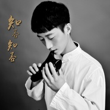

知否知否 陶笛古筝
============================

|  |  |
| :--: | :-- |
| [ 知否知否 陶笛古筝](https://emumo.xiami.com/album/2104558760) | **艺人**: [吴苏芯](../index.md) **语种**: 纯音乐 **唱片公司**:  **发行时间**: 2019年01月30日 **专辑类别**: EP, 单曲 **专辑风格**: 流行 Pop **播放数**: 40868 **收藏数**: 25 **评论数**: 8  |

## 简介

《知否知否应是绿肥红瘦》片尾曲《知否知否》乐器演奏版。陶笛：吴苏芯 古筝：肖云

## 曲目

## 评论

|  |  |  |  |
| :-- | :-- | :-- | :-- |
|  [虾米用户](https://emumo.xiami.com/u/325869040) still~ 2020-05-04 00:36 赞(0) 踩(0) | 
古韵
 |
|  [虾米用户](https://emumo.xiami.com/u/280297110)  2019-12-06 15:19 赞(0) 踩(0) | 
中国古典乐器相结合，百听不厌，完美演绎。
 |
|  [虾米用户](https://emumo.xiami.com/u/12663675) 美人不是母胎生 2019-03-12 07:39 赞(0) 踩(0) | 
 
 |
|  [虾米用户](https://emumo.xiami.com/u/277988373)  2019-02-20 18:57 赞(0) 踩(0) | 
好听！喜欢！
 |
|  [虾米用户](https://emumo.xiami.com/u/45925586)  2019-02-05 05:11 赞(0) 踩(0) | 
喜欢
 |
|  [虾米用户](https://emumo.xiami.com/u/4487129)  2019-02-01 09:13 赞(0) 踩(0) | 
！！！
 |
|  [虾米用户](https://emumo.xiami.com/u/325486445) 自己是自己最好的伴侣，自... 2019-01-31 23:00 赞(0) 踩(0) | 
纯音乐给人一种更宁静的享受
 |
|  [虾米用户](https://emumo.xiami.com/u/374865232)  2019-01-30 18:07 赞(1) 踩(0) | 
心情一下子就平静下来了
 |
