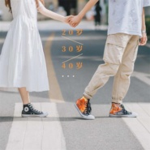

曾婕
============================

|  |  |
| :--: | :-- |
| [ 曾婕](https://i.xiami.com/joeyz) | **播放数**: 3405425 **粉丝数**: 617 **评论数**: 128 **地区**: China 中国大陆 **风格**: 国语流行 Mandarin Pop, 华语唱作人 Chinese Singer-Songwriter  |

## 档案

新浪微博：曾婕Joey_Z 
姓名：曾婕 
外文名：Joey.Z 
职业：歌手、制作人。 
《如果蜗牛有爱情》主题曲《幸福的终点》； 
《山口山战记》主题曲《小心脏》、插曲《沙塔斯月光》； 
《多少爱可以重来》插曲《指尖》演唱； 
二珂《孤独她呀》、张晓钰《Cool girl》词曲等。

## 专辑

| 名称 | 语种 | 唱片公司 | 发行时间 | 专辑类别 | 专辑风格 |
| :--: | :-- | :-- | :-- | :-- | :-- |
| [ Crying for U](./albums/2108217218.md) | 英语 | 神奇脑电波 | 2020年03月25日 | EP, 单曲 | 国语流行 Mandarin Pop |
| [ How Can We Shine Like Star](./albums/2420351252.md) | 国语 | 索雅音乐 | 2020年03月05日 | EP, 单曲 | 国语流行 Mandarin Pop |
| [ 20岁30岁40岁](./albums/2105638000.md) | 国语 | Live Music | 2019年12月29日 | EP, 单曲 | 国语流行 Mandarin Pop |
| [ 天灵灵地灵灵，让我变可爱](./albums/2105535911.md) | 国语 | 百纳娱乐 | 2019年11月29日 | EP, 单曲 | 网络流行 Cyber Hit |
| [ 粉鹿夏日](./albums/2105046264.md) | 国语 | 神奇脑电波 | 2019年08月07日 | EP, 单曲 |  |
| [ 20岁30岁40岁](./albums/2105206069.md) | 国语 | Live Music | 2019年06月17日 | EP, 单曲 |  |
| [ Ma Boy~❤](./albums/2104244942.md) | 国语 | 神奇脑电波 | 2018年11月24日 | EP, 单曲 | 国语流行 Mandarin Pop |
| [ 再见到你](./albums/2103752037.md) | 国语 | 等待音乐 | 2018年06月08日 | EP, 单曲 | 流行 Pop, 国语流行 Mandarin Pop |
| [ 正在为你哭泣Crying For You](./albums/2103710733.md) | 国语 | 独立发行 | 2018年05月02日 | EP, 单曲 | 电子 Electronic, 未来贝斯 Future Bass, 电子舞曲 EDM / Electronic Dance Music |
| [ Younger秧歌儿](./albums/2103463857.md) | 国语 | 小唱科技 | 2018年01月01日 | EP, 单曲 | 电子 Electronic, 电子舞曲 EDM / Electronic Dance Music |
| [ 你给的我](./albums/2102973375.md) | 国语 | 独立发行 | 2017年12月12日 | 录音室专辑 | 流行 Pop |
| [ Falin Love谈个恋爱](./albums/2102873489.md) | 国语 | 独立发行 | 2017年10月10日 | EP, 单曲 | 流行说唱 Pop Rap, 嘻哈 Hip-Hop, 电子 Electronic |
| [ 上头条的树懒](./albums/2102749838.md) | 国语 | 千和世纪 | 2017年04月27日 | EP, 单曲 |  |
| [ 不要啊教练](./albums/2102675029.md) | 国语 | 红海乐能 | 2016年12月30日 | 原声带, 影视音乐 |  |
| [ 如果蜗牛有爱情](./albums/2102412402.md) | 国语 | 神奇脑电波 | 2016年10月24日 | 原声带, 影视音乐 | 流行 Pop |
| [ Good Girl DEMO](./albums/2100327246.md) | 国语 | 神奇脑电波 | 2016年05月02日 | EP, 单曲 | 未来贝斯 Future Bass |
| [ 心猿意马](./albums/2100264446.md) | 国语 | 神奇脑电波 | 2016年01月20日 | EP, 单曲 | 国语流行 Mandarin Pop, 古风 GuFeng Music |
| [ 山口山战记  OST](./albums/2100243194.md) | 国语 | 天浩盛世 | 2015年12月01日 | EP, 单曲 | 原声 Soundtrack, 国语流行 Mandarin Pop |
| [ 情歌没有提及](./albums/504297137.md) | 国语 | 神奇脑电波 | 2014年07月01日 | EP, 单曲 | 国语流行 Mandarin Pop |

## 评论

|  |  |  |  |
| :-- | :-- | :-- | :-- |
|  [虾米用户](https://emumo.xiami.com/u/358104299) 悲观的唯心存在现实解构虚... 2021-01-07 05:54 赞(1) 踩(0) | 
45769
 |
|  [虾米用户](https://emumo.xiami.com/u/116691278) 我还没想好要写什么... 2019-03-17 00:04 赞(0) 踩(0) | 
等温火
 |
|  [虾米用户](https://emumo.xiami.com/u/301968291) 愿我早下无间地狱 2019-01-21 13:34 赞(0) 踩(0) | 
和我喜欢的人撞名了 
 |
|  [虾米用户](https://emumo.xiami.com/u/411229461)  2018-12-30 09:06 赞(1) 踩(0) | 
20岁30岁40岁什么时候出呀
 |
| ⇒ |  [虾米用户](https://emumo.xiami.com/u/174510480) 愿此间山有木兮卿有意 昨... 2019-01-17 05:19 赞(0) 踩(0) | 
在某云
 |
|  [虾米用户](https://emumo.xiami.com/u/326171628) 我还没想好要写什么... 2018-12-26 00:29 赞(2) 踩(0) | 
20岁30岁40岁呢
 |
|  [虾米用户](https://emumo.xiami.com/u/286116258) 我还没想好要写什么... 2018-12-20 14:41 赞(1) 踩(0) | 
你好，“秋天陪你一起看落叶，冬天陪你等春天，夏天陪你喂蚊子”这首歌什么时候发布？很想听整首歌。 
 |
| ⇒ |  [虾米用户](https://emumo.xiami.com/u/1640771) 猎奇美食家 2018-12-23 01:40 赞(0) 踩(0) | 
下周~
 |
| ⇒ |  [虾米用户](https://emumo.xiami.com/u/411229461)  2018-12-25 23:00 赞(0) 踩(0) | 
<q><b>曾婕说：</b></q>
 |
|  [虾米用户](https://emumo.xiami.com/u/293692544) 你敢给我说话吗？我咬你 2018-08-31 05:18 赞(1) 踩(0) | 
好听
 |
|  [虾米用户](https://emumo.xiami.com/u/298948030) 中國詩音樂電影创始人作曲... 2017-10-17 22:26 赞(1) 踩(0) | 
你好
 |
|  [虾米用户](https://emumo.xiami.com/u/195953146)  2017-03-17 13:23 赞(1) 踩(0) | 
我93年的啊，原来同年 
 |
|  [虾米用户](https://emumo.xiami.com/u/95811446)  2017-03-06 10:27 赞(0) 踩(0) | 
有没有新歌啊？
 |
|  [虾米用户](https://emumo.xiami.com/u/5641653)  2016-12-05 06:54 赞(0) 踩(0) | 
流行
 |
|  [虾米用户](https://emumo.xiami.com/u/25722491) B.A.P 2016-12-04 15:58 赞(1) 踩(0) | 
好喜欢的声音
 |
|  [虾米用户](https://emumo.xiami.com/u/1231512)  2016-11-23 13:03 赞(0) 踩(0) | 
好听  
 |
|  [虾米用户](https://emumo.xiami.com/u/81350940) 锦城虽云乐 不如早还家 2016-11-16 03:30 赞(2) 踩(0) | 
估计你要火辣！！哈哈哈，我预言很准的
 |
|  [虾米用户](https://emumo.xiami.com/u/7847049) 蹭能量要點臉好嗎 2016-11-15 15:05 赞(1) 踩(0) | 
好少聽中文歌了，但是《幸福的終點》超好聽！
 |
|  [虾米用户](https://emumo.xiami.com/u/52358888)  2016-10-28 21:09 赞(1) 踩(0) | 
我就是弱弱的确认一下 甄宝团送给馥甄的“星空”是你的声音对吧～  三叶草来认个亲 很喜欢你的歌声    
 |
| ⇒ |  [虾米用户](https://emumo.xiami.com/u/1640771) 猎奇美食家 2016-10-29 20:43 赞(0) 踩(0) | 
哎呀  被发现啦
 |
| ⇒ |  [虾米用户](https://emumo.xiami.com/u/52358888)  2016-11-09 10:46 赞(0) 踩(0) | 
<q><b>曾婕说：</b></q>
 |
| ⇒ |  [虾米用户](https://emumo.xiami.com/u/1640771) 猎奇美食家 2016-11-14 14:29 赞(0) 踩(0) | 
<q><b>♪_Tasmania❤゛说：</b></q>
 |
|  [虾米用户](https://emumo.xiami.com/u/6017734) 什么都没有精神残废可怕，... 2016-10-25 01:07 赞(0) 踩(0) | 
路过，打个酱油，是我喜欢声音 
 |
|  [虾米用户](https://emumo.xiami.com/u/26246185)  2016-08-31 09:59 赞(1) 踩(0) | 
喜欢喜欢喜欢~~
 |
|  [虾米用户](https://emumo.xiami.com/u/10092497) 听说写签名会有人看... 2016-07-13 14:08 赞(0) 踩(0) | 
评论都好早之前的，我来凑数！
 |
|  [虾米用户](https://emumo.xiami.com/u/136994550)  2016-04-08 12:31 赞(0) 踩(0) | 

 |
|  [虾米用户](https://emumo.xiami.com/u/72303066) 哥，好好的 2016-03-26 10:49 赞(0) 踩(0) | 
女神，女神，你去参加今年的超女呗！把今年level提高一个档次吧！代表我们四川地区拿冠军！！！
 |
|  [虾米用户](https://emumo.xiami.com/u/79288712)  2015-12-01 17:28 赞(0) 踩(0) | 
为什么没有新歌   小心脏  沙塔斯月光
 |
| ⇒ |  [虾米用户](https://emumo.xiami.com/u/1640771) 猎奇美食家 2015-12-01 21:16 赞(0) 踩(0) | 
因为网速太慢哈哈哈哈哈哈哈。。。现在传上了
 |
|  [虾米用户](https://emumo.xiami.com/u/4347857) 我还没想好要写什么... 2015-11-21 23:23 赞(0) 踩(0) | 
跟在我后面，只差 一点点距离 一点点距离 一点点距离 没有受伤没有哭泣
 |
|  [虾米用户](https://emumo.xiami.com/u/3191351)   2015-10-23 12:19 赞(0) 踩(0) | 
怎么没有新歌了
 |
| ⇒ |  [虾米用户](https://emumo.xiami.com/u/1640771) 猎奇美食家 2015-10-26 23:32 赞(0) 踩(0) | 
公告上写了。。。我这浏览器不知道咋的上传不了
 |
|  [虾米用户](https://emumo.xiami.com/u/8444037)  2015-10-05 13:15 赞(0) 踩(0) | 
喜欢
 |
|  [虾米用户](https://emumo.xiami.com/u/52996245)  2015-08-31 12:15 赞(0) 踩(0) | 
求封面高清图
 |
| ⇒ |  [虾米用户](https://emumo.xiami.com/u/1640771) 猎奇美食家 2015-09-07 21:58 赞(0) 踩(0) | 
这你也要啊，哈哈哈
 |
| ⇒ |  [虾米用户](https://emumo.xiami.com/u/52996245)  2015-09-08 14:41 赞(0) 踩(0) | 
<q><b>曾婕说：</b></q>
 |
| ⇒ |  [虾米用户](https://emumo.xiami.com/u/1640771) 猎奇美食家 2015-09-08 15:41 赞(0) 踩(0) | 
<q><b>R说：</b></q>
 |
| ⇒ |  [虾米用户](https://emumo.xiami.com/u/52996245)  2015-09-09 14:42 赞(0) 踩(0) | 
<q><b>曾婕说：</b></q>
 |
| ⇒ |  [虾米用户](https://emumo.xiami.com/u/52996245)  2015-09-09 14:46 赞(0) 踩(0) | 
<q><b>曾婕说：</b></q>
 |
| ⇒ |  [虾米用户](https://emumo.xiami.com/u/52996245)  2015-09-09 14:46 赞(0) 踩(0) | 
<q><b>曾婕说：</b></q>
 |
|  [虾米用户](https://emumo.xiami.com/u/48266239)  2015-07-24 19:06 赞(0) 踩(0) | 
好
 |
|  [虾米用户](https://emumo.xiami.com/u/34928213) 没看到的时候又失了眠。看... 2015-07-19 22:15 赞(0) 踩(0) | 
喜欢！
 |
|  [虾米用户](https://emumo.xiami.com/u/43248227)  2015-06-16 22:58 赞(1) 踩(0) | 
先留个名，以后你火了说不定我也火了
 |
|  [虾米用户](https://emumo.xiami.com/u/44075804) 暂无签名~ 2015-05-22 15:26 赞(0) 踩(0) | 
太屌
 |
|  [虾米用户](https://emumo.xiami.com/u/3191351)   2015-05-06 12:55 赞(0) 踩(0) | 
唱得真好，加油
 |
|  [虾米用户](https://emumo.xiami.com/u/14297695) Jazz Hiphop ... 2015-04-11 23:06 赞(0) 踩(0) | 
好听
 |
|  [虾米用户](https://emumo.xiami.com/u/48944596) 暂无签名~ 2015-04-10 19:20 赞(0) 踩(0) | 
感觉hi歌里版的《想得太多》更伤感。可以尝试用吉他伴奏！
 |
|  [虾米用户](https://emumo.xiami.com/u/37074959) fine 2015-03-21 15:45 赞(0) 踩(0) | 
妈个鸡超喜欢你声音
 |
| ⇒ |  [虾米用户](https://emumo.xiami.com/u/1640771) 猎奇美食家 2015-03-23 19:54 赞(0) 踩(0) | 
妈拉个巴子  谢谢  哈哈哈哈
 |
| ⇒ |  [虾米用户](https://emumo.xiami.com/u/37074959) fine 2015-03-23 20:32 赞(0) 踩(0) | 
<q><b>曾婕说：</b></q>
 |
|  [虾米用户](https://emumo.xiami.com/u/43698283)  2015-02-23 03:15 赞(0) 踩(0) | 

 |
|  [虾米用户](https://emumo.xiami.com/u/11752665) 。 2015-02-09 22:14 赞(0) 踩(0) | 
帅气的感觉就像划小船
 |
|  [虾米用户](https://emumo.xiami.com/u/24902718) Cyn 2015-01-30 16:27 赞(0) 踩(0) | 
有人竟然说你唱功还需要加强。。
 |
| ⇒ |  [虾米用户](https://emumo.xiami.com/u/1640771) 猎奇美食家 2015-01-30 23:31 赞(0) 踩(0) | 
给我评论转发温火~~~
 |
|  [虾米用户](https://emumo.xiami.com/u/7682881) 普通话不好的小卢卡 2015-01-27 22:34 赞(0) 踩(0) | 
喜欢 可是你邮箱 发不了啊 姐姐
 |
|  [虾米用户](https://emumo.xiami.com/u/7682881) 普通话不好的小卢卡 2015-01-27 22:31 赞(0) 踩(0) | 
好听
 |
|  [虾米用户](https://emumo.xiami.com/u/23742853)  2015-01-25 20:08 赞(0) 踩(0) | 
说实在的一直以为食尸鬼是日本人唱的。。。原来是个中分姐。。。
 |
| ⇒ |  [虾米用户](https://emumo.xiami.com/u/1640771) 猎奇美食家 2015-01-26 01:13 赞(0) 踩(0) | 
不是原唱 = =///
 |
| ⇒ |  [虾米用户](https://emumo.xiami.com/u/7845159) 我还没想好要写什么... 2015-01-26 12:14 赞(0) 踩(0) | 
哎~op是TK from 凛として時雨唱的好吗~
 |
| ⇒ |  [虾米用户](https://emumo.xiami.com/u/7845159) 我还没想好要写什么... 2015-01-26 12:16 赞(0) 踩(0) | 
<q><b>曾婕说：</b></q>
 |
| ⇒ |  [虾米用户](https://emumo.xiami.com/u/23742853)  2015-01-26 14:24 赞(0) 踩(0) | 
<q><b>Air说：</b></q>
 |
|  [虾米用户](https://emumo.xiami.com/u/41385238)  2015-01-25 01:41 赞(0) 踩(0) | 
好有范儿的你
 |
|  [虾米用户](https://emumo.xiami.com/u/1430245)   2015-01-22 00:24 赞(0) 踩(0) | 
一天至少听10遍公婆骑摩的，真是一个伟大的版本....加油美女
 |
|  [虾米用户](https://emumo.xiami.com/u/10911472) 在物物存，去物物亡 2015-01-21 15:20 赞(0) 踩(0) | 
支持一下
 |
|  [虾米用户](https://emumo.xiami.com/u/284997) 你来了，我们一起走 2015-01-21 09:41 赞(0) 踩(0) | 
一天一天，少的不止是昨天
 |
|  [虾米用户](https://emumo.xiami.com/u/38649193)   2015-01-20 10:34 赞(0) 踩(0) | 
支持一发！
 |
| ⇒ |  [虾米用户](https://emumo.xiami.com/u/1640771) 猎奇美食家 2015-01-20 16:37 赞(0) 踩(0) | 
给我评论温火那首歌噢！
 |
|  [虾米用户](https://emumo.xiami.com/u/46243615)  2015-01-19 20:08 赞(0) 踩(0) | 
公婆骑摩的的伴奏是什么歌的啊？
 |
|  [虾米用户](https://emumo.xiami.com/u/45654702)  2015-01-10 03:18 赞(0) 踩(0) | 
嗷嗷嗷～食尸鬼的OP好棒！！！！！！
 |
| ⇒ |  [虾米用户](https://emumo.xiami.com/u/1640771) 猎奇美食家 2015-01-10 18:47 赞(0) 踩(0) | 
哈哈
 |
|  [虾米用户](https://emumo.xiami.com/u/3146403)  2015-01-09 17:33 赞(0) 踩(0) | 
REMIX之后更加好听了 真厉害！
 |
|  [虾米用户](https://emumo.xiami.com/u/38606338) 叫我小杨就好～— 2014-12-02 13:26 赞(0) 踩(0) | 
好赞！继续加油！！
 |
|  [虾米用户](https://emumo.xiami.com/u/18958397) 你这么屌，你家里人知道吗 2014-11-24 00:09 赞(0) 踩(0) | 
感觉没那么刺耳啦！
 |
|  [虾米用户](https://emumo.xiami.com/u/1720656) welcome 2 th... 2014-11-19 19:46 赞(0) 踩(0) | 
加油，原创必须顶
 |
|  [虾米用户](https://emumo.xiami.com/u/23944614)  2014-11-17 03:26 赞(0) 踩(0) | 
很喜欢Joey美女REMIX的《公婆骑摩的》，虽然庞麦郎的声线可能别人听起来有点土里土气，不过这首歌经你做完之后蓝调的那种感觉出来了，带点淡淡的忧桑，听着莫名的舒服，即便是心情不好的时候。也许我一个人的力量有限，默默的支持你一下，加油。
 |
| ⇒ |  [虾米用户](https://emumo.xiami.com/u/1640771) 猎奇美食家 2014-11-18 21:17 赞(0) 踩(0) | 
哈哈~谢谢
 |
|  [虾米用户](https://emumo.xiami.com/u/9242198) 似曾相识，一辈子。 2014-11-10 00:50 赞(0) 踩(0) | 
加油。唱功在加强。肯定会火
 |
|  [虾米用户](https://emumo.xiami.com/u/26085163) johnson 2014-11-05 18:36 赞(0) 踩(0) | 
《想念》 旋律聲聲挑起夜夜曾經微甜且難以忘懷的回憶 雖與伊人分隔兩地  只要心連心 任何煎熬又能奈你如何?
 |
|  [虾米用户](https://emumo.xiami.com/u/5429478) 唯有音乐和亲情不可遗落！ 2014-11-03 14:03 赞(12) 踩(0) | 
淡淡的忧伤，淡淡的诉说，音质给人的感觉也是淡淡的。特别喜欢的女歌手汪菱姗，加油
 |
|  [虾米用户](https://emumo.xiami.com/u/12380596)  2014-11-02 13:30 赞(0) 踩(0) | 
公婆骑摩的，好玩爆了，好听多了
 |
|  [虾米用户](https://emumo.xiami.com/u/10565482) 口令：新春快乐呀 2014-10-31 04:59 赞(0) 踩(0) | 
为什么虾米上面没有 指尖？搜桑了。
 |
| ⇒ |  [虾米用户](https://emumo.xiami.com/u/1640771) 猎奇美食家 2014-10-31 15:47 赞(0) 踩(0) | 
没传上来   哈哈哈
 |
| ⇒ |  [虾米用户](https://emumo.xiami.com/u/10565482) 口令：新春快乐呀 2014-11-02 14:54 赞(0) 踩(0) | 
<q><b>曾婕说：</b></q>
 |
| ⇒ |  [虾米用户](https://emumo.xiami.com/u/1640771) 猎奇美食家 2014-11-02 21:43 赞(0) 踩(0) | 
<q><b>蜗牛上了叶子说：</b></q>
 |
| ⇒ |  [虾米用户](https://emumo.xiami.com/u/10565482) 口令：新春快乐呀 2014-11-03 04:01 赞(0) 踩(0) | 
<q><b>曾婕说：</b></q>
 |
|  [虾米用户](https://emumo.xiami.com/u/40843918) 小他 2014-10-28 19:40 赞(0) 踩(0) | 
好听
 |
|  [虾米用户](https://emumo.xiami.com/u/21235305) 原创音乐达人 2014-10-26 18:12 赞(0) 踩(0) | 
真正的音乐人，大家都会喜欢！
 |
|  [虾米用户](https://emumo.xiami.com/u/21235305) 原创音乐达人 2014-10-26 18:08 赞(0) 踩(0) | 
非常喜欢《想念》！此歌必火！听到心碎！
 |
|  [虾米用户](https://emumo.xiami.com/u/953975) Real 2014-10-24 12:21 赞(0) 踩(0) | 
好喜欢QAQ..
 |
|  [虾米用户](https://emumo.xiami.com/u/6815072)  2014-10-22 23:44 赞(0) 踩(0) | 
已经下载，3Q
 |
|  [虾米用户](https://emumo.xiami.com/u/42905132)  2014-10-22 22:53 赞(0) 踩(0) | 
加油呀！很喜欢想念的调调～
 |
|  [虾米用户](https://emumo.xiami.com/u/13051733) 花再小也要怒放 2014-10-19 23:53 赞(0) 踩(0) | 
咋没你的百科呢
 |
| ⇒ |  [虾米用户](https://emumo.xiami.com/u/1640771) 猎奇美食家 2014-10-21 16:55 赞(0) 踩(0) | 
没有建呢
 |
|  [虾米用户](https://emumo.xiami.com/u/781784)   2014-10-16 20:33 赞(0) 踩(0) | 
才女，赞一个!！期待新作品哈
 |
|  [虾米用户](https://emumo.xiami.com/u/157553)  2014-10-16 11:33 赞(0) 踩(0) | 
食尸鬼翻唱的叼！
 |
|  [虾米用户](https://emumo.xiami.com/u/29348485)   2014-10-13 16:35 赞(0) 踩(0) | 
你用什么软件Remix的？
 |
| ⇒ |  [虾米用户](https://emumo.xiami.com/u/1640771) 猎奇美食家 2014-10-15 02:51 赞(0) 踩(0) | 
cubase
 |
|  [虾米用户](https://emumo.xiami.com/u/36481779) THU宅 2014-10-11 18:14 赞(0) 踩(0) | 
有必要回复一下！前几天单曲循环你的R&amp;amp;B版摩的，今天回来突然发现寻光推荐的虾米音乐人集里面我们竟然在同一个推荐类目！！O_o 惊呆了缘分啊！！
 |
| ⇒ |  [虾米用户](https://emumo.xiami.com/u/1640771) 猎奇美食家 2014-10-11 21:44 赞(0) 踩(0) | 
哈哈哈。。
 |
|  [虾米用户](https://emumo.xiami.com/u/7002671) 云淡风轻听琴语。 2014-10-11 13:29 赞(0) 踩(0) | 
加油，想念
 |
|  [虾米用户](https://emumo.xiami.com/u/39473086) not yet. 2014-10-09 16:41 赞(0) 踩(0) | 
有那麼一點點A-Lin的感覺。
 |
|  [虾米用户](https://emumo.xiami.com/u/13673123)  2014-10-09 13:54 赞(0) 踩(0) | 
欣赏
 |
|  [虾米用户](https://emumo.xiami.com/u/20276409) 暂无签名~ 2014-10-09 11:21 赞(0) 踩(0) | 
东京食尸鬼。。妹子爱上你了
 |
|  [虾米用户](https://emumo.xiami.com/u/41686032)  2014-10-09 01:21 赞(0) 踩(0) | 
好喜欢你的声音啊啊啊～听过你翻唱的泡沫 简直媲美GEM 其实我也是有音乐梦的人呢 就是太业余了…
 |
|  [虾米用户](https://emumo.xiami.com/u/41053338)  2014-10-08 20:13 赞(0) 踩(0) | 
好听 很喜欢 加油
 |
| ⇒ |  [虾米用户](https://emumo.xiami.com/u/1640771) 猎奇美食家 2014-10-08 23:11 赞(0) 踩(0) | 
谢谢~
 |
|  [虾米用户](https://emumo.xiami.com/u/40865202)  2014-10-07 16:19 赞(0) 踩(0) | 
歌唱的都很好听，摩的太酷炫
 |
| ⇒ |  [虾米用户](https://emumo.xiami.com/u/1640771) 猎奇美食家 2014-10-07 21:01 赞(0) 踩(0) | 
哈哈哈
 |
|  [虾米用户](https://emumo.xiami.com/u/33403871) 电到飞为止 2014-10-06 12:28 赞(0) 踩(0) | 
真tm好听
 |
|  [虾米用户](https://emumo.xiami.com/u/157553)  2014-10-01 12:48 赞(0) 踩(0) | 
叼
 |
|  [虾米用户](https://emumo.xiami.com/u/33403871) 电到飞为止 2014-10-01 10:46 赞(0) 踩(0) | 
很好听，超喜欢你！公婆骑魔的最好听哈哈！
 |
| ⇒ |  [虾米用户](https://emumo.xiami.com/u/1640771) 猎奇美食家 2014-10-01 13:37 赞(0) 踩(0) | 
哈哈哈哈~~
 |
| ⇒ |  [虾米用户](https://emumo.xiami.com/u/33403871) 电到飞为止 2014-10-02 00:45 赞(0) 踩(0) | 
<q><b>曾婕说：</b></q>
 |
| ⇒ |  [虾米用户](https://emumo.xiami.com/u/33403871) 电到飞为止 2014-10-05 18:28 赞(0) 踩(0) | 
<q><b>曾婕说：</b></q>
 |
|  [虾米用户](https://emumo.xiami.com/u/35328214) 朝生暮死，日复一日。没有... 2014-09-30 19:59 赞(0) 踩(0) | 
卧槽这摩的唱的也是有那么点酷炫！
 |
| ⇒ |  [虾米用户](https://emumo.xiami.com/u/1640771) 猎奇美食家 2014-09-30 21:24 赞(0) 踩(0) | 
那是remixed的   约瑟翰庞麦郎
 |
|  [虾米用户](https://emumo.xiami.com/u/6914297) ，请你抱我 。 2014-09-17 17:12 赞(0) 踩(0) | 
醉。
 |
| ⇒ |  [虾米用户](https://emumo.xiami.com/u/1640771) 猎奇美食家 2014-09-20 01:24 赞(0) 踩(0) | 
哈哈
 |
|  [虾米用户](https://emumo.xiami.com/u/40939763) 生活 2014-09-15 12:56 赞(0) 踩(0) | 
好
 |
|  [虾米用户](https://emumo.xiami.com/u/31502848) Zz 2014-09-13 20:23 赞(0) 踩(0) | 
Mix的真心绝了,循环了
 |
| ⇒ |  [虾米用户](https://emumo.xiami.com/u/1640771) 猎奇美食家 2014-09-14 01:41 赞(0) 踩(0) | 
哈哈哈哈
 |
|  [虾米用户](https://emumo.xiami.com/u/31502848) Zz 2014-09-13 20:21 赞(0) 踩(0) | 
赞!很不错
 |
|  [虾米用户](https://emumo.xiami.com/u/26167542)  2014-09-07 16:24 赞(0) 踩(0) | 
微博or微信？我follow你～
 |
| ⇒ |  [虾米用户](https://emumo.xiami.com/u/1640771) 猎奇美食家 2014-09-07 22:47 赞(0) 踩(0) | 
微博资料上有~
 |
|  [虾米用户](https://emumo.xiami.com/u/26167542)  2014-09-06 14:47 赞(0) 踩(0) | 
喜欢！
 |
| ⇒ |  [虾米用户](https://emumo.xiami.com/u/1640771) 猎奇美食家 2014-09-07 02:05 赞(0) 踩(0) | 
谢谢~
 |
|  [虾米用户](https://emumo.xiami.com/u/38679656) Musicer 2014-07-03 19:03 赞(0) 踩(0) | 
我喜欢
 |
|  [虾米用户](https://emumo.xiami.com/u/1640771) 猎奇美食家 2014-06-30 14:56 赞(0) 踩(0) | 
我刚入驻了虾米音乐人，欢迎大家来我的个人主页，收听我的最新音乐
 |
