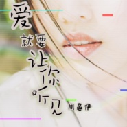
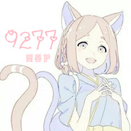
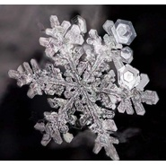

周晏伊
============================

|  |  |
| :--: | :-- |
| [ 周晏伊](https://i.xiami.com/zyy1215) | **播放数**: 12258796 **粉丝数**: 784 **评论数**: 79 **地区**: China 中国大陆 **风格**: 独立流行 Indie Pop, 国语流行 Mandarin Pop, 韩国流行 K-Pop  |

## 档案

周晏伊 
姓名:周晏伊 
英文名:Tiny 
生日:1992年5月6日

## 专辑

| 名称 | 语种 | 唱片公司 | 发行时间 | 专辑类别 | 专辑风格 |
| :--: | :-- | :-- | :-- | :-- | :-- |
| [ 爱就要让你听见](./albums/2106079860.md) | 国语 | 众水之音 | 2020年02月20日 | EP, 单曲 | 流行 Pop |
| [ 网络里的哥哥](./albums/2105696937.md) | 国语 | 众水之音 | 2020年01月27日 | EP, 单曲 | 流行 Pop |
| [ 逼着你进步](./albums/2105637212.md) | 国语 | 众水之音 | 2019年12月30日 | EP, 单曲 | 流行 Pop |
| [ 原谅我到现在还是爱你](./albums/2105438473.md) | 国语 | 众水之音 | 2019年11月19日 | EP, 单曲 |  |
| [ 别人家的老公](./albums/2105172760.md) | 国语 | 众水之音 | 2019年08月29日 | EP, 单曲 |  |
| [ 第一万次爱上你](./albums/2105006753.md) | 国语 | 众水之音 | 2019年07月26日 | EP, 单曲 |  |
| [ 男朋友比冰淇淋还甜蜜](./albums/2104951844.md) | 国语 | 众水之音 | 2019年06月27日 | EP, 单曲 |  |
| [ 我已经爱上你](./albums/2104157925.md) | 国语 | 金翼龙唱片 | 2018年10月29日 | EP, 单曲 | 国语流行 Mandarin Pop |
| [ 小孩](./albums/2103950020.md) | 国语 | 金翼龙唱片 | 2018年08月29日 | EP, 单曲 |  |
| [ 采](./albums/2103901833.md) | 国语 | 金翼龙唱片 | 2018年08月06日 | EP, 单曲 |  |
| [ 9211](./albums/2103788230.md) | 国语 | 金翼龙唱片 | 2018年07月09日 | EP, 单曲 |  |
| [ 金泰妍-Something New泰妍](./albums/2103752473.md) | 韩语 | 独立发行 | 2018年06月20日 | 录音室专辑 | 韩国流行 K-Pop, 电声布鲁斯 Electric Blues |
| [ 9277](./albums/2103704676.md) | 国语 | 金翼龙唱片 | 2018年05月09日 | EP, 单曲 | 国语流行 Mandarin Pop |
| [ 空空如也周晏伊](./albums/2103672917.md) | 国语 | 独立发行 | 2018年04月07日 | 录音室专辑 | 流行 Pop, 国语流行 Mandarin Pop, 独立流行 Indie Pop |
| [ 迷恋](./albums/2103655318.md) | 国语 | 金翼龙唱片 | 2018年03月28日 | EP, 单曲 |  |
| [ 金泰妍-this Christmas](./albums/2103361649.md) | 韩语 | 独立发行 | 2017年12月24日 | 录音室专辑 | 流行 Pop, 韩国流行 K-Pop, 艺术流行 Art Pop |
| [ 说散就散cover.](./albums/2102971011.md) | 国语 | 独立发行 | 2017年12月08日 | EP, 单曲 | 流行 Pop, 国语流行 Mandarin Pop |
| [ 追光者cover.](./albums/2102832809.md) | 国语 | 独立发行 | 2017年08月30日 | 录音室专辑 | 国语流行 Mandarin Pop, 标准歌曲 Standards, 流行 Pop |
| [ 走不出的回忆cover.](./albums/2102813290.md) | 国语 | 独立发行 | 2017年08月12日 | 精选集 | 流行 Pop, 国语流行 Mandarin Pop |
| [ Cover.周晏伊](./albums/2102767792.md) | 国语 | 独立发行 | 2017年06月18日 | EP, 单曲 | 爵士流行 Jazz Pop |
| [ 佛韵莲香周晏伊](./albums/2102725086.md) | 国语 | 金翼龙唱片 | 2017年03月29日 | EP, 单曲 | 古风 GuFeng Music, 流行 Pop |
| [ 寄生](./albums/2102700898.md) | 国语 | 独立发行 | 2017年02月28日 | EP, 单曲 |  |
| [ BIGBANG(cover.)](./albums/2102680650.md) | 韩语 | 独立发行 | 2017年01月15日 | EP, 单曲 | 流行 Pop, 韩国流行 K-Pop |
| [ 明年今日](./albums/2102675028.md) | 国语 | 金翼龙唱片 | 2016年12月30日 | EP, 单曲 | 流行 Pop, 国语流行 Mandarin Pop |
| [ 另一个自己](./albums/2102670496.md) | 国语 | 金翼龙唱片 | 2016年12月21日 | EP, 单曲 |  |
| [ 让我挽着你的手](./albums/2102656124.md) | 国语 | 金翼龙唱片 | 2016年09月25日 | EP, 单曲 |  |
| [ DANCE](./albums/2100246664.md) | 国语 | 独立发行 | 2015年12月10日 | EP, 单曲 |  |
| [ 不想回家](./albums/2100219570.md) | 国语 | 金翼龙唱片 | 2015年10月10日 | EP, 单曲 |  |
| [ 直接一点](./albums/1637363547.md) | 国语 | 金翼龙唱片 | 2015年07月15日 | EP, 单曲 |  |
| [ 说分手不可以](./albums/622939270.md) | 国语 | 金翼龙唱片 | 2015年02月03日 | EP, 单曲 |  |
| [ 若遇见他](./albums/1809119814.md) | 国语 | 金翼龙唱片 | 2014年08月26日 | EP, 单曲 |  |
| [ 周晏伊的专辑](./albums/5022622360.md) | 其他 |  | 不详 |  |  |

## 评论

|  |  |  |  |
| :-- | :-- | :-- | :-- |
|  [虾米用户](https://emumo.xiami.com/u/256924309) 我还没想好要写什么... 2020-07-29 18:33 赞(0) 踩(0) | 

 |
|  [虾米用户](https://emumo.xiami.com/u/112991246)   2020-05-06 22:34 赞(0) 踩(0) | 
好听
 |
|  [虾米用户](https://emumo.xiami.com/u/405147224)  2019-06-22 19:58 赞(0) 踩(0) | 
加个微信吧哈哈哈
 |
|  [虾米用户](https://emumo.xiami.com/u/293692544) 你敢给我说话吗？我咬你 2019-06-03 20:04 赞(1) 踩(0) | 
好听
 |
|  [虾米用户](https://emumo.xiami.com/u/358104299) 悲观的唯心存在现实解构虚... 2019-05-29 10:02 赞(1) 踩(0) | 
11183
 |
|  [虾米用户](https://emumo.xiami.com/u/325374787)  2019-04-03 19:19 赞(1) 踩(0) | 
好好
 |
|  [虾米用户](https://emumo.xiami.com/u/325374787)  2019-04-03 19:18 赞(2) 踩(0) | 
好
 |
|  [虾米用户](https://emumo.xiami.com/u/327662906)  2019-03-05 19:36 赞(2) 踩(0) | 
好喜欢听你的歌
 |
|  [虾米用户](https://emumo.xiami.com/u/328336504)  Love you fo... 2018-08-14 11:16 赞(2) 踩(0) | 
我非常嫉妒你的生日 又是丑陋的一天
 |
|  [虾米用户](https://emumo.xiami.com/u/317780722)  2018-08-13 10:30 赞(2) 踩(0) | 
情感 意境演绎的完美真切，&amp;quot;我盛开的一刹有晚霞 不顾我尴尬&amp;quot; &amp;quot;我化成的蜜你衔回去甜了她&amp;quot;绵绵的爱意 丝丝的凄凉隐喻的词句掀开无尽爱情故事的历史长河
 |
|  [虾米用户](https://emumo.xiami.com/u/350935787)  2018-06-12 20:56 赞(3) 踩(0) | 
不错加油        
 |
|  [虾米用户](https://emumo.xiami.com/u/369723592)  2018-06-10 22:17 赞(3) 踩(0) | 
謝謝
 |
|  [虾米用户](https://emumo.xiami.com/u/374543521)  2018-06-03 21:04 赞(3) 踩(0) | 
不用谢，你继续努力唱的越来越好！加油哦！      
 |
|  [虾米用户](https://emumo.xiami.com/u/354648609)  2018-06-03 13:33 赞(3) 踩(0) | 
樓主加油哦～＾０＾~
 |
|  [虾米用户](https://emumo.xiami.com/u/187631907) 生而热烈 藏与俗常 2018-05-14 20:29 赞(10) 踩(0) | 
这叫拉仇恨跟我们家白白生日一样，超级羡慕好不
 |
|  [虾米用户](https://emumo.xiami.com/u/187631907) 生而热烈 藏与俗常 2018-05-14 20:28 赞(3) 踩(0) | 
小姐姐，完全羡慕你的生日好嘛
 |
|  [虾米用户](https://emumo.xiami.com/u/280841092) 不忘初心，继续前进 2018-05-14 12:27 赞(2) 踩(0) | 
关注你喽
 |
|  [虾米用户](https://emumo.xiami.com/u/187828019)  2018-05-09 16:05 赞(2) 踩(0) | 
希望姐姐继续唱下去！
 |
|  [虾米用户](https://emumo.xiami.com/u/355623514)  2018-04-20 09:24 赞(1) 踩(0) | 
只能说好听，重要的事说三遍 
 |
|  [虾米用户](https://emumo.xiami.com/u/214770701) 边伯贤小迷妹 2018-04-20 00:39 赞(2) 踩(0) | 
和男神生日一样哎
 |
|  [虾米用户](https://emumo.xiami.com/u/330017775) 我还没想好要写什么... 2018-03-09 08:49 赞(1) 踩(0) | 
不见不散，唱得很好
 |
|  [虾米用户](https://emumo.xiami.com/u/320764376) 时间胜过一切。 2018-01-17 03:37 赞(2) 踩(0) | 
可以试着唱首粤语歌曲，歌都选好了【会过去的】车婉婉的哦。
 |
|  [虾米用户](https://emumo.xiami.com/u/310842628) 除了生死，其余都是小事情... 2018-01-14 09:14 赞(2) 踩(0) | 
厉害哦，加油
 |
|  [虾米用户](https://emumo.xiami.com/u/340762430) 防弹兔瓦斯赛文婷 2018-01-01 10:25 赞(2) 踩(0) | 
希望小姐姐多翻唱K-POP
 |
|  [虾米用户](https://emumo.xiami.com/u/336697345)  2017-12-07 11:16 赞(3) 踩(0) | 
女神～非常喜欢你的声音。特别传神
 |
|  [虾米用户](https://emumo.xiami.com/u/328067564)  2017-10-08 14:53 赞(2) 踩(0) | 
封面有点张筱雨
 |
|  [虾米用户](https://emumo.xiami.com/u/201144715) 藏在墨水里，空白的永久填... 2017-09-29 17:53 赞(2) 踩(0) | 
因为追光者关注小姐姐的  
 |
|  [虾米用户](https://emumo.xiami.com/u/187355068)  2017-09-15 18:52 赞(6) 踩(0) | 
只是为什么搜的是泰妍出来一个她呢
 |
| ⇒ |  [虾米用户](https://emumo.xiami.com/u/274516102) 喜欢金泰妍，绝不脱粉. 2017-10-02 08:39 赞(0) 踩(0) | 
我也一样
 |
|  [虾米用户](https://emumo.xiami.com/u/277523723) 喜欢和爱一样么？ 2017-05-31 13:00 赞(2) 踩(0) | 
哈哈，会关注你的哦  
 |
|  [虾米用户](https://emumo.xiami.com/u/120069738)   2017-05-06 00:15 赞(3) 踩(0) | 
生日快乐和我儿子一天 
 |
|  [虾米用户](https://emumo.xiami.com/u/219468306)   2017-04-16 11:16 赞(4) 踩(0) | 
你的生日啊 
 |
|  [虾米用户](https://emumo.xiami.com/u/261799075)  2017-04-06 22:13 赞(2) 踩(0) | 
小姐姐很厉害呢，希望声音更高些才好。韩文多练习些啵
 |
|  [虾米用户](https://emumo.xiami.com/u/276791274) 我大少时└(^o^)┘ 2017-04-02 19:43 赞(4) 踩(0) | 
声音有点生硬的感觉，很有泰妍的feel，声线再轻点就好了，觉得你会更适合豪放点的歌 加油哦
 |
|  [虾米用户](https://emumo.xiami.com/u/174622040) kim taeyeon. 2017-03-28 22:36 赞(15) 踩(0) | 
内容已删除
 |
| ⇒ |  [虾米用户](https://emumo.xiami.com/u/49083128)  2017-03-31 02:32 赞(0) 踩(0) | 
******
 |
| ⇒ |  [虾米用户](https://emumo.xiami.com/u/174622040) kim taeyeon. 2017-04-02 12:11 赞(0) 踩(0) | 
<q><b>未知生物说：</b></q>
 |
| ⇒ |  [虾米用户](https://emumo.xiami.com/u/276791274) 我大少时└(^o^)┘ 2017-04-02 19:41 赞(0) 踩(0) | 
<q><b>未知生物说：</b></q>
 |
| ⇒ |  [虾米用户](https://emumo.xiami.com/u/276791274) 我大少时└(^o^)┘ 2017-04-02 19:49 赞(0) 踩(0) | 
<q><b>未知生物说：</b></q>
 |
| ⇒ |  [虾米用户](https://emumo.xiami.com/u/276791274) 我大少时└(^o^)┘ 2017-04-02 19:50 赞(0) 踩(0) | 
<q><b>未知生物说：</b></q>
 |
| ⇒ |  [虾米用户](https://emumo.xiami.com/u/285951081)  属性混乱，雷点没有(粉... 2017-04-08 15:49 赞(0) 踩(0) | 
<q><b>金泰妍＿ss说：</b></q>
 |
| ⇒ |  [虾米用户](https://emumo.xiami.com/u/174622040) kim taeyeon. 2017-04-08 16:04 赞(0) 踩(0) | 
<q><b>马尾教科书说：</b></q>
 |
| ⇒ |  [虾米用户](https://emumo.xiami.com/u/285951081)  属性混乱，雷点没有(粉... 2017-04-08 16:06 赞(0) 踩(0) | 
<q><b>金泰妍＿ss说：</b></q>
 |
|  [虾米用户](https://emumo.xiami.com/u/281832495)   2017-03-20 01:30 赞(0) 踩(0) | 
从last dance来 (*＾ー＾)小姐姐很棒
 |
|  [虾米用户](https://emumo.xiami.com/u/277229142)  2017-03-02 14:21 赞(0) 踩(0) | 
声音很好听。新歌 《寄生》很喜欢很感动喜欢你女神  支持你加油。
 |
|  [虾米用户](https://emumo.xiami.com/u/274760595)  2017-02-23 22:53 赞(0) 踩(0) | 
last dance 可以的
 |
|  [虾米用户](https://emumo.xiami.com/u/208111212) 永远是少女时代 2017-02-20 21:37 赞(2) 踩(0) | 
真的不要翻唱我泰妍的歌了 求你了
 |
| ⇒ |  [虾米用户](https://emumo.xiami.com/u/193740515)  2018-01-02 11:45 赞(0) 踩(0) | 
她唱的还行啊！干嘛骂人？
 |
|  [虾米用户](https://emumo.xiami.com/u/208111212) 永远是少女时代 2017-02-20 21:33 赞(1) 踩(0) | 
真他妈贱
 |
| ⇒ |  [虾米用户](https://emumo.xiami.com/u/277229142)  2017-06-14 10:30 赞(0) 踩(0) | 
干嘛骂人 
 |
|  [虾米用户](https://emumo.xiami.com/u/125126628) 让汹涌的海面也安静温柔 2017-02-17 22:50 赞(0) 踩(0) | 
我觉得韩语发音很好啊
 |
|  [虾米用户](https://emumo.xiami.com/u/125126628) 让汹涌的海面也安静温柔 2017-02-17 22:49 赞(0) 踩(0) | 
生日！！！
 |
|  [虾米用户](https://emumo.xiami.com/u/255562871)  2017-02-16 20:47 赞(0) 踩(0) | 
很棒很棒的小姐姐♡加油！
 |
|  [虾米用户](https://emumo.xiami.com/u/261207032)  2017-02-05 01:32 赞(1) 踩(0) | 
唱的很好
 |
|  [虾米用户](https://emumo.xiami.com/u/256446704) Maybe or may... 2017-02-02 12:20 赞(0) 踩(0) | 
亲故的韩语发音很好，气息可以再练练，希望你下一次发歌的时候，能听到高音哦 
 |
|  [虾米用户](https://emumo.xiami.com/u/197397365) 堂堂正正金泰妍 2017-01-31 17:57 赞(1) 踩(0) | 
果达为你加油
 |
|  [虾米用户](https://emumo.xiami.com/u/256860287) 我还没想好要写什么... 2017-01-27 17:50 赞(0) 踩(0) | 
很喜欢你的声音
 |
|  [虾米用户](https://emumo.xiami.com/u/191466220)  2017-01-27 12:55 赞(1) 踩(0) | 
很好听，和泰妍的声音一样帅，希望有更好的作品，很期待！
 |
| ⇒ |  [虾米用户](https://emumo.xiami.com/u/262687019)  2017-02-19 12:54 赞(0) 踩(0) | 
哪有？我可是taifeng
 |
|  [虾米用户](https://emumo.xiami.com/u/194411943)  2017-01-25 22:49 赞(1) 踩(0) | 
看到生日我惊呆了  和wuli阿爸同年同月同日出生
 |
|  [虾米用户](https://emumo.xiami.com/u/163967364)  2017-01-20 13:30 赞(1) 踩(0) | 
last dance 勾引我过来的， 哈哈 唱的很好听呢，发音也不错，很棒了  希望能唱几首iKON的歌就好了，哈哈私心有点
 |
| ⇒ |  [虾米用户](https://emumo.xiami.com/u/67908164) 周晏伊 2017-01-28 23:21 赞(0) 踩(0) | 
我听听，学一下 
 |
|  [虾米用户](https://emumo.xiami.com/u/143696978) NCT冲啊！ 2017-01-14 14:12 赞(2) 踩(0) | 
wuli咸咸也是1992.0506......
 |
|  [虾米用户](https://emumo.xiami.com/u/252443704) 我还没想好要写什么... 2017-01-06 17:50 赞(0) 踩(0) | 

 |
|  [虾米用户](https://emumo.xiami.com/u/242449889) 天大地大你锥最大 2017-01-01 09:02 赞(3) 踩(0) | 
跟我阿爸同年同月同日.....
 |
| ⇒ |  [虾米用户](https://emumo.xiami.com/u/67908164) 周晏伊 2017-01-03 11:56 赞(0) 踩(0) | 
我还能说什么 
 |
|  [虾米用户](https://emumo.xiami.com/u/125847694)  2016-12-10 17:49 赞(1) 踩(0) | 
泰妍的棍宝啊
 |
|  [虾米用户](https://emumo.xiami.com/u/181340804)  2016-12-05 22:59 赞(2) 踩(0) | 
还可以，不错吧
 |
|  [虾米用户](https://emumo.xiami.com/u/181340804)  2016-12-05 22:59 赞(42) 踩(0) | 
知道有多嫉妒你的生日么？？？  
 |
| ⇒ |  [虾米用户](https://emumo.xiami.com/u/67908164) 周晏伊 2017-01-03 11:56 赞(0) 踩(0) | 
  
 |
|  [虾米用户](https://emumo.xiami.com/u/232225535) 私信一直都有看 非常感谢 2016-12-04 15:17 赞(0) 踩(0) | 

 |
|  [虾米用户](https://emumo.xiami.com/u/244182431) 边伯贤 2016-11-19 19:52 赞(53) 踩(0) | 
1992年5月6日的生日！和边伯贤一样！
 |
| ⇒ |  [虾米用户](https://emumo.xiami.com/u/67908164) 周晏伊 2016-11-24 13:36 赞(0) 踩(0) | 
我才发现。。
 |
| ⇒ |  [虾米用户](https://emumo.xiami.com/u/222511049)  2017-02-19 14:46 赞(0) 踩(0) | 
不一定
 |
| ⇒ |  [虾米用户](https://emumo.xiami.com/u/194411943)  2017-08-30 17:47 赞(0) 踩(0) | 
<q><b>백현·19920506说：</b></q>
 |
| ⇒ |  [虾米用户](https://emumo.xiami.com/u/258629365)  2018-02-09 15:01 赞(0) 踩(0) | 
<q><b>周晏伊说：</b></q>
 |
| ⇒ |  [虾米用户](https://emumo.xiami.com/u/181195156) 信听泰❄ 2018-03-04 16:18 赞(0) 踩(0) | 
刚看到5.6好吃惊 一看92年 吼~和伯贤一模一样好羡慕
 |
|  [虾米用户](https://emumo.xiami.com/u/67908164) 周晏伊 2015-09-21 09:15 赞(52) 踩(0) | 
我刚入驻了虾米音乐人，欢迎大家来我的个人主页，收听我的最新音乐
 |
| ⇒ |  [虾米用户](https://emumo.xiami.com/u/353779537)  2018-03-15 06:57 赞(0) 踩(0) | 
加个微信吧
 |
| ⇒ |  [虾米用户](https://emumo.xiami.com/u/372375574)  2018-05-27 18:56 赞(0) 踩(0) | 
属于网络歌手，挺厉害
 |
