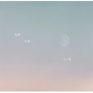
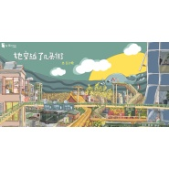

豆子糖
============================

|  |  |
| :--: | :-- |
| [ 豆子糖](https://i.xiami.com/tyn) | **地区**: China 中国大陆 **风格**: 民谣流行 Folk Pop **播放数**: 5616140 **粉丝数**: 958 **评论数**: 66  |

## 档案

2014年开始创作，并且会继续下去。

## 专辑

| 名称 | 语种 | 唱片公司 | 发行时间 | 专辑类别 | 专辑风格 |
| :--: | :-- | :-- | :-- | :-- | :-- |
| [ 迷失北京](./albums/2105781162.md) | 国语 | 独立发行 | 2020年01月23日 | EP, 单曲 | 民谣流行 Folk Pop, 民谣 Folk |
| [ 无事小神仙](./albums/2104862169.md) | 国语 |  | 2019年05月15日 | EP, 单曲 | 流行 Pop |
| [ 前世今生(Cover缘起)](./albums/2104559054.md) | 国语 | 独立发行 | 2019年01月31日 | EP, 单曲 | 流行 Pop |
| [ 九月东隅](./albums/5022431798.md) | 国语 |  | 2018年10月23日 | EP, 单曲 |  |
| [ 我本西方一衲子](./albums/2103589012.md) | 国语 | 独立发行 | 2018年03月07日 | EP, 单曲 | 流行 Pop, 民谣 Folk |
| [ 十月怀乡](./albums/2102950311.md) | 国语 | 独立发行 | 2017年11月21日 | EP, 单曲 | 民谣 Folk, 独立民谣 Indie Folk |
| [ 七月云走](./albums/2102874114.md) | 国语 | 独立发行 | 2017年10月17日 | EP, 单曲 | 流行 Pop, 民谣 Folk |
| [ 六月雨白](./albums/2103431782.md) | 国语 | 独立发行 | 2017年07月01日 | EP, 单曲 | 当代民谣 Contemporary Folk |
| [ 探清水河超长版](./albums/2102770508.md) | 国语 | 独立发行 | 2017年06月23日 | EP, 单曲 | 民谣 Folk |
| [ 我终于将你从微信好友列表中删掉](./albums/5022392926.md) | 其他 |  | 2016年07月21日 | 录音室专辑 |  |
| [ 反复听这歌的时候梧桐叶子死去](./albums/2100333168.md) | 国语 | 独立发行 | 2016年05月09日 | EP, 单曲 | 民谣流行 Folk Pop |
| [ 那时](./albums/2100295502.md) | 国语 | 独立发行 | 2016年03月17日 | EP, 单曲 | 民谣流行 Folk Pop, 独立民谣 Indie Folk, 校园民谣 Campus Folk |
| [ Lost Days](./albums/2100265038.md) | 国语 | 独立发行 | 2016年01月01日 | EP, 单曲 | 独立民谣 Indie Folk |
| [ 人一个](./albums/5022382834.md) | 国语 |  | 2015年11月07日 | EP, 单曲 |  |
| [ 宫墙](./albums/25522631.md) | 国语 | 独立发行 | 2015年03月05日 | 录音室专辑 | 民谣流行 Folk Pop, 独立民谣 Indie Folk |
| [ 长期单身是一种什么样的体验](./albums/2103464377.md) | 国语 | 独立发行 | 2015年03月01日 | EP, 单曲 | 民谣 Folk |

## 评论

|  |  |  |
| :-- | :-- | :-- |
|  [虾米用户](https://emumo.xiami.com/u/8337431) 以乐会友 2020-12-01 05:53 赞(0) 踩(0) | 
她穿越了好几条街20201201.66
 |
|  [虾米用户](https://emumo.xiami.com/u/358104299) 悲观的唯心存在现实解构虚... 2020-05-19 23:59 赞(1) 踩(0) | 
41149
 |
|  [虾米用户](https://emumo.xiami.com/u/221982094) 我还没想好要写什么... 2019-04-02 00:07 赞(2) 踩(0) | 
有一闲词，我已谱曲，君可唱之 今夜月儿圆 圆月中有人 是个佳人 是个冷清的人 今夜月儿圆 圆月中有人 是个吟诗的人 是个冷清的人 今夜月儿圆 圆月中有人 是那富贵的人 是哪富贵的人 今夜月儿圆 圆月中无人 只有月儿圆 只有月儿圆 只有微风凉 只有微风凉
 |
|  [虾米用户](https://emumo.xiami.com/u/378428231) 往事不堪回首，余生不可强... 2019-03-17 09:10 赞(1) 踩(0) | 
蛮好听的，这首小曲会引起感情上缺欠的人很大的共鸣！
 |
|  [虾米用户](https://emumo.xiami.com/u/131990824)  2019-03-15 16:18 赞(0) 踩(0) | 
真的很好
 |
|  [虾米用户](https://emumo.xiami.com/u/365122714)  2019-02-04 07:36 赞(0) 踩(0) | 
好   
 |
|  [虾米用户](https://emumo.xiami.com/u/41967151) 恐青山笑我今非昨 2019-01-27 00:47 赞(1) 踩(0) | 
很抓耳，耐听。
 |
|  [虾米用户](https://emumo.xiami.com/u/262696269) 上善若水 2019-01-05 10:00 赞(0) 踩(0) | 
是不是来得有点迟了…啊啊啊啊啊
 |
|  [虾米用户](https://emumo.xiami.com/u/5970310) 文不能测字，武不能防身 2018-10-23 23:51 赞(0) 踩(0) | 
喜欢你押着调的声音，仿佛在在低声细语浅唱
 |
|  [虾米用户](https://emumo.xiami.com/u/344442698) 开心就好 2018-09-07 09:54 赞(0) 踩(0) | 
探清水河 是要唱京剧的调么？怎么儿化音能没有呢。唉。不咋地
 |
| ⇒ |  [虾米用户](https://emumo.xiami.com/u/96020926)  2018-09-26 16:43 赞(0) 踩(0) | 
<q><b>说：</b></q>
 |
|  [虾米用户](https://emumo.xiami.com/u/300200200)  2018-06-01 17:20 赞(0) 踩(0) | 
喜欢
 |
|  [虾米用户](https://emumo.xiami.com/u/304192175)  2018-05-30 23:34 赞(0) 踩(0) | 
大有前途，支持！ 
 |
|  [虾米用户](https://emumo.xiami.com/u/363590423)  2018-05-28 00:36 赞(0) 踩(0) | 
唐雅丽
 |
|  [虾米用户](https://emumo.xiami.com/u/33907418)  2018-04-17 17:34 赞(0) 踩(0) | 
加油(ง &amp;bull;̀_&amp;bull;́)ง
 |
|  [虾米用户](https://emumo.xiami.com/u/255907949) 但行好事莫问前程 2018-03-05 14:51 赞(1) 踩(0) | 
很喜欢你的声音
 |
|  [虾米用户](https://emumo.xiami.com/u/3828855)   2017-12-18 13:50 赞(1) 踩(0) | 
你好 可以加微信吗 ？声音很好 我的 18787621960
 |
|  [虾米用户](https://emumo.xiami.com/u/47069448)  2017-11-03 22:31 赞(1) 踩(0) | 
真的很简单 很自然 让人很亲近
 |
|  [虾米用户](https://emumo.xiami.com/u/316535924) 。 2017-10-27 20:23 赞(2) 踩(0) | 
喜欢你的南方口音，听起来很熟悉，就像我们认识
 |
|  [虾米用户](https://emumo.xiami.com/u/257223235)  2017-09-30 02:40 赞(1) 踩(0) | 
最喜欢你的探清水河，另一种味道，很好听
 |
|  [虾米用户](https://emumo.xiami.com/u/50028361) 嗷嗷嗷 2017-09-14 18:33 赞(0) 踩(0) | 
好听！ 我是做UI的同行. 喜欢听谢春花的歌，希望你可以和她一样厉害. 加油
 |
|  [虾米用户](https://emumo.xiami.com/u/260212616)  2017-07-31 15:50 赞(0) 踩(0) | 
好听！
 |
|  [虾米用户](https://emumo.xiami.com/u/75829080) 荒野没有词，空白之页向四... 2017-06-14 19:04 赞(1) 踩(0) | 
很棒，加油
 |
|  [虾米用户](https://emumo.xiami.com/u/278948101) 往来都擦肩 归途蜿蜒 2017-06-05 21:48 赞(0) 踩(0) | 
多爱你的词 是诗
 |
|  [虾米用户](https://emumo.xiami.com/u/35288593)   2017-03-13 05:57 赞(0) 踩(0) | 
音色个性
 |
|  [虾米用户](https://emumo.xiami.com/u/52838962)  2016-12-31 18:41 赞(1) 踩(0) | 
梦红楼 
 |
|  [虾米用户](https://emumo.xiami.com/u/112947462)  2016-12-21 18:21 赞(0) 踩(0) | 
歌都很好听，词真实优美，加油↖(^ω^)↗
 |
|  [虾米用户](https://emumo.xiami.com/u/244304596)  2016-11-12 23:12 赞(1) 踩(0) | 
加油，很好听的
 |
|  [虾米用户](https://emumo.xiami.com/u/47330932) SSSSmile~ 2016-09-29 08:51 赞(1) 踩(0) | 
越听越有感觉
 |
|  [虾米用户](https://emumo.xiami.com/u/47330932) SSSSmile~ 2016-09-29 08:51 赞(1) 踩(0) | 
加油哦
 |
|  [虾米用户](https://emumo.xiami.com/u/8754642)   2016-07-23 23:57 赞(1) 踩(0) | 
❤
 |
|  [虾米用户](https://emumo.xiami.com/u/109912914)  2016-05-22 22:25 赞(1) 踩(0) | 
声音简单，温暖，喜欢
 |
|  [虾米用户](https://emumo.xiami.com/u/40895235) ppppp. 2016-02-21 01:01 赞(0) 踩(0) | 
赞！
 |
|  [虾米用户](https://emumo.xiami.com/u/40895235) ppppp. 2016-02-21 01:01 赞(0) 踩(0) | 
！
 |
|  [虾米用户](https://emumo.xiami.com/u/10250709)  2016-01-27 09:57 赞(1) 踩(0) | 
词曲真棒！ 加油，妹子，酒香不怕巷深。
 |
|  [虾米用户](https://emumo.xiami.com/u/44148447) 狼外婆的小红帽 2016-01-27 03:44 赞(0) 踩(0) | 
好听
 |
|  [虾米用户](https://emumo.xiami.com/u/35225282)   2016-01-26 18:30 赞(0) 踩(0) | 
会红的~时间问题~
 |
|  [虾米用户](https://emumo.xiami.com/u/7991534) 得不偿失 失不再来 来去... 2016-01-21 21:03 赞(0) 踩(0) | 
海尔兄弟？
 |
|  [虾米用户](https://emumo.xiami.com/u/30535744) 仅我喜欢 2015-12-23 23:42 赞(0) 踩(0) | 
喜欢你的声音
 |
|  [虾米用户](https://emumo.xiami.com/u/1422174)  2015-09-27 04:55 赞(0) 踩(0) | 
加油
 |
|  [虾米用户](https://emumo.xiami.com/u/39805725) EEAllen 2015-09-01 09:37 赞(0) 踩(0) | 
XD
 |
|  [虾米用户](https://emumo.xiami.com/u/58558192)  2015-08-28 08:38 赞(0) 踩(0) | 
快点红吧
 |
|  [虾米用户](https://emumo.xiami.com/u/48228033)  2015-08-28 05:41 赞(0) 踩(0) | 
继续加油，争取出道[带墨镜笑]
 |
|  [虾米用户](https://emumo.xiami.com/u/48228033)  2015-08-28 05:39 赞(0) 踩(0) | 
    
 |
|  [虾米用户](https://emumo.xiami.com/u/48228033)  2015-08-28 05:38 赞(0) 踩(0) | 
真的很好听 
 |
|  [虾米用户](https://emumo.xiami.com/u/52006194)  2015-07-11 14:00 赞(0) 踩(0) | 
有空也来收听我的吧。。 我是新人多多指教
 |
|  [虾米用户](https://emumo.xiami.com/u/49570493)  2015-04-27 22:05 赞(0) 踩(0) | 
好听！
 |
|  [虾米用户](https://emumo.xiami.com/u/1200713) 暂无签名~ 2015-04-02 18:28 赞(1) 踩(0) | 
好听好听~~~很舒服
 |
|  [虾米用户](https://emumo.xiami.com/u/42176402)  2015-03-18 00:25 赞(0) 踩(0) | 
可以分享一下吉他谱吗？谢谢<a href="mailto:jiaweichaouibe@163.com">jiaweichaouibe@163.com</a>
 |
| ⇒ |  [虾米用户](https://emumo.xiami.com/u/8287770) 豆子是糖，甜到忧伤 2015-03-18 07:30 赞(0) 踩(0) | 
你要哪首吉他谱？
 |
|  [虾米用户](https://emumo.xiami.com/u/22812073)  2015-03-16 14:40 赞(0) 踩(0) | 
灰常有北漂范儿，手工赞一个！
 |
|  [虾米用户](https://emumo.xiami.com/u/48187802)  2015-03-16 11:08 赞(1) 踩(0) | 
声音很不错，歌曲很好听
 |
|  [虾米用户](https://emumo.xiami.com/u/3526183)  2015-03-16 10:32 赞(0) 踩(0) | 
加油，声音很不错，期待更多作品
 |
|  [虾米用户](https://emumo.xiami.com/u/48185331)  2015-03-16 08:58 赞(0) 踩(0) | 
很甜，喜欢
 |
| ⇒ |  [虾米用户](https://emumo.xiami.com/u/48228033)  2015-08-28 05:39 赞(0) 踩(0) | 
适合单身的帅哥美女 
 |
|  [虾米用户](https://emumo.xiami.com/u/3905523) luluelza 2015-03-14 20:33 赞(0) 踩(0) | 
Nice～期待更多作品
 |
|  [虾米用户](https://emumo.xiami.com/u/4043410) 唯夜色浪漫 2015-02-18 16:18 赞(1) 踩(0) | 
嘿，不错，支持~！
 |
|  [虾米用户](https://emumo.xiami.com/u/32623827) 独立音乐人刘昰 2015-02-06 12:13 赞(0) 踩(0) | 
支持一下
 |
|  [虾米用户](https://emumo.xiami.com/u/9800242)  2015-02-04 21:47 赞(0) 踩(0) | 
用了极蠢的方法弄好了 这下方便了
 |
| ⇒ |  [虾米用户](https://emumo.xiami.com/u/8287770) 豆子是糖，甜到忧伤 2015-02-04 21:52 赞(0) 踩(0) | 
哈哈 welcome ！不怪你 怪虾米弄的太不显眼了
 |
| ⇒ |  [虾米用户](https://emumo.xiami.com/u/9800242)  2015-02-04 21:58 赞(0) 踩(0) | 
<q><b>豆子糖说：</b></q>
 |
|  [虾米用户](https://emumo.xiami.com/u/9800242)  2015-02-04 21:40 赞(0) 踩(0) | 
艾玛 来迟了
 |
|  [虾米用户](https://emumo.xiami.com/u/7654929)  2014-12-15 14:49 赞(0) 踩(0) | 
哈哈哈哈哈哈
 |
|  [虾米用户](https://emumo.xiami.com/u/8279302)  2014-11-21 20:15 赞(0) 踩(0) | 
哎哟 不错哟。。。。
 |
|  [虾米用户](https://emumo.xiami.com/u/43873799)  2014-11-19 15:20 赞(0) 踩(0) | 
唱得很棒！期待更多创作。。。。。。
 |
|  [虾米用户](https://emumo.xiami.com/u/4010297) 空调开放乐队主唱 赵忠海 2014-11-19 04:40 赞(0) 踩(0) | 
哈哈
 |
