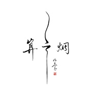

算云烟谢春花首张发行专辑
============================

|  |  |
| :--: | :-- |
| [ 算云烟谢春花首张发行专辑](https://emumo.xiami.com/album/2100292360) | **艺人**: [谢春花](../index.md) **语种**: 国语 **唱片公司**: 独立发行 **发行时间**: 2016年06月21日 **专辑类别**: 录音室专辑 **专辑风格**: 民谣 Folk, 流行 Pop, 国语流行 Mandarin Pop **播放数**: 82353369 **收藏数**: 9228 **评论数**: 335  |

## 简介

  谢春花首张个人发行原创专辑《算云烟》，专辑名取自宋词——戴复古《木兰花慢・莺啼啼不尽》中的一句“相思谩然自苦，算云烟、过眼总成空。”  
这张专辑内容为谢春花创作的诗词为主，专辑中的七词八曲、专辑设计、书法及插画都由谢春花一人包揽。整张专辑的气质是素雅，清淡的。但在风格和流派上，春花表示她并不需要刻意地去给自己的音乐贴标签或是归纳入某个流派，内心的诉说，表达出来就已足够。 

## 曲目

- [茶酒伴](./2100292360/xLGT66bc351.md)
- [借我MV](./2100292360/xLGeYqb684b.md)
- [瞬](./2100292360/U5YKAk2ba19.md)
- [荒岛](./2100292360/b1qjvEQ627c9.md)
- [还想听你的故事MV](./2100292360/mQOvOL92ff8.md)
- [我从崖边跌落](./2100292360/mQX1HS7c32f.md)
- [荏苒冬春去](./2100292360/mQXLMu71f71.md)
- [无终](./2100292360/bClbCvA43dae.md)

## 评论

|  |  |  |  |
| :-- | :-- | :-- | :-- |
|  [虾米用户](https://emumo.xiami.com/u/316604301) 向日葵盛开的夏天 2020-12-04 11:28 赞(0) 踩(0) | 
借我，还想听你的故事，我最爱。
 |
|  [虾米用户](https://emumo.xiami.com/u/15093366)  2020-09-19 23:01 赞(1) 踩(0) | 
封面很有意境，歌词写的好，曲好，唱的更是非常赞，歌手谈吐超清晰好听！
 |
|  [虾米用户](https://emumo.xiami.com/u/276944698) 不要自我设限..... 2020-09-03 13:11 赞(0) 踩(0) | 

 |
|  [虾米用户](https://emumo.xiami.com/u/404029586) 我还没想好要写什么... 2020-05-30 18:05 赞(0) 踩(0) | 
很不错的，加油
 |
|  [虾米用户](https://emumo.xiami.com/u/442480421)  2020-05-16 05:51 赞(1) 踩(0) | 
一听侧耳，再听倾心，然后单曲循环无数遍
 |
| ⇒ |  [虾米用户](https://emumo.xiami.com/u/158299074)   2021-01-09 22:55 赞(0) 踩(0) | 
我也在单曲循环 
 |
|  [虾米用户](https://emumo.xiami.com/u/264733511)  2020-04-20 12:33 赞(0) 踩(0) | 
喜欢！
 |
|  [虾米用户](https://emumo.xiami.com/u/15577171) 不同的心境，不同的音乐～... 2020-04-16 23:12 赞(0) 踩(0) | 
很棒，值得花2元买下了！
 |
|  [虾米用户](https://emumo.xiami.com/u/98418330)  2020-02-24 13:26 赞(0) 踩(0) | 
好听
 |
|  [虾米用户](https://emumo.xiami.com/u/285160677) 一生温暖纯良，不舍爱与自... 2020-02-04 19:16 赞(0) 踩(0) | 
旋律轻快活泼
 |
|  [虾米用户](https://emumo.xiami.com/u/348029871)  2020-02-02 01:01 赞(0) 踩(0) | 
跌落以后是梦还是解脱，虽然淡淡有悲伤，但却有部分希望，不悲不怆，一切都是淡淡的，很喜欢轻松的面对生活的态度和轻柔的声音，温柔内含刚毅
 |
|  [虾米用户](https://emumo.xiami.com/u/356421429)  2020-01-22 21:23 赞(0) 踩(0) | 
超好听
 |
|  [虾米用户](https://emumo.xiami.com/u/13327116) 听听歌 2020-01-11 01:02 赞(0) 踩(0) | 
删掉那首男女合唱，循环了许久，喜欢温柔又独立的声音。
 |
|  [虾米用户](https://emumo.xiami.com/u/328687618)  2019-12-22 07:24 赞(0) 踩(0) | 
美好的声音
 |
|  [虾米用户](https://emumo.xiami.com/u/329153360)  2019-11-16 19:59 赞(0) 踩(0) | 
做自己喜欢的事，写一首感心的诗。
 |
|  [虾米用户](https://emumo.xiami.com/u/11615310) 拜拜都都拜 2019-11-08 22:27 赞(0) 踩(0) | 
棒棒哒！美美哒超好听
 |
|  [虾米用户](https://emumo.xiami.com/u/350038767)  2019-11-05 04:06 赞(0) 踩(0) | 
，。
 |
|  [虾米用户](https://emumo.xiami.com/u/404137986)  2019-10-12 19:38 赞(2) 踩(0) | 
被借我的歌词惊艳到，然后就听完整张专辑，真的不错！
 |
|  [虾米用户](https://emumo.xiami.com/u/330545308) 我还没想好要写什么... 2019-10-07 21:42 赞(0) 踩(0) | 
好听。
 |
|  [虾米用户](https://emumo.xiami.com/u/13267805) 大音希声，大象无形。 2019-09-26 18:21 赞(1) 踩(0) | 
借我两元，我下来听听。
 |
|  [虾米用户](https://emumo.xiami.com/u/257900025) 我还没想好要写什么... 2019-09-18 20:33 赞(0) 踩(0) | 
我 个uta
 |
|  [虾米用户](https://emumo.xiami.com/u/402423549) 激情都在音乐里 2019-08-20 00:24 赞(0) 踩(0) | 
谢“老头儿”喜欢你的歌，清澈的声音、知性美女。
 |
|  [虾米用户](https://emumo.xiami.com/u/47664906)  2019-08-10 12:16 赞(0) 踩(0) | 
非常好！才气横溢！
 |
|  [虾米用户](https://emumo.xiami.com/u/303766701) 我还没想好要写什么... 2019-08-03 00:34 赞(0) 踩(0) | 
感觉还不错啊啊啊
 |
|  [虾米用户](https://emumo.xiami.com/u/225839532) 把生活过成你想要的样子，... 2019-07-24 20:20 赞(0) 踩(0) | 
喜欢这种风格
 |
|  [虾米用户](https://emumo.xiami.com/u/24281252)  2019-07-07 16:56 赞(0) 踩(0) | 
喜欢的歌，多年后，再听还是很有感触，谁能借我光阴。
 |
|  [虾米用户](https://emumo.xiami.com/u/22605889) 被偏爱的都有恃无恐。 2019-07-06 21:27 赞(0) 踩(0) | 
借我不惧碾压的鲜活借我生猛与莽撞不问明天借我一束光照亮黯淡借我笑颜灿烂如春天
 |
|  [虾米用户](https://emumo.xiami.com/u/190326158) 此时相望不相闻 愿逐月华... 2019-06-25 07:51 赞(0) 踩(0) | 
很喜欢的民谣风格，心情低落时、快乐时都有可以听的歌。
 |
|  [虾米用户](https://emumo.xiami.com/u/379419440)  2019-06-22 17:55 赞(0) 踩(0) | 
棒棒哒！
 |
|  [虾米用户](https://emumo.xiami.com/u/253629846) Всему своё в... 2019-06-21 08:14 赞(0) 踩(0) | 
非常不错！ 
 |
|  [虾米用户](https://emumo.xiami.com/u/198500736) 如果我们不曾相遇.... 2019-06-16 17:25 赞(0) 踩(0) | 
很棒～
 |
|  [虾米用户](https://emumo.xiami.com/u/405356893) 林中小屋，有花有草有故事... 2019-06-12 19:30 赞(2) 踩(0) | 
好
 |
|  [虾米用户](https://emumo.xiami.com/u/288909261) 学习是一个从复杂到简单的... 2019-06-11 13:15 赞(0) 踩(0) | 
很经典
 |
|  [虾米用户](https://emumo.xiami.com/u/372417646)  2019-06-10 21:29 赞(1) 踩(0) | 
谢春花的歌曲很特别，特别的很干净。继续加油
 |
|  [虾米用户](https://emumo.xiami.com/u/327618180)  2019-06-04 22:34 赞(0) 踩(0) | 
很棒，心情不好的时候可以让我开心
 |
|  [虾米用户](https://emumo.xiami.com/u/315501334)  2019-05-28 10:34 赞(0) 踩(0) | 
真的很喜欢这里面的一些歌，令人喜欢的民谣
 |
|  [虾米用户](https://emumo.xiami.com/u/3464722) 我还没想好要写什么... 2019-05-26 17:36 赞(0) 踩(0) | 
我不太听流行歌 但是这张专辑 不知道为什么
 |
|  [虾米用户](https://emumo.xiami.com/u/340827439)  2019-05-14 21:09 赞(0) 踩(0) | 
好听~
 |
|  [虾米用户](https://emumo.xiami.com/u/26830592)  真正地去爱自己，不去讨... 2019-05-10 11:06 赞(0) 踩(0) | 
就是喜欢
 |
|  [虾米用户](https://emumo.xiami.com/u/400730056)  2019-05-10 10:30 赞(0) 踩(0) | 
我觉得不错啊，偏冷淡的声音，但曲风我挺喜欢的呢
 |
|  [虾米用户](https://emumo.xiami.com/u/409028132) blibli[风月得]，... 2019-04-28 16:42 赞(1) 踩(0) | 
各位恰碗面冷静一下吧￣￣￣￣￣＼／￣￣￣￣∧＿∧;;（´・ω・）＿旦_(っ(,,[大碗宽面])＿＿|l￣l||￣しﾞしﾞ￣|i关系超好♪(p･∀･)乂(･∀･q)
 |
|  [虾米用户](https://emumo.xiami.com/u/251189149)  2019-04-23 23:33 赞(0) 踩(0) | 
很好听啊，第一次花钱买歌听嘿嘿
 |
|  [虾米用户](https://emumo.xiami.com/u/72776658)   2019-04-07 10:14 赞(1) 踩(0) | 
目前最喜欢的民谣女歌手了，歌词比较少女，歌曲是真的很不错，感觉民谣就应该是这个样子的，舒展性灵～虾米的第一张专辑贡献给谢春花 
 |
| ⇒ |  [虾米用户](https://emumo.xiami.com/u/375313830)  2019-05-11 05:17 赞(0) 踩(0) | 
我也是买的第一张专辑，支持
 |
| ⇒ |  [虾米用户](https://emumo.xiami.com/u/332477839)  2019-08-24 13:54 赞(0) 踩(0) | 
同虾米第一张专辑 
 |
|  [虾米用户](https://emumo.xiami.com/u/377827341)  2019-04-03 15:59 赞(1) 踩(0) | 
喜欢你单纯的声音总是幻想自己弹着吉他，哼唱着你的曲
 |
|  [虾米用户](https://emumo.xiami.com/u/377827341)  2019-04-03 15:59 赞(0) 踩(0) | 
喜欢你单纯的声音总是幻想自己弹着吉他，哼唱着你的曲
 |
|  [虾米用户](https://emumo.xiami.com/u/49058154)  2019-04-01 20:04 赞(0) 踩(0) | 
好听，像娓娓道来的遥远回忆。
 |
|  [虾米用户](https://emumo.xiami.com/u/334851024) 突然的突然，却一直在原地 2019-04-01 14:05 赞(0) 踩(0) | 
人生态度积极的歌手
 |
|  [虾米用户](https://emumo.xiami.com/u/422692655)  2019-04-01 11:44 赞(0) 踩(0) | 
每天开车都循环听
 |
|  [虾米用户](https://emumo.xiami.com/u/303164390)   2019-03-29 18:11 赞(0) 踩(0) | 
空灵，清澈，淡然的嗓音值得戴上耳机静静的聆听，唱功不算完美，但有一份小小的悸动
 |
|  [虾米用户](https://emumo.xiami.com/u/406859470) 我还没想好要写什么... 2019-03-26 22:16 赞(0) 踩(0) | 
挺好听的，四颗星是因为我从崖边跌落的某个曲调略撞七月上，但主歌好听
 |
|  [虾米用户](https://emumo.xiami.com/u/47444759) 我还没想好要写什么... 2019-03-24 15:03 赞(0) 踩(0) | 
借我这个首歌非常好！非常的喜欢！
 |
|  [虾米用户](https://emumo.xiami.com/u/405503483)  2019-03-23 12:01 赞(1) 踩(0) | 
春花秋月，本不是俗物，得到就是失去，干净纯粹，让耳朵恋爱，不要让我看见她，她的声音陪伴我。
 |
|  [虾米用户](https://emumo.xiami.com/u/288680066)  2019-03-23 01:05 赞(0) 踩(0) | 
喜欢淡淡的曲调和歌词
 |
|  [虾米用户](https://emumo.xiami.com/u/418698455)  2019-03-21 22:59 赞(0) 踩(0) | 
很好听
 |
|  [虾米用户](https://emumo.xiami.com/u/261160718) 决定命运的，始终都是全力... 2019-03-18 09:54 赞(0) 踩(0) | 
超棒的专辑
 |
|  [虾米用户](https://emumo.xiami.com/u/406266711) 我还没想好要写什么... 2019-03-15 23:59 赞(0) 踩(0) | 
可以听一年
 |
|  [虾米用户](https://emumo.xiami.com/u/40692549)  2019-03-12 20:33 赞(0) 踩(0) | 
大爱
 |
|  [虾米用户](https://emumo.xiami.com/u/11003181) 暂无签名~ 2019-03-11 23:12 赞(0) 踩(0) | 
和弦简明，曲风清新
 |
|  [虾米用户](https://emumo.xiami.com/u/292338904)  2019-03-11 12:19 赞(0) 踩(0) | 
念念不忘
 |
|  [虾米用户](https://emumo.xiami.com/u/403682753) 那… 2019-03-10 23:19 赞(0) 踩(0) | 
人在故事里故事在歌里
 |
|  [虾米用户](https://emumo.xiami.com/u/6780935) 黑夜里的一只小鬼 2019-03-10 23:07 赞(1) 踩(0) | 
总是让我想起一个人，想起那段时间
 |
|  [虾米用户](https://emumo.xiami.com/u/255671064)  2019-03-10 14:16 赞(0) 踩(0) | 
每天都听着这些音乐入睡
 |
|  [虾米用户](https://emumo.xiami.com/u/11098414) 我还没想好要写什么... 2019-03-10 10:28 赞(0) 踩(0) | 
好听，陪我度过了美好时光。
 |
|  [虾米用户](https://emumo.xiami.com/u/86384140)   2019-03-09 08:50 赞(0) 踩(0) | 
声音平淡，一听歌曲停不下来
 |
|  [虾米用户](https://emumo.xiami.com/u/284340007)  2019-03-08 13:53 赞(0) 踩(0) | 
这个声音，是我听过最好听的女声民谣，清新淡雅
 |
|  [虾米用户](https://emumo.xiami.com/u/91143990)  2019-03-07 21:36 赞(0) 踩(0) | 
花花的声音真好听
 |
|  [虾米用户](https://emumo.xiami.com/u/303531542)  2019-03-07 13:57 赞(0) 踩(0) | 
很棒
 |
|  [虾米用户](https://emumo.xiami.com/u/359917058)  2019-03-07 11:15 赞(0) 踩(0) | 
第一次有买专辑的欲望
 |
|  [虾米用户](https://emumo.xiami.com/u/260091155)  2019-03-07 00:56 赞(1) 踩(0) | 
第一个想花钱买的专辑，真的
 |
|  [虾米用户](https://emumo.xiami.com/u/212932216)  2019-03-06 16:04 赞(0) 踩(0) | 
唱出了赤子之声，平凡的节奏掩饰不住才气，又带着少女的温馨。
 |
|  [虾米用户](https://emumo.xiami.com/u/334648625) 新的生活，随机应变。 2019-03-02 19:27 赞(0) 踩(0) | 
好听喜欢
 |
|  [虾米用户](https://emumo.xiami.com/u/281239551)  2019-02-27 17:29 赞(0) 踩(0) | 
很喜欢歌词，很喜欢调子，每一首都很喜欢
 |
|  [虾米用户](https://emumo.xiami.com/u/338533488)  2019-02-26 22:30 赞(0) 踩(0) | 
一万遍都听不够
 |
|  [虾米用户](https://emumo.xiami.com/u/43445504)  2019-02-25 22:03 赞(0) 踩(0) | 
声音很好听，但是歌曲没有故事。
 |
|  [虾米用户](https://emumo.xiami.com/u/351892938) 我还没想好要写什么... 2019-02-22 21:31 赞(0) 踩(0) | 
好听。喜欢。
 |
|  [虾米用户](https://emumo.xiami.com/u/351892938) 我还没想好要写什么... 2019-02-22 21:30 赞(0) 踩(0) | 
心に響く素晴らしい作品
 |
|  [虾米用户](https://emumo.xiami.com/u/50511706) 看到你听到的 2019-02-21 22:05 赞(0) 踩(0) | 
感谢听到，遇到你。
 |
|  [虾米用户](https://emumo.xiami.com/u/298208527) 故君子事来而心始现，事去... 2019-02-21 20:45 赞(0) 踩(0) | 
空山新雨后！
 |
|  [虾米用户](https://emumo.xiami.com/u/147870548) 拉小提听古典爱生活的机械... 2019-02-20 16:18 赞(2) 踩(0) | 
知非的声音清澈，干净，直击内心。搞音乐的人往往都会有一个丰富多彩的内心世界和一个敏感有趣的灵魂，知非也不例外，一个有故事的女同学
 |
|  [虾米用户](https://emumo.xiami.com/u/188157379) 你叫什么名字，你要去哪里... 2019-02-20 11:32 赞(0) 踩(0) | 
我喜欢你的风格
 |
|  [虾米用户](https://emumo.xiami.com/u/336525432) 我喜欢你让我心动的感觉 2019-02-17 15:29 赞(0) 踩(0) | 
很喜欢春花小姐姐，很棒，很好听
 |
|  [虾米用户](https://emumo.xiami.com/u/357677037)  2019-02-17 04:23 赞(1) 踩(0) | 
69年大叔，很喜欢这个这个才华横溢的年轻音乐人。朋友帮我买了一盘最新专辑点心，有机会还是要把算云烟也买来。
 |
|  [虾米用户](https://emumo.xiami.com/u/296463661)  2019-02-14 07:59 赞(0) 踩(0) | 
❤️春花
 |
|  [虾米用户](https://emumo.xiami.com/u/418339468)  2019-02-10 20:06 赞(0) 踩(0) | 
不错
 |
|  [虾米用户](https://emumo.xiami.com/u/294112819) 除你以外 别无拯救 ✞ ... 2019-02-09 21:24 赞(0) 踩(0) | 
永远支持春花 淡淡的美好的歌声
 |
|  [虾米用户](https://emumo.xiami.com/u/266210877) 但行前路 2019-02-08 21:41 赞(0) 踩(0) | 
专辑里的歌大多词都非常好，配上春花的演唱，感觉很有故事，第一眼看到词的时候就喜欢上了里面的歌。比心
 |
|  [虾米用户](https://emumo.xiami.com/u/321682881)  2019-02-02 21:58 赞(0) 踩(0) | 
好听
 |
|  [虾米用户](https://emumo.xiami.com/u/349049628) 偶是天蝎座的 2019-02-01 00:46 赞(0) 踩(0) | 
还不能达经典之作。但是慢慢咀嚼，别有一番风味。
 |
|  [虾米用户](https://emumo.xiami.com/u/190326158) 此时相望不相闻 愿逐月华... 2019-01-30 12:57 赞(0) 踩(0) | 
算云烟的“云”字下半部分好像“了”，感觉就像在说算了
 |
|  [虾米用户](https://emumo.xiami.com/u/377411391) 说你，爱喔 2019-01-18 13:44 赞(0) 踩(0) | 
还好吧！！！
 |
|  [虾米用户](https://emumo.xiami.com/u/267517259) 超级无敌大美女哈哈哈 2019-01-17 10:32 赞(0) 踩(0) | 
不错
 |
|  [虾米用户](https://emumo.xiami.com/u/267517259) 超级无敌大美女哈哈哈 2019-01-17 10:30 赞(0) 踩(0) | 
赞
 |
|  [虾米用户](https://emumo.xiami.com/u/411958773)  2019-01-07 10:26 赞(1) 踩(0) | 
安适的清晨与傍晚
 |
|  [虾米用户](https://emumo.xiami.com/u/1024746) 灵魂不该屈服 2018-10-18 17:47 赞(3) 踩(0) | 
2元，简直良心
 |
|  [虾米用户](https://emumo.xiami.com/u/250251262) 随心随意随喜 2018-09-30 19:44 赞(0) 踩(0) | 
购买以后，还是下载不了最高音质，郁闷
 |
|  [虾米用户](https://emumo.xiami.com/u/366253122) 我还没想好要写什么... 2018-09-26 16:11 赞(0) 踩(0) | 
春风十里，花香满园。
 |
|  [虾米用户](https://emumo.xiami.com/u/402372032)  2018-08-22 14:31 赞(1) 踩(0) | 
天南地北，春花最美
 |
|  [虾米用户](https://emumo.xiami.com/u/344466345)  2018-08-07 20:09 赞(0) 踩(0) | 
经过一段短暂的迷失和混乱，尘归尘 海归海，去听那些该听的人唱该听的歌
 |
|  [虾米用户](https://emumo.xiami.com/u/380210773)  2018-07-31 10:40 赞(0) 踩(0) | 
好听好听，终于又有好听的歌了
 |
|  [虾米用户](https://emumo.xiami.com/u/356139920) 散入天际者，心自冥生。 2018-05-14 22:41 赞(0) 踩(0) | 
我爱这声音！
 |
|  [虾米用户](https://emumo.xiami.com/u/214969068)  2018-05-14 08:21 赞(0) 踩(0) | 
继李雨之后第二位❤
 |
|  [虾米用户](https://emumo.xiami.com/u/57326660)  2018-03-28 16:07 赞(0) 踩(0) | 
很喜欢
 |
|  [虾米用户](https://emumo.xiami.com/u/6634770) 因为我来自风的故乡 2018-01-11 20:54 赞(3) 踩(0) | 
写词有侠气，唱起歌来音色也有侠气。
 |
|  [虾米用户](https://emumo.xiami.com/u/322520177)  2018-01-04 22:11 赞(3) 踩(0) | 
2017年度歌单，6首出自这张专辑，这张专辑是我买的第一张专辑，也是我目前买的唯一一张专辑  
 |
|  [虾米用户](https://emumo.xiami.com/u/27637184) 只爱女声 2017-12-08 14:48 赞(3) 踩(0) | 
真心好听！！好听！！以前喜欢程璧喜欢陈绮贞喜欢田源喜欢有耳非文&amp;hellip;&amp;hellip;好久没听到这么好听的声音和歌词了
 |
|  [虾米用户](https://emumo.xiami.com/u/5007587) 圣光风暴 2017-11-21 23:50 赞(2) 踩(0) | 
不错哦，就是唱得有些&amp;ldquo;稚嫩&amp;rdquo;。不知道这么形容对不对。一时想不起合适的词句。 
 |
| ⇒ |  [虾米用户](https://emumo.xiami.com/u/335022838) 春暖秋凉仿佛一瞬间 2018-01-04 02:49 赞(0) 踩(0) | 
就是不想听成熟的，，嘿嘿，知非如果改变唱法，那她就完了
 |
| ⇒ |  [虾米用户](https://emumo.xiami.com/u/182431948)  2018-01-14 10:23 赞(0) 踩(0) | 
听着词，会是稚嫩嘛&amp;hellip;&amp;hellip;
 |
|  [虾米用户](https://emumo.xiami.com/u/225513840)  2017-11-08 12:07 赞(1) 踩(0) | 
清雅，请坚持
 |
|  [虾米用户](https://emumo.xiami.com/u/15848890) 灯火如琥珀，沉香色的温情... 2017-10-27 23:39 赞(3) 踩(0) | 
相比于程璧的曲风而言，这位谢才女显得更会接地气的讲故事。素雅和清淡的感觉，怀着很平和的心情，就听完了所有。细腻的歌词以及干净的声音，即使逃不出同质化的怪圈，也会让耳朵很舒服。其实，中国很多歌手需要被更多的人知晓，只不过标志性的音乐排行榜真是个硬伤。
 |
|  [虾米用户](https://emumo.xiami.com/u/7524706) 我还没想好要写什么... 2017-10-25 18:01 赞(0) 踩(0) | 
听现场喜欢上的
 |
|  [虾米用户](https://emumo.xiami.com/u/1239591)  2017-10-14 21:23 赞(0) 踩(0) | 
质感，性感的声音，想起逝去如指间沙……
 |
|  [虾米用户](https://emumo.xiami.com/u/306013923) 生命再长不过烟花落下了眼... 2017-10-14 20:06 赞(2) 踩(0) | 
借我你的故事，我还想听
 |
|  [虾米用户](https://emumo.xiami.com/u/253910448) 我就是我，普普通通的我。 2017-10-05 00:39 赞(1) 踩(0) | 
好想听你和毛不易一起唱歌，突如其来的想法&amp;hellip;&amp;hellip;
 |
|  [虾米用户](https://emumo.xiami.com/u/325494949) 一个喜欢民谣的人儿~ 2017-10-04 19:36 赞(2) 踩(0) | 
感觉每一首歌都有一个故事，你美妙的声音，让我情不自禁沉浸在你的故事里。。。我想我真的喜欢你的歌，我想听你的故事。。。
 |
|  [虾米用户](https://emumo.xiami.com/u/234639149)  2017-10-03 22:05 赞(0) 踩(0) | 
赞
 |
|  [虾米用户](https://emumo.xiami.com/u/314043723)  2017-09-28 17:02 赞(1) 踩(0) | 
好听
 |
|  [虾米用户](https://emumo.xiami.com/u/9839594) 摇滚老头 2017-09-23 08:13 赞(0) 踩(0) | 
婉约派文艺民谣，如果二十年前听到，我一定会爱上这样一个春花烂漫的女子 
 |
| ⇒ |  [虾米用户](https://emumo.xiami.com/u/182431948)  2018-01-14 10:24 赞(0) 踩(0) | 
哈哈哈
 |
|  [虾米用户](https://emumo.xiami.com/u/285970304) 藍蝶 2017-09-23 04:16 赞(0) 踩(0) | 
好聽
 |
|  [虾米用户](https://emumo.xiami.com/u/343778)  2017-09-18 22:32 赞(0) 踩(0) | 
借我，好听
 |
|  [虾米用户](https://emumo.xiami.com/u/322599465)  2017-08-31 14:51 赞(0) 踩(0) | 
民谣
 |
|  [虾米用户](https://emumo.xiami.com/u/3403694)  2017-08-30 09:37 赞(0) 踩(0) | 
借我。。。。。一开口就喜欢的声音~
 |
|  [虾米用户](https://emumo.xiami.com/u/15922544) 转战网易云了 2017-08-27 21:36 赞(3) 踩(0) | 
词曲唱作甚至封面都独立完成，春花不简单
 |
|  [虾米用户](https://emumo.xiami.com/u/18256173) Let's go par... 2017-08-07 13:21 赞(0) 踩(0) | 
让人听了，心里很平静
 |
|  [虾米用户](https://emumo.xiami.com/u/262806582) 我的梦别破 2017-08-05 11:55 赞(0) 踩(0) | 
如果有无损就好了
 |
|  [虾米用户](https://emumo.xiami.com/u/291867135)  2017-07-22 11:29 赞(1) 踩(0) | 
这个专辑里面八首歌有六首歌我都觉得非常好听~~
 |
|  [虾米用户](https://emumo.xiami.com/u/13808872) Subtle varia... 2017-07-17 10:53 赞(0) 踩(0) | 
清晨，夜路，苦酒，耳畔不絕。
 |
|  [虾米用户](https://emumo.xiami.com/u/9030340) 我还没想好要写什么... 2017-07-15 15:23 赞(0) 踩(0) | 
这张专辑的歌全收藏了！好好听！！
 |
|  [虾米用户](https://emumo.xiami.com/u/41622362) 我想好要写什么了…不告诉... 2017-07-14 06:55 赞(0) 踩(0) | 
有幸在成都旅行的时候听了她的一场演唱会，感觉现场的音色更棒！
 |
|  [虾米用户](https://emumo.xiami.com/u/308544794)  2017-07-05 21:04 赞(0) 踩(0) | 
我好喜欢这首歌唉
 |
|  [虾米用户](https://emumo.xiami.com/u/2889513)  2017-07-05 19:11 赞(0) 踩(0) | 
借我！听得单曲循环不敢听还要单曲循环。
 |
|  [虾米用户](https://emumo.xiami.com/u/298321810)  2017-06-30 08:42 赞(1) 踩(0) | 
静看光阴荏苒，借我喑哑无言&amp;hellip;&amp;hellip;
 |
|  [虾米用户](https://emumo.xiami.com/u/130910582) 我还没想好要写什么... 2017-06-27 14:56 赞(0) 踩(0) | 
过往如烟，风吹即散，珍重？
 |
|  [虾米用户](https://emumo.xiami.com/u/306166863)  2017-06-22 16:08 赞(0) 踩(0) | 
真的很棒超级用心
 |
|  [虾米用户](https://emumo.xiami.com/u/33575866)  2017-06-15 14:59 赞(1) 踩(0) | 
无意挑了张专辑，有种捡到宝的感觉！
 |
|  [虾米用户](https://emumo.xiami.com/u/53737632)  2017-06-14 07:14 赞(1) 踩(0) | 
为啥买了以后也没有无损听，不是VIP 难道买了也没用?
 |
|  [虾米用户](https://emumo.xiami.com/u/234727906) (˶‾᷄ ⁻̫ ‾᷅˵) 2017-06-06 21:44 赞(0) 踩(0) | 
春花花  除了五月天 秒秒钟买专辑的宠爱 
 |
|  [虾米用户](https://emumo.xiami.com/u/23549802)  2017-06-05 20:18 赞(0) 踩(0) | 
支付宝支付失败~~~
 |
|  [虾米用户](https://emumo.xiami.com/u/8384844)  2017-06-05 16:20 赞(0) 踩(0) | 
挺不错的 听完借我就喜欢上了 一看还不贵 很棒
 |
|  [虾米用户](https://emumo.xiami.com/u/262237613) ll 2017-05-31 16:10 赞(1) 踩(0) | 
爱你 谢春花
 |
|  [虾米用户](https://emumo.xiami.com/u/259323437) 逃避自由 2017-05-28 23:11 赞(0) 踩(0) | 
为什么在网易会员就能听无损，在虾米买了专辑也只能听HQ
 |
|  [虾米用户](https://emumo.xiami.com/u/294529862)  2017-05-23 23:15 赞(0) 踩(0) | 
好！！！
 |
|  [虾米用户](https://emumo.xiami.com/u/56468888)  2017-05-19 10:08 赞(0) 踩(0) | 
好听啊
 |
|  [虾米用户](https://emumo.xiami.com/u/296528009)  2017-05-15 13:30 赞(0) 踩(0) | 
算云烟，购买怎么会听不了
 |
|  [虾米用户](https://emumo.xiami.com/u/203875171)  2017-05-10 23:19 赞(0) 踩(0) | 
喜欢
 |
|  [虾米用户](https://emumo.xiami.com/u/294449588)  2017-05-07 03:39 赞(0) 踩(0) | 
hao ting
 |
|  [虾米用户](https://emumo.xiami.com/u/1725996) move on 2017-04-25 22:29 赞(1) 踩(0) | 
与这个世界平静相处的声音
 |
|  [虾米用户](https://emumo.xiami.com/u/38662483)  2017-04-18 13:28 赞(0) 踩(0) | 
貌似这个专辑适合冬天听
 |
|  [虾米用户](https://emumo.xiami.com/u/219335462)  2017-04-15 12:15 赞(1) 踩(0) | 
意外惊喜，很喜欢这种接地气的唱法
 |
|  [虾米用户](https://emumo.xiami.com/u/1487055) 6688 2017-04-14 07:42 赞(0) 踩(0) | 
trtrtryr
 |
|  [虾米用户](https://emumo.xiami.com/u/287574438)  2017-04-10 23:18 赞(0) 踩(0) | 
歌都还可以
 |
|  [虾米用户](https://emumo.xiami.com/u/285819090)   2017-04-09 09:10 赞(0) 踩(0) | 
安安静静的纯净
 |
|  [虾米用户](https://emumo.xiami.com/u/3904138)  2017-04-04 14:36 赞(0) 踩(0) | 
专辑质量很高，支持支持
 |
|  [虾米用户](https://emumo.xiami.com/u/250642624)  2017-04-02 16:07 赞(1) 踩(0) | 
借我安适的清晨与傍晚
 |
|  [虾米用户](https://emumo.xiami.com/u/3470196)  2017-03-28 16:33 赞(1) 踩(0) | 
好听好听好听 
 |
|  [虾米用户](https://emumo.xiami.com/u/282877051)  2017-03-24 10:52 赞(0) 踩(0) | 
folk
 |
|  [虾米用户](https://emumo.xiami.com/u/282693835)  2017-03-23 16:24 赞(0) 踩(0) | 
诗一般的专辑，声线真是超级好听，就像在讲故事，娓娓道来不急不缓。浑身都舒服
 |
|  [虾米用户](https://emumo.xiami.com/u/282513881)  2017-03-22 20:33 赞(0) 踩(0) | 
挺喜欢
 |
|  [虾米用户](https://emumo.xiami.com/u/281895659)  2017-03-21 20:33 赞(1) 踩(0) | 
歌词不错声音很赞
 |
|  [虾米用户](https://emumo.xiami.com/u/228843687) 懒惰统治人间 2017-03-16 12:42 赞(0) 踩(0) | 
耶！我是头号粉丝！抑制不住的欢喜！
 |
|  [虾米用户](https://emumo.xiami.com/u/260741230) 没有感同身受 只有问心无... 2017-03-10 12:44 赞(0) 踩(0) | 
我的道理就是道理自信等于自负nothing can beat my dream
 |
|  [虾米用户](https://emumo.xiami.com/u/41417123) 我是双鱼，我什么都信 2017-03-06 15:10 赞(2) 踩(0) | 
好干净的声音~ 喜欢
 |
|  [虾米用户](https://emumo.xiami.com/u/12730895) 不要离开！ 2017-03-06 13:07 赞(0) 踩(0) | 
现在已经听不来这种歌了。
 |
|  [虾米用户](https://emumo.xiami.com/u/263192682)  2017-03-01 22:25 赞(0) 踩(0) | 
很舒服，听起来很放松，世界只剩下这空灵的声音，入手CD
 |
|  [虾米用户](https://emumo.xiami.com/u/50916164) Through earl... 2017-03-01 20:40 赞(0) 踩(0) | 
去京东，买专辑 
 |
|  [虾米用户](https://emumo.xiami.com/u/22662)  2017-02-22 22:04 赞(0) 踩(0) | 
很喜欢这个声音
 |
|  [虾米用户](https://emumo.xiami.com/u/275018633) 对自己承诺 2017-02-21 08:19 赞(0) 踩(0) | 
昨天刚知道这歌手，心空空，借我都喜欢，其他还要好好听一下～～支持，加油！！！
 |
|  [虾米用户](https://emumo.xiami.com/u/9016934)  2017-02-21 00:22 赞(3) 踩(0) | 
好听，但是整张专辑风格过于一致了，曲词类似的太多，民谣现在最常见的问题就是好像有味道但是好像味道都一样 
 |
|  [虾米用户](https://emumo.xiami.com/u/266289912)  2017-02-15 14:58 赞(0) 踩(0) | 

 |
|  [虾米用户](https://emumo.xiami.com/u/273058133)  2017-02-13 21:27 赞(0) 踩(0) | 
词曲均极美
 |
|  [虾米用户](https://emumo.xiami.com/u/24969081) 侬今葬花人笑痴，他年葬侬... 2017-02-12 14:56 赞(0) 踩(0) | 
支持有灵气和不一样的声音
 |
|  [虾米用户](https://emumo.xiami.com/u/263474085)  2017-02-08 14:48 赞(1) 踩(0) | 
为啥虾米的vip不能直接下。。
 |
| ⇒ |  [虾米用户](https://emumo.xiami.com/u/207432647)  2017-02-08 20:20 赞(0) 踩(0) | 
虾米的vip啥都买不了，妈的
 |
|  [虾米用户](https://emumo.xiami.com/u/4400366) 再也不见 2017-01-30 04:26 赞(0) 踩(0) | 
囍
 |
|  [虾米用户](https://emumo.xiami.com/u/81050860) 向往宁静，向往平和，偶尔... 2017-01-26 13:36 赞(1) 踩(0) | 
清澈见底的声音，适合阳光明媚的下午！
 |
|  [虾米用户](https://emumo.xiami.com/u/185846986)  2017-01-15 16:43 赞(1) 踩(0) | 
现在可以买整张数字转了只用2元。很喜欢借我。还有茶酒伴
 |
| ⇒ |  [虾米用户](https://emumo.xiami.com/u/103460004)   2017-02-09 12:12 赞(0) 踩(0) | 
我也喜欢这两首。尤其借我
 |
|  [虾米用户](https://emumo.xiami.com/u/4173947)  2017-01-11 15:42 赞(0) 踩(0) | 
买张专辑支持一下！继续加油！
 |
|  [虾米用户](https://emumo.xiami.com/u/254698695)  2017-01-09 18:58 赞(0) 踩(0) | 
很喜欢这种淡淡的舒适的节奏
 |
|  [虾米用户](https://emumo.xiami.com/u/247696064)  2017-01-05 14:28 赞(1) 踩(0) | 
越听越喜欢，非常喜欢你的声音，真的爱上你的歌了，这本专辑非常喜欢
 |
|  [虾米用户](https://emumo.xiami.com/u/239483788) 有几个喜欢的明星运动员，... 2017-01-01 13:11 赞(1) 踩(0) | 
借我让我喜欢上了谢春花的歌
 |
|  [虾米用户](https://emumo.xiami.com/u/255380929)   2016-12-30 22:00 赞(0) 踩(0) | 
可以
 |
|  [虾米用户](https://emumo.xiami.com/u/256511101)  2016-12-30 19:59 赞(0) 踩(0) | 
好喜欢这种安静又不失灵动的声音
 |
|  [虾米用户](https://emumo.xiami.com/u/255369051)  2016-12-30 18:30 赞(0) 踩(0) | 
この声このリズムは素敵だ！そして聞いてよく眠れます。
 |
|  [虾米用户](https://emumo.xiami.com/u/957383)  2016-12-29 20:15 赞(0) 踩(0) | 
求实体CD一张 136.1070.2661
 |
|  [虾米用户](https://emumo.xiami.com/u/131285) 选择音乐，选择生活。 2016-12-08 23:44 赞(0) 踩(0) | 
这么好听的
 |
|  [虾米用户](https://emumo.xiami.com/u/188157379) 你叫什么名字，你要去哪里... 2016-12-01 15:20 赞(2) 踩(0) | 
这歌词写的好，感觉就在阴天。这样的风格是对的，不喜欢的别说，我们是文艺饭
 |
|  [虾米用户](https://emumo.xiami.com/u/247491756)  2016-11-22 22:53 赞(0) 踩(0) | 
一张专辑
 |
|  [虾米用户](https://emumo.xiami.com/u/43135317) 别做空想家！ 2016-11-14 23:06 赞(0) 踩(0) | 
喜欢喜欢
 |
|  [虾米用户](https://emumo.xiami.com/u/128858086) 所有精选集持更中 2016-10-28 23:48 赞(0) 踩(0) | 
～～～
 |
|  [虾米用户](https://emumo.xiami.com/u/94164002)  2016-10-28 13:13 赞(0) 踩(0) | 
好听。
 |
|  [虾米用户](https://emumo.xiami.com/u/13150277) 心悦君兮 2016-10-23 22:38 赞(1) 踩(0) | 
每一首我都想花钱买然后下载循环听   
 |
|  [虾米用户](https://emumo.xiami.com/u/75740048)  2016-10-22 20:40 赞(0) 踩(0) | 
good
 |
|  [虾米用户](https://emumo.xiami.com/u/206454226)   2016-10-16 01:32 赞(0) 踩(0) | 
支持
 |
|  [虾米用户](https://emumo.xiami.com/u/31832) Au revoir 2016-10-08 14:04 赞(0) 踩(0) | 
突然有一种安静的力量
 |
|  [虾米用户](https://emumo.xiami.com/u/45298985) Wechat:dqx19... 2016-10-04 09:40 赞(0) 踩(0) | 
+
 |
|  [虾米用户](https://emumo.xiami.com/u/228101226)  2016-09-26 16:20 赞(0) 踩(0) | 
很好，支持
 |
|  [虾米用户](https://emumo.xiami.com/u/228101226)  2016-09-26 16:18 赞(0) 踩(0) | 
不错
 |
|  [虾米用户](https://emumo.xiami.com/u/24747331)   2016-09-22 11:24 赞(0) 踩(0) | 
封面可以。
 |
|  [虾米用户](https://emumo.xiami.com/u/43135317) 别做空想家！ 2016-09-21 13:43 赞(0) 踩(0) | 
喜欢
 |
|  [虾米用户](https://emumo.xiami.com/u/27141229) 乱活一气 2016-09-21 09:18 赞(2) 踩(0) | 
我的天呐这张专辑也太好听了
 |
|  [虾米用户](https://emumo.xiami.com/u/227968745)  2016-09-19 13:27 赞(1) 踩(0) | 
词曲皆好
 |
| ⇒ |  [虾米用户](https://emumo.xiami.com/u/228101226)  2016-09-26 16:21 赞(0) 踩(0) | 
说对了
 |
|  [虾米用户](https://emumo.xiami.com/u/89959212)  2016-09-14 19:36 赞(15) 踩(0) | 
简单的风格，入心的词曲静静地聆听，慢慢的感受
 |
|  [虾米用户](https://emumo.xiami.com/u/98030410) 愿你有梦为马 随处可栖 2016-09-08 11:41 赞(1) 踩(0) | 
很喜欢
 |
|  [虾米用户](https://emumo.xiami.com/u/719995) 事出有音 2016-09-01 22:04 赞(0) 踩(0) | 
讨喜嘛，有些东西不必深究
 |
|  [虾米用户](https://emumo.xiami.com/u/217863993)  2016-08-27 20:06 赞(0) 踩(0) | 
在烊说了之后，好多人来搜，之后就全部付费了
 |
|  [虾米用户](https://emumo.xiami.com/u/40599007)  2016-08-24 23:22 赞(1) 踩(0) | 
清新民谣
 |
|  [虾米用户](https://emumo.xiami.com/u/43070117)  2016-08-24 21:39 赞(0) 踩(0) | 
转瞬之间忽见恍若隔世你的脸
 |
|  [虾米用户](https://emumo.xiami.com/u/187222402) 我喜欢的人都是帅比 2016-08-24 09:51 赞(1) 踩(0) | 
很喜欢 尤其是词和调很搭 可以听很久
 |
|  [虾米用户](https://emumo.xiami.com/u/179341984)   2016-08-14 11:11 赞(2) 踩(0) | 
借我说的出口的旦旦誓言
 |
|  [虾米用户](https://emumo.xiami.com/u/41819153)  2016-08-11 16:15 赞(1) 踩(0) | 
喜欢，这个女孩儿一定会火起来的
 |
|  [虾米用户](https://emumo.xiami.com/u/6736254) 想要得不到 2016-08-09 10:09 赞(0) 踩(0) | 
好好听。
 |
|  [虾米用户](https://emumo.xiami.com/u/2280376)  2016-08-08 20:12 赞(2) 踩(0) | 
三周年我们千玺提到这张专辑里的两首歌，听了以后发现整张都特别好听，感觉离你又近了一点，心里特别温柔善良的小孩 @TFBOYS-易烊千玺
 |
| ⇒ |  [虾米用户](https://emumo.xiami.com/u/202718322)  2016-08-10 16:56 赞(0) 踩(0) | 
对对对 
 |
|  [虾米用户](https://emumo.xiami.com/u/43960970)  2016-08-05 11:56 赞(1) 踩(0) | 
要的就是这个调调啊
 |
|  [虾米用户](https://emumo.xiami.com/u/200818012)  2016-07-28 11:01 赞(3) 踩(0) | 
我觉得很不错啊，萝卜青菜各有所爱，没必要把别人说的那么普通，好像和自己唱的差不多一样。
 |
|  [虾米用户](https://emumo.xiami.com/u/4415874)   2016-07-25 10:49 赞(0) 踩(0) | 
借我片刻安闲，借我心无挂念
 |
|  [虾米用户](https://emumo.xiami.com/u/10111261)  2016-07-24 17:11 赞(101) 踩(0) | 
不管别人怎么说， 《借我》《我从崖边跌落》《还想听你的故事》，是真的一开口就让我爱上了这个姑娘。
 |
| ⇒ |  [虾米用户](https://emumo.xiami.com/u/78251868)   2017-01-10 19:54 赞(0) 踩(0) | 
和我喜欢的一样  后来又喜欢上不如茶相伴
 |
| ⇒ |  [虾米用户](https://emumo.xiami.com/u/428480309)  2020-05-02 23:38 赞(0) 踩(0) | 
<q><b>Doris说：</b></q>
 |
|  [虾米用户](https://emumo.xiami.com/u/123508532)  2016-07-23 08:42 赞(0) 踩(0) | 
dfsfd
 |
|  [虾米用户](https://emumo.xiami.com/u/199863003)   2016-07-18 15:55 赞(0) 踩(0) | 
干净的声音，舒缓的曲调
 |
|  [虾米用户](https://emumo.xiami.com/u/199863003)   2016-07-18 15:55 赞(1) 踩(0) | 
干净的声音，舒缓的曲调
 |
|  [虾米用户](https://emumo.xiami.com/u/2714150) 我还没想好要写什么... 2016-07-18 01:43 赞(0) 踩(0) | 
就不能整张专辑买？一首歌一首歌买麻不麻烦
 |
|  [虾米用户](https://emumo.xiami.com/u/3316952)  2016-07-14 14:55 赞(32) 踩(0) | 
现在民谣歌手真的很多。又要有唱功又要有特色。真的很难取悦所有人。至少听了几首下来，我觉得这应该就是她本来的样子。专辑的风格本来就是素雅。所以比较平淡，也是正常。喜欢那首合唱。很有爱！
 |
|  [虾米用户](https://emumo.xiami.com/u/492319)  2016-07-11 16:14 赞(0) 踩(0) | 
柔弱的小心脏不小心中箭 单曲循环中~
 |
|  [虾米用户](https://emumo.xiami.com/u/5471019)  2016-07-10 01:09 赞(0) 踩(0) | 
年纪同，好古字，倚安宁。怎能不共鸣
 |
|  [虾米用户](https://emumo.xiami.com/u/198717374) 书写感动自己的音乐！ 2016-07-08 16:31 赞(14) 踩(0) | 
非常喜欢，并有所感动，这已足够。准备去买张cd。个人认为，不可能每个人都喜欢，物以类聚，人以群分，得到部分人的欣赏，我觉得就已足够。加油！
 |
|  [虾米用户](https://emumo.xiami.com/u/189222256) 哎哟~这个人很懒什么也没... 2016-07-07 19:19 赞(0) 踩(0) | 

 |
|  [虾米用户](https://emumo.xiami.com/u/198138232)  2016-07-07 15:49 赞(1) 踩(0) | 
无意中听了《借我》，喜欢简洁的专辑封面，喜欢安静的声音。
 |
|  [虾米用户](https://emumo.xiami.com/u/27194749)  2016-07-05 18:35 赞(0) 踩(0) | 
推荐借我
 |
|  [虾米用户](https://emumo.xiami.com/u/15107919) 音乐人最希望有知音 2016-07-05 10:57 赞(1) 踩(0) | 
唱功，音色确实不行，不过对于有文艺病的孩子们可能比较喜欢吧~
 |
|  [虾米用户](https://emumo.xiami.com/u/45403338)  2016-07-05 09:29 赞(3) 踩(0) | 
挑不出毛病，说唱功不好的建议去听韩红和那英
 |
|  [虾米用户](https://emumo.xiami.com/u/127606270)  2016-07-03 11:03 赞(2) 踩(0) | 
期待很高，失望很大。
 |
|  [虾米用户](https://emumo.xiami.com/u/12009507) 一步步完成最美残缺。 2016-07-01 23:15 赞(0) 踩(0) | 
翻看了你的信息 已经被圈得死死的了 啊啊啊
 |
|  [虾米用户](https://emumo.xiami.com/u/35167460) La vie elle ... 2016-06-30 20:16 赞(0) 踩(0) | 
名字都这么诗
 |
|  [虾米用户](https://emumo.xiami.com/u/1220462) 看看这个世界 2016-06-30 19:13 赞(0) 踩(0) | 
被歌手名字吸引.......（我不是黑子）
 |
|  [虾米用户](https://emumo.xiami.com/u/3289740)  2016-06-30 18:21 赞(0) 踩(0) | 
荒岛吉他旋律好像田馥甄的爱着爱着就永远，我在涯边坠落，借我还是很好听的
 |
|  [虾米用户](https://emumo.xiami.com/u/41656616) 风 2016-06-30 09:29 赞(0) 踩(0) | 
个人有个人的见解，我觉得蛮不错的
 |
|  [虾米用户](https://emumo.xiami.com/u/95636148) 我是人民，国家为我服务 2016-06-29 22:18 赞(0) 踩(0) | 
让我想起曾经的那英
 |
|  [虾米用户](https://emumo.xiami.com/u/716227)  2016-06-29 13:27 赞(1) 踩(0) | 
也是一股清流啊
 |
|  [虾米用户](https://emumo.xiami.com/u/3123403)  2016-06-29 01:09 赞(1) 踩(0) | 
有种器乐喧宾夺主的感觉……
 |
|  [虾米用户](https://emumo.xiami.com/u/131882754) 。 2016-06-28 20:25 赞(0) 踩(0) | 
自从要钱就再也没听过了……
 |
|  [虾米用户](https://emumo.xiami.com/u/478527) 好想跟衣服在洗衣机里滚 2016-06-28 18:44 赞(2) 踩(0) | 
荒岛可听，整张一般，给几个热评点了赞
 |
|  [虾米用户](https://emumo.xiami.com/u/478527) 好想跟衣服在洗衣机里滚 2016-06-28 18:44 赞(0) 踩(0) | 
荒岛可听，整张一般，给几个热评点了赞
 |
|  [虾米用户](https://emumo.xiami.com/u/626311) 我还没想好要写什么... 2016-06-28 15:14 赞(4) 踩(0) | 
没觉得唱功有问题，民谣歌手的嗓子要干净才好，整张专辑的风格好，被捧也不意外。
 |
|  [虾米用户](https://emumo.xiami.com/u/950433)  2016-06-28 13:18 赞(0) 踩(0) | 
谁把岁月蹉跎，谁心已成魔……
 |
|  [虾米用户](https://emumo.xiami.com/u/950433)  2016-06-28 13:10 赞(0) 踩(0) | 
我从崖边跌落，落入星空辽阔
 |
|  [虾米用户](https://emumo.xiami.com/u/1549842)  2016-06-28 13:03 赞(0) 踩(0) | 
中意女声。
 |
|  [虾米用户](https://emumo.xiami.com/u/178522282)  2016-06-28 12:59 赞(1) 踩(0) | 
唱功有待提升。。。。陈粒  程碧都可以分分钟秒杀这位姑娘～专辑封面倒是666
 |
|  [虾米用户](https://emumo.xiami.com/u/184632638)   2016-06-28 10:45 赞(0) 踩(0) | 
旋律不错！
 |
|  [虾米用户](https://emumo.xiami.com/u/35981522)   2016-06-28 06:53 赞(0) 踩(0) | 
现在都要单曲付费了，那付月费干嘛？
 |
|  [虾米用户](https://emumo.xiami.com/u/8657273)  2016-06-27 23:44 赞(1) 踩(0) | 
单曲循环《借我》中
 |
|  [虾米用户](https://emumo.xiami.com/u/194649434) 我爱吃屎 2016-06-27 23:25 赞(1) 踩(0) | 
封面很好，而且感觉这期专辑是最有内涵，最清澈的
 |
|  [虾米用户](https://emumo.xiami.com/u/30648067) 聪明的家伙是我偏不留下 2016-06-27 21:52 赞(0) 踩(0) | 
第一千个收藏
 |
|  [虾米用户](https://emumo.xiami.com/u/90906430)   2016-06-27 20:54 赞(0) 踩(0) | 
很干净的声音
 |
|  [虾米用户](https://emumo.xiami.com/u/168368) 原谅我渐渐少去的问候 2016-06-27 19:54 赞(1) 踩(0) | 
感觉不错啊，就喜欢这么淡淡的感觉。茶酒伴很棒。
 |
|  [虾米用户](https://emumo.xiami.com/u/188300651) yo～ 2016-06-27 19:47 赞(0) 踩(0) | 
歌词写得很好～声音也蛮好听
 |
|  [虾米用户](https://emumo.xiami.com/u/19883617)  2016-06-27 18:47 赞(0) 踩(0) | 
言语词藻是一方面，有思想有情怀有故事又是另一方面。
 |
|  [虾米用户](https://emumo.xiami.com/u/178418322) bdbbdbd 2016-06-27 16:24 赞(0) 踩(0) | 
还不错
 |
|  [虾米用户](https://emumo.xiami.com/u/19705764)  2016-06-27 14:18 赞(1) 踩(0) | 
就是喜欢这样的 原创 ，让人 平静的感觉！
 |
|  [虾米用户](https://emumo.xiami.com/u/143585998)  2016-06-27 12:35 赞(3) 踩(0) | 
。。。我奶奶刚去世一个月，姑娘跟我奶奶同名看到心里颤了一下
 |
|  [虾米用户](https://emumo.xiami.com/u/9488454)   2016-06-27 09:27 赞(25) 踩(0) | 
内容已删除
 |
| ⇒ |  [虾米用户](https://emumo.xiami.com/u/255380929)   2016-12-30 22:07 赞(0) 踩(0) | 
我觉得很好听啊
 |
| ⇒ |  [虾米用户](https://emumo.xiami.com/u/290732663) 希望你好 2017-07-25 22:45 赞(0) 踩(0) | 

 |
| ⇒ |  [虾米用户](https://emumo.xiami.com/u/253910448) 我就是我，普普通通的我。 2017-10-05 00:41 赞(0) 踩(0) | 
<q><b>楊大胆说：</b></q>
 |
| ⇒ |  [虾米用户](https://emumo.xiami.com/u/330382003)  2018-01-19 15:16 赞(0) 踩(0) | 
为什么虾米的用户在面对网易云用户时总是很有优越感 
 |
| ⇒ |  [虾米用户](https://emumo.xiami.com/u/315501334)  2019-05-15 12:29 赞(0) 踩(0) | 
<q><b>.说：</b></q>
 |
|  [虾米用户](https://emumo.xiami.com/u/26851546)  2016-06-27 05:16 赞(0) 踩(0) | 
支持原创
 |
|  [虾米用户](https://emumo.xiami.com/u/26851546)  2016-06-27 05:06 赞(0) 踩(0) | 
我觉得不错哎
 |
|  [虾米用户](https://emumo.xiami.com/u/47738619) 暂无签名~ 2016-06-26 23:49 赞(0) 踩(0) | 
那就这样吧
 |
|  [虾米用户](https://emumo.xiami.com/u/715928) 他们生也快乐，死也快乐，... 2016-06-26 23:32 赞(0) 踩(0) | 
还想听你的故事 男音好好听~
 |
|  [虾米用户](https://emumo.xiami.com/u/42796114) 我去过的每一个地方，走的... 2016-06-26 23:10 赞(0) 踩(0) | 
那啥，幸亏下得早
 |
|  [虾米用户](https://emumo.xiami.com/u/715928) 他们生也快乐，死也快乐，... 2016-06-26 23:01 赞(1) 踩(0) | 
终于等到你，从借我开始期待这张专辑
 |
|  [虾米用户](https://emumo.xiami.com/u/10853749)  2016-06-26 22:38 赞(1) 踩(0) | 
从借我听起吧 : )
 |
|  [虾米用户](https://emumo.xiami.com/u/126421890)  2016-06-26 21:34 赞(0) 踩(0) | 
。很喜欢 必须支持
 |
|  [虾米用户](https://emumo.xiami.com/u/194295796)  2016-06-26 16:23 赞(0) 踩(0) | 
好听，简简单单，清清爽爽的歌～～～虽然无法下载有点小遗憾
 |
|  [虾米用户](https://emumo.xiami.com/u/7331492) 暂无签名~ 2016-06-26 15:44 赞(1) 踩(0) | 
听了借我之后，对这小姑娘的声音再无抵抗力。
 |
|  [虾米用户](https://emumo.xiami.com/u/16021137)  2016-06-26 15:14 赞(0) 踩(0) | 
惊艳
 |
|  [虾米用户](https://emumo.xiami.com/u/6661598)  2016-06-26 14:27 赞(1) 踩(0) | 
旋律不错 唱毁了...
 |
|  [虾米用户](https://emumo.xiami.com/u/10916466) 让梦想发光。 2016-06-26 14:10 赞(0) 踩(0) | 
借我
 |
|  [虾米用户](https://emumo.xiami.com/u/54859267) 夏虫不可以语冰。 2016-06-26 13:51 赞(0) 踩(0) | 
喜欢
 |
|  [虾米用户](https://emumo.xiami.com/u/68983564)   2016-06-26 13:28 赞(0) 踩(0) | 
最近很喜欢你，词也好，调调也是简单舒服到人心的～
 |
|  [虾米用户](https://emumo.xiami.com/u/35398542) 公众号：湾辟斯 2016-06-26 11:58 赞(0) 踩(0) | 
春花
 |
|  [虾米用户](https://emumo.xiami.com/u/194226592)  2016-06-26 11:25 赞(1) 踩(0) | 
歌词美，音调甜，听起来比较舒服。
 |
|  [虾米用户](https://emumo.xiami.com/u/74831562)  2016-06-26 10:58 赞(0) 踩(0) | 
    那个云字很6666
 |
|  [虾米用户](https://emumo.xiami.com/u/178211402)  2016-06-26 10:17 赞(0) 踩(0) | 
 
 |
|  [虾米用户](https://emumo.xiami.com/u/4188346) 虾米就这么没了？莫名的伤... 2016-06-26 08:50 赞(36) 踩(0) | 
我觉得吧，歌写的可以，唱要再加点特色，封面不错。
 |
|  [虾米用户](https://emumo.xiami.com/u/49063400)   2016-06-26 06:47 赞(1) 踩(0) | 
喜欢《从崖边跌落》、《无终 》。看得出春花姑娘的进步，继续加油哦！
 |
|  [虾米用户](https://emumo.xiami.com/u/388558) time flies 2016-06-26 02:17 赞(1) 踩(0) | 
气若游丝，实在失望
 |
|  [虾米用户](https://emumo.xiami.com/u/49141193) loading… 2016-06-26 01:16 赞(0) 踩(0) | 
哟
 |
|  [虾米用户](https://emumo.xiami.com/u/36647191) talk less co... 2016-06-26 01:12 赞(0) 踩(0) | 
～
 |
|  [虾米用户](https://emumo.xiami.com/u/30271455)  2016-06-25 23:55 赞(0) 踩(0) | 
很不错，不管是当初下载还不用付费的借我，还是从悬崖跌落，茶酒伴~只是有的有一点雕琢的痕迹，对你要求太高了吗hh
 |
|  [虾米用户](https://emumo.xiami.com/u/175586954)  2016-06-25 22:23 赞(0) 踩(0) | 
我来了，
 |
|  [虾米用户](https://emumo.xiami.com/u/4010297) 空调开放乐队主唱 赵忠海 2016-06-25 21:08 赞(0) 踩(0) | 
真实的留言
 |
|  [虾米用户](https://emumo.xiami.com/u/37145779)  2016-06-25 16:33 赞(1) 踩(0) | 
7.8约起来好吗好的
 |
| ⇒ |  [虾米用户](https://emumo.xiami.com/u/97820298) 无酒自醉 2016-06-25 18:04 赞(0) 踩(0) | 
推荐一个很特别的歌手，唱的太屌了 去听听鹏泊的《提拉米苏》吧！<a href="http://www.xiami.com/song/1776154251?spm=a1z1s.6659513.0.0.CS5QBl" target="_blank" rel="nofollow noreferrer noopener">http://www.xiami.com/song/1776154251?spm=a1z1s.6659513.0.0.CS5QBl</a>
 |
| ⇒ |  [虾米用户](https://emumo.xiami.com/u/43794185)  2016-06-25 22:24 赞(0) 踩(0) | 
也是郑州的？
 |
|  [虾米用户](https://emumo.xiami.com/u/337365) 从今天起，做一个有趣的人... 2016-06-25 15:59 赞(0) 踩(0) | 
=￣ω￣=
 |
|  [虾米用户](https://emumo.xiami.com/u/109019164) 徒然求索，不如思止。 2016-06-25 13:11 赞(0) 踩(0) | 
花姐姐
 |
|  [虾米用户](https://emumo.xiami.com/u/11091534)  2016-06-25 12:57 赞(0) 踩(0) | 
中毒啦
 |
|  [虾米用户](https://emumo.xiami.com/u/80801758)  2016-06-25 12:51 赞(0) 踩(0) | 
好听哭。
 |
|  [虾米用户](https://emumo.xiami.com/u/41160193) 那不是关了灯才能拥有的梦... 2016-06-25 11:31 赞(0) 踩(0) | 
  
 |
|  [虾米用户](https://emumo.xiami.com/u/2655089) 雅燃音乐 征服天堂 2016-06-25 11:30 赞(0) 踩(0) | 
忽见岁月如烟
 |
|  [虾米用户](https://emumo.xiami.com/u/84502376)  2016-06-25 11:14 赞(0) 踩(0) | 
封面真好看
 |
|  [虾米用户](https://emumo.xiami.com/u/794813)  2016-06-25 10:43 赞(0) 踩(0) | 
good
 |
|  [虾米用户](https://emumo.xiami.com/u/1429806)  2016-06-25 09:58 赞(0) 踩(0) | 
❤️❤️❤️❤️❤️
 |
|  [虾米用户](https://emumo.xiami.com/u/8568242) WAIT FOR ME,... 2016-06-23 13:56 赞(0) 踩(0) | 
知非知非 皆是皆非
 |
|  [虾米用户](https://emumo.xiami.com/u/10953752) 我的抗战 2016-06-23 10:10 赞(0) 踩(0) | 
后面的歌怎么没有了
 |
|  [虾米用户](https://emumo.xiami.com/u/6439655) 繁花似火 寂静如初！ 2016-06-21 06:58 赞(0) 踩(0) | 
中毒了，几天一直循环春花姑娘。。。。7.3杭州见
 |
|  [虾米用户](https://emumo.xiami.com/u/32339100) 隨遇而安 2016-06-19 10:53 赞(1) 踩(0) | 
在虾米买的第一张专辑
 |
|  [虾米用户](https://emumo.xiami.com/u/43344663) 一直寻找好音乐。 2016-06-15 18:31 赞(0) 踩(0) | 
荒岛很好听，不过有点奇妙能力歌的痕迹
 |
|  [虾米用户](https://emumo.xiami.com/u/154827076) 如果我们不曾相遇，我会是... 2016-06-13 00:18 赞(0) 踩(0) | 
借我，给了我一段没有走到一起的爱恋。荒岛，给了我一次痛哭的夜晚。
 |
|  [虾米用户](https://emumo.xiami.com/u/1394608) 旅途是一生中最美的风景 2016-06-05 09:33 赞(0) 踩(0) | 
有一份纯真
 |
|  [虾米用户](https://emumo.xiami.com/u/1394608) 旅途是一生中最美的风景 2016-06-05 09:33 赞(0) 踩(0) | 
春花
 |
|  [虾米用户](https://emumo.xiami.com/u/1394608) 旅途是一生中最美的风景 2016-06-05 09:32 赞(0) 踩(0) | 
我喜欢
 |
|  [虾米用户](https://emumo.xiami.com/u/27459411) 不忘初心 2016-05-27 13:46 赞(0) 踩(0) | 
谢春花的歌特别好听，荒岛、借我尤其推荐。
 |
|  [虾米用户](https://emumo.xiami.com/u/2947876)  2016-05-19 11:38 赞(0) 踩(0) | 
清新
 |
|  [虾米用户](https://emumo.xiami.com/u/37376161)  2016-05-18 00:33 赞(0) 踩(0) | 
好听
 |
|  [虾米用户](https://emumo.xiami.com/u/115470874) 夜阑卧听风吹雨 铁马是你... 2016-05-16 20:17 赞(0) 踩(0) | 
希望春花妹子不要火啊
 |
|  [虾米用户](https://emumo.xiami.com/u/9044095) 别有用心的一小撮分子 2016-04-28 21:18 赞(0) 踩(0) | 
借我亡命天涯的勇敢，来杀死安于庸碌的情怀。
 |
|  [虾米用户](https://emumo.xiami.com/u/76151730) 烈风如刀匕。 2016-04-21 13:08 赞(0) 踩(0) | 
“借我”
 |
|  [虾米用户](https://emumo.xiami.com/u/141168926)  2016-04-14 10:03 赞(0) 踩(0) | 
好听
 |
|  [虾米用户](https://emumo.xiami.com/u/49495181)   2016-03-19 22:03 赞(1) 踩(0) | 
吃茶吃饭过，听风听雨眠
 |
|  [虾米用户](https://emumo.xiami.com/u/115470874) 夜阑卧听风吹雨 铁马是你... 2016-03-17 21:00 赞(0) 踩(0) | 
愛♡
 |
|  [虾米用户](https://emumo.xiami.com/u/6733300) 誩 2016-03-15 12:35 赞(0) 踩(0) | 
词好
 |
|  [虾米用户](https://emumo.xiami.com/u/30535744) 仅我喜欢 2016-03-14 21:48 赞(0) 踩(0) | 
你的声音真好听
 |
|  [虾米用户](https://emumo.xiami.com/u/77735830)   2016-03-14 10:25 赞(0) 踩(0) | 

 |
|  [虾米用户](https://emumo.xiami.com/u/36057872) 网易/BC: Breat... 2016-03-14 09:56 赞(0) 踩(0) | 
~
 |
|  [虾米用户](https://emumo.xiami.com/u/87835798) 读书少 爱思考 还话痨 2016-03-14 09:37 赞(0) 踩(0) | 
春花姐姐爱你哟~~~~
 |
|  [虾米用户](https://emumo.xiami.com/u/45298985) Wechat:dqx19... 2016-03-14 09:11 赞(0) 踩(0) | 
+
 |
|  [虾米用户](https://emumo.xiami.com/u/38995605)  2016-03-14 08:32 赞(0) 踩(0) | 

 |
