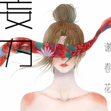

妄为
============================

|  |  |
| :--: | :-- |
| [ 妄为](https://emumo.xiami.com/album/2102700534) | **艺人**: [谢春花](../index.md) **语种**: 国语 **唱片公司**: 独立发行 **发行时间**: 2017年03月01日 **专辑类别**: EP, 单曲 **专辑风格**: 国语流行 Mandarin Pop, 独立流行 Indie Pop **播放数**: 4383693 **收藏数**: 691 **评论数**: 56  |

## 简介

《妄为》由谢春花作词作曲，卢山吉他，小皮编曲。是谢春花第二张创作专辑中公开发行的第三首歌曲。
 

无论身披绸缎或粗布麻衣，光鲜或是狼狈，都不及你点头回应给予的安慰。

## 曲目

- [妄为MV](./2102700534/xNcb7Rb3c9c.md)

## 评论

|  |  |  |  |
| :-- | :-- | :-- | :-- |
|  [虾米用户](https://emumo.xiami.com/u/3496718) idle space 2019-08-22 20:54 赞(0) 踩(0) | 
耐听
 |
|  [虾米用户](https://emumo.xiami.com/u/377411391) 说你，爱喔 2019-05-05 09:46 赞(0) 踩(0) | 
挺好听的啊
 |
|  [虾米用户](https://emumo.xiami.com/u/406266711) 我还没想好要写什么... 2019-03-16 00:05 赞(0) 踩(0) | 
词 曲 声的完美搭配
 |
|  [虾米用户](https://emumo.xiami.com/u/350689350)  2019-01-29 05:13 赞(0) 踩(0) | 
身边朋友 浅浅淡淡 仿佛会有挫败感 假装不那么狼狈 那就寻梦一场 忘却了吧 睁开眼 是还未入卡卡西班的八嘎鸣人 可我没有主角光环 没有嘴遁 没有自来也师父 没有四代目父亲 怪罪谁呢 是最初单恋的小樱 却没有挚爱雏田 晚安  陌生人 我要做个好梦了 放心 我会多做个梦关于更加挫败的自己 梦境经历过的 现实会好接受
 |
|  [虾米用户](https://emumo.xiami.com/u/48647155) what？ 2018-09-15 09:29 赞(1) 踩(0) | 
好听呀！！
 |
|  [虾米用户](https://emumo.xiami.com/u/16002823)  2018-09-08 16:14 赞(0) 踩(0) | 
给一万分
 |
|  [虾米用户](https://emumo.xiami.com/u/280576376)  2017-12-27 18:43 赞(1) 踩(0) | 
想给一万分
 |
|  [虾米用户](https://emumo.xiami.com/u/287589102)  2017-11-13 11:19 赞(0) 踩(0) | 
没觉得不好听，感觉很好啊
 |
|  [虾米用户](https://emumo.xiami.com/u/48376597)  2017-03-14 23:32 赞(0) 踩(0) | 
很喜欢~
 |
|  [虾米用户](https://emumo.xiami.com/u/16206377) rabbit_❀moon 2017-03-13 20:22 赞(0) 踩(0) | 
一般般
 |
|  [虾米用户](https://emumo.xiami.com/u/240579542) 我还没想好要写什么... 2017-03-13 15:40 赞(1) 踩(0) | 
我觉得这首歌吧虽然不耐听 但是听着舒服听着好听 听不出感觉的只能说明你们不懂谢知非
 |
|  [虾米用户](https://emumo.xiami.com/u/278959002)  2017-03-13 13:20 赞(1) 踩(0) | 
前秦还行，后面唱的，跟歌房里练歌一样。不行了，给人有气无力的感觉
 |
|  [虾米用户](https://emumo.xiami.com/u/278959002)  2017-03-13 13:15 赞(0) 踩(0) | 
这歌听的感觉怪怪的，感觉在歌房里学练歌一样
 |
|  [虾米用户](https://emumo.xiami.com/u/170211738) 上帝在开始爱着了 2017-03-12 00:31 赞(2) 踩(0) | 
看到鹿菏的画特意来听！
 |
|  [虾米用户](https://emumo.xiami.com/u/37706842)   2017-03-09 03:36 赞(0) 踩(0) | 
支持独立音乐人～冲虾米我乐意 
 |
|  [虾米用户](https://emumo.xiami.com/u/273446879)  2017-03-08 22:07 赞(0) 踩(0) | 
[Reply@念安娜。]反正我觉得 妄为 心空空没 崖边跌落 还想听你的故事 借我 耐听
 |
|  [虾米用户](https://emumo.xiami.com/u/13849922) ʕ •ᴥ•ʔ听歌就美好 2017-03-07 10:19 赞(0) 踩(0) | 
好听 
 |
|  [虾米用户](https://emumo.xiami.com/u/97760070) 林中有鹿，鹿有孤独 2017-03-06 20:12 赞(1) 踩(0) | 
为什么无法购买
 |
|  [虾米用户](https://emumo.xiami.com/u/23019766)  2017-03-05 16:42 赞(0) 踩(0) | 
很好听啊。人总是要成长的。音乐是情绪的表达。能听出来
 |
|  [虾米用户](https://emumo.xiami.com/u/272888993)  2017-03-04 13:05 赞(1) 踩(0) | 
好清新的声音，但歌声又很荒凉。
 |
|  [虾米用户](https://emumo.xiami.com/u/50750188) 一世清欢，两世闲愁 2017-03-03 13:07 赞(0) 踩(0) | 
我鹿菏画的封面(*^&amp;omega;^*)
 |
| ⇒ |  [虾米用户](https://emumo.xiami.com/u/221123795)  2017-03-03 20:11 赞(0) 踩(0) | 
&amp;quot;ehaaaA,vn241_/ ， p@，，，，
 |
|  [虾米用户](https://emumo.xiami.com/u/20452963) 不畏将来 不念过往 2017-03-03 10:11 赞(0) 踩(0) | 
拿绸缎来填充无尽虚空  肆意去挥霍着不痒不痛前奏吸引人，但是中间部分有点不痛不痒
 |
|  [虾米用户](https://emumo.xiami.com/u/82248268)  2017-03-03 01:35 赞(0) 踩(0) | 
花更孤独了呢
 |
| ⇒ |  [虾米用户](https://emumo.xiami.com/u/221123795)  2017-03-03 20:12 赞(0) 踩(0) | 

 |
|  [虾米用户](https://emumo.xiami.com/u/206301400)  2017-03-02 20:31 赞(0) 踩(0) | 
春花学姐工大学弟来支持你了 
 |
|  [虾米用户](https://emumo.xiami.com/u/276519774) that's all ？... 2017-03-02 19:35 赞(0) 踩(0) | 
好听   喜欢
 |
|  [虾米用户](https://emumo.xiami.com/u/213063761) (●ˇOˇ●) 2017-03-02 16:49 赞(0) 踩(0) | 
昨天发的，昨天正好是20岁生日。恍惚间的惊喜
 |
|  [虾米用户](https://emumo.xiami.com/u/39914317) 我还没想好要写什么... 2017-03-02 13:04 赞(0) 踩(0) | 
喜欢这个封面，美！也喜欢这把声音～
 |
|  [虾米用户](https://emumo.xiami.com/u/5429478) 唯有音乐和亲情不可遗落！ 2017-03-02 07:06 赞(19) 踩(0) | 
讲真后期的歌都没有最初的好听！不知是我听觉疲劳还是春花同学变了。
 |
| ⇒ |  [虾米用户](https://emumo.xiami.com/u/164922926)  2019-07-16 10:13 赞(0) 踩(0) | 
人都在变，喜欢的都是跟自己当时的境遇贴合的，你在变，她也在变
 |
|  [虾米用户](https://emumo.xiami.com/u/36632082)  2017-03-01 23:14 赞(0) 踩(0) | 

 |
|  [虾米用户](https://emumo.xiami.com/u/276457696)  2017-03-01 22:58 赞(0) 踩(0) | 
安静
 |
|  [虾米用户](https://emumo.xiami.com/u/5920185) 失业在家貌似也只能画画. 2017-03-01 22:57 赞(0) 踩(0) | 
春花啊.
 |
|  [虾米用户](https://emumo.xiami.com/u/273735174) 别看了乖 2017-03-01 22:17 赞(0) 踩(0) | 
喜欢春花 好听
 |
|  [虾米用户](https://emumo.xiami.com/u/187473169)  2017-03-01 20:50 赞(0) 踩(0) | 
这么好听为什么就一点点人呢
 |
| ⇒ |  [虾米用户](https://emumo.xiami.com/u/238371797) 孤独的像条狗    却偏... 2017-03-02 00:47 赞(0) 踩(0) | 
迟早会爆发
 |
| ⇒ |  [虾米用户](https://emumo.xiami.com/u/1452456) 千寻 2017-03-02 12:14 赞(0) 踩(0) | 
<q><b>w说：</b></q>
 |
|  [虾米用户](https://emumo.xiami.com/u/4357749)  2017-03-01 20:36 赞(1) 踩(0) | 
鹿荷绘制的封面
 |
|  [虾米用户](https://emumo.xiami.com/u/7841608)  2017-03-01 19:16 赞(0) 踩(0) | 
发声很刻意
 |
|  [虾米用户](https://emumo.xiami.com/u/187438203)  2017-03-01 18:45 赞(0) 踩(0) | 
妄为刚好心声 
 |
|  [虾米用户](https://emumo.xiami.com/u/207637716)  2017-03-01 18:16 赞(0) 踩(0) | 
暗恋是一个人独角戏
 |
|  [虾米用户](https://emumo.xiami.com/u/121568572) mayday 2017-03-01 17:17 赞(0) 踩(0) | 
好听
 |
|  [虾米用户](https://emumo.xiami.com/u/258545724) 我还没想好要写什么... 2017-03-01 12:15 赞(0) 踩(0) | 
签个到 
 |
|  [虾米用户](https://emumo.xiami.com/u/27408091)   2017-03-01 11:18 赞(0) 踩(0) | 
好听
 |
|  [虾米用户](https://emumo.xiami.com/u/7402157) 你先让我躺一会 2017-03-01 10:32 赞(0) 踩(0) | 
歌词到底在说什么
 |
| ⇒ |  [虾米用户](https://emumo.xiami.com/u/264966052) 不懂你微笑的意思 2017-03-01 12:35 赞(0) 踩(0) | 
感觉是暗恋
 |
|  [虾米用户](https://emumo.xiami.com/u/238053866) 尊重版权©️ 2017-03-01 10:31 赞(1) 踩(0) | 
表白 花姐~~~~~~~~~~~~~~~~~~~~
 |
|  [虾米用户](https://emumo.xiami.com/u/38918617) 你相信我，我相信你 2017-03-01 10:25 赞(0) 踩(0) | 
花姐 以后要经常给虾米首发 哦 ~~~买买买！！！！！
 |
|  [虾米用户](https://emumo.xiami.com/u/38918617) 你相信我，我相信你 2017-03-01 10:23 赞(0) 踩(0) | 
终于 给虾米先发了嗄 谢谢 花姐  爱花姐 花姐万岁！！！！！！！！！
 |
|  [虾米用户](https://emumo.xiami.com/u/9054386)  2017-03-01 09:59 赞(1) 踩(0) | 
手动表白 
 |
|  [虾米用户](https://emumo.xiami.com/u/147139966) 孤独而忘情的度日  2017-03-01 08:41 赞(1) 踩(0) | 
表白
 |
|  [虾米用户](https://emumo.xiami.com/u/34456354) 何必久睡 自会长眠 2017-03-01 08:20 赞(1) 踩(0) | 
前排 表白春花
 |
|  [虾米用户](https://emumo.xiami.com/u/52578131) 这家伙很聪明什么也没留下... 2017-03-01 08:03 赞(1) 踩(0) | 
好爱她
 |
|  [虾米用户](https://emumo.xiami.com/u/2830724) 我們終將不會相遇 都湮滅... 2017-03-01 08:02 赞(1) 踩(0) | 
嗯
 |
|  [虾米用户](https://emumo.xiami.com/u/1985263) 五月天是信仰。 2017-02-28 22:14 赞(1) 踩(0) | 
我等這首歌好久了～
 |
