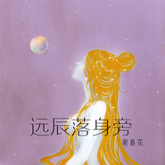

远辰落身旁
============================

|  |  |
| :--: | :-- |
| [ 远辰落身旁](https://emumo.xiami.com/album/2102711191) | **艺人**: [谢春花](../index.md) **语种**: 国语 **唱片公司**: 独立发行 **发行时间**: 2017年03月14日 **专辑类别**: EP, 单曲 **专辑风格**: 国语流行 Mandarin Pop **播放数**: 578457 **收藏数**: 381 **评论数**: 31  |

## 简介

  
 

一份流淌心事，一场无阻坚持。是你辰光热烈，让我勇敢盲从。
 

《远辰落身旁》是谢春花第二张创作专辑中公开发行的第四首歌曲，由谢春花作词作曲，小皮编曲，卢山吉他，王丹贝司。
 

 

## 曲目

- [远辰落身旁](./2102711191/xNcrgnb62c1.md)

## 评论

|  |  |  |  |
| :-- | :-- | :-- | :-- |
|  [虾米用户](https://emumo.xiami.com/u/52056952) 人生即是到來、相遇、陪伴... 2018-12-19 17:14 赞(0) 踩(0) | 
(　ﾟ∀ﾟ)つ≡≡≡♡♡♡
 |
|  [虾米用户](https://emumo.xiami.com/u/119465344) 人生若只如初见 2018-04-20 00:07 赞(0) 踩(0) | 
好听，这类型的是杰伦的《阳光宅男》相似的
 |
|  [虾米用户](https://emumo.xiami.com/u/280576376)  2017-12-27 18:43 赞(0) 踩(0) | 
无敌喜欢！
 |
|  [虾米用户](https://emumo.xiami.com/u/5526289) 开心小甜豆 2017-09-18 19:36 赞(0) 踩(0) | 
:)
 |
|  [虾米用户](https://emumo.xiami.com/u/280165446) 音乐是美妙生活的调和剂。 2017-05-19 22:34 赞(0) 踩(0) | 
好听。
 |
|  [虾米用户](https://emumo.xiami.com/u/86081324) 爱生活，爱你 2017-04-26 14:21 赞(0) 踩(0) | 
耿耿余淮
 |
|  [虾米用户](https://emumo.xiami.com/u/226417047) 做自己 2017-04-02 15:40 赞(0) 踩(0) | 
老乡
 |
|  [虾米用户](https://emumo.xiami.com/u/275530123)  2017-03-17 11:07 赞(0) 踩(0) | 
听听
 |
|  [虾米用户](https://emumo.xiami.com/u/91226798)  2017-03-16 14:39 赞(0) 踩(0) | 
好听哦 无意间点开 真美
 |
|  [虾米用户](https://emumo.xiami.com/u/97372812)  2017-03-16 10:20 赞(0) 踩(0) | 
为嘛这里人这么少？！
 |
|  [虾米用户](https://emumo.xiami.com/u/71446596)  2017-03-16 08:43 赞(0) 踩(0) | 
春花是最棒的少女！
 |
|  [虾米用户](https://emumo.xiami.com/u/263440920)  2017-03-16 08:41 赞(0) 踩(0) | 
听成了萌宠 
 |
|  [虾米用户](https://emumo.xiami.com/u/263440920)  2017-03-16 08:40 赞(0) 踩(0) | 

 |
|  [虾米用户](https://emumo.xiami.com/u/277053051)  2017-03-15 12:40 赞(0) 踩(0) | 
喜欢
 |
|  [虾米用户](https://emumo.xiami.com/u/2537828)  2017-03-15 12:03 赞(0) 踩(0) | 
愿属于我的星辰早日落在我身旁
 |
|  [虾米用户](https://emumo.xiami.com/u/3975131)  2017-03-15 11:23 赞(0) 踩(0) | 
好清新!
 |
|  [虾米用户](https://emumo.xiami.com/u/812392) 【封面控】毛驴牌❤小众好... 2017-03-15 10:33 赞(0) 踩(0) | 
好听
 |
|  [虾米用户](https://emumo.xiami.com/u/13704947) 豆瓣见：无悲渊。 2017-03-15 10:32 赞(13) 踩(0) | 
如果说《心空空》是压抑的火种，《妄为》是狼狈的故作坚强，《远辰落身旁》就是终于云开雾散的春日。你是春日迟迟，解我秋寒冬困和夏疲，你是这一年四季流转的最终意义。
 |
|  [虾米用户](https://emumo.xiami.com/u/29935784) 为养喵而奋斗来咯哦 2017-03-15 09:54 赞(0) 踩(0) | 
好听耶~~加油哦，封面图好看
 |
|  [虾米用户](https://emumo.xiami.com/u/280444308)  2017-03-14 23:57 赞(0) 踩(0) | 
好听
 |
|  [虾米用户](https://emumo.xiami.com/u/168080044) 哼一首歌，到日落。 2017-03-14 23:32 赞(3) 踩(0) | 
春花春花，为你我不再愿做那一轮秋月。我要变成一场雨，哪怕只下一场的春雨。
 |
|  [虾米用户](https://emumo.xiami.com/u/280427469)  2017-03-14 22:47 赞(0) 踩(0) | 
棒棒哒
 |
|  [虾米用户](https://emumo.xiami.com/u/204075702) 我只想活的热烈一点 2017-03-14 20:34 赞(1) 踩(0) | 
每次的封面都好心水 
 |
|  [虾米用户](https://emumo.xiami.com/u/261252611)  2017-03-14 20:34 赞(0) 踩(0) | 
90后就服你  
 |
|  [虾米用户](https://emumo.xiami.com/u/44056264) 答案在风中飘扬 2017-03-14 20:21 赞(0) 踩(0) | 
春花我爱你
 |
|  [虾米用户](https://emumo.xiami.com/u/1601859) 想啊想啊，想起你了。 2017-03-14 20:15 赞(0) 踩(0) | 
前排
 |
|  [虾米用户](https://emumo.xiami.com/u/141027886) 在下还没想好要写什么… 2017-03-14 20:08 赞(0) 踩(0) | 
远辰？？！！！
 |
|  [虾米用户](https://emumo.xiami.com/u/13350382) “一切白的东西与你相比都... 2017-03-14 20:01 赞(0) 踩(0) | 
啥都别说了 我爱春花hhh
 |
|  [虾米用户](https://emumo.xiami.com/u/187969420) Lay的理智小迷妹 2017-03-14 20:00 赞(0) 踩(0) | 
来啦
 |
|  [虾米用户](https://emumo.xiami.com/u/249063856)  2017-03-14 14:40 赞(0) 踩(0) | 
听不了
 |
|  [虾米用户](https://emumo.xiami.com/u/143161164) 要将忧郁苦痛洗去，柔情蜜... 2017-03-14 11:51 赞(0) 踩(0) | 
看看
 |
