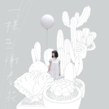

一棵
============================

|  |  |
| :--: | :-- |
| [ 一棵](https://emumo.xiami.com/album/5021405447) | **艺人**: [谢春花](../index.md) **语种**: 国语 **唱片公司**: 心喜文化 **发行时间**: 2020年09月15日 **专辑类别**: 录音室专辑 **专辑风格**:  **播放数**: 58 **收藏数**: 7 **评论数**: 2  |

## 简介

起名字对我来说，一直都是一件头疼的事，无论是过去写完作文想不出题目，还是现在写完歌想不出歌名，捉襟见肘的模样，如出一辙。  
  
但越是令人头疼，就越充满乐趣。  
  
从平日一首又一首的创作，到选定曲目后想专辑名，这可能是最漫长的一次。  
在取名时，既希望专辑名能清晰地定性专辑的风格，又希望能是个巧妙的双关语，又或者，是不是可以用上自己的真实名字。然而，这张专辑并不是单一的风格，也没法被某个形容词轻易涵盖，而我，也没有第二个真实姓名了。  
  
就这么抓破脑筋思索了几个月，一直没有满意的结果。然而在六月底的某一个晚上，我坐在桌子前发呆，一个突如其来的量词撞进了我的思绪——“一棵”。在这个瞬间，我突然发现，为什么当下的决定要拘泥于过去的选择？只有挣脱束缚，才能得到想要的答案。  
  
这张专辑里每首歌的歌名，都可以用量词加名词概括，从19年初创作的《厚颜》，到今年五月随机写歌的意外收获，在这一年半里，有稀松平常的日子，有珍贵难得的关系，有莫名其妙的情绪，有痛苦反复的梦境，也有对于自己，漫长的挣扎与探索。  
  
重要的是，我不仅用歌曲记录下了这一切，也在迷茫中寻求到了一些确幸。确信的是，要更爱平凡的日子，更爱平凡的生命，曾经的耿耿于怀，曾经的庸人自扰，也是时候，告一段落了。  
  
这“一棵”是自己，无论渺小或伟大；这“一棵”是风景，无论寻常或绚丽。  
  
一餐饭，一场梦，一只猫，一张脸  
一阵失重感，一片未来海  
一个普通的我，一束人间烟火  
一棵，谢春花。  
  
谢春花  
2020.06.19

## 曲目

## 评论

|  |  |  |
| :-- | :-- | :-- |
|  [虾米用户](https://emumo.xiami.com/u/431726370)  2020-10-03 10:39 赞(0) 踩(0) | 
期待
 |
|  [虾米用户](https://emumo.xiami.com/u/21293044)  2020-09-15 20:27 赞(0) 踩(0) | 
看到一颗谢春花要出了，赶紧来看看
 |
