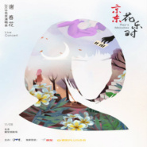
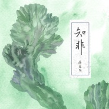

谢春花
============================

|  |  |
| :--: | :-- |
| [ 谢春花](https://i.xiami.com/chunhua) | **地区**: China 中国大陆 **风格**: 根源唱作人 Singer-Songwriter **播放数**: 132526794 **粉丝数**: 83781 **评论数**: 1214  |

## 档案

微博@谢春花 本名知非，九五后生。毕业于浙江工业大学。第二张个人创作专辑《知非》已正式发行，与 《算云烟》再版专辑均在京东音像有售，“知非”全国巡演正在火热进行中。 
工作邮箱： chunhuaxiexie@163.com

## 专辑

| 名称 | 语种 | 唱片公司 | 发行时间 | 专辑类别 | 专辑风格 |
| :--: | :-- | :-- | :-- | :-- | :-- |
| [ 往事随风](./albums/5021847712.md) | 国语 | 华声时代 | 2020年10月29日 | EP, 单曲 |  |
| [ 新境遇](./albums/5021782059.md) | 国语 | 发现音乐 | 2020年10月28日 | EP, 单曲 | 国语流行 Mandarin Pop |
| [ 一棵](./albums/5021405447.md) | 国语 | 心喜文化 | 2020年09月15日 | 录音室专辑 |  |
| [ 今晚我们一起吃饭Dining with Me](./albums/5021344856.md) | 国语 | 心喜文化 | 2020年08月21日 | EP, 单曲 |  |
| [ (借我)2019谢春花花乐时宣传片](./albums/2108231391.md) | 国语 | 三咖文化 | 2020年03月23日 | EP, 单曲 | 国语流行 Mandarin Pop |
| [ 最想要的生活就在现在](./albums/2106090146.md) | 国语 | 心喜文化 | 2020年02月20日 | EP, 单曲 |  |
| [ 借我 (重生)](./albums/5021404426.md) | 国语 | 心喜文化 | 2020年01月01日 | EP, 单曲 |  |
| [ 借我 2020](./albums/2105538421.md) | 国语 | 心喜文化, 摩登天空 | 2019年12月05日 | EP, 单曲 | 国语流行 Mandarin Pop |
| [ 月圆之夜](./albums/2105021070.md) | 国语 | 看见文娱 | 2019年07月26日 | EP, 单曲 |  |
| [ 点心](./albums/2103715966.md) | 国语 | 心喜文化 | 2019年06月10日 | 录音室专辑 | 国语流行 Mandarin Pop |
| [ 新屋](./albums/2103702060.md) | 国语 | 星普娱乐 | 2018年05月04日 | EP, 单曲 | 国语流行 Mandarin Pop |
| [ 崎途](./albums/2103494929.md) | 国语 | 心喜音乐 | 2018年01月19日 | EP, 单曲 | 民谣流行 Folk Pop |
| [ 11887](./albums/2102967064.md) | 国语 | 心喜音乐 | 2017年12月05日 | EP, 单曲 | 民谣流行 Folk Pop |
| [ 谢春花“知非”巡演南京站Live](./albums/2102821802.md) | 国语 | StreetVoice | 2017年08月28日 | 现场专辑 | 独立民谣 Indie Folk, 民谣流行 Folk Pop |
| [ 知非ZHI FEI](./albums/2102755506.md) | 国语 | 心喜文化 | 2017年05月31日 | 录音室专辑 | 华语唱作人 Chinese Singer-Songwriter |
| [ 远辰落身旁](./albums/2102711191.md) | 国语 | 独立发行 | 2017年03月14日 | EP, 单曲 | 国语流行 Mandarin Pop |
| [ 妄为](./albums/2102700534.md) | 国语 | 独立发行 | 2017年03月01日 | EP, 单曲 | 国语流行 Mandarin Pop, 独立流行 Indie Pop |
| [ 心空空](./albums/2102691560.md) | 国语 | 独立发行 | 2017年02月10日 | EP, 单曲 | 流行 Pop, 国语流行 Mandarin Pop, 独立流行 Indie Pop |
| [ 只道寻常](./albums/2102675229.md) | 国语 | 独立发行 | 2017年01月01日 | EP, 单曲 | 流行 Pop, 国语流行 Mandarin Pop |
| [ 这一天我什么都不想干](./albums/23474943.md) | 国语 | 独立发行 | 2016年11月29日 | EP, 单曲 |  |
| [ 算云烟谢春花首张发行专辑](./albums/2100292360.md) | 国语 | 独立发行 | 2016年06月21日 | 录音室专辑 | 民谣 Folk, 流行 Pop, 国语流行 Mandarin Pop |
| [ 唱不了一首欢乐的歌浪荡的你](./albums/1422535797.md) | 国语 | 独立发行 | 2015年01月29日 | 录音室专辑 | 城市民谣 Urban Folk |

## 评论

|  |  |  |
| :-- | :-- | :-- |
|  [虾米用户](https://emumo.xiami.com/u/446752299)  2021-01-30 22:23 赞(0) 踩(0) | 
加油
 |
|  [虾米用户](https://emumo.xiami.com/u/4027210) 我要努力成一朵奇葩 2021-01-26 16:16 赞(0) 踩(0) | 
我神，生快
 |
|  [虾米用户](https://emumo.xiami.com/u/308364197)  2021-01-25 11:50 赞(0) 踩(0) | 
生日快乐！喜欢你的音乐！
 |
|  [虾米用户](https://emumo.xiami.com/u/259319676)  2021-01-25 11:35 赞(0) 踩(0) | 
谢谢谢春花 真的很喜欢你的歌
 |
|  [虾米用户](https://emumo.xiami.com/u/259319676)  2021-01-25 11:35 赞(0) 踩(0) | 
谢谢谢春花 真的很喜欢你的歌
 |
|  [虾米用户](https://emumo.xiami.com/u/301110312) 喜欢许嵩，张杰，库里，有... 2021-01-25 10:55 赞(2) 踩(0) | 
生日快乐呀春花，在虾米停服之前为你送上最后一次生日祝福吧
 |
|  [虾米用户](https://emumo.xiami.com/u/273735417)  2021-01-25 10:54 赞(0) 踩(0) | 
生日一過，即將停服/
 |
|  [虾米用户](https://emumo.xiami.com/u/310667151) 故事大家都有  可是我不... 2021-01-25 10:43 赞(0) 踩(0) | 
生日快乐，超喜欢你的
 |
|  [虾米用户](https://emumo.xiami.com/u/282834373)  2021-01-25 10:37 赞(0) 踩(0) | 
生日快乐，加油春花
 |
|  [虾米用户](https://emumo.xiami.com/u/332254693) 此时相望不相闻 愿逐月华... 2021-01-25 10:21 赞(0) 踩(0) | 
生日快乐！
 |
|  [虾米用户](https://emumo.xiami.com/u/332932406)  2021-01-25 10:21 赞(0) 踩(0) | 
来场线上直播演唱会吧
 |
|  [虾米用户](https://emumo.xiami.com/u/20018617)   2021-01-25 10:19 赞(0) 踩(0) | 
祝你生日快乐，也祝自己生日快乐
 |
|  [虾米用户](https://emumo.xiami.com/u/840102)  2021-01-25 10:10 赞(1) 踩(0) | 
超喜欢你 
 |
|  [虾米用户](https://emumo.xiami.com/u/372751691)  2021-01-25 10:10 赞(1) 踩(0) | 
在我最黑暗的时候是你的歌声带给我光明，谢谢你。祝你所想即所得。
 |
|  [虾米用户](https://emumo.xiami.com/u/44070422) 我还没想好要写什么... 2021-01-25 10:08 赞(1) 踩(0) | 
祝春花生日快乐
 |
|  [虾米用户](https://emumo.xiami.com/u/325329851)  2021-01-25 10:06 赞(1) 踩(0) | 
祝春花小姐姐生日快乐！ 
 |
|  [虾米用户](https://emumo.xiami.com/u/358104299) 悲观的唯心存在现实解构虚... 2020-12-21 11:47 赞(0) 踩(0) | 
43548
 |
|  [虾米用户](https://emumo.xiami.com/u/6046038)  2020-11-25 17:20 赞(0) 踩(0) | 
声音很好啊
 |
|  [虾米用户](https://emumo.xiami.com/u/375391486) 力求無上進◇誰鸟你 2020-10-28 12:47 赞(0) 踩(0) | 
春姐我第一次來內地就遇見了妳，那首借我就是問市當天，好辛運哦 
 |
|  [虾米用户](https://emumo.xiami.com/u/314583513)   2020-10-23 08:20 赞(0) 踩(0) | 
喜欢这声音
 |
|  [虾米用户](https://emumo.xiami.com/u/276944698) 不要自我设限..... 2020-09-03 13:11 赞(0) 踩(0) | 

 |
|  [虾米用户](https://emumo.xiami.com/u/32561545) 咦，你来啦！ 2020-07-12 17:56 赞(0) 踩(0) | 
一直好喜欢谢春花的声音，翻了评论发现是书香门第，更喜欢了，好温柔
 |
|  [虾米用户](https://emumo.xiami.com/u/49976626) 我还没想好要写什么... 2020-04-28 01:10 赞(1) 踩(0) | 
四年前第一次听你的歌，今天忽然发现你火了，真好，祝福。
 |
|  [虾米用户](https://emumo.xiami.com/u/335656599)  2020-03-22 09:31 赞(1) 踩(0) | 
今天第一次听她的作品，特别舒服，特别喜欢，才女，加油！！！！我看好你哦   
 |
|  [虾米用户](https://emumo.xiami.com/u/330306793)   2020-03-22 05:03 赞(0) 踩(0) | 
谢谢
 |
|  [虾米用户](https://emumo.xiami.com/u/401250750)  2020-03-19 20:03 赞(0) 踩(0) | 
虾米发消息给我说春花出新专辑了，我进去一看，谢春红，不带这样子玩的呀( ͡&amp;deg;ᴥ ͡&amp;deg; ʋ)
 |
|  [虾米用户](https://emumo.xiami.com/u/138974) 活着？ 2020-03-19 13:39 赞(2) 踩(0) | 
春花快来看看你出新专辑了   
 |
|  [虾米用户](https://emumo.xiami.com/u/440673685) 缄默 2020-03-18 14:46 赞(1) 踩(0) | 
很戳我的声音
 |
|  [虾米用户](https://emumo.xiami.com/u/11149229)   2020-03-16 10:16 赞(2) 踩(0) | 
声音太治愈了 春天的感觉 
 |
|  [虾米用户](https://emumo.xiami.com/u/440380725)  2020-03-02 23:24 赞(0) 踩(0) | 
第一次听就感觉不一样，我喜欢有节奏音乐，希望能一直给我不一样的感觉！！！
 |
|  [虾米用户](https://emumo.xiami.com/u/95423698)  2020-03-02 20:03 赞(2) 踩(0) | 
歌手给人扑面而来的清新感，特别文艺，雅致。支持你。 
 |
|  [虾米用户](https://emumo.xiami.com/u/46481093) cool  2020-02-24 16:27 赞(0) 踩(0) | 
好听
 |
|  [虾米用户](https://emumo.xiami.com/u/117525856)  2020-02-23 09:14 赞(0) 踩(0) | 
春花，这么土气、大妈的名字，让人毫无听欲……
 |
| ⇒ |  [虾米用户](https://emumo.xiami.com/u/333206804)  2020-03-09 10:40 赞(0) 踩(0) | 
她原名叫谢知非…春花是艺名…
 |
| ⇒ |  [虾米用户](https://emumo.xiami.com/u/440852315)  2020-03-15 19:34 赞(0) 踩(0) | 
你真是。。。。没文化真可怕 
 |
| ⇒ |  [虾米用户](https://emumo.xiami.com/u/322686312)  2020-05-01 00:28 赞(0) 踩(0) | 
<q><b>你不想玩游戏说：</b></q>
 |
| ⇒ |  [虾米用户](https://emumo.xiami.com/u/230557551)  2020-08-16 11:46 赞(0) 踩(0) | 
&amp;ldquo;春有百花秋赏月，夏有凉风冬听雪&amp;hellip;&amp;hellip;&amp;rdquo;&amp;mdash;&amp;mdash;南宋禅宗慧开禅师。 请问阁下，哪里俗了？
 |
|  [虾米用户](https://emumo.xiami.com/u/340368411)  2020-02-15 17:57 赞(0) 踩(0) | 
干净。
 |
|  [虾米用户](https://emumo.xiami.com/u/1499382)   2020-02-08 14:16 赞(0) 踩(0) | 
推荐谢春花的心空空
 |
|  [虾米用户](https://emumo.xiami.com/u/360786261) 音乐是一种心情 2020-01-25 10:12 赞(0) 踩(0) | 
春花生日快乐
 |
|  [虾米用户](https://emumo.xiami.com/u/33352351) 心比长相好，懂比爱重要。 2020-01-25 10:05 赞(0) 踩(0) | 
生日快乐
 |
|  [虾米用户](https://emumo.xiami.com/u/7899939)  2020-01-25 10:04 赞(0) 踩(0) | 
春花生日快乐！
 |
|  [虾米用户](https://emumo.xiami.com/u/316261284) 到最后…… 2020-01-25 10:04 赞(1) 踩(0) | 
过年好
 |
|  [虾米用户](https://emumo.xiami.com/u/35010982) 我还没想好要写什么... 2020-01-04 21:15 赞(0) 踩(0) | 
才女，好听
 |
|  [虾米用户](https://emumo.xiami.com/u/345465860) あのね ため息つくと 幸... 2019-12-13 15:40 赞(0) 踩(0) | 
我妈春凤   
 |
|  [虾米用户](https://emumo.xiami.com/u/426901811)  2019-11-29 23:00 赞(0) 踩(0) | 
听过你唱的我一定会爱上你，便喜欢上你 
 |
|  [虾米用户](https://emumo.xiami.com/u/2868841) 听说虾米要凉？！！ 2019-11-14 16:28 赞(0) 踩(0) | 
校友诶 
 |
|  [虾米用户](https://emumo.xiami.com/u/324555530)  2019-11-11 14:15 赞(1) 踩(0) | 
竟然是浙工大的，想念小和山 
 |
|  [虾米用户](https://emumo.xiami.com/u/49879655) 成年人的感情，是不追问，... 2019-10-20 13:47 赞(0) 踩(0) | 
❤治愈的声音
 |
|  [虾米用户](https://emumo.xiami.com/u/430837154)  2019-10-19 11:11 赞(0) 踩(0) | 
好好听啊
 |
|  [虾米用户](https://emumo.xiami.com/u/336326196) ℌ 2019-09-23 21:55 赞(0) 踩(0) | 
知非，非知，是智也。
 |
|  [虾米用户](https://emumo.xiami.com/u/52401869) 我还没想好要写什么... 2019-09-02 21:29 赞(0) 踩(0) | 
30号去看了武汉演唱会。真的是现场比这还好听好多倍啊！太厉害了现场！心潮澎湃！春花太棒了！live现场稳的呢！太爱了！发现宝了。爱了爱了！哈哈
 |
|  [虾米用户](https://emumo.xiami.com/u/41331887) 古典音乐集 2019-08-29 17:41 赞(0) 踩(0) | 
春花秋月
 |
|  [虾米用户](https://emumo.xiami.com/u/278011119)  2019-08-12 17:56 赞(0) 踩(0) | 
额
 |
|  [虾米用户](https://emumo.xiami.com/u/50109243)  2019-08-12 11:52 赞(1) 踩(0) | 
版权呢
 |
|  [虾米用户](https://emumo.xiami.com/u/367655131)  2019-08-08 00:44 赞(0) 踩(0) | 
借我  深有感触 单曲循环
 |
|  [虾米用户](https://emumo.xiami.com/u/303766701) 我还没想好要写什么... 2019-08-02 14:04 赞(0) 踩(0) | 
好听啊啊啊
 |
|  [虾米用户](https://emumo.xiami.com/u/454474)  2019-07-27 10:27 赞(0) 踩(0) | 
有点像 无颜之月 Cruel Moon
 |
|  [虾米用户](https://emumo.xiami.com/u/9772046)  2019-07-19 15:35 赞(0) 踩(0) | 
感觉名字很棒。
 |
|  [虾米用户](https://emumo.xiami.com/u/45323236) 必有所获 2019-07-15 22:50 赞(0) 踩(0) | 
一直听，也不会累， 真的很轻松， 很幸福！
 |
|  [虾米用户](https://emumo.xiami.com/u/721351)  2019-07-15 13:31 赞(0) 踩(0) | 
第一次听谢春花和第一次听花粥的时间差不多，自从花粥出了《盗将行》之后，就不太赞同她新的音乐理念了，希望谢春花一直坚持下去！ 一直做自己。你是我关注的歌手哦。
 |
|  [虾米用户](https://emumo.xiami.com/u/2796166) 最爱莫文蔚..... 2019-07-09 00:07 赞(1) 踩(0) | 
加油！！！！
 |
|  [虾米用户](https://emumo.xiami.com/u/105607324) % 2019-06-17 07:43 赞(1) 踩(0) | 
需要一个艺名吧
 |
| ⇒ |  [虾米用户](https://emumo.xiami.com/u/333206804)  2020-03-09 10:42 赞(0) 踩(0) | 
春花是她艺名，本名谢知非，她爸书法老师取名字能差哪里去~
 |
|  [虾米用户](https://emumo.xiami.com/u/54519843) 孤者自赏，芳飞艳。 2019-06-13 21:11 赞(2) 踩(0) | 
支持你
 |
|  [虾米用户](https://emumo.xiami.com/u/231637678)  2019-06-13 11:35 赞(1) 踩(0) | 
宝藏女孩
 |
|  [虾米用户](https://emumo.xiami.com/u/410597650) You'll never... 2019-06-11 13:00 赞(0) 踩(0) | 
我比较喜欢荒岛
 |
|  [虾米用户](https://emumo.xiami.com/u/246184233)  2019-06-01 19:38 赞(2) 踩(0) | 
一首《借我》，从此便忘却其他的声音了[带墨镜笑]
 |
|  [虾米用户](https://emumo.xiami.com/u/98758884) 再好不过的，是你还记得 2019-05-27 06:51 赞(2) 踩(0) | 
这首歌是除林宥嘉以外最让我忘不了的声线了
 |
|  [虾米用户](https://emumo.xiami.com/u/186659172) 不生闷气，好好对待生活，... 2019-05-14 18:22 赞(0) 踩(0) | 
借我，让我爱上这把声音，很个性，很舒缓，很校园，循环听。
 |
|  [虾米用户](https://emumo.xiami.com/u/52056952) 人生即是到來、相遇、陪伴... 2019-05-12 01:31 赞(0) 踩(0) | 
(｡’▽’｡)♡
 |
|  [虾米用户](https://emumo.xiami.com/u/3959859)   2019-04-20 20:19 赞(0) 踩(0) | 
记录记录新动向！
 |
|  [虾米用户](https://emumo.xiami.com/u/256745474)  2019-04-19 12:55 赞(0) 踩(0) | 
喜欢你的声音，喜欢你的故事 
 |
|  [虾米用户](https://emumo.xiami.com/u/298100895)  2019-04-15 00:25 赞(0) 踩(0) | 
咱们谢家灵魂歌者，春花加油！
 |
|  [虾米用户](https://emumo.xiami.com/u/91592606)  2019-04-14 10:11 赞(1) 踩(0) | 
春花，你的声音和故事，属于小众，我就很开心了，还是不希望烂大街，小众独享最有感觉和自豪！
 |
|  [虾米用户](https://emumo.xiami.com/u/1270955)  2019-04-11 10:17 赞(1) 踩(0) | 
声音很好听呀。
 |
|  [虾米用户](https://emumo.xiami.com/u/334368603)  2019-03-30 09:32 赞(1) 踩(0) | 
抖音把陈粒带走了，就别把春花带走
 |
|  [虾米用户](https://emumo.xiami.com/u/411417626) 我爱(⑉°з°)-♡学习... 2019-03-19 14:41 赞(0) 踩(0) | 
你声音真好听，
 |
|  [虾米用户](https://emumo.xiami.com/u/419993620)  2019-03-08 11:16 赞(1) 踩(0) | 
喜欢
 |
|  [虾米用户](https://emumo.xiami.com/u/249877362)  2019-03-04 01:14 赞(1) 踩(0) | 
我是先被你名字吸引后是你的歌词
 |
|  [虾米用户](https://emumo.xiami.com/u/752478) Misty Mounta 2019-03-01 11:48 赞(0) 踩(0) | 
这么多认识她的人啊~
 |
|  [虾米用户](https://emumo.xiami.com/u/50511706) 看到你听到的 2019-02-21 08:26 赞(0) 踩(0) | 
大爱她的声音
 |
|  [虾米用户](https://emumo.xiami.com/u/337314934)  2019-01-25 22:34 赞(2) 踩(0) | 
生日快乐！ 很喜欢《我从崖边跌落》！
 |
|  [虾米用户](https://emumo.xiami.com/u/280440159)  2019-01-25 22:02 赞(0) 踩(0) | 
祝快乐幸福每天！生日快乐！
 |
|  [虾米用户](https://emumo.xiami.com/u/404742381)  2019-01-25 20:25 赞(0) 踩(0) | 
生日快乐！
 |
|  [虾米用户](https://emumo.xiami.com/u/1860955) 人非商品无须说明 2019-01-25 17:26 赞(1) 踩(0) | 
竟然跟我同一天生日，難怪我如此喜歡你的歌，你是我重點關注的歌手中最年輕的一位，前程似錦，珍惜羽毛，生日快樂！ 
 |
|  [虾米用户](https://emumo.xiami.com/u/335027411) 你委屈什么， 这世界又不... 2019-01-25 15:30 赞(0) 踩(0) | 
勇敢，快乐，善良
 |
|  [虾米用户](https://emumo.xiami.com/u/19954384)   2019-01-25 14:47 赞(0) 踩(0) | 
生日快乐！~
 |
|  [虾米用户](https://emumo.xiami.com/u/306777267)  2019-01-25 13:47 赞(0) 踩(0) | 
春花生日快乐
 |
|  [虾米用户](https://emumo.xiami.com/u/15118211)  2019-01-25 13:10 赞(0) 踩(0) | 
生日快乐，我花姐 
 |
|  [虾米用户](https://emumo.xiami.com/u/34746468)  2019-01-25 12:46 赞(0) 踩(0) | 
祝福一声、快乐。
 |
|  [虾米用户](https://emumo.xiami.com/u/47274237) 良才难令,然可以致君见尊... 2019-01-25 11:56 赞(1) 踩(0) | 
小花，森日快乐。
 |
|  [虾米用户](https://emumo.xiami.com/u/333440887)  2019-01-25 11:40 赞(0) 踩(0) | 
生日快乐
 |
|  [虾米用户](https://emumo.xiami.com/u/167706156)  2019-01-25 11:31 赞(0) 踩(0) | 
春花儿～生日快乐鸭，新的一岁越来越美越来越酷越来棒～
 |
|  [虾米用户](https://emumo.xiami.com/u/330064279)  2019-01-25 11:26 赞(1) 踩(0) | 
希望你一直快乐地唱下去
 |
|  [虾米用户](https://emumo.xiami.com/u/719472)   2019-01-25 11:21 赞(0) 踩(0) | 
听了春花这么久的歌，没想到是同月同日生人 
 |
|  [虾米用户](https://emumo.xiami.com/u/337592878) 一 2019-01-25 11:18 赞(0) 踩(0) | 
春花 生日快乐
 |
|  [虾米用户](https://emumo.xiami.com/u/92137990)  2019-01-25 10:51 赞(0) 踩(0) | 
生日快乐
 |
|  [虾米用户](https://emumo.xiami.com/u/410726642) 过客 2019-01-25 10:46 赞(0) 踩(0) | 
生日快乐 
 |
|  [虾米用户](https://emumo.xiami.com/u/310739894)  2019-01-25 10:39 赞(0) 踩(0) | 
2016那年暑假受某同学的影响，开始听民谣，后来无意间刷到你的《借我》，从此便一发不可收拾。可谓一入民谣深似海，一闻春花如天籁  春花姐姐，你生有温暖的声音，打造纯净的意境，长成可爱的模样，终会绚烂的绽放~ 在我最失落无助空落落时，你的歌曲总能有一种神奇的力量，点燃我生活的热情，仿佛尘世间一切烦恼都能由此屏蔽掉了呢~ 冬天来了，春天还会远吗？岁岁年年故人不同，年年岁岁春花相似，春花的春天无凋期，春天的春花不落幕   
 |
|  [虾米用户](https://emumo.xiami.com/u/404683259) .. 2019-01-25 10:34 赞(0) 踩(0) | 
生日快乐
 |
|  [虾米用户](https://emumo.xiami.com/u/215762003)  2019-01-25 10:29 赞(0) 踩(0) | 
生日快乐
 |
|  [虾米用户](https://emumo.xiami.com/u/127444946) 我在哪漂荡 2019-01-25 10:28 赞(0) 踩(0) | 
生快！
 |
|  [虾米用户](https://emumo.xiami.com/u/379253284)  2019-01-25 10:18 赞(0) 踩(0) | 
花儿，生日快乐，新的一年仍有你的陪伴 
 |
|  [虾米用户](https://emumo.xiami.com/u/348765913)  2019-01-25 10:12 赞(2) 踩(0) | 
女神阿 从最开始的雀斑姑娘到现在越来越多的优秀作品，你一定会成为想要的样子的！生日快乐
 |
|  [虾米用户](https://emumo.xiami.com/u/280067556) 我还没想好要写什么... 2019-01-25 10:11 赞(0) 踩(0) | 
休与俗人言，茶酒相知伴，生日快乐
 |
|  [虾米用户](https://emumo.xiami.com/u/52712416) 世界的丰富的美是依每个人... 2019-01-25 10:03 赞(0) 踩(0) | 
1月25日，㊗春花小姐姐生日快乐♪٩(´ω`)و♪生日快乐！愿歌声一如初心的纯粹自然！
 |
|  [虾米用户](https://emumo.xiami.com/u/246863592)  2019-01-23 13:51 赞(0) 踩(0) | 
发现，原来能因为歌声而恋上一人
 |
|  [虾米用户](https://emumo.xiami.com/u/303506160) 因为我对你爱的深沉 2019-01-23 08:27 赞(1) 踩(0) | 
嘿呦
 |
|  [虾米用户](https://emumo.xiami.com/u/3904992) 我呢，你呢 2019-01-20 11:52 赞(1) 踩(0) | 
加油啊，好听呢
 |
|  [虾米用户](https://emumo.xiami.com/u/412511309)  2019-01-17 16:34 赞(1) 踩(0) | 
70年代的我，第一首付费下载歌曲就是借我 
 |
|  [虾米用户](https://emumo.xiami.com/u/285206657)  2019-01-16 00:14 赞(0) 踩(0) | 
知非美女，你什么时候还会有演唱会啊
 |
|  [虾米用户](https://emumo.xiami.com/u/285206657)  2019-01-16 00:10 赞(0) 踩(0) | 
很喜欢你淡淡的音乐风格，像是叙述一段故事，才女内心情感丰富，期待你更多特立独行的作品 
 |
|  [虾米用户](https://emumo.xiami.com/u/368357837)  2019-01-15 23:03 赞(0) 踩(0) | 
好好听
 |
|  [虾米用户](https://emumo.xiami.com/u/277957297) 有你就好…… 2019-01-14 20:59 赞(0) 踩(0) | 
好听 喜欢
 |
|  [虾米用户](https://emumo.xiami.com/u/339854312)  2019-01-01 10:36 赞(1) 踩(0) | 
很好听，祝你2019快乐！
 |
|  [虾米用户](https://emumo.xiami.com/u/149546728) 感谢虾米。 2019-01-01 00:20 赞(2) 踩(0) | 
新年快乐！知非，刚才在电视上看到你啦 
 |
|  [虾米用户](https://emumo.xiami.com/u/254782125) 什么音乐都喜欢，唱吧：h... 2018-12-31 22:46 赞(1) 踩(0) | 
一听就知道是一个还有灵气才气且简单的姑娘。
 |
|  [虾米用户](https://emumo.xiami.com/u/52056952) 人生即是到來、相遇、陪伴... 2018-12-19 17:11 赞(0) 踩(0) | 

 |
|  [虾米用户](https://emumo.xiami.com/u/405719193) 不曾走出一步 2018-12-17 15:30 赞(0) 踩(0) | 
你的歌声引起了我内心深处莫名的悸动
 |
|  [虾米用户](https://emumo.xiami.com/u/377250164)  2018-12-15 19:59 赞(0) 踩(0) | 

 |
|  [虾米用户](https://emumo.xiami.com/u/303415100)  2018-12-15 19:03 赞(0) 踩(0) | 
呜呜呜太好听了，小姐姐好棒
 |
|  [虾米用户](https://emumo.xiami.com/u/315079629) 不必追，因为那不属于你 2018-12-11 15:10 赞(0) 踩(0) | 
很干净的声音好听
 |
|  [虾米用户](https://emumo.xiami.com/u/379212110)  2018-11-26 18:26 赞(0) 踩(0) | 
我枯了 你呢
 |
|  [虾米用户](https://emumo.xiami.com/u/305396053) 心中的日月 2018-11-25 19:52 赞(2) 踩(0) | 
确实好听的声音。纯粹
 |
|  [虾米用户](https://emumo.xiami.com/u/408942981)  2018-11-22 20:39 赞(2) 踩(0) | 
昨晚刚刚和春花分手！
 |
|  [虾米用户](https://emumo.xiami.com/u/244030202)  2018-11-14 20:51 赞(1) 踩(0) | 
不必去了解你是什么样的，只需要静静地倾听你的故事
 |
|  [虾米用户](https://emumo.xiami.com/u/328370837)  2018-10-31 00:23 赞(2) 踩(0) | 
多读书，多看历史，多想我们这个时代，希望你做个不一样的歌者。
 |
|  [虾米用户](https://emumo.xiami.com/u/303506160) 因为我对你爱的深沉 2018-10-28 00:59 赞(1) 踩(0) | 
嘿呦
 |
|  [虾米用户](https://emumo.xiami.com/u/290804426) 音乐可以传递思想与灵魂的... 2018-10-07 22:41 赞(4) 踩(0) | 
春花的词是近几年看到最有诗意的民谣风格的词了。爱不释耳，好的音乐就是用最简单的音乐优美而充满诗意的词来打动人。真的非常难得。
 |
|  [虾米用户](https://emumo.xiami.com/u/405330999)  2018-10-02 21:04 赞(1) 踩(0) | 
小姐姐唱的很好听，词很优美，情很动人。支持支持！！！
 |
|  [虾米用户](https://emumo.xiami.com/u/334119045)   2018-09-29 23:11 赞(0) 踩(0) | 
透彻心扉
 |
|  [虾米用户](https://emumo.xiami.com/u/763369)  2018-09-27 00:22 赞(1) 踩(0) | 
喜欢「荒岛」️
 |
|  [虾米用户](https://emumo.xiami.com/u/366253122) 我还没想好要写什么... 2018-09-26 15:41 赞(1) 踩(0) | 
我来晚了~，很喜欢她的歌，好美好美~来成都开演唱会吧~~
 |
|  [虾米用户](https://emumo.xiami.com/u/47277020) 世上本有路，走的人多了，... 2018-09-21 09:10 赞(0) 踩(0) | 
偶然从汽车电台里听到的〈借我〉，很不错
 |
|  [虾米用户](https://emumo.xiami.com/u/400129678)  2018-09-20 09:29 赞(0) 踩(0) | 
喜欢这首歌，歌词也很棒
 |
|  [虾米用户](https://emumo.xiami.com/u/361308301) 日影亦新余一诺。 2018-09-16 21:47 赞(0) 踩(0) | 
删了一大堆我以前怎么也不肯删掉的APP换了一个G的空间，把知非的歌用无损品质下了个遍。
 |
|  [虾米用户](https://emumo.xiami.com/u/839508)  2018-09-11 11:32 赞(0) 踩(0) | 
什么时候杭州有歌友会。
 |
|  [虾米用户](https://emumo.xiami.com/u/91347096)  2018-09-02 22:21 赞(0) 踩(0) | 
好喜欢这首歌，干净纯美的声音和歌词
 |
|  [虾米用户](https://emumo.xiami.com/u/343835329) 爱上你，爱上那片海 2018-09-02 10:31 赞(0) 踩(0) | 
喜欢，干净纯粹的声音
 |
|  [虾米用户](https://emumo.xiami.com/u/402967753)  2018-08-29 16:02 赞(1) 踩(0) | 
感谢你，你的歌唱出了我的心声！！谢谢
 |
|  [虾米用户](https://emumo.xiami.com/u/411068) 而我的世界，不过是你的心 2018-08-26 11:36 赞(3) 踩(0) | 
何以解忧 唯有春花
 |
|  [虾米用户](https://emumo.xiami.com/u/303506160) 因为我对你爱的深沉 2018-08-21 00:56 赞(1) 踩(0) | 
嘿呦
 |
|  [虾米用户](https://emumo.xiami.com/u/268048000) 花开富贵上善若水 2018-08-18 06:47 赞(0) 踩(0) | 
春花我爱你，日常表白
 |
|  [虾米用户](https://emumo.xiami.com/u/276732396) 生活不止眼前的苟且 2018-08-18 01:24 赞(0) 踩(0) | 
借我
 |
|  [虾米用户](https://emumo.xiami.com/u/59357526)  2018-08-16 10:58 赞(0) 踩(0) | 
真的有才华
 |
|  [虾米用户](https://emumo.xiami.com/u/276253848)  2018-08-12 15:09 赞(0) 踩(0) | 
偶然听你的一首借我就迷上你的声音！
 |
|  [虾米用户](https://emumo.xiami.com/u/50030718) 等风来 2018-08-09 22:04 赞(0) 踩(0) | 
听了你欢快版的理想三旬才开始听你的歌的
 |
|  [虾米用户](https://emumo.xiami.com/u/266608383)  2018-08-09 16:30 赞(0) 踩(0) | 
******
 |
|  [虾米用户](https://emumo.xiami.com/u/373589897)  2018-08-06 23:42 赞(1) 踩(0) | 
今天第一次听你的歌，很喜欢，所以都听了一遍，希望你能保持初心，可以做出更好的音乐。
 |
|  [虾米用户](https://emumo.xiami.com/u/341555697)  2018-08-05 19:39 赞(3) 踩(0) | 
何以解忧 唯有春花
 |
|  [虾米用户](https://emumo.xiami.com/u/400094613)  2018-08-03 10:12 赞(1) 踩(0) | 
你的歌听起来很温暖 
 |
|  [虾米用户](https://emumo.xiami.com/u/259621368)  2018-07-27 23:22 赞(0) 踩(0) | 
他们说你是95后的小姐姐～(￣▽￣～)~
 |
|  [虾米用户](https://emumo.xiami.com/u/3807678) 人生已经不易，请勿相互为... 2018-07-25 19:14 赞(1) 踩(0) | 
有一天，我会去你的演唱会，在我的角落静静听你唱歌
 |
|  [虾米用户](https://emumo.xiami.com/u/379372547)  2018-07-22 15:56 赞(0) 踩(0) | 
你们几岁？
 |
|  [虾米用户](https://emumo.xiami.com/u/7774385) Sapphire Blu... 2018-07-21 09:34 赞(0) 踩(0) | 

 |
|  [虾米用户](https://emumo.xiami.com/u/245841205) 但是我有很多很多动人的歌... 2018-07-15 19:02 赞(0) 踩(0) | 
7.15长沙打卡
 |
|  [虾米用户](https://emumo.xiami.com/u/3149830)  2018-07-11 20:16 赞(1) 踩(0) | 
笑起来很好看
 |
|  [虾米用户](https://emumo.xiami.com/u/53701186) 人海 如深海 终有了你让... 2018-07-11 18:33 赞(0) 踩(0) | 
词太好了   秒杀99.9%民谣歌手！
 |
|  [虾米用户](https://emumo.xiami.com/u/225693473)  2018-07-11 16:02 赞(0) 踩(0) | 
刚在束河古镇的一个小酒吧听到了春花的歌《荒岛》开心
 |
|  [虾米用户](https://emumo.xiami.com/u/378270479)  2018-07-11 13:54 赞(1) 踩(0) | 
春花，你的声音太好听了，我爱你
 |
|  [虾米用户](https://emumo.xiami.com/u/24331052) 自律即自由。 2018-07-10 19:31 赞(1) 踩(0) | 
才女 
 |
|  [虾米用户](https://emumo.xiami.com/u/273283725)  2018-07-08 14:16 赞(1) 踩(0) | 
超级喜欢你  
 |
|  [虾米用户](https://emumo.xiami.com/u/39426392) 虾米，我爱你 2018-06-28 20:22 赞(2) 踩(0) | 
春花那么漂亮呢
 |
|  [虾米用户](https://emumo.xiami.com/u/346619198)  2018-06-27 22:18 赞(1) 踩(0) | 
完美
 |
|  [虾米用户](https://emumo.xiami.com/u/280733503)  2018-06-26 23:00 赞(2) 踩(0) | 
和我一样大，瞬间感觉自卑，，这就是传说中的别人家的孩子  
 |
|  [虾米用户](https://emumo.xiami.com/u/278934970)  2018-06-23 19:28 赞(0) 踩(0) | 
很好听
 |
|  [虾米用户](https://emumo.xiami.com/u/376311569) 我还没想好要写什么... 2018-06-20 21:54 赞(0) 踩(0) | 
唱的好听
 |
|  [虾米用户](https://emumo.xiami.com/u/3319668)  2018-06-20 15:46 赞(1) 踩(0) | 
身在上海，本打算看6月20日东艺的演唱会，无奈工作日太多人找，犹如达摩克里斯之剑悬在头顶，即便到场也会心神不宁。8月4日，宁波来看你。
 |
|  [虾米用户](https://emumo.xiami.com/u/13516920)  2018-06-20 12:39 赞(0) 踩(0) | 
喜欢，歌声很有味道，歌词写的非常好
 |
|  [虾米用户](https://emumo.xiami.com/u/128160692)  2018-06-19 00:23 赞(0) 踩(0) | 
1
 |
|  [虾米用户](https://emumo.xiami.com/u/5104405) Live万岁！ 2018-06-17 17:50 赞(0) 踩(0) | 
春浪音乐节打卡
 |
|  [虾米用户](https://emumo.xiami.com/u/82752688)  2018-06-17 10:09 赞(1) 踩(0) | 
喜欢你的歌，加油(ง &amp;bull;̀_&amp;bull;́)ง，希望你越来越好(✪▽✪)
 |
|  [虾米用户](https://emumo.xiami.com/u/341140918)  2018-06-16 05:55 赞(0) 踩(0) | 
愛你的歌
 |
|  [虾米用户](https://emumo.xiami.com/u/40304661) 暂无签名~ 2018-06-14 10:29 赞(0) 踩(0) | 
没看图还多点想像。，，
 |
|  [虾米用户](https://emumo.xiami.com/u/293692544) 你敢给我说话吗？我咬你 2018-06-05 16:47 赞(0) 踩(0) | 
好听好听
 |
|  [虾米用户](https://emumo.xiami.com/u/351017403) 小女子不才，未能走进公子... 2018-06-04 23:24 赞(1) 踩(0) | 
喜欢❤️
 |
|  [虾米用户](https://emumo.xiami.com/u/64588650)   2018-06-03 22:47 赞(2) 踩(0) | 
哇哦！学妹！喜欢你的声音和歌！我是工大08届
 |
|  [虾米用户](https://emumo.xiami.com/u/81277464)  2018-06-01 23:30 赞(1) 踩(0) | 
喜欢
 |
|  [虾米用户](https://emumo.xiami.com/u/327637444)  2018-05-28 08:46 赞(2) 踩(0) | 
就是喜欢听
 |
|  [虾米用户](https://emumo.xiami.com/u/246567170)  2018-05-26 11:54 赞(1) 踩(0) | 
好听，加油
 |
|  [虾米用户](https://emumo.xiami.com/u/22735342)  2018-05-18 13:14 赞(1) 踩(0) | 
声音真的好听，戴上耳机，闭着眼睛听简直太享受了！
 |
|  [虾米用户](https://emumo.xiami.com/u/74351868) 敬往事一杯酒 2018-05-15 15:46 赞(2) 踩(0) | 
春花，很喜欢你，很喜欢你的作品。真的超喜欢！
 |
|  [虾米用户](https://emumo.xiami.com/u/7593264)  2018-05-14 12:14 赞(4) 踩(0) | 
春花咋土了？春花自己唱过：在我死后 请将我种成 一棵会开花的树 来年三月 在一夜之间 开满白色的花束 你若记得 我们的誓言 在很多年以前 樱花也好 玉兰也好 只要是棵春天的树  名字只是个代号
 |
|  [虾米用户](https://emumo.xiami.com/u/273681)  2018-05-14 10:57 赞(4) 踩(0) | 
声音真实且好听，向好多朋友推荐过那首 借我
 |
| ⇒ |  [虾米用户](https://emumo.xiami.com/u/378270479)  2018-07-11 13:56 赞(0) 踩(0) | 
对啊，超好听，还有俗人言
 |
|  [虾米用户](https://emumo.xiami.com/u/349499190)  2018-05-13 19:12 赞(1) 踩(0) | 
厉害了
 |
|  [虾米用户](https://emumo.xiami.com/u/213880174)  2018-05-13 00:41 赞(2) 踩(0) | 
胆小鬼连幸福都会害怕，碰到棉花都会受伤，有时还被幸福所伤。
 |
|  [虾米用户](https://emumo.xiami.com/u/17237966)  2018-05-09 11:42 赞(2) 踩(0) | 
妈耶，这声音太干净了？  初听好像《我的前半生》的女生，后听有点融合了魏如萱，还有点潇潇的假声方法，这种声音加配乐大赞！
 |
|  [虾米用户](https://emumo.xiami.com/u/1948315)  2018-05-08 13:59 赞(1) 踩(0) | 
第一次听她的歌是天猫魔盒随机播放的，曲子和声线是很不错的，就是名字乡村味太浓了，有点可惜了.......却不知的本名比艺名洋气多了
 |
| ⇒ |  [虾米用户](https://emumo.xiami.com/u/8289447) 我还没想好要写什么... 2018-06-06 03:35 赞(0) 踩(0) | 
知非 这两个字怎么就洋气了， 不管是艺名和本名都很好听，也都很有中国的味道。虽然这么说不好，春花这两个字怎么也比现在那些矫揉造作的名字要好听。
 |
| ⇒ |  [虾米用户](https://emumo.xiami.com/u/374450263)  2018-06-27 23:43 赞(0) 踩(0) | 
要的就是这种感觉，干净淳朴的声音，干净淳朴的艺名！
 |
|  [虾米用户](https://emumo.xiami.com/u/340427321)  2018-05-06 17:28 赞(1) 踩(0) | 
其实小姐姐，我准备今年考浙江大学的   
 |
|  [虾米用户](https://emumo.xiami.com/u/227770940) lemon tree 2018-05-06 15:50 赞(1) 踩(0) | 
喜欢民谣
 |
|  [虾米用户](https://emumo.xiami.com/u/344913284)   2018-05-06 07:46 赞(1) 踩(0) | 
歌唱的形式很像奇妙能力歌 
 |
|  [虾米用户](https://emumo.xiami.com/u/356890371)  2018-05-04 19:14 赞(1) 踩(0) | 
好听
 |
|  [虾米用户](https://emumo.xiami.com/u/37235593) 。。。 2018-05-04 19:00 赞(1) 踩(0) | 
什么时候会来深圳整个演唱会 
 |
|  [虾米用户](https://emumo.xiami.com/u/48230955) 忠纯良善，不卑不亢 2018-05-01 22:20 赞(1) 踩(0) | 
不论哪一首都喜欢，你说是有多喜欢 
 |
|  [虾米用户](https://emumo.xiami.com/u/355155745) 我放下你，就是放开自己的... 2018-04-30 07:13 赞(1) 踩(0) | 
这首歌很好听，支持你
 |
|  [虾米用户](https://emumo.xiami.com/u/311207409)  2018-04-27 21:34 赞(0) 踩(0) | 
我比较喜欢《俗人言》这首歌
 |
|  [虾米用户](https://emumo.xiami.com/u/286643990) 读万卷书，行万里路，阅人... 2018-04-16 14:40 赞(0) 踩(0) | 
haoting好听，真的好听！特别适合晚上听，一个人戴着耳塞躺在床上
 |
|  [虾米用户](https://emumo.xiami.com/u/349423135)  2018-04-12 12:20 赞(1) 踩(0) | 
真的好好听~
 |
|  [虾米用户](https://emumo.xiami.com/u/54621300)  2018-04-08 02:15 赞(0) 踩(0) | 
很干净的嗓子与意境，期待更多精彩作品
 |
|  [虾米用户](https://emumo.xiami.com/u/329528651) 我还没想好要写什么... 2018-04-06 16:59 赞(0) 踩(0) | 
向你致敬  很空灵  很喜欢 支持你！
 |
|  [虾米用户](https://emumo.xiami.com/u/178176102) 找一首歌… 2018-04-03 12:22 赞(1) 踩(0) | 
不错，九零后都真么优秀了，八零后感觉很悲哀 
 |
|  [虾米用户](https://emumo.xiami.com/u/303506160) 因为我对你爱的深沉 2018-04-03 01:01 赞(1) 踩(0) | 
嘿呦
 |
|  [虾米用户](https://emumo.xiami.com/u/349922860)  2018-03-29 23:51 赞(0) 踩(0) | 
赞一下。会火的。好听
 |
|  [虾米用户](https://emumo.xiami.com/u/354523415) 八零后老阿姨 在纽约 2018-03-29 09:34 赞(1) 踩(0) | 
借我，开始单曲循环，太好听
 |
|  [虾米用户](https://emumo.xiami.com/u/97588202) 转战网抑云 2018-03-21 13:40 赞(0) 踩(0) | 

 |
|  [虾米用户](https://emumo.xiami.com/u/350798932)  2018-03-21 00:10 赞(0) 踩(0) | 
一首诗意，轻轻唱，平静的声音，不甘平淡。看似春风拂柳，却亦暗流涌动。亦可试过引吭高歌，显那活力。
 |
|  [虾米用户](https://emumo.xiami.com/u/323987299)  2018-03-12 15:57 赞(0) 踩(0) | 
韭菜花
 |
|  [虾米用户](https://emumo.xiami.com/u/201391232) 最快的方法是先抱抱 2018-03-09 19:16 赞(1) 踩(0) | 
彡
 |
|  [虾米用户](https://emumo.xiami.com/u/225693473)  2018-03-08 00:11 赞(1) 踩(0) | 
小姐姐 
 |
|  [虾米用户](https://emumo.xiami.com/u/45388131)  2018-03-07 23:46 赞(1) 踩(0) | 
第一次听借我！干净的嗓音！好听，可惜不让下载！
 |
|  [虾米用户](https://emumo.xiami.com/u/96137758)  2018-03-04 18:06 赞(1) 踩(0) | 
在边工作带着耳机听歌，被嗓音和旋律吸引，能让人安静下来。真心喜欢！
 |
|  [虾米用户](https://emumo.xiami.com/u/303506160) 因为我对你爱的深沉 2018-02-28 10:32 赞(2) 踩(0) | 
嘿呦
 |
|  [虾米用户](https://emumo.xiami.com/u/227401566)  2018-02-26 14:38 赞(1) 踩(0) | 
喜欢听这种曲风这种声音&amp;hellip;&amp;hellip;
 |
|  [虾米用户](https://emumo.xiami.com/u/291438444)  婆娑世界，活在当下。 2018-02-16 18:49 赞(3) 踩(0) | 
过完年有可能去杭州了，在杭州和我们团队从零开始，希望能偶遇 
 |
| ⇒ |  [虾米用户](https://emumo.xiami.com/u/217388876)  2018-03-02 13:48 赞(0) 踩(0) | 
杭州有很多不如意，但还是请你抛开喧嚣和烦躁，你有多浪漫，杭州就有多浪漫；梦有多大，杭州就有多大~我在杭州等你来，希望能偶遇
 |
|  [虾米用户](https://emumo.xiami.com/u/81086310)  2018-02-13 19:59 赞(0) 踩(0) | 
好好听
 |
|  [虾米用户](https://emumo.xiami.com/u/2417727) Hi~ 2018-02-12 15:30 赞(2) 踩(0) | 
原来歌手平时也听自己的歌啊&amp;hellip;&amp;hellip;
 |
|  [虾米用户](https://emumo.xiami.com/u/334591122) 大爱静茹 2018-02-10 20:31 赞(0) 踩(0) | 
好听
 |
|  [虾米用户](https://emumo.xiami.com/u/178176102) 找一首歌… 2018-02-10 15:56 赞(0) 踩(0) | 
高田贤三的T恤不丑
 |
|  [虾米用户](https://emumo.xiami.com/u/8337431) 以乐会友 2018-02-10 10:53 赞(0) 踩(0) | 
945
 |
|  [虾米用户](https://emumo.xiami.com/u/330671230)   2018-02-06 21:41 赞(1) 踩(0) | 
安静的做个谢春花的小迷弟。       
 |
|  [虾米用户](https://emumo.xiami.com/u/7250151)  2018-02-01 23:37 赞(1) 踩(0) | 
歌曲是一种语言，能够感觉得到歌者美好的心境
 |
|  [虾米用户](https://emumo.xiami.com/u/239534911)  2018-01-28 14:43 赞(0) 踩(0) | 
出新专叭 
 |
|  [虾米用户](https://emumo.xiami.com/u/308246740)  2018-01-27 04:33 赞(0) 踩(0) | 
希望一切越来越好
 |
|  [虾米用户](https://emumo.xiami.com/u/22211378) 早好，晚好，好好生活，好... 2018-01-21 16:39 赞(0) 踩(0) | 
很好听 
 |
|  [虾米用户](https://emumo.xiami.com/u/281663237)  2018-01-20 18:06 赞(0) 踩(0) | 
好喜欢这样的风格，为了这歌，下了虾米，不容易啊&amp;hellip;&amp;hellip;
 |
|  [虾米用户](https://emumo.xiami.com/u/28307354) 大家听得都是屎 2018-01-19 16:38 赞(3) 踩(0) | 
很有才的学姐(*ฅ́ˇฅ̀*)
 |
|  [虾米用户](https://emumo.xiami.com/u/85803866)  2018-01-18 03:21 赞(0) 踩(0) | 
声控表示声音甜甜的，撩人呀(ง&amp;cap;_&amp;cap;)
 |
|  [虾米用户](https://emumo.xiami.com/u/345194967)  2018-01-17 19:49 赞(0) 踩(0) | 
俩个字:好听。
 |
|  [虾米用户](https://emumo.xiami.com/u/7409057) 万籁有声，天地无言！ 2018-01-14 17:21 赞(1) 踩(0) | 
林花谢了春红，太匆匆&amp;hellip;&amp;hellip;
 |
|  [虾米用户](https://emumo.xiami.com/u/43182804) 最孤独的人 2018-01-14 12:21 赞(0) 踩(0) | 
很朋克，很嘻哈。嗯，真真实
 |
|  [虾米用户](https://emumo.xiami.com/u/319956441)  2018-01-12 13:49 赞(66) 踩(0) | 
特别喜欢她的我从崖边跌落和借我 
 |
| ⇒ |  [虾米用户](https://emumo.xiami.com/u/350266255) 幸无所爱，无畏山海。 2018-04-05 03:12 赞(0) 踩(0) | 
我也是
 |
| ⇒ |  [虾米用户](https://emumo.xiami.com/u/39987882) 这家伙很什么... 2018-08-12 02:04 赞(0) 踩(0) | 
这两首也是我最喜欢听最多次的
 |
|  [虾米用户](https://emumo.xiami.com/u/13911932) 暂冇签名~ 2018-01-10 10:02 赞(0) 踩(0) | 
[带墨镜笑]
 |
|  [虾米用户](https://emumo.xiami.com/u/212949488) 泠泠七弦上 2018-01-09 22:40 赞(0) 踩(0) | 
好听
 |
|  [虾米用户](https://emumo.xiami.com/u/270271991)  2018-01-07 09:30 赞(1) 踩(0) | 
不错！支持你！比那些天天爱爱的歌好！
 |
|  [虾米用户](https://emumo.xiami.com/u/8430531) 孤注一掷的单程旅行 2018-01-03 21:59 赞(0) 踩(0) | 
林花谢了春红，太匆匆
 |
|  [虾米用户](https://emumo.xiami.com/u/206394612) 最老实本分的人无形中杀了... 2017-12-31 05:08 赞(3) 踩(0) | 
唯一喜欢的歌手
 |
| ⇒ |  [虾米用户](https://emumo.xiami.com/u/322495134)  2018-01-06 17:32 赞(0) 踩(0) | 
这也是我唯一喜欢的歌手啊
 |
|  [虾米用户](https://emumo.xiami.com/u/206394612) 最老实本分的人无形中杀了... 2017-12-31 05:07 赞(0) 踩(0) | 
     
 |
|  [虾米用户](https://emumo.xiami.com/u/263382205)   2017-12-30 02:02 赞(2) 踩(0) | 
大爱歌词啊
 |
|  [虾米用户](https://emumo.xiami.com/u/335023685)   2017-12-30 01:11 赞(0) 踩(0) | 
说到我心里去了，可我没有你这么好的文笔 
 |
|  [虾米用户](https://emumo.xiami.com/u/314780736)  2017-12-28 20:37 赞(0) 踩(0) | 
想用你的一棵会开花的树给我们大学回访母校视频做背景乐   很欢快很好听呢 
 |
|  [虾米用户](https://emumo.xiami.com/u/288509246)  2017-12-26 19:00 赞(0) 踩(0) | 
很独特的词
 |
|  [虾米用户](https://emumo.xiami.com/u/39803949) 遇 2017-12-26 02:17 赞(0) 踩(0) | 
签名照到手
 |
|  [虾米用户](https://emumo.xiami.com/u/39798531)  2017-12-24 23:17 赞(1) 踩(0) | 
只闻其声，不见其人！想必花姐现实中一定很美！
 |
|  [虾米用户](https://emumo.xiami.com/u/91005402)  2017-12-24 09:32 赞(0) 踩(0) | 
爱你   
 |
|  [虾米用户](https://emumo.xiami.com/u/335373260)  2017-12-23 16:40 赞(0) 踩(0) | 
静静的在一边听，真的很走心 。加油
 |
|  [虾米用户](https://emumo.xiami.com/u/335752256) 一笑而過，轉瞬間，半世沉... 2017-12-23 08:30 赞(0) 踩(0) | 
年輕有為，支持
 |
|  [虾米用户](https://emumo.xiami.com/u/124051650) 诗书礼乐一忘如洗。 2017-12-22 23:56 赞(2) 踩(0) | 
道知非。知否？知否？
 |
|  [虾米用户](https://emumo.xiami.com/u/324640059) 不稳定化合物 2017-12-22 10:39 赞(1) 踩(0) | 
本来想说小姐姐，一看95后，不知道说什么了，爱你❤
 |
|  [虾米用户](https://emumo.xiami.com/u/265261274)  2017-12-22 01:22 赞(0) 踩(0) | 
喜欢小姐姐
 |
|  [虾米用户](https://emumo.xiami.com/u/7486436)  2017-12-19 10:59 赞(0) 踩(0) | 
真的很难有一个歌手她的每首歌都那么喜欢
 |
|  [虾米用户](https://emumo.xiami.com/u/221512194) 共同分享 欢乐时光 2017-12-17 07:21 赞(0) 踩(0) | 
春花吉祥 
 |
|  [虾米用户](https://emumo.xiami.com/u/7593264)  2017-12-13 12:09 赞(0) 踩(0) | 
一直听歌词，一直听得是冬日的小山 和耐寒的狼。。。
 |
|  [虾米用户](https://emumo.xiami.com/u/293857113) sondongpyo 2017-12-12 19:46 赞(1) 踩(0) | 
我姐是她同学 
 |
| ⇒ |  [虾米用户](https://emumo.xiami.com/u/352375480)  2018-02-26 14:49 赞(0) 踩(0) | 
介绍啊哈哈哈哈
 |
|  [虾米用户](https://emumo.xiami.com/u/22012232)  2017-12-12 00:23 赞(3) 踩(0) | 
第一次见本命比艺名文艺的，很特别
 |
|  [虾米用户](https://emumo.xiami.com/u/272528785) 。。。 2017-12-10 11:04 赞(0) 踩(0) | 
好喜欢你的歌呐
 |
|  [虾米用户](https://emumo.xiami.com/u/96301774)  2017-12-08 12:23 赞(0) 踩(0) | 
难道只有我觉得春花长的像杨紫吗？
 |
|  [虾米用户](https://emumo.xiami.com/u/259317894)  2017-12-06 23:16 赞(1) 踩(0) | 
只觉得她的歌很走心、
 |
|  [虾米用户](https://emumo.xiami.com/u/299142806) 不想签名。 2017-12-04 15:23 赞(0) 踩(0) | 
艺术照有点像毛晓彤哎
 |
|  [虾米用户](https://emumo.xiami.com/u/338351021)  2017-12-03 01:42 赞(0) 踩(0) | 
不管不管不闻不说也不念
 |
|  [虾米用户](https://emumo.xiami.com/u/337002484) 不可得 2017-12-02 11:21 赞(0) 踩(0) | 
热评笑死我
 |
|  [虾米用户](https://emumo.xiami.com/u/338025745)  2017-11-30 23:56 赞(0) 踩(0) | 
天啊每一首音乐都唱进了心里。只是尝试点一点试听一下，结果没一首都把我俘获了               
 |
|  [虾米用户](https://emumo.xiami.com/u/41960407)  2017-11-29 01:09 赞(1) 踩(0) | 
谢春花得理想三旬为什么没有？
 |
| ⇒ |  [虾米用户](https://emumo.xiami.com/u/252642182) 沉迷日语，沉迷考研 2017-12-09 19:46 赞(0) 踩(0) | 
我也很喜欢春花的理想三旬！
 |
|  [虾米用户](https://emumo.xiami.com/u/315077609)   2017-11-23 13:58 赞(0) 踩(0) | 
很棒很有潜力
 |
|  [虾米用户](https://emumo.xiami.com/u/333288965)   2017-11-21 11:38 赞(0) 踩(0) | 
好听 很静
 |
|  [虾米用户](https://emumo.xiami.com/u/36943798)  2017-11-18 23:55 赞(0) 踩(0) | 
95后，我擦。 那了不得
 |
|  [虾米用户](https://emumo.xiami.com/u/24681733) 好音乐，好心情 2017-11-18 18:31 赞(0) 踩(0) | 
小姑娘，唱的不唱，我喜欢。加油！
 |
|  [虾米用户](https://emumo.xiami.com/u/50393895)  2017-11-16 00:12 赞(1) 踩(0) | 
原来是工大学妹 支持！好听
 |
|  [虾米用户](https://emumo.xiami.com/u/323080627)  2017-11-14 13:50 赞(3) 踩(0) | 
知非，知非，愿终有人如此唤你 如三月春花
 |
|  [虾米用户](https://emumo.xiami.com/u/323080627)  2017-11-14 13:32 赞(0) 踩(0) | 
真真的是路阻无缘呀
 |
|  [虾米用户](https://emumo.xiami.com/u/38301468)  2017-11-13 12:25 赞(2) 踩(0) | 
声音太迷人了，这种的好声音能听到简直是走大运了，为你的音乐加油
 |
|  [虾米用户](https://emumo.xiami.com/u/36340888)  2017-11-13 10:47 赞(0) 踩(0) | 
+1
 |
|  [虾米用户](https://emumo.xiami.com/u/138974) 活着？ 2017-11-05 17:13 赞(7) 踩(0) | 
大千茫茫 不识 何妨 小曲泱泱 得遇 尽赏 意盎然 谢春花
 |
|  [虾米用户](https://emumo.xiami.com/u/147461166)   2017-11-04 17:40 赞(44) 踩(0) | 
我在动车上遇见春花。。。。就是不敢上去打招呼
 |
| ⇒ |  [虾米用户](https://emumo.xiami.com/u/9467586)  2017-11-05 15:17 赞(0) 踩(0) | 
装作不认识去要号码啊
 |
| ⇒ |  [虾米用户](https://emumo.xiami.com/u/147461166)   2017-11-10 13:25 赞(0) 踩(0) | 
<q><b>顾白说：</b></q>
 |
|  [虾米用户](https://emumo.xiami.com/u/273228985)  2017-11-01 16:19 赞(3) 踩(0) | 
昨晚偶然听的荒岛，突然觉得我大概会喜欢这种声音的女孩儿吧~ 加油！很喜欢你的歌
 |
|  [虾米用户](https://emumo.xiami.com/u/24964769)  2017-10-30 13:23 赞(2) 踩(0) | 
歌单循环一个月了……每一首都好爱……
 |
|  [虾米用户](https://emumo.xiami.com/u/52969538)  2017-10-30 09:59 赞(22) 踩(0) | 
昨天在网易云音乐上面听到了你的歌曲，后来特别关注了一下你，原来和我一样都是大二学生~~哈哈，好惭愧~不过挺喜欢你的音乐的，加油！！！！
 |
|  [虾米用户](https://emumo.xiami.com/u/7740187)  2017-10-29 18:05 赞(4) 踩(0) | 
听了翻的理想三旬才认识了春花
 |
| ⇒ |  [虾米用户](https://emumo.xiami.com/u/236424937) 人一切的痛苦  本质上都... 2017-11-03 12:40 赞(0) 踩(0) | 
音乐朋友
 |
|  [虾米用户](https://emumo.xiami.com/u/31757121) what a crazy... 2017-10-28 00:42 赞(0) 踩(0) | 
你是一片沙滩，在远方。不经意来到你的地方，阳光微醺很舒服。把你捧在手心，藏进口袋里，悄悄地。
 |
|  [虾米用户](https://emumo.xiami.com/u/32415519) 我的葬礼请随机循环我的收... 2017-10-28 00:27 赞(0) 踩(0) | 
新鲜原味关注收藏了
 |
|  [虾米用户](https://emumo.xiami.com/u/284439454)  2017-10-28 00:05 赞(0) 踩(0) | 
加我微信sunser    
 |
|  [虾米用户](https://emumo.xiami.com/u/125655606)   2017-10-27 23:52 赞(1) 踩(0) | 
微信的推送，然后爱上
 |
|  [虾米用户](https://emumo.xiami.com/u/5808177)  2017-10-27 22:10 赞(1) 踩(0) | 
有没觉得后来灌录的[知非]反而没有2015DEMO时期的唱腔空灵了，同一首歌，多了一份娴熟，缺少了一份淡淡哀伤
 |
|  [虾米用户](https://emumo.xiami.com/u/22012232)  2017-10-23 16:13 赞(0) 踩(0) | 
可知人的名字并不重要
 |
|  [虾米用户](https://emumo.xiami.com/u/5960504)  2017-10-23 14:23 赞(0) 踩(0) | 
一听就能喜欢上。
 |
|  [虾米用户](https://emumo.xiami.com/u/59784222) 努力～自信～不放弃 2017-10-22 23:31 赞(2) 踩(0) | 
还有两个月上考场…但愿有个好的结果～我好想看樱花，好想站到一个不一样高度～看更宽广的世界…
 |
|  [虾米用户](https://emumo.xiami.com/u/225693473)  2017-10-22 22:41 赞(0) 踩(0) | 
好喜欢小姐姐
 |
|  [虾米用户](https://emumo.xiami.com/u/325098404)  2017-10-18 16:07 赞(4) 踩(0) | 
我超喜欢这个学姐，声音超好听，很纯粹
 |
|  [虾米用户](https://emumo.xiami.com/u/26277719) 落花人独立,微雨燕双飞 2017-10-16 22:28 赞(1) 踩(0) | 
好好听，作词作曲都是你，好厉害
 |
|  [虾米用户](https://emumo.xiami.com/u/250103171)  2017-10-15 21:44 赞(1) 踩(0) | 
喜欢她的声音
 |
|  [虾米用户](https://emumo.xiami.com/u/283877377)  2017-10-13 23:46 赞(2) 踩(0) | 
想去你的大学请你一起吃顿饭堂的饭
 |
|  [虾米用户](https://emumo.xiami.com/u/329880181)  2017-10-13 00:18 赞(1) 踩(0) | 
我最喜欢就是一首借我，希望你继续努力，出更多打动人心的歌
 |
|  [虾米用户](https://emumo.xiami.com/u/225693473)  2017-10-10 22:57 赞(32) 踩(0) | 
小姐姐，今天中午学校广播台放了你的《借我》，敲好听～激动得跳起来！然后向周围一圈推荐，但是说实话有点舍不得告诉别人，毕竟你是我的小姐姐吖！   
 |
|  [虾米用户](https://emumo.xiami.com/u/296517923) 音乐人辑《春塔》《夏集》 2017-10-10 12:14 赞(2) 踩(0) | 
人，因为心里不快乐，才浪费，是一种补偿作用。
 |
|  [虾米用户](https://emumo.xiami.com/u/50916164) Through earl... 2017-10-08 07:54 赞(3) 踩(0) | 
我印象中春花好像没这么年轻 
 |
|  [虾米用户](https://emumo.xiami.com/u/305459178)  2017-10-07 16:23 赞(1) 踩(0) | 
愿每个人路上都有良人相伴
 |
|  [虾米用户](https://emumo.xiami.com/u/328802919)  2017-10-06 20:08 赞(1) 踩(0) | 
超喜欢，基本上别人的都不听了，爱你。继续努力，写好歌。
 |
|  [虾米用户](https://emumo.xiami.com/u/296685811)  2017-10-06 11:39 赞(1) 踩(0) | 
很干净的声音，喜欢 
 |
|  [虾米用户](https://emumo.xiami.com/u/328214777)  2017-10-03 18:55 赞(1) 踩(0) | 
lend me
 |
|  [虾米用户](https://emumo.xiami.com/u/192775878) Love yoursel... 2017-10-02 12:23 赞(2) 踩(0) | 
上上周日好想看你演出，可是我上晚自习，合肥那场   
 |
|  [虾米用户](https://emumo.xiami.com/u/192775878) Love yoursel... 2017-10-02 12:22 赞(2) 踩(0) | 
好好加油！喜欢你   
 |
|  [虾米用户](https://emumo.xiami.com/u/327690231)  2017-10-02 10:22 赞(0) 踩(0) | 
舒服
 |
|  [虾米用户](https://emumo.xiami.com/u/85568296) 只有阳光而无阴影 只有欢... 2017-09-27 08:06 赞(0) 踩(0) | 
好厉害！
 |
|  [虾米用户](https://emumo.xiami.com/u/326204257)  2017-09-26 15:46 赞(1) 踩(0) | 
24号那天晚上的现场你满脸都是幸福  希望和你的小哥哥一直走下去 加油啊 
 |
|  [虾米用户](https://emumo.xiami.com/u/326762309)  2017-09-25 12:58 赞(1) 踩(0) | 
第一次听到心里的欢喜
 |
|  [虾米用户](https://emumo.xiami.com/u/302295190)  2017-09-25 12:48 赞(0) 踩(0) | 
...............................
 |
|  [虾米用户](https://emumo.xiami.com/u/244849389) 世界以疼吻我，要我报之以... 2017-09-24 10:48 赞(1) 踩(0) | 
好喜欢你的歌
 |
|  [虾米用户](https://emumo.xiami.com/u/197985627) 什么都不要，只要自由 2017-09-21 22:42 赞(1) 踩(0) | 
有才华，歌声自然流水般清澈。
 |
|  [虾米用户](https://emumo.xiami.com/u/269388625)  2017-09-16 07:11 赞(0) 踩(0) | 
春花老婆↖(^&amp;omega;^)↗
 |
|  [虾米用户](https://emumo.xiami.com/u/3298953)  2017-09-14 08:42 赞(1) 踩(0) | 
听起来很爽
 |
|  [虾米用户](https://emumo.xiami.com/u/306766624)  2017-09-13 14:32 赞(0) 踩(0) | 
春花老婆
 |
|  [虾米用户](https://emumo.xiami.com/u/187434928) 沙丁鱼 2017-09-11 23:42 赞(1) 踩(0) | 
很戳人心窝，特别是在这种压抑着内心感情而难以入睡的深夜
 |
|  [虾米用户](https://emumo.xiami.com/u/225693473)  2017-09-10 17:14 赞(1) 踩(0) | 
大爱她的民谣
 |
|  [虾米用户](https://emumo.xiami.com/u/300567613)  2017-09-09 19:18 赞(0) 踩(0) | 
她的声音非常美丽
 |
|  [虾米用户](https://emumo.xiami.com/u/9171188) 面朝大海,春暖花开 2017-09-06 08:38 赞(0) 踩(0) | 
助我静，谢，春花！！
 |
|  [虾米用户](https://emumo.xiami.com/u/283447788)  2017-09-05 08:15 赞(0) 踩(0) | 
66666
 |
|  [虾米用户](https://emumo.xiami.com/u/207151) 不停游泳的鱼，流泪了你也... 2017-08-31 09:51 赞(0) 踩(0) | 
有才的独立音乐人
 |
|  [虾米用户](https://emumo.xiami.com/u/7122049) 闲杂人 2017-08-30 13:18 赞(1) 踩(0) | 
这种才华，下自成蹊
 |
|  [虾米用户](https://emumo.xiami.com/u/4716004)   2017-08-29 22:00 赞(3) 踩(0) | 
你的歌真好听~感觉比陈绮贞的台湾腔普通话更暖心~呵呵
 |
|  [虾米用户](https://emumo.xiami.com/u/321937593)  2017-08-27 21:29 赞(1) 踩(0) | 
谢谢你的歌，给了我冬天里的阳光。
 |
|  [虾米用户](https://emumo.xiami.com/u/583786)  2017-08-27 01:25 赞(0) 踩(0) | 
谢有钱你好。。。
 |
|  [虾米用户](https://emumo.xiami.com/u/45660082) 就这么拽 2017-08-20 06:38 赞(2) 踩(0) | 
真是爱你的创作，落入你的声音不能自拔
 |
|  [虾米用户](https://emumo.xiami.com/u/50449563)  2017-08-19 09:16 赞(0) 踩(0) | 
静心
 |
|  [虾米用户](https://emumo.xiami.com/u/11258269)   2017-08-18 11:43 赞(4) 踩(0) | 
何以解忧，唯有春花。好听，好看&amp;hellip;&amp;hellip;
 |
|  [虾米用户](https://emumo.xiami.com/u/95957994)  2017-08-16 13:00 赞(1) 踩(0) | 
民谣,好听,干净,清新,Folk
 |
|  [虾米用户](https://emumo.xiami.com/u/257259284)  2017-08-15 22:22 赞(2) 踩(0) | 
很喜欢你的借我
 |
|  [虾米用户](https://emumo.xiami.com/u/315377787)  2017-08-14 22:19 赞(0) 踩(0) | 
声音好听。  
 |
|  [虾米用户](https://emumo.xiami.com/u/240766129) 一生的执念。 2017-08-13 14:08 赞(0) 踩(0) | 
挺好 
 |
|  [虾米用户](https://emumo.xiami.com/u/305170469) 为了阿信的歌而来～～期待... 2017-08-13 08:11 赞(1) 踩(0) | 
突然发现你的歌声带给了快乐，这样就够了，谢谢
 |
|  [虾米用户](https://emumo.xiami.com/u/4057522) 难怪了，至少1/3的收藏... 2017-08-12 22:55 赞(0) 踩(0) | 
我也是金华的
 |
|  [虾米用户](https://emumo.xiami.com/u/44090720) 这个家伙留下了一个笑 2017-08-12 21:54 赞(2) 踩(0) | 
打算一首一首地听，你和我妹妹一样大，小姑娘加油！
 |
|  [虾米用户](https://emumo.xiami.com/u/179174)  2017-08-11 20:07 赞(0) 踩(0) | 
有追求、有梦想、有世界的歌者，愿越走越远
 |
|  [虾米用户](https://emumo.xiami.com/u/298166076) 每一个灵魂都是独特的，都... 2017-08-10 15:38 赞(2) 踩(0) | 
很清新的歌词，很纯净的声音，没有无病呻吟，没有华丽的辞藻，却很动人心弦，很喜欢你和你的歌。
 |
|  [虾米用户](https://emumo.xiami.com/u/15938564)   2017-08-08 07:16 赞(4) 踩(0) | 
不知道那些在歌评里撕人的是什么想法。我就是因为易烊千玺的推荐知道了春花。那又怎么样。一个人把他喜欢的歌推荐给我们，继而我们也发现很喜欢推荐给我们的歌和人。这不是皆大欢喜的事情嘛
 |
|  [虾米用户](https://emumo.xiami.com/u/282547237)  2017-08-06 01:21 赞(1) 踩(0) | 
还挺好听
 |
|  [虾米用户](https://emumo.xiami.com/u/317018317)  2017-08-03 17:51 赞(1) 踩(0) | 
喜欢你的随性，音乐的纯粹
 |
|  [虾米用户](https://emumo.xiami.com/u/313333388) 我是一个英俊而帅气的美男... 2017-08-03 17:46 赞(0) 踩(0) | 
这首歌能理解我现在的心情，我现在很无聊很孤独自由啊，救命啊，如果我了一下这首歌里面唱的那么自由就好了
 |
|  [虾米用户](https://emumo.xiami.com/u/316943804)  2017-08-03 13:41 赞(2) 踩(0) | 
就是喜欢
 |
|  [虾米用户](https://emumo.xiami.com/u/38769344) 从Mayday到Easo... 2017-08-03 02:24 赞(1) 踩(0) | 
偶然听到，好喜欢
 |
|  [虾米用户](https://emumo.xiami.com/u/316625235) 伟大的爱 2017-08-02 20:13 赞(1) 踩(0) | 
和你一样爱情公寓无知的等待
 |
|  [虾米用户](https://emumo.xiami.com/u/285504963)   2017-07-31 20:58 赞(0) 踩(0) | 
支持你
 |
|  [虾米用户](https://emumo.xiami.com/u/202702155)  2017-07-28 22:35 赞(0) 踩(0) | 
超喜欢你的声音，为什么付费。。
 |
|  [虾米用户](https://emumo.xiami.com/u/32514584) 心在，梦就在！ 2017-07-28 08:44 赞(1) 踩(0) | 
第一次听到她的唱《借我》就被勾住，歌词优美，曲风悠扬。
 |
|  [虾米用户](https://emumo.xiami.com/u/6359199)  2017-07-27 19:51 赞(2) 踩(0) | 
听在读高中的女儿放这个歌，觉得很好听，而且很像女儿的声音在唱！听女儿说才了解现在的民谣那么流行，不只我以为的校园民谣！
 |
|  [虾米用户](https://emumo.xiami.com/u/297471412)  2017-07-24 22:51 赞(3) 踩(0) | 
姑娘，加油，有感情的人唱歌才会有感情，有感情的歌才会感人
 |
|  [虾米用户](https://emumo.xiami.com/u/35229850) 我愛過別人，就像我恨過自... 2017-07-23 00:06 赞(2) 踩(0) | 
春花，撑住，多好看的呢，千万不要去减肥和整容啊
 |
| ⇒ |  [虾米用户](https://emumo.xiami.com/u/7206504) 一天两包中南海 2017-08-01 16:52 赞(0) 踩(0) | 
哈哈  三观好正
 |
| ⇒ |  [虾米用户](https://emumo.xiami.com/u/35229850) 我愛過別人，就像我恨過自... 2017-08-01 17:45 赞(0) 踩(0) | 
<q><b>你需要治脚气说：</b></q>
 |
|  [虾米用户](https://emumo.xiami.com/u/226098987)  2017-07-21 20:52 赞(1) 踩(0) | 
好一般又特殊的名字 让人想起了春天
 |
|  [虾米用户](https://emumo.xiami.com/u/15483665) 阳光灿烂的日子 2017-07-20 13:45 赞(2) 踩(0) | 
给 校友点个赞，很干净好听的音乐
 |
|  [虾米用户](https://emumo.xiami.com/u/203277106) 如果爱不只是期待。 2017-07-18 19:28 赞(1) 踩(0) | 
好惊艳的名字，好惊艳的人
 |
|  [虾米用户](https://emumo.xiami.com/u/42394733) aches and wi... 2017-07-17 23:43 赞(0) 踩(0) | 
声音很美，很清澈，但可能并非专业出身的缘故，还缺少一份声音的力道和掌控力。虽然这么说还是很喜欢你的歌&amp;hellip;&amp;hellip;还请继续加油吧。
 |
|  [虾米用户](https://emumo.xiami.com/u/61486720) 宇宙里有什么不是暂时的 2017-07-17 14:15 赞(1) 踩(0) | 
刚喜欢她的时候还只是循环她的我一定会爱上你，然后在相册里看小姐姐的颜，现在越来越多人喜欢她，但是总感觉自己有一种怅然若失，不是不喜欢她了，而是怕自己不是最喜欢她的那个了
 |
|  [虾米用户](https://emumo.xiami.com/u/312612432)  2017-07-17 14:11 赞(0) 踩(0) | 
声音很纯粹，干净。孩子的声音
 |
|  [虾米用户](https://emumo.xiami.com/u/229178039) 嗨呀 2017-07-16 19:13 赞(0) 踩(0) | 
借我借我一双慧眼吧&amp;hellip;&amp;hellip;&amp;hellip;&amp;hellip;&amp;hellip;&amp;hellip;&amp;hellip;
 |
|  [虾米用户](https://emumo.xiami.com/u/3454200) 音樂即信仰。 2017-07-15 07:29 赞(1) 踩(0) | 
小春花昨晚在1935很棒噢
 |
|  [虾米用户](https://emumo.xiami.com/u/58272288) 15107244914 2017-07-10 17:44 赞(1) 踩(0) | 
你唱到我心里了，谢春花
 |
|  [虾米用户](https://emumo.xiami.com/u/310701222) 平生至此，欢喜是你 2017-07-09 20:26 赞(0) 踩(0) | 
有故事的人，有故事的文字
 |
|  [虾米用户](https://emumo.xiami.com/u/285855163)  2017-07-09 10:47 赞(1) 踩(0) | 
喜欢~无论是嗓音还是词曲，都炒鸡棒
 |
|  [虾米用户](https://emumo.xiami.com/u/119126888)  2017-07-07 21:06 赞(0) 踩(0) | 
歌声中总有一种小清新，如夏风走过后堂，抚摸皮肤，给人爽心有纠缠的感觉
 |
|  [虾米用户](https://emumo.xiami.com/u/310195525)  2017-07-07 12:20 赞(1) 踩(0) | 
我最喜欢那首《借我》
 |
|  [虾米用户](https://emumo.xiami.com/u/2889513)  2017-07-05 18:31 赞(1) 踩(0) | 
好听
 |
|  [虾米用户](https://emumo.xiami.com/u/7245198)  2017-07-03 23:25 赞(0) 踩(0) | 
词和声音都美
 |
|  [虾米用户](https://emumo.xiami.com/u/4796354) 男子汉. 2017-07-03 05:47 赞(0) 踩(0) | 
雨后的清新
 |
|  [虾米用户](https://emumo.xiami.com/u/50067222) 往之不谏，来者可追。 2017-06-30 06:35 赞(0) 踩(0) | 
明天见
 |
|  [虾米用户](https://emumo.xiami.com/u/198721111)  2017-06-28 23:27 赞(0) 踩(0) | 
喜欢
 |
|  [虾米用户](https://emumo.xiami.com/u/306650652)  2017-06-24 07:20 赞(2) 踩(0) | 
隔壁学校的小姐姐，啊啊啊！好好听。 
 |
|  [虾米用户](https://emumo.xiami.com/u/204204184) 会成为你想的那个你 2017-06-23 15:13 赞(2) 踩(0) | 
不用在乎你是谁在哪。支持的是你的音乐你的声音。一次性都购买了，能支持的也仅此而已
 |
|  [虾米用户](https://emumo.xiami.com/u/245111731)  2017-06-22 16:24 赞(0) 踩(0) | 
凡尘清流涓涓汤过耳畔......清，纯，美！
 |
|  [虾米用户](https://emumo.xiami.com/u/136811434)  2017-06-22 01:49 赞(0) 踩(0) | 
第一耳朵，跟别的歌手都不一样的歌。好听。
 |
|  [虾米用户](https://emumo.xiami.com/u/50770024)  2017-06-20 00:43 赞(0) 踩(0) | 
演唱会济南场的走起
 |
|  [虾米用户](https://emumo.xiami.com/u/247524872)  2017-06-19 23:15 赞(0) 踩(0) | 
觉得小姐姐本名也美哭
 |
|  [虾米用户](https://emumo.xiami.com/u/178667398) 一直一直到永远 2017-06-18 09:32 赞(0) 踩(0) | 
喜欢这个声音
 |
|  [虾米用户](https://emumo.xiami.com/u/299328779)  2017-06-17 20:26 赞(0) 踩(0) | 
最近比较喜欢的歌手
 |
|  [虾米用户](https://emumo.xiami.com/u/34267469)  2017-06-16 19:53 赞(0) 踩(0) | 
真好听和我闺女一般大，加油！姑娘
 |
|  [虾米用户](https://emumo.xiami.com/u/303138940)  2017-06-16 18:43 赞(0) 踩(0) | 
太好听啦，太好听啦！
 |
|  [虾米用户](https://emumo.xiami.com/u/45491236) 这让人心慌 2017-06-16 00:17 赞(1) 踩(0) | 
春花。我爱你
 |
|  [虾米用户](https://emumo.xiami.com/u/242524970)  2017-06-15 21:31 赞(0) 踩(0) | 
喜欢
 |
|  [虾米用户](https://emumo.xiami.com/u/69437974)  2017-06-14 18:19 赞(0) 踩(0) | 
喜欢你
 |
|  [虾米用户](https://emumo.xiami.com/u/3239220)  2017-06-14 14:55 赞(0) 踩(0) | 
很纯净的声音和节奏
 |
|  [虾米用户](https://emumo.xiami.com/u/23460257)  2017-06-14 14:31 赞(0) 踩(0) | 
妈妈哎，就比我大一岁
 |
|  [虾米用户](https://emumo.xiami.com/u/282687868)  2017-06-14 10:00 赞(0) 踩(0) | 
加油！
 |
|  [虾米用户](https://emumo.xiami.com/u/23371258)  2017-06-12 23:48 赞(1) 踩(0) | 
为什么喜欢？就是喜欢
 |
|  [虾米用户](https://emumo.xiami.com/u/1024746) 灵魂不该屈服 2017-06-11 22:34 赞(1) 踩(0) | 
jam，陈鸿宇，谢春花，
 |
|  [虾米用户](https://emumo.xiami.com/u/234982599)  2017-06-11 15:37 赞(1) 踩(0) | 
歌很好听，只是都要钱 
 |
| ⇒ |  [虾米用户](https://emumo.xiami.com/u/206082423) 听过很多温暖人心的歌，却... 2017-06-12 18:57 赞(0) 踩(0) | 
人家才刚刚开始，不然拿什么吃饭？
 |
|  [虾米用户](https://emumo.xiami.com/u/175653554)  2017-06-08 18:51 赞(2) 踩(0) | 
追随大姐姐的脚步，不随波逐流
 |
|  [虾米用户](https://emumo.xiami.com/u/291318768)  2017-06-08 13:29 赞(2) 踩(0) | 
歌好听，只是下载要付费
 |
|  [虾米用户](https://emumo.xiami.com/u/175233646)  2017-06-08 13:20 赞(2) 踩(0) | 
好喜欢 
 |
|  [虾米用户](https://emumo.xiami.com/u/294600975)  2017-06-08 10:29 赞(4) 踩(0) | 
听到你声音的那一刻，就深陷了，你的轻吟浅唱，似空谷幽兰
 |
|  [虾米用户](https://emumo.xiami.com/u/302636397)  2017-06-07 21:48 赞(1) 踩(0) | 
喜欢
 |
|  [虾米用户](https://emumo.xiami.com/u/260050337) 音乐和生命交织在一起… 2017-06-06 20:26 赞(3) 踩(0) | 
    今天第一次听，就单曲循环了
 |
|  [虾米用户](https://emumo.xiami.com/u/260050337) 音乐和生命交织在一起… 2017-06-06 20:25 赞(1) 踩(0) | 
就是喜欢这样简简单单，干净的声音！
 |
|  [虾米用户](https://emumo.xiami.com/u/45748180) 我还没想好要写什么... 2017-06-06 19:38 赞(3) 踩(0) | 
一股难得的清流
 |
|  [虾米用户](https://emumo.xiami.com/u/29935784) 为养喵而奋斗来咯哦 2017-06-06 12:23 赞(1) 踩(0) | 
很喜欢，加油呀！
 |
|  [虾米用户](https://emumo.xiami.com/u/141601714)  2017-06-05 21:44 赞(0) 踩(0) | 
就因为她是女的
 |
|  [虾米用户](https://emumo.xiami.com/u/141601714)  2017-06-05 21:44 赞(1) 踩(0) | 
有诗意 我喜欢
 |
|  [虾米用户](https://emumo.xiami.com/u/294931659)  2017-06-05 21:07 赞(1) 踩(0) | 
淡淡的 一个人的时候听 一切感觉刚刚好
 |
|  [虾米用户](https://emumo.xiami.com/u/23549802)  2017-06-05 20:20 赞(2) 踩(0) | 
好听
 |
|  [虾米用户](https://emumo.xiami.com/u/286075197)  2017-06-05 18:00 赞(1) 踩(0) | 
柔和的音乐，一个人循环的播放着&amp;hellip;&amp;hellip;
 |
|  [虾米用户](https://emumo.xiami.com/u/302014949)  2017-06-05 11:50 赞(0) 踩(0) | 
GOOD
 |
|  [虾米用户](https://emumo.xiami.com/u/298220319)  2017-06-05 06:04 赞(0) 踩(0) | 
好的,
 |
|  [虾米用户](https://emumo.xiami.com/u/279912813)  2017-06-04 19:26 赞(0) 踩(0) | 
很好听，加油
 |
|  [虾米用户](https://emumo.xiami.com/u/1568042) 不信抬头看，苍天绕过谁 2017-06-04 14:40 赞(3) 踩(0) | 
你们这些娃儿啊 活到这份上 真是没听过什么好玩意儿
 |
|  [虾米用户](https://emumo.xiami.com/u/37898616)  2017-06-04 12:47 赞(1) 踩(0) | 
好听
 |
|  [虾米用户](https://emumo.xiami.com/u/289061318)  2017-06-04 09:24 赞(0) 踩(0) | 
就是这样的喜欢
 |
|  [虾米用户](https://emumo.xiami.com/u/180095666) 愿逐月华流照君 2017-06-03 19:35 赞(0) 踩(0) | 
加油
 |
|  [虾米用户](https://emumo.xiami.com/u/271431961)  2017-06-03 15:11 赞(0) 踩(0) | 
第二个曹芳。
 |
|  [虾米用户](https://emumo.xiami.com/u/95721014) 《心经》《与神对话》《太... 2017-06-03 00:09 赞(1) 踩(0) | 
她的声音能治愈人，祝福她，祝福每一个生命，都会遇到属于自己的独特的美好相遇，就像，遇到这首歌一样~ 
 |
|  [虾米用户](https://emumo.xiami.com/u/52132801) 90后 2017-06-02 14:06 赞(1) 踩(0) | 
冉冉升起的新星，非常棒，又非常漂亮。加油！
 |
|  [虾米用户](https://emumo.xiami.com/u/93294252) 생활 의 이상적 인 기... 2017-06-02 12:54 赞(0) 踩(0) | 
弃网易
 |
|  [虾米用户](https://emumo.xiami.com/u/294917548)  2017-06-02 06:55 赞(0) 踩(0) | 
纯净不做作 喜欢
 |
|  [虾米用户](https://emumo.xiami.com/u/22354636)  2017-06-02 00:09 赞(180) 踩(0) | 
春花的父亲谢非墨老师是我们这边教习书法二十年多年的名师，说起飞墨阁基本都知道，老师桃李满天下，在百度上也是有词条可查，是不是吹牛键盘侠你们一查便知。
 |
| ⇒ |  [虾米用户](https://emumo.xiami.com/u/22354636)  2017-08-04 07:48 赞(0) 踩(0) | 
<q><b>说：</b></q>
 |
| ⇒ |  [虾米用户](https://emumo.xiami.com/u/330919626) 姜汤 2017-10-20 14:41 赞(0) 踩(0) | 
他70岁了吗
 |
| ⇒ |  [虾米用户](https://emumo.xiami.com/u/9467586)  2017-11-05 15:17 赞(0) 踩(0) | 
<q><b>姜远辰说：</b></q>
 |
| ⇒ |  [虾米用户](https://emumo.xiami.com/u/233992452) 管你怎么说，我喜欢就行 2017-11-24 23:47 赞(0) 踩(0) | 
<q><b>说：</b></q>
 |
| ⇒ |  [虾米用户](https://emumo.xiami.com/u/22354636)  2017-12-04 15:15 赞(0) 踩(0) | 
<q><b>姜远辰说：</b></q>
 |
| ⇒ |  [虾米用户](https://emumo.xiami.com/u/356529358)  2018-05-21 19:17 赞(0) 踩(0) | 
厉害了。。
 |
| ⇒ |  [虾米用户](https://emumo.xiami.com/u/351110040)  2019-04-27 13:17 赞(0) 踩(0) | 
那你是在advertise？
 |
| ⇒ |  [虾米用户](https://emumo.xiami.com/u/2813628)  2020-03-03 06:31 赞(0) 踩(0) | 
书香门第～
 |
|  [虾米用户](https://emumo.xiami.com/u/255704274) vaf 2017-06-01 23:56 赞(1) 踩(0) | 
90后，属于我们这一代的声音，喜欢你的声音！
 |
|  [虾米用户](https://emumo.xiami.com/u/188428101) 你好，再见。 2017-06-01 21:31 赞(0) 踩(0) | 
那么年轻的人啊
 |
|  [虾米用户](https://emumo.xiami.com/u/2832551)  2017-06-01 21:07 赞(2) 踩(0) | 
很干净的歌曲，适合一个人静静的听！
 |
|  [虾米用户](https://emumo.xiami.com/u/43016755) 一无所有的时候，深知要把... 2017-06-01 16:39 赞(1) 踩(0) | 
无拘无束，亦或懵懂，用心歌唱，唱出心声
 |
|  [虾米用户](https://emumo.xiami.com/u/300953774) 专注保证成功 2017-06-01 13:51 赞(2) 踩(0) | 
好多年没听到这么好听歌
 |
|  [虾米用户](https://emumo.xiami.com/u/246820099)  2017-06-01 12:34 赞(1) 踩(0) | 
初恋的声音，珍惜年少时光
 |
|  [虾米用户](https://emumo.xiami.com/u/262237613) ll 2017-05-31 16:23 赞(2) 踩(0) | 
好听 
 |
|  [虾米用户](https://emumo.xiami.com/u/49644640) 成长就是将你哭声调成静音... 2017-05-31 14:49 赞(0) 踩(0) | 
无感
 |
|  [虾米用户](https://emumo.xiami.com/u/300700016)  2017-05-31 10:51 赞(4) 踩(0) | 
梦想有一天我带着她拿着吉他 我伴奏她歌唱
 |
|  [虾米用户](https://emumo.xiami.com/u/41563272) 我还没想好要写什么... 2017-05-30 14:40 赞(0) 踩(0) | 
一周高考 浙江人 不上浙工大～
 |
|  [虾米用户](https://emumo.xiami.com/u/657559) .. 2017-05-29 09:35 赞(0) 踩(0) | 
很棒，请继续加油
 |
|  [虾米用户](https://emumo.xiami.com/u/267097869) 礼乐不可斯须去身 2017-05-29 05:29 赞(0) 踩(0) | 
天然去雕饰
 |
|  [虾米用户](https://emumo.xiami.com/u/193484)  2017-05-28 15:45 赞(1) 踩(0) | 
工大校友和金华老乡，加油春花！ 
 |
| ⇒ |  [虾米用户](https://emumo.xiami.com/u/101323338)   2017-05-30 19:12 赞(0) 踩(0) | 
昨天去西湖音乐节，第一次听她的我从崖边跌落，真好听
 |
|  [虾米用户](https://emumo.xiami.com/u/70361092) Breezee 2017-05-26 18:09 赞(0) 踩(0) | 
春花妹妹的声音干净清澈，有着孩子般的真诚和稚气，孩子从不说谎，听众是本能的放下成人世界去信任了春花的声音。而妹妹的题材是理想化的、洞见世界的灰色甚至黑暗，用妹妹的声音唱出来，直击心灵甚至刺痛，一个孩子说出了世界的真相。
 |
|  [虾米用户](https://emumo.xiami.com/u/22354636)  2017-05-26 11:25 赞(720) 踩(0) | 
她爸爸是我小时候的书法老师，小时候就经常看见她在家里弹钢琴，这原来是我离偶像最近的一次 
 |
| ⇒ |  [虾米用户](https://emumo.xiami.com/u/269401916)  2017-05-30 10:11 赞(0) 踩(0) | 
哈哈哈哈
 |
| ⇒ |  [虾米用户](https://emumo.xiami.com/u/278688593)  2017-05-31 20:53 赞(0) 踩(0) | 
这牛吹的有点大啊！
 |
| ⇒ |  [虾米用户](https://emumo.xiami.com/u/22354636)  2017-06-02 00:01 赞(0) 踩(0) | 
<q><b>让爱随风说：</b></q>
 |
| ⇒ |  [虾米用户](https://emumo.xiami.com/u/49102443) 爱听歌却不会唱歌的男孩 2017-06-02 23:57 赞(0) 踩(0) | 

 |
| ⇒ |  [虾米用户](https://emumo.xiami.com/u/259323437) 逃避自由 2017-06-04 10:36 赞(0) 踩(0) | 
兰溪人
 |
| ⇒ |  [虾米用户](https://emumo.xiami.com/u/22354636)  2017-06-04 11:03 赞(0) 踩(0) | 
<q><b>Jimmy说：</b></q>
 |
| ⇒ |  [虾米用户](https://emumo.xiami.com/u/259323437) 逃避自由 2017-06-04 11:04 赞(0) 踩(0) | 
<q><b>HANTHWAY-7-说：</b></q>
 |
| ⇒ |  [虾米用户](https://emumo.xiami.com/u/6119436)  2017-06-19 11:27 赞(0) 踩(0) | 
666
 |
| ⇒ |  [虾米用户](https://emumo.xiami.com/u/10362446) 浊酒残灯 2017-07-02 05:21 赞(0) 踩(0) | 
6666
 |
| ⇒ |  [虾米用户](https://emumo.xiami.com/u/245997983)  2017-07-03 22:47 赞(0) 踩(0) | 
没错啊，兰溪人 
 |
| ⇒ |  [虾米用户](https://emumo.xiami.com/u/245997983)  2017-07-03 22:52 赞(0) 踩(0) | 
你知道春花是几中的吗？
 |
| ⇒ |  [虾米用户](https://emumo.xiami.com/u/22354636)  2017-07-04 07:58 赞(0) 踩(0) | 
<q><b>轴已Zoe说：</b></q>
 |
| ⇒ |  [虾米用户](https://emumo.xiami.com/u/298166076) 每一个灵魂都是独特的，都... 2017-08-10 15:34 赞(0) 踩(0) | 
哇，你们太幸福了  
 |
| ⇒ |  [虾米用户](https://emumo.xiami.com/u/22354636)  2017-08-22 23:13 赞(0) 踩(0) | 
<q><b>嘿嘿说：</b></q>
 |
| ⇒ |  [虾米用户](https://emumo.xiami.com/u/14669804)  2018-01-18 13:55 赞(0) 踩(0) | 
<q><b>轴已Zoe说：</b></q>
 |
| ⇒ |  [虾米用户](https://emumo.xiami.com/u/24838807) 我很聪明，什么都没留下。 2018-01-28 13:32 赞(0) 踩(0) | 
讲出你和她的故事。
 |
| ⇒ |  [虾米用户](https://emumo.xiami.com/u/288054220) 么么～ 2018-01-31 22:30 赞(0) 踩(0) | 
同兰溪人，哈哈
 |
| ⇒ |  [虾米用户](https://emumo.xiami.com/u/356037022)  2018-03-28 23:49 赞(0) 踩(0) | 
了
 |
| ⇒ |  [虾米用户](https://emumo.xiami.com/u/360012749)  2018-05-06 07:03 赞(0) 踩(0) | 
<q><b>轴已Zoe说：</b></q>
 |
| ⇒ |  [虾米用户](https://emumo.xiami.com/u/360012749)  2018-05-06 07:04 赞(0) 踩(0) | 
<q><b>xxlblue说：</b></q>
 |
| ⇒ |  [虾米用户](https://emumo.xiami.com/u/333888682)  2019-03-10 17:11 赞(0) 踩(0) | 
真羡慕啊 
 |
| ⇒ |  [虾米用户](https://emumo.xiami.com/u/22354636)  2019-03-10 17:46 赞(0) 踩(0) | 
<q><b>风也温柔.说：</b></q>
 |
| ⇒ |  [虾米用户](https://emumo.xiami.com/u/50109243)  2019-08-12 11:45 赞(0) 踩(0) | 

 |
|  [虾米用户](https://emumo.xiami.com/u/9626784) 听音乐的时候，世界安静了 2017-05-24 19:09 赞(0) 踩(0) | 
好好听，加油！不要放弃梦想！
 |
|  [虾米用户](https://emumo.xiami.com/u/40205600) 随心而动 2017-05-24 18:42 赞(0) 踩(0) | 
声音很静雅
 |
|  [虾米用户](https://emumo.xiami.com/u/259323437) 逃避自由 2017-05-24 07:59 赞(0) 踩(0) | 
浙工大校友 
 |
| ⇒ |  [虾米用户](https://emumo.xiami.com/u/269401916)  2017-05-30 10:12 赞(0) 踩(0) | 
哈哈哈哈哈哈哈
 |
|  [虾米用户](https://emumo.xiami.com/u/17794524) 简单 真诚 乐观 随和 2017-05-24 06:34 赞(0) 踩(0) | 
声音好好听。  
 |
|  [虾米用户](https://emumo.xiami.com/u/297840215)  2017-05-24 00:02 赞(0) 踩(0) | 
特别好啊
 |
|  [虾米用户](https://emumo.xiami.com/u/298663380)  2017-05-23 20:35 赞(0) 踩(0) | 
喜欢这个声音
 |
|  [虾米用户](https://emumo.xiami.com/u/276498960)  2017-05-23 17:27 赞(0) 踩(0) | 
我一定会爱上你
 |
|  [虾米用户](https://emumo.xiami.com/u/298407531)  2017-05-22 20:03 赞(1) 踩(0) | 
比较经典的是借我，我从崖边跌落，只到寻常
 |
|  [虾米用户](https://emumo.xiami.com/u/6910851)  2017-05-21 21:28 赞(0) 踩(0) | 
用什么来形容......
 |
|  [虾米用户](https://emumo.xiami.com/u/285791924)  2017-05-20 20:55 赞(0) 踩(0) | 
好听好听好听
 |
|  [虾米用户](https://emumo.xiami.com/u/81368676) 嘎嘎嘎 2017-05-19 23:49 赞(0) 踩(0) | 
借我
 |
|  [虾米用户](https://emumo.xiami.com/u/1042272)  2017-05-19 21:44 赞(0) 踩(0) | 
越来越爱听你。
 |
|  [虾米用户](https://emumo.xiami.com/u/211950581) 你是我立在日头下，藏在心... 2017-05-19 16:57 赞(0) 踩(0) | 
喜欢  
 |
|  [虾米用户](https://emumo.xiami.com/u/203639196)  2017-05-17 13:03 赞(0) 踩(0) | 
没什么 随便听
 |
|  [虾米用户](https://emumo.xiami.com/u/29872889) 彼一如我 2017-05-16 20:00 赞(3) 踩(0) | 
我真的觉得 知非这个名字太好听了！！！！
 |
|  [虾米用户](https://emumo.xiami.com/u/363778) 暂无签名~ 2017-05-10 23:24 赞(0) 踩(0) | 
支付了借我，因为太好听。。。
 |
|  [虾米用户](https://emumo.xiami.com/u/44108647) 睡一夜歌单全灰 2017-05-10 15:00 赞(0) 踩(0) | 
好像去了网易&amp;hellip;&amp;hellip;
 |
|  [虾米用户](https://emumo.xiami.com/u/284638418) 寒冬落魄你不在，春暖花开... 2017-05-10 00:02 赞(0) 踩(0) | 
干净的声音，率真的性格，听了你的歌之后感觉生活一切都是单纯的。 希望你一直是这样的温暖的春花，不要变。 
 |
|  [虾米用户](https://emumo.xiami.com/u/273201124)  2017-05-08 18:10 赞(0) 踩(0) | 
我喜欢你，春花。
 |
|  [虾米用户](https://emumo.xiami.com/u/55320713)  2017-05-07 17:37 赞(0) 踩(0) | 
好听的声音和韵律
 |
|  [虾米用户](https://emumo.xiami.com/u/238341711) 我想要粉丝 2017-05-07 11:57 赞(1) 踩(0) | 
借我十年，借我亡命天涯的勇敢
 |
|  [虾米用户](https://emumo.xiami.com/u/49809721) 夏日的回眸，如同烙印。 2017-05-06 22:17 赞(1) 踩(0) | 
借我一入耳，驻足不愿走。
 |
|  [虾米用户](https://emumo.xiami.com/u/7562928)  2017-05-04 07:11 赞(0) 踩(0) | 
清淡的臆想的不介怀的小格局的，有点像我
 |
|  [虾米用户](https://emumo.xiami.com/u/293464574) 听翅膀的声音... 2017-05-03 09:44 赞(0) 踩(0) | 
入耳
 |
|  [虾米用户](https://emumo.xiami.com/u/281974890)  2017-05-02 21:28 赞(0) 踩(0) | 
喜欢你的声音
 |
|  [虾米用户](https://emumo.xiami.com/u/281974890)  2017-05-02 21:27 赞(0) 踩(0) | 
很好听
 |
|  [虾米用户](https://emumo.xiami.com/u/101113390) , 2017-05-02 00:40 赞(0) 踩(0) | 
歌词很美
 |
|  [虾米用户](https://emumo.xiami.com/u/101113390) , 2017-05-02 00:40 赞(0) 踩(0) | 
好好听
 |
|  [虾米用户](https://emumo.xiami.com/u/213108235) 没有 2017-05-01 19:08 赞(1) 踩(0) | 
哇塞，浙工大就在我们学校旁边
 |
|  [虾米用户](https://emumo.xiami.com/u/288619797) 先变成更好的自己，然后再... 2017-05-01 13:01 赞(0) 踩(0) | 
借我一个谢知非
 |
|  [虾米用户](https://emumo.xiami.com/u/17559180) 酒有别肠 不必长大 2017-05-01 09:30 赞(1) 踩(0) | 
是我喜欢的模样
 |
| ⇒ |  [虾米用户](https://emumo.xiami.com/u/124515996)  2017-05-31 22:54 赞(0) 踩(0) | 
哈哈哈哈哈看到你了
 |
|  [虾米用户](https://emumo.xiami.com/u/259343838)  2017-04-30 16:46 赞(0) 踩(0) | 
氧气歌曲
 |
|  [虾米用户](https://emumo.xiami.com/u/292661995)  2017-04-30 16:30 赞(0) 踩(0) | 
小清新
 |
|  [虾米用户](https://emumo.xiami.com/u/275676980)  2017-04-30 10:54 赞(0) 踩(0) | 
干净
 |
|  [虾米用户](https://emumo.xiami.com/u/39705337) OSC/BGM /Pos... 2017-04-29 21:28 赞(0) 踩(0) | 
来自小和山的问候  
 |
|  [虾米用户](https://emumo.xiami.com/u/287026545)  2017-04-28 03:38 赞(0) 踩(0) | 
goods
 |
|  [虾米用户](https://emumo.xiami.com/u/290571325)  2017-04-27 15:28 赞(0) 踩(0) | 
好听
 |
|  [虾米用户](https://emumo.xiami.com/u/273621071)  2017-04-27 15:17 赞(0) 踩(0) | 
干净,清新,好听,
 |
|  [虾米用户](https://emumo.xiami.com/u/242470390) 月半女古女良白勺木林森 2017-04-27 00:00 赞(1) 踩(0) | 
每一首都是艺术。
 |
|  [虾米用户](https://emumo.xiami.com/u/255031007) CHAN  YEOL 2017-04-26 21:49 赞(2) 踩(0) | 
很好听
 |
|  [虾米用户](https://emumo.xiami.com/u/262718914)  2017-04-25 12:31 赞(0) 踩(0) | 
好好听
 |
|  [虾米用户](https://emumo.xiami.com/u/261809630)  2017-04-24 11:28 赞(0) 踩(0) | 
唱到心里的声音
 |
|  [虾米用户](https://emumo.xiami.com/u/50867946)  2017-04-24 00:42 赞(0) 踩(0) | 
山涧空明
 |
|  [虾米用户](https://emumo.xiami.com/u/290858359) 老了也要浪 2017-04-23 15:00 赞(0) 踩(0) | 
空然的感觉，很喜欢这类歌 
 |
|  [虾米用户](https://emumo.xiami.com/u/286981084)  2017-04-23 11:16 赞(0) 踩(0) | 
喜欢
 |
|  [虾米用户](https://emumo.xiami.com/u/157910022)  2017-04-22 20:51 赞(0) 踩(0) | 
爱你
 |
|  [虾米用户](https://emumo.xiami.com/u/289310902)  2017-04-22 16:42 赞(0) 踩(0) | 
很喜欢 
 |
|  [虾米用户](https://emumo.xiami.com/u/235168676)  2017-04-20 17:26 赞(0) 踩(0) | 
清新温暖得声音
 |
|  [虾米用户](https://emumo.xiami.com/u/269208085)  2017-04-19 23:45 赞(1) 踩(0) | 
肆意就好
 |
|  [虾米用户](https://emumo.xiami.com/u/235606545)  2017-04-19 15:15 赞(0) 踩(0) | 
真心好听，唱出来自心灵深处的触动
 |
|  [虾米用户](https://emumo.xiami.com/u/183749180)  2017-04-19 01:37 赞(0) 踩(0) | 
谢谢知非
 |
|  [虾米用户](https://emumo.xiami.com/u/255088279) 在需要力量的日子里，有个... 2017-04-19 01:01 赞(0) 踩(0) | 
春花
 |
|  [虾米用户](https://emumo.xiami.com/u/122441452) 你从A到B,你还是你 2017-04-18 22:10 赞(0) 踩(0) | 
呐，你换背景啦，
 |
|  [虾米用户](https://emumo.xiami.com/u/288971219)  2017-04-17 23:30 赞(0) 踩(0) | 
是真的，舒～
 |
|  [虾米用户](https://emumo.xiami.com/u/266090624)  2017-04-17 14:16 赞(2) 踩(0) | 
那是我常 梦到的景 醒来时思断 剩寒意盘旋
 |
|  [虾米用户](https://emumo.xiami.com/u/50389544)   2017-04-17 11:10 赞(0) 踩(0) | 
歌好听 同浙江人 同90后
 |
|  [虾米用户](https://emumo.xiami.com/u/203568718)  2017-04-17 11:09 赞(0) 踩(0) | 
好有才华
 |
|  [虾米用户](https://emumo.xiami.com/u/92623736)  2017-04-17 10:36 赞(0) 踩(0) | 
歌词很美
 |
|  [虾米用户](https://emumo.xiami.com/u/262020643) 这家伙很愚蠢什么也没留下... 2017-04-16 16:23 赞(0) 踩(0) | 
我能说高产似那啥吗(✺&amp;omega;✺)
 |
|  [虾米用户](https://emumo.xiami.com/u/10374996) weixin: pola... 2017-04-16 14:28 赞(0) 踩(0) | 
小皮？
 |
|  [虾米用户](https://emumo.xiami.com/u/15445621)  2017-04-16 14:22 赞(0) 踩(0) | 
小众
 |
|  [虾米用户](https://emumo.xiami.com/u/256978277)   2017-04-15 01:21 赞(0) 踩(0) | 
声音丝丝入心 节奏轻快悦耳 嘀嘀答滴～～
 |
|  [虾米用户](https://emumo.xiami.com/u/78123318)  2017-04-14 22:37 赞(0) 踩(0) | 
很干净的声音
 |
|  [虾米用户](https://emumo.xiami.com/u/34293495) 这家伙很聪明什么也没留下... 2017-04-12 21:05 赞(0) 踩(0) | 
美美美   
 |
|  [虾米用户](https://emumo.xiami.com/u/16004716)  2017-04-12 19:23 赞(0) 踩(0) | 

 |
|  [虾米用户](https://emumo.xiami.com/u/114252100)  2017-04-12 08:54 赞(2) 踩(0) | 
林花谢了春红， 太匆匆。 知音自懂， 非关秋月春风。
 |
|  [虾米用户](https://emumo.xiami.com/u/287823429)   2017-04-11 13:26 赞(0) 踩(0) | 
好听
 |
|  [虾米用户](https://emumo.xiami.com/u/286965083)   2017-04-11 11:58 赞(0) 踩(0) | 
好爱这种调调
 |
|  [虾米用户](https://emumo.xiami.com/u/230591224) hh 2017-04-11 10:02 赞(3) 踩(0) | 
嗓音入耳，仿佛一位不出尘的江南女子，形单影只点缀在湖边。手中吉他随着嘴角上扬俨然化为琵琶，随着声音荡出湖面微微泛起些许涟漪。
 |
|  [虾米用户](https://emumo.xiami.com/u/230287061) 垃圾虾米！受够了！ 2017-04-11 07:18 赞(1) 踩(0) | 
有才华，加油
 |
|  [虾米用户](https://emumo.xiami.com/u/287797498)  2017-04-10 22:18 赞(0) 踩(0) | 
喜欢
 |
|  [虾米用户](https://emumo.xiami.com/u/276819356)  2017-04-10 20:40 赞(2) 踩(0) | 
我虽没有钱买你所有好听我又喜欢的声音，但我绝对会全部收藏
 |
|  [虾米用户](https://emumo.xiami.com/u/271050589)  2017-04-10 18:06 赞(0) 踩(0) | 
祝福你 
 |
|  [虾米用户](https://emumo.xiami.com/u/287256279)  2017-04-10 12:53 赞(0) 踩(0) | 
我有故事和酒，你愿不愿意为我唱一首
 |
|  [虾米用户](https://emumo.xiami.com/u/287634518)  2017-04-10 09:54 赞(0) 踩(0) | 
歌词很好
 |
|  [虾米用户](https://emumo.xiami.com/u/270223523)  2017-04-08 13:09 赞(0) 踩(0) | 
听你的歌，感觉特别的舒心 
 |
|  [虾米用户](https://emumo.xiami.com/u/287001239)  2017-04-08 09:44 赞(0) 踩(0) | 
  喜欢春花！还想听你的故事。还想听你的歌。
 |
|  [虾米用户](https://emumo.xiami.com/u/284886120)  2017-04-07 23:27 赞(1) 踩(0) | 
声音真好听
 |
|  [虾米用户](https://emumo.xiami.com/u/8234426)  2017-04-07 16:31 赞(0) 踩(0) | 
声音好像棉麻
 |
|  [虾米用户](https://emumo.xiami.com/u/283787479)  2017-04-07 00:26 赞(0) 踩(0) | 
超爱
 |
|  [虾米用户](https://emumo.xiami.com/u/23618347)  2017-04-06 21:25 赞(0) 踩(0) | 
洒脱气
 |
|  [虾米用户](https://emumo.xiami.com/u/252343504)  2017-04-05 22:41 赞(0) 踩(0) | 
喜欢就好
 |
|  [虾米用户](https://emumo.xiami.com/u/285689534)  2017-04-04 20:32 赞(0) 踩(0) | 
太有才了
 |
|  [虾米用户](https://emumo.xiami.com/u/283088773)  2017-04-04 11:49 赞(0) 踩(0) | 
喜欢你的歌。
 |
|  [虾米用户](https://emumo.xiami.com/u/131215604)  2017-04-04 10:54 赞(0) 踩(0) | 
非知
 |
|  [虾米用户](https://emumo.xiami.com/u/283084192)  2017-04-04 04:36 赞(1) 踩(0) | 
好棒！好干净的声音！大爱！加油！支持你！
 |
|  [虾米用户](https://emumo.xiami.com/u/280168183)  2017-04-04 01:15 赞(0) 踩(0) | 
好听 
 |
|  [虾米用户](https://emumo.xiami.com/u/285650769) peterpeen 2017-04-04 00:48 赞(0) 踩(0) | 
加油
 |
|  [虾米用户](https://emumo.xiami.com/u/27414419)  2017-04-03 19:35 赞(0) 踩(0) | 
好厉害
 |
|  [虾米用户](https://emumo.xiami.com/u/249614323)  2017-04-02 13:47 赞(0) 踩(0) | 
好听到炸
 |
|  [虾米用户](https://emumo.xiami.com/u/249614323)  2017-04-02 13:46 赞(0) 踩(0) | 
每首歌都超级好听 可惜我没有钱买 
 |
|  [虾米用户](https://emumo.xiami.com/u/285338391)  2017-04-02 13:45 赞(0) 踩(0) | 
很好听
 |
|  [虾米用户](https://emumo.xiami.com/u/206501067)  2017-04-02 12:48 赞(0) 踩(0) | 
好听
 |
|  [虾米用户](https://emumo.xiami.com/u/278860940)   2017-04-02 00:12 赞(1) 踩(0) | 
爱你
 |
|  [虾米用户](https://emumo.xiami.com/u/17720845)   2017-04-01 17:35 赞(1) 踩(0) | 
声音很棒！干净的声音！现在这种没有被商业化影响的&amp;ldquo;声音&amp;rdquo;太少了
 |
|  [虾米用户](https://emumo.xiami.com/u/89296678) 美妙的声音轻抚过的灵魂，... 2017-04-01 06:09 赞(0) 踩(0) | 
只是喜欢
 |
|  [虾米用户](https://emumo.xiami.com/u/241793218) 我还没想好要写什么... 2017-03-31 17:51 赞(1) 踩(0) | 
你的每一首歌都触动心底
 |
|  [虾米用户](https://emumo.xiami.com/u/262795639)  2017-03-31 13:25 赞(0) 踩(0) | 
不错的音乐
 |
|  [虾米用户](https://emumo.xiami.com/u/281166758) 愿你一切安好！ 2017-03-30 21:18 赞(0) 踩(0) | 
愿你创作出更多的动听的歌曲
 |
|  [虾米用户](https://emumo.xiami.com/u/284498602)  2017-03-30 11:16 赞(2) 踩(0) | 
纯净的声音，个性洒脱，不被世俗   
 |
|  [虾米用户](https://emumo.xiami.com/u/209783113) 大爱民谣 2017-03-29 07:15 赞(0) 踩(0) | 
新秀
 |
|  [虾米用户](https://emumo.xiami.com/u/39418080) 〒_〒 2017-03-29 05:05 赞(0) 踩(0) | 
她的歌真的都很不错
 |
|  [虾米用户](https://emumo.xiami.com/u/135340350)  2017-03-28 21:09 赞(1) 踩(0) | 
热评第三真的看得我尴尬
 |
|  [虾米用户](https://emumo.xiami.com/u/247810665)  2017-03-28 17:36 赞(0) 踩(0) | 
喜欢你 喜欢你的音色 喜欢你的一切
 |
|  [虾米用户](https://emumo.xiami.com/u/40425487)  2017-03-28 13:27 赞(0) 踩(0) | 
就这样静静地趴着，任由你的声音在耳边肆意流转。 
 |
|  [虾米用户](https://emumo.xiami.com/u/3470196)  2017-03-27 22:47 赞(0) 踩(0) | 
难得的有思想但又清澈，温柔而洒脱 
 |
|  [虾米用户](https://emumo.xiami.com/u/1354372)  2017-03-27 14:40 赞(0) 踩(0) | 
借我亡命天涯的勇敢 借我说得出口的旦旦誓言 借我孤绝如初见 借我不惧碾压的鲜活 借我生猛与莽撞不问明天
 |
|  [虾米用户](https://emumo.xiami.com/u/21236568)  2017-03-26 19:04 赞(0) 踩(0) | 
你是不是会画画呀
 |
|  [虾米用户](https://emumo.xiami.com/u/247381685)  2017-03-26 19:00 赞(0) 踩(0) | 
有种陈粒的感觉 只是更清澈也更容易被接受 圈粉
 |
|  [虾米用户](https://emumo.xiami.com/u/198545983) 我还没想好要写什么... 2017-03-26 00:02 赞(0) 踩(0) | 
喜欢
 |
|  [虾米用户](https://emumo.xiami.com/u/282877051)  2017-03-24 10:55 赞(0) 踩(0) | 
folk
 |
|  [虾米用户](https://emumo.xiami.com/u/282673511)  2017-03-23 15:32 赞(0) 踩(0) | 
你的歌好好听
 |
|  [虾米用户](https://emumo.xiami.com/u/271865172)  2017-03-22 22:44 赞(0) 踩(0) | 
  
 |
|  [虾米用户](https://emumo.xiami.com/u/257381571)  2017-03-22 22:33 赞(1) 踩(0) | 
很干净直抵灵魂   
 |
|  [虾米用户](https://emumo.xiami.com/u/282352082) 我还没想好要写什么... 2017-03-22 18:54 赞(2) 踩(0) | 
真的，偶然听了一首歌，我瞬间爱上了，听了一整天了，好喜欢这种类型的，喜欢喜欢 
 |
|  [虾米用户](https://emumo.xiami.com/u/50748753)  2017-03-22 17:35 赞(1) 踩(0) | 
女声清奇
 |
|  [虾米用户](https://emumo.xiami.com/u/6622489) 黑暗中已有肖邦 2017-03-22 16:23 赞(1) 踩(0) | 
好想认识你
 |
|  [虾米用户](https://emumo.xiami.com/u/254295278) 知路遥 2017-03-21 20:24 赞(0) 踩(0) | 
怦然心动如往昔
 |
|  [虾米用户](https://emumo.xiami.com/u/16586703) 大概如此了 2017-03-21 16:09 赞(0) 踩(0) | 
大概如此了
 |
|  [虾米用户](https://emumo.xiami.com/u/143161164) 要将忧郁苦痛洗去，柔情蜜... 2017-03-21 14:10 赞(2) 踩(0) | 
作为一个爱好五月天的人，感觉春花的歌有早期《拥抱》那种纯粹
 |
|  [虾米用户](https://emumo.xiami.com/u/135126144) 你说你是不有病呀 2017-03-20 13:25 赞(0) 踩(0) | 
很喜欢，在嘈杂的环境听你的歌用来入眠
 |
|  [虾米用户](https://emumo.xiami.com/u/271955713)  2017-03-20 12:13 赞(0) 踩(0) | 
特别喜欢，还想听你的故事
 |
|  [虾米用户](https://emumo.xiami.com/u/232235927)  2017-03-20 06:47 赞(0) 踩(0) | 
昨晚下了一整夜的雨
 |
|  [虾米用户](https://emumo.xiami.com/u/208267068)  2017-03-18 20:46 赞(0) 踩(0) | 
很好听，听完心里很平静 
 |
|  [虾米用户](https://emumo.xiami.com/u/281334723)  2017-03-18 15:23 赞(0) 踩(0) | 
安静的音乐～怦然心动如往昔
 |
|  [虾米用户](https://emumo.xiami.com/u/3185097) 羽毛 2017-03-18 12:14 赞(0) 踩(0) | 
很符合内心
 |
|  [虾米用户](https://emumo.xiami.com/u/33071434)  2017-03-18 09:28 赞(0) 踩(0) | 
消除换气声，会更美
 |
|  [虾米用户](https://emumo.xiami.com/u/267279732)  2017-03-18 00:23 赞(1) 踩(0) | 
真好听
 |
|  [虾米用户](https://emumo.xiami.com/u/233154004)  2017-03-17 23:13 赞(0) 踩(0) | 
还想听你的故事    你与我的故事
 |
|  [虾米用户](https://emumo.xiami.com/u/20246241) 世间此时，鸟栖鱼不动，月... 2017-03-17 17:13 赞(1) 踩(0) | 
好歌支持
 |
|  [虾米用户](https://emumo.xiami.com/u/66005840)  2017-03-17 16:12 赞(1) 踩(0) | 
听完了所有她的歌，喜欢，用他的歌陪我这一年
 |
|  [虾米用户](https://emumo.xiami.com/u/277941703)  2017-03-17 15:01 赞(1) 踩(0) | 
借我
 |
|  [虾米用户](https://emumo.xiami.com/u/218953916)  2017-03-17 12:57 赞(2) 踩(0) | 
高三狗来支持一下
 |
|  [虾米用户](https://emumo.xiami.com/u/262288245)   2017-03-17 12:27 赞(1) 踩(0) | 
舒服的声音，喜欢
 |
|  [虾米用户](https://emumo.xiami.com/u/280605044)  2017-03-17 10:07 赞(1) 踩(0) | 
好听，加油哦小妹妹
 |
|  [虾米用户](https://emumo.xiami.com/u/43135317) 别做空想家！ 2017-03-16 18:49 赞(0) 踩(0) | 
知非加油
 |
|  [虾米用户](https://emumo.xiami.com/u/276112872) 难道岁月多少课也可白上？ 2017-03-16 13:44 赞(0) 踩(0) | 
好听    
 |
|  [虾米用户](https://emumo.xiami.com/u/187145828) 一生温暖纯良，不舍爱与自... 2017-03-16 12:51 赞(1) 踩(0) | 
温暖的舒服的声音 是呢喃啊
 |
|  [虾米用户](https://emumo.xiami.com/u/266528709) 风总能带来远方的声音 2017-03-16 09:43 赞(422) 踩(0) | 
很素净的声音，不造作，不矫揉，不坚硬，不娇艳，有温度，有触感，2017至今，推荐的内地音乐原创第一曲。整张专辑风格统一，不沉湎国风，不迷恋小资，不平铺直叙地讲故事，不疯疯癫癫地说情怀。可惜没有更早遇到这把好声音。我从梦中跌落，落入红尘阡陌，眼底谁的轮廓，温暖我的寂寞
 |
| ⇒ |  [虾米用户](https://emumo.xiami.com/u/280605044)  2017-03-17 10:06 赞(0) 踩(0) | 
这位大侠说的好 
 |
| ⇒ |  [虾米用户](https://emumo.xiami.com/u/260382498) 我还没想好要写什么... 2017-07-01 06:42 赞(0) 踩(0) | 
有文化，已借鉴！
 |
| ⇒ |  [虾米用户](https://emumo.xiami.com/u/33926315)  2017-08-01 10:24 赞(0) 踩(0) | 
喜欢那首（我从崖边跌落）里面一段&amp;ldquo;我从崖边跌落，落入星空辽阔，银河不清不浊，不知何以摆脱&amp;rdquo;唱的时候，自己自动脑补了画面，很生动。
 |
| ⇒ |  [虾米用户](https://emumo.xiami.com/u/262696269) 上善若水 2017-12-27 09:33 赞(0) 踩(0) | 
<q><b>静说：</b></q>
 |
| ⇒ |  [虾米用户](https://emumo.xiami.com/u/345595364)  2018-02-23 21:24 赞(0) 踩(0) | 
说的好
 |
| ⇒ |  [虾米用户](https://emumo.xiami.com/u/266528709) 风总能带来远方的声音 2018-09-04 23:51 赞(0) 踩(0) | 
<q><b>李字璆说：</b></q>
 |
| ⇒ |  [虾米用户](https://emumo.xiami.com/u/266528709) 风总能带来远方的声音 2018-09-04 23:51 赞(0) 踩(0) | 
<q><b>广阔天空说：</b></q>
 |
| ⇒ |  [虾米用户](https://emumo.xiami.com/u/266528709) 风总能带来远方的声音 2018-09-04 23:52 赞(0) 踩(0) | 
<q><b>smile_fairy8说：</b></q>
 |
| ⇒ |  [虾米用户](https://emumo.xiami.com/u/266528709) 风总能带来远方的声音 2018-09-04 23:53 赞(0) 踩(0) | 
<q><b>jason_Panasonic 说：</b></q>
 |
| ⇒ |  [虾米用户](https://emumo.xiami.com/u/266528709) 风总能带来远方的声音 2018-09-04 23:53 赞(0) 踩(0) | 
<q><b>静说：</b></q>
 |
| ⇒ |  [虾米用户](https://emumo.xiami.com/u/290804426) 音乐可以传递思想与灵魂的... 2018-09-24 16:48 赞(0) 踩(0) | 
同意，非常质感，质朴，有自己的的风格。非常喜欢
 |
| ⇒ |  [虾米用户](https://emumo.xiami.com/u/266528709) 风总能带来远方的声音 2018-10-28 20:40 赞(0) 踩(0) | 
<q><b>黑曜石说：</b></q>
 |
| ⇒ |  [虾米用户](https://emumo.xiami.com/u/278109505) 是的，还没想好 2019-11-17 13:12 赞(0) 踩(0) | 
<q><b>风过耳不停留说：</b></q>
 |
|  [虾米用户](https://emumo.xiami.com/u/280631163) 扮自己的酷，让别人精彩的... 2017-03-15 20:54 赞(0) 踩(0) | 
好听
 |
|  [虾米用户](https://emumo.xiami.com/u/280157293)  2017-03-15 17:55 赞(0) 踩(0) | 
超好听。
 |
|  [虾米用户](https://emumo.xiami.com/u/255229220) love to be l... 2017-03-15 13:48 赞(2) 踩(0) | 
听出好多曾有过的心情，音乐如诗，就算一时无法远方但感恩有你。
 |
|  [虾米用户](https://emumo.xiami.com/u/96406464)  2017-03-15 00:32 赞(0) 踩(0) | 
听得心都变大了。  。莫名其妙的爱
 |
|  [虾米用户](https://emumo.xiami.com/u/246984278)  2017-03-14 23:36 赞(1) 踩(0) | 
借我十年 
 |
|  [虾米用户](https://emumo.xiami.com/u/246984278)  2017-03-14 23:36 赞(0) 踩(0) | 
声音很有感觉
 |
|  [虾米用户](https://emumo.xiami.com/u/7715689)  2017-03-14 00:04 赞(0) 踩(0) | 
非常非常喜欢你的声音，你就算不唱歌，连说话都可以说的娓娓动听，加油，你也许会成为梁静茹一样的歌手。
 |
|  [虾米用户](https://emumo.xiami.com/u/245737591)  2017-03-13 21:32 赞(0) 踩(0) | 
大花哥。
 |
|  [虾米用户](https://emumo.xiami.com/u/41903099) 虚度时光 2017-03-13 21:03 赞(0) 踩(0) | 
听了几首都很好听！
 |
|  [虾米用户](https://emumo.xiami.com/u/280124361) 一粒尘埃 2017-03-13 18:16 赞(0) 踩(0) | 
超级喜欢春花吖，就是好好听
 |
|  [虾米用户](https://emumo.xiami.com/u/280124361) 一粒尘埃 2017-03-13 18:16 赞(0) 踩(0) | 
超级喜欢春花吖，就是好好听
 |
|  [虾米用户](https://emumo.xiami.com/u/74975768) 寻找心灵深处的安静 2017-03-13 16:15 赞(0) 踩(0) | 
  
 |
|  [虾米用户](https://emumo.xiami.com/u/74975768) 寻找心灵深处的安静 2017-03-13 16:15 赞(0) 踩(0) | 
  
 |
|  [虾米用户](https://emumo.xiami.com/u/36002051)   2017-03-12 22:59 赞(0) 踩(0) | 
陈绮贞，曾轶可，程璧，曹方，王峥，牛奶咖啡等等的结合体？！！
 |
|  [虾米用户](https://emumo.xiami.com/u/97552878)  2017-03-12 19:22 赞(249) 踩(0) | 
我舍友说，你也在听我高中同学的歌啊  
 |
|  [虾米用户](https://emumo.xiami.com/u/226124004)  2017-03-12 16:56 赞(0) 踩(0) | 
喜欢你的歌，加油
 |
|  [虾米用户](https://emumo.xiami.com/u/13037139) To be the be... 2017-03-11 22:46 赞(0) 踩(0) | 
不错的歌曲，各种单曲循环，好久不曾如此痴迷一种声音
 |
|  [虾米用户](https://emumo.xiami.com/u/277687001) 我爱何欣儒 2017-03-11 13:46 赞(0) 踩(0) | 
 
 |
|  [虾米用户](https://emumo.xiami.com/u/43388161)  2017-03-11 09:57 赞(0) 踩(0) | 
大叔好喜欢你的歌声，点赞100个。
 |
|  [虾米用户](https://emumo.xiami.com/u/247288051)  2017-03-10 21:22 赞(0) 踩(0) | 
加油，小丫头
 |
|  [虾米用户](https://emumo.xiami.com/u/269380249) 什么…… 2017-03-10 08:42 赞(1) 踩(0) | 
太喜欢你的歌了
 |
|  [虾米用户](https://emumo.xiami.com/u/248847205)  2017-03-09 11:06 赞(0) 踩(0) | 
好好听，加油。
 |
|  [虾米用户](https://emumo.xiami.com/u/103903700)  2017-03-07 22:18 赞(0) 踩(0) | 
好好听！！超级对我的胃口，很喜欢
 |
|  [虾米用户](https://emumo.xiami.com/u/140850280)  2017-03-07 13:56 赞(0) 踩(0) | 
棒棒哒
 |
|  [虾米用户](https://emumo.xiami.com/u/255583570)        斗酒撒羁绊 2017-03-07 00:17 赞(0) 踩(0) | 
好喜欢，加油
 |
|  [虾米用户](https://emumo.xiami.com/u/248239494)  2017-03-06 23:45 赞(0) 踩(0) | 
        静静的带着坚强的力量
 |
|  [虾米用户](https://emumo.xiami.com/u/267857491) 我与青春只差大学 2017-03-06 23:15 赞(0) 踩(0) | 
很好听哎
 |
|  [虾米用户](https://emumo.xiami.com/u/278276234)  2017-03-06 16:53 赞(0) 踩(0) | 
好好听呀。
 |
|  [虾米用户](https://emumo.xiami.com/u/11742723) : ) 2017-03-06 16:21 赞(0) 踩(0) | 
换封面了
 |
|  [虾米用户](https://emumo.xiami.com/u/192402018) 朝暮与年岁并往，然后一同... 2017-03-06 12:37 赞(0) 踩(0) | 
好听好听
 |
|  [虾米用户](https://emumo.xiami.com/u/252901403)  2017-03-06 08:24 赞(0) 踩(0) | 

 |
|  [虾米用户](https://emumo.xiami.com/u/218709413) 温暖  放松  悠闲 2017-03-05 15:25 赞(0) 踩(0) | 
很有味道～很耐听 
 |
|  [虾米用户](https://emumo.xiami.com/u/80165216) 额…心事… 2017-03-04 23:45 赞(0) 踩(0) | 
希望多多出新歌。很好听。喜欢这类风格的歌。
 |
|  [虾米用户](https://emumo.xiami.com/u/260735079)  2017-03-03 16:12 赞(16) 踩(0) | 
离高考还有九十六天   想来你的大学。
 |
| ⇒ |  [虾米用户](https://emumo.xiami.com/u/324743852) 什么季节适合五月天 2018-02-03 12:26 赞(0) 踩(0) | 
欢迎来工大
 |
|  [虾米用户](https://emumo.xiami.com/u/6557009)  2017-03-03 02:08 赞(0) 踩(0) | 
很棒的音乐，好听的曲，动人的词，谢谢你整晚的陪伴，继续加油 
 |
|  [虾米用户](https://emumo.xiami.com/u/2753469)  2017-03-02 22:24 赞(0) 踩(0) | 
爱上这个声音
 |
|  [虾米用户](https://emumo.xiami.com/u/267664557)  2017-03-02 15:15 赞(0) 踩(0) | 
一棵会开花的书
 |
|  [虾米用户](https://emumo.xiami.com/u/92681800)  2017-03-01 20:46 赞(0) 踩(0) | 
小姐姐棒棒的 
 |
|  [虾米用户](https://emumo.xiami.com/u/49351117) 嘿   2017-03-01 16:52 赞(2) 踩(0) | 
只想恶心的说一句 懂的人才懂
 |
|  [虾米用户](https://emumo.xiami.com/u/13704947) 豆瓣见：无悲渊。 2017-03-01 16:39 赞(4) 踩(0) | 
可以收藏了，新专的功力以可见的速度在提升，提升之快让人颇为满意。 周六惊讶于和朋友聚会时，几个程序猿开始嘶吼《借我》，心里想，民谣复兴，真是十分可乐的事情。
 |
|  [虾米用户](https://emumo.xiami.com/u/232693076) 林暗草惊风 2017-03-01 08:44 赞(3) 踩(0) | 
刚关注春花的时候只有千多人关注，现在上万了。加油啊！
 |
|  [虾米用户](https://emumo.xiami.com/u/66809022) 草原，大海，秋风，清晨 2017-02-26 21:48 赞(1) 踩(0) | 
竟然是95后，真的很棒，前途可量。
 |
|  [虾米用户](https://emumo.xiami.com/u/245350972)  2017-02-26 20:23 赞(1) 踩(0) | 
跟白百合的声音有点像
 |
|  [虾米用户](https://emumo.xiami.com/u/25471222) 对自由有多大的理解 就有... 2017-02-25 22:45 赞(0) 踩(0) | 
歌词好 编舞棒
 |
|  [虾米用户](https://emumo.xiami.com/u/43135317) 别做空想家！ 2017-02-24 22:41 赞(0) 踩(0) | 

 |
|  [虾米用户](https://emumo.xiami.com/u/246869770)  2017-02-24 11:57 赞(0) 踩(0) | 
很舒服
 |
|  [虾米用户](https://emumo.xiami.com/u/261921317)  2017-02-21 01:01 赞(1) 踩(0) | 
很喜欢，第一次想把一个歌手所有的歌下载。  
 |
|  [虾米用户](https://emumo.xiami.com/u/270912405)  2017-02-20 21:41 赞(0) 踩(0) | 
很好听，我们很喜欢
 |
|  [虾米用户](https://emumo.xiami.com/u/226681603) hhh 2017-02-20 13:33 赞(0) 踩(0) | 
中国民谣似乎在不知不觉之中就火了，而且质量很高嘛
 |
|  [虾米用户](https://emumo.xiami.com/u/259040440)  peace&love 2017-02-20 13:20 赞(1) 踩(0) | 
浙工大的小姐姐，声音挺好听的，加油噢~
 |
|  [虾米用户](https://emumo.xiami.com/u/6258460) hey,u and me 2017-02-20 08:24 赞(0) 踩(0) | 
和我妈同名，喜欢
 |
|  [虾米用户](https://emumo.xiami.com/u/61642244) …… 2017-02-19 23:32 赞(1) 踩(0) | 
又找到一个可以静静听歌的地方 
 |
|  [虾米用户](https://emumo.xiami.com/u/224161160) 虾米虾米虾米虾米虾米虾虾 2017-02-17 23:10 赞(1) 踩(0) | 
有毒的歌，让人放松  
 |
|  [虾米用户](https://emumo.xiami.com/u/176550480)  2017-02-16 15:11 赞(1) 踩(0) | 
加油加油，喜欢
 |
|  [虾米用户](https://emumo.xiami.com/u/273565523)  2017-02-15 14:47 赞(0) 踩(0) | 
也姓谢的路过，支持你！
 |
|  [虾米用户](https://emumo.xiami.com/u/50804031)   2017-02-15 10:18 赞(0) 踩(0) | 
来加点人气
 |
|  [虾米用户](https://emumo.xiami.com/u/50804031)   2017-02-15 10:17 赞(0) 踩(0) | 
好听好听
 |
|  [虾米用户](https://emumo.xiami.com/u/265695878) 卟 2017-02-15 00:27 赞(0) 踩(0) | 
同学加油
 |
|  [虾米用户](https://emumo.xiami.com/u/273026490)  2017-02-14 15:50 赞(0) 踩(0) | 
喜欢
 |
|  [虾米用户](https://emumo.xiami.com/u/266212228)  2017-02-14 00:30 赞(0) 踩(0) | 
这歌给我感觉好奇怪啊！不难听，但总是感觉有问题啊！！？好烦！！
 |
|  [虾米用户](https://emumo.xiami.com/u/266581617)  2017-02-13 13:04 赞(0) 踩(0) | 
干净
 |
|  [虾米用户](https://emumo.xiami.com/u/52696895)   2017-02-12 22:59 赞(0) 踩(0) | 
好听
 |
|  [虾米用户](https://emumo.xiami.com/u/165690962) 空谷幽兰～ 2017-02-12 15:02 赞(0) 踩(0) | 
很好听！支持！
 |
|  [虾米用户](https://emumo.xiami.com/u/43548393)  2017-02-11 16:44 赞(0) 踩(0) | 
好听
 |
|  [虾米用户](https://emumo.xiami.com/u/254686876)  2017-02-11 15:53 赞(1) 踩(0) | 
95后的小才女，加油！
 |
|  [虾米用户](https://emumo.xiami.com/u/2597520)  2017-02-10 22:02 赞(1) 踩(0) | 
小学妹。。
 |
|  [虾米用户](https://emumo.xiami.com/u/263324931)  2017-02-08 18:48 赞(0) 踩(0) | 
大家好，我是谢春花的粉丝，我叫谢顶。
 |
| ⇒ |  [虾米用户](https://emumo.xiami.com/u/16575494)   2017-02-23 09:51 赞(0) 踩(0) | 
您这名儿
 |
|  [虾米用户](https://emumo.xiami.com/u/124672138)  2017-02-07 20:04 赞(0) 踩(0) | 
很好听的声音啊，加油啊
 |
|  [虾米用户](https://emumo.xiami.com/u/184646040)  2017-02-07 18:13 赞(0) 踩(0) | 
新粉报道~
 |
|  [虾米用户](https://emumo.xiami.com/u/257573042)  2017-02-06 03:56 赞(0) 踩(0) | 
很喜欢你的声音，加油
 |
|  [虾米用户](https://emumo.xiami.com/u/186125180) 呐，知道吗？我爱你们呐 2017-02-05 21:39 赞(0) 踩(0) | 
都很好听，加油 
 |
|  [虾米用户](https://emumo.xiami.com/u/98699128)  2017-02-04 16:03 赞(2) 踩(0) | 
加油呐，知非，很喜欢你的歌，如果我们在同一个城市，真想与你做朋友，好好做自己，加油。。。
 |
|  [虾米用户](https://emumo.xiami.com/u/244791490) 不动声色 无以言表 2017-02-03 20:58 赞(2) 踩(0) | 
原名谢知非，一个笑起来酒窝很好看的女孩
 |
|  [虾米用户](https://emumo.xiami.com/u/198884913)  2017-02-03 00:01 赞(0) 踩(0) | 
棒棒哒
 |
|  [虾米用户](https://emumo.xiami.com/u/264575494)  2017-02-02 22:16 赞(0) 踩(0) | 
好听
 |
|  [虾米用户](https://emumo.xiami.com/u/264743287)  2017-02-01 15:13 赞(0) 踩(0) | 
无意中听到了你的歌，然后我就无法自拔了，希望你继续努力，做自己，一直支持你 
 |
|  [虾米用户](https://emumo.xiami.com/u/266263519) 没心没肺的活，只是想掩饰... 2017-01-30 09:53 赞(0) 踩(0) | 
好
 |
|  [虾米用户](https://emumo.xiami.com/u/4400366) 再也不见 2017-01-30 04:27 赞(0) 踩(0) | 
囍
 |
|  [虾米用户](https://emumo.xiami.com/u/13253149)  2017-01-28 02:25 赞(0) 踩(0) | 
春花真是个有才的姑娘
 |
|  [虾米用户](https://emumo.xiami.com/u/232568948)  2017-01-24 12:16 赞(0) 踩(0) | 
我爱上你了怎么办  
 |
| ⇒ |  [虾米用户](https://emumo.xiami.com/u/57089202)  2017-01-26 21:51 赞(0) 踩(0) | 
我怎么觉得我爱的比较深呢
 |
| ⇒ |  [虾米用户](https://emumo.xiami.com/u/232568948)  2017-01-29 03:00 赞(0) 踩(0) | 
<q><b>顾子宝说：</b></q>
 |
|  [虾米用户](https://emumo.xiami.com/u/266588300)  2017-01-23 11:11 赞(0) 踩(0) | 
好听
 |
|  [虾米用户](https://emumo.xiami.com/u/261952871)  2017-01-23 08:30 赞(0) 踩(0) | 
   
 |
|  [虾米用户](https://emumo.xiami.com/u/205671396)   2017-01-22 09:02 赞(0) 踩(0) | 
喜欢你  
 |
|  [虾米用户](https://emumo.xiami.com/u/123150840) 欠你一场婚礼 2017-01-21 23:22 赞(0) 踩(0) | 
出新歌了，好迫不及待要听。
 |
|  [虾米用户](https://emumo.xiami.com/u/47952557)  一个复杂不愿被定义的个... 2017-01-21 21:39 赞(0) 踩(0) | 
比心！！
 |
|  [虾米用户](https://emumo.xiami.com/u/223112665) 音乐的魔力 2017-01-17 14:18 赞(0) 踩(0) | 
有感觉
 |
|  [虾米用户](https://emumo.xiami.com/u/236832827)  2017-01-16 19:49 赞(1) 踩(0) | 
喜欢你的歌，加油！做自己的音乐！
 |
|  [虾米用户](https://emumo.xiami.com/u/122896228) 环游地中海 2017-01-16 19:37 赞(1) 踩(0) | 
美好的样子，青春的样子
 |
|  [虾米用户](https://emumo.xiami.com/u/9031929) (*^__^*) 2017-01-16 15:35 赞(0) 踩(0) | 
声线~~
 |
|  [虾米用户](https://emumo.xiami.com/u/262352965)  2017-01-16 14:37 赞(0) 踩(0) | 
一听就爱上了呢
 |
|  [虾米用户](https://emumo.xiami.com/u/222097580)   2017-01-16 13:53 赞(2) 踩(0) | 
春花秋月何时了，往事知多少。昨夜无意中听到你的“借我”，一下就喜欢上了你的声音，清纯优雅，今天去听你的专辑，都很好听。还是95后的自弹自唱创作型歌手，才华横溢！第一次买歌，买了你的专辑。感觉你有许嵩的味道，希望继续努力，做自己的音乐，会一直支持你！
 |
|  [虾米用户](https://emumo.xiami.com/u/51759030)    你曾是少年‖ 2017-01-15 11:18 赞(1) 踩(0) | 
好听好听
 |
|  [虾米用户](https://emumo.xiami.com/u/1587156)  2017-01-14 21:07 赞(0) 踩(0) | 
小清新，心静时听，很应景，支持原创
 |
|  [虾米用户](https://emumo.xiami.com/u/189365009)   2017-01-14 19:17 赞(0) 踩(0) | 
谢春花是什么花啊？？？正经吗？？？
 |
|  [虾米用户](https://emumo.xiami.com/u/213715559)  2017-01-13 20:40 赞(0) 踩(0) | 
好听好听好听 
 |
|  [虾米用户](https://emumo.xiami.com/u/252569045)  2017-01-13 16:53 赞(0) 踩(0) | 
爱你，么么哒
 |
|  [虾米用户](https://emumo.xiami.com/u/1029381)  2017-01-13 13:24 赞(0) 踩(0) | 
词都这么长，担心现场演唱的时候会卡住。
 |
|  [虾米用户](https://emumo.xiami.com/u/48787944) 我还没想好要写什么... 2017-01-13 08:15 赞(1) 踩(0) | 
声音好美
 |
|  [虾米用户](https://emumo.xiami.com/u/255216053)  2017-01-13 02:35 赞(2) 踩(0) | 
好温暖的声音
 |
|  [虾米用户](https://emumo.xiami.com/u/18208456)  2017-01-12 19:56 赞(1) 踩(0) | 
坚持自我，加油
 |
|  [虾米用户](https://emumo.xiami.com/u/45012581)  2017-01-11 12:45 赞(2) 踩(0) | 
一听就喜欢上了，一喜欢就停不下来了
 |
|  [虾米用户](https://emumo.xiami.com/u/7161601) 再见 2017-01-11 12:14 赞(1) 踩(0) | 
一路走好
 |
| ⇒ |  [虾米用户](https://emumo.xiami.com/u/256927028)   2017-01-12 19:13 赞(0) 踩(0) | 
？？你有毛病？
 |
|  [虾米用户](https://emumo.xiami.com/u/260515287) 听音乐，用虾米 2017-01-10 22:09 赞(3) 踩(0) | 
年纪轻轻，才华横溢，一把吉他，简单旋律，倾述故事，精彩自己。支持你，希望有更多好的作品。
 |
|  [虾米用户](https://emumo.xiami.com/u/259755039)  2017-01-09 22:45 赞(1) 踩(0) | 
喜欢你 
 |
|  [虾米用户](https://emumo.xiami.com/u/255478306)  2017-01-09 22:44 赞(1) 踩(0) | 
老姐我在你隔壁读书
 |
|  [虾米用户](https://emumo.xiami.com/u/260623572)  2017-01-09 14:22 赞(0) 踩(0) | 
喜欢
 |
|  [虾米用户](https://emumo.xiami.com/u/247164261)  2017-01-09 09:39 赞(0) 踩(0) | 
九五后生啊 好年轻的姐姐啊
 |
|  [虾米用户](https://emumo.xiami.com/u/49948620) 其实我是个安静的人，只是... 2017-01-08 22:58 赞(0) 踩(0) | 
很喜欢很喜欢你
 |
|  [虾米用户](https://emumo.xiami.com/u/192329319) 聊聊天气小吃  别提陈年... 2017-01-08 21:29 赞(0) 踩(0) | 
荒岛荒岛荒岛 
 |
|  [虾米用户](https://emumo.xiami.com/u/190158776)   2017-01-08 20:57 赞(0) 踩(0) | 
春华一定要继续写出让人勇敢平静的歌曲哦
 |
|  [虾米用户](https://emumo.xiami.com/u/48815771) 我还没想好要写什么... 2017-01-08 20:43 赞(0) 踩(0) | 
花花歌真好听
 |
|  [虾米用户](https://emumo.xiami.com/u/7686338) 静静深夜 月涌江流 2017-01-08 18:09 赞(0) 踩(0) | 
呀
 |
|  [虾米用户](https://emumo.xiami.com/u/12757267) 一见虾米误终身 2017-01-08 00:21 赞(0) 踩(0) | 

 |
|  [虾米用户](https://emumo.xiami.com/u/259029439)  2017-01-07 18:34 赞(0) 踩(0) | 
你能回复吗
 |
|  [虾米用户](https://emumo.xiami.com/u/817162)  2017-01-07 17:48 赞(0) 踩(0) | 
好听舒服
 |
|  [虾米用户](https://emumo.xiami.com/u/250920223) 后来... 2017-01-04 20:57 赞(0) 踩(0) | 
喜欢你的  .借我.
 |
|  [虾米用户](https://emumo.xiami.com/u/1394088) 世间智障合集 2017-01-04 19:31 赞(0) 踩(0) | 
狮兄是你吗狮兄？！
 |
|  [虾米用户](https://emumo.xiami.com/u/38533573) 心灵深处的歌 2017-01-02 21:33 赞(0) 踩(0) | 
新歌什么时候能在虾米上架呀
 |
|  [虾米用户](https://emumo.xiami.com/u/239100800) To explore t... 2017-01-01 23:50 赞(1) 踩(0) | 
支持国产         
 |
|  [虾米用户](https://emumo.xiami.com/u/249938430)  2016-12-31 15:58 赞(0) 踩(0) | 
orz
 |
|  [虾米用户](https://emumo.xiami.com/u/197629163) 喜欢电影 2016-12-26 06:35 赞(1) 踩(0) | 
网上了听了这么多免费的音乐，第一次跟第二次付费都给了你，虽然不多但是很乐意。
 |
|  [虾米用户](https://emumo.xiami.com/u/244923097)  2016-12-23 20:37 赞(2) 踩(0) | 
喜欢你的《借我》，要努力变成和你一样优秀的人
 |
|  [虾米用户](https://emumo.xiami.com/u/244862692)  2016-12-21 18:16 赞(1) 踩(0) | 
很好听
 |
|  [虾米用户](https://emumo.xiami.com/u/38167601)  2016-12-19 23:31 赞(0) 踩(0) | 
好好听啊
 |
|  [虾米用户](https://emumo.xiami.com/u/255142649)  2016-12-18 04:58 赞(0) 踩(0) | 
深夜爱上你的声音！
 |
|  [虾米用户](https://emumo.xiami.com/u/254688127)  2016-12-16 10:15 赞(1) 踩(0) | 
第一次听就喜欢上这个声音，让人很平静～～～
 |
|  [虾米用户](https://emumo.xiami.com/u/214405716)  2016-12-15 16:41 赞(0) 踩(0) | 
你好，我这边是唱克APP客服，听了你在虾米的一些歌曲，觉得你的唱功还不错，我们平台想收录你的歌曲，不知你是否能提供音频，我们免费给你推广。
 |
| ⇒ |  [虾米用户](https://emumo.xiami.com/u/249938430)  2016-12-31 16:05 赞(0) 踩(0) | 
没理你
 |
|  [虾米用户](https://emumo.xiami.com/u/250623182)  2016-12-15 09:00 赞(0) 踩(0) | 
好喜欢你喜欢
 |
|  [虾米用户](https://emumo.xiami.com/u/39000293) 这家伙很聪明什么也没留下... 2016-12-10 21:38 赞(0) 踩(0) | 
我听见你的声音在层层海浪里、走心。大爱、我爱民谣  
 |
|  [虾米用户](https://emumo.xiami.com/u/194720654) 守株待兔 2016-12-10 13:38 赞(0) 踩(0) | 
你好
 |
|  [虾米用户](https://emumo.xiami.com/u/189111594)  2016-12-08 17:38 赞(0) 踩(0) | 
好好听。
 |
|  [虾米用户](https://emumo.xiami.com/u/248644402)   2016-12-07 21:00 赞(1) 踩(0) | 
兰溪女孩，好样的   
 |
|  [虾米用户](https://emumo.xiami.com/u/244819334)  2016-11-30 22:42 赞(0) 踩(0) | 
喜欢 尤其——一棵开花的树
 |
|  [虾米用户](https://emumo.xiami.com/u/230239300)  2016-11-30 13:24 赞(0) 踩(0) | 
民谣
 |
|  [虾米用户](https://emumo.xiami.com/u/20018617)   2016-11-25 00:30 赞(0) 踩(0) | 
谢谢你的歌
 |
|  [虾米用户](https://emumo.xiami.com/u/6944331) 暂无签名~ 2016-11-24 13:04 赞(2) 踩(0) | 
借我的终究不属于我，然而岁月蹉跎，碾碎了梦的泡沫。我坠入辽阔星空，何时想过，溶进不清不浊的银河，何以摆脱。划破寂静的流星，一幕幕闪过我的内心，只见你的口形，不闻你的声音。内心一样澎湃的你我，无处安放的誓言，只得不管不顾，然而不问不说，却又怎能不念。
 |
|  [虾米用户](https://emumo.xiami.com/u/59213272) 不会做饭的吃货不是艺术家 2016-11-18 18:00 赞(0) 踩(0) | 
女神一样的存在 
 |
|  [虾米用户](https://emumo.xiami.com/u/246401704)   2016-11-17 23:41 赞(0) 踩(0) | 
一听就停不下来的声音，词创作的很贴切
 |
|  [虾米用户](https://emumo.xiami.com/u/136783048)  2016-11-15 00:36 赞(0) 踩(0) | 
95的我陌陌支持你 ，你的声音让我每天晚上都睡的很舒服，
 |
|  [虾米用户](https://emumo.xiami.com/u/213130550)  2016-11-14 20:25 赞(2) 踩(0) | 
支持春花
 |
|  [虾米用户](https://emumo.xiami.com/u/245405024)  2016-11-13 14:54 赞(2) 踩(0) | 
花花加油
 |
|  [虾米用户](https://emumo.xiami.com/u/109002904) 不停揣测你心里是否有我姓... 2016-11-13 14:07 赞(0) 踩(0) | 
支持   谢春花 
 |
|  [虾米用户](https://emumo.xiami.com/u/41656616) 风 2016-11-12 23:14 赞(1) 踩(0) | 
好音乐 
 |
|  [虾米用户](https://emumo.xiami.com/u/221778377)  2016-11-12 11:37 赞(0) 踩(0) | 
借我好好听喜欢这样干净的音乐
 |
|  [虾米用户](https://emumo.xiami.com/u/5628347)  2016-11-08 18:56 赞(1) 踩(0) | 
这个冬天有春花陪伴即使没有女朋友也会过的很好！@谢春花
 |
|  [虾米用户](https://emumo.xiami.com/u/3156241)   2016-11-08 02:14 赞(0) 踩(0) | 
借我一个你，晚安，终于困了❤
 |
|  [虾米用户](https://emumo.xiami.com/u/170100644) 待人温良，处事则强。 2016-11-05 21:11 赞(0) 踩(0) | 
很喜欢你的歌
 |
|  [虾米用户](https://emumo.xiami.com/u/79750358)  2016-11-04 00:24 赞(0) 踩(0) | 
加油
 |
|  [虾米用户](https://emumo.xiami.com/u/40203229)  2016-11-03 14:18 赞(0) 踩(0) | 
春花，我爱你
 |
|  [虾米用户](https://emumo.xiami.com/u/128858086) 所有精选集持更中 2016-10-28 23:48 赞(0) 踩(0) | 
～～～
 |
|  [虾米用户](https://emumo.xiami.com/u/44771837)  2016-10-27 23:11 赞(0) 踩(0) | 
  阔以。。。。阔以阔以！
 |
|  [虾米用户](https://emumo.xiami.com/u/26443795)  2016-10-22 23:54 赞(0) 踩(0) | 
让人放松的音乐，希望你好
 |
|  [虾米用户](https://emumo.xiami.com/u/38578029) 我还没想好要写什么... 2016-10-20 22:18 赞(0) 踩(0) | 
还不错，在国内算是难得的小清新了!
 |
|  [虾米用户](https://emumo.xiami.com/u/238600490)  2016-10-20 21:50 赞(0) 踩(0) | 
干净，声音好听
 |
|  [虾米用户](https://emumo.xiami.com/u/44147523)  2016-10-19 12:29 赞(0) 踩(0) | 
很喜欢你的歌 我也是95后 在杭州 
 |
|  [虾米用户](https://emumo.xiami.com/u/91462972)  2016-10-17 16:52 赞(0) 踩(0) | 
谢春花我爱你
 |
|  [虾米用户](https://emumo.xiami.com/u/35257347)  2016-10-16 20:05 赞(0) 踩(0) | 
唯一关注的歌手
 |
|  [虾米用户](https://emumo.xiami.com/u/236797438)  2016-10-15 11:14 赞(0) 踩(0) | 
加油，很好听
 |
|  [虾米用户](https://emumo.xiami.com/u/40033856) 生活被我逼疯了 2016-10-14 02:05 赞(0) 踩(0) | 
跟曾轶可有什么区别？
 |
| ⇒ |  [虾米用户](https://emumo.xiami.com/u/228101226)  2016-10-17 13:57 赞(0) 踩(0) | 
你不懂，就别哔哔，曾轶可是个什么东西，能和她比吗！
 |
| ⇒ |  [虾米用户](https://emumo.xiami.com/u/40033856) 生活被我逼疯了 2016-10-27 20:50 赞(0) 踩(0) | 
<q><b>57虎虎说：</b></q>
 |
|  [虾米用户](https://emumo.xiami.com/u/45425189) 生活与电影之间，隔着只是... 2016-10-13 09:11 赞(0) 踩(0) | 
喜欢
 |
|  [虾米用户](https://emumo.xiami.com/u/16172679)  2016-10-07 12:09 赞(1) 踩(0) | 
唯一一个关注的歌手
 |
|  [虾米用户](https://emumo.xiami.com/u/31387063) 知耻近乎勇。 2016-10-06 11:24 赞(0) 踩(0) | 
天呐好喜欢，今年春天刚刚路过浙江工业，风景从栏杆外看去也很美，门口大路也很开阔明朗啊
 |
|  [虾米用户](https://emumo.xiami.com/u/31387063) 知耻近乎勇。 2016-10-06 11:23 赞(0) 踩(0) | 
看到从心发出的磅礴力量和汹涌而来的氧气因子 
 |
|  [虾米用户](https://emumo.xiami.com/u/57276874) 喜欢就要去努力 2016-10-05 10:38 赞(0) 踩(0) | 
棒棒的！
 |
|  [虾米用户](https://emumo.xiami.com/u/45298985) Wechat:dqx19... 2016-10-04 09:40 赞(0) 踩(0) | 
+
 |
|  [虾米用户](https://emumo.xiami.com/u/364269) 我的身体内爬满了许多的虫... 2016-09-30 18:48 赞(0) 踩(0) | 
好熟悉的名字。。。
 |
|  [虾米用户](https://emumo.xiami.com/u/2491956) 我还没想好要写什么... 2016-09-25 21:01 赞(1) 踩(0) | 
借我十年，借我亡命天涯的勇敢。挺谢春花！
 |
|  [虾米用户](https://emumo.xiami.com/u/145510938) 嘿嘿嘿 2016-09-25 17:34 赞(1) 踩(0) | 
怎么觉得你和朗平教练长得相似
 |
| ⇒ |  [虾米用户](https://emumo.xiami.com/u/9774174)   2016-11-12 21:00 赞(0) 踩(0) | 
来啊。互相伤害啊
 |
|  [虾米用户](https://emumo.xiami.com/u/125108102)   2016-09-25 12:58 赞(0) 踩(0) | 
很舒服
 |
|  [虾米用户](https://emumo.xiami.com/u/83794630) 我还没想好要写什么... 2016-09-25 05:54 赞(0) 踩(0) | 
加油 很好听
 |
|  [虾米用户](https://emumo.xiami.com/u/211455303)  2016-09-24 09:46 赞(0) 踩(0) | 
好听
 |
|  [虾米用户](https://emumo.xiami.com/u/34907299)  2016-09-18 13:15 赞(1) 踩(0) | 
我一定会爱上你
 |
|  [虾米用户](https://emumo.xiami.com/u/203604030) 不要一生碌碌无为，才安慰... 2016-09-18 08:56 赞(0) 踩(0) | 
好听的声音
 |
|  [虾米用户](https://emumo.xiami.com/u/7974488)  2016-09-17 20:52 赞(0) 踩(0) | 
喜欢
 |
|  [虾米用户](https://emumo.xiami.com/u/52777925) 浩淼宇宙，為何我們在此相... 2016-09-17 12:24 赞(0) 踩(0) | 
我愛♡
 |
|  [虾米用户](https://emumo.xiami.com/u/192299913)   2016-09-16 08:50 赞(0) 踩(0) | 
一首坚韧有余的歌
 |
|  [虾米用户](https://emumo.xiami.com/u/634749)  2016-09-14 09:50 赞(0) 踩(0) | 
What&amp;#039;s your major?
 |
| ⇒ |  [虾米用户](https://emumo.xiami.com/u/241205393)   2016-10-29 16:16 赞(0) 踩(0) | 
English
 |
|  [虾米用户](https://emumo.xiami.com/u/43135317) 别做空想家！ 2016-09-14 06:58 赞(0) 踩(0) | 
 荒岛   
 |
|  [虾米用户](https://emumo.xiami.com/u/4882291)   2016-09-13 20:18 赞(3) 踩(0) | 
还我的老版本荒岛。。。新版已经没有那种让人触动的感觉。
 |
|  [虾米用户](https://emumo.xiami.com/u/41656616) 风 2016-09-13 12:17 赞(0) 踩(0) | 
太好听了。我着迷了哈哈
 |
|  [虾米用户](https://emumo.xiami.com/u/225578447)  2016-09-12 19:35 赞(0) 踩(0) | 
喜欢不需要理由
 |
|  [虾米用户](https://emumo.xiami.com/u/110310166)  2016-09-09 14:46 赞(0) 踩(0) | 
真的唱的很好，歌声很能撼动人心，日后一定会红的。
 |
| ⇒ |  [虾米用户](https://emumo.xiami.com/u/209960123)  2016-09-12 19:02 赞(0) 踩(0) | 
9
 |
|  [虾米用户](https://emumo.xiami.com/u/221881321)  2016-09-08 01:05 赞(1) 踩(0) | 
好喜欢荒岛和借我
 |
|  [虾米用户](https://emumo.xiami.com/u/184346374)  2016-09-06 20:08 赞(0) 踩(0) | 
很喜欢，期待！
 |
|  [虾米用户](https://emumo.xiami.com/u/222585937) 做人无愧于己，无愧于人，... 2016-09-04 10:08 赞(0) 踩(0) | 
喜欢你的歌
 |
|  [虾米用户](https://emumo.xiami.com/u/222585937) 做人无愧于己，无愧于人，... 2016-09-04 10:08 赞(0) 踩(0) | 
喜欢
 |
|  [虾米用户](https://emumo.xiami.com/u/206394612) 最老实本分的人无形中杀了... 2016-09-04 09:23 赞(0) 踩(0) | 
一个我爱的女子
 |
|  [虾米用户](https://emumo.xiami.com/u/202701988)  2016-08-30 22:15 赞(0) 踩(0) | 
喜欢
 |
|  [虾米用户](https://emumo.xiami.com/u/112589886) 我还没想好要写什么... 2016-08-30 20:59 赞(0) 踩(0) | 
学姐好，和学姐一个学校呢！
 |
| ⇒ |  [虾米用户](https://emumo.xiami.com/u/228101226)  2016-10-17 13:59 赞(0) 踩(0) | 
真幸运
 |
|  [虾米用户](https://emumo.xiami.com/u/47669152) 睡你麻痹起来嗨 2016-08-29 12:32 赞(0) 踩(0) | 
岁月安好 春花爱你
 |
|  [虾米用户](https://emumo.xiami.com/u/93264160) 唯一不变的是改变。。。 2016-08-27 11:43 赞(0) 踩(0) | 
好听！加油！  
 |
|  [虾米用户](https://emumo.xiami.com/u/17195914) 如果明天死去，太阳会哭泣... 2016-08-22 10:04 赞(0) 踩(0) | 
自由民谣歌手
 |
|  [虾米用户](https://emumo.xiami.com/u/187648660)  2016-08-20 12:34 赞(0) 踩(0) | 
最简单的你，最好听的声音。这就是最好的谢知非。
 |
|  [虾米用户](https://emumo.xiami.com/u/214838721) EXO吴世勋张艺兴鹿晗黄... 2016-08-20 00:29 赞(0) 踩(0) | 
喜欢喜欢
 |
|  [虾米用户](https://emumo.xiami.com/u/193627691) everything i... 2016-08-18 21:13 赞(0) 踩(0) | 
好听
 |
|  [虾米用户](https://emumo.xiami.com/u/208258963)  2016-08-18 11:17 赞(0) 踩(0) | 
好听
 |
|  [虾米用户](https://emumo.xiami.com/u/71820236) XXXX. 2016-08-16 13:27 赞(0) 踩(0) | 
已中了歌的毒
 |
|  [虾米用户](https://emumo.xiami.com/u/207097402) 世界太危险 只有音乐最安... 2016-08-14 05:24 赞(1) 踩(0) | 
借我笑颜灿烂如春天 借我纵容的悲怆与哭喊
 |
|  [虾米用户](https://emumo.xiami.com/u/72666568)  2016-08-12 07:43 赞(0) 踩(0) | 
简简单单
 |
|  [虾米用户](https://emumo.xiami.com/u/210383241)  2016-08-11 02:10 赞(0) 踩(0) | 
喜欢你的歌 
 |
|  [虾米用户](https://emumo.xiami.com/u/71820236) XXXX. 2016-08-10 19:27 赞(0) 踩(0) | 
完了 着迷了
 |
|  [虾米用户](https://emumo.xiami.com/u/210382090)  2016-08-08 17:13 赞(2) 踩(0) | 
爱豆推荐的很好听
 |
|  [虾米用户](https://emumo.xiami.com/u/210278124)  2016-08-07 23:22 赞(0) 踩(0) | 
只是单纯喜欢你的借我 
 |
|  [虾米用户](https://emumo.xiami.com/u/19923605)  2016-08-07 21:25 赞(1) 踩(0) | 
大家都是千玺推荐来听的，不过真的好听。
 |
|  [虾米用户](https://emumo.xiami.com/u/124740174) 思君令人老，岁月忽已暮。 2016-08-06 22:20 赞(1) 踩(0) | 
火羊宝好品味
 |
|  [虾米用户](https://emumo.xiami.com/u/93016324)   2016-08-06 21:48 赞(4) 踩(0) | 
少年已知愁滋味@TFBOYS-易烊千玺
 |
|  [虾米用户](https://emumo.xiami.com/u/209819571)  2016-08-06 21:42 赞(2) 踩(0) | 
千玺好像很喜欢你的歌呢……
 |
|  [虾米用户](https://emumo.xiami.com/u/209819571)  2016-08-06 21:41 赞(2) 踩(0) | 
因为千玺听到你的歌而喜欢你的歌
 |
|  [虾米用户](https://emumo.xiami.com/u/191271320) Jackson Yi 2016-08-06 21:02 赞(0) 踩(0) | 
你居然只比我大一点点  
 |
|  [虾米用户](https://emumo.xiami.com/u/191271320) Jackson Yi 2016-08-06 20:57 赞(0) 踩(0) | 
突然发现荒岛是你唱的！之前在工作的地方天天听，一开始就觉得好听！太棒了，终于找到你，也要谢谢我爱豆 
 |
|  [虾米用户](https://emumo.xiami.com/u/191271320) Jackson Yi 2016-08-06 20:56 赞(1) 踩(0) | 
不愧是爱豆推荐 
 |
|  [虾米用户](https://emumo.xiami.com/u/185429608)   2016-08-06 18:24 赞(0) 踩(0) | 
wuli千玺可是喜欢你的歌哦❤
 |
|  [虾米用户](https://emumo.xiami.com/u/5050538)   2016-08-06 17:05 赞(1) 踩(0) | 
昂，千玺推荐了的歌，好幸福！会好好听的！ 
 |
|  [虾米用户](https://emumo.xiami.com/u/205921720)  2016-07-27 22:35 赞(0) 踩(0) | 
谢谢你，我喜欢你的歌
 |
|  [虾米用户](https://emumo.xiami.com/u/52080159) 歌单删了 你们随意 2016-07-26 11:30 赞(1) 踩(0) | 
加油
 |
|  [虾米用户](https://emumo.xiami.com/u/97422138)  2016-07-26 01:53 赞(0) 踩(0) | 
纯真
 |
|  [虾米用户](https://emumo.xiami.com/u/205019128)  2016-07-25 17:17 赞(0) 踩(0) | 
好喜欢啊
 |
|  [虾米用户](https://emumo.xiami.com/u/43182804) 最孤独的人 2016-07-25 08:15 赞(0) 踩(0) | 
  
 |
|  [虾米用户](https://emumo.xiami.com/u/8002784)  2016-07-23 11:39 赞(1) 踩(0) | 
春花  我儿时邻座小姑娘
 |
|  [虾米用户](https://emumo.xiami.com/u/50792813) 爱你 虾米 2016-07-20 19:10 赞(0) 踩(0) | 
春花
 |
|  [虾米用户](https://emumo.xiami.com/u/50624650) 关注后如有节操丧失、下限... 2016-07-20 14:54 赞(0) 踩(0) | 
我会娶你
 |
|  [虾米用户](https://emumo.xiami.com/u/34348582) 你也在这里 2016-07-19 22:16 赞(0) 踩(0) | 
我一定会爱上你 
 |
|  [虾米用户](https://emumo.xiami.com/u/202501179)  2016-07-19 00:03 赞(0) 踩(0) | 

 |
|  [虾米用户](https://emumo.xiami.com/u/49913567) 做一个努力赚钱的渣男 2016-07-18 22:38 赞(0) 踩(0) | 
春花姐好 
 |
|  [虾米用户](https://emumo.xiami.com/u/3338818) 这个世界是我们生活的世界 2016-07-17 17:25 赞(0) 踩(0) | 
十月 在北京等你！
 |
|  [虾米用户](https://emumo.xiami.com/u/7578577)  2016-07-16 20:19 赞(0) 踩(0) | 
好 支持花花
 |
|  [虾米用户](https://emumo.xiami.com/u/198460835) 别 2016-07-15 18:23 赞(0) 踩(0) | 
声音好漂亮
 |
|  [虾米用户](https://emumo.xiami.com/u/193212018)  2016-07-14 23:24 赞(0) 踩(0) | 
学姐加油哦，支持你呐
 |
|  [虾米用户](https://emumo.xiami.com/u/39074354) 等到风景都看透.... 2016-07-14 08:26 赞(1) 踩(0) | 
單曲循環我從旋崖跌落 
 |
|  [虾米用户](https://emumo.xiami.com/u/200124943)  2016-07-12 13:38 赞(0) 踩(0) | 
一开始看到借我的歌词就很喜欢，有一种倔强的坚强
 |
|  [虾米用户](https://emumo.xiami.com/u/77078138) 以乐读心，以心会友 2016-07-09 15:54 赞(0) 踩(0) | 
都是九五后看看人家再想想自己 ，你是不是明白了即使自己没有某方面的才情天赋也不该再放任挥霍，无论时间还是其他 
 |
|  [虾米用户](https://emumo.xiami.com/u/7331492) 暂无签名~ 2016-07-09 15:05 赞(0) 踩(0) | 
一曲借我，抓耳，入坑。
 |
|  [虾米用户](https://emumo.xiami.com/u/49913567) 做一个努力赚钱的渣男 2016-07-08 20:31 赞(0) 踩(0) | 
春姐好 
 |
|  [虾米用户](https://emumo.xiami.com/u/47382508)  2016-07-06 12:03 赞(0) 踩(0) | 
可以这很清真
 |
|  [虾米用户](https://emumo.xiami.com/u/101553678) 这个人很懒哦 2016-07-06 00:35 赞(1) 踩(0) | 
7月7武汉，7月8郑州，7月9黄山，7月12西安，7月15成都
 |
|  [虾米用户](https://emumo.xiami.com/u/125105536) 露露 2016-07-05 18:21 赞(0) 踩(0) | 
喜欢  借我
 |
|  [虾米用户](https://emumo.xiami.com/u/36345910)  2016-07-04 11:40 赞(0) 踩(0) | 
为什么在虾米里，你的音乐音量要比别的音乐低不少
 |
|  [虾米用户](https://emumo.xiami.com/u/24043775)  2016-07-04 10:42 赞(0) 踩(0) | 
有
 |
|  [虾米用户](https://emumo.xiami.com/u/133175344) 善良且强大，温柔且独立 2016-07-03 23:36 赞(0) 踩(0) | 
虽然我还没遇见你，但我一定会爱上你
 |
|  [虾米用户](https://emumo.xiami.com/u/196453585)  2016-07-02 13:25 赞(0) 踩(0) | 
让人陶醉的民谣，支持你。
 |
|  [虾米用户](https://emumo.xiami.com/u/115470874) 夜阑卧听风吹雨 铁马是你... 2016-07-01 11:11 赞(1) 踩(0) | 
春花
 |
|  [虾米用户](https://emumo.xiami.com/u/154524524)  2016-07-01 00:37 赞(1) 踩(0) | 
好听
 |
|  [虾米用户](https://emumo.xiami.com/u/194264424)  2016-06-30 16:38 赞(0) 踩(0) | 
你的歌曲听起来让人有一种放松的感觉，么么哒，喜欢你！ 
 |
|  [虾米用户](https://emumo.xiami.com/u/194264424)  2016-06-30 16:37 赞(0) 踩(0) | 
我关注你了，好喜欢你  
 |
|  [虾米用户](https://emumo.xiami.com/u/194264424)  2016-06-30 16:36 赞(1) 踩(0) | 
很喜欢听你的《借我》
 |
|  [虾米用户](https://emumo.xiami.com/u/48052258) 找不到北斗星 我只看见月... 2016-06-30 01:06 赞(1) 踩(0) | 
成都小酒馆 一起去看春花 有组队的吗？
 |
|  [虾米用户](https://emumo.xiami.com/u/5106725) 我还没想好要写什么... 2016-06-28 16:29 赞(0) 踩(0) | 
首页的新碟推荐，一个谢春花，一个陈秋实，对仗挺工整23333
 |
|  [虾米用户](https://emumo.xiami.com/u/19705764)  2016-06-27 14:17 赞(0) 踩(0) | 
就是喜欢 这样 让我：平静，顺畅，清风拂面！
 |
|  [虾米用户](https://emumo.xiami.com/u/19705764)  2016-06-27 14:17 赞(0) 踩(0) | 
就是喜欢 这样 让我：平静，顺畅，清风拂面！
 |
|  [虾米用户](https://emumo.xiami.com/u/27684693)  2016-06-27 10:43 赞(0) 踩(0) | 
******
 |
|  [虾米用户](https://emumo.xiami.com/u/26851546)  2016-06-27 05:14 赞(0) 踩(0) | 
我很喜欢茶酒伴。加油
 |
|  [虾米用户](https://emumo.xiami.com/u/388558) time flies 2016-06-25 14:10 赞(3) 踩(0) | 
声音实在太一般了
 |
|  [虾米用户](https://emumo.xiami.com/u/52235706)   2016-06-25 10:22 赞(0) 踩(0) | 
好歌对应的是好心境，欣赏你
 |
|  [虾米用户](https://emumo.xiami.com/u/43218323) 快乐生活，给爱一个家 2016-06-22 21:26 赞(2) 踩(0) | 
小学妹，加油，你的每首歌我都购买，学长支持你，用你的歌，感觉又回到了法学楼下，回到了学校的桥，回到了河边的树下，看到了向日葵
 |
|  [虾米用户](https://emumo.xiami.com/u/3334116)   2016-06-16 19:57 赞(0) 踩(0) | 
在西递音乐节等你
 |
|  [虾米用户](https://emumo.xiami.com/u/41656616) 风 2016-06-13 23:24 赞(0) 踩(0) | 
去参加中国好声音，我想在电视上看到你
 |
|  [虾米用户](https://emumo.xiami.com/u/17057141)  2016-06-13 08:29 赞(0) 踩(0) | 
要花多少钱才能下载呢。。买
 |
|  [虾米用户](https://emumo.xiami.com/u/32096860)  2016-06-11 13:39 赞(1) 踩(0) | 
卧槽！！！！好喜欢啊！！！以前只一直单曲循环荒岛。现在发现每个都好好听啊！！！！
 |
|  [虾米用户](https://emumo.xiami.com/u/54508594) 音乐常使死亡迟延. 2016-06-04 01:32 赞(0) 踩(0) | 
喜欢你  决定7月你来西安去看你喽
 |
|  [虾米用户](https://emumo.xiami.com/u/163996866) 那个夏天的风不见了 2016-06-02 12:47 赞(0) 踩(0) | 
听到 好听
 |
|  [虾米用户](https://emumo.xiami.com/u/12723049) get money 2016-06-01 23:26 赞(1) 踩(0) | 
我很饿
 |
| ⇒ |  [虾米用户](https://emumo.xiami.com/u/12723049) get money 2016-06-06 21:15 赞(0) 踩(0) | 
<q><b>说：</b></q>
 |
| ⇒ |  [虾米用户](https://emumo.xiami.com/u/12723049) get money 2016-06-07 20:10 赞(0) 踩(0) | 
<q><b>说：</b></q>
 |
|  [虾米用户](https://emumo.xiami.com/u/7161601) 再见 2016-06-01 16:36 赞(0) 踩(0) | 
大姐，可以
 |
|  [虾米用户](https://emumo.xiami.com/u/836741)  2016-05-26 18:48 赞(0) 踩(0) | 
小妹妹，加油！
 |
|  [虾米用户](https://emumo.xiami.com/u/45447922)  2016-05-23 23:25 赞(0) 踩(0) | 
支持音乐人 尊重版权 喜欢的就付费下载了两首  借我 茶…
 |
|  [虾米用户](https://emumo.xiami.com/u/45447922)  2016-05-23 23:24 赞(0) 踩(0) | 
从歌声中感觉这是一个知性  柔和  有素养  有期待 有坚持的90后女孩
 |
|  [虾米用户](https://emumo.xiami.com/u/177406284) 假如以后不再见你 祝你早... 2016-05-23 12:55 赞(1) 踩(0) | 
专门下了虾米就为了听你的歌 加油！！！祝有更多的好歌
 |
|  [虾米用户](https://emumo.xiami.com/u/176701842)  2016-05-22 16:34 赞(1) 踩(0) | 
听了那么多的歌，看了那么多的文章，用过那么多app，到最后还是落网和谢春花。
 |
|  [虾米用户](https://emumo.xiami.com/u/42849621) 疯子呗 2016-05-21 18:38 赞(0) 踩(0) | 
春天里的花，那样艳丽，那样盎然
 |
|  [虾米用户](https://emumo.xiami.com/u/3496718) idle space 2016-05-20 21:47 赞(0) 踩(0) | 
春花，知非~~~
 |
|  [虾米用户](https://emumo.xiami.com/u/3496718) idle space 2016-05-20 21:47 赞(0) 踩(0) | 
春花，知非~~~
 |
|  [虾米用户](https://emumo.xiami.com/u/172781266)  2016-05-18 17:37 赞(0) 踩(0) | 
听你歌感觉很安静，干净，  
 |
|  [虾米用户](https://emumo.xiami.com/u/172276138) 静如处子 动如脱兔 。。... 2016-05-17 22:14 赞(0) 踩(0) | 
很好听
 |
|  [虾米用户](https://emumo.xiami.com/u/126138494)   2016-05-17 20:49 赞(0) 踩(0) | 

 |
|  [虾米用户](https://emumo.xiami.com/u/97729438)  2016-05-16 23:06 赞(0) 踩(0) | 
住你好运
 |
|  [虾米用户](https://emumo.xiami.com/u/123700914)  2016-05-14 10:49 赞(0) 踩(0) | 
谢谢你带给我们这么真诚、温柔而有灵气的好声音。   
 |
|  [虾米用户](https://emumo.xiami.com/u/168297412)  2016-05-13 12:27 赞(0) 踩(0) | 
刚下了这个软件，听到你的歌！感觉很舒服
 |
|  [虾米用户](https://emumo.xiami.com/u/52127742) 呼。啦啦啦，啦啦啦， 2016-05-13 02:27 赞(0) 踩(0) | 

 |
|  [虾米用户](https://emumo.xiami.com/u/641198)   2016-05-11 14:53 赞(0) 踩(0) | 
喜欢虾米喜欢你。
 |
|  [虾米用户](https://emumo.xiami.com/u/163904176)  2016-05-10 20:29 赞(0) 踩(0) | 
minyao
 |
|  [虾米用户](https://emumo.xiami.com/u/7113665)   2016-05-08 21:39 赞(0) 踩(0) | 
清新版的陈粒。词很赞。
 |
|  [虾米用户](https://emumo.xiami.com/u/137268632) 做阳光明媚的女子！ 2016-04-29 07:18 赞(2) 踩(0) | 
喜欢你的“借我”，加油 
 |
|  [虾米用户](https://emumo.xiami.com/u/51717125)   2016-04-28 10:49 赞(0) 踩(0) | 
听很久了，希望你越来越来好。
 |
|  [虾米用户](https://emumo.xiami.com/u/45456867) 温情不再，温暖阳光渐远去... 2016-04-26 20:13 赞(0) 踩(0) | 
@谢春花  喜欢 （在风里） 期待你的现场
 |
|  [虾米用户](https://emumo.xiami.com/u/6761064)  2016-04-25 16:08 赞(0) 踩(0) | 
支持
 |
|  [虾米用户](https://emumo.xiami.com/u/76151730) 烈风如刀匕。 2016-04-21 13:15 赞(0) 踩(0) | 
好想对你撒娇对你哭对你开心大笑
 |
|  [虾米用户](https://emumo.xiami.com/u/3583995) 一個人的戰爭 2016-04-18 00:23 赞(0) 踩(0) | 

 |
|  [虾米用户](https://emumo.xiami.com/u/74975768) 寻找心灵深处的安静 2016-04-17 22:24 赞(0) 踩(0) | 
茶酒伴  么么哒
 |
|  [虾米用户](https://emumo.xiami.com/u/138997902) 淋漓的活即使岁月以刻薄与... 2016-04-17 20:45 赞(1) 踩(0) | 
声音很干净很舒服很温暖
 |
|  [虾米用户](https://emumo.xiami.com/u/138242554)  2016-04-16 14:48 赞(0) 踩(0) | 
可爱的民谣
 |
|  [虾米用户](https://emumo.xiami.com/u/2491956) 我还没想好要写什么... 2016-04-14 14:36 赞(0) 踩(0) | 
春花 ，还挺不错
 |
|  [虾米用户](https://emumo.xiami.com/u/128664202) a Dreamweave... 2016-04-11 10:17 赞(0) 踩(0) | 

 |
|  [虾米用户](https://emumo.xiami.com/u/48643426)  2016-04-11 07:46 赞(0) 踩(0) | 
春花我顶你，干净的歌曲，纯洁的人呢
 |
|  [虾米用户](https://emumo.xiami.com/u/71379858) 什么都听 2016-04-06 00:08 赞(0) 踩(0) | 
我想听你讲 你的故事
 |
|  [虾米用户](https://emumo.xiami.com/u/134769940)  2016-04-05 10:57 赞(0) 踩(0) | 
好听
 |
|  [虾米用户](https://emumo.xiami.com/u/134575078)  2016-04-05 00:01 赞(0) 踩(0) | 
你好，你和我的名字一样，我也叫谢春花 你的歌也不错。
 |
|  [虾米用户](https://emumo.xiami.com/u/49150012)  2016-04-04 15:32 赞(0) 踩(0) | 
民谣
 |
|  [虾米用户](https://emumo.xiami.com/u/74975768) 寻找心灵深处的安静 2016-04-03 23:32 赞(2) 踩(0) | 
谢春花我给你说！在虾米播放器里面我只会关注你一个，你要给我大红起来，不然太辜负你的好嗓门，加油加油   
 |
|  [虾米用户](https://emumo.xiami.com/u/133394072)  2016-04-03 20:14 赞(0) 踩(0) | 

 |
|  [虾米用户](https://emumo.xiami.com/u/128327066)   2016-03-30 10:16 赞(1) 踩(0) | 
冉冉升起的新星
 |
|  [虾米用户](https://emumo.xiami.com/u/40166248) stonerfucker 2016-03-30 01:29 赞(1) 踩(0) | 
同是小清新 来串门！
 |
| ⇒ |  [虾米用户](https://emumo.xiami.com/u/15309747) 时间不逝 圆圈不圆 2016-05-16 23:37 赞(0) 踩(0) | 
。。。小清新就算了
 |
|  [虾米用户](https://emumo.xiami.com/u/55730204)  2016-03-29 16:34 赞(0) 踩(0) | 
最爱荒岛，声音温柔的扎进我心里 
 |
|  [虾米用户](https://emumo.xiami.com/u/42796114) 我去过的每一个地方，走的... 2016-03-28 22:10 赞(1) 踩(0) | 
最喜欢的竟然是  借我
 |
|  [虾米用户](https://emumo.xiami.com/u/125695860)  2016-03-24 16:25 赞(0) 踩(0) | 
我爱你
 |
|  [虾米用户](https://emumo.xiami.com/u/35167460) La vie elle ... 2016-03-23 22:42 赞(0) 踩(0) | 
真好
 |
|  [虾米用户](https://emumo.xiami.com/u/40736857) 厉害厉害厉害 2016-03-23 14:43 赞(2) 踩(0) | 
不觉得火了会不好，小众才逼格高，音乐没有高低贵贱，相逢的人总会相逢。
 |
|  [虾米用户](https://emumo.xiami.com/u/47314883)  2016-03-22 22:41 赞(1) 踩(0) | 
什么时候巡演来南昌啊，
 |
|  [虾米用户](https://emumo.xiami.com/u/17864349)  2016-03-21 14:18 赞(0) 踩(0) | 
荒岛好好听
 |
|  [虾米用户](https://emumo.xiami.com/u/5155095) 一只做牛做马的闲云野鹤。 2016-03-21 00:30 赞(0) 踩(0) | 
加油
 |
|  [虾米用户](https://emumo.xiami.com/u/125092030) for谢春华和林宥嘉 2016-03-20 10:24 赞(0) 踩(0) | 
很喜欢你，看你红遍天下
 |
|  [虾米用户](https://emumo.xiami.com/u/4415503)  2016-03-16 13:49 赞(0) 踩(0) | 
要开始巡演啦
 |
|  [虾米用户](https://emumo.xiami.com/u/9860933)  2016-03-14 22:45 赞(0) 踩(0) | 
听不见风中的回音
 |
|  [虾米用户](https://emumo.xiami.com/u/30535744) 仅我喜欢 2016-03-14 21:49 赞(0) 踩(0) | 
超喜欢你
 |
|  [虾米用户](https://emumo.xiami.com/u/118571994)  2016-03-10 13:00 赞(0) 踩(0) | 
我也很喜欢你呢，加油，如果很喜欢音乐的话就请一直坚持下去，做着自己信仰的事会很快乐的吧。 
 |
|  [虾米用户](https://emumo.xiami.com/u/120008848) ♡TAKUYA♡大爱中。... 2016-03-04 19:27 赞(0) 踩(0) | 
荒岛。听了很久很久
 |
|  [虾米用户](https://emumo.xiami.com/u/118888670)  2016-03-04 07:31 赞(0) 踩(0) | 
喜欢你的格调
 |
|  [虾米用户](https://emumo.xiami.com/u/118888670)  2016-03-04 07:31 赞(0) 踩(0) | 
加油加油
 |
|  [虾米用户](https://emumo.xiami.com/u/77735830)   2016-03-02 20:26 赞(0) 踩(0) | 
妹子声音很好听啊
 |
|  [虾米用户](https://emumo.xiami.com/u/96117878)   2016-03-01 19:52 赞(0) 踩(0) | 
一听到就收藏了
 |
|  [虾米用户](https://emumo.xiami.com/u/74975768) 寻找心灵深处的安静 2016-02-29 13:44 赞(0) 踩(0) | 
           
 |
|  [虾米用户](https://emumo.xiami.com/u/49580336) 我还没想好要写什么... 2016-02-27 23:26 赞(0) 踩(0) | 
听见你的声音我就爱上了你
 |
|  [虾米用户](https://emumo.xiami.com/u/70545758) 你好，你好！ 2016-02-27 23:15 赞(0) 踩(0) | 
美人
 |
|  [虾米用户](https://emumo.xiami.com/u/40895235) ppppp. 2016-02-25 00:34 赞(0) 踩(0) | 
爱上你
 |
|  [虾米用户](https://emumo.xiami.com/u/7880087)   2016-02-24 11:11 赞(0) 踩(0) | 
春花的歌听起来好舒适放松～～～！
 |
|  [虾米用户](https://emumo.xiami.com/u/49493906)  2016-02-23 10:36 赞(1) 踩(0) | 
继好妹妹之后 又一个差点因为名字错过的好歌手哈哈哈
 |
|  [虾米用户](https://emumo.xiami.com/u/45298985) Wechat:dqx19... 2016-02-18 15:34 赞(0) 踩(0) | 
+
 |
|  [虾米用户](https://emumo.xiami.com/u/54896669) young. 2016-02-14 15:20 赞(0) 踩(0) | 
喜欢你的声音 
 |
|  [虾米用户](https://emumo.xiami.com/u/18105764) 既不善 也别指望我从良 2016-02-14 00:59 赞(0) 踩(0) | 
每首歌的词都写得很赞 声音辨识度也超高听一次就忘不了 风格独立坚持民谣 加油~
 |
|  [虾米用户](https://emumo.xiami.com/u/36992008) Stay unique 2016-02-13 14:06 赞(0) 踩(0) | 
朋友推荐了 荒岛 今天第一天听 是在阳光和煦的午后 喜欢
 |
|  [虾米用户](https://emumo.xiami.com/u/80732586) 没有美酒，只有故事。 2016-02-11 21:45 赞(0) 踩(0) | 
（借我）吗？有啊
 |
|  [虾米用户](https://emumo.xiami.com/u/58152726) 写的歌来自于生活 2016-01-31 13:40 赞(1) 踩(0) | 
喜欢一个人可以这么容易，今天才知道！写歌，是件很幸福很快乐的事！自己写的东西久了感觉被圈住，直到今天听到你的声音，豁然，谢谢你，加油！
 |
|  [虾米用户](https://emumo.xiami.com/u/47711130) 让她降落。 2016-01-31 00:18 赞(1) 踩(0) | 
晚安～
 |
|  [虾米用户](https://emumo.xiami.com/u/19285888)  2016-01-29 16:16 赞(0) 踩(0) | 
喜欢他的风格
 |
|  [虾米用户](https://emumo.xiami.com/u/4618898) 时如刀割不待人 2016-01-29 09:57 赞(1) 踩(0) | 
看了豆瓣的小站 才发现春花正在专辑众筹 目前60% 还有159天  喜欢的可以去支持
 |
| ⇒ |  [虾米用户](https://emumo.xiami.com/u/80732586) 没有美酒，只有故事。 2016-02-11 21:40 赞(0) 踩(0) | 
静看光阴荏苒，借我喑哑无言
 |
|  [虾米用户](https://emumo.xiami.com/u/35904030)  2016-01-28 23:29 赞(0) 踩(0) | 
虾米还没发_(:з」∠)_
 |
|  [虾米用户](https://emumo.xiami.com/u/53912138) Animagus 2016-01-21 19:03 赞(0) 踩(0) | 
我喜欢她
 |
|  [虾米用户](https://emumo.xiami.com/u/99001146)  2016-01-21 08:40 赞(0) 踩(0) | 
黑夜虽长。请别用来遗忘。
 |
| ⇒ |  [虾米用户](https://emumo.xiami.com/u/80732586) 没有美酒，只有故事。 2016-02-11 21:44 赞(0) 踩(0) | 
我是去年春节搜相似歌曲搜到的，然后就爱上春花姑娘了，春花说echo回声里的粉丝很热情呢，可以去看看，最近算云烟专辑在众筹，可去支持，听听  借我这首歌
 |
|  [虾米用户](https://emumo.xiami.com/u/49091284)   2016-01-20 20:07 赞(0) 踩(0) | 
在啦
 |
|  [虾米用户](https://emumo.xiami.com/u/87165804)  2016-01-18 20:27 赞(0) 踩(0) | 
喜欢的女生推荐给我的，就算最后没什么结果。但是喜欢上春花就是她带给我的改变，也是印记。
 |
|  [虾米用户](https://emumo.xiami.com/u/45579648)  2016-01-10 22:31 赞(0) 踩(0) | 
好听
 |
|  [虾米用户](https://emumo.xiami.com/u/82960490) 借我十年，借我生猛与莽撞... 2016-01-10 18:08 赞(1) 踩(0) | 
这个声音 爱上了
 |
|  [虾米用户](https://emumo.xiami.com/u/45839012)  2016-01-09 12:23 赞(2) 踩(0) | 
同英语专业，在做设计，为自己的梦想努力。很喜欢你的歌。
 |
|  [虾米用户](https://emumo.xiami.com/u/49091284)   2016-01-06 19:38 赞(0) 踩(0) | 
好听。
 |
|  [虾米用户](https://emumo.xiami.com/u/89296896) 喜欢恬静的歌 喜欢安静的... 2016-01-03 10:47 赞(0) 踩(0) | 

 |
|  [虾米用户](https://emumo.xiami.com/u/91092546)  2015-12-29 18:32 赞(0) 踩(0) | 
我还想听你的故事。
 |
|  [虾米用户](https://emumo.xiami.com/u/37356076)  2015-12-23 13:55 赞(1) 踩(0) | 
来广州巡演吧。好期待你
 |
|  [虾米用户](https://emumo.xiami.com/u/2911572)  2015-12-21 21:21 赞(1) 踩(0) | 
很有感觉的声音
 |
|  [虾米用户](https://emumo.xiami.com/u/3514171) 暂无签名~ 2015-12-19 20:47 赞(1) 踩(0) | 
好像第一次听是在大忘路的一篇文章里 …荒岛
 |
|  [虾米用户](https://emumo.xiami.com/u/12528973) 条脷冇毛。 2015-12-14 01:40 赞(1) 踩(0) | 
求求你 来广州 爱上了
 |
|  [虾米用户](https://emumo.xiami.com/u/57131486)   2015-12-12 23:22 赞(0) 踩(0) | 
希望我撸和春花一样简单快乐
 |
|  [虾米用户](https://emumo.xiami.com/u/21532614) 若情歌是女人，我将情人无... 2015-12-12 18:29 赞(1) 踩(0) | 
听着你的歌，脑海中会浮现出一个二十出头的大姑娘抱着吉他边弹边唱，我看着她边听边想。
 |
|  [虾米用户](https://emumo.xiami.com/u/52595654) 我还没想好要写什么... 2015-12-12 00:45 赞(2) 踩(0) | 
第一首荒岛打动了我  然后是心事那专辑。真的好喜欢~
 |
| ⇒ |  [虾米用户](https://emumo.xiami.com/u/63429340) ... 2016-02-05 16:46 赞(0) 踩(0) | 
同荒岛
 |
|  [虾米用户](https://emumo.xiami.com/u/52595654) 我还没想好要写什么... 2015-12-12 00:44 赞(0) 踩(0) | 
最喜欢春花儿了  好棒 真的。
 |
|  [虾米用户](https://emumo.xiami.com/u/46054108) 我还没想好要写什么... 2015-12-11 23:44 赞(0) 踩(0) | 
把你的歌都听了 看书再合适不过
 |
|  [虾米用户](https://emumo.xiami.com/u/38698263)  2015-12-09 12:39 赞(1) 踩(0) | 
一年了快，越来越棒了❤
 |
|  [虾米用户](https://emumo.xiami.com/u/89287406) 爱是放纵。 2015-12-09 07:46 赞(1) 踩(0) | 
每晚睡眠曲
 |
|  [虾米用户](https://emumo.xiami.com/u/89600346) 試著做一個溫暖的人 2015-12-07 23:05 赞(0) 踩(0) | 
hi
 |
|  [虾米用户](https://emumo.xiami.com/u/35904030)  2015-12-06 23:21 赞(0) 踩(0) | 
小姑凉
 |
|  [虾米用户](https://emumo.xiami.com/u/49063400)   2015-12-05 18:51 赞(0) 踩(0) | 
很高兴遇见你！春花～
 |
|  [虾米用户](https://emumo.xiami.com/u/55330513)   2015-12-02 15:27 赞(1) 踩(0) | 
我的春
 |
|  [虾米用户](https://emumo.xiami.com/u/55330513)   2015-12-02 15:26 赞(0) 踩(0) | 
宝贝 哈哈哈
 |
|  [虾米用户](https://emumo.xiami.com/u/58850778) ：） 2015-11-30 04:18 赞(0) 踩(0) | 
元旦！ 坚果！ 我等你！
 |
|  [虾米用户](https://emumo.xiami.com/u/2832165)   2015-11-28 14:53 赞(0) 踩(0) | 
好小！好牛逼！
 |
|  [虾米用户](https://emumo.xiami.com/u/86504918)  2015-11-26 12:00 赞(0) 踩(0) | 
喜欢不必多言
 |
|  [虾米用户](https://emumo.xiami.com/u/1422553) 我还没想好要写什么... 2015-11-21 23:18 赞(1) 踩(0) | 
一个比我小一岁的姑娘！
 |
|  [虾米用户](https://emumo.xiami.com/u/12089380)  2015-11-15 22:58 赞(0) 踩(0) | 
很干净
 |
|  [虾米用户](https://emumo.xiami.com/u/82863972)  2015-11-14 16:43 赞(0) 踩(0) | 
我喜欢
 |
|  [虾米用户](https://emumo.xiami.com/u/50123050)  2015-11-09 19:33 赞(0) 踩(0) | 
真好，喜欢你。
 |
|  [虾米用户](https://emumo.xiami.com/u/30123754)  2015-11-06 01:46 赞(1) 踩(0) | 
你声音好听 
 |
|  [虾米用户](https://emumo.xiami.com/u/79496694)  2015-11-03 15:21 赞(0) 踩(0) | 
好听 
 |
|  [虾米用户](https://emumo.xiami.com/u/3449737) ww 2015-11-01 13:51 赞(0) 踩(0) | 
啊啊啊工大的！
 |
|  [虾米用户](https://emumo.xiami.com/u/77457048) 唱歌本该就是快乐的 2015-10-28 16:34 赞(0) 踩(0) | 
很清新 很特别
 |
|  [虾米用户](https://emumo.xiami.com/u/77238628)  2015-10-27 15:27 赞(0) 踩(0) | 
确实不错！
 |
|  [虾米用户](https://emumo.xiami.com/u/41051468)  2015-10-26 17:41 赞(2) 踩(0) | 
答应小天使向大家安利一下她，可爱的妹子，关键是她比我还小，比我还小，比我还小……《荒岛》《一个会开花的树》赞@谢春花
 |
|  [虾米用户](https://emumo.xiami.com/u/36958983)   2015-10-24 15:59 赞(0) 踩(0) | 
春花
 |
|  [虾米用户](https://emumo.xiami.com/u/29830553)   2015-10-19 00:26 赞(2) 踩(0) | 
加油 只比我大一岁！好好听！大半夜看一篇关于喜欢一个人和对一个人有感情的推送 背景音乐是这个 今天遇到一个很钟意的男生然而没法上很难过听了这歌好多了
 |
| ⇒ |  [虾米用户](https://emumo.xiami.com/u/9054386)  2015-10-19 09:36 赞(0) 踩(0) | 
我也是看了推送进来的，像是挖掘到了宝藏……
 |
|  [虾米用户](https://emumo.xiami.com/u/74011248)  2015-10-18 21:39 赞(1) 踩(0) | 
加油，支持你
 |
|  [虾米用户](https://emumo.xiami.com/u/6185796) soft kitty～w... 2015-10-18 10:52 赞(0) 踩(0) | 
喜欢你
 |
|  [虾米用户](https://emumo.xiami.com/u/10496471) 酸甜苦辣，一起尝过 2015-10-16 19:34 赞(0) 踩(0) | 
挺好听
 |
|  [虾米用户](https://emumo.xiami.com/u/9679917) 未来总是好的 2015-10-15 09:13 赞(0) 踩(0) | 
一向喜爱民谣，也许是爱旅行的人，总有一颗漂流的心！
 |
|  [虾米用户](https://emumo.xiami.com/u/6369065) 我还没想好要写什么... 2015-10-06 11:11 赞(1) 踩(0) | 
打动我。
 |
|  [虾米用户](https://emumo.xiami.com/u/46515715) 00s 2015-10-05 12:21 赞(0) 踩(0) | 
Ø
 |
|  [虾米用户](https://emumo.xiami.com/u/39563509)  2015-09-30 20:06 赞(0) 踩(0) | 
荒岛 一听见 心就融化
 |
|  [虾米用户](https://emumo.xiami.com/u/69728528)  2015-09-27 02:17 赞(0) 踩(0) | 
超爱～好好听～每首都好好听   
 |
|  [虾米用户](https://emumo.xiami.com/u/7050697) Variations o... 2015-09-27 00:04 赞(0) 踩(0) | 
普通的死…噗！！！！！
 |
|  [虾米用户](https://emumo.xiami.com/u/40464323) Seizeyourday 2015-09-26 13:29 赞(1) 踩(0) | 
我爱你。
 |
|  [虾米用户](https://emumo.xiami.com/u/38705429)   2015-09-25 21:41 赞(0) 踩(0) | 
喜欢。
 |
|  [虾米用户](https://emumo.xiami.com/u/18062531) 音乐激发灵魂！ 2015-09-24 22:57 赞(1) 踩(0) | 
啊，好喜欢 
 |
|  [虾米用户](https://emumo.xiami.com/u/1154943) 嬲 2015-09-24 21:54 赞(1) 踩(0) | 
赶紧来参加滚石大赛吧！你可以的！
 |
|  [虾米用户](https://emumo.xiami.com/u/1452456) 千寻 2015-09-24 00:21 赞(1) 踩(0) | 
非常喜欢，支持
 |
|  [虾米用户](https://emumo.xiami.com/u/40021072) 只有被音乐拽出来 2015-09-11 11:10 赞(2) 踩(0) | 
真的好好听
 |
|  [虾米用户](https://emumo.xiami.com/u/55117463) 听歌跳舞不吃饭 2015-09-08 23:57 赞(1) 踩(0) | 
流量都献给你，没事。
 |
|  [虾米用户](https://emumo.xiami.com/u/62024320)  2015-09-08 22:36 赞(0) 踩(0) | 
工大路过，貌似还看到了平遥的身影，哈哈··
 |
|  [虾米用户](https://emumo.xiami.com/u/8270900)   2015-09-08 15:09 赞(1) 踩(0) | 
挺不错的  越听越喜欢。。。
 |
|  [虾米用户](https://emumo.xiami.com/u/58834484) 为了一首歌 2015-08-28 23:51 赞(0) 踩(0) | 
有意思的音乐，有意思的才华  
 |
|  [虾米用户](https://emumo.xiami.com/u/43652470) 走的就是极端 2015-08-27 09:40 赞(1) 踩(0) | 
好喜欢你的声音 
 |
|  [虾米用户](https://emumo.xiami.com/u/18169133) 停用个人功能.仅上传音乐... 2015-08-25 08:33 赞(0) 踩(0) | 
棒n n
 |
|  [虾米用户](https://emumo.xiami.com/u/23166295)   2015-08-24 20:54 赞(1) 踩(0) | 
好听
 |
|  [虾米用户](https://emumo.xiami.com/u/45125459) 我住在北方 2015-08-23 21:15 赞(1) 踩(0) | 
一定要坚持 听到了好多故事
 |
|  [虾米用户](https://emumo.xiami.com/u/55824027)  2015-08-22 09:03 赞(0) 踩(0) | 
突然好想把心里的不快说给你听
 |
|  [虾米用户](https://emumo.xiami.com/u/55423268)  2015-08-21 22:35 赞(1) 踩(0) | 
做自己的音乐，做自己喜欢的音乐，真好。
 |
|  [虾米用户](https://emumo.xiami.com/u/48155405) 音乐，舞蹈。 2015-08-21 16:50 赞(0) 踩(0) | 
自己
 |
|  [虾米用户](https://emumo.xiami.com/u/6498338)   2015-08-20 19:20 赞(0) 踩(0) | 
[带墨镜笑]
 |
|  [虾米用户](https://emumo.xiami.com/u/55423268)  2015-08-17 22:53 赞(2) 踩(0) | 
；越听越喜欢 
 |
|  [虾米用户](https://emumo.xiami.com/u/5474573)  2015-08-16 14:00 赞(97) 踩(0) | 
让人很放松音乐 希望你好
 |
|  [虾米用户](https://emumo.xiami.com/u/52588662)  2015-08-16 12:26 赞(0) 踩(0) | 
有故事的工大姑娘，我也是工大13届的哈
 |
|  [虾米用户](https://emumo.xiami.com/u/54950172)  2015-08-16 12:10 赞(0) 踩(0) | 
声音好美 
 |
|  [虾米用户](https://emumo.xiami.com/u/55186257) 心有山海   静而无边 2015-08-16 01:13 赞(1) 踩(0) | 
很纯静 
 |
|  [虾米用户](https://emumo.xiami.com/u/1232934) 那些过往的事情还在别处看... 2015-07-26 15:12 赞(0) 踩(0) | 
春花姑娘，太棒啦
 |
|  [虾米用户](https://emumo.xiami.com/u/32694987) 文质彬彬 2015-07-23 10:58 赞(1) 踩(0) | 
太好听，好听的想要飞
 |
|  [虾米用户](https://emumo.xiami.com/u/50810436) dancer 2015-07-22 19:22 赞(1) 踩(0) | 
去兰州听演唱会
 |
| ⇒ |  [虾米用户](https://emumo.xiami.com/u/39363668) 本名知非，九五后生。 2015-07-23 07:59 赞(0) 踩(0) | 
欢迎~~
 |
|  [虾米用户](https://emumo.xiami.com/u/48565583)   2015-07-18 19:11 赞(0) 踩(0) | 
春花姑娘  
 |
|  [虾米用户](https://emumo.xiami.com/u/48565583)   2015-07-18 19:10 赞(0) 踩(0) | 
真心好听
 |
|  [虾米用户](https://emumo.xiami.com/u/42850110)  2015-07-12 23:50 赞(0) 踩(0) | 
越来越佩服，好听，加油
 |
|  [虾米用户](https://emumo.xiami.com/u/40464323) Seizeyourday 2015-06-26 22:56 赞(0) 踩(0) | 
文艺，民谣
 |
|  [虾米用户](https://emumo.xiami.com/u/69531)  2015-06-22 20:38 赞(0) 踩(0) | 
支持，加油！
 |
|  [虾米用户](https://emumo.xiami.com/u/43628655) 贱人就是矫情 2015-06-21 20:19 赞(1) 踩(0) | 
好喜欢呀
 |
|  [虾米用户](https://emumo.xiami.com/u/15315276)  2015-06-03 15:25 赞(2) 踩(0) | 
很有意思的春花姑娘
 |
|  [虾米用户](https://emumo.xiami.com/u/31935327)  2015-05-27 11:02 赞(1) 踩(0) | 
感觉你又故事，只是感觉
 |
|  [虾米用户](https://emumo.xiami.com/u/29663848) 嘴毒腳臭 2015-05-14 14:24 赞(0) 踩(0) | 
妹子不錯的
 |
|  [虾米用户](https://emumo.xiami.com/u/50012300)  2015-05-12 15:57 赞(0) 踩(0) | 
加油，很喜欢你的声音 
 |
|  [虾米用户](https://emumo.xiami.com/u/49355239) 声音是大自然最美妙的心声 2015-04-18 23:13 赞(0) 踩(0) | 
花花的歌我很喜欢，希望有更多的人能听到这样的歌声
 |
|  [虾米用户](https://emumo.xiami.com/u/47087734)  2015-04-08 12:31 赞(0) 踩(0) | 
女神 么么哒～
 |
|  [虾米用户](https://emumo.xiami.com/u/45616291) 不喜欢的，绝对不做 2015-04-05 22:40 赞(0) 踩(0) | 
[文字cool]
 |
|  [虾米用户](https://emumo.xiami.com/u/2978508)   2015-03-18 14:39 赞(1) 踩(0) | 
好可爱
 |
|  [虾米用户](https://emumo.xiami.com/u/4326353) 字数太少，能写啥？ 2015-03-17 18:30 赞(0) 踩(0) | 
什么时候去录音棚录一下，这样效果更好。
 |
|  [虾米用户](https://emumo.xiami.com/u/48215461)  2015-03-17 09:06 赞(1) 踩(0) | 
喜欢干净的民谣风声音
 |
|  [虾米用户](https://emumo.xiami.com/u/47992104)  2015-03-09 22:41 赞(0) 踩(0) | 
shi bi li
 |
|  [虾米用户](https://emumo.xiami.com/u/26520281)  2015-03-09 21:17 赞(0) 踩(0) | 
每次都是看见你的朋友圈，然后来的
 |
|  [虾米用户](https://emumo.xiami.com/u/44426593) Worker of Ba... 2015-03-08 23:29 赞(0) 踩(0) | 
春花加油，歌很棒，坚持下去啊！
 |
|  [虾米用户](https://emumo.xiami.com/u/47950039)  2015-03-08 16:02 赞(0) 踩(0) | 
春花好听啊，继续做最好的自己！！ 
 |
|  [虾米用户](https://emumo.xiami.com/u/47941147)  2015-03-08 11:35 赞(0) 踩(0) | 
花 我爱你
 |
|  [虾米用户](https://emumo.xiami.com/u/11976000) 走着看吧 2015-03-07 19:58 赞(0) 踩(0) | 
加油 做得真不错 等待你的新作品
 |
|  [虾米用户](https://emumo.xiami.com/u/26520281)  2015-03-07 15:57 赞(0) 踩(0) | 
怎么关注？
 |
|  [虾米用户](https://emumo.xiami.com/u/26520281)  2015-03-07 15:51 赞(0) 踩(0) | 
春花加油
 |
|  [虾米用户](https://emumo.xiami.com/u/47892518) 爱糖糖我有了生命 2015-03-06 20:07 赞(0) 踩(0) | 
谢老撕 冲冲冲！
 |
|  [虾米用户](https://emumo.xiami.com/u/47320820)  2015-03-06 19:49 赞(0) 踩(0) | 

 |
|  [虾米用户](https://emumo.xiami.com/u/46719253) 暂无签名~ 2015-03-04 08:31 赞(0) 踩(0) | 
谢老板好棒
 |
|  [虾米用户](https://emumo.xiami.com/u/23329023)   2015-03-03 18:04 赞(0) 踩(0) | 
皮卡丘报到
 |
|  [虾米用户](https://emumo.xiami.com/u/47782631)  2015-03-03 12:48 赞(0) 踩(0) | 
加油春花 小的一定支持你
 |
|  [虾米用户](https://emumo.xiami.com/u/46777663)  2015-01-31 20:27 赞(0) 踩(0) | 
厉害厉害，镁铝带我飞呗，搞原创
 |
|  [虾米用户](https://emumo.xiami.com/u/4010297) 空调开放乐队主唱 赵忠海 2015-01-09 13:31 赞(0) 踩(0) | 
现在为止都四首好听的歌了，冬去春来，叶蓝色，不用带我去远方，春花姑凉
 |
|  [虾米用户](https://emumo.xiami.com/u/45789908)  2015-01-08 23:09 赞(0) 踩(0) | 
lalala.为了春花来虾米了
 |
| ⇒ |  [虾米用户](https://emumo.xiami.com/u/39363668) 本名知非，九五后生。 2015-01-09 11:59 赞(0) 踩(0) | 
：D
 |
|  [虾米用户](https://emumo.xiami.com/u/41925087)  2015-01-06 20:57 赞(1) 踩(0) | 
粉丝团副团长！！
 |
|  [虾米用户](https://emumo.xiami.com/u/28470991) 暂无签名~ 2015-01-01 22:01 赞(0) 踩(0) | 
注册成功了呀，歌呢歌呢
 |
|  [虾米用户](https://emumo.xiami.com/u/39363668) 本名知非，九五后生。 2014-12-15 23:18 赞(2110) 踩(0) | 
我刚入驻了虾米音乐人，欢迎大家来我的个人主页，收听我的最新音乐
 |
| ⇒ |  [虾米用户](https://emumo.xiami.com/u/44135646)  2014-12-21 00:30 赞(0) 踩(0) | 
音乐呢
 |
| ⇒ |  [虾米用户](https://emumo.xiami.com/u/28703778) 情深不寿 慧极必伤 2015-10-22 22:23 赞(0) 踩(0) | 
挖到宝了
 |
| ⇒ |  [虾米用户](https://emumo.xiami.com/u/13307516) 这家伙很累，什么都没留下... 2015-10-29 21:03 赞(0) 踩(0) | 
支持
 |
| ⇒ |  [虾米用户](https://emumo.xiami.com/u/79622264)  2016-01-09 23:02 赞(0) 踩(0) | 
我喜欢你
 |
| ⇒ |  [虾米用户](https://emumo.xiami.com/u/52631951)  2016-01-14 19:36 赞(0) 踩(0) | 
太喜欢你的声音了
 |
| ⇒ |  [虾米用户](https://emumo.xiami.com/u/38662289) 和风细雨，润物无声 2016-01-26 20:36 赞(0) 踩(0) | 
偶然听到了你，真的是好喜欢，第一个字就喜欢上了
 |
| ⇒ |  [虾米用户](https://emumo.xiami.com/u/80732586) 没有美酒，只有故事。 2016-02-14 09:33 赞(0) 踩(0) | 
春花姑娘，今日返校，接下来一百多天把你放于心底，高考后期待有好结果，再见虾米，再见春花。
 |
| ⇒ |  [虾米用户](https://emumo.xiami.com/u/5192631) “心里住着静、素、美。” 2016-02-24 20:37 赞(0) 踩(0) | 
很好听 很喜欢
 |
| ⇒ |  [虾米用户](https://emumo.xiami.com/u/118888670)  2016-02-29 23:36 赞(0) 踩(0) | 
加油，民谣很让我静心
 |
| ⇒ |  [虾米用户](https://emumo.xiami.com/u/95346220)  2016-03-19 09:53 赞(0) 踩(0) | 
好听！棒棒哒
 |
| ⇒ |  [虾米用户](https://emumo.xiami.com/u/74975768) 寻找心灵深处的安静 2016-04-03 23:35 赞(0) 踩(0) | 
<q><b>a 凌鸢说：</b></q>
 |
| ⇒ |  [虾米用户](https://emumo.xiami.com/u/43450796)   2016-04-15 00:25 赞(0) 踩(0) | 
今天在杭州听你唱歌，可惜人太多了只见你一面！听你，感谢你，爱你
 |
| ⇒ |  [虾米用户](https://emumo.xiami.com/u/6860313)   2016-04-24 01:29 赞(0) 踩(0) | 
春花姐接，听你的歌感觉好舒服……
 |
| ⇒ |  [虾米用户](https://emumo.xiami.com/u/38728590) 自由的小清新 2016-06-18 09:53 赞(0) 踩(0) | 
加油！小学妹！看好你！
 |
| ⇒ |  [虾米用户](https://emumo.xiami.com/u/38728590) 自由的小清新 2016-06-18 09:53 赞(0) 踩(0) | 
加油！小学妹！看好你！
 |
| ⇒ |  [虾米用户](https://emumo.xiami.com/u/38728590) 自由的小清新 2016-06-18 09:54 赞(0) 踩(0) | 
加油！小学妹！看好你！
 |
| ⇒ |  [虾米用户](https://emumo.xiami.com/u/49262036)   2016-06-24 15:43 赞(0) 踩(0) | 
我在西溪天堂等你
 |
| ⇒ |  [虾米用户](https://emumo.xiami.com/u/154524524)  2016-07-01 00:35 赞(0) 踩(0) | 
好听
 |
| ⇒ |  [虾米用户](https://emumo.xiami.com/u/198884913)  2016-07-09 00:26 赞(0) 踩(0) | 
棒棒哒
 |
| ⇒ |  [虾米用户](https://emumo.xiami.com/u/210467145)  2016-08-09 14:19 赞(0) 踩(0) | 
怎么这么好听的声音我才发现，啊啊啊啊。特么词还写得这么好，啊啊啊啊
 |
| ⇒ |  [虾米用户](https://emumo.xiami.com/u/221392151)  2016-09-09 18:06 赞(0) 踩(0) | 
好好听的，十月二十七我还不知道有没有空看你演唱会，就在我岳麓区，但是我要上晚自习，啊啊啊
 |
| ⇒ |  [虾米用户](https://emumo.xiami.com/u/211234675)  2016-09-13 13:41 赞(0) 踩(0) | 
听醉了
 |
| ⇒ |  [虾米用户](https://emumo.xiami.com/u/27104910) 难逃命运 2016-10-02 16:46 赞(0) 踩(0) | 
在东海音乐节听过你的现场，唱的又稳又好，现场版感觉比录音版还要好听！小姑娘棒棒的
 |
| ⇒ |  [虾米用户](https://emumo.xiami.com/u/52218601)  2016-10-07 21:57 赞(0) 踩(0) | 
好喜欢，很好听，加油！   
 |
| ⇒ |  [虾米用户](https://emumo.xiami.com/u/227187861) 既然笑了  就请你不要 ... 2016-10-22 08:10 赞(0) 踩(0) | 
喜欢
 |
| ⇒ |  [虾米用户](https://emumo.xiami.com/u/221234357)  2016-10-22 20:15 赞(0) 踩(0) | 
清泉入耳，第一次听就喜欢上了
 |
| ⇒ |  [虾米用户](https://emumo.xiami.com/u/226034277)  2016-10-27 15:31 赞(0) 踩(0) | 
好听
 |
| ⇒ |  [虾米用户](https://emumo.xiami.com/u/109002904) 不停揣测你心里是否有我姓... 2016-11-13 14:07 赞(0) 踩(0) | 
一直支持你
 |
| ⇒ |  [虾米用户](https://emumo.xiami.com/u/142676776)  2016-11-16 18:06 赞(0) 踩(0) | 
学姐啊你好！好厉害啊！
 |
| ⇒ |  [虾米用户](https://emumo.xiami.com/u/247279466)  2016-11-20 13:54 赞(0) 踩(0) | 
喜欢
 |
| ⇒ |  [虾米用户](https://emumo.xiami.com/u/134950232) may the forc... 2016-11-26 15:28 赞(0) 踩(0) | 
花花的歌很好听 我支持你！～[文字up] 
 |
| ⇒ |  [虾米用户](https://emumo.xiami.com/u/234925659)  2016-12-15 23:30 赞(0) 踩(0) | 
棒棒嗒
 |
| ⇒ |  [虾米用户](https://emumo.xiami.com/u/184854883)  2016-12-17 16:39 赞(0) 踩(0) | 
一首《雀斑少女》无限徜徉，你会变吗？
 |
| ⇒ |  [虾米用户](https://emumo.xiami.com/u/258325120)  2017-01-03 17:15 赞(0) 踩(0) | 
好喜欢你的歌
 |
| ⇒ |  [虾米用户](https://emumo.xiami.com/u/90808742) 刘小宁 2017-01-05 10:45 赞(0) 踩(0) | 
你好，你的新专辑怎么买不到，那里可以买到
 |
| ⇒ |  [虾米用户](https://emumo.xiami.com/u/895210)  2017-01-11 15:24 赞(0) 踩(0) | 
为啥不起个高大上的名字！
 |
| ⇒ |  [虾米用户](https://emumo.xiami.com/u/184416279) LOOKING FOR ... 2017-01-17 12:23 赞(0) 踩(0) | 
好听
 |
| ⇒ |  [虾米用户](https://emumo.xiami.com/u/194055948)  2017-01-29 09:10 赞(0) 踩(0) | 
听到了你的歌，感觉进入了你的心里，有为你做点什么的冲动，挺你，加油！ 
 |
| ⇒ |  [虾米用户](https://emumo.xiami.com/u/274442603) 你若安好。。。便是晴天 2017-02-24 18:14 赞(0) 踩(0) | 
非常非常好听，好喜欢
 |
| ⇒ |  [虾米用户](https://emumo.xiami.com/u/6557009)  2017-03-03 02:08 赞(0) 踩(0) | 
加油
 |
| ⇒ |  [虾米用户](https://emumo.xiami.com/u/199675446)  2017-03-19 18:01 赞(0) 踩(0) | 
很好听的歌。加油 
 |
| ⇒ |  [虾米用户](https://emumo.xiami.com/u/26644355)  2017-03-21 16:27 赞(0) 踩(0) | 
同龄同龄
 |
| ⇒ |  [虾米用户](https://emumo.xiami.com/u/282698517)  2017-03-23 20:09 赞(0) 踩(0) | 
好的
 |
| ⇒ |  [虾米用户](https://emumo.xiami.com/u/152908988)  2017-03-27 16:33 赞(0) 踩(0) | 
谢春花、谢空气、谢阳光 
 |
| ⇒ |  [虾米用户](https://emumo.xiami.com/u/1478987)  2017-03-31 23:32 赞(0) 踩(0) | 
什么时候发行的专辑？我记得之前借我在虾米还是demo呢？
 |
| ⇒ |  [虾米用户](https://emumo.xiami.com/u/201711759)  2017-04-06 00:04 赞(0) 踩(0) | 
好
 |
| ⇒ |  [虾米用户](https://emumo.xiami.com/u/283441855)  2017-04-07 09:45 赞(0) 踩(0) | 
真好听，爱你
 |
| ⇒ |  [虾米用户](https://emumo.xiami.com/u/156189240)  2017-04-07 14:22 赞(0) 踩(0) | 
很喜欢
 |
| ⇒ |  [虾米用户](https://emumo.xiami.com/u/2960803) 100种生活 你有没有体... 2017-04-18 15:16 赞(0) 踩(0) | 
同浙江人！支持你 小和山的问候
 |
| ⇒ |  [虾米用户](https://emumo.xiami.com/u/286124552)  2017-05-12 22:54 赞(0) 踩(0) | 
你是假的
 |
| ⇒ |  [虾米用户](https://emumo.xiami.com/u/228792148)  2017-05-16 22:56 赞(0) 踩(0) | 

 |
| ⇒ |  [虾米用户](https://emumo.xiami.com/u/229284784)  2017-05-17 08:23 赞(0) 踩(0) | 
今天此刻成了你的小迷弟 
 |
| ⇒ |  [虾米用户](https://emumo.xiami.com/u/297816596)  2017-05-20 18:56 赞(0) 踩(0) | 
喜欢你
 |
| ⇒ |  [虾米用户](https://emumo.xiami.com/u/296317131)  2017-05-26 22:37 赞(0) 踩(0) | 
❤
 |
| ⇒ |  [虾米用户](https://emumo.xiami.com/u/253200285) EXO是命. 2017-05-30 17:32 赞(0) 踩(0) | 
喜欢 
 |
| ⇒ |  [虾米用户](https://emumo.xiami.com/u/117089076)   2017-06-02 13:34 赞(0) 踩(0) | 
孙盛希，你，陈粒。都是我最爱的。加油。
 |
| ⇒ |  [虾米用户](https://emumo.xiami.com/u/296371371)  2017-06-06 00:49 赞(0) 踩(0) | 
最怕自己浪费时间用来碌碌无为，最后还说自己的人生只配这样过。谢谢你。让我知道原来真的有人在过着他们喜欢的生活。 
 |
| ⇒ |  [虾米用户](https://emumo.xiami.com/u/300643789)   2017-06-19 20:36 赞(0) 踩(0) | 
很棒
 |
| ⇒ |  [虾米用户](https://emumo.xiami.com/u/307063116) 民谣，后摇，嘻哈，电音，... 2017-06-25 23:48 赞(0) 踩(0) | 
走下去
 |
| ⇒ |  [虾米用户](https://emumo.xiami.com/u/272479376) 一花一世界，一叶一如来～ 2017-07-04 22:15 赞(0) 踩(0) | 
加油 
 |
| ⇒ |  [虾米用户](https://emumo.xiami.com/u/304341633)  2017-07-06 13:11 赞(0) 踩(0) | 
春花的歌都好好听，有机会来内蒙古表演我一定要去。
 |
| ⇒ |  [虾米用户](https://emumo.xiami.com/u/222136503)   2017-07-06 14:59 赞(0) 踩(0) | 
谢春花，20170707在成都等你哈哈哈 
 |
| ⇒ |  [虾米用户](https://emumo.xiami.com/u/243310187)   2017-07-12 19:37 赞(0) 踩(0) | 
虽然还没遇见你，但我想我已经爱上你。
 |
| ⇒ |  [虾米用户](https://emumo.xiami.com/u/299871404)  2017-07-25 21:20 赞(0) 踩(0) | 
那说原名知非，可我只记住了春花
 |
| ⇒ |  [虾米用户](https://emumo.xiami.com/u/299871404)  2017-07-25 21:20 赞(0) 踩(0) | 
真的超好听
 |
| ⇒ |  [虾米用户](https://emumo.xiami.com/u/184008076)  2017-07-30 11:31 赞(0) 踩(0) | 
超级喜欢
 |
| ⇒ |  [虾米用户](https://emumo.xiami.com/u/253322692)  2017-07-31 17:05 赞(0) 踩(0) | 
加油
 |
| ⇒ |  [虾米用户](https://emumo.xiami.com/u/316625235) 伟大的爱 2017-08-02 20:14 赞(0) 踩(0) | 
你是伟大的。渺小的。无知的。我遥远的救世主
 |
| ⇒ |  [虾米用户](https://emumo.xiami.com/u/316875386) 没关系，过了明天就好了 2017-08-08 23:33 赞(0) 踩(0) | 
超喜欢你啊！加油！
 |
| ⇒ |  [虾米用户](https://emumo.xiami.com/u/302458741)  2017-08-14 17:47 赞(0) 踩(0) | 
喜欢你的歌词，你的声音
 |
| ⇒ |  [虾米用户](https://emumo.xiami.com/u/309832847)  2017-08-18 19:11 赞(0) 踩(0) | 
听上你的歌就喜欢你了 一直听
 |
| ⇒ |  [虾米用户](https://emumo.xiami.com/u/45097094) 阳光很温暖一直照在我心里 2017-08-25 15:42 赞(0) 踩(0) | 
又是个才女
 |
| ⇒ |  [虾米用户](https://emumo.xiami.com/u/288753547)  2017-09-04 00:05 赞(0) 踩(0) | 
加油
 |
| ⇒ |  [虾米用户](https://emumo.xiami.com/u/44290058) 希望你的未来像音乐一样缤... 2017-09-11 20:07 赞(0) 踩(0) | 
一首借我让我沉沦 谢谢
 |
| ⇒ |  [虾米用户](https://emumo.xiami.com/u/49750191) 空空如也～～～ 2017-09-22 15:15 赞(0) 踩(0) | 
喜欢借我的人想来都是有故事的的人，推荐给我这首歌的人，希望你幸福快乐 
 |
| ⇒ |  [虾米用户](https://emumo.xiami.com/u/316958951)  2017-11-04 22:57 赞(0) 踩(0) | 
我只想说你跌下悬崖那首歌最让我有感觉。他们老是说什么情的爱？  世界上哪有那么多的爱情？ 这明明是武侠风
 |
| ⇒ |  [虾米用户](https://emumo.xiami.com/u/52350803)   2017-11-05 09:39 赞(0) 踩(0) | 
很悠扬 沁人心脾
 |
| ⇒ |  [虾米用户](https://emumo.xiami.com/u/26727159)   2017-12-03 22:24 赞(0) 踩(0) | 
因为在这个行业，我一直敬仰着陈春花老师，然而，从《我从崖边跌落》开始，我的内心tell me，我爱上了柞如初见的谢春花。
 |
| ⇒ |  [虾米用户](https://emumo.xiami.com/u/333061325) 风云三尺剑，花鸟一床书 2017-12-06 20:12 赞(0) 踩(0) | 
加油加油
 |
| ⇒ |  [虾米用户](https://emumo.xiami.com/u/333061325) 风云三尺剑，花鸟一床书 2017-12-06 20:14 赞(0) 踩(0) | 
什么时候来广州啊春花小姐姐
 |
| ⇒ |  [虾米用户](https://emumo.xiami.com/u/82791122) 如果无路可逃，不如喜悦。... 2017-12-14 00:08 赞(0) 踩(0) | 
水瓶座的歌。
 |
| ⇒ |  [虾米用户](https://emumo.xiami.com/u/90895948)  2017-12-16 12:28 赞(0) 踩(0) | 
一首好的歌不需要太高深的技巧，不需要太华丽的音乐背景。让人听起来像在听一个故事，不论是忧伤还是快乐，或者让人深思。
 |
| ⇒ |  [虾米用户](https://emumo.xiami.com/u/23447532)  2017-12-25 13:32 赞(0) 踩(0) | 
喜欢你的歌。加油！
 |
| ⇒ |  [虾米用户](https://emumo.xiami.com/u/18648887)  2017-12-26 14:06 赞(0) 踩(0) | 
喜欢你的歌，认识一下？
 |
| ⇒ |  [虾米用户](https://emumo.xiami.com/u/137575130) 那就这样吧！ 2018-01-03 22:10 赞(0) 踩(0) | 
听你的歌感觉心里很安静
 |
| ⇒ |  [虾米用户](https://emumo.xiami.com/u/322495134)  2018-01-06 17:33 赞(0) 踩(0) | 
加油 
 |
| ⇒ |  [虾米用户](https://emumo.xiami.com/u/52308962) 上善若水 2018-01-19 00:51 赞(0) 踩(0) | 
学妹加油
 |
| ⇒ |  [虾米用户](https://emumo.xiami.com/u/304619488)  2018-01-19 03:00 赞(0) 踩(0) | 
真的好听，加油
 |
| ⇒ |  [虾米用户](https://emumo.xiami.com/u/28307354) 大家听得都是屎 2018-01-19 16:36 赞(0) 踩(0) | 
学姐！你怎么就毕业了！！！啊！加油！好喜欢好喜欢你
 |
| ⇒ |  [虾米用户](https://emumo.xiami.com/u/10483214) 我的大马甲 2018-01-23 10:49 赞(0) 踩(0) | 
期待你的现场，有安排了请一定在虾米通知哦！
 |
| ⇒ |  [虾米用户](https://emumo.xiami.com/u/211623213)  2018-01-26 09:57 赞(0) 踩(0) | 
很喜欢你的声音，偶然发现了你的歌，现在已经是我的手机铃声了
 |
| ⇒ |  [虾米用户](https://emumo.xiami.com/u/341174744)  2018-03-06 16:11 赞(0) 踩(0) | 
我从崖边跌落这首歌，给了我安静，舒服的感觉，这种感觉我很喜欢
 |
| ⇒ |  [虾米用户](https://emumo.xiami.com/u/338485289)  2018-03-22 09:38 赞(0) 踩(0) | 
谢才，能否写首关于灵魂的歌，浮躁的世间充满了人造的颜值，写首关于两个忠于灵魂相爱相惜的，期待 
 |
| ⇒ |  [虾米用户](https://emumo.xiami.com/u/342914301) 我走过山的时候山不说话，... 2018-04-01 23:23 赞(0) 踩(0) | 
能能看见你回复，很意外也很开心。虽然知道也许是系统设置。 知道这首歌。是因为看了同事介绍的对象的自拍视频，里面的背景音乐。当时就连人和音乐一起喜欢了。 词写的很好。参杂的情感也略懂了点。 感谢你的歌。 最后我想，人可能会走，但歌一定会留下
 |
| ⇒ |  [虾米用户](https://emumo.xiami.com/u/327737041)   2018-04-05 09:55 赞(0) 踩(0) | 
我是真的好喜欢你的歌啊，已情不自禁想循环了，才听了一首歌，不清楚你是不是定位古风，。 但你的歌是我听过古风中最能给我震撼的
 |
| ⇒ |  [虾米用户](https://emumo.xiami.com/u/215362363)  2018-04-09 23:23 赞(0) 踩(0) | 
谢谢你
 |
| ⇒ |  [虾米用户](https://emumo.xiami.com/u/201036215)  2018-05-05 19:38 赞(0) 踩(0) | 
真的好喜欢你的声音，像加了半勺糖的红豆沙，微微甜不会很腻也不会盖住曲子本身的香醇味道，真是好美的声音
 |
| ⇒ |  [虾米用户](https://emumo.xiami.com/u/3020569) 五天四夜。 2018-07-10 04:47 赞(0) 踩(0) | 
<q><b>说：</b></q>
 |
| ⇒ |  [虾米用户](https://emumo.xiami.com/u/259116409) Q450419851 2018-08-01 21:42 赞(0) 踩(0) | 
一颗会开花的树，第一首歌。我也是这样想的
 |
| ⇒ |  [虾米用户](https://emumo.xiami.com/u/350689350)  2018-08-29 00:38 赞(0) 踩(0) | 
雨甜 山酔 就米酒
 |
| ⇒ |  [虾米用户](https://emumo.xiami.com/u/86580566) 我还没想好要写什么... 2018-12-18 18:44 赞(0) 踩(0) | 
姐.你的歌听出来好像喝一杯茶
 |
| ⇒ |  [虾米用户](https://emumo.xiami.com/u/251679337)  2019-01-25 12:20 赞(0) 踩(0) | 
  
 |
| ⇒ |  [虾米用户](https://emumo.xiami.com/u/400290241)  2019-02-06 00:40 赞(0) 踩(0) | 
你的声音如山间甘泉般清洌，但又披着一丝暖意的伤！
 |
| ⇒ |  [虾米用户](https://emumo.xiami.com/u/400290241)  2019-02-06 00:45 赞(0) 踩(0) | 
<q><b>月亮说：</b></q>
 |
| ⇒ |  [虾米用户](https://emumo.xiami.com/u/50511706) 看到你听到的 2019-02-21 08:27 赞(0) 踩(0) | 
能听到你的音乐真是太感激了！我对我的三十岁没那么担忧了 
 |
| ⇒ |  [虾米用户](https://emumo.xiami.com/u/411417626) 我爱(⑉°з°)-♡学习... 2019-03-19 14:47 赞(0) 踩(0) | 
你的歌很好听，喜欢你٩(๑`н´๑)۶
 |
| ⇒ |  [虾米用户](https://emumo.xiami.com/u/422692655)  2019-04-02 19:26 赞(0) 踩(0) | 
Ok
 |
| ⇒ |  [虾米用户](https://emumo.xiami.com/u/99303984) 我庆幸出生在八零 音乐 ... 2019-05-08 23:54 赞(0) 踩(0) | 
春花，一个五十多岁年纪的人，结果是一个90的小姐姐。。。加油
 |
| ⇒ |  [虾米用户](https://emumo.xiami.com/u/425663140) 誰打灯醉酒誰才是我今世的... 2019-06-09 15:15 赞(0) 踩(0) | 
你是我今生最大的偶像，很喜欢你和你的音乐，谢谢你带来了那么多曼妙的歌
 |
| ⇒ |  [虾米用户](https://emumo.xiami.com/u/125712598) Make more ti... 2019-07-03 21:55 赞(0) 踩(0) | 
很喜欢你哟，《只道寻常》，《我一定会爱上你》。我91年，歌曲听着很舒服
 |
| ⇒ |  [虾米用户](https://emumo.xiami.com/u/422188712)  2019-07-07 19:35 赞(0) 踩(0) | 
喜欢 …《荒岛》好似说给暗恋了一个人半辈子的我听
 |
| ⇒ |  [虾米用户](https://emumo.xiami.com/u/416794231) 我还没想好要写什么... 2019-07-15 23:43 赞(0) 踩(0) | 
@我？
 |
| ⇒ |  [虾米用户](https://emumo.xiami.com/u/8793554)  2019-09-01 20:01 赞(0) 踩(0) | 
hgrrr、w
 |
| ⇒ |  [虾米用户](https://emumo.xiami.com/u/262485551)  2019-09-05 22:30 赞(0) 踩(0) | 
借我入坑，每天结束工作，戴上耳机，打开音乐，就想到了谢春花你 
 |
| ⇒ |  [虾米用户](https://emumo.xiami.com/u/135626712) 高高高 2019-10-30 22:15 赞(0) 踩(0) | 
真名吗  好听哦
 |
| ⇒ |  [虾米用户](https://emumo.xiami.com/u/39760778) 实践是检验真理的唯一标准... 2019-12-04 09:53 赞(0) 踩(0) | 
<q><b>wu齿呢说：</b></q>
 |
| ⇒ |  [虾米用户](https://emumo.xiami.com/u/436337120) 每一天都是美好的感谢主的... 2020-01-17 12:26 赞(0) 踩(0) | 
加油，唱得感觉真好！音色柔美，感觉细腻，我是住在大理的北京人，欢迎你来大理玩啊，好好请客
 |
| ⇒ |  [虾米用户](https://emumo.xiami.com/u/409265589)  2020-02-07 22:27 赞(0) 踩(0) | 
你的歌声，江南的婉转，流水的细腻
 |
| ⇒ |  [虾米用户](https://emumo.xiami.com/u/306427755)  2020-02-12 00:01 赞(0) 踩(0) | 
喜欢你 
 |
| ⇒ |  [虾米用户](https://emumo.xiami.com/u/331142130)  2020-08-06 18:13 赞(0) 踩(0) | 
好棒 
 |
| ⇒ |  [虾米用户](https://emumo.xiami.com/u/436775172) 我一无所有，我拥有一切。 2021-01-25 10:10 赞(0) 踩(0) | 
生日快乐!
 |
| ⇒ |  [虾米用户](https://emumo.xiami.com/u/259392073)  2021-01-25 10:26 赞(0) 踩(0) | 
生日快乐
 |
