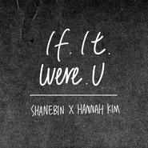

可惜不是你If It Were U
============================

|  |  |
| :--: | :-- |
| [ 可惜不是你If It Were U](https://emumo.xiami.com/album/2102959679) | **艺人**: [金海心](../index.md) **语种**: 国语 **唱片公司**: 长长星瀚 **发行时间**: 2017年11月24日 **专辑类别**: EP, 单曲 **专辑风格**: 国语流行 Mandarin Pop, 华语唱作人 Chinese Singer-Songwriter **播放数**: 3661319 **收藏数**: 238 **评论数**: 39  |

## 简介

“ 熟悉的名字，不同的旋律，多了新的声音。。。。” 此刻当我紧张的打开，听完，六分十秒，整个人似乎被时间停滞了下来，满脸泪痕，内心汹涌澎拜，很多经历一幕幕的出现在眼前。  
当娘家人叶子邀约为了电视剧重新改编“可惜不是你”这首歌的时候，一开始我 和曹轩宾都是很排斥的，一是因为这个歌曲的烙印太深刻，已经有了梁静茹和他自己的经典版本，再度给这个歌曲一个新的生命是非常难的一件事情，二是他作为音乐人来说，经典的创作是不愿意再去炒回锅肉的，他的全部精力都在创作自己当下跟时代标签有关系的音乐，所以我们每次提到这首歌，都有一个莫名的防火墙模式。当娘家人一再强调这个歌曲对于他们的重要性之后，我和轩宾因为这首歌展开了长达一周的“谈判”模式，最后以必须给予他歌曲重编和再度创作的最大空间为前提，我们决定了再度重编“可惜不是你”。  
这首歌成就了曾经在幕后10年的曹轩宾，也从幕后走到了幕前。当他在某卫视节目中深情款款地自弹自唱之后，在网络各大视频网站点击量瞬间破了几千万，在那个新媒体刚开始繁荣的时代，很幸运的，他以歌手的身份让大家开始认识和关注。“可惜不是你”这首歌是一座桥梁，也是一个里程碑。之后他以艺人出道、发片、真人秀、拿各种音乐奖项、开演唱会、拍戏、西安音乐协会的会长、新加坡来福士音乐学院的流行音乐客座教授等等，这中间每一步，作为朋友和经纪人，我都知道我们都经历了些什么。  
和他相识和在一起合作已经有十几年的时间了，我们从朋友成为合作伙伴到现在，看到他身上每一个进步和改变，从满身带刺的棱角，到现在用大爱的人生观待人做事，眼前的这位曾经被所有人吐槽“难搞”的音乐人，现在成为我工作强压下的治疗师，曾经我们的争吵、争辩、冷战到相知相惜和信任，经历的历历在目。曾经我们都怀疑过，你的音乐和我的能力，红？不红？音乐好与不好，经纪的市场和受益多还是少，一度在经历的某些阶段让我们各自沉淀自省，然后再度又各自打气制造希望，坚持再坚持，你告诉我，“红是一个结果，不红是一个过程”，我告诉你“用尽力气做你自己喜欢的音乐”，我们似乎开始习惯彼此的方式、审美还有节奏，不紧不慢的在做音乐以及跟音乐相关的事情。 曾经身边很好的朋友都提醒我，你怎么能这样让曹轩宾做背离市场化的音乐，而且一首歌的制作费那么高？为什么要找最好的弦乐团？找最好的混音师？为什么要到新加坡、韩国甚至美国制作？他孜孜不倦像个所谓艺术家的方式工作着，无论在我们接的电影电视剧歌曲的制作，还是他自己的专辑，甚至这首“可惜不是你”，几乎他可以用掉预算的百分之八十，而我也已经习惯性地不闻不问，最后他统计一个花费告诉我，我让财务付款。身边的人看不懂，也不明白，他们担心我和他，在这样的经营方式下，我们如何真正用音乐养活自己，养活公司？  
这个问题没有标准答案，需要自我心里建设或者阿甘精神胜利法，每次听到他最后呈现出来的作品，刚所说的一切疑虑瞬间都变成了浮云，“好的音乐，值得我们这样去付出去对待”，用好的音乐回馈在内心无数次挣扎的我们，经历的都化成了一种能量，开始看淡周遭的音乐和歌手在真人秀节目后的一举成名，潜心专研音乐，慢慢贴上小众的标签，活在像“独立音乐人”的生活里面。看到这次他为了“可惜。。”在韩国和金海心一度折腾着录音，然后飞到新加坡熬个几个通宵做后期，中间往返国内穿插着节目、音乐节的演出，他很累却又快乐的像个孩子，每次半夜手机都会收到不同版本的demo片段，一堆的文字感悟和解读，他说他就想及时和我分享，因为他觉得我会感同身受。所以他在音乐面前就像个战士，为了一切的美好，可以排除万难，万劫不复。  
还有人最近一直在问我，为什么蒙面没有曹轩宾去呢？为什么。。。没有曹轩宾？写到这里，我才发现，原来让你红极一时的“可惜不是你”，却给了最好的答案。和海心对唱的这版，就如两个经历过旧事的人，释然、坦然、豁然的解读了过往。那一段经历，无论是爱情、事业、生活，在今天此时此刻，我们都能浅带微笑的看待，温暖的把故事虚构圆满。  
很感谢你，曹轩宾，你的音乐让我对未来一直充满信心！  
“ 可惜不是你”对于我们来言，这不仅仅是一首歌曲，是一种信念，一种生活态度，不完美的人生，缺失的那一部分成功，或许就是我们在坚持音乐这条路上的源动力，促使我们不断前行。

## 曲目

- [可惜不是你网络剧《可惜不是你》片尾曲 / 原唱: 梁静茹 / If It Were U](./2102959679/mS1nkr689ef.md)

## 评论

|  |  |  |
| :-- | :-- | :-- |
|  [虾米用户](https://emumo.xiami.com/u/429715607)  2020-10-23 19:49 赞(0) 踩(0) | 
最完美版本！ 
 |
|  [虾米用户](https://emumo.xiami.com/u/2390643) 那些定格在岁月里的音乐，... 2020-07-04 23:47 赞(0) 踩(0) | 
唱一辈子
 |
|  [虾米用户](https://emumo.xiami.com/u/420794423)  2019-10-27 01:27 赞(0) 踩(0) | 
蛮好的演绎，跟梁静茹的不一样。
 |
|  [虾米用户](https://emumo.xiami.com/u/66823378)  2019-05-21 12:27 赞(0) 踩(0) | 

 |
|  [虾米用户](https://emumo.xiami.com/u/9103905) 五月天 周杰伦 Nell... 2019-05-06 01:23 赞(0) 踩(0) | 
好好看看人家写的文案
 |
|  [虾米用户](https://emumo.xiami.com/u/25314912) 我还没想好要写什么... 2019-01-19 22:08 赞(0) 踩(0) | 
一辈子一首歌，够了
 |
|  [虾米用户](https://emumo.xiami.com/u/40799462) 听什么都没劲那也听 2018-01-31 15:40 赞(5) 踩(0) | 
你是写不出别的歌了吗
 |
|  [虾米用户](https://emumo.xiami.com/u/317547768)  2018-01-25 22:35 赞(0) 踩(0) | 
听了没感觉，苦哈哈的。高潮部分不应该情绪更饱满一些吗，一直都平平的没有起伏。不过还是很喜欢金海心。
 |
|  [虾米用户](https://emumo.xiami.com/u/6859022)  2018-01-22 23:44 赞(0) 踩(0) | 
惨~~~
 |
|  [虾米用户](https://emumo.xiami.com/u/123388710) 晚来风急。 2017-12-16 18:15 赞(1) 踩(0) | 
很喜欢金海心
 |
|  [虾米用户](https://emumo.xiami.com/u/29839821) 音樂空間 盡在這裡 2017-12-09 10:05 赞(17) 踩(0) | 
一首歌 他到底要唱几年？ 
 |
| ⇒ |  [虾米用户](https://emumo.xiami.com/u/330538125)  2019-01-21 14:50 赞(0) 踩(0) | 
是啊 而且无论什么场合都要把这个歌编进去。
 |
|  [虾米用户](https://emumo.xiami.com/u/177449980)  2017-12-08 10:08 赞(1) 踩(0) | 
文案泪奔了 加油！！
 |
|  [虾米用户](https://emumo.xiami.com/u/259520037)  2017-12-06 15:26 赞(4) 踩(0) | 
剩饭炒出翔
 |
|  [虾米用户](https://emumo.xiami.com/u/45633448)   2017-12-05 00:04 赞(10) 踩(0) | 
真想听金海心的独唱版
 |
| ⇒ |  [虾米用户](https://emumo.xiami.com/u/330538125)  2019-01-21 14:51 赞(0) 踩(0) | 
我希望金海心去"我是歌手"。
 |
|  [虾米用户](https://emumo.xiami.com/u/47976755)  2017-12-03 21:18 赞(2) 踩(0) | 
这哥唱了十几年还在唱
 |
|  [虾米用户](https://emumo.xiami.com/u/210919109)  2017-12-02 18:40 赞(1) 踩(0) | 
关喆至少在不断的发新歌.
 |
|  [虾米用户](https://emumo.xiami.com/u/2928117) 你好 2017-12-02 00:52 赞(4) 踩(0) | 
&amp;hellip;&amp;hellip;编曲的开头多美，突然来一个颤抖的苦比的男低音，吓死我了&amp;hellip;&amp;hellip;
 |
|  [虾米用户](https://emumo.xiami.com/u/66823378)  2017-11-29 19:51 赞(1) 踩(0) | 
喜欢这版，爱上这歌
 |
|  [虾米用户](https://emumo.xiami.com/u/67855362) Lhasa，my lov... 2017-11-29 07:47 赞(0) 踩(0) | 
看到名字点进来以为是前几年的专辑 
 |
|  [虾米用户](https://emumo.xiami.com/u/38881044)  2017-11-28 22:47 赞(5) 踩(0) | 
梁静茹唱了 你自己独唱 现在又合唱 真的要一首歌吃一辈子吗
 |
|  [虾米用户](https://emumo.xiami.com/u/44383194)  2017-11-28 21:18 赞(0) 踩(0) | 
世道变了，还想一首歌吃一辈子。
 |
|  [虾米用户](https://emumo.xiami.com/u/16018379)  2017-11-28 20:17 赞(1) 踩(0) | 
没有梁静茹的顺
 |
|  [虾米用户](https://emumo.xiami.com/u/15523098) 道阻且长 2017-11-28 15:24 赞(0) 踩(0) | 
越听越感伤 什么鬼
 |
|  [虾米用户](https://emumo.xiami.com/u/3941600)  2017-11-28 10:21 赞(0) 踩(0) | 
原创已死，满屏翻唱
 |
|  [虾米用户](https://emumo.xiami.com/u/709679) 愛音樂、愛蝦米○o。 2017-11-28 07:05 赞(3) 踩(0) | 
你还有别的歌吗？
 |
|  [虾米用户](https://emumo.xiami.com/u/216804970) 人生没有白走的路，每一步... 2017-11-28 01:06 赞(4) 踩(0) | 
先说爱的先不爱，后动心的不死心 从未拥有一秒钟，却已失去千万次
 |
|  [虾米用户](https://emumo.xiami.com/u/52347425) 喜欢好音乐 2017-11-28 00:36 赞(0) 踩(0) | 
挺不错
 |
|  [虾米用户](https://emumo.xiami.com/u/52347425) 喜欢好音乐 2017-11-28 00:35 赞(2) 踩(0) | 
曹轩宾挺有实力，要火了
 |
|  [虾米用户](https://emumo.xiami.com/u/333062055)  2017-11-27 23:35 赞(0) 踩(0) | 
金海星的声音太清澈了，大爱
 |
|  [虾米用户](https://emumo.xiami.com/u/1936781) 华语流行音乐乐评人，新浪... 2017-11-27 16:21 赞(3) 踩(0) | 
我不管 金海心唱什么我都爱！！
 |
|  [虾米用户](https://emumo.xiami.com/u/457666) 我还没想好要写什么... 2017-11-27 16:11 赞(1) 踩(0) | 
也就这一首歌了，快被榨干了
 |
|  [虾米用户](https://emumo.xiami.com/u/5514969)  2017-11-27 14:39 赞(4) 踩(0) | 
跟关喆一样，唱的再深情，就是感动不了人
 |
|  [虾米用户](https://emumo.xiami.com/u/6364269) 暂无签名~ 2017-11-27 10:36 赞(1) 踩(0) | 
短短续续的不顺畅似的，个人感觉没法超越梁静茹版！！！！
 |
|  [虾米用户](https://emumo.xiami.com/u/9033060)  2017-11-27 10:23 赞(1) 踩(0) | 
OMG！！！！女神金海心！！！
 |
|  [虾米用户](https://emumo.xiami.com/u/265902598) 不二姑凉 2017-11-25 10:12 赞(2) 踩(0) | 
最有feel的&amp;mdash;&amp;mdash;可惜不是你
 |
|  [虾米用户](https://emumo.xiami.com/u/102649684) 如果我死了 2017-11-25 04:20 赞(0) 踩(0) | 
哇哦，。。
 |
|  [虾米用户](https://emumo.xiami.com/u/79224110)  2017-11-24 23:59 赞(0) 踩(0) | 
哇哇，沙发
 |
