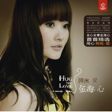

拥抱爱Hug The Love
============================

|  |  |
| :--: | :-- |
| [ 拥抱爱Hug The Love](https://emumo.xiami.com/album/80276) | **艺人**: [金海心](../index.md) **语种**: 国语 **唱片公司**: 金信子 **发行时间**: 2010年08月25日 **专辑类别**: 精选集 **专辑风格**: 国语流行 Mandarin Pop, 华语唱作人 Chinese Singer-Songwriter **播放数**: 2252664 **收藏数**: 437 **评论数**: 57  |

## 简介

玲珑女孩金海心，倾情演绎，给你拥抱的印记，剔透的声音，精致的旋律，海心带给你的不只是歌声，是音乐直流心底，透彻心扉， 让你心随所动的心情释放。 曾经清晰的轮廓依旧停在心头荡漾，挥之不去的只是那一片抹不掉的爱情印记等到孤寂的时候，拿出一点，以慰籍落寞的心情，可我们总是忘记了，那遗弃在角落的幸福密码。

## 曲目

- [爱转了一圈MV](./80276/OuPw7169d.md)
- [阳光下的花儿MV](./80276/b4srHb7be5.md)
- [小白船](./80276/b4srIb2963.md)
- [呼吸.爱MV](./80276/b4srJc7d26.md)
- [爱似水仙MV](./80276/bf0t8H42e842.md)
- [说好不后悔MV](./80276/xLrD1ldd0d1.md)
- [天涯歌女](./80276/mQ6ECC4ed1c.md)
- [飞走了MV](./80276/xLrD1ncc089.md)
- [拥抱的印记MV](./80276/8GbODVfe1a2.md)
- [爱在你我之间](./80276/bqve76j3ad32.md)

## 评论

|  |  |  |  |
| :-- | :-- | :-- | :-- |
|  [虾米用户](https://emumo.xiami.com/u/33263942)  2020-04-16 00:40 赞(1) 踩(0) | 
版权回来了，开心
 |
|  [虾米用户](https://emumo.xiami.com/u/227631916)  2019-09-26 00:02 赞(1) 踩(0) | 
这么独特高级的声音真的现在太少见了，音色还很有穿透力，真的很美的歌声，希望多多出歌吧，现在的口水歌真的太多了，很无奈。
 |
|  [虾米用户](https://emumo.xiami.com/u/127458556)   2018-03-12 14:07 赞(0) 踩(0) | 
超级喜欢《爱似水仙》
 |
|  [虾米用户](https://emumo.xiami.com/u/15270473) 听到喜欢的歌 身体不跟着... 2018-01-06 22:59 赞(0) 踩(0) | 
-
 |
|  [虾米用户](https://emumo.xiami.com/u/14586555) 123456789 2015-03-30 12:55 赞(0) 踩(0) | 
好听
 |
|  [虾米用户](https://emumo.xiami.com/u/24583053) 嗯... 2013-11-18 19:01 赞(1) 踩(0) | 
声音很棒，曲调很棒，歌词也很棒
 |
|  [虾米用户](https://emumo.xiami.com/u/26222631)  2013-11-10 14:51 赞(0) 踩(0) | 
金海心
 |
|  [虾米用户](https://emumo.xiami.com/u/1293455)  2013-08-30 12:24 赞(0) 踩(0) | 
很喜欢金海心的歌曲，治愈系。呵呵呵。。。。
 |
|  [虾米用户](https://emumo.xiami.com/u/1373102)  2013-03-21 17:22 赞(0) 踩(0) | 
两年了
 |
|  [虾米用户](https://emumo.xiami.com/u/7959981) 能够收听到很多很多好听的 2013-02-17 16:41 赞(0) 踩(0) | 
喜欢海心剔透的声音
 |
|  [虾米用户](https://emumo.xiami.com/u/220719) 自知不自見，自愛不自貴 2013-01-11 21:17 赞(0) 踩(0) | 
這張是專輯啊，爲什麽要寫上精選集？
 |
| ⇒ |  [虾米用户](https://emumo.xiami.com/u/355865) Let it go, l... 2013-06-28 16:34 赞(0) 踩(0) | 
新曲+精选
 |
| ⇒ |  [虾米用户](https://emumo.xiami.com/u/220719) 自知不自見，自愛不自貴 2013-06-28 20:24 赞(0) 踩(0) | 
<q><b>Desperado说：</b></q>
 |
| ⇒ |  [虾米用户](https://emumo.xiami.com/u/355865) Let it go, l... 2013-06-28 20:27 赞(0) 踩(0) | 
<q><b>望月優说：</b></q>
 |
| ⇒ |  [虾米用户](https://emumo.xiami.com/u/220719) 自知不自見，自愛不自貴 2013-06-28 20:30 赞(0) 踩(0) | 
<q><b>Desperado说：</b></q>
 |
| ⇒ |  [虾米用户](https://emumo.xiami.com/u/355865) Let it go, l... 2013-06-28 20:36 赞(0) 踩(0) | 
<q><b>望月優说：</b></q>
 |
| ⇒ |  [虾米用户](https://emumo.xiami.com/u/220719) 自知不自見，自愛不自貴 2013-06-28 20:45 赞(0) 踩(0) | 
<q><b>Desperado说：</b></q>
 |
| ⇒ |  [虾米用户](https://emumo.xiami.com/u/355865) Let it go, l... 2013-06-28 20:47 赞(0) 踩(0) | 
<q><b>望月優说：</b></q>
 |
| ⇒ |  [虾米用户](https://emumo.xiami.com/u/220719) 自知不自見，自愛不自貴 2013-06-28 21:05 赞(0) 踩(0) | 
<q><b>Desperado说：</b></q>
 |
|  [虾米用户](https://emumo.xiami.com/u/7831643) Hello，world！ 2012-12-31 19:43 赞(0) 踩(0) | 
很好听！
 |
|  [虾米用户](https://emumo.xiami.com/u/7784528)  2012-11-12 11:22 赞(0) 踩(0) | 
好
 |
|  [虾米用户](https://emumo.xiami.com/u/7580393) 欢迎来查询非320K专辑 2012-07-16 12:39 赞(0) 踩(0) | 
<a href="http://www.xiami.com/group/thread-detail/tid/401268" target="_blank" rel="nofollow noreferrer noopener">http://www.xiami.com/group/thread-detail/tid/401268</a>192K
 |
|  [虾米用户](https://emumo.xiami.com/u/7755773) 进入自己的世界。 2012-07-10 05:45 赞(0) 踩(0) | 
安静旋律。
 |
|  [虾米用户](https://emumo.xiami.com/u/8128667)   2012-07-02 13:37 赞(0) 踩(0) | 
金海心
 |
|  [虾米用户](https://emumo.xiami.com/u/8423496)  2012-04-20 17:25 赞(0) 踩(0) | 
就是喜欢
 |
|  [虾米用户](https://emumo.xiami.com/u/8190783) 我还没想好要写什么... 2012-03-06 19:10 赞(0) 踩(0) | 
+1
 |
|  [虾米用户](https://emumo.xiami.com/u/6610432)  2011-12-17 14:04 赞(0) 踩(0) | 
喜欢~~动听的声音
 |
|  [虾米用户](https://emumo.xiami.com/u/6005866)  2011-09-27 22:26 赞(0) 踩(0) | 
特别的声音，喜欢
 |
|  [虾米用户](https://emumo.xiami.com/u/5190540)  2011-08-21 17:24 赞(0) 踩(0) | 
喜欢她的声音
 |
|  [虾米用户](https://emumo.xiami.com/u/5212025)  2011-08-10 15:24 赞(0) 踩(0) | 
喜欢这声音，不过歌曲并不是特别多好听。
 |
|  [虾米用户](https://emumo.xiami.com/u/2659415)  2011-05-20 22:12 赞(0) 踩(0) | 
w
 |
|  [虾米用户](https://emumo.xiami.com/u/3694848)  2011-05-03 11:10 赞(0) 踩(0) | 
收
 |
|  [虾米用户](https://emumo.xiami.com/u/376825)  2011-03-30 12:41 赞(0) 踩(0) | 
爱转了一圈——群星版<a href="http://www.xiami.com/song/1769113707" target="_blank" rel="nofollow noreferrer noopener">http://www.xiami.com/song/1769113707</a>
 |
|  [虾米用户](https://emumo.xiami.com/u/2680124)  2011-02-12 22:37 赞(0) 踩(0) | 
这张CD中好像有的歌和《玲珑》里是重复的吧？
 |
| ⇒ |  [虾米用户](https://emumo.xiami.com/u/4275776) 虾米音质检测督查账号 2012-07-01 09:14 赞(0) 踩(0) | 
恩，所以算是精选集了～
 |
|  [虾米用户](https://emumo.xiami.com/u/2677809) 地球某角的一头 2011-02-09 17:14 赞(0) 踩(0) | 
喜欢
 |
|  [虾米用户](https://emumo.xiami.com/u/524992)  2011-01-20 04:20 赞(0) 踩(0) | 
好听
 |
|  [虾米用户](https://emumo.xiami.com/u/74982)  2010-09-07 08:58 赞(0) 踩(0) | 
金海心完全被这个啥金信子白瞎了
 |
| ⇒ |  [虾米用户](https://emumo.xiami.com/u/355865) Let it go, l... 2010-09-07 14:08 赞(0) 踩(0) | 
+1
 |
|  [虾米用户](https://emumo.xiami.com/u/1113410)  2010-09-05 02:01 赞(0) 踩(0) | 
<a href="http://www.xici.net/d129142367.htm" target="_blank" rel="nofollow noreferrer noopener">http://www.xici.net/d129142367.htm</a>我在西祠已发过了。。。。就是上传不了虾米？？
 |
|  [虾米用户](https://emumo.xiami.com/u/1113410)  2010-09-05 01:56 赞(0) 踩(0) | 
一点速度没有，上传太慢  还是无法上传？？？？
 |
|  [虾米用户](https://emumo.xiami.com/u/1113410)  2010-09-05 01:32 赞(0) 踩(0) | 
把9号加进来，否则我无法把序号对应，老是上传不了。。。。。郁闷啊！
 |
|  [虾米用户](https://emumo.xiami.com/u/6034)  2010-09-04 22:51 赞(0) 踩(0) | 
这张精选集的选曲，捉摸不透。
 |
| ⇒ |  [虾米用户](https://emumo.xiami.com/u/355865) Let it go, l... 2010-09-05 01:43 赞(0) 踩(0) | 
就是圈钱专辑，唯一解释的通的解释……
 |
| ⇒ |  [虾米用户](https://emumo.xiami.com/u/6034)  2010-09-05 10:10 赞(0) 踩(0) | 
<q><b>Desperado说：</b></q>
 |
| ⇒ |  [虾米用户](https://emumo.xiami.com/u/355865) Let it go, l... 2010-09-05 10:31 赞(0) 踩(0) | 
<q><b>核桃说：</b></q>
 |
|  [虾米用户](https://emumo.xiami.com/u/1113410)  2010-09-04 15:27 赞(0) 踩(0) | 
好慢啊。。。。上传的速度也忒慢啦！！
 |
|  [虾米用户](https://emumo.xiami.com/u/355865) Let it go, l... 2010-09-04 13:17 赞(0) 踩(0) | 
请上传者注意，不必上传第9首拥抱的印记。
 |
| ⇒ |  [虾米用户](https://emumo.xiami.com/u/587223) ILoveWynona 2010-09-04 13:33 赞(0) 踩(0) | 
第九首怎么一回事…？
 |
| ⇒ |  [虾米用户](https://emumo.xiami.com/u/355865) Let it go, l... 2010-09-04 13:34 赞(0) 踩(0) | 
<q><b>Bloomberg说：</b></q>
 |
| ⇒ |  [虾米用户](https://emumo.xiami.com/u/1661453)   2010-12-19 19:15 赞(0) 踩(0) | 
<q><b>Desperado说：</b></q>
 |
| ⇒ |  [虾米用户](https://emumo.xiami.com/u/355865) Let it go, l... 2010-12-19 19:48 赞(0) 踩(0) | 
<q><b>Nowhy说：</b></q>
 |
| ⇒ |  [虾米用户](https://emumo.xiami.com/u/1661453)   2010-12-20 22:40 赞(0) 踩(0) | 
<q><b>Desperado说：</b></q>
 |
