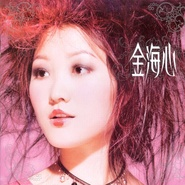

金海心 同名专辑Hannah Kim
============================

|  |  |
| :--: | :-- |
| [ 金海心 同名专辑Hannah Kim](https://emumo.xiami.com/album/9551) | **艺人**: [金海心](../index.md) **语种**: 国语 **唱片公司**: 华纳音乐 **发行时间**: 2003年12月31日 **专辑类别**: 录音室专辑 **专辑风格**: 国语流行 Mandarin Pop, 华语唱作人 Chinese Singer-Songwriter **播放数**: 2575823 **收藏数**: 549 **评论数**: 73  |

## 简介

乐坛才女亲自担纲制作 集结亚洲顶尖幕后制作班底  
全力打造内地歌坛天后 「金海心」踏新年钟声如约而至    
  
★初次全新另类迷幻曲风《此时 彼刻》  
★欧洲古典浪漫情歌《对他说》  
★再次掀起新一轮K歌热潮的《她比我懂你吗》  
★横扫中国百余家排行榜热门冠军单曲《对岸》、《悲伤的秋千》    
  
《金海心》由金海心亲自担纲监制以及制作。向来对音乐有独到见解的海心，此次对集结了高水准的国内外幕后班底，由姚若龙填词、日本的作曲家Bonnie Pink创作的《听见》，是一首汇集亚洲顶尖制作水准的经典歌曲，特别是新加坡著名音乐人吴庆隆的编曲：将优美的钢琴旋律、大气的弦乐编排，与金海心高超的演唱相互呼应，犹如神来之笔，点睛之作，堪称经典不朽的传世金曲。法国作曲家Patrick Bruel 和Gerard Presgurvic的《对他说》，是学院派的典范，优雅得体的歌曲增加了此张唱片的含金量，绝对具有收藏价值的豪华金唱片。

## 曲目

- [此时·彼刻This Moment·That Moment](./9551/omyneaa0b.md)
- [对他说Speak To Him](./9551/kapmca954.md)
- [对岸Margin](./9551/fOgl779d7.md)
- [Hello你好](./9551/omyqf66b4.md)
- [悲伤的秋千MV电视剧《飞刀又见飞刀》片尾曲 / Sad Swing](./9551/9lh1687fa.md)
- [她比我懂你吗Does She Know U Better?](./9551/kapqcafb0.md)
- [两分钟Two Minutes](./9551/fOgp70a02.md)
- [爱的风度Gentle Lover](./9551/kapsb4341.md)
- [听见Hearing](./9551/omyvf350a.md)
- [马戏团Circus](./9551/fOgs60d65.md)
- [Message Lover短信情人](./9551/fOgt8b1ad.md)

## 评论

|  |  |  |
| :-- | :-- | :-- |
|  [虾米用户](https://emumo.xiami.com/u/48068917) AmazingGrace 2020-09-20 20:57 赞(0) 踩(0) | 
超爱这张专辑，爱的风度。为啥不能听了。
 |
|  [虾米用户](https://emumo.xiami.com/u/25638260)  2019-02-14 03:53 赞(0) 踩(0) | 
我买过这个专辑，当时其实不想买，我都没看出来，是金海心！∵
 |
|  [虾米用户](https://emumo.xiami.com/u/2750759) 我还没想好要写什么... 2018-11-08 12:34 赞(0) 踩(0) | 
别diss造型了，这个造型是她自己的创意..
 |
|  [虾米用户](https://emumo.xiami.com/u/3806832) 愿力无尽。 2018-01-28 02:23 赞(1) 踩(0) | 
初中循环了不下一千次的专辑吧，我心目中最有灵气的华语女歌手。
 |
|  [虾米用户](https://emumo.xiami.com/u/15270473) 听到喜欢的歌 身体不跟着... 2018-01-06 21:36 赞(0) 踩(0) | 
/
 |
|  [虾米用户](https://emumo.xiami.com/u/8015923) 我还没想好要写什么... 2017-10-28 07:36 赞(0) 踩(0) | 
百听不厌的专辑。 尤其那首对他说，金海心说听了她的Demo就把版权给她了。
 |
|  [虾米用户](https://emumo.xiami.com/u/49266054)  2017-10-21 01:13 赞(1) 踩(0) | 
十多年了，听的前奏就会跟着一起，没有一丝丝的遗忘
 |
|  [虾米用户](https://emumo.xiami.com/u/29919681)  2017-10-05 15:14 赞(0) 踩(0) | 
就是制作封面的人坑了她才紅不起...
 |
|  [虾米用户](https://emumo.xiami.com/u/1113346) 你曾怀疑，别忧郁我们终将... 2016-12-07 11:15 赞(0) 踩(0) | 
对岸
 |
|  [虾米用户](https://emumo.xiami.com/u/355865) Let it go, l... 2016-10-26 16:07 赞(0) 踩(0) | 
#虾米你虫洞穿越观光团到此一游#～
 |
|  [虾米用户](https://emumo.xiami.com/u/11069952) 我还没想好要写什么... 2016-09-09 10:11 赞(1) 踩(0) | 
她出道唱歌只有11岁，从没签过公司，没有通过唱歌赚过一分钱。都是网上免费下载。她现在结婚了准备要宝宝，今年16年她27岁。没有红是因为在四川西华师范大学音乐学院上学是的学生，一直很低调。她叫尹镱潭，回族籍贯山东济南市市中区。
 |
|  [虾米用户](https://emumo.xiami.com/u/71746274)  2016-07-25 11:13 赞(0) 踩(0) | 
千万不要得罪造型师
 |
|  [虾米用户](https://emumo.xiami.com/u/2236868) 躁抑的夏天来了 2016-03-04 20:54 赞(6) 踩(0) | 
话说看这几张专辑封面，我还真是最喜欢这张。 #我可能是一个人#
 |
|  [虾米用户](https://emumo.xiami.com/u/20766868)  2016-03-03 10:55 赞(2) 踩(0) | 
悲伤的秋千，这首歌很好听，居然是2003年的歌了
 |
|  [虾米用户](https://emumo.xiami.com/u/11262067) 温柔的坚持 2016-02-01 00:37 赞(1) 踩(0) | 
同喜欢封面
 |
|  [虾米用户](https://emumo.xiami.com/u/2541555) Sakha Republ... 2016-01-11 10:29 赞(1) 踩(0) | 
为什么下架了。。。哎。。。
 |
|  [虾米用户](https://emumo.xiami.com/u/32126406) 身体住了个老灵魂 2015-10-30 21:02 赞(1) 踩(0) | 
就是封面太丑了，不是一般的丑哈哈！
 |
|  [虾米用户](https://emumo.xiami.com/u/3762254)  2015-08-12 22:22 赞(1) 踩(0) | 
整张专辑都是满满回忆
 |
|  [虾米用户](https://emumo.xiami.com/u/40228404) 我还没想好要写什么... 2015-08-04 13:59 赞(0) 踩(0) | 
十年前听的时候，最喜欢对岸和爱的风度。
 |
|  [虾米用户](https://emumo.xiami.com/u/1182761) 松任谷由实的迷弟 2015-07-17 17:43 赞(0) 踩(0) | 
金海心是张亚东作曲的
 |
|  [虾米用户](https://emumo.xiami.com/u/1401579)  2015-07-06 16:19 赞(11) 踩(0) | 
说实话这张专辑当年最吸引我的反而是封面，粉色华丽巴洛克的感觉，很漂亮。
 |
|  [虾米用户](https://emumo.xiami.com/u/11229485)  2015-07-04 20:42 赞(0) 踩(0) | 
期待海心再出新专辑！！！！！！！！
 |
|  [虾米用户](https://emumo.xiami.com/u/4574724)  2015-03-20 18:30 赞(0) 踩(0) | 
这封面是什么玩意……无良的公司
 |
|  [虾米用户](https://emumo.xiami.com/u/10525830)  2015-02-13 15:24 赞(0) 踩(0) | 
好碟
 |
|  [虾米用户](https://emumo.xiami.com/u/8030412)   2015-01-26 00:50 赞(0) 踩(0) | 
好碟
 |
|  [虾米用户](https://emumo.xiami.com/u/7415937)   2014-09-21 22:14 赞(0) 踩(0) | 
灰常好听啦！小学五年级买过磁带
 |
|  [虾米用户](https://emumo.xiami.com/u/39360602)  2014-08-26 16:41 赞(0) 踩(0) | 
特别棒的一张专，就是封面有点毁
 |
|  [虾米用户](https://emumo.xiami.com/u/5924774) 我还没想好要写什么... 2014-07-16 00:36 赞(0) 踩(0) | 
第一次听这张专辑的时候；第一首歌听完我还欣喜若狂的以为这是张实验专辑或者另类专辑。结果继续听后面的歌又把我拉回流行歌曲范畴 ~
 |
|  [虾米用户](https://emumo.xiami.com/u/5924774) 我还没想好要写什么... 2014-07-16 00:23 赞(0) 踩(0) | 
好文案好创意没有遇见好造型师的典范。
 |
|  [虾米用户](https://emumo.xiami.com/u/1960984)   2014-06-13 15:20 赞(0) 踩(0) | 
最好的一张专辑
 |
|  [虾米用户](https://emumo.xiami.com/u/33427)  2014-03-23 23:50 赞(0) 踩(0) | 
绝对好评
 |
|  [虾米用户](https://emumo.xiami.com/u/7550483) 我爱我的平静 2014-03-02 16:25 赞(1) 踩(0) | 
“他比我懂你吗”腼腆女子的爱之失落。字字句句细腻扣人心弦，娓娓道来我们都有过的心境共鸣。“他比我懂你吗”无助又没胆质问，卑微的怜爱让听众与之感怀身受！
 |
|  [虾米用户](https://emumo.xiami.com/u/1415200)  2013-10-17 21:54 赞(0) 踩(0) | 
很喜欢这张专辑。
 |
|  [虾米用户](https://emumo.xiami.com/u/2327862)  2013-09-11 10:29 赞(0) 踩(0) | 
超越时代的一张强大流行专辑;
 |
|  [虾米用户](https://emumo.xiami.com/u/224893) 你这是想红你造吗 2013-09-01 03:47 赞(0) 踩(0) | 
《悲伤的秋千》原唱是谁死活找不着了 在《海洋馆的约会》里作为插曲出现的那个版本
 |
|  [虾米用户](https://emumo.xiami.com/u/4093319)  2013-06-04 09:34 赞(0) 踩(0) | 
来听金海心啦
 |
|  [虾米用户](https://emumo.xiami.com/u/2136325)   2013-04-24 17:53 赞(4) 踩(0) | 
爱的风度好听啊，我最爱的一首金海心的歌，可惜不红啊。。
 |
|  [虾米用户](https://emumo.xiami.com/u/11699681)  2013-04-12 21:10 赞(0) 踩(0) | 
收了
 |
|  [虾米用户](https://emumo.xiami.com/u/10027184)   2013-03-16 15:36 赞(0) 踩(0) | 
好声音，有着自己的独立风格
 |
|  [虾米用户](https://emumo.xiami.com/u/2929115) Miss Honesty 2013-01-17 14:46 赞(0) 踩(0) | 
还是最爱这张专辑&amp;gt;3&amp;lt;
 |
|  [虾米用户](https://emumo.xiami.com/u/5533089) ˉ﹃ˉ 2013-01-13 22:02 赞(22) 踩(0) | 
这封面是什么玩意
 |
| ⇒ |  [虾米用户](https://emumo.xiami.com/u/1938054) 明月在苏州 2013-06-24 15:48 赞(0) 踩(0) | 
你不会审美啊
 |
| ⇒ |  [虾米用户](https://emumo.xiami.com/u/1851561)  2013-09-27 00:21 赞(0) 踩(0) | 
<q><b>小饮说：</b></q>
 |
| ⇒ |  [虾米用户](https://emumo.xiami.com/u/1938054) 明月在苏州 2013-09-27 14:59 赞(0) 踩(0) | 
<q><b>小伙儿哟弹琴 姑娘歌唱说：</b></q>
 |
| ⇒ |  [虾米用户](https://emumo.xiami.com/u/1415200)  2013-10-17 21:55 赞(0) 踩(0) | 
那时候就流行这样，这没办法，歌好听就行了。
 |
| ⇒ |  [虾米用户](https://emumo.xiami.com/u/7641232) 音乐交流wechat：f... 2014-08-17 01:29 赞(0) 踩(0) | 
<q><b>黑色白兔说：</b></q>
 |
| ⇒ |  [虾米用户](https://emumo.xiami.com/u/44962562)  2019-04-26 22:54 赞(0) 踩(0) | 
原来专辑就这个封面
 |
|  [虾米用户](https://emumo.xiami.com/u/7784528)  2012-11-12 11:21 赞(0) 踩(0) | 
好
 |
|  [虾米用户](https://emumo.xiami.com/u/8435450)  2012-10-26 12:30 赞(1) 踩(0) | 
回过头来听，还是那么美
 |
|  [虾米用户](https://emumo.xiami.com/u/8682338)  2012-07-06 08:18 赞(0) 踩(0) | 
最近又听回了金海心，还是爱她这张专辑，不枉费初中我问别人借了磁带听了一遍又一遍……
 |
|  [虾米用户](https://emumo.xiami.com/u/73878)  2012-07-04 15:34 赞(1) 踩(0) | 
当年高考完，CD是借来听的，歌曲质量真的不错。之前买过的SONY出品的两张白听不厌，现在听来，华纳的这两张更对口味。
 |
|  [虾米用户](https://emumo.xiami.com/u/8128667)   2012-07-02 13:12 赞(0) 踩(0) | 
悲伤的秋千
 |
|  [虾米用户](https://emumo.xiami.com/u/2293348)  2012-06-02 11:54 赞(10) 踩(0) | 
海心在华纳出的两张都很有质感 听说加盟陶喆的唱片公司了 希望年底的新专辑成功
 |
| ⇒ |  [虾米用户](https://emumo.xiami.com/u/192167594)   2017-10-15 09:27 赞(0) 踩(0) | 
刚看评论还很激动，然而看了时间 
 |
|  [虾米用户](https://emumo.xiami.com/u/8963455)  2012-06-01 18:10 赞(1) 踩(0) | 
最好听的两手歌曲：对岸，悲伤的秋千。  总的来说这个专辑太棒了！
 |
|  [虾米用户](https://emumo.xiami.com/u/9308850) 音乐无处不在快乐随之而来 2012-05-28 19:37 赞(0) 踩(0) | 
音很有磁性很绕耳大爱
 |
|  [虾米用户](https://emumo.xiami.com/u/9308850) 音乐无处不在快乐随之而来 2012-05-28 19:36 赞(0) 踩(0) | 
音很有磁性很绕耳大爱
 |
|  [虾米用户](https://emumo.xiami.com/u/6530146)  2012-04-19 23:04 赞(0) 踩(0) | 
嗯  很惊艳的一张专辑
 |
|  [虾米用户](https://emumo.xiami.com/u/4803837)  2012-04-18 17:24 赞(0) 踩(0) | 
真的是很爱很爱这张~~~那时我初中
 |
|  [虾米用户](https://emumo.xiami.com/u/8190783) 我还没想好要写什么... 2012-03-06 19:10 赞(0) 踩(0) | 
悲伤的秋千
 |
|  [虾米用户](https://emumo.xiami.com/u/30705) 我还没想好要写什么... 2012-03-04 20:45 赞(0) 踩(0) | 
原来里面的旋律如此熟悉，只是叫不出名字而已……
 |
|  [虾米用户](https://emumo.xiami.com/u/3753765)  2011-10-18 23:23 赞(0) 踩(0) | 
十首歌 每一首都品质一流！
 |
|  [虾米用户](https://emumo.xiami.com/u/3843723)  2011-10-11 17:21 赞(0) 踩(0) | 
最最独特的声线
 |
|  [虾米用户](https://emumo.xiami.com/u/5825915)  2011-09-14 23:06 赞(0) 踩(0) | 
这张奠定了她后来的风格~华丽丽的好听~
 |
|  [虾米用户](https://emumo.xiami.com/u/1846864)   2011-07-14 17:47 赞(0) 踩(0) | 
太好听了！
 |
|  [虾米用户](https://emumo.xiami.com/u/3694848)  2011-05-03 11:06 赞(0) 踩(0) | 
收
 |
|  [虾米用户](https://emumo.xiami.com/u/2968819)  2011-03-10 13:48 赞(0) 踩(0) | 
金海心的歌我很喜欢，实力派声音
 |
|  [虾米用户](https://emumo.xiami.com/u/78279)  2011-03-06 02:55 赞(0) 踩(0) | 
超级喜欢
 |
|  [虾米用户](https://emumo.xiami.com/u/867942)  2010-09-27 01:52 赞(0) 踩(0) | 
个人认为这是金海心最出色的一张专辑，歌曲质量很高，都很好听。没有了《把耳朵叫醒》和《那么骄傲》里的一点稚气，更加有了成熟女人的深度。就像和我一起成长。。。
 |
| ⇒ |  [虾米用户](https://emumo.xiami.com/u/446714)  2010-12-14 23:57 赞(0) 踩(0) | 
我也觉得品质好好，唯独那一个造型，我觉得是最不好的
 |
|  [虾米用户](https://emumo.xiami.com/u/355865) Let it go, l... 2010-09-09 18:10 赞(0) 踩(0) | 
不喜欢封面
 |
|  [虾米用户](https://emumo.xiami.com/u/786445)  2010-07-10 15:38 赞(0) 踩(0) | 
上学的时候常听的  现在又拿出来回味一下~还是那么那么滴好听~~~
 |
|  [虾米用户](https://emumo.xiami.com/u/993316)  2010-07-10 10:07 赞(0) 踩(0) | 
特别地喜欢她这张专辑！
 |
