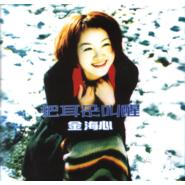

把耳朵叫醒Awakening
============================

|  |  |
| :--: | :-- |
| [ 把耳朵叫醒Awakening](https://emumo.xiami.com/album/9555) | **艺人**: [金海心](../index.md) **语种**: 国语 **唱片公司**: 索尼声像 **发行时间**: 1999年01月07日 **专辑类别**: 录音室专辑 **专辑风格**: 国语流行 Mandarin Pop, 华语唱作人 Chinese Singer-Songwriter **播放数**: 7488652 **收藏数**: 776 **评论数**: 53  |

## 简介

不满20岁的金海心是索尼唱片公司签约的新人，她的专辑《把耳朵叫醒》制作上乘，演唱也十分纯熟、好听。在原创乐坛的一派不景气，台湾歌坛新人在内地市场长驱直入的时候，金海心的出现，给中国的原创歌坛注入了新的活力。    
  
在近年出现的新人中，金海心的《把耳朵叫醒》制作上乘，演唱也十分纯熟、好听，值得推荐。在原创乐坛的一派不景气中，台湾歌坛新人也可在内地市场长驱直入，金海心的出现，总算有一个可以与林晓培、两个女生之流抗衡的内地女歌手。    
  
金海心首张专辑《把耳朵叫醒》！在此专辑还未推出之前，海心的单曲《毫无保留》及《睡不着的海》已是引来了歌迷与乐评界的一致叫好。各地电台的“大腕”DJ们纷纷用“惊艳”、“气质独特”、“极具潜力”等溢美之词来肯定她的唱功，甚至有传媒还将其与同属索尼旗下的李玟、玛丽亚·凯莉作比较。    
  
另外，本专辑还是曾写过《花心》、《舞月光》、《有一点动心》等精彩歌词的台湾著名女词人厉曼婷来内地参与监制的第1张原创专辑，她为海心那“天生丽质难自弃”的嗓音而感动，进而写下了《把耳朵叫醒》、《睡不着的海》、《毫无保留》等灵感纷呈的歌词，为内地的原创音乐平添了亮丽的一笔。    
  
1999年[睡不着的海]全国总评榜TOP 5季选十大金曲上海台冠军东方台冠军各地方榜冠军北京台NO.2中央台NO.2[毫无保留]全国总评榜TOP 5各地方冠军北京台TOP 5中央台TOP 3上海台    
  
[把耳朵叫醒]中央台NO.2上半年度十大金曲上海台NO.1    
  
全国总评榜TOP 5秀选十大金曲各地方榜冠军    
  
[白色问候卡]各地方榜冠军    
  
[依依难舍]上海台冠军东方台NO.2北京台NO.3全国总评榜TOP10各地方榜冠军    
  
2000年全国总评TOP 5中央台NO.7各地方榜冠军    
  
[那么骄傲]雪碧榜NO.1

## 曲目

- [把耳朵叫醒MV电视剧《都是天使惹的祸》插曲 / Awakening](./9555/nfm8f2a91.md)
- [睡不着的海MVThe Sleepless Sea](./9555/iTd8dfc86.md)
- [昨天晚上的分手电话MVThe Cold Calls Last Night](./9555/8dVL3ff36.md)
- [毫无保留MVUnreserved](./9555/zFDI32eb8.md)
- [翅膀Wings](./9555/eGU96dcd4.md)
- [可惜你不快乐MVToo Bad You Are Not Happy](./9555/iTdCd44e7.md)
- [白色问候卡White Greeting Card](./9555/nfmF19245.md)
- [记得Remembered](./9555/rrvI1ff5a.md)
- [情窦初开MVThe Dawning Love](./9555/nfmHfce9e.md)
- [红帆船MVThe Red Sailing Bost](./9555/iTdG97080.md)
- [把耳朵叫醒 (伴奏带)Awakening](./9555/nfmJeb243.md)
- [睡不着的海 (伴奏带)The Sleepless Sea](./9555/v34O25d78.md)
- [毫无保留 (伴奏带)The Cold Calls Last Night](./9555/3RMT3a1d7.md)

## 评论

|  |  |  |
| :-- | :-- | :-- |
|  [虾米用户](https://emumo.xiami.com/u/11046178) 花开堪折直须折 莫待无花... 2019-09-22 21:56 赞(1) 踩(0) | 
本来就是一个宝藏歌手 只是辉煌太短
 |
|  [虾米用户](https://emumo.xiami.com/u/13911932) 暂冇签名~ 2018-04-28 17:38 赞(0) 踩(0) | 

 |
|  [虾米用户](https://emumo.xiami.com/u/300762690) 可以吹些小牛，喝点小酒，... 2018-03-19 10:32 赞(0) 踩(0) | 
一晃这么多年过去了
 |
|  [虾米用户](https://emumo.xiami.com/u/15270473) 听到喜欢的歌 身体不跟着... 2018-01-06 20:08 赞(0) 踩(0) | 
-
 |
|  [虾米用户](https://emumo.xiami.com/u/272909069) 务实的理想主义者，志存高... 2017-11-02 19:53 赞(1) 踩(0) | 
声音真是辨识度超高
 |
|  [虾米用户](https://emumo.xiami.com/u/272909069) 务实的理想主义者，志存高... 2017-11-02 19:53 赞(0) 踩(0) | 
把耳朵叫醒太好听了
 |
|  [虾米用户](https://emumo.xiami.com/u/243885144)  2016-11-13 21:41 赞(5) 踩(0) | 
现在想想，90年代末真是流行音乐井喷期，然后就被日韩欧美还有港台音乐全面冲击，最近十年都是萧条，没有出现过真正意义上的巨星。我们现在听的大部分歌手还是当年那些
 |
|  [虾米用户](https://emumo.xiami.com/u/11443613) 别做梦，梦都给我，雷声给... 2016-09-30 10:08 赞(0) 踩(0) | 
旋律制霸
 |
|  [虾米用户](https://emumo.xiami.com/u/44161341)   2015-08-24 23:24 赞(4) 踩(0) | 
初中和暗恋的妹子一起去ktv，她唱了一首把耳朵叫醒，结果我喜欢了金海心多久就暗恋了那妹子多久，直到现在
 |
|  [虾米用户](https://emumo.xiami.com/u/40124694)  2015-08-22 15:24 赞(2) 踩(0) | 
FLAC无损资源已更新：<a href="http://www.162wp.com/yinle/2015-08-22/24879.html" target="_blank" rel="nofollow noreferrer noopener">http://www.162wp.com/yinle/2015-08-22/24879.html</a>
 |
|  [虾米用户](https://emumo.xiami.com/u/16123526) with 2015-05-18 22:48 赞(5) 踩(0) | 
小学听的，满满回忆。脑海里是，北京，王艳，李小璐，年轻，和纯白色的。
 |
| ⇒ |  [虾米用户](https://emumo.xiami.com/u/15927026) 我只是个敢说不敢做、只说... 2015-06-21 16:16 赞(0) 踩(0) | 
跟王艳和李小璐有什么关系？
 |
| ⇒ |  [虾米用户](https://emumo.xiami.com/u/4098522) Stay real 3... 2015-07-22 22:18 赞(0) 踩(0) | 
<q><b>羊蠢鹅说：</b></q>
 |
| ⇒ |  [虾米用户](https://emumo.xiami.com/u/71746274)  2016-07-25 11:15 赞(0) 踩(0) | 
<q><b>下一站，幸福说：</b></q>
 |
| ⇒ |  [虾米用户](https://emumo.xiami.com/u/4098522) Stay real 3... 2016-07-29 11:28 赞(0) 踩(0) | 
<q><b>Soul说：</b></q>
 |
| ⇒ |  [虾米用户](https://emumo.xiami.com/u/71746274)  2016-08-01 02:45 赞(0) 踩(0) | 
<q><b>下一站，幸福说：</b></q>
 |
|  [虾米用户](https://emumo.xiami.com/u/17766238) 你爱我像谁？ 2015-04-02 23:39 赞(1) 踩(0) | 
《红帆船》《睡不着的海》太赞太被埋没
 |
|  [虾米用户](https://emumo.xiami.com/u/5591661) ， 2015-01-25 02:20 赞(0) 踩(0) | 
我爱这个女生。
 |
|  [虾米用户](https://emumo.xiami.com/u/14453932) no personali... 2014-12-02 00:49 赞(0) 踩(0) | 
把耳朵叫醒很神曲
 |
|  [虾米用户](https://emumo.xiami.com/u/1680029)  2014-09-02 17:02 赞(2) 踩(0) | 
金海心的歌好多都很喜欢，浮躁的社会需要这样的声音，可是她都要被遗忘了，唉！！
 |
|  [虾米用户](https://emumo.xiami.com/u/9401674)  2014-08-31 17:56 赞(1) 踩(0) | 
总觉得她应该更红的，也许她现在有一个美好的家庭了吧，不再留恋歌坛
 |
|  [虾米用户](https://emumo.xiami.com/u/16062499) 我还没想好要写什么... 2014-07-18 08:48 赞(21) 踩(0) | 
从那么骄傲就开始认识了这位灵性的女歌手，那时我还在读小学，但已经被她纯净，感情充沛的歌声深深吸引，真的很喜欢很喜欢她~~ 唉，可惜这么好的声音真的被埋没了啊！！！公司的原因很大吧，我不知道海心本人是怎么想的，但是真的希望她再继续唱歌，继续出专辑，做出更多的好音乐，几年都不出一张专辑就只能循环一些老歌，铁杆粉表示不开心~~~~(&amp;gt;_&amp;lt;)~~~~ 都只能去唱吧听听你翻唱别人的歌- - 要是能被请去《我是歌手》就好了，能让更多人发现她的好声音，这样她就会再出专辑了.... 越来越浮躁的华语乐坛，这样的经典好声音更需要被守护！
 |
|  [虾米用户](https://emumo.xiami.com/u/6650221)  2014-06-30 19:38 赞(1) 踩(0) | 
第一张就很棒，好喜欢。
 |
|  [虾米用户](https://emumo.xiami.com/u/1108114)  2014-04-06 22:43 赞(1) 踩(0) | 
十几年后再听这张专辑就想起了我的大学时代！ 平心而论，这张专辑制作还是比较精良的，有几首歌也是国内词曲作者的诚意之作 一个很有辨识度的女声，怎么后来就泯然众人了呢？可惜了！
 |
| ⇒ |  [虾米用户](https://emumo.xiami.com/u/16062499) 我还没想好要写什么... 2014-07-18 09:02 赞(0) 踩(0) | 
哈哈，楼上一不小心就暴露了年龄
 |
|  [虾米用户](https://emumo.xiami.com/u/1521766)  2014-03-04 15:49 赞(0) 踩(0) | 
许久之前的味道，就像一杯陈酒拿出来才知道原来比以前耿香醇。。。。。。。。。。
 |
|  [虾米用户](https://emumo.xiami.com/u/4281242)  2014-02-11 09:46 赞(0) 踩(0) | 
现在翻出来听才发现好多歌都是三宝写的=口=
 |
|  [虾米用户](https://emumo.xiami.com/u/30986722)  2014-01-04 22:13 赞(2) 踩(0) | 
很有灵性的歌手和声音
 |
|  [虾米用户](https://emumo.xiami.com/u/3936706)  2013-11-07 19:49 赞(0) 踩(0) | 
怀念
 |
|  [虾米用户](https://emumo.xiami.com/u/3936706)  2013-11-07 19:43 赞(0) 踩(0) | 
我有这张专辑，还念~~~
 |
|  [虾米用户](https://emumo.xiami.com/u/42347) 寻找无双 2013-07-22 19:40 赞(0) 踩(0) | 
那些年大陆乐坛为数不多能让我留下印象的专辑之一。如此有特色的好声音，怎么后来就销声匿迹了呢？
 |
|  [虾米用户](https://emumo.xiami.com/u/1249040)  2013-06-24 21:04 赞(17) 踩(0) | 
金海心算是被错误定义的歌手吧，细听她的第一辑，听得出她更想走实力派路线，可唱片公司为她打造的却是另一个清新少女形象，把耳朵叫醒、那么骄傲、悲伤的秋千，主打歌都是如此。但第一辑中的 可惜你不快乐 才是真正的霸气佳作，还有相当soulful的 毫无保留，内地最黑歌手不过分。
 |
| ⇒ |  [虾米用户](https://emumo.xiami.com/u/9039657)  2015-03-10 11:27 赞(0) 踩(0) | 
都怪把耳朵叫醒太红了
 |
|  [虾米用户](https://emumo.xiami.com/u/1182761) 松任谷由实的迷弟 2013-06-10 12:12 赞(1) 踩(0) | 
这张专辑还是黄征制作的，里面有好几首他写的歌。。。。《翅膀》这首金海心自己作词作曲的歌，像极了王菲。
 |
| ⇒ |  [虾米用户](https://emumo.xiami.com/u/91251)  2016-09-21 22:45 赞(0) 踩(0) | 
99到00年左右，黄征制作了好多内地女歌手吧，杨钰莹那张《故事》也是他整张制作。
 |
|  [虾米用户](https://emumo.xiami.com/u/15504008) 耍酷 2013-05-30 21:57 赞(1) 踩(0) | 
喜欢啊
 |
|  [虾米用户](https://emumo.xiami.com/u/12859564)  2013-04-05 17:02 赞(1) 踩(0) | 
好特别的声音，词曲也不错。
 |
|  [虾米用户](https://emumo.xiami.com/u/8147731)  2013-01-07 22:19 赞(1) 踩(0) | 
这是多么好听的一首歌啊！
 |
|  [虾米用户](https://emumo.xiami.com/u/3729370)  2012-09-26 00:06 赞(1) 踩(0) | 
大陆我听过最舒服的女生专辑
 |
|  [虾米用户](https://emumo.xiami.com/u/8128667)   2012-07-02 13:02 赞(0) 踩(0) | 
金海心
 |
|  [虾米用户](https://emumo.xiami.com/u/4966931)  2012-05-01 21:40 赞(2) 踩(0) | 
歌曲不错，只是唱片封面真是太~~~~ 乍一看以为是韩红~~~
 |
|  [虾米用户](https://emumo.xiami.com/u/3146066)   2012-04-08 13:50 赞(1) 踩(0) | 
把耳朵叫醒太耐听了
 |
|  [虾米用户](https://emumo.xiami.com/u/7059199) 天猫精灵～ 2012-03-12 23:35 赞(1) 踩(0) | 
只觉得把耳朵叫醒很耐听~然后就是红帆船的曲风很不错~其他还好~
 |
|  [虾米用户](https://emumo.xiami.com/u/1485157)  2012-02-20 14:36 赞(1) 踩(0) | 
7 好听。
 |
|  [虾米用户](https://emumo.xiami.com/u/6650221)  2012-02-08 20:56 赞(0) 踩(0) | 
大学反复唱的歌！把耳朵叫醒
 |
|  [虾米用户](https://emumo.xiami.com/u/1689947)  2011-12-16 11:30 赞(0) 踩(0) | 
初中的回忆~！洗着澡把音响开的无敌大~！
 |
|  [虾米用户](https://emumo.xiami.com/u/5517785)  2011-11-03 17:16 赞(0) 踩(0) | 
小时候听的歌，好怀念。
 |
|  [虾米用户](https://emumo.xiami.com/u/36029) ½ 2011-10-07 00:07 赞(0) 踩(0) | 
cd 卡带
 |
|  [虾米用户](https://emumo.xiami.com/u/5101531) 诗诗的伙伴是熊猫和黑狗。 2011-08-31 00:10 赞(0) 踩(0) | 
我恰恰最喜欢 07
 |
|  [虾米用户](https://emumo.xiami.com/u/2367398)  2011-08-25 11:12 赞(1) 踩(0) | 
好
 |
|  [虾米用户](https://emumo.xiami.com/u/355865) Let it go, l... 2011-05-10 19:13 赞(0) 踩(0) | 
ISRC CN-E04-98-507-00/A.J6
 |
|  [虾米用户](https://emumo.xiami.com/u/3683288) 抱着猫儿哼小曲儿 2011-04-22 09:45 赞(0) 踩(0) | 
我恰恰最喜欢 03
 |
|  [虾米用户](https://emumo.xiami.com/u/1167729) . 2010-08-25 09:49 赞(0) 踩(0) | 
除了03， 07， 首首强推
 |
