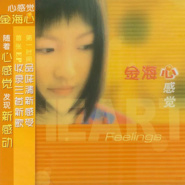
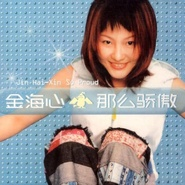

金海心
============================

|  |  |
| :--: | :-- |
| [ 金海心](https://i.xiami.com/jinhaixin) | **地区**: China 中国大陆 **风格**: 国语流行 Mandarin Pop, 华语唱作人 Chinese Singer-Songwriter **播放数**: 67110149 **粉丝数**: 38536 **评论数**: 1387  |

## 档案

金海心（Hannah Kim）华语乐坛最令人珍惜的好声音。著名华语女歌手，创作人、音乐制作人。1999年世纪末横空出世，以超具辨识度的独特嗓音和“心”式唱腔迅速在华语流行乐坛占领一席之地，出道至今，揽货众多奖项及赞誉。其独特歌喉，多变唱腔，使模仿者望而却步。金海心是为数不多既拥有惊艳唱功，又有优秀创作才华的音乐人。在扎实的音乐背景下，她的音乐独特充满张力，音乐理念别具一格，拥有两岸三地众多狂热粉丝追捧。代表作《那么骄傲》《悲伤的秋千》《阳光下的星星》已经成为华语流行乐经典曲目。她是华语乐坛新世纪最具代表性的女歌手之一，并且熟练掌握多门外语。 
录音室专辑：1999《把耳朵叫醒》、2000《那么骄傲》、2001《心感觉》、2002《心得精选》、2003《金海心同名专辑》、2006《独立日》、2009《爱似水仙》、2010《拥抱爱》、2011《玲珑》 
代表曲目：《把耳朵叫醒》、《那么骄傲》、《阳光下的星星》、《悲伤的秋千》、《Lolita》、《右手戒指》、《爱似水仙》、《呼吸爱》、《飞走了》、《女人们的咖啡》、《爱转了一圈》、《过去》、《天天》、《把鞋子甩掉》、《那时的天空》、《来不及》、《猫咪森林》、《对他说》、《梦想缤纷》、《对岸》、《此时彼刻》、《独立日》、《心感觉》、《蜘蛛的蜜蜂》

## 专辑

| 名称 | 语种 | 唱片公司 | 发行时间 | 专辑类别 | 专辑风格 |
| :--: | :-- | :-- | :-- | :-- | :-- |
| [ 穿越时空的呼唤](./albums/2106077040.md) | 国语 | 独立发行 | 2020年02月19日 | 原声带, 影视音乐 | 流行 Pop |
| [ 猫黛丽赫本](./albums/2420406130.md) | 国语 | 独立发行 | 2018年10月30日 | 现场专辑 | 流行 Pop |
| [ 可惜不是你If It Were U](./albums/2102959679.md) | 国语 | 长长星瀚 | 2017年11月24日 | EP, 单曲 | 国语流行 Mandarin Pop, 华语唱作人 Chinese Singer-Songwriter |
| [ Hannah Kim 创作自选集The Wonder Sounds of Hannah Kim](./albums/2100252900.md) | 国语 | 金海心音乐工作室 | 2015年12月31日 | 精选集 | 国语流行 Mandarin Pop, 华语唱作人 Chinese Singer-Songwriter |
| [ 唱过什么歌](./albums/81980412.md) | 国语 | 金海心音乐工作室 | 2013年10月17日 | EP, 单曲 | 国语流行 Mandarin Pop, 华语唱作人 Chinese Singer-Songwriter |
| [ 心 发现Found Hannah](./albums/371635408.md) | 国语 | 金海心音乐工作室 | 2012年06月01日 | 录音室专辑 | 国语流行 Mandarin Pop, 华语唱作人 Chinese Singer-Songwriter |
| [ 青春中国Young Chin](./albums/2420413184.md) | 国语 | 独立发行 | 2012年05月19日 | EP, 单曲 | 流行 Pop |
| [ 玲珑](./albums/398704.md) | 国语 | 金信子 | 2010年09月03日 | 录音室专辑 | 国语流行 Mandarin Pop, 华语唱作人 Chinese Singer-Songwriter |
| [ 拥抱爱Hug The Love](./albums/80276.md) | 国语 | 金信子 | 2010年08月25日 | 精选集 | 国语流行 Mandarin Pop, 华语唱作人 Chinese Singer-Songwriter |
| [ 爱似水仙](./albums/325159.md) | 国语 | 金信子 | 2009年03月31日 | EP, 单曲 | 国语流行 Mandarin Pop, 华语唱作人 Chinese Singer-Songwriter |
| [ 独立日（精装版）](./albums/2104975741.md) | 国语 |  | 2006年05月13日 | 录音室专辑 | 华语唱作人 Chinese Singer-Songwriter, 国语流行 Mandarin Pop |
| [ 独立日Independence Day](./albums/9550.md) | 国语 | 华纳音乐 | 2006年01月12日 | 录音室专辑 | 国语流行 Mandarin Pop, 华语唱作人 Chinese Singer-Songwriter |
| [ 金海心 同名专辑Hannah Kim](./albums/9551.md) | 国语 | 华纳音乐 | 2003年12月31日 | 录音室专辑 | 国语流行 Mandarin Pop, 华语唱作人 Chinese Singer-Songwriter |
| [ 对岸](./albums/2420421177.md) | 国语 | 独立发行 | 2003年07月14日 | EP, 单曲 | 流行 Pop |
| [ 心得精选Rebecca Album](./albums/9552.md) | 国语 | 索尼声像 | 2003年02月02日 | 精选集 | 国语流行 Mandarin Pop, 华语唱作人 Chinese Singer-Songwriter |
| [ 心感觉Heart Feelings](./albums/368413.md) | 国语 | 索尼声像 | 2001年10月08日 | EP, 单曲 | 国语流行 Mandarin Pop, 华语唱作人 Chinese Singer-Songwriter |
| [ 那么骄傲So Proud](./albums/9554.md) | 国语 | 索尼声像 | 2000年06月16日 | 录音室专辑 | 国语流行 Mandarin Pop, 华语唱作人 Chinese Singer-Songwriter |
| [ 把耳朵叫醒Awakening](./albums/9555.md) | 国语 | 索尼声像 | 1999年01月07日 | 录音室专辑 | 国语流行 Mandarin Pop, 华语唱作人 Chinese Singer-Songwriter |

## 评论

|  |  |  |
| :-- | :-- | :-- |
|  [虾米用户](https://emumo.xiami.com/u/311053681) 输入签名... 2020-12-22 14:47 赞(1) 踩(0) | 
眼睛好大呀。
 |
|  [虾米用户](https://emumo.xiami.com/u/311053681) 输入签名... 2020-12-21 23:35 赞(0) 踩(0) | 
嗓音真是出口如甜果candy
 |
|  [虾米用户](https://emumo.xiami.com/u/27939384) ego cogito 2020-11-30 23:08 赞(0) 踩(0) | 
二十年了，金海心声音没变，可怕。
 |
|  [虾米用户](https://emumo.xiami.com/u/191135567) 我还没想好要写什么... 2020-10-30 22:06 赞(0) 踩(0) | 
生日快乐～
 |
|  [虾米用户](https://emumo.xiami.com/u/445655702)  2020-10-30 17:06 赞(0) 踩(0) | 
改革春风吹满地，新的一年要争气
 |
|  [虾米用户](https://emumo.xiami.com/u/411803088)  2020-10-30 13:55 赞(0) 踩(0) | 
⏰叮～今天是个特别的日子
 |
|  [虾米用户](https://emumo.xiami.com/u/230803304) 三观正又爱国的成都宝藏男... 2020-10-30 12:19 赞(0) 踩(0) | 
金海心姐姐，祝你生日快乐
 |
|  [虾米用户](https://emumo.xiami.com/u/326093841)  2020-10-30 12:15 赞(0) 踩(0) | 
很喜欢你的歌
 |
|  [虾米用户](https://emumo.xiami.com/u/430626979)  2020-10-30 10:23 赞(0) 踩(0) | 
天空飘来五个字，偶像过生日
 |
|  [虾米用户](https://emumo.xiami.com/u/48658719) 风吹散，说晚安，不再见。 2020-10-30 10:17 赞(0) 踩(0) | 
我神，生快
 |
|  [虾米用户](https://emumo.xiami.com/u/103227918)  2020-10-30 10:09 赞(0) 踩(0) | 
happy birthday to you
 |
|  [虾米用户](https://emumo.xiami.com/u/428590153)  2020-10-30 10:08 赞(0) 踩(0) | 
生日快乐
 |
|  [虾米用户](https://emumo.xiami.com/u/7575706) 死，是愛的唯一確定性。 2020-10-30 10:05 赞(0) 踩(0) | 
生日快乐！啥时候会有新歌啊
 |
|  [虾米用户](https://emumo.xiami.com/u/6232470) 我该写什么呢~ 2020-10-30 10:05 赞(0) 踩(0) | 
生日快乐鸭 
 |
|  [虾米用户](https://emumo.xiami.com/u/244935048) 独自守候 2020-10-30 10:05 赞(0) 踩(0) | 

 |
|  [虾米用户](https://emumo.xiami.com/u/440856004) 冷暖自知 2020-10-30 10:04 赞(0) 踩(0) | 

 |
|  [虾米用户](https://emumo.xiami.com/u/2578228) 知行合一 2020-10-30 10:03 赞(0) 踩(0) | 
生日快乐
 |
|  [虾米用户](https://emumo.xiami.com/u/3845475)  2020-10-30 01:35 赞(0) 踩(0) | 
北鼻，生日快乐，疯狂打call！
 |
|  [虾米用户](https://emumo.xiami.com/u/445320333) 在空旷音调寻找完美音质 2020-10-30 01:31 赞(0) 踩(0) | 
改革春风吹满地，新的一年要争气
 |
|  [虾米用户](https://emumo.xiami.com/u/297916958) 对于给出爱心我可是一点不... 2020-10-30 00:13 赞(0) 踩(0) | 
改革春风吹满地，新的一年要争气
 |
|  [虾米用户](https://emumo.xiami.com/u/3711647)   丢到马桶让水流 2020-09-05 06:25 赞(0) 踩(0) | 
刚发现海心去b站了！！喜欢的去打call吧爷青回 
 |
|  [虾米用户](https://emumo.xiami.com/u/36992937)  2020-05-31 14:47 赞(0) 踩(0) | 
初听惊艳  再听入魂  爱了
 |
|  [虾米用户](https://emumo.xiami.com/u/440060032) 听听唱唱尿尿 2020-05-30 11:50 赞(0) 踩(0) | 
才女就是才女！
 |
|  [虾米用户](https://emumo.xiami.com/u/78124118) 不可以荒废自己 2020-05-26 22:39 赞(0) 踩(0) | 
每天想您
 |
|  [虾米用户](https://emumo.xiami.com/u/856551) 虾米活下去 用户指责什么... 2020-05-25 12:28 赞(0) 踩(0) | 
当初VCD刚开始流行的时候记得好多KTV合辑碟子上面都写着金海心。合辑哦，说明最受欢迎。虽然实际内容并不对版。现在一听质量确实不错啊。没想到99年才出现，那这奇怪的年代感 
 |
|  [虾米用户](https://emumo.xiami.com/u/43774529)  2020-04-27 22:35 赞(1) 踩(0) | 
好歌手，希望看见你
 |
|  [虾米用户](https://emumo.xiami.com/u/440724463) ZP2020 2020-04-14 12:50 赞(0) 踩(0) | 
[带墨镜笑]
 |
|  [虾米用户](https://emumo.xiami.com/u/71562318) 曇華一現 2020-04-08 22:55 赞(0) 踩(0) | 
比较喜欢的国内歌手，小时候记得是2000年读初一吧，就在听了。去年在听翻唱的 歌声与微笑 陪我度过好一段抑郁的日子。 还有那首爱似水仙
 |
|  [虾米用户](https://emumo.xiami.com/u/3806832) 愿力无尽。 2020-03-06 10:01 赞(2) 踩(0) | 
谢谢你 我心中的小宝藏
 |
|  [虾米用户](https://emumo.xiami.com/u/3171078) 只爱一个人安静听歌的深海... 2020-02-19 02:14 赞(1) 踩(0) | 
金海心、林俊杰、周深是我心里行走的唱片机
 |
|  [虾米用户](https://emumo.xiami.com/u/377641293) 小时候听歌里的故事，后来... 2019-11-13 22:45 赞(0) 踩(0) | 
天呢，你不会回我信息了吧 
 |
|  [虾米用户](https://emumo.xiami.com/u/374987289)  2019-11-03 22:37 赞(0) 踩(0) | 
像猫一样的女人
 |
|  [虾米用户](https://emumo.xiami.com/u/19211529) 有音乐，我不孤单~~ 2019-10-30 14:31 赞(0) 踩(0) | 
挺喜欢金海心
 |
|  [虾米用户](https://emumo.xiami.com/u/7960941) 我还没想好要写什么... 2019-10-22 21:51 赞(0) 踩(0) | 
好声音
 |
|  [虾米用户](https://emumo.xiami.com/u/319688150) 愿经典不被遗忘 2019-10-17 00:00 赞(0) 踩(0) | 
挺好的
 |
| ⇒ |  [虾米用户](https://emumo.xiami.com/u/183340252)  2020-06-23 11:00 赞(0) 踩(0) | 
你也很强
 |
|  [虾米用户](https://emumo.xiami.com/u/411145213) 音乐是一种力量，歌曲闪烁... 2019-09-12 17:35 赞(0) 踩(0) | 
金海心现在在干什么啊？成立音乐厂牌之后好久都没有听到新歌了，歌手存在感还是发行歌曲，《玲珑》专辑虽然都是老歌也非常好听
 |
|  [虾米用户](https://emumo.xiami.com/u/2426204)  2019-07-18 22:36 赞(0) 踩(0) | 
为什么下架了这么多歌
 |
|  [虾米用户](https://emumo.xiami.com/u/273034482)  2019-07-15 01:14 赞(0) 踩(0) | 
哈哈哈，虽然更有可能是杨丞琳。
 |
|  [虾米用户](https://emumo.xiami.com/u/273034482)  2019-07-15 01:12 赞(0) 踩(0) | 
蒙面歌手，我猜应该是你吧。
 |
|  [虾米用户](https://emumo.xiami.com/u/17399081) 我还没想好要写什么... 2019-07-06 21:39 赞(1) 踩(0) | 
我是歌手 需要你
 |
|  [虾米用户](https://emumo.xiami.com/u/194285227) 沧桑中独自前行 说要好好... 2019-06-22 00:26 赞(0) 踩(0) | 
加油
 |
|  [虾米用户](https://emumo.xiami.com/u/322498584) 谁不眷恋这一词一曲的光辉 2019-06-11 11:28 赞(0) 踩(0) | 
好美
 |
|  [虾米用户](https://emumo.xiami.com/u/338744450) 看的见我的未来 2019-06-03 14:17 赞(0) 踩(0) | 
你为什么不火！
 |
|  [虾米用户](https://emumo.xiami.com/u/47262914) 我舍不得。 2019-05-22 01:12 赞(0) 踩(0) | 
❤
 |
|  [虾米用户](https://emumo.xiami.com/u/29684859) 一尘不染 2019-05-21 23:17 赞(0) 踩(0) | 
想你
 |
|  [虾米用户](https://emumo.xiami.com/u/66823378)  2019-05-21 12:49 赞(0) 踩(0) | 

 |
|  [虾米用户](https://emumo.xiami.com/u/20267862)  2019-05-15 15:29 赞(0) 踩(0) | 
真的想你参加我是歌手
 |
|  [虾米用户](https://emumo.xiami.com/u/358250808) 想找个好媳妇儿！ 2019-04-10 16:28 赞(1) 踩(0) | 
你的声音有特点，容易被记住。
 |
|  [虾米用户](https://emumo.xiami.com/u/15498065) 我还没想好要写什么... 2019-04-03 10:04 赞(0) 踩(0) | 
爱你呦！
 |
|  [虾米用户](https://emumo.xiami.com/u/355913599) 给我的爱～我永远爱 2019-03-25 16:29 赞(1) 踩(0) | 
喜欢她独特又具有穿透力的嗓音
 |
|  [虾米用户](https://emumo.xiami.com/u/48068917) AmazingGrace 2019-02-16 18:31 赞(0) 踩(0) | 
祈祷新年发新专 。
 |
|  [虾米用户](https://emumo.xiami.com/u/34365189) 你可以来我的演唱会，听我... 2019-01-18 13:56 赞(1) 踩(0) | 
喜欢你喜欢你喜欢你，从初中到工作五年，还是喜欢你～小迷妹报到
 |
| ⇒ |  [虾米用户](https://emumo.xiami.com/u/264922022) 波斯貓在冬日落雪的樹上偷... 2019-10-15 04:00 赞(0) 踩(0) | 
我不做人了JOJO
 |
|  [虾米用户](https://emumo.xiami.com/u/118773336)   2018-12-25 21:31 赞(0) 踩(0) | 
hi，新年好。
 |
|  [虾米用户](https://emumo.xiami.com/u/55260119)  2018-12-25 01:29 赞(0) 踩(0) | 
稳住！就喜欢你那种特殊有弹性的声音，唱就要唱出自己的特色，爱好为主又不愁生计，随心所欲
 |
|  [虾米用户](https://emumo.xiami.com/u/1208276) 静守桃花源。 2018-12-12 12:07 赞(0) 踩(0) | 
希望能再在舞台看到金海心听到金海心，多年来一直默默关注却杳无音信，一直是从童年开始就喜欢的声音啊！
 |
|  [虾米用户](https://emumo.xiami.com/u/244502697)  2018-12-10 21:34 赞(2) 踩(0) | 
不错的歌手。。。为啥又没版权了
 |
|  [虾米用户](https://emumo.xiami.com/u/17372422)  2018-12-10 10:08 赞(0) 踩(0) | 
好歌历久弥新
 |
|  [虾米用户](https://emumo.xiami.com/u/356807354)  2018-12-05 20:33 赞(1) 踩(0) | 
你是个不错的歌手。
 |
|  [虾米用户](https://emumo.xiami.com/u/408164687)  2018-11-27 13:18 赞(0) 踩(0) | 
惦记海心
 |
|  [虾米用户](https://emumo.xiami.com/u/9062060) 此生没拿一个亿来爱虾米是... 2018-11-12 10:31 赞(2) 踩(0) | 
为什么这么好听 真的好听
 |
|  [虾米用户](https://emumo.xiami.com/u/332691969)  2018-10-31 07:35 赞(1) 踩(0) | 
很喜欢她的声音
 |
|  [虾米用户](https://emumo.xiami.com/u/101819328)  2018-10-31 00:01 赞(2) 踩(0) | 
其实并不想打破这1314条评论的。不过今天就将过去了。金庸，李咏。童年已经开始模糊了，只愿一切安好，至少还有那些回忆。
 |
|  [虾米用户](https://emumo.xiami.com/u/358782894)  2018-10-30 23:05 赞(1) 踩(0) | 
今天是你的生日，生日快乐！我心中永远快乐美丽的叫不醒的猫咪女神 
 |
|  [虾米用户](https://emumo.xiami.com/u/247437577) 直树湘琴 2018-10-30 22:36 赞(1) 踩(0) | 
生日快乐亲爱的海心～期待你的新歌！
 |
|  [虾米用户](https://emumo.xiami.com/u/201264057)  2018-10-30 18:43 赞(0) 踩(0) | 
生日快乐啦啦啦啦啦啦啦啦～ 
 |
|  [虾米用户](https://emumo.xiami.com/u/327470649)  2018-10-30 18:17 赞(0) 踩(0) | 
生日快樂！生日快乐
 |
|  [虾米用户](https://emumo.xiami.com/u/317072882)  2018-10-30 17:03 赞(0) 踩(0) | 
生日快乐海心姐姐
 |
|  [虾米用户](https://emumo.xiami.com/u/8753000)  2018-10-30 15:17 赞(0) 踩(0) | 
遇见你粗粗一算有十年了 从只想抱着你的背影不想放 到我要找到你 直觉会給我指引 我能喜欢很久的往往都是淡淡的泛着涟漪的 没火我只能说是别人可惜了 没有被你的声音叫醒 但是金子总会发光的 洗净铅华 才能见其风骨 我很庆幸遇见你 生日快乐 金海心
 |
|  [虾米用户](https://emumo.xiami.com/u/170605290)  2018-10-30 14:15 赞(0) 踩(0) | 
祝金海心小姐姐生日快乐 
 |
|  [虾米用户](https://emumo.xiami.com/u/206636398)  2018-10-30 11:50 赞(0) 踩(0) | 
生日快乐！
 |
|  [虾米用户](https://emumo.xiami.com/u/239721859)  2018-10-30 11:15 赞(0) 踩(0) | 
生日快乐      
 |
|  [虾米用户](https://emumo.xiami.com/u/355089303) 我来虾米多少天了?！ 2018-10-30 10:17 赞(0) 踩(0) | 
嗨皮波斯带
 |
|  [虾米用户](https://emumo.xiami.com/u/12126158) 我还没想好要写什么... 2018-10-30 10:07 赞(0) 踩(0) | 
你什么样都喜欢，都支持你
 |
|  [虾米用户](https://emumo.xiami.com/u/252844805) 得不到的永远在骚动，被偏... 2018-10-30 10:03 赞(0) 踩(0) | 
 公司年会上见过，祝你生日快乐
 |
|  [虾米用户](https://emumo.xiami.com/u/330600920) 陪伴是最深情的告白 2018-10-30 10:02 赞(0) 踩(0) | 
生日快乐
 |
|  [虾米用户](https://emumo.xiami.com/u/14376121) 人不能飞于是努力走. 2018-10-30 10:01 赞(1) 踩(0) | 
生日快乐
 |
|  [虾米用户](https://emumo.xiami.com/u/187870589) 捕鱼达人 2018-10-30 10:00 赞(1) 踩(0) | 
生日快乐！海心姐姐
 |
|  [虾米用户](https://emumo.xiami.com/u/257635937) …… 2018-10-14 13:08 赞(0) 踩(0) | 
怎么办？第一次听她声音就爱上了！
 |
|  [虾米用户](https://emumo.xiami.com/u/51859841)  2018-10-12 09:59 赞(0) 踩(0) | 
可惜了这个声音,应该一直唱下去,金海心的声音才是女毒.
 |
|  [虾米用户](https://emumo.xiami.com/u/405812360) 无论在哪里，时至今日，我... 2018-10-10 09:15 赞(0) 踩(0) | 
时至今日，依然喜欢～这种喜欢，不会变。
 |
|  [虾米用户](https://emumo.xiami.com/u/37819024) 借我生猛与莽撞 2018-10-09 20:48 赞(0) 踩(0) | 
声音会留下来的
 |
|  [虾米用户](https://emumo.xiami.com/u/317451117) 星宿啊～兔比啊～ 2018-10-09 20:04 赞(0) 踩(0) | 
你歌声让人上瘾
 |
|  [虾米用户](https://emumo.xiami.com/u/4394005)  2018-09-26 22:51 赞(1) 踩(0) | 
继续唱吧，好好保养，隔个三两年给我们开个演唱会，喜欢就是一辈子
 |
|  [虾米用户](https://emumo.xiami.com/u/119369420)  2018-09-18 11:35 赞(0) 踩(0) | 
猫咪森林，把耳朵叫醒&amp;hellip;很多歌很好听，声音很特别，很有辨识度，那么多年还是那么好听的。可惜后期没有合适的歌超越之前那张专辑了&amp;hellip;&amp;hellip;希望你能把你的声音让大家都知道。看见个评论说的，参加我是歌手吧，听了几期后面没期待了，希望你能带来不一样的感觉？
 |
|  [虾米用户](https://emumo.xiami.com/u/27939384) ego cogito 2018-09-10 23:09 赞(0) 踩(0) | 
她不火还有一个重要原因就是歌曲风格没有像那个年代大家都喜欢的那种山寨布兰妮等欧美teenpop歌手的类型，但这也使得她的歌现在听起来都不过时。
 |
|  [虾米用户](https://emumo.xiami.com/u/314483310) 唯音乐对我始终忠诚。 2018-09-09 17:04 赞(2) 踩(0) | 
海心自己评价自己：我是一个唱歌很有特点的人，同时也有很多想法，但是别人不会觉得我的想法能够实现，他们不相信一个小女孩能够做制作人。我也不跟他们争辩，就是自己去做，做出来之后让他们看。
 |
|  [虾米用户](https://emumo.xiami.com/u/95506646) 无 2018-08-29 12:55 赞(1) 踩(0) | 
永远支持你海心姐
 |
|  [虾米用户](https://emumo.xiami.com/u/201264057)  2018-08-26 21:42 赞(0) 踩(0) | 
   
 |
|  [虾米用户](https://emumo.xiami.com/u/83591380) 哼一首淡淡的歌。 2018-08-10 22:18 赞(0) 踩(0) | 
海心欧尼唱歌太好听啦
 |
|  [虾米用户](https://emumo.xiami.com/u/268487823)  2018-08-10 20:07 赞(0) 踩(0) | 
喜欢你唱歌的声音
 |
|  [虾米用户](https://emumo.xiami.com/u/12349908)  2018-08-08 15:03 赞(0) 踩(0) | 
很喜欢你的音乐，独一无二的嗓音，细腻又与众不同的词曲作品，很是期待新歌，绝对第一时间支持！   
 |
|  [虾米用户](https://emumo.xiami.com/u/104404976) 眼睛为你下起雨，心却给你... 2018-08-07 21:54 赞(1) 踩(0) | 
金海心，声音干净空灵，超高的辨识度！她不是不火，而是过气了！现在的人都什么耳朵，创造101的辣歌手都有人支持，这么优秀的声音却被埋没，像话吗？
 |
|  [虾米用户](https://emumo.xiami.com/u/345873482)  2018-08-04 18:33 赞(0) 踩(0) | 
快出专辑啊
 |
|  [虾米用户](https://emumo.xiami.com/u/5440695) 9年，虾米&虾弭酱。 2018-07-28 23:56 赞(0) 踩(0) | 
初中时候听的就是你的磁带，反反复复，这么多年了，在别处听到猫咪森林还像第一次听那样。还有许多许多你的歌，都记得。
 |
|  [虾米用户](https://emumo.xiami.com/u/378926287)  2018-07-19 00:44 赞(1) 踩(0) | 
纯粹的音乐人，很纯粹，非常赞！
 |
|  [虾米用户](https://emumo.xiami.com/u/360394852) 难过时音乐让我得以释放，... 2018-07-02 08:31 赞(0) 踩(0) | 
海心。希望你在度走进公众视野，期待听到你更多的作品  
 |
|  [虾米用户](https://emumo.xiami.com/u/68056518) 不是很想做人了 2018-06-27 15:54 赞(0) 踩(0) | 
才女
 |
|  [虾米用户](https://emumo.xiami.com/u/359874771)  2018-06-27 02:19 赞(0) 踩(0) | 
一首歌曲，一段记忆。歌声响起时，好像她又坐上火车奔我而来。那天雨下的很大，雪飘得好小。。。。
 |
|  [虾米用户](https://emumo.xiami.com/u/30895113)  2018-06-26 01:54 赞(0) 踩(0) | 
嗯哼，喜欢你的爱似水仙！
 |
|  [虾米用户](https://emumo.xiami.com/u/168625634) 风吹疏竹，风去而竹不留声 2018-06-24 22:55 赞(0) 踩(0) | 
支持你啊，为什么这么好听的声音，这么优异的才华，还这么低调呢？不管怎样，支持你，好音乐和好声音总会有人欣赏。
 |
|  [虾米用户](https://emumo.xiami.com/u/208600447) 又下雨了…… 2018-06-15 15:25 赞(0) 踩(0) | 
金海心天使般的嗓音和她特有的&amp;ldquo;心&amp;rdquo;式唱腔风靡当时的乐坛，虽然多年过去了，如今翻出来听听，依然令人怦然心动，久久不能忘怀。
 |
|  [虾米用户](https://emumo.xiami.com/u/7932823)  2018-06-12 15:47 赞(0) 踩(0) | 
这么特别的天籁之声在华语乐坛竟然被一堆傻鲜肉猪萝莉盖过去了，没天理
 |
|  [虾米用户](https://emumo.xiami.com/u/247437577) 直树湘琴 2018-06-12 02:20 赞(0) 踩(0) | 
加油哦 一直喜欢你的声音 就应该多留下歌曲哦~
 |
|  [虾米用户](https://emumo.xiami.com/u/282836906)  2018-06-11 12:30 赞(0) 踩(0) | 
好听
 |
|  [虾米用户](https://emumo.xiami.com/u/4048199)   2018-05-25 10:52 赞(0) 踩(0) | 
又来听她的歌，又听到了我的青春，初中时候没事老放她的卡带，虽然音质不怎么样，但是一样听得很嗨 
 |
|  [虾米用户](https://emumo.xiami.com/u/319584601)  音乐最好的知音和陪伴！... 2018-05-13 13:26 赞(0) 踩(0) | 
金海心我永远爱你支持你！
 |
|  [虾米用户](https://emumo.xiami.com/u/322498584) 谁不眷恋这一词一曲的光辉 2018-05-12 22:49 赞(0) 踩(0) | 
女神只有两个：金海心、亦舒
 |
|  [虾米用户](https://emumo.xiami.com/u/252191537)  2018-05-08 00:03 赞(0) 踩(0) | 
金海心姐姐你好，我喜欢听你唱歌。
 |
|  [虾米用户](https://emumo.xiami.com/u/296109602) 感谢有你，虾米音乐。 2018-05-06 22:19 赞(0) 踩(0) | 
小鲤鱼过来的
 |
|  [虾米用户](https://emumo.xiami.com/u/284212667)  2018-05-02 02:36 赞(0) 踩(0) | 
我觉得她的声音和王菲有很大差别，更适合唱快乐的歌。
 |
|  [虾米用户](https://emumo.xiami.com/u/348525952) 我还没想好要写什么... 2018-04-27 23:59 赞(0) 踩(0) | 
喜欢大美女  哈哈 做我女朋友吧
 |
|  [虾米用户](https://emumo.xiami.com/u/327289902)  2018-04-24 23:50 赞(0) 踩(0) | 
梦想缤纷曾感动我，我也曾梦想缤纷
 |
|  [虾米用户](https://emumo.xiami.com/u/335716154) 请用节奏认识我！ 2018-04-13 10:11 赞(0) 踩(0) | 
我爱你❤
 |
|  [虾米用户](https://emumo.xiami.com/u/356468435)  2018-04-05 19:31 赞(0) 踩(0) | 
爱你 
 |
|  [虾米用户](https://emumo.xiami.com/u/224602600)  2018-03-31 23:30 赞(0) 踩(0) | 
我最爱的悲伤的秋千却那么骄傲，把我的耳朵叫醒！   
 |
|  [虾米用户](https://emumo.xiami.com/u/286897014)  2018-03-25 17:13 赞(2) 踩(0) | 
十二年前我还在上学，玩了一个网络游戏叫做《飞飞》，在游戏里面找了一个女玩家结婚，她游戏ID叫做金豆，和她一起打怪升级聊天很是开心，聊着聊着问她真名叫什么，她说她叫金海心，有一次她还说有首叫做《求佛》的歌会火，那时候单纯啊，光想着怎么玩游戏了&amp;hellip;&amp;hellip;
 |
| ⇒ |  [虾米用户](https://emumo.xiami.com/u/98927) 最多12个字符。 2018-03-30 14:07 赞(0) 踩(0) | 
就喜欢听你吹牛逼
 |
|  [虾米用户](https://emumo.xiami.com/u/343501090)  2018-03-13 17:32 赞(1) 踩(0) | 
嘿你个屁呀！
 |
|  [虾米用户](https://emumo.xiami.com/u/343501090)  2018-03-13 17:27 赞(1) 踩(0) | 
家也
 |
|  [虾米用户](https://emumo.xiami.com/u/344260072)  2018-03-10 06:49 赞(1) 踩(0) | 
一直觉得动画泡芙小姐的人物造型原型是金海心
 |
|  [虾米用户](https://emumo.xiami.com/u/214321686)  2018-03-02 05:52 赞(2) 踩(0) | 
第一次听你的歌应该是在广播剧里 很甜美的歌声 
 |
|  [虾米用户](https://emumo.xiami.com/u/350218392)  2018-02-21 18:52 赞(1) 踩(0) | 
永远的金海心，永恒记忆，为何这样的歌者不能大成呢，希望把我们心中的金海心力挺起来，好声音熬不过岁月神偷。
 |
|  [虾米用户](https://emumo.xiami.com/u/351142805)  2018-02-18 09:04 赞(0) 踩(0) | 
初恋唱给唱金海心的歌，偶尔来听一听 
 |
|  [虾米用户](https://emumo.xiami.com/u/5680860) 听听没烦恼 2018-02-11 00:18 赞(0) 踩(0) | 
才女
 |
|  [虾米用户](https://emumo.xiami.com/u/2535291)  2018-02-08 20:46 赞(2) 踩(0) | 
好久没听到她的消息了都快忘掉了
 |
|  [虾米用户](https://emumo.xiami.com/u/41403973) 爱音乐，爱学习（划掉） 2018-02-07 11:08 赞(0) 踩(0) | 
非常棒！听了很久了
 |
|  [虾米用户](https://emumo.xiami.com/u/26047374)  2018-02-03 21:18 赞(0) 踩(0) | 
悲伤的秋千听了很多年了!
 |
|  [虾米用户](https://emumo.xiami.com/u/344571973) 想不出写不来上不去下不鸟... 2018-02-03 16:40 赞(1) 踩(0) | 
嘿嘿嘿嘿
 |
| ⇒ |  [虾米用户](https://emumo.xiami.com/u/343501090)  2018-03-13 17:29 赞(0) 踩(0) | 
才怪
 |
| ⇒ |  [虾米用户](https://emumo.xiami.com/u/343501090)  2018-03-13 17:31 赞(0) 踩(0) | 
嘿嘿嘿嘿嘿嘿   
 |
| ⇒ |  [虾米用户](https://emumo.xiami.com/u/344571973) 想不出写不来上不去下不鸟... 2018-03-14 20:53 赞(0) 踩(0) | 
<q><b>）等不到你（说：</b></q>
 |
|  [虾米用户](https://emumo.xiami.com/u/345873482)  2018-01-31 21:48 赞(1) 踩(0) | 
人好少哦
 |
|  [虾米用户](https://emumo.xiami.com/u/273993738)  2018-01-26 23:32 赞(0) 踩(0) | 
啦啦啦啦啦啦啦
 |
|  [虾米用户](https://emumo.xiami.com/u/5094678)  2018-01-17 22:49 赞(2) 踩(0) | 
你的歌真是能让人安静下来，很久没有好的词曲来搭配这声音了。
 |
|  [虾米用户](https://emumo.xiami.com/u/5569158)   2018-01-12 17:40 赞(0) 踩(0) | 
厉害啊！！ 小时候对她的印象就是 那么骄傲&amp;middot;&amp;middot;这么多年了
 |
|  [虾米用户](https://emumo.xiami.com/u/332502385)  2018-01-02 22:38 赞(0) 踩(0) | 
好听
 |
|  [虾米用户](https://emumo.xiami.com/u/818894) hi，i am ly。。 2017-12-31 20:03 赞(0) 踩(0) | 
很小的时候就很喜欢
 |
|  [虾米用户](https://emumo.xiami.com/u/37819024) 借我生猛与莽撞 2017-12-28 22:35 赞(0) 踩(0) | 
一把好嗓子！
 |
|  [虾米用户](https://emumo.xiami.com/u/321753595)  2017-12-24 09:42 赞(0) 踩(0) | 
金海心，你的声音如此特别，充满魅惑。
 |
|  [虾米用户](https://emumo.xiami.com/u/124597440) 烟花会谢，笙歌会停 2017-12-23 19:16 赞(0) 踩(0) | 
加油，海心&amp;hellip;最闪亮的星
 |
|  [虾米用户](https://emumo.xiami.com/u/333425984) 天蓝蓝的日子里，我为你停... 2017-12-23 12:26 赞(0) 踩(0) | 
祝你一直平淡快乐地生活，唱喜欢的歌～
 |
|  [虾米用户](https://emumo.xiami.com/u/309777434)  2017-12-10 09:32 赞(1) 踩(0) | 
为什么这么好的声音就这样没落了？
 |
|  [虾米用户](https://emumo.xiami.com/u/42889836) 生活 音乐 读书 缺一不... 2017-12-09 00:36 赞(0) 踩(0) | 
回来了吧
 |
|  [虾米用户](https://emumo.xiami.com/u/334082888)  2017-12-08 07:29 赞(0) 踩(0) | 
她是个才女
 |
|  [虾米用户](https://emumo.xiami.com/u/16214436) 要么好好活着 要么赶紧去... 2017-12-06 11:19 赞(0) 踩(0) | 
金海心的声音那么独特，这些专辑封面都是什么鬼，一个比一个丑出天际&amp;hellip;
 |
| ⇒ |  [虾米用户](https://emumo.xiami.com/u/9727201)  2017-12-16 20:45 赞(0) 踩(0) | 
年代问题吧...
 |
|  [虾米用户](https://emumo.xiami.com/u/337738022)  2017-11-28 23:09 赞(1) 踩(0) | 
女神
 |
|  [虾米用户](https://emumo.xiami.com/u/333287080)   2017-11-26 15:17 赞(2) 踩(0) | 
娃娃脸，甜美的笑容，清透的声线，喜欢这样的海心。
 |
|  [虾米用户](https://emumo.xiami.com/u/297550544)  2017-11-24 19:50 赞(0) 踩(0) | 
    
 |
|  [虾米用户](https://emumo.xiami.com/u/297550544)  2017-11-24 19:49 赞(0) 踩(0) | 
    
 |
|  [虾米用户](https://emumo.xiami.com/u/331474354)  2017-11-16 20:00 赞(1) 踩(0) | 
颜控（*＾ワ＾*） 声控(^з^)-☆
 |
|  [虾米用户](https://emumo.xiami.com/u/3983079)  2017-11-14 11:41 赞(0) 踩(0) | 
想给她的造型师寄刀片
 |
|  [虾米用户](https://emumo.xiami.com/u/41383667)  2017-11-12 23:56 赞(11) 踩(0) | 
99年考上大学开始收听中央人民广播电台的中国流行歌曲榜，开始听到了金海心独特的极具辨识度的嗓音，从此就喜欢上了金海心。。。。。
 |
| ⇒ |  [虾米用户](https://emumo.xiami.com/u/1927280)  2018-01-31 10:10 赞(0) 踩(0) | 
我也是99年上大学，听的是China Radio International的欢乐调频
 |
| ⇒ |  [虾米用户](https://emumo.xiami.com/u/16779314)  2018-04-07 03:21 赞(0) 踩(0) | 
我比你早一年上学的，也是从中央人民广播电台收听到的推荐然后就一直喜欢她的歌。
 |
|  [虾米用户](https://emumo.xiami.com/u/2076386)  2017-11-10 22:41 赞(0) 踩(0) | 
一直喜欢你，愿你一直都安好！
 |
|  [虾米用户](https://emumo.xiami.com/u/256670357) 你说爱像云，要自在漂浮才... 2017-11-09 10:45 赞(2) 踩(0) | 
金海心是重出道到现在0绯闻的歌星，所以她不炒作，用心做音乐。我喜欢她十几年了吧，以前有很多歌听不懂，现在随着时间自己经历，越来越能感同身受了！ 初听不知曲中意，再听已是曲终人
 |
|  [虾米用户](https://emumo.xiami.com/u/14313940) biu biu 2017-11-07 15:27 赞(0) 踩(0) | 

 |
|  [虾米用户](https://emumo.xiami.com/u/331931318) 我还没想好要写什么... 2017-11-06 05:21 赞(3) 踩(0) | 
还有徐怀钰
 |
|  [虾米用户](https://emumo.xiami.com/u/12446755)  2017-11-05 22:34 赞(0) 踩(0) | 
就是很特别..
 |
|  [虾米用户](https://emumo.xiami.com/u/5882586)  2017-10-30 10:22 赞(3) 踩(0) | 
最近重新开始听@金海心 的歌！一首一首听下来，就没有不好听的！她是因为不红才低调，还是因为低调才不红啊？！这么好的声音竟然没大红，这不合理，这不科学啊！
 |
|  [虾米用户](https://emumo.xiami.com/u/39458715)   2017-10-30 10:18 赞(0) 踩(0) | 
很惊喜的声音，感觉是当时不鼓励特色吧，希望能一直听你唱～
 |
|  [虾米用户](https://emumo.xiami.com/u/4076440)  2017-10-30 10:01 赞(0) 踩(0) | 
过耳不忘的好声音，只是最近为什么不出新专辑了？想念
 |
|  [虾米用户](https://emumo.xiami.com/u/6602260) 爵士&二次元 2017-10-28 00:43 赞(3) 踩(0) | 
小时候听不懂声音的好坏，尼玛现在才明白错过了多少好的声音，为毛现在都是口水，炫技，故作呻吟等类型的音乐呢？
 |
|  [虾米用户](https://emumo.xiami.com/u/773727)  2017-10-28 00:00 赞(0) 踩(0) | 
不是磕碜王菲 有一毛钱关系吗 金海心的歌忘不掉啦 这辈子记在心里
 |
|  [虾米用户](https://emumo.xiami.com/u/4904722) 奈落 2017-10-27 23:57 赞(0) 踩(0) | 
最近特别喜欢她啊...或者说两年前听到声音立马爱上了。
 |
|  [虾米用户](https://emumo.xiami.com/u/5807749)  2017-10-27 23:22 赞(1) 踩(0) | 
希望永远也不要去参加那些电视选秀节目,宁愿你不会大红大火... 专心做着自己的音乐,千万别让那圈子里的人给你贴个标签卖了,我心目中华语最纯净声音!.
 |
|  [虾米用户](https://emumo.xiami.com/u/110452088) 只有音乐最安全 2017-10-26 19:17 赞(0) 踩(0) | 
想念你
 |
|  [虾米用户](https://emumo.xiami.com/u/289279343)  2017-10-23 19:59 赞(1) 踩(0) | 
一直认为阳光下的星星是最美的歌
 |
|  [虾米用户](https://emumo.xiami.com/u/123416066) 细腻敏感的80后巨蟹逗比... 2017-10-23 15:54 赞(0) 踩(0) | 
她的嗓音好有特点，唱功又好，曾是我最看好的华语女歌手。不知道为什么不出专辑了。
 |
|  [虾米用户](https://emumo.xiami.com/u/49867303)  2017-10-21 18:30 赞(0) 踩(0) | 
怎么没有右手戒指
 |
|  [虾米用户](https://emumo.xiami.com/u/298948030) 中國詩音樂電影创始人作曲... 2017-10-17 21:55 赞(0) 踩(0) | 
我很喜欢的歌 很独特
 |
| ⇒ |  [虾米用户](https://emumo.xiami.com/u/343501090)  2018-03-13 17:33 赞(0) 踩(0) | 
我也很喜欢 
 |
|  [虾米用户](https://emumo.xiami.com/u/2653030) 好音乐共享群 2017-10-17 08:42 赞(0) 踩(0) | 
好音乐聆听经典【华语百强歌手之金海心】
 |
|  [虾米用户](https://emumo.xiami.com/u/13122900)   2017-10-12 15:09 赞(105) 踩(0) | 
评论里说她和王菲同时期出道是来搞笑的吗？？王菲89年就出道了，金海心99年才推出第一张专辑。你说和蔡依林孙燕姿梁静茹萧亚轩同时期出道还差不多。。不能因为声线和风格和王菲相近就这样来比较，华语乐坛不需要第二个王菲，更需要这样一个唯一的金海心。
 |
|  [虾米用户](https://emumo.xiami.com/u/250200612)  2017-10-11 08:37 赞(1) 踩(0) | 
啊！海心
 |
|  [虾米用户](https://emumo.xiami.com/u/10181930) 我还没想好要写什么... 2017-10-11 07:39 赞(1) 踩(0) | 
每次去唱k必点
 |
|  [虾米用户](https://emumo.xiami.com/u/13705719) 一同 双同 2017-10-05 23:39 赞(1) 踩(0) | 
惊喜
 |
|  [虾米用户](https://emumo.xiami.com/u/323982579) 若文明消失,惟有音乐值得... 2017-10-05 00:40 赞(1) 踩(0) | 
      
 |
|  [虾米用户](https://emumo.xiami.com/u/141047534)  2017-09-30 05:12 赞(1) 踩(0) | 
真希望会有新歌啊 
 |
|  [虾米用户](https://emumo.xiami.com/u/32126406) 身体住了个老灵魂 2017-09-29 23:56 赞(0) 踩(0) | 
热评那位真搞笑。凭什么她要成为第二个王菲？她就是金海心，喜欢她的人不见得喜欢王菲！整个华语乐坛你喜欢王菲，就有人不喜欢她！吹捧过度就会招人烦！
 |
| ⇒ |  [虾米用户](https://emumo.xiami.com/u/141047534)  2017-09-30 05:03 赞(0) 踩(0) | 
我两个都喜欢。。。。 。。
 |
|  [虾米用户](https://emumo.xiami.com/u/32126406) 身体住了个老灵魂 2017-09-29 22:19 赞(20) 踩(0) | 
金海心，周蕙，徐怀钰，张韶涵等等，声音都那么的独一无二辨识度非常高，音色又非常棒。华语乐坛口水当道，但你们在歌迷心中，永远是NO.1！
 |
| ⇒ |  [虾米用户](https://emumo.xiami.com/u/277108799) 许多故事有伤心的理由，我... 2019-05-22 17:09 赞(0) 踩(0) | 
最近都在听金海心的歌，也想写些评论，讲一下我心目中歌坛乐坛上可以称之遗憾的歌手，刚好就跟您的观点一般无二——周蕙、徐怀钰、金海心、张韶涵。她们皆是音色唱功俱佳，有着不止一首耳熟能详的成名曲的歌手。在那个不靠流量而靠实力和才华的年代，他们的成名是毋庸置疑的。只是她们都是时运不济，也多次错过翻红的机会，但是，真正的经典是大浪淘沙后依然会有人记得，就像我可以分不清蔡徐坤是谁，但是当《那么骄傲》的前奏一响，我就能听得出，接着能把金海心的歌曲如数家珍的一一列举。感谢那个时代的百花齐放和认真，造就了她们的经久不衰；感谢她们和她们的歌曲，陪我整个童年，青春还有将来！
 |
|  [虾米用户](https://emumo.xiami.com/u/550969) 雞翅如我 2017-09-28 08:40 赞(1) 踩(0) | 
早起在索尼华纳多好啊，张张出经典，企划概念还有精选集。后来金信子这些企划都是怎么想的.
 |
|  [虾米用户](https://emumo.xiami.com/u/43126764) 或许明日太阳西下，倦鸟已... 2017-09-17 21:46 赞(1) 踩(0) | 
金海心，给你个赞！
 |
|  [虾米用户](https://emumo.xiami.com/u/20638098)  2017-09-15 19:59 赞(0) 踩(0) | 
满满的回忆
 |
|  [虾米用户](https://emumo.xiami.com/u/42722809) Less of cour... 2017-09-12 06:28 赞(1) 踩(0) | 
不要参加我是歌手，他们就拼吼叫&amp;hellip;无语
 |
|  [虾米用户](https://emumo.xiami.com/u/42722809) Less of cour... 2017-09-12 06:27 赞(0) 踩(0) | 
好喜欢她的声音，歌曲真的不错
 |
|  [虾米用户](https://emumo.xiami.com/u/324342860)  2017-09-10 14:45 赞(0) 踩(0) | 
很喜欢她
 |
|  [虾米用户](https://emumo.xiami.com/u/2791311)  2017-09-06 10:57 赞(1) 踩(0) | 
快两年了，等你出新专辑
 |
|  [虾米用户](https://emumo.xiami.com/u/250352707) Hey 2017-08-28 10:36 赞(0) 踩(0) | 
很好听哦 加油
 |
|  [虾米用户](https://emumo.xiami.com/u/299046965) 底线为EXO 2017-08-26 22:24 赞(2) 踩(0) | 
我是因为猫咪森林才喜欢上金海心的，我第一次听，觉得很好听。
 |
|  [虾米用户](https://emumo.xiami.com/u/280376533) 愿得一人心 2017-08-10 20:45 赞(7) 踩(0) | 
哥卸载酷狗了
 |
|  [虾米用户](https://emumo.xiami.com/u/54309868) 我没有一首歌会让你想起我 2017-08-10 00:10 赞(3) 踩(0) | 
索尼，华纳，个人厂牌，不容易的音乐人，独立高冷的女神，像只骄傲的黑猫
 |
|  [虾米用户](https://emumo.xiami.com/u/80009588) she天下第一 2017-07-26 00:28 赞(2) 踩(0) | 
声音辨识度很高的。。。对于喜欢听女声的来说不能错过
 |
|  [虾米用户](https://emumo.xiami.com/u/253738888) 白日强装风中飞扬，夜晚无... 2017-07-23 22:41 赞(0) 踩(0) | 
其实有看到说大金子不红的时候，我真想说:你不红，你全家都不红。
 |
|  [虾米用户](https://emumo.xiami.com/u/313123514)  2017-07-22 14:11 赞(1) 踩(0) | 
真是最强大最完美的声音
 |
|  [虾米用户](https://emumo.xiami.com/u/294495296) 嗯～^_^ 2017-07-21 19:50 赞(1) 踩(0) | 
为什么一定要红呢？好听就好！ 
 |
|  [虾米用户](https://emumo.xiami.com/u/284294158)   2017-07-19 14:47 赞(1) 踩(0) | 
金海心&amp;hellip;&amp;hellip;&amp;hellip;&amp;hellip;你是我心中慵懒的小猫妖～～
 |
|  [虾米用户](https://emumo.xiami.com/u/15625610) 不劳而获 2017-07-18 21:44 赞(1) 踩(0) | 
对！！！！！为什么大家都有很多个为什么？ 我也想问为什么！ 唱的好  长的也不差 做人也好！这么好为什么不能在国际 或者说 在国内 那些噱头一堆的人 更加的牛叉呢  难道是低调？难道是志向不同？难道有更多的黑幕 不让这么好的声音更多的出现？ 不服  加油大妹子  你可以更牛一些
 |
|  [虾米用户](https://emumo.xiami.com/u/2643533)  2017-07-17 00:13 赞(1) 踩(0) | 
真正做音乐的音乐人
 |
|  [虾米用户](https://emumo.xiami.com/u/1358642)  2017-07-15 20:23 赞(1) 踩(0) | 
甜甜的嗓音纯纯的人
 |
|  [虾米用户](https://emumo.xiami.com/u/3266003)  2017-07-15 16:26 赞(0) 踩(0) | 
高中有个同学的声音像极了金海心
 |
|  [虾米用户](https://emumo.xiami.com/u/127885890) 明明就遇到爱 2017-07-08 17:23 赞(0) 踩(0) | 
最爱，她能红起来一定要
 |
|  [虾米用户](https://emumo.xiami.com/u/48350850) 这家伙很不聪明什么也没留... 2017-07-08 15:53 赞(0) 踩(0) | 
message lover   
 |
|  [虾米用户](https://emumo.xiami.com/u/1862919)  2017-07-02 05:08 赞(2) 踩(0) | 
为了你这两首歌再充一年VIP吧
 |
|  [虾米用户](https://emumo.xiami.com/u/289756053) 输入签名… 2017-06-23 23:12 赞(2) 踩(0) | 
现在所谓的&amp;ldquo;火&amp;rdquo;都是炒作，是虚火，而喜欢金海心的歌迷真的很多，这才是真的火，关键她就是实力派歌手
 |
|  [虾米用户](https://emumo.xiami.com/u/305981740)  2017-06-21 23:41 赞(0) 踩(0) | 
独一无二的金海心，可惜没能流行起来
 |
| ⇒ |  [虾米用户](https://emumo.xiami.com/u/276460760)  2017-07-24 10:13 赞(0) 踩(0) | 
为什么要流行起来
 |
|  [虾米用户](https://emumo.xiami.com/u/51627788) 根本就不知道吃什么 2017-06-20 23:07 赞(0) 踩(0) | 
刚上初中参加校园歌手，仗着唱了首英文歌得了个第二名，第一名的妹子唱了把耳朵叫醒
 |
|  [虾米用户](https://emumo.xiami.com/u/46697977)  2017-06-14 23:06 赞(0) 踩(0) | 
喜欢，没有道理可讲。
 |
|  [虾米用户](https://emumo.xiami.com/u/273985434)  2017-06-14 02:40 赞(0) 踩(0) | 
听这首歌无限的回忆，喜欢这种空灵的声音
 |
|  [虾米用户](https://emumo.xiami.com/u/278957645)  2017-06-07 12:18 赞(1) 踩(0) | 
金海心就是一个纯粹唱歌的歌手，声音空灵非常有感染力～从十岁就爱上她的歌声了，今年是第十七年&amp;hellip;
 |
|  [虾米用户](https://emumo.xiami.com/u/42477416)  2017-06-05 08:07 赞(0) 踩(0) | 
超爱你，海心
 |
|  [虾米用户](https://emumo.xiami.com/u/261763674) 我还没想好要写什么... 2017-06-02 13:38 赞(0) 踩(0) | 
个性鲜明
 |
|  [虾米用户](https://emumo.xiami.com/u/264143774)  2017-05-31 22:00 赞(1) 踩(0) | 
还是那么干净特别的声音
 |
|  [虾米用户](https://emumo.xiami.com/u/249858223)  虚度时光 2017-05-31 17:55 赞(0) 踩(0) | 
？
 |
|  [虾米用户](https://emumo.xiami.com/u/229287331) 特摄导演、演员、歌手、编... 2017-05-19 17:56 赞(0) 踩(0) | 
哇哦
 |
|  [虾米用户](https://emumo.xiami.com/u/64176098)  2017-05-19 07:25 赞(0) 踩(0) | 
我心目中的女神
 |
|  [虾米用户](https://emumo.xiami.com/u/9712246) Mazel tov! 2017-05-13 13:24 赞(1) 踩(0) | 
真的 我心中国语最好的女声
 |
|  [虾米用户](https://emumo.xiami.com/u/11300404)  2017-05-13 03:58 赞(1) 踩(0) | 
金姐 支持你
 |
|  [虾米用户](https://emumo.xiami.com/u/9052514)  2017-05-12 09:55 赞(0) 踩(0) | 
这首歌已经十几年了 都是回忆
 |
|  [虾米用户](https://emumo.xiami.com/u/235168197)  2017-05-10 00:10 赞(0) 踩(0) | 
不同于大多数流行歌手的听觉享受
 |
|  [虾米用户](https://emumo.xiami.com/u/235168197)  2017-05-10 00:10 赞(2) 踩(0) | 
不同于大多数流行歌手的听觉享受
 |
|  [虾米用户](https://emumo.xiami.com/u/8304882)   2017-05-07 17:57 赞(1) 踩(0) | 
听的都是回忆啊 小姐姐
 |
|  [虾米用户](https://emumo.xiami.com/u/23788043)  2017-05-06 02:29 赞(0) 踩(0) | 
装嫩是没前途的
 |
|  [虾米用户](https://emumo.xiami.com/u/12263097) 我就是爱音乐 2017-05-02 17:45 赞(0) 踩(0) | 
声音特别
 |
|  [虾米用户](https://emumo.xiami.com/u/290491391)  2017-04-24 18:12 赞(0) 踩(0) | 
喜欢这首歌
 |
|  [虾米用户](https://emumo.xiami.com/u/6366369) 人生如此自可乐，岂必局束... 2017-04-23 22:40 赞(0) 踩(0) | 
其实最经典的是雷峰塔英雄传片尾曲（情未了）基本很多地方都没收录
 |
|  [虾米用户](https://emumo.xiami.com/u/283082491)  2017-04-23 15:30 赞(0) 踩(0) | 
好听
 |
|  [虾米用户](https://emumo.xiami.com/u/282946039)  2017-04-18 17:06 赞(0) 踩(0) | 
一直很喜欢她 最喜欢就是金海心同名专辑 就是不出新歌了
 |
|  [虾米用户](https://emumo.xiami.com/u/289496759) 因为999所以666 2017-04-17 21:20 赞(2) 踩(0) | 
经典《那么骄傲》，设为铃声，百听不厌。爱你，金海心加油↖(^&amp;omega;^)↗，期待你的新歌。
 |
|  [虾米用户](https://emumo.xiami.com/u/120574822) 我还没想好要写什么... 2017-04-14 23:14 赞(1) 踩(0) | 
总之你在我心中有很高的位置就好了
 |
|  [虾米用户](https://emumo.xiami.com/u/287580493)  2017-04-13 21:25 赞(7) 踩(0) | 
论能力，金海心的演唱水平明显甩张韶涵、王菲等知名华语女歌手几条街。 上个世纪90年代就出名的她，在乐坛经验也是最丰富的女歌手之一   
 |
|  [虾米用户](https://emumo.xiami.com/u/10510173)   2017-04-12 07:21 赞(0) 踩(0) | 
支持你哟！
 |
|  [虾米用户](https://emumo.xiami.com/u/21593866)  2017-04-11 18:27 赞(0) 踩(0) | 
好有才的歌手，好特别的嗓音，好清高的性情，一直喜欢你支持你！
 |
|  [虾米用户](https://emumo.xiami.com/u/287764082)  2017-04-10 20:07 赞(1) 踩(0) | 
你的嗓音一直是我心灵的安逸所在
 |
|  [虾米用户](https://emumo.xiami.com/u/34365189) 你可以来我的演唱会，听我... 2017-04-09 00:02 赞(1) 踩(0) | 
金海心从未大红大紫过，但是我很喜欢她。在我还在念小学的时候，电视热播《都是天使惹的祸》，后来才知道主题曲&amp;ldquo;那么骄傲&amp;rdquo;是金海心的歌。高中的时候，有位女同学喜欢&amp;ldquo;爱似水仙&amp;rdquo;，我接过她的耳机，当时就听出是谁的歌。她还有一首&amp;ldquo;阳光下的星星&amp;rdquo;很好听。 ​​​
 |
|  [虾米用户](https://emumo.xiami.com/u/82807704) 我还没想好要写什么... 2017-04-08 08:16 赞(0) 踩(0) | 
喜欢你的声音
 |
|  [虾米用户](https://emumo.xiami.com/u/5152841) 音乐是最后的解药 2017-04-06 19:46 赞(0) 踩(0) | 
专辑封面个人不太喜欢，一水的可爱非主流造型；歌曲给人的感觉很浪漫有点温暖，为什么歌手本人不走知性路线？
 |
|  [虾米用户](https://emumo.xiami.com/u/22945973) 想看共同喜好 2017-04-04 09:18 赞(0) 踩(0) | 
应该没事儿来逛逛，在想你的时候
 |
|  [虾米用户](https://emumo.xiami.com/u/270820598)  2017-04-01 19:12 赞(1) 踩(0) | 
好喜欢这种声音
 |
|  [虾米用户](https://emumo.xiami.com/u/50193563) 逛过就已足够 2017-03-28 14:10 赞(0) 踩(0) | 
  
 |
|  [虾米用户](https://emumo.xiami.com/u/283810850) 爱音乐，随时听 2017-03-27 16:02 赞(0) 踩(0) | 
声音太特别了
 |
|  [虾米用户](https://emumo.xiami.com/u/113712724)   2017-03-27 11:31 赞(0) 踩(0) | 
爱你，金海心老师，一直支持你音乐！ 
 |
|  [虾米用户](https://emumo.xiami.com/u/260535233)  2017-03-24 19:25 赞(0) 踩(0) | 
    
 |
|  [虾米用户](https://emumo.xiami.com/u/36782089)  2017-03-23 18:21 赞(2) 踩(0) | 
看到热评有点心碎，但转念一想去不去《歌手》也无所谓，《歌手》也会过去，好听的歌声却不会。
 |
|  [虾米用户](https://emumo.xiami.com/u/274240767)   2017-03-22 18:48 赞(0) 踩(0) | 
好喜欢你，最爱那首《阳光下的星星》
 |
|  [虾米用户](https://emumo.xiami.com/u/281761000)  2017-03-19 20:36 赞(0) 踩(0) | 
金海心加油！喜欢你！希望你重新走上更大的舞台，让更多的人听见你这美妙的声音！
 |
|  [虾米用户](https://emumo.xiami.com/u/127779060)  2017-03-14 22:57 赞(0) 踩(0) | 
好干净的声音
 |
|  [虾米用户](https://emumo.xiami.com/u/46406111)  2017-03-14 15:08 赞(1) 踩(0) | 
不去参加我歌是因为海心把名利看的很淡，就想正常的过日子，歌手肯定找过海心，毕竟声音辨识度和影响力在那摆着
 |
|  [虾米用户](https://emumo.xiami.com/u/245822571)   2017-03-12 15:49 赞(0) 踩(0) | 
很喜欢她的声音。希望多出些歌
 |
|  [虾米用户](https://emumo.xiami.com/u/69728270) 그냥 그렇게... 2017-03-03 09:39 赞(0) 踩(0) | 
我喜欢 9月16日 因为那时我的生日 
 |
|  [虾米用户](https://emumo.xiami.com/u/69728270) 그냥 그렇게... 2017-03-03 09:34 赞(0) 踩(0) | 
좋아요 화이팅
 |
|  [虾米用户](https://emumo.xiami.com/u/19294045) Listen my he... 2017-02-15 14:53 赞(0) 踩(0) | 
好喜欢你的声音，加油！~
 |
|  [虾米用户](https://emumo.xiami.com/u/41247317) 认真做事真诚做人 幸福就... 2017-02-15 13:49 赞(0) 踩(0) | 
明亮的嗓音 超具辨识度
 |
|  [虾米用户](https://emumo.xiami.com/u/222940622) 人知其一，莫知其他。如临... 2017-02-12 05:16 赞(1) 踩(0) | 
人生中喜欢的第一位歌手 2000-2017
 |
| ⇒ |  [虾米用户](https://emumo.xiami.com/u/29919681)  2017-09-04 14:52 赞(0) 踩(0) | 
尼瑪的什麼2000-2017， 人家現在好好的活著 
 |
|  [虾米用户](https://emumo.xiami.com/u/587278)  2017-02-11 21:03 赞(1) 踩(0) | 
看到公告更新略感动～
 |
|  [虾米用户](https://emumo.xiami.com/u/5691092) 爱生活 爱音乐 爱影视 2017-02-11 14:17 赞(0) 踩(0) | 
心姐赶紧出新歌吧。
 |
|  [虾米用户](https://emumo.xiami.com/u/6066908) 光芒与希望 *JazzH... 2017-02-11 14:01 赞(1) 踩(0) | 
为啥最新的公告是用繁体字写呢？
 |
|  [虾米用户](https://emumo.xiami.com/u/180722046) 岁月本长，而忙者自促；天... 2017-02-11 09:20 赞(0) 踩(0) | 
更新了 
 |
|  [虾米用户](https://emumo.xiami.com/u/271815167)  2017-02-11 02:46 赞(1) 踩(0) | 
来也
 |
|  [虾米用户](https://emumo.xiami.com/u/214338413)  2017-02-11 02:36 赞(0) 踩(0) | 
一直喜欢你从未离开过
 |
|  [虾米用户](https://emumo.xiami.com/u/214338413)  2017-02-11 02:36 赞(1) 踩(0) | 
终于更新了
 |
|  [虾米用户](https://emumo.xiami.com/u/6076438) 起身見頭暈，行路打倒褪。... 2017-02-11 01:46 赞(2) 踩(0) | 
支持这些飞主楼歌手，不靠名气地歌唱。对那些无实力靠名气炒作的大牌歌星不喜欢，他不是我的母亲也不是我的老板，干嘛我要跟一群小朋友去支持你。
 |
|  [虾米用户](https://emumo.xiami.com/u/726042) 我还没想好要写什么... 2017-02-11 00:55 赞(1) 踩(0) | 
有时候会忘了你，但一听到你的歌就还是熟悉的你
 |
|  [虾米用户](https://emumo.xiami.com/u/13978900) MUSIC 4 LIFE 2017-02-11 00:20 赞(0) 踩(0) | 
棒棒哒
 |
|  [虾米用户](https://emumo.xiami.com/u/144438130)   2017-02-10 23:40 赞(0) 踩(0) | 
喜欢了很多年的歌手，加油
 |
|  [虾米用户](https://emumo.xiami.com/u/36573801) 或许是…我肝郁 2017-02-10 23:31 赞(2) 踩(0) | 
看到更新就戳进来了！！！！！！❤️
 |
|  [虾米用户](https://emumo.xiami.com/u/1588558) 我的精选集里混入了一些奇... 2017-02-10 23:29 赞(0) 踩(0) | 
加油！
 |
|  [虾米用户](https://emumo.xiami.com/u/79741256) 集中精神专心睡觉和多吃点... 2017-02-10 23:28 赞(1) 踩(0) | 
永远支持金海心  
 |
|  [虾米用户](https://emumo.xiami.com/u/50520284) 他比烟花灿烂 2017-02-03 00:06 赞(2) 踩(0) | 
喜欢她声音！刚刚朋友发给我那首我要找到你，差点没给我听哭喽 也不知为啥子最近这么伤感，也许是过完年要上学了吧 
 |
|  [虾米用户](https://emumo.xiami.com/u/2068454)   2017-02-01 19:45 赞(0) 踩(0) | 
怎么不去我歌～
 |
| ⇒ |  [虾米用户](https://emumo.xiami.com/u/6481159)   2017-02-08 00:19 赞(0) 踩(0) | 
不想参加呗，以前名气就大
 |
|  [虾米用户](https://emumo.xiami.com/u/206255518)  2017-01-30 09:46 赞(0) 踩(0) | 
加油多唱点歌！你不在简直是华语歌坛大损失
 |
| ⇒ |  [虾米用户](https://emumo.xiami.com/u/50800807)   2017-02-04 10:02 赞(0) 踩(0) | 
同意
 |
|  [虾米用户](https://emumo.xiami.com/u/90718044) 我还没想好要写什么... 2017-01-26 17:25 赞(1) 踩(0) | 
我一直关注着你，从未忘记~
 |
|  [虾米用户](https://emumo.xiami.com/u/43747909)   2017-01-21 19:10 赞(1) 踩(0) | 
一把好嗓为什么不继续出新歌？ 
 |
|  [虾米用户](https://emumo.xiami.com/u/9979329)   2017-01-17 20:12 赞(2) 踩(0) | 
你的声音真的像精灵一样 俏皮可爱却又略带淡淡的忧伤
 |
|  [虾米用户](https://emumo.xiami.com/u/247036129)   2017-01-16 13:46 赞(1) 踩(0) | 
非常喜欢你的声音。希望你继续出更好的作品……
 |
|  [虾米用户](https://emumo.xiami.com/u/40333587) 我感覺會愛上她 2017-01-16 03:18 赞(38) 踩(0) | 
买她过卡带和cd的举手   
 |
|  [虾米用户](https://emumo.xiami.com/u/44386068) 这 2017-01-15 22:34 赞(3) 踩(0) | 
我永远喜欢这个声音。
 |
|  [虾米用户](https://emumo.xiami.com/u/5790969) Just listen.... 2017-01-15 15:05 赞(1) 踩(0) | 
从小喜欢的声音，请一直坚持
 |
|  [虾米用户](https://emumo.xiami.com/u/5996020)  2017-01-07 13:49 赞(2) 踩(0) | 
独特的嗓音
 |
|  [虾米用户](https://emumo.xiami.com/u/113124838) walk on vani... 2017-01-06 09:30 赞(0) 踩(0) | 
听得最久而且一直喜欢的歌手
 |
|  [虾米用户](https://emumo.xiami.com/u/50534716) 静若泰山动如Tarzan 2017-01-02 23:57 赞(0) 踩(0) | 
小姑娘 别犯傻 
 |
|  [虾米用户](https://emumo.xiami.com/u/194653169) 任她们多漂亮，不及你矜贵... 2016-12-29 22:49 赞(0) 踩(0) | 
我是听了小鲤鱼历险记过来的 
 |
| ⇒ |  [虾米用户](https://emumo.xiami.com/u/30192803) 嘿～ 2017-01-25 22:36 赞(0) 踩(0) | 
嗯嗯
 |
|  [虾米用户](https://emumo.xiami.com/u/8070377) 爱雾瑞性维欧腐漏 2016-12-22 16:28 赞(0) 踩(0) | 
睡不着的海    
 |
|  [虾米用户](https://emumo.xiami.com/u/68056518) 不是很想做人了 2016-12-15 15:19 赞(0) 踩(0) | 
金海心   徐佳莹  林俊杰 郁可唯
 |
|  [虾米用户](https://emumo.xiami.com/u/68056518) 不是很想做人了 2016-12-15 15:18 赞(0) 踩(0) | 
初恋
 |
|  [虾米用户](https://emumo.xiami.com/u/5555925) 而我在這裏等 2016-12-15 03:43 赞(0) 踩(0) | 
好喜欢金海心，当年买过卡带
 |
|  [虾米用户](https://emumo.xiami.com/u/8070377) 爱雾瑞性维欧腐漏 2016-12-13 19:59 赞(0) 踩(0) | 
喜欢独立日
 |
|  [虾米用户](https://emumo.xiami.com/u/49196520) 独自等待    默默承受 2016-12-06 22:21 赞(1) 踩(0) | 
声音好清脆好安静   美妙动听     金海心
 |
|  [虾米用户](https://emumo.xiami.com/u/191006) -_-# 2016-12-02 09:52 赞(0) 踩(0) | 
都去看脸了吧
 |
|  [虾米用户](https://emumo.xiami.com/u/144286902) 不会唱歌的摄影师不是好的... 2016-11-26 02:30 赞(3) 踩(0) | 
金海心有很多好的作品，声音也是非常特别，唱歌的感觉没得说，风格独树一帜。回头听很多没听过的作品被惊艳！诧异为什么已经有10年之久没在听到过她的声音，也淡出了大众的视野。她的歌声在现在仍然值得被肯定！
 |
|  [虾米用户](https://emumo.xiami.com/u/9291216)  2016-11-25 19:57 赞(0) 踩(0) | 
独一无二的声音
 |
|  [虾米用户](https://emumo.xiami.com/u/248978704)  2016-11-25 01:23 赞(0) 踩(0) | 
？？？？，，，，，
 |
|  [虾米用户](https://emumo.xiami.com/u/248978704)  2016-11-25 01:23 赞(0) 踩(0) | 
？？
 |
|  [虾米用户](https://emumo.xiami.com/u/248978704)  2016-11-25 01:22 赞(0) 踩(0) | 
？？？？
 |
|  [虾米用户](https://emumo.xiami.com/u/139064668)  2016-11-18 12:42 赞(0) 踩(0) | 
声音真的超美，可惜作品不多。
 |
|  [虾米用户](https://emumo.xiami.com/u/2795020) 浮憩與遊離 2016-11-16 16:50 赞(1) 踩(0) | 
喜欢她灵动的声音，无论听她唱什么样的歌心里都会很开心，暖暖的
 |
|  [虾米用户](https://emumo.xiami.com/u/209387036)  2016-11-08 21:49 赞(1) 踩(0) | 
不差于王菲！！！
 |
|  [虾米用户](https://emumo.xiami.com/u/10517853) I'm a social... 2016-11-08 00:25 赞(3) 踩(0) | 
为什么 要火 去证明一个人的实力 并且她本人其实并不care这些东西 中国的市场这么浮躁 真的不适合性情淡泊的她  她就是喜欢唱歌 喜欢音乐 真的 我说实话 有些人你听她的音乐 就知道她是什么样的人 大家就安静听歌就好
 |
|  [虾米用户](https://emumo.xiami.com/u/128858086) 所有精选集持更中 2016-11-04 23:33 赞(0) 踩(0) | 
想听她的梦里水乡。。。甜死我了～
 |
|  [虾米用户](https://emumo.xiami.com/u/3675336)   2016-10-24 20:37 赞(0) 踩(0) | 
建议金海星的粉丝去十二月的奇迹这首翻唱歌曲下面看看评论，顺便跟其他海星翻唱歌曲下面评论比较一下。
 |
| ⇒ |  [虾米用户](https://emumo.xiami.com/u/48898343) 生命已经过期 2016-11-15 15:46 赞(0) 踩(0) | 
大家对不喜欢的热评可以在网页版点弱，点弱数＞点赞数，热评就会消失。
 |
|  [虾米用户](https://emumo.xiami.com/u/1406909) 邪眼........ 2016-10-21 13:06 赞(0) 踩(0) | 
好声音还是留着独享，并不像变成口水歌
 |
|  [虾米用户](https://emumo.xiami.com/u/192631332) 我还没想好要写什么... 2016-10-15 15:32 赞(0) 踩(0) | 
声音好听的不想分享给别人
 |
|  [虾米用户](https://emumo.xiami.com/u/234286473)  2016-10-15 12:51 赞(0) 踩(0) | 
以前听过她的 唱过什么歌！超好听！单曲循环～今天刷微博看到她唱jj的歌 终于记起她 
 |
|  [虾米用户](https://emumo.xiami.com/u/170784268)  2016-10-15 08:02 赞(0) 踩(0) | 
很喜欢这样具有 张力且干净的声音，希望红起来
 |
|  [虾米用户](https://emumo.xiami.com/u/29684859) 一尘不染 2016-10-15 02:22 赞(0) 踩(0) | 
希望她能够红起来
 |
|  [虾米用户](https://emumo.xiami.com/u/5042720)  2016-10-14 13:56 赞(0) 踩(0) | 
海心，去我是歌手吧。
 |
|  [虾米用户](https://emumo.xiami.com/u/28088842)  2016-10-11 21:00 赞(0) 踩(0) | 
一直喜欢这个声音
 |
|  [虾米用户](https://emumo.xiami.com/u/192722294)  2016-10-11 13:40 赞(0) 踩(0) | 
我现在还一直在听KIM早起的专辑，每张都好听爆了，神专
 |
|  [虾米用户](https://emumo.xiami.com/u/192722294)  2016-10-11 13:39 赞(1) 踩(0) | 
海心～什么时候回到大众视野，运营上多给点力
 |
|  [虾米用户](https://emumo.xiami.com/u/10629960) ✅心腿合一☺️ 2016-10-11 10:26 赞(0) 踩(0) | 
一定不要去参加那些歌唱比赛！千万别去啊！去了就low了！我觉得他们肯定找过你，你不会去的...别去...别去啊...
 |
|  [虾米用户](https://emumo.xiami.com/u/92976824)  2016-10-09 23:05 赞(2) 踩(0) | 
身边的人 都不知道金海心   就我喜欢
 |
|  [虾米用户](https://emumo.xiami.com/u/536836)  2016-10-09 22:30 赞(2) 踩(0) | 
她就是阳光下的一颗星星，温暖的声音
 |
|  [虾米用户](https://emumo.xiami.com/u/3316952)  2016-10-03 14:49 赞(7) 踩(0) | 
加油~~在蒙面唱将重新遇见你~~很感动~~快点发片啊！！！
 |
|  [虾米用户](https://emumo.xiami.com/u/100490196)  2016-09-28 22:00 赞(1) 踩(0) | 
说实话，她的歌真的很好听，好干净，为什么没那么红呢，
 |
|  [虾米用户](https://emumo.xiami.com/u/97747450) 我还没想好要写什么... 2016-09-26 19:52 赞(0) 踩(0) | 
4285
 |
|  [虾米用户](https://emumo.xiami.com/u/11069952) 我还没想好要写什么... 2016-09-26 11:59 赞(0) 踩(0) | 
其实她根本就没见过满江
 |
| ⇒ |  [虾米用户](https://emumo.xiami.com/u/12934419)  2016-10-02 01:11 赞(0) 踩(0) | 
看微博，她要上蒙面唱将了
 |
| ⇒ |  [虾米用户](https://emumo.xiami.com/u/73857918) 在黎明之前 2016-10-15 21:24 赞(0) 踩(0) | 
<q><b>Asei说：</b></q>
 |
|  [虾米用户](https://emumo.xiami.com/u/227543363) 生死由命，富贵在天。 2016-09-24 00:52 赞(1) 踩(0) | 
喜欢她的声音，好有吸引力。而且很有特点特色的。最喜欢那首：呼吸爱！
 |
|  [虾米用户](https://emumo.xiami.com/u/11604853)  2016-09-22 14:16 赞(1) 踩(0) | 
声音很喜欢。歌也是。把耳朵叫醒
 |
|  [虾米用户](https://emumo.xiami.com/u/213232994) 心随乐动 2016-09-19 23:58 赞(1) 踩(0) | 
永远令人难忘的特别的音乐独嗓 
 |
|  [虾米用户](https://emumo.xiami.com/u/15466184) Niceboy 2016-09-14 13:49 赞(0) 踩(0) | 
请去参加我是歌手
 |
|  [虾米用户](https://emumo.xiami.com/u/223456542) 长天一笑空遗恨，天地不仁... 2016-09-13 04:16 赞(0) 踩(0) | 
哈哈哈O(∩_∩)O哈哈~！网络好发达啊，能够评论耶！你说是你在评论唱歌的人，还是听歌的人在评论你？你觉得生命中少了歌你会死，还是你死了，歌就能永远在你心中？
 |
|  [虾米用户](https://emumo.xiami.com/u/47769059) 暂无签名~ 2016-09-06 15:49 赞(6) 踩(0) | 
好吧，金小姐，我一直等你回归
 |
|  [虾米用户](https://emumo.xiami.com/u/118442222)  2016-09-04 15:15 赞(0) 踩(0) | 
为什么没火呢…… 
 |
|  [虾米用户](https://emumo.xiami.com/u/16960825)  2016-09-01 23:55 赞(0) 踩(0) | 
 
 |
|  [虾米用户](https://emumo.xiami.com/u/136386208)  2016-08-30 19:35 赞(0) 踩(0) | 
今天电台里放着你的歌，超高辨识度。好怀念，我的青春还好有你为伴。
 |
|  [虾米用户](https://emumo.xiami.com/u/50362526) 我要爱人 啊哈哈哈 2016-08-29 08:02 赞(1) 踩(0) | 
火不火我们都会替她着急，  我们只要好好听歌就好了
 |
|  [虾米用户](https://emumo.xiami.com/u/7797443) / / 2016-08-24 23:59 赞(0) 踩(0) | 
沧海遗珠 
 |
|  [虾米用户](https://emumo.xiami.com/u/43980967)  2016-08-19 14:49 赞(1) 踩(0) | 
那么骄傲
 |
|  [虾米用户](https://emumo.xiami.com/u/208342223)  尘世中迷途小书童…… 2016-08-05 13:10 赞(4) 踩(0) | 
我长期混迹电驴各大下载论坛，为了她，我第一次付费购买电子音乐。
 |
|  [虾米用户](https://emumo.xiami.com/u/208342223)  尘世中迷途小书童…… 2016-08-05 13:09 赞(4) 踩(0) | 
如果你也喜欢金海心，那我们就是朋友了。
 |
| ⇒ |  [虾米用户](https://emumo.xiami.com/u/204955249) qq 2016-08-25 04:42 赞(0) 踩(0) | 
你tqadumgr。不u
 |
| ⇒ |  [虾米用户](https://emumo.xiami.com/u/4188914)  2016-08-28 23:16 赞(0) 踩(0) | 
对得  ，为了听她的歌，还特意放到车载音乐里
 |
|  [虾米用户](https://emumo.xiami.com/u/45466478) BadYori 2016-07-26 11:25 赞(2) 踩(0) | 
这么低调的歌星真的很少见啊
 |
| ⇒ |  [虾米用户](https://emumo.xiami.com/u/205525674)  2016-07-26 21:44 赞(0) 踩(0) | 
本身以前就红过，也算是老歌手了
 |
|  [虾米用户](https://emumo.xiami.com/u/11482494)  2016-07-23 21:50 赞(4) 踩(0) | 
很早就听她的歌了，现在也记得歌词
 |
|  [虾米用户](https://emumo.xiami.com/u/100730532)   2016-07-21 14:41 赞(2) 踩(0) | 
加油
 |
|  [虾米用户](https://emumo.xiami.com/u/3357606)  2016-07-18 06:43 赞(6) 踩(0) | 
时间说明一切，喜欢金海心快二十年了。
 |
|  [虾米用户](https://emumo.xiami.com/u/73662288)   2016-07-15 22:06 赞(2) 踩(0) | 
她就是她，不是谁的第二
 |
|  [虾米用户](https://emumo.xiami.com/u/102575546)  2016-07-04 17:51 赞(3) 踩(0) | 
从高中就一直很喜欢她，每次听都是一段回忆
 |
|  [虾米用户](https://emumo.xiami.com/u/194336392)  2016-07-02 18:08 赞(0) 踩(0) | 
额
 |
|  [虾米用户](https://emumo.xiami.com/u/196480773)  2016-07-02 14:51 赞(0) 踩(0) | 
红红红红红红莉栖
 |
|  [虾米用户](https://emumo.xiami.com/u/9281390)  2016-06-28 18:49 赞(0) 踩(0) | 
多萨打扫打扫打扫打扫得撒
 |
|  [虾米用户](https://emumo.xiami.com/u/10990571) 花花世界，生生不息。 2016-06-20 16:18 赞(0) 踩(0) | 
怎么也变成锥子脸了......
 |
| ⇒ |  [虾米用户](https://emumo.xiami.com/u/11069952) 我还没想好要写什么... 2016-09-26 11:51 赞(0) 踩(0) | 
她本来就是瓜子脸
 |
|  [虾米用户](https://emumo.xiami.com/u/10857967) 我～就是我！不喜勿進！ 2016-06-15 00:01 赞(1) 踩(0) | 
原来你也是杰迷！！
 |
|  [虾米用户](https://emumo.xiami.com/u/189429014)  2016-06-13 09:58 赞(0) 踩(0) | 
  
 |
|  [虾米用户](https://emumo.xiami.com/u/85875110) 已识乾坤大，犹怜草木青。 2016-05-28 00:09 赞(2) 踩(0) | 
喜欢
 |
|  [虾米用户](https://emumo.xiami.com/u/111378602)  2016-05-23 13:30 赞(1) 踩(0) | 
辨识度高 喜欢
 |
|  [虾米用户](https://emumo.xiami.com/u/10384607) 空山無人，水流花開。 2016-05-22 00:07 赞(1) 踩(0) | 
典藏
 |
|  [虾米用户](https://emumo.xiami.com/u/120827876)   2016-05-17 02:56 赞(0) 踩(0) | 
一直喜欢这声音
 |
|  [虾米用户](https://emumo.xiami.com/u/87859528) 我还没想好要写什么... 2016-05-17 01:08 赞(0) 踩(0) | 
999
 |
|  [虾米用户](https://emumo.xiami.com/u/167581908) 每一句祝福之后都是静默的... 2016-05-16 22:56 赞(0) 踩(0) | 
她好像参加过好声音第一季，刘欢组的
 |
| ⇒ |  [虾米用户](https://emumo.xiami.com/u/105910008)  2016-06-04 14:19 赞(0) 踩(0) | 
那是徐海星好吗
 |
|  [虾米用户](https://emumo.xiami.com/u/83591380) 哼一首淡淡的歌。 2016-04-20 00:29 赞(1) 踩(0) | 
海心姐，太爱你了 
 |
|  [虾米用户](https://emumo.xiami.com/u/91341294)  2016-04-19 07:57 赞(0) 踩(0) | 
加油↖(^ω^)↗
 |
|  [虾米用户](https://emumo.xiami.com/u/43734801) 诗酒人生，无歌不醉。 2016-04-17 08:55 赞(0) 踩(0) | 
你很棒，要坚持唱歌。
 |
|  [虾米用户](https://emumo.xiami.com/u/363804) 一入电音深似海，从此摇滚... 2016-04-15 18:13 赞(2) 踩(0) | 
上我歌，必火。
 |
| ⇒ |  [虾米用户](https://emumo.xiami.com/u/16779314)  2016-10-14 22:13 赞(0) 踩(0) | 
有必要吗？
 |
|  [虾米用户](https://emumo.xiami.com/u/36646226) 粉丝多也许是我有魅力吧 2016-04-14 11:38 赞(3) 踩(0) | 
这么精致的声音 何时能上我是歌手？  ❤
 |
| ⇒ |  [虾米用户](https://emumo.xiami.com/u/11069952) 我还没想好要写什么... 2016-09-26 11:53 赞(0) 踩(0) | 
她不想上 唱给自己听
 |
|  [虾米用户](https://emumo.xiami.com/u/3363085)  2016-03-26 12:56 赞(0) 踩(0) | 
第一次听到，很惊艳的声音
 |
|  [虾米用户](https://emumo.xiami.com/u/5593091)  2016-03-22 15:14 赞(2) 踩(0) | 
她的每首歌都能唱出我心里的感觉，加油！
 |
|  [虾米用户](https://emumo.xiami.com/u/10471420)  2016-03-20 17:44 赞(2) 踩(0) | 
那个都是天使惹的祸，那么骄傲认识的，
 |
|  [虾米用户](https://emumo.xiami.com/u/72666568)  2016-03-15 22:44 赞(2) 踩(0) | 
而现在你又在哪里
 |
|  [虾米用户](https://emumo.xiami.com/u/2236868) 躁抑的夏天来了 2016-03-04 20:46 赞(3) 踩(0) | 
这几天虾米一直在推《把耳朵叫醒》， 然后就想，这么久了她怎么不出专辑，是不是淡出歌坛，可惜了~ 点进来一看，哦，原来15年末出了张精选集~  出新专吧~出新专吧~出新专吧~ 期待ing~
 |
| ⇒ |  [虾米用户](https://emumo.xiami.com/u/11069952) 我还没想好要写什么... 2016-09-26 11:54 赞(0) 踩(0) | 
在其他音乐软件上 她一两年一发
 |
|  [虾米用户](https://emumo.xiami.com/u/64886990)  2016-03-04 17:38 赞(0) 踩(0) | 
好喜欢
 |
|  [虾米用户](https://emumo.xiami.com/u/708636) come find me 2016-03-02 23:24 赞(0) 踩(0) | 
这么好的声音，为什么好久没出新歌
 |
|  [虾米用户](https://emumo.xiami.com/u/91266166) 不见不散。 2016-02-28 22:55 赞(3) 踩(0) | 
上歌手啊！真的她很好。
 |
|  [虾米用户](https://emumo.xiami.com/u/41418148)  2016-02-19 08:44 赞(0) 踩(0) | 
大爱
 |
|  [虾米用户](https://emumo.xiami.com/u/3345383)   2016-02-05 16:00 赞(0) 踩(0) | 
红帆船
 |
|  [虾米用户](https://emumo.xiami.com/u/50524499) blues 2016-02-01 21:36 赞(1) 踩(0) | 
一首够我听一年，耐听
 |
|  [虾米用户](https://emumo.xiami.com/u/50524499) blues 2016-02-01 21:34 赞(0) 踩(0) | 
金海湾和蔡佳淳的声音是我最中意的
 |
|  [虾米用户](https://emumo.xiami.com/u/45757572)  2016-01-31 23:12 赞(1) 踩(0) | 
有的人离开的时候轰轰烈烈，有的人离开的时候悄无声息~
 |
|  [虾米用户](https://emumo.xiami.com/u/27160965)  2016-01-31 20:48 赞(0) 踩(0) | 
嗨 ~也许你只是不想改变，也许你很开心并没有我们认为的苦恼，我也没要求，陪我到老好不好？
 |
|  [虾米用户](https://emumo.xiami.com/u/10025098) 听着歌，就不愿意停下来 2016-01-20 15:46 赞(1) 踩(0) | 
主页右边的头像太精致。。。
 |
|  [虾米用户](https://emumo.xiami.com/u/42217242)   2016-01-19 21:59 赞(6) 踩(0) | 
看了有关她的评价，处处是惋惜声。好的歌手不应该被埋没啊，洪涛导演希望能看到，希望上我歌，第五季也没有关系，热爱唱歌的，也希望更多的人知道。不得不说湖南卫视在捧人方面还是较高的，真希望你自己也看的，微博也不玩了，好无奈啊！再出来，唱歌，有许多人还在希望和等待啊    
 |
| ⇒ |  [虾米用户](https://emumo.xiami.com/u/11069952) 我还没想好要写什么... 2016-09-26 11:56 赞(0) 踩(0) | 
她的99首歌就够了 不是所有人都想出名都想火。她只是单纯爱音乐 爱唱歌
 |
|  [虾米用户](https://emumo.xiami.com/u/92515024) 怎么有这么多好听的歌啊 2016-01-16 15:13 赞(1) 踩(0) | 
为什么不邀请她参加我是歌手!
 |
|  [虾米用户](https://emumo.xiami.com/u/313170) 年少不更事才起的这个名字 2016-01-16 11:59 赞(2) 踩(0) | 
果然，娱乐圈光靠实力不靠绯闻是红不了的
 |
|  [虾米用户](https://emumo.xiami.com/u/44161341)   2016-01-15 21:42 赞(1) 踩(0) | 
中学最爱的歌手，没有之一，现在听她的歌，只觉得味道十足，一点没有因为时间而褪色
 |
|  [虾米用户](https://emumo.xiami.com/u/89975866) 爱音乐，更爱自己…… 2016-01-15 20:12 赞(0) 踩(0) | 
感觉有点像中国蓝里的朱丹，还是比较喜欢“把耳朵叫醒”（很好听，有特色 ）
 |
|  [虾米用户](https://emumo.xiami.com/u/2782231) :-( 2016-01-14 16:03 赞(3) 踩(0) | 
- - 过一段就要来刷刷有没有更新  铁粉如我
 |
|  [虾米用户](https://emumo.xiami.com/u/14689838)  2016-01-13 23:08 赞(2) 踩(0) | 
太有个性的歌手，把自己微博全删啦，虾米的公告栏都是自己写的……
 |
|  [虾米用户](https://emumo.xiami.com/u/2523233) 太热 2016-01-12 22:00 赞(1) 踩(0) | 
25000粉在此。。。
 |
|  [虾米用户](https://emumo.xiami.com/u/6485455) 电子乐狂欢中~ 2016-01-05 22:05 赞(0) 踩(0) | 
遥想十几年前还是个初中小毛孩，某夜听到南宁某个电台播放满江在演唱现场引荐的”海心“师妹，忘不了你那段模仿蜡笔小新的声音，很棒！ 在CD机刚开始盛行的年代，买过你的专辑，而且不止一张，听了一遍又一遍。。。。 希望姐姐更多更好的作品，”祭奠“那一段又一段回不去的记忆~~~~~
 |
|  [虾米用户](https://emumo.xiami.com/u/320897) 音乐无国界，分享无境界 2016-01-05 13:30 赞(0) 踩(0) | 
那种特别的带鼻音唱腔，现在说不上流行，但却是代表金海心，
 |
|  [虾米用户](https://emumo.xiami.com/u/2724370) 王权没有永恒，你将何去何... 2016-01-04 19:28 赞(0) 踩(0) | 
在外面漂泊的许多年里都是你的歌陪伴我，每每听到都颇多感受。
 |
|  [虾米用户](https://emumo.xiami.com/u/362661) 好听 2016-01-04 17:42 赞(0) 踩(0) | 
我是歌手 这期怎么还没有她？！
 |
|  [虾米用户](https://emumo.xiami.com/u/1436573)  2016-01-02 13:58 赞(2) 踩(0) | 
这才是你！！
 |
|  [虾米用户](https://emumo.xiami.com/u/2981732)   2016-01-01 01:46 赞(0) 踩(0) | 
说到底还是看经费吧。如果她不是自己的公司。去亚神那还是有机会被重新打造的。和一些大师合作。自己经营还是不容易呀。哪里来那么多钱。
 |
|  [虾米用户](https://emumo.xiami.com/u/7748243)  2015-12-31 15:25 赞(2) 踩(0) | 
非常非常喜欢她的声音 
 |
|  [虾米用户](https://emumo.xiami.com/u/43128375) 得不到的永远在骚动 2015-12-22 15:49 赞(0) 踩(0) | 
非常非常喜欢，歌好听曲好听，声音更好听
 |
|  [虾米用户](https://emumo.xiami.com/u/55436081)  2015-12-21 20:41 赞(0) 踩(0) | 
超有功力的歌手  最喜欢  飞走了...
 |
|  [虾米用户](https://emumo.xiami.com/u/26826208) under the wa... 2015-12-19 23:45 赞(1) 踩(0) | 
一定要坚持唱歌
 |
|  [虾米用户](https://emumo.xiami.com/u/11586080) 唯音乐，美食与爱不可辜负 2015-12-19 12:33 赞(0) 踩(0) | 
靠脸的时代
 |
|  [虾米用户](https://emumo.xiami.com/u/50191957) 那么多回忆  该怎么记起... 2015-12-17 12:53 赞(1) 踩(0) | 
快去参加我是歌手吧
 |
|  [虾米用户](https://emumo.xiami.com/u/28113352)   2015-12-11 20:26 赞(0) 踩(0) | 
加油啊，初中就听你的歌，真的是很棒的歌手。
 |
|  [虾米用户](https://emumo.xiami.com/u/5569158)   2015-12-11 15:33 赞(0) 踩(0) | 
= =好有特色的声音~~
 |
|  [虾米用户](https://emumo.xiami.com/u/7657525) 我还没想好要写什么... 2015-12-10 08:53 赞(0) 踩(0) | 

 |
|  [虾米用户](https://emumo.xiami.com/u/17305972)  2015-12-01 14:38 赞(3) 踩(0) | 
中国唱歌最好的那一批都是那个时代的，竞争太激烈了，放现在出来早成歌后了，现在唱歌的都什么人，根本听不下去。
 |
|  [虾米用户](https://emumo.xiami.com/u/87807858)  2015-12-01 06:02 赞(3) 踩(0) | 
喜欢她的阳光下的星星，13年去天府成都，一路都听她的歌。
 |
|  [虾米用户](https://emumo.xiami.com/u/87622042)  2015-11-30 13:30 赞(2) 踩(0) | 
金海心，独一无二的，声音干净有力，一直喜欢下去 
 |
|  [虾米用户](https://emumo.xiami.com/u/590219) 再见了虾米的各位，Q音乐... 2015-11-29 23:22 赞(0) 踩(0) | 
想知道在哪里可以了解到金海心的新近况 没有新的创作了么
 |
| ⇒ |  [虾米用户](https://emumo.xiami.com/u/11069952) 我还没想好要写什么... 2016-09-26 12:01 赞(0) 踩(0) | 
她结婚了 现在准备要孩子 16年9月27日 她27周岁 现在中国大陆
 |
| ⇒ |  [虾米用户](https://emumo.xiami.com/u/9439619)  2016-10-04 09:02 赞(0) 踩(0) | 
<q><b>  小染说：</b></q>
 |
| ⇒ |  [虾米用户](https://emumo.xiami.com/u/10629960) ✅心腿合一☺️ 2016-10-11 10:27 赞(0) 踩(0) | 
<q><b>  小染说：</b></q>
 |
| ⇒ |  [虾米用户](https://emumo.xiami.com/u/13659094) 音乐就是我的救命稻草 2016-10-11 23:10 赞(0) 踩(0) | 
<q><b>你的梅梅姐说：</b></q>
 |
| ⇒ |  [虾米用户](https://emumo.xiami.com/u/10629960) ✅心腿合一☺️ 2016-10-12 04:43 赞(0) 踩(0) | 
<q><b>Yora说：</b></q>
 |
| ⇒ |  [虾米用户](https://emumo.xiami.com/u/16779314)  2016-10-14 22:11 赞(0) 踩(0) | 
<q><b>  小染说：</b></q>
 |
| ⇒ |  [虾米用户](https://emumo.xiami.com/u/590219) 再见了虾米的各位，Q音乐... 2016-11-09 20:57 赞(0) 踩(0) | 
<q><b>  小染说：</b></q>
 |
|  [虾米用户](https://emumo.xiami.com/u/28017326)  2015-11-28 13:11 赞(1) 踩(0) | 
唉，同名专和独立日都可以算作神专了...为什么从爱似水仙之后拿出来的作品都不尽如人意呢
 |
| ⇒ |  [虾米用户](https://emumo.xiami.com/u/16779314)  2016-10-14 22:17 赞(0) 踩(0) | 
爱似水仙可以啊。
 |
|  [虾米用户](https://emumo.xiami.com/u/67735062)   2015-11-17 13:42 赞(0) 踩(0) | 
为什么不火？
 |
|  [虾米用户](https://emumo.xiami.com/u/6323308) 念念不忘，必有回响。 2015-11-09 15:54 赞(0) 踩(0) | 
她到底去哪啦
 |
|  [虾米用户](https://emumo.xiami.com/u/34439734) 日本电音是个好东西。提神... 2015-11-06 18:21 赞(2) 踩(0) | 
搞什么。每一天我想起了该听哪位歌手的歌一进来全是下架
 |
|  [虾米用户](https://emumo.xiami.com/u/24268795)  2015-11-06 18:19 赞(0) 踩(0) | 
超喜欢这个声音
 |
|  [虾米用户](https://emumo.xiami.com/u/74307982) 画画 2015-11-05 05:27 赞(0) 踩(0) | 
加油～～～～出新歌
 |
|  [虾米用户](https://emumo.xiami.com/u/306476) 我还没想好要写什么... 2015-11-04 19:37 赞(1) 踩(0) | 
这姐们儿跑哪儿去了
 |
|  [虾米用户](https://emumo.xiami.com/u/4743304) 停下来 2015-10-31 17:19 赞(0) 踩(0) | 
昨晚还能听阳光下的星星今天就下架了·······
 |
| ⇒ |  [虾米用户](https://emumo.xiami.com/u/24814868) 不只音乐，音乐不止。 2015-11-06 11:47 赞(0) 踩(0) | 
虾米啊！！！
 |
|  [虾米用户](https://emumo.xiami.com/u/10006020) 很难 2015-10-31 15:15 赞(0) 踩(0) | 

 |
|  [虾米用户](https://emumo.xiami.com/u/45985284) 不要瞎叫，音乐需要安静。 2015-10-31 10:21 赞(3) 踩(0) | 
海心是很有专业素养的音乐人
 |
|  [虾米用户](https://emumo.xiami.com/u/77889728)  2015-10-31 09:37 赞(1) 踩(0) | 
金海心嗓音很sexy
 |
|  [虾米用户](https://emumo.xiami.com/u/5661746)   2015-10-30 23:10 赞(3) 踩(0) | 
四年级那会儿一盘磁带都听坏了…大四的时候不听中文，但哼哼歌还会自然地唱起来
 |
|  [虾米用户](https://emumo.xiami.com/u/29185623)  2015-10-29 15:11 赞(0) 踩(0) | 
一直记得她的阳光下的星星
 |
|  [虾米用户](https://emumo.xiami.com/u/3600352)   2015-10-27 09:47 赞(0) 踩(0) | 
这个人嗓子非常好 音感非常好 选的歌也算有品味 没有红而去搞美妆节目 真的是时代的悲哀
 |
| ⇒ |  [虾米用户](https://emumo.xiami.com/u/5782952)   2015-10-29 22:50 赞(0) 踩(0) | 
她在弄美妆节目？？
 |
|  [虾米用户](https://emumo.xiami.com/u/7402157) 你先让我躺一会 2015-10-26 09:03 赞(1) 踩(0) | 
就作品而言，海心已经是成功的，无需火不火的，顺其自然
 |
|  [虾米用户](https://emumo.xiami.com/u/20837479)  2015-10-22 11:48 赞(2) 踩(0) | 
别问为什么她不红，一个原因，没脸蛋 
 |
| ⇒ |  [虾米用户](https://emumo.xiami.com/u/85154006)  2015-11-21 15:51 赞(0) 踩(0) | 
拉倒吧，你知道个茄子啊。
 |
| ⇒ |  [虾米用户](https://emumo.xiami.com/u/3446139) 咚咚咚 叮叮叮 2016-01-16 12:04 赞(0) 踩(0) | 
是没后台吧
 |
|  [虾米用户](https://emumo.xiami.com/u/56164335) 若想如何，全凭自己。 2015-10-21 21:30 赞(0) 踩(0) | 
  
 |
|  [虾米用户](https://emumo.xiami.com/u/32297083) 一个独立品味的音乐爱好者... 2015-10-21 08:12 赞(0) 踩(0) | 
被唱片公司毁掉得歌手，前几张的那个照型 
 |
|  [虾米用户](https://emumo.xiami.com/u/47064191)  2015-10-20 22:18 赞(0) 踩(0) | 
喜欢听你的歌 
 |
|  [虾米用户](https://emumo.xiami.com/u/8635478) 换个地方思考 2015-10-20 19:37 赞(0) 踩(0) | 
漂亮
 |
|  [虾米用户](https://emumo.xiami.com/u/37151542)   2015-10-15 19:56 赞(0) 踩(0) | 
你好棒
 |
|  [虾米用户](https://emumo.xiami.com/u/25607447)  2015-10-01 07:55 赞(0) 踩(0) | 
又能唱又能写又有特点，却不喜欢出来啊。好吧，每个人有自己喜欢的生活方式，支持。期待新专辑
 |
|  [虾米用户](https://emumo.xiami.com/u/69629594)  2015-09-30 09:47 赞(0) 踩(0) | 
辨识度好高的声音！
 |
|  [虾米用户](https://emumo.xiami.com/u/46844862) The DJ 2015-09-30 00:11 赞(0) 踩(0) | 
可以冒昧的要一个您的声音吗？就是这首的INTRO
 |
|  [虾米用户](https://emumo.xiami.com/u/68943428)  2015-09-24 05:32 赞(0) 踩(0) | 
一直喜欢楚生海心
 |
|  [虾米用户](https://emumo.xiami.com/u/68943428)  2015-09-24 05:28 赞(0) 踩(0) | 
永远喜欢 
 |
|  [虾米用户](https://emumo.xiami.com/u/43791038) 没有思想，只有云雾 2015-09-20 13:53 赞(3) 踩(0) | 
小时候在电台里听过《把耳朵叫醒》，记得那天是世界爱耳日。这首99年的歌就算现在听依旧觉得悦耳，好的音乐就是不会随时间褪色！
 |
|  [虾米用户](https://emumo.xiami.com/u/39829476)   2015-09-11 19:14 赞(0) 踩(0) | 
好棒～喜欢你哦～
 |
|  [虾米用户](https://emumo.xiami.com/u/52073062)  2015-09-11 15:47 赞(1) 踩(0) | 
让我知道本来就没什么好悲伤的事情
 |
|  [虾米用户](https://emumo.xiami.com/u/46178753)   2015-09-05 12:39 赞(1) 踩(0) | 
本来就一起出道，有什么大不了，只是不火而已。
 |
|  [虾米用户](https://emumo.xiami.com/u/39833541)   2015-09-02 21:02 赞(0) 踩(0) | 
最近都没有demo啦，加油啊！
 |
|  [虾米用户](https://emumo.xiami.com/u/40842803) 暂无签名~ 2015-09-01 17:01 赞(0) 踩(0) | 
应该去我是歌手，虽说有点世俗但没办法。
 |
|  [虾米用户](https://emumo.xiami.com/u/40842803) 暂无签名~ 2015-09-01 17:01 赞(0) 踩(0) | 
应该去我是歌手，虽说有点世俗但没办法。
 |
|  [虾米用户](https://emumo.xiami.com/u/31381534) gzy 2015-08-28 23:59 赞(0) 踩(0) | 
新专辑，啊啊啊啊！！！
 |
|  [虾米用户](https://emumo.xiami.com/u/58775386) 爱越难，就越灿烂。 2015-08-28 21:03 赞(0) 踩(0) | 
我们总要长大。
 |
|  [虾米用户](https://emumo.xiami.com/u/9110659)   2015-08-28 17:24 赞(0) 踩(0) | 
可惜这么好的嗓音没火起来
 |
|  [虾米用户](https://emumo.xiami.com/u/477303)  2015-08-25 16:28 赞(1) 踩(0) | 
跪求新专辑啊~啊啊啊~~~~
 |
|  [虾米用户](https://emumo.xiami.com/u/3787137)  2015-08-21 17:59 赞(1) 踩(0) | 
这么好听的声音应该多出来参加节目啊！！
 |
|  [虾米用户](https://emumo.xiami.com/u/8635478) 换个地方思考 2015-08-20 13:50 赞(0) 踩(0) | 
怎么没怎么听说过这个名字的？还有，听的人怎么这么少
 |
|  [虾米用户](https://emumo.xiami.com/u/6705873) 吐翔而亡 =皿 = 2015-08-17 17:28 赞(1) 踩(0) | 
阳光下的星星 当年中二病犯时最爱的歌
 |
|  [虾米用户](https://emumo.xiami.com/u/23215669) 暂无签名~ 2015-08-12 15:26 赞(2) 踩(0) | 
在听06年的专辑。大陆华语乐坛最经典的声音，没有之一。
 |
|  [虾米用户](https://emumo.xiami.com/u/23215669) 暂无签名~ 2015-08-12 15:25 赞(1) 踩(0) | 
求出新专，求大火，求参加我是歌手。
 |
|  [虾米用户](https://emumo.xiami.com/u/15500068) 贯彻三个代表重要思想 2015-08-12 13:38 赞(0) 踩(0) | 
那些照片怎么回事啊 我擦
 |
|  [虾米用户](https://emumo.xiami.com/u/24806744) 嗯 2015-08-11 10:46 赞(0) 踩(0) | 
喜欢她很多很多年了～
 |
|  [虾米用户](https://emumo.xiami.com/u/50665819)  2015-08-07 22:19 赞(1) 踩(0) | 
《那么骄傲》 好听！
 |
|  [虾米用户](https://emumo.xiami.com/u/16041161) 暂无签名~ 2015-08-07 15:18 赞(0) 踩(0) | 
s
 |
|  [虾米用户](https://emumo.xiami.com/u/38786347)  2015-08-06 15:49 赞(0) 踩(0) | 
特别的感性的声音
 |
|  [虾米用户](https://emumo.xiami.com/u/13940839) 口头日记 2015-08-06 09:34 赞(0) 踩(0) | 
阳光下的星星好听难怪收藏了
 |
|  [虾米用户](https://emumo.xiami.com/u/47173164)  2015-07-31 11:19 赞(0) 踩(0) | 
魔性
 |
|  [虾米用户](https://emumo.xiami.com/u/9980476) 我还没想好要写什么... 2015-07-29 17:50 赞(0) 踩(0) | 
出新歌吧，等了好久了
 |
|  [虾米用户](https://emumo.xiami.com/u/7097746)   2015-07-28 19:36 赞(0) 踩(0) | 
声音辨识度挺高，
 |
|  [虾米用户](https://emumo.xiami.com/u/48210973) 爱音乐，没理由 2015-07-27 21:03 赞(0) 踩(0) | 
与王菲一同出道却有天壤之别，这是为什么  
 |
|  [虾米用户](https://emumo.xiami.com/u/46178753)   2015-07-27 20:25 赞(0) 踩(0) | 
金海心，想她
 |
|  [虾米用户](https://emumo.xiami.com/u/46178753)   2015-07-27 20:23 赞(0) 踩(0) | 
金海心和王菲同时出道成名，却各不相同，命
 |
|  [虾米用户](https://emumo.xiami.com/u/53559677)  2015-07-26 23:14 赞(0) 踩(0) | 
非常特别的声音，听了就放不下的声音。
 |
|  [虾米用户](https://emumo.xiami.com/u/535568) 我还没想好要写什么... 2015-07-24 02:53 赞(0) 踩(0) | 
金海心的声线参加我是歌手绝对吃亏。
 |
|  [虾米用户](https://emumo.xiami.com/u/29490094)  2015-07-16 19:20 赞(0) 踩(0) | 
喜欢他的我的骄傲
 |
|  [虾米用户](https://emumo.xiami.com/u/52368291)  2015-07-16 15:47 赞(0) 踩(0) | 
猫咪森林
 |
|  [虾米用户](https://emumo.xiami.com/u/3181391) 一期一会 2015-07-13 06:52 赞(0) 踩(0) | 
多出歌啊
 |
|  [虾米用户](https://emumo.xiami.com/u/18559492) 就是什么都不会的画图青年 2015-07-12 23:33 赞(1) 踩(0) | 
好久没有消息了唉，也没有出新专辑，这么多年还是一直蛮喜欢她的声音的
 |
|  [虾米用户](https://emumo.xiami.com/u/17449055) 风和音乐哪个更自由？ 2015-07-11 13:03 赞(0) 踩(0) | 
声音很嫩
 |
|  [虾米用户](https://emumo.xiami.com/u/19171098) 不如歌唱！ 2015-07-06 20:29 赞(2) 踩(0) | 
真正的歌者！！！
 |
|  [虾米用户](https://emumo.xiami.com/u/10813478) 黑白分明该杀就杀 2015-07-05 01:39 赞(0) 踩(0) | 
金属党必备
 |
|  [虾米用户](https://emumo.xiami.com/u/31346411) follow you r... 2015-07-04 23:30 赞(3) 踩(0) | 
拜托拜托，希望女神出新专❤️赞我让她看到
 |
|  [虾米用户](https://emumo.xiami.com/u/52088102)  2015-07-04 22:44 赞(0) 踩(0) | 
喜欢
 |
|  [虾米用户](https://emumo.xiami.com/u/48845187)  2015-07-04 14:56 赞(0) 踩(0) | 
灵魂歌手~~~
 |
|  [虾米用户](https://emumo.xiami.com/u/2679740)   2015-07-02 11:36 赞(0) 踩(0) | 
可惜了，怎么不唱了。
 |
|  [虾米用户](https://emumo.xiami.com/u/36536789) 深锁广寒宫殿 2015-07-02 00:29 赞(0) 踩(0) | 
红红火火
 |
|  [虾米用户](https://emumo.xiami.com/u/50865800) 不让红尘淹没 2015-07-01 08:31 赞(0) 踩(0) | 
好声音
 |
|  [虾米用户](https://emumo.xiami.com/u/13051450) 爱情 2015-06-29 11:00 赞(0) 踩(0) | 
除了 Top 10 以外 还推荐:  与爱情有关(新版): <a href="http://www.xiami.com/song/118217?spm=a1z1s.6639577.471966477.173.HFAQgq" target="_blank" rel="nofollow noreferrer noopener">http://www.xiami.com/song/118217?spm=a1z1s.6639577.471966477.173.HFAQgq</a> 猫咪森林: <a href="http://www.xiami.com/song/384211?spm=a1z1s.6639577.471966477.110.HFAQgq" target="_blank" rel="nofollow noreferrer noopener">http://www.xiami.com/song/384211?spm=a1z1s.6639577.471966477.110.HFAQgq</a> Ready To Take Me Away: <a href="http://www.xiami.com/song/118219?spm=a1z1s.6639577.471966477.146.jg4MmK" target="_blank" rel="nofollow noreferrer noopener">http://www.xiami.com/song/118219?spm=a1z1s.6639577.471966477.146.jg4MmK</a>
 |
|  [虾米用户](https://emumo.xiami.com/u/5750038)  2015-06-28 04:45 赞(0) 踩(0) | 
求你.别去那个好歌手....
 |
|  [虾米用户](https://emumo.xiami.com/u/45633846) 顺其自然 2015-06-27 08:08 赞(1) 踩(0) | 
一直喜欢的声音，很多歌这么多年以后听来还是很好听
 |
|  [虾米用户](https://emumo.xiami.com/u/15669030)   2015-06-25 22:00 赞(0) 踩(0) | 
居然一直没红多少
 |
|  [虾米用户](https://emumo.xiami.com/u/2417727) Hi~ 2015-06-22 20:53 赞(8) 踩(0) | 
以前都听磁带的，也不怎么记得金海心长什么样，但是每次总自动脑补出李小璐的样子是怎么回事……
 |
| ⇒ |  [虾米用户](https://emumo.xiami.com/u/5750038)  2015-06-28 04:26 赞(0) 踩(0) | 
因为那时候有一电视剧叫什么天使来着.
 |
| ⇒ |  [虾米用户](https://emumo.xiami.com/u/2417727) Hi~ 2015-06-28 11:03 赞(0) 踩(0) | 
<q><b>未知生物说：</b></q>
 |
| ⇒ |  [虾米用户](https://emumo.xiami.com/u/5750038)  2015-06-30 23:34 赞(0) 踩(0) | 
<q><b>Leche说：</b></q>
 |
| ⇒ |  [虾米用户](https://emumo.xiami.com/u/51608718)   2015-08-12 13:11 赞(0) 踩(0) | 
因为李小璐当时主演的电视剧是金海心唱的主题曲。。。还是十几年前了，好像叫天使惹的祸。
 |
|  [虾米用户](https://emumo.xiami.com/u/12129758) Made in META... 2015-06-17 17:23 赞(0) 踩(0) | 
看到了八哥专用的那条微博，来看看金小妞
 |
|  [虾米用户](https://emumo.xiami.com/u/39735812) (´-ι_-｀) 2015-06-17 00:16 赞(0) 踩(0) | 
喜欢尼
 |
|  [虾米用户](https://emumo.xiami.com/u/10136097) 师太~ 2015-06-15 21:25 赞(0) 踩(0) | 
这封面还是我认识的金海心？
 |
|  [虾米用户](https://emumo.xiami.com/u/46207635)  2015-06-11 12:42 赞(0) 踩(0) | 

 |
|  [虾米用户](https://emumo.xiami.com/u/50703701)  2015-06-10 12:26 赞(0) 踩(0) | 
这小声音，赞 
 |
|  [虾米用户](https://emumo.xiami.com/u/1652420)  2015-06-09 16:05 赞(4) 踩(0) | 
虽然说对于大陆又买韩国版权这件事情非常地无奈，但是不得不说这些节目形式真的给了很多有实力的歌手一次重生的机会。看到蒙面歌王被江苏买走第一反应就是金海心参加估计会很不错吧~怎么就被淡忘了呢？
 |
| ⇒ |  [虾米用户](https://emumo.xiami.com/u/46178753)   2015-07-27 20:22 赞(0) 踩(0) | 
她可能上不了，后面公司不行。
 |
|  [虾米用户](https://emumo.xiami.com/u/42477579)  2015-06-09 11:18 赞(2) 踩(0) | 
你是我心中第一的精灵声
 |
|  [虾米用户](https://emumo.xiami.com/u/42477579)  2015-06-09 11:04 赞(3) 踩(0) | 
这是我小时候听到的第一个流行女声
 |
| ⇒ |  [虾米用户](https://emumo.xiami.com/u/33171167) 老婆 大妮 儿子 2015-08-20 23:01 赞(0) 踩(0) | 
顶
 |
|  [虾米用户](https://emumo.xiami.com/u/21607895) 忠于自己，保持独立。 2015-06-07 13:14 赞(0) 踩(0) | 
千万不要放弃！
 |
|  [虾米用户](https://emumo.xiami.com/u/40900349) El amor en l... 2015-06-06 14:18 赞(0) 踩(0) | 
喜欢喜欢一百遍说不完(⁎⁍̴̀◡⁍̴́⁎)♡ 编曲声音唱功还有感觉
 |
|  [虾米用户](https://emumo.xiami.com/u/9664249)  2015-06-05 22:16 赞(0) 踩(0) | 
小金，好久没见你了
 |
|  [虾米用户](https://emumo.xiami.com/u/1145034) pass out 2015-06-05 12:28 赞(0) 踩(0) | 
喜欢。
 |
|  [虾米用户](https://emumo.xiami.com/u/40284069) 喜欢音乐，永不放弃！ 2015-06-04 01:43 赞(0) 踩(0) | 
就是特别喜欢你的声音，不要问我为什么!
 |
|  [虾米用户](https://emumo.xiami.com/u/8439356) 呦喂搞什么 2015-06-03 22:20 赞(1) 踩(0) | 
真正欣赏你爱你的人，是不会希望你大红大紫的
 |
|  [虾米用户](https://emumo.xiami.com/u/42023928) 喜欢养狗/不爱洗头 2015-06-01 16:03 赞(0) 踩(0) | 
好喜欢你的风格
 |
|  [虾米用户](https://emumo.xiami.com/u/565665)   2015-05-30 19:08 赞(1) 踩(0) | 
你去哪了
 |
|  [虾米用户](https://emumo.xiami.com/u/39748699)   2015-05-29 09:55 赞(0) 踩(0) | 

 |
|  [虾米用户](https://emumo.xiami.com/u/49329797) 韜光養晦 養精蓄鋭 白天... 2015-05-24 22:28 赞(0) 踩(0) | 
她那首《那么骄傲》勾起童年回忆
 |
|  [虾米用户](https://emumo.xiami.com/u/6629718) 凉生过云 2015-05-19 11:08 赞(1) 踩(0) | 
一般般的歌都能被她唱得好听
 |
|  [虾米用户](https://emumo.xiami.com/u/37073111)  2015-05-16 23:57 赞(0) 踩(0) | 
加油！希望能听到新歌
 |
|  [虾米用户](https://emumo.xiami.com/u/39680237) 初遇已有10年 2015-05-16 10:28 赞(0) 踩(0) | 
真正唱歌的人太少了，希望能再发新专辑
 |
|  [虾米用户](https://emumo.xiami.com/u/39680237) 初遇已有10年 2015-05-16 10:14 赞(0) 踩(0) | 
还是老歌好听
 |
|  [虾米用户](https://emumo.xiami.com/u/45754973)  2015-05-15 00:37 赞(0) 踩(0) | 
最后的几个转音真好听
 |
|  [虾米用户](https://emumo.xiami.com/u/30843076) 音乐是氧气 2015-05-14 12:53 赞(0) 踩(0) | 
为什么不出新歌不出现啦，这样的好声音不该消失和埋没啊
 |
|  [虾米用户](https://emumo.xiami.com/u/42539697)   2015-05-09 02:43 赞(2) 踩(0) | 
我喜欢的歌手基本上都很低调 不炒作 简单做自己 做音乐 这样的状态很值得赞
 |
|  [虾米用户](https://emumo.xiami.com/u/12887370)  2015-05-05 21:48 赞(0) 踩(0) | 
这个状态也很好啊，不必大红大紫
 |
|  [虾米用户](https://emumo.xiami.com/u/2640323)   2015-05-02 23:24 赞(1) 踩(0) | 
红不红也没什么关系了。。人工是非多
 |
|  [虾米用户](https://emumo.xiami.com/u/35783) 身体给雨，灵魂给风。 2015-04-30 07:25 赞(1) 踩(0) | 
该发片了吧~！
 |
|  [虾米用户](https://emumo.xiami.com/u/34439734) 日本电音是个好东西。提神... 2015-04-29 22:26 赞(3) 踩(0) | 
这是我听过唱歌最好听的中国女歌手。完爆其他人几十条街。我真想不通为什么没有那些人火
 |
|  [虾米用户](https://emumo.xiami.com/u/19874) 暂无签名~ 2015-04-28 23:55 赞(0) 踩(0) | 
这么好的声音，这么好的唱功！！
 |
|  [虾米用户](https://emumo.xiami.com/u/48188309)  2015-04-25 03:05 赞(0) 踩(0) | 
喜欢！
 |
|  [虾米用户](https://emumo.xiami.com/u/2206613) 不为好玩之事，何以遣有涯... 2015-04-23 21:30 赞(0) 踩(0) | 
一直是最爱，请执着，因为有我们
 |
|  [虾米用户](https://emumo.xiami.com/u/8953203)  2015-04-22 17:38 赞(1) 踩(0) | 
她的歌，不那麼依賴歌詞，光憑曲子和聲線就可以俘獲人~ 李宗盛的歌，你把歌詞撇去看還那麼有味道么！
 |
|  [虾米用户](https://emumo.xiami.com/u/35225641) Time is a fr... 2015-04-20 18:03 赞(1) 踩(0) | 
九几年的歌现在听依然很有味道，海心真棒
 |
|  [虾米用户](https://emumo.xiami.com/u/46104404)  2015-04-11 19:13 赞(1) 踩(0) | 
希望能参加我是歌手
 |
|  [虾米用户](https://emumo.xiami.com/u/8180837)  2015-04-10 21:52 赞(1) 踩(0) | 
真的搞不懂为什么不红= =
 |
| ⇒ |  [虾米用户](https://emumo.xiami.com/u/16779314)  2016-10-14 22:23 赞(0) 踩(0) | 
红的时候你还穿开裆裤吧
 |
|  [虾米用户](https://emumo.xiami.com/u/48819734) 革命练习曲,练习! 2015-04-06 17:44 赞(1) 踩(0) | 
希望你能看到我们对你的支持，海心爱你❤
 |
|  [虾米用户](https://emumo.xiami.com/u/47806006) 太深的记忆就是一种疾病 2015-04-03 01:47 赞(1) 踩(0) | 
我没买过你一张专辑，对不起。真的好爱你的歌
 |
|  [虾米用户](https://emumo.xiami.com/u/48482335) 暂无签名~ 2015-04-03 00:09 赞(1) 踩(0) | 
我觉得是内地最好的女歌手， 就因为一首歌。
 |
|  [虾米用户](https://emumo.xiami.com/u/43774529)  2015-04-01 09:54 赞(1) 踩(0) | 
最喜欢的女歌手。可以跟王菲媲美，超过当下所有女歌手
 |
|  [虾米用户](https://emumo.xiami.com/u/5092269) 我还没想好要写什么... 2015-03-31 12:22 赞(2) 踩(0) | 
真的不用用发型遮脸型的，你真的够漂亮而且唱的歌能听十年不腻
 |
|  [虾米用户](https://emumo.xiami.com/u/20342304)   2015-03-30 23:14 赞(0) 踩(0) | 
金海心 你才是天生歌姬
 |
|  [虾米用户](https://emumo.xiami.com/u/14586555) 123456789 2015-03-30 12:56 赞(0) 踩(0) | 
不错
 |
|  [虾米用户](https://emumo.xiami.com/u/557560) 多伦多的多 2015-03-27 08:40 赞(0) 踩(0) | 
金海星
 |
|  [虾米用户](https://emumo.xiami.com/u/5907257)  2015-03-26 17:11 赞(0) 踩(0) | 
真的很不错 好喜欢海心
 |
|  [虾米用户](https://emumo.xiami.com/u/1509993)  2015-03-26 11:22 赞(0) 踩(0) | 
10年后听，声音真的不错！
 |
|  [虾米用户](https://emumo.xiami.com/u/8579395)  2015-03-21 23:11 赞(0) 踩(0) | 
我就是绝对她可能是太踏实太低调所以就不怎么露面囧 实力派啊
 |
|  [虾米用户](https://emumo.xiami.com/u/5087129)   2015-03-21 21:54 赞(0) 踩(0) | 
她的声音真的很好听
 |
|  [虾米用户](https://emumo.xiami.com/u/47745487)  2015-03-16 04:14 赞(0) 踩(0) | 
姚贝娜长发飘飘的时候跟你很像，感觉就是一个人.,
 |
|  [虾米用户](https://emumo.xiami.com/u/34084804) 思念的太久，太久，太久，... 2015-03-16 01:40 赞(3) 踩(0) | 
呦，差一条，到八百，不管你现在在干什么，感谢你为我们带来这，纯洁天使般的声音。
 |
|  [虾米用户](https://emumo.xiami.com/u/34084804) 思念的太久，太久，太久，... 2015-03-16 01:38 赞(0) 踩(0) | 
很早时候，就听你的歌了，一直听了好多年，对你期待，每一首都很经典。
 |
|  [虾米用户](https://emumo.xiami.com/u/9211006) fighter 2015-03-11 13:18 赞(0) 踩(0) | 
一直很喜欢的女声，有种很矛盾的心情，希望她红起来，又希望她不要那么红，怕人红是非多。
 |
|  [虾米用户](https://emumo.xiami.com/u/5103653) 暂无签名~ 2015-03-08 20:46 赞(0) 踩(0) | 
爱你 快去我是歌手吧
 |
|  [虾米用户](https://emumo.xiami.com/u/10547530) 生于白昼，隐与黑夜。 2015-02-25 22:30 赞(2) 踩(0) | 
这么多年，男歌手里就喜欢一个朴树。女歌手里就是她。组合就是水木年华。
 |
| ⇒ |  [虾米用户](https://emumo.xiami.com/u/7386178) 哎哟我艹 2015-03-08 23:15 赞(0) 踩(0) | 
一万分赞同
 |
|  [虾米用户](https://emumo.xiami.com/u/45872984)  2015-02-24 11:25 赞(0) 踩(0) | 
女神
 |
|  [虾米用户](https://emumo.xiami.com/u/2679804)   2015-02-23 13:39 赞(0) 踩(0) | 
参加我是歌手！！！！！
 |
|  [虾米用户](https://emumo.xiami.com/u/17210979) 我以前怎么那么多废话？ 2015-02-21 02:07 赞(0) 踩(0) | 
音色很不错
 |
|  [虾米用户](https://emumo.xiami.com/u/31622105) 每一首歌 都是一个故事 2015-02-18 01:30 赞(0) 踩(0) | 
第一次听到那么骄傲就被这个独特的女声迷住了 可是为什么就不红呢  会一直支持的
 |
|  [虾米用户](https://emumo.xiami.com/u/2940824) 世界流蜜，万物夭夭 2015-02-14 18:11 赞(2) 踩(0) | 
听2006年的飞鱼秀，正好听到金海心做嘉宾，然后就和上高中的表妹说起金海心，她竟然没有听过。我上小学到高中一直很喜欢的歌手，这几年为什么没那么红了呢。给表妹放了几首她的歌，表妹一直说好听
 |
|  [虾米用户](https://emumo.xiami.com/u/46275236) 但愿你的眼睛  只能看到... 2015-02-09 21:33 赞(0) 踩(0) | 
原来她的歌如此经典  喜欢她对音乐的态度  做自己喜欢的
 |
|  [虾米用户](https://emumo.xiami.com/u/5530016)  2015-02-05 20:15 赞(1) 踩(0) | 
好歌手，参加我是歌手吧
 |
|  [虾米用户](https://emumo.xiami.com/u/7154085) 岁月是一场有去无回的旅行... 2015-02-04 15:17 赞(0) 踩(0) | 
昨天逛超市的时候听到 那么骄傲 呵呵 突然怀念了 今天来听一听 金海心的声音辨识度还是很高的 唱腔有特点 只是好歌少了一点
 |
|  [虾米用户](https://emumo.xiami.com/u/24158094)   2015-02-02 20:16 赞(1) 踩(0) | 
超愛她～從小學開始到初中 後來都沒發過新專輯了～
 |
|  [虾米用户](https://emumo.xiami.com/u/881684) 我还没想好要写什么... 2015-02-01 16:14 赞(0) 踩(0) | 
请把耳朵叫醒
 |
|  [虾米用户](https://emumo.xiami.com/u/20147189) 嘘 2015-01-31 20:18 赞(0) 踩(0) | 
她很棒
 |
|  [虾米用户](https://emumo.xiami.com/u/5090)  2015-01-28 03:10 赞(0) 踩(0) | 
就算不去上我是歌手 新专辑不要断好么..
 |
|  [虾米用户](https://emumo.xiami.com/u/9181319)  2015-01-25 12:07 赞(0) 踩(0) | 
你应该上一下我是歌手
 |
|  [虾米用户](https://emumo.xiami.com/u/1686164)  2015-01-24 19:24 赞(0) 踩(0) | 
似曾相识的声音
 |
|  [虾米用户](https://emumo.xiami.com/u/33570603)  2015-01-24 18:10 赞(0) 踩(0) | 
喜欢
 |
|  [虾米用户](https://emumo.xiami.com/u/40517037) 暂无签名~ 2015-01-20 18:18 赞(0) 踩(0) | 
声音依然那么好听～～～嗷嗷嗷嗷～～
 |
|  [虾米用户](https://emumo.xiami.com/u/46227477) 喜欢美剧日剧，各种音乐 2015-01-20 11:40 赞(0) 踩(0) | 
不论何时，你的声音总能让我感动，谢谢。请加油！
 |
|  [虾米用户](https://emumo.xiami.com/u/34915789) 暂无签名~ 2015-01-19 22:09 赞(0) 踩(0) | 
很喜欢声音
 |
|  [虾米用户](https://emumo.xiami.com/u/30522730)  2015-01-19 20:52 赞(0) 踩(0) | 
好怀念～
 |
|  [虾米用户](https://emumo.xiami.com/u/1604131) :- 2015-01-19 11:36 赞(0) 踩(0) | 
真的该去我是歌手
 |
|  [虾米用户](https://emumo.xiami.com/u/43991841) 吾等前方，绝无敌手。 2015-01-17 22:46 赞(0) 踩(0) | 
。。。
 |
|  [虾米用户](https://emumo.xiami.com/u/45872984)  2015-01-15 21:44 赞(1) 踩(0) | 
有个自己的世界，喜欢
 |
|  [虾米用户](https://emumo.xiami.com/u/43539812)  2015-01-09 21:27 赞(0) 踩(0) | 
去我去歌手，加油↖(^ω^)↗
 |
|  [虾米用户](https://emumo.xiami.com/u/3181391) 一期一会 2015-01-08 02:41 赞(0) 踩(0) | 
超喜欢
 |
|  [虾米用户](https://emumo.xiami.com/u/16045115) 不想说再见，虾米！ 2015-01-07 21:41 赞(0) 踩(0) | 
金姑娘去我是歌手吧
 |
|  [虾米用户](https://emumo.xiami.com/u/577897)  2015-01-06 15:01 赞(0) 踩(0) | 
海心音色当然是极佳的，如果行腔吐字归韵能向戏曲或邓丽君吸取一下，耐听度会提高更多，许美静也是类似情况
 |
|  [虾米用户](https://emumo.xiami.com/u/32052730) 虾米虾米？ 2015-01-04 22:17 赞(0) 踩(0) | 
为什么不唱了〒_〒很想念你的声音
 |
|  [虾米用户](https://emumo.xiami.com/u/2387509)  2014-12-27 14:52 赞(1) 踩(0) | 
小时候第一次听了你的那么骄傲  然后就是一个通宵的回放
 |
|  [虾米用户](https://emumo.xiami.com/u/391947)  2014-12-25 00:28 赞(0) 踩(0) | 
海心去参加我是歌手吧 支持你
 |
|  [虾米用户](https://emumo.xiami.com/u/41336971) 阳光明媚，洗洗衣服，晒晒... 2014-12-24 22:42 赞(0) 踩(0) | 
爱你的声音！
 |
|  [虾米用户](https://emumo.xiami.com/u/589005)  2014-12-23 18:11 赞(3) 踩(0) | 
给海心选个好看的日常造型吧～～· 额头很美可以露出来，颧骨有些明显要分散注意力，脸型拉长一些会变鹅蛋。。。下巴尖尖挺漂亮，正好可以戴耳环来分散对颧骨的注意力。耳环选日韩系小巧灵动感的。  综上所述，个人感觉这个造型不错的： <a href="http://ent.sina.com.cn/y/2006-05-25/17511096997.html" target="_blank" rel="nofollow noreferrer noopener">http://ent.sina.com.cn/y/2006-05-25/17511096997.html</a>  唯一欠缺的，就是立体感。。。可以用 鼻影+眉影+T区C区高光+脸周阴影来搞定，粉底用深浅两个颜色增加立体感。此外贴一个双眼皮贴可以增加眼睛的风采～～· 眉型粗一些更有朝气～～  内在那么美的，那么多年一直不做作挺大方的，不怕真唱好好用功的，不配上美美的造型好可惜呢～～· 现在的斜刘海+直发也不错啦，比较可爱型的，上面的那个比较大气～～· 看到的小伙伴都来顶顶吧，希望海心有一天能看到。。。
 |
| ⇒ |  [虾米用户](https://emumo.xiami.com/u/11069952) 我还没想好要写什么... 2016-09-26 12:04 赞(0) 踩(0) | 
额 你是没见她真人 西华师大音乐学校 校花一枚 09级--13级
 |
|  [虾米用户](https://emumo.xiami.com/u/754732) 抽烟抽到我的肺都黑了 就... 2014-12-20 21:51 赞(0) 踩(0) | 
终于知道为什么金海心没有红，因为她的歌及唱腔太超前！！！从06年阳光下的星星就明白了！
 |
|  [虾米用户](https://emumo.xiami.com/u/28017326)  2014-12-20 15:25 赞(0) 踩(0) | 
唱吧录的demo...
 |
|  [虾米用户](https://emumo.xiami.com/u/935171) 再见虾米 2014-12-20 11:59 赞(0) 踩(0) | 
这些DEMO的音质感觉好像是用手机玩唱吧时候录的一样……
 |
|  [虾米用户](https://emumo.xiami.com/u/935171) 再见虾米 2014-12-20 11:41 赞(0) 踩(0) | 
终于有新DEMO了……
 |
|  [虾米用户](https://emumo.xiami.com/u/2440449) 大概是因为你姓陆~ 2014-12-20 11:28 赞(0) 踩(0) | 
快点出新专吧。好久不见
 |
|  [虾米用户](https://emumo.xiami.com/u/39808519) 暂无签名~ 2014-12-18 19:51 赞(0) 踩(0) | 
金海心，声音多好听呀。一直很喜欢！
 |
|  [虾米用户](https://emumo.xiami.com/u/1334554)  2014-12-15 16:05 赞(2) 踩(0) | 
能不能把封面照换掉。。。
 |
|  [虾米用户](https://emumo.xiami.com/u/11711308)  2014-12-14 20:02 赞(0) 踩(0) | 
被低估的实力女星，如果去参加个我是歌手之类的，分分钟爆红
 |
| ⇒ |  [虾米用户](https://emumo.xiami.com/u/19874) 暂无签名~ 2015-04-29 00:09 赞(0) 踩(0) | 
这叫不屑！
 |
|  [虾米用户](https://emumo.xiami.com/u/36393746)  2014-12-14 14:22 赞(0) 踩(0) | 
起初喜欢她的原因忘了
 |
|  [虾米用户](https://emumo.xiami.com/u/3762972)  2014-12-11 21:41 赞(0) 踩(0) | 
才女！ 什么时候出新砖？
 |
|  [虾米用户](https://emumo.xiami.com/u/25323608) 一舞倾城 2014-12-05 14:27 赞(0) 踩(0) | 
耶
 |
|  [虾米用户](https://emumo.xiami.com/u/44121775) 暂无签名~ 2014-12-03 22:34 赞(0) 踩(0) | 
喜欢这姑娘，可惜歌不多
 |
|  [虾米用户](https://emumo.xiami.com/u/14453932) no personali... 2014-12-02 00:46 赞(0) 踩(0) | 
被包养了就这么不努力…
 |
| ⇒ |  [虾米用户](https://emumo.xiami.com/u/43628858) 暂无签名~ 2014-12-03 22:01 赞(0) 踩(0) | 
别胡说
 |
| ⇒ |  [虾米用户](https://emumo.xiami.com/u/14453932) no personali... 2014-12-03 22:01 赞(0) 踩(0) | 
<q><b>未知生物说：</b></q>
 |
| ⇒ |  [虾米用户](https://emumo.xiami.com/u/43628858) 暂无签名~ 2014-12-03 22:40 赞(0) 踩(0) | 
<q><b>plz别倒闭说：</b></q>
 |
| ⇒ |  [虾米用户](https://emumo.xiami.com/u/14453932) no personali... 2014-12-03 22:47 赞(0) 踩(0) | 
<q><b>未知生物说：</b></q>
 |
| ⇒ |  [虾米用户](https://emumo.xiami.com/u/43628858) 暂无签名~ 2014-12-05 00:23 赞(0) 踩(0) | 
<q><b>plz别倒闭说：</b></q>
 |
| ⇒ |  [虾米用户](https://emumo.xiami.com/u/14453932) no personali... 2014-12-05 00:26 赞(0) 踩(0) | 
<q><b>未知生物说：</b></q>
 |
| ⇒ |  [虾米用户](https://emumo.xiami.com/u/43628858) 暂无签名~ 2014-12-05 00:35 赞(0) 踩(0) | 
<q><b>plz别倒闭说：</b></q>
 |
| ⇒ |  [虾米用户](https://emumo.xiami.com/u/14453932) no personali... 2014-12-05 00:38 赞(0) 踩(0) | 
<q><b>未知生物说：</b></q>
 |
| ⇒ |  [虾米用户](https://emumo.xiami.com/u/43628858) 暂无签名~ 2014-12-05 00:41 赞(0) 踩(0) | 
<q><b>plz别倒闭说：</b></q>
 |
| ⇒ |  [虾米用户](https://emumo.xiami.com/u/14453932) no personali... 2014-12-05 00:44 赞(0) 踩(0) | 
<q><b>未知生物说：</b></q>
 |
| ⇒ |  [虾米用户](https://emumo.xiami.com/u/43628858) 暂无签名~ 2014-12-05 00:44 赞(0) 踩(0) | 
<q><b>plz别倒闭说：</b></q>
 |
| ⇒ |  [虾米用户](https://emumo.xiami.com/u/43628858) 暂无签名~ 2014-12-05 00:46 赞(0) 踩(0) | 
<q><b>plz别倒闭说：</b></q>
 |
| ⇒ |  [虾米用户](https://emumo.xiami.com/u/43628858) 暂无签名~ 2014-12-05 00:48 赞(0) 踩(0) | 
<q><b>plz别倒闭说：</b></q>
 |
| ⇒ |  [虾米用户](https://emumo.xiami.com/u/14453932) no personali... 2014-12-05 00:50 赞(0) 踩(0) | 
<q><b>未知生物说：</b></q>
 |
| ⇒ |  [虾米用户](https://emumo.xiami.com/u/43628858) 暂无签名~ 2014-12-05 01:01 赞(0) 踩(0) | 
<q><b>plz别倒闭说：</b></q>
 |
| ⇒ |  [虾米用户](https://emumo.xiami.com/u/14453932) no personali... 2014-12-05 01:02 赞(0) 踩(0) | 
<q><b>未知生物说：</b></q>
 |
| ⇒ |  [虾米用户](https://emumo.xiami.com/u/43628858) 暂无签名~ 2014-12-05 01:18 赞(0) 踩(0) | 
<q><b>plz别倒闭说：</b></q>
 |
| ⇒ |  [虾米用户](https://emumo.xiami.com/u/43628858) 暂无签名~ 2014-12-05 01:22 赞(0) 踩(0) | 
<q><b>plz别倒闭说：</b></q>
 |
| ⇒ |  [虾米用户](https://emumo.xiami.com/u/14453932) no personali... 2014-12-05 01:24 赞(0) 踩(0) | 
<q><b>未知生物说：</b></q>
 |
| ⇒ |  [虾米用户](https://emumo.xiami.com/u/43628858) 暂无签名~ 2014-12-05 01:27 赞(0) 踩(0) | 
<q><b>plz别倒闭说：</b></q>
 |
| ⇒ |  [虾米用户](https://emumo.xiami.com/u/14453932) no personali... 2014-12-05 01:29 赞(0) 踩(0) | 
<q><b>未知生物说：</b></q>
 |
|  [虾米用户](https://emumo.xiami.com/u/1399684) 不想做舞者的导演不是好编... 2014-12-01 22:24 赞(0) 踩(0) | 
很特别的歌曲们。都是天使惹的祸～儿时的回忆啊，音乐真的太重要了
 |
|  [虾米用户](https://emumo.xiami.com/u/33181013) 慢 2014-12-01 21:58 赞(0) 踩(0) | 
那xx原来还可以唱成这样
 |
|  [虾米用户](https://emumo.xiami.com/u/30134640)  2014-12-01 19:27 赞(0) 踩(0) | 
她的声音很特别！
 |
|  [虾米用户](https://emumo.xiami.com/u/14610547)  2014-11-30 13:29 赞(0) 踩(0) | 
慵懒、随性、甜美，很喜欢这样的声音！
 |
|  [虾米用户](https://emumo.xiami.com/u/31644317) 私奔 2014-11-28 17:40 赞(0) 踩(0) | 
好喜欢
 |
|  [虾米用户](https://emumo.xiami.com/u/39556384) 做一个傻子多么好 2014-11-24 15:59 赞(0) 踩(0) | 
美的东西总叫人感伤
 |
|  [虾米用户](https://emumo.xiami.com/u/19887192)  2014-11-20 11:36 赞(0) 踩(0) | 
喜欢她的声音，喜欢她的歌
 |
|  [虾米用户](https://emumo.xiami.com/u/33967968)  2014-11-20 00:53 赞(0) 踩(0) | 
很有辨识力的大陆女声~~ 好听！
 |
|  [虾米用户](https://emumo.xiami.com/u/8982553) 心有猛虎细嗅蔷薇 2014-11-11 23:13 赞(0) 踩(0) | 
辨识度极高的声音，难得啊！
 |
|  [虾米用户](https://emumo.xiami.com/u/7032155)   2014-11-06 23:00 赞(0) 踩(0) | 
没人？
 |
|  [虾米用户](https://emumo.xiami.com/u/32139362)  2014-11-04 02:04 赞(0) 踩(0) | 
好多歌都有特别的意义
 |
|  [虾米用户](https://emumo.xiami.com/u/40789381)  2014-11-01 18:49 赞(0) 踩(0) | 
有点意思 辽宁的？？？？？？？？？？？？？？？？？？？？ ？？？？？？？？？？？？？？？？？？？？ ？？？？？？？？？？？？？？？？
 |
| ⇒ |  [虾米用户](https://emumo.xiami.com/u/6770587) 我还没想好要写什么... 2014-11-02 14:27 赞(0) 踩(0) | 
朝鲜族
 |
|  [虾米用户](https://emumo.xiami.com/u/39040006) 与自己相杀相爱 2014-10-30 19:46 赞(0) 踩(0) | 
生日快乐！⭐⭐希望你还可以把唱进听者心中的歌继续唱下去
 |
|  [虾米用户](https://emumo.xiami.com/u/15993249)  2014-10-30 07:35 赞(0) 踩(0) | 
声音真好听
 |
|  [虾米用户](https://emumo.xiami.com/u/1638552) Different Cl... 2014-10-29 22:30 赞(0) 踩(0) | 
支持！！
 |
|  [虾米用户](https://emumo.xiami.com/u/11811199) 多少唏嘘的你在人海　 2014-10-29 11:17 赞(0) 踩(0) | 
喜欢金海星很多年，那么骄傲听起来的，就像自己的珍宝所以并不希望她去参加什么回炉选秀，她有才气有灵气我却不想让她那份感觉被洗褪。还是安静的唱着歌吧，至少大家都喜欢着。
 |
|  [虾米用户](https://emumo.xiami.com/u/30375433) 我还没想好要写什么... 2014-10-25 16:16 赞(0) 踩(0) | 
好喜欢她的风度
 |
|  [虾米用户](https://emumo.xiami.com/u/32052730) 虾米虾米？ 2014-10-22 23:33 赞(0) 踩(0) | 
demo都是海心唱吧里录的，都是翻唱，大家不要误会
 |
| ⇒ |  [虾米用户](https://emumo.xiami.com/u/6770587) 我还没想好要写什么... 2014-11-02 14:29 赞(0) 踩(0) | 
她唱吧叫什么啊？
 |
| ⇒ |  [虾米用户](https://emumo.xiami.com/u/32052730) 虾米虾米？ 2014-11-18 17:51 赞(0) 踩(0) | 
<q><b>MiuZic_TAC说：</b></q>
 |
| ⇒ |  [虾米用户](https://emumo.xiami.com/u/9104118)  2014-11-19 16:12 赞(0) 踩(0) | 
你真的很喜欢她啊！
 |
| ⇒ |  [虾米用户](https://emumo.xiami.com/u/32052730) 虾米虾米？ 2014-11-20 07:26 赞(0) 踩(0) | 
<q><b>半梦浮生醉烟雨说：</b></q>
 |
| ⇒ |  [虾米用户](https://emumo.xiami.com/u/9104118)  2014-11-20 12:58 赞(0) 踩(0) | 
<q><b>你在天南星说：</b></q>
 |
|  [虾米用户](https://emumo.xiami.com/u/32052730) 虾米虾米？ 2014-10-22 23:32 赞(0) 踩(0) | 
阳光下的星星听到泪目
 |
|  [虾米用户](https://emumo.xiami.com/u/20147189) 嘘 2014-10-22 16:52 赞(0) 踩(0) | 
跑过来留言表示支持！难得难得的乐坛存在。加油！
 |
|  [虾米用户](https://emumo.xiami.com/u/9401674)  2014-10-21 20:40 赞(1) 踩(0) | 
多好的声
 |
|  [虾米用户](https://emumo.xiami.com/u/29366135) 就是现在 2014-10-19 13:16 赞(0) 踩(0) | 
赶紧红，建议小编出个专辑
 |
|  [虾米用户](https://emumo.xiami.com/u/9328705)  2014-10-18 16:10 赞(0) 踩(0) | 
初中语文老师让我们听了把耳朵叫醒，然后就特别喜欢，同样是高中特别喜欢，但已经好久没听的歌手
 |
|  [虾米用户](https://emumo.xiami.com/u/3269699) 晨色是种暖色调 2014-10-13 10:04 赞(0) 踩(0) | 
感觉处于半隐退状态了已经 = = 金海心的作曲真的是非常棒的（家传啊没办法），女性的独立精神也很特别 倒是真的宁可不要像那些其他的过气歌手一样再出来捞一把 钱赚的够了，名气够了，剩下的空间用来给自己的生活有什么不好呢 要说什么缺点嘛，有些歌唱的太做作了[ 唱过什么歌 那首就是 = =] 但是 对岸 那些歌就超赞的 嗯就酱
 |
| ⇒ |  [虾米用户](https://emumo.xiami.com/u/13645139)  2015-03-27 12:53 赞(0) 踩(0) | 
她的歌好低耶~像我这种粗人根本唱不出声来~太做是什么意思？
 |
|  [虾米用户](https://emumo.xiami.com/u/32761694) If Only 2014-10-11 21:16 赞(0) 踩(0) | 
说实话，不太能接受这个声音。具体怎么说呢，不太自然。
 |
|  [虾米用户](https://emumo.xiami.com/u/6393573) 我还没想好要写什么... 2014-10-08 21:14 赞(0) 踩(0) | 
新头像很美
 |
|  [虾米用户](https://emumo.xiami.com/u/11737392) 音乐是一种生活方式 2014-10-08 17:09 赞(0) 踩(0) | 
期待新歌！建议去参加我是歌手！保证大火，又会创作
 |
|  [虾米用户](https://emumo.xiami.com/u/398739)  2014-10-08 10:30 赞(0) 踩(0) | 
一直喜欢，不管你出名与否，喜欢的是你的实力好听的声音好听的歌 还有如猫一般灵性的眉目~
 |
|  [虾米用户](https://emumo.xiami.com/u/3099454) 偶尔看看，在这只听霹雳。 2014-10-07 19:06 赞(2) 踩(0) | 
你不停唱，我就不停听。
 |
|  [虾米用户](https://emumo.xiami.com/u/40175465) 原来我非不快乐，只我一人... 2014-10-06 00:51 赞(0) 踩(0) | 
这么美的声线怎么能不红！！真令人费解！唉！！
 |
|  [虾米用户](https://emumo.xiami.com/u/596197) 遗憾是件好事 2014-10-06 00:03 赞(0) 踩(0) | 
新的demo是海心在唱吧里唱的，不是录音棚录的。
 |
|  [虾米用户](https://emumo.xiami.com/u/4904722) 奈落 2014-10-05 11:00 赞(1) 踩(0) | 
大红大紫也是需要机会的，不是有实力就会被看到。有实力的只有被伯乐看到。
 |
|  [虾米用户](https://emumo.xiami.com/u/13524539) 一真法界 得大自在 2014-10-04 21:32 赞(0) 踩(0) | 
天籁的声音
 |
|  [虾米用户](https://emumo.xiami.com/u/6673187) 匆匆那年 2014-10-04 16:56 赞(0) 踩(0) | 
。
 |
|  [虾米用户](https://emumo.xiami.com/u/11116288) 听歌的旅者 2014-10-02 23:33 赞(0) 踩(0) | 
很喜欢她的声音  舒服
 |
| ⇒ |  [虾米用户](https://emumo.xiami.com/u/32494971) 暂无签名~ 2014-10-18 10:51 赞(0) 踩(0) | 
同意的不得了
 |
|  [虾米用户](https://emumo.xiami.com/u/7402098)  2014-10-02 19:51 赞(0) 踩(0) | 
要是当年有人可以给她包装一下，肯定是一代流行天后。
 |
|  [虾米用户](https://emumo.xiami.com/u/9117580)  2014-10-01 20:12 赞(0) 踩(0) | 
支持你
 |
|  [虾米用户](https://emumo.xiami.com/u/9849059)  2014-09-28 21:32 赞(0) 踩(0) | 
快回来唱歌啊
 |
|  [虾米用户](https://emumo.xiami.com/u/5530016)  2014-09-28 20:13 赞(0) 踩(0) | 
好听，去我是歌手吧，你肯定行
 |
|  [虾米用户](https://emumo.xiami.com/u/2473686)  2014-09-27 03:00 赞(0) 踩(0) | 
支持你！永远爱你！喜欢你的声音，你的歌。
 |
|  [虾米用户](https://emumo.xiami.com/u/5966900)  2014-09-27 01:31 赞(0) 踩(0) | 
yeah 我珍爱的金海心，一直支持你！
 |
|  [虾米用户](https://emumo.xiami.com/u/748027)   2014-09-26 21:30 赞(0) 踩(0) | 
头像好像李小璐  我是一个人吗
 |
| ⇒ |  [虾米用户](https://emumo.xiami.com/u/5994574) 盗号的人麻烦你冒个泡谢谢 2014-10-09 08:21 赞(0) 踩(0) | 
不是！
 |
|  [虾米用户](https://emumo.xiami.com/u/3094771) 暂无签名~ 2014-09-26 20:19 赞(0) 踩(0) | 
为什么新发的demo音质都不太好呢？！
 |
|  [虾米用户](https://emumo.xiami.com/u/1860403) 暂无签名~ 2014-09-26 18:36 赞(0) 踩(0) | 
哎，这次的demo。。。。失望
 |
| ⇒ |  [虾米用户](https://emumo.xiami.com/u/36058223)  2014-10-07 22:33 赞(0) 踩(0) | 
那是她唱吧里的歌
 |
|  [虾米用户](https://emumo.xiami.com/u/1197688) 我还没想好要写什么... 2014-09-26 17:57 赞(0) 踩(0) | 
我要听新歌拉！
 |
|  [虾米用户](https://emumo.xiami.com/u/191593) 我就听听 不说话！ 2014-09-26 15:52 赞(0) 踩(0) | 
好久没出来唱歌了 ！ 不唱歌可惜声音了！
 |
|  [虾米用户](https://emumo.xiami.com/u/603319) 我还没想好要写什么... 2014-09-26 15:34 赞(0) 踩(0) | 
十二月的奇迹不是EXO的歌么？哈哈~
 |
|  [虾米用户](https://emumo.xiami.com/u/6066908) 光芒与希望 *JazzH... 2014-09-26 15:03 赞(1) 踩(0) | 
欢迎海心入驻虾米音乐哈~！
 |
|  [虾米用户](https://emumo.xiami.com/u/3714491) 混吃等死中 2014-09-26 11:47 赞(0) 踩(0) | 
呃。。。。还是快出新砖比较实际些啦。。。
 |
|  [虾米用户](https://emumo.xiami.com/u/3749658) 终会搁浅在时间长河之中~ 2014-09-26 11:44 赞(0) 踩(0) | 
希望听到新的作品，大爱的你的声音！
 |
|  [虾米用户](https://emumo.xiami.com/u/6085420) 暂无签名~ 2014-09-26 11:18 赞(0) 踩(0) | 
头像为毛那么难看！！！！！！！！求换！！！！！！！！
 |
|  [虾米用户](https://emumo.xiami.com/u/6130423) 暂无签名~ 2014-09-26 09:40 赞(0) 踩(0) | 
很高兴有新歌听，虽然是demo
 |
|  [虾米用户](https://emumo.xiami.com/u/1170903) 我妖气重我自豪 2014-09-26 08:34 赞(0) 踩(0) | 
呼噜喵~
 |
|  [虾米用户](https://emumo.xiami.com/u/1500056) 杂食动物 2014-09-26 08:22 赞(0) 踩(0) | 
唱吧的就还是不要搬来当DEMO了吧。。。
 |
|  [虾米用户](https://emumo.xiami.com/u/7010589)  2014-09-26 00:13 赞(0) 踩(0) | 
海心来了，赶快出新专辑吧~
 |
|  [虾米用户](https://emumo.xiami.com/u/2003179) 我不难过，我没有说谎。 2014-09-25 21:36 赞(0) 踩(0) | 
快来人给你写好歌啦！
 |
|  [虾米用户](https://emumo.xiami.com/u/6452883)  2014-09-25 20:27 赞(0) 踩(0) | 
被新demo召唤来啦~有几首之前就听过了，声音不老哟~海心请一定要继续出唱片，加油w
 |
|  [虾米用户](https://emumo.xiami.com/u/9301514) 独立唱作人 2014-09-25 20:01 赞(0) 踩(0) | 
终于加入虾米音乐人了，恭喜金海心。
 |
|  [虾米用户](https://emumo.xiami.com/u/6491765) 我只是个门外汉。 2014-09-25 17:54 赞(1) 踩(0) | 
不会是唱吧的搬过来的吧。。。DEMO
 |
|  [虾米用户](https://emumo.xiami.com/u/1851561)  2014-09-25 15:53 赞(0) 踩(0) | 
怒赞！！！！！！！！！！！！
 |
|  [虾米用户](https://emumo.xiami.com/u/9488454)   2014-09-25 14:42 赞(0) 踩(0) | 
没有新歌听听demo也好啊~
 |
|  [虾米用户](https://emumo.xiami.com/u/3592527)  2014-09-25 14:39 赞(0) 踩(0) | 
入驻了，真好。
 |
|  [虾米用户](https://emumo.xiami.com/u/39556280) o 2014-09-25 14:25 赞(2) 踩(0) | 
最喜欢的华语唱作女歌手
 |
|  [虾米用户](https://emumo.xiami.com/u/2806278)  2014-09-25 14:12 赞(0) 踩(0) | 
前排支持！！！
 |
|  [虾米用户](https://emumo.xiami.com/u/4808503) 「想减肥的胖纸」 2014-09-25 14:11 赞(0) 踩(0) | 
demo的音质好像不咋地啊~  听到有杂音  我是一个人么 o(╯□╰)o
 |
| ⇒ |  [虾米用户](https://emumo.xiami.com/u/6630660) 猜赢涂口红… 2014-09-25 17:37 赞(0) 踩(0) | 
Demo就是即兴录的啦~
 |
|  [虾米用户](https://emumo.xiami.com/u/10025098) 听着歌，就不愿意停下来 2014-09-25 13:56 赞(0) 踩(0) | 
支持！！！！
 |
|  [虾米用户](https://emumo.xiami.com/u/2541555) Sakha Republ... 2014-09-25 13:25 赞(0) 踩(0) | 
海心！！！！！！！！！！！！！！！！你来了！！！！！！！！！！！！！！！！么么哒！！！！！！！！
 |
|  [虾米用户](https://emumo.xiami.com/u/3591013) 没有音乐，生活就是坨屎。 2014-09-25 12:30 赞(1) 踩(0) | 
……不好意思，封面照片我以为是李小璐……
 |
|  [虾米用户](https://emumo.xiami.com/u/7402157) 你先让我躺一会 2014-09-25 11:59 赞(1) 踩(0) | 
海心！！！！！！！！！！！！！！！！你来了！！！！！！！！！！！！！！！！么么大！！！！！！！！
 |
| ⇒ |  [虾米用户](https://emumo.xiami.com/u/1661453)   2014-09-25 16:30 赞(0) 踩(0) | 
原来你这么活跃哟~
 |
| ⇒ |  [虾米用户](https://emumo.xiami.com/u/7402157) 你先让我躺一会 2014-09-25 17:50 赞(0) 踩(0) | 
<q><b>Nowhy说：</b></q>
 |
|  [虾米用户](https://emumo.xiami.com/u/10160172)  魑魅魍魉，来来来来 2014-09-25 11:43 赞(0) 踩(0) | 
~
 |
|  [虾米用户](https://emumo.xiami.com/u/16154972) 音樂最大 絕不反彈！ 2014-09-25 11:33 赞(345) 踩(0) | 
我刚入驻了虾米音乐人，欢迎大家来我的个人主页，收听我的最新音乐
 |
| ⇒ |  [虾米用户](https://emumo.xiami.com/u/35783) 身体给雨，灵魂给风。 2014-09-25 14:16 赞(0) 踩(0) | 
喜欢你，支持你。
 |
| ⇒ |  [虾米用户](https://emumo.xiami.com/u/268208935)  2017-07-31 19:35 赞(0) 踩(0) | 
喜欢你，十几年
 |
| ⇒ |  [虾米用户](https://emumo.xiami.com/u/190547220) 我还没想好要写什么... 2017-09-06 08:41 赞(0) 踩(0) | 
去参加我是歌手啊
 |
| ⇒ |  [虾米用户](https://emumo.xiami.com/u/310477128)  2017-09-14 23:42 赞(0) 踩(0) | 
喜欢你
 |
| ⇒ |  [虾米用户](https://emumo.xiami.com/u/297132137) 时间如烟 如此这般 … 2017-10-07 00:02 赞(0) 踩(0) | 
你的声音真好听
 |
| ⇒ |  [虾米用户](https://emumo.xiami.com/u/291501480)  2017-12-03 20:01 赞(0) 踩(0) | 
现在还在吗？
 |
| ⇒ |  [虾米用户](https://emumo.xiami.com/u/3948435)  黑夜无论怎样悠长，白昼... 2018-04-15 23:33 赞(0) 踩(0) | 
加油
 |
| ⇒ |  [虾米用户](https://emumo.xiami.com/u/247963489)   2018-04-30 11:26 赞(0) 踩(0) | 

 |
| ⇒ |  [虾米用户](https://emumo.xiami.com/u/343725805)  2018-05-08 06:39 赞(0) 踩(0) | 
从初中就爱听你的歌，一晃十几年了！
 |
| ⇒ |  [虾米用户](https://emumo.xiami.com/u/333299738)   2018-06-07 22:14 赞(0) 踩(0) | 
<q><b>苗号说：</b></q>
 |
| ⇒ |  [虾米用户](https://emumo.xiami.com/u/328727924)  2018-06-22 14:43 赞(0) 踩(0) | 
永远的少女&amp;lsquo;心&amp;rsquo;～最近循环&amp;lsquo;翅膀&amp;rsquo;&amp;lsquo;那么骄傲&amp;rsquo;&amp;lsquo;那时的天空&amp;rsquo;&amp;lsquo;白色问候卡&amp;rsquo;～爱你～世界只有一个你～
 |
| ⇒ |  [虾米用户](https://emumo.xiami.com/u/166236614) 莫将闲事挂心头，便是人间... 2018-08-06 14:19 赞(0) 踩(0) | 
希望你还能认真做音乐，起码我们的心中还有你
 |
| ⇒ |  [虾米用户](https://emumo.xiami.com/u/304237547)  2019-02-02 23:35 赞(0) 踩(0) | 
喜欢你，没道理，加油！爱你呦！
 |
| ⇒ |  [虾米用户](https://emumo.xiami.com/u/89179270)  2019-05-23 10:33 赞(0) 踩(0) | 
喜欢你，喜欢你的音乐……谢谢你陪伴我的青春！
 |
| ⇒ |  [虾米用户](https://emumo.xiami.com/u/361177996) 你也想起舞吗？ 2019-06-20 11:29 赞(0) 踩(0) | 
是你吗心心
 |
| ⇒ |  [虾米用户](https://emumo.xiami.com/u/361177996) 你也想起舞吗？ 2019-07-04 21:38 赞(0) 踩(0) | 
心心要注意身体啊
 |
| ⇒ |  [虾米用户](https://emumo.xiami.com/u/38951728)  2019-12-09 13:08 赞(0) 踩(0) | 
喜欢你20多年了
 |
| ⇒ |  [虾米用户](https://emumo.xiami.com/u/52301446)  2020-06-17 23:19 赞(0) 踩(0) | 
超爱听你的歌曲，
 |
| ⇒ |  [虾米用户](https://emumo.xiami.com/u/363936865)  2020-07-29 21:39 赞(0) 踩(0) | 
从《那么骄傲》和《把耳朵叫醒》开始喜欢你。后来的《悲伤的秋千》和《女人们的咖啡》也很好听
 |
| ⇒ |  [虾米用户](https://emumo.xiami.com/u/444201723) 我还没想好要写什么... 2020-08-03 02:29 赞(0) 踩(0) | 
<q><b>Steven.王说：</b></q>
 |
| ⇒ |  [虾米用户](https://emumo.xiami.com/u/445350947)  2020-10-14 16:12 赞(0) 踩(0) | 
我四十多了，听你歌长大。到现在还念念不忘，有空就听，边听边回忆往事。虽然人气不旺，但我们这些老粉会永远支持你的！不同，不同，就做好你自己！ 最喜欢《悲伤的秋千》，一听就共鸣！ 有幸能见到真人！爱人也喜欢你，到家中请你吃好吃的！
 |
| ⇒ |  [虾米用户](https://emumo.xiami.com/u/356066125)  2020-10-30 10:08 赞(0) 踩(0) | 
祝你生日快乐
 |
|  [虾米用户](https://emumo.xiami.com/u/8035298)  2014-09-25 11:22 赞(0) 踩(0) | 
喜欢喜欢喜欢喜欢
 |
|  [虾米用户](https://emumo.xiami.com/u/39556280) o 2014-09-25 11:21 赞(0) 踩(0) | 
留名
 |
|  [虾米用户](https://emumo.xiami.com/u/155947) 一期一会 2014-09-25 11:17 赞(0) 踩(0) | 
收藏的人暴露年龄了…
 |
|  [虾米用户](https://emumo.xiami.com/u/1027302) 普通的客观存在 2014-09-25 10:48 赞(0) 踩(0) | 
看到消息提醒，感觉应该停下手上的工作来打两个字……
 |
|  [虾米用户](https://emumo.xiami.com/u/11873617) 不耐听的都不算好歌。 2014-09-25 10:40 赞(0) 踩(0) | 
HELLO~
 |
|  [虾米用户](https://emumo.xiami.com/u/64828)   2014-09-25 10:19 赞(0) 踩(0) | 
不错，又一位喜欢的歌手入驻虾米。
 |
|  [虾米用户](https://emumo.xiami.com/u/4808503) 「想减肥的胖纸」 2014-09-25 10:07 赞(0) 踩(0) | 
终于来了···啦啦啦
 |
|  [虾米用户](https://emumo.xiami.com/u/33597818)  2014-09-15 23:49 赞(0) 踩(0) | 
一听金海心的歌就会想起一个16岁的女孩 那是初恋
 |
|  [虾米用户](https://emumo.xiami.com/u/40262806)  2014-09-11 23:36 赞(0) 踩(0) | 
她是不是受什麽刺激了 怎麼微博什麽都木有了
 |
|  [虾米用户](https://emumo.xiami.com/u/340213)  2014-09-07 08:23 赞(0) 踩(0) | 
意外不错的民谣啊，打开一看发现是个熟悉又陌生的名字
 |
|  [虾米用户](https://emumo.xiami.com/u/5657034) 东北人在香港 2014-09-04 13:43 赞(0) 踩(0) | 
我姐姐去世几年了，长得有点像金海心，今天在饭店吃饭听到金海心的歌，又想起了姐姐。
 |
| ⇒ |  [虾米用户](https://emumo.xiami.com/u/10051160)  2014-10-22 21:58 赞(0) 踩(0) | 
节哀啊 偶然翻到这条
 |
|  [虾米用户](https://emumo.xiami.com/u/13729610) 抬头见烟花灿烂 2014-09-01 00:38 赞(0) 踩(0) | 
我心中的“实力和地位严重不对等”的歌手之一。  从小就喜欢你啊~
 |
|  [虾米用户](https://emumo.xiami.com/u/39691030)  2014-08-30 00:25 赞(0) 踩(0) | 
快去参加我是歌手！
 |
|  [虾米用户](https://emumo.xiami.com/u/35732440) 我的失败与伟大。 2014-08-28 10:47 赞(0) 踩(0) | 
快去参加我是歌手！！！
 |
|  [虾米用户](https://emumo.xiami.com/u/35732440) 我的失败与伟大。 2014-08-28 10:46 赞(0) 踩(0) | 
那么骄傲的金海心。
 |
|  [虾米用户](https://emumo.xiami.com/u/36145501) 不要跟我撕，我好忙，撕了... 2014-08-25 01:03 赞(0) 踩(0) | 
她也跑去整了哎。。。那么低调一人儿干嘛也整容呀，把自己弄俗了
 |
|  [虾米用户](https://emumo.xiami.com/u/15451166) 我还没想好要写什么... 2014-08-24 19:23 赞(0) 踩(0) | 
希望说参加我是歌手是真的T-T
 |
|  [虾米用户](https://emumo.xiami.com/u/40262806)  2014-08-24 02:01 赞(0) 踩(0) | 
我只想知道她贵庚
 |
| ⇒ |  [虾米用户](https://emumo.xiami.com/u/27083480) 睡不醒啊。 2014-09-08 20:09 赞(0) 踩(0) | 
36歲
 |
|  [虾米用户](https://emumo.xiami.com/u/10115178)  2014-08-20 16:53 赞(0) 踩(0) | 
为什么不红呢？
 |
|  [虾米用户](https://emumo.xiami.com/u/39520566)  2014-08-04 10:22 赞(0) 踩(0) | 
听起来不错，你喜欢吗？
 |
|  [虾米用户](https://emumo.xiami.com/u/20097049)   2014-07-25 23:27 赞(0) 踩(0) | 
海心为什么删了所有微博？
 |
| ⇒ |  [虾米用户](https://emumo.xiami.com/u/6737774)  2014-07-26 10:47 赞(0) 踩(0) | 
静心准备新专
 |
|  [虾米用户](https://emumo.xiami.com/u/12785070) 还是孩子 2014-07-22 15:54 赞(0) 踩(0) | 
声音真的很好听 但是那么多年就是不红啊
 |
|  [虾米用户](https://emumo.xiami.com/u/34851710) 挽狂澜于既倒扶大厦之将倾 2014-07-13 14:20 赞(0) 踩(0) | 
邓丽君 王菲 金海心唱歌感觉最好女孩
 |
|  [虾米用户](https://emumo.xiami.com/u/3104906)  2014-07-07 12:04 赞(1) 踩(0) | 
声音真的太好听，听多少次都不厌
 |
|  [虾米用户](https://emumo.xiami.com/u/8316160)   2014-07-05 22:24 赞(0) 踩(0) | 
喜欢！
 |
|  [虾米用户](https://emumo.xiami.com/u/6951806)  2014-06-25 12:46 赞(0) 踩(0) | 
很特别的声线，很久以前就很喜欢了
 |
|  [虾米用户](https://emumo.xiami.com/u/585830) 一期一会 2014-06-25 01:44 赞(0) 踩(0) | 
好声音，好音乐…
 |
|  [虾米用户](https://emumo.xiami.com/u/12378408)   2014-06-21 12:37 赞(0) 踩(0) | 
近几年原来一直在出新专，加油，一定再要出新专啊，不然对不起我的收藏了==
 |
|  [虾米用户](https://emumo.xiami.com/u/8941148)  2014-06-15 08:56 赞(0) 踩(0) | 
哇，王菲！好歌手。
 |
|  [虾米用户](https://emumo.xiami.com/u/4908371)  2014-06-13 14:04 赞(1) 踩(0) | 
内地难得的好声音！支持她，童年的记忆都有她的歌声陪伴
 |
|  [虾米用户](https://emumo.xiami.com/u/32023521) 法** 2014-06-11 14:07 赞(0) 踩(0) | 
声音很特别哦
 |
| ⇒ |  [虾米用户](https://emumo.xiami.com/u/32023521) 法** 2014-06-11 14:18 赞(0) 踩(0) | 
<q><b>说：</b></q>
 |
| ⇒ |  [虾米用户](https://emumo.xiami.com/u/32023521) 法** 2014-06-28 01:12 赞(0) 踩(0) | 
<q><b>说：</b></q>
 |
| ⇒ |  [虾米用户](https://emumo.xiami.com/u/32023521) 法** 2014-06-28 01:47 赞(0) 踩(0) | 
<q><b>说：</b></q>
 |
| ⇒ |  [虾米用户](https://emumo.xiami.com/u/32023521) 法** 2014-06-28 02:03 赞(0) 踩(0) | 
<q><b>说：</b></q>
 |
|  [虾米用户](https://emumo.xiami.com/u/37002900)  2014-06-07 08:18 赞(1) 踩(0) | 
很纳闷，声音这么好听，为什么一直不怎么红
 |
|  [虾米用户](https://emumo.xiami.com/u/27258703) saki 2014-06-06 22:49 赞(0) 踩(0) | 
精灵歌者
 |
|  [虾米用户](https://emumo.xiami.com/u/21216195) 我还没想好要写什么... 2014-06-01 05:37 赞(0) 踩(0) | 
清透干净的声音，这么多年一直没变。
 |
|  [虾米用户](https://emumo.xiami.com/u/18389573) be my funera... 2014-05-30 23:25 赞(0) 踩(0) | 
好作品不少 旋律略indie
 |
|  [虾米用户](https://emumo.xiami.com/u/6554843)  2014-05-30 20:54 赞(0) 踩(0) | 
赞，在如今女歌手里好难有你的这样好听的声音和音乐。
 |
|  [虾米用户](https://emumo.xiami.com/u/7871523) 歪星扔 2014-05-27 01:28 赞(0) 踩(0) | 
喜歡她。。。。不紅不科學
 |
|  [虾米用户](https://emumo.xiami.com/u/1251976)   2014-05-25 20:19 赞(1) 踩(0) | 
听到她的声音顿时整个人就很好了！
 |
|  [虾米用户](https://emumo.xiami.com/u/11859068)  2014-05-11 23:16 赞(0) 踩(0) | 
33
 |
|  [虾米用户](https://emumo.xiami.com/u/28271180) learn from t... 2014-05-10 19:37 赞(0) 踩(0) | 
声音特别有特点～
 |
|  [虾米用户](https://emumo.xiami.com/u/1188156) 山水万程，皆有好运 2014-05-10 18:44 赞(2) 踩(0) | 
很有实力 却一直不温不火..惋惜...
 |
|  [虾米用户](https://emumo.xiami.com/u/940555)  2014-05-08 19:25 赞(0) 踩(0) | 
她的歌打动了我的心
 |
|  [虾米用户](https://emumo.xiami.com/u/28213976) 好歌，快到耳朵来 2014-05-05 16:10 赞(0) 踩(0) | 
阳光下的星星
 |
|  [虾米用户](https://emumo.xiami.com/u/28213976) 好歌，快到耳朵来 2014-05-05 16:09 赞(3) 踩(0) | 
大陆不可多得的优秀女歌手，其实她的好作品很多
 |
|  [虾米用户](https://emumo.xiami.com/u/891814)  2014-04-29 20:12 赞(0) 踩(0) | 
求出名啊·
 |
|  [虾米用户](https://emumo.xiami.com/u/8785260)  2014-04-13 16:19 赞(2) 踩(0) | 
目测是被公司毁了
 |
|  [虾米用户](https://emumo.xiami.com/u/10751614)  2014-04-13 00:51 赞(42) 踩(0) | 
金海心上次在微博揶揄说“特别不喜欢别人叫我过气歌手，因为从来没觉得自己红啊。” 好喜欢她哈哈哈
 |
|  [虾米用户](https://emumo.xiami.com/u/35053466)  2014-04-12 02:27 赞(0) 踩(0) | 
前女友介绍给了我这个好声音，从那时候开始便爱上了她独特的声音。
 |
| ⇒ |  [虾米用户](https://emumo.xiami.com/u/25379717)  2014-04-29 23:22 赞(0) 踩(0) | 
她听了一定会感动的。那你现在还会怀念你的前女友吗？
 |
|  [虾米用户](https://emumo.xiami.com/u/7438139)  2014-04-09 22:42 赞(0) 踩(0) | 
希望能有更多的作品~明明唱的那么好听！
 |
|  [虾米用户](https://emumo.xiami.com/u/1376401)  2014-04-06 11:10 赞(0) 踩(0) | 
金海心
 |
|  [虾米用户](https://emumo.xiami.com/u/3630734) 暂无签名~ 2014-04-05 16:32 赞(1) 踩(0) | 
今天偶然转到她的界面 多好的声音 可惜一直不红 听她的歌就回忆起小学每天听广播的那段日子 还有那部电视剧 明星制造 里面很多首金海心唱的插曲。那是2000年的电视剧啊！我8岁就看懂了里面的爱情了嘛！！总之 真希望金海心能再多唱一些歌
 |
| ⇒ |  [虾米用户](https://emumo.xiami.com/u/1498306) 喧哗上等 夜路西苦 2014-05-01 13:44 赞(0) 踩(0) | 
哈哈哈，8岁便已看破红尘了吗？
 |
| ⇒ |  [虾米用户](https://emumo.xiami.com/u/3630734) 暂无签名~ 2014-05-02 21:15 赞(0) 踩(0) | 
<q><b>SE7EN-HORSE说：</b></q>
 |
|  [虾米用户](https://emumo.xiami.com/u/35783) 身体给雨，灵魂给风。 2014-04-04 20:06 赞(1) 踩(0) | 
内地拿得出手的好歌手、好作品真是不多。 希望金海心一切顺利。
 |
|  [虾米用户](https://emumo.xiami.com/u/6159457) 我还没想好要写什么... 2014-03-24 13:08 赞(0) 踩(0) | 
干净的声音，单纯的歌声，让不安的我们慢慢安静下来
 |
|  [虾米用户](https://emumo.xiami.com/u/8786672)   2014-03-21 09:55 赞(1) 踩(0) | 
从未迎合过市场 真正的歌者
 |
|  [虾米用户](https://emumo.xiami.com/u/1612312)  2014-03-15 22:19 赞(2) 踩(0) | 
这么干净走心的声音为何还不红...
 |
|  [虾米用户](https://emumo.xiami.com/u/8305765) 人体ETC 2014-03-11 17:28 赞(2) 踩(0) | 
看封面真是够缺钱啊！
 |
|  [虾米用户](https://emumo.xiami.com/u/33497465)  2014-03-03 02:28 赞(0) 踩(0) | 
一直喜欢她的歌和她的声音。
 |
|  [虾米用户](https://emumo.xiami.com/u/10276492)  2014-03-02 23:00 赞(0) 踩(0) | 
目光转回国内，竟有如此惊艳的声音，是我着相了。
 |
|  [虾米用户](https://emumo.xiami.com/u/5691092) 爱生活 爱音乐 爱影视 2014-02-15 23:31 赞(0) 踩(0) | 
很喜欢呢
 |
|  [虾米用户](https://emumo.xiami.com/u/15378674) 你懷念的，我緬懷的。 2014-02-14 14:16 赞(1) 踩(0) | 
多年记忆
 |
|  [虾米用户](https://emumo.xiami.com/u/32738164)  2014-02-13 23:16 赞(0) 踩(0) | 
一直很喜欢的歌者
 |
|  [虾米用户](https://emumo.xiami.com/u/15422371)   2014-02-13 14:35 赞(0) 踩(0) | 
好喜欢她&amp;gt;&amp;lt;可惜她红的时候我还不懂事
 |
|  [虾米用户](https://emumo.xiami.com/u/8953203)  2014-02-09 19:40 赞(0) 踩(0) | 
大陆的造星水平就停留在宅男女神的水准吗？发现错过宝了
 |
|  [虾米用户](https://emumo.xiami.com/u/32392468) 一个人的寂寞两个人的错 2014-02-06 22:08 赞(2) 踩(0) | 
就是喜欢金海心
 |
|  [虾米用户](https://emumo.xiami.com/u/11873617) 不耐听的都不算好歌。 2014-02-05 21:27 赞(2) 踩(0) | 
她的歌听得也差不多了，至少我可以说   在我心中她不会过气。
 |
|  [虾米用户](https://emumo.xiami.com/u/8950587) SonofLiberty 2014-01-31 19:07 赞(0) 踩(0) | 
在把去年买的游戏设定集放到老家的箱子里面时，意外的发现了几张金海心的专辑。之前那么迷恋她的歌声，现在视乎她有些过气了。 重新在网上找了几首听听后发现非常适合做游戏主题曲，啥时候我能像小岛那样在自己的游戏里面配上这些喜欢的歌曲让她再火一把。
 |
|  [虾米用户](https://emumo.xiami.com/u/2481015)  2014-01-24 19:12 赞(1) 踩(0) | 
大陆华语流行音乐中最棒的女歌手！没有之一！
 |
|  [虾米用户](https://emumo.xiami.com/u/5846459) 不来也不去 2014-01-23 19:10 赞(2) 踩(0) | 
快去参加我是歌手
 |
|  [虾米用户](https://emumo.xiami.com/u/3037650)  2014-01-21 17:42 赞(0) 踩(0) | 
为什么没有参加我是歌手第二季为什么为什么！！！！！！！
 |
|  [虾米用户](https://emumo.xiami.com/u/30442011)  2014-01-16 19:26 赞(0) 踩(0) | 
路过
 |
|  [虾米用户](https://emumo.xiami.com/u/690808) dddddddddddd 2014-01-16 11:54 赞(0) 踩(0) | 
封面越来越好，但越来越不火了……
 |
|  [虾米用户](https://emumo.xiami.com/u/195522)  2014-01-15 19:42 赞(1) 踩(0) | 
犹如冬日里九点十五分的暖阳一般的声音.
 |
|  [虾米用户](https://emumo.xiami.com/u/3399413)   2014-01-06 13:01 赞(2) 踩(0) | 
阳光下的星星 不像有的歌听多了就好腻 过多久来听 依然好听
 |
|  [虾米用户](https://emumo.xiami.com/u/30986722)  2014-01-04 21:34 赞(0) 踩(0) | 
内地女歌手中很喜欢的
 |
|  [虾米用户](https://emumo.xiami.com/u/29989839)  2014-01-02 23:20 赞(1) 踩(0) | 
声音给人的感觉就是，玲珑，剔透！
 |
|  [虾米用户](https://emumo.xiami.com/u/14607746) 我还没想好要写什么... 2014-01-01 02:05 赞(2) 踩(0) | 
金海心的声音有淡淡的阳光味道。
 |
| ⇒ |  [虾米用户](https://emumo.xiami.com/u/40175465) 原来我非不快乐，只我一人... 2014-09-08 03:28 赞(0) 踩(0) | 
一语中的！！
 |
|  [虾米用户](https://emumo.xiami.com/u/1504814)  2013-12-20 22:26 赞(0) 踩(0) | 
听她唱了一首郑绪岚当年唱过的《牧羊曲》，吐了一地，上面的歌手简介是花多少钱买的？
 |
| ⇒ |  [虾米用户](https://emumo.xiami.com/u/15811730)  2013-12-26 19:17 赞(0) 踩(0) | 
请多听几首再来评论
 |
|  [虾米用户](https://emumo.xiami.com/u/8651262)  2013-12-16 21:16 赞(2) 踩(0) | 
完爆徐海星
 |
|  [虾米用户](https://emumo.xiami.com/u/4782741)  2013-12-14 18:43 赞(0) 踩(0) | 
金海心
 |
|  [虾米用户](https://emumo.xiami.com/u/15810946)  2013-12-10 01:04 赞(0) 踩(0) | 
0.0
 |
|  [虾米用户](https://emumo.xiami.com/u/1091798)  2013-12-02 11:44 赞(0) 踩(0) | 
最美的声音
 |
|  [虾米用户](https://emumo.xiami.com/u/2104186)  2013-11-27 22:56 赞(1) 踩(0) | 
生不逢时 生错地方
 |
|  [虾米用户](https://emumo.xiami.com/u/4109571)  2013-11-22 18:39 赞(7) 踩(0) | 
大陆造星水平真是.....这要搁在台湾...
 |
|  [虾米用户](https://emumo.xiami.com/u/1200728)  2013-11-18 19:22 赞(0) 踩(0) | 
有点像泰国女歌手Lydia的声音
 |
|  [虾米用户](https://emumo.xiami.com/u/13926653)  2013-11-15 15:32 赞(0) 踩(0) | 
很暖心的声音，一直喜欢
 |
|  [虾米用户](https://emumo.xiami.com/u/316970)  2013-11-15 12:26 赞(0) 踩(0) | 
小学听的磁带就是金海心的专辑&amp;lt;那么骄傲&amp;gt;，没听腻过
 |
|  [虾米用户](https://emumo.xiami.com/u/316970)  2013-11-15 12:13 赞(0) 踩(0) | 
这么好听有特点的声音，为什么就没大红呢？？
 |
|  [虾米用户](https://emumo.xiami.com/u/7497589)  2013-11-13 22:11 赞(0) 踩(0) | 
很喜欢阳光下的星星
 |
|  [虾米用户](https://emumo.xiami.com/u/25531126)  2013-11-08 06:05 赞(0) 踩(0) | 
what do u think?
 |
| ⇒ |  [虾米用户](https://emumo.xiami.com/u/11648464) ~ 2013-12-12 15:08 赞(0) 踩(0) | 
pretty good,u?
 |
|  [虾米用户](https://emumo.xiami.com/u/313170) 年少不更事才起的这个名字 2013-11-07 17:21 赞(48) 踩(0) | 
金海心注定了不能在娱乐圈大红大火，她没有炒作、没有绯闻、没有露脸，但是却凭着独特的嗓音和悦人心扉的歌曲抓住了每一个听过她歌的人，在每个她的歌迷心里，她跟王菲肯定是齐名的，当之无愧的天后。
 |
| ⇒ |  [虾米用户](https://emumo.xiami.com/u/43472723) 我还没想好要写什么... 2019-01-09 13:06 赞(0) 踩(0) | 
净说大实话
 |
|  [虾米用户](https://emumo.xiami.com/u/2878701) 老板来碗牛肉宽粉加个蛋！ 2013-11-05 22:40 赞(0) 踩(0) | 
光好听有什么用，人家赚不到钱。唱片业已经是死的透透的了，no 宣传，no money
 |
|  [虾米用户](https://emumo.xiami.com/u/8699877)  2013-11-03 13:14 赞(0) 踩(0) | 
干净、清澈、悦耳
 |
|  [虾米用户](https://emumo.xiami.com/u/307879)  2013-11-01 23:05 赞(1) 踩(0) | 
市场宣传不行啊，有时候就是这样，好多好歌手被埋没了。
 |
|  [虾米用户](https://emumo.xiami.com/u/4903427) 不忘初心！Give a ... 2013-10-31 00:06 赞(1) 踩(0) | 
海心，生日快乐！事事顺心，开心每一天！
 |
|  [虾米用户](https://emumo.xiami.com/u/23853721)  2013-10-30 22:40 赞(0) 踩(0) | 
无言的喜欢
 |
|  [虾米用户](https://emumo.xiami.com/u/2464767)   2013-10-30 19:39 赞(1) 踩(0) | 
生日快乐
 |
|  [虾米用户](https://emumo.xiami.com/u/5934201)  2013-10-30 18:43 赞(0) 踩(0) | 
生快~
 |
|  [虾米用户](https://emumo.xiami.com/u/8536164)   2013-10-30 18:24 赞(1) 踩(0) | 
好听的声音,生日快乐
 |
|  [虾米用户](https://emumo.xiami.com/u/4009831) 安静地听歌而已 2013-10-30 11:53 赞(0) 踩(0) | 
呼呼，生日快乐
 |
|  [虾米用户](https://emumo.xiami.com/u/1170903) 我妖气重我自豪 2013-10-30 11:29 赞(1) 踩(0) | 
呼噜猫生日快乐..=-=
 |
|  [虾米用户](https://emumo.xiami.com/u/3265273) 选我所爱，爱我所选 2013-10-30 10:12 赞(2) 踩(0) | 
如果说金海心是缺少好歌，那金粉们踊跃投稿吧，能写曲的写曲，能填词的填词  Happy birthday....
 |
|  [虾米用户](https://emumo.xiami.com/u/2307526) 连接比特与像素的造梦师！ 2013-10-23 16:22 赞(0) 踩(0) | 
阳光下的星星！
 |
|  [虾米用户](https://emumo.xiami.com/u/1832040)  2013-10-21 18:06 赞(3) 踩(0) | 
一个没接受潜规则的好歌手。
 |
|  [虾米用户](https://emumo.xiami.com/u/9572295)  2013-10-20 22:27 赞(0) 踩(0) | 
很好听啊。。。
 |
|  [虾米用户](https://emumo.xiami.com/u/3468603) 专吸脑残粉 2013-10-20 18:46 赞(0) 踩(0) | 
没个专辑的评分都这么高哎！！
 |
|  [虾米用户](https://emumo.xiami.com/u/4315075) 人寧願金魚般記性 2013-10-20 18:03 赞(0) 踩(0) | 
極富個性和生命力的音色和唱腔
 |
|  [虾米用户](https://emumo.xiami.com/u/1594876)  2013-10-20 15:43 赞(9) 踩(0) | 
为什么会有人问她成不了第二个王菲？  要知道王菲出道的时候是既有时机又有人捧的，还有个有才的男人帮他制作音乐，；不说别的，金海心缺少的，或者说最缺少的， 那就是 好歌太少。知名度最高的那几首也不过是歌词浅显旋律简单的水歌。  我真希望有台湾的音乐制作人看上她并给她几首林夕的词，王菀之的曲。
 |
|  [虾米用户](https://emumo.xiami.com/u/3597916) 本命是二撇！ 2013-10-20 10:16 赞(1) 踩(0) | 
实际在国内的歌手里，算是很有记忆点的歌手，至少有三首大hit，把耳朵叫醒/那么骄傲/阳光下的星星，唱腔也很有辨识度【虽然现在长大后反过来听有着强烈的王菲的影子】，无奈后期独立后作品就没有那么广的传唱度了 = =
 |
|  [虾米用户](https://emumo.xiami.com/u/11737392) 音乐是一种生活方式 2013-10-19 14:21 赞(0) 踩(0) | 
我挺喜欢她的歌，只是有时候希望她唱歌也可以减少这种惯用的唱腔，，我觉得对于某些歌可以试一下朴实一点的唱腔，能更感人，有些歌唱腔用的太过了。最早听的是那么骄傲，记得是某个电视剧的主题曲，超好听，从初中到高中听了好几年。
 |
|  [虾米用户](https://emumo.xiami.com/u/3486450) 勇气和柔软，也可以共谱和... 2013-10-19 13:11 赞(1) 踩(0) | 
哇，以前怎么没发现她有挺多不错的作品呀~~~
 |
|  [虾米用户](https://emumo.xiami.com/u/2102200) When you wis... 2013-10-18 23:13 赞(1) 踩(0) | 
原来你的嗓音一直都在，从小学到现在，才发现。。
 |
|  [虾米用户](https://emumo.xiami.com/u/421522) 聪明的几乎的毁掉了我自己 2013-10-18 21:15 赞(0) 踩(0) | 
好听
 |
|  [虾米用户](https://emumo.xiami.com/u/5119482)  2013-10-18 19:35 赞(0) 踩(0) | 
初高中还有她同名专辑的磁带，干净清晰，很有辨识度的声音，没有大红，没有更多的人去欣赏，有点可惜
 |
|  [虾米用户](https://emumo.xiami.com/u/10902056) 音乐可以疗伤 2013-10-18 17:21 赞(0) 踩(0) | 
很适合参加唱歌类节目 声音超好听 从小就听她的歌
 |
|  [虾米用户](https://emumo.xiami.com/u/2320011)  2013-10-18 15:47 赞(0) 踩(0) | 
音质这么好，一直没有大红啊
 |
|  [虾米用户](https://emumo.xiami.com/u/7075155)  2013-10-18 10:58 赞(0) 踩(0) | 
买的第一张专辑就是她的，伴随着我的青涩年华。听着这些歌，似乎又找回了那个懵懂少女时代……
 |
|  [虾米用户](https://emumo.xiami.com/u/5040803) 怪逼探测器 2013-10-18 00:17 赞(0) 踩(0) | 
我挺喜欢她那长相儿
 |
|  [虾米用户](https://emumo.xiami.com/u/6393573) 我还没想好要写什么... 2013-10-17 23:59 赞(0) 踩(0) | 
支持！
 |
|  [虾米用户](https://emumo.xiami.com/u/8193816) 这个人很屌，什么也没有留... 2013-10-17 23:16 赞(1) 踩(0) | 
那时候我才上小学
 |
|  [虾米用户](https://emumo.xiami.com/u/6132000) 地狱空荡荡，魔鬼在人间。 2013-10-17 22:48 赞(2) 踩(0) | 
都是天使惹得祸 任泉、李小璐 金海心的主题曲 那么骄傲
 |
|  [虾米用户](https://emumo.xiami.com/u/2377690) 我想骑着单车带你回火星 2013-10-17 20:42 赞(0) 踩(0) | 
如果要在心里给内地女歌手排个名的话，金海心一定在我的top3。只是，我和大家一样不明白，这么个姑娘怎么就没火起来？只是因为生不逢时吗？
 |
| ⇒ |  [虾米用户](https://emumo.xiami.com/u/375276) 暂无签名~ 2013-10-17 23:17 赞(0) 踩(0) | 
其实第2张专辑很红的  后来出的歌都不错 但是定位不够准 再后来华语乐坛整体FLOP 就随波逐流了
 |
| ⇒ |  [虾米用户](https://emumo.xiami.com/u/2565511) 很老很老的2B主页菌 2013-10-18 19:03 赞(0) 踩(0) | 
现在都不流行小嗓了，都爱听重口味大嗓门。
 |
| ⇒ |  [虾米用户](https://emumo.xiami.com/u/2377690) 我想骑着单车带你回火星 2013-10-22 13:16 赞(0) 踩(0) | 
<q><b>嘻嘻呀说：</b></q>
 |
|  [虾米用户](https://emumo.xiami.com/u/14382917) So what... 2013-10-17 14:40 赞(0) 踩(0) | 
❤心的共鸣
 |
|  [虾米用户](https://emumo.xiami.com/u/2373463)   2013-10-17 11:12 赞(0) 踩(0) | 
唱过什么歌！唱过什么歌！唱过什么歌呢！！！
 |
|  [虾米用户](https://emumo.xiami.com/u/9124920)  2013-10-16 13:57 赞(0) 踩(0) | 
真爱！
 |
|  [虾米用户](https://emumo.xiami.com/u/6288485)  2013-10-15 23:44 赞(0) 踩(0) | 
我还记得2001年音乐盛典里最受欢迎内地女歌手候选里有那英，金海心，韩红3个人，当时是那英得的奖，我心里还有点不爽。
 |
|  [虾米用户](https://emumo.xiami.com/u/11043967) 切~ 2013-10-15 15:30 赞(1) 踩(0) | 
好喜欢，这样的精灵中国内地音乐圈的唯一！
 |
|  [虾米用户](https://emumo.xiami.com/u/22957430)  2013-10-12 17:48 赞(0) 踩(0) | 
O(∩_∩)O谢谢
 |
|  [虾米用户](https://emumo.xiami.com/u/1548279)  2013-10-02 19:24 赞(0) 踩(0) | 
把耳朵叫醒
 |
|  [虾米用户](https://emumo.xiami.com/u/6679076)  2013-09-28 16:19 赞(1) 踩(0) | 
要不是试着听一听的心情，我好久没听到这么好听的中文女声了，以前一看虾米随机推荐的华语歌我一般都不听，因为推荐的都很难听，可是这个真不错呀，赞一个。
 |
|  [虾米用户](https://emumo.xiami.com/u/1851561)  2013-09-27 00:12 赞(1) 踩(0) | 
有我们记得你噢
 |
|  [虾米用户](https://emumo.xiami.com/u/1851561)  2013-09-27 00:11 赞(0) 踩(0) | 
爱你哦
 |
|  [虾米用户](https://emumo.xiami.com/u/20365778)  2013-09-25 18:39 赞(0) 踩(0) | 
内地女歌手她可以排到我喜欢的前三名
 |
|  [虾米用户](https://emumo.xiami.com/u/1637078) RNB 2013-09-18 13:06 赞(0) 踩(0) | 
华语乐坛最喜欢的女歌手
 |
|  [虾米用户](https://emumo.xiami.com/u/5109147) 花吃了这女孩 2013-09-12 12:47 赞(3) 踩(0) | 
金海心的歌是唱给懂得的人，她的声线、唱腔、曲风是她自己所拥有的珍宝，何足为外人道也？ 从小学，听到现在工作，唯一割舍不下的就是这个带着灵气的歌声。 何必去喧哗取众，她自有她自己的精彩。 无可比拟。 或许我还会继续听她的歌，直到她不再继续唱歌，直到我听不见... ...
 |
| ⇒ |  [虾米用户](https://emumo.xiami.com/u/3462639)  2013-09-16 21:27 赞(0) 踩(0) | 
i agree
 |
| ⇒ |  [虾米用户](https://emumo.xiami.com/u/5109147) 花吃了这女孩 2013-10-03 00:29 赞(0) 踩(0) | 
<q><b>キユウ说：</b></q>
 |
|  [虾米用户](https://emumo.xiami.com/u/1431969)   2013-09-10 20:37 赞(0) 踩(0) | 
我爱死这种声音了
 |
|  [虾米用户](https://emumo.xiami.com/u/6361401) 喜欢音乐。喜欢你。 2013-08-25 17:50 赞(0) 踩(0) | 
酥糊的感脚
 |
|  [虾米用户](https://emumo.xiami.com/u/18267497) Long live al... 2013-08-24 23:34 赞(0) 踩(0) | 
音乐精灵 学生时代的女神
 |
|  [虾米用户](https://emumo.xiami.com/u/16487581) 好暖和 2013-08-22 10:28 赞(0) 踩(0) | 
好歌手
 |
|  [虾米用户](https://emumo.xiami.com/u/2983060)  2013-08-20 20:26 赞(0) 踩(0) | 
极具穿透力
 |
|  [虾米用户](https://emumo.xiami.com/u/11021249) oH YEAH 2013-08-20 11:56 赞(0) 踩(0) | 
确实是好声音啊
 |
|  [虾米用户](https://emumo.xiami.com/u/13120713)  2013-08-17 18:03 赞(0) 踩(0) | 
好听的声音。唱歌的技巧也是很棒的。
 |
|  [虾米用户](https://emumo.xiami.com/u/7990)  2013-08-02 17:26 赞(0) 踩(0) | 
好听！
 |
|  [虾米用户](https://emumo.xiami.com/u/2117257) 风流云散 2013-07-30 02:53 赞(0) 踩(0) | 
小星星点赞~
 |
|  [虾米用户](https://emumo.xiami.com/u/6267946)  2013-07-29 15:45 赞(3) 踩(0) | 
海心是华语乐坛少数几个唱功考究的女歌手,声线也那么俏皮可爱！ 太被低估了! 不过真理总在少数人这边 多数人都跟着炒作风去了...
 |
|  [虾米用户](https://emumo.xiami.com/u/6267946)  2013-07-29 15:41 赞(0) 踩(0) | 
喜欢 无条件支持！
 |
|  [虾米用户](https://emumo.xiami.com/u/1851561)  2013-07-27 19:57 赞(0) 踩(0) | 
以前磁带碟啊什么的 ！！！！！！哎 ╮(╯▽╰)╭ 以前真 有钱啊啊
 |
|  [虾米用户](https://emumo.xiami.com/u/6392814)  2013-07-23 16:29 赞(0) 踩(0) | 
声音是我觉得最好听的女歌手~~么有之一~~
 |
|  [虾米用户](https://emumo.xiami.com/u/42347) 寻找无双 2013-07-22 19:29 赞(0) 踩(0) | 
头两张专辑着实惊艳，不过后来就默默无闻了，更多的是见到她做主持……
 |
|  [虾米用户](https://emumo.xiami.com/u/1182761) 松任谷由实的迷弟 2013-07-20 18:11 赞(1) 踩(0) | 
黄征也确实牛逼，写了那么多好曲子，《把耳朵叫醒》这种曲子翻成哪国语言都可以唱。
 |
|  [虾米用户](https://emumo.xiami.com/u/598650) 我是狗 2013-07-16 15:36 赞(0) 踩(0) | 
我只知道专辑封面把她坑的不轻..
 |
|  [虾米用户](https://emumo.xiami.com/u/8815742)  2013-07-11 16:02 赞(0) 踩(0) | 
喜欢你的声音
 |
|  [虾米用户](https://emumo.xiami.com/u/9524635)  2013-07-05 11:47 赞(0) 踩(0) | 
辨識度強的歌手.
 |
|  [虾米用户](https://emumo.xiami.com/u/1637078) RNB 2013-07-04 22:46 赞(0) 踩(0) | 
喜欢她的声音
 |
|  [虾米用户](https://emumo.xiami.com/u/2860172)  2013-07-04 13:18 赞(0) 踩(0) | 
好好听
 |
|  [虾米用户](https://emumo.xiami.com/u/8037687) 前进,风雨无阻. 2013-07-02 14:58 赞(0) 踩(0) | 
真心不错~听的第一首歌：把耳朵叫醒 然后就被迷上了=-=
 |
|  [虾米用户](https://emumo.xiami.com/u/302809)  2013-07-01 15:07 赞(0) 踩(0) | 
嫁给我吧。。。
 |
|  [虾米用户](https://emumo.xiami.com/u/12302395)  2013-06-29 00:25 赞(0) 踩(0) | 
你说云落泪了风会吹干它
 |
|  [虾米用户](https://emumo.xiami.com/u/15837283)  2013-06-27 20:36 赞(0) 踩(0) | 
小学六年级的晚上，听着粉红色卡带，所谓的聚散，就这么简单，何必再留恋，失去的昨天。。。只要这一切与爱情有关
 |
|  [虾米用户](https://emumo.xiami.com/u/447557) 好多歌都下架了，于是我决... 2013-06-26 21:27 赞(0) 踩(0) | 
话说，以前还是很喜欢金海心的，声音听起来很舒服嘛~我还记得听的她的第一首歌是《悲伤的秋千》。
 |
|  [虾米用户](https://emumo.xiami.com/u/13926653)  2013-06-26 10:13 赞(0) 踩(0) | 
内地最喜欢的声音
 |
|  [虾米用户](https://emumo.xiami.com/u/537844) 爷爱怀旧 2013-06-25 15:34 赞(0) 踩(0) | 
只有感冒时才能唱出金海心的赶脚
 |
|  [虾米用户](https://emumo.xiami.com/u/5664929)  2013-06-25 09:50 赞(0) 踩(0) | 
其实认真看，这个女人眼神不柔和，甚至还有点凶。。。天蝎座女人啊给人感觉很不好惹的样子。
 |
|  [虾米用户](https://emumo.xiami.com/u/318132) 抠啦 2013-06-24 14:30 赞(1) 踩(0) | 
现在的这个头像好美啊= =
 |
|  [虾米用户](https://emumo.xiami.com/u/2601241) 网易id：猫力先生 2013-06-23 22:00 赞(4) 踩(0) | 
金海心的歌曲胜在入到入耳，看看现在红起来的歌手，还有多少能本着好音乐而保持着自己的独特的风格，而不被过度商业化吞噬。答案可言而知...
 |
|  [虾米用户](https://emumo.xiami.com/u/9174984)  2013-06-23 12:56 赞(1) 踩(0) | 
舒服的声音~
 |
|  [虾米用户](https://emumo.xiami.com/u/16198139)  2013-06-22 14:26 赞(4) 踩(0) | 
我宁愿她不红
 |
|  [虾米用户](https://emumo.xiami.com/u/16177306)  2013-06-21 22:51 赞(0) 踩(0) | 
.
 |
|  [虾米用户](https://emumo.xiami.com/u/1077970) 我还没想好要写什么... 2013-06-20 14:07 赞(0) 踩(0) | 
从我小学姐姐喜欢金海心到现在大学我自己喜欢金海心，一直都是这么些歌，大多数人还是只闻其歌不知其人~
 |
|  [虾米用户](https://emumo.xiami.com/u/16074900) 唱歌吧跳舞吧 2013-06-18 17:25 赞(1) 踩(0) | 
感性的细嗓音~很耐听
 |
|  [虾米用户](https://emumo.xiami.com/u/16057396)  2013-06-16 15:19 赞(0) 踩(0) | 
海心/呼噜猫/小金宝 （内地fans叫:呼噜猫、心心）
 |
|  [虾米用户](https://emumo.xiami.com/u/5434262) 暂无签名~ 2013-06-15 15:47 赞(0) 踩(0) | 
明明有很漂亮的声音，所以我很奇怪为什么她不火，可是我也很高兴她不火。
 |
|  [虾米用户](https://emumo.xiami.com/u/15273751) 只听国语在虾米 2013-06-09 10:39 赞(0) 踩(0) | 
听着很是舒服，惬意。即使雨天，也忘却了阴沉。
 |
|  [虾米用户](https://emumo.xiami.com/u/15863662) buqiqi 2013-06-07 12:24 赞(0) 踩(0) | 
一
 |
|  [虾米用户](https://emumo.xiami.com/u/8384740) 爱音乐,爱电影,爱生活, 2013-06-06 23:59 赞(0) 踩(0) | 
喜欢
 |
|  [虾米用户](https://emumo.xiami.com/u/3390162)  2013-06-06 20:39 赞(0) 踩(0) | 
被温暖包围着的感觉
 |
|  [虾米用户](https://emumo.xiami.com/u/520366)  2013-06-06 18:18 赞(0) 踩(0) | 
我承认我有点女权主义。
 |
|  [虾米用户](https://emumo.xiami.com/u/6649721)  2013-06-06 13:50 赞(0) 踩(0) | 
喜欢海心的声音~最爱阳光下的星星
 |
|  [虾米用户](https://emumo.xiami.com/u/7060497) 有没有爱着爱着就永远的幸... 2013-06-02 10:31 赞(1) 踩(0) | 
灰常有辨识度的嗓音，鼻音时尔柔美婉转，时而顿挫有力。也是华语女歌手中才女的代表。
 |
|  [虾米用户](https://emumo.xiami.com/u/1355200)  2013-05-29 21:08 赞(366) 踩(0) | 
建议去参加第二季的我是歌手，说不定能像黄妈一样红起来
 |
| ⇒ |  [虾米用户](https://emumo.xiami.com/u/2770154)  2013-08-06 09:57 赞(0) 踩(0) | 
拜托，人家已经红了很久了，她是很老的明星了。和陈玲，丁薇是一辈的歌手。再红一把有意思么
 |
| ⇒ |  [虾米用户](https://emumo.xiami.com/u/1355200)  2013-08-06 11:43 赞(0) 踩(0) | 
<q><b>无名说：</b></q>
 |
| ⇒ |  [虾米用户](https://emumo.xiami.com/u/2770154)  2013-08-10 05:10 赞(0) 踩(0) | 
<q><b>蓝影说：</b></q>
 |
| ⇒ |  [虾米用户](https://emumo.xiami.com/u/1355200)  2013-08-10 09:00 赞(0) 踩(0) | 
<q><b>无名说：</b></q>
 |
| ⇒ |  [虾米用户](https://emumo.xiami.com/u/11737392) 音乐是一种生活方式 2013-10-19 14:12 赞(0) 踩(0) | 
对，建议去我是歌手，绝对能大红。
 |
| ⇒ |  [虾米用户](https://emumo.xiami.com/u/1500056) 杂食动物 2013-10-27 22:52 赞(0) 踩(0) | 
我是歌手2在问大家推荐歌手，我就在微博上死命推啊。她的歌怎么能永不过时呢？
 |
| ⇒ |  [虾米用户](https://emumo.xiami.com/u/4072049)  2013-10-31 09:11 赞(0) 踩(0) | 
要是去参加歌手 那份干净感觉就没有了
 |
| ⇒ |  [虾米用户](https://emumo.xiami.com/u/1355200)  2013-10-31 15:45 赞(0) 踩(0) | 
<q><b>丸子听音乐说：</b></q>
 |
| ⇒ |  [虾米用户](https://emumo.xiami.com/u/8889970) 带电人，勿靠近。 2014-05-23 12:45 赞(0) 踩(0) | 
干 嘛非得去参加那些蛋痛的娱乐节目！
 |
| ⇒ |  [虾米用户](https://emumo.xiami.com/u/5807749)  2014-10-04 19:23 赞(0) 踩(0) | 
女神要参加也是评委级别的...  更何况我相信女神是不会想去淌那种破烂选秀节目的混水...
 |
| ⇒ |  [虾米用户](https://emumo.xiami.com/u/12488688)  2015-01-23 16:13 赞(0) 踩(0) | 
明显不是个想红的妹子。。不然这声音不会红不了的。
 |
| ⇒ |  [虾米用户](https://emumo.xiami.com/u/54609140) 彳亍着，踌躇着！ 2015-12-15 15:31 赞(0) 踩(0) | 
第四季可以指望下
 |
| ⇒ |  [虾米用户](https://emumo.xiami.com/u/42217242)   2015-12-19 20:06 赞(0) 踩(0) | 
<q><b>乐施重现说：</b></q>
 |
| ⇒ |  [虾米用户](https://emumo.xiami.com/u/195522)  2016-01-08 13:38 赞(0) 踩(0) | 
不希望选秀节目毁了她,她还是做自己比较好.我们想要看到的,就是她原本的样子,不需要这个纸醉金迷时代的任何镀金渲染.
 |
| ⇒ |  [虾米用户](https://emumo.xiami.com/u/42217242)   2016-01-19 21:46 赞(0) 踩(0) | 
<q><b>乐施重现说：</b></q>
 |
| ⇒ |  [虾米用户](https://emumo.xiami.com/u/288642692)  2017-04-15 18:08 赞(0) 踩(0) | 
去我是歌手的有几个是真正的歌手
 |
| ⇒ |  [虾米用户](https://emumo.xiami.com/u/305570679) 音乐，音悦 2017-07-31 00:37 赞(0) 踩(0) | 
去那种节目就是毁人的，没有几个是听的成的
 |
| ⇒ |  [虾米用户](https://emumo.xiami.com/u/69028114)   2020-05-21 08:04 赞(0) 踩(0) | 
。这
 |
|  [虾米用户](https://emumo.xiami.com/u/4391568)  2013-05-27 13:47 赞(0) 踩(0) | 
偶然听过她的歌，很喜欢独特的声音，可惜一直没能大红，也许未必是坏事，现在却又如何呢？
 |
|  [虾米用户](https://emumo.xiami.com/u/15372116)  2013-05-22 21:11 赞(1) 踩(0) | 
精灵般的女声 独一无二
 |
|  [虾米用户](https://emumo.xiami.com/u/11212075) kdkd 2013-05-17 21:58 赞(0) 踩(0) | 
没红过。。。。真可怜。辨识度很高的声音
 |
|  [虾米用户](https://emumo.xiami.com/u/9211006) fighter 2013-05-17 08:48 赞(0) 踩(0) | 
现在越来越喜欢她了。
 |
|  [虾米用户](https://emumo.xiami.com/u/3598790)  2013-05-16 12:01 赞(1) 踩(0) | 
挺喜欢的 这样小众也好  为什么要给那些不懂听的人喜欢
 |
|  [虾米用户](https://emumo.xiami.com/u/2016769)  2013-05-16 09:25 赞(0) 踩(0) | 
声音不错，喜欢
 |
|  [虾米用户](https://emumo.xiami.com/u/2414917)  2013-05-11 14:43 赞(0) 踩(0) | 
怎么不更新2012的专辑
 |
|  [虾米用户](https://emumo.xiami.com/u/7269082) 努力扯掉橡皮头的2B青年 2013-04-16 16:52 赞(0) 踩(0) | 
亲爱的
 |
|  [虾米用户](https://emumo.xiami.com/u/7933348)  2013-04-15 11:35 赞(0) 踩(0) | 
灰常喜欢她的鼻音！
 |
|  [虾米用户](https://emumo.xiami.com/u/13137723) 面带猪相 心头嘹亮 2013-04-10 20:23 赞(2) 踩(0) | 
声音像黄瓜一样  脆噌噌  喜欢
 |
|  [虾米用户](https://emumo.xiami.com/u/4249863)  2013-04-07 21:04 赞(0) 踩(0) | 
从你这里 总能够听出温暖和认真
 |
|  [虾米用户](https://emumo.xiami.com/u/538505)  2013-04-06 20:04 赞(0) 踩(0) | 
很好听的声音！
 |
|  [虾米用户](https://emumo.xiami.com/u/13826376)  2013-04-05 17:14 赞(0) 踩(0) | 
在所有地方支持！！！！！
 |
|  [虾米用户](https://emumo.xiami.com/u/10547530) 生于白昼，隐与黑夜。 2013-04-04 18:45 赞(1) 踩(0) | 
其实她好听的歌还有一首——梦想缤纷。“十七八岁的年纪没有深沉”……还记得吗？上学回家时都会急着打开电视来看。剧情早已忘得差不多了。却始终记得跟着片尾曲这个年轻女声轻轻哼唱的片段。很多年，一直没忘。
 |
| ⇒ |  [虾米用户](https://emumo.xiami.com/u/1911134)  2013-04-14 20:53 赞(0) 踩(0) | 
那首歌？？
 |
| ⇒ |  [虾米用户](https://emumo.xiami.com/u/10547530) 生于白昼，隐与黑夜。 2013-04-15 14:46 赞(0) 踩(0) | 
<q><b>gra说：</b></q>
 |
| ⇒ |  [虾米用户](https://emumo.xiami.com/u/1911134)  2013-04-17 18:20 赞(0) 踩(0) | 
<q><b>想飞越的橙子同学说：</b></q>
 |
| ⇒ |  [虾米用户](https://emumo.xiami.com/u/10547530) 生于白昼，隐与黑夜。 2013-04-17 18:22 赞(0) 踩(0) | 
<q><b>gra说：</b></q>
 |
| ⇒ |  [虾米用户](https://emumo.xiami.com/u/1911134)  2013-04-17 18:44 赞(0) 踩(0) | 
<q><b>想飞越的橙子同学说：</b></q>
 |
| ⇒ |  [虾米用户](https://emumo.xiami.com/u/1911134)  2013-04-17 18:45 赞(0) 踩(0) | 
<q><b>想飞越的橙子同学说：</b></q>
 |
| ⇒ |  [虾米用户](https://emumo.xiami.com/u/10547530) 生于白昼，隐与黑夜。 2013-04-18 15:33 赞(0) 踩(0) | 
<q><b>gra说：</b></q>
 |
| ⇒ |  [虾米用户](https://emumo.xiami.com/u/6212105) 没有支付宝，暂时滚蛋 2013-04-22 06:01 赞(0) 踩(0) | 
晕死啊，我记得那个电视剧的，青春剧，演班长的那个人其实是李晨⋯⋯就是那个心形石头李晨⋯⋯
 |
| ⇒ |  [虾米用户](https://emumo.xiami.com/u/10547530) 生于白昼，隐与黑夜。 2013-04-22 10:00 赞(0) 踩(0) | 
<q><b>Charlotte说：</b></q>
 |
|  [虾米用户](https://emumo.xiami.com/u/13716374)  2013-03-29 15:11 赞(0) 踩(0) | 
听者挺舒服的
 |
|  [虾米用户](https://emumo.xiami.com/u/4872661) soul 2013-03-27 19:12 赞(0) 踩(0) | 
nice sounds
 |
|  [虾米用户](https://emumo.xiami.com/u/4872661) soul 2013-03-27 19:10 赞(0) 踩(0) | 
lolita jin
 |
|  [虾米用户](https://emumo.xiami.com/u/1730967)  2013-03-25 20:52 赞(1) 踩(0) | 
应该去参加我是歌手的~顶~~
 |
|  [虾米用户](https://emumo.xiami.com/u/1422655) 执念，到哪里为止、 2013-03-18 15:14 赞(0) 踩(0) | 
有一种洒脱叫金海心、
 |
|  [虾米用户](https://emumo.xiami.com/u/2691052) 且看那青山綠水別來無恙。 2013-03-16 04:29 赞(0) 踩(0) | 
太好的声音了
 |
|  [虾米用户](https://emumo.xiami.com/u/11186017) dng 2013-03-16 02:13 赞(0) 踩(0) | 
阳光下的星星
 |
|  [虾米用户](https://emumo.xiami.com/u/12694430)  2013-03-10 00:09 赞(0) 踩(0) | 
喜欢她的声音~
 |
|  [虾米用户](https://emumo.xiami.com/u/5790541) 独特不盲从. 2013-03-07 15:41 赞(1) 踩(0) | 
阳光下的星星...一听心不仅好静，而且还揪心。❤❤的声音在耳机里像魔力
 |
|  [虾米用户](https://emumo.xiami.com/u/13296663) 追随与欣赏，对生命中的每 2013-02-28 21:45 赞(0) 踩(0) | 
喜欢没道理
 |
|  [虾米用户](https://emumo.xiami.com/u/13010292)  2013-02-17 18:19 赞(0) 踩(0) | 
不够大气
 |
| ⇒ |  [虾米用户](https://emumo.xiami.com/u/13826376)  2013-04-05 17:19 赞(0) 踩(0) | 
你去听帕瓦罗蒂吧
 |
|  [虾米用户](https://emumo.xiami.com/u/925314) 暂无签名~ 2013-02-08 02:51 赞(0) 踩(0) | 
好多年的听从了
 |
|  [虾米用户](https://emumo.xiami.com/u/3790032)  2013-02-05 23:27 赞(0) 踩(0) | 
很干净又很有力的声音，她为什么不是第二个王菲呢？
 |
|  [虾米用户](https://emumo.xiami.com/u/3790032)  2013-02-05 23:27 赞(0) 踩(0) | 
生日快乐
 |
|  [虾米用户](https://emumo.xiami.com/u/6051303)  2013-02-03 13:30 赞(0) 踩(0) | 
还珍藏着一盘金海星签名《把耳朵叫醒》的卡带……多年前在成都外文书店金海星签售时买滴。一直很喜欢她，但这么好的歌手怎么一直不能大红大紫啊。浮躁的社会啊。
 |
|  [虾米用户](https://emumo.xiami.com/u/3289990) 谁便听 2013-01-30 22:45 赞(0) 踩(0) | 
难怪她半红不红的，声音不耐听啊…
 |
| ⇒ |  [虾米用户](https://emumo.xiami.com/u/13826376)  2013-04-05 17:19 赞(0) 踩(0) | 
我从1999年就开始听，一直到现在
 |
| ⇒ |  [虾米用户](https://emumo.xiami.com/u/577897)  2015-01-06 15:09 赞(0) 踩(0) | 
海心音色当然是极佳的，如果行腔吐字归韵能向戏曲或邓丽君吸取一下，耐听度会提高更多，许美静也是类似情况
 |
|  [虾米用户](https://emumo.xiami.com/u/3250004)  2013-01-26 00:02 赞(0) 踩(0) | 
新专辑，期待中
 |
|  [虾米用户](https://emumo.xiami.com/u/1721546) 梦想成真 2013-01-25 20:13 赞(0) 踩(0) | 
内地就喜欢她一个
 |
| ⇒ |  [虾米用户](https://emumo.xiami.com/u/6051303)  2013-02-03 13:31 赞(0) 踩(0) | 
我也是，她是我第一个也是唯一一个喜欢的内地女歌手。
 |
|  [虾米用户](https://emumo.xiami.com/u/588121) 我还没想好要写什么... 2013-01-24 20:29 赞(0) 踩(0) | 
呼噜猫 很古典美
 |
|  [虾米用户](https://emumo.xiami.com/u/12550953) 做个有格调的男人, 2013-01-21 14:57 赞(0) 踩(0) | 
轻柔，婉约，安静。。。
 |
|  [虾米用户](https://emumo.xiami.com/u/7215711)  2013-01-20 21:19 赞(0) 踩(0) | 
清新
 |
|  [虾米用户](https://emumo.xiami.com/u/3125976) 暂无签名~ 2013-01-17 21:57 赞(0) 踩(0) | 
懒懒的磁性
 |
|  [虾米用户](https://emumo.xiami.com/u/1272609)  2013-01-17 11:40 赞(1) 踩(0) | 
哎。。。她为什么一点都不红呢
 |
|  [虾米用户](https://emumo.xiami.com/u/12144026) 卓尔不群，洁身自好。 2013-01-17 00:11 赞(0) 踩(0) | 
欢快，新颖
 |
|  [虾米用户](https://emumo.xiami.com/u/6372464)  2013-01-14 23:04 赞(0) 踩(0) | 
舒心
 |
|  [虾米用户](https://emumo.xiami.com/u/1091798)  2013-01-14 10:59 赞(0) 踩(0) | 
非常好的嗓音和技巧
 |
|  [虾米用户](https://emumo.xiami.com/u/11206846) 感动常在 2013-01-08 15:46 赞(1) 踩(0) | 
还是朝鲜族！
 |
|  [虾米用户](https://emumo.xiami.com/u/11206846) 感动常在 2013-01-08 15:44 赞(0) 踩(0) | 
一部电视剧！
 |
|  [虾米用户](https://emumo.xiami.com/u/11891615) Right time,r... 2012-12-29 22:22 赞(0) 踩(0) | 
金海心
 |
|  [虾米用户](https://emumo.xiami.com/u/7562052)  2012-12-28 16:46 赞(0) 踩(0) | 
很奇特的声音，我喜欢：）
 |
|  [虾米用户](https://emumo.xiami.com/u/5791041)  2012-12-28 10:39 赞(0) 踩(0) | 
平静 温和的感觉
 |
|  [虾米用户](https://emumo.xiami.com/u/9962211)  2012-12-21 21:14 赞(0) 踩(0) | 
为什么随着年龄的增长，喜欢的歌越来越不同了
 |
|  [虾米用户](https://emumo.xiami.com/u/8094304)  2012-12-20 19:39 赞(0) 踩(0) | 
好听的声音 才女一枚
 |
|  [虾米用户](https://emumo.xiami.com/u/2238854) 过如春草芟难尽、学似秋云... 2012-12-17 12:57 赞(0) 踩(0) | 
好萌
 |
|  [虾米用户](https://emumo.xiami.com/u/765377) 世界原本就是你脑中的投影 2012-12-16 13:13 赞(0) 踩(0) | 
【Lolita】这首歌难道不是抄袭的Donna Lewis的【I Could Be the One】吗？<a href="http://www.xiami.com/song/2128868" target="_blank" rel="nofollow noreferrer noopener">http://www.xiami.com/song/2128868</a>
 |
|  [虾米用户](https://emumo.xiami.com/u/1321656)   2012-12-11 18:20 赞(0) 踩(0) | 
good
 |
|  [虾米用户](https://emumo.xiami.com/u/11858159)  2012-12-09 16:31 赞(0) 踩(0) | 
声音特别
 |
|  [虾米用户](https://emumo.xiami.com/u/3427467) 喜欢一个倔强的女孩儿 2012-12-08 23:45 赞(0) 踩(0) | 
声音很干净，很有区分度。
 |
|  [虾米用户](https://emumo.xiami.com/u/1721546) 梦想成真 2012-12-04 17:48 赞(0) 踩(0) | 
最喜欢的内地女歌手
 |
|  [虾米用户](https://emumo.xiami.com/u/2962142) 暂无签名~ 2012-12-01 00:11 赞(0) 踩(0) | 
好吧很有气质
 |
|  [虾米用户](https://emumo.xiami.com/u/11692651) animal 2012-11-28 09:45 赞(0) 踩(0) | 
好听
 |
|  [虾米用户](https://emumo.xiami.com/u/3709390) 暂无签名~ 2012-11-21 01:28 赞(0) 踩(0) | 
思念，是唯一违反地心引力的东西
 |
|  [虾米用户](https://emumo.xiami.com/u/2477900)  2012-11-20 23:42 赞(306) 踩(0) | 
很干净又很有力的声音，她为什么不是第二个王菲呢？
 |
| ⇒ |  [虾米用户](https://emumo.xiami.com/u/5998313) 杏花春雨江南。 2013-03-20 01:41 赞(0) 踩(0) | 
为何要做王菲，做金海心不是很好。
 |
| ⇒ |  [虾米用户](https://emumo.xiami.com/u/20097049)   2014-07-21 17:50 赞(0) 踩(0) | 
<q><b>说：</b></q>
 |
| ⇒ |  [虾米用户](https://emumo.xiami.com/u/20097049)   2014-08-02 19:58 赞(0) 踩(0) | 
<q><b>说：</b></q>
 |
| ⇒ |  [虾米用户](https://emumo.xiami.com/u/39680237) 初遇已有10年 2015-05-16 10:23 赞(0) 踩(0) | 
因为她不像王菲辣么会炒作
 |
| ⇒ |  [虾米用户](https://emumo.xiami.com/u/12816575)  2015-08-12 14:54 赞(0) 踩(0) | 
金海心就是金海心  为什么要做第二个别人？
 |
| ⇒ |  [虾米用户](https://emumo.xiami.com/u/12816575)  2015-08-12 14:54 赞(0) 踩(0) | 
金海心就是金海心  为什么要做第二个别人？
 |
| ⇒ |  [虾米用户](https://emumo.xiami.com/u/185167792)  2016-06-03 10:05 赞(0) 踩(0) | 
她和王菲不一样，她就是她。
 |
| ⇒ |  [虾米用户](https://emumo.xiami.com/u/43263462) 暂无签名~ 2017-01-14 00:34 赞(0) 踩(0) | 
金海心就是金海心，不是王菲
 |
| ⇒ |  [虾米用户](https://emumo.xiami.com/u/9368417) 听最酷的歌，摸最柔的波 2018-07-27 18:06 赞(0) 踩(0) | 
你会让别人取代你么，尤其是在你很成功以后，你灭他的心都有 
 |
|  [虾米用户](https://emumo.xiami.com/u/1309136)  2012-11-18 22:58 赞(0) 踩(0) | 
这把声音真的不错啊
 |
|  [虾米用户](https://emumo.xiami.com/u/6969907) 麻公子，拉肚子 2012-11-18 17:22 赞(0) 踩(0) | 
这个声音我一直都喜欢
 |
|  [虾米用户](https://emumo.xiami.com/u/11147989) 仰头，90° 2012-11-16 20:34 赞(0) 踩(0) | 
把耳朵叫醒，好喜欢的一首歌
 |
|  [虾米用户](https://emumo.xiami.com/u/1377451)  2012-11-12 17:30 赞(0) 踩(0) | 
真正好听的声音
 |
|  [虾米用户](https://emumo.xiami.com/u/8666124) 世界与我无关 2012-11-05 10:42 赞(0) 踩(0) | 
声线很特别，一直很爱
 |
|  [虾米用户](https://emumo.xiami.com/u/1644242)  2012-11-04 20:39 赞(0) 踩(0) | 
加油，金海心 支持你
 |
|  [虾米用户](https://emumo.xiami.com/u/660968) 一起去狗带 2012-11-04 19:18 赞(0) 踩(0) | 
我记得那个时候还做过我们地方台的主持人
 |
|  [虾米用户](https://emumo.xiami.com/u/721393)  2012-11-04 02:54 赞(0) 踩(0) | 
很好听。
 |
|  [虾米用户](https://emumo.xiami.com/u/6737774)  2012-11-01 11:46 赞(0) 踩(0) | 
最欣赏的内地女歌手！生日快乐！
 |
|  [虾米用户](https://emumo.xiami.com/u/6999224)  2012-10-31 16:19 赞(0) 踩(0) | 
生日快乐
 |
|  [虾米用户](https://emumo.xiami.com/u/11259253) 听靓歌 2012-10-31 15:28 赞(0) 踩(0) | 
喜欢。
 |
|  [虾米用户](https://emumo.xiami.com/u/97577) 心里住着一个达令 2012-10-30 23:00 赞(0) 踩(0) | 
mua！~生日快乐~
 |
|  [虾米用户](https://emumo.xiami.com/u/4938327)  2012-10-30 22:31 赞(0) 踩(0) | 
生日快乐O(∩_∩)O
 |
|  [虾米用户](https://emumo.xiami.com/u/5962274) 暂无签名~ 2012-10-30 21:13 赞(0) 踩(0) | 
生日快乐~
 |
|  [虾米用户](https://emumo.xiami.com/u/2173645)  2012-10-30 21:08 赞(0) 踩(0) | 
生日快乐，金海心！
 |
|  [虾米用户](https://emumo.xiami.com/u/320187)  2012-10-30 17:19 赞(0) 踩(0) | 
生日快乐
 |
|  [虾米用户](https://emumo.xiami.com/u/6644354)  2012-10-30 17:00 赞(0) 踩(0) | 
爱死你了，下辈子要是让我见到你，追你，给俺生个娃儿，最后送上生日快乐
 |
|  [虾米用户](https://emumo.xiami.com/u/1834673) 潜行の酸奶枣花糕催泪炸弹 2012-10-30 13:08 赞(0) 踩(0) | 
快乐生日~
 |
|  [虾米用户](https://emumo.xiami.com/u/3202070) hajku 2012-10-30 12:45 赞(0) 踩(0) | 
happy birthday
 |
|  [虾米用户](https://emumo.xiami.com/u/1561967) ankh 2012-10-30 11:27 赞(0) 踩(0) | 
天天快乐`
 |
|  [虾米用户](https://emumo.xiami.com/u/611095)   2012-10-30 10:57 赞(0) 踩(0) | 
生快~！
 |
|  [虾米用户](https://emumo.xiami.com/u/10725917) 哈哈 2012-10-30 10:49 赞(0) 踩(0) | 
生日快乐
 |
|  [虾米用户](https://emumo.xiami.com/u/225382)  2012-10-30 10:28 赞(0) 踩(0) | 
生日快乐。
 |
|  [虾米用户](https://emumo.xiami.com/u/495441) 四季的梦 是云的颜色 2012-10-30 10:23 赞(0) 踩(0) | 
小丸子生日快乐哦~
 |
|  [虾米用户](https://emumo.xiami.com/u/1170903) 我妖气重我自豪 2012-10-30 10:06 赞(0) 踩(0) | 
呼噜猫生日快乐~~
 |
|  [虾米用户](https://emumo.xiami.com/u/2653771) 嘿 2012-10-30 09:47 赞(0) 踩(0) | 
让第一道阳光把你的耳朵叫醒, 生日快乐.
 |
|  [虾米用户](https://emumo.xiami.com/u/583995)  2012-10-30 09:36 赞(0) 踩(0) | 
生快亲爱哒，不管你还出不出新歌
 |
|  [虾米用户](https://emumo.xiami.com/u/4952798) 将来的你，一定会感谢现在 2012-10-30 09:19 赞(0) 踩(0) | 
生日快乐！
 |
|  [虾米用户](https://emumo.xiami.com/u/1321618) 我一直假装自己是个机器人 2012-10-30 09:05 赞(0) 踩(0) | 
生日快乐哟~
 |
|  [虾米用户](https://emumo.xiami.com/u/9722367)  2012-10-30 09:02 赞(0) 踩(0) | 
生日快樂
 |
|  [虾米用户](https://emumo.xiami.com/u/904461)  2012-10-30 08:57 赞(0) 踩(0) | 
生日快乐！！
 |
|  [虾米用户](https://emumo.xiami.com/u/5939880)  2012-10-30 08:13 赞(0) 踩(0) | 
生日快乐!
 |
|  [虾米用户](https://emumo.xiami.com/u/862465)  2012-10-30 08:13 赞(0) 踩(0) | 
生日快乐
 |
|  [虾米用户](https://emumo.xiami.com/u/1333111) 矮油你肿莫了 2012-10-30 08:07 赞(0) 踩(0) | 
生日快乐！
 |
|  [虾米用户](https://emumo.xiami.com/u/1802190) 人生如逆旅，我亦是行人。 2012-10-30 07:51 赞(0) 踩(0) | 
生日快乐
 |
|  [虾米用户](https://emumo.xiami.com/u/8781767)   2012-10-30 01:29 赞(0) 踩(0) | 
第一个喜欢的女歌手
 |
|  [虾米用户](https://emumo.xiami.com/u/7597026)  2012-10-26 13:51 赞(0) 踩(0) | 
******
 |
|  [虾米用户](https://emumo.xiami.com/u/1086821) / 2012-10-21 21:11 赞(0) 踩(0) | 
b
 |
|  [虾米用户](https://emumo.xiami.com/u/8914033) 戴了面具的假王子 2012-10-21 20:24 赞(0) 踩(0) | 
❤
 |
|  [虾米用户](https://emumo.xiami.com/u/155693)  2012-10-20 12:44 赞(0) 踩(0) | 
嗓音超有料 从没有听过一个唱的长的都这么像猫的歌手^^
 |
|  [虾米用户](https://emumo.xiami.com/u/9693313) 稻草人与乌鸦的悲哀 2012-10-17 11:50 赞(0) 踩(0) | 
声音好美！！！
 |
|  [虾米用户](https://emumo.xiami.com/u/10665143) 爱音乐 2012-10-17 00:36 赞(0) 踩(0) | 
不错。
 |
|  [虾米用户](https://emumo.xiami.com/u/10999790) 写该流行的流行歌曲 2012-10-17 00:01 赞(0) 踩(0) | 
漂亮又聪明的朝族女孩就该长这个样儿
 |
|  [虾米用户](https://emumo.xiami.com/u/5922759) 屠夫的眼泪 2012-10-12 21:15 赞(0) 踩(0) | 
这女人的歌从《悲伤的秋千 》开始就忘不了她的声音。
 |
|  [虾米用户](https://emumo.xiami.com/u/11009412)  2012-10-11 05:59 赞(0) 踩(0) | 
内地少有的优质女歌手，嗓音独具一格
 |
|  [虾米用户](https://emumo.xiami.com/u/6787522) my d 2012-10-11 05:56 赞(0) 踩(0) | 
精灵
 |
|  [虾米用户](https://emumo.xiami.com/u/2653771) 嘿 2012-10-10 14:39 赞(0) 踩(0) | 
好喜欢这声音.
 |
|  [虾米用户](https://emumo.xiami.com/u/6902000)  2012-10-09 15:28 赞(0) 踩(0) | 
很健康，小孩子刚开始接触流行歌曲的话，可以让他们听，很OK，悲伤就是悲伤，快乐就是快乐，没有那么多晦涩的调调
 |
|  [虾米用户](https://emumo.xiami.com/u/3097770)  2012-10-07 23:19 赞(0) 踩(0) | 
金海心的歌还是如初啊
 |
|  [虾米用户](https://emumo.xiami.com/u/2793814)  2012-10-03 18:05 赞(0) 踩(0) | 
好听
 |
|  [虾米用户](https://emumo.xiami.com/u/5610453)  2012-10-02 00:31 赞(0) 踩(0) | 
咳咳，当今中国就此一个，不一样的她
 |
|  [虾米用户](https://emumo.xiami.com/u/4854045)  2012-09-30 17:14 赞(0) 踩(0) | 
听那首“阳光下的西西”，我的心都...
 |
|  [虾米用户](https://emumo.xiami.com/u/10435106) 听靓歌 2012-09-23 04:40 赞(0) 踩(0) | 
不错，喜欢。
 |
|  [虾米用户](https://emumo.xiami.com/u/3791618)  2012-09-19 09:19 赞(0) 踩(0) | 
感觉曲调有特色。节奏轻快
 |
|  [虾米用户](https://emumo.xiami.com/u/8660208)  2012-09-19 08:43 赞(0) 踩(0) | 
還不錯
 |
|  [虾米用户](https://emumo.xiami.com/u/2401958) 静以修身，俭以养德；淡泊... 2012-09-06 11:33 赞(0) 踩(0) | 
独特的声音，停在心里。
 |
|  [虾米用户](https://emumo.xiami.com/u/2401958) 静以修身，俭以养德；淡泊... 2012-09-06 11:33 赞(0) 踩(0) | 
喜欢的歌手~
 |
|  [虾米用户](https://emumo.xiami.com/u/1231783) 我还没想好要写什么... 2012-08-24 13:03 赞(0) 踩(0) | 
初中时的心情
 |
|  [虾米用户](https://emumo.xiami.com/u/2460296) 行到水窮處 坐看云起時 2012-08-21 21:35 赞(0) 踩(0) | 
玲珑女孩
 |
|  [虾米用户](https://emumo.xiami.com/u/10212786)  2012-08-17 22:14 赞(0) 踩(0) | 
好听~
 |
|  [虾米用户](https://emumo.xiami.com/u/643842) 时不待人 2012-08-09 15:19 赞(0) 踩(0) | 
大陆最喜欢的声音TAT看她做节目也很有意思!
 |
|  [虾米用户](https://emumo.xiami.com/u/9666398) 我还没想好要写什么... 2012-08-03 14:59 赞(0) 踩(0) | 
怀念
 |
|  [虾米用户](https://emumo.xiami.com/u/8495224)  2012-07-31 15:04 赞(0) 踩(0) | 
结合王菲的空灵和莫文蔚的慵懒
 |
|  [虾米用户](https://emumo.xiami.com/u/472219)  2012-07-31 00:12 赞(0) 踩(0) | 
买的第一盘磁带就是她的！！！！
 |
|  [虾米用户](https://emumo.xiami.com/u/1133396)  2012-07-28 20:00 赞(0) 踩(0) | 
声音很喜欢
 |
|  [虾米用户](https://emumo.xiami.com/u/2878701) 老板来碗牛肉宽粉加个蛋！ 2012-07-21 23:48 赞(0) 踩(0) | 
最爱的话语女歌手，没有之一。
 |
|  [虾米用户](https://emumo.xiami.com/u/2878701) 老板来碗牛肉宽粉加个蛋！ 2012-07-21 23:48 赞(0) 踩(0) | 
大抵现在无论是唱歌的还是听歌的喜欢的只是炒作而已，这样的声音很少能听到了。
 |
|  [虾米用户](https://emumo.xiami.com/u/3175907)  2012-07-12 12:04 赞(0) 踩(0) | 
和声音游戏
 |
|  [虾米用户](https://emumo.xiami.com/u/8434091)  2012-07-09 10:15 赞(0) 踩(0) | 
恩,金海心是初中时候的很喜欢的一个歌手,声音自带的那种感触,从来没有消失过.尖尖细细的嗓音貌似跟王菲有点相似哦..经过她诠释过的歌曲,很唯美.至少我很喜欢.
 |
|  [虾米用户](https://emumo.xiami.com/u/7755773) 进入自己的世界。 2012-07-04 20:00 赞(0) 踩(0) | 
很爱。
 |
|  [虾米用户](https://emumo.xiami.com/u/951323)  2012-06-29 15:24 赞(0) 踩(0) | 
我最早喜欢的一位歌手，怎么就忘了收藏呢 特别的声音，现在来听还是那么喜欢
 |
| ⇒ |  [虾米用户](https://emumo.xiami.com/u/5434262) 暂无签名~ 2012-06-29 16:43 赞(0) 踩(0) | 
我也是！
 |
|  [虾米用户](https://emumo.xiami.com/u/7538521)  2012-06-26 15:21 赞(0) 踩(0) | 
喜欢这样透彻心扉的声音，最早听到这个声音是初中的时候，10多年前了。现在再来听，仍然觉得这样的声音不可多得。可惜我们都不再年轻
 |
|  [虾米用户](https://emumo.xiami.com/u/7279267)  2012-06-15 08:45 赞(0) 踩(0) | 
哎，说真话，没给金海心姐姐贡献什么收入...但是从来都没忘记她的歌 从开始听  9月16号 晴  就再也忘不了她。她的歌总是给人惊喜，每首歌都那么精致，都那么灵动，更不用说她的唱功
 |
|  [虾米用户](https://emumo.xiami.com/u/1491917)  2012-06-12 20:37 赞(0) 踩(0) | 
真的可惜了·十几年前跑出租车的时候很喜欢听的一个女生
 |
|  [虾米用户](https://emumo.xiami.com/u/1251970) 我还没想好要写什么... 2012-06-08 22:56 赞(0) 踩(0) | 
独立、温暖、有力量的声音
 |
|  [虾米用户](https://emumo.xiami.com/u/9408505) 祝黄贯中和朱茵幸福！ 2012-06-08 22:00 赞(0) 踩(0) | 
喜欢她的声线！
 |
|  [虾米用户](https://emumo.xiami.com/u/2691052) 且看那青山綠水別來無恙。 2012-06-07 17:55 赞(0) 踩(0) | 
有个性
 |
|  [虾米用户](https://emumo.xiami.com/u/8963455)  2012-06-06 22:03 赞(0) 踩(0) | 
金海心貌似没有一首不好听的歌，再配上她那天籁之音 - 太赞了！
 |
|  [虾米用户](https://emumo.xiami.com/u/8310017)   2012-06-03 19:47 赞(1) 踩(0) | 
永远独特的金海心，很多真正的好歌手就是这样，不需要特别红但是乐迷会一直记得，有实力的好歌手！一直喜欢
 |
|  [虾米用户](https://emumo.xiami.com/u/1082862) 夏日清凉~*^__^*~ 2012-06-01 20:24 赞(0) 踩(0) | 
小时候和我妹一起唱过~(*^__^*) 嘻嘻……
 |
|  [虾米用户](https://emumo.xiami.com/u/2646112)  2012-05-27 10:20 赞(0) 踩(0) | 
最庆幸的就是金海心一直都是金海心
 |
|  [虾米用户](https://emumo.xiami.com/u/7930405)  2012-05-20 16:11 赞(0) 踩(0) | 
这么好的声音没出来真可惜啊
 |
|  [虾米用户](https://emumo.xiami.com/u/3920890)  2012-05-20 14:13 赞(0) 踩(0) | 
一直不怎么红模样也不怎么漂亮但是听过之后就会很喜欢，隔了这么久再听，她的声音还是没变，有种特别的东西在里面，喜欢。
 |
|  [虾米用户](https://emumo.xiami.com/u/8138181)  2012-05-11 13:42 赞(869) 踩(0) | 
这好听又有特点的声音怎么就拼不过那些蛋疼的口水歌呢。。。
 |
| ⇒ |  [虾米用户](https://emumo.xiami.com/u/7755773) 进入自己的世界。 2012-07-04 20:01 赞(0) 踩(0) | 
嗯嗯。
 |
| ⇒ |  [虾米用户](https://emumo.xiami.com/u/5922759) 屠夫的眼泪 2012-10-12 21:33 赞(0) 踩(0) | 
只是你没发现而已
 |
| ⇒ |  [虾米用户](https://emumo.xiami.com/u/3806223)  2012-12-12 18:27 赞(0) 踩(0) | 
口水歌迎合恶趣味,没办法
 |
| ⇒ |  [虾米用户](https://emumo.xiami.com/u/5998313) 杏花春雨江南。 2013-03-20 01:40 赞(0) 踩(0) | 
雅俗共赏。
 |
| ⇒ |  [虾米用户](https://emumo.xiami.com/u/306476) 我还没想好要写什么... 2015-11-04 19:45 赞(0) 踩(0) | 
不是拼不过，是因为面前有那英和王菲，那几年就几乎没有能翻身的女歌手，她俩真挺挡人的，属于歌霸.
 |
| ⇒ |  [虾米用户](https://emumo.xiami.com/u/257624653)  2017-07-08 17:32 赞(0) 踩(0) | 
怎么说呢  反正我喜欢十几年了  初中开始   金海心声音  在我青春里留下的是美好回忆 
 |
| ⇒ |  [虾米用户](https://emumo.xiami.com/u/16779314)  2018-04-07 03:15 赞(0) 踩(0) | 
别人低调个性，只唱属于自己的歌。
 |
| ⇒ |  [虾米用户](https://emumo.xiami.com/u/7175715)  2018-11-17 10:53 赞(0) 踩(0) | 
因为不会喵喵喵啊
 |
|  [虾米用户](https://emumo.xiami.com/u/8391942)  2012-05-10 20:38 赞(0) 踩(0) | 
循环，金海心。
 |
|  [虾米用户](https://emumo.xiami.com/u/6910647)  2012-05-09 16:31 赞(0) 踩(0) | 
从少女时开始倾心的一个声音，现在听来，依然动人心脾……
 |
|  [虾米用户](https://emumo.xiami.com/u/9072209)  2012-05-04 10:56 赞(0) 踩(0) | 
越听越喜欢她的声音
 |
|  [虾米用户](https://emumo.xiami.com/u/2902921)  2012-04-28 16:56 赞(1) 踩(0) | 
有些好声音唱着唱着就没了
 |
|  [虾米用户](https://emumo.xiami.com/u/8638273)  2012-04-28 11:58 赞(0) 踩(0) | 
喜欢的歌手还是没有变，太难了。我们的Pace终于差不多了，但我们终于分开了。真的解脱了吧，对彼此。我何必急着奔赴下一个战场呢，我真的很累很累了，却不想告诉他，他没资格没心态懂我怎么想怎么说，这就是我。不要被陪伴，不要被关注，在痛里迷失自己。这就是我的爱好。
 |
|  [虾米用户](https://emumo.xiami.com/u/2346324) 哦 2012-04-24 21:01 赞(0) 踩(0) | 
第一次
 |
|  [虾米用户](https://emumo.xiami.com/u/1386837)  2012-04-20 19:48 赞(0) 踩(0) | 
会唱，没红~
 |
|  [虾米用户](https://emumo.xiami.com/u/8103112)  2012-04-11 16:54 赞(0) 踩(0) | 
欢快的节奏，俏皮略带空灵的声音，洗去一天的疲倦。
 |
|  [虾米用户](https://emumo.xiami.com/u/3877897) 我还没想好要写什么... 2012-04-06 21:31 赞(0) 踩(0) | 
又有辨识度，又好听，喜欢她好久了
 |
|  [虾米用户](https://emumo.xiami.com/u/6612653)  2012-04-01 14:44 赞(0) 踩(0) | 
声音很亮！
 |
|  [虾米用户](https://emumo.xiami.com/u/2449305) 七彩玲珑少女心 2012-03-14 23:24 赞(1) 踩(0) | 
其实她的嗓子挺好的，可是不知道为什么就没红起来。
 |
| ⇒ |  [虾米用户](https://emumo.xiami.com/u/3951407) 微信Victoria88... 2012-03-21 14:57 赞(0) 踩(0) | 
同感！！
 |
| ⇒ |  [虾米用户](https://emumo.xiami.com/u/446714)  2012-04-23 23:40 赞(0) 踩(0) | 
造型不行...你看那些个封面
 |
| ⇒ |  [虾米用户](https://emumo.xiami.com/u/2449305) 七彩玲珑少女心 2012-04-27 09:43 赞(0) 踩(0) | 
<q><b>未知生物说：</b></q>
 |
| ⇒ |  [虾米用户](https://emumo.xiami.com/u/3109147)  2012-05-05 05:12 赞(0) 踩(0) | 
缺少绯闻 炒作啥的
 |
| ⇒ |  [虾米用户](https://emumo.xiami.com/u/2449305) 七彩玲珑少女心 2012-05-05 10:18 赞(0) 踩(0) | 
<q><b>崔吉说：</b></q>
 |
| ⇒ |  [虾米用户](https://emumo.xiami.com/u/3109147)  2012-05-05 11:13 赞(0) 踩(0) | 
<q><b>王脱盐说：</b></q>
 |
| ⇒ |  [虾米用户](https://emumo.xiami.com/u/2449305) 七彩玲珑少女心 2012-05-07 17:09 赞(0) 踩(0) | 
<q><b>崔吉说：</b></q>
 |
|  [虾米用户](https://emumo.xiami.com/u/3111360)  2012-03-14 19:23 赞(0) 踩(0) | 
越来越好！
 |
|  [虾米用户](https://emumo.xiami.com/u/2003179) 我不难过，我没有说谎。 2012-03-08 22:06 赞(0) 踩(0) | 
真心希望她能有更好的发展，可惜了。
 |
|  [虾米用户](https://emumo.xiami.com/u/8190783) 我还没想好要写什么... 2012-03-06 19:10 赞(0) 踩(0) | 
爱转了一圈 好听
 |
|  [虾米用户](https://emumo.xiami.com/u/6477699)  2012-03-05 11:02 赞(0) 踩(0) | 
特别
 |
|  [虾米用户](https://emumo.xiami.com/u/5939880)  2012-03-02 17:07 赞(0) 踩(0) | 
喜欢的国语歌手
 |
|  [虾米用户](https://emumo.xiami.com/u/1545527) 努力生活并保持自我就是最... 2012-03-01 11:57 赞(0) 踩(0) | 
喵~
 |
|  [虾米用户](https://emumo.xiami.com/u/7960941) 我还没想好要写什么... 2012-02-21 08:15 赞(0) 踩(0) | 
支持
 |
|  [虾米用户](https://emumo.xiami.com/u/5664929)  2012-02-20 12:01 赞(0) 踩(0) | 
我觉得他应该比较任性, 大小姐脾气
 |
|  [虾米用户](https://emumo.xiami.com/u/1408696)  2012-02-18 23:18 赞(0) 踩(0) | 
右手戒指~~~
 |
|  [虾米用户](https://emumo.xiami.com/u/7959750)  2012-02-17 13:42 赞(0) 踩(0) | 
简单
 |
|  [虾米用户](https://emumo.xiami.com/u/1045922)  2012-02-14 23:18 赞(0) 踩(0) | 
就是那么不同的声音！！
 |
|  [虾米用户](https://emumo.xiami.com/u/2664228) 吃苦十年，享福一辈子 2012-02-10 12:34 赞(0) 踩(0) | 
喜欢他的声音
 |
|  [虾米用户](https://emumo.xiami.com/u/2026637)  2012-02-10 10:36 赞(0) 踩(0) | 
很欢快的声音
 |
|  [虾米用户](https://emumo.xiami.com/u/7532006)  2012-02-07 00:17 赞(0) 踩(0) | 
收拾下心情
 |
|  [虾米用户](https://emumo.xiami.com/u/7630071)  2012-02-05 19:02 赞(0) 踩(0) | 
清新的嗓音
 |
|  [虾米用户](https://emumo.xiami.com/u/5104193)  2012-01-27 16:06 赞(0) 踩(0) | 
不一样的声音
 |
|  [虾米用户](https://emumo.xiami.com/u/2360708)  2012-01-18 16:11 赞(0) 踩(0) | 
大一通宵玩传奇时的背景音乐，怀念
 |
|  [虾米用户](https://emumo.xiami.com/u/7704672)   2012-01-17 19:02 赞(0) 踩(0) | 
陪我度过最黑暗的日子。陪我走过一个又一个雨季。
 |
|  [虾米用户](https://emumo.xiami.com/u/2669895) 财色兼收哈哈哈哈❤… 2012-01-15 14:55 赞(0) 踩(0) | 
猪猪一样的嗓音
 |
|  [虾米用户](https://emumo.xiami.com/u/7215824)  2012-01-09 12:43 赞(0) 踩(0) | 
好羡慕这样的声音
 |
|  [虾米用户](https://emumo.xiami.com/u/187820) 又一个夏天。 2012-01-04 08:39 赞(0) 踩(0) | 
声音特别！！！
 |
|  [虾米用户](https://emumo.xiami.com/u/7215729)  2011-12-13 17:27 赞(0) 踩(0) | 
shengyin~
 |
|  [虾米用户](https://emumo.xiami.com/u/1511618)  2011-12-08 14:32 赞(0) 踩(0) | 
爱似水仙
 |
|  [虾米用户](https://emumo.xiami.com/u/6762183)  2011-12-04 21:54 赞(0) 踩(0) | 
金子般的声音，是好是坏呢？反正我喜欢
 |
|  [虾米用户](https://emumo.xiami.com/u/1113571) 摇娆轻脚步,落日入山中. 2011-11-27 18:09 赞(0) 踩(0) | 
反复循环的独立日！！大爱
 |
|  [虾米用户](https://emumo.xiami.com/u/2122721)  2011-11-26 14:55 赞(0) 踩(0) | 
猫咪森林 喵
 |
|  [虾米用户](https://emumo.xiami.com/u/6652575) mbz2006 2011-11-15 04:08 赞(0) 踩(0) | 
ok
 |
|  [虾米用户](https://emumo.xiami.com/u/3462639)  2011-11-14 19:37 赞(0) 踩(0) | 
她的声音 是真的好听~
 |
|  [虾米用户](https://emumo.xiami.com/u/3462639)  2011-11-14 19:37 赞(0) 踩(0) | 
她的声音 是真的好听~
 |
|  [虾米用户](https://emumo.xiami.com/u/5842383)  2011-11-06 23:05 赞(0) 踩(0) | 
都是天使惹的祸
 |
|  [虾米用户](https://emumo.xiami.com/u/5843445)  2011-11-06 20:56 赞(0) 踩(0) | 
或许是因为我还是小女生，才会如此轻易的心动
 |
|  [虾米用户](https://emumo.xiami.com/u/1680414) Sophia。 2011-11-05 21:46 赞(0) 踩(0) | 
好声音~~
 |
|  [虾米用户](https://emumo.xiami.com/u/6189901)  2011-11-02 10:51 赞(0) 踩(0) | 
喜欢！！！
 |
|  [虾米用户](https://emumo.xiami.com/u/319811)  2011-11-01 22:20 赞(0) 踩(0) | 
大陆最好的女歌手。没有之一。
 |
| ⇒ |  [虾米用户](https://emumo.xiami.com/u/808050)  2011-11-11 00:15 赞(0) 踩(0) | 
兄弟何出此言，我不太听流行，突然听到了她的歌。听听你的见解。
 |
| ⇒ |  [虾米用户](https://emumo.xiami.com/u/3462639)  2011-11-14 19:38 赞(0) 踩(0) | 
同意 没有之一~
 |
| ⇒ |  [虾米用户](https://emumo.xiami.com/u/319811)  2012-07-26 13:33 赞(0) 踩(0) | 
<q><b>克雷斯波说：</b></q>
 |
| ⇒ |  [虾米用户](https://emumo.xiami.com/u/808050)  2012-07-30 00:19 赞(0) 踩(0) | 
<q><b>chacie说：</b></q>
 |
|  [虾米用户](https://emumo.xiami.com/u/6241240)  2011-10-27 20:34 赞(0) 踩(0) | 
就是喜欢
 |
|  [虾米用户](https://emumo.xiami.com/u/4860462)   2011-10-21 00:55 赞(0) 踩(0) | 
就是喜欢她。。
 |
|  [虾米用户](https://emumo.xiami.com/u/3110857)  2011-10-16 18:59 赞(0) 踩(0) | 
声音很喜欢
 |
|  [虾米用户](https://emumo.xiami.com/u/3102887)  2011-10-11 21:23 赞(0) 踩(0) | 
可以触摸到灵魂的歌声
 |
|  [虾米用户](https://emumo.xiami.com/u/5960645) 灯光再亮也抱住你。 2011-10-06 01:14 赞(0) 踩(0) | 
喜欢~
 |
|  [虾米用户](https://emumo.xiami.com/u/3773445)  2011-10-04 21:44 赞(0) 踩(0) | 
是我喜欢的第一个女歌手
 |
|  [虾米用户](https://emumo.xiami.com/u/6063187)  2011-10-02 04:12 赞(0) 踩(0) | 
把声好得意
 |
|  [虾米用户](https://emumo.xiami.com/u/6005866)  2011-09-27 21:17 赞(0) 踩(0) | 
穿透性极强的声音
 |
|  [虾米用户](https://emumo.xiami.com/u/5716059)  2011-09-26 21:30 赞(0) 踩(0) | 
听着听着就能飘起来
 |
|  [虾米用户](https://emumo.xiami.com/u/4973823)  2011-09-24 19:01 赞(0) 踩(0) | 
喜欢
 |
|  [虾米用户](https://emumo.xiami.com/u/5552547)  2011-09-22 16:22 赞(0) 踩(0) | 
希望再出精品
 |
|  [虾米用户](https://emumo.xiami.com/u/5675247)   2011-09-21 18:01 赞(0) 踩(0) | 
特殊的声音。。。
 |
|  [虾米用户](https://emumo.xiami.com/u/3665157)  2011-09-12 21:05 赞(0) 踩(0) | 
only
 |
|  [虾米用户](https://emumo.xiami.com/u/997885)  2011-09-09 18:46 赞(0) 踩(0) | 
独特精致的声线！最爱《阳光下的星星》和《那么骄傲》！唯一不好的就是作品少了些
 |
|  [虾米用户](https://emumo.xiami.com/u/5587785)  2011-09-08 15:33 赞(0) 踩(0) | 
NO.1
 |
|  [虾米用户](https://emumo.xiami.com/u/2741434)  2011-09-04 17:29 赞(0) 踩(0) | 
甜、糯，略带鼻音，美好的音色，就是出砖太少，唱片公司不给力啊～
 |
|  [虾米用户](https://emumo.xiami.com/u/1313606)  2011-09-02 21:17 赞(0) 踩(0) | 
还记得都是天使惹得祸吗？
 |
|  [虾米用户](https://emumo.xiami.com/u/5470482)  2011-08-31 14:15 赞(0) 踩(0) | 
华丽的声线
 |
|  [虾米用户](https://emumo.xiami.com/u/5148928)  2011-08-29 22:43 赞(0) 踩(0) | 
很有特色的声音。。。
 |
|  [虾米用户](https://emumo.xiami.com/u/5019155)  2011-08-27 19:35 赞(0) 踩(0) | 
有特点
 |
|  [虾米用户](https://emumo.xiami.com/u/5596257)  2011-08-27 17:19 赞(0) 踩(0) | 
好听
 |
|  [虾米用户](https://emumo.xiami.com/u/5552547)  2011-08-26 16:12 赞(0) 踩(0) | 
&amp;lt;独立日&amp;gt;真是精品,经得起时间考验~~
 |
|  [虾米用户](https://emumo.xiami.com/u/5447847)  2011-08-26 09:10 赞(0) 踩(0) | 
冰糖一样的声音
 |
|  [虾米用户](https://emumo.xiami.com/u/5520925)  2011-08-21 23:18 赞(0) 踩(0) | 
单纯的喜欢
 |
|  [虾米用户](https://emumo.xiami.com/u/5044216)  2011-08-20 16:25 赞(0) 踩(0) | 
喜欢她的声音啊！~~
 |
|  [虾米用户](https://emumo.xiami.com/u/4478927) I'm Jane Doe... 2011-08-20 08:02 赞(0) 踩(0) | 
好有特色的声音和歌曲。
 |
|  [虾米用户](https://emumo.xiami.com/u/5483754)  2011-08-19 15:55 赞(0) 踩(0) | 
喜欢
 |
|  [虾米用户](https://emumo.xiami.com/u/3358454)  2011-08-19 12:33 赞(0) 踩(0) | 
时不时就想听听她的声音
 |
|  [虾米用户](https://emumo.xiami.com/u/5432593) 爱音乐 2011-08-15 16:55 赞(0) 踩(0) | 
美丽的女声
 |
|  [虾米用户](https://emumo.xiami.com/u/5087655)  2011-08-07 21:18 赞(0) 踩(0) | 
《独立日》这专辑真是好
 |
|  [虾米用户](https://emumo.xiami.com/u/5018749) 小楼一夜听春雨 2011-08-05 18:47 赞(0) 踩(0) | 
金海心
 |
|  [虾米用户](https://emumo.xiami.com/u/2359758)  2011-08-03 16:11 赞(0) 踩(0) | 
好听的
 |
|  [虾米用户](https://emumo.xiami.com/u/5099119)  2011-08-03 13:53 赞(0) 踩(0) | 
声音
 |
|  [虾米用户](https://emumo.xiami.com/u/5051025)  2011-07-28 22:45 赞(0) 踩(0) | 
就是喜欢
 |
|  [虾米用户](https://emumo.xiami.com/u/2151290)  2011-07-26 23:49 赞(0) 踩(0) | 
喜欢不需要理由
 |
|  [虾米用户](https://emumo.xiami.com/u/321434)  2011-07-23 13:06 赞(0) 踩(0) | 
我觉得她的声音就是传说中的“糖果音”，可以说是**温柔版的Chara.
 |
|  [虾米用户](https://emumo.xiami.com/u/2104139)  2011-07-22 22:53 赞(0) 踩(0) | 
喜欢声音
 |
|  [虾米用户](https://emumo.xiami.com/u/976036)  2011-07-21 14:57 赞(0) 踩(0) | 
很喜欢阳光下的星星，曾经单曲循环很多遍。
 |
|  [虾米用户](https://emumo.xiami.com/u/4938327)  2011-07-21 10:20 赞(0) 踩(0) | 
从第一张专辑就爱上海心的声音，那么晶莹剔透，那么灵动自然。其实更喜欢她的老歌，也许是有着岁月的痕迹，也许是带着我的回忆。依然期待她的新歌，毕竟我仍爱着她的声音。
 |
|  [虾米用户](https://emumo.xiami.com/u/4912002) 知黑守白 2011-07-19 19:55 赞(0) 踩(0) | 
爱似水仙
 |
|  [虾米用户](https://emumo.xiami.com/u/2457617) 音乐似补品〜 2011-07-12 22:29 赞(0) 踩(0) | 
超喜欢阳光下的星星，很特别很个性，而且很有力
 |
|  [虾米用户](https://emumo.xiami.com/u/3914689)   2011-07-10 08:00 赞(0) 踩(0) | 
声音特别。
 |
|  [虾米用户](https://emumo.xiami.com/u/3797280)  2011-07-09 13:12 赞(0) 踩(0) | 
声音纯净有力特别
 |
|  [虾米用户](https://emumo.xiami.com/u/4482776) 热爱一切极限运动. 2011-07-08 11:24 赞(0) 踩(0) | 
还是一样经典的歌。
 |
|  [虾米用户](https://emumo.xiami.com/u/4374969) 颠沛流离的船 2011-07-07 00:09 赞(0) 踩(0) | 
精灵般的女子
 |
|  [虾米用户](https://emumo.xiami.com/u/1555626)  2011-07-03 18:34 赞(0) 踩(0) | 
金海心
 |
|  [虾米用户](https://emumo.xiami.com/u/4714460)  2011-07-02 22:42 赞(0) 踩(0) | 
甜美de声音，歌声似故事般，娓娓道来
 |
|  [虾米用户](https://emumo.xiami.com/u/4714264)  2011-07-02 18:27 赞(0) 踩(0) | 
甜美，活泼的代名词——金海心
 |
|  [虾米用户](https://emumo.xiami.com/u/4109571)  2011-06-30 22:59 赞(0) 踩(0) | 
新专辑~新专辑~·
 |
|  [虾米用户](https://emumo.xiami.com/u/4493689)  2011-06-30 13:58 赞(0) 踩(0) | 
声音
 |
|  [虾米用户](https://emumo.xiami.com/u/3844377)  2011-06-25 16:58 赞(0) 踩(0) | 
声音、声音、声音！
 |
|  [虾米用户](https://emumo.xiami.com/u/3250004)  2011-06-23 18:17 赞(0) 踩(0) | 
她的声音用手机播放了两年，现在的智能手机音质不好，不听歌。
 |
|  [虾米用户](https://emumo.xiami.com/u/3237589)  2011-06-23 09:19 赞(0) 踩(0) | 
这个声音喜欢了n多年
 |
|  [虾米用户](https://emumo.xiami.com/u/4342119)  2011-06-22 18:22 赞(0) 踩(0) | 
超喜歡金海心的聲音,一下子就被萌住了!
 |
|  [虾米用户](https://emumo.xiami.com/u/4257204)  2011-06-22 16:59 赞(0) 踩(0) | 
温暖的声线
 |
|  [虾米用户](https://emumo.xiami.com/u/2078300)  2011-06-22 10:23 赞(0) 踩(0) | 
一直很喜欢 喜欢把耳朵叫醒 喜欢右手戒指 喜欢那么骄傲 喜欢喜欢就是喜欢 没道理 ~\\(≧▽≦)/~
 |
|  [虾米用户](https://emumo.xiami.com/u/2666958) 做最好的自己 2011-06-22 00:39 赞(0) 踩(0) | 
特别的声音
 |
|  [虾米用户](https://emumo.xiami.com/u/3725966)  2011-06-16 18:29 赞(0) 踩(0) | 
把耳朵叫醒。
 |
|  [虾米用户](https://emumo.xiami.com/u/2119900)  2011-06-14 00:03 赞(0) 踩(0) | 
曾经我姐姐喜欢的声音
 |
| ⇒ |  [虾米用户](https://emumo.xiami.com/u/3710239) BeALongHorn 2011-06-18 23:54 赞(0) 踩(0) | 
我姐姐现在也很喜欢
 |
|  [虾米用户](https://emumo.xiami.com/u/3472502)  2011-06-12 11:25 赞(0) 踩(0) | 
一如既往的喜欢她的声音~
 |
|  [虾米用户](https://emumo.xiami.com/u/2544536) 暂无签名~ 2011-06-06 09:18 赞(0) 踩(0) | 
高頻低幅**耳膜。偶爾也清新一下。如果有時候不搞那麼老成就更好了。
 |
|  [虾米用户](https://emumo.xiami.com/u/4082875)  2011-06-03 13:31 赞(0) 踩(0) | 
快乐自由
 |
|  [虾米用户](https://emumo.xiami.com/u/376825)  2011-06-02 15:03 赞(0) 踩(0) | 
爱，转了一圈——群星版 <a href="http://www.xiami.com/song/1769113707" target="_blank" rel="nofollow noreferrer noopener">http://www.xiami.com/song/1769113707</a>
 |
|  [虾米用户](https://emumo.xiami.com/u/3728978)  2011-05-30 23:39 赞(0) 踩(0) | 
原创一姐
 |
|  [虾米用户](https://emumo.xiami.com/u/3729206)  2011-05-29 19:18 赞(0) 踩(0) | 
总是因为她 想起开爱的猫咪咪 喵喵
 |
|  [虾米用户](https://emumo.xiami.com/u/1624404)  2011-05-29 09:34 赞(0) 踩(0) | 
很好听的声音。
 |
|  [虾米用户](https://emumo.xiami.com/u/3466677)  2011-05-27 22:08 赞(0) 踩(0) | 
舒服
 |
|  [虾米用户](https://emumo.xiami.com/u/2180809) 暂无签名~ 2011-05-26 00:47 赞(0) 踩(0) | 
那年  有个不一样的声音 感动过我
 |
|  [虾米用户](https://emumo.xiami.com/u/3650642)  2011-05-25 13:15 赞(0) 踩(0) | 
……
 |
|  [虾米用户](https://emumo.xiami.com/u/4044958)  2011-05-25 07:56 赞(0) 踩(0) | 
v
 |
|  [虾米用户](https://emumo.xiami.com/u/2405540)  2011-05-24 17:06 赞(0) 踩(0) | 
不喜欢她是因为你的taste有问题
 |
|  [虾米用户](https://emumo.xiami.com/u/2405540)  2011-05-24 17:06 赞(0) 踩(0) | 
华语乐坛最underrated的一个女生， 她完全可以，又那个实力成为diva.
 |
|  [虾米用户](https://emumo.xiami.com/u/4036505)  2011-05-24 11:12 赞(0) 踩(0) | 
好甜的声音啊
 |
|  [虾米用户](https://emumo.xiami.com/u/4038597)  2011-05-23 19:31 赞(0) 踩(0) | 
一直觉得金海心的唱功非常好，也有很多喜欢的歌——《阳光下的星星》《飞走了》等。这样的小众歌手其实挺不错的！
 |
|  [虾米用户](https://emumo.xiami.com/u/686452)  2011-05-23 13:23 赞(0) 踩(0) | 
听她心情会好。
 |
|  [虾米用户](https://emumo.xiami.com/u/3965091)  2011-05-22 21:54 赞(0) 踩(0) | 
温暖的声音 可爱的歌曲
 |
|  [虾米用户](https://emumo.xiami.com/u/4013984)  2011-05-21 21:43 赞(0) 踩(0) | 
曾经采访过她，很可爱的小姑娘
 |
|  [虾米用户](https://emumo.xiami.com/u/3136101)  2011-05-21 19:21 赞(0) 踩(0) | 
爱~
 |
|  [虾米用户](https://emumo.xiami.com/u/3742183)  2011-05-21 18:39 赞(0) 踩(0) | 
在众多歌手中，嗓音算是独特有味道的，金海心算一个
 |
|  [虾米用户](https://emumo.xiami.com/u/1441690)  2011-05-16 22:20 赞(0) 踩(0) | 
好听
 |
|  [虾米用户](https://emumo.xiami.com/u/3852678) 不听音乐会死 2011-05-16 00:49 赞(0) 踩(0) | 
对他说  推荐  很特别的一首歌
 |
|  [虾米用户](https://emumo.xiami.com/u/2085965) lost  memory... 2011-05-15 20:06 赞(0) 踩(0) | 
其实最早听的就是把耳朵叫醒。。。还不错，挺欢快的
 |
|  [虾米用户](https://emumo.xiami.com/u/3940657)  2011-05-14 23:48 赞(0) 踩(0) | 
嗓音干净
 |
|  [虾米用户](https://emumo.xiami.com/u/857083)  2011-05-14 22:18 赞(0) 踩(0) | 
大爱阳光下的星星
 |
|  [虾米用户](https://emumo.xiami.com/u/3406699)  2011-05-12 10:37 赞(0) 踩(0) | 
舒服
 |
|  [虾米用户](https://emumo.xiami.com/u/3704589)  2011-05-12 00:54 赞(0) 踩(0) | 
虽然不是随时地陪伴,但每次听每次都喜欢,超过十年
 |
|  [虾米用户](https://emumo.xiami.com/u/3647811)  2011-05-10 21:48 赞(0) 踩(0) | 
就是好听
 |
|  [虾米用户](https://emumo.xiami.com/u/2360578)  2011-05-10 21:01 赞(0) 踩(0) | 
喜欢这个猫一样的精灵女子~~~
 |
|  [虾米用户](https://emumo.xiami.com/u/3899369)  2011-05-10 20:53 赞(0) 踩(0) | 
风格v的人格v大概v对方
 |
|  [虾米用户](https://emumo.xiami.com/u/3306469)  2011-05-10 10:48 赞(0) 踩(0) | 
喜欢这个精灵一样的声音
 |
|  [虾米用户](https://emumo.xiami.com/u/1892689)  2011-05-08 19:01 赞(0) 踩(0) | 
啊哈哈~差不多都忘了还有这号人~但是看见了还是记得~小时候听过她的歌~声音很好听~耳熟能详的是~那么骄傲~
 |
|  [虾米用户](https://emumo.xiami.com/u/3800921)  2011-05-07 10:20 赞(0) 踩(0) | 
声音好特别，喜欢
 |
|  [虾米用户](https://emumo.xiami.com/u/1047663)  2011-05-06 13:14 赞(0) 踩(0) | 
精灵
 |
|  [虾米用户](https://emumo.xiami.com/u/2706074)  2011-05-03 14:26 赞(0) 踩(0) | 
把耳朵叫醒把。
 |
|  [虾米用户](https://emumo.xiami.com/u/2322958) 暂无签名~ 2011-05-01 23:04 赞(0) 踩(0) | 
喜欢她的声音
 |
|  [虾米用户](https://emumo.xiami.com/u/2733585) 音乐真的能果腹 2011-04-30 05:14 赞(0) 踩(0) | 
最爱的声线
 |
|  [虾米用户](https://emumo.xiami.com/u/2343945)  2011-04-28 02:09 赞(0) 踩(0) | 
金海心的声音真的很很很好听！
 |
|  [虾米用户](https://emumo.xiami.com/u/1583295)  2011-04-27 15:05 赞(0) 踩(0) | 
挺清爽的感觉
 |
|  [虾米用户](https://emumo.xiami.com/u/3674774)  2011-04-27 12:40 赞(0) 踩(0) | 
最喜欢的声音
 |
|  [虾米用户](https://emumo.xiami.com/u/3395113)   2011-04-26 13:27 赞(0) 踩(0) | 
喜欢
 |
|  [虾米用户](https://emumo.xiami.com/u/3375819)  2011-04-26 00:17 赞(0) 踩(0) | 
。。。。。。。。。。。
 |
|  [虾米用户](https://emumo.xiami.com/u/3375819)  2011-04-26 00:17 赞(0) 踩(0) | 
真的胖了
 |
|  [虾米用户](https://emumo.xiami.com/u/3375819)  2011-04-26 00:17 赞(0) 踩(0) | 
长胖了
 |
|  [虾米用户](https://emumo.xiami.com/u/3717988)  2011-04-24 03:45 赞(0) 踩(0) | 
好声音
 |
|  [虾米用户](https://emumo.xiami.com/u/2353846)  2011-04-22 16:11 赞(0) 踩(0) | 
喜欢她的声音
 |
|  [虾米用户](https://emumo.xiami.com/u/819900) 屎肥熊要好好活~ 2011-04-21 11:57 赞(0) 踩(0) | 
金海心不错
 |
|  [虾米用户](https://emumo.xiami.com/u/2629564)  2011-04-20 14:08 赞(0) 踩(0) | 
清新独特的嗓音
 |
|  [虾米用户](https://emumo.xiami.com/u/3658134)  2011-04-19 21:14 赞(0) 踩(0) | 
喜欢她亮丽独特的音质
 |
|  [虾米用户](https://emumo.xiami.com/u/3662771)  2011-04-19 14:38 赞(0) 踩(0) | 
清新
 |
|  [虾米用户](https://emumo.xiami.com/u/844624)  2011-04-18 21:21 赞(0) 踩(0) | 
喜欢金海心的声音 很特别
 |
|  [虾米用户](https://emumo.xiami.com/u/3551715) let it go. 2011-04-18 12:56 赞(0) 踩(0) | 
喜欢她的声音
 |
|  [虾米用户](https://emumo.xiami.com/u/3551031)  2011-04-17 16:58 赞(0) 踩(0) | 
很干净的声音
 |
|  [虾米用户](https://emumo.xiami.com/u/1440119)  2011-04-15 19:47 赞(0) 踩(0) | 
听着还是那么符合心意……
 |
|  [虾米用户](https://emumo.xiami.com/u/2222763)  2011-04-12 19:52 赞(0) 踩(0) | 
\'金海心\'
 |
|  [虾米用户](https://emumo.xiami.com/u/3536647) 决不后悔。 2011-04-09 12:11 赞(0) 踩(0) | 
声音很有感染力。
 |
|  [虾米用户](https://emumo.xiami.com/u/3531640)  2011-04-09 01:53 赞(0) 踩(0) | 
声音很特别
 |
|  [虾米用户](https://emumo.xiami.com/u/3509812)  2011-04-07 13:22 赞(0) 踩(0) | 
金海心
 |
|  [虾米用户](https://emumo.xiami.com/u/3352309)  2011-04-04 11:35 赞(0) 踩(0) | 
好听的声音
 |
|  [虾米用户](https://emumo.xiami.com/u/3139192)  2011-04-03 19:32 赞(0) 踩(0) | 
把耳朵叫醒
 |
|  [虾米用户](https://emumo.xiami.com/u/3465963)  2011-04-03 18:42 赞(0) 踩(0) | 
声线很棒
 |
|  [虾米用户](https://emumo.xiami.com/u/3420859) 听万首歌，行万里路。 2011-04-01 05:21 赞(0) 踩(0) | 
微笑
 |
|  [虾米用户](https://emumo.xiami.com/u/3428147)  2011-03-31 20:38 赞(0) 踩(0) | 
（*@ο@*） 哇～从初中听到她的那么骄傲时，喜欢上了这个声音
 |
|  [虾米用户](https://emumo.xiami.com/u/3057952) 觅涅槃 2011-03-31 17:19 赞(0) 踩(0) | 
悲伤的秋千
 |
|  [虾米用户](https://emumo.xiami.com/u/3420652)  2011-03-31 12:38 赞(0) 踩(0) | 
unique voice
 |
|  [虾米用户](https://emumo.xiami.com/u/2965356) 安于平静，悬于生活~ 2011-03-30 10:56 赞(0) 踩(0) | 
喜欢海心的声音。
 |
|  [虾米用户](https://emumo.xiami.com/u/3318629)  2011-03-29 00:53 赞(0) 踩(0) | 
轻快 舒心
 |
|  [虾米用户](https://emumo.xiami.com/u/1624404)  2011-03-28 18:29 赞(0) 踩(0) | 
喜欢
 |
|  [虾米用户](https://emumo.xiami.com/u/2841263)  2011-03-25 18:44 赞(0) 踩(0) | 
很特别~~很好听~~
 |
|  [虾米用户](https://emumo.xiami.com/u/3285714)  2011-03-21 11:30 赞(0) 踩(0) | 
听声音就很暖的感觉
 |
|  [虾米用户](https://emumo.xiami.com/u/3250004)  2011-03-19 12:29 赞(0) 踩(0) | 
这是第一位歌手的专辑停在自己手中超过一年。
 |
|  [虾米用户](https://emumo.xiami.com/u/970443)  2011-03-17 18:09 赞(0) 踩(0) | 
喜欢她没道理
 |
|  [虾米用户](https://emumo.xiami.com/u/1335710)  2011-03-16 18:01 赞(0) 踩(0) | 
特别的声音
 |
|  [虾米用户](https://emumo.xiami.com/u/1140475)  2011-03-16 13:38 赞(0) 踩(0) | 
声音很有质感，小小个子的金海心嗓音却有无限爆发力。
 |
|  [虾米用户](https://emumo.xiami.com/u/2653591)  2011-03-13 20:35 赞(0) 踩(0) | 
内地难得有的好声音。。。个性但温柔。。。
 |
|  [虾米用户](https://emumo.xiami.com/u/3173555)  2011-03-12 11:49 赞(0) 踩(0) | 
。
 |
|  [虾米用户](https://emumo.xiami.com/u/2887739)  2011-03-11 10:35 赞(0) 踩(0) | 
海之心，天之蓝...
 |
|  [虾米用户](https://emumo.xiami.com/u/2887739)  2011-03-11 10:34 赞(0) 踩(0) | 
很有穿透力的声音啊，很稀饭...
 |
|  [虾米用户](https://emumo.xiami.com/u/1284034) Live, then t... 2011-03-09 22:01 赞(0) 踩(0) | 
那么骄傲
 |
|  [虾米用户](https://emumo.xiami.com/u/317545)  2011-03-09 18:06 赞(0) 踩(0) | 
感觉很好。
 |
|  [虾米用户](https://emumo.xiami.com/u/1859745)  2011-03-08 15:39 赞(0) 踩(0) | 
非常独特的嗓音
 |
|  [虾米用户](https://emumo.xiami.com/u/3122064)  2011-03-08 11:23 赞(0) 踩(0) | 
精灵
 |
|  [虾米用户](https://emumo.xiami.com/u/2678864)  2011-03-07 12:35 赞(0) 踩(0) | 
声音很独特,歌很好听
 |
|  [虾米用户](https://emumo.xiami.com/u/2697233)  2011-03-03 22:47 赞(0) 踩(0) | 
玲珑
 |
|  [虾米用户](https://emumo.xiami.com/u/61449) 我还没想好要写什么... 2011-03-03 16:37 赞(0) 踩(0) | 
阳光下的星星
 |
|  [虾米用户](https://emumo.xiami.com/u/1850304) 何谓猛虎，谁又是蔷薇？ 2011-03-02 13:36 赞(0) 踩(0) | 
透彻心扉的声音
 |
|  [虾米用户](https://emumo.xiami.com/u/1330706)  2011-03-01 20:31 赞(0) 踩(0) | 
喜欢她的声音，喜欢她歌曲的小小快乐
 |
|  [虾米用户](https://emumo.xiami.com/u/2580406)  2011-02-26 16:21 赞(0) 踩(0) | 
第一次听到她的名字,是因为有很多人说她和我妈妈长的比较像,所以就留意了一下,没想到很喜欢他的歌声,好听.
 |
|  [虾米用户](https://emumo.xiami.com/u/2966319)  2011-02-24 23:11 赞(0) 踩(0) | 
喜欢她的声音还有唱腔，还有那种感觉
 |
|  [虾米用户](https://emumo.xiami.com/u/2888031) 只能遠遠地看著你 2011-02-24 03:52 赞(0) 踩(0) | 
最特別的聲音~
 |
|  [虾米用户](https://emumo.xiami.com/u/517217)  2011-02-22 00:18 赞(0) 踩(0) | 
为什么金海心会不红!?
 |
| ⇒ |  [虾米用户](https://emumo.xiami.com/u/2547719)  2011-02-25 23:25 赞(0) 踩(0) | 
******
 |
|  [虾米用户](https://emumo.xiami.com/u/2852197)  2011-02-19 11:27 赞(0) 踩(0) | 
甜美的声音
 |
|  [虾米用户](https://emumo.xiami.com/u/2828377)  2011-02-13 17:43 赞(0) 踩(0) | 
完美声音能透射进你的心灵
 |
|  [虾米用户](https://emumo.xiami.com/u/2680124)  2011-02-12 19:21 赞(0) 踩(0) | 
我喜欢她唱歌时的声音，说不出来的一种感觉，总之很舒服，而且歌也不错，我很喜欢！
 |
|  [虾米用户](https://emumo.xiami.com/u/159588) 最美的风景，就是我们头顶... 2011-02-11 19:57 赞(0) 踩(0) | 
内地最喜欢的女声。
 |
|  [虾米用户](https://emumo.xiami.com/u/1923353)  2011-02-10 16:44 赞(0) 踩(0) | 
好听呗
 |
|  [虾米用户](https://emumo.xiami.com/u/2724113)  2011-02-09 21:54 赞(0) 踩(0) | 
声音很特别~
 |
|  [虾米用户](https://emumo.xiami.com/u/2573283)  2011-02-09 09:44 赞(0) 踩(0) | 
最爱
 |
|  [虾米用户](https://emumo.xiami.com/u/2420019)  2011-02-08 17:09 赞(0) 踩(0) | 
fan
 |
|  [虾米用户](https://emumo.xiami.com/u/1188675)  2011-02-08 00:15 赞(0) 踩(0) | 
精灵的声音
 |
|  [虾米用户](https://emumo.xiami.com/u/1468016)  2011-02-06 17:51 赞(0) 踩(0) | 
嗓音特别
 |
|  [虾米用户](https://emumo.xiami.com/u/2708832)  2011-02-01 23:07 赞(0) 踩(0) | 
好听
 |
|  [虾米用户](https://emumo.xiami.com/u/2671020)  2011-01-29 21:02 赞(0) 踩(0) | 
情调
 |
|  [虾米用户](https://emumo.xiami.com/u/2640064)  2011-01-27 14:03 赞(0) 踩(0) | 
无法忽视的声音
 |
|  [虾米用户](https://emumo.xiami.com/u/2592554)  2011-01-23 21:26 赞(0) 踩(0) | 
听过她的歌，感觉很好听。
 |
|  [虾米用户](https://emumo.xiami.com/u/1179988)  2011-01-23 18:03 赞(0) 踩(0) | 
特别的声音
 |
|  [虾米用户](https://emumo.xiami.com/u/2498336)  2011-01-20 22:41 赞(0) 踩(0) | 
很喜欢金海心的声音，很有磁性，吐字很特别。有一种能把人融到她的音乐中的魔力。
 |
|  [虾米用户](https://emumo.xiami.com/u/2548593)  2011-01-19 22:44 赞(0) 踩(0) | 
一直喜欢的小嗓音
 |
|  [虾米用户](https://emumo.xiami.com/u/2172218)  2011-01-19 07:58 赞(0) 踩(0) | 
歌迷
 |
|  [虾米用户](https://emumo.xiami.com/u/143127) 双 2011-01-16 13:28 赞(0) 踩(0) | 
才女
 |
|  [虾米用户](https://emumo.xiami.com/u/1553862)  2011-01-15 10:33 赞(0) 踩(0) | 
很喜欢她的声音
 |
|  [虾米用户](https://emumo.xiami.com/u/2450725)  2011-01-15 00:35 赞(0) 踩(0) | 
金嗓音金海心
 |
|  [虾米用户](https://emumo.xiami.com/u/23265)  2011-01-13 16:46 赞(0) 踩(0) | 
嗯 声音不错~
 |
|  [虾米用户](https://emumo.xiami.com/u/2481375)  2011-01-13 15:42 赞(0) 踩(0) | 
呵呵
 |
|  [虾米用户](https://emumo.xiami.com/u/401425)  2011-01-11 15:42 赞(0) 踩(0) | 
突然又听到熟悉的声音  熟悉的感觉  独特的金海心
 |
|  [虾米用户](https://emumo.xiami.com/u/655105)  2011-01-11 10:56 赞(0) 踩(0) | 
喜欢她快乐的声音
 |
|  [虾米用户](https://emumo.xiami.com/u/1826379)  2011-01-10 10:53 赞(0) 踩(0) | 
哦
 |
|  [虾米用户](https://emumo.xiami.com/u/2428360)  2011-01-08 14:00 赞(0) 踩(0) | 
haha
 |
|  [虾米用户](https://emumo.xiami.com/u/2411551)  2011-01-06 20:43 赞(0) 踩(0) | 
声音很特别
 |
|  [虾米用户](https://emumo.xiami.com/u/806724)  2010-11-06 23:48 赞(0) 踩(0) | 
还是比较喜欢第二首
 |
|  [虾米用户](https://emumo.xiami.com/u/806724)  2010-11-06 22:08 赞(0) 踩(0) | 
像，，像个姐姐
 |
|  [虾米用户](https://emumo.xiami.com/u/159369) 10 2010-10-28 19:39 赞(0) 踩(0) | 
哎 我觉得海心不去那个啥风信子的公司就好了 哎 不爽啊不爽
 |
|  [虾米用户](https://emumo.xiami.com/u/1477419) Don't say lo... 2010-09-17 12:13 赞(0) 踩(0) | 
喜欢  顶一下   呵呵  O(∩_∩)O~
 |
|  [虾米用户](https://emumo.xiami.com/u/1052461) @blinK4sy- 2010-09-09 18:48 赞(0) 踩(0) | 
迷人·
 |
|  [虾米用户](https://emumo.xiami.com/u/224841)  2010-09-03 23:36 赞(0) 踩(0) | 
特别喜欢海心姐，可是为什么就是不红呢？！！
 |
| ⇒ |  [虾米用户](https://emumo.xiami.com/u/653215) 无须解释 2010-10-06 20:53 赞(0) 踩(0) | 
实力歌手,就是在那里,静静地被人喜欢的 我从她出道开始就喜欢她了 她一直是我支持的华语女歌手
 |
|  [虾米用户](https://emumo.xiami.com/u/1167729) . 2010-08-22 14:49 赞(0) 踩(0) | 
一直嚼着是能与faye媲美的女女
 |
|  [虾米用户](https://emumo.xiami.com/u/782766)  2010-08-05 19:18 赞(0) 踩(0) | 
声音太迷人~
 |
|  [虾米用户](https://emumo.xiami.com/u/986088)  2010-06-20 22:13 赞(0) 踩(0) | 
特别的声音！让人不得不爱！
 |
|  [虾米用户](https://emumo.xiami.com/u/809080)  2010-06-12 21:15 赞(0) 踩(0) | 
这么喜欢的艺人不留言不行啊
 |
|  [虾米用户](https://emumo.xiami.com/u/982852)  2010-06-08 20:33 赞(0) 踩(0) | 
独特的声音。喜欢！
 |
|  [虾米用户](https://emumo.xiami.com/u/940555)  2010-06-07 19:13 赞(0) 踩(0) | 
喜欢她的风格  很独特
 |
|  [虾米用户](https://emumo.xiami.com/u/527526)  2010-05-23 17:40 赞(0) 踩(0) | 
喜欢
 |
|  [虾米用户](https://emumo.xiami.com/u/866359)  2010-05-17 22:26 赞(0) 踩(0) | 
大爱《阳光下的星星》！
 |
|  [虾米用户](https://emumo.xiami.com/u/619210) 你是否依然美丽。 2010-04-30 15:03 赞(0) 踩(0) | 
【明星制造】从这部电视剧开始知道她的~ 从【阳光下的星星】开始爱她的~
 |
|  [虾米用户](https://emumo.xiami.com/u/235710) 拥有妳最幸福。 2010-04-25 18:13 赞(0) 踩(0) | 
是『都是天使惹得禍』讓我愛上這個超級獨特的女聲！
 |
|  [虾米用户](https://emumo.xiami.com/u/580783)  2010-03-20 10:07 赞(0) 踩(0) | 
好喜欢她呢  小时候就是因为喜欢她才会跑去学长笛 怀念呀
 |
|  [虾米用户](https://emumo.xiami.com/u/685197)  2010-02-24 12:17 赞(0) 踩(0) | 
很很很  喜欢  ！！
 |
|  [虾米用户](https://emumo.xiami.com/u/376921)  2010-01-07 18:26 赞(0) 踩(0) | 
ciao
 |
|  [虾米用户](https://emumo.xiami.com/u/123857)  2009-12-17 19:19 赞(0) 踩(0) | 
我喜欢金海心略带慵懒的声音
 |
| ⇒ |  [虾米用户](https://emumo.xiami.com/u/104439)  2010-06-04 01:16 赞(0) 踩(0) | 
是哦，还好甜啊
 |
|  [虾米用户](https://emumo.xiami.com/u/22) fucked-up,de... 2009-12-16 18:20 赞(0) 踩(0) | 
。。。
 |
|  [虾米用户](https://emumo.xiami.com/u/488424)  2009-12-16 15:23 赞(0) 踩(0) | 
我喜欢
 |
|  [虾米用户](https://emumo.xiami.com/u/338562)  2009-12-16 13:36 赞(0) 踩(0) | 
北京妞儿~
 |
