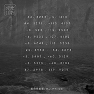

鲸鱼马戏团 Vol.2 Whisper
============================

|  |  |
| :--: | :-- |
| [ 鲸鱼马戏团 Vol.2 Whisper](https://emumo.xiami.com/album/1125401563) | **艺人**: [鲸鱼马戏团](../index.md) **语种**: 其他 **唱片公司**: 虾米音乐人 **发行时间**: 2015年03月25日 **专辑类别**: 录音室专辑 **专辑风格**: 极简主义 Minimalism, 自然采样 Field Recordings **播放数**: 39448488 **收藏数**: 18966 **评论数**: 966  |

## 简介

IIIIIIIIIIIIIIIIIIIIIIIIIIIIIIIIIIIIIIIIIIIIIIIIIIIIIIIIII 虾米音乐人·独家首发 IIIIIIIIIIIIIIIIIIIIIIIIIIIIIIIIIIIIIIIIIIIIIIIIIIIIIIIIII  
  
  
  
鲸鱼马戏团《鲸鱼马戏团Vol.2. Whisper》  
<strong>虾米音乐人寻光计划编号XA-006  
 两岸同步诚意上线  
特别版黑胶预售：<a href="http://item.taobao.com/item.htm?spm=a230r.1.14.1.h4WcSi&amp;id=44427856114&amp;ns=1&amp;abbucket=16#detail" target="_blank" rel="nofollow noreferrer noopener">http://item.taobao.com/item.htm?spm=a230r.1.14.1.h4WcSi&amp;id=44427856114&amp;ns=1&amp;abbucket=16#detail</a>  
  
</strong>深海里的鲸鱼悄然探出水面，默默凝视岸边城市明灭闪烁的灯火，<o:p></o:p>  
他在猜测，那里热闹的喧哗，和这里宁静的孤独，到底有何不同？<o:p></o:p>  
马戏团的小丑结束一天表演，默默在镜子前卸下色彩斑斓的面具，<o:p></o:p>  
他换上了便服，撑开手中伞，走出帐篷，抬头望向飘着雨的天空。<o:p></o:p>  
  
扑面而来的风，越过大海，越过城市，包裹着无数个渴望拥抱的身体，<o:p></o:p>  
内心开始有一个声音发出温柔的低语，越来越靠近，越来越清晰，<o:p></o:p>  
出发吧，出发吧，从身体到灵魂，从过去到未来，就现在，出发吧。<o:p></o:p>  
  
85后天才独立音乐人 都市人的梦境构建师 李星宇 <o:p></o:p>  
拥有记忆触发和瞬间移动功能的魔法音符<o:p></o:p>  
2015全新纯音乐+田野录音创作大碟 【鲸鱼马戏团Vol.2 Whisper】<o:p></o:p>  
无论你停留在哪个角落 无论你隐匿于哪个坐标<o:p></o:p>  
记得这世界总会有一段旋律 陪伴你前往内心想要抵达的地方<o:p></o:p>  
9首最原始声音记录 10首最动人纯音旋律 2首最神秘隐藏曲目<o:p></o:p>  
一次性完整精彩收录 每个人都不容错过的【声音漫游指南】 <o:p></o:p>  
遇见懂得自己独特频率的Whisper 白昼黑夜 感动倾听<o:p></o:p>  
  
★李星宇历时四年打造“Whisper” 19首曲目构建声音与生命的对话<o:p></o:p>  
  
“生活在别处”，米兰·昆德拉把这句子写成小说，兰波写成诗歌，我们则身体力行地把这句子过成现实——现实是，有千千万万个场景让你填满每天密不透风的时间，也有千奇百怪种理由让你选择一成不变或马上改变，只是这样的生活，是否就是最想要的生活？我们探索着答案，想听见心中真实的回答。<o:p></o:p>  
  
而李星宇用《鲸鱼马戏团Vol.2 Whisper》告诉我们：不要着急，不要刻意，继续生活的问答游戏，慢慢靠近最终的谜底。打开这张唱片，倾听那些从心底碰撞出的声音，它们真实地渗透在时间罅隙每一处，不管我们的身体和灵魂是否已经如想象中渴望的那般自由，至少，我们还可以清醒，不麻木。<o:p></o:p>  
  
在《鲸鱼马戏团》于2014年10月推出后，相隔五个月李星宇即带来第二部曲“Whisper”，而从酝酿到完成，这个85后“老男孩”筹备已久。四年前一次欧洲旅行中，他随身带了一个录音机，听到有意思的声音就录下来，在回到工作室反复听那些录音时，脑海里闪过很多画面和片段，开始回想当时的心境并为这些片段创作音乐。后来，去的地方越来越远，甚至深入人烟罕至的丛林，高原，只是想要去听一听“散落在地球各个角落的被人们所忽视的声音”。2015年初，在以“第一个入选柏林电影节天才训练营的中国作曲家”身份结束在德国的学习，转道前往巴黎的途上，李星宇意识到了一种奇妙的重叠。“这张专辑的起点是4年前的巴黎，此时似乎是命运注定，在即将完成唱片的时候，我又再次回到了巴黎。这仿佛是一部声音纪录片，音乐就像手持摄影机的导演，在一个个缓慢而安静长镜头下，将这些年所经历的过往一幕一幕呈现给自己。”<o:p></o:p>  
  
如果第一张《鲸鱼马戏团》是静止的声音故事书，分门别类收录李星宇用旋律、念白、声音、文字为我们编织的小说、散文及童话，也构成一部城市生活的原声OST，那么《鲸鱼马戏团Vol.2 Whisper》真正变成一部流动的电影。李星宇用9个原汁原味声音片段，10首演奏与演唱混搭的纯音乐及歌曲，串起他在各个地方各个场景记录下的故事：房间、阁楼、薰衣草田、周末市集、湖边、桥湾营地、水稻田、宅院中庭、火车厢、海边、瀑布前、沙滩、雨林、茅草屋、森林……我们跟随他而漫游其中，路过微风吹过的田野，下着暴雨的亚马逊雨林，抹香鲸一跃而出的海面，无论你停留在哪个角落，无论你隐匿于哪个坐标，记得这世界总会有一段旋律，陪伴你前往内心想要抵达的地方。<o:p></o:p>  
  
这是声音与生命的对话，也是一趟不可思议的旅行！43.8288，5.1618 44.5271，-110.4157 -8.523,115.2538 -6.9233，107.6102……一连串数字是需要破译的密码，暗示“Whisper”会出现在地球任何角落。跟第一张相比，依然包揽全部音乐创作和制作的李星宇表达更加恣意，越发重视声音和旋律的结合，从第一首《风景》前奏的水流，到中间大段大段风、雨、海浪拍打、鸟叫、蝉鸣、人语、瀑布流泻……甚至有长达十分钟环境音片段，完整贯穿于10首歌曲，让一次性聆听19首曲目的过程变成浩大又转瞬即逝的精彩体验。他表示：“我希望大家在进入专辑的时候安静下来，有一种期待也好，或者说是强迫听众去倾听，用心。结尾处音乐会悄悄离开，可能在大家发现之前，就已经结束，只留下一段雨声。或许在那个时间，每个人心中都有自己的旋律吧。”<o:p></o:p>  
  
★李星宇携手虾米内地台湾同步发片 热爱的光芒照亮寻梦之途<o:p></o:p>  
  
做一个独立音乐人多困难，从来不是我们想要表达的重点，但做一个独立音乐人有多快乐，是我们可以分享的体验。比如，去年第一张专辑《鲸鱼马戏团》首发两周后实体“足足”卖出了200张，最终让李星宇收回印刷成本，就是让他感到无比骄傲与幸福的大事！环境如此恶劣，行业如此混乱，可是好的音乐人还在坚持，也收获到乐迷们身体力行的支持，无论花钱购买唱片，还是透过音乐网站和社交平台评论，对于李星宇来说都是莫大鼓舞。<o:p></o:p>  
  
而“寻光计划”的出现，让李星宇感受到更多暖意。作为虾米音乐人对平台音乐人的全面扶植计划，“寻光计划”用实实在在资金投入为音乐人提供帮助，从企划制作宣传发行各个渠道为唱片进行投入，李星宇凭借第一张专辑《鲸鱼马戏团》取得的热烈反响入选其中，以宽松的条件和虾米合作推出了第二张专辑《鲸鱼马戏团Vol.2 Whisper》，并在内地和台湾同步发片，让自己的作品传播到了更广领域。“国内确实没有第二家这样支持音乐人的公司，至少拿到这些钱，我可以安心创作这张专辑而不是要随时跑去挣钱维持生计了。”<o:p></o:p>  
  
是的，一路走来，这个为梁晓雪、张萱、范世琪、周子琰许多个性歌手担任过制作人，曾加入“嘿乐队”发行两张唱片，获得过诸多奖项的85后生人，而立之年还是无法依靠纯粹热爱的东西养活自己，还是要为广告、动画、游戏、影视剧做各种配乐来维持生计，虽然两条路线并没有高低之分，但第一张专辑通过坚持取得的小小成绩，终于因为用心与才华，得到寻梦之途上更多的帮助。<o:p></o:p>  
  
作为听众的我们，也因此得到更深入和李星宇的音乐交流的机会，看到他更多“任性”闪光点，比如在专辑包装设计、MV及平面视觉拍摄风格延续第一张极简而充满想象力的整体风格，并坚持内地版唱片用黑胶形式发行，同时收录两首试听网站不会放出的超值曲目《风景Landscape Vol.2》、《雨林的鲍莱罗 Borelo of the amazon》。在大多数年轻人已经模糊了卡带与CD记忆的年代，他想用更绝对形式来体现音乐的价值，唤起人们对音乐的尊重，“黑胶就好像人一样，是有生命的，每播放一遍都会消耗它的寿命。我希望人们可以偶尔不把这张专辑里的作品只当做背景音乐，而是真的认认真真去欣赏。所以，黑胶是最合适的载体，而且我不会公布黑胶唱片里的音乐的数字版本。”<o:p></o:p>  
  
★《鲸鱼马戏团Vol.2 Whisper》曲目 李星宇和小伙伴等你发现惊喜<o:p></o:p>  
  
这绝不是一张只限定在旅途中打发时光的唱片，它继续安慰四处漂泊的追梦人和夜不能寐的失眠者，也给每个正在某场景重复生活的人提供一次和“Whisper”自由逃亡的机会！探索内心想要记得的声音、画面与情节，带领我们穿越回最初想象的画面，带着《鲸鱼马戏团Vol.2 Whisper》的所有声音、旋律和歌唱开始“漫游”吧，无边无际，陪伴在每一天每一个时刻，白昼或黑夜。<o:p></o:p>  
  
是清晨第一道微光朦朦胧胧跃入视线，你即将起床或入睡的时候，<o:p></o:p>  
是置身于或者拥挤或者空旷的城市，你面无表情盯着流动广告的时候，<o:p></o:p>  
是行色匆匆踩过路边积留的雨水，你和骑着单车的陌生人交错而过的时候，<o:p></o:p>  
是耳畔嘈杂车流声渐渐渐渐平息，你拿起一本书又不知从哪一页翻起的时候，<o:p></o:p>  
是有一天你发现自己还有好多梦想等待实现，而继续努力，相信可以实现的时候。<o:p></o:p>  
  
1.风景 Landscape<o:p></o:p>  
和记忆一样，由无数的片段组成，循环般在脑海中播放。每一次都会更加清晰，每一次也都有会有所区别。偶尔在一个念头之后，它又会戛然而止。<o:p></o:p>  
  
2.雪 Snowing<o:p></o:p>  
已经很久没有见过雪了，在这个逐渐令人陌生的城市。记忆里，冬日清晨拉开窗帘的那一刻，时间仿佛静止，定格在可以称为美好回忆的相册里。小时候楼下的院子里有一个废弃的钢架，我一直当它是一艘飞船，想象着有一天它会带我去到那个世界上最远的角落。<o:p></o:p>  
  
3.43.8288，5.1618<o:p></o:p>  
  
4.左岸 Stalingrad Station<o:p></o:p>  
回忆一段在巴黎的日子。（很荣幸在巧合中致敬了已故法国作曲家萨蒂）<o:p></o:p>  
  
5.艾维尼翁 Avignon<o:p></o:p>  
1000毫米/秒吹过的微风，1000万只蜜蜂振动的翅膀，1000次心跳时间的行走，1000米高空漂泊的白云。这是一种无法用语言形容的感觉，是自然界美丽的协奏曲。在我看来，薰衣草代表的不是浪漫，而是一种田园的情怀。勤劳、安逸、宁静。走进花田，坐在树荫下，闭上眼睛慢慢感受：那扑鼻的香味乘着蜜蜂振翅的声波，像海浪一般拂面而来。<o:p></o:p>  
  
6.44.5271，-110.4157<o:p></o:p>  
  
7.桥湾 Bay Bridge<o:p></o:p>  
李星宇献声演唱作品。在美国黄石公园桥湾营地与世隔绝的日子里，每天清晨会用钢锅煮好咖啡，然后开车进入森林。你不知道会在那样的地方遇到什么，也许是一只鹿，甚至一头熊，也或许只是空无一人的寂静。<o:p></o:p>  
  
8.-8.523,115.2538<o:p></o:p>  
  
9.-6.9233，107.6102<o:p></o:p>  
  
10.时常 Always<o:p></o:p>  
时常会有一些念头，在你沉默时会突然偷偷溜进脑海，你告诉自己，你快乐，也满足。铁轨周而复始地重复单调的节奏，坐在下一趟列车里，你不知道未来将要驶向何方。<o:p></o:p>  
  
11.-8.6049,115.3258<o:p></o:p>  
  
12.十五次的约定 Whisper<o:p></o:p>  
鲸平均每天只有15次浮上海面呼吸，而每次呼吸却只有短短几秒。在这短短几秒的记忆里，只有海浪与空气摩擦的沙沙声和海鸟们讲述的一段段快乐的故事。鲸总是静静的聆听，随即又再次沉入深深的大海之中。<o:p></o:p>  
  
13.-25.6953，-54.4294<o:p></o:p>  
  
14.科巴卡巴纳 Praia de Copacabana  
傍晚时分，我沿着科巴卡巴纳海滩散步。很有趣的是，海把声音一分为二，左边是一波一波的浪涛涌向岸边，右边是热闹非凡的沙滩和城市。不知为何我忽然想起巴塞罗那听到的街头音乐，或许是因为拉丁文化千丝万缕的联系吧。<o:p></o:p>  
  
15.-3.5407,-60.0129<o:p></o:p>  
  
16.-3.5513,-60,0102<o:p></o:p>  
  
17.老友 Old Friend<o:p></o:p>  
那一天我骑着自行车穿过整座岛屿来到了最南边的海岸，我也不清楚自己为什么要去那里，就觉得看着海，心情可以变好。于是我坐在石头上，看着海面发呆。不知不觉我好像听到自己的声音，从远方，徐徐地传来。<o:p></o:p>  
  
18.47.2978，119.9019<o:p></o:p>  
  
19.雨中庭院 Rain In Bandung<o:p></o:p>  
在万隆的时候，我住在当地人的家里。那个建筑很特别，每一个房间和客厅都可以通向一个露天的庭院。有一个雨天的夜晚，我坐在客厅的屋檐下看着雨落在庭院的石板地上，忽然觉得清净自在。我关掉原本在播放的音乐，只是安安静静听着落雨的声音。<o:p></o:p>  
  
李星宇 作品Directed by Xingyu Li<o:p></o:p>  
鲸鱼马戏团工作室Whalecircus<o:p></o:p>  
作曲Composing/作词Lyric/编曲Arrangement/录音Recording/混音Mixing：李星宇 Xingyu Li<o:p></o:p>  
大提琴Cello：刘星雨 Xingyu Liu<o:p></o:p>  
小提琴Violin：刘天昊 Tianhao Liu<o:p></o:p>  
吉他Guitar：李星宇 Xingyu Li 王梓 Zi Wang<o:p></o:p>  
手风琴Accordion：袁思瀚 Sihan Yuan<o:p></o:p>  
  
母带处理Mastering：李马科 Make Li<o:p></o:p>  
专辑设计Visual Design：马仕睿 Shirui Ma<o:p></o:p>  
文案Description：刘乃铭@流水纪 Naiming Liu<o:p></o:p>  
特别感谢Special Thanks to：虾米音乐 Xiami 以及 听到这里的你们<o:p></o:p>  
  
Vinyl Track 1 风景Landscape Vol.2<o:p></o:p>  
Vinyl Track 2 雨林的鲍莱罗 Borelo of the amazon  
  
--------------------------------------------------------  
  
出品 – 虾米音乐人 i.xiami.com 、李星宇   
监制 - 朱七  
总统筹 - 赵宗  
音乐人统筹 – 赵宗、 林初霞    
企划统筹 –李星宇  
线上推广 – 林初霞   
线上推广支持 - 朱琪芳 、陈皓   
媒体推广 - 闫超   
经纪事务– 李星宇   
生产管理/独家销售 – 独音唱片（内地）、佳佳唱片（台湾）  
  
总出品Published：虾米音乐 Xiami Music  
总出品人Chief Publishing Officer ：王皓 Jeff Wang  
发行时间 Release Date：2015.3  
P &amp;C ：虾米音乐人 i.xiami.com  
唱片编号Record Number：XA-006  
鲸鱼马戏团主页 The Home Page： <a href="http://i.xiami.com/whalecircus" target="_blank" rel="nofollow noreferrer noopener">http://i.xiami.com/whalecircus</a> @李星宇Stars 

## 曲目

## 评论

|  |  |  |  |
| :-- | :-- | :-- | :-- |
|  [虾米用户](https://emumo.xiami.com/u/71478) 这里住着未在任何世界露脸... 2020-12-20 02:45 赞(4) 踩(0) | 
这张专曾经是我最后的庇护所，感恩园长。前几年会将这张专的无损导入虾米来听，后来发现连续几年的听无法归档至年度总结，又删了无损听在线的。昨天得知这张独立版权开放了，小众独立音乐人路更难了，虾米可能快没了，sad
 |
| ⇒ |  [虾米用户](https://emumo.xiami.com/u/127444946) 我在哪漂荡 2020-12-27 08:11 赞(0) 踩(0) | 
全网开放应该算好事吧，只是虾米可能不行了
 |
| ⇒ |  [虾米用户](https://emumo.xiami.com/u/71478) 这里住着未在任何世界露脸... 2020-12-28 03:38 赞(0) 踩(0) | 
<q><b>猫说：</b></q>
 |
|  [虾米用户](https://emumo.xiami.com/u/392999) 我还没想好要写什么... 2020-08-30 10:46 赞(1) 踩(0) | 
三年前夜夜陪伴我入眠的专辑。希望每个在迷途中的孩子都能找到可供心灵歇息，重新找到内心平静的专属空间。
 |
|  [虾米用户](https://emumo.xiami.com/u/5586779) be nice,be c... 2020-08-19 03:30 赞(2) 踩(0) | 
求求求 专辑实体再版     
 |
|  [虾米用户](https://emumo.xiami.com/u/16178749) 愿各自安好………………  2020-07-12 00:13 赞(1) 踩(0) | 

 |
|  [虾米用户](https://emumo.xiami.com/u/234400545) 尘世不过浮生一梦，一切不... 2020-03-12 18:55 赞(1) 踩(0) | 
适合安静的时候，保持平静的心情。
 |
|  [虾米用户](https://emumo.xiami.com/u/401245724) 少不更事，老而无为 2020-02-13 02:40 赞(1) 踩(0) | 
单纯的采样，沉静却也有欢快。都在声声海潮中。是，取向狙击啊
 |
|  [虾米用户](https://emumo.xiami.com/u/49073959) 我还没想好要写什么... 2020-01-20 19:23 赞(1) 踩(0) | 
（Whale Fall）
 |
|  [虾米用户](https://emumo.xiami.com/u/43228356) 祝你早安午安晚安。 2019-12-22 08:43 赞(3) 踩(0) | 
宝藏专辑  
 |
|  [虾米用户](https://emumo.xiami.com/u/431893202)  2019-11-09 17:40 赞(1) 踩(0) | 
喜欢
 |
|  [虾米用户](https://emumo.xiami.com/u/18809404) 你好啊 :) 2019-11-05 07:45 赞(3) 踩(0) | 
怎么伴着音符看着专辑简介然后就哭了呢。。。好像很久没被一张专辑感动到了。每一首曲都配得上它的创意。好期待你的作品！
 |
|  [虾米用户](https://emumo.xiami.com/u/3683480) On se reverr... 2019-10-02 00:00 赞(0) 踩(0) | 
爱了！
 |
|  [虾米用户](https://emumo.xiami.com/u/402458819)  2019-08-25 00:08 赞(1) 踩(0) | 
伴随每个失眠的夜晚
 |
|  [虾米用户](https://emumo.xiami.com/u/276944698) 不要自我设限..... 2019-08-13 20:10 赞(1) 踩(0) | 

 |
|  [虾米用户](https://emumo.xiami.com/u/88256080) 我还没想好要写什么... 2019-07-29 02:08 赞(1) 踩(0) | 
有部2000年上映的匈牙利电影就叫鲸鱼马戏团。讲的是一个带着巨大鲸鱼尸体和一个王子的马戏团来到匈牙利平原上一个小村庄发生的故事。
 |
|  [虾米用户](https://emumo.xiami.com/u/16346475)  2019-06-18 12:05 赞(0) 踩(0) | 
工作时的循环陪伴
 |
|  [虾米用户](https://emumo.xiami.com/u/401419251) 对不起，请原谅，谢谢你，... 2019-06-08 16:02 赞(0) 踩(0) | 
我喜欢听着舒心的音乐
 |
|  [虾米用户](https://emumo.xiami.com/u/146549132) A bird 2019-05-28 20:03 赞(0) 踩(0) | 

 |
|  [虾米用户](https://emumo.xiami.com/u/2554920) 我还没想好要写什么... 2019-05-15 01:18 赞(1) 踩(0) | 
如何将分散的心聚拢起来，如何在洋流下沉，如何迷失于森林，如何在漫天飞舞的雪花中摘下一片，如何舞蹈，如何在你眼里舞蹈，如何瞭望你眼中星辰，如何刻下你的名字又不留痕迹，如何捕捉天气，如何亲吻滂沱大雨，如何隐匿于寒冷，如何寻找答案，如何跟随季风漂流到你的坐标，如何安静的在你身边，如何留下呼吸，如何从世界尽头折返，如何不留恋地歌唱，如何谈论蝉的生命，如何给你晴朗，如何握手言和，如何自然，如何悠久的等候。
 |
|  [虾米用户](https://emumo.xiami.com/u/172991406) 摇滚少年 2019-05-06 12:52 赞(0) 踩(0) | 
睡眠专属
 |
|  [虾米用户](https://emumo.xiami.com/u/187404605) 久伴亦久久 2019-05-02 09:55 赞(1) 踩(0) | 
高三的我呀
 |
|  [虾米用户](https://emumo.xiami.com/u/43937617) 永远爱虾米 2019-04-17 22:51 赞(1) 踩(0) | 

 |
|  [虾米用户](https://emumo.xiami.com/u/102488866) 想要一个很大的水晶球 2019-03-24 12:15 赞(0) 踩(0) | 
-
 |
|  [虾米用户](https://emumo.xiami.com/u/334509109) 正是江南好风景，落花时节... 2019-03-21 01:28 赞(0) 踩(0) | 
温柔与爱意
 |
|  [虾米用户](https://emumo.xiami.com/u/421545574)  2019-03-21 01:18 赞(0) 踩(0) | 
我从来没有听过这种类型，仿佛打开的新世界的大门，我觉得让我觉得好不一样啊！太特别了！！！
 |
|  [虾米用户](https://emumo.xiami.com/u/3241604)  2019-03-21 01:17 赞(0) 踩(0) | 
一起一生一世。
 |
|  [虾米用户](https://emumo.xiami.com/u/402458819)  2019-03-18 22:58 赞(0) 踩(0) | 
每一首淅淅沥沥的雨声在我听来都好像在煎鱼或者煎蛋这是为什么
 |
|  [虾米用户](https://emumo.xiami.com/u/346165752)  2019-03-11 23:02 赞(0) 踩(0) | 

 |
|  [虾米用户](https://emumo.xiami.com/u/409245937) 行将就木 双木成林 2019-03-09 23:39 赞(1) 踩(0) | 
听见万物有灵，看见听者有心
 |
|  [虾米用户](https://emumo.xiami.com/u/4823698) 0 001-225-09 2019-03-05 16:15 赞(0) 踩(0) | 
MV 屎一样 配不上这首 老友
 |
|  [虾米用户](https://emumo.xiami.com/u/203807965) carpe diem 2019-03-04 19:57 赞(0) 踩(0) | 
好棒！
 |
|  [虾米用户](https://emumo.xiami.com/u/88256080) 我还没想好要写什么... 2019-02-12 18:57 赞(0) 踩(0) | 
有些像小森林 又或者是深夜食堂里的插曲
 |
|  [虾米用户](https://emumo.xiami.com/u/68320938) 海洋很深，泪如雨下。 2019-02-08 17:10 赞(1) 踩(0) | 
经常听的音乐!感谢星爷!
 |
|  [虾米用户](https://emumo.xiami.com/u/69588346)  2019-01-20 09:07 赞(1) 踩(0) | 
这张专辑陪伴了我四年了快，现在高三了。
 |
|  [虾米用户](https://emumo.xiami.com/u/315502315)  2019-01-11 12:30 赞(0) 踩(0) | 
几年前的一段失眠的日子里听这张，这阵子又开始失眠了，又开始听。。。。。。在现实生活里找平静太难了，到最后只剩不甘心的失落跟寂寥。只好去别人编织的梦境里逃避。。唉。
 |
|  [虾米用户](https://emumo.xiami.com/u/215295686) I blue u 2019-01-02 14:30 赞(0) 踩(0) | 

 |
|  [虾米用户](https://emumo.xiami.com/u/327425349)  2018-12-31 03:36 赞(0) 踩(0) | 
谢谢，很喜欢的专辑。
 |
|  [虾米用户](https://emumo.xiami.com/u/1163787) 暂无签名~ 2018-12-05 04:11 赞(0) 踩(0) | 
感谢被你的音乐温柔对待
 |
|  [虾米用户](https://emumo.xiami.com/u/273034482)  2018-11-18 21:00 赞(0) 踩(0) | 

 |
|  [虾米用户](https://emumo.xiami.com/u/339191478)   2018-11-04 12:33 赞(0) 踩(0) | 

 |
|  [虾米用户](https://emumo.xiami.com/u/127842) Gigi 2018-10-24 14:44 赞(0) 踩(0) | 
好听
 |
|  [虾米用户](https://emumo.xiami.com/u/302870382)  2018-09-08 23:21 赞(0) 踩(0) | 

 |
|  [虾米用户](https://emumo.xiami.com/u/291689046) 再见旧情人，我是时间的新... 2018-06-03 23:28 赞(0) 踩(0) | 
我的top1
 |
|  [虾米用户](https://emumo.xiami.com/u/208976068) 所见无非虚幻迷蒙 2018-06-03 17:26 赞(0) 踩(0) | 
温柔的流淌
 |
|  [虾米用户](https://emumo.xiami.com/u/73740960)  2018-04-26 18:02 赞(2) 踩(0) | 
▪️
 |
|  [虾米用户](https://emumo.xiami.com/u/35167460) La vie elle ... 2018-04-15 11:25 赞(0) 踩(0) | 
买了黑胶。等待运输
 |
|  [虾米用户](https://emumo.xiami.com/u/18577189) 假如再也不能见到你，祝你... 2018-02-22 01:21 赞(0) 踩(0) | 
。
 |
|  [虾米用户](https://emumo.xiami.com/u/238300984) 世界很大 时间太少 2018-02-07 00:08 赞(0) 踩(0) | 
：
 |
|  [虾米用户](https://emumo.xiami.com/u/408951)   2018-01-27 14:08 赞(0) 踩(0) | 
大提琴一声声，像拉在心上&amp;hellip;&amp;hellip;
 |
|  [虾米用户](https://emumo.xiami.com/u/260123122)   2018-01-26 08:18 赞(0) 踩(0) | 
/
 |
|  [虾米用户](https://emumo.xiami.com/u/321925532) 走茶 2018-01-04 02:27 赞(0) 踩(0) | 
感动
 |
|  [虾米用户](https://emumo.xiami.com/u/331762563)  2017-12-01 22:19 赞(0) 踩(0) | 
终于找到了一个纯净的氛围音乐 还是雨声
 |
|  [虾米用户](https://emumo.xiami.com/u/33880916)  2017-11-30 12:07 赞(0) 踩(0) | 
适合黄昏雨后，透过沾满雨水的窗，望向行色匆匆的街道时听。
 |
|  [虾米用户](https://emumo.xiami.com/u/35613078)   2017-11-27 12:14 赞(2) 踩(0) | 
打一分的我们出来谈谈
 |
| ⇒ |  [虾米用户](https://emumo.xiami.com/u/302072544)  2017-11-27 13:19 赞(0) 踩(0) | 
帶上我   
 |
|  [虾米用户](https://emumo.xiami.com/u/334880010) 等不到，放不下 2017-11-13 21:37 赞(0) 踩(0) | 
坐标
 |
|  [虾米用户](https://emumo.xiami.com/u/10767374) 音乐中的孩子 2017-10-27 23:56 赞(1) 踩(0) | 
听了一耳朵简直。。。叼哭了
 |
|  [虾米用户](https://emumo.xiami.com/u/3463103)  2017-10-27 23:56 赞(1) 踩(0) | 
真的太美太美，从第一曲听到第三曲，好似从海面缓缓下沉，沉入不知深浅的黑暗。不知道是生命先进入黑暗还是视觉先进入黑暗。并不可怕，有种黑色本有的暖，然后睁开眼，重生，回到海面深深呼吸。
 |
|  [虾米用户](https://emumo.xiami.com/u/326404359)  2017-09-23 14:59 赞(0) 踩(0) | 
午睡必备
 |
|  [虾米用户](https://emumo.xiami.com/u/43714694) WeChat：96529... 2017-09-22 16:18 赞(0) 踩(0) | 
吱/音
 |
|  [虾米用户](https://emumo.xiami.com/u/251992971)  2017-09-10 16:26 赞(0) 踩(0) | 
love it
 |
|  [虾米用户](https://emumo.xiami.com/u/96296322)  2017-08-28 14:28 赞(0) 踩(0) | 
.
 |
|  [虾米用户](https://emumo.xiami.com/u/319799547)  2017-08-16 23:25 赞(0) 踩(0) | 
在他的音乐里，有一个真实的&amp;ldquo;世界&amp;rdquo;
 |
|  [虾米用户](https://emumo.xiami.com/u/316674227)  2017-08-01 23:58 赞(1) 踩(0) | 
虾米音乐扣费用吗？
 |
|  [虾米用户](https://emumo.xiami.com/u/16709135) 一个有光的小角落 2017-07-25 08:47 赞(0) 踩(0) | 
这张实在是太催眠了&amp;hellip;&amp;hellip;昨天晚上从第一首开始听，听着听着就睡着了&amp;hellip; 
 |
|  [虾米用户](https://emumo.xiami.com/u/66914618)  2017-07-06 20:40 赞(10) 踩(0) | 
无论何时听到都会有不一样的感触和感动，感谢这样的好音乐。
 |
|  [虾米用户](https://emumo.xiami.com/u/238300984) 世界很大 时间太少 2017-07-05 11:23 赞(12) 踩(0) | 
我要听着这张专辑腐烂 听着它沉入海底 直到溺死
 |
|  [虾米用户](https://emumo.xiami.com/u/45342967) 好的音乐总是源于内心，而... 2017-07-02 12:42 赞(3) 踩(0) | 
能把自然界的声响录下／标上日期存留／再播放／回想，从声音日记中想从前／现在和／未来，关于得到／失去／总结／再出发。这是我的愿望，偶尔凭借手机的录音功能，也这么做。一场被预报的大雨，一个悠闲早起的清晨&amp;hellip;&amp;hellip;
 |
|  [虾米用户](https://emumo.xiami.com/u/24345242) 爱谁谁 2017-06-24 06:49 赞(4) 踩(0) | 
周末的早晨，被夏至后的晨光唤醒，顺手点开虾米，伴着轻音乐冥想练习，意外中被推荐的这张里那是《老友》惊艳了，顺着思维无疆域的跑马，想到了雪夜与友人裹着毛毯在怀柔的核桃林小屋围着暖炉小酌赏雪，米酒醇香入喉，暖暖的，有被拥抱的感动！此后这位健谈的友人辞去了待遇丰厚的工作，入藏支教，一别七年，如今依旧初心不改。这首曲中的孤独与隐藏在音符后的淡然，恰似我对友人的印象，世间有许多路注定是孤独而澹泊的旅途，同行者少之甚少且莫说志同道合，就饮尽杯中酒，前程虽风雪无情，暖酒的余温尚存！
 |
|  [虾米用户](https://emumo.xiami.com/u/166863) Like A Rolli... 2017-06-24 01:37 赞(1) 踩(0) | 
能整张专辑买吗，每首购买体验确实不好。
 |
|  [虾米用户](https://emumo.xiami.com/u/49117029) 我就是我,颜色不一样的烟... 2017-06-19 20:50 赞(0) 踩(0) | 
求类似的乐队推荐，好喜欢这种风格 
 |
|  [虾米用户](https://emumo.xiami.com/u/5496438) 凡尘俗事，改变了你我！ 2017-06-17 09:53 赞(0) 踩(0) | 
听听就知道。
 |
|  [虾米用户](https://emumo.xiami.com/u/7693505)  2017-06-17 01:09 赞(0) 踩(0) | 
灵感来自贝拉&amp;middot;塔尔的同名电影？
 |
|  [虾米用户](https://emumo.xiami.com/u/961524)  2017-06-16 00:18 赞(0) 踩(0) | 
66
 |
|  [虾米用户](https://emumo.xiami.com/u/54084826)  2017-06-05 22:18 赞(0) 踩(0) | 
有点意思
 |
|  [虾米用户](https://emumo.xiami.com/u/178678532)  2017-06-03 17:46 赞(1) 踩(0) | 
随手点进来的，获得了今天的第一个惊喜(^u^)/❤~
 |
|  [虾米用户](https://emumo.xiami.com/u/248636134) 完美的男人。 2017-05-13 11:38 赞(0) 踩(0) | 
这几天就听这张了
 |
|  [虾米用户](https://emumo.xiami.com/u/39572043)  2017-05-01 15:53 赞(2) 踩(0) | 
有种一不小心，心跳漏了一拍的惊喜
 |
|  [虾米用户](https://emumo.xiami.com/u/71478) 这里住着未在任何世界露脸... 2017-04-25 00:25 赞(1) 踩(0) | 
感谢whisper陪伴的两年多夜晚
 |
|  [虾米用户](https://emumo.xiami.com/u/71478) 这里住着未在任何世界露脸... 2017-04-25 00:24 赞(3) 踩(0) | 
今天是vol.3的发布日期，来最爱的vol.2打卡
 |
|  [虾米用户](https://emumo.xiami.com/u/7382330)   2017-04-21 01:07 赞(1) 踩(0) | 
这张专辑的购买体验真是糟透了！！我不得不买了19次！而且第一首歌单独就买了19次！能不能整张专辑一起买？？？？
 |
| ⇒ |  [虾米用户](https://emumo.xiami.com/u/43213713) 音乐，意境和治愈。探索者... 2017-04-26 12:52 赞(0) 踩(0) | 
似乎不能，我第一次买pav的单曲时也是这样，一次买了十首相同的单曲&amp;hellip;&amp;hellip;
 |
|  [虾米用户](https://emumo.xiami.com/u/6288213)  2017-04-18 21:28 赞(0) 踩(0) | 
鯨魚馬戲團
 |
|  [虾米用户](https://emumo.xiami.com/u/284986981)  2017-04-08 15:04 赞(1) 踩(0) | 
记得陪伴我最辛苦的那段高三岁月，感谢怎么棒的一张专辑
 |
|  [虾米用户](https://emumo.xiami.com/u/90725776) 我喜欢穿短裤，穿短裤膝盖... 2017-04-06 22:47 赞(0) 踩(0) | 
[Reply@deeralice]wow正好在看!
 |
|  [虾米用户](https://emumo.xiami.com/u/8838073) 嘘 2017-03-26 21:05 赞(0) 踩(0) | 
为什么下架啊。。。每一段时间就来刷新一下
 |
| ⇒ |  [虾米用户](https://emumo.xiami.com/u/855191)  2017-03-27 15:44 赞(0) 踩(0) | 
没下架啊
 |
|  [虾米用户](https://emumo.xiami.com/u/247381685)  2017-02-20 13:28 赞(0) 踩(0) | 
舒服 
 |
|  [虾米用户](https://emumo.xiami.com/u/3538137)  2017-02-10 22:10 赞(0) 踩(0) | 
睡不着的时候要听雨
 |
|  [虾米用户](https://emumo.xiami.com/u/122152470) 我还没想好要写什么... 2017-02-01 19:32 赞(0) 踩(0) | 
为什么不能整张专辑购买，只能一首一首付款？
 |
|  [虾米用户](https://emumo.xiami.com/u/74749714) CARPE DIEM  2017-01-24 15:53 赞(0) 踩(0) | 
这张专 在我十六岁的那天发布 现在 我马上十八岁 再听一次 再感受一次十六岁
 |
|  [虾米用户](https://emumo.xiami.com/u/6380341)  2017-01-18 14:51 赞(0) 踩(0) | 
读书伴侣
 |
|  [虾米用户](https://emumo.xiami.com/u/8435450)  2016-12-22 11:17 赞(2) 踩(0) | 
写作时能让心静下来，这种低吟浅唱最有效了
 |
|  [虾米用户](https://emumo.xiami.com/u/33514232) 喜欢来这里找我喜欢的 2016-12-13 22:39 赞(0) 踩(0) | 
收藏了台湾版本的Cd
 |
|  [虾米用户](https://emumo.xiami.com/u/34575655) 别站在你的角度看我，你看... 2016-12-13 16:45 赞(4) 踩(0) | 
国内很少有人能做出这样的音乐...力推
 |
|  [虾米用户](https://emumo.xiami.com/u/34575655) 别站在你的角度看我，你看... 2016-12-13 16:45 赞(0) 踩(0) | 
国内很少有人能做出这样的音乐...力推
 |
|  [虾米用户](https://emumo.xiami.com/u/37072536) Music makes ... 2016-12-12 16:49 赞(0) 踩(0) | 
真正听哭我的其实是这张专辑，哈哈哈
 |
|  [虾米用户](https://emumo.xiami.com/u/23572171)   2016-12-11 03:51 赞(1) 踩(0) | 
配合卡尔维诺的《看不见的城市》食用甚佳~
 |
|  [虾米用户](https://emumo.xiami.com/u/50868575) 喜欢风一样的声音，温柔的... 2016-12-01 14:19 赞(0) 踩(0) | 
希望你听听看
 |
|  [虾米用户](https://emumo.xiami.com/u/244171288)  2016-11-21 17:05 赞(0) 踩(0) | 
缘
 |
|  [虾米用户](https://emumo.xiami.com/u/55063174)  2016-11-17 22:34 赞(0) 踩(0) | 

 |
|  [虾米用户](https://emumo.xiami.com/u/246696794)  2016-11-17 07:33 赞(1) 踩(0) | 
只有这个才能让我平静，好像在水里可以自由呼吸一样梦幻美妙。
 |
|  [虾米用户](https://emumo.xiami.com/u/245111731)  2016-11-13 09:34 赞(0) 踩(0) | 
自然 舒缓 沉浸其中思考自己
 |
|  [虾米用户](https://emumo.xiami.com/u/25137844)  2016-11-10 14:57 赞(0) 踩(0) | 
喜欢
 |
|  [虾米用户](https://emumo.xiami.com/u/25137844)  2016-11-10 14:57 赞(1) 踩(0) | 
很自然、很舒服的音乐，能感受到每一个音符在空气中曼妙的身姿、以及音乐中带有的生活气息，感觉到自己是活着的，而且变化着。。。
 |
|  [虾米用户](https://emumo.xiami.com/u/13327916)   2016-10-28 00:25 赞(0) 踩(0) | 
听听雨
 |
|  [虾米用户](https://emumo.xiami.com/u/3197961) 小猪儿也疯狂 2016-10-23 19:51 赞(0) 踩(0) | 
喜欢你没道理
 |
|  [虾米用户](https://emumo.xiami.com/u/238649946)  2016-10-21 00:54 赞(0) 踩(0) | 
宁静，广阔的世界
 |
|  [虾米用户](https://emumo.xiami.com/u/824128)  2016-10-19 18:10 赞(1) 踩(0) | 
超好听的音乐
 |
|  [虾米用户](https://emumo.xiami.com/u/225690548)  2016-10-14 12:03 赞(0) 踩(0) | 
波光荡漾
 |
|  [虾米用户](https://emumo.xiami.com/u/43739649)   2016-10-07 09:21 赞(0) 踩(0) | 
i like it above all the comments
 |
|  [虾米用户](https://emumo.xiami.com/u/50537008)  2016-10-07 01:34 赞(1) 踩(0) | 
好
 |
|  [虾米用户](https://emumo.xiami.com/u/14054378)  2016-10-06 22:02 赞(0) 踩(0) | 
这让我好抑郁……
 |
|  [虾米用户](https://emumo.xiami.com/u/13704947) 豆瓣见：无悲渊。 2016-10-06 19:06 赞(0) 踩(0) | 
为了这些低语要买片海。
 |
|  [虾米用户](https://emumo.xiami.com/u/13704947) 豆瓣见：无悲渊。 2016-10-06 19:06 赞(1) 踩(0) | 
为了这些低语要买片海。
 |
|  [虾米用户](https://emumo.xiami.com/u/3585277)   2016-10-06 15:32 赞(0) 踩(0) | 
独自一人在办公室，感觉有个老友陪着一般，真好
 |
|  [虾米用户](https://emumo.xiami.com/u/89526026) “戴上耳机，世界与我无关... 2016-10-06 14:36 赞(0) 踩(0) | 
太赞了。
 |
|  [虾米用户](https://emumo.xiami.com/u/231193361)  2016-09-29 20:34 赞(0) 踩(0) | 
听着挺舒服的~
 |
|  [虾米用户](https://emumo.xiami.com/u/27270915)  2016-09-26 15:42 赞(0) 踩(0) | 
鲸鱼马戏团
 |
|  [虾米用户](https://emumo.xiami.com/u/8151429)  2016-09-21 12:27 赞(0) 踩(0) | 
U rock my world
 |
|  [虾米用户](https://emumo.xiami.com/u/39371674) 没有边际以及永无止境的想... 2016-09-19 15:00 赞(0) 踩(0) | 
43.8288，5.1618&nbsp;44.5271，-110.4157&nbsp;-8.523,115.2538&nbsp;-6.9233，107.6102……一连串数字是需要破译的密码，暗示“Whisper”会出现在地球任何角落。
 |
|  [虾米用户](https://emumo.xiami.com/u/139345058)  2016-09-17 23:02 赞(0) 踩(0) | 
Sexy voice～
 |
|  [虾米用户](https://emumo.xiami.com/u/124750210) 相逢自是有缘 2016-09-17 13:01 赞(0) 踩(0) | 
like:)
 |
|  [虾米用户](https://emumo.xiami.com/u/11142451)  2016-09-07 19:33 赞(0) 踩(0) | 
超好耶!
 |
|  [虾米用户](https://emumo.xiami.com/u/1623303)  2016-09-04 15:36 赞(0) 踩(0) | 
纯背景音乐，可以专注的做事。
 |
|  [虾米用户](https://emumo.xiami.com/u/34327660) 每个人都有自己的喜好 2016-07-30 21:39 赞(0) 踩(0) | 
只为老友，支持付费
 |
|  [虾米用户](https://emumo.xiami.com/u/43982464) 哒优 2016-07-30 16:35 赞(0) 踩(0) | 
和天使爱美丽那个专辑挺像的，挺欢乐的
 |
|  [虾米用户](https://emumo.xiami.com/u/197122947)  2016-07-28 20:24 赞(0) 踩(0) | 
稀饭
 |
|  [虾米用户](https://emumo.xiami.com/u/52826497)  2016-07-27 19:43 赞(0) 踩(0) | 
让整个人都能安静
 |
|  [虾米用户](https://emumo.xiami.com/u/3674293) pug lover 2016-07-26 15:27 赞(1) 踩(0) | 
哎呀 这个人的歌为什么一听就想辞职呢
 |
|  [虾米用户](https://emumo.xiami.com/u/197369754)  2016-07-24 14:30 赞(0) 踩(0) | 
看書時聽最好
 |
|  [虾米用户](https://emumo.xiami.com/u/478527) 好想跟衣服在洗衣机里滚 2016-07-20 20:23 赞(42) 踩(0) | 
终于发现，好音乐不是让你与音乐人对话，而是让你能与自己独处，能与自己对话。——写给@鲸鱼马戏团
 |
| ⇒ |  [虾米用户](https://emumo.xiami.com/u/855191)  2016-07-21 06:02 赞(0) 踩(0) | 
：）
 |
| ⇒ |  [虾米用户](https://emumo.xiami.com/u/21450282) 哞~ 咩~ 2016-07-25 23:58 赞(0) 踩(0) | 
<q><b>鲸鱼马戏团说：</b></q>
 |
|  [虾米用户](https://emumo.xiami.com/u/96567498)   2016-07-08 18:44 赞(0) 踩(0) | 
清凉
 |
|  [虾米用户](https://emumo.xiami.com/u/10128210) 听歌就好 2016-07-05 00:13 赞(1) 踩(0) | 
深夜，闭上眼戴上耳机，感觉心在世界游荡&amp;gt;3
 |
|  [虾米用户](https://emumo.xiami.com/u/9704519)  2016-06-26 17:23 赞(1) 踩(0) | 
写东西的时候喜欢听。
 |
|  [虾米用户](https://emumo.xiami.com/u/113440772) 〇〇〇〇〇〇 2016-06-23 22:41 赞(0) 踩(0) | 
夜深道一声晚安
 |
|  [虾米用户](https://emumo.xiami.com/u/196580)  2016-06-22 13:24 赞(0) 踩(0) | 
为什么听不到任何声音
 |
|  [虾米用户](https://emumo.xiami.com/u/44349325)   2016-06-19 23:40 赞(0) 踩(0) | 
听你的专辑，和你一起感受那些地方所带来的情绪。
 |
|  [虾米用户](https://emumo.xiami.com/u/1273629) 我的心张开帆，乘着无所事... 2016-06-08 16:16 赞(1) 踩(0) | 
空山新雨，幽涧清流
 |
|  [虾米用户](https://emumo.xiami.com/u/1273629) 我的心张开帆，乘着无所事... 2016-06-08 15:56 赞(0) 踩(0) | 
空山新雨，幽涧清流
 |
|  [虾米用户](https://emumo.xiami.com/u/1273629) 我的心张开帆，乘着无所事... 2016-06-08 15:55 赞(0) 踩(0) | 
空山新雨，幽涧清流
 |
|  [虾米用户](https://emumo.xiami.com/u/1273629) 我的心张开帆，乘着无所事... 2016-06-08 15:53 赞(0) 踩(0) | 
空山新雨，幽涧清流
 |
|  [虾米用户](https://emumo.xiami.com/u/12805732) 心之所向，素履所往。 2016-06-07 23:59 赞(0) 踩(0) | 
很喜欢你，很有视觉感的音乐，加油。
 |
|  [虾米用户](https://emumo.xiami.com/u/32275254)   2016-06-03 23:13 赞(0) 踩(0) | 
想永远珍藏
 |
|  [虾米用户](https://emumo.xiami.com/u/157437606)   2016-06-03 15:38 赞(0) 踩(0) | 
白噪音好棒
 |
|  [虾米用户](https://emumo.xiami.com/u/185110659)  2016-06-03 00:36 赞(0) 踩(0) | 
听着让人心绪平静
 |
|  [虾米用户](https://emumo.xiami.com/u/185110659)  2016-06-03 00:36 赞(0) 踩(0) | 
听着让人心绪平静
 |
|  [虾米用户](https://emumo.xiami.com/u/7799219) 不曾倾听 何曾懂得 2016-06-01 16:24 赞(0) 踩(0) | 
什么时候有演奏会呢？
 |
| ⇒ |  [虾米用户](https://emumo.xiami.com/u/855191)  2016-06-02 08:59 赞(0) 踩(0) | 
快了快了~
 |
| ⇒ |  [虾米用户](https://emumo.xiami.com/u/7799219) 不曾倾听 何曾懂得 2016-06-02 15:12 赞(0) 踩(0) | 
<q><b>鲸鱼马戏团说：</b></q>
 |
| ⇒ |  [虾米用户](https://emumo.xiami.com/u/855191)  2016-06-03 16:42 赞(0) 踩(0) | 
<q><b>晴天娃娃说：</b></q>
 |
| ⇒ |  [虾米用户](https://emumo.xiami.com/u/32275254)   2016-06-03 23:14 赞(0) 踩(0) | 
<q><b>鲸鱼马戏团说：</b></q>
 |
| ⇒ |  [虾米用户](https://emumo.xiami.com/u/7799219) 不曾倾听 何曾懂得 2016-06-04 11:53 赞(0) 踩(0) | 
<q><b>鲸鱼马戏团说：</b></q>
 |
| ⇒ |  [虾米用户](https://emumo.xiami.com/u/2022341) 懶似精靈。。。。 2016-09-14 01:09 赞(0) 踩(0) | 
<q><b>鲸鱼马戏团说：</b></q>
 |
| ⇒ |  [虾米用户](https://emumo.xiami.com/u/12805732) 心之所向，素履所往。 2017-10-28 00:24 赞(0) 踩(0) | 
<q><b>&amp;说：</b></q>
 |
|  [虾米用户](https://emumo.xiami.com/u/16306277)  2016-05-31 19:49 赞(0) 踩(0) | 
支持单曲收费！
 |
|  [虾米用户](https://emumo.xiami.com/u/12987892) 我还没想好要写什么... 2016-05-27 13:38 赞(0) 踩(0) | 
666
 |
|  [虾米用户](https://emumo.xiami.com/u/38114888) 我还没想好要写什么... 2016-05-22 17:18 赞(0) 踩(0) | 
大自然的声音，适合思考的时候听听
 |
|  [虾米用户](https://emumo.xiami.com/u/47712270) 我爱吃早餐 2016-05-11 22:20 赞(0) 踩(0) | 
这是一张让你任何时候都能心静的专辑，海浪声、风声、雨声贯穿始终......听了坏蛋调频的节目才知道，李星宇鲸鱼马戏团真了不起，这张砖封面的上的经纬度就是他采样的地点。
 |
|  [虾米用户](https://emumo.xiami.com/u/7637685) 色即是空 2016-05-10 15:01 赞(0) 踩(0) | 
今天暴雨，换脑调休，此可静心
 |
|  [虾米用户](https://emumo.xiami.com/u/158763668) haoyunlai 2016-05-03 10:08 赞(1) 踩(0) | 
不喜欢这歌曲，还不能自选
 |
|  [虾米用户](https://emumo.xiami.com/u/145700786)  2016-04-20 01:52 赞(0) 踩(0) | 
另一个世界
 |
|  [虾米用户](https://emumo.xiami.com/u/145700786)  2016-04-20 01:52 赞(0) 踩(0) | 
另一个世界
 |
|  [虾米用户](https://emumo.xiami.com/u/145700786)  2016-04-20 01:49 赞(0) 踩(0) | 
忘记烦恼的音乐
 |
|  [虾米用户](https://emumo.xiami.com/u/145700786)  2016-04-20 01:49 赞(0) 踩(0) | 
忘记烦恼的音乐
 |
|  [虾米用户](https://emumo.xiami.com/u/101253906)  2016-04-19 14:59 赞(0) 踩(0) | 
Whale
 |
|  [虾米用户](https://emumo.xiami.com/u/52777807)  2016-04-12 10:33 赞(0) 踩(0) | 
好听
 |
|  [虾米用户](https://emumo.xiami.com/u/46955590)   2016-04-11 13:58 赞(0) 踩(0) | 
喜欢这风格
 |
|  [虾米用户](https://emumo.xiami.com/u/123652410)  2016-04-11 04:16 赞(0) 踩(0) | 
好音乐 得收藏
 |
|  [虾米用户](https://emumo.xiami.com/u/32362730) 5はいいぞ~~ 2016-04-09 22:33 赞(0) 踩(0) | 
( ͡° ͜ʖ ͡°)
 |
|  [虾米用户](https://emumo.xiami.com/u/33214350) keep going. 2016-04-08 16:58 赞(1) 踩(0) | 
对于真的喜欢着的音乐歌曲，并不会在一段时间内重复播放，深知自己肯定有一天会感到厌烦的，不想要这样的结果。所以我总是把歌收藏着，突然有一天想起来了，才会一一的翻出来。
 |
|  [虾米用户](https://emumo.xiami.com/u/50790791) 记不住的就不存在 2016-04-08 15:24 赞(0) 踩(0) | 
鲸鱼马戏团轻音乐专辑 Whisper
 |
|  [虾米用户](https://emumo.xiami.com/u/512623)  2016-04-05 10:51 赞(0) 踩(0) | 
整张专辑就像阅读一本小说，至美无比
 |
|  [虾米用户](https://emumo.xiami.com/u/19892986)  2016-03-30 15:12 赞(0) 踩(0) | 
非常舒缓美妙的音乐！
 |
|  [虾米用户](https://emumo.xiami.com/u/85337112) 呼吸是雨是你 2016-03-28 23:56 赞(0) 踩(0) | 
让人平静
 |
|  [虾米用户](https://emumo.xiami.com/u/103707072)  2016-03-18 14:36 赞(0) 踩(0) | 
这歌声不好、严重影响生意、听了让人意志消沉
 |
|  [虾米用户](https://emumo.xiami.com/u/47539910)  2016-03-17 16:11 赞(0) 踩(0) | 
舒服又有趣
 |
|  [虾米用户](https://emumo.xiami.com/u/121686962)  2016-03-10 11:16 赞(0) 踩(0) | 
很安静，适合放松心情，有点坐旋转木马的小孩的感觉，很喜欢
 |
|  [虾米用户](https://emumo.xiami.com/u/41763578)   2016-03-09 00:23 赞(0) 踩(0) | 
大哭之后被彻底救赎 
 |
|  [虾米用户](https://emumo.xiami.com/u/119130618) 有一种美，叫做才情！ 2016-03-02 17:01 赞(0) 踩(0) | 
超级享受~
 |
|  [虾米用户](https://emumo.xiami.com/u/1273) fine 2016-03-01 16:02 赞(0) 踩(0) | 
马上又生日了？生日快乐！谢谢你给我我梦想要做的音乐。
 |
| ⇒ |  [虾米用户](https://emumo.xiami.com/u/855191)  2016-03-01 22:41 赞(0) 踩(0) | 
谢谢~
 |
|  [虾米用户](https://emumo.xiami.com/u/1273) fine 2016-03-01 16:00 赞(0) 踩(0) | 
太喜欢了
 |
|  [虾米用户](https://emumo.xiami.com/u/10260778)   2016-02-25 19:38 赞(0) 踩(0) | 
他说“不要着急，不要刻意”
 |
|  [虾米用户](https://emumo.xiami.com/u/40886310)  2016-02-24 16:05 赞(0) 踩(0) | 
享受 好！
 |
|  [虾米用户](https://emumo.xiami.com/u/4821333) 就像自闭症孩子爱着Sir... 2016-02-24 10:47 赞(0) 踩(0) | 
现在还有哪里可以买专辑。。
 |
| ⇒ |  [虾米用户](https://emumo.xiami.com/u/855191)  2016-03-01 22:38 赞(0) 踩(0) | 
目前不知道哪冒出来无数台版专辑。。应该还挺好买的
 |
|  [虾米用户](https://emumo.xiami.com/u/23883161)  2016-02-18 09:55 赞(0) 踩(0) | 
舒服 细致
 |
|  [虾米用户](https://emumo.xiami.com/u/23748785)   2016-02-07 08:24 赞(1) 踩(0) | 
在无数个强逼着自己去睡觉的夜晚里，都是靠这张专辑。
 |
|  [虾米用户](https://emumo.xiami.com/u/10438326)  2016-01-30 17:23 赞(0) 踩(0) | 
美呆了
 |
|  [虾米用户](https://emumo.xiami.com/u/94168952)   2016-01-29 14:11 赞(0) 踩(0) | 
自然的声音
 |
|  [虾米用户](https://emumo.xiami.com/u/2279444) 爱在左，同情在右。 2016-01-27 00:26 赞(0) 踩(0) | 
吉他Guitar：李星宇 Xingyu Li 王梓 Zi Wang是赌鬼的王梓？！
 |
|  [虾米用户](https://emumo.xiami.com/u/32044239) 就算一辈子孤单又怎样？๑... 2016-01-21 14:40 赞(0) 踩(0) | 
喜欢，没理由。或是理由太多不知道如何表达
 |
|  [虾米用户](https://emumo.xiami.com/u/101242012)  2016-01-18 22:17 赞(0) 踩(0) | 
难听死了
 |
|  [虾米用户](https://emumo.xiami.com/u/21907860)  2016-01-12 19:40 赞(0) 踩(0) | 
耳朵要怀孕了
 |
|  [虾米用户](https://emumo.xiami.com/u/99418904)  2016-01-12 15:54 赞(0) 踩(0) | 

 |
|  [虾米用户](https://emumo.xiami.com/u/319460)  2016-01-10 20:28 赞(1) 踩(0) | 
好几年没被一张音乐专辑听哭了，一个人的世界里，带有魔法的音符仿佛有瞬间移动的功能，温柔地触发了记忆的按键，封面里谜一样的数字坐标，仿佛那么急促的世界里，最为安静、缓慢的思绪。让我再多沉溺一会，迷失在这纯粹的雨点里。
 |
|  [虾米用户](https://emumo.xiami.com/u/16848911)  2016-01-03 21:49 赞(0) 踩(0) | 
好喜欢好喜欢好喜欢 舒服极了
 |
|  [虾米用户](https://emumo.xiami.com/u/67881478)   2015-12-23 14:33 赞(0) 踩(0) | 
Hi 喜欢你和你的音乐
 |
|  [虾米用户](https://emumo.xiami.com/u/42182379) 乐之愉悦 2015-12-22 22:14 赞(0) 踩(0) | 
@黄轩的微博
 |
|  [虾米用户](https://emumo.xiami.com/u/30842417)  2015-12-09 15:12 赞(0) 踩(0) | 
还可以。。。
 |
|  [虾米用户](https://emumo.xiami.com/u/31355443)  2015-12-04 10:54 赞(1) 踩(0) | 
住在鲸鱼的身体里，潜入深海一起旅行。
 |
|  [虾米用户](https://emumo.xiami.com/u/31355443)  2015-12-04 10:53 赞(9) 踩(0) | 
以鲸鱼对待海浪的温柔姿态，以海浪对待沙滩的温柔紫檀，以声音对待耳朵的温柔姿态。
 |
|  [虾米用户](https://emumo.xiami.com/u/7887843)  2015-11-26 13:33 赞(0) 踩(0) | 
好
 |
|  [虾米用户](https://emumo.xiami.com/u/35675872)  2015-11-21 22:34 赞(0) 踩(0) | 
真好听~
 |
|  [虾米用户](https://emumo.xiami.com/u/3182035) 正常时候是个神经病。 2015-11-16 09:05 赞(0) 踩(0) | 
-
 |
|  [虾米用户](https://emumo.xiami.com/u/61476284) —_—♪♪♪♪ 2015-11-13 23:49 赞(2) 踩(0) | 
就像在宇宙天地间 遇见久违的自己
 |
|  [虾米用户](https://emumo.xiami.com/u/8258430)  2015-11-12 16:42 赞(0) 踩(0) | 
安静的音乐中，透露些许的变换与迷离
 |
|  [虾米用户](https://emumo.xiami.com/u/38421116)  2015-11-10 01:54 赞(0) 踩(0) | 
鲸鱼马戏团
 |
|  [虾米用户](https://emumo.xiami.com/u/49338377)  2015-11-05 23:04 赞(0) 踩(0) | 
咕噜噜噜噜噜
 |
|  [虾米用户](https://emumo.xiami.com/u/9570548)  2015-11-05 19:44 赞(0) 踩(0) | 

 |
|  [虾米用户](https://emumo.xiami.com/u/43323886)   2015-11-03 14:30 赞(0) 踩(0) | 
鲸鱼在四处游
 |
|  [虾米用户](https://emumo.xiami.com/u/35151618)  2015-10-25 14:56 赞(0) 踩(0) | 
不错
 |
|  [虾米用户](https://emumo.xiami.com/u/4328289) 不相逢的路人甲… 2015-10-25 11:40 赞(0) 踩(0) | 
大自然的气息，沉静的音符，让人的心情放松下来。
 |
|  [虾米用户](https://emumo.xiami.com/u/57891998) 被好音乐包裹着就很幸福 2015-10-23 18:18 赞(0) 踩(0) | 
现在太少见纯音乐专辑！好听！
 |
|  [虾米用户](https://emumo.xiami.com/u/27914710)  2015-10-16 14:29 赞(0) 踩(0) | 
还可以
 |
|  [虾米用户](https://emumo.xiami.com/u/34021052) 我们都是网络难民。 2015-10-11 22:21 赞(0) 踩(0) | 

 |
|  [虾米用户](https://emumo.xiami.com/u/34021052) 我们都是网络难民。 2015-10-11 15:01 赞(1) 踩(0) | 
这张专辑在网上可以买到吗
 |
| ⇒ |  [虾米用户](https://emumo.xiami.com/u/48436220) Oblivīate 2015-10-27 10:05 赞(0) 踩(0) | 
点开专辑信息里面有的
 |
| ⇒ |  [虾米用户](https://emumo.xiami.com/u/50792813) 爱你 虾米 2015-12-27 10:10 赞(0) 踩(0) | 
可以买 李先生有淘宝店的 不过好像下架了
 |
|  [虾米用户](https://emumo.xiami.com/u/17695135)  2015-10-10 14:19 赞(0) 踩(0) | 
感受安静
 |
|  [虾米用户](https://emumo.xiami.com/u/21450282) 哞~ 咩~ 2015-10-08 15:56 赞(0) 踩(0) | 
买了碟送给正在高四的老友 一切安好
 |
|  [虾米用户](https://emumo.xiami.com/u/71900778)  2015-10-05 18:53 赞(0) 踩(0) | 
非常棒
 |
|  [虾米用户](https://emumo.xiami.com/u/304415) She never wo... 2015-10-01 09:43 赞(0) 踩(0) | 
你真的好棒 如果有机会合作一把就好了（我知道我在做梦-。=
 |
|  [虾米用户](https://emumo.xiami.com/u/69636242)  2015-09-30 10:02 赞(0) 踩(0) | 
一部声音的记录片
 |
|  [虾米用户](https://emumo.xiami.com/u/68922692)  2015-09-23 23:42 赞(0) 踩(0) | 
...
 |
|  [虾米用户](https://emumo.xiami.com/u/43589180)  2015-09-16 14:42 赞(1) 踩(0) | 
最近，感觉被救赎了。
 |
|  [虾米用户](https://emumo.xiami.com/u/49469595) 独善其身 2015-09-15 23:32 赞(0) 踩(0) | 
晚安
 |
|  [虾米用户](https://emumo.xiami.com/u/570291)  2015-09-07 22:39 赞(0) 踩(0) | 
十五次的约定，以前豆瓣音乐人界面好像传过这首？歌名很熟啊
 |
|  [虾米用户](https://emumo.xiami.com/u/570291)  2015-09-07 22:37 赞(0) 踩(0) | 
我买了但还没有听 现在碟也没带在身边 黑胶哈哈哈哈哈啊哈
 |
|  [虾米用户](https://emumo.xiami.com/u/3970886) 无定向丧心病狂 2015-09-01 01:47 赞(0) 踩(0) | 
不知不觉总能在海边坐上一天
 |
|  [虾米用户](https://emumo.xiami.com/u/6361118) 黑洞無始終，音樂無疆界 2015-08-31 20:29 赞(0) 踩(0) | 
新作强调氛围感和整体概念，旋律不及首砖讨喜，同时风格也较多元，增加了很多钢琴以外的伴奏乐器，但感觉反而没了首砖那种纯粹的感觉。三星半，鉴于首砖只打了四星，这里只好向下约简打个三星了。
 |
|  [虾米用户](https://emumo.xiami.com/u/5544229)   2015-08-31 03:17 赞(2) 踩(0) | 
我是一名摇滚乐迷，喜欢一切自由真实美好的人事物，在这儿，听到了另一种温暖平和安静的真实。我一度十分反感所谓生活在别处的言论，远方才是美，别处才是生活，而每天穿行于高架天桥之上，高楼大厦之间，地铁通道之下只能是生存，以致于渐渐失去感受平凡细微实物的美的能力。其实生活就在此处，如此美妙~
 |
| ⇒ |  [虾米用户](https://emumo.xiami.com/u/855191)  2015-08-31 08:51 赞(0) 踩(0) | 
我也是摇滚乐迷啊~
 |
|  [虾米用户](https://emumo.xiami.com/u/28091261)   2015-08-27 01:19 赞(0) 踩(0) | 
晚安 鲸鱼
 |
|  [虾米用户](https://emumo.xiami.com/u/13622642)  2015-08-18 01:00 赞(0) 踩(0) | 
惊为天人！也只有在夜晚才能听得进去这样的音乐~听着听着整个人就安静了下来。无法用言语形容的棒！
 |
|  [虾米用户](https://emumo.xiami.com/u/20493536)   2015-08-17 13:27 赞(0) 踩(0) | 
脑海里拍了一部电影
 |
|  [虾米用户](https://emumo.xiami.com/u/11545569)  2015-08-15 12:56 赞(1) 踩(0) | 
专辑的封面 居然是经纬度  很有意义
 |
|  [虾米用户](https://emumo.xiami.com/u/11545569)  2015-08-15 12:56 赞(0) 踩(0) | 
专辑的封面 居然是经纬度  很有意义
 |
|  [虾米用户](https://emumo.xiami.com/u/8291977)   2015-08-13 21:14 赞(0) 踩(0) | 
偶然发现的音乐 感觉闭着眼睛听 眼前就能出现画面 很棒 希望今后能有更多这样有骨的音乐出现
 |
|  [虾米用户](https://emumo.xiami.com/u/39353015) 大家再见 2015-08-12 17:59 赞(0) 踩(0) | 
nature whisper
 |
|  [虾米用户](https://emumo.xiami.com/u/23166295)   2015-08-12 11:40 赞(0) 踩(0) | 
赞
 |
|  [虾米用户](https://emumo.xiami.com/u/6310680) 音乐是我的避风港 2015-08-12 01:44 赞(0) 踩(0) | 
刚看完侯孝贤最好的时光久久不能平静 这歌助我平静
 |
|  [虾米用户](https://emumo.xiami.com/u/54663181) 万物有界 爱恨无由 2015-08-11 19:45 赞(0) 踩(0) | 
感觉不能再好
 |
|  [虾米用户](https://emumo.xiami.com/u/54557717) 林宥嘉，我爱你。 2015-08-11 01:04 赞(0) 踩(0) | 
好听
 |
|  [虾米用户](https://emumo.xiami.com/u/24094080)  2015-08-06 02:17 赞(0) 踩(0) | 
深夜翻来覆去睡不着来翻看评论，突然就心安了起来，都是性情中人，真好。看见一个听众说作曲的一定是只仓鼠，就笑了起来，不知道为什么，觉得未来一定能和鲸鱼李相识成为朋友，未来见 晚安。
 |
| ⇒ |  [虾米用户](https://emumo.xiami.com/u/855191)  2015-08-06 10:34 赞(0) 踩(0) | 
啊？谁说我是仓鼠来着。。。。哼
 |
| ⇒ |  [虾米用户](https://emumo.xiami.com/u/10822658)  2015-08-17 20:58 赞(0) 踩(0) | 
<q><b>鲸鱼马戏团说：</b></q>
 |
| ⇒ |  [虾米用户](https://emumo.xiami.com/u/855191)  2015-08-18 00:09 赞(0) 踩(0) | 
<q><b>迷途のButterfly说：</b></q>
 |
| ⇒ |  [虾米用户](https://emumo.xiami.com/u/5544229)   2015-08-31 02:51 赞(0) 踩(0) | 
<q><b>鲸鱼马戏团说：</b></q>
 |
| ⇒ |  [虾米用户](https://emumo.xiami.com/u/26070224) 你不要吃我，我唱好听的歌... 2015-09-21 18:22 赞(0) 踩(0) | 
<q><b>鲸鱼马戏团说：</b></q>
 |
|  [虾米用户](https://emumo.xiami.com/u/32051283)   2015-07-29 19:10 赞(0) 踩(0) | 
安静下来
 |
|  [虾米用户](https://emumo.xiami.com/u/32051283)   2015-07-29 19:09 赞(0) 踩(0) | 
安静下来
 |
|  [虾米用户](https://emumo.xiami.com/u/32051283)   2015-07-29 19:00 赞(0) 踩(0) | 
安静下来
 |
|  [虾米用户](https://emumo.xiami.com/u/11937801) 和你我也开心饮过酒 2015-07-27 23:32 赞(0) 踩(0) | 
最近睡得真的不好，总是做很奇怪的梦，或者是被一点小小的声音惊醒，太过焦虑了，想要缓缓…
 |
|  [虾米用户](https://emumo.xiami.com/u/7914159)  2015-07-24 13:33 赞(0) 踩(0) | 
强烈推荐。
 |
|  [虾米用户](https://emumo.xiami.com/u/52743081)  2015-07-23 22:44 赞(0) 踩(0) | 
hao
 |
|  [虾米用户](https://emumo.xiami.com/u/49757593) 这个妹妹我曾见过的 2015-07-15 14:33 赞(0) 踩(0) | 
长大了 希望成为你这样的人 
 |
|  [虾米用户](https://emumo.xiami.com/u/9489280)  2015-07-13 13:11 赞(0) 踩(0) | 
紧张的人可以听这个[爱你]
 |
|  [虾米用户](https://emumo.xiami.com/u/9489280)  2015-07-13 13:09 赞(0) 踩(0) | 
紧张的人可以听这个ψ(｀∇´)ψ
 |
|  [虾米用户](https://emumo.xiami.com/u/32243177) 理想主义偏执狂 2015-07-08 22:56 赞(0) 踩(0) | 
烦躁的夜晚适合听鲸鱼马戏团~
 |
|  [虾米用户](https://emumo.xiami.com/u/9337555)  2015-07-07 18:06 赞(0) 踩(0) | 
适合胎教~哈哈
 |
|  [虾米用户](https://emumo.xiami.com/u/219414) 这家伙真特么聪明，什么也... 2015-07-07 07:08 赞(0) 踩(0) | 
空气中弥漫着海水的味道，你听，它在对你诉说着什么。
 |
|  [虾米用户](https://emumo.xiami.com/u/1646998)  2015-07-02 02:01 赞(1) 踩(0) | 
前天晚上临睡前，在微信订阅号里众多罗列整齐的红色数字中瞥见一个标题：你有多久没有听见海的声音了？于是点了进去，内容是一段三分多钟的mv，鲸鱼马戏团的最新曲目&amp;lt;老友&amp;gt;。大海的潮起潮落声开篇，引出一段温和平静的钢琴独奏，在夜晚的氛围下，让人很放松。配合mv里的画面，不禁想起了爱岛。爱尔兰，我从18岁开始，呆了5年的地方。原来，一个地方也可以和一个人成为老友。
 |
| ⇒ |  [虾米用户](https://emumo.xiami.com/u/855191)  2015-07-02 10:20 赞(0) 踩(0) | 
MV是在英国拍的：）
 |
|  [虾米用户](https://emumo.xiami.com/u/783753) 我还没想好要写什么... 2015-06-23 09:44 赞(0) 踩(0) | 
在这个快的根本由不得自己停下来的生活节奏里，无论你是有心或是无意，均难以让自己真正静下来，慢一点，再慢一点。选择在聆听中，想象自己能静下来或许也是件美事。
 |
|  [虾米用户](https://emumo.xiami.com/u/32840428) 看一次签名一百万。 2015-06-20 22:01 赞(0) 踩(0) | 
看到风象上的推荐就来了，想看看那颗沉默而缓缓转动的蓝色星星球
 |
|  [虾米用户](https://emumo.xiami.com/u/50166956) 可怕的令人颤栗感动的令人 2015-06-18 16:26 赞(0) 踩(0) | 
好喜欢
 |
|  [虾米用户](https://emumo.xiami.com/u/572849)   2015-06-17 20:19 赞(0) 踩(0) | 
在某个地点爱过 在某个地点梦过 还在某地失去过 所有逝去都算老友
 |
|  [虾米用户](https://emumo.xiami.com/u/14364706) 暂无签名~ 2015-06-17 17:23 赞(0) 踩(0) | 
好听，雨声动听极了
 |
|  [虾米用户](https://emumo.xiami.com/u/71478) 这里住着未在任何世界露脸... 2015-06-17 01:38 赞(0) 踩(0) | 
在自然声音的app与虾米的纯音乐寻找了大半年，一直在漂泊，直到3月26日发现Whisper，这里就是我想要停留的地方...（我是来补评价的..）
 |
| ⇒ |  [虾米用户](https://emumo.xiami.com/u/5200566) Music is my ... 2015-07-21 00:36 赞(0) 踩(0) | 
3.26是我的生日
 |
| ⇒ |  [虾米用户](https://emumo.xiami.com/u/71478) 这里住着未在任何世界露脸... 2015-07-22 03:23 赞(0) 踩(0) | 
<q><b>Ling说：</b></q>
 |
|  [虾米用户](https://emumo.xiami.com/u/5432991)  2015-06-16 19:40 赞(0) 踩(0) | 
下雨的时候听雨中庭院，心静到极点。
 |
|  [虾米用户](https://emumo.xiami.com/u/29901235) 抵制泰迪联合会会长 2015-06-15 00:10 赞(0) 踩(0) | 
晚安～♬  *   ゜。°
 |
|  [虾米用户](https://emumo.xiami.com/u/29901235) 抵制泰迪联合会会长 2015-06-15 00:09 赞(0) 踩(0) | 
晚安～♬  *   ゜。°
 |
|  [虾米用户](https://emumo.xiami.com/u/42148722) 我还没想好要写什么... 2015-06-10 01:45 赞(1) 踩(0) | 
失眠解忧精品。用耳朵游遍了世界 好感动☺️
 |
|  [虾米用户](https://emumo.xiami.com/u/7510020) 超越自卑和自尊。 2015-06-07 18:00 赞(0) 踩(0) | 
超级棒
 |
|  [虾米用户](https://emumo.xiami.com/u/10826609) 鞍马山白水 2015-06-07 08:29 赞(0) 踩(0) | 
纯音乐大好
 |
|  [虾米用户](https://emumo.xiami.com/u/8523387)  2015-06-05 18:49 赞(0) 踩(0) | 
让人安静的好听音乐
 |
|  [虾米用户](https://emumo.xiami.com/u/121125) 暂无签名~ 2015-06-05 15:23 赞(0) 踩(0) | 
在初夏日渐炎热的夜晚，听听或淅沥或磅礴的雨声，这样一张专辑作为看书和工作的BGM再好不过。
 |
|  [虾米用户](https://emumo.xiami.com/u/17733253) 暂无签名~ 2015-06-05 11:18 赞(0) 踩(0) | 
精品催眠曲啊， 听着听着就睡着了 
 |
|  [虾米用户](https://emumo.xiami.com/u/337132)  2015-06-03 11:45 赞(1) 踩(0) | 
经典！  自从听了马戏团的音乐之后，就被其风格吸引了。无论MV还是曲子本身都很有电影感
 |
|  [虾米用户](https://emumo.xiami.com/u/50501270)  2015-06-01 23:00 赞(0) 踩(0) | 
我的解忧杂货店
 |
|  [虾米用户](https://emumo.xiami.com/u/50484862)  2015-06-01 11:02 赞(0) 踩(0) | 
好听
 |
|  [虾米用户](https://emumo.xiami.com/u/14278909) 女污 2015-05-31 22:25 赞(0) 踩(0) | 

 |
|  [虾米用户](https://emumo.xiami.com/u/1095311) 夜幕让城市模糊而完美 2015-05-28 21:53 赞(0) 踩(0) | 
赞
 |
|  [虾米用户](https://emumo.xiami.com/u/6539801) 不小心洒上了拉面汤扔掉了 2015-05-28 12:01 赞(0) 踩(0) | 
被封面和封面上神似密码的数字吸引进来 听到音乐的瞬间惊艳了 感谢虾米业良让我发现如此好砖
 |
|  [虾米用户](https://emumo.xiami.com/u/50370005) 敏感但不一定敏锐 2015-05-27 16:09 赞(3) 踩(0) | 
后知后觉，虾米真是业界良心，寻光计划13张专辑每张都很好听，最喜欢的是这张鲸鱼马戏团的whisper，虽没有vocal，但写字的时候，看书的时候，走路的时候，失眠的时候，它都是很好的陪伴。
 |
|  [虾米用户](https://emumo.xiami.com/u/1038537) 玉子二号自从从天上掉下来... 2015-05-25 17:19 赞(0) 踩(0) | 
这不是经纬~这是暗号~
 |
|  [虾米用户](https://emumo.xiami.com/u/47389716)  2015-05-19 23:31 赞(0) 踩(0) | 
7
 |
|  [虾米用户](https://emumo.xiami.com/u/45349720)  2015-05-19 16:26 赞(0) 踩(0) | 
安静
 |
|  [虾米用户](https://emumo.xiami.com/u/632797) 我还没想好要写什么... 2015-05-13 16:31 赞(0) 踩(0) | 
乐声起，思绪扬。
 |
|  [虾米用户](https://emumo.xiami.com/u/7762) 困惑让人生有趣。 2015-05-09 13:33 赞(0) 踩(0) | 
很巧妙的构思 真好听
 |
|  [虾米用户](https://emumo.xiami.com/u/49706777)  2015-05-06 09:48 赞(0) 踩(0) | 
被感动了，赞一个，很清新的声音。
 |
|  [虾米用户](https://emumo.xiami.com/u/41206195)   2015-04-30 20:47 赞(0) 踩(0) | 
能让心安静下来的音乐，可遇不可求，珍惜。
 |
|  [虾米用户](https://emumo.xiami.com/u/49647032) 无 2015-04-28 12:36 赞(0) 踩(0) | 
自己开网店，然后添加了网店播放器，里面有自带的音乐，其中有一首鲸鱼马戏团的艾维尼翁，真是好惊艳，马上来搜他所有的音乐了
 |
|  [虾米用户](https://emumo.xiami.com/u/9400550) 呃……I Love Mu... 2015-04-27 23:35 赞(1) 踩(0) | 
鲸鱼大大，可以回复我吗 应该是不能 
 |
| ⇒ |  [虾米用户](https://emumo.xiami.com/u/855191)  2015-04-28 09:09 赞(0) 踩(0) | 
Why not?
 |
| ⇒ |  [虾米用户](https://emumo.xiami.com/u/9400550) 呃……I Love Mu... 2015-04-28 09:41 赞(0) 踩(0) | 
<q><b>鲸鱼马戏团说：</b></q>
 |
|  [虾米用户](https://emumo.xiami.com/u/7396204)   2015-04-27 10:58 赞(0) 踩(0) | 
很有意思的专辑，太神奇了。喜欢这些有场景声音，适合找灵感。
 |
|  [虾米用户](https://emumo.xiami.com/u/48835593)  2015-04-22 19:36 赞(0) 踩(0) | 
简单
 |
|  [虾米用户](https://emumo.xiami.com/u/34804531) 用音符绘制出的世界 2015-04-21 16:33 赞(0) 踩(0) | 
大自然的声音
 |
|  [虾米用户](https://emumo.xiami.com/u/2305712)  2015-04-20 09:18 赞(0) 踩(0) | 
鲫鱼马戏团
 |
|  [虾米用户](https://emumo.xiami.com/u/14806565) loveyoubaby～ 2015-04-19 13:46 赞(0) 踩(0) | 
我爱你
 |
|  [虾米用户](https://emumo.xiami.com/u/8838073) 嘘 2015-04-17 23:12 赞(0) 踩(0) | 
太棒的作品
 |
|  [虾米用户](https://emumo.xiami.com/u/36515873) 暂无签名~ 2015-04-17 22:03 赞(0) 踩(0) | 
drenched
 |
|  [虾米用户](https://emumo.xiami.com/u/16081712)  2015-04-15 21:50 赞(0) 踩(0) | 
有什么沉淀下来了。
 |
|  [虾米用户](https://emumo.xiami.com/u/9885107) Jazz do it 2015-04-15 18:37 赞(0) 踩(0) | 
完全沦陷进去。太爱
 |
|  [虾米用户](https://emumo.xiami.com/u/9885107) Jazz do it 2015-04-15 18:36 赞(0) 踩(0) | 
要沦陷
 |
|  [虾米用户](https://emumo.xiami.com/u/1342581)  2015-04-15 14:37 赞(0) 踩(0) | 
有灵魂的轻音乐……一不小心就跟某时某刻的情绪重叠了~
 |
|  [虾米用户](https://emumo.xiami.com/u/7866777) 我是鸡腿叔叔！ 2015-04-15 12:54 赞(0) 踩(0) | 
有时候即使自己过得多开心，也总有感到困惑的时候，这种无解的状态真的很让人心累和无助，希望这几天我能打开困惑的大门吧，也许有很多事情要去适应和去看开。
 |
|  [虾米用户](https://emumo.xiami.com/u/60736)  2015-04-15 10:42 赞(0) 踩(0) | 
符合春天的画面。
 |
|  [虾米用户](https://emumo.xiami.com/u/60736)  2015-04-15 10:41 赞(0) 踩(0) | 
配合着“春”的画面，温暖、阳光、舒爽、柔和。。。你便觉得这就是春天。
 |
|  [虾米用户](https://emumo.xiami.com/u/49195203) 苍生万家梦 2015-04-14 09:11 赞(0) 踩(0) | 
苍生万家梦彬县天气通
 |
|  [虾米用户](https://emumo.xiami.com/u/19679594)  2015-04-11 23:16 赞(0) 踩(0) | 
这些数字代表什么？
 |
| ⇒ |  [虾米用户](https://emumo.xiami.com/u/49195203) 苍生万家梦 2015-04-14 09:12 赞(0) 踩(0) | 
苍生万家梦:百度一下见实情
 |
|  [虾米用户](https://emumo.xiami.com/u/1729160)   2015-04-11 07:00 赞(3) 踩(0) | 
晚上睡觉戴着耳机听音乐忘记定时关闭了，刚刚梦见一条白色的大鱼，在疾速游向岸边的同时吃了一条小鱼，然后就一跃而起真的就飞了起来，似鸟似鱼，与“北冥有鱼……化而为鸟……”这个感觉很像，不过没那么大，梦里手机没带，就急急忙忙去找手机想拍下来，然后自己就急醒了，醒时正在听这首《风景》
 |
|  [虾米用户](https://emumo.xiami.com/u/12022334) 写歌的人假正经，听歌的人... 2015-04-10 01:45 赞(0) 踩(0) | 
Nature 's Whisper  这应该就是专辑名称的意义吧 
 |
|  [虾米用户](https://emumo.xiami.com/u/1868063)  2015-04-09 20:48 赞(0) 踩(0) | 
用耳朵游遍那些经纬度。
 |
|  [虾米用户](https://emumo.xiami.com/u/47557743) 我爱听歌 2015-04-09 17:59 赞(0) 踩(0) | 

 |
|  [虾米用户](https://emumo.xiami.com/u/630382) 分类真是件浩瀚的工程 2015-04-09 16:24 赞(0) 踩(0) | 
应该点赞的，先不说好不好，不是那些都是冲着钱去的做歌的
 |
|  [虾米用户](https://emumo.xiami.com/u/31850773) 就不 2015-04-09 00:10 赞(0) 踩(0) | 
一张助眠专辑 祝各位晚安好梦
 |
|  [虾米用户](https://emumo.xiami.com/u/31850773) 就不 2015-04-09 00:06 赞(0) 踩(0) | 
助睡专辑 祝各位晚安好梦
 |
|  [虾米用户](https://emumo.xiami.com/u/43115814) 暂无签名~ 2015-04-08 22:04 赞(0) 踩(0) | 
现在有一个鲸鱼马戏团吧，虽然只有26 人，不过希望你能来看看！:-)
 |
|  [虾米用户](https://emumo.xiami.com/u/43115814) 暂无签名~ 2015-04-08 21:41 赞(0) 踩(0) | 
来西安感受一下吧！
 |
|  [虾米用户](https://emumo.xiami.com/u/33263357)  2015-04-08 08:20 赞(0) 踩(0) | 
一如既往的好！
 |
|  [虾米用户](https://emumo.xiami.com/u/8105280) 朱宝宝、刚好遇见你 2015-04-08 08:16 赞(0) 踩(0) | 
老友
 |
|  [虾米用户](https://emumo.xiami.com/u/5410884)  2015-04-07 23:09 赞(0) 踩(0) | 
听到我哭
 |
|  [虾米用户](https://emumo.xiami.com/u/7999393) 十分冷淡存知己，一曲微茫... 2015-04-07 21:34 赞(0) 踩(0) | 
超级超级喜欢
 |
|  [虾米用户](https://emumo.xiami.com/u/9659976) 不灭 2015-04-07 07:57 赞(0) 踩(0) | 
贝拉塔尔
 |
|  [虾米用户](https://emumo.xiami.com/u/8226204) ≡ 2015-04-06 18:22 赞(0) 踩(0) | 
！
 |
|  [虾米用户](https://emumo.xiami.com/u/47340499) 暂无签名~ 2015-04-06 16:25 赞(1) 踩(0) | 
安安静静的写作业 安安静静的听音乐 想过这样的生活 想做这样的人 所有痛苦的事情还是忘记吧 给自己一个释然的机会 借着干净的音符把所有负能量都赶跑
 |
| ⇒ |  [虾米用户](https://emumo.xiami.com/u/33072581)  2015-04-07 19:52 赞(0) 踩(0) | 
pf55454
 |
|  [虾米用户](https://emumo.xiami.com/u/29052241) 我还没想好要写什么... 2015-04-05 00:56 赞(0) 踩(0) | 
有出黑胶吗？
 |
| ⇒ |  [虾米用户](https://emumo.xiami.com/u/855191)  2015-04-06 17:43 赞(0) 踩(0) | 
正在
 |
|  [虾米用户](https://emumo.xiami.com/u/48863638) 在这复杂世界里。 2015-04-04 17:32 赞(0) 踩(0) | 
不知道在哪里可以买得到专辑呀。
 |
| ⇒ |  [虾米用户](https://emumo.xiami.com/u/855191)  2015-04-04 21:02 赞(0) 踩(0) | 
淘宝有预售 ~
 |
|  [虾米用户](https://emumo.xiami.com/u/1405555) 开心，不开心，音乐一直伴... 2015-04-04 12:15 赞(0) 踩(0) | 
@浪客柚子 人已经不是我原来的人 但回忆一样还在原地。 
 |
|  [虾米用户](https://emumo.xiami.com/u/7604565)  2015-04-04 12:13 赞(0) 踩(0) | 
好酷的專輯。
 |
|  [虾米用户](https://emumo.xiami.com/u/14039552)  2015-04-04 10:46 赞(0) 踩(0) | 
早上好，我还是没睡好。
 |
|  [虾米用户](https://emumo.xiami.com/u/5537289) 一个怪人 2015-04-04 03:25 赞(0) 踩(0) | 
讨厌打雷闪电下雨的天气。天快亮了
 |
|  [虾米用户](https://emumo.xiami.com/u/43700198) Y's Island 2015-04-04 00:33 赞(0) 踩(0) | 
耳机落雨，心潮暗涌。声息如同时刻，总会归于沉寂，却也隽永。感谢跑遍大半个地球的河流山川岛屿的采样。
 |
|  [虾米用户](https://emumo.xiami.com/u/45043186)   2015-04-04 00:16 赞(1) 踩(0) | 
自从专辑发布以来基本每晚都在循环入眠，海边、城市、森林、房间…里面每个不同的声音都如此用心记录着，配着温柔少女必杀的钢琴声，低吟浅唱，耳语徘徊，只能说是绕梁三日，真真是极好的！
 |
|  [虾米用户](https://emumo.xiami.com/u/45043186)   2015-04-04 00:13 赞(0) 踩(0) | 
自从专辑发布以来基本每晚都在循环入眠，海边、城市、森林、房间…里面每个不同的声音都一一用心的记录，配着温柔少女必杀的钢琴声，低吟浅唱，耳语徘徊，只能说真是绕梁三日，这是极好的！
 |
|  [虾米用户](https://emumo.xiami.com/u/5973810) 我虽瞑目眉头仍热烫 2015-04-03 23:21 赞(0) 踩(0) | 
自然声音收集 以及 美丽的创作
 |
|  [虾米用户](https://emumo.xiami.com/u/34869640)  2015-04-03 20:25 赞(0) 踩(0) | 
哼哼
 |
|  [虾米用户](https://emumo.xiami.com/u/48695682)  2015-04-03 16:46 赞(0) 踩(0) | 
:)
 |
|  [虾米用户](https://emumo.xiami.com/u/48695682)  2015-04-03 16:44 赞(1) 踩(0) | 
内心柔软的人才会弹出温暖的旋律 : )
 |
|  [虾米用户](https://emumo.xiami.com/u/3133450)  2015-04-03 13:36 赞(0) 踩(0) | 
赞
 |
|  [虾米用户](https://emumo.xiami.com/u/7800961) 当你途径我的盛放。 2015-04-03 08:54 赞(1) 踩(0) | 
声息。浮生年华，孤鲸游海。热泪盈眶。为了它想去买个黑胶唱机，可是却买不到实体CD。
 |
|  [虾米用户](https://emumo.xiami.com/u/23333654)  2015-04-03 01:53 赞(0) 踩(0) | 
怎么专辑封面图变了黑白
 |
|  [虾米用户](https://emumo.xiami.com/u/32415421)  2015-04-02 23:37 赞(1) 踩(0) | 
因其实不敢闭着眼睛听大自然的一切声音，因为看不见所以很害怕。听风声害怕被未知侵袭；听雨声害怕被淋湿；听柴火燃烧怕被烈焰焚身；听海水拍打沙滩怕被浪花吞噬；我没有浪漫情怀，闭上眼睛所有的都是恐慌。可是“老友”是我第一首闭上眼睛听完的音乐，没有一点害怕，我似乎和老友在海边散步，聊起近况，有酸楚有幸福，心心相惜全是温暖。好想继续听你的音乐，鲸鱼马戏团。
 |
| ⇒ |  [虾米用户](https://emumo.xiami.com/u/855191)  2015-04-03 08:31 赞(0) 踩(0) | 
大自然的声音其实真的很美，不要怕它：）
 |
| ⇒ |  [虾米用户](https://emumo.xiami.com/u/5544229)   2015-08-31 02:55 赞(0) 踩(0) | 
老友勾起浪漫情怀
 |
|  [虾米用户](https://emumo.xiami.com/u/12983562)  2015-04-02 15:11 赞(0) 踩(0) | 
喜欢
 |
|  [虾米用户](https://emumo.xiami.com/u/4532818)  2015-04-02 09:33 赞(0) 踩(0) | 
用电影当名字真的好么？ 非常不喜欢的电影 但是音乐很好听 觉得很适合做电影原声
 |
|  [虾米用户](https://emumo.xiami.com/u/6079440)   2015-04-02 06:38 赞(0) 踩(0) | 
好听哭了
 |
|  [虾米用户](https://emumo.xiami.com/u/42971066) A lion doesn... 2015-04-01 22:09 赞(0) 踩(0) | 
听完这张专辑，突然很想做一个旅行者，收集世界上各种各样最原始、最质朴的那些声音。每种声音都有各自的律动，都值得收藏
 |
| ⇒ |  [虾米用户](https://emumo.xiami.com/u/855191)  2015-04-01 22:56 赞(0) 踩(0) | 
加油啊：） 我也喜欢这样旅行~
 |
|  [虾米用户](https://emumo.xiami.com/u/8105280) 朱宝宝、刚好遇见你 2015-04-01 21:43 赞(0) 踩(0) | 
喜欢
 |
|  [虾米用户](https://emumo.xiami.com/u/38614573) 我就是爱音乐，怎么也停不... 2015-04-01 13:49 赞(0) 踩(0) | 
声息。这张专辑给我的最初印象。
 |
|  [虾米用户](https://emumo.xiami.com/u/36917973) love makes m... 2015-04-01 13:04 赞(1) 踩(0) | 
不为时间的催赶，保持着自己的速度与方向，做关于内心的音乐，像是自然而然发出的声音。
 |
|  [虾米用户](https://emumo.xiami.com/u/37541065)  2015-04-01 12:33 赞(0) 踩(0) | 
令人内心惊喜的相遇
 |
|  [虾米用户](https://emumo.xiami.com/u/36776)   2015-04-01 05:17 赞(0) 踩(0) | 
让纯净的声音洗涤内心世界的浮躁。推荐！
 |
|  [虾米用户](https://emumo.xiami.com/u/36776)   2015-04-01 05:16 赞(0) 踩(0) | 
让纯净的声音洗涤内心世界的浮躁。推荐！
 |
|  [虾米用户](https://emumo.xiami.com/u/48731108) ✈️。 2015-04-01 01:24 赞(0) 踩(0) | 
最喜欢的！永远支持
 |
|  [虾米用户](https://emumo.xiami.com/u/13086315) love coding 2015-04-01 00:00 赞(1) 踩(0) | 
这就是所谓的一见钟情吧~
 |
|  [虾米用户](https://emumo.xiami.com/u/33075711)   2015-03-31 22:39 赞(1) 踩(0) | 
好喜欢好喜欢好喜欢 让我放松平和喜悦 鲸鱼马戏团 你的未来不可小觑 好爱你
 |
|  [虾米用户](https://emumo.xiami.com/u/12048603) 观感。 2015-03-31 22:30 赞(0) 踩(0) | 
原谅我找不到适合的形容词
 |
|  [虾米用户](https://emumo.xiami.com/u/7415023)  2015-03-31 20:40 赞(0) 踩(0) | 
非常不错的音乐
 |
|  [虾米用户](https://emumo.xiami.com/u/10271977) 瘸子与瞎子 2015-03-31 19:17 赞(0) 踩(0) | 
也太好听了吧
 |
|  [虾米用户](https://emumo.xiami.com/u/31691429) LLer 2015-03-31 12:44 赞(0) 踩(0) | 
好听哭了！很优雅也很好玩！很适合在看书的时候听！泡澡的时候也可以，午睡的时候也可以，任何你想的到的安静舒适放松地方都适合他的存在！
 |
|  [虾米用户](https://emumo.xiami.com/u/31691429) LLer 2015-03-31 12:44 赞(0) 踩(0) | 
好听哭了！很优雅也很好玩！很适合在看书的时候听！泡澡的时候也可以，午睡的时候也可以，任何你想的到的安静舒适放松地方都适合他的存在！
 |
|  [虾米用户](https://emumo.xiami.com/u/12205980) 123456749 2015-03-31 12:01 赞(0) 踩(0) | 
n 不需要多说 梦境构建师
 |
|  [虾米用户](https://emumo.xiami.com/u/45412237)  2015-03-31 00:37 赞(0) 踩(0) | 
静谧的纯音乐，河流，夏天的雨，林中的风，放空自己什么都不想
 |
|  [虾米用户](https://emumo.xiami.com/u/5069036) Winter comes... 2015-03-30 23:30 赞(0) 踩(0) | 
人生的大雨倾盆而下，至少，这里，还有你。
 |
|  [虾米用户](https://emumo.xiami.com/u/729848)  2015-03-30 21:44 赞(0) 踩(0) | 
美
 |
|  [虾米用户](https://emumo.xiami.com/u/11860986) 愿美梦让你忘却一切烦恼 2015-03-30 20:30 赞(0) 踩(0) | 
:)感动中国人民的睡前小故事
 |
|  [虾米用户](https://emumo.xiami.com/u/5800850) 想告别，偏未晚。 2015-03-30 13:22 赞(64) 踩(0) | 
初初是误点了［老友的MV］。听到风声海潮声和钢琴的音符徜徉交织起来。我闭上眼，仿佛自己坐着陈旧的列车，在初冬的早晨去拜访一位住在海边小镇的老友。暮抵，路边店铺打烊，竹竿挑起两盏昏黄的灯，大雪突然纷至，抬头从光晕中看去，雪花像扬起的尘埃，却干净清凉。这若干年来的变迁要不要提，共有的回忆如今再说起，是感慨还是风趣。见老友，亦是去回头看自己走过的路。后来又仔细听了一遍整张。鲸鱼和马戏团，是繁华与孤寂碰撞的见证者。在繁忙的城市生活，麻木工作爱恨。借由这张专辑，也许能暂时回去本真，想起童年踏过的山川与河流，听过的雨落和风声。
 |
| ⇒ |  [虾米用户](https://emumo.xiami.com/u/855191)  2015-03-30 21:45 赞(0) 踩(0) | 
仿佛跟着你的文字一起走过了一段时光：）
 |
| ⇒ |  [虾米用户](https://emumo.xiami.com/u/13168857)  2015-04-02 10:55 赞(0) 踩(0) | 
请问MV在哪里看呢
 |
| ⇒ |  [虾米用户](https://emumo.xiami.com/u/5800850) 想告别，偏未晚。 2015-04-06 16:20 赞(0) 踩(0) | 
<q><b>小小小尘埃说：</b></q>
 |
| ⇒ |  [虾米用户](https://emumo.xiami.com/u/43739649)   2016-10-07 09:22 赞(0) 踩(0) | 

 |
|  [虾米用户](https://emumo.xiami.com/u/5151546) 那么近又那么远 2015-03-30 12:17 赞(0) 踩(0) | 
刚刚在听就觉得作曲的应该是个双鱼座，没想到真是~ @李星宇Stars
 |
|  [虾米用户](https://emumo.xiami.com/u/1997754)   2015-03-30 12:04 赞(0) 踩(0) | 
非常爱，无限循环了
 |
|  [虾米用户](https://emumo.xiami.com/u/21057596) 耳饮神汲 2015-03-30 11:22 赞(0) 踩(0) | 
浮生年华，孤鲸游海。
 |
|  [虾米用户](https://emumo.xiami.com/u/34832278) 来来 让我们去看一场深夜... 2015-03-30 09:15 赞(0) 踩(0) | 
超爱
 |
|  [虾米用户](https://emumo.xiami.com/u/4881928) 我还没想好要写什么... 2015-03-30 00:11 赞(0) 踩(0) | 
好久没有刚一听就喜欢上的音乐了，晚上听着心真静
 |
|  [虾米用户](https://emumo.xiami.com/u/3463103)  2015-03-29 23:50 赞(0) 踩(0) | 
好爱好爱
 |
|  [虾米用户](https://emumo.xiami.com/u/30470787) 温柔宁静宇宙 2015-03-29 22:40 赞(0) 踩(0) | 
太美了
 |
| ⇒ |  [虾米用户](https://emumo.xiami.com/u/3463103)  2015-03-29 23:47 赞(0) 踩(0) | 
饿饿
 |
|  [虾米用户](https://emumo.xiami.com/u/1035472)  2015-03-29 20:18 赞(1) 踩(0) | 
声音与生命的对话
 |
|  [虾米用户](https://emumo.xiami.com/u/48626287) 能快点好行吗？受不了了三... 2015-03-29 17:11 赞(0) 踩(0) | 
谁是我的苦命人。我是谁的开心果
 |
|  [虾米用户](https://emumo.xiami.com/u/29732085) 暂无签名~ 2015-03-29 16:10 赞(0) 踩(0) | 
舒服
 |
|  [虾米用户](https://emumo.xiami.com/u/46484911)  2015-03-29 16:02 赞(0) 踩(0) | 
喜欢喜欢
 |
|  [虾米用户](https://emumo.xiami.com/u/35869849) 暂无签名~ 2015-03-29 15:14 赞(1) 踩(0) | 
很棒！原来大自然听起来是这么美！！！
 |
|  [虾米用户](https://emumo.xiami.com/u/10135948) ⭐️ 2015-03-29 15:01 赞(1) 踩(0) | 
屋子的天花板不见了，左边的窗外突然有了一条可以通往林子深处的路，右边虚掩的门被海风吹开，浪花溅到了腿肚子上，我快要落泪了
 |
|  [虾米用户](https://emumo.xiami.com/u/4355028) 喜欢音乐，喜欢听歌。 2015-03-29 14:59 赞(0) 踩(0) | 
好喜欢这种贴近自然和心灵的纯音乐，让整个人都沉静下来
 |
|  [虾米用户](https://emumo.xiami.com/u/1026109)  2015-03-29 11:51 赞(0) 踩(0) | 
真希望看到你们发实体cd
 |
|  [虾米用户](https://emumo.xiami.com/u/5537550)  2015-03-29 10:36 赞(0) 踩(0) | 
让心平静
 |
|  [虾米用户](https://emumo.xiami.com/u/6913658)  2015-03-29 10:02 赞(0) 踩(0) | 
让我内心喜悦的音乐，不需要借助外力，发自内心的，给我自信和愉悦！大赞！
 |
|  [虾米用户](https://emumo.xiami.com/u/965453) 没什么说的，感受旋律就好 2015-03-29 08:52 赞(0) 踩(0) | 
这种音乐让夜晚睡不着的人浮想联翩，飘进夜空或是坠入思考的空间，那种感觉只有自己，无人分享，闭上眼是对美妙乐曲的满足感与放松。
 |
|  [虾米用户](https://emumo.xiami.com/u/7249200) 用音乐点缀生命怒放人生 2015-03-29 01:04 赞(0) 踩(0) | 
等了好久终于出来了，夜晚，安安静静，听！
 |
|  [虾米用户](https://emumo.xiami.com/u/13816404) 可爱的人难道不是我吗 2015-03-29 00:05 赞(0) 踩(0) | 
心情浮躁我就来这里
 |
|  [虾米用户](https://emumo.xiami.com/u/16312603) The day we f... 2015-03-28 23:41 赞(0) 踩(0) | 
上一张专辑听到更多的是自然之物，在这地球上简单的云飘雨落，或是简单的你的信，纯粹又安静。这一张听到更多的是人间之事，我在这头，你在对岸;我有故事，你有酒吗？喜欢:)
 |
|  [虾米用户](https://emumo.xiami.com/u/28001424)  2015-03-28 23:16 赞(0) 踩(0) | 
那是经纬度吧？都想去地图上找找那个地方了
 |
|  [虾米用户](https://emumo.xiami.com/u/27922776) 唯有风可以吹远风 2015-03-28 23:12 赞(0) 踩(0) | 
春雨的夜  听着  回忆翻飞
 |
|  [虾米用户](https://emumo.xiami.com/u/42032884) 大道多岐。 2015-03-28 22:33 赞(1) 踩(0) | 
写出这种音乐的一定是只仓鼠。
 |
| ⇒ |  [虾米用户](https://emumo.xiami.com/u/855191)  2015-03-28 23:13 赞(0) 踩(0) | 
为什么是仓鼠。。。。。。。。。。。。。
 |
|  [虾米用户](https://emumo.xiami.com/u/9400550) 呃……I Love Mu... 2015-03-28 22:11 赞(0) 踩(0) | 
一定要来评论一下！第一次知道鲸鱼马戏团是因为你第一张专辑封面吸引到了我。完整的听了一遍这张专，真的很棒！喧嚣中的一份静谧。晚上坐在大操场边循环风景这首，让自己有了很大的感触…谢谢做出来这么好的一张辑子！
 |
|  [虾米用户](https://emumo.xiami.com/u/12690979)  2015-03-28 17:10 赞(0) 踩(0) | 
真棒。
 |
|  [虾米用户](https://emumo.xiami.com/u/10212941) 这家伙很聪明什么也没留下... 2015-03-28 16:52 赞(0) 踩(0) | 
终于！！！
 |
|  [虾米用户](https://emumo.xiami.com/u/42032884) 大道多岐。 2015-03-28 15:14 赞(1) 踩(0) | 
就像看绘本一样。
 |
|  [虾米用户](https://emumo.xiami.com/u/12720654)  2015-03-28 13:16 赞(0) 踩(0) | 
逼格很高的一张独立专辑，推荐。内容上的大量留白给人无限遐想空间，赞。
 |
|  [虾米用户](https://emumo.xiami.com/u/39471166)  young  dope... 2015-03-28 13:07 赞(0) 踩(0) | 
音乐好美，让我发现生活也好美。谢谢你，鲸鱼马戏团。:）
 |
|  [虾米用户](https://emumo.xiami.com/u/8244559)  2015-03-28 12:33 赞(0) 踩(0) | 
******
 |
|  [虾米用户](https://emumo.xiami.com/u/42339537) 微博:善良的墨菲斯托，分... 2015-03-28 11:05 赞(0) 踩(0) | 
每时每刻，都有一首唤醒回忆的歌~
 |
|  [虾米用户](https://emumo.xiami.com/u/2781284) 旧时热情又急躁 2015-03-28 10:43 赞(0) 踩(0) | 
试听完，会掏钱包买专辑
 |
|  [虾米用户](https://emumo.xiami.com/u/1750028) 一路向美 2015-03-28 10:31 赞(0) 踩(0) | 
音乐是用来享受的！循环一天开始设计。
 |
|  [虾米用户](https://emumo.xiami.com/u/13232936) 谁的心让月色照亮无处躲藏 2015-03-28 08:33 赞(1) 踩(0) | 
我就想说，哪里有琴谱！！
 |
|  [虾米用户](https://emumo.xiami.com/u/6163936) 想明白了点事儿 2015-03-28 08:07 赞(0) 踩(0) | 
一张美丽的专辑
 |
|  [虾米用户](https://emumo.xiami.com/u/43040830)  2015-03-28 00:42 赞(0) 踩(0) | 
很有意思的一张专辑，声音的collecter~
 |
| ⇒ |  [虾米用户](https://emumo.xiami.com/u/20051555) 暂无签名~ 2015-03-28 06:47 赞(0) 踩(0) | 
Dh
 |
|  [虾米用户](https://emumo.xiami.com/u/27013602) 听到好歌就好想转圈圈~ 2015-03-28 00:22 赞(0) 踩(0) | 
左岸那首听得我想跳舞~
 |
| ⇒ |  [虾米用户](https://emumo.xiami.com/u/41704486) 执着自己的执着 2015-04-01 07:46 赞(0) 踩(0) | 
同感
 |
|  [虾米用户](https://emumo.xiami.com/u/9014528) 我还没想好要写什么... 2015-03-28 00:19 赞(0) 踩(0) | 
喜欢里面的水声～想起了自己坐在思口村小河边，为河水声着迷，于是拿出手机记录下来。可是当我再拿出来听时，却变本加厉的更想念那条河了。
 |
|  [虾米用户](https://emumo.xiami.com/u/27013602) 听到好歌就好想转圈圈~ 2015-03-28 00:15 赞(0) 踩(0) | 
美妙~上一张专辑也是
 |
|  [虾米用户](https://emumo.xiami.com/u/27013602) 听到好歌就好想转圈圈~ 2015-03-28 00:12 赞(0) 踩(0) | 
赞！！！！！
 |
|  [虾米用户](https://emumo.xiami.com/u/2645856)  2015-03-27 23:42 赞(0) 踩(0) | 
赞到会想买专辑。
 |
|  [虾米用户](https://emumo.xiami.com/u/574243)  2015-03-27 22:20 赞(0) 踩(0) | 
<a href="http://www.xiami.com/market/music/act/jingyumaxituan.php?spm=a1z1s.6843761.1478643741.3.PO2tR0" target="_blank" rel="nofollow noreferrer noopener">http://www.xiami.com/market/music/act/jingyumaxituan.php?spm=a1z1s.6843761.1478643741.3.PO2tR0</a>
 |
|  [虾米用户](https://emumo.xiami.com/u/1265200) 精神病人欢乐多 2015-03-27 22:17 赞(0) 踩(0) | 
单曲循环第9首 就是喜欢这个风格！
 |
|  [虾米用户](https://emumo.xiami.com/u/4177567) 我还没想好要写什么... 2015-03-27 21:58 赞(0) 踩(0) | 
听
 |
|  [虾米用户](https://emumo.xiami.com/u/20542453)   2015-03-27 21:38 赞(0) 踩(0) | 
抓住生命中每一刻听歌的时光！
 |
|  [虾米用户](https://emumo.xiami.com/u/6167521) 说得对 2015-03-27 21:02 赞(0) 踩(0) | 
睡前故事。
 |
|  [虾米用户](https://emumo.xiami.com/u/2013716) - 2015-03-27 20:22 赞(0) 踩(0) | 
很早很早就开始喜欢了
 |
|  [虾米用户](https://emumo.xiami.com/u/24038685)  2015-03-27 18:01 赞(0) 踩(0) | 
521楼？
 |
|  [虾米用户](https://emumo.xiami.com/u/9903855) 如今 我是一座湖泊 2015-03-27 17:31 赞(0) 踩(0) | 
觉得不同的心情和风景通过音乐得以表达什么的真是再好不过了！    被治愈了… ,-)
 |
|  [虾米用户](https://emumo.xiami.com/u/33086706) 暂时回归 2015-03-27 17:23 赞(0) 踩(0) | 
棒。终于正式出了
 |
|  [虾米用户](https://emumo.xiami.com/u/38616721) 平凡女子一枚 2015-03-27 16:55 赞(0) 踩(0) | 
冷静时的必需品。
 |
|  [虾米用户](https://emumo.xiami.com/u/33312186) Something Ab... 2015-03-27 14:50 赞(0) 踩(0) | 
棒棒哒 
 |
|  [虾米用户](https://emumo.xiami.com/u/13191541) 暂无签名~ 2015-03-27 14:22 赞(0) 踩(0) | 
真的是听的很舒服，感觉很棒，棒棒哒～继续加油～
 |
|  [虾米用户](https://emumo.xiami.com/u/44127403)   2015-03-27 14:20 赞(0) 踩(0) | 
超级棒！真的好喜欢
 |
|  [虾米用户](https://emumo.xiami.com/u/560540) 勇敢的好姑娘永垂不朽 2015-03-27 14:09 赞(0) 踩(0) | 
感觉耳机都渗水啦，哈哈，很棒的专辑
 |
|  [虾米用户](https://emumo.xiami.com/u/34342278) 如果要给学习加一个期限，... 2015-03-27 13:41 赞(0) 踩(0) | 
听第一曲以为哪里漏水了呢。。。=_=||
 |
|  [虾米用户](https://emumo.xiami.com/u/48343442)  2015-03-27 13:29 赞(0) 踩(0) | 
支持李星宇
 |
|  [虾米用户](https://emumo.xiami.com/u/30983284) 会有一个绚烂的人    ... 2015-03-27 13:03 赞(0) 踩(0) | 
若说独家那为何qq音乐也有？
 |
| ⇒ |  [虾米用户](https://emumo.xiami.com/u/855191)  2015-03-27 13:17 赞(0) 踩(0) | 
在中国，版权被随意践踏，真是伤了我们的心
 |
| ⇒ |  [虾米用户](https://emumo.xiami.com/u/30983284) 会有一个绚烂的人    ... 2015-03-27 13:34 赞(0) 踩(0) | 
<q><b>鲸鱼马戏团说：</b></q>
 |
| ⇒ |  [虾米用户](https://emumo.xiami.com/u/855191)  2015-03-28 14:27 赞(0) 踩(0) | 
<q><b>Coldplayer说：</b></q>
 |
|  [虾米用户](https://emumo.xiami.com/u/1312621) 暂无签名~ 2015-03-27 12:46 赞(0) 踩(0) | 
好棒！！！心都跟着静下来了！！
 |
|  [虾米用户](https://emumo.xiami.com/u/4300964)  2015-03-27 12:26 赞(0) 踩(0) | 
好听···
 |
|  [虾米用户](https://emumo.xiami.com/u/15134652)  2015-03-27 12:22 赞(0) 踩(0) | 
好棒，沉淀下来。
 |
|  [虾米用户](https://emumo.xiami.com/u/10908026)   2015-03-27 11:36 赞(0) 踩(0) | 
感觉播放器快要进水了
 |
|  [虾米用户](https://emumo.xiami.com/u/12346505)  2015-03-27 11:14 赞(0) 踩(0) | 
有点怀念台风天气了呢
 |
|  [虾米用户](https://emumo.xiami.com/u/6082125) Standing and... 2015-03-27 10:28 赞(0) 踩(0) | 
封面的意思是？
 |
|  [虾米用户](https://emumo.xiami.com/u/5122978) 我只想快乐 2015-03-27 09:02 赞(0) 踩(0) | 
沉迷其中，与自己的内心对话，这个世界有太多美妙的事物，比方自然的声音
 |
|  [虾米用户](https://emumo.xiami.com/u/3271073) 你是雾我是酒馆。 2015-03-27 08:56 赞(0) 踩(0) | 
每一个音符，每一处声音都透着温柔，真的是好喜欢啊~
 |
|  [虾米用户](https://emumo.xiami.com/u/10431939) 暂无签名~ 2015-03-27 07:52 赞(0) 踩(0) | 
曲子很美，虽然没有听完，但非常喜欢。就好像在深邃的海底中看见了一缕若隐若现的光芒一样，虽然这缕光芒只是水中月镜中花，可还是让人忍不住静下心来去看着，就算只有一瞬还是那么让人满足。ps:=       =自己瞎写的东西，要是觉得不喜勿喷
 |
| ⇒ |  [虾米用户](https://emumo.xiami.com/u/855191)  2015-03-27 08:27 赞(0) 踩(0) | 
分享出来的真的都是非常有意思的想法，哪里会喷：）
 |
| ⇒ |  [虾米用户](https://emumo.xiami.com/u/10431939) 暂无签名~ 2015-03-27 09:01 赞(0) 踩(0) | 
<q><b>鲸鱼马戏团说：</b></q>
 |
|  [虾米用户](https://emumo.xiami.com/u/3284213) 五陵大叔石城东 银勒金马... 2015-03-27 06:21 赞(0) 踩(0) | 
还行
 |
|  [虾米用户](https://emumo.xiami.com/u/1068350) 懶。懶。。懶。。。 2015-03-27 02:36 赞(0) 踩(0) | 
好棒的音乐！
 |
|  [虾米用户](https://emumo.xiami.com/u/42251) 你們都要好好的。 2015-03-27 01:17 赞(0) 踩(0) | 
深夜里手机虾米的推送文字诱导我点进来，听完觉得好棒！不枉熬夜聆听这张专辑！对这个乐队（一人乐队？）也充满兴趣！o(≧v≦)o
 |
|  [虾米用户](https://emumo.xiami.com/u/5556788) 我还没想好要写什么... 2015-03-27 01:13 赞(0) 踩(0) | 
zan
 |
|  [虾米用户](https://emumo.xiami.com/u/48535355)  2015-03-27 01:00 赞(0) 踩(0) | 
赞
 |
|  [虾米用户](https://emumo.xiami.com/u/6985004)  2015-03-27 00:52 赞(0) 踩(0) | 
膜拜
 |
|  [虾米用户](https://emumo.xiami.com/u/7062625)  2015-03-27 00:30 赞(1) 踩(0) | 
这张专辑太有画面感了
 |
|  [虾米用户](https://emumo.xiami.com/u/35088545) 暂无签名~ 2015-03-27 00:15 赞(0) 踩(0) | 
总算找到了
 |
|  [虾米用户](https://emumo.xiami.com/u/235609)  2015-03-26 23:55 赞(0) 踩(0) | 
在这个喧闹的现实世界中，我想我真的需要这么几首宁静的音乐来让我自己的脚步慢下来，所以毫不犹豫地收藏了
 |
|  [虾米用户](https://emumo.xiami.com/u/3002759)   2015-03-26 23:49 赞(0) 踩(0) | 
好好听阿
 |
|  [虾米用户](https://emumo.xiami.com/u/37233219)  2015-03-26 23:07 赞(0) 踩(0) | 
奇妙真实 梦幻迷人~
 |
|  [虾米用户](https://emumo.xiami.com/u/2022341) 懶似精靈。。。。 2015-03-26 23:02 赞(0) 踩(0) | 
晚安!
 |
|  [虾米用户](https://emumo.xiami.com/u/35613078)   2015-03-26 22:52 赞(0) 踩(0) | 
逼格太高
 |
|  [虾米用户](https://emumo.xiami.com/u/40262856) No Introduct... 2015-03-26 22:42 赞(0) 踩(0) | 
把自己交给夜晚
 |
|  [虾米用户](https://emumo.xiami.com/u/7282474) 我没有结巴，只是在缓冲 2015-03-26 22:29 赞(0) 踩(0) | 
第二个班得瑞……？
 |
|  [虾米用户](https://emumo.xiami.com/u/1954665)  2015-03-26 21:39 赞(0) 踩(0) | 
这张专我喜欢。自然采样。
 |
|  [虾米用户](https://emumo.xiami.com/u/1954665)  2015-03-26 21:39 赞(0) 踩(0) | 
这张专我喜欢。自然采样。
 |
|  [虾米用户](https://emumo.xiami.com/u/16576703)  2015-03-26 21:34 赞(0) 踩(0) | 
好喜欢他  好有才华 画面感不能更赞了
 |
|  [虾米用户](https://emumo.xiami.com/u/43954035)  2015-03-26 21:09 赞(0) 踩(0) | 
自然妙语
 |
|  [虾米用户](https://emumo.xiami.com/u/13181721)  2015-03-26 21:08 赞(0) 踩(0) | 
第一次听简直棒棒棒  背景音效的水声和街上的声音美哭 一下就让人放松下了呢qwq
 |
|  [虾米用户](https://emumo.xiami.com/u/500655)   2015-03-26 21:07 赞(0) 踩(0) | 
我要睡着了～喜欢
 |
|  [虾米用户](https://emumo.xiami.com/u/48184851)  2015-03-26 21:02 赞(0) 踩(0) | 
很赞，一边看书一边听着柔和的音乐心里很舒服，适当的缓解压力，会持续关注的
 |
|  [虾米用户](https://emumo.xiami.com/u/41051979) 暂无签名~ 2015-03-26 20:30 赞(0) 踩(0) | 
赞赞赞
 |
|  [虾米用户](https://emumo.xiami.com/u/9089353)  2015-03-26 20:25 赞(0) 踩(0) | 
好评！
 |
|  [虾米用户](https://emumo.xiami.com/u/46606701)   2015-03-26 20:11 赞(0) 踩(0) | 
贊一個
 |
|  [虾米用户](https://emumo.xiami.com/u/39099464) 一打康乃馨 2015-03-26 20:02 赞(1) 踩(0) | 
听到吗，音乐也是有颜色的。
 |
|  [虾米用户](https://emumo.xiami.com/u/1084637) 懒。。。 2015-03-26 19:51 赞(0) 踩(0) | 
分声道的音效和意境太美！。。。但是旋律和声没有什么惊喜的内容，甚至就没有和声的色彩。非常喜欢这个乐队，从名字就开始喜欢！但是希望在自己的创作上加功夫，光有诗意的想象是不够的，现代人的确需要自然的音效浸润耳朵，但一时新鲜并没有长久吸引力。因为对这支乐队抱很大期望所以有很多失望，希望有自己的作曲风格，只做音效的采集和搬运工的乐队是不会有长久生命力的。希望你们一直努力！
 |
| ⇒ |  [虾米用户](https://emumo.xiami.com/u/855191)  2015-03-26 20:56 赞(0) 踩(0) | 
谢谢你这么认真的评论，希望我的作品有一天能让你点头：）
 |
|  [虾米用户](https://emumo.xiami.com/u/1084637) 懒。。。 2015-03-26 19:44 赞(0) 踩(0) | 
OMG！简直要疯了！刚听到风景里开头音箱两边分声道摇晃的波浪我就疯了！好喜欢！！！TAT！！！本来只是因为喜欢这个乐团名字点进来听的，其实旋律没给我什么惊喜，主要是音效给的意境太美了。。。
 |
|  [虾米用户](https://emumo.xiami.com/u/1468916)  2015-03-26 19:43 赞(0) 踩(0) | 
一张可以让人作梦的专辑
 |
|  [虾米用户](https://emumo.xiami.com/u/36577417)  2015-03-26 19:06 赞(0) 踩(0) | 
真美美到流泪，心里感觉很伤心，很欣慰，很温暖，各种感觉[哭泣]
 |
|  [虾米用户](https://emumo.xiami.com/u/1355593)  2015-03-26 18:47 赞(0) 踩(0) | 
太棒了，都让我想买黑胶唱片惹
 |
|  [虾米用户](https://emumo.xiami.com/u/1197688) 我还没想好要写什么... 2015-03-26 18:38 赞(0) 踩(0) | 
好棒啊
 |
|  [虾米用户](https://emumo.xiami.com/u/712723)  2015-03-26 18:36 赞(0) 踩(0) | 
为什么原来的专辑页面不见了，合并到这里来？这是收录的一个新专辑吗？&amp;#039;o&amp;#039;
 |
|  [虾米用户](https://emumo.xiami.com/u/12377629) 萤sai 2015-03-26 18:07 赞(0) 踩(0) | 
小虾米的音乐越来越好听
 |
|  [虾米用户](https://emumo.xiami.com/u/43651094) 我们的生活多美好 2015-03-26 16:37 赞(0) 踩(0) | 
好听极了
 |
|  [虾米用户](https://emumo.xiami.com/u/43694757) 暂无签名~ 2015-03-26 16:22 赞(0) 踩(0) | 
李星宇  要炸天了哇呀呀的  鲸鱼马戏团
 |
|  [虾米用户](https://emumo.xiami.com/u/37637623) 西方有个华莱士 2015-03-26 16:16 赞(0) 踩(0) | 
适合自己听，非常好。
 |
|  [虾米用户](https://emumo.xiami.com/u/28255457) 下起雨也要勇敢前进 2015-03-26 13:06 赞(0) 踩(0) | 
虾米音乐的朋友们&amp;gt;&amp;lt;，我们是一群热爱独立音乐的学生。如果你从事音乐相关工作、或是音乐相关专业(含毕业)的学生，请帮我们填写一份在线调查问卷(十几个选择题)：<a href="http://www.sojump.com/jq/4569892.aspx" target="_blank" rel="nofollow noreferrer noopener">http://www.sojump.com/jq/4569892.aspx</a> 。调查结果将用来帮助你们和更多的音乐人，我们正在为此努力。感谢。
 |
|  [虾米用户](https://emumo.xiami.com/u/3395967)  2015-03-26 12:15 赞(0) 踩(0) | 
自然温柔的拥抱
 |
|  [虾米用户](https://emumo.xiami.com/u/1568042) 不信抬头看，苍天绕过谁 2015-03-26 12:11 赞(0) 踩(0) | 
第一首歌是不是就在河边坐了一会儿，回到家传到电脑上就好了
 |
|  [虾米用户](https://emumo.xiami.com/u/7235548)  2015-03-26 12:06 赞(0) 踩(0) | 
纤细的巨人蹑手蹑脚的调出一杯迷幻果汁，没有尝过的好喝的味道~
 |
|  [虾米用户](https://emumo.xiami.com/u/7235548)  2015-03-26 12:00 赞(0) 踩(0) | 
静静的力量
 |
|  [虾米用户](https://emumo.xiami.com/u/2522868)  2015-03-26 11:47 赞(0) 踩(0) | 
好听的轻音乐
 |
|  [虾米用户](https://emumo.xiami.com/u/7263226) 余生太长，你好难忘。 2015-03-26 11:42 赞(0) 踩(0) | 
背景配乐~独特的小清新风格！！选这个没错！！
 |
|  [虾米用户](https://emumo.xiami.com/u/42110830) 不联系了吧 2015-03-26 11:30 赞(0) 踩(0) | 
很喜欢 上了大学后就很能静下心来听音乐了 每天忙于设计 听到自然的声音想起 想起你 眼眶 微红
 |
|  [虾米用户](https://emumo.xiami.com/u/7915766) 我还没想好要写什么... 2015-03-26 10:56 赞(0) 踩(0) | 
Great!
 |
|  [虾米用户](https://emumo.xiami.com/u/45043186)   2015-03-26 10:46 赞(0) 踩(0) | 
看完老友的mv，依旧如刚听到歌曲那般的感动。它没有绚烂的场景，也没有高超的手法，有的只是自然与生活，朴实与沉静。看着一帧帧底下的模样，我也计划着今年的一场行走，去感受一下大自然的气息。
 |
|  [虾米用户](https://emumo.xiami.com/u/4343926) 哈哈 2015-03-26 10:42 赞(0) 踩(0) | 
轻
 |
|  [虾米用户](https://emumo.xiami.com/u/310558) We chat:kink... 2015-03-26 10:35 赞(0) 踩(0) | 
Not bad
 |
|  [虾米用户](https://emumo.xiami.com/u/21583489) 随时间的海浪漂流 2015-03-26 10:33 赞(0) 踩(0) | 
一早上听了这张专辑（《风景》大提琴水流声，标配式；《桥湾》简单有吸引的男声；《-3.5513, -60,0102》大雨的声音把耳朵都要搞怀孕；《老友》、《雨中庭院》安静又温馨），洗了衣服，写了几门课的作业，看电脑看得要瞎掉的眼睛突然向窗外望去，阿玛~夏天就要来了呀(づ￣ 3￣)づ
 |
|  [虾米用户](https://emumo.xiami.com/u/4282235)  2015-03-26 10:26 赞(0) 踩(0) | 
小清新下
 |
|  [虾米用户](https://emumo.xiami.com/u/854231) 加油，放轻松。 2015-03-26 10:16 赞(0) 踩(0) | 
当有一些歌契合心境，那就单曲循环。
 |
|  [虾米用户](https://emumo.xiami.com/u/31432266)  2015-03-26 10:08 赞(0) 踩(0) | 
你听见心里的声音了吗？
 |
|  [虾米用户](https://emumo.xiami.com/u/10030285)  2015-03-26 09:44 赞(0) 踩(0) | 
我想请问李星宇@鲸鱼马戏团，之前有个动画短片叫《大手》，配乐是你吗？赞！
 |
| ⇒ |  [虾米用户](https://emumo.xiami.com/u/8064118) 猴子香蕉五连跳 2015-03-26 10:53 赞(0) 踩(0) | 
小手拉大手
 |
| ⇒ |  [虾米用户](https://emumo.xiami.com/u/855191)  2015-03-26 21:01 赞(0) 踩(0) | 
啊对，雷磊的动画都是我做的音乐：）
 |
| ⇒ |  [虾米用户](https://emumo.xiami.com/u/10030285)  2015-03-26 23:04 赞(0) 踩(0) | 
<q><b>鲸鱼马戏团说：</b></q>
 |
|  [虾米用户](https://emumo.xiami.com/u/48478294) 暂无签名~ 2015-03-26 09:34 赞(0) 踩(0) | 
舒缓脑神经
 |
|  [虾米用户](https://emumo.xiami.com/u/13421203)  2015-03-26 09:33 赞(0) 踩(0) | 
听虾米，每个角落都是避风港。
 |
|  [虾米用户](https://emumo.xiami.com/u/1548795) 我是傻逼 2015-03-26 09:14 赞(0) 踩(0) | 
（●─●）数字是啥意思
 |
|  [虾米用户](https://emumo.xiami.com/u/44553508) 我终于失去了你。 2015-03-26 09:11 赞(0) 踩(0) | 
推荐这张专辑，感觉心灵都被净化了。
 |
|  [虾米用户](https://emumo.xiami.com/u/5567583) less is more 2015-03-26 08:59 赞(0) 踩(0) | 
relax
 |
|  [虾米用户](https://emumo.xiami.com/u/141285) 不要因为我是娇花就怜惜我... 2015-03-26 08:59 赞(0) 踩(0) | 
这样的音乐 需要等着地球在被污染一段时间 然后听 你会问 这真的是地球有的声音吗！真的有星星？真的有教授？
 |
|  [虾米用户](https://emumo.xiami.com/u/3271073) 你是雾我是酒馆。 2015-03-26 08:49 赞(0) 踩(0) | 
心里有一处柔软的地方。
 |
|  [虾米用户](https://emumo.xiami.com/u/3186871)  2015-03-26 08:17 赞(0) 踩(0) | 
大自然疗法
 |
|  [虾米用户](https://emumo.xiami.com/u/8105280) 朱宝宝、刚好遇见你 2015-03-26 06:16 赞(0) 踩(0) | 
喜欢
 |
|  [虾米用户](https://emumo.xiami.com/u/44371088) 梦想开始的地方！ 2015-03-26 06:12 赞(0) 踩(0) | 
风潮的大自然系列，非常好听喜欢，和丹吉布森的音乐一样，让人心情平静，面对大海的感觉。
 |
| ⇒ |  [虾米用户](https://emumo.xiami.com/u/855191)  2015-03-26 21:02 赞(0) 踩(0) | 
DAN GIBSON是我很尊敬的老爷爷~
 |
|  [虾米用户](https://emumo.xiami.com/u/3178600) 我没有你们想要的。 2015-03-26 04:24 赞(2) 踩(0) | 
想买两张，一张留给自己，一张给她，然后想象她打赤脚在房间里安静的听歌的样子
 |
|  [虾米用户](https://emumo.xiami.com/u/30562498) 做伟大的摄影师 2015-03-26 01:57 赞(0) 踩(0) | 
我一直很喜欢风潮音乐的听见大自然系列，而这个专辑，同一风格却提升到自然与人文结合的声音
 |
|  [虾米用户](https://emumo.xiami.com/u/1031) asca.lu 2015-03-26 01:22 赞(0) 踩(0) | 
最佳催眠曲
 |
|  [虾米用户](https://emumo.xiami.com/u/4915868)   2015-03-26 00:25 赞(0) 踩(0) | 
每天的睡前曲
 |
|  [虾米用户](https://emumo.xiami.com/u/26408965) ？ 2015-03-26 00:22 赞(0) 踩(0) | 
棒
 |
|  [虾米用户](https://emumo.xiami.com/u/32415547) 这里是签名。 2015-03-26 00:09 赞(0) 踩(0) | 
暖鲸鱼。晚安。
 |
|  [虾米用户](https://emumo.xiami.com/u/17907076)  2015-03-26 00:07 赞(0) 踩(0) | 
✨
 |
|  [虾米用户](https://emumo.xiami.com/u/8194637) 飘浮 2015-03-26 00:04 赞(0) 踩(0) | 
鲸鱼，谢谢你的whisper.  love you as always~:)
 |
|  [虾米用户](https://emumo.xiami.com/u/27602565) 用音乐交换世界 2015-03-25 23:58 赞(0) 踩(0) | 
专辑介绍改了 还是喜欢最初的 对每首歌的注解 比单纯的数字坐标好
 |
|  [虾米用户](https://emumo.xiami.com/u/31588534) 真诚 理性 努力 2015-03-25 23:42 赞(0) 踩(0) | 
谢谢你们，真的谢谢这些音乐，                只能敲空格键了，完全想不到词啊
 |
|  [虾米用户](https://emumo.xiami.com/u/8109511) 皑如山上雪，皎若云间月。 2015-03-25 23:40 赞(0) 踩(0) | 
值得听很多很多年
 |
|  [虾米用户](https://emumo.xiami.com/u/27345743)  2015-03-25 23:34 赞(0) 踩(0) | 
超!级!喜!欢!  @李星宇Stars
 |
|  [虾米用户](https://emumo.xiami.com/u/37977)   2015-03-25 23:24 赞(1) 踩(0) | 
最喜欢晚上一个人坐在电脑前面工作的时候听这种音乐
 |
|  [虾米用户](https://emumo.xiami.com/u/30249669) 来自2014年9月24号... 2015-03-25 23:20 赞(0) 踩(0) | 
专辑封面的数字是什么意思呢？？？
 |
| ⇒ |  [虾米用户](https://emumo.xiami.com/u/30249669) 来自2014年9月24号... 2015-03-25 23:20 赞(0) 踩(0) | 
很在意啊~~~求告知
 |
| ⇒ |  [虾米用户](https://emumo.xiami.com/u/42994047) peace 2015-03-25 23:56 赞(0) 踩(0) | 
是坐标
 |
|  [虾米用户](https://emumo.xiami.com/u/217917)  2015-03-25 23:08 赞(0) 踩(0) | 
专辑会出无损格式吗？怎么买？
 |
| ⇒ |  [虾米用户](https://emumo.xiami.com/u/855191)  2015-03-26 21:08 赞(0) 踩(0) | 
和实体一起放出~
 |
|  [虾米用户](https://emumo.xiami.com/u/3097651) 唱歌吧，像没有人在听一样 2015-03-25 23:07 赞(0) 踩(0) | 
自然  极简
 |
|  [虾米用户](https://emumo.xiami.com/u/541980)  2015-03-25 23:02 赞(0) 踩(0) | 
让你慢下来的音乐系列。下雨的声音，海边的声音，海底的声音。。。很适合寂静的氛围。睡前或小说时间听听应该是不错的选择
 |
|  [虾米用户](https://emumo.xiami.com/u/6828753) 只想待在自己的世界 2015-03-25 23:02 赞(0) 踩(0) | 
让我静下来
 |
|  [虾米用户](https://emumo.xiami.com/u/13391102) 神说要有光 2015-03-25 22:56 赞(0) 踩(0) | 
唯有音乐与爱不可辜负。
 |
|  [虾米用户](https://emumo.xiami.com/u/25991878) 不定期出没的虾米老玩家一... 2015-03-25 22:50 赞(0) 踩(0) | 
一张力推的纯乐集，满满的意境与美。
 |
|  [虾米用户](https://emumo.xiami.com/u/19384148) 添加签名 2015-03-25 22:20 赞(0) 踩(0) | 
等到了等到了！！
 |
|  [虾米用户](https://emumo.xiami.com/u/3157518)  2015-03-25 22:20 赞(1) 踩(0) | 
流水声，海浪声，下雨声，绝对适合睡觉听的纯音乐。
 |
|  [虾米用户](https://emumo.xiami.com/u/44993797)  2015-03-25 21:53 赞(0) 踩(0) | 
这也能9.4..........仅为苹果用户打的分么
 |
|  [虾米用户](https://emumo.xiami.com/u/43265793) 我的刀一向不快 2015-03-25 21:47 赞(0) 踩(0) | 
自然
 |
|  [虾米用户](https://emumo.xiami.com/u/3271073) 你是雾我是酒馆。 2015-03-25 21:42 赞(1) 踩(0) | 
很喜欢很喜欢
 |
|  [虾米用户](https://emumo.xiami.com/u/795225)  2015-03-25 21:40 赞(0) 踩(0) | 
悦耳
 |
|  [虾米用户](https://emumo.xiami.com/u/41128019) 看不清你模糊的笑意 2015-03-25 21:35 赞(0) 踩(0) | 
来昆明吧
 |
|  [虾米用户](https://emumo.xiami.com/u/41128019) 看不清你模糊的笑意 2015-03-25 21:35 赞(1) 踩(0) | 
来昆明吧
 |
|  [虾米用户](https://emumo.xiami.com/u/29153996) cold crush. 2015-03-25 21:25 赞(0) 踩(0) | 
小哥！巡演来厦门来厦门啊！！
 |
|  [虾米用户](https://emumo.xiami.com/u/6830783) I can break ... 2015-03-25 21:10 赞(0) 踩(0) | 
南方巡演^O^，来成都吧。来成都吧。来成都吗？
 |
|  [虾米用户](https://emumo.xiami.com/u/5114413)  2015-03-25 21:10 赞(0) 踩(0) | 
期待！！！
 |
|  [虾米用户](https://emumo.xiami.com/u/26472673) 在认真消遣。 2015-03-25 21:00 赞(0) 踩(0) | 
像部声音纪录片一样 原生态的音乐很治愈。
 |
|  [虾米用户](https://emumo.xiami.com/u/6459865)  2015-03-25 20:58 赞(0) 踩(0) | 
用心的作品 有时间有空间有过去有现在有未知
 |
|  [虾米用户](https://emumo.xiami.com/u/7172752) 让寂寞狼狈偏安 2015-03-25 20:51 赞(0) 踩(0) | 
买买买
 |
|  [虾米用户](https://emumo.xiami.com/u/5114413)  2015-03-25 20:43 赞(0) 踩(0) | 
专辑太棒了！！
 |
|  [虾米用户](https://emumo.xiami.com/u/2112590)  2015-03-25 20:42 赞(0) 踩(0) | 
实体居然是黑胶！
 |
| ⇒ |  [虾米用户](https://emumo.xiami.com/u/7886708)  2015-03-25 21:48 赞(0) 踩(0) | 
卧槽惊现花哥…
 |
| ⇒ |  [虾米用户](https://emumo.xiami.com/u/2112590)  2015-03-26 11:29 赞(0) 踩(0) | 
<q><b>johann说：</b></q>
 |
|  [虾米用户](https://emumo.xiami.com/u/5114413)  2015-03-25 20:42 赞(0) 踩(0) | 
有巡演嘛？
 |
| ⇒ |  [虾米用户](https://emumo.xiami.com/u/855191)  2015-03-25 20:52 赞(0) 踩(0) | 
预计下半年会有~
 |
| ⇒ |  [虾米用户](https://emumo.xiami.com/u/5114413)  2015-03-25 20:54 赞(0) 踩(0) | 
<q><b>鲸鱼马戏团说：</b></q>
 |
| ⇒ |  [虾米用户](https://emumo.xiami.com/u/855191)  2015-03-25 20:59 赞(0) 踩(0) | 
<q><b>清凝的风说：</b></q>
 |
|  [虾米用户](https://emumo.xiami.com/u/6647576) 桃之夭夭 2015-03-25 20:40 赞(1) 踩(0) | 
赞。。终有一天，我会找到一个愿意陪我看海的人。。而现在，我还年轻，只有人愿意陪我走夜路。。。所以
 |
|  [虾米用户](https://emumo.xiami.com/u/44087625) 暂无签名~ 2015-03-25 20:39 赞(0) 踩(0) | 
现场一定有北京的吧 : )
 |
| ⇒ |  [虾米用户](https://emumo.xiami.com/u/855191)  2015-03-25 20:53 赞(0) 踩(0) | 
百分百妥妥的~
 |
| ⇒ |  [虾米用户](https://emumo.xiami.com/u/44087625) 暂无签名~ 2015-03-25 20:57 赞(0) 踩(0) | 
<q><b>鲸鱼马戏团说：</b></q>
 |
| ⇒ |  [虾米用户](https://emumo.xiami.com/u/13548063) 暂无签名~ 2015-03-25 21:11 赞(0) 踩(0) | 
<q><b>鲸鱼马戏团说：</b></q>
 |
|  [虾米用户](https://emumo.xiami.com/u/26354438) 归于尘土 融于世俗 2015-03-25 20:22 赞(0) 踩(0) | 
终于!
 |
|  [虾米用户](https://emumo.xiami.com/u/47772907)   2015-03-25 20:19 赞(0) 踩(0) | 
真的很喜欢...
 |
|  [虾米用户](https://emumo.xiami.com/u/12805469) - 2015-03-25 20:12 赞(0) 踩(0) | 
求现场，坐标武汉
 |
|  [虾米用户](https://emumo.xiami.com/u/45982193) NYC*Music Or... 2015-03-25 20:09 赞(0) 踩(0) | 
有那么一点冲动 想加入鲸鱼. 为听众带来更多动人心弦的乐章...
 |
|  [虾米用户](https://emumo.xiami.com/u/4958559) 崩崩崩 2015-03-25 20:02 赞(0) 踩(0) | 
听雨声/海浪声/风声 让我震惊了的好专辑
 |
|  [虾米用户](https://emumo.xiami.com/u/45982193) NYC*Music Or... 2015-03-25 20:01 赞(0) 踩(0) | 
棒啊！！
 |
|  [虾米用户](https://emumo.xiami.com/u/25256826) 我还没想好要写什么... 2015-03-25 20:00 赞(0) 踩(0) | 
不知道为毛听不了 m一下
 |
|  [虾米用户](https://emumo.xiami.com/u/12306553) to be yourse... 2015-03-25 19:51 赞(0) 踩(0) | 
适合做配乐
 |
|  [虾米用户](https://emumo.xiami.com/u/13548063) 暂无签名~ 2015-03-25 19:31 赞(0) 踩(0) | 
你听见心里的声音了吗？
 |
|  [虾米用户](https://emumo.xiami.com/u/19803951)  2015-03-25 19:29 赞(0) 踩(0) | 
数字是代表在哪里录音的经纬度？
 |
| ⇒ |  [虾米用户](https://emumo.xiami.com/u/37373236)   2015-03-26 20:40 赞(0) 踩(0) | 
I think so~
 |
| ⇒ |  [虾米用户](https://emumo.xiami.com/u/19803951)  2015-03-26 22:33 赞(0) 踩(0) | 
<q><b>LeonaShaw说：</b></q>
 |
| ⇒ |  [虾米用户](https://emumo.xiami.com/u/4391935) 爱音乐，爱生活 2015-03-26 23:23 赞(0) 踩(0) | 
<q><b>小宇宙电台说：</b></q>
 |
|  [虾米用户](https://emumo.xiami.com/u/32941883)  2015-03-25 19:24 赞(0) 踩(0) | 
赞赞赞！好听
 |
|  [虾米用户](https://emumo.xiami.com/u/2743538)  2015-03-25 19:18 赞(0) 踩(0) | 
安静
 |
|  [虾米用户](https://emumo.xiami.com/u/44092462)   2015-03-25 18:55 赞(0) 踩(0) | 
超级棒！
 |
|  [虾米用户](https://emumo.xiami.com/u/41920904) 这个人很懒，什么也没有留... 2015-03-25 18:51 赞(0) 踩(0) | 
好像在大自然里 好像在欣赏它们与你给我的回忆:)有种想要马上去哪一座山里的溪边露营的冲动
 |
|  [虾米用户](https://emumo.xiami.com/u/40638635) 啊 2015-03-25 18:36 赞(0) 踩(0) | 
56465
 |
|  [虾米用户](https://emumo.xiami.com/u/15451166) 我还没想好要写什么... 2015-03-25 18:30 赞(0) 踩(0) | 
真的太好听了……第一次遇到这么合胃口的纯音乐TT
 |
|  [虾米用户](https://emumo.xiami.com/u/5664928) 就这样可以了 2015-03-25 18:23 赞(0) 踩(0) | 
强推~！很适合看书或者paper的时候听
 |
|  [虾米用户](https://emumo.xiami.com/u/25991878) 不定期出没的虾米老玩家一... 2015-03-25 18:17 赞(0) 踩(0) | 
手动点赞！很意境的样子。
 |
|  [虾米用户](https://emumo.xiami.com/u/5373279)  2015-03-25 17:45 赞(0) 踩(0) | 
听起来太tm舒服了。
 |
|  [虾米用户](https://emumo.xiami.com/u/44384762)  2015-03-25 17:41 赞(0) 踩(0) | 
鲸鱼
 |
|  [虾米用户](https://emumo.xiami.com/u/2857420) 昨天晚上我梦见你 2015-03-25 16:59 赞(0) 踩(0) | 
给这创意跪服了，而且确实，鲸鱼马戏团越来越好听了~~~ &amp;gt; &amp;lt; 因为你们还跑去看了那部电影
 |
| ⇒ |  [虾米用户](https://emumo.xiami.com/u/36121493) 你好，陌生人。 2015-03-25 17:29 赞(0) 踩(0) | 
什么电影？
 |
| ⇒ |  [虾米用户](https://emumo.xiami.com/u/2857420) 昨天晚上我梦见你 2015-03-26 00:28 赞(0) 踩(0) | 
<q><b>溯世书__说：</b></q>
 |
|  [虾米用户](https://emumo.xiami.com/u/2857420) 昨天晚上我梦见你 2015-03-25 16:52 赞(0) 踩(0) | 
这也太棒了·····
 |
|  [虾米用户](https://emumo.xiami.com/u/10037388) What the hel... 2015-03-25 16:33 赞(0) 踩(0) | 

 |
|  [虾米用户](https://emumo.xiami.com/u/2704321) 谢谢您 2015-03-25 16:19 赞(0) 踩(0) | 
突然想到Lullatone
 |
|  [虾米用户](https://emumo.xiami.com/u/15282518)  2015-03-25 16:14 赞(0) 踩(0) | 
舒服
 |
|  [虾米用户](https://emumo.xiami.com/u/16114260) 閉上眼，聽雨落… 2015-03-25 16:12 赞(0) 踩(0) | 
用我三生烟火，换你一世迷离
 |
|  [虾米用户](https://emumo.xiami.com/u/16114260) 閉上眼，聽雨落… 2015-03-25 16:12 赞(0) 踩(0) | 
欢迎诸位细腻的耳朵来试听新作集子——《旋律♫迷醉心扉的欧美乐曲》 <a href="http://www.xiami.com/collect/27684661?spm=a1z1s.6929273.1561534893.2.JobdHV" target="_blank" rel="nofollow noreferrer noopener">http://www.xiami.com/collect/27684661?spm=a1z1s.6929273.1561534893.2.JobdHV</a>
 |
|  [虾米用户](https://emumo.xiami.com/u/7581453) 我还没想好要写什么... 2015-03-25 14:49 赞(0) 踩(0) | 
突然想了一下又觉得…这样的曲子的话…话说不太可能会有现场吧T T
 |
| ⇒ |  [虾米用户](https://emumo.xiami.com/u/855191)  2015-03-25 16:41 赞(0) 踩(0) | 
现场会再次颠覆的：）
 |
| ⇒ |  [虾米用户](https://emumo.xiami.com/u/2112590)  2015-03-25 16:59 赞(0) 踩(0) | 
<q><b>鲸鱼马戏团说：</b></q>
 |
| ⇒ |  [虾米用户](https://emumo.xiami.com/u/855191)  2015-03-25 17:16 赞(0) 踩(0) | 
<q><b>AX说：</b></q>
 |
| ⇒ |  [虾米用户](https://emumo.xiami.com/u/2112590)  2015-03-25 17:18 赞(0) 踩(0) | 
<q><b>鲸鱼马戏团说：</b></q>
 |
| ⇒ |  [虾米用户](https://emumo.xiami.com/u/855191)  2015-03-25 17:21 赞(0) 踩(0) | 
<q><b>AX说：</b></q>
 |
| ⇒ |  [虾米用户](https://emumo.xiami.com/u/7581453) 我还没想好要写什么... 2015-03-25 17:45 赞(0) 踩(0) | 
<q><b>鲸鱼马戏团说：</b></q>
 |
|  [虾米用户](https://emumo.xiami.com/u/7581453) 我还没想好要写什么... 2015-03-25 14:41 赞(0) 踩(0) | 
求来长沙啊T_T可是我还是喜欢之前那张封面诶T_T
 |
|  [虾米用户](https://emumo.xiami.com/u/163395)   2015-03-25 14:39 赞(0) 踩(0) | 
找一张可以循环一天的专辑，然后开始工作
 |
|  [虾米用户](https://emumo.xiami.com/u/41244357) 还能活多久，还可以活多久 2015-03-25 14:28 赞(0) 踩(0) | 
❤️
 |
|  [虾米用户](https://emumo.xiami.com/u/7339667) 嗯，好的。 2015-03-25 14:24 赞(0) 踩(0) | 
曲目的编排似乎没有上一张那么好，不知道实体专辑是不是也是这个顺序？
 |
|  [虾米用户](https://emumo.xiami.com/u/40427044) 琳子 2015-03-25 14:22 赞(0) 踩(0) | 
你先尝鲜试试 我回去再听
 |
|  [虾米用户](https://emumo.xiami.com/u/5173120)  2015-03-25 14:20 赞(0) 踩(0) | 
good!
 |
|  [虾米用户](https://emumo.xiami.com/u/3062361) 細水長流。 2015-03-25 14:17 赞(0) 踩(0) | 
形式前卫，音乐不前卫
 |
|  [虾米用户](https://emumo.xiami.com/u/2589745) 懒散地坚持，大概是种自我... 2015-03-25 14:06 赞(0) 踩(0) | 
这张专辑等了好久，一首一首的ep放出来，每一首都是一段风景。这是声音，是记忆，是时间。
 |
|  [虾米用户](https://emumo.xiami.com/u/45759342) 唯音乐与爱情不可辜负！ 2015-03-25 14:02 赞(0) 踩(0) | 
鲸鱼马戏团,
 |
|  [虾米用户](https://emumo.xiami.com/u/7648582) 我还没想好要写什么... 2015-03-25 13:54 赞(0) 踩(0) | 
当代艺术，很前卫，但不耐听，编曲一般。
 |
|  [虾米用户](https://emumo.xiami.com/u/30983284) 会有一个绚烂的人    ... 2015-03-25 13:48 赞(0) 踩(0) | 
耶耶耶耶耶耶！！！！！！！
 |
|  [虾米用户](https://emumo.xiami.com/u/7339667) 嗯，好的。 2015-03-25 13:44 赞(0) 踩(0) | 
终于来啦！！
 |
|  [虾米用户](https://emumo.xiami.com/u/32461398) 曾在云上浮想联翩如今也终... 2015-03-25 13:39 赞(0) 踩(0) | 
～
 |
|  [虾米用户](https://emumo.xiami.com/u/10811234) Love Mucic 2015-03-25 13:34 赞(0) 踩(0) | 
被虾米寻光计划发掘滴鲸鱼马戏团，今年的2张EP已经惊艳了一把，没想到整砖这么快流出，就如专辑介绍所言从柏林开往巴黎的列车更像是用纪录片的形式记录音乐，海浪，潮汐，香颂静心而平和很有想象力的砖，私推左岸，艾维尼翁，科巴卡巴纳，老友，雨中庭院华语精品砖六星推荐
 |
|  [虾米用户](https://emumo.xiami.com/u/29153996) cold crush. 2015-03-25 13:33 赞(0) 踩(0) | 
nice!
 |
|  [虾米用户](https://emumo.xiami.com/u/29153996) cold crush. 2015-03-25 13:24 赞(0) 踩(0) | 
！！！！！
 |
|  [虾米用户](https://emumo.xiami.com/u/4911883) 如果你也爱Eason 2015-03-25 13:23 赞(0) 踩(0) | 
太棒了
 |
|  [虾米用户](https://emumo.xiami.com/u/32952634) 此刻天空一片空旷 '自我... 2015-03-25 13:18 赞(0) 踩(0) | 
哪里可以买到CD啊 或者黑胶
 |
|  [虾米用户](https://emumo.xiami.com/u/2846874) 万事皆一体两面 2015-03-25 13:17 赞(0) 踩(0) | 
坐等专辑出来~
 |
|  [虾米用户](https://emumo.xiami.com/u/5470197)  2015-03-25 13:16 赞(0) 踩(0) | 
每次听都会有不同的感受，最喜欢雨声，大海的声音。听的时候会特别有想去海边城市旅行的冲动。夜深人静的时候，一边听一边回忆一些事，真的会因为觉得悸动而哭。那种感慨，大概只有这样纯净原始的音乐能带给我。感谢你们出这么棒的专辑，喂养了我的耳朵。听到好音乐就像觅到知己一样让我发自肺腑的感动开心。^o^期待你们以后更多更好的作品！≧∇≦！
 |
|  [虾米用户](https://emumo.xiami.com/u/11434231) 我爱故我在 2015-03-25 13:12 赞(0) 踩(0) | 
19首！！耶
 |
|  [虾米用户](https://emumo.xiami.com/u/134697)  2015-03-25 13:10 赞(0) 踩(0) | 
哇哇哇、
 |
|  [虾米用户](https://emumo.xiami.com/u/8244559)  2015-03-25 13:08 赞(0) 踩(0) | 
******
 |
|  [虾米用户](https://emumo.xiami.com/u/719995) 事出有音 2015-03-25 13:06 赞(0) 踩(0) | 
终于出来了！！！
 |
|  [虾米用户](https://emumo.xiami.com/u/36100852) 使黑色的光芒遍布我的心脏... 2015-03-25 13:05 赞(0) 踩(0) | 
好好好！
 |
|  [虾米用户](https://emumo.xiami.com/u/32015175) 一杯茶，一首歌，一轮月 2015-03-25 13:05 赞(0) 踩(0) | 
哇卡卡
 |
|  [虾米用户](https://emumo.xiami.com/u/13816404) 可爱的人难道不是我吗 2015-03-25 13:05 赞(0) 踩(0) | 
:)
 |
|  [虾米用户](https://emumo.xiami.com/u/39658866) ？(๑˙ー˙๑) 2015-03-25 13:04 赞(0) 踩(0) | 
迷之数字
 |
|  [虾米用户](https://emumo.xiami.com/u/8014831)  2015-03-25 13:04 赞(0) 踩(0) | 
终于来了！
 |
|  [虾米用户](https://emumo.xiami.com/u/39658866) ？(๑˙ー˙๑) 2015-03-25 13:04 赞(0) 踩(0) | 
呜哇啊啊啊啊棒棒哒
 |
|  [虾米用户](https://emumo.xiami.com/u/871412) 最多12个字符。 2015-03-25 13:04 赞(0) 踩(0) | 
^_^
 |
|  [虾米用户](https://emumo.xiami.com/u/2523233) 太热 2015-03-25 12:41 赞(0) 踩(0) | 
都说23号发。。现在还不出来。。。
 |
|  [虾米用户](https://emumo.xiami.com/u/13816404) 可爱的人难道不是我吗 2015-03-25 10:42 赞(1) 踩(0) | 
我又羞耻play了打了这么多字
 |
|  [虾米用户](https://emumo.xiami.com/u/13816404) 可爱的人难道不是我吗 2015-03-25 10:39 赞(76) 踩(0) | 
每次听到大海的声音还是会想起厦门跟ex决定在一起的那晚。喝了点酒给他打电话 他说你在哪里。我说我在海边你要过来么。经过我三番五次折腾我两就在一起了嗯(我真是臭不要脸)。是人生中 永远隽永的夜晚 我怎么可以忘怀呢。为什么要刻意忘记 对的我做不到。人已经不是原来的人 但回忆一样还在原地。
 |
| ⇒ |  [虾米用户](https://emumo.xiami.com/u/855191)  2015-03-25 16:45 赞(0) 踩(0) | 
我喜欢最后那一句
 |
| ⇒ |  [虾米用户](https://emumo.xiami.com/u/13816404) 可爱的人难道不是我吗 2015-03-25 16:46 赞(0) 踩(0) | 
<q><b>鲸鱼马戏团说：</b></q>
 |
| ⇒ |  [虾米用户](https://emumo.xiami.com/u/71478) 这里住着未在任何世界露脸... 2015-03-26 01:53 赞(0) 踩(0) | 
我也很喜欢你最后那句
 |
| ⇒ |  [虾米用户](https://emumo.xiami.com/u/29052241) 我还没想好要写什么... 2015-04-05 00:53 赞(0) 踩(0) | 
麻痹，看你评论看哭了
 |
| ⇒ |  [虾米用户](https://emumo.xiami.com/u/49195203) 苍生万家梦 2015-04-14 09:14 赞(0) 踩(0) | 
<q><b>Mints_Lin说：</b></q>
 |
| ⇒ |  [虾米用户](https://emumo.xiami.com/u/49195203) 苍生万家梦 2015-04-14 09:15 赞(0) 踩(0) | 
<q><b>用户5379753736说：</b></q>
 |
| ⇒ |  [虾米用户](https://emumo.xiami.com/u/49195203) 苍生万家梦 2015-04-14 09:15 赞(0) 踩(0) | 
<q><b>用户5379753736说：</b></q>
 |
| ⇒ |  [虾米用户](https://emumo.xiami.com/u/49195203) 苍生万家梦 2015-04-14 09:17 赞(0) 踩(0) | 
<q><b>Mints_Lin说：</b></q>
 |
| ⇒ |  [虾米用户](https://emumo.xiami.com/u/34226296)  2015-06-28 18:49 赞(0) 踩(0) | 
我和ex决定在一起也是厦门的海边 他陪我从厦大走回了黄厝 一直走到月明星稀 说了好多话 踏着浪在海边接吻 我还捡了个贝壳给他 从那以后不论去哪他都带在身边 只是 我已经不在他身边了
 |
| ⇒ |  [虾米用户](https://emumo.xiami.com/u/13816404) 可爱的人难道不是我吗 2016-05-02 20:00 赞(0) 踩(0) | 
<q><b>说：</b></q>
 |
| ⇒ |  [虾米用户](https://emumo.xiami.com/u/13816404) 可爱的人难道不是我吗 2016-05-02 20:02 赞(0) 踩(0) | 
<q><b>说：</b></q>
 |
|  [虾米用户](https://emumo.xiami.com/u/3167984)  2015-03-24 09:20 赞(0) 踩(0) | 
浓浓的旋律，淡淡的回忆
 |
|  [虾米用户](https://emumo.xiami.com/u/3290409)  2015-03-24 03:01 赞(0) 踩(0) | 
同样是在青岛  被人丢弃的刻骨铭心
 |
|  [虾米用户](https://emumo.xiami.com/u/7581453) 我还没想好要写什么... 2015-03-24 02:40 赞(0) 踩(0) | 
思绪有点多，写在这突然觉得怪不好意思的…
 |
|  [虾米用户](https://emumo.xiami.com/u/7581453) 我还没想好要写什么... 2015-03-24 02:39 赞(0) 踩(0) | 
想起那时候去青岛，夜里在海边听浪涛，满心想的是…要给你打电话吧，如果你愿意，我还是愿意在你身边的啊。但就是什么都没有做，听了半夜风浪，快至凌晨归去，月色共山林一齐朦胧。我还是热爱缄默不语的呢，那么久，说不出口的，表达缺陷吧，自尊心有时会很满，傲娇之气，但你竟未放弃我。我还是决定了努力呢，怎么都行，只是不愿被社会的堕落之气磨平了棱角，连与心爱之人志在四方的勇气都没。要做你身旁听海之人。那个人只可以是我。
 |
| ⇒ |  [虾米用户](https://emumo.xiami.com/u/855191)  2015-03-24 07:23 赞(0) 踩(0) | 
你有一颗很强大的心，去做你自己吧：） 有些话，说出来心情就会好，不是吗？
 |
| ⇒ |  [虾米用户](https://emumo.xiami.com/u/7581453) 我还没想好要写什么... 2015-03-24 13:26 赞(0) 踩(0) | 
<q><b>鲸鱼马戏团说：</b></q>
 |
| ⇒ |  [虾米用户](https://emumo.xiami.com/u/855191)  2015-03-24 23:41 赞(0) 踩(0) | 
<q><b>Cheater说：</b></q>
 |
|  [虾米用户](https://emumo.xiami.com/u/15392507)  2015-03-23 22:35 赞(0) 踩(0) | 
静静的，伴着音乐听听自己内心的声音…
 |
|  [虾米用户](https://emumo.xiami.com/u/29259999) 暂无签名~ 2015-03-23 20:20 赞(0) 踩(0) | 
好喜欢。每个失眠的夜里都有这样的音乐陪伴简直幸福！请继续做这样的好音乐。加油！
 |
|  [虾米用户](https://emumo.xiami.com/u/36026969) ☪ 2015-03-22 22:15 赞(0) 踩(0) | 
感覺 好舒服 好棒的音樂  好喜歡的風格
 |
|  [虾米用户](https://emumo.xiami.com/u/48364671) My oceans de... 2015-03-22 15:40 赞(0) 踩(0) | 
很安静。超舒服
 |
|  [虾米用户](https://emumo.xiami.com/u/46475294)  2015-03-22 13:44 赞(0) 踩(0) | 
喜欢
 |
|  [虾米用户](https://emumo.xiami.com/u/46148227) see you tomo... 2015-03-22 11:10 赞(0) 踩(0) | 
海的声音
 |
|  [虾米用户](https://emumo.xiami.com/u/21656459)  2015-03-22 09:59 赞(0) 踩(0) | 
真好听～
 |
|  [虾米用户](https://emumo.xiami.com/u/41639047) 互相亏欠，才能怀缅 2015-03-22 06:22 赞(0) 踩(0) | 
帅！
 |
|  [虾米用户](https://emumo.xiami.com/u/37163155) 啦啦啦～ 2015-03-22 05:29 赞(0) 踩(0) | 
睡不着，听海的声音。
 |
|  [虾米用户](https://emumo.xiami.com/u/18448775) 暂无签名~ 2015-03-21 23:15 赞(0) 踩(0) | 
下辈子 希望出生在海边   谢谢你的音乐
 |
|  [虾米用户](https://emumo.xiami.com/u/9903855) 如今 我是一座湖泊 2015-03-21 17:39 赞(0) 踩(0) | 
是海的声音啊！
 |
|  [虾米用户](https://emumo.xiami.com/u/2950003) 只会唱歌的傻瓜 2015-03-21 15:37 赞(0) 踩(0) | 
留着夜深人静的时候听
 |
|  [虾米用户](https://emumo.xiami.com/u/16047370)  2015-03-21 08:12 赞(0) 踩(0) | 
非常好听 相信现在的很多人都需要这样的音乐 ！
 |
|  [虾米用户](https://emumo.xiami.com/u/28277248) 你在哪 2015-03-21 00:19 赞(0) 踩(0) | 
你暑假还会去收录么
 |
| ⇒ |  [虾米用户](https://emumo.xiami.com/u/855191)  2015-03-21 02:11 赞(0) 踩(0) | 
会的吧
 |
| ⇒ |  [虾米用户](https://emumo.xiami.com/u/28277248) 你在哪 2015-03-21 07:08 赞(0) 踩(0) | 
<q><b>鲸鱼马戏团说：</b></q>
 |
| ⇒ |  [虾米用户](https://emumo.xiami.com/u/855191)  2015-03-21 11:04 赞(0) 踩(0) | 
<q><b>央沁荔说：</b></q>
 |
| ⇒ |  [虾米用户](https://emumo.xiami.com/u/28277248) 你在哪 2015-03-21 11:21 赞(0) 踩(0) | 
<q><b>鲸鱼马戏团说：</b></q>
 |
| ⇒ |  [虾米用户](https://emumo.xiami.com/u/28277248) 你在哪 2015-03-23 00:18 赞(0) 踩(0) | 
<q><b>鲸鱼马戏团说：</b></q>
 |
| ⇒ |  [虾米用户](https://emumo.xiami.com/u/16047370)  2017-10-27 23:49 赞(0) 踩(0) | 
<q><b>鲸鱼马戏团说：</b></q>
 |
|  [虾米用户](https://emumo.xiami.com/u/29513849)  2015-03-20 23:48 赞(0) 踩(0) | 
那我会一直听着海的声音，等着一个对的人。
 |
|  [虾米用户](https://emumo.xiami.com/u/41623598) 暂无签名~ 2015-03-20 22:52 赞(0) 踩(0) | 
平静真好
 |
|  [虾米用户](https://emumo.xiami.com/u/20938802)  2015-03-20 19:52 赞(0) 踩(0) | 
大海的声音
 |
|  [虾米用户](https://emumo.xiami.com/u/46410338)  2015-03-20 10:13 赞(0) 踩(0) | 
心平气和！～
 |
|  [虾米用户](https://emumo.xiami.com/u/48229347)  2015-03-20 07:09 赞(0) 踩(0) | 
股票涨幅，，还有第一首怎么没有调子？
 |
| ⇒ |  [虾米用户](https://emumo.xiami.com/u/9327772)   2015-03-20 15:24 赞(0) 踩(0) | 
是经纬度。还有第一首是海风的声音。
 |
| ⇒ |  [虾米用户](https://emumo.xiami.com/u/48229347)  2015-03-20 22:40 赞(0) 踩(0) | 
<q><b>贞子琪琪琪说：</b></q>
 |
|  [虾米用户](https://emumo.xiami.com/u/48229347)  2015-03-20 07:08 赞(0) 踩(0) | 
图片是什么意思
 |
|  [虾米用户](https://emumo.xiami.com/u/45627681) 成长不是执着，而是对所遇... 2015-03-20 06:44 赞(0) 踩(0) | 
这样的曲子，就是打开记忆大门的钥匙…总是让人想起很多，内心地很柔软很柔软的东西呢…
 |
|  [虾米用户](https://emumo.xiami.com/u/3960815)  2015-03-19 13:21 赞(0) 踩(0) | 
不对，是第六个是伊瓜苏瀑布…
 |
|  [虾米用户](https://emumo.xiami.com/u/3960815)  2015-03-19 13:20 赞(0) 踩(0) | 
第五个坐标是伊瓜苏瀑布！
 |
|  [虾米用户](https://emumo.xiami.com/u/43825124)  2015-03-19 10:33 赞(0) 踩(0) | 
這張真的好聽。
 |
|  [虾米用户](https://emumo.xiami.com/u/16120331) 我还没想好要写什么... 2015-03-19 09:25 赞(0) 踩(0) | 
很适合写论文听，心情不美丽的时候听，仿佛置身在大海山川中，自然美好。舒缓动情。仿佛来自林荫的潮湿干净的空气，大海深处鲸鱼的自由自在的做梦，泡泡不会破，让我们慢慢编织。鲸鱼马戏团相见恨晚。原来一直听滴落的星子，听了七年，终于有更多的选择。
 |
|  [虾米用户](https://emumo.xiami.com/u/6528614) 离开你的人就是路人，不论... 2015-03-19 08:03 赞(0) 踩(0) | 
我还在等着你静静的爱我
 |
|  [虾米用户](https://emumo.xiami.com/u/13421203)  2015-03-18 16:43 赞(0) 踩(0) | 
用这首歌掀开私房记忆~
 |
|  [虾米用户](https://emumo.xiami.com/u/34337400) 歌听起来 2015-03-18 15:08 赞(0) 踩(0) | 
想起muji的relax app
 |
|  [虾米用户](https://emumo.xiami.com/u/19384148) 添加签名 2015-03-18 14:01 赞(0) 踩(0) | 
听了好多天了，很舒服。我心中的大海是包容的，是浩瀚的，是有生命的。当有不愉快的，听听海声就淡定了，就释然了; 当有愉快的，听听海声就平静了，就舒服了！
 |
|  [虾米用户](https://emumo.xiami.com/u/32613999) just a dream... 2015-03-18 08:17 赞(0) 踩(0) | 
他把我拉黑了，我跟自己說 「這不是第一次 卻是最後一次了」，不會再被他影響了。我只是難過，難過也只是不習慣而已。我還是來聽聽海吧，一夜未眠，早安世界。
 |
|  [虾米用户](https://emumo.xiami.com/u/1460882)  2015-03-18 07:47 赞(0) 踩(0) | 
一定要在三十五岁还孤独一人不想上班背后是有点凉风的雨后早上七点四十五分
 |
| ⇒ |  [虾米用户](https://emumo.xiami.com/u/41048119)  2015-03-20 13:52 赞(0) 踩(0) | 
还不赖
 |
|  [虾米用户](https://emumo.xiami.com/u/32741573) dare to know 2015-03-18 01:05 赞(0) 踩(0) | 
是伴我迎接朝阳的声音 是伴我告别落日的声音 穿梭在放学的街道里 路过一波又一波人群 还好 我知道 心里有光 足矣 为力量
 |
|  [虾米用户](https://emumo.xiami.com/u/47764281)  2015-03-17 23:31 赞(0) 踩(0) | 
很好听
 |
|  [虾米用户](https://emumo.xiami.com/u/47817357) 珍惜 2015-03-17 23:29 赞(0) 踩(0) | 
海浪声冷的让人想哭，深蓝色，仿佛只身一人，轮船，巨浪，孤独的海鸟，随海洋漂泊。我要去哪，我怎么逃脱
 |
| ⇒ |  [虾米用户](https://emumo.xiami.com/u/34210175)  2015-03-18 00:30 赞(0) 踩(0) | 

 |
|  [虾米用户](https://emumo.xiami.com/u/48240437)  2015-03-17 22:37 赞(0) 踩(0) | 
感觉什么都不能给她，何必耽误别人呢？放下吧
 |
|  [虾米用户](https://emumo.xiami.com/u/9197818) Byebye 2015-03-17 19:29 赞(0) 踩(0) | 
算后摇么~可以算么-w-
 |
| ⇒ |  [虾米用户](https://emumo.xiami.com/u/36023343) 唯有爱与音乐不可辜负 2015-03-17 23:22 赞(0) 踩(0) | 
后倒有，不够摇诶-_-
 |
| ⇒ |  [虾米用户](https://emumo.xiami.com/u/9197818) Byebye 2015-03-17 23:30 赞(0) 踩(0) | 
<q><b>灏月当空313说：</b></q>
 |
|  [虾米用户](https://emumo.xiami.com/u/43188591) 喜欢你，在你热血未冷时 2015-03-17 01:39 赞(0) 踩(0) | 
^_^
 |
|  [虾米用户](https://emumo.xiami.com/u/3642024)   2015-03-16 23:35 赞(0) 踩(0) | 
还要经历多少个这样夜 经历多少失望和错过 你才会来到身边
 |
|  [虾米用户](https://emumo.xiami.com/u/3642024)   2015-03-16 23:33 赞(0) 踩(0) | 
很傻很傻的自己 说着傻话 人为什么渴望相爱 越痛越想希望能有她
 |
| ⇒ |  [虾米用户](https://emumo.xiami.com/u/47322257) 如果再见不能红着脸，是否... 2015-03-17 20:53 赞(0) 踩(0) | 
学会放下，轻轻的放下。
 |
|  [虾米用户](https://emumo.xiami.com/u/10898104) 我还没想好要写什么... 2015-03-16 23:22 赞(0) 踩(0) | 
喜歡
 |
|  [虾米用户](https://emumo.xiami.com/u/712723)  2015-03-16 20:35 赞(1) 踩(0) | 
很舒服带着呼吸的曲子~ 始于与自然的对话。慢慢变得和煦动人，有互动有人声像充满阳光的默片。舒适而自然，就是老友吧。
 |
|  [虾米用户](https://emumo.xiami.com/u/32620973) 暂无签名~ 2015-03-16 20:05 赞(0) 踩(0) | 
不错，听了让人安静，眼前一片海。适合暖和的天气里去听。
 |
|  [虾米用户](https://emumo.xiami.com/u/8216625) 九月 2015-03-15 15:29 赞(0) 踩(0) | 
听着就让人想要去海边
 |
|  [虾米用户](https://emumo.xiami.com/u/11952828) BaLaBaLa.. 2015-03-14 02:18 赞(1) 踩(0) | 
听着真的很舒服啊~《老友》力荐，听着《老友》仿佛真的能想象出自己偶遇老朋友时的光景..舒服的曲调里还透着那么一点点的忧伤，这股忧伤的感觉却是很淡很淡的，很轻很淡。
 |
|  [虾米用户](https://emumo.xiami.com/u/44753168) 做一只会游泳的喵! 2015-03-13 23:59 赞(0) 踩(0) | 
很安静，很舒缓！
 |
|  [虾米用户](https://emumo.xiami.com/u/10300835) 嘘：） 2015-03-12 23:42 赞(0) 踩(0) | 
爱上她的时候 一起并肩看海. 闭上眼睛海的味道 是她干净的香. 从此像爱她一样 爱着海. 分开后再也不能看到海 不能听海. 做一个陆地上行走的枯木 对生活俯首称臣. 遇到了这一首. 流着眼泪挣扎着记起 却更想拿出勇气忘记. 世界那么大 你一辈子在我心底小小一隅. 过一阵 上路 一个人出发到曾经说好的 我们一起的垦丁. thx 我准备好起来了.
 |
| ⇒ |  [虾米用户](https://emumo.xiami.com/u/855191)  2015-03-13 01:50 赞(0) 踩(0) | 
有时候我们或许都害怕那些被埋藏着的回忆，于是我们选择假装遗忘，好让自己看起来坚强。可是无论再怎样装作无所谓，但那些过去早已成为你的一部分，无法抹去。也许反过来鼓起勇气去面对它们，才会让自己真正好起来吧：）加油
 |
| ⇒ |  [虾米用户](https://emumo.xiami.com/u/37204296)   2015-03-17 23:26 赞(0) 踩(0) | 
文很很优雅，很感伤
 |
|  [虾米用户](https://emumo.xiami.com/u/4838658) 我还没想好要写什么... 2015-03-12 10:04 赞(0) 踩(0) | 
我们在同一个空间相遇，却看不见我们错过的时间。
 |
|  [虾米用户](https://emumo.xiami.com/u/3091033) 我还没想好要写什么... 2015-03-12 01:40 赞(0) 踩(0) | 
大海.
 |
|  [虾米用户](https://emumo.xiami.com/u/15267419) Shark 5.27 2015-03-09 20:31 赞(0) 踩(0) | 
什么时候发 支持
 |
|  [虾米用户](https://emumo.xiami.com/u/4900282)  2015-03-09 12:28 赞(0) 踩(0) | 
老友 …云淡风轻的感觉，很棒很棒
 |
|  [虾米用户](https://emumo.xiami.com/u/7249200) 用音乐点缀生命怒放人生 2015-03-08 21:41 赞(0) 踩(0) | 
有种东西只有世界懂，屏住呼吸，感受大自然的气息，希望以后出一些人文的干声
 |
|  [虾米用户](https://emumo.xiami.com/u/8253493)  2015-03-08 16:22 赞(0) 踩(0) | 
好久没听过如此静的歌
 |
|  [虾米用户](https://emumo.xiami.com/u/40635028) Metal 2015-03-07 23:44 赞(0) 踩(0) | 
the voice of sea
 |
|  [虾米用户](https://emumo.xiami.com/u/3036508)  2015-03-07 12:23 赞(0) 踩(0) | 
星爷棒棒哒！
 |
|  [虾米用户](https://emumo.xiami.com/u/8150447)   2015-03-07 11:43 赞(0) 踩(0) | 
❤️
 |
|  [虾米用户](https://emumo.xiami.com/u/20080855)  2015-03-06 23:51 赞(0) 踩(0) | 
老友真的太好听了 特别是后面那个转折…我也不知道该怎么说…有一种拨云见日 阳光跳跃的感觉…是最近听到的能够触动到内心的曲子！
 |
|  [虾米用户](https://emumo.xiami.com/u/4234256)  2015-03-06 19:36 赞(0) 踩(0) | 
自然采样原来是一种音乐风格，长知识！很好听啊
 |
|  [虾米用户](https://emumo.xiami.com/u/6144851) 不务正业~ 2015-03-06 19:17 赞(0) 踩(0) | 
喜欢
 |
|  [虾米用户](https://emumo.xiami.com/u/1006409)  2015-03-06 17:22 赞(0) 踩(0) | 
星宇去把这个马克在豆瓣上吧
 |
| ⇒ |  [虾米用户](https://emumo.xiami.com/u/855191)  2015-03-06 23:16 赞(0) 踩(0) | 
等正式专辑发布的：）
 |
|  [虾米用户](https://emumo.xiami.com/u/1131040)  2015-03-06 11:27 赞(0) 踩(0) | 
一个人
 |
|  [虾米用户](https://emumo.xiami.com/u/1523567)  2015-03-06 10:29 赞(0) 踩(0) | 
星爷。。欢迎台风天来广西北海采集声音。。。
 |
| ⇒ |  [虾米用户](https://emumo.xiami.com/u/855191)  2015-03-06 23:16 赞(0) 踩(0) | 
台风什么时间？
 |
| ⇒ |  [虾米用户](https://emumo.xiami.com/u/1523567)  2015-03-07 16:19 赞(0) 踩(0) | 
<q><b>鲸鱼马戏团说：</b></q>
 |
|  [虾米用户](https://emumo.xiami.com/u/43296876) 啦啦啦~ 2015-03-06 10:26 赞(0) 踩(0) | 
很棒，听了心静。
 |
|  [虾米用户](https://emumo.xiami.com/u/35482871)  2015-03-06 08:52 赞(0) 踩(0) | 
h
 |
|  [虾米用户](https://emumo.xiami.com/u/3642024)   2015-03-06 06:57 赞(0) 踩(0) | 
循环几天 真的变脑海了
 |
|  [虾米用户](https://emumo.xiami.com/u/32613999) just a dream... 2015-03-06 01:45 赞(0) 踩(0) | 
餓了，於是打算快點睡覺，結果睡不著。爬起來找這張專輯，嗯，這次是真的要睡了。對了星爺，那些負面的東西可以看，就是別去在意。不以物喜，不以己悲。晚安
 |
| ⇒ |  [虾米用户](https://emumo.xiami.com/u/855191)  2015-03-06 09:51 赞(0) 踩(0) | 
嗯，不在意的，谢谢你：）
 |
| ⇒ |  [虾米用户](https://emumo.xiami.com/u/719995) 事出有音 2015-03-06 22:00 赞(0) 踩(0) | 
<q><b>鲸鱼马戏团说：</b></q>
 |
|  [虾米用户](https://emumo.xiami.com/u/3522775) 我还没想好要写什么... 2015-03-05 23:19 赞(0) 踩(0) | 
简直棒
 |
|  [虾米用户](https://emumo.xiami.com/u/379161)  2015-03-05 23:00 赞(0) 踩(0) | 
让人宁静放松
 |
|  [虾米用户](https://emumo.xiami.com/u/33086706) 暂时回归 2015-03-05 22:57 赞(0) 踩(0) | 
清新～
 |
|  [虾米用户](https://emumo.xiami.com/u/458808)  2015-03-05 21:35 赞(0) 踩(0) | 
大海的声音，超适合入睡听
 |
|  [虾米用户](https://emumo.xiami.com/u/2651572)  2015-03-05 21:17 赞(0) 踩(0) | 
一生能把专辑封面走一遍就不错了
 |
|  [虾米用户](https://emumo.xiami.com/u/21268195) 我还没想好要写什么... 2015-03-05 18:52 赞(1) 踩(0) | 
震撼。。每次聆听眼泪都快要流出，每一个旋律的起伏都轻轻敲击我的心。。好音乐的确是需要走心的。
 |
|  [虾米用户](https://emumo.xiami.com/u/9727932) 铭于心 何时才能践于行 2015-03-05 18:32 赞(0) 踩(0) | 
这张专辑真的太与众不同了！！不知道怎么用言语去形容了，听到的不止是感动。
 |
|  [虾米用户](https://emumo.xiami.com/u/2128218) 让风将它埋葬 2015-03-05 16:38 赞(1) 踩(0) | 
安利给大家~~要来听！
 |
|  [虾米用户](https://emumo.xiami.com/u/3271073) 你是雾我是酒馆。 2015-03-05 15:03 赞(0) 踩(0) | 
静谧与温柔
 |
|  [虾米用户](https://emumo.xiami.com/u/8288814)  2015-03-05 14:51 赞(0) 踩(0) | 
喜欢！
 |
|  [虾米用户](https://emumo.xiami.com/u/283949) 我还没想好要写什么... 2015-03-05 13:46 赞(0) 踩(0) | 
豆瓣音乐现在是不推新碟条目了么？
 |
|  [虾米用户](https://emumo.xiami.com/u/9061768)  2015-03-05 13:01 赞(0) 踩(0) | 
sea
 |
|  [虾米用户](https://emumo.xiami.com/u/24115819)  2015-03-05 12:30 赞(0) 踩(0) | 
鲸鱼马戏团，你好啊～
 |
|  [虾米用户](https://emumo.xiami.com/u/39106169)   2015-03-05 10:43 赞(0) 踩(0) | 
真的很好听
 |
|  [虾米用户](https://emumo.xiami.com/u/11380905) 喜欢动漫，求同好会。 2015-03-05 10:41 赞(0) 踩(0) | 
听不出来什么，不过听了挺让人安心的。
 |
|  [虾米用户](https://emumo.xiami.com/u/953975) Real 2015-03-05 10:39 赞(0) 踩(0) | 
好喜欢T-T，适合我这种现在不太会说话的人......。
 |
|  [虾米用户](https://emumo.xiami.com/u/7799219) 不曾倾听 何曾懂得 2015-03-05 10:35 赞(0) 踩(0) | 
听了很久的海浪声，心里漫溢的情感扑面而来，悄无声息地，静谧且温暖。
 |
|  [虾米用户](https://emumo.xiami.com/u/14622761) 拜拜 2015-03-05 10:22 赞(0) 踩(0) | 
每个坐标应该是对应每首歌里自然的声音吧？
 |
|  [虾米用户](https://emumo.xiami.com/u/573642) 常不在线请留言 2015-03-05 10:11 赞(0) 踩(0) | 
有最爱的海浪声和钢琴。
 |
|  [虾米用户](https://emumo.xiami.com/u/573642) 常不在线请留言 2015-03-05 10:08 赞(0) 踩(0) | 
美好的早上都来听听大海的声音吧。山城的姑娘从小向往大海，第一次去见大海就在旁边坐了一宿。听说海浪声最能抚慰人心。可能是吧。不重要，因为什么都不能阻止对海的迷恋。
 |
|  [虾米用户](https://emumo.xiami.com/u/5119580)   2015-03-05 09:25 赞(0) 踩(0) | 
中间开始好听 一定有耐心听完
 |
|  [虾米用户](https://emumo.xiami.com/u/47839836)  2015-03-05 06:56 赞(1) 踩(0) | 
听到这样的音乐感觉好累
 |
|  [虾米用户](https://emumo.xiami.com/u/18317632) Immooooooo-I... 2015-03-05 06:27 赞(0) 踩(0) | 
大海的声音
 |
|  [虾米用户](https://emumo.xiami.com/u/4702452) 时光浸透的斑白是盛夏留下... 2015-03-05 03:15 赞(0) 踩(0) | 
找到催眠曲了 这不是贬义是褒义～我的意思是终于可以找到一首歌可以让自己舍起浮躁的心，安静的睡觉了。
 |
|  [虾米用户](https://emumo.xiami.com/u/47682830)  2015-03-05 02:58 赞(1) 踩(0) | 
这么多人喜欢半夜听海声？装逼！我不喜欢，听了30秒就刹车了。本想从评论中来看看别人的感受，没想到这个社会真特么假了！
 |
| ⇒ |  [虾米用户](https://emumo.xiami.com/u/855191)  2015-03-05 09:41 赞(0) 踩(0) | 
对不起，大半夜给您添堵了
 |
| ⇒ |  [虾米用户](https://emumo.xiami.com/u/1239241) 畅游书海中 2015-03-05 09:50 赞(0) 踩(0) | 
每个人都有各自的喜好，何苦去挤兑他人呢
 |
| ⇒ |  [虾米用户](https://emumo.xiami.com/u/4346767) Whale Song 2015-03-05 09:56 赞(0) 踩(0) | 
自己欣赏不了的，就是装逼。自己没有拥有的，就是炫耀。自己看不清楚的，就是假的。如果有任何的不顺意，都是社会的错！你可以不听、不喜欢，就像别人去听、去喜欢那样。
 |
| ⇒ |  [虾米用户](https://emumo.xiami.com/u/9165523) (๑˙ー˙๑) 2015-03-05 11:11 赞(0) 踩(0) | 
对对对，就您最真，其他人都装的不行，您一点儿都不装，神一般的逻辑我等凡人理解不了！
 |
| ⇒ |  [虾米用户](https://emumo.xiami.com/u/36121493) 你好，陌生人。 2015-03-05 12:43 赞(0) 踩(0) | 
呵呵
 |
|  [虾米用户](https://emumo.xiami.com/u/18412518) 我只想着一件事了，我在想... 2015-03-05 01:48 赞(0) 踩(0) | 
还有这么多人没睡啊
 |
|  [虾米用户](https://emumo.xiami.com/u/9721071)   2015-03-05 01:02 赞(0) 踩(0) | 
老友 简直 各种时间和场景的治愈！！
 |
|  [虾米用户](https://emumo.xiami.com/u/2403528) 你们点赞，我就再听一遍，... 2015-03-05 00:37 赞(0) 踩(0) | 
很高产，祝贺一下发新专
 |
|  [虾米用户](https://emumo.xiami.com/u/7661454) 为宝我的爱 2015-03-05 00:20 赞(0) 踩(0) | 
这数字是经纬度吧
 |
|  [虾米用户](https://emumo.xiami.com/u/13548063) 暂无签名~ 2015-03-05 00:01 赞(0) 踩(0) | 
-8.6049,115.3258 是听海的声音，涨涨落落，它是欣喜还是低沉，是平静还是狂躁？ 老友-Old Friend 一次爱的拥抱，想对曾经的自己和老朋友说你们都还好吗？十五次的约定-whisper 一定又是一次美好的相遇，耳语似乎在讲诉着故事，恩，睡前故事 ：）
 |
|  [虾米用户](https://emumo.xiami.com/u/39694751) 沉醉不知处。 2015-03-04 23:54 赞(0) 踩(0) | 
专辑封面上的数字是什么意思？
 |
| ⇒ |  [虾米用户](https://emumo.xiami.com/u/36121493) 你好，陌生人。 2015-03-05 12:50 赞(0) 踩(0) | 
应该是世界上海的纬度
 |
|  [虾米用户](https://emumo.xiami.com/u/13548063) 暂无签名~ 2015-03-04 23:42 赞(0) 踩(0) | 
超级棒！！QAQ 莫名的被治愈了！李星宇给你大白抱抱！！我也要好好加油！顺利毕业拿到offer！！
 |
|  [虾米用户](https://emumo.xiami.com/u/8451559)  2015-03-04 23:27 赞(0) 踩(0) | 
安心
 |
|  [虾米用户](https://emumo.xiami.com/u/45043186)   2015-03-04 23:23 赞(0) 踩(0) | 
大海的胸怀永远让人觉得渺小，安静也是一种力量…
 |
|  [虾米用户](https://emumo.xiami.com/u/3871745) 一个人就一个人 2015-03-04 23:09 赞(0) 踩(0) | 
mmm
 |
|  [虾米用户](https://emumo.xiami.com/u/16576703)  2015-03-04 22:55 赞(0) 踩(0) | 
用声音就能描绘如此真实的画面感  简直不能更酷了
 |
|  [虾米用户](https://emumo.xiami.com/u/16306277)  2015-03-04 22:53 赞(0) 踩(0) | 
佩服加油！
 |
|  [虾米用户](https://emumo.xiami.com/u/32340391)  2015-03-04 22:53 赞(0) 踩(0) | 
jing
 |
|  [虾米用户](https://emumo.xiami.com/u/293371)   2015-03-04 22:16 赞(0) 踩(0) | 
咕噜咕噜咕噜咕噜
 |
|  [虾米用户](https://emumo.xiami.com/u/18931472) like you and... 2015-03-04 22:11 赞(0) 踩(0) | 
舒服
 |
|  [虾米用户](https://emumo.xiami.com/u/3002759)   2015-03-04 22:04 赞(0) 踩(0) | 
QAQ出新专了
 |
|  [虾米用户](https://emumo.xiami.com/u/46356612) 暂无签名~ 2015-03-04 21:19 赞(0) 踩(0) | 
我喜欢，让人安静下来
 |
| ⇒ |  [虾米用户](https://emumo.xiami.com/u/45745787) 不以物喜，不以己悲。 2015-03-04 21:45 赞(0) 踩(0) | 
很棒
 |
| ⇒ |  [虾米用户](https://emumo.xiami.com/u/46356612) 暂无签名~ 2015-03-28 12:56 赞(0) 踩(0) | 
<q><b>zzzzz说：</b></q>
 |
|  [虾米用户](https://emumo.xiami.com/u/2857420) 昨天晚上我梦见你 2015-03-04 21:08 赞(0) 踩(0) | 
大海采样永远这么吸引人
 |
| ⇒ |  [虾米用户](https://emumo.xiami.com/u/15860925) Music Love P... 2015-03-05 00:01 赞(0) 踩(0) | 
嗨 真巧
 |
| ⇒ |  [虾米用户](https://emumo.xiami.com/u/2857420) 昨天晚上我梦见你 2015-03-07 17:23 赞(0) 踩(0) | 
<q><b>赤奴说：</b></q>
 |
|  [虾米用户](https://emumo.xiami.com/u/11141191)  2015-03-04 21:02 赞(0) 踩(0) | 
经纬度+海洋哈
 |
|  [虾米用户](https://emumo.xiami.com/u/30553815)  2015-03-04 21:00 赞(0) 踩(0) | 
写作业专用
 |
|  [虾米用户](https://emumo.xiami.com/u/4145454) 寂寞遁逃 2015-03-04 20:30 赞(0) 踩(0) | 
硕士论文赶工中，听到这样的音乐真的太tm舒心了！
 |
|  [虾米用户](https://emumo.xiami.com/u/7833415)  2015-03-04 20:20 赞(0) 踩(0) | 
虾米今天首页推荐的鲸鱼马戏团的所有歌都好好听[心][心][心]
 |
|  [虾米用户](https://emumo.xiami.com/u/41920904) 这个人很懒，什么也没有留... 2015-03-04 20:07 赞(0) 踩(0) | 
加油哦(*¯︶¯*)
 |
|  [虾米用户](https://emumo.xiami.com/u/41920904) 这个人很懒，什么也没有留... 2015-03-04 20:06 赞(0) 踩(0) | 
好棒!
 |
|  [虾米用户](https://emumo.xiami.com/u/2757249)  2015-03-04 20:04 赞(0) 踩(0) | 
居然是今天发行的
 |
|  [虾米用户](https://emumo.xiami.com/u/30244459) “I need you,... 2015-03-04 20:03 赞(0) 踩(0) | 
太好听反而不知道说什么赞美之词好——安安静静地听无数遍吧w
 |
| ⇒ |  [虾米用户](https://emumo.xiami.com/u/33314485) 出入房间的有清风，与我对... 2015-03-04 23:39 赞(0) 踩(0) | 
同感
 |
|  [虾米用户](https://emumo.xiami.com/u/132787) 人生苦短，及时行乐。 2015-03-04 19:35 赞(0) 踩(0) | 
blue water，blue sea
 |
|  [虾米用户](https://emumo.xiami.com/u/132787) 人生苦短，及时行乐。 2015-03-04 19:17 赞(0) 踩(0) | 
blue water
 |
|  [虾米用户](https://emumo.xiami.com/u/6039663) 我还没想好要写什么... 2015-03-04 18:17 赞(0) 踩(0) | 
经纬应该是收集声音的地方……吧？
 |
|  [虾米用户](https://emumo.xiami.com/u/6673259)   2015-03-04 17:45 赞(0) 踩(0) | 
静聽
 |
|  [虾米用户](https://emumo.xiami.com/u/11424151)   2015-03-04 16:55 赞(0) 踩(0) | 
迷醉
 |
|  [虾米用户](https://emumo.xiami.com/u/5101122) 像我们一样 此消彼长 2015-03-04 16:41 赞(0) 踩(0) | 
自然的声音最有力量
 |
|  [虾米用户](https://emumo.xiami.com/u/5101122) 像我们一样 此消彼长 2015-03-04 16:41 赞(0) 踩(0) | 
啥都别说了 喜欢
 |
|  [虾米用户](https://emumo.xiami.com/u/111336) 十万个凭什么 2015-03-04 16:14 赞(0) 踩(0) | 
鲸鱼马戏团太让人惊喜了。封面一堆数字是经纬度么？！惊了！
 |
|  [虾米用户](https://emumo.xiami.com/u/26234819) 核心是荒谬感 2015-03-04 16:11 赞(587) 踩(0) | 
1.法国奥佩德市sainte-cecile街2.美国怀俄明州黄石森林公园看海鸥点3.巴厘岛乌布德4.印尼西爪哇省万隆4.巴厘岛吉亚尼亚尔巴厘岛5.巴西柏拉拿州伊瓜苏河6.巴西马瑙斯马莫里湖站在湖边边7.同上不过走到森林里8.内蒙古阿尔山森林公园 专辑第一首是南沙群岛 不是海边就是湖边 呵呵 我他妈已经疯了
 |
| ⇒ |  [虾米用户](https://emumo.xiami.com/u/2572835)  2015-03-04 16:20 赞(0) 踩(0) | 
牛逼
 |
| ⇒ |  [虾米用户](https://emumo.xiami.com/u/18245323) Just go ,don... 2015-03-04 16:20 赞(0) 踩(0) | 
好棒哈哈  感觉你是去过了一样
 |
| ⇒ |  [虾米用户](https://emumo.xiami.com/u/26234819) 核心是荒谬感 2015-03-04 16:25 赞(0) 踩(0) | 
<q><b>123说：</b></q>
 |
| ⇒ |  [虾米用户](https://emumo.xiami.com/u/18245323) Just go ,don... 2015-03-04 18:28 赞(0) 踩(0) | 
<q><b>巧爷爷爷爷说：</b></q>
 |
| ⇒ |  [虾米用户](https://emumo.xiami.com/u/26234819) 核心是荒谬感 2015-03-04 18:39 赞(0) 踩(0) | 
<q><b>原子笔咕咕说：</b></q>
 |
| ⇒ |  [虾米用户](https://emumo.xiami.com/u/18245323) Just go ,don... 2015-03-04 19:11 赞(0) 踩(0) | 
<q><b>巧爷爷爷爷说：</b></q>
 |
| ⇒ |  [虾米用户](https://emumo.xiami.com/u/26234819) 核心是荒谬感 2015-03-04 20:13 赞(0) 踩(0) | 
<q><b>原子笔咕咕说：</b></q>
 |
| ⇒ |  [虾米用户](https://emumo.xiami.com/u/26234819) 核心是荒谬感 2015-03-04 20:18 赞(0) 踩(0) | 
<q><b>原子笔咕咕说：</b></q>
 |
| ⇒ |  [虾米用户](https://emumo.xiami.com/u/18245323) Just go ,don... 2015-03-04 20:19 赞(0) 踩(0) | 
<q><b>巧爷爷爷爷说：</b></q>
 |
| ⇒ |  [虾米用户](https://emumo.xiami.com/u/18245323) Just go ,don... 2015-03-04 20:29 赞(0) 踩(0) | 
<q><b>巧爷爷爷爷说：</b></q>
 |
| ⇒ |  [虾米用户](https://emumo.xiami.com/u/1220462) 看看这个世界 2015-03-04 22:25 赞(0) 踩(0) | 
好强
 |
| ⇒ |  [虾米用户](https://emumo.xiami.com/u/33314485) 出入房间的有清风，与我对... 2015-03-04 23:43 赞(0) 踩(0) | 
喜欢死你了（*＾3＾）
 |
| ⇒ |  [虾米用户](https://emumo.xiami.com/u/26234819) 核心是荒谬感 2015-03-05 01:31 赞(0) 踩(0) | 
<q><b>kiki崩嚓嚓说：</b></q>
 |
| ⇒ |  [虾米用户](https://emumo.xiami.com/u/26234819) 核心是荒谬感 2015-03-05 01:33 赞(0) 踩(0) | 
<q><b>fengye说：</b></q>
 |
| ⇒ |  [虾米用户](https://emumo.xiami.com/u/12423430) 你说我这种人的终点一定不... 2015-03-05 02:11 赞(0) 踩(0) | 
夜半好时光，无私为大众。请收下我的膝盖。
 |
| ⇒ |  [虾米用户](https://emumo.xiami.com/u/4702452) 时光浸透的斑白是盛夏留下... 2015-03-05 03:18 赞(0) 踩(0) | 
姑凉～好厉害～我喜欢你的无私分享～
 |
| ⇒ |  [虾米用户](https://emumo.xiami.com/u/38086936) 沧海一声笑 2015-03-05 15:37 赞(0) 踩(0) | 
你真棒
 |
| ⇒ |  [虾米用户](https://emumo.xiami.com/u/26234819) 核心是荒谬感 2015-03-05 16:26 赞(0) 踩(0) | 
<q><b>Sigur ros说：</b></q>
 |
| ⇒ |  [虾米用户](https://emumo.xiami.com/u/26234819) 核心是荒谬感 2015-03-05 16:26 赞(0) 踩(0) | 
<q><b>MissLiu说：</b></q>
 |
| ⇒ |  [虾米用户](https://emumo.xiami.com/u/26234819) 核心是荒谬感 2015-03-05 16:27 赞(0) 踩(0) | 
<q><b>再见悟空说：</b></q>
 |
| ⇒ |  [虾米用户](https://emumo.xiami.com/u/32613999) just a dream... 2015-03-06 01:46 赞(0) 踩(0) | 
麼麼噠！
 |
| ⇒ |  [虾米用户](https://emumo.xiami.com/u/1926283) 编号1926283墓志铭 2015-03-07 19:23 赞(0) 踩(0) | 
南沙群岛 是海边  ，我看到你的回复我也觉得快疯了
 |
| ⇒ |  [虾米用户](https://emumo.xiami.com/u/26234819) 核心是荒谬感 2015-03-07 20:16 赞(0) 踩(0) | 
<q><b>大黄说：</b></q>
 |
| ⇒ |  [虾米用户](https://emumo.xiami.com/u/1926283) 编号1926283墓志铭 2015-03-07 20:17 赞(0) 踩(0) | 
<q><b>巧爷爷爷爷说：</b></q>
 |
| ⇒ |  [虾米用户](https://emumo.xiami.com/u/2572835)  2015-03-09 14:33 赞(0) 踩(0) | 
<q><b>巧爷爷爷爷说：</b></q>
 |
| ⇒ |  [虾米用户](https://emumo.xiami.com/u/26234819) 核心是荒谬感 2015-03-09 20:57 赞(0) 踩(0) | 
<q><b>123说：</b></q>
 |
| ⇒ |  [虾米用户](https://emumo.xiami.com/u/2572835)  2015-03-22 17:01 赞(0) 踩(0) | 
<q><b>巧爷爷爷爷说：</b></q>
 |
| ⇒ |  [虾米用户](https://emumo.xiami.com/u/26234819) 核心是荒谬感 2015-03-23 23:25 赞(0) 踩(0) | 
<q><b>123说：</b></q>
 |
| ⇒ |  [虾米用户](https://emumo.xiami.com/u/1477205) Oh~Yeah 2015-03-27 13:13 赞(0) 踩(0) | 
经纬神
 |
| ⇒ |  [虾米用户](https://emumo.xiami.com/u/26234819) 核心是荒谬感 2015-03-27 13:14 赞(0) 踩(0) | 
<q><b>说：</b></q>
 |
| ⇒ |  [虾米用户](https://emumo.xiami.com/u/26234819) 核心是荒谬感 2015-03-27 13:14 赞(0) 踩(0) | 
<q><b>Sinshuo Han说：</b></q>
 |
| ⇒ |  [虾米用户](https://emumo.xiami.com/u/13304473)  2016-06-30 11:20 赞(0) 踩(0) | 
哇,超级赞。谢谢分享,弥补了我没有找到的几个地方。
 |
| ⇒ |  [虾米用户](https://emumo.xiami.com/u/43739649)   2016-10-07 09:22 赞(0) 踩(0) | 
 
 |
| ⇒ |  [虾米用户](https://emumo.xiami.com/u/240016819)  2016-11-15 16:03 赞(0) 踩(0) | 
雷锋
 |
| ⇒ |  [虾米用户](https://emumo.xiami.com/u/243523921)  2017-02-22 22:45 赞(0) 踩(0) | 
我也是一样
 |
| ⇒ |  [虾米用户](https://emumo.xiami.com/u/3171586) 任时光匆匆流去 2017-05-15 22:45 赞(0) 踩(0) | 
好棒
 |
| ⇒ |  [虾米用户](https://emumo.xiami.com/u/26234819) 核心是荒谬感 2017-10-27 23:56 赞(0) 踩(0) | 
<q><b>原子笔咕咕说：</b></q>
 |
| ⇒ |  [虾米用户](https://emumo.xiami.com/u/26234819) 核心是荒谬感 2017-10-27 23:56 赞(0) 踩(0) | 
<q><b>原子笔咕咕说：</b></q>
 |
| ⇒ |  [虾米用户](https://emumo.xiami.com/u/26234819) 核心是荒谬感 2017-10-28 00:04 赞(0) 踩(0) | 
<q><b>大黄说：</b></q>
 |
| ⇒ |  [虾米用户](https://emumo.xiami.com/u/190777001) 我愛能覆蓋一切地方的光 ... 2019-10-29 14:18 赞(0) 踩(0) | 
真棒
 |
| ⇒ |  [虾米用户](https://emumo.xiami.com/u/11267013) 我还没想好要写什么... 2019-12-01 10:13 赞(0) 踩(0) | 

 |
|  [虾米用户](https://emumo.xiami.com/u/14039124)  2015-03-04 16:05 赞(0) 踩(0) | 
鲸鱼
 |
|  [虾米用户](https://emumo.xiami.com/u/19470244) Amazing 2015-03-04 16:00 赞(0) 踩(0) | 
听第一首能听到敲击键盘的声音
 |
|  [虾米用户](https://emumo.xiami.com/u/3987716)  2015-03-04 15:40 赞(0) 踩(0) | 
很好  每个听者都应该会有自己的故事画面
 |
|  [虾米用户](https://emumo.xiami.com/u/1816945) 再见了，虾米。 2015-03-04 15:27 赞(0) 踩(0) | 
兄弟的钢琴总是让我想起久石让…
 |
|  [虾米用户](https://emumo.xiami.com/u/12571053)   2015-03-04 15:20 赞(0) 踩(0) | 
好有画面。好像有好多故事。会有让我流泪的力量。
 |
|  [虾米用户](https://emumo.xiami.com/u/835708)  2015-03-04 15:12 赞(0) 踩(0) | 
听着好放松、舒服。
 |
|  [虾米用户](https://emumo.xiami.com/u/3601926) 到了独自行走的时候。 2015-03-04 15:05 赞(0) 踩(0) | 
卧槽发新歌了还是海洋主题！支持支持！已经超级期待新专辑了！！！
 |
|  [虾米用户](https://emumo.xiami.com/u/32231055)  2015-03-04 15:05 赞(0) 踩(0) | 
应该挺小众的吧，原创音乐。
 |
|  [虾米用户](https://emumo.xiami.com/u/8782696)  2015-03-04 15:01 赞(0) 踩(0) | 
不错
 |
|  [虾米用户](https://emumo.xiami.com/u/47724238)   2015-03-04 14:51 赞(0) 踩(0) | 
回到海边，沉进去独自游在这片广阔和深蓝已在期待正式专辑
 |
|  [虾米用户](https://emumo.xiami.com/u/36093606) 我还没想好要写什么... 2015-03-04 14:48 赞(0) 踩(0) | 
看封面进来的
 |
|  [虾米用户](https://emumo.xiami.com/u/12819196)  2015-03-04 14:48 赞(0) 踩(0) | 
我们都是小鱼，在记忆的永恒之海相遇了。
 |
|  [虾米用户](https://emumo.xiami.com/u/19693557)  2015-03-04 14:39 赞(0) 踩(0) | 
今天的惊喜是遇到你 让我在海里巡游
 |
|  [虾米用户](https://emumo.xiami.com/u/64554)  2015-03-04 14:36 赞(0) 踩(0) | 
听了好久海浪声，寻找安静的方法就这么简单
 |
|  [虾米用户](https://emumo.xiami.com/u/28472941) 无音乐，不自由。 2015-03-04 14:31 赞(0) 踩(0) | 
什么时候出专辑？出就买。
 |
|  [虾米用户](https://emumo.xiami.com/u/107060)  2015-03-04 14:24 赞(0) 踩(0) | 
专辑循环播放了一整天，仿佛躲进巨大的海浪里。
 |
|  [虾米用户](https://emumo.xiami.com/u/16496294) YISTER! 2015-03-04 14:23 赞(0) 踩(0) | 
第一首虽然从头到尾都是大海的采样，但是却很想从头听到尾。
 |
|  [虾米用户](https://emumo.xiami.com/u/8946950) 灌不饱的耳朵 2015-03-04 14:13 赞(0) 踩(0) | 
我爱鲸鱼马戏团，虽然我看不懂封面！
 |
| ⇒ |  [虾米用户](https://emumo.xiami.com/u/12819196)  2015-03-04 14:30 赞(0) 踩(0) | 
封面应该是地球的坐标，经度和纬度。
 |
| ⇒ |  [虾米用户](https://emumo.xiami.com/u/8946950) 灌不饱的耳朵 2015-03-04 14:31 赞(0) 踩(0) | 
<q><b>未知生物说：</b></q>
 |
|  [虾米用户](https://emumo.xiami.com/u/23878500) 星夜，问尘，放肆沉溺 2015-03-04 14:11 赞(0) 踩(0) | 
就像是听到大海的呼吸
 |
|  [虾米用户](https://emumo.xiami.com/u/972036) 我还没想好要写什么... 2015-03-04 14:11 赞(0) 踩(0) | 
好听！
 |
|  [虾米用户](https://emumo.xiami.com/u/9359150)  2015-03-04 13:57 赞(0) 踩(0) | 
哪一天，如果虾米出手机 肯定捧场，这是另一种情怀
 |
|  [虾米用户](https://emumo.xiami.com/u/42946575) 爷青结 2015-03-04 13:51 赞(0) 踩(0) | 
让人迷醉。。。
 |
|  [虾米用户](https://emumo.xiami.com/u/654935)  2015-03-04 13:49 赞(0) 踩(0) | 
虾米果然是无可替代
 |
|  [虾米用户](https://emumo.xiami.com/u/13907933)   2015-03-04 13:44 赞(0) 踩(0) | 
看到外面的推广就滚了进来。大爱鲸鱼马戏团。采样碉堡了。
 |
|  [虾米用户](https://emumo.xiami.com/u/7308331)  2015-03-04 13:35 赞(0) 踩(0) | 
不需要言语，鲸鱼，大海，钢琴。
 |
|  [虾米用户](https://emumo.xiami.com/u/21057596) 耳饮神汲 2015-03-04 13:30 赞(0) 踩(0) | 
一人在世如孤鲸游海，广阔，自由，但寂寞。
 |
|  [虾米用户](https://emumo.xiami.com/u/9957731) すばらしい！ 2015-03-04 13:26 赞(0) 踩(0) | 
一如既往的
 |
|  [虾米用户](https://emumo.xiami.com/u/44431014) 时间会告诉我答案 2015-03-04 13:20 赞(0) 踩(0) | 
好有意境  美哭
 |
|  [虾米用户](https://emumo.xiami.com/u/41995506) 对生活过敏 2015-03-04 13:18 赞(0) 踩(0) | 
好听哭……
 |
|  [虾米用户](https://emumo.xiami.com/u/43646390) 喜欢音乐真是太好了～♡ 2015-03-04 13:15 赞(0) 踩(0) | 
居然听的冷的打哆嗦…
 |
|  [虾米用户](https://emumo.xiami.com/u/12021597)  2015-03-04 13:04 赞(0) 踩(0) | 
纯音乐，听听那个纬度海的声音。
 |
|  [虾米用户](https://emumo.xiami.com/u/47811231) 来啊，我的马 2015-03-04 13:00 赞(0) 踩(0) | 
我以为你给它找了一个家
 |
|  [虾米用户](https://emumo.xiami.com/u/45012581)  2015-03-04 12:54 赞(0) 踩(0) | 
令人安静的好音乐
 |
|  [虾米用户](https://emumo.xiami.com/u/10767374) 音乐中的孩子 2015-03-04 12:48 赞(0) 踩(0) | 
真应该试试这碟
 |
|  [虾米用户](https://emumo.xiami.com/u/10811234) Love Mucic 2015-03-04 12:47 赞(0) 踩(0) | 
静下心才能作出好音乐，感动。
 |
|  [虾米用户](https://emumo.xiami.com/u/2347742) 我还没想好要写什么...... 2015-03-04 12:43 赞(0) 踩(0) | 
好吧 千年万语说不出 告诉我。。。这张EP哪里卖
 |
| ⇒ |  [虾米用户](https://emumo.xiami.com/u/855191)  2015-03-04 12:50 赞(0) 踩(0) | 
要等专辑发布后：）
 |
|  [虾米用户](https://emumo.xiami.com/u/8231674) 与日俱在 和光同尘 2015-03-04 12:38 赞(0) 踩(0) | 
跳到大海里
 |
|  [虾米用户](https://emumo.xiami.com/u/5122978) 我只想快乐 2015-03-04 12:36 赞(0) 踩(0) | 
沉醉其中，周围一切繁杂都消失了。
 |
|  [虾米用户](https://emumo.xiami.com/u/33832870) 在我的FAL面前都毫无意... 2015-03-04 12:33 赞(0) 踩(0) | 
封面设计实在是了不起~
 |
|  [虾米用户](https://emumo.xiami.com/u/7694926)  2015-03-04 12:26 赞(0) 踩(0) | 
我觉得9个点应该代表新砖9首歌背景采样的地方
 |
|  [虾米用户](https://emumo.xiami.com/u/32461398) 曾在云上浮想联翩如今也终... 2015-03-04 12:21 赞(0) 踩(0) | 
～
 |
|  [虾米用户](https://emumo.xiami.com/u/478527) 好想跟衣服在洗衣机里滚 2015-03-04 12:14 赞(0) 踩(0) | 
喜欢老友和约定，4星
 |
|  [虾米用户](https://emumo.xiami.com/u/1347147) 施主们，噪起来 2015-03-04 12:10 赞(0) 踩(0) | 
哪位有空的，可以把这些坐标连起来看看是什么
 |
| ⇒ |  [虾米用户](https://emumo.xiami.com/u/32461398) 曾在云上浮想联翩如今也终... 2015-03-04 12:42 赞(0) 踩(0) | 
连起来是什么呢？
 |
|  [虾米用户](https://emumo.xiami.com/u/1347147) 施主们，噪起来 2015-03-04 12:08 赞(1) 踩(0) | 
43.8288,5.1618  法国-奥佩德地区44.5271,-110.4157 美国 怀俄明州-黄石国家公园-黄石湖-Gull Point-8.523,115,2538 美国-亚特兰大-Dancewear Galore(一家舞蹈服装商店)-6.9233,107.6102 印尼-西抓哇省-8.6049,115.3258 印尼-巴厘岛-25.6953,-54.4294 巴西-阿根廷国界线（伊瓜苏河）-3.5407,-60.0129 巴西-马莫里湖-3.5513,-60.0102巴西-马莫里湖47.2978,119.9019中国-内蒙古-阿尔山森林公园
 |
| ⇒ |  [虾米用户](https://emumo.xiami.com/u/855191)  2015-03-04 12:18 赞(0) 踩(0) | 
第三个错了哦：）
 |
| ⇒ |  [虾米用户](https://emumo.xiami.com/u/3920923)  2015-03-04 12:31 赞(0) 踩(0) | 
第三个我google map搜出来也是这家店呢
 |
|  [虾米用户](https://emumo.xiami.com/u/11046721) Spotify：Unwi... 2015-03-04 11:44 赞(0) 踩(0) | 
美
 |
|  [虾米用户](https://emumo.xiami.com/u/43058797)  2015-03-04 11:26 赞(0) 踩(0) | 
迷上了
 |
|  [虾米用户](https://emumo.xiami.com/u/38725933) Pull 2015-03-04 10:52 赞(0) 踩(0) | 
喜欢，从第一部专辑开始
 |
|  [虾米用户](https://emumo.xiami.com/u/12828350) DMC 2015-03-04 10:41 赞(0) 踩(0) | 
会有想要思考自己的感觉
 |
|  [虾米用户](https://emumo.xiami.com/u/12043503)  2015-03-04 10:37 赞(0) 踩(0) | 
很感动，听着听着，恍惚不是大海的记忆，而是自己的记忆静静地流淌着
 |
|  [虾米用户](https://emumo.xiami.com/u/9906914) Let it be 2015-03-04 10:36 赞(0) 踩(0) | 
听起来 好想哭
 |
|  [虾米用户](https://emumo.xiami.com/u/46119694) 人生，旅行。 2015-03-04 10:32 赞(0) 踩(0) | 
很享受这种大海的感觉。
 |
|  [虾米用户](https://emumo.xiami.com/u/1611583)  2015-03-04 10:28 赞(0) 踩(0) | 
太贊了。
 |
|  [虾米用户](https://emumo.xiami.com/u/32613999) just a dream... 2015-03-04 10:02 赞(0) 踩(0) | 
特別特別舒服
 |
|  [虾米用户](https://emumo.xiami.com/u/560540) 勇敢的好姑娘永垂不朽 2015-03-04 09:59 赞(0) 踩(0) | 
听见了海，也听见了自己的心
 |
|  [虾米用户](https://emumo.xiami.com/u/11711476) ~\\(≧▽≦)/~ 2015-03-04 09:52 赞(0) 踩(0) | 
爱大海！感受到大海的美
 |
|  [虾米用户](https://emumo.xiami.com/u/8112270)  2015-03-04 09:46 赞(0) 踩(0) | 
海边…往事难忘…静静听着静静回忆
 |
|  [虾米用户](https://emumo.xiami.com/u/1670510) 职业黑 2015-03-04 09:42 赞(0) 踩(0) | 
这张专辑能勾起任何人在海边的往事回忆，阵阵涛声，仿佛又将我带回去年夏日，阴沉沉的天，浅灰色的海，任风吹乱长发，海浪卷起白色的泡沫，我们并肩徜徉在沙滩上，愉快地唱着张杰的“逆战”……P.S._8.6049,115.3258是坐标吗
 |
|  [虾米用户](https://emumo.xiami.com/u/1680086) 文艺而穷酸的小布尔乔亚 2015-03-04 09:42 赞(0) 踩(0) | 
很适合安静的时候听着这种很自然的声音，让自己平静
 |
|  [虾米用户](https://emumo.xiami.com/u/8346626) 悲伤地哼着愉快的小调~ 2015-03-04 09:41 赞(0) 踩(0) | 
这专辑，就算是为这段时间的经验画个句号吧。老友，做了那么多次约定，你还是回到了海上。
 |
|  [虾米用户](https://emumo.xiami.com/u/31082710)   2015-03-04 09:13 赞(0) 踩(0) | 
知道鲸鱼马戏团，从落雨开始。
 |
|  [虾米用户](https://emumo.xiami.com/u/2249178)  2015-03-04 09:13 赞(0) 踩(0) | 
过年的时候，我终于踏上那个想了30年的外岛。细细的沙，清澈的海水，海浪不断地拍击过来。这张专辑让我想起了那天的海，弟弟说晚上的海岛更美，嗯，期待下一次的岛游。
 |
|  [虾米用户](https://emumo.xiami.com/u/33347599) 不死 不老 永远任性 2015-03-04 09:05 赞(0) 踩(0) | 
刚醒来 梦到你了 那么清晰的梦 醒来就好难过 好想你 你会不会也刚好想到我
 |
|  [虾米用户](https://emumo.xiami.com/u/42344152)  2015-03-04 08:51 赞(0) 踩(0) | 
还以为是贝拉塔尔的电影
 |
|  [虾米用户](https://emumo.xiami.com/u/20699703)  2015-03-04 08:47 赞(0) 踩(0) | 
你 康铭BBB BB几upo亿万富翁红加7及uu
 |
|  [虾米用户](https://emumo.xiami.com/u/886096)  2015-03-04 08:21 赞(0) 踩(0) | 
这是一张以海浪声为背景的演奏专辑，好像休假看海去。
 |
|  [虾米用户](https://emumo.xiami.com/u/12744441) 只要很美就好。 2015-03-04 08:21 赞(0) 踩(0) | 
海的声音让我想不出其他东西来。纯粹纯粹的
 |
|  [虾米用户](https://emumo.xiami.com/u/36069827) 暂无签名~ 2015-03-04 08:07 赞(0) 踩(0) | 
新专辑好喜欢！！
 |
|  [虾米用户](https://emumo.xiami.com/u/3190533) 蜂蜜厚多士 2015-03-04 08:02 赞(0) 踩(0) | 
卟噜卟噜
 |
|  [虾米用户](https://emumo.xiami.com/u/39836777)  2015-03-04 07:35 赞(0) 踩(0) | 
爱鲸鱼的作品。。
 |
|  [虾米用户](https://emumo.xiami.com/u/46061541)   2015-03-04 07:23 赞(0) 踩(0) | 
好听
 |
|  [虾米用户](https://emumo.xiami.com/u/33405891) 我还没想好要写什么... 2015-03-04 06:57 赞(0) 踩(0) | 
专封上的那些数字是什么意思0 0
 |
| ⇒ |  [虾米用户](https://emumo.xiami.com/u/186632)  2015-03-04 07:32 赞(0) 踩(0) | 
经纬度
 |
|  [虾米用户](https://emumo.xiami.com/u/42705187)  2015-03-04 05:05 赞(0) 踩(0) | 
深蓝的星球
 |
|  [虾米用户](https://emumo.xiami.com/u/16578011) 去死吧∩__∩ 2015-03-04 04:18 赞(0) 踩(0) | 
前排，入睡喜欢听下雨声 大海也不错～
 |
|  [虾米用户](https://emumo.xiami.com/u/163208) Give No Fuck 2015-03-04 03:32 赞(0) 踩(0) | 
听着听着就想去海边 无论晴雨可以呆上一会儿 也可以呆上一辈子有时候 一会儿就是一辈子
 |
|  [虾米用户](https://emumo.xiami.com/u/1568042) 不信抬头看，苍天绕过谁 2015-03-04 03:23 赞(0) 踩(0) | 
自从《再见，地球》带我去了趟宇宙之后，从此无法自拔
 |
| ⇒ |  [虾米用户](https://emumo.xiami.com/u/26234819) 核心是荒谬感 2015-03-04 04:19 赞(0) 踩(0) | 
然后我就坐在船舱的窗上 看着蓝色的地球 按下按钮
 |
| ⇒ |  [虾米用户](https://emumo.xiami.com/u/1568042) 不信抬头看，苍天绕过谁 2015-03-04 04:20 赞(0) 踩(0) | 
<q><b>巧爷爷爷爷说：</b></q>
 |
| ⇒ |  [虾米用户](https://emumo.xiami.com/u/26234819) 核心是荒谬感 2015-03-04 04:20 赞(0) 踩(0) | 
<q><b>电动李双江说：</b></q>
 |
| ⇒ |  [虾米用户](https://emumo.xiami.com/u/1568042) 不信抬头看，苍天绕过谁 2015-03-04 04:21 赞(0) 踩(0) | 
<q><b>巧爷爷爷爷说：</b></q>
 |
| ⇒ |  [虾米用户](https://emumo.xiami.com/u/26234819) 核心是荒谬感 2015-03-04 04:21 赞(0) 踩(0) | 
<q><b>电动李双江说：</b></q>
 |
|  [虾米用户](https://emumo.xiami.com/u/885049)  2015-03-04 02:34 赞(0) 踩(0) | 
海的声音 感觉要把我淹没了
 |
|  [虾米用户](https://emumo.xiami.com/u/2151037)  2015-03-04 02:10 赞(0) 踩(0) | 
求实体cd 亲～^_^
 |
|  [虾米用户](https://emumo.xiami.com/u/8194637) 飘浮 2015-03-04 01:39 赞(0) 踩(0) | 
鲸鱼晚安… :)
 |
|  [虾米用户](https://emumo.xiami.com/u/8223367)  2015-03-04 01:33 赞(0) 踩(0) | 
立刻赶来
 |
|  [虾米用户](https://emumo.xiami.com/u/40897389)  2015-03-04 01:19 赞(0) 踩(0) | 
好听，每一次都那么美，就像画一样……
 |
|  [虾米用户](https://emumo.xiami.com/u/11342946) TROVATORE. 2015-03-04 01:09 赞(0) 踩(0) | 
板凳
 |
|  [虾米用户](https://emumo.xiami.com/u/6009805) 本人微信号 wordah... 2015-03-04 01:09 赞(0) 踩(0) | 
小板凳儿
 |
|  [虾米用户](https://emumo.xiami.com/u/8037668) 爱上小爱克 2015-03-04 01:08 赞(0) 踩(0) | 
沙发先 
 |
