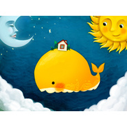

鲸鱼岛的冬天
============================

|  |  |
| :--: | :-- |
| [ 鲸鱼岛的冬天](https://emumo.xiami.com/album/1301266966) | **艺人**: [鲸鱼马戏团](../index.md) **语种**: 国语 **唱片公司**: 斑马奇技 **发行时间**: 2011年06月01日 **专辑类别**: 原声带, 影视音乐 **专辑风格**: 游戏配乐 Video Game Music, 轻音乐 Easy Listening **播放数**: 264884 **收藏数**: 372 **评论数**: 16  |

## 简介

#六·一App Store编辑推荐,当周最佳应用#  
#教育榜第一,全部总榜第九#  
大自然的神奇魔法,孩子指尖上的想象!最具交互性和趣味性的“原创”儿童教育游戏!  
斑马骑士科技公司出品,供3-7岁孩子自主学习自然百科常识的互动教育游戏。  
目前限iPad2适用哦!  
  
★原创故事梗概★  
鲸鱼岛是一个没有冬天的美丽小岛。岛上的居民从来没有经历过冰雪的冬天。小猪波波最大的愿望就是过一个白色的冬天,于是他许下了一个愿望。小朋友,月亮姐姐会教给你大自然的魔法,来帮小猪波波完成他的心愿。  
★独特产品理念★  
基于心理学和教育学的研究,斑马骑士团队探索了人类在游戏中探索、学习的方式,将天气变化等自然知识融入到游戏的操作中,让孩子在玩耍和游戏中自然而然的了解并理解关于冬天的天气、活动的知识。  
★创意交互体验★  
App Store第一款充分利用了iPad的各种交互性的游戏,创新地将触屏手势、多点触控、重力加速度、声音控制等技术有机地融入到游戏中,让孩子用有趣的方式体验各种操作,并不断探索和学习。  
★先进技术方案★  
App Store第一款基于Air for mobile和Adobe的GPU硬件加速技术Stage 3D设计和开发的绚丽儿童教育游戏。 

## 曲目

## 评论

|  |  |  |
| :-- | :-- | :-- |
|  [虾米用户](https://emumo.xiami.com/u/435393120)  2020-02-02 13:15 赞(0) 踩(0) | 
哈啊
 |
|  [虾米用户](https://emumo.xiami.com/u/337185561) 离别倒计时。无妨。 2020-01-22 00:20 赞(1) 踩(0) | 
太可爱辣- ̗̀(๑ᵔ⌔ᵔ๑)
 |
|  [虾米用户](https://emumo.xiami.com/u/428079722) 能否知行合一 2019-08-03 07:33 赞(0) 踩(0) | 
特别喜欢ฅ(˘ω˘ )ฅ
 |
|  [虾米用户](https://emumo.xiami.com/u/409245937) 行将就木 双木成林 2019-03-10 20:58 赞(0) 踩(0) | 
童话在歌唱
 |
|  [虾米用户](https://emumo.xiami.com/u/4990364) 木头 2017-03-05 09:10 赞(0) 踩(0) | 
我是一只大鲸鱼
 |
|  [虾米用户](https://emumo.xiami.com/u/247381685)  2017-02-17 09:58 赞(0) 踩(0) | 
冬天快乐 
 |
|  [虾米用户](https://emumo.xiami.com/u/49315826) 鲸鱼马戏团 2016-07-08 13:00 赞(0) 踩(0) | 
星宇为他宝宝创作的么？
 |
|  [虾米用户](https://emumo.xiami.com/u/136858038)  2016-06-23 15:20 赞(0) 踩(0) | 
好可爱！
 |
|  [虾米用户](https://emumo.xiami.com/u/2793441)   2016-01-23 14:05 赞(0) 踩(0) | 
送上一张听了会让人快乐的音乐专辑。不管在南半球还是北半球，冬天快乐
 |
|  [虾米用户](https://emumo.xiami.com/u/1429206) 愿得一间屋 2015-07-03 21:27 赞(0) 踩(0) | 
大家都是被封面吸引过来的吗，哈哈
 |
|  [虾米用户](https://emumo.xiami.com/u/1184676) 恶俗味小清新 2015-04-18 22:24 赞(0) 踩(0) | 
<a href="http://emumo.xiami.com/u/11970559" target="_blank" rel="nofollow" name_card="11970559">@海（see sea）</a> 这封面。。
 |
| ⇒ |  [虾米用户](https://emumo.xiami.com/u/11970559) 音乐有生命。 2015-04-18 22:32 赞(0) 踩(0) | 
我的女良喂！！！  是小白鲸家族的夕夕游过来了咩：D
 |
|  [虾米用户](https://emumo.xiami.com/u/2661495) 一半海水 一半火焰 2015-04-15 19:55 赞(0) 踩(0) | 

 |
|  [虾米用户](https://emumo.xiami.com/u/39902005)  2015-03-05 00:44 赞(0) 踩(0) | 
好喜欢这封面
 |
| ⇒ |  [虾米用户](https://emumo.xiami.com/u/928156)  2015-04-17 22:56 赞(0) 踩(0) | 
我也是
 |
| ⇒ |  [虾米用户](https://emumo.xiami.com/u/39902005)  2015-04-17 23:10 赞(0) 踩(0) | 
<q><b>化~说：</b></q>
 |
